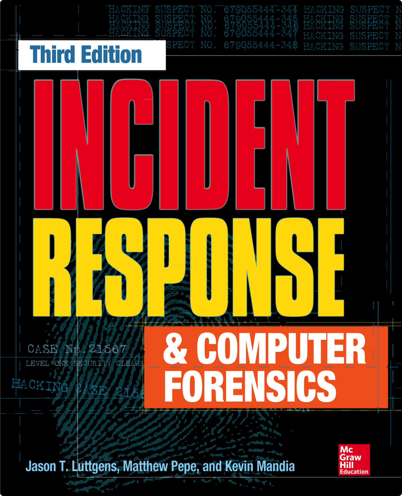

# [译] 事件响应和计算机取证

- 译者：[x7peeps](https://github.com/x7peeps) 时间：北京时间 2023-02-07
- 本书英文名：Incident Response & Computer Forensics

## 免责说明

[@x7peeps](https://github.com/x7peeps) 纯粹出于学习目的与个人兴趣翻译本书。本人承诺绝不用此译文谋取任何形式的经济利益。也坚决拒绝其他任何人以此牟利。本译文只供学习研究参考之用，不得用于商业用途。[@x7peeps](https://github.com/x7peeps) 保留对此版本译文的署名权及其它相关权利。若有人使用本译文进行侵权行为或者违反知识产权保护法的任何行为，与本译者无关。译者坚决反对此类行为。

基于开源精神，译者欢迎一切基于学习研究目的的转发，但**任何转载必须注明出处。**